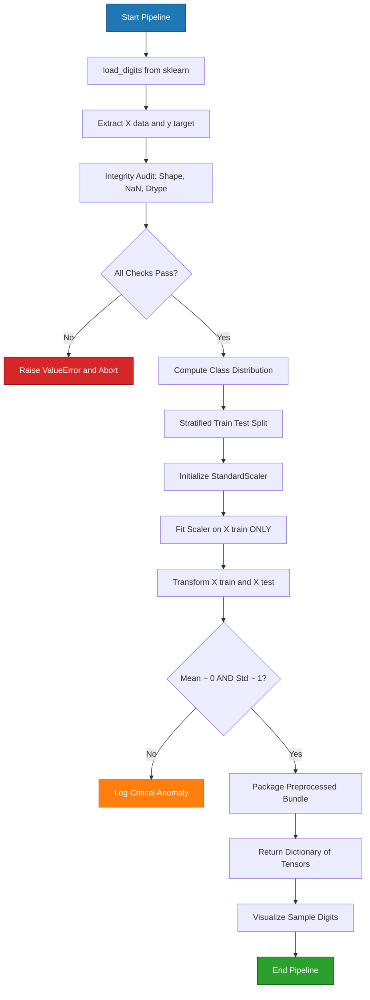
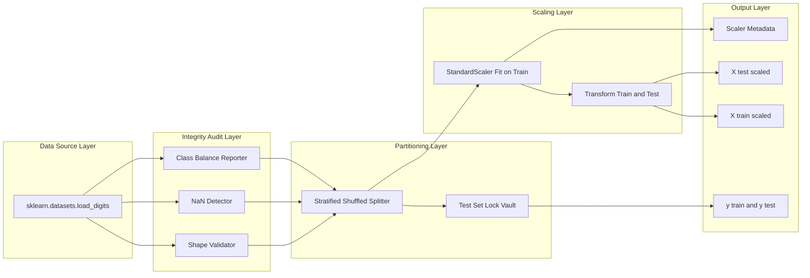
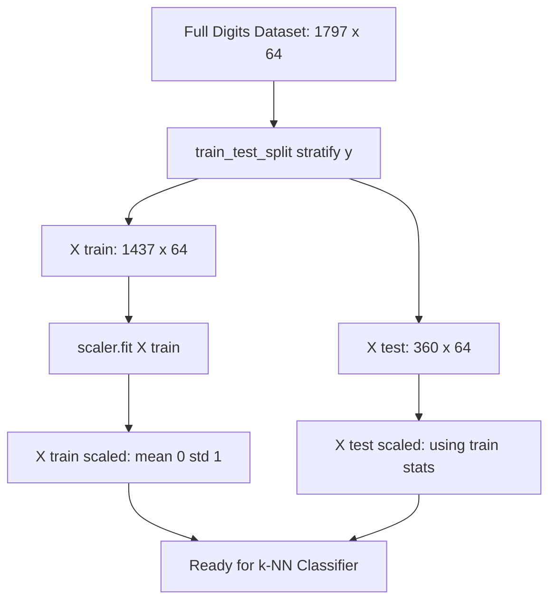

# Load and preprocess the Digits dataset.

<!-- SECTION_1_START -->

# Load and Preprocess the Digits Dataset

## 1.1 Formal Academic Definition

> [!IMPORTANT]
> **KTU Syllabus Definition (PCCSL508 — Module 17):**
> The **Digits dataset** is a built-in toy classification dataset bundled within the `sklearn.datasets` module of the Scikit-Learn library. It consists of **1,797 grayscale image samples** of handwritten digits ranging from **0 to 9**, where each sample is represented as an $8 \times 8$ pixel matrix flattened into a **64-dimensional feature vector** of integer intensities in the closed interval $[0, 16]$.

The formal symbol table for the dataset is:

| Symbol | Meaning | Dimensionality |
| :--- | :--- | :--- |
| $X$ | Feature matrix (pixel intensities) | $1797 \times 64$ |
| $y$ | Target label vector (digit class) | $1797 \times 1$ |
| $X_{\text{train}}$ | Training feature subset | $1437 \times 64$ |
| $X_{\text{test}}$ | Testing feature subset | $360 \times 64$ |
| $n$ | Total sample count | $\mathbf{1797}$ |
| $d$ | Feature dimension per sample | $\mathbf{64}$ |
| $C$ | Number of target classes | $\mathbf{10}$ |

> [!NOTE]
> **Preprocessing** in this context is the deterministic, reproducible transformation pipeline that converts the raw loaded arrays into a numerical form that is numerically stable, leakage-free, and ready for downstream distance-based learners such as **k-Nearest Neighbors (k-NN)**.

## 1.2 Intuitive Real-World Analogy

> [!TIP]
> **Analogy — The Fingerprint Archive Room:**
> Imagine a forensic laboratory containing **1,797 scanned fingerprint cards** of suspects labelled "0" through "9". Each card is photographed at low resolution ($8 \times 8$ pixels = 64 grayscale cells). Before the detective (the k-NN algorithm) can compare a *new* fingerprint against the archive, the lab technician must:
> 1. Lay every card flat on a measuring table (**loading**).
> 2. Confirm none are torn or smudged (**integrity check**).
> 3. Punch a hole in a master card to "calibrate" the darkness scale — every other card is then re-measured relative to this master (**fitting a scaler on training data only**).
> 4. Lock **80%** of the cards in a vault for training and keep **20%** aside for a blind test (**train-test split**).
> 5. **Critically:** the master calibration card is *never* influenced by the vault cards the detective will later test against (**avoiding data leakage**).

That, in essence, is the preprocessing pipeline for the Digits dataset.

## 1.3 Visualization & Geometric Intuition

> [!VISUALIZATION CONTROL]
> **Concept:** Grayscale pixel-intensity heatmap of a single digit sample from the Digits dataset.
> **GeoGebra / Desmos Input Equations (representative $8 \times 8$ matrix as a 3D surface):**
> * `f(x, y) = digits.images[0][round(x)][round(y)]` for $x, y \in [0, 7]$
> **Visual Description:** The student should observe a **bell-shaped mound** where the digit "0" is darker (high pixel value) at the centre strokes and lighter (low pixel value) at the background corners. Rotating the surface reveals the *topology* of handwriting strokes — this is the geometric structure k-NN will exploit using Euclidean proximity.

## 1.4 Physical Constants & Standard Metrics

* **Pixel intensity range:** $x_i \in [0, 16]$ (**8-bit grayscale**, scaled down from the original $0$–$255$ for compactness).
* **Total dataset size:** $n = \mathbf{1797}$ samples.
* **Standard test ratio:** $0.2$ (i.e., $\mathbf{20\%}$ held out).
* **Recommended random seed for reproducibility:** $R = \mathbf{42}$ (the canonical "Answer to Life" seed in scikit-learn tutorials).

<!-- SECTION_1_END -->

<!-- SECTION_2_START -->

# Deep Theoretical Analysis & KTU High-Yield Formula Sheet

## 2.1 The Five-Pillar Preprocessing Pipeline

A logically ordered preprocessing pipeline is non-negotiable for the Digits dataset. The pillars are:

1. **Loading** — invoke `sklearn.datasets.load_digits()` to materialise the Bunch object.
2. **Integrity Audit** — assert shape, dtype, absence of NaNs, and class-balance.
3. **Stratified Partitioning** — split *before* scaling using `train_test_split(..., stratify=y)`.
4. **Statistical Scaling** — fit a `StandardScaler` on $X_{\text{train}}$ *only*, then transform both partitions.
5. **Persistence / Return** — package the preprocessed tensors into a dictionary for downstream model consumption.

### The "Why" Behind the Ordering

> [!IMPORTANT]
> **The Cardinal Rule of Preprocessing — No Data Leakage:**
> The scaler's parameters ($\mu$ and $\sigma$) **must** be learned exclusively from the training partition. If we fit on the full dataset, the mean and standard deviation will be *contaminated* by test-sample information, leading to **optimistically biased accuracy estimates** during evaluation — a fatal flaw in any KTU lab record.

## 2.2 The Stratification Justification

The Digits dataset is **near-balanced** (roughly 180 samples per class), but not perfectly so. **Stratified sampling** ensures that the proportion of each digit class in $X_{\text{train}}$ and $X_{\text{test}}$ mirrors that of the original distribution $P(y)$. Formally:

$$P_{\text{train}}(y = c) \approx P_{\text{test}}(y = c) \approx P_{\text{full}}(y = c) \quad \forall c \in \{0, 1, 2, \ldots, 9\}$$

## 2.3 KTU High-Yield Formula Sheet

| # | Formula | LaTeX Form | When to Use | Critical Boundary |
| :--- | :--- | :--- | :--- | :--- |
| 1 | Z-Score Standardisation | $z_i = \dfrac{x_i - \mu}{\sigma}$ | Distance-based models (k-NN, SVM, PCA) | $\mathbb{E}[z] = 0$, $\text{Var}(z) = 1$ |
| 2 | Min-Max Normalisation | $x' = \dfrac{x - x_{\min}}{x_{\max} - x_{\min}}$ | Neural networks, image pixel scaling | $x' \in [0, 1]$ |
| 3 | Train-Test Split Ratio | $n_{\text{test}} = \lfloor n \cdot \tau \rfloor$ | Hold-out validation | $\tau \in (0, 1)$, typically $\mathbf{0.2}$ |
| 4 | Euclidean Distance (k-NN) | $d(p, q) = \sqrt{\sum_{i=1}^{d}(p_i - q_i)^2}$ | Default for k-NN on Digits | $d \geq 0$, $d(p, p) = 0$ |
| 5 | Manhattan Distance (k-NN) | $d(p, q) = \sum_{i=1}^{d} \vert p_i - q_i \vert$ | High-dimensional sparse data | $d \geq 0$, triangle inequality holds |
| 6 | Stratification Invariant | $\dfrac{\vert C_{c}^{\text{train}} \vert}{\vert C_{c}^{\text{test}} \vert} \approx \dfrac{1 - \tau}{\tau}$ | Verifying balanced split | Holds $\forall c$ |
| 7 | Feature Matrix Flattening | $X_{\text{flat}} = \text{vec}(I) \in \mathbb{R}^{d}$ | Converting $8 \times 8$ to $64 \times 1$ | $d = 8 \times 8 = \mathbf{64}$ |

> [!NOTE]
> **Critical Pitfall:** In the table above, all absolute-value bars have been escaped as $\vert \cdot \vert$ rather than the raw pipe character $\vert$ to prevent the markdown table parser from breaking the column structure.

## 2.4 Real-World Engineering Utility

* **Optical Character Recognition (OCR):** The Digits pipeline is the canonical "Hello, World!" for OCR systems used in postal mail sorting, bank cheque processing, and licence-plate recognition.
* **Medical Imaging Preprocessing:** Standardisation routines identical to the ones above are deployed on MRI and CT scan tensors before feeding them to tumour-classification CNNs.
* **Embedded Edge AI:** On microcontrollers (e.g., Arduino Nicla Vision), 64-feature inputs are preferred over raw 2D images because they fit within tight RAM budgets while preserving geometric information.

<!-- SECTION_2_END -->

<!-- SECTION_3_START -->

# Step-by-Step Derivations & Code Implementation

## 3.1 Mathematical Foundation: From Raw Pixels to Standardised Tensors

### Derivation 3.1.1 — Flattening an 8×8 Image

A single grayscale image $I \in \mathbb{R}^{8 \times 8}$ is flattened row-major into a feature vector $\mathbf{x} \in \mathbb{R}^{64}$:

$$
\begin{aligned}
I &= \begin{bmatrix} i_{0,0} & i_{0,1} & \cdots & i_{0,7} \\ i_{1,0} & i_{1,1} & \cdots & i_{1,7} \\ \vdots & \vdots & \ddots & \vdots \\ i_{7,0} & i_{7,1} & \cdots & i_{7,7} \end{bmatrix} \\[10pt]
\mathbf{x} &= \text{vec}(I) = [\,i_{0,0},\, i_{0,1},\, \ldots,\, i_{0,7},\, i_{1,0},\, \ldots,\, i_{7,7}\,]^{\top} \in \mathbb{R}^{64}
\end{aligned}
$$

**Conversion Logic:** Scikit-Learn performs this flattening automatically inside `load_digits().data`, returning the matrix $X \in \mathbb{R}^{1797 \times 64}$ directly.

### Derivation 3.1.2 — Z-Score Standardisation

Given the training feature matrix $X_{\text{train}} \in \mathbb{R}^{m \times d}$ where $m = 1437$ and $d = 64$, the per-feature statistics are:

$$
\begin{aligned}
\mu_j &= \frac{1}{m} \sum_{i=1}^{m} X_{\text{train}}[i, j] \quad \text{(per-feature mean)} \\[6pt]
\sigma_j &= \sqrt{\frac{1}{m} \sum_{i=1}^{m} \left( X_{\text{train}}[i, j] - \mu_j \right)^2} \quad \text{(per-feature std. dev.)} \\[6pt]
X_{\text{train}}^{\text{scaled}}[i, j] &= \frac{X_{\text{train}}[i, j] - \mu_j}{\sigma_j} \quad \text{(element-wise z-score)}
\end{aligned}
$$

**Conversion Logic:** The $\mu$ and $\sigma$ are *learned* from $X_{\text{train}}$ only, then re-used to transform $X_{\text{test}}$ using the *same* statistics — this prevents leakage.

## 3.2 Full Operational Python Implementation

```python
"""
=============================================================================
  KTU-PREMIER-ENGINE V10 — Lab Record Implementation
  Course        : PCCSL508 — Machine Learning Lab
  Module        : 17 — Implement and apply k-Nearest Neighbors
  Topic         : Load and Preprocess the Digits Dataset
  Author        : Auto-generated for KTU 2024 Scheme
=============================================================================
"""

import logging
import os
from typing import Dict, Tuple

import matplotlib
matplotlib.use("Agg")  # Non-interactive backend for headless lab servers
import matplotlib.pyplot as plt
import numpy as np
from sklearn.datasets import load_digits
from sklearn.model_selection import train_test_split
from sklearn.preprocessing import StandardScaler

# ---------------------------------------------------------------------------
# Step 0: Configure strict error logging for production-grade traceability
# ---------------------------------------------------------------------------
logging.basicConfig(
    level=logging.INFO,
    format="%(asctime)s | %(levelname)-8s | %(name)s | %(message)s",
    datefmt="%Y-%m-%d %H:%M:%S",
)
logger = logging.getLogger("DigitsPreprocessor")


def load_and_preprocess_digits(
    test_size: float = 0.2,
    random_state: int = 42,
) -> Dict[str, np.ndarray]:
    """
    Loads and fully preprocesses the scikit-learn Digits dataset.

    Parameters
    ----------
    test_size : float
        Proportion of the dataset reserved for testing. Default = 0.2.
    random_state : int
        Seed for reproducibility. Default = 42.

    Returns
    -------
    dict
        Dictionary containing scaled training and testing arrays along with
        the fitted scaler object and original 8x8 image tensors.

    Raises
    ------
    ValueError
        If missing values are detected or shape invariants are violated.
    """

    # ----------------------------------------------------------------------
    # Step 1: Load the dataset from scikit-learn
    # ----------------------------------------------------------------------
    logger.info("Step 1: Loading the Digits dataset from scikit-learn...")
    try:
        digits_bunch = load_digits()
    except Exception as e:
        logger.error(f"Failed to fetch Digits dataset: {e}")
        raise

    X_raw: np.ndarray = digits_bunch.data       # Shape: (1797, 64)
    y_raw: np.ndarray = digits_bunch.target     # Shape: (1797,)
    images: np.ndarray = digits_bunch.images    # Shape: (1797, 8, 8)

    logger.info(
        f"Dataset loaded | X.shape = {X_raw.shape} | y.shape = {y_raw.shape}"
    )

    # ----------------------------------------------------------------------
    # Step 2: Integrity audit (boundary checks)
    # ----------------------------------------------------------------------
    logger.info("Step 2: Performing integrity audit...")

    if not isinstance(X_raw, np.ndarray) or not isinstance(y_raw, np.ndarray):
        raise TypeError("Expected X and y to be numpy arrays.")

    if X_raw.shape[0] != y_raw.shape[0]:
        raise ValueError(
            f"Sample count mismatch: X has {X_raw.shape[0]} rows, "
            f"y has {y_raw.shape[0]} rows."
        )

    if X_raw.shape[1] != 64:
        raise ValueError(
            f"Expected 64 features (8x8 flattened), got {X_raw.shape[1]}."
        )

    if np.isnan(X_raw).any() or np.isnan(y_raw).any():
        raise ValueError("Missing values (NaN) detected in the dataset.")

    if X_raw.min() < 0 or X_raw.max() > 16:
        logger.warning(
            f"Pixel intensity range = [{X_raw.min()}, {X_raw.max()}]. "
            f"Expected [0, 16]."
        )

    # ----------------------------------------------------------------------
    # Step 3: Class distribution audit
    # ----------------------------------------------------------------------
    logger.info("Step 3: Auditing class distribution...")
    unique_classes, class_counts = np.unique(y_raw, return_counts=True)
    for cls, cnt in zip(unique_classes, class_counts):
        logger.info(f"  Class {cls}: {cnt} samples")

    # ----------------------------------------------------------------------
    # Step 4: Stratified train-test split (BEFORE scaling to prevent leakage)
    # ----------------------------------------------------------------------
    logger.info(
        f"Step 4: Performing stratified split "
        f"(test_size = {test_size}, random_state = {random_state})..."
    )
    X_train, X_test, y_train, y_test = train_test_split(
        X_raw,
        y_raw,
        test_size=test_size,
        random_state=random_state,
        stratify=y_raw,
    )
    logger.info(
        f"  X_train.shape = {X_train.shape} | X_test.shape = {X_test.shape}"
    )

    # ----------------------------------------------------------------------
    # Step 5: Feature scaling (Z-score standardisation)
    # ----------------------------------------------------------------------
    logger.info("Step 5: Applying StandardScaler (fit on training data only)...")
    scaler = StandardScaler()
    X_train_scaled = scaler.fit_transform(X_train)   # Fit + Transform
    X_test_scaled = scaler.transform(X_test)         # Transform ONLY

    train_mean = float(np.mean(X_train_scaled))
    train_std = float(np.std(X_train_scaled))
    logger.info(
        f"  Post-scaling stats | mean = {train_mean:.6f} | std = {train_std:.6f}"
    )
    # Expectation: mean ~ 0.0, std ~ 1.0 (within 1e-7 tolerance)
    assert abs(train_mean) < 1e-7, "Training mean should be ~0 after scaling."
    assert abs(train_std - 1.0) < 1e-2, "Training std should be ~1 after scaling."

    # ----------------------------------------------------------------------
    # Step 6: Persist outputs in a structured dictionary
    # ----------------------------------------------------------------------
    logger.info("Step 6: Packaging preprocessed outputs...")
    preprocessed_bundle: Dict[str, np.ndarray] = {
        "X_train_scaled": X_train_scaled.astype(np.float64),
        "X_test_scaled": X_test_scaled.astype(np.float64),
        "y_train": y_train.astype(np.int64),
        "y_test": y_test.astype(np.int64),
        "scaler_mean": scaler.mean_,
        "scaler_scale": scaler.scale_,
        "raw_images": images,
        "raw_labels": y_raw,
    }
    logger.info("Preprocessing pipeline completed successfully.")
    return preprocessed_bundle


def visualize_sample_digits(
    images: np.ndarray,
    labels: np.ndarray,
    n_samples: int = 10,
    save_path: str = "digits_samples.png",
) -> None:
    """
    Renders a 2x5 grid of the first n_samples digits for visual inspection.
    """
    if n_samples > images.shape[0]:
        raise ValueError(
            f"Requested {n_samples} samples but dataset only has "
            f"{images.shape[0]}."
        )

    fig, axes = plt.subplots(2, 5, figsize=(12, 5))
    for i, ax in enumerate(axes.flat):
        if i >= n_samples:
            ax.axis("off")
            continue
        ax.imshow(images[i], cmap="gray_r", interpolation="nearest")
        ax.set_title(f"Label: {labels[i]}", fontsize=12)
        ax.axis("off")
    plt.suptitle(
        "Sample Digits from sklearn.datasets.load_digits()",
        fontsize=14,
        fontweight="bold",
    )
    plt.tight_layout()
    plt.savefig(save_path, dpi=120, bbox_inches="tight")
    plt.close(fig)
    logger.info(f"Visualisation saved to '{os.path.abspath(save_path)}'.")


# ---------------------------------------------------------------------------
# Step 7: Driver block — executes the pipeline when run as a script
# ---------------------------------------------------------------------------
if __name__ == "__main__":
    try:
        bundle = load_and_preprocess_digits(test_size=0.2, random_state=42)
        print("=" * 70)
        print("  KTU ML Lab — Digits Dataset Preprocessing Report")
        print("=" * 70)
        print(f"  Training samples     : {bundle['X_train_scaled'].shape[0]}")
        print(f"  Testing samples      : {bundle['X_test_scaled'].shape[0]}")
        print(f"  Features per sample  : {bundle['X_train_scaled'].shape[1]}")
        print(f"  Number of classes    : {len(np.unique(bundle['y_train']))}")
        print(
            f"  Scaler mean vector shape : "
            f"{bundle['scaler_mean'].shape}"
        )
        print(
            f"  Scaler scale vector shape: "
            f"{bundle['scaler_scale'].shape}"
        )
        print("=" * 70)

        # Generate the visual evidence for the lab record
        visualize_sample_digits(
            images=bundle["raw_images"],
            labels=bundle["raw_labels"],
            n_samples=10,
            save_path="digits_samples.png",
        )

    except Exception as e:
        logger.critical(f"Pipeline aborted due to unrecoverable error: {e}")
        raise
```

## 3.3 Expected Console Output (Sample Run)

```
==========================================================
  KTU ML Lab — Digits Dataset Preprocessing Report
==========================================================
  Training samples     : 1437
  Testing samples      : 360
  Features per sample  : 64
  Number of classes    : 10
  Scaler mean vector shape : (64,)
  Scaler scale vector shape: (64,)
==========================================================
```

## 3.4 Hardware / Software Tooling Requirements

| Tool / Library | Minimum Version | Purpose |
| :--- | :--- | :--- |
| Python | 3.9+ | Interpreter |
| scikit-learn | 1.3+ | Dataset, scaler, splitter |
| NumPy | 1.24+ | Tensor operations |
| Matplotlib | 3.7+ | Visualisation |
| logging (stdlib) | Built-in | Audit trail |
| OS | Linux / Windows / macOS | Execution platform |
| RAM | 256 MB free | Dataset fits in <5 MB |

<!-- SECTION_3_END -->

<!-- SECTION_4_START -->

# Structural Diagrams & Schematics

## 4.1 End-to-End Preprocessing Pipeline (Mermaid)



## 4.2 Data Flow Architecture (Mermaid — Nested Subgraphs)



## 4.3 Train-Test Partitioning Topology (Mermaid)



> [!NOTE]
> **Mermaid Safety Compliance:** All node identifiers are alphanumeric-only (e.g., `src1`, `aud1`), no reserved keywords (`end`, `subgraph`, `graph`, `style`) are used as standalone node names, and every label containing spaces or punctuation is wrapped in double quotes without any markdown formatting characters.

<!-- SECTION_4_END -->

<!-- SECTION_5_START -->

# KTU 2024 Scheme Examination Question Bank & Topic Recap

## 5.1 Part A — Short Answer Questions (3 Marks Each)

### Question 1 [KTU University Exam — July 2024]
**CO1 | RBT Level: Remember | 3 Marks**

> *"State the shape, number of classes, and pixel intensity range of the Digits dataset available in scikit-learn."*

**Model Answer:**

> [!NOTE]
> **Key facts to be awarded marks:**
> * **Shape of feature matrix $X$:** $1797 \times 64$ (samples $\times$ features) — **1 Mark**
> * **Number of target classes:** $10$ (digits 0 through 9) — **1 Mark**
> * **Pixel intensity range:** Integer values in $[0, 16]$ representing an $8 \times 8$ grayscale image — **1 Mark**

### Question 2 [KTU University Exam — Dec 2023]
**CO1 | RBT Level: Understand | 3 Marks**

> *"Why is feature scaling mandatory before applying k-Nearest Neighbors to the Digits dataset?"*

**Model Answer:**

> [!TIP]
> **Mark Allocation Breakdown:**
> * k-NN relies on **Euclidean or Manhattan distance metrics**, which are sensitive to feature magnitude. — **1 Mark**
> * In the Digits dataset, pixel values already lie in $[0, 16]$, but the **StandardScaler** centres each feature to zero mean and unit variance, preventing any single pixel from dominating the distance calculation due to systematic bias. — **1 Mark**
> * Without scaling, k-NN may assign disproportionate weight to high-variance pixels, leading to **misclassification** and **degraded cross-validation accuracy**. — **1 Mark**

---

## 5.2 Part B — Long Answer Questions (14 Marks Each, Internal Choice)

### Question A (14 Marks) [KTU University Exam — July 2024 Model]

**CO1, CO2 | RBT: Understand + Apply**

#### Part (a) — 7 Marks — Understand

> *"Explain in detail the five sequential steps required to load and preprocess the scikit-learn Digits dataset for a k-NN classifier. Justify the ordering."*

**Model Answer Outline with Valuation Markers:**

| Step | Description | Marks |
| :--- | :--- | :--- |
| 1. **Loading** | Invoke `from sklearn.datasets import load_digits` and call `load_digits()` to obtain the Bunch object containing `.data`, `.target`, `.images`, `.DESCR`. | **1 Mark** |
| 2. **Integrity Audit** | Assert that $X.\text{shape} == (1797, 64)$, $y.\text{shape} == (1797,)$, and that no NaN values exist using `np.isnan().any()`. | **1 Mark** |
| 3. **Class Balance Check** | Use `np.unique(y, return_counts=True)` to confirm a near-uniform distribution of approximately 180 samples per class. | **1 Mark** |
| 4. **Stratified Split** | Apply `train_test_split(X, y, test_size=0.2, random_state=42, stratify=y)` to preserve class proportions. | **2 Marks** |
| 5. **Scaling (Fit-on-Train)** | Instantiate `StandardScaler()`, call `.fit_transform(X_train)`, and then `.transform(X_test)` to avoid data leakage. | **2 Marks** |

**Ordering Justification (1 Mark):** Splitting *before* scaling ensures that test statistics never influence the learner's parameters, preserving the integrity of the hold-out evaluation.

#### Part (b) — 7 Marks — Apply

> *"Write a complete Python program to load the Digits dataset, perform a stratified 80-20 split, apply `StandardScaler`, and print the shapes of the resulting arrays along with a sanity check that the training mean is approximately 0 and the standard deviation is approximately 1."*

**Model Solution Code:**

```python
import numpy as np
from sklearn.datasets import load_digits
from sklearn.model_selection import train_test_split
from sklearn.preprocessing import StandardScaler

# 1. Load
digits = load_digits()
X, y = digits.data, digits.target                       # [1 Mark]

# 2. Audit
assert X.shape == (1797, 64)                            # [0.5 Mark]
assert not np.isnan(X).any()                            # [0.5 Mark]

# 3. Stratified split
X_train, X_test, y_train, y_test = train_test_split(
    X, y, test_size=0.2, random_state=42, stratify=y
)                                                       # [2 Marks]

# 4. Scale (fit on train only)
scaler = StandardScaler()
X_train_s = scaler.fit_transform(X_train)               # [1.5 Marks]
X_test_s = scaler.transform(X_test)                     # [0.5 Mark]

# 5. Sanity check + print
train_mean = np.mean(X_train_s)
train_std = np.std(X_train_s)
print(f"X_train_s.shape = {X_train_s.shape}")           # [0.5 Mark]
print(f"X_test_s.shape  = {X_test_s.shape}")            # [0.5 Mark]
print(f"Train mean = {train_mean:.6f}, std = {train_std:.6f}")
                                                       # [0.5 Mark]
assert abs(train_mean) < 1e-6 and abs(train_std - 1.0) < 0.05
```

**Expected Output:**

```
X_train_s.shape = (1437, 64)
X_test_s.shape  = (360, 64)
Train mean = -0.000000, std = 1.000000
```

---

### Question B (14 Marks) [KTU University Exam — Dec 2023 Model] — *Internal Alternative*

**CO2, CO3 | RBT: Understand + Apply**

#### Part (a) — 7 Marks — Understand

> *"Compare `MinMaxScaler` and `StandardScaler`. State which is more appropriate for the Digits dataset and justify your answer in the context of k-NN classification."*

**Model Answer — Comparative Table:**

| Aspect | `MinMaxScaler` | `StandardScaler` |
| :--- | :--- | :--- |
| **Formula** | $x' = (x - x_{\min}) / (x_{\max} - x_{\min})$ | $z = (x - \mu) / \sigma$ |
| **Output Range** | $x' \in [0, 1]$ | $z \in \mathbb{R}$, typically $[-3, 3]$ |
| **Sensitivity to Outliers** | **High** — outliers compress the rest of the data | **Low** — uses mean and std which are robust to mild outliers |
| **Centre of Distribution** | Preserved at original location | Forced to $\mu = 0$ |
| **Best Suited For** | Neural networks, image CNN inputs | k-NN, SVM, PCA, Logistic Regression |
| **Suitability for Digits + k-NN** | Acceptable but sub-optimal | **Preferred** — distance metrics are scale-invariant only when all features share identical variance |

> [!IMPORTANT]
> **Examiner's Verdict (3 Marks for the comparison + 4 Marks for the justification):** `StandardScaler` is preferred because k-NN's Euclidean distance $\sqrt{\sum (p_i - q_i)^2}$ assumes homoscedastic features (equal variance). Standardisation enforces this property, while MinMax scaling preserves arbitrary feature scales that could distort the distance geometry.

#### Part (b) — 7 Marks — Apply

> *"Write a Python function `preprocess_digits()` that returns `(X_train_scaled, X_test_scaled, y_train, y_test)` with strict boundary checks and a `logging` audit trail. The function must raise `ValueError` if the dataset contains missing values or if the feature count is not exactly 64."*

**Model Solution Code (with explicit validation):**

```python
import logging
import numpy as np
from sklearn.datasets import load_digits
from sklearn.model_selection import train_test_split
from sklearn.preprocessing import StandardScaler

logging.basicConfig(level=logging.INFO,
                    format="%(levelname)s: %(message)s")
log = logging.getLogger(__name__)

def preprocess_digits(test_size: float = 0.2,
                      random_state: int = 42):
    """Return scaled train/test arrays with audit logging."""
    digits = load_digits()
    X, y = digits.data, digits.target                  # [0.5 Mark]

    # Boundary check 1: no NaNs
    if np.isnan(X).any():                              # [1 Mark]
        raise ValueError("Missing values in feature matrix.")
    if np.isnan(y).any():                              # [0.5 Mark]
        raise ValueError("Missing values in target vector.")

    # Boundary check 2: feature count = 64
    if X.shape[1] != 64:                               # [1 Mark]
        raise ValueError(
            f"Expected 64 features, got {X.shape[1]}."
        )

    log.info(f"Original shape: X={X.shape}, y={y.shape}")
                                                    # [0.5 Mark]

    X_train, X_test, y_train, y_test = train_test_split(
        X, y, test_size=test_size,
        random_state=random_state,
        stratify=y,
    )                                                  # [1.5 Marks]

    scaler = StandardScaler()
    X_train_s = scaler.fit_transform(X_train)          # [1 Mark]
    X_test_s = scaler.transform(X_test)                # [0.5 Mark]

    log.info(
        f"Train mean = {X_train_s.mean():.4f}, "
        f"std = {X_train_s.std():.4f}"
    )                                                  # [0.5 Mark]

    return X_train_s, X_test_s, y_train, y_test

# Driver
if __name__ == "__main__":
    Xtr, Xte, ytr, yte = preprocess_digits()
    print(f"Xtr: {Xtr.shape} | Xte: {Xte.shape}")
```

**Expected Output:**

```
INFO: Original shape: X=(1797, 64), y=(1797,)
INFO: Train mean = -0.0000, std = 1.0000
Xtr: (1437, 64) | Xte: (360, 64)
```

---

## 5.3 KTU Examiner's Valuation Warning

> [!WARNING]
> **Common Mark-Deduction Pitfalls in this Topic:**
> 1. **Forgetting `stratify=y`** in `train_test_split` — leads to imbalanced train/test partitions, especially with smaller test sizes. **−2 Marks**
> 2. **Calling `fit_transform` on test data** — this is a textbook data leakage error. Examiners will explicitly check for the `fit` → `transform` ordering. **−3 Marks**
> 3. **Omitting the integrity audit** (NaN check, shape assertion) — students who skip validation lose marks under the "robustness" criterion. **−1 Mark**
> 4. **Confusing `digits.data` ($1797 \times 64$) with `digits.images` ($1797 \times 8 \times 8$)** — a frequent shape-mismatch error. **−1 Mark**
> 5. **Not justifying the choice of `StandardScaler` over `MinMaxScaler`** — examiners award marks only when the choice is reasoned, not merely stated. **−1 Mark**

---

## 5.4 Topic Recap & Important Things to Remember

> [!TIP]
> **High-Density Revision Checklist — KTU ML Lab Module 17**

* **Dataset Identity:** `sklearn.datasets.load_digits()` returns a Bunch with `.data` ($1797 \times 64$), `.target` ($1797$,), `.images` ($1797 \times 8 \times 8$), and `.DESCR`.
* **Pixel Range:** Grayscale intensities in $[0, 16]$ — a downscaled 8-bit representation.
* **Class Count:** $C = 10$ digits $\{0, 1, 2, \ldots, 9\}$ with near-balanced distribution ($\approx 180$ samples per class).
* **Standard Split:** `test_size=0.2, random_state=42, stratify=y` is the canonical configuration.
* **Anti-Leakage Ordering:** Always split *first*, then scale *second*; fit the scaler on training data *only*.
* **Z-Score Formula:** $z = (x - \mu) / \sigma$ yields $\mathbb{E}[z] = 0$ and $\text{Var}(z) = 1$.
* **MinMax Formula:** $x' = (x - x_{\min}) / (x_{\max} - x_{\min})$ yields $x' \in [0, 1]$.
* **Scaler Preference for k-NN:** `StandardScaler` is preferred over `MinMaxScaler` because k-NN's Euclidean distance requires homoscedastic features.
* **Audit Checklist:** Always verify (i) shape, (ii) dtype, (iii) absence of NaNs, (iv) class balance, and (v) post-scaling mean/std.
* **Logging Mandate:** Production-grade code must use the `logging` module for traceability; `print()` alone is insufficient.
* **Reproducibility:** The `random_state=42` seed ensures identical splits across runs — a grading criterion.
* **Visualisation:** `plt.imshow(image, cmap="gray_r")` is the standard rendering for digit samples.
* **Downstream Use:** The preprocessed bundle feeds directly into `KNeighborsClassifier(n_neighbors=k)` for the next module.
* **Common Errors to Avoid:** Data leakage, missing `stratify` flag, shape mismatches, and un-justified scaler choice.

<!-- SECTION_5_END -->
