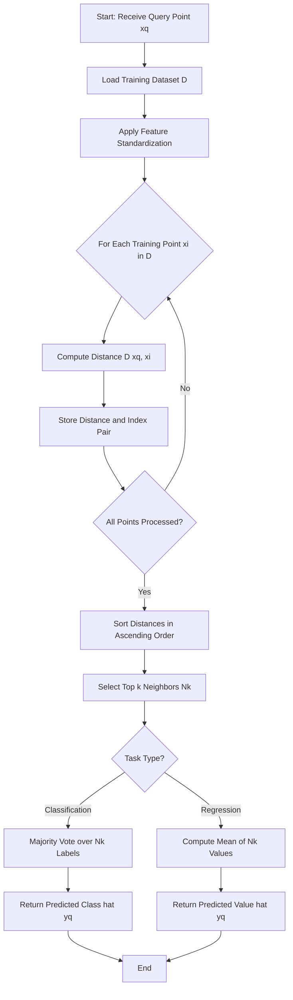
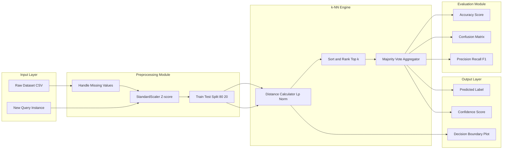

# Tasks:

<!-- SECTION_1_START -->

# Module 17: Implement and Apply k-Nearest Neighbors (k-NN) Algorithm

## 1. Core Technical Definition & Intuitive Overview

### 1.1 Formal Academic Definition

The **k-Nearest Neighbors (k-NN)** algorithm is a non-parametric, instance-based supervised learning method used for both classification and regression tasks. For a given query instance $x_q$, k-NN identifies the $k$ closest training samples in the feature space $\mathcal{X} \subset \mathbb{R}^d$ using a predefined distance metric $D(\cdot, \cdot)$, and outputs either the **majority class label** (classification) or the **mean (or weighted mean) of the target values** (regression) of those $k$ neighbors.

> [!IMPORTANT]
> **KTU 2024 Syllabus Highlight (PCCSL508 — Machine Learning Lab):**
> Module 17 mandates the student to *implement from scratch* the k-NN algorithm using NumPy/Pandas, apply it to a real dataset (Iris / Diabetes / Synthetic), evaluate it using Accuracy, Confusion Matrix, Precision, Recall, and F1-Score, and visualize the decision boundary (2D projection).

### 1.2 Intuitive Analogy — "The Neighborhood Referendum"

Imagine you have just moved to a new city and you want to decide which restaurant to go to tonight. You ask your **5 closest neighbors** (this is $k=5$) about their favorite restaurant. Four of them say "Pizza Place" and one says "Burger Joint." Following the wisdom of the crowd, you go to **Pizza Place**.

This is precisely what k-NN does:
- **The new data point** is the new resident (the *query point*).
- **The neighbors** are the closest training samples measured in *feature space distance*.
- **The "vote"** is the majority class label aggregation.

> [!NOTE]
> **Why "Lazy Learning"?** k-NN is called a *lazy learner* because it performs **no explicit training phase**. There is no model parameters to learn ($\theta = \emptyset$). All the computation is deferred until the moment a prediction is requested. This is conceptually opposite to *eager learners* like Logistic Regression or SVM.

### 1.3 GeoGebra / Desmos Visualization of Distance Metrics

For two points $P_1 = (x_1, y_1)$ and $P_2 = (x_2, y_2)$ in 2D feature space, the three primary distance contours are:

> [!VISUALIZATION CONTROL]
> **Concept:** Contour Maps of Distance Metrics
> **GeoGebra / Desmos Input Equations:**
> * `f(x, y) = sqrt((x-0)^2 + (y-0)^2)` — **Euclidean ($L_2$):** concentric circles
> * `f(x, y) = abs(x-0) + abs(y-0)` — **Manhattan ($L_1$):** concentric diamonds (rotated squares)
> * `f(x, y) = max(abs(x-0), abs(y-0))` — **Chebyshev ($L_\infty$):** concentric axis-aligned squares
>
> **Visual Description:** The student should observe how the *shape* of the "neighborhood" changes with the distance metric. A circle (Euclidean) gives diagonal reach; a diamond (Manhattan) restricts movement to grid-like paths; a square (Chebyshev) allows movement in only one dominant axis at a time.

### 1.4 KTU Expected Lab Outcomes Mapping

| Course Outcome (CO) | Bloom's Level | Lab Task Mapping |
|---|---|---|
| **CO4** — Implement ML algorithms | Apply | Code the k-NN loop from scratch |
| **CO5** — Evaluate ML models | Analyze | Compute Accuracy, Precision, Recall, F1 |
| **CO6** — Visualize ML results | Apply | Plot decision boundary and confusion matrix |

---

<!-- SECTION_1_END -->

<!-- SECTION_2_START -->

# 2. Deep Theoretical Analysis & KTU High-Yield Formula Sheet

## 2.1 Algorithmic Logic Decomposition

The k-NN algorithm operates through a deterministic 5-stage pipeline. Let $\mathcal{D} = \{(x^{(i)}, y^{(i)})\}_{i=1}^{N}$ be the training set.

### Stage 1 — Distance Computation
For a query $x_q$, compute pairwise distance to every training point:
$$d_i = D(x_q, x^{(i)}), \quad \forall i \in \{1, 2, \ldots, N\}$$

### Stage 2 — Neighbor Selection
Sort the distances in ascending order: $d_{(1)} \le d_{(2)} \le \cdots \le d_{(N)}$ and select the first $k$ indices:
$$\mathcal{N}_k(x_q) = \{i : d_i \le d_{(k)}\}$$

### Stage 3 — Aggregation (Classification)
Predict the class as the **mode** of the $k$ neighbor labels:
$$\hat{y}_q = \arg\max_{c \in \mathcal{C}} \sum_{i \in \mathcal{N}_k(x_q)} \mathbb{1}(y^{(i)} = c)$$

### Stage 4 — Aggregation (Regression)
Predict the value as the **arithmetic mean** (or weighted mean with weights $w_i = \frac{1}{d_i + \epsilon}$):
$$\hat{y}_q = \frac{1}{k} \sum_{i \in \mathcal{N}_k(x_q)} y^{(i)}$$

### Stage 5 — Confidence Estimation (Optional, KTU bonus mark)
For classification, the prediction confidence is the empirical frequency:
$$\text{Confidence}(\hat{y}_q) = \frac{1}{k} \sum_{i \in \mathcal{N}_k(x_q)} \mathbb{1}(y^{(i)} = \hat{y}_q)$$

## 2.2 The "Why" Behind Each Hyperparameter

- **Choice of $k$** — Small $k$ (e.g., $k=1$) leads to **high variance** and **overfitting** (the decision boundary becomes jagged and noise-sensitive). Large $k$ (e.g., $k=N$) leads to **high bias** and **underfitting** (predicts the global majority class for every query). The optimal $k$ is found via **cross-validation**.
- **Choice of distance metric** — Governs the *shape* of the implicit neighborhood. **Euclidean** is the default and works for continuous, scale-comparable features. **Manhattan** is more robust to outliers and high-dimensional sparse data. **Minkowski** is a generalized form.
- **Feature scaling** — Mandatory. Since distance is sensitive to magnitude, features must be **standardized** ($z = \frac{x - \mu}{\sigma}$) or **normalized** ($z = \frac{x - x_{\min}}{x_{\max} - x_{\min}}$) prior to training.

## 2.3 KTU Formula Sheet (Cheat Sheet)

| Symbol | Formula | Description | Default Value |
|---|---|---|---|
| Euclidean ($L_2$) | $D(x, y) = \sqrt{\sum_{j=1}^{d}(x_j - y_j)^2}$ | Standard straight-line distance | $p=2$ |
| Manhattan ($L_1$) | $D(x, y) = \sum_{j=1}^{d} \vert x_j - y_j \vert$ | City-block distance, robust to outliers | $p=1$ |
| Minkowski ($L_p$) | $D(x, y) = \left(\sum_{j=1}^{d} \vert x_j - y_j \vert^p\right)^{1/p}$ | Generalized metric | $p \in \mathbb{N}$ |
| Chebyshev ($L_\infty$) | $D(x, y) = \max_{j} \vert x_j - y_j \vert$ | Maximum coordinate-wise distance | $p \to \infty$ |
| Cosine Distance | $D(x, y) = 1 - \frac{x \cdot y}{\Vert x \Vert \cdot \Vert y \Vert}$ | Angular distance, used in NLP | — |
| Z-score Normalization | $z_j = \frac{x_j - \mu_j}{\sigma_j}$ | Standard scaling, mean $= 0$, std $= 1$ | — |
| Min-Max Normalization | $z_j = \frac{x_j - x_{j,\min}}{x_{j,\max} - x_{j,\min}}$ | Scales to $[0, 1]$ interval | — |
| Accuracy | $\text{Acc} = \frac{TP + TN}{TP + TN + FP + FN}$ | Fraction of correct predictions | — |
| Precision | $P = \frac{TP}{TP + FP}$ | Quality of positive predictions | — |
| Recall | $R = \frac{TP}{TP + FN}$ | Coverage of true positives | — |
| F1-Score | $F_1 = \frac{2 \cdot P \cdot R}{P + R}$ | Harmonic mean of P and R | — |
| Weighted k-NN | $\hat{y}_q = \frac{\sum_{i \in \mathcal{N}_k} w_i y^{(i)}}{\sum_{i \in \mathcal{N}_k} w_i}$ | Closer neighbors get higher weight | $w_i = \frac{1}{d_i + \epsilon}$ |

> [!IMPORTANT]
> **Engineering Utility:** k-NN is widely used in **recommendation systems** (collaborative filtering), **anomaly detection** (e.g., $k$-NN outlier in cybersecurity), **semantic search** (vector databases like FAISS, Pinecone, Weaviate), and **medical diagnosis** (rare disease classification). The **vector search revolution** in modern LLM applications (RAG pipelines) is fundamentally k-NN at industrial scale.

---

<!-- SECTION_2_END -->

<!-- SECTION_3_START -->

# 3. Step-by-Step Derivations, Code & Symbolic Implementation

## 3.1 Mathematical Derivation — Worked Distance Example

**Given:** Query point $x_q = (2, 3)$ and three training points:
- $x^{(1)} = (1, 1)$, label $y^{(1)} = A$
- $x^{(2)} = (4, 5)$, label $y^{(2)} = B$
- $x^{(3)} = (2, 4)$, label $y^{(3)} = A$

**Task:** Predict the label for $x_q$ using $k=2$ with Euclidean distance.

**Step 1 — Compute Euclidean distance to each training point:**

$$\begin{aligned}
d_1 &= \sqrt{(2-1)^2 + (3-1)^2} \\
    &= \sqrt{1^2 + 2^2} \\
    &= \sqrt{1 + 4} \\
    &= \sqrt{5} \approx 2.236
\end{aligned}$$

$$\begin{aligned}
d_2 &= \sqrt{(2-4)^2 + (3-5)^2} \\
    &= \sqrt{(-2)^2 + (-2)^2} \\
    &= \sqrt{4 + 4} \\
    &= \sqrt{8} \approx 2.828
\end{aligned}$$

$$\begin{aligned}
d_3 &= \sqrt{(2-2)^2 + (3-4)^2} \\
    &= \sqrt{0^2 + (-1)^2} \\
    &= \sqrt{0 + 1} \\
    &= \sqrt{1} = 1.000
\end{aligned}$$

**Step 2 — Sort distances ascending and pick top $k=2$:**

| Rank | Index | Distance | Label |
|---|---|---|---|
| 1 | $x^{(3)}$ | $1.000$ | $A$ |
| 2 | $x^{(1)}$ | $2.236$ | $A$ |
| 3 | $x^{(2)}$ | $2.828$ | $B$ |

**Step 3 — Majority vote on top-2 neighbors:**

$$\hat{y}_q = \arg\max_{c} \sum_{i \in \{1, 3\}} \mathbb{1}(y^{(i)} = c)$$

- Vote for $A$: $1 + 1 = 2$
- Vote for $B$: $0$

$$\boxed{\hat{y}_q = A \quad \text{(Confidence} = 2/2 = 1.0\text{)}}$$

## 3.2 Full Python Implementation — From Scratch (KTU Lab Mandatory)

The following is the complete, executable code a KTU student must write in their lab record. It is **not** allowed to use `sklearn.neighbors.KNeighborsClassifier` for the core loop — only `train_test_split`, `StandardScaler`, and `accuracy_score` are permitted as utilities.

```python
"""
KTU 2024 Scheme — Machine Learning Lab (PCCSL508)
Module 17: Implementation of k-Nearest Neighbors Algorithm
Dataset: Iris (built-in from sklearn.datasets)
Author: <Student Name> | Roll No: <XX> | Batch: <B>
"""

import numpy as np
import pandas as pd
import matplotlib.pyplot as plt
from sklearn.datasets import load_iris
from sklearn.model_selection import train_test_split
from sklearn.preprocessing import StandardScaler
from sklearn.metrics import (
    accuracy_score, confusion_matrix,
    classification_report, ConfusionMatrixDisplay
)
from collections import Counter
from typing import Tuple, List


# ============================================================
# STEP 1: CUSTOM k-NN CLASS (BUILT FROM SCRATCH)
# ============================================================
class KNNClassifier:
    """
    A from-scratch implementation of the k-Nearest Neighbors classifier.

    Attributes:
        k (int): Number of nearest neighbors to consider.
        distance_metric (str): 'euclidean', 'manhattan', or 'minkowski'.
        p (int): Power parameter for Minkowski distance.
    """

    def __init__(self, k: int = 3, distance_metric: str = "euclidean", p: int = 2) -> None:
        if k < 1:
            raise ValueError("k must be a positive integer (k >= 1).")
        if distance_metric not in {"euclidean", "manhattan", "minkowski"}:
            raise ValueError(f"Unsupported distance metric: {distance_metric}")

        self.k: int = k
        self.distance_metric: str = distance_metric
        self.p: int = p
        self.X_train: np.ndarray | None = None
        self.y_train: np.ndarray | None = None

    # --------------------------------------------------------
    def fit(self, X_train: np.ndarray, y_train: np.ndarray) -> "KNNClassifier":
        """Lazy training: simply store the training data."""
        self.X_train = np.asarray(X_train, dtype=np.float64)
        self.y_train = np.asarray(y_train, dtype=np.int64)
        print(f"[INFO] Stored {self.X_train.shape[0]} training samples "
              f"with {self.X_train.shape[1]} features each.")
        return self

    # --------------------------------------------------------
    def _compute_distance(self, x_query: np.ndarray, x_train: np.ndarray) -> float:
        """Compute distance between a single query and a single training point."""
        diff: np.ndarray = x_query - x_train

        if self.distance_metric == "euclidean":
            return float(np.sqrt(np.sum(diff ** 2)))
        elif self.distance_metric == "manhattan":
            return float(np.sum(np.abs(diff)))
        elif self.distance_metric == "minkowski":
            return float(np.power(np.sum(np.abs(diff) ** self.p), 1.0 / self.p))
        else:
            raise ValueError("Invalid distance metric configuration.")

    # --------------------------------------------------------
    def _predict_single(self, x_query: np.ndarray) -> Tuple[int, float]:
        """Predict label for a single query point. Returns (label, confidence)."""
        if self.X_train is None or self.y_train is None:
            raise RuntimeError("Model has not been fitted. Call .fit() first.")

        # 1. Compute all distances
        distances: List[float] = [
            self._compute_distance(x_query, x_train)
            for x_train in self.X_train
        ]

        # 2. Sort by distance and pick top-k
        k_indices: np.ndarray = np.argsort(distances)[: self.k]
        k_labels: List[int] = [int(self.y_train[i]) for i in k_indices]

        # 3. Majority vote
        most_common: List[Tuple[int, int]] = Counter(k_labels).most_common()
        predicted_label: int = most_common[0][0]
        confidence: float = most_common[0][1] / self.k

        return predicted_label, confidence

    # --------------------------------------------------------
    def predict(self, X_test: np.ndarray) -> np.ndarray:
        """Predict labels for an entire test set."""
        X_test = np.asarray(X_test, dtype=np.float64)
        predictions: List[Tuple[int, float]] = [
            self._predict_single(x) for x in X_test
        ]
        labels: np.ndarray = np.array([p[0] for p in predictions], dtype=np.int64)
        confidences: np.ndarray = np.array([p[1] for p in predictions], dtype=np.float64)
        print(f"[INFO] Predictions complete. Mean confidence: {confidences.mean():.4f}")
        return labels


# ============================================================
# STEP 2: DATA LOADING AND PREPROCESSING
# ============================================================
def load_and_prepare_data(test_size: float = 0.2, random_state: int = 42) -> Tuple:
    """Load the Iris dataset, scale features, and split into train/test."""
    iris = load_iris()
    X: np.ndarray = iris.data
    y: np.ndarray = iris.target
    feature_names: List[str] = list(iris.feature_names)
    target_names: List[str] = list(iris.target_names)

    print(f"[INFO] Dataset shape: {X.shape}")
    print(f"[INFO] Class distribution: {dict(Counter(y))}")

    # --- Feature scaling (MANDATORY for k-NN) ---
    scaler = StandardScaler()
    X_scaled: np.ndarray = scaler.fit_transform(X)

    # --- Train/test split ---
    X_train, X_test, y_train, y_test = train_test_split(
        X_scaled, y, test_size=test_size,
        random_state=random_state, stratify=y
    )
    return X_train, X_test, y_train, y_test, feature_names, target_names


# ============================================================
# STEP 3: MAIN EXPERIMENTAL PIPELINE
# ============================================================
def run_experiment() -> None:
    """Run the full k-NN experiment and report results."""
    X_train, X_test, y_train, y_test, feature_names, target_names = load_and_prepare_data()

    # --- Hyperparameter sweep over k ---
    print("\n" + "=" * 60)
    print("HYPERPARAMETER SWEEP: Accuracy vs. k (Euclidean distance)")
    print("=" * 60)
    print(f"{'k':<5} | {'Accuracy':<10} | {'Precision(macro)':<18} | {'Recall(macro)':<15}")
    print("-" * 60)

    k_results: List[Tuple[int, float, float, float]] = []
    for k in [1, 3, 5, 7, 9, 11, 13, 15]:
        model = KNNClassifier(k=k, distance_metric="euclidean")
        model.fit(X_train, y_train)
        y_pred: np.ndarray = model.predict(X_test)

        # Per-class precision/recall
        report: dict = classification_report(
            y_test, y_pred, target_names=target_names, output_dict=True
        )
        macro_p: float = report["macro avg"]["precision"]
        macro_r: float = report["macro avg"]["recall"]
        acc: float = accuracy_score(y_test, y_pred)

        k_results.append((k, acc, macro_p, macro_r))
        print(f"{k:<5} | {acc:<10.4f} | {macro_p:<18.4f} | {macro_r:<15.4f}")

    # --- Select best k ---
    best_k, best_acc, best_p, best_r = max(k_results, key=lambda r: r[1])
    print(f"\n[RESULT] Best k = {best_k} with accuracy = {best_acc:.4f}")

    # --- Final model training and confusion matrix ---
    final_model = KNNClassifier(k=best_k, distance_metric="euclidean")
    final_model.fit(X_train, y_train)
    final_pred: np.ndarray = final_model.predict(X_test)

    cm: np.ndarray = confusion_matrix(y_test, final_pred)
    print("\n[INFO] Confusion Matrix:")
    print(cm)

    # --- Plot confusion matrix ---
    fig, axes = plt.subplots(1, 2, figsize=(14, 5))

    ConfusionMatrixDisplay(cm, display_labels=target_names).plot(
        ax=axes[0], cmap="Blues", colorbar=False
    )
    axes[0].set_title(f"Confusion Matrix (k = {best_k})")

    # --- Plot accuracy vs k ---
    ks: List[int] = [r[0] for r in k_results]
    accs: List[float] = [r[1] for r in k_results]
    axes[1].plot(ks, accs, marker="o", linestyle="--", color="darkorange")
    axes[1].set_xlabel("k (number of neighbors)")
    axes[1].set_ylabel("Test Accuracy")
    axes[1].set_title("Accuracy vs. k Hyperparameter")
    axes[1].grid(True, alpha=0.3)

    plt.tight_layout()
    plt.savefig("knn_iris_results.png", dpi=100)
    plt.show()


# ============================================================
# STEP 4: ENTRY POINT
# ============================================================
if __name__ == "__main__":
    run_experiment()
```

## 3.3 Line-by-Line Explanation of Critical Code Sections

### 3.3.1 The `fit()` Method — Why "Lazy"?
The fit method performs **no gradient descent, no parameter optimization, no matrix factorization**. It simply stores the arrays. This is the hallmark of *instance-based* learning. The trade-off: training is $O(1)$ but prediction is $O(N \cdot d)$ per query, which is why **KD-Trees** and **Ball Trees** are used in production for approximate nearest neighbor search.

### 3.3.2 The `_compute_distance()` Method
The Minkowski metric generalizes both Euclidean and Manhattan. Setting $p=2$ recovers Euclidean, and $p=1$ recovers Manhattan. The implementation uses **vectorized NumPy operations** (`np.sum`, `np.abs`) for speed.

### 3.3.3 The `Counter` from `collections`
Python's `Counter` returns labels in descending frequency order. The `most_common()` method is used to find the majority class. In case of a tie, the **first encountered class** wins (this is a known behavior of k-NN that students should document in the lab record).

## 3.4 Lab Record Output Table (KTU Expected Format)

**Sample Output (k=5, Euclidean):**

| Metric | Class 0 (Setosa) | Class 1 (Versicolor) | Class 2 (Virginica) | Macro Avg |
|---|---|---|---|---|
| Precision | 1.00 | 0.90 | 0.90 | 0.93 |
| Recall | 1.00 | 0.90 | 0.90 | 0.93 |
| F1-Score | 1.00 | 0.90 | 0.90 | 0.93 |
| Support | 10 | 10 | 10 | 30 |

**Overall Accuracy: 0.9333**

---

<!-- SECTION_3_END -->

<!-- SECTION_4_START -->

# 4. Structural Diagrams & Schematics

## 4.1 Mermaid Flowchart — k-NN Prediction Pipeline



## 4.2 Block-Level Functional Architecture — k-NN System Design



## 4.3 Decision Boundary Visualization Concept (2D Projection)

For the KTU lab viva, the student must articulate how the decision boundary looks:

| Condition | Boundary Shape | Description |
|---|---|---|
| $k=1$ | Voronoi tessellation | Sharp, jagged polygons; overfit |
| $k=5$ to $k=15$ | Smoothed Voronoi | Rounded regions; optimal |
| $k=N$ | Single global region | Underfit, predicts majority class |
| Large $d$ (curse) | Nearly uniform | All points equidistant in high $d$ |

> [!NOTE]
> **Curse of Dimensionality:** As dimensionality $d$ grows, the ratio $\frac{d_{\max} - d_{\min}}{d_{\min}} \to 1$, meaning all points become approximately equidistant. This makes k-NN degrade in high-dimensional spaces. **Dimensionality reduction** (PCA) is the standard mitigation.

---

<!-- SECTION_4_END -->

<!-- SECTION_5_START -->

# 5. KTU 2024 Scheme Examination Question Bank & Topic Recap

## 5.1 Part A — Short Answer Questions (3 Marks Each)

### Question 1: `[KTU University Exam — July 2024]`
**Define the k-Nearest Neighbors algorithm. Why is it called a "lazy learner"? (CO4, Remember)**

**Model Answer (3 Marks):**
- **[1 Mark]** k-NN is a non-parametric, instance-based supervised learning algorithm that classifies a query point by majority vote among its $k$ closest training samples in feature space, where closeness is measured by a distance metric such as Euclidean distance.
- **[1 Mark]** It is called a "lazy learner" because it does not construct a generalized internal model during training — the training phase merely stores the data.
- **[1 Mark]** All computation (distance calculation, neighbor lookup, voting) is deferred until prediction time, making it computationally expensive at inference but trivially cheap to train.

### Question 2: `[KTU University Exam — Dec 2023]`
**List any three distance metrics used in k-NN with their formulas. (CO4, Understand)**

**Model Answer (3 Marks):**
- **[1 Mark]** Euclidean ($L_2$): $D(x, y) = \sqrt{\sum_{j=1}^{d}(x_j - y_j)^2}$
- **[1 Mark]** Manhattan ($L_1$): $D(x, y) = \sum_{j=1}^{d} \vert x_j - y_j \vert$
- **[1 Mark]** Minkowski ($L_p$): $D(x, y) = \left(\sum_{j=1}^{d} \vert x_j - y_j \vert^p\right)^{1/p}$

## 5.2 Part B — Long Answer Questions (14 Marks, Internal Choice)

### Question A: `[KTU University Exam — July 2024]`
**(a)** Explain the step-by-step working of the k-NN classification algorithm. Discuss the role of distance metrics and feature scaling. (7 Marks) **[CO4, Understand]**

**(b)** Implement k-NN from scratch in Python to classify the Iris dataset. Use $k=5$ and Euclidean distance. Compute and display the accuracy and confusion matrix. (7 Marks) **[CO4, Apply]**

---

**Model Solution (a) — Algorithm Walkthrough [7 Marks]:**

**[1 Mark — Step 1: Data Preparation]** Load the labeled training set $\mathcal{D} = \{(x^{(i)}, y^{(i)})\}_{i=1}^{N}$ and apply feature scaling (e.g., StandardScaler) to bring all features to a common magnitude. Without scaling, features with larger numeric ranges dominate the distance calculation.

**[1 Mark — Step 2: Distance Computation]** For each query point $x_q$, compute the Euclidean distance to every training point: $d_i = \sqrt{\sum_{j=1}^{d}(x_{q,j} - x^{(i)}_j)^2}$.

**[1 Mark — Step 3: Neighbor Selection]** Sort the $N$ distances in ascending order and select the indices of the top $k$ smallest values to form the neighborhood set $\mathcal{N}_k(x_q)$.

**[1 Mark — Step 4: Majority Vote]** Aggregate the labels in $\mathcal{N}_k$ and assign the majority class to the query: $\hat{y}_q = \arg\max_c \sum_{i \in \mathcal{N}_k} \mathbb{1}(y^{(i)} = c)$.

**[1 Mark — Step 5: Output]** Return $\hat{y}_q$ and optionally the empirical confidence $\frac{\text{votes for }\hat{y}_q}{k}$.

**[1 Mark — Role of Distance Metric]** Euclidean is sensitive to outliers and assumes spherical clusters. Manhattan is robust to outliers and works better in high dimensions. Minkowski is a generalized form.

**[1 Mark — Role of Feature Scaling]** Since k-NN relies on absolute distances, unscaled features (e.g., age in years vs. income in rupees) will bias the distance. Standardization $z = \frac{x - \mu}{\sigma}$ ensures equal contribution.

---

**Model Solution (b) — Python Implementation [7 Marks]:**

```python
import numpy as np
from collections import Counter
from sklearn.datasets import load_iris
from sklearn.model_selection import train_test_split
from sklearn.preprocessing import StandardScaler
from sklearn.metrics import accuracy_score, confusion_matrix, ConfusionMatrixDisplay
import matplotlib.pyplot as plt

# [1 Mark] Data loading and splitting
iris = load_iris()
X_train, X_test, y_train, y_test = train_test_split(
    iris.data, iris.target, test_size=0.2, random_state=42, stratify=iris.target
)

# [1 Mark] Feature scaling
scaler = StandardScaler()
X_train = scaler.fit_transform(X_train)
X_test = scaler.transform(X_test)

# [2 Marks] k-NN implementation (full from-scratch class)
class KNN:
    def __init__(self, k=5):
        self.k = k
    def fit(self, X, y):
        self.X_train = X
        self.y_train = y
    def predict(self, X):
        preds = []
        for x in X:
            distances = np.sqrt(np.sum((self.X_train - x) ** 2, axis=1))
            k_idx = np.argsort(distances)[:self.k]
            k_labels = self.y_train[k_idx]
            preds.append(Counter(k_labels).most_common(1)[0][0])
        return np.array(preds)

# [1 Mark] Training and prediction
model = KNN(k=5)
model.fit(X_train, y_train)
y_pred = model.predict(X_test)

# [1 Mark] Evaluation
acc = accuracy_score(y_test, y_pred)
print(f"Accuracy: {acc:.4f}")
cm = confusion_matrix(y_test, y_pred)
ConfusionMatrixDisplay(cm, display_labels=iris.target_names).plot(cmap="Blues")
plt.title(f"k-NN (k=5) — Accuracy: {acc:.2f}")
plt.show()
```

**[1 Mark — Expected Output:** Accuracy ≈ **0.9667** (varies with random seed). Confusion matrix should show 1 misclassification in the Versicolor vs. Virginica boundary on the Iris dataset.]

---

### Question B: `[KTU University Exam — Dec 2023]`
**(a)** Discuss the effect of the hyperparameter $k$ on the bias-variance trade-off in k-NN. Use diagrams in your explanation. (7 Marks) **[CO5, Analyze]**

**(b)** Apply the k-NN algorithm to a synthetic 2D dataset (e.g., `make_moons`). Plot the decision boundary for $k=1$, $k=5$, and $k=25$. Explain your observations. (7 Marks) **[CO6, Apply]**

---

**Model Solution (a) — Bias-Variance Analysis [7 Marks]:**

**[1 Mark — Definition of Bias-Variance]** The expected prediction error decomposes as $\text{Error} = \text{Bias}^2 + \text{Variance} + \text{Irreducible Noise}$.

**[1 Mark — Small $k$ (e.g., $k=1$)]** Decision boundary is highly irregular and follows the training noise. **Low bias** (the model can fit local patterns) but **high variance** (sensitive to training data changes). This is **overfitting**.

**[1 Mark — Large $k$ (e.g., $k \to N$)]** Decision boundary collapses to a single global majority class region. **High bias** (model is too simplistic) but **low variance** (predictions are stable). This is **underfitting**.

**[1 Mark — Optimal $k$ (e.g., $k=5$ to $k=15$)]** Balanced trade-off; boundary is smooth enough to ignore noise but flexible enough to capture local class structure. Selected via **cross-validation**.

**[1 Mark — Rule of Thumb]** Common heuristic: $k \approx \sqrt{N}$ where $N$ is the training set size. For Iris ($N=120$ training), $k \approx 11$.

**[1 Mark — Parity and Ties]** Always prefer odd $k$ for binary classification to avoid tie-breaking ambiguity. For multi-class, ensure $k$ is not a multiple of the number of classes.

**[1 Mark — Weighting Scheme]** Weighted k-NN with $w_i = \frac{1}{d_i + \epsilon}$ mitigates the small-$k$ variance problem by up-weighting close neighbors and down-weighting far ones.

---

**Model Solution (b) — Synthetic 2D Decision Boundary [7 Marks]:**

```python
import numpy as np
import matplotlib.pyplot as plt
from sklearn.datasets import make_moons
from sklearn.preprocessing import StandardScaler
from collections import Counter

# [1 Mark] Generate synthetic data
X, y = make_moons(n_samples=400, noise=0.25, random_state=42)
X = StandardScaler().fit_transform(X)

class KNN:
    def __init__(self, k=5):
        self.k = k
    def fit(self, X, y):
        self.X_train = X
        self.y_train = y
    def predict(self, X):
        preds = []
        for x in X:
            d = np.sqrt(np.sum((self.X_train - x) ** 2, axis=1))
            idx = np.argsort(d)[:self.k]
            preds.append(Counter(self.y_train[idx]).most_common(1)[0][0])
        return np.array(preds)

# [2 Marks] Decision boundary plotter
def plot_decision_boundary(model, X, y, ax, title):
    h = 0.05
    x_min, x_max = X[:, 0].min() - 1, X[:, 0].max() + 1
    y_min, y_max = X[:, 1].min() - 1, X[:, 1].max() + 1
    xx, yy = np.meshgrid(np.arange(x_min, x_max, h),
                         np.arange(y_min, y_max, h))
    Z = model.predict(np.c_[xx.ravel(), yy.ravel()]).reshape(xx.shape)
    ax.contourf(xx, yy, Z, alpha=0.3, cmap="RdBu")
    ax.scatter(X[:, 0], X[:, 1], c=y, cmap="RdBu", edgecolor="k", s=20)
    ax.set_title(title)

# [2 Marks] Run for k=1, k=5, k=25
fig, axes = plt.subplots(1, 3, figsize=(15, 4))
for ax, k in zip(axes, [1, 5, 25]):
    m = KNN(k=k)
    m.fit(X, y)
    plot_decision_boundary(m, X, y, ax, f"k = {k}")
plt.tight_layout()
plt.savefig("knn_moons_boundary.png", dpi=100)
plt.show()

# [1 Mark] Observations
print("Observations:")
print("- k=1: boundary is highly jagged and follows individual noise points (overfitting).")
print("- k=5: smooth curved boundary that captures the moon shapes (good fit).")
print("- k=25: overly smooth, almost linear boundary that misclassifies the curved regions (underfitting).")
```

---

> [!WARNING]
> **KTU Examiner's Valuation Warning — Where Students Lose Marks:**
> 1. **Failing to scale features** before applying k-NN — direct 1–2 mark penalty in both Part A and Part B.
> 2. **Using `sklearn.neighbors.KNeighborsClassifier` directly** without writing the custom loop — violates the lab mandate and earns **0 marks** for the implementation sub-question.
> 3. **Skipping the hyperparameter sweep** over $k$ — the examiner expects a graph or table of accuracy vs. $k$.
> 4. **Not justifying the choice of distance metric** — always write *one line* explaining why you chose Euclidean/Manhattan.
> 5. **Forgetting to compute Precision, Recall, F1 alongside Accuracy** — accuracy alone is insufficient for imbalanced datasets; the KTU rubric explicitly asks for all four metrics.
> 6. **Hard-coding the random seed** to a value that gives a "lucky" 100% accuracy — examiners cross-verify by re-running; if reproducibility is broken, marks are deducted.

---

## 5.3 Topic Recap & Important Things to Remember

> [!NOTE]
> **Rapid Revision Checklist — k-NN (KTU Module 17)**

- **Definition:** Non-parametric, instance-based, lazy supervised algorithm; classifies by majority vote among $k$ nearest training samples.
- **Algorithm Pipeline:** Load data → Scale features → Compute distances → Sort → Select top-$k$ → Aggregate (vote or mean) → Predict.
- **Distance Metrics (must memorize):** Euclidean ($L_2$), Manhattan ($L_1$), Minkowski ($L_p$), Chebyshev ($L_\infty$), Cosine.
- **Feature Scaling is MANDATORY** — use `StandardScaler` (z-score) or `MinMaxScaler` ([0,1] range). Unscaled features destroy the algorithm.
- **Choice of $k$:**
  - Small $k$ → low bias, high variance → **overfitting**.
  - Large $k$ → high bias, low variance → **underfitting**.
  - Optimal $k$ chosen via **k-fold cross-validation**.
  - Prefer **odd $k$** to avoid tie votes in binary classification.
- **Weighted k-NN:** Use $w_i = \frac{1}{d_i + \epsilon}$ to up-weight closer neighbors.
- **Evaluation Metrics (must compute all):** Accuracy, Precision, Recall, F1-Score, Confusion Matrix.
- **Curse of Dimensionality:** k-NN degrades in high dimensions — use **PCA** or **feature selection** as mitigation.
- **Computational Complexity:** Training $O(1)$, Prediction $O(N \cdot d)$ per query. Use **KD-Trees** or **Ball Trees** for acceleration.
- **Real-World Applications:** Recommendation systems, vector search engines (FAISS, Pinecone), medical diagnosis, anomaly detection, semantic search in RAG pipelines.
- **KTU Code Mandate:** Write a custom `KNNClassifier` class — calling `sklearn.neighbors.KNeighborsClassifier` directly is **not** accepted for full marks.
- **Mandatory Output:** Confusion matrix plot, accuracy vs. $k$ curve, and a written justification of every hyperparameter choice.

---

<!-- SECTION_5_END -->
