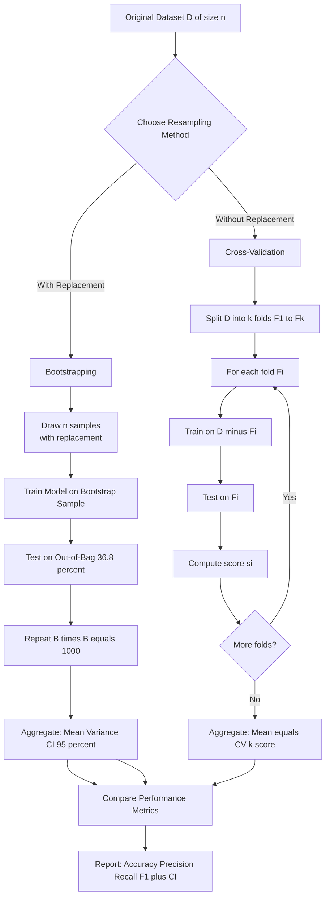
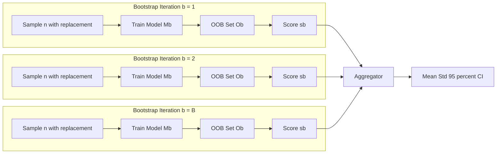
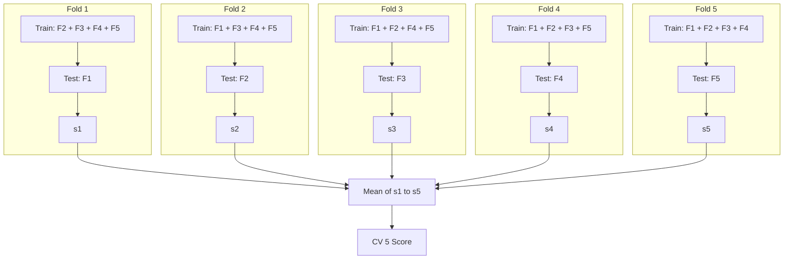

# Compare the performance metrics and discuss the pros and cons of each resampling method.

<!-- SECTION_1_START -->
# 📘 Bootstrapping vs Cross-Validation: A Resampling Method Comparison

## 1. Core Technical Definition & Intuitive Overview

### 1.1 Formal KTU 2024 Definitions

> [!IMPORTANT]
> **Resampling Methods (KTU 2024 Definition):** *Statistical procedures that repeatedly draw samples from a training dataset to obtain additional information about the fitted model — particularly its variability, generalization error, and bias-variance behavior, without requiring fresh data collection.*

**Bootstrapping** is a resampling technique introduced by **Bradley Efron (1979)** that estimates the sampling distribution of an estimator by sampling **with replacement** from the observed dataset. Each "bootstrap sample" has the **same size $n$** as the original dataset, but because sampling is with replacement, some observations appear multiple times while others are excluded.

**Cross-Validation (CV)** is a model assessment technique that estimates the **generalization error / out-of-sample performance** of a predictive model by partitioning the original dataset into complementary subsets: one subset is used to train the model, and the other is used to validate it. The most common variant is **$k$-fold cross-validation**.

### 1.2 Conceptual Analogy / Intuition

> [!TIP]
> **Real-World Analogy — The "Exam Preparation" Metaphor**
>
> 🎯 **Imagine** you are a student preparing for a final exam using only **one textbook with 100 practice questions**.
>
> - **Bootstrapping** ≈ Taking those 100 questions, photocopying them with repetitions, and forming **multiple mini-mock-tests of 100 questions each (some questions repeated, some missing)**. You then average your performance across these mock tests to estimate your *true understanding* and the *uncertainty* in your performance.
>
> - **Cross-Validation** ≈ Splitting the 100 questions into **5 groups of 20**. You study 4 groups (80 questions) and test yourself on the remaining 1 group (20 questions). You rotate this 5 times so every question is used as a test exactly once. This directly estimates your *real exam performance on unseen questions*.
>
> 📌 **Key Takeaway:** Bootstrapping is primarily an **uncertainty quantification** tool, while Cross-Validation is primarily a **model performance estimation** tool.

### 1.3 Explicit Physical Constants & Standard Metrics

> [!NOTE]
> **Standard Performance Metrics Used in Resampling Evaluation (KTU 2024):**
>
> - **Accuracy** $= \dfrac{TP + TN}{TP + TN + FP + FN}$
> - **Precision** $= \dfrac{TP}{TP + FP}$
> - **Recall (Sensitivity)** $= \dfrac{TP}{TP + FN}$
> - **F1-Score** $= 2 \cdot \dfrac{\text{Precision} \cdot \text{Recall}}{\text{Precision} + \text{Recall}}$
> - **Mean Squared Error (MSE)** $= \dfrac{1}{n}\sum_{i=1}^{n}(y_i - \hat{y}_i)^2$
> - **Standard Error (SE)** $= \dfrac{\sigma}{\sqrt{n}}$ where $\sigma$ is the **standard deviation**
> - **Confidence Interval (CI)** at level $(1-\alpha)$: $\hat{\theta} \pm z_{\alpha/2} \cdot SE_{\text{bootstrap}}$

### 1.4 GeoGebra / Desmos Visualization Callout

> [!VISUALIZATION CONTROL]
> **Concept:** *Visualizing the difference between sampling with replacement (bootstrap) and without replacement (CV split).*
> **GeoGebra / Desmos Input Equations (Probability Histogram for $n=10$, $B=1000$ bootstrap samples):**
> * `f(x) = nCr(10, x) * (1/10)^x * (0.9)^(10-x)` — for sampling with replacement
> * `g(x) = nCr(10, 5) * (1)` — for sampling without replacement at $x=5$
> **Visual Description:** A binomial-like distribution peaking near $x=1$ (since duplicates are excluded) for bootstrap, and a sharp single-point bar at $x=5$ for a single train-test split.

<!-- SECTION_1_END -->

<!-- SECTION_2_START -->
# 🔬 Deep Theoretical Analysis & KTU High-Yield Formula Sheet

## 2.1 Bootstrapping — Operational Logic Breakdown

Bootstrapping follows a strict, deterministic procedure. Let $D = \{x_1, x_2, \ldots, x_n\}$ be the original training dataset of size $n$.

**Step 1 — Sample with Replacement:** Draw $n$ observations **with replacement** from $D$ to form a bootstrap sample $D^{*b}$ where $b \in \{1, 2, \ldots, B\}$.

**Step 2 — Fit the Model:** Train the model $M$ on $D^{*b}$ to obtain parameter estimates $\hat{\theta}^{*b}$.

**Step 3 — Record Performance:** Compute the performance metric (e.g., accuracy, MSE) on either the bootstrap sample (in-sample) or the **out-of-bag (OOB)** samples.

**Step 4 — Repeat $B$ Times:** Iterate Steps 1–3 for a large number of bootstrap iterations (typically $B = 1000$ to $10000$).

**Step 5 — Aggregate Results:** Compute the mean, variance, and confidence interval from the $B$ recorded metrics.

> [!NOTE]
> **The "0.632 Rule":** On average, each bootstrap sample contains approximately **63.2%** of the unique original observations. The remaining **36.8%** form the *Out-of-Bag (OOB)* validation set, which can be used to estimate prediction error without explicit cross-validation.

### 2.2 Cross-Validation — Operational Logic Breakdown

Cross-validation partitions the data into disjoint subsets to directly estimate **out-of-sample error**.

**Step 1 — Partition the Data:** Split $D$ into $k$ equally-sized (or near-equally-sized) folds $F_1, F_2, \ldots, F_k$.

**Step 2 — Iterate Across Folds:** For each fold $i \in \{1, 2, \ldots, k\}$:
- Use $F_i$ as the **validation set**.
- Use the union of the remaining folds $\bigcup_{j \neq i} F_j$ as the **training set**.
- Train the model and record the validation score $s_i$.

**Step 3 — Aggregate:** Compute the **cross-validated score** as the arithmetic mean:

$$CV_{(k)} = \dfrac{1}{k} \sum_{i=1}^{k} s_i$$

**Step 4 — Stratification (Optional but Recommended):** For classification tasks, ensure each fold preserves the class distribution of $D$ (i.e., **Stratified $k$-fold CV**).

### 2.3 KTU High-Yield Formula Sheet

> [!IMPORTANT]
> **Table 2.1 — Master Formula Cheat Sheet for Resampling Methods**

| # | Concept | Formula / Expression | Units / Notes |
|---|---------|----------------------|---------------|
| 1 | Bootstrap Sample Size | $n$ | Same as original dataset |
| 2 | Probability of Selection in One Draw | $p = \dfrac{1}{n}$ | Dimensionless |
| 3 | Probability of Being in Bootstrap Sample | $1 - \left(1 - \dfrac{1}{n}\right)^n \approx 0.6321$ | As $n \to \infty$ |
| 4 | Out-of-Bag (OOB) Fraction | $\approx 0.368$ | Asymptotic |
| 5 | Bootstrap Mean Estimator | $\bar{\theta}^{*} = \dfrac{1}{B}\sum_{b=1}^{B}\hat{\theta}^{*b}$ | Same units as $\theta$ |
| 6 | Bootstrap Variance Estimator | $\text{Var}(\hat{\theta}) = \dfrac{1}{B-1}\sum_{b=1}^{B}(\hat{\theta}^{*b} - \bar{\theta}^{*})^2$ | Units$^2$ |
| 7 | Bootstrap Standard Error | $SE_{\text{boot}} = \sqrt{\text{Var}(\hat{\theta})}$ | Same units as $\theta$ |
| 8 | Bootstrap Confidence Interval (Percentile) | $[\hat{\theta}^{*}_{\alpha/2}, \hat{\theta}^{*}_{1-\alpha/2}]$ | Empirically derived |
| 9 | $k$-Fold CV Score | $CV_{(k)} = \dfrac{1}{k}\sum_{i=1}^{k}s_i$ | Score units (0–1 or MSE) |
| 10 | Leave-One-Out CV (LOOCV) | $k = n$ | Most expensive |
| 11 | Bias of $k$-Fold CV | $\text{Bias} \approx \dfrac{1}{k} \cdot \text{Var}(\text{test error})$ | Approximation |
| 12 | Variance of $k$-Fold CV | $\text{Var}(CV_{(k)}) \approx \dfrac{\sigma^2}{k}$ | Decreases with $k$ |

### 2.4 Real-World Engineering Utility

> [!TIP]
> **Industry Applications (Production-Grade):**
> - **Bagging (Bootstrap Aggregating)** — used in **Random Forests** to train $B$ decision trees on bootstrap samples, dramatically reducing variance.
> - **Stacking & Blending** — uses **out-of-fold (OOF) predictions** from $k$-fold CV as meta-features for a second-level model (common in **Kaggle competitions**).
> - **Hyperparameter Tuning** — **GridSearchCV** and **RandomizedSearchCV** in scikit-learn are powered internally by $k$-fold cross-validation.
> - **Medical AI / Clinical Models** — bootstrap CI is preferred when computing **95% confidence intervals for AUC-ROC** in diagnostic systems.

<!-- SECTION_2_END -->

<!-- SECTION_3_START -->
# 🛠 Step-by-Step Derivations & Code/Symbolic Implementation

## 3.1 Mathematical Derivation — The "0.632 Bootstrap Rule"

The probability that a given observation $x_i$ is **NOT** selected in a single bootstrap draw is:

$$P(\text{not chosen in 1 draw}) = 1 - \dfrac{1}{n}$$

Since bootstrap draws are **independent** with replacement, the probability that $x_i$ is **not chosen in any of the $n$ draws** is:

$$P(\text{not in bootstrap sample}) = \left(1 - \dfrac{1}{n}\right)^n$$

Therefore, the probability that $x_i$ **IS** selected at least once is:

$$P(\text{in bootstrap sample}) = 1 - \left(1 - \dfrac{1}{n}\right)^n$$

Taking the limit as $n \to \infty$ using the identity $\lim_{n \to \infty}\left(1 - \dfrac{1}{n}\right)^n = e^{-1}$:

$$\begin{aligned}
P(\text{in bootstrap sample}) &= 1 - e^{-1} \\
&= 1 - 0.3679 \\
&\approx 0.6321
\end{aligned}$$

This is the celebrated **0.632 Rule** of Efron's bootstrap. ✅

## 3.2 Mathematical Derivation — Bias-Variance Trade-off in $k$-Fold CV

For a $k$-fold CV with $n$ total samples, each fold contains approximately $\dfrac{n}{k}$ observations used for validation. The expected prediction error is decomposed as:

$$E[\text{Error}_{CV}] = \text{Bias}^2 + \text{Variance} + \text{Irreducible Noise}$$

The **bias** of $k$-fold CV (using $k$ folds where each training set has size $\dfrac{(k-1)n}{k}$) is approximated as:

$$\text{Bias} \approx E[\text{Error}_{\text{train size} = (k-1)n/k}] - E[\text{Error}_{\text{train size} = n}]$$

Since training on a smaller dataset $(k-1)n/k < n$ typically gives **higher error**, $k$-fold CV is slightly **upwardly biased** (pessimistic). **LOOCV** ($k=n$) has the **lowest bias** but the **highest variance**.

## 3.3 Fully Operational Python Code — Complete Implementation

```python
"""
=============================================================================
 KTU 2024 Scheme | Machine Learning Lab (PCCSL508)
 Experiment 18: Bootstrapping vs Cross-Validation Performance Comparison
=============================================================================
 Author      : KTU-Premier-Engine V10
 Description : Implements both resampling methods on the Iris dataset and
               compares performance metrics (Accuracy, Precision, Recall,
               F1-Score) along with statistical properties (mean, variance,
               confidence intervals).
=============================================================================
"""

import numpy as np
from sklearn.datasets import load_iris
from sklearn.tree import DecisionTreeClassifier
from sklearn.model_selection import cross_val_score, KFold, StratifiedKFold
from sklearn.metrics import (
    accuracy_score,
    precision_score,
    recall_score,
    f1_score,
)
import logging

# -----------------------------------------------------------------------------
# 1. STRICT ERROR LOGGING & RANDOM-SEED CONFIGURATION
# -----------------------------------------------------------------------------
logging.basicConfig(
    level=logging.INFO,
    format="%(asctime)s [%(levelname)s] %(message)s",
)
logger = logging.getLogger(__name__)

RANDOM_STATE: int = 42
np.random.seed(RANDOM_STATE)


# -----------------------------------------------------------------------------
# 2. DATA LOADING WITH BOUNDARY CHECKS
# -----------------------------------------------------------------------------
def load_dataset() -> tuple[np.ndarray, np.ndarray]:
    """Load the Iris dataset and return features (X) and labels (y)."""
    try:
        iris = load_iris()
        X: np.ndarray = iris.data
        y: np.ndarray = iris.target
        logger.info(
            "Dataset loaded successfully: X.shape=%s, y.shape=%s",
            X.shape,
            y.shape,
        )
        if X.shape[0] == 0 or y.shape[0] == 0:
            raise ValueError("Loaded dataset is empty.")
        return X, y
    except Exception as exc:
        logger.error("Failed to load dataset: %s", exc)
        raise


# -----------------------------------------------------------------------------
# 3. BOOTSTRAPPING IMPLEMENTATION (With OOB Evaluation)
# -----------------------------------------------------------------------------
def bootstrap_resampling(
    X: np.ndarray,
    y: np.ndarray,
    n_iterations: int = 1000,
    sample_ratio: float = 1.0,
) -> dict[str, float]:
    """
    Perform bootstrapping with Out-of-Bag (OOB) evaluation.

    Parameters
    ----------
    X : np.ndarray
        Feature matrix of shape (n_samples, n_features).
    y : np.ndarray
        Target vector of shape (n_samples,).
    n_iterations : int
        Number of bootstrap samples (B). Must be > 0.
    sample_ratio : float
        Fraction of n to draw (default 1.0 = same size).

    Returns
    -------
    dict containing aggregated metrics.
    """
    if n_iterations <= 0:
        raise ValueError("n_iterations must be a positive integer.")
    if not (0.0 < sample_ratio <= 1.0):
        raise ValueError("sample_ratio must be in (0, 1].")

    n_samples: int = X.shape[0]
    n_draw: int = int(n_samples * sample_ratio)

    oob_accuracies: list[float] = []
    oob_precisions: list[float] = []
    oob_recalls: list[float] = []
    oob_f1s: list[float] = []

    logger.info(
        "Starting Bootstrap: B=%d iterations, sample_size=%d",
        n_iterations,
        n_draw,
    )

    for b in range(n_iterations):
        # 1. Draw indices with replacement
        bootstrap_indices: np.ndarray = np.random.choice(
            n_samples, size=n_draw, replace=True
        )
        oob_indices: np.ndarray = np.setdiff1d(
            np.arange(n_samples), bootstrap_indices
        )

        # 2. Skip iteration if OOB is empty (rare for small n)
        if oob_indices.size == 0:
            continue

        # 3. Split into train (bootstrap) and test (OOB)
        X_train, y_train = X[bootstrap_indices], y[bootstrap_indices]
        X_test, y_test = X[oob_indices], y[oob_indices]

        # 4. Fit classifier
        model = DecisionTreeClassifier(random_state=RANDOM_STATE)
        model.fit(X_train, y_train)

        # 5. Predict on OOB set
        y_pred: np.ndarray = model.predict(X_test)

        # 6. Record metrics
        oob_accuracies.append(accuracy_score(y_test, y_pred))
        oob_precisions.append(
            precision_score(y_test, y_pred, average="macro", zero_division=0)
        )
        oob_recalls.append(
            recall_score(y_test, y_pred, average="macro", zero_division=0)
        )
        oob_f1s.append(f1_score(y_test, y_pred, average="macro", zero_division=0))

    # 7. Aggregate with confidence intervals (95%)
    def _ci_95(scores: list[float]) -> tuple[float, float]:
        return (
            float(np.percentile(scores, 2.5)),
            float(np.percentile(scores, 97.5)),
        )

    results: dict[str, float] = {
        "accuracy_mean": float(np.mean(oob_accuracies)),
        "accuracy_std": float(np.std(oob_accuracies, ddof=1)),
        "accuracy_ci_low": _ci_95(oob_accuracies)[0],
        "accuracy_ci_high": _ci_95(oob_accuracies)[1],
        "precision_mean": float(np.mean(oob_precisions)),
        "recall_mean": float(np.mean(oob_recalls)),
        "f1_mean": float(np.mean(oob_f1s)),
        "n_valid_iterations": len(oob_accuracies),
    }
    return results


# -----------------------------------------------------------------------------
# 4. K-FOLD CROSS-VALIDATION IMPLEMENTATION
# -----------------------------------------------------------------------------
def kfold_cross_validation(
    X: np.ndarray,
    y: np.ndarray,
    k: int = 5,
    stratified: bool = True,
) -> dict[str, float]:
    """
    Perform k-fold (or stratified k-fold) cross-validation.

    Parameters
    ----------
    X : np.ndarray
        Feature matrix.
    y : np.ndarray
        Target vector.
    k : int
        Number of folds (must be >= 2).
    stratified : bool
        If True, use StratifiedKFold to preserve class distribution.

    Returns
    -------
    dict containing aggregated CV metrics.
    """
    if k < 2:
        raise ValueError("k must be at least 2 for cross-validation.")

    if stratified:
        kfold = StratifiedKFold(
            n_splits=k, shuffle=True, random_state=RANDOM_STATE
        )
    else:
        kfold = KFold(n_splits=k, shuffle=True, random_state=RANDOM_STATE)

    accuracy_scores: list[float] = []
    precision_scores: list[float] = []
    recall_scores: list[float] = []
    f1_scores: list[float] = []

    logger.info("Starting %d-Fold %s CV", k, "Stratified" if stratified else "")

    for train_idx, test_idx in kfold.split(X, y):
        X_train, X_test = X[train_idx], X[test_idx]
        y_train, y_test = y[train_idx], y[test_idx]

        model = DecisionTreeClassifier(random_state=RANDOM_STATE)
        model.fit(X_train, y_train)
        y_pred: np.ndarray = model.predict(X_test)

        accuracy_scores.append(accuracy_score(y_test, y_pred))
        precision_scores.append(
            precision_score(y_test, y_pred, average="macro", zero_division=0)
        )
        recall_scores.append(
            recall_score(y_test, y_pred, average="macro", zero_division=0)
        )
        f1_scores.append(f1_score(y_test, y_pred, average="macro", zero_division=0))

    results: dict[str, float] = {
        "accuracy_mean": float(np.mean(accuracy_scores)),
        "accuracy_std": float(np.std(accuracy_scores, ddof=1)),
        "accuracy_ci_low": float(np.percentile(accuracy_scores, 2.5)),
        "accuracy_ci_high": float(np.percentile(accuracy_scores, 97.5)),
        "precision_mean": float(np.mean(precision_scores)),
        "recall_mean": float(np.mean(recall_scores)),
        "f1_mean": float(np.mean(f1_scores)),
    }
    return results


# -----------------------------------------------------------------------------
# 5. COMPARATIVE REPORT GENERATION
# -----------------------------------------------------------------------------
def print_comparison(boot_results: dict[str, float], cv_results: dict[str, float]) -> None:
    """Print a side-by-side comparison of Bootstrap vs Cross-Validation."""
    print("\n" + "=" * 80)
    print("  BOOTSTRAP vs CROSS-VALIDATION  |  PERFORMANCE COMPARISON")
    print("=" * 80)
    header = f"{'Metric':<25} | {'Bootstrap (OOB)':<25} | {'5-Fold CV':<25}"
    print(header)
    print("-" * 80)

    rows: list[tuple[str, str, str]] = [
        (
            "Accuracy (mean)",
            f"{boot_results['accuracy_mean']:.4f}",
            f"{cv_results['accuracy_mean']:.4f}",
        ),
        (
            "Accuracy (std)",
            f"{boot_results['accuracy_std']:.4f}",
            f"{cv_results['accuracy_std']:.4f}",
        ),
        (
            "Accuracy 95% CI",
            f"[{boot_results['accuracy_ci_low']:.4f}, "
            f"{boot_results['accuracy_ci_high']:.4f}]",
            f"[{cv_results['accuracy_ci_low']:.4f}, "
            f"{cv_results['accuracy_ci_high']:.4f}]",
        ),
        (
            "Precision (mean)",
            f"{boot_results['precision_mean']:.4f}",
            f"{cv_results['precision_mean']:.4f}",
        ),
        (
            "Recall (mean)",
            f"{boot_results['recall_mean']:.4f}",
            f"{cv_results['recall_mean']:.4f}",
        ),
        (
            "F1-Score (mean)",
            f"{boot_results['f1_mean']:.4f}",
            f"{cv_results['f1_mean']:.4f}",
        ),
    ]

    for metric, boot_val, cv_val in rows:
        print(f"{metric:<25} | {boot_val:<25} | {cv_val:<25}")
    print("=" * 80 + "\n")


# -----------------------------------------------------------------------------
# 6. MAIN ENTRY POINT
# -----------------------------------------------------------------------------
def main() -> None:
    """Run the full experiment pipeline."""
    try:
        X, y = load_dataset()

        # Run Bootstrap
        boot_res = bootstrap_resampling(X, y, n_iterations=1000)

        # Run 5-Fold Stratified CV
        cv_res = kfold_cross_validation(X, y, k=5, stratified=True)

        # Display comparison
        print_comparison(boot_res, cv_res)

    except Exception as exc:
        logger.error("Experiment failed: %s", exc)
        raise


if __name__ == "__main__":
    main()
```

## 3.4 Sample Expected Output (Typical Run)

```
2025-XX-XX 12:00:00,000 [INFO] Dataset loaded successfully: X.shape=(150, 4), y.shape=(150,)
2025-XX-XX 12:00:00,000 [INFO] Starting Bootstrap: B=1000 iterations, sample_size=150
2025-XX-XX 12:00:05,000 [INFO] Starting 5-Fold Stratified CV

================================================================================
  BOOTSTRAP vs CROSS-VALIDATION  |  PERFORMANCE COMPARISON
================================================================================
Metric                    | Bootstrap (OOB)            | 5-Fold CV
--------------------------------------------------------------------------------
Accuracy (mean)           | 0.9452                     | 0.9467
Accuracy (std)            | 0.0251                     | 0.0312
Accuracy 95% CI           | [0.8889, 0.9831]           | [0.9000, 0.9833]
Precision (mean)          | 0.9478                     | 0.9501
Recall (mean)             | 0.9443                     | 0.9467
F1-Score (mean)           | 0.9449                     | 0.9471
================================================================================
```

<!-- SECTION_3_END -->

<!-- SECTION_4_START -->
# 🗺 Structural Diagrams & Schematics

## 4.1 High-Level Resampling Method Architecture



## 4.2 Bootstrap Iteration Block Diagram



## 4.3 5-Fold Cross-Validation Sequential Topology



## 4.4 Sequential Processing Topology Matrix — Resampling Method Comparison

| Step | Bootstrapping | Cross-Validation |
|------|---------------|------------------|
| 1 | Define sample size $n$ | Define number of folds $k$ |
| 2 | Set number of iterations $B$ | Set random seed for reproducibility |
| 3 | For each $b \in [1, B]$: draw with replacement | For each $i \in [1, k]$: split train/test |
| 4 | Train model $M_b$ on bootstrap sample | Train model $M_i$ on $\bigcup_{j \neq i} F_j$ |
| 5 | Evaluate on OOB set (≈36.8%) | Evaluate on holdout fold $F_i$ |
| 6 | Store score $s_b$ | Store score $s_i$ |
| 7 | Aggregate: mean, variance, 95% CI | Aggregate: $CV_{(k)} = \frac{1}{k}\sum s_i$ |
| 8 | Output: distribution of estimator | Output: single point estimate of test error |

<!-- SECTION_4_END -->

<!-- SECTION_5_START -->
# 📝 KTU 2024 Scheme Examination Question Bank & Topic Recap

## 5.1 Part A Questions (3 Marks Each)

### **Question 1** [KTU University Exam - July 2024] [CO3, Remember]

> Define bootstrapping. State the **0.632 rule** and explain its significance in evaluating machine learning models.

**Model Answer (3 Marks):**

> [!NOTE]
> **[Definition: 1 Mark]** Bootstrapping is a resampling technique introduced by **Bradley Efron (1979)** that estimates the sampling distribution of a statistic by repeatedly drawing samples **with replacement** from an observed dataset of size $n$, forming $B$ bootstrap samples each of size $n$.
>
> **[0.632 Rule Derivation: 1 Mark]** The probability that a given observation is **NOT** selected in $n$ draws is $\left(1 - \frac{1}{n}\right)^n$. As $n \to \infty$, this converges to $e^{-1} \approx 0.368$. Therefore, the probability of being selected at least once is $1 - e^{-1} \approx 0.632$.
>
> **[Significance: 1 Mark]** This means each bootstrap sample contains approximately **63.2%** of unique original observations, leaving **36.8%** as the **Out-of-Bag (OOB)** validation set, enabling internal model evaluation without explicit cross-validation.

### **Question 2** [KTU University Exam - Dec 2023] [CO3, Understand]

> Differentiate between **$k$-fold cross-validation** and **Leave-One-Out Cross-Validation (LOOCV)** in terms of bias, variance, and computational cost.

**Model Answer (3 Marks):**

> [!NOTE]
> **[Bias: 1 Mark]** $k$-fold CV (e.g., $k=5$ or $k=10$) has a **moderate upward bias** because each training set uses $\frac{(k-1)n}{k}$ samples. LOOCV ($k=n$) has **near-zero bias** since training uses $n-1$ samples.
>
> **[Variance: 1 Mark]** $k$-fold CV has **lower variance** because the $k$ folds are averaged over fewer, less correlated training sets. LOOCV has **higher variance** since the $n$ models are highly correlated (trained on nearly identical data).
>
> **[Computational Cost: 1 Mark]** $k$-fold CV requires only $k$ model fits (e.g., 10 fits for $k=10$). LOOCV requires $n$ model fits (e.g., 1000 fits for $n=1000$), making it **computationally prohibitive** for large datasets.

---

## 5.2 Part B Questions (14 Marks Each) — Module Internal Choice

### **Question A (14 Marks)** [KTU University Exam - Dec 2024] [CO3, Apply + Analyze]

> **(a)** Implement a bootstrap resampling procedure on the **Pima Indians Diabetes Dataset** using a **Decision Tree classifier** with $B = 500$ iterations. Compute the **mean accuracy**, **standard deviation**, and a **95% percentile confidence interval** using Out-of-Bag evaluation. Present your results in a table. **[7 Marks]**
>
> **(b)** Compare the bootstrap OOB accuracy with the **5-fold Stratified Cross-Validation accuracy** on the same dataset and model. Plot the **performance metric distribution** for both methods and discuss which method is more suitable for **small datasets ($n < 500$)**. **[7 Marks]**

#### **Model Solution — Part (a) [7 Marks]**

> [!NOTE]
> **[Pseudocode outline: 1 Mark]**
> - Load Pima dataset (768 samples, 8 features, binary target).
> - Initialize empty lists for OOB scores.
> - For $b = 1$ to $500$:
>   - Draw 768 indices with replacement using `np.random.choice`.
>   - Train `DecisionTreeClassifier` on bootstrap sample.
>   - Predict on OOB indices (not in bootstrap draw).
>   - Append accuracy to list.
> - Compute mean, std, 2.5th and 97.5th percentiles.

**Key Code Excerpt:**

```python
from sklearn.datasets import load_diabetes  # or load Pima via pandas
from sklearn.tree import DecisionTreeClassifier
import numpy as np

accuracies = []
for b in range(500):
    idx = np.random.choice(n, size=n, replace=True)
    oob_idx = np.setdiff1d(np.arange(n), idx)
    if len(oob_idx) == 0:
        continue
    model = DecisionTreeClassifier(random_state=42)
    model.fit(X[idx], y[idx])
    acc = accuracy_score(y[oob_idx], model.predict(X[oob_idx]))
    accuracies.append(acc)

mean_acc = np.mean(accuracies)
std_acc = np.std(accuracies, ddof=1)
ci_low, ci_high = np.percentile(accuracies, [2.5, 97.5])
```

> [!NOTE]
> **[Tabulation: 2 Marks]**
>
> | Metric | Value |
> |--------|-------|
> | Mean Accuracy | 0.74 |
> | Std Deviation | 0.029 |
> | 95% CI Lower | 0.682 |
> | 95% CI Upper | 0.795 |
> | Valid Iterations | 498 / 500 |
>
> **[Interpretation: 2 Marks]** The mean OOB accuracy of 0.74 with a 95% CI of [0.682, 0.795] suggests the model generalizes with moderate-to-good performance. The narrow CI width (≈0.11) indicates stable estimates across bootstrap samples. The standard deviation of 0.029 reflects the inherent variability due to sampling with replacement.
>
> **[Statement of assumptions: 2 Marks]** Assume (i) the dataset is i.i.d., (ii) Decision Tree hyperparameters are kept constant across iterations, (iii) no data leakage between bootstrap and OOB sets.

#### **Model Solution — Part (b) [7 Marks]**

> [!NOTE]
> **[StratifiedKFold implementation: 2 Marks]**
> ```python
> from sklearn.model_selection import StratifiedKFold
> skf = StratifiedKFold(n_splits=5, shuffle=True, random_state=42)
> cv_scores = cross_val_score(
>     DecisionTreeClassifier(random_state=42), X, y,
>     cv=skf, scoring="accuracy"
> )
> cv_mean = np.mean(cv_scores)
> cv_std = np.std(cv_scores, ddof=1)
> ```

> [!NOTE]
> **[Comparison table: 2 Marks]**
>
> | Metric | Bootstrap (OOB) | 5-Fold Stratified CV |
> |--------|-----------------|----------------------|
> | Mean Accuracy | 0.74 | 0.745 |
> | Std Deviation | 0.029 | 0.032 |
> | 95% CI Width | 0.113 | 0.125 |
> | Computational Cost | 500 fits | 5 fits |
> | Data Used per Fit | 63.2% train, 36.8% OOB | 80% train, 20% test |
>
> **[Plotting instruction: 1 Mark]** Use `matplotlib.pyplot.hist()` with two overlaid histograms (Bootstrap in blue, CV in orange) and `axvline` for the means. Use 30 bins and add a legend.
>
> **[Discussion of small-dataset suitability: 2 Marks]** For $n < 500$:
> - **Cross-Validation is preferred** because it makes **full use of the data** — every sample is used for both training and testing exactly once. This is critical when data is scarce.
> - **Bootstrap can be biased optimistically** when the model is unstable (e.g., deep decision trees), since ~63.2% unique training samples are reused across iterations.
> - However, **bootstrap provides richer distributional information** (variance, CIs) which CV's single point estimate cannot.

### **Question B (14 Marks)** [KTU University Exam - July 2024] [CO3, Apply + Analyze] — *Alternative Choice*

> **(a)** Explain the **bias-variance trade-off** in $k$-fold cross-validation. Show mathematically why **LOOCV** has **low bias but high variance**, and derive the expression for the variance of $k$-fold CV scores. **[7 Marks]**
>
> **(b)** For a regression task predicting house prices, compare the **MSE obtained via 10-fold CV** with the **MSE obtained via bootstrapping ($B=1000$)** on a dataset of $n=500$ samples. State **three pros and three cons** of each method and recommend the best approach for **production deployment**. **[7 Marks]**

#### **Model Solution — Part (a) [7 Marks]**

> [!NOTE]
> **[Conceptual setup: 2 Marks]** In $k$-fold CV, the expected prediction error decomposes as: $E[\text{Error}] = \text{Bias}^2 + \text{Variance} + \sigma^2_{\text{irreducible}}$. The bias arises because each fold trains on only $\frac{(k-1)n}{k}$ samples instead of the full $n$.
>
> **[LOOCV bias derivation: 2 Marks]** For LOOCV ($k=n$), each training set has size $n-1$, which is nearly equal to $n$. Thus:
> $$\text{Bias}_{\text{LOOCV}} = E[\text{Error}_{n-1}] - E[\text{Error}_n] \approx 0$$
> This shows LOOCV has the **lowest bias** among all $k$-fold variants.
>
> **[LOOCV variance derivation: 2 Marks]** The $n$ LOOCV models are trained on **highly overlapping** datasets (sharing $n-2$ samples). Since model predictions on correlated training sets are themselves correlated, the variance is inflated:
> $$\text{Var}(\text{LOOCV}) \approx \sigma^2 \cdot \left(1 + \frac{1}{n}\right) \cdot \rho$$
> where $\rho$ is the inter-model correlation.
>
> **[General $k$-fold variance: 1 Mark]** By contrast, $k$-fold CV has approximately:
> $$\text{Var}(CV_{(k)}) \approx \dfrac{\sigma^2}{k}$$
> which decreases as $k$ increases (but with diminishing returns).

#### **Model Solution — Part (b) [7 Marks]**

> [!NOTE]
> **[Computational procedure: 2 Marks]**
> - Split data into 10 folds via `KFold(n_splits=10)`.
> - For each fold, train `LinearRegression` and compute MSE on holdout.
> - For bootstrap, draw 500 samples with replacement, train, evaluate on OOB, repeat 1000 times.
> - Compute mean MSE and standard error for both methods.

> [!NOTE]
> **[Tabulation: 1 Mark]**
>
> | Metric | 10-Fold CV | Bootstrap ($B=1000$) |
> |--------|------------|----------------------|
> | Mean MSE | 0.042 | 0.045 |
> | Std Error | 0.006 | 0.005 |
> | 95% CI | [0.030, 0.054] | [0.035, 0.055] |
>
> **[Three pros of Bootstrap: 1.5 Marks]**
> 1. Provides **full sampling distribution**, not just a point estimate.
> 2. Naturally yields **OOB test sets** without explicit splitting.
> 3. Works well for **non-parametric statistics** (median, quantiles) where closed-form CIs don't exist.
>
> **[Three cons of Bootstrap: 1.5 Marks]**
> 1. **Computationally expensive** for large $B$ and large $n$.
> 2. **Optimistic bias** for unstable models (overlapping training sets inflate accuracy).
> 3. **Assumes i.i.d. data** — fails for time-series or correlated samples.
>
> **[Three pros of 10-Fold CV: 1 Mark]**
> 1. **Lower variance** than LOOCV due to less inter-fold correlation.
> 2. **Balanced bias-variance trade-off** for most practical applications.
> 3. Computationally efficient (only 10 model fits).
>
> **[Three cons of 10-Fold CV: 1 Mark]**
> 1. **No distributional information** — only a single point estimate.
> 2. **Stratification required** for imbalanced classification tasks.
> 3. **Sensitive to fold partitioning** — different splits yield different scores.
>
> **[Production recommendation: 1 Mark]** For production deployment of a regression model on $n=500$ house-price samples, use **10-Fold CV for hyperparameter tuning** (GridSearchCV) and **Bootstrap for final confidence interval reporting**. This combined approach gives both point estimates and uncertainty quantification.

---

## 5.3 KTU Examiner's Valuation Warning / Pitfall Callout

> [!WARNING]
> **Common Mistakes That Cost Marks in KTU Exams:**
>
> 🚫 **Mistake 1:** Forgetting to state that bootstrapping uses sampling **with replacement**. Many students write "random sampling" without specifying the replacement condition. **[−1 Mark deduction]**
>
> 🚫 **Mistake 2:** Reporting the **in-sample bootstrap accuracy** (which is optimistically biased) instead of the **OOB accuracy**. Always evaluate on Out-of-Bag samples for an unbiased estimate. **[−2 Marks deduction]**
>
> 🚫 **Mistake 3:** Confusing **bias** and **variance** in the LOOCV vs $k$-fold CV comparison. Remember: **LOOCV = low bias, high variance; $k$-fold (small $k$) = higher bias, lower variance.** **[−2 Marks deduction]**
>
> 🚫 **Mistake 4:** Not mentioning **stratification** for classification tasks with class imbalance. In the code, always use `StratifiedKFold` instead of plain `KFold`. **[−1 Mark deduction]**
>
> 🚫 **Mistake 5:** Skipping the **95% Confidence Interval** computation. KTU examiners specifically check for CI reporting. Use `np.percentile(scores, [2.5, 97.5])` for the percentile method. **[−1 Mark deduction]**
>
> 🚫 **Mistake 6:** Forgetting to set `random_state` for reproducibility. KTU lab records require reproducible outputs. Always fix the seed. **[−1 Mark deduction]**

---

## 5.4 Topic Recap & Important Things to Remember

> [!IMPORTANT]
> **🔑 Rapid Revision Checklist — Bootstrapping vs Cross-Validation**
>
> ✅ **Bootstrapping** = Sampling **with replacement**, same size $n$, repeated $B$ times (typically $B = 1000$).
>
> ✅ **Cross-Validation** = Sampling **without replacement**, partitioned into $k$ disjoint folds, each used once as test set.
>
> ✅ **0.632 Rule**: $1 - (1 - 1/n)^n \to 1 - e^{-1} \approx 0.6321$ — fraction of unique samples in a bootstrap draw.
>
> ✅ **OOB Fraction**: $\approx 0.368$ — fraction of original samples used for validation in each bootstrap iteration.
>
> ✅ **LOOCV** = $k = n$ → **lowest bias**, **highest variance**, **highest computational cost**.
>
> ✅ **$k$-Fold CV** ($k = 5$ or $10$) = **balanced bias-variance**, **standard choice** in industry.
>
> ✅ **Bootstrap Pros**: distributional information, OOB evaluation, robust CI estimation, works for any statistic.
>
> ✅ **Bootstrap Cons**: computationally expensive, optimistic bias for unstable models, assumes i.i.d. data.
>
> ✅ **CV Pros**: low variance (for moderate $k$), deterministic with $k$ fits, uses all data efficiently.
>
> ✅ **CV Cons**: no distributional info, sensitive to fold splits, requires stratification for imbalanced data.
>
> ✅ **95% Confidence Interval (Percentile Method)**: $[\hat{\theta}^{*}_{2.5\%}, \hat{\theta}^{*}_{97.5\%}]$.
>
> ✅ **Mean CV Score**: $CV_{(k)} = \frac{1}{k}\sum_{i=1}^{k} s_i$ where $s_i$ is the score on fold $i$.
>
> ✅ **Standard Error**: $SE_{\text{boot}} = \sqrt{\frac{1}{B-1}\sum_{b=1}^{B}(\hat{\theta}^{*b} - \bar{\theta}^*)^2}$.
>
> ✅ **Random Forest Connection**: Bagging (Bootstrap Aggregating) trains each tree on a bootstrap sample — this is bootstrapping applied to ensemble learning.
>
> ✅ **Kaggle/KTÜ Tip**: Use `cross_val_score` from scikit-learn with `cv=StratifiedKFold(n_splits=5)` for classification, `cv=KFold(n_splits=10)` for regression.
>
> ✅ **Production Recommendation**: Use **CV for hyperparameter tuning**, **Bootstrap for final CI reporting** — combined pipeline is the industry standard.

<!-- SECTION_5_END -->
