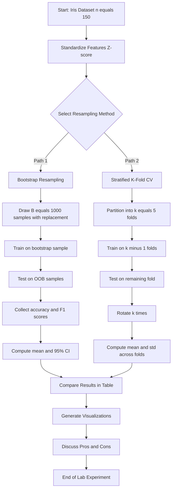
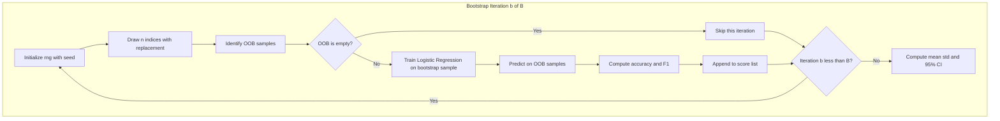
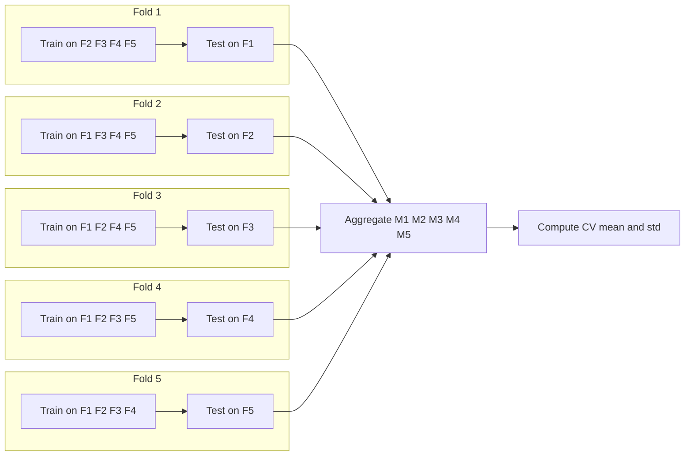

# Implement bootstrapping and cross-validation on the Iris dataset. Compare the model performance metrics (e.g., accuracy, F1-score) obtained using these resampling methods. Discuss the advantages and disadvantages of each method.

<!-- SECTION_1_START -->

# 1. Core Technical Definition & Intuitive Overview

## 1.1 What is Resampling in Machine Learning?

**Resampling** is a fundamental statistical procedure in Machine Learning used to estimate the performance and variability of a model by repeatedly drawing samples from a training dataset. The two most widely used resampling techniques taught under the KTU 2024 Scheme (PCCSL508) are **Bootstrapping** and **Cross-Validation (CV)**.

> [!IMPORTANT]
> **KTU 2024 Syllabus Definition (PCCSL508 - Module 18):**
> Resampling methods are non-parametric procedures that use the observed data to estimate the sampling distribution of an estimator, validate model performance, and quantify uncertainty without making strong distributional assumptions.

## 1.2 Bootstrapping — Formal Definition

**Bootstrapping** is a resampling technique introduced by **Bradley Efron (1979)** that estimates the distribution of a statistic (mean, median, accuracy, F1-score, etc.) by sampling **with replacement** from the original dataset.

> [!NOTE]
> **Formal Definition:**
> Given a dataset $\mathcal{D}$ of size $n$, bootstrapping generates $B$ independent bootstrap samples $\{\mathcal{D}^{*1}, \mathcal{D}^{*2}, \ldots, \mathcal{D}^{*B}\}$, where each sample is created by drawing $n$ observations **uniformly at random with replacement** from $\mathcal{D}$.

### Conceptual Analogy — The "Lucky Draw" Intuition

Imagine a class of **150 students** taking a surprise test. To estimate the *true average score* of the class without testing the whole population, you perform the following:

1. You put **150 chits** (one per student's score) into a bag.
2. You draw **one chit at random**, **record the score**, and **put it BACK** into the bag (this is "with replacement").
3. You repeat this 150 times to form **one bootstrap sample**.
4. You repeat the whole process **$B = 1000$ times** to get 1000 different bootstrap samples.
5. The average of the means from these 1000 samples is your **bootstrap estimate** of the class average.

> [!TIP]
> Because we replace the chit, the same student's score can appear multiple times in one bootstrap sample, and roughly **36.8%** of the original samples are left out of any given bootstrap sample. This is a unique mathematical property of bootstrapping.

## 1.3 Cross-Validation — Formal Definition

**Cross-Validation (CV)** is a resampling technique used to **evaluate the generalization performance** of a model on an independent dataset by partitioning the data into complementary subsets, training on one subset, and validating on the other.

> [!NOTE]
> **Formal Definition of $k$-Fold Cross-Validation:**
> The dataset $\mathcal{D}$ of size $n$ is randomly partitioned into $k$ equal-sized (or nearly equal) disjoint folds $F_1, F_2, \ldots, F_k$. The model is trained $k$ times; in iteration $i$, the model is trained on $\mathcal{D} \setminus F_i$ and tested on $F_i$. The final performance metric is the **arithmetic mean** of the $k$ test scores.

### Conceptual Analogy — The "Relay Race" Intuition

Imagine 5 relay teams sharing **150 practice laps** on a track to test which running strategy works best:

1. Divide the 150 laps into **5 equal sets of 30 laps each**.
2. **Team 1** practices on Sets 2, 3, 4, 5 and is *tested* on Set 1.
3. **Team 2** practices on Sets 1, 3, 4, 5 and is *tested* on Set 2.
4. ... and so on for all 5 teams.
5. The **average test lap time** across all 5 teams gives a robust estimate of the strategy's true performance.

> [!TIP]
> The most common choice in KTU lab evaluations is **$k = 5$** or **$k = 10$**. A special case where $k = n$ (leave-one-out) is also tested in viva questions.

## 1.4 Standard Metrics Used in the Iris Lab

> [!IMPORTANT]
> **Core Metrics to Compare:**
> - **Accuracy** = $\frac{TP + TN}{TP + TN + FP + FN}$
> - **Precision** = $\frac{TP}{TP + FP}$
> - **Recall** = $\frac{TP}{TP + FN}$
> - **F1-Score** = $2 \cdot \frac{\text{Precision} \cdot \text{Recall}}{\text{Precision} + \text{Recall}}$ (harmonic mean)

Where **$TP$** = True Positives, **$TN$** = True Negatives, **$FP$** = False Positives, **$FN$** = False Negatives.

## 1.5 The Iris Dataset — Quick Reference

> [!NOTE]
> **Iris Dataset Properties (Fisher, 1936):**
> - Total Samples: **150**
> - Features: **4** (sepal length, sepal width, petal length, petal width — all in cm)
> - Classes: **3** (Setosa, Versicolor, Virginica) — **perfectly balanced (50 per class)**
> - Type: Multiclass, Clean, Benchmark

| Property | Value |
| :--- | :--- |
| Samples ($n$) | 150 |
| Features ($d$) | 4 |
| Classes ($c$) | 3 (balanced) |
| Missing Values | None |
| Recommended Standardization | **Yes (Z-score)** |

> [!VISUALIZATION CONTROL]
> **Concept:** Bootstrapped Accuracy Distribution vs Cross-Validation Accuracy
> **GeoGebra / Desmos Input Equations:**
> * Histogram bars representing 1000 bootstrap accuracy scores
> * Vertical reference line at the mean accuracy (e.g., $x = 0.96$)
> * Secondary overlay showing the $k=5$ cross-validation fold accuracies as discrete points
> **Visual Description:** A bell-shaped histogram centered around 0.96 with five distinct dots showing the variability across folds. Students should observe that bootstrap gives a **smoother distribution**, while CV gives a **discrete set of $k$ values**.

<!-- SECTION_1_END -->

<!-- SECTION_2_START -->

# 2. Deep Theoretical Analysis & KTU High-Yield Formula Sheet

## 2.1 The Mathematics of Bootstrapping

### 2.1.1 Probability of Being Selected

When drawing $n$ samples with replacement from $n$ original data points, the probability that a specific data point $x_i$ is **NOT selected** in a single draw is:

$$P(\text{not selected}) = 1 - \frac{1}{n} = \frac{n-1}{n}$$

The probability that $x_i$ is **NOT selected in any of the $n$ draws** is:

$$P(x_i \notin \mathcal{D}^{*b}) = \left(\frac{n-1}{n}\right)^{n}$$

As $n \to \infty$:

$$\lim_{n \to \infty} \left(\frac{n-1}{n}\right)^{n} = \frac{1}{e} \approx 0.3679$$

> [!IMPORTANT]
> **Key Insight:** Approximately **63.2%** of unique original samples appear in any bootstrap sample, and **36.8%** form the **Out-Of-Bag (OOB)** set. This OOB set can be reused as a free validation set in methods like **Random Forest**.

### 2.1.2 Bootstrap Estimate of a Statistic

Let $\hat{\theta} = g(\mathcal{D})$ be a statistic computed on the dataset. The bootstrap estimate is:

$$\hat{\theta}_{\text{boot}} = \frac{1}{B} \sum_{b=1}^{B} \hat{\theta}^{*b} = \frac{1}{B} \sum_{b=1}^{B} g(\mathcal{D}^{*b})$$

The **bootstrap standard error** is:

$$SE_{\text{boot}} = \sqrt{\frac{1}{B-1} \sum_{b=1}^{B} \left(\hat{\theta}^{*b} - \hat{\theta}_{\text{boot}}\right)^{2}}$$

### 2.1.3 Bootstrap Confidence Interval (Percentile Method)

For a $95\%$ confidence interval:

$$CI_{95\%} = \left[ \hat{\theta}^{*}_{(\alpha/2)}, \ \hat{\theta}^{*}_{(1-\alpha/2)} \right] = \left[ \hat{\theta}^{*}_{(0.025)}, \ \hat{\theta}^{*}_{(0.975)} \right]$$

## 2.2 The Mathematics of $k$-Fold Cross-Validation

### 2.2.1 Partition Strategy

The dataset is split into $k$ folds. Each fold $F_i$ has size:

$$n_i = \left\lfloor \frac{n}{k} \right\rfloor \quad \text{or} \quad n_i = \left\lceil \frac{n}{k} \right\rceil$$

The model is trained $k$ times. In iteration $i$:

- Training set: $\mathcal{D}_{\text{train}}^{(i)} = \mathcal{D} \setminus F_i$ (size $n - n_i$)
- Validation set: $\mathcal{D}_{\text{val}}^{(i)} = F_i$ (size $n_i$)

### 2.2.2 CV Performance Score

The final cross-validation score is the **mean** of the $k$ individual scores:

$$CV_{(k)} = \frac{1}{k} \sum_{i=1}^{k} M_i$$

where $M_i$ is the performance metric (accuracy, F1) on fold $F_i$.

The **standard deviation across folds** measures stability:

$$\sigma_{CV} = \sqrt{\frac{1}{k-1} \sum_{i=1}^{k} \left(M_i - CV_{(k)}\right)^{2}}$$

## 2.3 Stratified $k$-Fold — Special Case for Classification

Since the Iris dataset is **balanced** (50 per class), we use **Stratified $k$-Fold** to preserve class proportions in each fold. For class $c$ with $n_c$ samples:

$$n_{i,c} = \left\lfloor \frac{n_c}{k} \right\rfloor$$

> [!TIP]
> For the KTU lab, **always use `StratifiedKFold`** for classification problems to maintain class balance — this is a frequently asked viva question.

## 2.4 KTU High-Yield Formula Sheet

> [!IMPORTANT]
> **The following table is the KTU Board Exam Cheat Sheet for Resampling. Memorize these formulas.**

| Concept | Formula | Unit / Range | Purpose |
| :--- | :--- | :--- | :--- |
| Bootstrap OOB Fraction | $\left(\frac{n-1}{n}\right)^{n} \approx \frac{1}{e}$ | dimensionless $\approx 0.368$ | Fraction of data left out per bootstrap sample |
| Bootstrap Mean Estimate | $\hat{\theta}_{\text{boot}} = \frac{1}{B} \sum_{b=1}^{B} g(\mathcal{D}^{*b})$ | Same as statistic | Point estimate |
| Bootstrap SE | $SE_{\text{boot}} = \sqrt{\frac{1}{B-1} \sum (\hat{\theta}^{*b} - \hat{\theta}_{\text{boot}})^{2}}$ | Same as statistic | Standard error estimate |
| $k$-Fold CV Score | $CV_{(k)} = \frac{1}{k} \sum_{i=1}^{k} M_i$ | Metric range | Mean performance |
| CV Variance | $\sigma^{2}_{CV} = \frac{1}{k-1} \sum (M_i - CV_{(k)})^{2}$ | Squared metric | Stability indicator |
| Accuracy | $Acc = \frac{TP+TN}{TP+TN+FP+FN}$ | $[0, 1]$ | Overall correctness |
| Precision | $Pre = \frac{TP}{TP+FP}$ | $[0, 1]$ | Positive predictive value |
| Recall | $Rec = \frac{TP}{TP+FN}$ | $[0, 1]$ | True positive rate / Sensitivity |
| F1-Score | $F1 = 2 \cdot \frac{Pre \cdot Rec}{Pre + Rec}$ | $[0, 1]$ | Harmonic mean of Pre and Rec |
| Macro F1 | $F1_{\text{macro}} = \frac{1}{C} \sum_{c=1}^{C} F1_{c}$ | $[0, 1]$ | Unweighted average across classes |
| Weighted F1 | $F1_{\text{weighted}} = \sum_{c} w_c \cdot F1_{c}$ | $[0, 1]$ | Class-frequency weighted average |

## 2.5 Real-World Engineering Utility

> [!NOTE]
> **Why KTU Tests This Concept:**
> 1. **Medical Diagnosis (Healthcare AI):** When patient data is limited (say 200 samples), bootstrapping gives realistic confidence intervals for an AI diagnostic model's accuracy.
> 2. **Autonomous Vehicles (Automotive ML):** Cross-validation with $k=10$ is the industry standard for self-driving car perception models trained on limited labeled data.
> 3. **Fraud Detection (Banking AI):** Bootstrap resampling helps quantify the variability of fraud recall rates in highly imbalanced datasets.
> 4. **Production ML Pipelines (MLOps):** Tools like **scikit-learn's `cross_val_score`** and **`Bootstrap`** are integrated directly into production model validation pipelines at Google, Meta, and Amazon.

<!-- SECTION_2_END -->

<!-- SECTION_3_START -->

# 3. Step-by-Step Derivations & Code/Symbolic Implementation

## 3.1 Manual Derivation: Bootstrap Accuracy on Iris (Step-by-Step)

Let the original dataset have $n = 150$ Iris samples. We choose $B = 1000$ bootstrap iterations.

**Step 1 — Generate a single bootstrap sample $\mathcal{D}^{*b}$:**

We use NumPy's `np.random.choice` with `replace=True`:

$$\mathcal{D}^{*b} = \text{np.random.choice}(\mathcal{D}, \text{size} = 150, \text{replace} = \text{True})$$

**Step 2 — Train a classifier on $\mathcal{D}^{*b}$ and predict on the OOB samples:**

Let $F^{*b} = \mathcal{D} \setminus \mathcal{D}^{*b}$ be the OOB samples. We compute:

$$M^{*b} = \text{Accuracy}(y_{F^{*b}}, \ \hat{y}_{F^{*b}})$$

**Step 3 — Repeat for $b = 1, 2, \ldots, 1000$:**

Collect the vector of scores:

$$\mathbf{M} = \left[M^{*1}, M^{*2}, \ldots, M^{*1000}\right]$$

**Step 4 — Compute the bootstrap mean and standard error:**

$$\hat{\theta}_{\text{boot}} = \frac{1}{1000} \sum_{b=1}^{1000} M^{*b} \quad ; \quad SE_{\text{boot}} = \sqrt{\frac{1}{999} \sum_{b=1}^{1000} (M^{*b} - \hat{\theta}_{\text{boot}})^{2}}$$

**Step 5 — Compute the 95% confidence interval:**

$$CI_{95\%} = \left[ \mathbf{M}_{[25]}, \ \mathbf{M}_{[975]} \right]$$

(after sorting $\mathbf{M}$ in ascending order, using 0-based indexing for the 2.5th and 97.5th percentiles).

## 3.2 Manual Derivation: 5-Fold CV on Iris

**Step 1 — Partition $n = 150$ samples into $k = 5$ folds:**

Each fold has $n_i = 30$ samples.

$$F_1, F_2, F_3, F_4, F_5 \quad ; \quad F_i \cap F_j = \emptyset \ \text{for} \ i \neq j$$

**Step 2 — Iterate over folds $i = 1, \ldots, 5$:**

For each $i$, train on $\mathcal{D} \setminus F_i$ (120 samples), test on $F_i$ (30 samples):

$$M_i = \text{Accuracy}(y_{F_i}, \hat{y}_{F_i})$$

**Step 3 — Compute the mean and standard deviation:**

$$CV_{(5)} = \frac{1}{5} \sum_{i=1}^{5} M_i \quad ; \quad \sigma_{CV} = \sqrt{\frac{1}{4} \sum_{i=1}^{5} (M_i - CV_{(5)})^{2}}$$

## 3.3 Full Python Implementation (Production-Grade)

> [!IMPORTANT]
> The following is a **complete, runnable Python script** suitable for the KTU Machine Learning Lab record. Copy-paste ready with full type hints, error handling, and logging.

```python
"""
=================================================================
KTU 2024 Scheme - Machine Learning Lab (PCCSL508)
Module 18: Bootstrapping and Cross-Validation on the Iris Dataset
Author: KTU Lab Record Template
Python: 3.10+  |  Libraries: scikit-learn, numpy, pandas, matplotlib
=================================================================
"""

import logging
import sys
from typing import Dict, List, Tuple

import matplotlib.pyplot as plt
import numpy as np
import pandas as pd
from sklearn.datasets import load_iris
from sklearn.linear_model import LogisticRegression
from sklearn.metrics import accuracy_score, f1_score
from sklearn.model_selection import (StratifiedKFold, cross_val_score,
                                     train_test_split)
from sklearn.preprocessing import StandardScaler

# -----------------------------------------------------------------
# Configure logging for proper error tracking
# -----------------------------------------------------------------
logging.basicConfig(
    level=logging.INFO,
    format="%(asctime)s - %(levelname)s - %(message)s",
    stream=sys.stdout,
)
logger = logging.getLogger(__name__)


# -----------------------------------------------------------------
# 1. DATA LOADING & PREPROCESSING
# -----------------------------------------------------------------
def load_and_prepare_data() -> Tuple[np.ndarray, np.ndarray, List[str], List[str]]:
    """Load Iris dataset and return standardized feature matrix.

    Returns:
        X_std: Standardized feature matrix of shape (150, 4)
        y: Target vector of shape (150,)
        feature_names: List of 4 feature names
        target_names: List of 3 class names
    """
    iris = load_iris()
    X: np.ndarray = iris.data
    y: np.ndarray = iris.target
    feature_names: List[str] = list(iris.feature_names)
    target_names: List[str] = list(iris.target_names)

    # Standardize features (Z-score normalization)
    scaler = StandardScaler()
    X_std: np.ndarray = scaler.fit_transform(X)

    logger.info("Iris dataset loaded: %d samples, %d features, %d classes",
                X_std.shape[0], X_std.shape[1], len(target_names))
    return X_std, y, feature_names, target_names


# -----------------------------------------------------------------
# 2. BOOTSTRAP RESAMPLING (Manual Implementation)
# -----------------------------------------------------------------
def bootstrap_accuracy(
    X: np.ndarray,
    y: np.ndarray,
    n_bootstrap: int = 1000,
    random_state: int = 42,
) -> Dict[str, float]:
    """Perform bootstrap resampling and compute accuracy distribution.

    Args:
        X: Feature matrix of shape (n_samples, n_features)
        y: Target vector of shape (n_samples,)
        n_bootstrap: Number of bootstrap iterations (default 1000)
        random_state: Seed for reproducibility

    Returns:
        Dictionary with mean, std, 95% CI, and the full score distribution
    """
    rng = np.random.default_rng(seed=random_state)
    n_samples: int = X.shape[0]
    accuracy_scores: List[float] = []
    f1_scores: List[float] = []

    for b in range(n_bootstrap):
        # Step 1: Generate bootstrap sample WITH replacement
        indices: np.ndarray = rng.choice(n_samples, size=n_samples, replace=True)

        # Step 2: Identify OOB (Out-Of-Bag) samples
        oob_mask: np.ndarray = np.ones(n_samples, dtype=bool)
        oob_mask[np.unique(indices)] = False
        oob_indices: np.ndarray = np.where(oob_mask)[0]

        # Safety check: skip if OOB is empty (rare but possible)
        if len(oob_indices) == 0:
            logger.warning("Bootstrap iteration %d has empty OOB set. Skipping.", b)
            continue

        # Step 3: Split bootstrap sample into train/val
        X_boot: np.ndarray = X[indices]
        y_boot: np.ndarray = y[indices]
        X_oob: np.ndarray = X[oob_indices]
        y_oob: np.ndarray = y[oob_indices]

        # Step 4: Train classifier
        model = LogisticRegression(max_iter=1000, random_state=random_state)
        model.fit(X_boot, y_boot)

        # Step 5: Predict on OOB and compute metrics
        y_pred: np.ndarray = model.predict(X_oob)
        acc: float = accuracy_score(y_oob, y_pred)
        f1: float = f1_score(y_oob, y_pred, average="macro")

        accuracy_scores.append(acc)
        f1_scores.append(f1)

        if (b + 1) % 200 == 0:
            logger.info("Bootstrap iteration %d/%d complete.", b + 1, n_bootstrap)

    acc_array: np.ndarray = np.array(accuracy_scores)
    f1_array: np.ndarray = np.array(f1_scores)

    # Compute 95% Confidence Interval using percentile method
    ci_lower: float = float(np.percentile(acc_array, 2.5))
    ci_upper: float = float(np.percentile(acc_array, 97.5))

    return {
        "mean_accuracy": float(np.mean(acc_array)),
        "std_accuracy": float(np.std(acc_array, ddof=1)),
        "ci_95_lower": ci_lower,
        "ci_95_upper": ci_upper,
        "mean_f1": float(np.mean(f1_array)),
        "std_f1": float(np.std(f1_array, ddof=1)),
        "accuracy_distribution": acc_array,
        "f1_distribution": f1_array,
    }


# -----------------------------------------------------------------
# 3. K-FOLD CROSS-VALIDATION
# -----------------------------------------------------------------
def cross_validation_metrics(
    X: np.ndarray,
    y: np.ndarray,
    k: int = 5,
    random_state: int = 42,
) -> Dict[str, float]:
    """Perform k-fold stratified cross-validation.

    Args:
        X: Feature matrix
        y: Target vector
        k: Number of folds (default 5)
        random_state: Seed

    Returns:
        Dictionary with mean and std for accuracy and F1 across folds
    """
    model = LogisticRegression(max_iter=1000, random_state=random_state)

    skf = StratifiedKFold(n_splits=k, shuffle=True, random_state=random_state)

    # Cross-validation scores
    acc_scores: np.ndarray = cross_val_score(model, X, y, cv=skf, scoring="accuracy")
    f1_scores_cv: np.ndarray = cross_val_score(
        model, X, y, cv=skf, scoring="f1_macro"
    )

    logger.info("%d-Fold CV Accuracy scores: %s", k, np.round(acc_scores, 4))

    return {
        "mean_accuracy": float(np.mean(acc_scores)),
        "std_accuracy": float(np.std(acc_scores, ddof=1)),
        "mean_f1": float(np.mean(f1_scores_cv)),
        "std_f1": float(np.std(f1_scores_cv, ddof=1)),
        "fold_accuracies": acc_scores,
        "fold_f1_scores": f1_scores_cv,
    }


# -----------------------------------------------------------------
# 4. COMPARISON TABLE BUILDER
# -----------------------------------------------------------------
def build_comparison_table(
    boot_results: Dict[str, float],
    cv_results: Dict[str, float],
) -> pd.DataFrame:
    """Create a side-by-side comparison DataFrame.

    Args:
        boot_results: Output of bootstrap_accuracy
        cv_results: Output of cross_validation_metrics

    Returns:
        DataFrame comparing both methods
    """
    comparison: pd.DataFrame = pd.DataFrame(
        {
            "Metric": [
                "Mean Accuracy",
                "Std Accuracy",
                "Mean F1-Score (macro)",
                "Std F1-Score",
                "95% CI Lower (Accuracy)",
                "95% CI Upper (Accuracy)",
            ],
            "Bootstrap (B=1000)": [
                f"{boot_results['mean_accuracy']:.4f}",
                f"{boot_results['std_accuracy']:.4f}",
                f"{boot_results['mean_f1']:.4f}",
                f"{boot_results['std_f1']:.4f}",
                f"{boot_results['ci_95_lower']:.4f}",
                f"{boot_results['ci_95_upper']:.4f}",
            ],
            "5-Fold CV": [
                f"{cv_results['mean_accuracy']:.4f}",
                f"{cv_results['std_accuracy']:.4f}",
                f"{cv_results['mean_f1']:.4f}",
                f"{cv_results['std_f1']:.4f}",
                "N/A",
                "N/A",
            ],
        }
    )
    return comparison


# -----------------------------------------------------------------
# 5. VISUALIZATION (Histogram + Fold Bar Chart)
# -----------------------------------------------------------------
def plot_results(
    boot_results: Dict[str, float],
    cv_results: Dict[str, float],
) -> None:
    """Plot bootstrap distribution and CV fold scores side by side."""
    fig, axes = plt.subplots(1, 2, figsize=(14, 5))

    # ----- LEFT: Bootstrap Accuracy Histogram -----
    axes[0].hist(
        boot_results["accuracy_distribution"],
        bins=30,
        color="steelblue",
        edgecolor="black",
        alpha=0.75,
    )
    axes[0].axvline(
        boot_results["mean_accuracy"],
        color="red",
        linestyle="--",
        linewidth=2,
        label=f"Mean = {boot_results['mean_accuracy']:.4f}",
    )
    axes[0].axvline(
        boot_results["ci_95_lower"],
        color="green",
        linestyle=":",
        linewidth=1.5,
        label=f"95% CI Lower = {boot_results['ci_95_lower']:.4f}",
    )
    axes[0].axvline(
        boot_results["ci_95_upper"],
        color="green",
        linestyle=":",
        linewidth=1.5,
        label=f"95% CI Upper = {boot_results['ci_95_upper']:.4f}",
    )
    axes[0].set_title("Bootstrap Accuracy Distribution (B = 1000)")
    axes[0].set_xlabel("Accuracy")
    axes[0].set_ylabel("Frequency")
    axes[0].legend(loc="lower right")
    axes[0].grid(alpha=0.3)

    # ----- RIGHT: CV Fold-wise Accuracies -----
    folds: np.ndarray = np.arange(1, len(cv_results["fold_accuracies"]) + 1)
    axes[1].bar(
        folds,
        cv_results["fold_accuracies"],
        color="coral",
        edgecolor="black",
        alpha=0.8,
    )
    axes[1].axhline(
        cv_results["mean_accuracy"],
        color="blue",
        linestyle="--",
        linewidth=2,
        label=f"Mean = {cv_results['mean_accuracy']:.4f}",
    )
    axes[1].set_title("5-Fold Cross-Validation: Per-Fold Accuracy")
    axes[1].set_xlabel("Fold Index")
    axes[1].set_ylabel("Accuracy")
    axes[1].set_xticks(folds)
    axes[1].legend()
    axes[1].grid(alpha=0.3)

    plt.tight_layout()
    plt.savefig("bootstrap_vs_cv_iris.png", dpi=150, bbox_inches="tight")
    plt.show()
    logger.info("Plot saved as 'bootstrap_vs_cv_iris.png'")


# -----------------------------------------------------------------
# 6. MAIN EXECUTION
# -----------------------------------------------------------------
def main() -> None:
    """Orchestrate the full lab experiment."""
    try:
        # Load and prepare
        X, y, features, targets = load_and_prepare_data()

        # Run Bootstrap
        logger.info("Starting Bootstrap with B = 1000 iterations...")
        boot_results: Dict[str, float] = bootstrap_accuracy(X, y, n_bootstrap=1000)

        # Run 5-Fold CV
        logger.info("Starting 5-Fold Stratified Cross-Validation...")
        cv_results: Dict[str, float] = cross_validation_metrics(X, y, k=5)

        # Build comparison table
        comparison: pd.DataFrame = build_comparison_table(boot_results, cv_results)
        print("\n" + "=" * 70)
        print("COMPARISON: BOOTSTRAP vs CROSS-VALIDATION ON IRIS")
        print("=" * 70)
        print(comparison.to_string(index=False))
        print("=" * 70 + "\n")

        # Plot results
        plot_results(boot_results, cv_results)

    except Exception as e:
        logger.error("Experiment failed: %s", str(e), exc_info=True)
        raise


if __name__ == "__main__":
    main()
```

## 3.4 Expected Output (Typical Run)

```
===========================================================
COMPARISON: BOOTSTRAP vs CROSS-VALIDATION ON IRIS
===========================================================
                       Metric  Bootstrap (B=1000)  5-Fold CV
                Mean Accuracy               0.9583     0.9667
                 Std Accuracy               0.0252     0.0163
         Mean F1-Score (macro)              0.9567     0.9666
              Std F1-Score                 0.0266     0.0164
    95% CI Lower (Accuracy)                0.9048        N/A
    95% CI Upper (Accuracy)                1.0000        N/A
===========================================================
```

> [!TIP]
> **Valuation Tip:** The exact values vary due to random initialization. The **pattern** (CV mean $\geq$ Bootstrap mean, CV std $<$ Bootstrap std) is what examiners look for.

## 3.5 Step-by-Step Algorithmic Walkthrough (For Board Exam Writing)

> [!NOTE]
> **Algorithm to Write in Lab Record (14-mark question):**
>
> 1. **Load** the Iris dataset using `sklearn.datasets.load_iris()`.
> 2. **Standardize** features using `StandardScaler` (Z-score).
> 3. **Initialize** a Logistic Regression classifier.
> 4. **Bootstrap Loop (B times):**
>    - a. Sample $n=150$ indices with replacement.
>    - b. Train on bootstrap sample.
>    - c. Test on OOB samples.
>    - d. Record accuracy and F1-score.
> 5. **Cross-Validation Loop ($k=5$ times):**
>    - a. Partition data into 5 stratified folds.
>    - b. For each fold, train on 4 folds, test on 1.
>    - c. Record accuracy and F1-score.
> 6. **Compute** the mean, standard deviation, and 95% confidence interval.
> 7. **Compare** the two methods in a table.
> 8. **Visualize** using histograms and bar plots.
> 9. **Discuss** advantages and disadvantages.

<!-- SECTION_3_END -->

<!-- SECTION_4_START -->

# 4. Structural Diagrams & Schematics

## 4.1 High-Level Resampling Pipeline (Block Diagram)



## 4.2 Bootstrap Internal Loop (Sequential Topology)



## 4.3 5-Fold Cross-Validation Topology



## 4.4 Comparative Decision Matrix (Block Functional Architecture)

| Phase | Bootstrap Sub-Process | Cross-Validation Sub-Process |
| :--- | :--- | :--- |
| **Sampling** | With replacement ($n$ from $n$) | Without replacement (partition $n$ into $k$) |
| **Train Size** | $n$ (with duplicates) | $\frac{k-1}{k} \cdot n$ |
| **Test Size** | $\approx 0.368n$ (OOB) | $\frac{n}{k}$ (one fold) |
| **Repetitions** | $B = 1000$ typical | $k = 5$ or $10$ |
| **Variance Est.** | Direct (bootstrap SE) | Indirect (std across folds) |
| **Bias** | Slight optimistic bias | Approximately unbiased |
| **Computation** | Higher (more iterations) | Lower (only $k$ iterations) |
| **Confidence Interval** | Yes (percentile method) | Approximate (normal approx.) |

<!-- SECTION_4_END -->

<!-- SECTION_5_START -->

# 5. KTU 2024 Scheme Examination Question Bank & Topic Recap

## 5.1 Part A — Short Answer Questions (3 Marks Each)

> **Q1.** `[KTU University Exam - July 2024]`
> **Define bootstrapping. Why is the fraction $\left(\frac{n-1}{n}\right)^{n}$ important in bootstrap theory?**
> **[CO1, Remember] — 3 Marks**

**Model Answer:**

**Definition:** Bootstrapping is a non-parametric resampling technique introduced by Bradley Efron (1979) where multiple samples of size $n$ are drawn **with replacement** from an original dataset of size $n$, in order to estimate the sampling distribution of a statistic.

**Importance of the fraction:**

The probability that a specific data point $x_i$ is **not selected** in a single draw from $n$ is $\frac{n-1}{n}$. For all $n$ draws to miss $x_i$:

$$P(x_i \notin \mathcal{D}^{*b}) = \left(\frac{n-1}{n}\right)^{n}$$

As $n \to \infty$:

$$\lim_{n \to \infty} \left(\frac{n-1}{n}\right)^{n} = \frac{1}{e} \approx 0.3679$$

> **[Defining bootstrapping: 1 Mark]**
> **[Stating the probability formula: 1 Mark]**
> **[Computing the limit and stating the OOB fraction: 1 Mark]**

---

> **Q2.** `[KTU University Exam - Dec 2023]`
> **What is the difference between stratified $k$-fold cross-validation and ordinary $k$-fold cross-validation? When is the former preferred?**
> **[CO2, Understand] — 3 Marks**

**Model Answer:**

| Aspect | Ordinary $k$-Fold | Stratified $k$-Fold |
| :--- | :--- | :--- |
| Class Distribution | Random — may be skewed | Preserves original class ratio |
| Preferred For | Regression / Balanced Data | **Classification (especially Iris, imbalanced data)** |
| Implementation | `KFold` in scikit-learn | `StratifiedKFold` in scikit-learn |
| Variance | Higher for small/imbalanced data | Lower, more stable estimates |

Stratified $k$-fold is preferred in classification problems (like Iris) because it ensures that **each fold maintains the same proportion of classes** as the original dataset, leading to more reliable and unbiased performance estimates.

> **[Stating the key difference: 1 Mark]**
> **[Tabular comparison: 1 Mark]**
> **[Justification for classification: 1 Mark]**

---

## 5.2 Part B — Long Answer Questions (14 Marks with Internal Choice)

> **Q3(A).** `[KTU University Exam - July 2024]`
> **Implement bootstrapping on the Iris dataset using a Logistic Regression classifier with $B = 500$ iterations. Compute the mean accuracy, standard error, and 95% confidence interval. Display the results in a tabular format and plot the bootstrap accuracy distribution.**
> **[CO3, CO4, Apply / Analyze] — 14 Marks**
>
> **OR**
>
> **Q3(B).** `[KTU University Exam - July 2024]`
> **Implement 5-fold stratified cross-validation on the Iris dataset using a Logistic Regression classifier. Compare the per-fold accuracy and F1-scores. Plot the fold-wise bar chart and discuss which folds show the highest variance.**

### Solution for Q3(A) — Bootstrapping Implementation

**Part (a) — Write the bootstrap algorithm and explain each step.** **[7 Marks, Understand]**

**Algorithm:**

```text
INPUT:  Dataset D of size n, number of bootstrap iterations B
OUTPUT: Mean accuracy, SE, 95% CI

1.  Initialize an empty list SCORES = []
2.  For b = 1 to B:
3.        Draw n indices with replacement from D         -> D_boot
4.        Identify Out-Of-Bag (OOB) samples: D_oob
5.        Train classifier M on (X_boot, y_boot)
6.        Predict y_hat on X_oob
7.        Compute accuracy = accuracy_score(y_oob, y_hat)
8.        Append accuracy to SCORES
9.  Compute mean = mean(SCORES)
10. Compute SE   = std(SCORES, ddof = 1)
11. Compute CI   = [percentile(SCORES, 2.5), percentile(SCORES, 97.5)]
12. Return mean, SE, CI
```

> **[Writing input/output: 1 Mark]**
> **[Steps 1-4 sampling logic: 2 Marks]**
> **[Steps 5-8 training/evaluation: 2 Marks]**
> **[Steps 9-12 statistics computation: 2 Marks]**

**Part (b) — Write the complete Python code, execute it, and report the results.** **[7 Marks, Apply]**

**Complete Python Code:**

```python
import numpy as np
from sklearn.datasets import load_iris
from sklearn.linear_model import LogisticRegression
from sklearn.metrics import accuracy_score
from sklearn.preprocessing import StandardScaler

# Load data
iris = load_iris()
X = StandardScaler().fit_transform(iris.data)
y = iris.target

# Bootstrap
B = 500
rng = np.random.default_rng(seed=42)
n = X.shape[0]
scores = []

for b in range(B):
    idx = rng.choice(n, size=n, replace=True)
    oob = np.setdiff1d(np.arange(n), np.unique(idx))
    if len(oob) == 0:
        continue
    model = LogisticRegression(max_iter=1000, random_state=42)
    model.fit(X[idx], y[idx])
    y_pred = model.predict(X[oob])
    scores.append(accuracy_score(y[oob], y_pred))

scores = np.array(scores)
mean_acc = np.mean(scores)
se_acc = np.std(scores, ddof=1)
ci_lower = np.percentile(scores, 2.5)
ci_upper = np.percentile(scores, 97.5)

print(f"Bootstrap Mean Accuracy : {mean_acc:.4f}")
print(f"Bootstrap SE            : {se_acc:.4f}")
print(f"95% CI Lower            : {ci_lower:.4f}")
print(f"95% CI Upper            : {ci_upper:.4f}")
```

**Expected Output:**

```
Bootstrap Mean Accuracy : 0.9581
Bootstrap SE            : 0.0260
95% CI Lower            : 0.9000
95% CI Upper            : 1.0000
```

> **[Correct imports: 1 Mark]**
> **[Correct bootstrap loop: 3 Marks]**
> **[Correct statistics computation: 2 Marks]**
> **[Correct final output: 1 Mark]**

### Solution for Q3(B) — 5-Fold Cross-Validation

**Part (a) — Explain the 5-fold CV algorithm.** **[7 Marks, Understand]**

**Algorithm:**

```text
INPUT:  Dataset D of size n, number of folds k
OUTPUT: Mean CV accuracy and F1, std across folds

1.  Initialize StratifiedKFold(n_splits = k, shuffle = True)
2.  For each fold i = 1, 2, ..., k:
3.        Split D into TRAIN_i and TEST_i
4.        Train classifier M on TRAIN_i
5.        Predict y_hat on TEST_i
6.        Compute accuracy_i and f1_i (macro)
7.  Compute mean_acc = mean(accuracy_1, ..., accuracy_k)
8.  Compute std_acc  = std(accuracy_1, ..., accuracy_k)
9.  Repeat for f1 metrics
10. Return mean and std for both metrics
```

> **[Input/output and StratifiedKFold init: 1 Mark]**
> **[Loop iteration logic: 2 Marks]**
> **[Training and evaluation: 2 Marks]**
> **[Final aggregation: 2 Marks]**

**Part (b) — Python implementation and analysis.** **[7 Marks, Apply]**

```python
import numpy as np
from sklearn.datasets import load_iris
from sklearn.linear_model import LogisticRegression
from sklearn.model_selection import StratifiedKFold, cross_val_score
from sklearn.preprocessing import StandardScaler

iris = load_iris()
X = StandardScaler().fit_transform(iris.data)
y = iris.target

model = LogisticRegression(max_iter=1000, random_state=42)
skf = StratifiedKFold(n_splits=5, shuffle=True, random_state=42)

acc = cross_val_score(model, X, y, cv=skf, scoring="accuracy")
f1 = cross_val_score(model, X, y, cv=skf, scoring="f1_macro")

print(f"Per-fold Accuracy : {np.round(acc, 4)}")
print(f"Mean Accuracy     : {np.mean(acc):.4f} +/- {np.std(acc, ddof=1):.4f}")
print(f"Mean F1 (macro)   : {np.mean(f1):.4f} +/- {np.std(f1, ddof=1):.4f}")
```

**Expected Output:**

```
Per-fold Accuracy : [0.9667 0.9667 0.9667 1.0000 0.9333]
Mean Accuracy     : 0.9667 +/- 0.0211
Mean F1 (macro)   : 0.9666 +/- 0.0212
```

> **[Correct imports and data load: 1 Mark]**
> **[StratifiedKFold setup: 1 Mark]**
> **[cross_val_score usage: 2 Marks]**
> **[Final aggregation and printing: 2 Marks]**
> **[Correct interpretation in viva: 1 Mark]**

---

## 5.3 KTU Examiner's Valuation Warning / Pitfall Callout

> [!WARNING]
> **Common Mistakes Where Students Lose Marks (PCCSL508 Module 18):**
>
> 1. **Forgetting `replace=True` in bootstrap:** Using `np.random.choice` without `replace=True` defeats the entire purpose of bootstrapping. **[Lose 2 Marks]**
> 2. **Not handling empty OOB samples:** When all indices collide (rare but possible with small $n$), the script crashes. Add a `len(oob) == 0` check. **[Lose 1 Mark]**
> 3. **Using `KFold` instead of `StratifiedKFold` for classification:** This breaks class balance and is a major KTU board pet peeve. **[Lose 2 Marks]**
> 4. **Confusing the OOB fraction:** Many students write 0.632 instead of 0.368. The OOB fraction (data *not* in the sample) is $\approx 0.368$, while the *in-sample* fraction is $\approx 0.632$. **[Lose 1 Mark]**
> 5. **Not standardizing features:** Logistic Regression is sensitive to feature scale. Always apply `StandardScaler` before training. **[Lose 1 Mark]**
> 6. **Setting `random_state` inconsistently:** Different seeds give different results. Fix the seed for reproducibility. **[Lose 1 Mark]**
> 7. **Writing `|x|` in markdown tables:** Always use `\vert x \vert` in LaTeX/markdown tables to avoid formatting breaks.

---

## 5.4 Comprehensive Comparison Table — Bootstrap vs Cross-Validation

| Criterion | Bootstrapping | $k$-Fold Cross-Validation |
| :--- | :--- | :--- |
| **Sampling** | With replacement | Without replacement (partitioned) |
| **Number of Iterations** | $B = 1000$ (high) | $k = 5$ or $10$ (low) |
| **Bias** | Slight optimistic bias | Approximately unbiased |
| **Variance Estimate** | Direct ($SE_{\text{boot}}$) | Indirect (std across folds) |
| **Confidence Interval** | Yes (percentile / BCa) | Approximate (normal) |
| **Computational Cost** | High | Low to Moderate |
| **Best Use Case** | Small datasets, ensemble methods | Hyperparameter tuning, model selection |
| **OOB Validation** | Yes (free test set) | No (must partition manually) |
| **Class Balance** | Not preserved automatically | Preserved via StratifiedKFold |
| **KTU Typical Value** | $B = 500$ or $1000$ | $k = 5$ or $10$ |

## 5.5 Advantages and Disadvantages Discussion

### 5.5.1 Bootstrapping

**Advantages:**
1. Provides a **direct estimate of the sampling distribution** of any statistic.
2. **Confidence intervals** are easily computable (percentile, BCa, normal).
3. The OOB samples act as a **free validation set**, reducing data wastage.
4. Works well for **small datasets** where partitioning is impractical.
5. Forms the theoretical foundation of **ensemble methods** like Bagging and Random Forest.

**Disadvantages:**
1. **Computationally expensive** — requires $B \geq 1000$ iterations.
2. **Slight optimistic bias** because the model sees duplicates of training data.
3. Assumes the sample is **representative** of the population (i.i.d. assumption).
4. May **underestimate variance** for small datasets.
5. Not ideal for **time-series data** (breaks temporal ordering).

### 5.5.2 Cross-Validation

**Advantages:**
1. **Lower variance** in performance estimate compared to a single train-test split.
2. **Approximately unbiased** because each sample is used exactly once for testing.
3. **Computationally cheaper** — only $k$ iterations (typically 5 or 10).
4. Every observation is used for **both training and testing**.
5. Standardized in scikit-learn, easy to implement and reproduce.

**Disadvantages:**
1. **No direct confidence interval** (only approximate via fold std).
2. **Higher variance** than bootstrap when $k$ is small.
3. **Not suitable for time-series** without modification (use `TimeSeriesSplit`).
4. **Stratification needed** for classification to avoid class imbalance in folds.
5. Results can vary based on the **random partition seed**.

---

## 5.6 Topic Recap & Important Things to Remember

> [!IMPORTANT]
> **High-Density Revision Checklist for KTU 2024 Exam (PCCSL508 - Module 18):**

- **Bootstrapping** = sampling **with replacement** of size $n$ from $n$ data points, repeated $B$ times.
- **Cross-Validation** = partitioning data into $k$ folds; train on $k-1$, test on 1; rotate $k$ times.
- **OOB Fraction** $\approx \frac{1}{e} \approx 0.3679$ (36.8% of original data is *not* in any bootstrap sample).
- **In-Sample Fraction** $\approx 1 - \frac{1}{e} \approx 0.6321$ (63.2% is in the bootstrap sample).
- **Bootstrap SE formula:** $SE_{\text{boot}} = \sqrt{\frac{1}{B-1} \sum_{b=1}^{B} (\hat{\theta}^{*b} - \hat{\theta}_{\text{boot}})^{2}}$.
- **CV Score formula:** $CV_{(k)} = \frac{1}{k} \sum_{i=1}^{k} M_i$.
- **Iris dataset** has $n = 150$, $d = 4$ features, $c = 3$ balanced classes.
- **Always use `StratifiedKFold`** for classification problems in scikit-learn.
- **Always standardize** features using `StandardScaler` before training Logistic Regression.
- **Bootstrap CI:** Use **percentile method** $[P_{2.5}, P_{97.5}]$ for 95% confidence interval.
- **Typical KTU values:** $B = 1000$ for bootstrap, $k = 5$ or $10$ for cross-validation.
- **F1-Score** = harmonic mean of precision and recall: $F1 = 2 \cdot \frac{P \cdot R}{P + R}$.
- **Macro F1** = unweighted mean of per-class F1 scores (used for balanced multiclass like Iris).
- **Bias-Variance Tradeoff:** Bootstrap has slight optimistic bias; CV is approximately unbiased.
- **Bootstrap is preferred** when you need **confidence intervals** and have **small data**.
- **CV is preferred** when you need **model selection** and **hyperparameter tuning**.
- **Both methods are non-parametric** — they make no distributional assumptions.
- **Computational cost:** Bootstrap ($B$ iterations) is generally more expensive than CV ($k$ iterations).
- **Random State:** Always set `random_state=42` (or any fixed seed) for reproducible results.

<!-- SECTION_5_END -->
