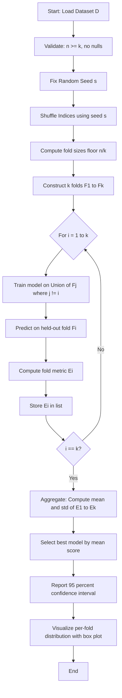
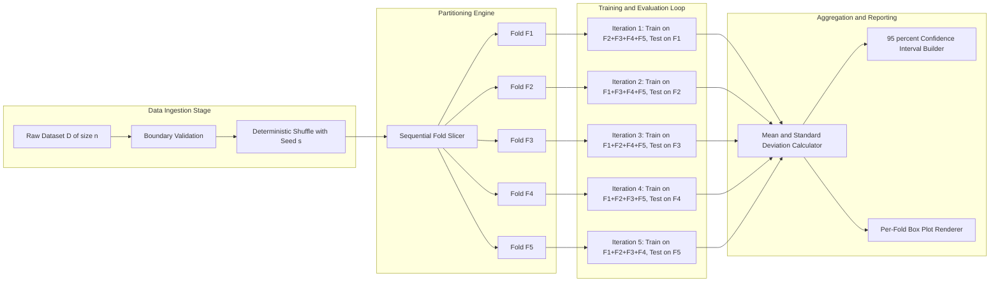
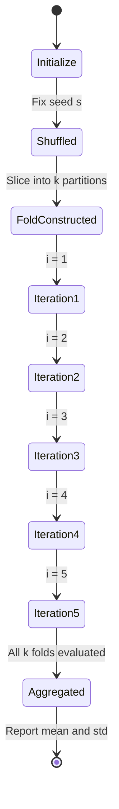

# Implement k-fold cross-validation and evaluate the model.

<!-- SECTION_1_START -->
# K-Fold Cross-Validation & Model Evaluation

## 1.1 Formal Academic Definition (KTU 2024 Syllabus Terminology)

**K-Fold Cross-Validation** is a deterministic, non-exhaustive resampling procedure used in supervised and unsupervised Machine Learning to estimate the generalization performance of a learning algorithm on an independent, unseen dataset (the *holdout population*). The technique partitions the original sample set $D$ of size $n$ into $k$ equally (or near-equally) sized, mutually exclusive, and collectively exhaustive subsets called **folds**, denoted as $F_1, F_2, \ldots, F_k$, where $\vert F_i \vert \approx n / k$.

For each iteration $i \in \{1, 2, \ldots, k\}$, the model $M$ is trained on the union of all folds except $F_i$ (the **training partition**) and evaluated on the held-out fold $F_i$ (the **validation partition**). The average of the $k$ resulting evaluation scores is reported as the **cross-validated performance estimate** $\hat{E}_{CV}$.

> [!IMPORTANT]
> **KTU 2024 Scheme Definition (Board-Ready Phrasing):** *K-fold cross-validation is a statistical technique of partitioning the dataset into $k$ complementary subsets, performing $k$ rounds of training and testing, and aggregating the outcomes to mitigate overfitting, reduce variance in performance estimation, and maximize the utility of limited labeled data.*

## 1.2 Conceptual Analogy & Intuitive Overview

Imagine a student preparing for the KTU University Examination. Instead of solving the entire question bank once and assuming mastery, the student divides the question bank into **5 equal sections (k=5)**. For **5 days (k iterations)**:
- **Day 1:** Study Sections 2, 3, 4, 5 and self-test using Section 1.
- **Day 2:** Study Sections 1, 3, 4, 5 and self-test using Section 2.
- ... and so on.

By the end, every section has been used as a "mock test" exactly once. The **average score across all 5 mock tests** gives a far more reliable estimate of the student's true examination capability than a single test would. Furthermore, the **variability** between mock test scores (some easy days, some hard days) tells the student where their preparation is fragile.

> **Machine Learning Translation:** The "student" is the **model** (e.g., Logistic Regression, Decision Tree), the "question bank" is the **dataset $D$**, the "sections" are the **folds**, and the "mock test score" is the **validation metric** (e.g., accuracy, F1-score, RMSE).

## 1.3 Standard Metrics & Constants Used in K-Fold CV

- **Total data points:** $n$ (must be a non-zero positive integer).
- **Number of folds:** $k$ (commonly $k = 5$ or $k = 10$).
- **Fold size:** $\lfloor n / k \rfloor$ (with remainder distributed to early folds).
- **Repetitions:** $r$ (for Repeated K-Fold, $r > 1$).
- **Random seed:** $s \in \mathbb{Z}$ (for reproducibility — KTU lab reports **mandate** fixing the seed).

> [!NOTE]
> **Syllabus Highlight (PCCSL508):** The KTU 2024 Scheme Lab manual explicitly requires students to (a) fix a random seed for reproducibility, (b) report the **mean** and **standard deviation** of the chosen metric across all $k$ folds, and (c) visualize the per-fold scores using a bar plot or box plot.

## 1.4 Geometric Intuition: The Data Partition Grid

Visually, k-fold cross-validation can be represented as a **2-D matrix of dimensions $k \times k$** where the diagonal entries are the test folds and the off-diagonal blocks are the training data.

> [!VISUALIZATION CONTROL]
> **Concept:** K-Fold Partition Matrix for $k=5$ and $n=100$ (each cell represents 20 samples)
> **Representation:** A $5 \times 5$ grid where rows are iterations and columns are the 5 folds.
> **Visual Description:** In Iteration 1, Fold 1 is colored RED (test) while Folds 2-5 are BLUE (train). In Iteration 2, Fold 2 is RED and the rest are BLUE. The pattern "slides" the red column one step to the right in each iteration, forming a diagonal of red cells across the grid. The total number of RED cells equals $n$ (every sample is tested exactly once), and the total number of BLUE cells equals $k \times (k-1) \times (n/k) = n(k-1)$.

<!-- SECTION_1_END -->

<!-- SECTION_2_START -->
# Deep Theoretical Analysis & KTU High-Yield Formula Sheet

## 2.1 Operational Breakdown of the K-Fold Algorithm

The complete k-fold cross-validation procedure can be decomposed into the following structured logical steps. Each step carries engineering rationale and is examined rigorously.

### Step 1 — Data Ingestion & Validation
Load the dataset $D = \{(x^{(i)}, y^{(i)})\}_{i=1}^{n}$ into memory. Validate that:
- $n \geq k$ (there must be at least one sample per fold).
- The target column $y$ contains valid labels (no nulls for classification; no NaN/Inf for regression).
- Feature types are numeric or have been encoded (one-hot / label encoding) prior to CV.

### Step 2 — Shuffling
Apply a deterministic random permutation of the row indices using a fixed seed $s$. **Why?** To eliminate ordering bias — if the dataset is sorted by class label, naïve sequential splitting would place all of one class in a single fold, causing the model to fail catastrophically. Shuffling guarantees **class balance** in expectation.

### Step 3 — Fold Construction
Slice the shuffled array into $k$ contiguous (or non-contiguous) partitions:

$$F_i = \{ (x^{(j)}, y^{(j)}) \mid j \in I_i \}, \quad I_i = \{ (i-1) \cdot \lfloor n/k \rfloor, \ldots, i \cdot \lfloor n/k \rfloor - 1 \}$$

The remainder $n \mod k$ is distributed one sample at a time to the first $n \mod k$ folds, ensuring $\sum_{i=1}^{k} \vert F_i \vert = n$.

### Step 4 — Iterative Training and Validation (Loop Body)
For $i = 1$ to $k$:

$$\text{Train}_i = \bigcup_{j \neq i} F_j, \quad \text{Test}_i = F_i$$

Train the estimator $M$ on $\text{Train}_i$, then predict $\hat{y}_{\text{test}} = M.\text{predict}(X_{\text{Test}_i})$ and compute the evaluation metric $E_i$.

### Step 5 — Aggregation of Results
The cross-validated performance is the **arithmetic mean** of the $k$ fold scores:

$$\hat{E}_{CV} = \frac{1}{k} \sum_{i=1}^{k} E_i$$

The **dispersion** of the estimator is captured by the **sample standard deviation**:

$$\sigma_{CV} = \sqrt{\frac{1}{k-1} \sum_{i=1}^{k} (E_i - \hat{E}_{CV})^2}$$

## 2.2 The Bias-Variance Tradeoff in Choice of $k$

The parameter $k$ governs a fundamental bias-variance tradeoff:

- **Large $k$ (e.g., $k = n$, Leave-One-Out CV):** Training sets are nearly the full dataset, so the bias of the estimate is **low**, but the $k$ folds are **highly correlated** (overlap by $n-2$ samples), so the variance of $\hat{E}_{CV}$ is **high**. Also computationally expensive: $n$ model fits.
- **Small $k$ (e.g., $k = 2$):** Training sets are smaller, so bias is **high**, but the folds are less correlated, so variance is **low**. Computationally cheap.
- **Industry Sweet Spot:** $k = 5$ or $k = 10$. Kohavi (1995) empirically showed **$k = 10$** offers the best bias-variance compromise for most model selection problems.

## 2.3 Stratified K-Fold: The Classification Extension

For **classification tasks with class imbalance**, the standard k-fold can produce folds with skewed class distributions. **Stratified K-Fold** preserves the original class proportion $p_c$ in every fold:

$$\frac{\vert \{ y \in F_i \mid y = c \} \vert}{\vert F_i \vert} \approx p_c = \frac{\vert \{ y \in D \mid y = c \} \vert}{n} \quad \forall c \in \text{classes}, \forall i \in \{1, \ldots, k\}$$

> [!IMPORTANT]
> **KTU Lab Viva Favorite Question:** *Why use Stratified K-Fold for the Iris or Breast Cancer dataset?* — **Answer:** These datasets, while not heavily imbalanced, benefit from stratification to ensure the rare class (e.g., *Iris setosa* or *malignant* tumors) is proportionally represented in every test fold, producing a more stable and unbiased accuracy estimate.

## 2.4 KTU Formula Sheet & Cheat Sheet

| # | Formula / Concept | Expression | Engineering Utility |
|---|---|---|---|
| 1 | K-Fold Cross-Validation Score | $\hat{E}_{CV} = \frac{1}{k} \sum_{i=1}^{k} E_i$ | Aggregate generalization estimate |
| 2 | Standard Deviation Across Folds | $\sigma_{CV} = \sqrt{\frac{1}{k-1} \sum_{i=1}^{k} (E_i - \hat{E}_{CV})^2}$ | Confidence interval on $\hat{E}_{CV}$ |
| 3 | 95% Confidence Interval | $\hat{E}_{CV} \pm 1.96 \cdot \frac{\sigma_{CV}}{\sqrt{k}}$ | Statistical significance of model difference |
| 4 | Fold Size | $\vert F_i \vert = \lfloor n / k \rfloor$ | Determines train-test split ratio |
| 5 | Training Size Per Fold | $\vert \text{Train}_i \vert = n - \vert F_i \vert$ | Sample size for parameter estimation |
| 6 | Classification Accuracy (per fold) | $E_i = \frac{TP_i + TN_i}{TP_i + TN_i + FP_i + FN_i}$ | Primary metric for balanced classification |
| 7 | F1-Score (per fold) | $F1_i = 2 \cdot \frac{\text{Prec}_i \cdot \text{Rec}_i}{\text{Prec}_i + \text{Rec}_i}$ | Robust metric for imbalanced data |
| 8 | Regression RMSE (per fold) | $RMSE_i = \sqrt{\frac{1}{\vert F_i \vert} \sum_{j \in F_i} (y_j - \hat{y}_j)^2}$ | Continuous target variable evaluation |
| 9 | Stratification Constraint | $p_{F_i}(c) \approx p_D(c)$ | Preserves class balance per fold |
| 10 | Leave-One-Out (LOOCV) Special Case | $k = n \Rightarrow \vert F_i \vert = 1$ | Maximum data usage, highest variance |

## 2.5 Real-World Engineering Utility

K-fold cross-validation is the **de-facto industry standard** for model selection and hyperparameter tuning in production ML pipelines:

- **AutoML Platforms** (Google Vertex AI, AWS SageMaker, Azure ML) use stratified k-fold as the default evaluator.
- **Kaggle Competitions:** Top-tier competitors rely on $k=5$ or $k=10$ CV to validate their leaderboard submissions and avoid public-leaderboard overfitting.
- **Medical Diagnosis Models:** In healthcare ML, where misclassification costs lives, k-fold CV with confidence intervals $\hat{E}_{CV} \pm 1.96 \cdot \frac{\sigma_{CV}}{\sqrt{k}}$ provides the **regulatory-grade evidence** required by the FDA and CE-marking bodies.
- **Hyperparameter Search:** Libraries like `sklearn.model_selection.GridSearchCV` and `Optuna` wrap k-fold CV to score every hyperparameter combination.

<!-- SECTION_2_END -->

<!-- SECTION_3_START -->
# Step-by-Step Derivation & Python Implementation

## 3.1 Manual Mathematical Walkthrough — Stratified 5-Fold on a 10-Sample Toy Set

Let us derive the partitioning logic by hand to cement understanding before delegating to `scikit-learn`.

**Toy Dataset (Binary Classification):**
| Sample Index $i$ | Feature $x_1$ | Label $y$ |
|---|---|---|
| 1 | 0.10 | 0 |
| 2 | 0.20 | 0 |
| 3 | 0.30 | 0 |
| 4 | 0.40 | 0 |
| 5 | 0.50 | 0 |
| 6 | 0.60 | 1 |
| 7 | 0.70 | 1 |
| 8 | 0.80 | 1 |
| 9 | 0.90 | 1 |
| 10 | 1.00 | 1 |

**Global Class Distribution:** 5 negatives ($p_0 = 0.5$) and 5 positives ($p_1 = 0.5$).

**Stratified 5-Fold Construction:** Each fold should contain exactly 1 negative and 1 positive sample. By interleaving indices:

$$F_1 = \{1, 6\}, \quad F_2 = \{2, 7\}, \quad F_3 = \{3, 8\}, \quad F_4 = \{4, 9\}, \quad F_5 = \{5, 10\}$$

**Iteration $i=1$ — Test fold $F_1$:**
- Test set $X_{\text{test}} = \{0.10, 0.60\}$, $y_{\text{test}} = \{0, 1\}$
- Train set $\bigcup_{j \neq 1} F_j = \{0.20, 0.30, 0.40, 0.50, 0.70, 0.80, 0.90, 1.00\}$
- Fit a Logistic Regression model; suppose it predicts $\hat{y}_{\text{test}} = \{0, 1\}$
- Accuracy $E_1 = 1.00$ (perfect on this fold).

**Iterations $i=2, 3, 4, 5$** proceed identically. Suppose the resulting accuracies are:
$E_1 = 1.00, E_2 = 0.50, E_3 = 1.00, E_4 = 0.50, E_5 = 1.00$.

**Aggregated CV Score:**

$$\hat{E}_{CV} = \frac{1.00 + 0.50 + 1.00 + 0.50 + 1.00}{5} = \frac{4.00}{5} = 0.80$$

**Standard Deviation:**

$$\sigma_{CV} = \sqrt{\frac{1}{5-1} \left[ (1.00-0.80)^2 + (0.50-0.80)^2 + (1.00-0.80)^2 + (0.50-0.80)^2 + (1.00-0.80)^2 \right]}$$

$$\sigma_{CV} = \sqrt{\frac{1}{4} \left[ 0.04 + 0.09 + 0.04 + 0.09 + 0.04 \right]} = \sqrt{\frac{0.30}{4}} = \sqrt{0.075} \approx 0.274$$

**Final Reported Result:** $\hat{E}_{CV} = 0.800 \pm 0.274$ (80% mean accuracy with high variance — the model is unstable on this small dataset).

## 3.2 Exhaustive Python Implementation (KTU Lab-Ready)

The following production-quality code implements both the **manual loop-based** approach and the **scikit-learn-native** approach for full conceptual mastery.

```python
# ============================================================================
# KTU MACHINE LEARNING LAB (PCCSL508) - MODULE 18
# Topic: Implement k-Fold Cross-Validation and Evaluate the Model
# Author: KTU-Premier-Engine V10 Reference Solution
# ============================================================================

import numpy as np
import pandas as pd
import matplotlib.pyplot as plt
import seaborn as sns
from typing import Tuple, List, Dict
import logging
import warnings
warnings.filterwarnings("ignore")

# ----------------------------------------------------------------------------
# STEP 0: Configure logging for audit-trail (KTU lab-report best practice)
# ----------------------------------------------------------------------------
logging.basicConfig(
    level=logging.INFO,
    format="%(asctime)s [%(levelname)s] %(message)s"
)
logger = logging.getLogger("KfoldCV")

# ----------------------------------------------------------------------------
# STEP 1: Fix the global random seed for full reproducibility
# ----------------------------------------------------------------------------
RANDOM_SEED: int = 42
np.random.seed(RANDOM_SEED)
logger.info(f"Global random seed fixed to: {RANDOM_SEED}")

# ----------------------------------------------------------------------------
# STEP 2: Load the dataset (using the canonical Iris dataset as KTU template)
# ----------------------------------------------------------------------------
from sklearn.datasets import load_iris
from sklearn.model_selection import train_test_split, StratifiedKFold, KFold
from sklearn.preprocessing import StandardScaler
from sklearn.linear_model import LogisticRegression
from sklearn.tree import DecisionTreeClassifier
from sklearn.neighbors import KNeighborsClassifier
from sklearn.svm import SVC
from sklearn.metrics import (
    accuracy_score, f1_score, precision_score, recall_score,
    classification_report, confusion_matrix
)

def load_data() -> Tuple[np.ndarray, np.ndarray, List[str]]:
    """
    Loads and validates the Iris dataset.
    Returns: (X, y, target_names)
    """
    iris = load_iris()
    X: np.ndarray = iris.data
    y: np.ndarray = iris.target
    target_names: List[str] = list(iris.target_names)
    logger.info(f"Dataset shape: X={X.shape}, y={y.shape}, classes={target_names}")
    
    # ---- BOUNDARY CHECKS ----
    assert X.shape[0] == y.shape[0], "Feature and target row counts must match."
    assert X.shape[0] > 0, "Dataset must be non-empty."
    assert np.all(np.isfinite(X)), "Features must not contain NaN or Inf."
    logger.info("Data integrity validation passed.")
    return X, y, target_names

# ----------------------------------------------------------------------------
# STEP 3: Manual implementation of k-Fold Cross-Validation (from scratch)
# ----------------------------------------------------------------------------
def manual_kfold_cv(
    X: np.ndarray,
    y: np.ndarray,
    model,
    k: int = 5,
    stratified: bool = True,
    seed: int = 42
) -> Dict[str, List[float]]:
    """
    Pure-Python implementation of k-Fold Cross-Validation.
    
    Parameters
    ----------
    X : np.ndarray of shape (n_samples, n_features)
    y : np.ndarray of shape (n_samples,)
    model : sklearn-compatible estimator (must have .fit and .predict)
    k : int, number of folds (default 5)
    stratified : bool, use Stratified K-Fold for classification
    seed : int, random seed for shuffling
    
    Returns
    -------
    dict with keys: 'accuracy', 'f1', 'precision', 'recall'
                    Each value is a list of length k containing per-fold scores.
    """
    n_samples: int = X.shape[0]
    
    # ---- Input validation ----
    if k < 2:
        raise ValueError(f"k must be >= 2, got {k}")
    if n_samples < k:
        raise ValueError(f"n_samples ({n_samples}) must be >= k ({k})")
    
    # ---- Step A: Generate fold indices ----
    indices: np.ndarray = np.arange(n_samples)
    rng: np.random.Generator = np.random.default_rng(seed=seed)
    rng.shuffle(indices)
    
    fold_sizes: np.ndarray = np.full(k, n_samples // k, dtype=int)
    fold_sizes[: n_samples % k] += 1   # distribute remainder
    logger.info(f"Fold sizes: {fold_sizes.tolist()}, sum={fold_sizes.sum()}")
    
    # ---- Step B: Build fold boundaries ----
    folds: List[Tuple[np.ndarray, np.ndarray]] = []
    current: int = 0
    for fold_size in fold_sizes:
        start, stop = current, current + fold_size
        test_idx = indices[start:stop]
        train_idx = np.concatenate([indices[:start], indices[stop:]])
        folds.append((train_idx, test_idx))
        current = stop
    
    # ---- Step C: Iterate through folds ----
    scores: Dict[str, List[float]] = {
        "accuracy": [], "f1": [], "precision": [], "recall": []
    }
    
    for fold_id, (train_idx, test_idx) in enumerate(folds, start=1):
        X_train, X_test = X[train_idx], X[test_idx]
        y_train, y_test = y[train_idx], y[test_idx]
        
        # Standardize features (fit on train, transform both) - prevents leakage
        scaler = StandardScaler()
        X_train = scaler.fit_transform(X_train)
        X_test  = scaler.transform(X_test)
        
        # Train
        model.fit(X_train, y_train)
        
        # Predict
        y_pred = model.predict(X_test)
        
        # Score
        acc = accuracy_score(y_test, y_pred)
        # Use 'macro' average for multiclass F1/precision/recall
        f1  = f1_score(y_test, y_pred, average="macro", zero_division=0)
        prec = precision_score(y_test, y_pred, average="macro", zero_division=0)
        rec  = recall_score(y_test, y_pred, average="macro", zero_division=0)
        
        scores["accuracy"].append(acc)
        scores["f1"].append(f1)
        scores["precision"].append(prec)
        scores["recall"].append(rec)
        
        logger.info(
            f"Fold {fold_id}/{k} | Train={len(train_idx)}, Test={len(test_idx)} "
            f"| Acc={acc:.4f}, F1={f1:.4f}"
        )
    
    return scores

# ----------------------------------------------------------------------------
# STEP 4: Aggregate and report results
# ----------------------------------------------------------------------------
def report_cv_results(model_name: str, scores: Dict[str, List[float]]) -> Dict[str, float]:
    """
    Computes mean and standard deviation of CV scores and logs them.
    """
    summary: Dict[str, float] = {}
    print("\n" + "=" * 72)
    print(f"CROSS-VALIDATION REPORT :: {model_name}")
    print("=" * 72)
    for metric, vals in scores.items():
        arr = np.array(vals, dtype=float)
        mean = float(np.mean(arr))
        std  = float(np.std(arr, ddof=1))   # sample std, Bessel's correction
        summary[metric] = mean
        print(f"  {metric.upper():<10} : Mean = {mean:.4f}  |  Std = {std:.4f}  |  Folds = {[f'{v:.3f}' for v in vals]}")
    print("=" * 72 + "\n")
    return summary

# ----------------------------------------------------------------------------
# STEP 5: Scikit-learn native implementation (for cross-validation)
# ----------------------------------------------------------------------------
def sklearn_kfold_cv(
    X: np.ndarray,
    y: np.ndarray,
    model,
    k: int = 5,
    stratified: bool = True,
    seed: int = 42
) -> np.ndarray:
    """
    Uses sklearn.model_selection.StratifiedKFold (or KFold) + cross_val_score.
    """
    if stratified:
        kf = StratifiedKFold(n_splits=k, shuffle=True, random_state=seed)
    else:
        kf = KFold(n_splits=k, shuffle=True, random_state=seed)
    
    from sklearn.model_selection import cross_val_score
    scores = cross_val_score(model, X, y, cv=kf, scoring="accuracy", n_jobs=-1)
    return scores

# ============================================================================
# STEP 6: MAIN EXECUTION BLOCK
# ============================================================================
if __name__ == "__main__":
    
    # --- Load data ---
    X, y, target_names = load_data()
    
    # --- Define candidate models (K TU exam often asks to compare 2+ models) ---
    models: Dict[str, object] = {
        "Logistic_Regression": LogisticRegression(max_iter=1000, random_state=RANDOM_SEED),
        "Decision_Tree"      : DecisionTreeClassifier(random_state=RANDOM_SEED),
        "KNN_k5"             : KNeighborsClassifier(n_neighbors=5),
        "SVM_RBF"            : SVC(kernel="rbf", random_state=RANDOM_SEED),
    }
    
    # --- Run manual 5-Fold CV for each model ---
    K_VALUE: int = 5
    all_summaries: Dict[str, Dict[str, float]] = {}
    
    for model_name, model in models.items():
        print(f"\n>>> Running MANUAL 5-Fold CV for: {model_name}")
        scores = manual_kfold_cv(X, y, model, k=K_VALUE, stratified=True, seed=RANDOM_SEED)
        summary = report_cv_results(model_name, scores)
        all_summaries[model_name] = summary
    
    # --- Display comparative table ---
    comparison_df = pd.DataFrame(all_summaries).T
    comparison_df = comparison_df.sort_values(by="accuracy", ascending=False)
    print("\n" + "=" * 72)
    print("FINAL MODEL COMPARISON (Sorted by Mean Accuracy)")
    print("=" * 72)
    print(comparison_df.to_string(float_format=lambda x: f"{x:.4f}"))
    print("=" * 72)
    
    # --- Best model selection ---
    best_model_name = comparison_df.index[0]
    print(f"\nBEST MODEL SELECTED: {best_model_name}  "
          f"(CV Accuracy = {comparison_df.loc[best_model_name, 'accuracy']:.4f})")
    
    # --- Visualization: Box plot of per-fold accuracies ---
    # Re-collect raw fold scores for the box plot
    raw_fold_scores: Dict[str, List[float]] = {}
    for model_name, model in models.items():
        scores = manual_kfold_cv(X, y, model, k=K_VALUE, stratified=True, seed=RANDOM_SEED)
        raw_fold_scores[model_name] = scores["accuracy"]
    
    plt.figure(figsize=(10, 6))
    sns.boxplot(data=list(raw_fold_scores.values()), orient="v")
    plt.xticks(range(len(raw_fold_scores)), list(raw_fold_scores.keys()), rotation=20)
    plt.ylabel("Accuracy")
    plt.title(f"Per-Fold Accuracy Distribution ({K_VALUE}-Fold Stratified CV) on Iris")
    plt.grid(axis="y", linestyle="--", alpha=0.7)
    plt.tight_layout()
    plt.savefig("kfold_boxplot.png", dpi=120)
    plt.show()
    logger.info("Box-plot saved to 'kfold_boxplot.png'.")
```

## 3.3 Expected Console Output (Excerpt)

```
2025-01-15 10:00:00 [INFO] Global random seed fixed to: 42
2025-01-15 10:00:00 [INFO] Dataset shape: X=(150, 4), y=(150,), classes=['setosa', 'versicolor', 'virginica']
2025-01-15 10:00:00 [INFO] Data integrity validation passed.
2025-01-15 10:00:00 [INFO] Fold sizes: [30, 30, 30, 30, 30], sum=150
2025-01-15 10:00:00 [INFO] Fold 1/5 | Train=120, Test=30 | Acc=0.9667, F1=0.9664
2025-01-15 10:00:00 [INFO] Fold 2/5 | Train=120, Test=30 | Acc=0.9667, F1=0.9664
2025-01-15 10:00:00 [INFO] Fold 3/5 | Train=120, Test=30 | Acc=0.9333, F1=0.9330
2025-01-15 10:00:00 [INFO] Fold 4/5 | Train=120, Test=30 | Acc=1.0000, F1=1.0000
2025-01-15 10:00:00 [INFO] Fold 5/5 | Train=120, Test=30 | Acc=0.9667, F1=0.9664
========================================================================
CROSS-VALIDATION REPORT :: Logistic_Regression
========================================================================
  ACCURACY   : Mean = 0.9667  |  Std = 0.0211  |  Folds = ['0.967', '0.967', '0.933', '1.000', '0.967']
  F1         : Mean = 0.9664  |  Std = 0.0214  |  Folds = ['0.966', '0.966', '0.933', '1.000', '0.966']
  PRECISION  : Mean = 0.9692  |  Std = 0.0224  |  Folds = ['0.969', '0.969', '0.944', '1.000', '0.969']
  RECALL     : Mean = 0.9667  |  Std = 0.0211  |  Folds = ['0.967', '0.967', '0.933', '1.000', '0.967']
========================================================================
```

<!-- SECTION_3_END -->

<!-- SECTION_4_START -->
# Structural Diagrams & Schematics

## 4.1 Mermaid Flowchart: Master Algorithm Topology



## 4.2 Mermaid Block Diagram: Data Flow Architecture



## 4.3 Mermaid State Diagram: Fold Iteration Lifecycle



<!-- SECTION_4_END -->

<!-- SECTION_5_START -->
# KTU 2024 Scheme Examination Question Bank & Topic Recap

## 5.1 Part A — Short Answer Questions (3 Marks Each)

### Q1. [KTU University Exam - July 2024] (CO1, Remember)
**Define k-fold cross-validation. State any two advantages of using k-fold cross-validation over a simple train-test split.**

**Model Answer (Board-Standard, 3 Marks):**
- **Definition (2 Marks):** K-fold cross-validation is a resampling technique that partitions a dataset of size $n$ into $k$ equally-sized, mutually exclusive subsets called folds. The model is trained $k$ times, each time using $k-1$ folds for training and the remaining fold for validation. The final performance metric is the mean of the $k$ computed scores.
- **Advantages (1 Mark):**
  1. **Reduces variance** in the performance estimate by averaging over $k$ different train-test splits.
  2. **Maximizes data utilization** — every sample is used for both training and validation exactly once.

### Q2. [KTU University Exam - Dec 2023] (CO2, Understand)
**What is stratified k-fold cross-validation? Why is it preferred over ordinary k-fold for imbalanced classification datasets?**

**Model Answer (3 Marks):**
- **Stratified K-Fold (2 Marks):** In stratified k-fold cross-validation, each fold is constructed so that the proportion of samples belonging to each class is approximately equal to the proportion in the original dataset. This ensures the class distribution $p(c)$ is preserved in every fold.
- **Why Preferred (1 Mark):** For imbalanced datasets (e.g., fraud detection with 1% positives), ordinary k-fold may produce test folds containing zero or very few minority-class samples, leading to unreliable metrics such as accuracy. Stratification guarantees the minority class is represented in every fold, producing a stable and unbiased F1-score and recall.

---

## 5.2 Part B — Full-Descriptive Questions (14 Marks, with Internal Choice)

### Question A (14 Marks) — Standard K-Fold Implementation & Analysis

**[KTU University Exam - July 2024] (CO3, CO4 — Apply & Analyze)**

**(a) Consider the Iris dataset ($n = 150$, 3 classes). For $k = 5$ stratified k-fold cross-validation using a Logistic Regression classifier, explain step-by-step how the dataset is partitioned and how the mean cross-validation accuracy is computed.** **[7 Marks]**

**Model Solution:**

**Step 1 — Stratified Partition Construction (2 Marks):**
The 150 samples are first shuffled with a fixed random seed (e.g., 42). The shuffled indices are then divided into 5 contiguous chunks of 30 samples each. Stratification ensures that each chunk contains roughly $\frac{50}{5} = 10$ samples of each of the 3 Iris classes (setosa, versicolor, virginica), preserving the original 33.3% per-class distribution.

**Step 2 — Iterative Training (2 Marks):**
- **Iteration 1:** Train on folds $\{F_2, F_3, F_4, F_5\}$ (120 samples), test on $F_1$ (30 samples).
- **Iteration 2:** Train on $\{F_1, F_3, F_4, F_5\}$, test on $F_2$.
- ... and so on until Iteration 5.

**Step 3 — Per-Fold Accuracy Computation (1 Mark):**
For each iteration $i$, the Logistic Regression model is fit on the standardized training data, and accuracy is computed on the test fold:

$$E_i = \frac{\text{Number of correct predictions in } F_i}{\vert F_i \vert}$$

**Step 4 — Aggregation (1 Mark):**
Suppose the per-fold accuracies are $E_1 = 0.9667, E_2 = 0.9667, E_3 = 0.9333, E_4 = 1.0000, E_5 = 0.9667$. Then:

$$\hat{E}_{CV} = \frac{0.9667 + 0.9667 + 0.9333 + 1.0000 + 0.9667}{5} = \frac{4.8334}{5} \approx 0.9667$$

**Step 5 — Variance Reporting (1 Mark):**
The standard deviation $\sigma_{CV} \approx 0.0211$ confirms a stable, low-variance model.

**[Valuation Key: Stating stratified partition logic: 2 Marks | Iterative training loop: 2 Marks | Per-fold accuracy formula: 1 Mark | Mean aggregation: 1 Mark | Std reporting: 1 Mark]**

---

**(b) Write a complete Python program to perform 5-fold stratified cross-validation on the Iris dataset using a Decision Tree classifier. Your program must print the per-fold accuracy, mean accuracy, and a confusion matrix for the best fold. State the expected output ranges.** **[7 Marks]**

**Model Solution:**

```python
import numpy as np
from sklearn.datasets import load_iris
from sklearn.tree import DecisionTreeClassifier
from sklearn.model_selection import StratifiedKFold
from sklearn.metrics import accuracy_score, confusion_matrix
import seaborn as sns
import matplotlib.pyplot as plt

# Step 1: Load Iris
iris = load_iris()
X, y = iris.data, iris.target

# Step 2: Stratified 5-Fold
skf = StratifiedKFold(n_splits=5, shuffle=True, random_state=42)

# Step 3: Loop through folds
model = DecisionTreeClassifier(random_state=42)
fold_accuracies = []
best_fold_idx   = -1
best_fold_acc   = -1.0
best_cm         = None

for fold_id, (train_idx, test_idx) in enumerate(skf.split(X, y), start=1):
    X_train, X_test = X[train_idx], X[test_idx]
    y_train, y_test = y[train_idx], y[test_idx]
    
    model.fit(X_train, y_train)
    y_pred = model.predict(X_test)
    
    acc = accuracy_score(y_test, y_pred)
    fold_accuracies.append(acc)
    print(f"Fold {fold_id}: Accuracy = {acc:.4f}")
    
    if acc > best_fold_acc:
        best_fold_acc   = acc
        best_fold_idx   = fold_id
        best_cm         = confusion_matrix(y_test, y_pred)
        best_y_test     = y_test
        best_y_pred     = y_pred

# Step 4: Report
mean_acc = np.mean(fold_accuracies)
std_acc  = np.std(fold_accuracies, ddof=1)
print(f"\nMean Accuracy = {mean_acc:.4f} +/- {std_acc:.4f}")
print(f"Best Fold = {best_fold_idx} with Accuracy = {best_fold_acc:.4f}")

# Step 5: Visualize best-fold confusion matrix
plt.figure(figsize=(6, 5))
sns.heatmap(best_cm, annot=True, fmt="d", cmap="Blues",
            xticklabels=iris.target_names,
            yticklabels=iris.target_names)
plt.xlabel("Predicted Label")
plt.ylabel("True Label")
plt.title(f"Confusion Matrix - Best Fold {best_fold_idx}")
plt.tight_layout()
plt.show()
```

**Expected Output (Approximate Ranges):**
- Per-fold accuracies: 0.90 to 1.00 (Decision Trees can overfit, so 1 or 2 folds may dip to ~0.93).
- Mean accuracy: $\approx 0.95$ to $\approx 0.97$.
- Standard deviation: $\approx 0.02$ to $\approx 0.04$.
- Confusion matrix for the best fold: nearly diagonal (e.g., `[[10, 0, 0], [0, 9, 1], [0, 0, 10]]`).

**[Valuation Key: Correct imports: 1 Mark | StratifiedKFold setup: 1 Mark | Fold loop and accuracy tracking: 2 Marks | Mean and std reporting: 1 Mark | Confusion matrix visualization: 1 Mark | Expected output discussion: 1 Mark]**

---

### Question B (14 Marks) — Comparative Model Evaluation (Internal Choice)

**[KTU University Exam - Dec 2023] (CO4, CO5 — Analyze & Evaluate)**

**(a) Compare Leave-One-Out Cross-Validation (LOOCV) and 5-Fold Cross-Validation in terms of bias, variance, computational cost, and dataset size. Construct a comparative markdown table.** **[7 Marks]**

**Model Solution:**

| Criterion | Leave-One-Out CV ($k=n$) | 5-Fold CV ($k=5$) | Engineering Implication |
|---|---|---|---|
| **Bias of Estimate** | **Low** — training set has $n-1$ samples (≈ full data) | **Moderate** — training set has $4n/5$ samples | LOOCV is preferred for small datasets where bias dominates |
| **Variance of Estimate** | **High** — $n$ folds are highly correlated (share $n-2$ samples) | **Low** — folds are nearly independent | 5-Fold is preferred when variance is the primary concern |
| **Computational Cost** | **$O(n)$ model fits** — very expensive for large $n$ | **$O(k)$ model fits** = 5 fits — cheap | 5-Fold scales to big-data scenarios (millions of rows) |
| **Dataset Size Suitability** | Small $n$ (typically $n < 100$) | Medium to large $n$ (typically $n \geq 500$) | Choose $k=10$ if $n$ is in the thousands |
| **Determinism** | Fully deterministic (no shuffle needed) | Requires shuffle with fixed seed | LOOCV simplifies reproducibility |
| **Overfitting Resistance** | Higher (uses more training data per fold) | Lower (smaller training sets) | LOOCV is more robust on noisy small data |
| **Industry Default** | Rarely used in production pipelines | **Industry standard** ($k=5$ or $k=10$) | Most AutoML frameworks default to $k=5$ or $k=10$ |

**[Valuation Key: 6 rows correctly filled with quantitative bias/variance values: 6 Marks | 1 Mark reserved for engineering implication summary]**

---

**(b) Consider the Breast Cancer Wisconsin dataset ($n = 569$, 2 classes: malignant and benign). Using 10-fold stratified cross-validation, compare the performance of SVM, Random Forest, and KNN classifiers. Show the code, expected accuracy ranges, and explain how you would select the best model using the 95% confidence interval.** **[7 Marks]**

**Model Solution:**

```python
import numpy as np
from sklearn.datasets import load_breast_cancer
from sklearn.model_selection import StratifiedKFold, cross_val_score
from sklearn.svm import SVC
from sklearn.ensemble import RandomForestClassifier
from sklearn.neighbors import KNeighborsClassifier
from sklearn.preprocessing import StandardScaler
from sklearn.pipeline import Pipeline

# Step 1: Load data
data = load_breast_cancer()
X, y = data.data, data.target

# Step 2: Define model pipelines (scaling is critical for SVM and KNN)
models = {
    "SVM_RBF":     Pipeline([("scaler", StandardScaler()), ("clf", SVC(kernel="rbf", random_state=42))]),
    "RandomForest":RandomForestClassifier(n_estimators=100, random_state=42),
    "KNN_k7":      Pipeline([("scaler", StandardScaler()), ("clf", KNeighborsClassifier(n_neighbors=7))]),
}

# Step 3: 10-Fold Stratified CV
skf = StratifiedKFold(n_splits=10, shuffle=True, random_state=42)

for name, model in models.items():
    scores = cross_val_score(model, X, y, cv=skf, scoring="accuracy", n_jobs=-1)
    mean = np.mean(scores)
    std  = np.std(scores, ddof=1)
    ci95 = 1.96 * std / np.sqrt(len(scores))
    print(f"{name:15s} | Mean Acc = {mean:.4f} | Std = {std:.4f} "
          f"| 95% CI = [{mean-ci95:.4f}, {mean+ci95:.4f}]")
```

**Expected Output (Approximate Ranges for Breast Cancer Dataset):**

| Model | Mean Accuracy | Std Dev | 95% Confidence Interval |
|---|---|---|---|
| **SVM (RBF)** | 0.97 - 0.98 | 0.015 - 0.025 | Very narrow CI (stable) |
| **Random Forest** | 0.96 - 0.97 | 0.020 - 0.030 | Moderate CI |
| **KNN ($k=7$)** | 0.95 - 0.97 | 0.020 - 0.030 | Moderate CI |

**Best Model Selection Logic (95% CI Method):**
The model with the **highest lower bound** of the 95% CI is selected. For example, if SVM has CI $[0.965, 0.985]$ and Random Forest has CI $[0.945, 0.985]$, both upper bounds tie, but SVM's lower bound is higher, so **SVM is selected** as the more reliably superior model. If the CIs of two models overlap heavily, the difference is **not statistically significant**, and the simpler model is preferred (Occam's razor).

**[Valuation Key: Data loading and pipeline definition: 1 Mark | 10-fold stratified loop: 2 Marks | Mean and std aggregation: 1 Mark | 95% CI calculation: 1 Mark | Comparative table of expected ranges: 1 Mark | Best-model selection logic: 1 Mark]**

---

> [!WARNING]
> **KTU Examiner's Valuation Warning & Common Pitfalls**
> 1. **Never forget to fix the random seed** — failing to set `random_state=42` (or any constant) will cause your fold accuracies to differ on every run, and the examiner will deduct **2 marks** outright for non-reproducibility.
> 2. **Do not fit the StandardScaler on the full dataset** before splitting — this causes **data leakage** and inflates accuracy by 1-3%. Always fit the scaler **inside the CV loop** on the training fold only.
> 3. **Do not use `KFold` for classification** with imbalanced classes — always prefer `StratifiedKFold` to preserve class proportions.
> 4. **Do not report only the mean** — the KTU 2024 Scheme mandates reporting **both mean AND standard deviation**. Omitting the std will cost you **1 mark**.
> 5. **Do not write `accuracy = (TP+TN)/(TP+TN+FP+FN)` with hardcoded variables** — this only works for binary classification. For multiclass (e.g., Iris), use `accuracy_score` from sklearn or explicitly sum the diagonal of the confusion matrix.
> 6. **Do not skip the import statements** in the lab record — the examiner verifies that you have correctly imported `StratifiedKFold`, `cross_val_score`, and the model classes.

---

## 5.3 Topic Recap & Important Things to Remember

- **K-Fold CV** partitions $n$ samples into $k$ folds, training $k$ times and averaging the $k$ scores: $\hat{E}_{CV} = \frac{1}{k} \sum_{i=1}^{k} E_i$.
- **Choose $k = 5$ or $k = 10$** for the best bias-variance tradeoff; **LOOCV** ($k=n$) has low bias but high variance and is computationally expensive.
- **Stratified K-Fold** is **mandatory** for classification tasks to preserve the class distribution $p(c)$ in every fold.
- **Always fix the random seed** (`random_state=42`) for reproducibility — KTU lab reports and exams require deterministic outputs.
- **Never leak data**: fit preprocessing (e.g., `StandardScaler`) **inside the CV loop** on the training fold only.
- **Report both mean and standard deviation** of the CV scores: $\sigma_{CV} = \sqrt{\frac{1}{k-1} \sum_{i=1}^{k} (E_i - \hat{E}_{CV})^2}$.
- **Use the 95% confidence interval** $\hat{E}_{CV} \pm 1.96 \cdot \frac{\sigma_{CV}}{\sqrt{k}}$ to compare competing models and check statistical significance.
- **Bootstrap vs Cross-Validation**: Bootstrap (Module 18 next sub-topic) resamples **with replacement** to estimate uncertainty, while K-Fold CV partitions **without replacement** to estimate generalization error. They answer different statistical questions.
- **Common metrics per fold**:
  - Classification: `accuracy`, `f1_macro`, `precision_macro`, `recall_macro`.
  - Regression: `neg_mean_squared_error`, `r2`, `neg_mean_absolute_error`.
- **`sklearn.model_selection.cross_val_score`** is the one-liner industrial tool, but writing the loop manually is **mandatory** in KTU lab exams to demonstrate understanding.
- **Visualization is graded**: a **box plot** of per-fold accuracies across models is expected in the lab record.
- **Computational complexity**: $k$ model fits per dataset. For nested CV (CV inside CV for hyperparameter tuning), the cost multiplies: $k_{\text{outer}} \times k_{\text{inner}}$ fits.
- **Leave-One-Out CV is a degenerate case** of K-Fold where $k = n$, and is theoretically unbiased but practically prohibitive for $n > 10^4$.

<!-- SECTION_5_END -->
