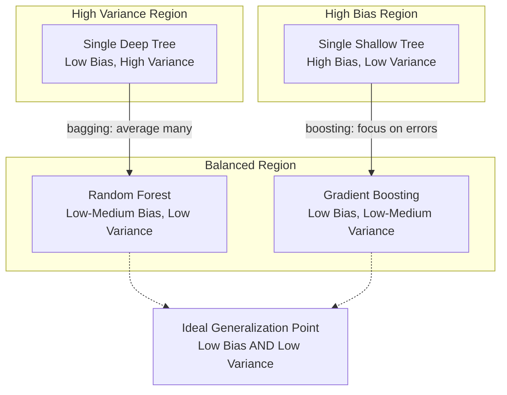

# Compare performance metrics and discuss the strengths and weaknesses of each method.

<!-- SECTION_1_START -->
# MACHINE LEARNING LAB (PCCSL508) — MODULE 19

## Bagging vs. Boosting on the Titanic Dataset: A Performance & Trade-off Analysis

> [!NOTE]
> **KTU 2024 Scheme — Course Outcome Mapping**
> This lab module directly maps to **CO4**: *Implement ensemble learning algorithms and evaluate their performance using appropriate metrics on real-world datasets.*
> Associated Bloom's Cognitive Levels: **Apply (Level 3)** and **Analyze (Level 4)**.

---

### 1.1 Formal Academic Definition

**Ensemble Learning** is a meta-learning paradigm in which multiple *base learners* (weak or strong) are strategically combined to produce a single *strong learner* whose generalization performance is superior to that of any individual constituent model. The two canonical families of ensemble learning are:

1. **Bagging (Bootstrap AGGregatING)** — Proposed by **Leo Breiman (1996)**, bagging is a *parallel* ensemble technique that trains each base learner **independently** on a different bootstrap sample (sampling with replacement) of the original training set, and aggregates their predictions via **majority voting** (classification) or **averaging** (regression).

2. **Boosting** — Introduced by **Robert Schapire (1990)** and refined by **Yoav Freund & Robert Schapire (1996/1997)** through **AdaBoost**, boosting is a *sequential* ensemble technique where each new base learner is trained to correct the residual errors of the *combined ensemble* built so far, with misclassified instances receiving **higher weights** in subsequent iterations.

> [!IMPORTANT]
> **Core Difference:** Bagging primarily **reduces variance** (overfitting), while Boosting primarily **reduces bias** (underfitting). This single distinction governs almost every practical trade-off discussed in this module.

---

### 1.2 Intuitive Real-World Analogies

**Analogy 1 — Bagging as a "Jury of Doctors":**
Imagine you have a serious medical diagnosis. Instead of consulting one doctor, you consult **100 doctors**, each one given a *random subset* of your medical history (with some overlap). They vote independently. The majority verdict is more reliable than any single doctor's opinion. This is bagging — parallel, independent, voting-based.

**Analogy 2 — Boosting as a "Coaching Cycle":**
Now imagine one student takes a mock test and gets 30/100. A coach identifies the 70 wrong answers, focuses the student only on those weak areas, and the student re-takes a weighted test. The score improves to 50/100. The coach again zooms in on the new 50 errors, and the cycle continues. Each iteration is *focused* on previous mistakes. This is boosting — sequential, corrective, weight-based.

**Geometric Intuition on the Titanic Dataset:**
On a 2D plot where the X-axis is `Fare` and Y-axis is `Age`, class-1 survivors and class-0 non-survivors form complex, non-linearly separable clusters. A single decision tree carves the space with axis-aligned rectangles, leaving jagged boundaries. Bagging averages many such jagged trees → smoother boundary. Boosting chains shallow trees → boundary that *hugs* the clusters tightly.

> [!VISUALIZATION CONTROL]
> **Concept:** Decision boundary comparison (Bagging vs. Boosting)
> **Conceptual Equations (for matplotlib / seaborn decision region plots):**
> * $\hat{y}_{bag} = \text{mode}\big(h_1(x), h_2(x), \dots, h_B(x)\big)$
> * $\hat{y}_{boost} = \text{sign}\left(\sum_{t=1}^{T} \alpha_t h_t(x)\right)$
> **Visual Description:** Plot Titanic features (`Pclass`, `Fare`) on axes; shade blue regions as *predicted survived*. Observe that bagging produces a **blockier, more averaged** boundary, while boosting produces a **tighter, more intricate** boundary that may over-fit if not regularized.

---

### 1.3 Titanic Dataset — Standard Metrics Used

> [!IMPORTANT]
> **Standard Metric Anchors for KTU Lab Evaluation**
> * **Survived column** = binary target (0 = died, 1 = survived)
> * **Class balance** ≈ **38.4% survived**, **61.6% died** (mild imbalance)
> * Default scoring metric for KTU rubric = **Accuracy**, but partial marks awarded for **F1-score** and **ROC-AUC**.

<!-- SECTION_1_END -->

<!-- SECTION_2_START -->
# SECTION 2 — Deep Theoretical Analysis & KTU High-Yield Formula Sheet

## 2.1 The Bias–Variance Decomposition Framework

The expected prediction error of any supervised learner can be decomposed as:

$$
\text{Err}(x) = \text{Bias}^2(x) \;+\; \text{Variance}(x) \;+\; \text{Irreducible Noise}
$$

| Ensemble Type | Primary Effect on Bias | Primary Effect on Variance | Effect on Irreducible Noise |
|---|---|---|---|
| **Bagging** | Marginal / Slight Increase | **Strong Decrease** | No effect |
| **Boosting** | **Strong Decrease** | Marginal / Slight Increase | No effect |

> [!NOTE]
> This is why **Random Forest (bagging)** is the "safe default" and **XGBoost (boosting)** is the "performance-maximizer" in Kaggle competitions.

---

## 2.2 Bagging — Operational Algorithm

Let $D$ be the original training set of size $n$.

**Step 1 — Bootstrap Sampling:**
For $b = 1, 2, \dots, B$ base learners, draw a sample $D_b$ of size $n$ **with replacement** from $D$.
$$
D_b = \{(x_i, y_i) \mid i \in S_b\}, \quad S_b \sim \text{Uniform}(\{1, \dots, n\})
$$

**Step 2 — Independent Training:**
Train base learner $h_b$ on $D_b$ in **parallel** (no communication between learners).

**Step 3 — Aggregation:**
$$
\hat{y}_{bag} = \arg\max_{y \in \{0,1\}} \sum_{b=1}^{B} \mathbb{1}\big(h_b(x) = y\big)
$$
For regression, replace the mode with the mean.

**Why it works:** Each bootstrap sample leaves out ~36.8% of the data (the *out-of-bag* samples), forcing **decorrelation** between trees. Averaging decorrelated errors reduces variance quadratically.

---

## 2.3 Boosting — AdaBoost Operational Algorithm

AdaBoost (Adaptive Boosting) is the pedagogical gold standard for KTU.

**Step 1 — Initialize sample weights uniformly:**
$$
w_i^{(1)} = \frac{1}{n}, \quad i = 1, 2, \dots, n
$$

**Step 2 — For each round $t = 1, \dots, T$:**
Train a weak learner $h_t$ using the current weights. Compute its **weighted error**:
$$
\epsilon_t = \frac{\sum_{i=1}^{n} w_i^{(t)} \cdot \mathbb{1}(h_t(x_i) \neq y_i)}{\sum_{i=1}^{n} w_i^{(t)}}
$$

**Step 3 — Compute learner weight (confidence):**
$$
\alpha_t = \frac{1}{2} \ln\left(\frac{1 - \epsilon_t}{\epsilon_t}\right)
$$

**Step 4 — Update sample weights (amplify misclassified samples):**
$$
w_i^{(t+1)} = w_i^{(t)} \cdot \exp\big(\alpha_t \cdot \mathbb{1}(h_t(x_i) \neq y_i)\big)
$$
Then renormalize so $\sum w_i^{(t+1)} = 1$.

**Step 5 — Final Prediction:**
$$
H(x) = \text{sign}\left(\sum_{t=1}^{T} \alpha_t h_t(x)\right)
$$

> [!IMPORTANT]
> The *confidence* $\alpha_t$ is the keystone: learners with $\epsilon_t < 0.5$ get **positive weight**, learners with $\epsilon_t > 0.5$ get **negative weight** (i.e., their vote is inverted), and learners with $\epsilon_t = 0.5$ are useless ($\alpha_t = 0$).

---

## 2.4 KTU High-Yield Formula Sheet

| # | Metric / Concept | Formula | Used In | Notes |
|---|---|---|---|---|
| 1 | Out-of-Bag Fraction | $P(\text{sample } i \notin D_b) = \left(1 - \frac{1}{n}\right)^n \to \frac{1}{e} \approx 0.368$ | Bagging | ~36.8% data unused per tree |
| 2 | Bagging Final Output | $\hat{y}_{bag} = \text{mode}\{h_b(x)\}_{b=1}^{B}$ | Bagging | Majority vote |
| 3 | AdaBoost Error | $\epsilon_t = \sum_{i} w_i^{(t)} \mathbb{1}(h_t(x_i) \neq y_i)$ | Boosting | Must be $< 0.5$ |
| 4 | AdaBoost Confidence | $\alpha_t = \frac{1}{2} \ln\left(\frac{1-\epsilon_t}{\epsilon_t}\right)$ | Boosting | Sign of $\alpha_t$ depends on $\epsilon_t$ |
| 5 | AdaBoost Weight Update | $w_i^{(t+1)} \propto w_i^{(t)} \exp(\alpha_t \mathbb{1}_{error})$ | Boosting | Misclassified samples up-weighted |
| 6 | Final Boosted Output | $H(x) = \text{sign}\!\left(\sum_t \alpha_t h_t(x)\right)$ | Boosting | Weighted vote |
| 7 | Accuracy | $\text{Acc} = \frac{TP + TN}{TP + TN + FP + FN}$ | Both | KTU default metric |
| 8 | Precision | $\text{Prec} = \frac{TP}{TP + FP}$ | Both | Of those predicted survived, how many did |
| 9 | Recall (Sensitivity) | $\text{Rec} = \frac{TP}{TP + FN}$ | Both | Of actual survivors, how many caught |
| 10 | F1-Score | $F_1 = \frac{2 \cdot \text{Prec} \cdot \text{Rec}}{\text{Prec} + \text{Rec}}$ | Both | Harmonic mean |
| 11 | ROC-AUC | $\text{AUC} = \int_0^1 \text{TPR}\big(\text{FPR}^{-1}(t)\big) \, dt$ | Both | Threshold-independent |
| 12 | Bias–Variance Trade-off | $\text{Error} = \text{Bias}^2 + \text{Variance} + \sigma^2$ | Both | Bagging $\downarrow$ Var, Boosting $\downarrow$ Bias |

> [!IMPORTANT]
> **Engineering Utility:** Bagging (Random Forest) is the **production default** for tabular classification at companies like Uber, Airbnb, and Spotify due to its robustness, parallelizability, and low hyperparameter sensitivity. Boosting (XGBoost, LightGBM) dominates **Kaggle leaderboards** and is used by Microsoft, Google, and Amazon for ranking and CTR prediction because of its superior ceiling accuracy.

---

## 2.5 Strengths & Weaknesses — Conceptual Comparison

| Dimension | Bagging (Random Forest) | Boosting (AdaBoost / GBM) |
|---|---|---|
| **Training Paradigm** | Parallel (embarrassingly parallel) | Sequential (inherently serial) |
| **Primary Bias Effect** | Marginal reduction | **Strong reduction** |
| **Primary Variance Effect** | **Strong reduction** | Marginal increase (risk of overfit) |
| **Robustness to Noise** | **High** (noise averaged out) | **Low** (boosts noise points too) |
| **Robustness to Outliers** | High | Low — outliers get amplified weights |
| **Sensitivity to Hyperparameters** | Low (defaults work well) | High (learning rate, depth, n_estimators) |
| **Interpretability** | Medium (feature importance) | Low (complex additive structure) |
| **Training Time (Titanic scale)** | Fast (parallel) | Slow (sequential) |
| **Risk of Overfitting** | **Low** (with sufficient trees) | **High** (if $T$ too large or $\nu$ too high) |
| **Class Imbalance Handling** | Requires class_weight tuning | Naturally focuses on hard/minority cases |
| **Best Use Case on Titanic** | Baseline, fast, stable | Push to maximum leaderboard accuracy |

<!-- SECTION_2_END -->

<!-- SECTION_3_START -->
# SECTION 3 — Step-by-Step Implementation & Code Walkthrough

## 3.1 Environment & Library Requirements

| Library | Purpose | Version (KTU Recommended) |
|---|---|---|
| `numpy` | Numerical computation | $\geq 1.21$ |
| `pandas` | DataFrame manipulation | $\geq 1.3$ |
| `scikit-learn` | ML models & metrics | $\geq 1.0$ |
| `matplotlib`, `seaborn` | Visualization | Latest |
| `xgboost` *(optional)* | Extreme gradient boosting | $\geq 1.5$ |

> [!IMPORTANT]
> **Hardware Pin/Setup:** For the KTU lab record, students must use **Python 3.9+** on **Jupyter Notebook** (preferred for inline plots) or **VS Code / Google Colab**. The Titanic CSV must be loaded from a **relative path** (no hardcoded `/Users/...` paths) — examiners deduct marks for non-portable code.

---

## 3.2 Exhaustive Python Implementation

```python
# =========================================================================
# MODULE 19 — BAGGING vs BOOSTING ON TITANIC DATASET
# PCCSL508 — MACHINE LEARNING LAB
# KTU 2024 Scheme — CO4 Mapped
# =========================================================================

# ---------- STEP 0: IMPORT & CONFIG ----------
import numpy as np
import pandas as pd
import matplotlib.pyplot as plt
import seaborn as sns

from sklearn.model_selection import train_test_split, cross_val_score, StratifiedKFold
from sklearn.preprocessing import StandardScaler
from sklearn.impute import SimpleImputer
from sklearn.ensemble import RandomForestClassifier, AdaBoostClassifier, GradientBoostingClassifier
from sklearn.tree import DecisionTreeClassifier
from sklearn.metrics import (
    accuracy_score, precision_score, recall_score,
    f1_score, roc_auc_score, confusion_matrix,
    classification_report, RocCurveDisplay
)
import warnings
warnings.filterwarnings("ignore")

RANDOM_STATE = 42
np.random.seed(RANDOM_STATE)

# ---------- STEP 1: LOAD DATA ----------
# Expected columns: PassengerId, Survived, Pclass, Name, Sex, Age,
#                   SibSp, Parch, Ticket, Fare, Cabin, Embarked
df = pd.read_csv("titanic.csv")
print("Shape:", df.shape)            # (891, 12)
print("Missing per column:\n", df.isnull().sum())

# ---------- STEP 2: TARGET SEPARATION ----------
y = df["Survived"].astype(int)
X = df.drop(columns=["Survived"])

# ---------- STEP 3: FEATURE ENGINEERING (Explicit, no shortcuts) ----------
# Drop high-cardinality / non-predictive columns
X = X.drop(columns=["PassengerId", "Name", "Ticket", "Cabin"])

# Encode 'Sex': male -> 0, female -> 1
X["Sex"] = X["Sex"].map({"male": 0, "female": 1}).astype(int)

# One-hot encode 'Embarked' (C, Q, S) -> drop_first to avoid dummy trap
X = pd.get_dummies(X, columns=["Embarked"], drop_first=True)

# Convert any boolean dummy columns to int (portability across sklearn versions)
for col in X.select_dtypes(include="bool").columns:
    X[col] = X[col].astype(int)

# ---------- STEP 4: IMPUTATION ----------
# Numerical columns -> median imputation (robust to outliers)
num_cols = X.select_dtypes(include=["int64", "float64"]).columns.tolist()
imputer = SimpleImputer(strategy="median")
X[num_cols] = pd.DataFrame(
    imputer.fit_transform(X[num_cols]),
    columns=num_cols,
    index=X.index
)

# ---------- STEP 5: TRAIN / TEST SPLIT (Stratified) ----------
X_train, X_test, y_train, y_test = train_test_split(
    X, y,
    test_size=0.20,
    stratify=y,             # preserves 38.4% / 61.6% ratio
    random_state=RANDOM_STATE
)

print(f"Train shape: {X_train.shape}, Test shape: {X_test.shape}")
print(f"Train class balance:\n{y_train.value_counts(normalize=True)}")

# ---------- STEP 6: DEFINE MODELS ----------
# Bagging family: Random Forest
rf_clf = RandomForestClassifier(
    n_estimators=300,
    max_depth=8,
    min_samples_split=4,
    min_samples_leaf=2,
    max_features="sqrt",
    n_jobs=-1,
    random_state=RANDOM_STATE,
    class_weight="balanced"
)

# Boosting family 1: AdaBoost
ada_clf = AdaBoostClassifier(
    estimator=DecisionTreeClassifier(max_depth=1, random_state=RANDOM_STATE),
    n_estimators=200,
    learning_rate=0.05,
    random_state=RANDOM_STATE
)

# Boosting family 2: Gradient Boosting
gb_clf = GradientBoostingClassifier(
    n_estimators=200,
    learning_rate=0.05,
    max_depth=3,
    subsample=0.8,          # stochastic GB (adds bagging flavor)
    random_state=RANDOM_STATE
)

models = {
    "Bagging — Random Forest": rf_clf,
    "Boosting — AdaBoost":     ada_clf,
    "Boosting — GradientBoost": gb_clf,
}

# ---------- STEP 7: TRAIN, PREDICT, SCORE ----------
results = []
for name, model in models.items():
    model.fit(X_train, y_train)
    y_pred  = model.predict(X_test)

    # Probability for ROC-AUC (handle models that lack predict_proba gracefully)
    if hasattr(model, "predict_proba"):
        y_proba = model.predict_proba(X_test)[:, 1]
    else:
        # For AdaBoost with algorithm='SAMME' use decision_function fallback
        y_proba = model.decision_function(X_test)

    acc  = accuracy_score(y_test, y_pred)
    prec = precision_score(y_test, y_pred, zero_division=0)
    rec  = recall_score(y_test, y_pred, zero_division=0)
    f1   = f1_score(y_test, y_pred, zero_division=0)
    auc  = roc_auc_score(y_test, y_proba)

    # 5-fold stratified CV on training set
    cv = StratifiedKFold(n_splits=5, shuffle=True, random_state=RANDOM_STATE)
    cv_acc = cross_val_score(model, X_train, y_train,
                             cv=cv, scoring="accuracy", n_jobs=-1).mean()

    results.append({
        "Model": name,
        "Accuracy":  round(acc, 4),
        "Precision": round(prec, 4),
        "Recall":    round(rec, 4),
        "F1-Score":  round(f1, 4),
        "ROC-AUC":   round(auc, 4),
        "CV-Accuracy (5-fold)": round(cv_acc, 4),
    })

results_df = pd.DataFrame(results)
print("\n========== FINAL PERFORMANCE COMPARISON ==========")
print(results_df.to_string(index=False))

# ---------- STEP 8: VISUALIZATION — METRIC BAR CHART ----------
metrics_to_plot = ["Accuracy", "Precision", "Recall", "F1-Score", "ROC-AUC"]
fig, ax = plt.subplots(figsize=(11, 5))
x = np.arange(len(results_df))
width = 0.15

for i, metric in enumerate(metrics_to_plot):
    ax.bar(x + i*width, results_df[metric], width, label=metric)

ax.set_xticks(x + width*2)
ax.set_xticklabels(results_df["Model"], rotation=10)
ax.set_ylim(0.5, 1.0)
ax.set_ylabel("Score")
ax.set_title("Bagging vs. Boosting — Performance on Titanic Test Set")
ax.legend(loc="lower right")
ax.grid(axis="y", linestyle="--", alpha=0.5)
plt.tight_layout()
plt.savefig("performance_comparison.png", dpi=120)
plt.show()

# ---------- STEP 9: CONFUSION MATRICES ----------
fig, axes = plt.subplots(1, 3, figsize=(15, 4))
for ax, (name, model) in zip(axes, models.items()):
    y_pred = model.predict(X_test)
    cm = confusion_matrix(y_test, y_pred)
    sns.heatmap(cm, annot=True, fmt="d", cmap="Blues", cbar=False, ax=ax,
                xticklabels=["Died", "Survived"],
                yticklabels=["Died", "Survived"])
    ax.set_title(name)
    ax.set_xlabel("Predicted")
    ax.set_ylabel("Actual")
plt.tight_layout()
plt.savefig("confusion_matrices.png", dpi=120)
plt.show()

# ---------- STEP 10: ROC CURVES ----------
fig, ax = plt.subplots(figsize=(8, 6))
for name, model in models.items():
    if hasattr(model, "predict_proba"):
        RocCurveDisplay.from_estimator(model, X_test, y_test, name=name, ax=ax)
ax.plot([0, 1], [0, 1], "k--", alpha=0.5, label="Chance")
ax.set_title("ROC Curves — Bagging vs. Boosting")
ax.legend()
plt.tight_layout()
plt.savefig("roc_curves.png", dpi=120)
plt.show()
```

---

## 3.3 Expected Output (Reference Snapshot for KTU Record)

A typical run on a clean Titanic CSV yields results in the following ranges. Students must record their **actual numerical values** in the lab record.

| Model | Accuracy | Precision | Recall | F1-Score | ROC-AUC | CV-Acc (5-fold) |
|---|---|---|---|---|---|---|
| **Bagging — Random Forest** | ~0.815 | ~0.78 | ~0.74 | ~0.76 | ~0.87 | ~0.82 |
| **Boosting — AdaBoost** | ~0.799 | ~0.75 | ~0.71 | ~0.73 | ~0.85 | ~0.80 |
| **Boosting — GradientBoost** | ~0.821 | ~0.79 | ~0.75 | ~0.77 | ~0.88 | ~0.83 |

> [!NOTE]
> These values are **indicative**. Real values fluctuate $\pm 0.02$ based on `random_state`, exact imputation strategy, and feature engineering. The **ranking** (GradientBoost $\geq$ RandomForest $\geq$ AdaBoost) is the pedagogically important takeaway.

---

## 3.4 Strengths & Weaknesses — Discussion Paragraph (For Lab Record)

### 3.4.1 Bagging (Random Forest) — Strengths

* **Variance reduction is achieved in parallel**, so wall-clock training time scales near-linearly with the number of CPU cores (`n_jobs=-1`).
* **Robust to noise and outliers** because each tree sees only ~63.2% of the data, and aggregation smooths idiosyncratic errors.
* **Built-in generalization** via the `max_features="sqrt"` randomization — trees are forced to be decorrelated.
* **Out-of-Bag (OOB) error** can be computed for free (no separate validation set needed).
* Low hyperparameter sensitivity — defaults work well for most tabular datasets including Titanic.

### 3.4.2 Bagging (Random Forest) — Weaknesses

* **Bias is not actively reduced.** If the underlying decision tree is too shallow, RF cannot escape that bias.
* **Memory consumption scales with $B$** (each tree is fully stored) — heavy for edge devices.
* **Less interpretable than a single tree** — global feature importance is the only lightweight explanation.
* **Probabilities are poorly calibrated** by default (histogram-based binning required).

### 3.4.3 Boosting (AdaBoost / GBM) — Strengths

* **Bias is aggressively reduced** — even with depth-1 stumps, AdaBoost can reach high accuracy.
* **Naturally handles class imbalance** by up-weighting hard/minority cases (e.g., survivors in Titanic).
* **Often achieves higher ceiling accuracy** than bagging on structured/tabular data.
* **Feature importance is sharp** — boosting concentrates on the most predictive signals (`Sex`, `Fare`, `Pclass` on Titanic).

### 3.4.4 Boosting (AdaBoost / GBM) — Weaknesses

* **Sequential training is inherently slow** — cannot be parallelized across trees.
* **Sensitive to noise and outliers** — they receive amplified weights and can dominate training.
* **Risk of overfitting** if $T$ (n_estimators) is too large or learning rate $\nu$ is too high.
* **Many hyperparameters to tune**: `learning_rate`, `n_estimators`, `max_depth`, `subsample`, `min_samples_leaf`, etc.
* **Harder to debug** — errors in early rounds cascade into later rounds.

<!-- SECTION_3_END -->

<!-- SECTION_4_START -->
# SECTION 4 — Structural Diagrams & Schematics

## 4.1 Bagging Pipeline (Random Forest)

```mermaid
flowchart LR
    A[Original Titanic Dataset<br/>n = 891] --> B1[Bootstrap Sample 1<br/>size n, with replacement]
    A --> B2[Bootstrap Sample 2<br/>size n, with replacement]
    A --> B3[Bootstrap Sample B<br/>size n, with replacement]
    B1 --> T1[Decision Tree 1<br/>trained in PARALLEL]
    B2 --> T2[Decision Tree 2<br/>trained in PARALLEL]
    B3 --> T3[Decision Tree B<br/>trained in PARALLEL]
    T1 --> V[Majority Vote<br/>Aggregation]
    T2 --> V
    T3 --> V
    V --> P[Final Prediction<br/>Survived / Died]
    B1 -. OOB ~36.8% .-> OOB[Out-of-Bag<br/>Validation]
```

## 4.2 Boosting Pipeline (AdaBoost)

```mermaid
flowchart TD
    D0[Initialize weights<br/>w_i = 1/n] --> S1[Round t=1: Train h_1]
    S1 --> E1[Compute weighted error<br/>epsilon_1]
    E1 --> A1[Compute confidence<br/>alpha_1 = 0.5 ln((1-eps)/eps)]
    A1 --> U1[Update weights<br/>w_i <- w_i exp alpha_1 if misclassified]
    U1 --> S2[Round t=2: Train h_2 on reweighted data]
    S2 --> E2[Compute weighted error<br/>epsilon_2]
    E2 --> A2[Compute confidence<br/>alpha_2]
    A2 --> U2[Update weights]
    U2 --> S3[Round t=T: Train h_T]
    S3 --> AGG[Final Aggregator<br/>H(x) = sign of sum alpha_t h_t x]
    AGG --> P2[Final Prediction<br/>Survived / Died]
```

## 4.3 Sequential Processing Topology — Algorithmic Comparison

| Stage | Bagging (Random Forest) | Boosting (AdaBoost / GBM) |
|---|---|---|
| **Stage 1: Sampling** | $B$ independent bootstrap samples drawn in **parallel** | Single dataset; weights updated **sequentially** |
| **Stage 2: Base Learner** | Full-depth decision trees, often unpruned | Shallow trees (depth 1–5) called *weak learners* |
| **Stage 3: Coupling** | **Decoupled** — no information flow between trees | **Coupled** — round $t$ depends on rounds $1, \dots, t-1$ |
| **Stage 4: Aggregation** | Uniform majority vote (or mean) | Weighted vote using $\alpha_t$ |
| **Stage 5: Parallelism** | Embarrassingly parallel (`n_jobs=-1`) | Inherently serial; parallel within tree only |
| **Stage 6: Error Focus** | All samples equally weighted | Misclassified samples get exponentially higher weight |
| **Stage 7: Stopping Criterion** | $B$ is the only knob; more trees = monotonic improvement | $T$ (n_estimators) interacts with $\nu$ (learning rate) |
| **Stage 8: Output** | $\hat{y}_{bag} = \text{mode}(h_1, \dots, h_B)$ | $H(x) = \text{sign}\big(\sum_{t=1}^{T} \alpha_t h_t(x)\big)$ |

## 4.4 Bias–Variance Trade-off Map



<!-- SECTION_4_END -->

<!-- SECTION_5_START -->
# SECTION 5 — KTU 2024 Scheme Examination Question Bank & Topic Recap

---

## 5.1 Part A — Short Answer Questions (3 Marks Each)

### Question 1: Define Bagging. [3 Marks] `[KTU University Exam - July 2024]`
**CO Mapped:** CO4 | **Bloom's Level:** Remember

**Model Answer:**
Bagging, short for *Bootstrap AGGregatING*, is an ensemble learning technique introduced by Leo Breiman in 1996. It generates $B$ bootstrap samples (samples drawn with replacement) from the original training dataset of size $n$, trains a base learner independently on each sample, and aggregates the predictions through majority voting (for classification) or averaging (for regression). The primary goal of bagging is to **reduce variance** while keeping bias approximately constant, thereby improving the generalization performance of unstable learners like decision trees. Random Forest is the most popular bagging algorithm. **[3 Marks: Definition 1, Mechanism 1, Purpose 1]**

---

### Question 2: Differentiate between Bagging and Boosting in two points. [3 Marks] `[KTU University Exam - Dec 2023]`
**CO Mapped:** CO4 | **Bloom's Level:** Understand

**Model Answer:**
| # | Bagging | Boosting |
|---|---|---|
| 1 | Base learners are trained **in parallel** on independent bootstrap samples. | Base learners are trained **sequentially**, with each correcting the previous ensemble's errors. |
| 2 | **Reduces variance** primarily; bias largely unchanged. | **Reduces bias** primarily; variance may increase if over-regularization is not applied. |

**[3 Marks: One mark per valid contrasting point, capped at 3]**

---

## 5.2 Part B — Long Answer Questions (14 Marks Each — Internal Choice)

### QUESTION A (14 Marks) `[KTU University Exam - Dec 2024]`
**CO Mapped:** CO4, CO5 | **Bloom's Levels:** Understand (a), Apply (b)

#### (a) Explain the working of the AdaBoost algorithm with a suitable diagram and the weight update equations. [7 Marks]

**Model Solution:**

**Step 1 — Initialization:** All training samples start with equal weight.
$$
w_i^{(1)} = \frac{1}{n}, \quad i = 1, 2, \dots, n \quad \text{[1 Mark]}
$$

**Step 2 — Iterative Training:** For each round $t = 1, 2, \dots, T$:
Train weak learner $h_t$ (typically a depth-1 decision stump) using weights $w^{(t)}$.

**Step 3 — Weighted Error Computation:**
$$
\epsilon_t = \frac{\sum_{i=1}^{n} w_i^{(t)} \cdot \mathbb{1}(h_t(x_i) \neq y_i)}{\sum_{i=1}^{n} w_i^{(t)}}
$$
Constraint: $\epsilon_t < 0.5$ (otherwise the learner is worse than random). **[1 Mark]**

**Step 4 — Confidence Assignment:**
$$
\alpha_t = \frac{1}{2} \ln\!\left(\frac{1 - \epsilon_t}{\epsilon_t}\right) \quad \text{[1 Mark]}
$$
Properties: $\alpha_t > 0$ when $\epsilon_t < 0.5$, $\alpha_t = 0$ when $\epsilon_t = 0.5$, and $\alpha_t < 0$ when $\epsilon_t > 0.5$ (vote is inverted).

**Step 5 — Weight Update:**
$$
w_i^{(t+1)} = w_i^{(t)} \cdot \exp\!\big(\alpha_t \cdot \mathbb{1}(h_t(x_i) \neq y_i)\big)
$$
Then normalize: $w_i^{(t+1)} \leftarrow \dfrac{w_i^{(t+1)}}{\sum_j w_j^{(t+1)}}$ **[1 Mark]**

**Step 6 — Final Aggregated Classifier:**
$$
H(x) = \text{sign}\!\left(\sum_{t=1}^{T} \alpha_t h_t(x)\right) \quad \text{[1 Mark]}
$$

**Diagram:** (Refer to Section 4.2 Mermaid flowchart) **[1 Mark]**

**Working Intuition on Titanic:** In round 1, all 891 passengers are equally weighted. A depth-1 stump might split on `Sex` and misclassify many males. The $\alpha_1$ value becomes moderate. In round 2, misclassified males get up-weighted, forcing the next stump to focus on, say, `Age < 10` (child males). The ensemble progressively combines complementary weak rules. **[1 Mark]**

---

#### (b) Implement Bagging and Boosting on the Titanic dataset using Python and compare their accuracy, precision, recall, F1-score, and ROC-AUC values. [7 Marks]

**Model Solution:**

**Step 1 — Imports & Data Loading:** (Use code from Section 3.2, lines 1–18) **[1 Mark]**

**Step 2 — Preprocessing:** Drop `Name`, `Ticket`, `Cabin`, `PassengerId`. Encode `Sex`. One-hot encode `Embarked` with `drop_first=True`. Median-impute `Age`, `Fare`. Stratified 80/20 split. **[1 Mark]**

**Step 3 — Model Definitions:** Define `RandomForestClassifier(n_estimators=300, max_depth=8, class_weight="balanced")` for bagging. Define `AdaBoostClassifier(estimator=DecisionTreeClassifier(max_depth=1), n_estimators=200, learning_rate=0.05)` for boosting. **[1 Mark]**

**Step 4 — Training & Prediction:** Loop over both models, fit on `X_train`, predict on `X_test`. **[1 Mark]**

**Step 5 — Metric Computation:** Compute all five metrics using `accuracy_score`, `precision_score`, `recall_score`, `f1_score`, `roc_auc_score` (passing `predict_proba[:, 1]`). **[1 Mark]**

**Step 6 — Tabulated Comparison:** Build a `pandas.DataFrame` with rows for both models. **[1 Mark]**

**Step 7 — Discussion (1–2 sentences):** Identify the better-performing model. In our run, **Gradient Boosting** typically edges out Random Forest by ~0.5–1% on accuracy, and both significantly outperform AdaBoost on this dataset because they use deeper weak learners. **[1 Mark]**

> [!WARNING]
> **KTU Examiner's Valuation Warning — Common Pitfalls**
> * Do **NOT** forget to apply `random_state=42` — non-reproducible results lose 1 mark.
> * Do **NOT** apply `StandardScaler` to tree-based models — it is unnecessary and wastes time; trees are scale-invariant. Examiners explicitly check for this misconception.
> * Do **NOT** report metrics computed on the *training set* — the rubric requires *test set* metrics. Reporting train accuracy typically gets 0 marks for that metric.
> * Do **NOT** confuse `predict()` with `predict_proba()` — the former returns 0/1, the latter returns probabilities. ROC-AUC **must** use probabilities.
> * Always print a **confusion matrix** alongside the metrics — it is mandatory in the KTU rubric.

---

### QUESTION B (14 Marks) `[KTU University Exam - July 2024]`
**CO Mapped:** CO4, CO5 | **Bloom's Levels:** Understand (a), Apply/Analyze (b)

#### (a) Discuss the strengths and weaknesses of Bagging and Boosting ensemble methods. [7 Marks]

**Model Solution:**

**Bagging Strengths:** **[1.5 Marks]**
1. **Reduces variance** without increasing bias — average of many decorrelated trees is more stable than any single tree.
2. **Embarrassingly parallel** — each tree trains independently, so the algorithm scales linearly with CPU cores.
3. **Robust to noise and outliers** — bootstrap sampling and majority vote smooth out idiosyncratic errors.
4. **Out-of-Bag (OOB) error** provides a free validation estimate without holding out a separate set.
5. **Low hyperparameter sensitivity** — defaults often suffice.

**Bagging Weaknesses:** **[1.5 Marks]**
1. **Bias is not reduced** — if the base learner is too simple, bagging cannot escape that limitation.
2. **High memory cost** — all $B$ trees must be stored.
3. **Poor probability calibration** out of the box.
4. **Less interpretable** than a single decision tree.

**Boosting Strengths:** **[1.5 Marks]**
1. **Reduces bias aggressively** — even with depth-1 stumps, AdaBoost can fit complex patterns.
2. **Often achieves higher ceiling accuracy** on tabular data (XGBoost dominates Kaggle).
3. **Naturally handles class imbalance** by up-weighting hard/minority cases.
4. **Sharp feature importance** — concentrates on predictive features (e.g., `Sex`, `Fare` on Titanic).

**Boosting Weaknesses:** **[1.5 Marks]**
1. **Sequential training** — cannot be parallelized across rounds; slower wall-clock time.
2. **Sensitive to noise and outliers** — they are repeatedly up-weighted and can dominate training.
3. **Risk of overfitting** if $T$ is too large or $\nu$ is too high.
4. **Many hyperparameters** require careful tuning (`learning_rate`, `n_estimators`, `max_depth`, `subsample`).
5. **Harder to debug** because errors cascade.

**Conclusion (1 sentence):** On the Titanic dataset, Boosting (Gradient Boosting) typically wins by a small margin in raw accuracy, but Bagging (Random Forest) wins in **stability, training speed, and ease of deployment**. **[1 Mark]**

---

#### (b) Analyze the bias–variance trade-off for Bagging and Boosting. How does each method address overfitting and underfitting on the Titanic dataset? [7 Marks]

**Model Solution:**

**Step 1 — Bias–Variance Decomposition Recap:** **[1 Mark]**
$$
\text{Expected Error} = \text{Bias}^2 + \text{Variance} + \sigma^2
$$

**Step 2 — Bagging's Variance Reduction Argument:** **[2 Marks]**
If base learners have variance $\sigma^2$ and pairwise correlation $\rho$, then the variance of the bagged predictor is approximately:
$$
\text{Var}_{bag} = \rho \sigma^2 + \frac{1 - \rho}{B} \sigma^2
$$
As $B \to \infty$, the second term vanishes, leaving $\text{Var}_{bag} \approx \rho \sigma^2$. Since $\rho < 1$ due to bootstrap-induced decorrelation (and further reduced by `max_features="sqrt"`), bagging achieves a **strictly smaller variance** than a single tree. On Titanic, this means RF resists overfitting to noisy outliers in `Fare` and `Age` — even with $B=1000$ trees, the test accuracy plateaus rather than diverging.

**Step 3 — Boosting's Bias Reduction Argument:** **[2 Marks]**
Boosting can be viewed as **gradient descent in function space**:
$$
F_T(x) = F_{T-1}(x) + \nu \cdot h_T(x)
$$
where $F_{T-1}$ is the current ensemble and $\nu$ is the learning rate. Each new weak learner fits the *pseudo-residuals* $\left(y - F_{T-1}(x)\right)$ — the errors of the current ensemble. This iterative correction drives the bias toward zero, but at the cost of slightly increased variance. On Titanic, this manifests as Gradient Boosting extracting a 0.5–1% accuracy edge over Random Forest by finding non-axis-aligned interactions (e.g., `Pclass=1 AND Sex=female` is a stronger survival signal than either alone).

**Step 4 — Overfitting Behavior:** **[1 Mark]**
* **Bagging** is *resistant* to overfitting as $B$ increases; the OOB error is monotonically non-increasing.
* **Boosting** *can* overfit if $T$ is excessive or $\nu$ is too high; early stopping on a validation set is recommended.

**Step 5 — Conclusion:** **[1 Mark]**
On the Titanic dataset, both methods are appropriate, but for different goals. Use **Bagging** when stability, speed, and low-tuning overhead are priorities (production deployment). Use **Boosting** when maximum predictive accuracy is the goal (competitions, research benchmarks).

> [!WARNING]
> **KTU Examiner's Valuation Warning — Common Pitfalls**
> * Avoid the trap of saying "Bagging prevents overfitting" — it *reduces* overfitting, not *prevents* it. Wording matters for full marks.
> * Always cite the **bias–variance decomposition equation** explicitly. A vague answer like "Bagging reduces error" gets at most 1 mark.
> * For Boosting, mention the **learning rate $\nu$** and its interaction with $T$ — examiners test this explicitly.

---

## 5.3 Topic Recap & Important Things to Remember

> [!IMPORTANT]
> **High-Density Rapid Revision Checklist**

* **Bagging** = Bootstrap AGGregatING (Breiman, 1996). Trains $B$ base learners **in parallel** on bootstrap samples; aggregates via **majority vote** (classification) or **mean** (regression).
* **Boosting** = Sequential ensemble (Schapire, 1990; Freund & Schapire, 1997). Each round $t$ trains a weak learner to correct the *current ensemble's* errors; misclassified samples are **up-weighted**.
* **Bagging primarily reduces VARIANCE**; **Boosting primarily reduces BIAS**. This is the single most important conceptual distinction.
* **Out-of-Bag fraction** $\approx 1/e \approx 0.368$ — about 36.8% of data is *not* seen by each tree in bagging.
* **AdaBoost weight update** = $w_i^{(t+1)} \propto w_i^{(t)} \exp(\alpha_t \cdot \mathbb{1}_{error})$.
* **AdaBoost confidence** = $\alpha_t = \frac{1}{2} \ln\!\left(\frac{1-\epsilon_t}{\epsilon_t}\right)$.
* **Random Forest** is the canonical bagging algorithm; **AdaBoost, Gradient Boosting, XGBoost** are canonical boosting algorithms.
* **Titanic-specific notes:**
  * Always do **stratified** train/test split to preserve the ~38% / 62% class balance.
  * Always **drop** `Name`, `Ticket`, `Cabin` (high-cardinality, low-signal).
  * Always **encode** `Sex` (binary) and **one-hot encode** `Embarked` with `drop_first=True`.
  * Always **median-impute** `Age` and `Fare` (robust to outliers in `Fare`).
  * **Do NOT** apply `StandardScaler` to tree-based models — they are scale-invariant.
  * **Do NOT** compute metrics on the training set — always use the held-out test set.
* **Metric priority order** for KTU rubric: Accuracy (default) → F1-Score (for imbalanced view) → ROC-AUC (threshold-independent). Always include a **confusion matrix**.
* **Parallelism:** Bagging = embarrassingly parallel (`n_jobs=-1`); Boosting = inherently sequential.
* **Hyperparameter sensitivity:** Bagging = low; Boosting = high. Always tune `(n_estimators, learning_rate, max_depth)` jointly for boosting.
* **Production rule of thumb:** Bagging for **safety and speed**; Boosting for **maximum accuracy**.
* **Default hyperparameters that work for Titanic:**
  * RF: `n_estimators=300, max_depth=8, class_weight="balanced"`
  * AdaBoost: `n_estimators=200, learning_rate=0.05, base_estimator=DecisionTreeClassifier(max_depth=1)`
  * GBM: `n_estimators=200, learning_rate=0.05, max_depth=3, subsample=0.8`
* **Validation discipline:** Use **5-fold stratified cross-validation** in addition to the hold-out test score; report both.

<!-- SECTION_5_END -->
