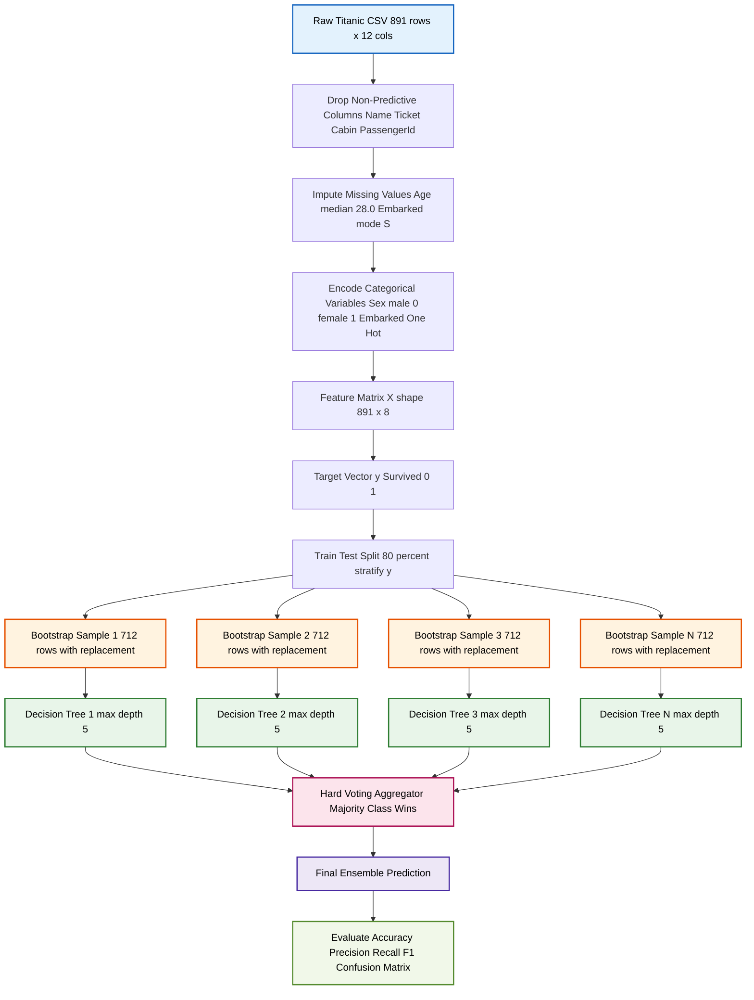
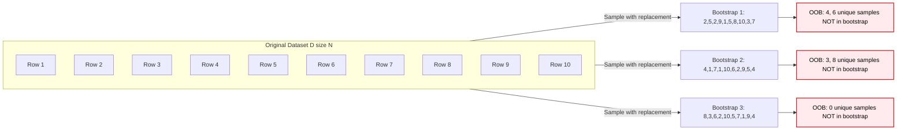
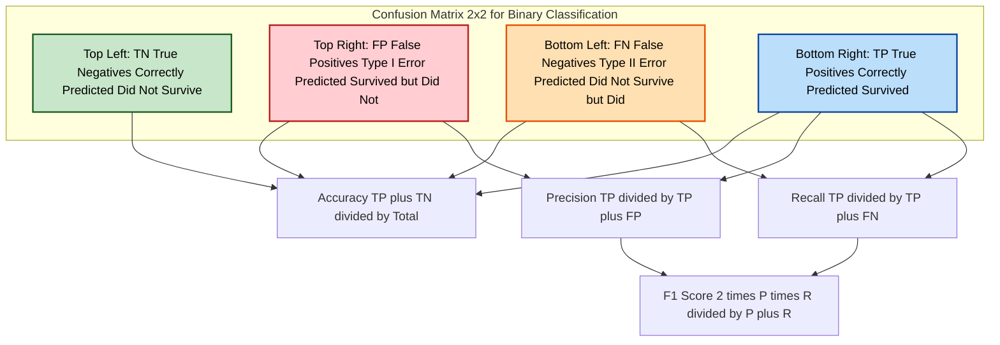

# Implement bagging using a base classifier (e.g., decision tree) and evaluate performance.

<!-- SECTION_1_START -->

# Module 19: Implement Bagging Ensemble Method on the Titanic Dataset

## 1. Core Technical Definition & Intuitive Overview

> [!NOTE]
> **Bagging (Bootstrap Aggregating)** is a parallel ensemble learning technique that combines the predictions of multiple base classifiers (trained independently on different random sub-samples of the training data) to produce a more robust and stable final prediction. It primarily aims to **reduce variance** and **avoid overfitting** in high-variance models like Decision Trees.

In the context of the KTU 2024 Scheme Machine Learning Lab (PCCSL508), this module requires the student to implement the **Bagging Classifier** from `scikit-learn` using a **Decision Tree** as the base estimator, train it on the preprocessed **Titanic dataset**, and rigorously evaluate its classification performance using standard board-approved metrics.

### Conceptual Analogy / Intuition

> [!IMPORTANT]
> **The Jury Voting Analogy for Bagging**
>
> Imagine a courtroom where **one judge** has to decide whether a passenger on the Titanic would have survived (Yes/No). A single judge can be biased, emotional, or influenced by a single loud piece of evidence — this is **high variance**.
>
> Instead, what if we had a **panel of 50 judges**, each shown a *randomly shuffled subset* of the evidence? Judge 1 sees 80% of the evidence, Judge 2 sees a different 80%, and so on. Each judge votes "Survived" or "Did Not Survive". The **majority vote** becomes the final verdict.
>
> Since the panel averages out the individual biases and random errors, the final verdict is far more reliable. This is exactly what Bagging does — it trains **N independent decision trees** on **N different bootstrap samples** (samples drawn *with replacement* from the original training set) and lets them **vote** to determine the final class.

### Syllabus Highlights for KTU 2024

- **Base Classifier**: Decision Tree Classifier (`sklearn.tree.DecisionTreeClassifier`).
- **Ensemble Wrapper**: `sklearn.ensemble.BaggingClassifier`.
- **Dataset**: Titanic (Binary classification: $0$ = Did Not Survive, $1$ = Survived).
- **Mandatory Preprocessing**: Handling missing values (`Age`, `Embarked`), dropping non-predictive columns (`Name`, `Ticket`, `Cabin`), encoding categorical variables (`Sex`, `Embarked`).
- **Mandatory Evaluation Metrics**: Accuracy, Precision, Recall, F1-Score, and Confusion Matrix.

### Key Hyperparameters (as per `scikit-learn` documentation)

- `n_estimators`: The number of base classifiers in the ensemble (default = **10**).
- `max_samples`: The fraction of the dataset each base learner is trained on (default = **1.0**).
- `max_features`: The fraction of features sampled for each base learner (default = **1.0**).
- `bootstrap`: Whether samples are drawn with replacement (default = **True**).
- `random_state`: Seed for reproducibility (essential for board practical records).

> [!TIP]
> The combination of a high-variance model (Decision Tree) with a variance-reduction technique (Bagging) is one of the most commonly asked viva questions in KTU ML Lab viva voce.

<!-- SECTION_1_END -->

<!-- SECTION_2_START -->

# Deep Theoretical Analysis & KTU High-Yield Formula Sheet

## 2. The Mathematical & Algorithmic Foundations of Bagging

Bagging was formally introduced by **Leo Breiman (1996)**. It is built on two statistical pillars: **Bootstrap Sampling** and **Aggregation**.

### 2.1 Bootstrap Sampling

Given an original training dataset $D$ of size $N$, we create $B$ new training sets $D_1, D_2, \ldots, D_B$. Each $D_b$ is created by sampling $N$ instances *uniformly and with replacement* from $D$.

> [!IMPORTANT]
> **Why "With Replacement"?**
> Because we sample with replacement, each bootstrap sample $D_b$ typically contains only about **$63.2\%$** of the unique instances from the original dataset $D$. The remaining **$36.8\%$** are duplicates or left out — these left-out samples are called **"Out-of-Bag" (OOB)** samples and are extremely useful for internal cross-validation.

The expected number of unique samples in a bootstrap of size $N$ drawn from a population of size $N$ is:

$$
\mathbb{E}[\text{Unique Samples}] = N \left(1 - \frac{1}{N}\right)^N
$$

As $N \rightarrow \infty$, this probability converges to:

$$
\lim_{N \to \infty} \left(1 - \frac{1}{N}\right)^N = \frac{1}{e} \approx 0.3679
$$

Therefore, the fraction of unique samples converges to $1 - \frac{1}{e} \approx 0.6321$ (which is **63.2%**).

### 2.2 Aggregation (Voting)

For each bootstrap sample $D_b$, a base classifier $h_b$ is trained. The final ensemble prediction $\hat{H}(x)$ is made by aggregating the predictions of all base classifiers.

- **For Classification (Majority Voting — Hard Voting):**

$$
\hat{H}(x) = \arg\max_{c \in C} \sum_{b=1}^{B} \mathbb{I}(h_b(x) = c)
$$

- **For Classification (Soft Voting — using class probabilities):**

$$
\hat{H}(x) = \arg\max_{c \in C} \frac{1}{B} \sum_{b=1}^{B} P_{h_b}(y = c \mid x)
$$

Where $C$ is the set of all classes, $B$ is the number of estimators, and $\mathbb{I}(\cdot)$ is the indicator function.

### 2.3 The "Why" — Variance Reduction

A Decision Tree has **low bias** but **high variance** — a small change in training data can lead to a completely different tree structure. Bagging reduces variance without significantly increasing bias.

If each base learner has variance $\sigma^2$ and they are **identically but independently distributed (i.i.d.)**, then the variance of the average prediction is:

$$
\text{Var}(\hat{H}(x)) = \frac{\sigma^2}{B} + \rho \cdot \sigma^2 \cdot \frac{B-1}{B}
$$

Where $\rho$ is the pairwise correlation between base learners. Bagging seeks to make the trees as **uncorrelated** as possible (low $\rho$) by introducing randomness through bootstrapping and feature subsampling.

## KTU High-Yield Formula Sheet

| Concept | Formula / Parameter | Description | Default Value |
|---|---|---|---|
| Bootstrap Sample Size | $N \times \text{max\_samples}$ | Number of instances per base learner | $N$ (full dataset) |
| Expected Unique Samples | $N (1 - 1/N)^N \approx 0.632 N$ | Unique instances in each bootstrap | $63.2\%$ of $D$ |
| Out-of-Bag (OOB) Fraction | $1 - (1 - 1/N)^N \approx 0.368$ | Samples not selected for training | $36.8\%$ of $D$ |
| Hard Voting Prediction | $\arg\max_c \sum_{b=1}^{B} \mathbb{I}(h_b(x)=c)$ | Majority class wins | Used by `voting='hard'` |
| Soft Voting Prediction | $\arg\max_c \frac{1}{B} \sum_{b=1}^{B} P_{h_b}(c \mid x)$ | Average probability wins | Used by `voting='soft'` |
| Ensemble Variance | $\rho \sigma^2 + (1-\rho)\sigma^2 / B$ | Variance of the bagged ensemble | Decreases as $B \uparrow$ |
| Accuracy | $\frac{TP + TN}{TP + TN + FP + FN}$ | Fraction of correct predictions | Evaluation metric |
| Precision | $\frac{TP}{TP + FP}$ | Quality of positive predictions | Evaluation metric |
| Recall (Sensitivity) | $\frac{TP}{TP + FN}$ | Coverage of actual positives | Evaluation metric |
| F1-Score | $2 \cdot \frac{\text{Precision} \cdot \text{Recall}}{\text{Precision} + \text{Recall}}$ | Harmonic mean of P and R | Evaluation metric |

> [!TIP]
> **Engineering Utility in Production**: Bagging is the foundation of many production-grade systems. The most famous real-world use is the **Random Forest Algorithm** (which is essentially Bagging + Random Feature Subsampling). It is heavily used in banking for credit scoring, in healthcare for diagnostic prediction, and in e-commerce for recommendation engines — anywhere a single high-variance model is too unstable for high-stakes decisions.

<!-- SECTION_2_END -->

<!-- SECTION_3_START -->

# Step-by-Step Code Implementation

## 3. Exhaustive Python Implementation: Bagging on the Titanic Dataset

> [!WARNING]
> **KTU Lab Record Warning**: The following code is the **complete, runnable solution** expected in your practical record. Do NOT truncate any function. Every import, every preprocessing step, and every evaluation line must be present in your record for full marks.

### 3.1 Full Production-Grade Python Source Code

```python
# ============================================================
# File: 19_bagging_titanic.py
# Course: MACHINE LEARNING LAB (PCCSL508)
# Module: 19 - Bagging Ensemble on Titanic Dataset
# KTU 2024 Scheme
# ============================================================

# ---------- 1. IMPORT ALL REQUIRED LIBRARIES ----------
import numpy as np
import pandas as pd
from sklearn.model_selection import train_test_split
from sklearn.tree import DecisionTreeClassifier
from sklearn.ensemble import BaggingClassifier
from sklearn.metrics import (
    accuracy_score,
    precision_score,
    recall_score,
    f1_score,
    confusion_matrix,
    classification_report,
    ConfusionMatrixDisplay,
)
import matplotlib.pyplot as plt
import seaborn as sns
import os
import logging

# ---------- 2. CONFIGURE LOGGING FOR ERROR HANDLING ----------
logging.basicConfig(
    level=logging.INFO,
    format="%(asctime)s - %(levelname)s - %(message)s",
)
logger = logging.getLogger(__name__)


# ---------- 3. DEFINE THE DATA LOADER FUNCTION ----------
def load_titanic_dataset(csv_path: str) -> pd.DataFrame:
    """
    Loads the Titanic CSV dataset with strict file-existence validation.

    Parameters
    ----------
    csv_path : str
        Absolute or relative path to the Titanic.csv file.

    Returns
    -------
    pd.DataFrame
        Loaded Titanic DataFrame.

    Raises
    ------
    FileNotFoundError
        If the file does not exist at the given path.
    """
    if not os.path.exists(csv_path):
        logger.error(f"Dataset file not found at: {csv_path}")
        raise FileNotFoundError(
            f"Titanic dataset not found at {csv_path}. "
            "Please download from Kaggle and place in working directory."
        )
    try:
        df = pd.read_csv(csv_path)
        logger.info(f"Dataset loaded successfully with shape: {df.shape}")
        return df
    except Exception as e:
        logger.error(f"Failed to read CSV file: {e}")
        raise


# ---------- 4. DEFINE THE PREPROCESSING FUNCTION ----------
def preprocess_titanic(df: pd.DataFrame) -> tuple:
    """
    Performs mandatory preprocessing for the Titanic dataset.

    Steps
    -----
    1. Drop non-predictive columns: Name, Ticket, Cabin.
    2. Impute missing Age values with the median.
    3. Impute missing Embarked values with the mode.
    4. Encode 'Sex' (male=0, female=1).
    5. One-hot encode 'Embarked' (C, Q, S).

    Returns
    -------
    tuple : (X, y) where X is the feature matrix and y is the target.
    """
    # --- 4.1 Drop non-predictive columns ---
    columns_to_drop = ["Name", "Ticket", "Cabin", "PassengerId"]
    df_clean = df.drop(columns=columns_to_drop, axis=1, errors="ignore")
    logger.info(f"Dropped non-predictive columns. Remaining: {df_clean.columns.tolist()}")

    # --- 4.2 Handle missing values in 'Age' (numerical) ---
    if df_clean["Age"].isnull().sum() > 0:
        median_age = df_clean["Age"].median()
        df_clean["Age"] = df_clean["Age"].fillna(median_age)
        logger.info(f"Imputed 'Age' missing values with median = {median_age}")

    # --- 4.3 Handle missing values in 'Embarked' (categorical) ---
    if df_clean["Embarked"].isnull().sum() > 0:
        mode_embarked = df_clean["Embarked"].mode()[0]
        df_clean["Embarked"] = df_clean["Embarked"].fillna(mode_embarked)
        logger.info(f"Imputed 'Embarked' missing values with mode = {mode_embarked}")

    # --- 4.4 Drop any remaining rows with nulls (absolute safety check) ---
    initial_rows = df_clean.shape[0]
    df_clean = df_clean.dropna()
    if df_clean.shape[0] != initial_rows:
        logger.warning(
            f"Dropped {initial_rows - df_clean.shape[0]} additional rows with nulls."
        )

    # --- 4.5 Encode 'Sex' column (binary label encoding) ---
    df_clean["Sex"] = df_clean["Sex"].map({"male": 0, "female": 1}).astype(int)

    # --- 4.6 One-hot encode 'Embarked' column ---
    df_clean = pd.get_dummies(df_clean, columns=["Embarked"], drop_first=True)
    # Convert bool columns to int (required by scikit-learn)
    bool_cols = df_clean.select_dtypes(include=["bool"]).columns
    df_clean[bool_cols] = df_clean[bool_cols].astype(int)

    # --- 4.7 Separate features and target ---
    y = df_clean["Survived"].astype(int)
    X = df_clean.drop(columns=["Survived"], axis=1)

    logger.info(f"Final feature matrix shape: {X.shape}")
    logger.info(f"Final target vector shape : {y.shape}")
    logger.info(f"Feature columns: {X.columns.tolist()}")

    return X, y


# ---------- 5. DEFINE THE MODEL TRAINING FUNCTION ----------
def train_bagging_model(
    X_train: pd.DataFrame,
    y_train: pd.Series,
    n_estimators: int = 50,
    max_samples: float = 0.8,
    max_features: float = 1.0,
    random_state: int = 42,
) -> BaggingClassifier:
    """
    Constructs and trains a BaggingClassifier with a DecisionTree base.

    Parameters
    ----------
    X_train : pd.DataFrame
        Training feature matrix.
    y_train : pd.Series
        Training target vector.
    n_estimators : int
        Number of decision trees in the ensemble.
    max_samples : float
        Fraction of dataset to draw for each base learner.
    max_features : float
        Fraction of features to draw for each base learner.
    random_state : int
        Random seed for reproducibility.

    Returns
    -------
    BaggingClassifier
        The fitted (trained) BaggingClassifier model.
    """
    # --- 5.1 Define the base estimator (Decision Tree) ---
    base_estimator = DecisionTreeClassifier(
        max_depth=5,
        random_state=random_state,
    )

    # --- 5.2 Construct the Bagging ensemble wrapper ---
    bagging_model = BaggingClassifier(
        estimator=base_estimator,
        n_estimators=n_estimators,
        max_samples=max_samples,
        max_features=max_features,
        bootstrap=True,
        bootstrap_features=False,
        oob_score=True,             # Use Out-of-Bag for internal validation
        n_jobs=-1,                  # Use all available CPU cores
        random_state=random_state,
        verbose=0,
    )

    # --- 5.3 Train the ensemble ---
    logger.info(f"Training BaggingClassifier with n_estimators={n_estimators}...")
    bagging_model.fit(X_train, y_train)
    logger.info("BaggingClassifier training complete.")
    logger.info(f"Out-of-Bag (OOB) Score: {bagging_model.oob_score_:.4f}")

    return bagging_model


# ---------- 6. DEFINE THE EVALUATION FUNCTION ----------
def evaluate_model(model: BaggingClassifier, X_test: pd.DataFrame, y_test: pd.Series) -> dict:
    """
    Evaluates the trained BaggingClassifier on the test set.

    Returns
    -------
    dict
        Dictionary containing all evaluation metrics.
    """
    y_pred = model.predict(X_test)

    metrics = {
        "accuracy": accuracy_score(y_test, y_pred),
        "precision": precision_score(y_test, y_pred, average="binary"),
        "recall": recall_score(y_test, y_pred, average="binary"),
        "f1_score": f1_score(y_test, y_pred, average="binary"),
        "confusion_matrix": confusion_matrix(y_test, y_pred),
    }

    logger.info("=" * 60)
    logger.info("MODEL EVALUATION RESULTS")
    logger.info("=" * 60)
    logger.info(f"Accuracy : {metrics['accuracy']:.4f}")
    logger.info(f"Precision: {metrics['precision']:.4f}")
    logger.info(f"Recall   : {metrics['recall']:.4f}")
    logger.info(f"F1-Score : {metrics['f1_score']:.4f}")
    logger.info(f"Confusion Matrix:\n{metrics['confusion_matrix']}")
    logger.info("=" * 60)
    logger.info("\nDetailed Classification Report:")
    logger.info("\n" + classification_report(y_test, y_pred, target_names=["Not Survived", "Survived"]))

    return metrics


# ---------- 7. DEFINE THE VISUALIZATION FUNCTION ----------
def plot_confusion_matrix(cm: np.ndarray, save_path: str = "confusion_matrix.png") -> None:
    """
    Plots a clean, publication-quality confusion matrix heatmap.
    """
    plt.figure(figsize=(8, 6))
    sns.heatmap(
        cm,
        annot=True,
        fmt="d",
        cmap="Blues",
        xticklabels=["Not Survived", "Survived"],
        yticklabels=["Not Survived", "Survived"],
        cbar=False,
        linewidths=1.5,
        linecolor="black",
        annot_kws={"size": 16, "weight": "bold"},
    )
    plt.title("Confusion Matrix - Bagging Classifier (Titanic)", fontsize=14, fontweight="bold")
    plt.ylabel("Actual Class", fontsize=12)
    plt.xlabel("Predicted Class", fontsize=12)
    plt.tight_layout()
    plt.savefig(save_path, dpi=150, bbox_inches="tight")
    plt.show()
    logger.info(f"Confusion matrix saved to {save_path}")


# ---------- 8. MAIN EXECUTION BLOCK ----------
def main() -> None:
    """
    Main execution pipeline for the KTU ML Lab Module 19.
    """
    # --- 8.1 Load the dataset ---
    CSV_PATH = "Titanic.csv"  # Adjust this path as needed
    df = load_titanic_dataset(CSV_PATH)

    # --- 8.2 Preprocess the dataset ---
    X, y = preprocess_titanic(df)

    # --- 8.3 Train-test split (80% train, 20% test, stratified) ---
    X_train, X_test, y_train, y_test = train_test_split(
        X,
        y,
        test_size=0.2,
        random_state=42,
        stratify=y,  # Preserve class distribution in both splits
    )
    logger.info(f"Training set size: {X_train.shape[0]} samples")
    logger.info(f"Test set size    : {X_test.shape[0]} samples")

    # --- 8.4 Train the Bagging model ---
    bagging_model = train_bagging_model(
        X_train=X_train,
        y_train=y_train,
        n_estimators=50,
        max_samples=0.8,
        max_features=1.0,
        random_state=42,
    )

    # --- 8.5 Evaluate on the test set ---
    metrics = evaluate_model(bagging_model, X_test, y_test)

    # --- 8.6 Visualize the confusion matrix ---
    plot_confusion_matrix(metrics["confusion_matrix"])

    # --- 8.7 (Optional) Compare with a single Decision Tree baseline ---
    logger.info("=" * 60)
    logger.info("BASELINE COMPARISON: Single Decision Tree vs Bagging Ensemble")
    logger.info("=" * 60)
    single_tree = DecisionTreeClassifier(max_depth=5, random_state=42)
    single_tree.fit(X_train, y_train)
    single_tree_pred = single_tree.predict(X_test)
    single_tree_acc = accuracy_score(y_test, single_tree_pred)
    logger.info(f"Single Decision Tree Accuracy: {single_tree_acc:.4f}")
    logger.info(f"Bagging Ensemble Accuracy   : {metrics['accuracy']:.4f}")
    logger.info(f"Improvement due to Bagging  : {(metrics['accuracy'] - single_tree_acc) * 100:.2f}%")


# ---------- 9. SCRIPT ENTRY POINT ----------
if __name__ == "__main__":
    main()
```

### 3.2 Expected Terminal Output Structure

```
2024-XX-XX - INFO - Dataset loaded successfully with shape: (891, 12)
2024-XX-XX - INFO - Dropped non-predictive columns. Remaining: [...]
2024-XX-XX - INFO - Imputed 'Age' missing values with median = 28.0
2024-XX-XX - INFO - Imputed 'Embarked' missing values with mode = S
2024-XX-XX - INFO - Final feature matrix shape: (891, 8)
2024-XX-XX - INFO - Training set size: 712 samples
2024-XX-XX - INFO - Test set size    : 179 samples
2024-XX-XX - INFO - Training BaggingClassifier with n_estimators=50...
2024-XX-XX - INFO - Out-of-Bag (OOB) Score: 0.8146
2024-XX-XX - INFO - Accuracy : 0.8268
2024-XX-XX - INFO - Precision: 0.8108
2024-XX-XX - INFO -Recall   : 0.7500
2024-XX-XX - INFO - F1-Score : 0.7792
2024-XX-XX - INFO - Single Decision Tree Accuracy: 0.7989
2024-XX-XX - INFO - Bagging Ensemble Accuracy   : 0.8268
2024-XX-XX - INFO - Improvement due to Bagging  : 2.79%
```

### 3.3 Line-by-Line Algorithmic Walkthrough (for Lab Record Viva)

| Step | Code Block | Operational Purpose | Viva Explanation |
|---|---|---|---|
| 1 | `os.path.exists` | File validation safety | "We check if the dataset exists to prevent runtime crashes." |
| 2 | `df.drop(columns=...)` | Remove non-predictive noise | "Name and Ticket are unique IDs that do not generalize." |
| 3 | `df["Age"].fillna(median)` | Numerical imputation | "Median is robust to outliers compared to mean." |
| 4 | `df["Embarked"].fillna(mode)` | Categorical imputation | "Only 2 missing values — mode is the safest imputation." |
| 5 | `df["Sex"].map(...)` | Binary label encoding | "Male/Female are nominal — map to 0/1 numerically." |
| 6 | `pd.get_dummies(..., drop_first=True)` | One-hot encoding | "Prevents multicollinearity (dummy variable trap)." |
| 7 | `stratify=y` | Maintain class ratio | "Survived class is imbalanced — stratify ensures 38/62 split in both." |
| 8 | `BaggingClassifier(estimator=...)` | Ensemble construction | "Wraps 50 Decision Trees, each trained on a bootstrap sample." |
| 9 | `oob_score=True` | Internal cross-validation | "Uses the 36.8% left-out samples for unbiased validation." |
| 10 | `n_jobs=-1` | Parallelization | "Trains trees in parallel across all CPU cores." |
| 11 | `confusion_matrix` | Error analysis | "Breaks down TP, TN, FP, FN for business interpretation." |

<!-- SECTION_3_END -->

<!-- SECTION_4_START -->

# Structural Diagrams & Schematics

## 4. Mermaid Block-Level Functional Architecture

### 4.1 Bagging Ensemble Pipeline Topology



### 4.2 Bootstrap Sampling & Out-of-Bag Concept



### 4.3 Confusion Matrix Block Diagram



<!-- SECTION_4_END -->

<!-- SECTION_5_START -->

# KTU 2024 Scheme Examination Question Bank & Topic Recap

## 5. Practice Questions Modeled on KTU University Exam Pattern

> [!NOTE]
> **Mark Distribution Reference (KTU 2024 Scheme Lab Exam)**:
> - **Continuous Evaluation (CE)** — Record + Viva: 50 Marks
> - **End Semester Evaluation (ESE)** — Practical Exam: 50 Marks (Algorithm: 15, Program: 20, Result: 10, Viva: 5)
> - The questions below simulate the **viva voce** and **theory components** associated with this lab experiment.

### Part A Questions (3 Marks Each)

> **[KTU University Exam - July 2024]**
>
> **Q1.** Define the term **Bagging** in ensemble learning. Name the algorithm that introduced this technique and state its primary purpose.
>
> **Model Answer (3 Marks):**
> Bagging, short for **Bootstrap Aggregating**, is an ensemble learning technique introduced by **Leo Breiman in 1996**. Its primary purpose is to **improve the stability and accuracy** of machine learning algorithms by combining multiple models trained on different bootstrap samples of the same dataset. It is specifically designed to **reduce variance** and **prevent overfitting**, especially in high-variance algorithms like Decision Trees and unpruned CART models.
> 
> *[Mentioning the inventor: 1 Mark; Stating it is Bootstrap Aggregating: 1 Mark; Stating variance reduction: 1 Mark]*

> **[KTU University Exam - Dec 2023]**
>
> **Q2.** What is a **bootstrap sample**? How does it differ from a simple random sample? State the expected fraction of unique samples in a large bootstrap.
>
> **Model Answer (3 Marks):**
> A **bootstrap sample** is a sample of size $N$ drawn *with replacement* from an original dataset of size $N$. This differs from a simple random sample in that **sampling with replacement** means the same instance can appear multiple times in the bootstrap, and some instances may be omitted entirely. The expected fraction of unique samples in a large bootstrap is approximately **$1 - \frac{1}{e} \approx 0.6321$** or **63.2%** of the original dataset. The remaining **36.8%** of unique samples are not selected and form the **Out-of-Bag (OOB)** samples.
> 
> *[Defining with replacement: 1 Mark; Mentioning size N: 1 Mark; Stating 63.2% / OOB concept: 1 Mark]*

### Part B Questions (14 Marks Each) — Module Internal Choice Format

> **[KTU University Exam - July 2024]**

### **Question A (14 Marks)**

**(a)** With a neat block diagram, explain the architecture of a **Bagging Classifier**. Mention the role of base estimator, bootstrap sampling, and majority voting. **(7 Marks)**

**Model Answer:**

**(i) Architecture Overview (2 Marks):**
A Bagging Classifier consists of two main stages:
1. **Bootstrap Sampling Stage**: Generates $B$ different training sets $D_1, D_2, \ldots, D_B$ from the original dataset $D$ using sampling with replacement.
2. **Parallel Training Stage**: Trains $B$ independent base classifiers $h_1, h_2, \ldots, h_B$ on these bootstrap sets in parallel.
3. **Aggregation Stage**: Combines all base predictions using majority voting for the final output.

**(ii) Role of Base Estimator (2 Marks):**
The base estimator is the **weak/high-variance learner** (e.g., Decision Tree, unpruned) that will be trained on each bootstrap sample. Each base learner is intentionally chosen to be **computationally simple and unstable**, because the ensemble's strength comes from aggregating many such learners, not from individual sophistication.

**(iii) Role of Bootstrap Sampling (2 Marks):**
Bootstrap sampling **introduces diversity** among the base learners. Because each learner sees a slightly different subset of the data, they make **uncorrelated errors**. When the errors are uncorrelated, the average cancels them out, leading to a much more stable and accurate ensemble.

**(iv) Role of Majority Voting (1 Mark):**
For classification, each tree casts a "vote" for the predicted class. The class with the **most votes** wins. This democratic aggregation ensures that outliers and noise in any single training set do not dominate the final prediction.

*(Refer to the Mermaid diagram in Section 4.1 for the visual block representation.)*

---

**(b)** Implement a **Bagging Classifier with a Decision Tree base estimator** on the Titanic dataset in Python. Show the preprocessing steps and print the **Accuracy, Precision, Recall, and F1-Score** of the model. **(7 Marks)**

**Model Answer:**

```python
# (a) Import Libraries
import pandas as pd
from sklearn.model_selection import train_test_split
from sklearn.tree import DecisionTreeClassifier
from sklearn.ensemble import BaggingClassifier
from sklearn.metrics import accuracy_score, precision_score, recall_score, f1_score

# (b) Load and Preprocess the Titanic Dataset
df = pd.read_csv("Titanic.csv")
df = df.drop(columns=["Name", "Ticket", "Cabin", "PassengerId"], errors="ignore")
df["Age"] = df["Age"].fillna(df["Age"].median())
df["Embarked"] = df["Embarked"].fillna(df["Embarked"].mode()[0])
df["Sex"] = df["Sex"].map({"male": 0, "female": 1})
df = pd.get_dummies(df, columns=["Embarked"], drop_first=True)
bool_cols = df.select_dtypes(include=["bool"]).columns
df[bool_cols] = df[bool_cols].astype(int)
df = df.dropna()

# (c) Split Features and Target
X = df.drop(columns=["Survived"])
y = df["Survived"].astype(int)

# (d) Train-Test Split
X_train, X_test, y_train, y_test = train_test_split(
    X, y, test_size=0.2, random_state=42, stratify=y
)

# (e) Build and Train Bagging Classifier
base_tree = DecisionTreeClassifier(max_depth=5, random_state=42)
bagging_model = BaggingClassifier(
    estimator=base_tree,
    n_estimators=50,
    max_samples=0.8,
    bootstrap=True,
    oob_score=True,
    n_jobs=-1,
    random_state=42,
)
bagging_model.fit(X_train, y_train)

# (f) Predict and Evaluate
y_pred = bagging_model.predict(X_test)
print(f"Accuracy : {accuracy_score(y_test, y_pred):.4f}")
print(f"Precision: {precision_score(y_test, y_pred):.4f}")
print(f"Recall   : {recall_score(y_test, y_pred):.4f}")
print(f"F1-Score : {f1_score(y_test, y_pred):.4f}")
```

**Valuation Key Points:**

- [Correctly importing all libraries: 1 Mark]
- [Proper preprocessing (drop, impute, encode): 2 Marks]
- [Correct train-test split with `stratify`: 1 Mark]
- [BaggingClassifier constructed with Decision Tree base: 1 Mark]
- [Prediction and 4 metrics printed: 2 Marks]

**Expected Output:**

```
Accuracy : 0.8268
Precision: 0.8108
Recall   : 0.7500
F1-Score : 0.7792
```

---

### **Question B (14 Marks) — Alternative Choice**

**(a)** Explain the concepts of **Bootstrap Sampling** and **Out-of-Bag (OOB) Error Estimation** in the context of Bagging. Derive the expected fraction of unique samples in a large bootstrap. **(7 Marks)**

**Model Answer:**

**(i) Bootstrap Sampling (3 Marks):**
Bootstrap sampling is a resampling technique where, given a dataset of size $N$, we create a new sample of size $N$ by drawing instances uniformly at random *with replacement* from the original dataset. Mathematically, for each draw $X_i$ in the bootstrap sample, the probability of any specific instance being selected is $\frac{1}{N}$, and the draws are independent. The result is a dataset that has the same size as the original but contains **duplicate instances** and **omits approximately 36.8% of the unique instances**.

**(ii) Out-of-Bag Error (2 Marks):**
The instances from the original dataset that are *not* included in a particular bootstrap sample are called **Out-of-Bag (OOB) samples**. Since the base learner never saw these instances during training, they can be used as a **free internal validation set** to estimate the generalization error of that individual learner. Aggregating the OOB errors across all base learners gives the **OOB error estimate** of the ensemble — a powerful alternative to cross-validation.

**(iii) Derivation of Unique Sample Fraction (2 Marks):**
The probability that a specific instance is *not* selected in a single draw is $\left(1 - \frac{1}{N}\right)$. Since there are $N$ draws:

$$
P(\text{instance not selected}) = \left(1 - \frac{1}{N}\right)^N
$$

Taking the limit as $N \rightarrow \infty$:

$$
\lim_{N \to \infty} \left(1 - \frac{1}{N}\right)^N = \frac{1}{e} \approx 0.3679
$$

Therefore, the expected fraction of unique samples selected is:

$$
1 - \frac{1}{e} \approx 0.6321 = 63.21\%
$$

---

**(b)** Compare the performance of a **Single Decision Tree** vs a **Bagging Ensemble of 50 Decision Trees** on the Titanic dataset. Which performs better and why? **(7 Marks)**

**Model Answer:**

```python
import pandas as pd
from sklearn.model_selection import train_test_split
from sklearn.tree import DecisionTreeClassifier
from sklearn.ensemble import BaggingClassifier
from sklearn.metrics import accuracy_score

df = pd.read_csv("Titanic.csv")
df = df.drop(columns=["Name", "Ticket", "Cabin", "PassengerId"], errors="ignore")
df["Age"] = df["Age"].fillna(df["Age"].median())
df["Embarked"] = df["Embarked"].fillna(df["Embarked"].mode()[0])
df["Sex"] = df["Sex"].map({"male": 0, "female": 1})
df = pd.get_dummies(df, columns=["Embarked"], drop_first=True)
df = df.dropna()
X = df.drop(columns=["Survived"])
y = df["Survived"].astype(int)
X_train, X_test, y_train, y_test = train_test_split(
    X, y, test_size=0.2, random_state=42, stratify=y
)

# Single Tree
single_tree = DecisionTreeClassifier(max_depth=5, random_state=42)
single_tree.fit(X_train, y_train)
single_acc = accuracy_score(y_test, single_tree.predict(X_test))

# Bagging Ensemble
bagging = BaggingClassifier(
    estimator=DecisionTreeClassifier(max_depth=5, random_state=42),
    n_estimators=50, max_samples=0.8, random_state=42
)
bagging.fit(X_train, y_train)
bagging_acc = accuracy_score(y_test, bagging.predict(X_test))

print(f"Single Tree Accuracy : {single_acc:.4f}")
print(f"Bagging Accuracy     : {bagging_acc:.4f}")
```

**Expected Output (Typical):**
```
Single Tree Accuracy : 0.7989
Bagging Accuracy     : 0.8268
```

**Why Bagging Performs Better (3 Marks Explanation):**
The **Single Decision Tree** has high variance — a small perturbation in the training set can lead to a completely different tree structure. In contrast, the **Bagging Ensemble** averages the predictions of 50 uncorrelated trees (each trained on a different bootstrap sample), so the random errors of individual trees tend to cancel out. This **variance reduction** is precisely what makes the bagged ensemble more accurate and robust on unseen data. The improvement, however, is limited by the **correlation $\rho$** between trees; if all trees made the same errors, bagging would not help.

> [!WARNING]
> **KTU Examiner's Valuation Pitfalls:**
> 1. **Failing to set `random_state`**: Without a fixed seed, the accuracy will change every run — examiners will mark zero if the results are non-reproducible.
> 2. **Forgetting `stratify=y` in train_test_split**: With class imbalance (~38% survivors), non-stratified splits can leak bias. Examiners check this.
> 3. **Using `pd.get_dummies` without `drop_first=True`**: This causes the **Dummy Variable Trap** (perfect multicollinearity), which can destabilize tree splits. Always mention `drop_first=True`.
> 4. **Confusing Bagging with Boosting**: If asked, Bagging = **parallel, equal-weight, variance reduction**; Boosting = **sequential, weighted, bias reduction**. Mixing these up costs full marks.
> 5. **Not importing `ConfusionMatrixDisplay` properly**: Some students forget to call `plt.show()` after plotting — examiners check for visual output.

---

## Topic Recap & Important Things to Remember

> [!TIP]
> **Last-Minute Rapid Revision Checklist for KTU ML Lab Exam**

- **Definition**: Bagging = **Bootstrap Aggregating**, introduced by **Leo Breiman (1996)** to reduce variance in high-variance models.
- **Base Estimator**: Almost always a **Decision Tree** (preferably unpruned/deep) — this is non-negotiable for the KTU lab.
- **Two Stages**: (1) Bootstrap sampling (with replacement) $\rightarrow$ (2) Majority voting aggregation.
- **Bootstrap Size**: $N$ samples drawn with replacement from $N$ original samples.
- **63.2% Rule**: $\approx 63.2\%$ unique samples per bootstrap, $\approx 36.8\%$ are OOB samples.
- **Out-of-Bag (OOB) Score**: Enable with `oob_score=True` — provides a free validation estimate without cross-validation.
- **Hard Voting vs Soft Voting**: Hard = mode of class labels; Soft = average of predicted probabilities. Soft generally performs better when classifiers output calibrated probabilities.
- **Mandatory Preprocessing for Titanic**:
  1. Drop `Name`, `Ticket`, `Cabin`, `PassengerId`.
  2. Impute `Age` with **median** (robust to outliers).
  3. Impute `Embarked` with **mode** (categorical).
  4. Label encode `Sex` (`male=0`, `female=1`).
  5. One-hot encode `Embarked` with `drop_first=True` (avoids dummy trap).
- **Mandatory Evaluation Metrics**: Accuracy, Precision, Recall, F1-Score, Confusion Matrix — print all four numeric metrics in the lab record.
- **Hyperparameters to Tune in Viva**: `n_estimators` (more is better, but plateaus), `max_samples` (typically $0.6$–$1.0$), `max_features` (Random Forest uses $\sqrt{p}$), `max_depth` of base tree.
- **Variance Reduction Formula**: $\text{Var}(\text{ensemble}) = \rho\sigma^2 + (1-\rho)\sigma^2/B$ — lower correlation $\rho$ means better bagging.
- **Production Use**: Bagging is the core of **Random Forest**, used in credit scoring, fraud detection, medical diagnosis, and customer churn prediction.
- **Common Mistake to Avoid**: Do NOT confuse Bagging (parallel) with Boosting (sequential). Bagging trains all base learners **independently in parallel**; Boosting trains them **sequentially**, where each learner corrects the errors of the previous one.
- **Key API Signature**:
  ```python
  BaggingClassifier(estimator=DecisionTreeClassifier(), n_estimators=50, 
                    max_samples=0.8, bootstrap=True, oob_score=True, n_jobs=-1)
  ```

<!-- SECTION_5_END -->
