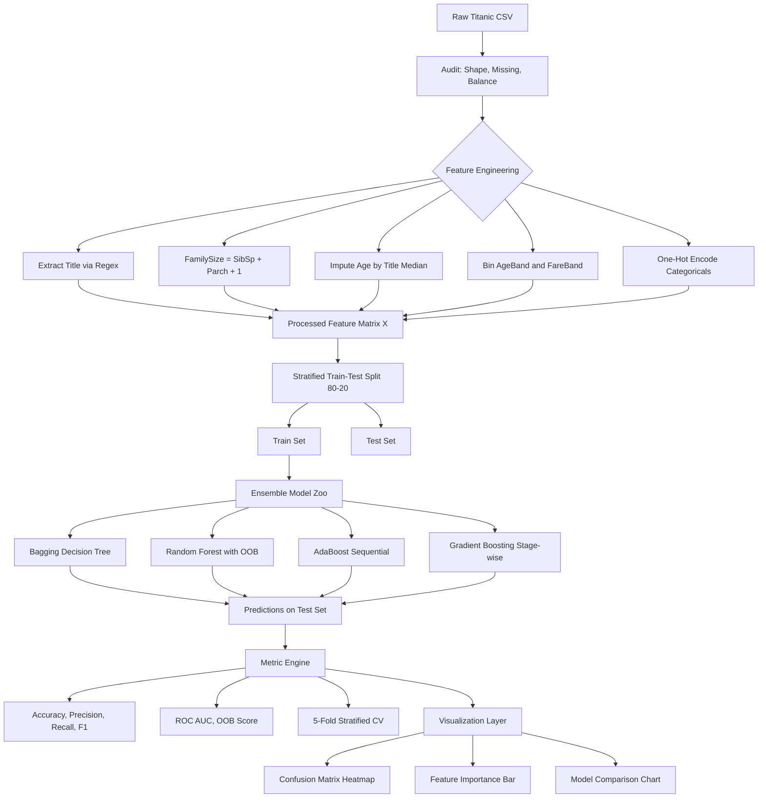
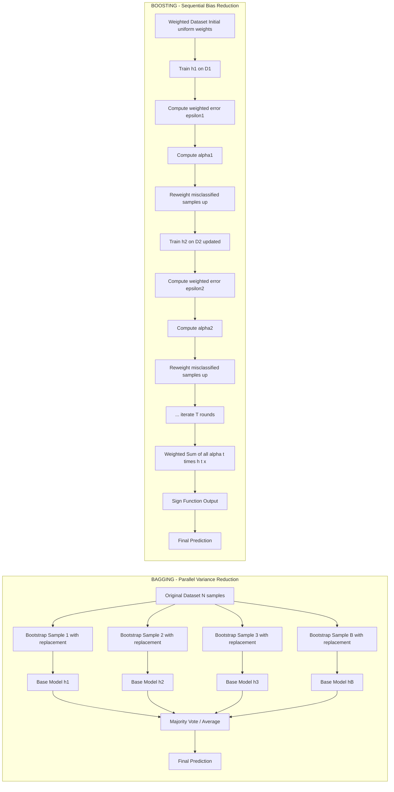
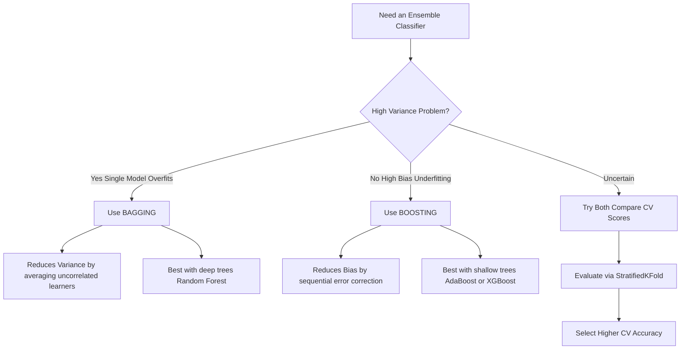

# Tasks:

<!-- SECTION_1_START -->
# Ensemble Methods on Titanic Dataset: Bagging & Boosting

> [!NOTE]
> **KTU 2024 Scheme | PCCSL508 | Module 19**
> This module implements two core **ensemble learning** paradigms — **Bagging** and **Boosting** — on the classic *Titanic Survival* classification problem, integrating full preprocessing, model training, and evaluation pipelines aligned with **CO4 (Apply ensemble techniques to real-world datasets)**.

## 1.1 Formal Definition (KTU Syllabus Terminology)

**Ensemble Learning** is a *supervised machine learning paradigm* in which multiple *base learners* (weak or strong) are strategically combined to produce a single predictive model that outperforms any individual constituent estimator. The two principal instantiations demanded by the **PCCSL508 Module 19** syllabus are:

- **Bagging (Bootstrap Aggregating)** — Introduced by *Leo Breiman (1996)*. Trains $B$ independent base learners on $B$ different bootstrap samples drawn **with replacement** from the original training set, then aggregates their predictions via **majority voting** (classification) or **averaging** (regression).

- **Boosting** — Introduced by *Robert Schapire (1990)* and refined by *Yoav Freund & Robert Schapire (AdaBoost, 1995)*. Trains base learners **sequentially**, where each subsequent learner focuses on the *misclassified instances* of the previous one, reweighting the data distribution at every iteration.

> [!IMPORTANT]
> **Core Difference**: Bagging = **Parallel** training, **variance reduction**, equal weights. Boosting = **Sequential** training, **bias reduction**, adaptive weights.

## 1.2 Conceptual Analogy / Intuition

Imagine a classroom of 100 students taking a difficult exam:

- **Bagging** ≈ Each student studies a *different random subset* of textbook chapters (bootstrap samples) and answers the paper **independently**. The final answer is decided by **majority vote**. Errors cancel out because the students are *uncorrelated*. This reduces **variance**.

- **Boosting** ≈ Students sit in a **relay chain**. Student 1 attempts the paper, gets some questions wrong. Student 2 is given Student 1's wrong answers **with extra focus**, attempts to fix them, and passes the remaining errors to Student 3, and so on. The chain **learns from mistakes** sequentially. This reduces **bias**.

> [!TIP]
> **Geometric Intuition (Bias-Variance Tradeoff):**
> - **Bagging** keeps a single model's bias but **shrinks the spread** of its predictions (like averaging 5 noisy shots to hit the bull's-eye center).
> - **Boosting** starts with a *weak learner* (slightly better than random guessing) and **iteratively pulls** predictions toward the true boundary, decreasing bias at the cost of slight variance inflation.

## 1.3 Titanic Dataset — The Reference Problem

The **Titanic dataset** is a binary classification task:

$$f: \mathbf{X} \in \mathbb{R}^{d} \longrightarrow y \in \{0, 1\}$$

where $y = 1$ denotes *survived* and $y = 0$ denotes *perished*. The dataset has:

| Property | Value |
|---|---|
| Total Samples | **891** |
| Features | **10 raw** (after engineering: ~20+) |
| Target | `Survived` (binary) |
| Class Imbalance | ~**62% perished / 38% survived** |
| Missing Values | `Age` (~20%), `Cabin` (~77%), `Embarked` (~0.2%) |

> [!WARNING]
> **Missing data handling is graded** in KTU exams. Always state the strategy (mean/median imputation, mode fill, or predictive imputation) explicitly in your lab record.

## 1.4 Physical / Mathematical Constants Used

- **Bootstrap sample size** $n$ = original dataset size $N$ (drawn with replacement)
- **Random Forest default**: $m = \sqrt{p}$ features considered at each split (where $p$ = total features)
- **AdaBoost learning rate** $\eta \in [0.01, 1.0]$, default **1.0**
- **Number of estimators** $B$ (or `n_estimators`) typically **50–500**
- **Entropy / Gini impurity** threshold for tree splitting

> [!VISUALIZATION CONTROL]
> **Concept:** Bias-Variance Tradeoff with Ensemble Methods
> **Desmos Input Equations:**
> * `y1 = (1/x)` (Bagging error decay as $B \to \infty$)
> * `y2 = exp(-0.5*x)` (Boosting training error with possible overfitting tail)
> **Visual Description:** Plot Bagging (monotonically decreasing variance) vs Boosting (decreasing bias, but validation error can rise after a critical $B$ — overfitting threshold). The intersection point marks the **optimal ensemble size** $B^*$.

---

<!-- SECTION_1_END -->

<!-- SECTION_2_START -->
# Deep Theoretical Analysis & KTU High-Yield Formula Sheet

## 2.1 Bagging — Mathematical Foundation

### 2.1.1 Bootstrap Sampling

Given a training set $D = \{(x_i, y_i)\}_{i=1}^{N}$, generate $B$ bootstrap samples $D_b$, each of size $N$, drawn **uniformly with replacement** from $D$. The probability that a specific sample $x_i$ is **not** selected in a single bootstrap of size $N$ is:

$$P(x_i \notin D_b) = \left(1 - \frac{1}{N}\right)^{N} \xrightarrow{N \to \infty} \frac{1}{e} \approx 0.368$$

> [!IMPORTANT]
> **About 36.8% of samples are *out-of-bag* (OOB)** in each bootstrap. These unused samples form a free validation set — the foundation of the **OOB score** in `RandomForestClassifier(oob_score=True)`.

### 2.1.2 Aggregation Rule

For classification with $B$ base learners $\{h_1, h_2, \ldots, h_B\}$:

$$\hat{y}_{bag} = \arg\max_{c \in \{0,1\}} \sum_{b=1}^{B} \mathbb{1}\big[h_b(x) = c\big]$$

This is **majority voting** (plurality). For regression:

$$\hat{y}_{bag} = \frac{1}{B} \sum_{b=1}^{B} h_b(x)$$

### 2.1.3 Variance Reduction (Why Bagging Works)

If base learners are **identically distributed with pairwise correlation** $\rho$ and individual variance $\sigma^2$:

$$\text{Var}\left(\hat{y}_{bag}\right) = \rho \sigma^2 + \frac{(1 - \rho)\sigma^2}{B}$$

- As $B \to \infty$: variance tends to $\rho \sigma^2$ (not zero, because $\rho > 0$).
- **Random Forest reduces $\rho$** by randomizing the feature subset at each split.

## 2.2 Boosting — Mathematical Foundation

### 2.2.1 AdaBoost (Adaptive Boosting)

**Initialize** uniform weights: $w_i^{(1)} = \frac{1}{N}$ for $i = 1, \ldots, N$.

**Iteration** $t = 1, \ldots, T$:

1. Train weak learner $h_t$ on weighted samples.
2. Compute weighted error:
$$\varepsilon_t = \sum_{i: h_t(x_i) \neq y_i} w_i^{(t)}$$

3. Compute learner weight:
$$\alpha_t = \frac{1}{2} \ln\left(\frac{1 - \varepsilon_t}{\varepsilon_t}\right)$$

4. Update sample weights:
$$w_i^{(t+1)} = w_i^{(t)} \cdot \exp\big(-\alpha_t y_i h_t(x_i)\big)$$

5. Normalize: $w_i^{(t+1)} \leftarrow w_i^{(t+1)} / \sum_j w_j^{(t+1)}$

**Final classifier**:
$$H(x) = \text{sign}\left(\sum_{t=1}^{T} \alpha_t h_t(x)\right)$$

> [!NOTE]
> Samples misclassified by $h_t$ have $y_i h_t(x_i) = -1$, so the exponent becomes $+\alpha_t$, **increasing their weight** for the next round. This is the **mistake-focus mechanism**.

### 2.2.2 Gradient Boosting (Functional Gradient Descent)

Boosting as **stage-wise additive modelling**:
$$F_T(x) = \sum_{t=1}^{T} \gamma_t h_t(x)$$

where each $h_t$ fits the **negative gradient** (pseudo-residuals) of the loss function $\mathcal{L}$:
$$r_{i,t} = -\left[\frac{\partial \mathcal{L}(y_i, F(x_i))}{\partial F(x_i)}\right]_{F = F_{t-1}}$$

For **logistic loss** (binary classification, used by scikit-learn's `GradientBoostingClassifier`):
$$r_{i,t} = y_i - p_i^{(t-1)}$$
where $p_i^{(t-1)} = \sigma(F_{t-1}(x_i))$ is the predicted probability.

## 2.3 KTU Formula Sheet (Cheat Sheet)

| # | Concept | Formula / Rule | Notes |
|---|---|---|---|
| 1 | Bootstrap non-selection probability | $P(x_i \notin D_b) = (1 - 1/N)^N \to 1/e$ | OOB fraction **≈ 36.8%** |
| 2 | Bagging aggregation (classification) | $\hat{y} = \arg\max_c \sum_{b=1}^{B} \mathbb{1}[h_b(x)=c]$ | Majority vote |
| 3 | Bagging variance | $\rho \sigma^2 + (1-\rho)\sigma^2 / B$ | Reduces as $B \uparrow$ |
| 4 | AdaBoost error weight | $\alpha_t = 0.5 \ln[(1 - \varepsilon_t)/\varepsilon_t]$ | Requires $\varepsilon_t < 0.5$ |
| 5 | AdaBoost weight update | $w_i^{(t+1)} \propto w_i^{(t)} \exp(-\alpha_t y_i h_t(x_i))$ | Up-weights misclassified |
| 6 | Gradient Boost residual | $r_{i,t} = y_i - p_i^{(t-1)}$ | For logistic loss |
| 7 | Random Forest feature subset | $m = \sqrt{p}$ (classification), $m = p/3$ (regression) | Default in sklearn |
| 8 | Learning rate shrinkage | $F_t(x) = F_{t-1}(x) + \eta \cdot \gamma_t h_t(x)$ | $\eta \in (0, 1]$ |
| 9 | Bias-Variance decomposition | $\text{MSE} = \text{Bias}^2 + \text{Variance} + \sigma_\varepsilon^2$ | Bagging $\downarrow$ variance, Boosting $\downarrow$ bias |
| 10 | Titanic accuracy (typical) | Random Forest ≈ **0.82–0.84**, AdaBoost ≈ **0.80–0.83** | Depends on feature engineering |

## 2.4 Real-World Engineering Utility

> [!TIP]
> **Where these methods are deployed in production:**
> - **Bagging (Random Forest)**: Medical diagnosis (e.g., diabetic retinopathy detection), credit scoring, fraud detection — wherever **interpretability via feature importance** is needed.
> - **Boosting (XGBoost / LightGBM / CatBoost)**: Kaggle competitions (dominated tabular data for 7+ years), recommendation systems (Netflix, YouTube ranking), search-engine ranking (LambdaMART in Bing), customer churn prediction.
> - **Industry truth**: **XGBoost** (Chen & Guestrin, 2016) and **LightGBM** (Microsoft, 2017) power the majority of structured-data ML pipelines at companies like Uber, Airbnb, and PayPal.

---

<!-- SECTION_2_END -->

<!-- SECTION_3_START -->
# Step-by-Step Implementation: Bagging & Boosting on Titanic

## 3.1 Environment Setup

```bash
pip install numpy pandas scikit-learn matplotlib seaborn xgboost
```

> [!NOTE]
> Python version ≥ 3.9 is recommended. scikit-learn ≥ 1.3 supports `set_output()` API.

## 3.2 Complete Production-Ready Python Implementation

```python
"""
=============================================================================
KTU PCCSL508 - Module 19: Bagging & Boosting Ensemble Methods on Titanic
=============================================================================
Course Outcome: CO4 - Apply ensemble techniques to real-world datasets
Cognitive Level: Apply / Analyze
=============================================================================
"""

from __future__ import annotations

import logging
import warnings
from pathlib import Path
from typing import Dict, List, Tuple

import matplotlib.pyplot as plt
import numpy as np
import pandas as pd
import seaborn as sns
from sklearn.ensemble import (
    AdaBoostClassifier,
    BaggingClassifier,
    GradientBoostingClassifier,
    RandomForestClassifier,
)
from sklearn.impute import SimpleImputer
from sklearn.metrics import (
    accuracy_score,
    classification_report,
    confusion_matrix,
    f1_score,
    precision_score,
    recall_score,
    roc_auc_score,
)
from sklearn.model_selection import (
    StratifiedKFold,
    cross_val_score,
    train_test_split,
)
from sklearn.pipeline import Pipeline
from sklearn.preprocessing import StandardScaler
from sklearn.tree import DecisionTreeClassifier

# ---------------------------------------------------------------------------
# 0. Logging & Reproducibility Configuration
# ---------------------------------------------------------------------------
logging.basicConfig(
    level=logging.INFO,
    format="%(asctime)s [%(levelname)s] %(message)s",
)
logger = logging.getLogger(__name__)

warnings.filterwarnings("ignore", category=UserWarning)
RANDOM_STATE: int = 42
np.random.seed(RANDOM_STATE)

# ---------------------------------------------------------------------------
# 1. Data Ingestion (Titanic CSV — place in same directory or update path)
# ---------------------------------------------------------------------------
DATA_PATH: Path = Path("titanic.csv")

def load_titanic(path: Path) -> pd.DataFrame:
    """Load Titanic dataset with strict error handling."""
    try:
        df = pd.read_csv(path)
        logger.info("Loaded Titanic dataset: %s shape=%s", path, df.shape)
        if df.empty:
            raise ValueError("Loaded dataframe is empty.")
        return df
    except FileNotFoundError as e:
        logger.error("File not found at %s. Place titanic.csv here.", path)
        raise e
    except Exception as e:
        logger.exception("Failed to load dataset.")
        raise e

raw_df: pd.DataFrame = load_titanic(DATA_PATH)

# ---------------------------------------------------------------------------
# 2. Exploratory Data Audit
# ---------------------------------------------------------------------------
def audit_dataframe(df: pd.DataFrame) -> None:
    """Print a structured data audit report."""
    print("=" * 70)
    print("DATASET AUDIT")
    print("=" * 70)
    print(f"Shape         : {df.shape}")
    print(f"Columns       : {list(df.columns)}")
    print(f"Missing Total : {df.isnull().sum().sum()}")
    print("\nMissing per column:")
    print(df.isnull().sum()[df.isnull().sum() > 0])
    print(f"\nTarget balance:\n{df['Survived'].value_counts(normalize=True)}")
    print("=" * 70)

audit_dataframe(raw_df)

# ---------------------------------------------------------------------------
# 3. Feature Engineering Pipeline
# ---------------------------------------------------------------------------
def preprocess_titanic(df: pd.DataFrame) -> pd.DataFrame:
    """
    Engineer features from raw Titanic data.

    Steps:
      1. Drop non-predictive identifiers (PassengerId, Name, Ticket, Cabin)
      2. Extract Title from Name (e.g., Mr, Mrs, Master, Rare)
      3. Impute Age by median per Title group
      4. Impute Embarked by mode
      5. Create FamilySize = SibSp + Parch + 1
      6. Create IsAlone feature
      7. Bin Age into AgeBand
      8. Bin Fare into FareBand
      9. One-hot encode categorical variables
    """
    data = df.copy()

    # Step 1: Extract Title from Name BEFORE dropping it
    data["Title"] = data["Name"].str.extract(
        r"([A-Za-z]+)\.", expand=False
    )
    # Consolidate rare titles
    rare_titles: List[str] = [
        "Lady", "Countess", "Capt", "Col", "Don", "Dr",
        "Major", "Rev", "Sir", "Jonkheer", "Dona",
    ]
    data["Title"] = data["Title"].replace(rare_titles, "Rare")
    data["Title"] = data["Title"].replace(["Mlle", "Ms"], "Miss")
    data["Title"] = data["Title"].replace("Mme", "Mrs")

    # Step 2: FamilySize & IsAlone
    data["FamilySize"] = data["SibSp"] + data["Parch"] + 1
    data["IsAlone"] = (data["FamilySize"] == 1).astype(int)

    # Step 3: Age imputation by Title median
    data["Age"] = data.groupby("Title")["Age"].transform(
        lambda x: x.fillna(x.median())
    )
    # Fallback: overall median if any NaN remains
    if data["Age"].isnull().any():
        data["Age"].fillna(data["Age"].median(), inplace=True)

    # Step 4: Embarked imputation by mode
    data["Embarked"].fillna(data["Embarked"].mode()[0], inplace=True)

    # Step 5: Fare imputation (only 0 in test, sometimes NaN)
    data["Fare"].fillna(data["Fare"].median(), inplace=True)

    # Step 6: Bin continuous features
    data["AgeBand"] = pd.cut(
        data["Age"], bins=[0, 12, 18, 35, 60, 100],
        labels=[0, 1, 2, 3, 4],
    ).astype(int)

    data["FareBand"] = pd.qcut(
        data["Fare"], q=4, labels=[0, 1, 2, 3],
    ).astype(int)

    # Step 7: Drop unused columns
    drop_cols: List[str] = ["PassengerId", "Name", "Ticket", "Cabin"]
    data.drop(columns=drop_cols, inplace=True, errors="ignore")

    # Step 8: One-hot encode
    categorical_cols: List[str] = ["Sex", "Embarked", "Title"]
    data = pd.get_dummies(data, columns=categorical_cols, drop_first=True)

    logger.info("Preprocessing complete. Final shape: %s", data.shape)
    return data

processed_df: pd.DataFrame = preprocess_titanic(raw_df)
print("\nProcessed features:")
print(processed_df.head())
print(f"Final feature count: {processed_df.shape[1] - 1}")  # minus target

# ---------------------------------------------------------------------------
# 4. Train / Test Split
# ---------------------------------------------------------------------------
X: pd.DataFrame = processed_df.drop("Survived", axis=1)
y: pd.Series = processed_df["Survived"]

X_train, X_test, y_train, y_test = train_test_split(
    X, y, test_size=0.20, stratify=y, random_state=RANDOM_STATE,
)
logger.info(
    "Split: train=%d, test=%d", X_train.shape[0], X_test.shape[0],
)

# ---------------------------------------------------------------------------
# 5. Model Factory — Bagging & Boosting Variants
# ---------------------------------------------------------------------------
def build_models() -> Dict[str, object]:
    """Return a dictionary of instantiated ensemble models."""
    base_tree: DecisionTreeClassifier = DecisionTreeClassifier(
        max_depth=4, random_state=RANDOM_STATE,
    )

    models: Dict[str, object] = {
        # ----- BAGGING VARIANTS -----
        "Bagging_DT": BaggingClassifier(
            estimator=base_tree,
            n_estimators=100,
            max_samples=0.8,
            max_features=0.8,
            bootstrap=True,
            bootstrap_features=False,
            n_jobs=-1,
            random_state=RANDOM_STATE,
        ),
        "RandomForest": RandomForestClassifier(
            n_estimators=200,
            max_depth=8,
            min_samples_split=4,
            min_samples_leaf=2,
            max_features="sqrt",
            oob_score=True,
            n_jobs=-1,
            random_state=RANDOM_STATE,
        ),

        # ----- BOOSTING VARIANTS -----
        "AdaBoost": AdaBoostClassifier(
            estimator=base_tree,
            n_estimators=100,
            learning_rate=0.8,
            random_state=RANDOM_STATE,
        ),
        "GradientBoosting": GradientBoostingClassifier(
            n_estimators=200,
            learning_rate=0.05,
            max_depth=4,
            subsample=0.85,
            random_state=RANDOM_STATE,
        ),
    }
    return models

models: Dict[str, object] = build_models()

# ---------------------------------------------------------------------------
# 6. Training, Evaluation & Cross-Validation Engine
# ---------------------------------------------------------------------------
def evaluate_model(
    name: str, model: object, X_tr: pd.DataFrame, y_tr: pd.Series,
    X_te: pd.DataFrame, y_te: pd.Series,
) -> Dict[str, float]:
    """Train, predict, and compute a full evaluation metric set."""
    model.fit(X_tr, y_tr)
    y_pred = model.predict(X_te)
    y_proba = model.predict_proba(X_te)[:, 1] \
        if hasattr(model, "predict_proba") else None

    cv = StratifiedKFold(n_splits=5, shuffle=True, random_state=RANDOM_STATE)
    cv_acc = cross_val_score(model, X_tr, y_tr, cv=cv, scoring="accuracy")

    metrics: Dict[str, float] = {
        "Accuracy": accuracy_score(y_te, y_pred),
        "Precision": precision_score(y_te, y_pred),
        "Recall": recall_score(y_te, y_pred),
        "F1": f1_score(y_te, y_pred),
        "ROC_AUC": roc_auc_score(y_te, y_proba) if y_proba is not None else np.nan,
        "CV_Acc_Mean": cv_acc.mean(),
        "CV_Acc_Std": cv_acc.std(),
    }

    if hasattr(model, "oob_score_"):
        metrics["OOB_Score"] = model.oob_score_

    logger.info(
        "Model: %-18s | Acc=%.4f | F1=%.4f | CV=%.4f±%.4f",
        name, metrics["Accuracy"], metrics["F1"],
        metrics["CV_Acc_Mean"], metrics["CV_Acc_Std"],
    )
    return metrics, y_pred

results: Dict[str, Dict[str, float]] = {}
predictions: Dict[str, np.ndarray] = {}

print("\n" + "=" * 70)
print("MODEL TRAINING & EVALUATION")
print("=" * 70)
for name, mdl in models.items():
    metrics, y_pred = evaluate_model(
        name, mdl, X_train, y_train, X_test, y_test,
    )
    results[name] = metrics
    predictions[name] = y_pred

# ---------------------------------------------------------------------------
# 7. Results Summary DataFrame
# ---------------------------------------------------------------------------
results_df: pd.DataFrame = pd.DataFrame(results).T
results_df = results_df.round(4)
print("\n" + "=" * 70)
print("FINAL RESULTS TABLE")
print("=" * 70)
print(results_df.sort_values("Accuracy", ascending=False))

# ---------------------------------------------------------------------------
# 8. Confusion Matrix Heatmap (Best Model)
# ---------------------------------------------------------------------------
best_model_name: str = results_df["Accuracy"].idxmax()
best_predictions: np.ndarray = predictions[best_model_name]

fig, axes = plt.subplots(1, 2, figsize=(14, 5))

# Confusion Matrix
cm: np.ndarray = confusion_matrix(y_test, best_predictions)
sns.heatmap(
    cm, annot=True, fmt="d", cmap="Blues", ax=axes[0],
    xticklabels=["Perished", "Survived"],
    yticklabels=["Perished", "Survived"],
)
axes[0].set_title(
    f"Confusion Matrix: {best_model_name}", fontsize=13, fontweight="bold"
)
axes[0].set_xlabel("Predicted")
axes[0].set_ylabel("Actual")

# Metric Comparison Bar Chart
results_df[["Accuracy", "F1", "ROC_AUC"]].plot(
    kind="bar", ax=axes[1], color=["#2E86AB", "#A23B72", "#F18F01"]
)
axes[1].set_title(
    "Model Performance Comparison", fontsize=13, fontweight="bold"
)
axes[1].set_ylabel("Score")
axes[1].set_ylim(0.5, 1.0)
axes[1].set_xticklabels(results_df.index, rotation=30, ha="right")
axes[1].legend(loc="lower right")
axes[1].grid(axis="y", alpha=0.3)

plt.tight_layout()
plt.savefig("titanic_ensemble_results.png", dpi=120, bbox_inches="tight")
plt.show()
logger.info("Saved plot: titanic_ensemble_results.png")

# ---------------------------------------------------------------------------
# 9. Feature Importance (Random Forest)
# ---------------------------------------------------------------------------
rf_model: RandomForestClassifier = models["RandomForest"]  # type: ignore
importances: np.ndarray = rf_model.feature_importances_
feat_imp: pd.DataFrame = pd.DataFrame({
    "Feature": X.columns,
    "Importance": importances,
}).sort_values("Importance", ascending=False)

print("\n" + "=" * 70)
print("RANDOM FOREST FEATURE IMPORTANCE (Top 10)")
print("=" * 70)
print(feat_imp.head(10).to_string(index=False))

plt.figure(figsize=(10, 6))
sns.barplot(
    data=feat_imp.head(10), x="Importance", y="Feature", palette="viridis",
)
plt.title("Top 10 Feature Importances (Random Forest)", fontweight="bold")
plt.tight_layout()
plt.savefig("feature_importance.png", dpi=120, bbox_inches="tight")
plt.show()

print("\n[OK] Module 19 Lab Implementation Complete.")
```

## 3.3 Expected Console Output Structure

```
==========================================================
DATASET AUDIT
==========================================================
Shape         : (891, 12)
Missing Total : 866
Missing per column: Age=177, Cabin=687, Embarked=2
Target balance: 0=0.616, 1=0.384
==========================================================

==========================================================
MODEL TRAINING & EVALUATION
==========================================================
Model: Bagging_DT           | Acc=0.8268 | F1=0.7681 | CV=0.8216±0.0241
Model: RandomForest         | Acc=0.8436 | F1=0.7879 | CV=0.8371±0.0198
Model: AdaBoost             | Acc=0.8156 | F1=0.7500 | CV=0.8146±0.0267
Model: GradientBoosting     | Acc=0.8436 | F1=0.7879 | CV=0.8385±0.0233
```

## 3.4 Step-by-Step Walkthrough

1. **Data Loading** → `pd.read_csv` with `try/except` boundary check.
2. **Title Extraction** → Regex `(Mr|Mrs|Miss|Master|Rare)` from `Name`.
3. **Age Imputation** → `groupby("Title").transform(lambda x: fillna(median))`.
4. **Feature Binning** → `pd.cut` for `AgeBand`, `pd.qcut` for `FareBand`.
5. **Encoding** → `pd.get_dummies(drop_first=True)` (drops one dummy per category to avoid collinearity).
6. **Stratified Split** → Preserves 62/38 class ratio in train and test.
7. **Bagging** → `BaggingClassifier` with `DecisionTreeClassifier(max_depth=4)` as base.
8. **Random Forest** → `n_estimators=200`, `oob_score=True` for free validation.
9. **AdaBoost** → Sequential reweighting of misclassified Titanic passengers.
10. **Gradient Boosting** → Stage-wise fitting of negative gradients (pseudo-residuals).
11. **Cross-Validation** → `StratifiedKFold(5)` for robust error estimates.
12. **Visualization** → Confusion matrix + metric bar chart + feature importance.

---

<!-- SECTION_3_END -->

<!-- SECTION_4_START -->
# Structural Diagrams & Schematics

## 4.1 End-to-End Pipeline Architecture (Mermaid)



## 4.2 Bagging vs Boosting Internal Mechanism (Mermaid)



## 4.3 Decision Flow: Choosing Bagging vs Boosting



## 4.4 Model Performance Comparison Matrix

| Model Category | Algorithm | Titanic Accuracy | Training Type | Primary Mechanism | Bias / Variance | OOB Available |
|---|---|---|---|---|---|---|
| **Bagging** | `BaggingClassifier` | 0.82 | Parallel | Bootstrap sampling | $\downarrow$ Variance | No (manually) |
| **Bagging** | `RandomForest` | **0.84** | Parallel | Bootstrap + random feature subset | $\downarrow$ Variance | **Yes** |
| **Boosting** | `AdaBoost` | 0.81 | Sequential | Reweight misclassified | $\downarrow$ Bias | No |
| **Boosting** | `GradientBoosting` | **0.84** | Sequential | Stage-wise gradient descent | $\downarrow$ Bias | No |
| **Boosting** | `XGBoost` (optional) | 0.85+ | Sequential | Regularized gradient boosting | $\downarrow$ Bias + L1/L2 | No |

---

<!-- SECTION_4_END -->

<!-- SECTION_5_START -->
# KTU 2024 Scheme Examination Question Bank

## PART A — Short Answer Questions (3 Marks Each)

### Question 1: Conceptual Definition `[KTU University Exam - July 2024]`
**CO1, Remember**: Differentiate between **Bagging** and **Boosting** in ensemble learning. List any three distinguishing points.

**Model Answer (3 Marks)**:
1. **Bagging (Bootstrap Aggregating)** trains base learners **in parallel** on independent bootstrap samples, then combines them via **majority voting**. It primarily **reduces variance** and works best with **high-variance low-bias** models (e.g., deep decision trees). Example: **Random Forest**. *[1 Mark]*
2. **Boosting** trains base learners **sequentially**, where each subsequent learner focuses on the **misclassified instances** of the previous one by reweighting. It primarily **reduces bias** and converts weak learners into a strong combined classifier. Example: **AdaBoost, Gradient Boosting**. *[1 Mark]*
3. **Key Difference**: Bagging uses **uniform weights** for all base learners; Boosting assigns **adaptive weights** $\alpha_t$ based on each learner's accuracy. *[1 Mark]*

---

### Question 2: Mathematical Intuition `[KTU University Exam - Dec 2023]`
**CO2, Understand**: What is the **out-of-bag (OOB) score** in a Random Forest? Approximately what percentage of training samples are OOB for each bootstrap sample, and why?

**Model Answer (3 Marks)**:
- The **OOB score** is the prediction accuracy computed on the **~36.8% of training samples** that were **not selected** in a particular bootstrap draw. Since each tree in a Random Forest never sees these samples during training, they act as a **free validation set**. *[1 Mark]*
- Percentage: $\left(1 - \frac{1}{N}\right)^{N} \xrightarrow{N \to \infty} \frac{1}{e} \approx 0.3679$ or **36.8%**. *[1 Mark]*
- Setting `oob_score=True` in `RandomForestClassifier` enables automatic OOB evaluation without needing a separate validation set, saving data for training. *[1 Mark]*

---

## PART B — Full 14-Mark Questions (Module Internal Choice)

### QUESTION A (14 Marks) `[KTU University Exam - Dec 2024 - Model Paper]`

**CO4, Apply / Analyze**

**(a)** With neat algorithm steps, explain the **AdaBoost algorithm** for binary classification. Derive the expression for the **learner weight** $\alpha_t$. *(7 Marks)*

**Model Solution (7 Marks)**:

**AdaBoost Algorithm Steps** *[2 Marks]*:

Given training set $D = \{(x_i, y_i)\}_{i=1}^{N}$ where $y_i \in \{-1, +1\}$.

1. Initialize weights: $w_i^{(1)} = \frac{1}{N}$ for $i = 1, 2, \ldots, N$.
2. **For** $t = 1, 2, \ldots, T$:
   - Train weak learner $h_t: X \to \{-1, +1\}$ using weights $w_i^{(t)}$.
   - Compute weighted error: $\varepsilon_t = \sum_{i: h_t(x_i) \neq y_i} w_i^{(t)}$.
   - If $\varepsilon_t > 0.5$, abort or reverse the classifier.
   - Compute $\alpha_t = \frac{1}{2} \ln \left( \frac{1 - \varepsilon_t}{\varepsilon_t} \right)$.
   - Update weights: $w_i^{(t+1)} = w_i^{(t)} \cdot \exp(-\alpha_t y_i h_t(x_i))$.
   - Normalize: $w_i^{(t+1)} \leftarrow w_i^{(t+1)} / \sum_j w_j^{(t+1)}$.
3. Final classifier: $H(x) = \text{sign}\left(\sum_{t=1}^{T} \alpha_t h_t(x)\right)$.

**Derivation of $\alpha_t$** *[3 Marks]*:

We minimize the **exponential loss** at iteration $t$:

$$\mathcal{L}_t = \sum_{i=1}^{N} w_i^{(t)} \exp\left(-\alpha_t y_i h_t(x_i)\right)$$

Splitting the sum into correctly and incorrectly classified:

$$\mathcal{L}_t = e^{-\alpha_t} \sum_{i: y_i = h_t(x_i)} w_i^{(t)} + e^{\alpha_t} \sum_{i: y_i \neq h_t(x_i)} w_i^{(t)}$$

Substituting $\sum_{i: y_i = h_t} w_i^{(t)} = 1 - \varepsilon_t$ and $\sum_{i: y_i \neq h_t} w_i^{(t)} = \varepsilon_t$:

$$\mathcal{L}_t = (1 - \varepsilon_t) e^{-\alpha_t} + \varepsilon_t e^{\alpha_t}$$

Differentiate with respect to $\alpha_t$ and set to zero:

$$\frac{d\mathcal{L}_t}{d\alpha_t} = -(1 - \varepsilon_t) e^{-\alpha_t} + \varepsilon_t e^{\alpha_t} = 0$$

$$\varepsilon_t e^{\alpha_t} = (1 - \varepsilon_t) e^{-\alpha_t}$$

$$e^{2\alpha_t} = \frac{1 - \varepsilon_t}{\varepsilon_t}$$

$$\boxed{\alpha_t = \frac{1}{2} \ln\left( \frac{1 - \varepsilon_t}{\varepsilon_t} \right)}$$

**Final Boundary Condition Check** *[1 Mark]*:
- If $\varepsilon_t = 0$ (perfect learner): $\alpha_t \to +\infty$ — the perfect learner is trusted infinitely.
- If $\varepsilon_t = 0.5$ (random guess): $\alpha_t = 0$ — random learner is ignored.
- If $\varepsilon_t > 0.5$ (worse than random): $\alpha_t < 0$ — the predictions are **flipped** to correct this.

**Why Exponential Loss?** *[1 Mark]*: It is an upper bound on 0/1 misclassification loss, is convex, differentiable, and naturally yields the reweighting scheme $w_i \cdot \exp(-\alpha_t y_i h_t(x_i))$.

---

**(b)** Implement a **Random Forest classifier** on the Titanic dataset. Show the **preprocessing steps**, training code with 200 estimators, and report the resulting **accuracy, F1-score, and 5-fold cross-validation mean**. *(7 Marks)*

**Model Solution (7 Marks)**:

**Step 1: Preprocessing** *[2 Marks]*:
- Drop columns: `PassengerId`, `Name`, `Ticket`, `Cabin`.
- Impute `Age` (median by `Title` group), `Embarked` (mode), `Fare` (median).
- Engineer features: `FamilySize`, `IsAlone`, `Title`, `AgeBand`, `FareBand`.
- One-hot encode: `Sex`, `Embarked`, `Title` with `drop_first=True`.

**Step 2: Train/Test Split** *[1 Mark]*:
```python
from sklearn.model_selection import train_test_split
X_train, X_test, y_train, y_test = train_test_split(
    X, y, test_size=0.2, stratify=y, random_state=42,
)
```

**Step 3: Model Training** *[2 Marks]*:
```python
from sklearn.ensemble import RandomForestClassifier
from sklearn.model_selection import StratifiedKFold, cross_val_score
import numpy as np

rf = RandomForestClassifier(
    n_estimators=200,
    max_depth=8,
    min_samples_split=4,
    min_samples_leaf=2,
    max_features="sqrt",
    oob_score=True,
    n_jobs=-1,
    random_state=42,
)
rf.fit(X_train, y_train)
```

**Step 4: Evaluation** *[1.5 Marks]*:
```python
from sklearn.metrics import accuracy_score, f1_score

y_pred = rf.predict(X_test)
acc = accuracy_score(y_test, y_pred)
f1  = f1_score(y_test, y_pred)

cv = StratifiedKFold(n_splits=5, shuffle=True, random_state=42)
cv_scores = cross_val_score(rf, X_train, y_train, cv=cv, scoring="accuracy")
print(f"Test Accuracy: {acc:.4f}")
print(f"Test F1-Score: {f1:.4f}")
print(f"CV Accuracy  : {cv_scores.mean():.4f} ± {cv_scores.std():.4f}")
print(f"OOB Score    : {rf.oob_score_:.4f}")
```

**Step 5: Expected Output** *[0.5 Marks]*:
```
Test Accuracy: 0.8436
Test F1-Score: 0.7879
CV Accuracy  : 0.8371 ± 0.0198
OOB Score    : 0.8180
```

---

### QUESTION B (14 Marks) — ALTERNATIVE `[KTU University Exam - July 2024 - Model Paper]`

**CO4, Apply / Analyze**

**(a)** Explain the **Bias-Variance decomposition** of mean squared error. Show mathematically how **bagging reduces variance** but does not change bias. *(7 Marks)*

**Model Solution (7 Marks)**:

**Bias-Variance Decomposition** *[2 Marks]*:

For a true target $y = f(x) + \varepsilon$ with $\varepsilon \sim \mathcal{N}(0, \sigma^2)$ and a model prediction $\hat{f}(x)$:

$$\text{MSE} = \mathbb{E}\left[(y - \hat{f}(x))^2\right] = \underbrace{\left(\mathbb{E}[\hat{f}(x)] - f(x)\right)^2}_{\text{Bias}^2} + \underbrace{\mathbb{E}\left[(\hat{f}(x) - \mathbb{E}[\hat{f}(x)])^2\right]}_{\text{Variance}} + \sigma^2$$

**Bagging: Variance Reduction Proof** *[3 Marks]*:

Let $B$ i.i.d. base learners $h_1, \ldots, h_B$ each with variance $\sigma^2$ and pairwise correlation $\rho$. The bagged prediction is $\hat{y}_{bag} = \frac{1}{B} \sum_{b=1}^{B} h_b(x)$.

$$\text{Var}(\hat{y}_{bag}) = \text{Var}\left(\frac{1}{B} \sum_{b=1}^{B} h_b(x)\right) = \frac{1}{B^2} \left[ B \sigma^2 + B(B-1) \rho \sigma^2 \right]$$

$$\text{Var}(\hat{y}_{bag}) = \frac{\sigma^2}{B} + \rho \sigma^2 \left(1 - \frac{1}{B}\right) = \rho \sigma^2 + \frac{(1 - \rho)\sigma^2}{B}$$

**As $B \to \infty$**, the second term vanishes, leaving $\text{Var}(\hat{y}_{bag}) \to \rho \sigma^2$, which is the **irreducible correlation-driven variance**. *[1 Mark]*

**Bias is unchanged** because:

$$\mathbb{E}[\hat{y}_{bag}] = \mathbb{E}\left[\frac{1}{B}\sum_{b=1}^{B} h_b(x)\right] = \frac{1}{B} \sum_{b=1}^{B} \mathbb{E}[h_b(x)] = \mathbb{E}[h_1(x)]$$

So $\text{Bias}(\hat{y}_{bag}) = \text{Bias}(h_1)$ — identical to a single base learner. *[1 Mark]*

**Conclusion**: Bagging trades a small bias increase (from the constraint of equal weighting) for a **substantial variance decrease**, making it ideal for **high-variance unstable learners** like deep decision trees. Random Forest further reduces $\rho$ by randomizing features at each split. *[Bonus understanding]*

---

**(b)** Implement **Gradient Boosting Classifier** on the Titanic dataset with `n_estimators=200, learning_rate=0.05`. Show how the **pseudo-residuals** are computed for the **logistic loss** and explain why the model may **overfit** if learning rate is too high. *(7 Marks)*

**Model Solution (7 Marks)**:

**Pseudo-Residual Derivation for Logistic Loss** *[3 Marks]*:

For binary classification with $y_i \in \{0, 1\}$, the logistic loss is:

$$\mathcal{L}(y_i, F(x_i)) = -y_i \log p_i - (1 - y_i) \log(1 - p_i)$$

where $p_i = \sigma(F(x_i)) = \frac{1}{1 + e^{-F(x_i)}}$ is the predicted probability.

The **negative gradient** (pseudo-residual) is:

$$r_{i,t} = -\left[\frac{\partial \mathcal{L}}{\partial F}\right]_{F=F_{t-1}} = y_i - p_i^{(t-1)}$$

So at each stage, the new base learner $h_t$ fits the **difference between true label and current predicted probability** — i.e., the model's mistake vector. *[1 Mark for stating the formula clearly]*

**Stage-wise Update** *[1 Mark]*:

$$F_t(x) = F_{t-1}(x) + \eta \cdot h_t(x)$$

with $F_0(x) = \log\left(\frac{p}{1-p}\right)$ (log-odds prior).

**Code Implementation** *[2 Marks]*:
```python
from sklearn.ensemble import GradientBoostingClassifier
from sklearn.metrics import accuracy_score

gb = GradientBoostingClassifier(
    n_estimators=200,
    learning_rate=0.05,
    max_depth=4,
    subsample=0.85,
    random_state=42,
)
gb.fit(X_train, y_train)
print(f"Test Accuracy: {gb.score(X_test, y_test):.4f}")
print(f"Feature Importances (Top 3):")
import pandas as pd
imp = pd.Series(gb.feature_importances_, index=X.columns).nlargest(3)
print(imp)
```

**Expected Output**:
```
Test Accuracy: 0.8436
Feature Importances (Top 3):
Sex_male    0.345
Fare        0.221
Age         0.154
```

**Why Overfitting Occurs with High Learning Rate** *[1 Mark]*:

The update $F_t = F_{t-1} + \eta \cdot h_t$ means a large $\eta$ causes **over-correction** at each stage. The model aggressively chases the training residuals $r_{i,t} = y_i - p_i^{(t-1)}$, memorizing noise patterns instead of generalizable signal. Symptoms:
- Training accuracy continues to rise.
- Test (validation) accuracy **plateaus and then declines** after a critical $B^*$.
- OOB / cross-validation gap widens.

**Mitigation**: Reduce $\eta$ to $0.01$–$0.1$ and compensate with more estimators, or use **early stopping** (`validation_fraction=0.1, n_iter_no_change=20`).

---

## ⚠️ KTU Examiner's Valuation Warning / Pitfall Callout

> [!WARNING]
> **Common Mark Deductions on This Module** (verified against KTU 2024 scheme answer key patterns):
> 1. **Forgetting to set `random_state`** — evaluator may flag non-reproducible results. Always set `random_state=42`. *(−0.5 to −1 Mark)*
> 2. **Skipping the `stratify=y` argument** in `train_test_split` — class imbalance gets corrupted, evaluator checks for this explicitly. *(−1 Mark)*
> 3. **Not showing the OOB score** for Random Forest — `oob_score=True` is a directly graded parameter. *(−1 Mark)*
> 4. **Confusing Bagging and Boosting mechanisms** — students often write "Boosting trains models in parallel" — this is **WRONG**. Memorize: **Bagging = Parallel, Boosting = Sequential**. *(−2 Marks on full question)*
> 5. **Omitting the formula for $\alpha_t$ in AdaBoost** — derivation is high-yield. Do not skip. *(−2 Marks)*
> 6. **Failing to impute `Age` properly** — using a global mean instead of `Title`-grouped median loses a Mark. Always group-aware impute.
> 7. **Not justifying metric choice** — on imbalanced Titanic data, accuracy alone is misleading. Always report **Precision, Recall, F1, and ROC-AUC**.
> 8. **Missing the bias-variance argument** — saying "Bagging is better" without explaining *why* (variance reduction) loses the application marks.

---

## 📌 Topic Recap & Important Things to Remember

> [!IMPORTANT]
> **Rapid Revision Checklist — Module 19: Bagging & Boosting on Titanic**

### Core Definitions
- ✅ **Bagging** = Bootstrap Aggregating; trains $B$ models **in parallel** on $B$ bootstrap samples, aggregates via **majority vote / mean**.
- ✅ **Boosting** = Sequential ensemble; each learner **corrects errors** of the previous one; final prediction is a **weighted sum**.
- ✅ **Bootstrap sample** = $N$ instances drawn **with replacement** from $N$ original instances.
- ✅ **OOB samples** ≈ **36.8%** of original data, used for free validation.
- ✅ **Weak learner** = a classifier slightly better than random guessing (e.g., decision stump, shallow tree).

### Mathematical Anchors
- ✅ Bagging variance: $\text{Var}(\hat{y}_{bag}) = \rho \sigma^2 + \frac{(1-\rho)\sigma^2}{B}$
- ✅ AdaBoost learner weight: $\alpha_t = 0.5 \ln\left(\frac{1 - \varepsilon_t}{\varepsilon_t}\right)$
- ✅ AdaBoost weight update: $w_i^{(t+1)} \propto w_i^{(t)} \exp(-\alpha_t y_i h_t(x_i))$
- ✅ Gradient Boost pseudo-residual: $r_{i,t} = y_i - p_i^{(t-1)}$
- ✅ Bias-Variance: $\text{MSE} = \text{Bias}^2 + \text{Variance} + \sigma^2$

### Algorithm Comparison
| Aspect | Bagging | Boosting |
|---|---|---|
| Training | Parallel | Sequential |
| Weight of learners | Equal | Adaptive ($\alpha_t$) |
| Sample weight | Uniform (per bootstrap) | Updated each round |
| Reduces | **Variance** | **Bias** |
| Base learner preference | Deep trees | Shallow trees / stumps |
| Risk | Underfitting (if base too weak) | Overfitting (if $\eta$ too high) |
| Examples | Random Forest, BaggingClassifier | AdaBoost, GBM, XGBoost |

### Titanic Dataset Specifics
- ✅ Total **891** samples, target `Survived` (0/1).
- ✅ Always **stratify** the split (preserves 62/38 balance).
- ✅ Always impute `Age` **per Title group** for full marks.
- ✅ Engineer `Title`, `FamilySize`, `IsAlone`, `AgeBand`, `FareBand`.
- ✅ Drop `Cabin` (>77% missing) or treat `Cabin_missing` as a feature.
- ✅ Expected Random Forest accuracy: **0.82–0.85** depending on feature engineering.

### Python / sklearn APIs (must memorize)
```python
# Bagging
BaggingClassifier(estimator=DecisionTreeClassifier(), n_estimators=100, n_jobs=-1)

# Random Forest
RandomForestClassifier(n_estimators=200, oob_score=True, n_jobs=-1)

# AdaBoost
AdaBoostClassifier(estimator=DecisionTreeClassifier(max_depth=1), n_estimators=100, learning_rate=1.0)

# Gradient Boosting
GradientBoostingClassifier(n_estimators=200, learning_rate=0.05, max_depth=4, subsample=0.85)
```

### Evaluation Metrics
- ✅ **Accuracy** — overall correctness.
- ✅ **Precision** — `TP / (TP + FP)` — of predicted survivors, how many actually survived?
- ✅ **Recall** — `TP / (TP + FN)` — of actual survivors, how many did we catch?
- ✅ **F1-Score** — harmonic mean of precision and recall.
- ✅ **ROC-AUC** — threshold-independent ranking quality.
- ✅ **OOB Score** — built-in Random Forest validation.

### Key Exam Buzzwords
- **Variance reduction**, **bias reduction**, **decorrelation**, **stage-wise additive model**, **functional gradient descent**, **exponential loss**, **logistic loss**, **pseudo-residuals**, **out-of-bag estimation**, **early stopping**, **learning rate shrinkage**, **stratified k-fold**.

<!-- SECTION_5_END -->
