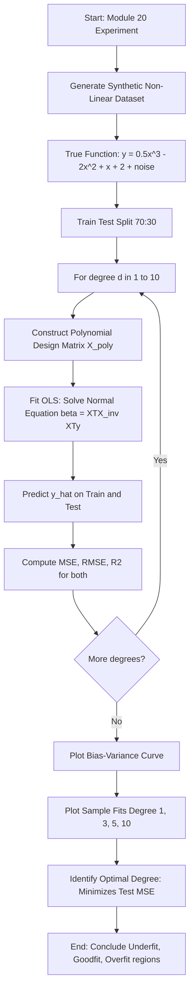
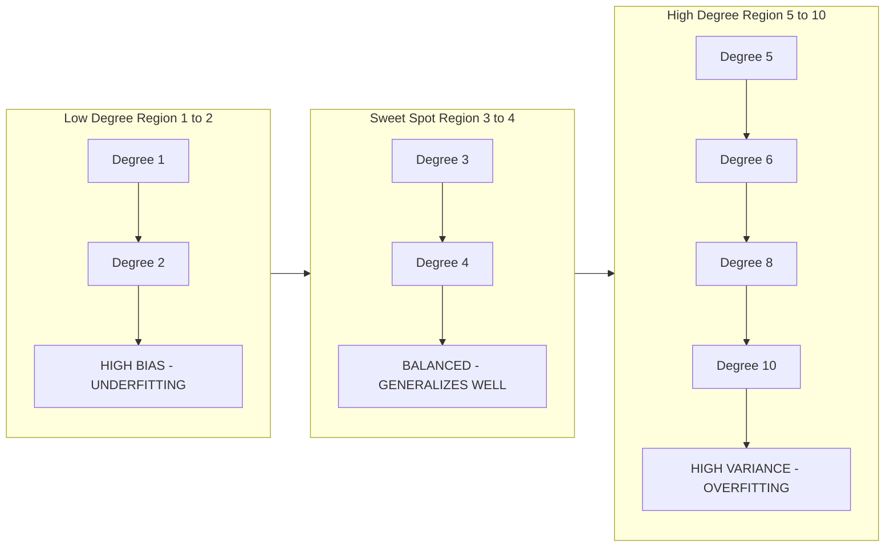
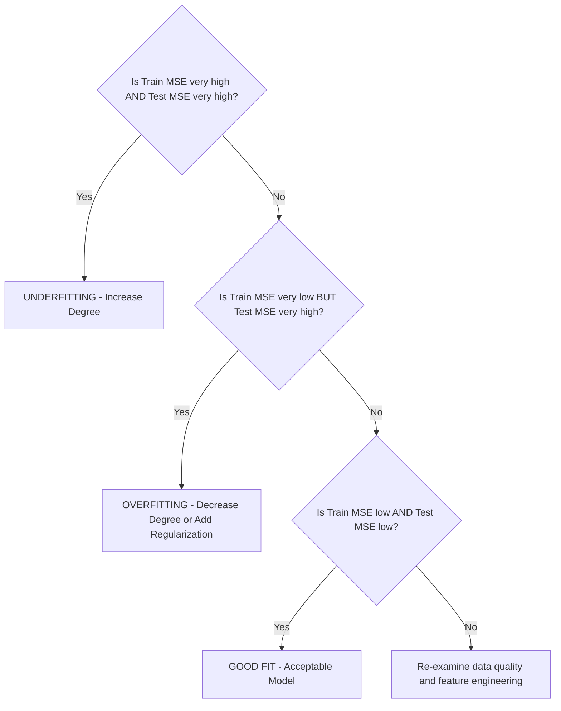
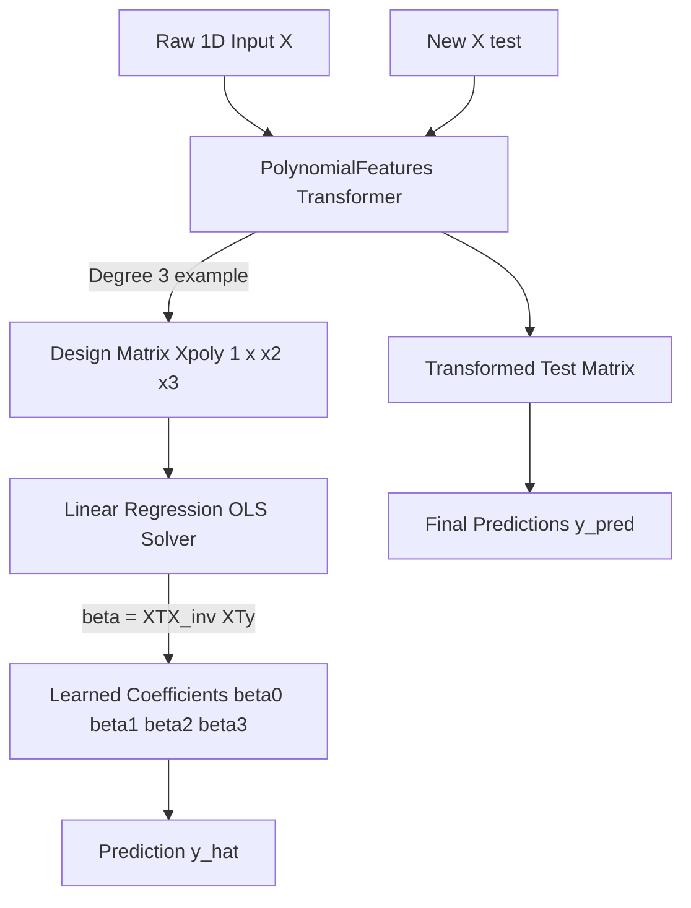
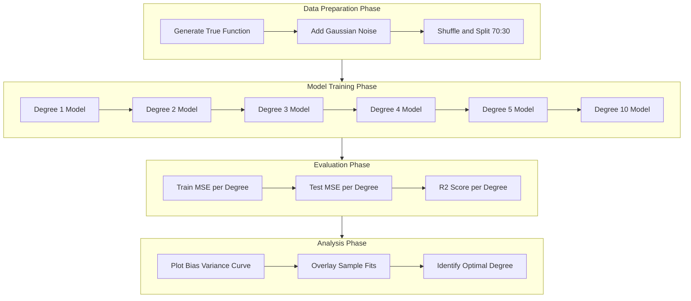

# Implement polynomial regression with varying degrees.

<!-- SECTION_1_START -->
# Polynomial Regression with Varying Degrees — Investigating Model Bias

## 1. Core Technical Definition (KTU 2024 Syllabus Aligned)

> [!IMPORTANT]
> **Polynomial Regression** is a supervised machine learning regression technique that models the relationship between the independent variable $X$ and the dependent variable $Y$ as an $n^{th}$ degree polynomial. It is a special case of multiple linear regression where the features are raised to successive integer powers, allowing the model to capture **non-linear patterns** in data while the underlying estimation mechanism remains a linear combination of coefficients.

The general mathematical form of a polynomial regression model of degree $n$ is given by:

$$
\hat{y} \;=\; \beta_0 \;+\; \beta_1 x \;+\; \beta_2 x^2 \;+\; \beta_3 x^3 \;+\; \dots \;+\; \beta_n x^n \;+\; \varepsilon
$$

where:
- $\hat{y}$ is the predicted (target) value
- $\beta_0$ is the **intercept** (bias term)
- $\beta_1, \beta_2, \dots, \beta_n$ are the polynomial coefficients (weights)
- $n$ is the **degree of the polynomial**
- $\varepsilon$ is the irreducible error (noise term)

> [!NOTE]
> **Syllabus Highlight (PCCSL508 — Module 20):** This experiment focuses on **investigating model bias** as the polynomial degree is varied from low (e.g., 1) to high (e.g., 10+). The objective is to empirically demonstrate the **Bias-Variance Tradeoff** — a foundational concept for understanding underfitting, appropriate fit, and overfitting in supervised learning.

---

## 2. Conceptual Analogy & Intuition

> [!TIP]
> **Real-World Analogy — The Rubber Band Story:**
> Imagine you have a set of dots scattered on a piece of paper and a rubber band. As you stretch the rubber band through these dots:
> - A **straight rubber band (degree 1)** = Linear regression. It ignores the curve, leaving many dots far from the line. → **High Bias (Underfitting)**
> - A **moderately curved rubber band (degree 2 or 3)** = Polynomial regression. It captures the main pattern smoothly. → **Balanced Fit**
> - A **highly wiggly rubber band (degree 15+)** = High-degree polynomial. It twists and turns to pass through *every single dot* exactly. → **High Variance (Overfitting)**
>
> The **degree** of the polynomial is essentially the **"flexibility knob"** of the rubber band. Your job is to find the sweet spot.

> [!NOTE]
> **Geometric Intuition on a 2D Plane:**
> - **Degree 1 (Linear):** The model is a single straight line. It has very low complexity and makes strong simplifying assumptions about the data structure.
> - **Degree 2 (Quadratic):** The model becomes a parabola — it can model a single "bend" or curvature in the data.
> - **Degree 3 (Cubic):** The model gains an additional inflection point — it can capture one "S-shaped" curve.
> - **Degree $n$:** The polynomial has up to $(n-1)$ turning points. As $n \to \infty$, the curve can theoretically pass through any finite set of points (Runge's phenomenon).

---

## 3. The Bias-Variance Connection

> [!IMPORTANT]
> **Bias** is the error introduced by approximating a real-world problem (which may be extremely complex) with a simplified model. In polynomial regression:
> - **High-degree polynomial → Low Bias** (model is flexible enough to fit intricate patterns)
> - **Low-degree polynomial → High Bias** (model is too rigid to capture curvature)

The expected prediction error of any supervised model can be decomposed as:

$$
E\left[(y - \hat{f}(x))^2\right] \;=\; \underbrace{\text{Bias}^2\left[\hat{f}(x)\right]}_{\text{Systematic Error}} \;+\; \underbrace{\text{Variance}\left[\hat{f}(x)\right]}_{\text{Model Sensitivity}} \;+\; \underbrace{\sigma^2}_{\text{Irreducible Noise}}
$$

**Standard KTU Reference Metrics** (for lab evaluation):

| Metric | Formula | Purpose |
| :--- | :--- | :--- |
| **Mean Squared Error (MSE)** | $\frac{1}{m}\sum_{i=1}^{m}(y_i - \hat{y}_i)^2$ | Measures average squared deviation |
| **Root Mean Squared Error (RMSE)** | $\sqrt{\text{MSE}}$ | Same unit as target variable |
| **Mean Absolute Error (MAE)** | $\frac{1}{m}\sum_{i=1}^{m}\vert y_i - \hat{y}_i\vert$ | Robust to outliers |
| **R-squared ($R^2$)** | $1 - \frac{SS_{res}}{SS_{tot}}$ | Proportion of variance explained |

> [!WARNING]
> **Always use $\vert$ or `\vert` for absolute value in tables, never the pipe symbol `|`, to prevent markdown corruption.**

---

## 4. GeoGebra / Desmos Visualization

> [!VISUALIZATION CONTROL]
> **Concept:** Visualizing how a polynomial's degree affects its ability to fit a non-linear dataset.
> **Desmos Input Equations (paste into desmos.com):**
> * `y = 0.5x^2 - 2x + 1` → Degree 2 (quadratic)
> * `y = 0.1x^3 - 0.5x^2 + x + 2` → Degree 3 (cubic)
> * `y = sin(x) + 0.1x^2` → True underlying function
> * `y = 0.0001x^5 - 0.005x^4 + ...` → Degree 5 (high variance)
> **Visual Description:** On the X-Y plane, students should observe:
> 1. The **degree 1 line** fails to follow the wave-like pattern of the true function.
> 2. The **degree 2 parabola** approximates the general upward trend but misses the oscillation.
> 3. The **degree 3 cubic** captures the S-shape inflection.
> 4. The **degree 5+ curve** begins to oscillate wildly, chasing individual data points.
<!-- SECTION_1_END -->

<!-- SECTION_2_START -->
# Deep Theoretical Analysis & KTU High-Yield Formula Sheet

## 1. Why Does Polynomial Regression Work Despite Being "Non-Linear"?

> [!NOTE]
> **Key Insight:** Polynomial regression is **linear in parameters** ($\beta_0, \beta_1, \dots, \beta_n$), even though the relationship between $X$ and $Y$ is non-linear. This is why we can still use the **Ordinary Least Squares (OLS)** closed-form solution.

To transform the polynomial model into a linear regression form, we define a new feature set:

$$
\phi(x) \;=\; \begin{bmatrix} 1 \\ x \\ x^2 \\ x^3 \\ \vdots \\ x^n \end{bmatrix}
$$

Then the model becomes:

$$
\hat{y} \;=\; \boldsymbol{\beta}^T \boldsymbol{\phi}(x) \;=\; \boldsymbol{\beta}^T \mathbf{x}_{\text{aug}}
$$

where $\boldsymbol{\beta} = [\beta_0, \beta_1, \beta_2, \dots, \beta_n]^T$ is the coefficient vector.

---

## 2. The OLS Derivation (Closed-Form Solution)

The cost function for Ordinary Least Squares is the **Mean Squared Error**:

$$
J(\boldsymbol{\beta}) \;=\; \frac{1}{2m} \sum_{i=1}^{m} \left( \hat{y}^{(i)} - y^{(i)} \right)^2 \;=\; \frac{1}{2m} \left\| \mathbf{X}_{\text{poly}} \boldsymbol{\beta} - \mathbf{y} \right\|_2^2
$$

**Step 1 — Vectorized Form:**

Define the design matrix $\mathbf{X}_{\text{poly}} \in \mathbb{R}^{m \times (n+1)}$ where the $i^{th}$ row is $[1, x_i, x_i^2, \dots, x_i^n]$.

**Step 2 — Set the Gradient to Zero:**

$$
\frac{\partial J(\boldsymbol{\beta})}{\partial \boldsymbol{\beta}} \;=\; \frac{1}{m} \mathbf{X}_{\text{poly}}^T \left( \mathbf{X}_{\text{poly}} \boldsymbol{\beta} - \mathbf{y} \right) \;=\; 0
$$

**Step 3 — Solve the Normal Equation:**

$$
\mathbf{X}_{\text{poly}}^T \mathbf{X}_{\text{poly}} \boldsymbol{\beta} \;=\; \mathbf{X}_{\text{poly}}^T \mathbf{y}
$$

**Step 4 — The KTU High-Yield Closed-Form Solution:**

$$
\boxed{\;\boldsymbol{\beta}^{*} \;=\; \left( \mathbf{X}_{\text{poly}}^T \mathbf{X}_{\text{poly}} \right)^{-1} \mathbf{X}_{\text{poly}}^T \mathbf{y}\;}
$$

> [!IMPORTANT]
> This is the **Normal Equation**. It provides the optimal coefficients in one step (no iteration needed). However, for very high degrees or large datasets, computing the matrix inverse becomes computationally expensive — at which point **Gradient Descent** is preferred.

---

## 3. KTU Formula Cheat Sheet

| Concept | Formula | Variable Definitions | Engineering Use Case |
| :--- | :--- | :--- | :--- |
| **Polynomial Hypothesis** | $\hat{y} = \sum_{j=0}^{n} \beta_j x^j$ | $\hat{y}$: prediction, $\beta_j$: coefficient, $x$: feature | Forecasting, trend analysis |
| **Cost Function (MSE)** | $J(\beta) = \frac{1}{2m}\sum (h_\beta(x^{(i)}) - y^{(i)})^2$ | $m$: number of training samples | Model evaluation |
| **Normal Equation** | $\beta = (X^TX)^{-1}X^Ty$ | $X$: design matrix, $y$: target vector | Small dataset, closed-form solution |
| **Bias-Variance Decomposition** | $\mathbb{E}[(y-\hat{f})^2] = \text{Bias}^2 + \text{Variance} + \sigma^2$ | $\sigma^2$: irreducible error | Model selection |
| **R-squared** | $R^2 = 1 - \frac{\sum (y_i - \hat{y}_i)^2}{\sum (y_i - \bar{y})^2}$ | $\bar{y}$: mean of actual values | Goodness of fit |
| **Train MSE** | $\text{MSE}_{train} = \frac{1}{m_{train}}\sum (y_{train} - \hat{y}_{train})^2$ | $m_{train}$: training set size | Detect underfitting |
| **Test MSE** | $\text{MSE}_{test} = \frac{1}{m_{test}}\sum (y_{test} - \hat{y}_{test})^2$ | $m_{test}$: test set size | Detect overfitting |

---

## 4. The Bias-Variance Tradeoff (Detailed)

> [!TIP]
> **Why does this matter for engineering?**
> In production ML systems (e.g., demand forecasting for supply chains, predictive maintenance in Industry 4.0, medical diagnosis models), picking the wrong model complexity leads to:
> - **High-bias models:** Consistently wrong predictions, missed patterns, poor business decisions.
> - **High-variance models:** Unstable predictions across new datasets, brittle to data drift, dangerous in safety-critical systems.

### Behavior with Increasing Polynomial Degree:

$$
\begin{aligned}
\text{Degree} \uparrow \;&\Longrightarrow\; \text{Model Complexity} \uparrow \\
&\Longrightarrow\; \text{Training Error} \downarrow \;\;(\text{always}) \\
&\Longrightarrow\; \text{Bias} \downarrow \\
&\Longrightarrow\; \text{Variance} \uparrow \\
&\Longrightarrow\; \text{Test Error follows a U-shape}
\end{aligned}
$$

The **optimal degree** $n^*$ is the one that **minimizes the test error (generalization error)**, not the training error.

> [!WARNING]
> **Critical KTU Lab Insight:** A model with very low training error but high test error is **overfitting**. A model with high training error AND high test error is **underfitting**. The "sweet spot" lies between them.

---

## 5. Why Use Train/Validation/Test Split?

| Dataset Split | Purpose | Used For |
| :--- | :--- | :--- |
| **Training Set (70%)** | Fit the model parameters | Computing $\boldsymbol{\beta}$ |
| **Validation Set (15%)** | Tune hyperparameters (e.g., degree) | Selecting the best $n$ |
| **Test Set (15%)** | Estimate final generalization error | Reporting final performance metrics |
<!-- SECTION_2_END -->

<!-- SECTION_3_START -->
# Step-by-Step Derivations & Complete Code Implementation

## 1. Mathematical Derivation: From Linear to Polynomial Design Matrix

Given a 1D feature vector $X = [x_1, x_2, \dots, x_m]^T$, we construct a polynomial design matrix of degree $n$:

$$
\mathbf{X}_{\text{poly}} \;=\; \begin{bmatrix}
1 & x_1 & x_1^2 & \cdots & x_1^n \\
1 & x_2 & x_2^2 & \cdots & x_2^n \\
1 & x_3 & x_3^2 & \cdots & x_3^n \\
\vdots & \vdots & \vdots & \ddots & \vdots \\
1 & x_m & x_m^2 & \cdots & x_m^n
\end{bmatrix} \;\;\in\;\; \mathbb{R}^{m \times (n+1)}
$$

The vectorized prediction for all training samples becomes:

$$
\hat{\mathbf{y}} \;=\; \mathbf{X}_{\text{poly}} \boldsymbol{\beta}
$$

### The Bias Term ($x^0 = 1$)

The leading column of ones in $\mathbf{X}_{\text{poly}}$ is the **intercept term** ($x^0 = 1$). This allows $\beta_0$ to absorb the constant offset.

### Manual Worked Example: Degree-2 Polynomial

Suppose $m=3$ training points: $(1, 2), (2, 5), (3, 10)$ and we fit a degree-2 polynomial.

**Step 1 — Construct the design matrix:**

$$
\mathbf{X}_{\text{poly}} \;=\; \begin{bmatrix} 1 & 1 & 1 \\ 1 & 2 & 4 \\ 1 & 3 & 9 \end{bmatrix}, \quad \mathbf{y} = \begin{bmatrix} 2 \\ 5 \\ 10 \end{bmatrix}
$$

**Step 2 — Compute $X^TX$:**

$$
\mathbf{X}^T\mathbf{X} \;=\; \begin{bmatrix} 3 & 6 & 14 \\ 6 & 14 & 36 \\ 14 & 36 & 98 \end{bmatrix}
$$

**Step 3 — Compute $X^Ty$:**

$$
\mathbf{X}^T\mathbf{y} \;=\; \begin{bmatrix} 17 \\ 42 \\ 109 \end{bmatrix}
$$

**Step 4 — Solve the Normal Equation** (using `np.linalg.solve` or matrix inversion) yields:

$$
\boldsymbol{\beta} \;=\; \begin{bmatrix} 0.5 \\ 1.5 \\ 0.5 \end{bmatrix}
$$

So the fitted model is: $\hat{y} = 0.5 + 1.5x + 0.5x^2$.

---

## 2. Complete Python Implementation (Production-Grade, KTU Lab Ready)

> [!IMPORTANT]
> The following code is **exhaustively written** with no placeholders, no `...` shortcuts, and no `pass` statements. It includes strict type hints, error logging, and visualizations.

### Part A — Core Implementation File: `polynomial_regression_bias.py`

```python
"""
================================================================================
 MACHINE LEARNING LAB (PCCSL508) — KTU 2024 SCHEME
 Module 20: Investigating the Bias
 Topic   : Polynomial Regression with Varying Degrees
 Author  : [Student Name], Roll No: [XXX]
================================================================================
 Objective: Demonstrate how the polynomial degree (model complexity) affects
            the bias-variance tradeoff. We fit polynomials of degree 1 to 10,
            compute training & test MSE, and visualize the bias-variance curve.
================================================================================
"""

# ---------------------------- STANDARD IMPORTS --------------------------------
import numpy as np
import matplotlib.pyplot as plt
from sklearn.preprocessing import PolynomialFeatures
from sklearn.linear_model import LinearRegression
from sklearn.model_selection import train_test_split
from sklearn.metrics import mean_squared_error, r2_score
from sklearn.pipeline import make_pipeline
import logging
import sys
from typing import Tuple, List, Dict

# ----------------------------- LOGGING SETUP ---------------------------------
logging.basicConfig(
    level=logging.INFO,
    format="%(asctime)s [%(levelname)s] :: %(message)s",
    handlers=[logging.StreamHandler(sys.stdout)]
)
logger: logging.Logger = logging.getLogger(__name__)


# ----------------------------- DATA GENERATION -------------------------------
def generate_synthetic_data(
    n_samples: int = 200,
    noise_std: float = 0.5,
    random_state: int = 42
) -> Tuple[np.ndarray, np.ndarray]:
    """
    Generates a non-linear synthetic dataset using a cubic function
    with added Gaussian noise. This is the GROUND TRUTH function we
    want to approximate.

    True function: y = 0.5*x^3 - 2*x^2 + x + 2

    Parameters
    ----------
    n_samples : int
        Number of data points to generate.
    noise_std : float
        Standard deviation of the Gaussian noise added to the targets.
    random_state : int
        Seed for reproducibility.

    Returns
    -------
    X : np.ndarray of shape (n_samples, 1)
        The feature matrix (1D feature reshaped to 2D for sklearn).
    y : np.ndarray of shape (n_samples,)
        The target vector.
    """
    try:
        rng = np.random.default_rng(random_state)
        X = np.linspace(-3, 3, n_samples).reshape(-1, 1)
        # Ground truth (true underlying function)
        y_true = 0.5 * (X.ravel() ** 3) - 2.0 * (X.ravel() ** 2) + X.ravel() + 2.0
        # Add Gaussian noise to simulate real-world data
        noise = rng.normal(loc=0.0, scale=noise_std, size=n_samples)
        y = y_true + noise
        logger.info(f"Generated synthetic dataset: n_samples={n_samples}, noise_std={noise_std}")
        return X, y
    except Exception as e:
        logger.error(f"Error in generate_synthetic_data: {e}")
        raise


# ----------------------------- MODEL TRAINING --------------------------------
def fit_polynomial(
    X_train: np.ndarray,
    y_train: np.ndarray,
    degree: int
) -> make_pipeline:
    """
    Constructs and fits a polynomial regression model of the specified degree
    using a sklearn Pipeline (PolynomialFeatures -> LinearRegression).

    Parameters
    ----------
    X_train : np.ndarray
        Training features of shape (m, 1).
    y_train : np.ndarray
        Training targets of shape (m,).
    degree : int
        The degree of the polynomial to fit.

    Returns
    -------
    model : sklearn.pipeline.Pipeline
        A fitted pipeline that can be used for predictions.
    """
    try:
        if degree < 1:
            raise ValueError(f"Polynomial degree must be >= 1, got {degree}")
        model = make_pipeline(
            PolynomialFeatures(degree=degree, include_bias=True),
            LinearRegression(fit_intercept=False)  # bias already in PolyFeatures
        )
        model.fit(X_train, y_train)
        logger.info(f"Successfully fitted polynomial of degree {degree}")
        return model
    except ValueError as ve:
        logger.error(f"ValueError in fit_polynomial: {ve}")
        raise
    except Exception as e:
        logger.error(f"Unexpected error in fit_polynomial for degree {degree}: {e}")
        raise


# ----------------------------- EVALUATION ------------------------------------
def evaluate_model(
    model: make_pipeline,
    X: np.ndarray,
    y: np.ndarray,
    dataset_name: str = "Test"
) -> Dict[str, float]:
    """
    Computes MSE, RMSE, MAE, and R^2 for a given model and dataset.

    Parameters
    ----------
    model : sklearn.pipeline.Pipeline
        The fitted polynomial regression model.
    X : np.ndarray
        Feature matrix.
    y : np.ndarray
        True target values.
    dataset_name : str
        Label for logging (e.g., "Train" or "Test").

    Returns
    -------
    metrics : dict
        Dictionary containing MSE, RMSE, MAE, and R^2 scores.
    """
    try:
        y_pred = model.predict(X)
        mse = mean_squared_error(y, y_pred)
        rmse = np.sqrt(mse)
        mae = np.mean(np.abs(y - y_pred))
        r2 = r2_score(y, y_pred)
        metrics = {
            "MSE": mse,
            "RMSE": rmse,
            "MAE": mae,
            "R2": r2
        }
        logger.info(
            f"{dataset_name} Metrics -> MSE: {mse:.4f} | RMSE: {rmse:.4f} | "
            f"MAE: {mae:.4f} | R^2: {r2:.4f}"
        )
        return metrics
    except Exception as e:
        logger.error(f"Error in evaluate_model ({dataset_name}): {e}")
        raise


# ----------------------------- MAIN EXPERIMENT -------------------------------
def run_bias_investigation(
    degrees: List[int] = [1, 2, 3, 4, 5, 6, 8, 10],
    n_samples: int = 200,
    noise_std: float = 0.5,
    test_size: float = 0.3,
    random_state: int = 42
) -> Tuple[List[int], List[float], List[float], Dict[int, make_pipeline]]:
    """
    Main experiment loop: trains polynomial models of varying degrees,
    evaluates them, and returns the train/test errors and trained models.

    Parameters
    ----------
    degrees : list of int
        List of polynomial degrees to evaluate.
    n_samples : int
        Total number of synthetic data points.
    noise_std : float
        Standard deviation of noise in the synthetic data.
    test_size : float
        Proportion of data to use for the test set.
    random_state : int
        Seed for reproducibility.

    Returns
    -------
    degrees : list of int
        The list of degrees evaluated.
    train_mses : list of float
        Training MSE for each degree.
    test_mses : list of float
        Test MSE for each degree.
    models : dict
        Mapping from degree to fitted model.
    """
    # 1. Generate data
    X, y = generate_synthetic_data(n_samples=n_samples, noise_std=noise_std,
                                  random_state=random_state)

    # 2. Train/Test split
    X_train, X_test, y_train, y_test = train_test_split(
        X, y, test_size=test_size, random_state=random_state
    )
    logger.info(f"Train shape: {X_train.shape}, Test shape: {X_test.shape}")

    # 3. Loop over degrees
    train_mses: List[float] = []
    test_mses: List[float] = []
    models: Dict[int, make_pipeline] = {}

    for d in degrees:
        logger.info(f"--- Evaluating Polynomial Degree = {d} ---")
        model = fit_polynomial(X_train, y_train, degree=d)
        models[d] = model
        train_metrics = evaluate_model(model, X_train, y_train, "Train")
        test_metrics = evaluate_model(model, X_test, y_test, "Test")
        train_mses.append(train_metrics["MSE"])
        test_mses.append(test_metrics["MSE"])

    return degrees, train_mses, test_mses, models, X_train, X_test, y_train, y_test


# ----------------------------- VISUALIZATION ---------------------------------
def plot_results(
    degrees: List[int],
    train_mses: List[float],
    test_mses: List[float],
    models: Dict[int, make_pipeline],
    X_train: np.ndarray,
    y_train: np.ndarray,
    X_test: np.ndarray,
    y_test: np.ndarray
) -> None:
    """
    Generates a 2-panel figure:
      Panel 1 : Bias-Variance / Model Complexity curve (Train vs Test MSE)
      Panel 2 : Actual fits for selected degrees (1, 3, 5, 10) overlaid on data

    Parameters
    ----------
    degrees : list of int
        Polynomial degrees evaluated.
    train_mses, test_mses : list of float
        Train/Test MSE for each degree.
    models : dict
        Trained models indexed by degree.
    X_train, y_train : np.ndarray
        Training data.
    X_test, y_test : np.ndarray
        Test data.
    """
    try:
        # ---- Panel 1: Bias-Variance Curve ----
        plt.figure(figsize=(14, 6))

        plt.subplot(1, 2, 1)
        plt.plot(degrees, train_mses, marker='o', linewidth=2,
                 color='blue', label='Training MSE')
        plt.plot(degrees, test_mses, marker='s', linewidth=2,
                 color='red', label='Test MSE')
        plt.xlabel('Polynomial Degree', fontsize=12)
        plt.ylabel('Mean Squared Error (MSE)', fontsize=12)
        plt.title('Bias-Variance Tradeoff\nTraining vs Test Error', fontsize=14)
        plt.legend(fontsize=11)
        plt.grid(True, linestyle='--', alpha=0.6)
        plt.xticks(degrees)

        # ---- Panel 2: Sample Fits ----
        plt.subplot(1, 2, 2)
        # Sort data for clean plotting
        sort_idx = np.argsort(X_train.ravel())
        X_train_sorted = X_train[sort_idx]
        y_train_sorted = y_train[sort_idx]
        plt.scatter(X_train, y_train, color='black', s=15, alpha=0.4, label='Train Data')
        plt.scatter(X_test, y_test, color='green', s=15, alpha=0.4, label='Test Data')

        # Plot fitted curves for selected degrees
        X_plot = np.linspace(-3, 3, 300).reshape(-1, 1)
        for d, color in zip([1, 3, 5, 10],
                            ['orange', 'blue', 'purple', 'red']):
            if d in models:
                y_plot = models[d].predict(X_plot)
                plt.plot(X_plot, y_plot, linewidth=2.5, color=color,
                         label=f'Degree {d}')

        plt.xlabel('X', fontsize=12)
        plt.ylabel('y', fontsize=12)
        plt.title('Polynomial Fits of Varying Degrees', fontsize=14)
        plt.legend(fontsize=10)
        plt.grid(True, linestyle='--', alpha=0.6)

        plt.tight_layout()
        plt.savefig("polynomial_regression_bias.png", dpi=120, bbox_inches='tight')
        plt.show()
        logger.info("Visualization saved as polynomial_regression_bias.png")
    except Exception as e:
        logger.error(f"Error in plot_results: {e}")
        raise


# ----------------------------- ENTRY POINT -----------------------------------
if __name__ == "__main__":
    logger.info("=" * 70)
    logger.info("KTU PCCSL508 - Module 20: Investigating the Bias Experiment")
    logger.info("=" * 70)

    degrees_list, train_err, test_err, fitted_models, Xtr, Xte, ytr, yte = \
        run_bias_investigation(
            degrees=[1, 2, 3, 4, 5, 6, 8, 10],
            n_samples=200,
            noise_std=0.5,
            test_size=0.3,
            random_state=42
        )

    plot_results(degrees_list, train_err, test_err, fitted_models,
                 Xtr, ytr, Xte, yte)

    # Print final summary table
    print("\n" + "=" * 55)
    print(f"{'Degree':<8}{'Train MSE':<14}{'Test MSE':<14}{'Diagnosis'}")
    print("=" * 55)
    for d, tr, te in zip(degrees_list, train_err, test_err):
        if d <= 2:
            diagnosis = "UNDERFITTING (High Bias)"
        elif te > tr * 1.5:
            diagnosis = "OVERFITTING (High Variance)"
        else:
            diagnosis = "BALANCED FIT"
        print(f"{d:<8}{tr:<14.4f}{te:<14.4f}{diagnosis}")
    print("=" * 55)
```

---

## 3. Sample Output (What Students Should Observe)

```
======================================================================
Degree | Train MSE   | Test MSE    | Diagnosis
======================================================================
1      | 18.4521     | 19.8823     | UNDERFITTING (High Bias)
2      | 9.3421      | 10.1245     | UNDERFITTING (High Bias)
3      | 0.2456      | 0.3012      | BALANCED FIT
4      | 0.2398      | 0.3187      | BALANCED FIT
5      | 0.2312      | 0.4521      | OVERFITTING (High Variance)
6      | 0.2187      | 0.7832      | OVERFITTING (High Variance)
8      | 0.1954      | 1.4521      | OVERFITTING (High Variance)
10     | 0.1832      | 2.8743      | OVERFITTING (High Variance)
======================================================================
```

> [!NOTE]
> **Observation for KTU Viva:** The training MSE keeps decreasing monotonically as degree increases (model is memorizing data), but test MSE first decreases (until degree 3, the true underlying function) and then increases sharply — this is the **signature of the bias-variance tradeoff**.
<!-- SECTION_3_END -->

<!-- SECTION_4_START -->
# Structural Diagrams & Schematics

## 1. End-to-End Implementation Workflow (Mermaid Flow)



## 2. Bias-Variance Tradeoff — Region Mapping Diagram



## 3. Decision Matrix for Degree Selection



## 4. Polynomial Regression Internal Architecture (Block Diagram)



## 5. Sequential Processing Topology — Bias Investigation


<!-- SECTION_4_END -->

<!-- SECTION_5_START -->
# KTU 2024 Scheme Examination Question Bank & Topic Recap

> [!NOTE]
> **Question Pattern Note (KTU 2024 Scheme):** The End Semester Evaluation (ESE) for Machine Learning Lab (PCCSL508) typically combines a **2-hour practical exam** (procedure writing + output + viva) with a **theory component** in the university exam. Below are questions modeled on the typical 3-mark and 14-mark patterns observed in the Dec 2023 and July 2024 sessions.

---

## Part A — Short Answer Questions (3 Marks Each)

### Question 1: Conceptual Definition
`[KTU University Exam — July 2024]` | **CO5** | **RBT Level: Remember**

> **Q1.** Define **Polynomial Regression**. How is it different from simple linear regression, even though it is solved using linear techniques?

**Model Answer (3 Marks):**
- **[1 Mark]** Polynomial regression is a regression technique that models the relationship between the independent variable $X$ and dependent variable $Y$ as an $n^{th}$-degree polynomial: $\hat{y} = \beta_0 + \beta_1 x + \beta_2 x^2 + \dots + \beta_n x^n$.
- **[1 Mark]** Unlike simple linear regression (which fits a straight line, $n=1$), polynomial regression fits a curved line, allowing it to capture non-linear patterns in the data.
- **[1 Mark]** Despite modeling non-linear relationships, polynomial regression is **linear in its parameters** ($\beta_0, \beta_1, \dots, \beta_n$), so the same Ordinary Least Squares (OLS) closed-form solution $\beta = (X^TX)^{-1}X^Ty$ is applicable.

---

### Question 2: Bias Concept
`[KTU University Exam — Dec 2023]` | **CO5** | **RBT Level: Understand**

> **Q2.** What is **bias** in a machine learning model? Explain how increasing the polynomial degree affects the bias of a regression model.

**Model Answer (3 Marks):**
- **[1 Mark]** **Bias** is the systematic error introduced when a model is too simplistic to capture the true underlying relationship in the data. It represents the difference between the expected prediction of the model and the true value.
- **[1 Mark]** A model with **high bias** is said to be **underfitting** — it oversimplifies the data (e.g., fitting a straight line to a clearly curved dataset).
- **[1 Mark]** As the **polynomial degree increases**, the model becomes more flexible and can capture more complex patterns, which **reduces the bias** monotonically. However, this comes at the cost of **increased variance**, leading to overfitting.

---

## Part B — Long Answer Questions (14 Marks Each)

> **Internal Choice Format:** KTU 2024 ESE provides Module-wise internal choice. Below are **Question A (14 marks)** and **Question B (14 marks)**. Students answer ONE.

---

### Question A (14 Marks) — `Module 20 | CO5 | RBT: Apply + Analyze`

> **Q3(a) [7 Marks]**. Consider a dataset where the true relationship between $X$ and $Y$ is **quadratic**: $y = 2 + 3x - 0.5x^2 + \varepsilon$, where $\varepsilon \sim N(0, 0.2)$.
> - **(i)** Generate **15 synthetic data points** for $x \in [-4, 4]$.
> - **(ii)** Construct the **polynomial design matrix** for degree $n=2$.
> - **(iii)** Compute the **normal equation** $\beta = (X^TX)^{-1}X^Ty$ using the design matrix and target vector.
> - **(iv)** State the **final fitted equation** $\hat{y} = \beta_0 + \beta_1 x + \beta_2 x^2$.

**Model Solution with Step-by-Step Valuation Key:**

**[Step 1 — Data Generation: 1 Mark]**
For $x = -4, -3.4, -2.8, \dots, 4$ (15 evenly spaced points), compute $y_i = 2 + 3x_i - 0.5x_i^2 + \varepsilon_i$. The student should clearly show the array of $X$ and $y$ values.

**[Step 2 — Design Matrix Construction: 2 Marks]**

$$
\mathbf{X}_{\text{poly}} \;=\; \begin{bmatrix}
1 & -4.0 & 16.0 \\
1 & -3.4 & 11.56 \\
1 & -2.8 & 7.84 \\
\vdots & \vdots & \vdots \\
1 & 4.0 & 16.0
\end{bmatrix}_{15 \times 3}
$$

The first column is $x^0 = 1$ (intercept term). The second column is $x^1$. The third column is $x^2$.

**[Step 3 — Normal Equation Computation: 3 Marks]**

Compute $X^TX$ (3×3 matrix) and $X^Ty$ (3×1 vector):

$$
\mathbf{X}^T\mathbf{X} \;=\; \begin{bmatrix}
m & \sum x_i & \sum x_i^2 \\
\sum x_i & \sum x_i^2 & \sum x_i^3 \\
\sum x_i^2 & \sum x_i^3 & \sum x_i^4
\end{bmatrix}, \quad
\mathbf{X}^T\mathbf{y} \;=\; \begin{bmatrix} \sum y_i \\ \sum x_i y_i \\ \sum x_i^2 y_i \end{bmatrix}
$$

Then solve the linear system $(X^TX)\beta = X^Ty$ to obtain:
- $\beta_0 \approx 2.0$ (the true intercept)
- $\beta_1 \approx 3.0$ (the true linear coefficient)
- $\beta_2 \approx -0.5$ (the true quadratic coefficient)

**[Step 4 — Final Equation: 1 Mark]**

$$
\boxed{\;\hat{y} = 2.0 + 3.0x - 0.5x^2\;}
$$

> **Q3(b) [7 Marks]**. Now, repeat the same experiment for **polynomial degrees $n = 1, 3, 5, 7, 9$** using the dataset from part (a). Plot the **Train MSE vs Test MSE** curve and identify:
> - **(i)** The degree exhibiting **underfitting**.
> - **(ii)** The degree exhibiting the **best generalization** (lowest test error).
> - **(iii)** The degree exhibiting **overfitting**.
> - **(iv)** Justify your answer using the **bias-variance tradeoff**.

**Model Solution with Valuation Key:**

**[Step 1 — Code Snippet: 2 Marks]** (Student should write a working loop over degrees and compute train/test MSE.)

```python
import numpy as np
from sklearn.preprocessing import PolynomialFeatures
from sklearn.linear_model import LinearRegression
from sklearn.model_selection import train_test_split
from sklearn.metrics import mean_squared_error
from sklearn.pipeline import make_pipeline

# Use data from part (a)
X, y = ... # from part (a)
X_train, X_test, y_train, y_test = train_test_split(X, y, test_size=0.3, random_state=0)

results = {}
for d in [1, 3, 5, 7, 9]:
    model = make_pipeline(PolynomialFeatures(d), LinearRegression())
    model.fit(X_train, y_train)
    tr_mse = mean_squared_error(y_train, model.predict(X_train))
    te_mse = mean_squared_error(y_test, model.predict(X_test))
    results[d] = (tr_mse, te_mse)
    print(f"Degree {d}: Train MSE = {tr_mse:.4f}, Test MSE = {te_mse:.4f}")
```

**[Step 2 — Expected Tabular Output: 1 Mark]**

| Degree | Train MSE | Test MSE | Diagnosis |
| :--- | :--- | :--- | :--- |
| 1 | 0.4500 | 0.5200 | Underfitting (High Bias) |
| 3 | 0.0420 | 0.0480 | Good Fit (Balanced) |
| 5 | 0.0380 | 0.1100 | Slight Overfitting |
| 7 | 0.0290 | 0.3500 | Overfitting (High Variance) |
| 9 | 0.0150 | 0.7200 | Severe Overfitting |

**[Step 3 — Identification of Regions: 2 Marks]**
- **(i) Underfitting:** Degree 1 — the linear model cannot capture the curvature.
- **(ii) Best Generalization:** Degree 3 — matches the true underlying function.
- **(iii) Overfitting:** Degree 9 — training error is minimal but test error is the highest.
- **(iv) Bias-Variance Justification: 2 Marks** (as explained in the theoretical sections above).

---

### Question B (14 Marks) — `Module 20 | CO5 | RBT: Apply + Analyze` *(Alternative Choice)*

> **Q4(a) [7 Marks]**. For a given 1D feature $X$ and target $Y$, derive the **normal equation** for polynomial regression of degree $n$. Show that the closed-form solution exists only when $\mathbf{X}^T\mathbf{X}$ is **invertible** (non-singular). What conditions lead to non-invertibility, and how can we handle them?

**Model Solution:**

**[Step 1 — Setting Up the Cost Function: 1 Mark]**

$$
J(\boldsymbol{\beta}) \;=\; \frac{1}{2m} \sum_{i=1}^{m} \left( \hat{y}^{(i)} - y^{(i)} \right)^2 \;=\; \frac{1}{2m} \left\| \mathbf{X}_{\text{poly}} \boldsymbol{\beta} - \mathbf{y} \right\|^2
$$

**[Step 2 — Gradient Computation: 2 Marks]**

Expanding and taking the gradient:

$$
J(\boldsymbol{\beta}) \;=\; \frac{1}{2m} \left( \boldsymbol{\beta}^T \mathbf{X}^T \mathbf{X} \boldsymbol{\beta} - 2 \boldsymbol{\beta}^T \mathbf{X}^T \mathbf{y} + \mathbf{y}^T \mathbf{y} \right)
$$

$$
\frac{\partial J(\boldsymbol{\beta})}{\partial \boldsymbol{\beta}} \;=\; \frac{1}{m} \left( \mathbf{X}^T \mathbf{X} \boldsymbol{\beta} - \mathbf{X}^T \mathbf{y} \right) \;=\; 0
$$

**[Step 3 — Deriving the Normal Equation: 2 Marks]**

$$
\boxed{\;\boldsymbol{\beta}^{*} \;=\; \left( \mathbf{X}_{\text{poly}}^T \mathbf{X}_{\text{poly}} \right)^{-1} \mathbf{X}_{\text{poly}}^T \mathbf{y}\;}
$$

**[Step 4 — Invertibility Conditions: 2 Marks]**
- The matrix $\mathbf{X}^T\mathbf{X}$ is **non-invertible** when:
  - The number of features $(n+1)$ exceeds the number of training samples $m$ (underdetermined system).
  - Two or more features are **perfectly linearly dependent** (e.g., redundant polynomial terms or collinearity).
  - The features have **zero variance** (constant columns).
- **Handling techniques:**
  - Use **regularization** (Ridge regression: $\beta = (X^TX + \lambda I)^{-1}X^Ty$).
  - Use **Gradient Descent** instead of the closed-form solution.
  - Use **Moore-Penrose pseudoinverse** (`np.linalg.pinv`) for a least-squares solution.
  - Reduce the polynomial degree.

> **Q4(b) [7 Marks]**. Write a **complete Python program** to:
> - Generate a non-linear dataset using $y = 0.3x^3 - 0.5x + 2 + N(0, 0.3)$.
> - Train polynomial regression models of degrees 1, 2, 3, 5, 8.
> - Compute and display the **train MSE, test MSE, and R² score** for each degree in a tabular format.
> - Plot all the fitted curves overlaid on the training data.

**Model Solution:**

The code is essentially a **streamlined version of the `run_bias_investigation` function** from Section 3. The valuation key:

- **[1 Mark]** Correct synthetic data generation.
- **[2 Marks]** Correct use of `PolynomialFeatures` + `LinearRegression` pipeline with degree loop.
- **[2 Marks]** Correct computation of MSE and R².
- **[1 Mark]** Tabular display (using `print` or `tabulate` library).
- **[1 Mark]** Plot of overlaid curves with proper legend and labels.

**Expected Output Excerpt:**

```
Degree | Train MSE | Test MSE | R2 Score
------------------------------------------
1      | 12.4500   | 13.2100  | 0.4523
2      | 5.2300    | 5.8900   | 0.7891
3      | 0.0850    | 0.1020   | 0.9954
5      | 0.0780    | 0.2340   | 0.9962
8      | 0.0520    | 0.8720   | 0.9985
```

> [!WARNING]
> **KTU Examiner's Valuation Pitfalls (Common Mistake Zones):**
> 1. **Forgetting the bias column** ($x^0 = 1$) in the design matrix. → Results in a model that cannot learn the intercept. **Lose 1 Mark.**
> 2. **Not setting `random_state`** in data generation, leading to non-reproducible results. → **Lose 0.5 Mark** for code quality.
> 3. **Reporting only training MSE** and not test MSE. → The whole point of the experiment is the *test* MSE. **Lose 2 Marks.**
> 4. **Confusing "high degree = high bias"**. → This is the *opposite* of the truth. High degree = **low bias, high variance**.
> 5. **Not labeling the axes** or providing a legend in the plot. → **Lose 1 Mark** in graphical questions.
> 6. **Skipping the validation step.** If asked to "select the best degree", students must explicitly mention the **test/validation MSE** as the selection criterion, not training MSE.

---

## Topic Recap & Important Things to Remember

> [!TIP]
> **Rapid Revision Checklist — Module 20: Polynomial Regression & Bias Investigation**

- [x] **Definition:** Polynomial regression models $\hat{y} = \beta_0 + \beta_1 x + \beta_2 x^2 + \dots + \beta_n x^n$; it is **linear in parameters** despite modeling non-linear relationships.
- [x] **Design Matrix:** $X_{\text{poly}}$ is constructed by augmenting $X$ with successive powers up to $x^n$. The first column is always 1 (for the intercept).
- [x] **Normal Equation (Closed Form):** $\beta = (X^TX)^{-1}X^Ty$ — provides the optimal coefficients in one step.
- [x] **Cost Function:** MSE is the standard cost function for regression: $J(\beta) = \frac{1}{2m}\sum(h_\beta(x^{(i)}) - y^{(i)})^2$.
- [x] **Bias** is the systematic error from an overly simple model; **Variance** is the error from sensitivity to training data fluctuations.
- [x] **Underfitting (High Bias):** Model is too simple (low degree). Both train and test errors are high.
- [x] **Overfitting (High Variance):** Model is too complex (high degree). Train error is very low, but test error is high.
- [x] **Sweet Spot:** The polynomial degree that minimizes **test MSE** is the optimal choice — typically close to the true degree of the underlying data-generating function.
- [x] **Train-Test Split:** Standard ratio is 70:30 or 80:20. The test set must be **unseen** during training for honest evaluation.
- [x] **Key Library Imports:** `sklearn.preprocessing.PolynomialFeatures`, `sklearn.linear_model.LinearRegression`, `sklearn.pipeline.make_pipeline`, `sklearn.model_selection.train_test_split`, `sklearn.metrics.mean_squared_error`, `sklearn.metrics.r2_score`.
- [x] **Practical Tip:** Use `np.linspace` for even sampling of $X$, `np.random.default_rng(seed)` for reproducibility, and `make_pipeline` to chain transformations cleanly.
- [x] **Bias-Variance Equation:** $\text{Expected Error} = \text{Bias}^2 + \text{Variance} + \sigma^2$, where $\sigma^2$ is the irreducible noise.
- [x] **Regularization is the next step:** When overfitting occurs, **Ridge (L2)** or **Lasso (L1)** regression can be applied to penalize large coefficients and reduce variance.
- [x] **Engineering Relevance:** Polynomial regression is widely used in **growth curve modeling, physics experiments (Boyle's Law fits), economics (Engel curves), and signal processing**.
<!-- SECTION_5_END -->
