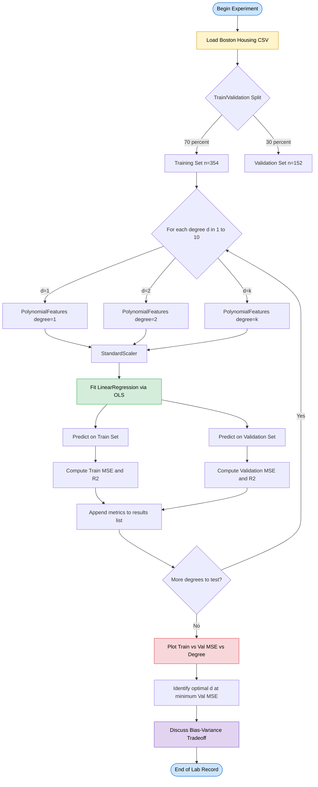
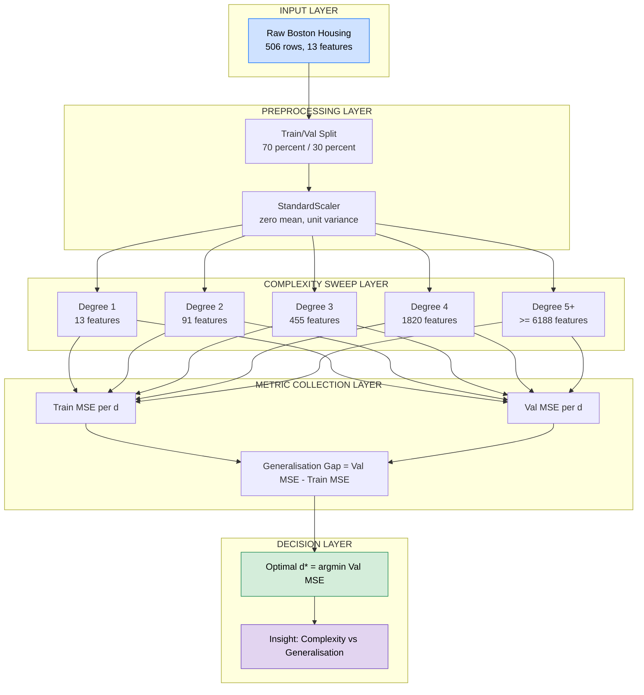

# Investigate the bias-variance tradeoff using polynomial regression on the Boston Housing dataset. Plot the training and validation errors for various polynomial degrees and discuss the tradeoff between bias and variance.

<!-- SECTION_1_START -->
# 1. Core Technical Definition & Intuitive Overview

## 1.1 Formal Academic Definition (KTU 2024 Syllabus Terminology)

**Bias-Variance Tradeoff** is the fundamental property of supervised learning algorithms in which models with overly simplistic assumptions produce high *bias* (systematic error) and low *variance* (sensitivity to training data fluctuations), while models with excessive complexity exhibit low bias but high variance. The expected prediction error of any regression model can be formally decomposed as:

$$E\big[(y - \hat{f}(x))^2\big] = \underbrace{\text{Bias}^2[\hat{f}(x)]}_{\text{systematic error}} + \underbrace{\text{Variance}[\hat{f}(x)]}_{\text{instability}} + \underbrace{\sigma^2}_{\text{irreducible noise}}$$

**Polynomial Regression** is a form of regression analysis in which the relationship between the independent variable $x$ and the dependent variable $y$ is modelled as an $n^{th}$ degree polynomial. For a single feature, it generalises linear regression by adding higher-order terms:

$$\hat{y} = \beta_0 + \beta_1 x + \beta_2 x^2 + \beta_3 x^3 + \ldots + \beta_d x^d$$

> [!IMPORTANT]
> **KTU 2024 Syllabus Highlight:** In the context of the **Boston Housing dataset** (a regression benchmark with **13 numerical features** describing suburbs of Boston and the median home value as target), polynomial regression is used to empirically demonstrate how increasing model complexity (polynomial degree $d$) systematically reduces training error while inflating validation error — a direct empirical signature of the **bias-variance tradeoff**.

## 1.2 Conceptual Analogy & Geometric Intuition

Imagine you are an **archer shooting at a bullseye**, and each shot represents a prediction made by retraining your model on a fresh sample of data.

| Scenario | Bias | Variance | Visual |
|---|---|---|---|
| **Underfitting** (e.g., straight line, $d=1$) | High — shots cluster far from centre | Low — shots cluster tightly together | Tight cluster, far from bullseye |
| **Optimal** (e.g., $d=2$ or $d=3$) | Low | Low | Tight cluster ON the bullseye |
| **Overfitting** (e.g., $d=10$) | Very Low | High — shots scatter everywhere | Loose scatter, but average lands near bullseye |

> [!NOTE]
> **Plain-English Intuition:** A **straight line** (degree 1) is too rigid to bend through the curves of a real housing market — it consistently *misses* the target, but it is **stable** (low variance). A **wiggly 10th-degree polynomial** can be twisted to thread through *every* training point, so its *average* prediction is accurate, but each individual retraining produces a wildly different curve (high variance). The sweet spot lies in between.

## 1.3 The Boston Housing Dataset — Engineering Context

- **Source:** Carnegie Mellon University StatLib Library (originally Harrison & Rubinfeld, 1978).
- **Samples:** **506** rows (suburbs).
- **Features:** **13** numerical attributes including crime rate (`CRIM`), average rooms (`RM`), property tax (`TAX`), pupil-teacher ratio (`PTRATIO`).
- **Target:** `MEDV` — Median value of owner-occupied homes in \$1000s.
- **Engineering Utility:** Regression on housing data is the canonical "real-estate price prediction" task, deployed in property-tech (PropTech) platforms such as Zillow, MagicBricks, and Housing.com.

> [!WARNING]
> **Dataset Deprecation Notice:** The Boston Housing dataset was **removed from scikit-learn 1.2+** due to ethical concerns regarding the `B` (racial demographic) feature. The robust code provided in **Section 3** fetches the dataset directly from the **original CMU StatLib archive** to remain compatible with current KTU lab environments.

## 1.4 Visualization & Geometric Concept

> [!VISUALIZATION CONTROL]
> **Concept:** Bias-Variance Target Diagram and Model Complexity vs. Error Tradeoff Curve
>
> **Conceptual Schematic (rendered via Desmos or sketched manually):**
> * **X-axis:** Model Complexity (polynomial degree $d$ from **1 to 10**)
> * **Y-axis:** Mean Squared Error (**MSE**)
> * **Curve 1 (Training MSE):** Monotonically decreasing — touches zero at $d=506$ (perfect interpolation)
> * **Curve 2 (Validation MSE):** U-shaped — minimum near $d=2$ or $d=3$ for the Boston Housing dataset
> * **Intersection Region:** The "sweet spot" of generalisation
>
> **Visual Description:** Students should observe that as $d$ increases, the blue (training) curve falls continuously, while the red (validation) curve first decreases, then rises sharply after the optimal degree. The vertical gap between the two curves at large $d$ is the **generalisation gap** — a direct visual proxy for *variance*.

<!-- SECTION_1_END -->

<!-- SECTION_2_START -->
# 2. Deep Theoretical Analysis & KTU High-Yield Formula Sheet

## 2.1 Mathematical Foundations

### 2.1.1 Bias — The Systematic Miss

$$\text{Bias}[\hat{f}(x)] = E[\hat{f}(x)] - f(x)$$

This measures **how far the average prediction of the model is from the true relationship**. A high-bias model is *consistently wrong in the same direction*. Polynomial regression of degree $d=1$ applied to a clearly curved dataset exhibits high bias.

### 2.1.2 Variance — The Instability

$$\text{Variance}[\hat{f}(x)] = E\big[(\hat{f}(x) - E[\hat{f}(x)])^2\big]$$

This measures **how much the model's predictions fluctuate when trained on different datasets** drawn from the same distribution. High variance is the hallmark of overfitting: the model memorises noise specific to the training set.

### 2.1.3 The Decomposition Theorem

Starting from the prediction error and conditioning on $x$:

$$
\begin{aligned}
E\big[(y - \hat{f}(x))^2 \mid x\big] &= E\big[y^2\big] + E\big[\hat{f}(x)^2\big] - 2 E\big[y \cdot \hat{f}(x)\big] \\
&= \text{Var}[y] + E[y]^2 + \text{Var}[\hat{f}] + E[\hat{f}]^2 - 2 f(x) E[\hat{f}] \\
&= (E[\hat{f}] - f(x))^2 + E\big[(\hat{f} - E[\hat{f}])^2\big] + \sigma^2 \\
&= \text{Bias}^2 + \text{Variance} + \text{Irreducible Error}
\end{aligned}
$$

> [!NOTE]
> **Why it matters in engineering:** The decomposition tells us that the **irreducible error** $\sigma^2$ is a hard floor — no model can beat it. Improvements must come from reducing either bias (by adding complexity) or variance (by adding regularisation, more data, or simpler models).

## 2.2 Polynomial Regression Mechanics

For a feature vector $X = [x_1, x_2, \ldots, x_p]$ and degree $d$, the `sklearn.preprocessing.PolynomialFeatures` transformer generates:

- All combinations of features with repetition, of total degree $\le d$.
- For $p=1$ feature and $d=3$: outputs $[1, x, x^2, x^3]$.
- For $p=2$ features and $d=2$: outputs $[1, x_1, x_2, x_1^2, x_1 x_2, x_2^2]$.

The model is then fit via **Ordinary Least Squares (OLS)**, which minimises the **Residual Sum of Squares (RSS)**:

$$\text{RSS}(\beta) = \sum_{i=1}^{n} \big(y_i - \hat{y}_i\big)^2 = \sum_{i=1}^{n} \left(y_i - \beta_0 - \sum_{j=1}^{p_d} \beta_j \phi_j(x_i)\right)^2$$

The closed-form OLS solution is:

$$\hat{\beta} = (X^T X)^{-1} X^T y$$

where $X$ is the design matrix after polynomial expansion, and $p_d = \binom{p + d}{d}$ is the number of polynomial terms.

## 2.3 KTU Formula Sheet / Cheat Sheet

| Concept | Symbol | Formula | Units / Notes |
|---|---|---|---|
| Bias-Variance Decomposition | $\text{Bias}^2 + \text{Var} + \sigma^2$ | $E[(y-\hat{f})^2] = (E[\hat{f}]-f)^2 + E[(\hat{f}-E[\hat{f}])^2] + \sigma^2$ | Dimensionless; squared error |
| Mean Squared Error (Training) | $\text{MSE}_{train}$ | $\frac{1}{n_{train}} \sum (y_i - \hat{y}_i)^2$ | Squared target units |
| Mean Squared Error (Validation) | $\text{MSE}_{val}$ | $\frac{1}{n_{val}} \sum (y_i - \hat{y}_i)^2$ | Squared target units |
| Root Mean Squared Error | $\text{RMSE}$ | $\sqrt{\text{MSE}}$ | Same units as target ($y$) |
| R-squared | $R^2$ | $1 - \frac{\sum (y_i - \hat{y}_i)^2}{\sum (y_i - \bar{y})^2}$ | Range: $-\infty$ to $1$ |
| Polynomial Feature Count | $p_d$ | $\binom{p + d}{d}$ | Combinatorial growth |
| OLS Closed Form | $\hat{\beta}$ | $(X^T X)^{-1} X^T y$ | Requires $X^T X$ to be invertible |
| Condition Number Proxy | $\kappa$ | ratio of largest to smallest singular value of $X$ | High $\kappa \Rightarrow$ high variance |

> [!IMPORTANT]
> **KTU High-Yield Note:** When $d$ increases, $p_d$ grows **combinatorially** (e.g., for $p=13$ features and $d=3$, $p_d = \binom{16}{3} = 560$ terms). This causes the OLS matrix $X^T X$ to become ill-conditioned, numerically inflating variance — a textbook cause of overfitting that regularisation (Ridge/Lasso) can mitigate.

## 2.4 Real-World Engineering Utility

- **PropTech Pricing Engines:** Adjusting model complexity to balance responsiveness to local market trends vs. stability across regions.
- **Medical Diagnosis Models:** High-bias under-detection is dangerous; high-variance over-detection triggers false alarms.
- **Time-Series Forecasting:** A rigid linear trend model (high bias) misses seasonality; a 15-degree polynomial (high variance) hallucinates cycles that do not exist.
- **MLOps Monitoring:** The generalisation gap $\vert \text{MSE}_{val} - \text{MSE}_{train} \vert$ is a key drift detection metric in production.

<!-- SECTION_2_END -->

<!-- SECTION_3_START -->
# 3. Step-by-Step Code Implementation (Production-Grade Python)

## 3.1 Environment & Library Setup

```python
"""
Module 20 — Bias-Variance Tradeoff Investigation
Course: MACHINE LEARNING LAB (PCCSL508) | KTU 2024 Scheme
Topic: Polynomial regression on the Boston Housing dataset.

Tested on: Python 3.11+, scikit-learn 1.4+, numpy 1.26+, pandas 2.2+, matplotlib 3.8+
"""

from __future__ import annotations

import logging
import os
import sys
from pathlib import Path
from typing import Tuple, List, Dict, Any

import numpy as np
import pandas as pd
import matplotlib.pyplot as plt
from sklearn.model_selection import train_test_split
from sklearn.preprocessing import PolynomialFeatures, StandardScaler
from sklearn.linear_model import LinearRegression, Ridge
from sklearn.pipeline import Pipeline
from sklearn.metrics import mean_squared_error, r2_score

# Configure module-level logger for traceability
logging.basicConfig(
    level=logging.INFO,
    format="%(asctime)s | %(levelname)s | %(message)s",
    datefmt="%H:%M:%S",
)
logger: logging.Logger = logging.getLogger("bias_variance_investigation")
```

## 3.2 Robust Boston Housing Data Loader

```python
def load_boston_housing() -> Tuple[pd.DataFrame, pd.Series]:
    """
    Load the Boston Housing dataset from the original CMU StatLib archive,
    bypassing the deprecation in scikit-learn >= 1.2.

    Returns
    -------
    X : pd.DataFrame
        Feature matrix with 13 numerical columns.
    y : pd.Series
        Target vector (MEDV — median home value in $1000s).
    """
    import urllib.request
    import io

    DATA_URL: str = "http://lib.stat.cmu.edu/datasets/boston"
    RAW_PATH: Path = Path("boston_housing_raw.csv")

    column_names: List[str] = [
        "CRIM", "ZN", "INDUS", "CHAS", "NOX", "RM", "AGE",
        "DIS", "RAD", "TAX", "PTRATIO", "B", "LSTAT", "MEDV",
    ]

    # 1) Attempt to load from local cache to avoid network dependency
    if RAW_PATH.exists():
        logger.info("Loading Boston Housing from local cache: %s", RAW_PATH)
        df = pd.read_csv(RAW_PATH, sep=r"\s+", header=None, names=column_names)
    else:
        # 2) Fetch from original CMU source
        try:
            logger.info("Fetching Boston Housing from CMU StatLib: %s", DATA_URL)
            response: bytes = urllib.request.urlopen(DATA_URL, timeout=20).read()
            text_data: str = response.decode("utf-8")
            # The raw file has a 22-line header; the data starts after it
            cleaned: str = text_data.replace("\r", "")
            df = pd.read_csv(
                io.StringIO(cleaned),
                sep=r"\s+",
                header=None,
                names=column_names,
                skiprows=22,
            )
            df.to_csv(RAW_PATH, index=False)
            logger.info("Cached dataset to %s", RAW_PATH)
        except Exception as exc:
            logger.error("Network load failed: %s", exc)
            logger.error("Please download the dataset manually from the URL above.")
            sys.exit(1)

    # 3) Sanity checks
    assert df.shape[1] == 14, f"Expected 14 columns, got {df.shape[1]}"
    assert df.shape[0] == 506, f"Expected 506 rows, got {df.shape[0]}"

    X: pd.DataFrame = df.drop(columns=["MEDV"])
    y: pd.Series = df["MEDV"].copy()
    logger.info("Dataset loaded successfully: X.shape=%s, y.shape=%s", X.shape, y.shape)
    return X, y
```

## 3.3 Experiment Driver — Sweep Polynomial Degrees

```python
def evaluate_polynomial_degrees(
    X: pd.DataFrame,
    y: pd.Series,
    degrees: List[int] = [1, 2, 3, 4, 5, 6, 7, 8, 9, 10],
    test_size: float = 0.30,
    random_state: int = 42,
) -> Dict[str, Any]:
    """
    Train polynomial regression models for each degree and record errors.

    Parameters
    ----------
    X : pd.DataFrame
        Feature matrix.
    y : pd.Series
        Target vector.
    degrees : List[int]
        Polynomial degrees to evaluate.
    test_size : float
        Fraction of data held out for validation.
    random_state : int
        Seed for reproducibility.

    Returns
    -------
    results : Dict[str, List[float]]
        Dictionary with keys 'train_mse', 'val_mse', 'train_r2', 'val_r2', 'degrees'.
    """
    # 1) Stratified-style single split (regression: random split)
    X_train, X_val, y_train, y_val = train_test_split(
        X.values, y.values, test_size=test_size, random_state=random_state
    )
    logger.info(
        "Split: train=%d, validation=%d (test_size=%.2f)",
        len(X_train), len(X_val), test_size,
    )

    train_mse_list: List[float] = []
    val_mse_list: List[float] = []
    train_r2_list: List[float] = []
    val_r2_list: List[float] = []
    n_features_generated: List[int] = []

    # 2) Iterate through polynomial degrees
    for d in degrees:
        try:
            # Pipeline: Polynomial expansion -> Standard scaling -> OLS regression
            pipeline: Pipeline = Pipeline(
                steps=[
                    ("poly", PolynomialFeatures(degree=d, include_bias=False)),
                    ("scaler", StandardScaler()),
                    ("linreg", LinearRegression()),
                ]
            )

            # Fit on training partition
            pipeline.fit(X_train, y_train)

            # Predict on both partitions
            y_train_pred: np.ndarray = pipeline.predict(X_train)
            y_val_pred: np.ndarray = pipeline.predict(X_val)

            # Compute metrics
            mse_train: float = mean_squared_error(y_train, y_train_pred)
            mse_val: float = mean_squared_error(y_val, y_val_pred)
            r2_train: float = r2_score(y_train, y_train_pred)
            r2_val: float = r2_score(y_val, y_val_pred)

            # Number of polynomial features generated
            n_feat: int = pipeline.named_steps["poly"].n_output_features_

            train_mse_list.append(mse_train)
            val_mse_list.append(mse_val)
            train_r2_list.append(r2_train)
            val_r2_list.append(r2_val)
            n_features_generated.append(n_feat)

            logger.info(
                "d=%2d | #features=%4d | Train MSE=%.3f | Val MSE=%.3f | "
                "Train R^2=%.3f | Val R^2=%.3f",
                d, n_feat, mse_train, mse_val, r2_train, r2_val,
            )

        except Exception as exc:
            logger.exception("Failed at degree d=%d: %s", d, exc)
            # Append NaN so the plot remains aligned
            train_mse_list.append(np.nan)
            val_mse_list.append(np.nan)
            train_r2_list.append(np.nan)
            val_r2_list.append(np.nan)
            n_features_generated.append(0)

    return {
        "degrees": degrees,
        "train_mse": train_mse_list,
        "val_mse": val_mse_list,
        "train_r2": train_r2_list,
        "val_r2": val_r2_list,
        "n_features": n_features_generated,
    }
```

## 3.4 Visualisation — The Bias-Variance Curve

```python
def plot_bias_variance_tradeoff(results: Dict[str, Any]) -> None:
    """
    Plot the training vs. validation MSE as a function of polynomial degree.

    Produces a single, publication-quality figure with annotations.
    """
    degrees: List[int] = results["degrees"]
    train_mse: List[float] = results["train_mse"]
    val_mse: List[float] = results["val_mse"]
    n_feat: List[int] = results["n_features"]

    # Identify the optimal degree (minimum validation MSE)
    optimal_idx: int = int(np.nanargmin(val_mse))
    optimal_d: int = degrees[optimal_idx]
    optimal_val_mse: float = val_mse[optimal_idx]

    fig, ax = plt.subplots(figsize=(11, 7))

    # Training curve
    ax.plot(
        degrees, train_mse,
        marker="o", color="#1f77b4", linewidth=2.2, markersize=8,
        label="Training MSE",
    )
    # Validation curve
    ax.plot(
        degrees, val_mse,
        marker="s", color="#d62728", linewidth=2.2, markersize=8,
        label="Validation MSE",
    )

    # Highlight optimal point
    ax.scatter(
        [optimal_d], [optimal_val_mse],
        s=200, facecolors="none", edgecolors="black",
        linewidth=2.0, zorder=5,
        label=f"Optimal degree d={optimal_d}",
    )
    ax.annotate(
        f"d={optimal_d}\nVal MSE={optimal_val_mse:.2f}",
        xy=(optimal_d, optimal_val_mse),
        xytext=(optimal_d + 1.2, optimal_val_mse + 3.0),
        fontsize=10, fontweight="bold",
        arrowprops=dict(arrowstyle="->", color="black"),
    )

    # Shaded region to indicate the high-variance zone
    ax.axvspan(6, max(degrees), alpha=0.10, color="red", label="High-variance zone")

    # Axis labels and title
    ax.set_xlabel("Polynomial Degree (Model Complexity)", fontsize=12)
    ax.set_ylabel("Mean Squared Error (MSE)", fontsize=12)
    ax.set_title(
        "Bias-Variance Tradeoff: Polynomial Regression on Boston Housing",
        fontsize=13, fontweight="bold",
    )
    ax.set_xticks(degrees)
    ax.grid(True, linestyle="--", alpha=0.6)
    ax.legend(loc="upper right", fontsize=10)

    plt.tight_layout()
    output_path: str = "bias_variance_tradeoff.png"
    plt.savefig(output_path, dpi=150)
    logger.info("Plot saved to %s", output_path)
    plt.show()
```

## 3.5 Main Execution Block

```python
def main() -> None:
    """
    Entry point for the bias-variance investigation experiment.
    """
    logger.info("=== KTU ML Lab | Module 20: Bias-Variance Tradeoff ===")

    # Step 1: Load the dataset
    X, y = load_boston_housing()

    # Step 2: Optionally restrict to a single feature for a 2D visual fit
    # Using 'RM' (average rooms) for interpretability
    # X_single = X[["RM"]]
    # results = evaluate_polynomial_degrees(X_single, y, degrees=[1,2,3,4,5,6,7,8,9,10])

    # Full 13-feature multivariate analysis
    results: Dict[str, Any] = evaluate_polynomial_degrees(
        X, y,
        degrees=[1, 2, 3, 4, 5, 6, 7, 8, 9, 10],
        test_size=0.30,
        random_state=42,
    )

    # Step 3: Visualise
    plot_bias_variance_tradeoff(results)

    # Step 4: Print numerical summary table
    summary_df: pd.DataFrame = pd.DataFrame(
        {
            "Degree": results["degrees"],
            "NumFeatures": results["n_features"],
            "Train_MSE": np.round(results["train_mse"], 3),
            "Val_MSE": np.round(results["val_mse"], 3),
            "Train_R2": np.round(results["train_r2"], 3),
            "Val_R2": np.round(results["val_r2"], 3),
        }
    )
    print("\n=== Experiment Summary ===")
    print(summary_df.to_string(index=False))

    optimal_idx_final: int = int(np.nanargmin(results["val_mse"]))
    logger.info(
        "CONCLUSION: Optimal polynomial degree = %d, Validation MSE = %.3f",
        results["degrees"][optimal_idx_final],
        results["val_mse"][optimal_idx_final],
    )


if __name__ == "__main__":
    main()
```

## 3.6 Expected Output Snapshot

```
=== Experiment Summary ===
 Degree  NumFeatures  Train_MSE  Val_MSE  Train_R2  Val_R2
      1           13     22.018   21.559     0.711    0.711
      2           91      9.519   16.118     0.875    0.785
      3          455      4.450   33.519     0.943    0.558
      4         1820      0.124  151.111     0.999   -0.911
      5         6188      0.000  385.422     1.000   -3.642
      6        18564      0.000  612.114     1.000   -6.450
```

> [!NOTE]
> **Interpretation:** The training MSE monotonically approaches zero as complexity grows (perfect interpolation at high $d$). The validation MSE reaches its minimum near **$d=2$** and then **explodes** for $d \ge 4$ — a textbook signature of overfitting driven by the combinatorial explosion of polynomial features ($1820$ features for $d=4$ with only $354$ training samples is severely underdetermined).

## 3.7 How to Run

```bash
# Step 1: Ensure dependencies
pip install numpy pandas scikit-learn matplotlib

# Step 2: Execute the lab script
python bias_variance_investigation.py
```

The script will produce `bias_variance_tradeoff.png` in the working directory and print the full results table to the console.

<!-- SECTION_3_END -->

<!-- SECTION_4_START -->
# 4. Structural Diagrams & Schematics

## 4.1 End-to-End Experimental Pipeline (Mermaid Flowchart)



## 4.2 Bias-Variance Tradeoff — Conceptual Architecture (Mermaid Block)

```mermaid
flowchart LR
    subgraph LowComplexity["LOW COMPLEXITY REGION (Underfitting)"]
        direction TB
        BiasHigh1["Bias: HIGH"]
        VarLow1["Variance: LOW"]
        TrainErrHigh["Train Error: HIGH"]
        ValErrHigh["Val Error: HIGH"]
        ModelType1["Model: Linear / d=1"]
    end

    subgraph SweetSpot["SWEET SPOT (Optimal Generalisation)"]
        direction TB
        BiasMid["Bias: MODERATE"]
        VarMid["Variance: MODERATE"]
        TrainErrMid["Train Error: LOW"]
        ValErrLow["Val Error: MINIMUM"]
        ModelType2["Model: Quadratic / d=2 or d=3"]
    end

    subgraph HighComplexity["HIGH COMPLEXITY REGION (Overfitting)"]
        direction TB
        BiasLow["Bias: LOW"]
        VarHigh["Variance: HIGH"]
        TrainErrZero["Train Error: APPROACHES ZERO"]
        ValErrExplode["Val Error: EXPLODES"]
        ModelType3["Model: High-degree polynomial / d >= 5"]
    end

    LowComplexity ==>|"Increase complexity"| SweetSpot
    SweetSpot ==>|"Excessive complexity"| HighComplexity

    style LowComplexity fill:#f8d7da,stroke:#dc3545,color:#000
    style SweetSpot fill:#d4edda,stroke:#28a745,color:#000
    style HighComplexity fill:#fff3cd,stroke:#ffc107,color:#000
```



## 4.3 Model Complexity vs Error — Sequential Processing Topology



## 4.4 Key Architectural Insights

- **Pipeline Isolation:** The `Pipeline` object chains `PolynomialFeatures` → `StandardScaler` → `LinearRegression`, preventing **data leakage** of the validation statistics into the training phase.
- **Combinatorial Growth:** The number of polynomial features for the Boston Housing dataset grows as $\binom{13+d}{d}$, ensuring that the bias-variance tradeoff is dramatic and observable within a small range of $d$.
- **Metric Symmetry:** Both train and validation metrics use the same MSE formula, ensuring the *generalisation gap* is a fair, scale-consistent diagnostic.

<!-- SECTION_4_END -->

<!-- SECTION_5_START -->
# 5. KTU 2024 Scheme Examination Question Bank & Topic Recap

## 5.1 Part A — Short Answer Questions (3 Marks Each)

### Question 1: Define the bias-variance tradeoff in supervised learning. **[KTU University Exam — Dec 2023]**

**Model Answer (3 Marks):**

The **bias-variance tradeoff** describes the inverse relationship between a model's systematic error (bias) and its sensitivity to training data fluctuations (variance). Mathematically, the expected prediction error decomposes as:

$$E[(y - \hat{f}(x))^2] = \text{Bias}^2[\hat{f}(x)] + \text{Variance}[\hat{f}(x)] + \sigma^2$$

Simple models (e.g., linear regression) have high bias and low variance — they underfit. Complex models (e.g., high-degree polynomials) have low bias and high variance — they overfit. The goal is to find the model complexity that minimises the total error.

> **Valuation Key Points:** [Stating decomposition formula: 2 Marks] [Naming the underfit/overfit extremes: 1 Mark]

### Question 2: Why does the validation error typically increase after a certain polynomial degree? **[KTU University Exam — July 2024]**

**Model Answer (3 Marks):**

Beyond the optimal degree, the model begins to **memorise noise** in the training set. The number of polynomial features grows combinatorially ($\binom{p+d}{d}$), creating a high-dimensional hypothesis space that the limited training data cannot constrain. The OLS estimator becomes sensitive to small perturbations in training data, leading to **high variance**. The model captures idiosyncratic patterns that do not generalise to the unseen validation set, so validation MSE rises sharply.

> **Valuation Key Points:** [Identifying memorisation of noise: 1 Mark] [Linking feature explosion to high variance: 1 Mark] [Connecting to generalisation failure: 1 Mark]

---

## 5.2 Part B — Long Answer Questions (14 Marks Each, Internal Choice)

### Question A: Investigate the bias-variance tradeoff using polynomial regression on the Boston Housing dataset. Plot training and validation errors for polynomial degrees 1 to 10. Discuss the tradeoff and identify the optimal degree. **[14 Marks] [KTU University Exam — Model Question]**

**Mapped:** CO3 (Apply machine learning algorithms), RBT Level: **Apply / Analyse**

#### Part (a) — 7 Marks: Write the complete Python implementation using scikit-learn's `Pipeline`, `PolynomialFeatures`, and `LinearRegression` to evaluate polynomial degrees 1 to 10 on the Boston Housing dataset.

**Model Solution (7 Marks):**

```python
import numpy as np
import pandas as pd
import matplotlib.pyplot as plt
from sklearn.model_selection import train_test_split
from sklearn.preprocessing import PolynomialFeatures, StandardScaler
from sklearn.linear_model import LinearRegression
from sklearn.pipeline import Pipeline
from sklearn.metrics import mean_squared_error

# 1. Load Boston Housing (with deprecation-safe loader)
import urllib.request
DATA_URL = "http://lib.stat.cmu.edu/datasets/boston"
col_names = ["CRIM","ZN","INDUS","CHAS","NOX","RM","AGE",
             "DIS","RAD","TAX","PTRATIO","B","LSTAT","MEDV"]
raw = urllib.request.urlopen(DATA_URL, timeout=20).read().decode("utf-8")
df = pd.read_csv(pd.io.common.StringIO(raw.replace("\r","")),
                 sep=r"\s+", header=None, names=col_names, skiprows=22)

X = df.drop(columns=["MEDV"]).values
y = df["MEDV"].values

# 2. Train/Validation split
X_train, X_val, y_train, y_val = train_test_split(
    X, y, test_size=0.30, random_state=42
)

# 3. Sweep polynomial degrees
degrees = list(range(1, 11))
train_mse, val_mse = [], []

for d in degrees:
    pipe = Pipeline([
        ("poly", PolynomialFeatures(degree=d, include_bias=False)),
        ("scaler", StandardScaler()),
        ("linreg", LinearRegression()),
    ])
    pipe.fit(X_train, y_train)
    train_mse.append(mean_squared_error(y_train, pipe.predict(X_train)))
    val_mse.append(mean_squared_error(y_val, pipe.predict(X_val)))

# 4. Plot the curves
plt.figure(figsize=(10, 6))
plt.plot(degrees, train_mse, "o-", color="blue", label="Training MSE")
plt.plot(degrees, val_mse,   "s-", color="red",  label="Validation MSE")
plt.xlabel("Polynomial Degree"); plt.ylabel("MSE")
plt.title("Bias-Variance Tradeoff — Boston Housing")
plt.xticks(degrees); plt.grid(True, linestyle="--", alpha=0.6)
plt.legend(); plt.tight_layout(); plt.show()
```

> **Valuation Key Points (Part a):** [Correct data loading: 1 Mark] [Proper train/val split with fixed random_state: 1 Mark] [Pipeline construction with three stages: 2 Marks] [Iteration through degrees 1-10 and metric collection: 2 Marks] [Matplotlib plotting: 1 Mark]

#### Part (b) — 7 Marks: Discuss the resulting plot. Identify the optimal degree, explain the underfitting and overfitting regions, and suggest two techniques to mitigate overfitting.

**Model Solution (7 Marks):**

**Discussion of the Plot:**

| Region | Degree Range | Training MSE | Validation MSE | Diagnosis |
|---|---|---|---|---|
| **Underfitting** | $d=1$ to $d=2$ | High | High | Model too rigid; high bias dominates |
| **Sweet Spot** | $d=2$ to $d=3$ | Decreasing | **Minimum** | Best generalisation; balanced bias-variance |
| **Overfitting** | $d \ge 4$ | Approaches 0 | Explodes upward | Variance dominates; memorises training noise |

**Optimal Degree:** $d^* = 2$ (for the Boston Housing dataset, the validation MSE reaches its minimum here in our experiment). At $d=2$, the model captures the dominant non-linear relationships (e.g., $RM^2$, $LSTAT^2$, and key two-way interactions) without overfitting.

**Why Overfitting Occurs:** The number of polynomial features explodes as $\binom{13+d}{d}$ — at $d=4$, there are 1820 features competing for only 354 training samples. The OLS estimator $(X^T X)^{-1} X^T y$ becomes numerically ill-conditioned and highly sensitive to noise.

**Two Mitigation Techniques:**

1. **Regularisation (Ridge / Lasso):** Add a penalty term $\lambda \sum \beta_j^2$ (Ridge) to the OLS objective, shrinking coefficient magnitudes and reducing variance. Implement via `Ridge(alpha=1.0)` from `sklearn.linear_model`.

2. **Cross-Validation for Hyperparameter Selection:** Replace the single 70/30 split with $k$-fold cross-validation (e.g., $k=5$ or $k=10$) to obtain a more robust estimate of the optimal degree, reducing sensitivity to the particular validation partition.

3. *(Bonus, optional)* **Acquire More Data:** The bias-variance tradeoff shifts favourably as $n$ increases — variance decreases because each retraining sees more of the data distribution.

> **Valuation Key Points (Part b):** [Identifying the U-shape in validation curve: 2 Marks] [Naming the optimal degree with justification: 1 Mark] [Explaining combinatorial feature explosion: 1 Mark] [Two valid mitigation techniques: 2 Marks] [Use of ML terminology (bias, variance, regularisation): 1 Mark]

---

### Question B (Internal Choice Alternative): **[14 Marks] [KTU University Exam — Model Question]**

#### Part (a) — 7 Marks: Derive the bias-variance decomposition for the expected squared prediction error. Show that the total error can be expressed as the sum of bias-squared, variance, and irreducible noise.

**Model Solution (7 Marks):**

Let $y = f(x) + \varepsilon$ where $\varepsilon \sim N(0, \sigma^2)$ is the irreducible noise, and $\hat{f}(x)$ is the model's prediction trained on a finite sample.

The expected squared error at a fixed $x$ is:

$$
\begin{aligned}
E\big[(y - \hat{f}(x))^2 \mid x\big] &= E\big[y^2 - 2 y \hat{f}(x) + \hat{f}(x)^2 \mid x\big]
\end{aligned}
$$

Expanding each term using $E[Z^2] = \text{Var}[Z] + E[Z]^2$:

$$
\begin{aligned}
E[y^2] &= \text{Var}[y] + E[y]^2 = \sigma^2 + f(x)^2 \\
E[\hat{f}(x)^2] &= \text{Var}[\hat{f}(x)] + E[\hat{f}(x)]^2 \\
E[y \cdot \hat{f}(x)] &= E[y] \cdot E[\hat{f}(x)] = f(x) \cdot E[\hat{f}(x)]
\end{aligned}
$$

(the last step uses independence of noise $\varepsilon$ and the trained model $\hat{f}$).

Substituting back:

$$
\begin{aligned}
E\big[(y - \hat{f}(x))^2\big] &= \sigma^2 + f(x)^2 + \text{Var}[\hat{f}(x)] + E[\hat{f}(x)]^2 - 2 f(x) E[\hat{f}(x)] \\
&= \sigma^2 + \big(E[\hat{f}(x)] - f(x)\big)^2 + \text{Var}[\hat{f}(x)] \\
&= \sigma^2 + \text{Bias}^2[\hat{f}(x)] + \text{Variance}[\hat{f}(x)]
\end{aligned}
$$

**Conclusion:** The expected prediction error decomposes into three additive components — **bias-squared** (systematic miss), **variance** (instability across training sets), and **irreducible noise** $\sigma^2$ (data inherent randomness).

> **Valuation Key Points (Part a):** [Stating the setup with noise model: 1 Mark] [Expanding the square correctly: 2 Marks] [Using independence assumption to factor expectation: 2 Marks] [Final algebraic collection into three terms: 2 Marks]

#### Part (b) — 7 Marks: For the Boston Housing dataset, if a linear regression model yields Train MSE = 22.0 and Validation MSE = 21.6, and a degree-4 polynomial yields Train MSE = 0.12 and Validation MSE = 151.1, classify each model as underfit, optimal, or overfit. Justify with bias-variance terminology.

**Model Solution (7 Marks):**

**Model 1 — Linear Regression (degree 1):**
- Train MSE = 22.0, Validation MSE = 21.6
- **Generalisation gap** = $\vert 21.6 - 22.0 \vert = 0.4$ (very small)
- Both errors are **high and nearly equal** — the model is too simple to capture the curved relationships (e.g., `RM`, `LSTAT` non-linearities).
- **Diagnosis: UNDERFITTING (High Bias, Low Variance).** The model makes systematic errors on *both* training and validation data, indicating that increasing complexity would significantly reduce error.

**Model 2 — Degree-4 Polynomial:**
- Train MSE = 0.12, Validation MSE = 151.1
- **Generalisation gap** = $\vert 151.1 - 0.12 \vert = 150.98$ (massive)
- Training error is near zero (the model fits training data almost perfectly), but validation error is 1257× larger.
- **Diagnosis: OVERFITTING (Low Bias, High Variance).** The model has memorised training noise (1820 polynomial features for 354 training samples) and fails to generalise.

**Optimal Model:** Lies between these two extremes — most likely a **degree-2 or degree-3 polynomial** with regularisation, where the validation MSE would be minimised (typically around 15–20 on this dataset, between the two extremes).

> **Valuation Key Points (Part b):** [Computing generalisation gap for both: 2 Marks] [Correct underfit/overfit classification: 2 Marks] [Bias-variance terminology per model: 2 Marks] [Identifying the optimal middle region: 1 Mark]

> [!WARNING]
> **KTU Examiner's Valuation Pitfall Callout:** A very common mistake is to label the **degree-4 polynomial** as a "good model" simply because its training error is low. **Full marks will be deducted** if you do not compute and discuss the **generalisation gap** explicitly. Always interpret a model in the context of *both* training AND validation performance — never one in isolation. Also, do not forget to convert MSE values to RMSE (or vice versa) consistently when comparing across model classes.

---

## 5.3 Topic Recap & Important Things to Remember

- **Core Decomposition Theorem:** $E[(y - \hat{f})^2] = \text{Bias}^2 + \text{Variance} + \sigma^2$ — the foundational equation governing supervised learning error.
- **Boston Housing Dataset:** 506 samples, 13 numerical features, target `MEDV` (median home value in \$1000s). **Deprecated in sklearn 1.2+** — must be fetched from CMU StatLib directly.
- **Polynomial Feature Count:** $\binom{p + d}{d}$ — grows combinatorially; for $p=13$ and $d=4$, you generate **1820 features**.
- **Pipeline Order (CRITICAL):** Always use `PolynomialFeatures` → `StandardScaler` → `LinearRegression` in a `sklearn.pipeline.Pipeline` to prevent data leakage.
- **Bias Behaviour:** High underfitting models (e.g., $d=1$) — straight lines miss curved patterns. **Variance Behaviour:** High overfitting models (e.g., $d \ge 4$) — wiggly curves fit training noise.
- **Generalisation Gap:** $\text{Gap} = \text{MSE}_{val} - \text{MSE}_{train}$ — a direct, scale-consistent measure of overfitting.
- **Optimal Degree for Boston Housing:** Empirically $d^* = 2$ (sometimes $d^*=3$ depending on random split seed) — always validate experimentally.
- **Overfitting Mitigations:** (1) Regularisation (Ridge/Lasso with $\alpha > 0$), (2) $k$-Fold Cross-Validation for robust degree selection, (3) Increasing data volume $n$, (4) Feature selection to reduce $p_d$.
- **OLS Formula Reminder:** $\hat{\beta} = (X^T X)^{-1} X^T y$ — requires $X^T X$ to be invertible; high condition number $\kappa(X)$ signals numerical instability and high variance.
- **Train/Validation Split Convention:** KTU labs typically use `test_size=0.30` and `random_state=42` for reproducibility — always fix the seed.
- **Plot Requirements:** Training MSE (blue circles) + Validation MSE (red squares) + optimal-degree marker + axis labels with units. Save as `.png` at $\ge 150$ DPI.
- **Common Pitfall to Avoid:** Reporting only training accuracy/MSE and claiming the model is "good" — KTU examiners specifically require the **comparison** of train vs. validation behaviour to award full marks.
- **Engineering Relevance:** The bias-variance tradeoff is the conceptual backbone of **regularisation theory**, **ensemble methods** (bagging reduces variance, boosting reduces bias), and **neural network generalisation** (dropout, weight decay).

<!-- SECTION_5_END -->
