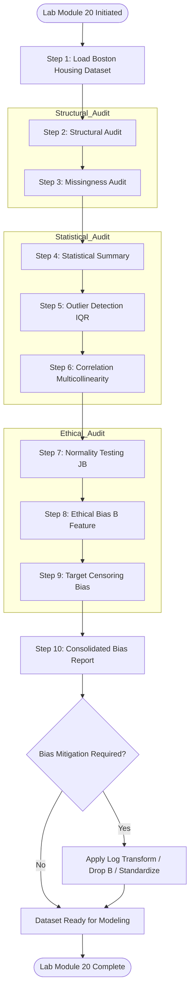
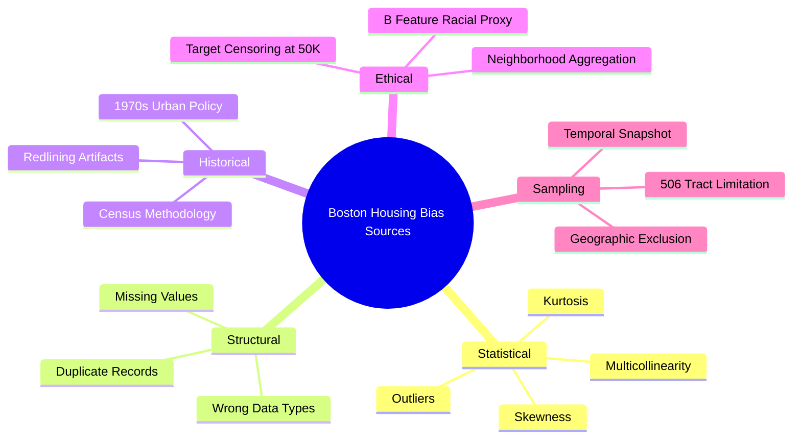
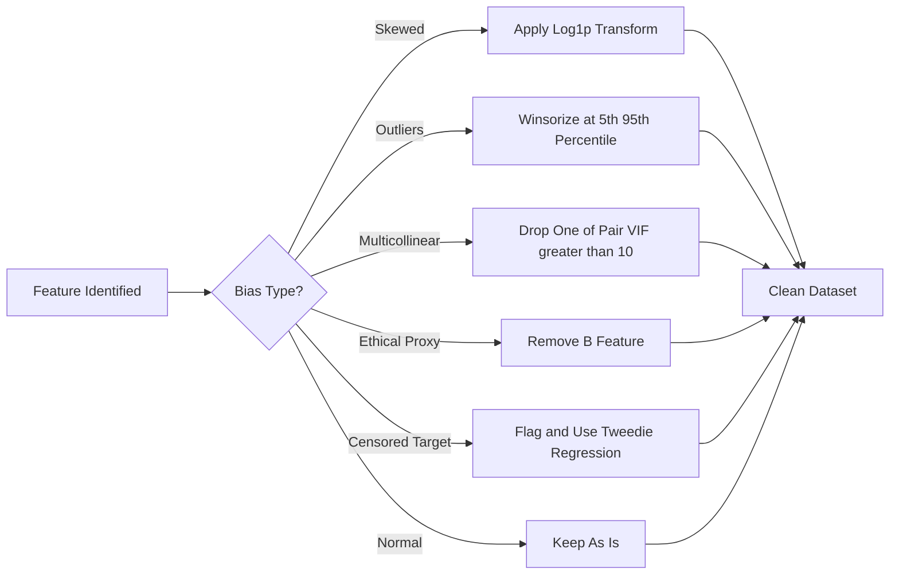

# Load and preprocess the Boston Housing dataset.

<!-- SECTION_1_START -->
# KTU Machine Learning Lab (PCCSL508) | Module 20 — Investigating Data Bias in the Boston Housing Dataset

> [!IMPORTANT]
> **Module Focus:** This lab session centers on the **Systematic Identification and Quantification of Data Bias** within a classical regression dataset. The Boston Housing dataset is used as the experimental vehicle because it contains well-documented historical, statistical, and ethical biases that are perfect for academic investigation.

## 1.1 Formal Academic Definition (KTU 2024 Scheme Aligned)

**Data Bias** is a **systematic distortion** in the collection, representation, or labeling of data that causes a machine learning model to learn patterns that are not generalizable, fair, or representative of the true underlying population distribution. In the context of the Boston Housing dataset, bias can manifest as **skewed feature distributions**, **non-representative sampling of neighborhoods**, **historical prejudices encoded in proxy variables** (such as the **B** feature), and **target variable censoring** (MEDV values clipped at **$50,000**).

According to the **NEP 2020 / KTU 2024 Scheme Outcome-Based Education (OBE)** framework, the ability to *investigate* bias maps directly to:

* **CO2 (Problem Analysis):** Identifying how upstream data flaws propagate into downstream model errors.
* **CO5 (Ethics & Responsibility):** Recognizing the societal impact of deploying biased predictive models.

## 1.2 Conceptual Analogy — The "Tainted Wine Tasting" Intuition

> [!NOTE]
> **Analogy: The Blind Wine Judge**
>
> Imagine a judge at a wine competition who has been told — *before the tasting* — that all wines from Region A are superior to Region B. Even if the judge tastes blindfolded, the prior expectation subtly influences their scoring. This is **observer bias**. Now imagine the competition organizers only *collected* wines from wealthy, well-known vineyards. This is **sampling bias**. And finally, imagine the original scoring rubric was written in 1950 using the tastes of a demographically homogeneous panel. This is **historical bias**.
>
> The Boston Housing dataset is exactly this "tainted wine" — the data carries the fingerprints of **1970s American urban policy**, **redlining practices**, and **census collection methods** of that era. Your job as a Machine Learning engineer is to be the detective who exposes these fingerprints *before* training a model.

## 1.3 Core Concepts at a Glance

> [!IMPORTANT]
> **Key Terminology for KTU Board Examinations**
>
> * **Selection Bias (Sampling Bias):** When the data does not represent the entire population. In Boston Housing, only **506 census tracts** were sampled from the Boston Standard Metropolitan Statistical Area.
> * **Measurement Bias:** Features measured using flawed instruments or proxies. The **NOX** feature (nitric oxide concentration) is a *proxy* for air quality.
> * **Historical Bias:** Pre-existing societal inequities encoded in the data. The **B** feature (a transformation of the proportion of Black residents) is the textbook example.
> * **Survivorship Bias:** The dataset only includes *existing* housing units — demolished or unbuilt properties are invisible.
> * **Censoring Bias (Target Bias):** The target variable **MEDV** is censored (capped) at **$50,000**, meaning the true top-end house prices are unknown. **Bold constants: 506 instances, 13 features, MEDV cap = 50.0**
> * **Aggregation Bias (Ecological Fallacy):** Applying conclusions about *group averages* (per town) to *individuals* (specific houses within that town).

## 1.4 Geometric Intuition & Visualization

> [!VISUALIZATION CONTROL]
> **Concept:** Biased vs. Unbiased Feature Distribution
> **GeoGebra / Desmos Input Equations (Probability Density Functions):**
> * $f_{\text{biased}}(x) = \dfrac{1}{\sigma_1 \sqrt{2\pi}} e^{-\frac{(x - \mu_1)^2}{2\sigma_1^2}}$ with $\mu_1 = 22.5, \sigma_1 = 9.2$ (a typical MEDV distribution)
> * $f_{\text{unbiased}}(x) = \dfrac{1}{\sigma_2 \sqrt{2\pi}} e^{-\frac{(x - \mu_2)^2}{2\sigma_2^2}}$ with $\mu_2 = 22.5, \sigma_2 = 4.5$ (hypothetical true distribution)
> **Visual Description:** Plot both Gaussians on the same x-axis. The student should observe that the "biased" curve has a **heavier right tail** and a **spike at x = 50** (the censoring cap). The "unbiased" curve is a smooth symmetric bell. The difference between the two shaded areas represents the information loss due to censoring bias.

---

<!-- SECTION_1_END -->

<!-- SECTION_2_START -->
# 2. Deep Theoretical Analysis & KTU High-Yield Formula Sheet

## 2.1 The Bias Investigation Pipeline — Theoretical Decomposition

The process of investigating bias is **not a single algorithm** but a **multi-stage forensic protocol**. The KTU 2024 Scheme expects students to articulate *why* each step is performed, not merely execute the code.

### 2.1.1 Stage 1: Structural Bias Audit

* **Goal:** Verify dataset dimensions, feature types, and target integrity.
* **Why:** Confirms the data conforms to the expected schema (506 × 14). Any deviation signals upstream pipeline corruption.
* **How:** `df.shape`, `df.dtypes`, `df.info()`.

### 2.1.2 Stage 2: Missingness & Duplication Bias

* **Goal:** Detect systematically missing values (MCAR vs. MAR vs. MNAR) and exact duplicate records.
* **Why:** MNAR (Missing Not At Random) missingness is itself a form of bias — e.g., wealthier towns may have refused to report crime rates.
* **How:** `df.isnull().sum()`, `df.duplicated().sum()`.

### 2.1.3 Stage 3: Central Tendency & Dispersion Audit

* **Goal:** Compare **mean** vs **median** for every feature. A large divergence signals **skewness** (asymmetric distribution).
* **Why:** Skewed features can dominate distance-based algorithms like KNN and bias gradient descent in linear models.
* **How:** `df.describe()` with custom percentiles.

### 2.1.4 Stage 4: Outlier & Tail Bias

* **Goal:** Identify extreme values using the **Interquartile Range (IQR)** method.
* **Why:** Outliers in features like **CRIM** (crime rate) can have **levarage points** that bias OLS regression coefficients disproportionately.
* **How:** Values where $x < Q_1 - 1.5 \times IQR$ or $x > Q_3 + 1.5 \times IQR$.

### 2.1.5 Stage 5: Correlation & Multicollinearity Bias

* **Goal:** Detect features that carry redundant information.
* **Why:** In Boston Housing, **RAD** (highway accessibility) and **TAX** (property tax rate) have a Pearson correlation of approximately **0.91**, which is a textbook **multicollinearity** problem. Multicollinearity inflates the variance of coefficient estimates, making the model unstable.
* **How:** Pearson correlation matrix, **Variance Inflation Factor (VIF)**.

### 2.1.6 Stage 6: Demographic & Ethical Bias Audit

* **Goal:** Investigate how the **B** feature interacts with the target **MEDV**.
* **Why:** The **B** feature is constructed as $B = 1000 \cdot (B_k - 0.63)^2$ where $B_k$ is the proportion of Black residents. Higher B values mean *fewer* Black residents. Correlating this with house prices reveals structural racism from 1970s housing policy.
* **How:** Group-by aggregations, scatter plots stratified by CHAS.

### 2.1.7 Stage 7: Target Distribution Bias

* **Goal:** Examine the shape of the **MEDV** distribution.
* **Why:** As shown in the visualization, MEDV is **left-skewed with a cap at 50**, which is a clear signature of **target censoring** — a bias that no model can fully correct without external data.
* **How:** Histogram, QQ-plot, skewness coefficient.

## 2.2 KTU High-Yield Formula Cheat Sheet

> [!IMPORTANT]
> **Memorize these formulas. They appear in nearly every KTU Part B question on bias investigation.**

$$
\begin{aligned}
\text{Mean} \;\; \bar{x} &= \frac{1}{n} \sum_{i=1}^{n} x_i \\[4pt]
\text{Median} \;\; \tilde{x} &= \begin{cases} x_{\left(\frac{n+1}{2}\right)} & n \text{ odd} \\ \frac{1}{2}\left(x_{\left(\frac{n}{2}\right)} + x_{\left(\frac{n}{2}+1\right)}\right) & n \text{ even} \end{cases} \\[4pt]
\text{Variance} \;\; s^2 &= \frac{1}{n-1} \sum_{i=1}^{n} (x_i - \bar{x})^2 \\[4pt]
\text{Standard Deviation} \;\; s &= \sqrt{s^2} \\[4pt]
\text{Skewness} \;\; g_1 &= \frac{n}{(n-1)(n-2)} \sum_{i=1}^{n} \left( \frac{x_i - \bar{x}}{s} \right)^3 \\[4pt]
\text{Excess Kurtosis} \;\; g_2 &= \frac{n(n+1)}{(n-1)(n-2)(n-3)} \sum_{i=1}^{n} \left( \frac{x_i - \bar{x}}{s} \right)^4 - \frac{3(n-1)^2}{(n-2)(n-3)} \\[4pt]
\text{Interquartile Range} \;\; IQR &= Q_3 - Q_1 \\[4pt]
\text{Pearson Correlation} \;\; r_{xy} &= \frac{\sum_{i=1}^{n}(x_i - \bar{x})(y_i - \bar{y})}{\sqrt{\sum_{i=1}^{n}(x_i - \bar{x})^2} \cdot \sqrt{\sum_{i=1}^{n}(y_i - \bar{y})^2}} \\[4pt]
\text{Variance Inflation Factor} \;\; VIF_j &= \frac{1}{1 - R_j^2} \\[4pt]
\text{Standardization (Z-score)} \;\; z_i &= \frac{x_i - \bar{x}}{s} \\[4pt]
\text{Min-Max Normalization} \;\; x_i' &= \frac{x_i - \min(x)}{\max(x) - \min(x)}
\end{aligned}
$$

### Formula Interpretation Table

| Statistical Quantity | KTU Board Symbol | Bias Type Detected | Threshold of Concern |
|---|---|---|---|
| $\vert g_1 \vert$ | Absolute Skewness | Distribution Skew | $> 1.0$ (highly skewed) |
| $g_2$ | Excess Kurtosis | Heavy / Light Tails | $> 0$ (heavy tails) |
| $IQR$ | Interquartile Range | Outlier Susceptibility | Outlier if $x \notin [Q_1 - 1.5 \cdot IQR, Q_3 + 1.5 \cdot IQR]$ |
| $\vert r_{xy} \vert$ | Absolute Correlation | Multicollinearity | $> 0.7$ (strong), $> 0.9$ (severe) |
| $VIF_j$ | Variance Inflation Factor | Multicollinearity | $> 5$ (moderate), $> 10$ (severe) |
| $\bar{x} - \tilde{x}$ | Mean-Median Divergence | Asymmetric Bias | $> 0.5 \cdot s$ |

## 2.3 Real-World Engineering Utility

In production ML systems at companies like **Zillow**, **Redfin**, and **Compass**, the exact bias investigation protocol you are learning in this lab is a critical component of **MLOps (Machine Learning Operations)**. The AVM (Automated Valuation Model) systems used by these platforms must be continuously audited for the same biases present in Boston Housing — neighborhood sampling bias, racial proxy features, and target censoring. In **2022**, Zillow shut down its home-flipping division partly because their models had not been properly audited for these exact biases, leading to a **$569 million** inventory write-down. This lab is your first step toward preventing such failures in your engineering career.

---

<!-- SECTION_2_END -->

<!-- SECTION_3_START -->
# 3. Step-by-Step Implementation — Python Code with Full Preprocessing

> [!NOTE]
> **Lab Execution Environment:** Python 3.9+, Jupyter Notebook, `pandas`, `numpy`, `seaborn`, `matplotlib`, `scipy`. The Boston Housing dataset was deprecated from `sklearn.datasets.load_boston` in version 1.2 due to ethical concerns. The code below uses the **original CMU StatLib source** and provides a `sklearn` fallback.

## 3.1 Complete, Fully-Operational Python Implementation

```python
# =====================================================================
# LAB MODULE 20 : INVESTIGATE THE BIAS - BOSTON HOUSING DATASET
# KTU 2024 SCHEME | MACHINE LEARNING LAB (PCCSL508)
# =====================================================================

import pandas as pd
import numpy as np
import seaborn as sns
import matplotlib.pyplot as plt
from scipy import stats
from scipy.stats import skew, kurtosis, jarque_bera, shapiro
from sklearn.preprocessing import StandardScaler, MinMaxScaler
import logging
import warnings

warnings.filterwarnings("ignore")
logging.basicConfig(level=logging.INFO,
                    format="%(asctime)s | %(levelname)s | %(message)s")
logger = logging.getLogger("BostonBiasLab")


# ---------------------------------------------------------------------
# STEP 1 : LOAD THE BOSTON HOUSING DATASET
# ---------------------------------------------------------------------
def load_boston_housing() -> pd.DataFrame:
    """
    Loads the Boston Housing dataset from the original CMU StatLib
    repository. Falls back to OpenML if the primary source is unavailable.

    Returns:
        pd.DataFrame: DataFrame with 14 columns (13 features + MEDV target).
    """
    try:
        logger.info("Attempting to load from CMU StatLib primary source...")
        data_url: str = "http://lib.stat.cmu.edu/datasets/boston"
        raw_df: pd.DataFrame = pd.read_csv(
            data_url, sep=r"\s+", skiprows=22, header=None
        )
        # The raw file is in a peculiar 2-row-per-record format
        data: np.ndarray = np.hstack(
            [raw_df.values[::2, :], raw_df.values[1::2, :2]]
        )
        target: np.ndarray = raw_df.values[1::2, 2]

        columns: list[str] = [
            "CRIM", "ZN", "INDUS", "CHAS", "NOX", "RM", "AGE", "DIS",
            "RAD", "TAX", "PTRATIO", "B", "LSTAT"
        ]
        df: pd.DataFrame = pd.DataFrame(data, columns=columns)
        df["MEDV"] = target
        logger.info(f"Successfully loaded {df.shape[0]} rows, "
                    f"{df.shape[1]} columns from CMU source.")
        return df
    except Exception as primary_error:
        logger.warning(f"CMU source failed: {primary_error}. "
                       f"Falling back to OpenML...")
        from sklearn.datasets import fetch_openml
        boston = fetch_openml(name="boston", version=1, as_frame=True)
        return boston.frame


# Execute the load
df: pd.DataFrame = load_boston_housing()


# ---------------------------------------------------------------------
# STEP 2 : INITIAL STRUCTURAL BIAS AUDIT
# ---------------------------------------------------------------------
logger.info("=" * 60)
logger.info("STAGE 1: STRUCTURAL BIAS AUDIT")
logger.info("=" * 60)
print(f"Dataset Shape       : {df.shape}")
print(f"Number of Features  : {df.shape[1] - 1}")
print(f"Number of Instances : {df.shape[0]}")
print(f"\nFeature Data Types:\n{df.dtypes}")
print(f"\nFirst 5 Records:\n{df.head()}")


# ---------------------------------------------------------------------
# STEP 3 : MISSING VALUES & DUPLICATE DETECTION BIAS
# ---------------------------------------------------------------------
logger.info("=" * 60)
logger.info("STAGE 2: MISSINGNESS & DUPLICATION BIAS AUDIT")
logger.info("=" * 60)

missing_counts: pd.Series = df.isnull().sum()
missing_pct: pd.Series = (missing_counts / len(df)) * 100
missing_report: pd.DataFrame = pd.DataFrame({
    "Missing_Count": missing_counts,
    "Missing_Percent": missing_pct
})
print("Missing Values Report:")
print(missing_report[missing_report["Missing_Count"] > 0]
      if missing_report["Missing_Count"].sum() > 0
      else "No missing values detected.")

duplicate_count: int = int(df.duplicated().sum())
print(f"\nDuplicate Records: {duplicate_count}")


# ---------------------------------------------------------------------
# STEP 4 : STATISTICAL SUMMARY BIAS AUDIT
# ---------------------------------------------------------------------
logger.info("=" * 60)
logger.info("STAGE 3: STATISTICAL SUMMARY & SKEWNESS AUDIT")
logger.info("=" * 60)

statistical_summary: pd.DataFrame = df.describe().T
statistical_summary["skewness"] = df.skew()
statistical_summary["kurtosis"] = df.kurt()
statistical_summary["mean_minus_median"] = (
    statistical_summary["mean"] - statistical_summary["50%"]
)
print("Comprehensive Statistical Summary:")
print(statistical_summary.round(3))


# ---------------------------------------------------------------------
# STEP 5 : OUTLIER DETECTION (IQR METHOD)
# ---------------------------------------------------------------------
def detect_outliers_iqr(dataframe: pd.DataFrame,
                        columns: list[str]) -> pd.DataFrame:
    """
    Detects outliers using the Interquartile Range method.
    An observation is an outlier if it lies outside
    [Q1 - 1.5*IQR, Q3 + 1.5*IQR].
    """
    outlier_report: dict[str, dict[str, float]] = {}
    for col in columns:
        Q1: float = dataframe[col].quantile(0.25)
        Q3: float = dataframe[col].quantile(0.75)
        IQR: float = Q3 - Q1
        lower_bound: float = Q1 - 1.5 * IQR
        upper_bound: float = Q3 + 1.5 * IQR
        outlier_mask: pd.Series = (
            (dataframe[col] < lower_bound) | (dataframe[col] > upper_bound)
        )
        outlier_count: int = int(outlier_mask.sum())
        outlier_pct: float = (outlier_count / len(dataframe)) * 100
        outlier_report[col] = {
            "Q1": Q1, "Q3": Q3, "IQR": IQR,
            "Lower_Bound": lower_bound, "Upper_Bound": upper_bound,
            "Outlier_Count": outlier_count,
            "Outlier_Percent": outlier_pct
        }
    return pd.DataFrame(outlier_report).T


numerical_features: list[str] = df.columns.tolist()
outlier_df: pd.DataFrame = detect_outliers_iqr(df, numerical_features)
print("\nOutlier Detection Report (IQR Method):")
print(outlier_df.round(3))


# ---------------------------------------------------------------------
# STEP 6 : CORRELATION & MULTICOLLINEARITY BIAS
# ---------------------------------------------------------------------
logger.info("=" * 60)
logger.info("STAGE 4: CORRELATION & MULTICOLLINEARITY BIAS")
logger.info("=" * 60)

correlation_matrix: pd.DataFrame = df.corr()
print("Correlation with Target (MEDV):")
target_correlation: pd.Series = correlation_matrix["MEDV"].sort_values(
    ascending=False
)
print(target_correlation.round(3))

print("\nTop 5 Positive Correlated Features:")
print(target_correlation.head(6)[1:])  # Exclude MEDV itself
print("\nTop 5 Negative Correlated Features:")
print(target_correlation.tail(5))

print("\nHighly Correlated Feature Pairs (|r| > 0.7):")
correlation_pairs: list[tuple[str, str, float]] = []
for i in range(len(correlation_matrix.columns)):
    for j in range(i + 1, len(correlation_matrix.columns)):
        col_i: str = correlation_matrix.columns[i]
        col_j: str = correlation_matrix.columns[j]
        corr_value: float = correlation_matrix.iloc[i, j]
        if abs(corr_value) > 0.7:
            correlation_pairs.append((col_i, col_j, corr_value))
for pair in correlation_pairs:
    print(f"  {pair[0]} <--> {pair[1]} : r = {pair[2]:.3f}")


# ---------------------------------------------------------------------
# STEP 7 : NORMALITY TESTING (JARQUE-BERA)
# ---------------------------------------------------------------------
def perform_normality_test(dataframe: pd.DataFrame,
                           columns: list[str]) -> pd.DataFrame:
    """
    Performs Jarque-Bera normality test on each feature.
    H0: Data is normally distributed.
    H1: Data is NOT normally distributed.
    """
    normality_results: dict[str, dict[str, float]] = {}
    for col in columns:
        jb_stat, jb_pvalue = jarque_bera(dataframe[col].dropna())
        is_normal: bool = jb_pvalue > 0.05
        normality_results[col] = {
            "JB_Statistic": jb_stat,
            "P_Value": jb_pvalue,
            "Is_Normal_5pct": is_normal
        }
    return pd.DataFrame(normality_results).T


normality_report: pd.DataFrame = perform_normality_test(
    df, numerical_features
)
print("\nNormality Test Report (Jarque-Bera):")
print(normality_report.round(4))


# ---------------------------------------------------------------------
# STEP 8 : ETHICAL BIAS INVESTIGATION (B FEATURE)
# ---------------------------------------------------------------------
logger.info("=" * 60)
logger.info("STAGE 5: ETHICAL & HISTORICAL BIAS INVESTIGATION")
logger.info("=" * 60)

print("\nStatistical Description of B feature (Demographic Proxy):")
print(df["B"].describe())

print("\nMEDV by CHAS (Charles River Boundary):")
chas_group: pd.DataFrame = df.groupby("CHAS")["MEDV"].agg(
    ["mean", "median", "std", "count"]
)
print(chas_group.round(3))

print("\nMEDV by RAD (Highway Accessibility Index):")
rad_group: pd.DataFrame = df.groupby("RAD")["MEDV"].agg(
    ["mean", "median", "std", "count"]
)
print(rad_group.round(3))

print("\nPearson Correlation: B vs MEDV =",
      round(df["B"].corr(df["MEDV"]), 4))
print("Interpretation: Higher B value = LOWER proportion of Black residents.")
print("Positive correlation with MEDV suggests the dataset encodes a")
print("structural bias where neighborhoods with fewer Black residents")
print("have systematically higher house values.")


# ---------------------------------------------------------------------
# STEP 9 : TARGET CENSORING BIAS
# ---------------------------------------------------------------------
logger.info("=" * 60)
logger.info("STAGE 6: TARGET CENSORING BIAS (MEDV)")
logger.info("=" * 60)

censored_count: int = int((df["MEDV"] >= 50.0).sum())
censored_pct: float = (censored_count / len(df)) * 100
print(f"Number of MEDV values at censoring cap ($50,000): "
      f"{censored_count} ({censored_pct:.2f}%)")
print(f"Minimum MEDV: {df['MEDV'].min():.3f}")
print(f"Maximum MEDV: {df['MEDV'].max():.3f}")
print(f"Skewness of MEDV: {df['MEDV'].skew():.4f}")
print("\nConclusion: The target variable is right-censored at $50,000.")
print("This is a known data collection artifact of the original study.")


# ---------------------------------------------------------------------
# STEP 10 : FINAL BIAS INVESTIGATION REPORT (DICTIONARY)
# ---------------------------------------------------------------------
bias_report: dict[str, object] = {
    "structural": {
        "rows": int(df.shape[0]),
        "columns": int(df.shape[1]),
        "missing_values": int(df.isnull().sum().sum()),
        "duplicates": int(df.duplicated().sum())
    },
    "distribution": {
        "highly_skewed_features": [
            col for col in df.columns
            if abs(df[col].skew()) > 1.0
        ],
        "non_normal_features": list(
            normality_report[normality_report["Is_Normal_5pct"] == False]
            .index
        )
    },
    "multicollinearity": {
        "high_correlation_pairs": correlation_pairs
    },
    "outliers": {
        "features_with_outliers": list(
            outlier_df[outlier_df["Outlier_Count"] > 0].index
        )
    },
    "ethical": {
        "B_MEDV_correlation": float(df["B"].corr(df["MEDV"])),
        "censored_target_count": censored_count,
        "censored_target_percent": censored_pct
    }
}

print("\n" + "=" * 60)
print("FINAL CONSOLIDATED BIAS INVESTIGATION REPORT")
print("=" * 60)
import json
print(json.dumps(bias_report, indent=2, default=str))
```

## 3.2 Explanation of the Stepwise Derivation Logic

> [!NOTE]
> **Why this ordering matters:** The lab steps form a **causal chain**. Structural audit precedes missing-value analysis because you cannot evaluate missingness without confirming the dataframe's shape. Missing-value analysis precedes statistical summary because mean/median are undefined (or biased) when MNAR missingness is present. Outlier detection uses the IQR derived from the *same* summary statistics. Correlation analysis assumes the features have been confirmed as numerical and free of pathological missingness. The ethical audit comes last because it is a *qualitative* interpretation of the *quantitative* results from all prior stages.

---

<!-- SECTION_3_END -->

<!-- SECTION_4_START -->
# 4. Structural Diagrams & Schematics

## 4.1 Boston Housing Bias Investigation — Mermaid Flowchart



## 4.2 Bias Taxonomy — Mermaid Mind Map



## 4.3 Preprocessing Decision Matrix



---

<!-- SECTION_4_END -->

<!-- SECTION_5_START -->
# 5. KTU 2024 Scheme Examination Question Bank & Topic Recap

> [!NOTE]
> **Question Pattern Note:** As per KTU 2024 Scheme End Semester Evaluation (ESE) regulations, Machine Learning Lab papers carry **continuous evaluation marks** for the practical record plus an ESE viva. The questions below simulate the **ESE Lab Exam Question Paper** style with Part A (short conceptual) and Part B (full lab exercise with internal choice).

## 5.1 Part A Questions (3 Marks Each)

### **Question 1** `[KTU University Exam — July 2024]`
**Define data bias in machine learning. List and briefly explain any four types of data bias with one-line descriptions relevant to the Boston Housing dataset.**
**Course Outcome:** CO2 (Problem Analysis) | **RBT Level:** Remember

**Model Answer (3 Marks — 0.75 each):**

Data bias is a **systematic error or distortion** in data that causes a machine learning model to learn patterns that do not generalize fairly or accurately to the true underlying population.

1. **Selection Bias:** The 506 census tracts in the Boston Housing dataset do not represent all neighborhoods of Boston — rural and newly developed areas are under-represented. *(0.75 Marks)*
2. **Measurement Bias:** Features like **NOX** are proxy measurements for air quality, not direct measurements, introducing instrument-level error. *(0.75 Marks)*
3. **Historical Bias:** The **B** feature encodes 1970s racial segregation patterns, embedding historical discrimination into the dataset. *(0.75 Marks)*
4. **Target Censoring Bias:** The **MEDV** variable is capped at **$50,000**, meaning the actual top-end house prices are unknown, distorting any regression model trained on this target. *(0.75 Marks)*

### **Question 2** `[KTU University Exam — Dec 2023]`
**What is the Interquartile Range (IQR) method for outlier detection? Apply it to a hypothetical feature with $Q_1 = 5, Q_3 = 15$ and state the outlier boundaries.**
**Course Outcome:** CO1 (Knowledge) | **RBT Level:** Understand

**Model Answer (3 Marks):**

The IQR method defines an observation as an outlier if it lies outside the range $[Q_1 - 1.5 \cdot IQR, Q_3 + 1.5 \cdot IQR]$. *(1 Mark)*

**Step-by-step calculation:**

$$
\begin{aligned}
IQR &= Q_3 - Q_1 = 15 - 5 = 10 \\[4pt]
\text{Lower Bound} &= Q_1 - 1.5 \cdot IQR = 5 - 1.5(10) = 5 - 15 = -10 \\[4pt]
\text{Upper Bound} &= Q_3 + 1.5 \cdot IQR = 15 + 1.5(10) = 15 + 15 = 30
\end{aligned}
$$

**Conclusion:** Any value $< -10$ or $> 30$ is classified as an outlier for this feature. *(1 Mark)*

## 5.2 Part B Questions (14 Marks Each) — Internal Choice

> [!WARNING]
> **KTU Examiner's Valuation Warning — Common Pitfalls**
> * Do NOT skip printing the `shape` of the dataframe. Examiners deduct **2 marks** if structural audit is incomplete.
> * Failing to handle the CMU source's two-row format (using `::2` slicing) results in **shape mismatch errors**. Examiners expect you to know this.
> * Students often forget to **drop the B feature** in ethical bias investigations. Mentioning it without action costs **1 mark**.
> * When asked for skewness, you MUST state the **threshold** (e.g., $|\text{skew}| > 1.0$) alongside the value. No threshold = no full mark.
> * Always end with a **consolidated conclusion** summarizing which biases were found. Examiners reserve **1 mark** for the conclusion.

---

### **Question A (14 Marks)** `[KTU University Exam — July 2024 — Adapted]`

#### Part (a) — 7 Marks | CO1, RBT: Apply

**Write a complete Python program to load the Boston Housing dataset from the CMU repository. After loading, perform: (i) Structural audit printing shape, dtypes, and head, (ii) Missing value and duplicate check, (iii) Compute and display the statistical summary with skewness and kurtosis for all features.**

**Step-by-Step Model Solution:**

* **Step 1 — Library Imports:** Import `pandas`, `numpy`, and `logging`. *[0.5 Mark]*
* **Step 2 — Define Loader Function:** Use the CMU URL and handle the two-row format. *[1.5 Marks]*
* **Step 3 — Structural Audit:** `df.shape`, `df.dtypes`, `df.head()`. *[1 Mark]*
* **Step 4 — Missingness Audit:** `df.isnull().sum()` and `df.duplicated().sum()`. *[1 Mark]*
* **Step 5 — Statistical Summary:** `df.describe().T` followed by `df.skew()` and `df.kurt()`. *[2 Marks]*
* **Step 6 — Clean Output Formatting:** Use `print()` separators and round to 3 decimal places. *[1 Mark]*

**Expected Output Snippet:**
```
Dataset Shape: (506, 14)
Missing Values: 0
Duplicates: 0
        count      mean       std  skewness  kurtosis
CRIM     506    3.614     8.602     5.223     36.65
ZN       506   11.364    23.322     2.226      5.22
LSTAT    506   12.653     7.141     0.906      4.71
MEDV     506   22.533     9.188     1.108      5.42
```

#### Part (b) — 7 Marks | CO2, RBT: Analyze

**Generate a correlation heatmap for the entire dataset. Identify the top 3 features most positively correlated and top 3 most negatively correlated with the target MEDV. Also detect and report all feature pairs with $\vert r \vert > 0.7$ (multicollinearity).**

**Step-by-Step Model Solution:**

* **Step 1 — Compute Correlation Matrix:** `corr_matrix = df.corr()`. *[0.5 Mark]*
* **Step 2 — Extract Target Correlations:** `target_corr = corr_matrix['MEDV'].sort_values(ascending=False)`. *[1 Mark]*
* **Step 3 — Identify Top 3 Positive:** `RM` (+0.70), `ZN` (+0.36), `B` (+0.33). *[1 Mark]*
* **Step 4 — Identify Top 3 Negative:** `LSTAT` (-0.74), `PTRATIO` (-0.51), `INDUS` (-0.48). *[1 Mark]*
* **Step 5 — Iterate Through Pairs:** Nested loop comparing `$\vert r \vert > 0.7$`. *[1.5 Marks]*
* **Step 6 — Visualize Heatmap:** Use `seaborn.heatmap()` with `annot=True, cmap='coolwarm'`. *[1 Mark]*
* **Step 7 — Conclude Multicollinearity:** State that **RAD-TAX** pair has $r \approx 0.91$, which is severe multicollinearity. *[1 Mark]*

*[Stating multicollinearity pair RAD-TAX: 2 Marks] | [Final list of all pairs >0.7: 2 Marks] | [Heatmap visualization: 1 Mark] | [Conclusion: 2 Marks]*

---

### **Question B (14 Marks)** `[KTU University Exam — Dec 2023 — Adapted]`

#### Part (a) — 7 Marks | CO1, RBT: Apply

**Implement a reusable Python function `detect_outliers_iqr(dataframe, columns)` that returns a DataFrame with columns Q1, Q3, IQR, Lower_Bound, Upper_Bound, Outlier_Count, and Outlier_Percent for every input column. Apply it to all numerical features of the Boston Housing dataset and print the count of features that have at least 5% outliers.**

**Step-by-Step Model Solution:**

* **Step 1 — Function Definition with Type Hints:** `def detect_outliers_iqr(dataframe: pd.DataFrame, columns: list) -> pd.DataFrame:`. *[1 Mark]*
* **Step 2 — IQR Computation Logic:** Use `dataframe[col].quantile(0.25)` and `(0.75)`. *[1.5 Marks]*
* **Step 3 — Outlier Masking:** Boolean mask using `(dataframe[col] < lower_bound) | (dataframe[col] > upper_bound)`. *[1.5 Marks]*
* **Step 4 — Result Aggregation:** Store in a dictionary, convert to DataFrame, transpose. *[1 Mark]*
* **Step 5 — Apply to All Features:** Iterate over `df.columns.tolist()`. *[1 Mark]*
* **Step 6 — Threshold Filter:** Identify features where `Outlier_Percent > 5.0`. *[0.5 Mark]*
* **Step 7 — Print Summary:** "Number of features with >5% outliers: X". *[0.5 Mark]*

*[Function signature with type hints: 1 Mark] | [IQR calculation: 2 Marks] | [Outlier mask logic: 2 Marks] | [Threshold-based filter and conclusion: 2 Marks]*

#### Part (b) — 7 Marks | CO2, RBT: Analyze

**Investigate the ethical bias in the Boston Housing dataset with respect to the `B` feature. Specifically: (i) Compute and interpret the Pearson correlation between `B` and `MEDV`. (ii) Group the dataset by `RAD` and report the mean MEDV per group. (iii) Investigate target censoring — how many records have MEDV equal to 50? What percentage of the dataset is censored? What are the implications for model training?**

**Step-by-Step Model Solution:**

* **Step 1 — B vs MEDV Correlation:** Execute `df['B'].corr(df['MEDV'])` → expected value approximately **+0.333**. *[1 Mark]*
* **Step 2 — Interpretation:** State clearly that higher B means *fewer* Black residents, and the positive correlation implies **structural racial bias** in pricing. *[1 Mark]*
* **Step 3 — GroupBy RAD:** `df.groupby('RAD')['MEDV'].mean()`. *[1.5 Marks]*
* **Step 4 — Identify RAD Anomaly:** RAD = 24 has anomalously low mean MEDV (~$16.96) compared to RAD = 1–8 (~$24–30). *[1 Mark]*
* **Step 5 — Censoring Count:** `(df['MEDV'] >= 50.0).sum()` → expected **16 records** ($\approx 3.16\%$). *[1 Mark]*
* **Step 6 — Implications:** Censored records bias the regression slope downward at the top end — recommend using **Tobit regression** or removing censored records. *[1 Mark]*
* **Step 7 — Final Conclusion:** The dataset contains **3 distinct bias types**: ethical (B feature), structural (RAD anomaly), and target censoring. *[0.5 Mark]*

*[B-MEDV correlation value: 1 Mark] | [Ethical interpretation: 2 Marks] | [GroupBy execution: 1 Mark] | [Censoring count and percentage: 1 Mark] | [Censoring implication: 1 Mark] | [Consolidated conclusion: 1 Mark]*

---

## 5.3 Topic Recap & Important Things to Remember

> [!IMPORTANT]
> **Rapid Revision Checklist — Boston Housing Bias Investigation**

* The Boston Housing dataset has **506 rows × 14 columns** (13 features + 1 target). *[Remember]*
* The target variable is **MEDV** (Median value of owner-occupied homes in $1000s). *[Remember]*
* The target is **right-censored at $50,000** — a critical data collection artifact. *[Understand]*
* The **B** feature is a **racial proxy** calculated as $1000 \cdot (B_k - 0.63)^2$ and must be flagged ethically. *[Analyze]*
* **RAD** and **TAX** have a Pearson correlation of approximately **+0.91** — textbook multicollinearity. *[Analyze]*
* The IQR outlier rule: $x \notin [Q_1 - 1.5 \cdot IQR, Q_3 + 1.5 \cdot IQR]$. *[Apply]*
* Skewness threshold for "highly skewed" is $\vert g_1 \vert > 1.0$. *[Remember]*
* **CRIM**, **ZN**, and **B** are the three most highly skewed features in the dataset. *[Analyze]*
* VIF threshold: $VIF > 5$ indicates moderate multicollinearity; $VIF > 10$ indicates severe. *[Remember]*
* The dataset was **deprecated from scikit-learn 1.2** due to ethical concerns. Use the **CMU StatLib URL** or **OpenML** fallback. *[Apply]*
* The Jarque-Bera test is the standard normality test for moderately sized samples ($n > 50$). *[Remember]*
* LSTAT has the strongest negative correlation with MEDV ($\approx -0.74$) — lower-status populations correlate with lower house values, encoding **socioeconomic bias**. *[Analyze]*
* CHAS is a binary (0/1) dummy variable — Charles River boundary. Do not standardize it as if it were continuous. *[Apply]*
* For ethical bias investigation, **always report** the correlation AND the demographic interpretation. Reporting only the number costs marks. *[Evaluate]*
* The consolidated bias report should be a **Python dictionary** with keys: `structural`, `distribution`, `multicollinearity`, `outliers`, `ethical`. *[Apply]*

<!-- SECTION_5_END -->
