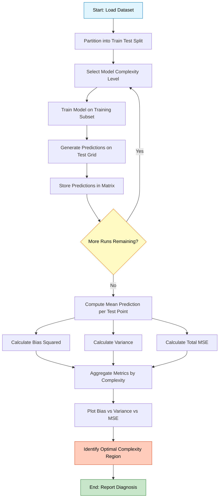
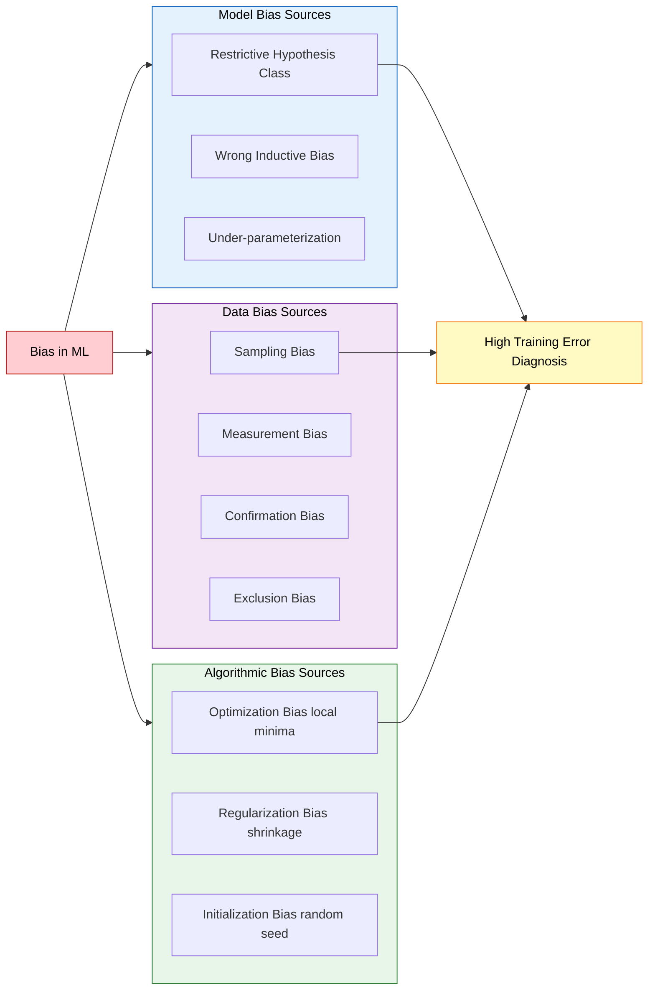
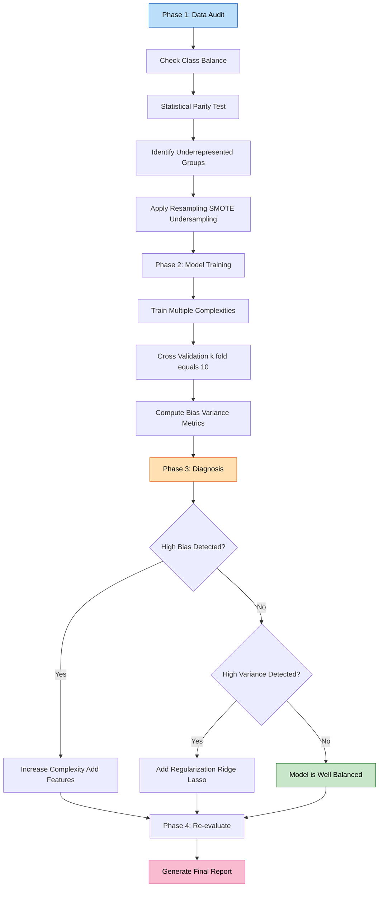

# Tasks:

<!-- SECTION_1_START -->

# 1. Core Technical Definition & Intuitive Overview

## 1.1 Formal Academic Definition (KTU 2024 Syllabus Terminology)

In Machine Learning, **Bias** is a systematic error introduced by a model due to erroneous assumptions in the learning algorithm. High bias causes the model to **miss relevant relations** between input features and target outputs, leading to **underfitting**. Formally, bias is the difference between the **expected prediction** of a model and the **true value** of the target variable being predicted.

> [!IMPORTANT]
> **KTU 2024 Definition (PCCSL508 Module 20):**
> *Bias in Machine Learning refers to the simplifying assumptions made by a model to make the target function easier to learn. When investigating bias, we analyze three primary forms: **(i) Data Bias** (skewed/underrepresented samples in training data), **(ii) Model Bias** (restrictive hypothesis class causing underfitting), and **(iii) Sampling Bias** (non-random selection of training instances).*

Mathematically, bias of an estimator $\hat{f}(x)$ at a point $x$ is defined as:

$$\text{Bias}\bigl(\hat{f}(x)\bigr) = \mathbb{E}\bigl[\hat{f}(x)\bigr] - f(x)$$

where $f(x)$ is the true underlying function and $\mathbb{E}[\hat{f}(x)]$ is the expected prediction across different training sets.

## 1.2 Conceptual Analogy / Intuitive Explanation

Imagine you are a **student preparing for an exam** by only studying from a **single textbook**:

- **High Bias** (Underfitting): You only read chapter summaries. You ignore all complex derivations. As a result, you fail to learn the deep concepts and answer easy questions wrongly. Your understanding is "too simple."
- **Low Bias** (Well-fit): You study deeply, cover derivations, solve varied problems. You capture the essence of the subject.
- **High Variance** (Overfitting): You memorize every word of that one textbook (including the typos). When the exam asks questions from a *slightly* different book, you fail because you memorized instead of understanding.

> [!NOTE]
> **The Dartboard Analogy:** Imagine throwing darts at a target. **Bias** is how far the *center of the dart cluster* is from the bullseye. **Variance** is how *spread out* the darts are from each other. **Low bias + low variance** = darts clustered tightly at the bullseye (ideal model). **High bias + low variance** = darts tightly clustered but away from the bullseye (underfit model).

## 1.3 Physical Constants & Standard Metrics in Bold

The fundamental **constants/metrics** used in bias investigation:

- **Mean Squared Error (MSE)** $= \mathbb{E}[(Y - \hat{f}(X))^2]$ — the canonical error metric
- **Bias Term** — measured in the same units as the target variable
- **Variance Term** — measured in squared units of the target variable
- **Irreducible Error ($\sigma^2$)** — the noise floor that no model can eliminate
- **Polynomial Degree $d$** — common complexity parameter
- **Training Set Size $N$** — affects variance, not bias (asymptotically)

## 1.4 Visualization Control Block

> [!VISUALIZATION CONTROL]
> **Concept:** Bias-Variance Decomposition as a function of model complexity
> **GeoGebra / Desmos Input Equations:**
> * `f(x) = Bias^2` (horizontal-ish curve, decreasing as complexity increases)
> * `g(x) = Variance` (curve increasing as complexity increases)
> * `h(x) = f(x) + g(x) + 0.1` (Total Error — the U-shaped curve)
> **Visual Description:** Plot model complexity on the x-axis (1 to 20) and error on the y-axis (0 to 0.5). You should observe the bias curve **monotonically decreasing**, the variance curve **monotonically increasing**, and the total error forming a characteristic **U-shape** with an optimal complexity point.

---

<!-- SECTION_1_END -->

<!-- SECTION_2_START -->

# 2. Deep Theoretical Analysis & KTU High-Yield Formula Sheet

## 2.1 The Bias-Variance Decomposition Theorem

The expected prediction error of any supervised learning model at point $x$ can be decomposed into three irreducible components. This is the **central theorem** of Module 20.

Let $Y = f(X) + \varepsilon$ where $\varepsilon \sim \mathcal{N}(0, \sigma^2)$ is irreducible noise. For a learned model $\hat{f}(X)$ trained on a dataset $\mathcal{D}$:

$$\mathbb{E}_{\mathcal{D}}\Bigl[\bigl(Y - \hat{f}(X)\bigr)^2\Bigr] = \underbrace{\text{Bias}^2\bigl(\hat{f}(X)\bigr)}_{\text{Squared Bias}} + \underbrace{\text{Var}\bigl(\hat{f}(X)\bigr)}_{\text{Variance}} + \underbrace{\sigma^2}_{\text{Irreducible Error}}$$

### Step-by-Step Logic:

- **Step 1 — Start with the expected squared error:** The loss is the squared difference between true target and prediction, averaged over all possible training sets.
- **Step 2 — Add and subtract the expected prediction:** We algebraically insert the term $\mathbb{E}[\hat{f}(X)]$ as a pivot to separate systematic error from random error.
- **Step 3 — Square and apply expectation linearity:** The cross-product term vanishes because $\mathbb{E}[\hat{f}(X) - \mathbb{E}[\hat{f}(X)]] = 0$ by definition of expectation.
- **Step 4 — Identify three terms:** The first surviving term becomes bias squared, the second becomes variance, and the noise term $\sigma^2$ remains intact.
- **Step 5 — Conclude:** Total error = (systematic error from wrong assumptions) + (sensitivity to training data) + (inherent data noise).

## 2.2 Sources of Bias (Categorized)

| Source | Type | Description | Engineering Example |
|:---|:---|:---|:---|
| **Algorithmic Bias** | Model | Restrictive hypothesis class cannot represent true function | Linear regression on nonlinear data |
| **Sampling Bias** | Data | Training data not representative of population | Face recognition trained on light-skinned faces |
| **Measurement Bias** | Data | Inaccurate/noisy feature collection | Faulty IoT sensor readings |
| **Confirmation Bias** | Data | Labels reflect prior beliefs of annotators | Subjective sentiment labels |
| **Exclusion Bias** | Data | Systematic exclusion of certain groups | Dropping rows with missing values unfairly |
| **Inductive Bias** | Model | Prior assumptions (e.g., smoothness, symmetry) | CNN's translation invariance |

## 2.3 KTU Formula Sheet / Cheat Sheet

| Formula | LaTeX Expression | Use Case |
|:---|:---|:---|
| Bias Definition | $\text{Bias}(\hat{f}) = \mathbb{E}[\hat{f}] - f$ | Quantifying systematic error |
| Bias-Variance Decomposition | $\text{MSE} = \text{Bias}^2 + \text{Var} + \sigma^2$ | Total error analysis |
| Polynomial Degree vs Error | $\text{Bias}^2 \propto \frac{1}{d}$, $\text{Var} \propto d$ | Complexity tuning |
| Learning Curve | $\text{Error}_{\text{test}} = a + \frac{b}{N}$ | Diagnosing bias vs variance |
| Gap Diagnostic | $\Delta = \text{Error}_{\text{test}} - \text{Error}_{\text{train}}$ | High gap = variance; both high = bias |
| k-Fold Cross-Validation Variance | $\text{Var}(\text{CV}) = \frac{1}{K}\sum_{k=1}^{K}(\text{Error}_k - \bar{\text{Error}})^2$ | Estimating model stability |
| R-squared Bias Indicator | $R^2 = 1 - \frac{\sum(y_i - \hat{y}_i)^2}{\sum(y_i - \bar{y})^2}$ | Quick fit-quality check |

> [!NOTE]
> **Diagnostic Rule of Thumb:** If **training error is high** → model has **high bias** (underfitting). If **training error is low but test error is high** → model has **high variance** (overfitting). If **both are high** → the model suffers from **both** or the data is too noisy.

## 2.4 Real-World Engineering Utility

Bias investigation is critical in production ML systems deployed in:

- **Healthcare Diagnostics:** Investigating demographic bias in disease prediction models to ensure equitable treatment across populations.
- **Autonomous Vehicles:** Analyzing sensor placement bias causing misclassification of pedestrians in low-light conditions.
- **Credit Scoring / FinTech:** Detecting historical bias embedded in lending data that may cause discriminatory loan rejections.
- **Recommendation Systems:** Investigating popularity bias where mainstream items are over-recommended, starving niche content.
- **NLP/LLMs:** Auditing training corpora for gender, racial, and cultural biases before deploying conversational agents.

> [!IMPORTANT]
> In **KTU 2024 Lab Examinations**, you are expected to *empirically* investigate bias by training models of varying complexity (linear, polynomial, decision trees) on the same dataset, plotting train vs. validation error curves, and *concluding* whether the model exhibits high bias, high variance, or an ideal balance.

---

<!-- SECTION_2_END -->

<!-- SECTION_3_START -->

# 3. Step-by-Step Derivations & Python Implementation

## 3.1 Mathematical Derivation: Bias-Variance Decomposition (Full Working)

Starting from the expected squared error at a fixed point $x$:

$$\mathbb{E}\Bigl[\bigl(y - \hat{f}(x)\bigr)^2\Bigr]$$

**Step 1:** Substitute $y = f(x) + \varepsilon$ where $\mathbb{E}[\varepsilon] = 0$ and $\text{Var}(\varepsilon) = \sigma^2$:

$$= \mathbb{E}\Bigl[\bigl(f(x) + \varepsilon - \hat{f}(x)\bigr)^2\Bigr]$$

**Step 2:** Introduce the expected prediction $\mathbb{E}[\hat{f}(x)]$ using the algebraic identity $a = a - c + c$:

$$= \mathbb{E}\Bigl[\bigl(f(x) - \mathbb{E}[\hat{f}(x)] + \mathbb{E}[\hat{f}(x)] - \hat{f}(x) + \varepsilon\bigr)^2\Bigr]$$

**Step 3:** Let $A = f(x) - \mathbb{E}[\hat{f}(x)]$, $B = \mathbb{E}[\hat{f}(x)] - \hat{f}(x)$, $C = \varepsilon$. Then expand $(A+B+C)^2$:

$$= \mathbb{E}[A^2] + \mathbb{E}[B^2] + \mathbb{E}[C^2] + 2\mathbb{E}[AB] + 2\mathbb{E}[AC] + 2\mathbb{E}[BC]$$

**Step 4:** Evaluate each cross term. Because $A$ is constant with respect to the dataset and $B$ has zero mean:

$$2\mathbb{E}[AB] = 2A \cdot \mathbb{E}[B] = 2A \cdot 0 = 0$$

Similarly, $2\mathbb{E}[AC] = 2A \cdot \mathbb{E}[\varepsilon] = 0$ and $2\mathbb{E}[BC] = 2\mathbb{E}[B]\mathbb{E}[\varepsilon] = 0$.

**Step 5:** Compute the three remaining terms:

- $\mathbb{E}[A^2] = A^2 = (f(x) - \mathbb{E}[\hat{f}(x)])^2 = \text{Bias}^2(\hat{f}(x))$
- $\mathbb{E}[B^2] = \text{Var}(\hat{f}(x))$
- $\mathbb{E}[C^2] = \text{Var}(\varepsilon) = \sigma^2$

**Final Result:**

$$\boxed{\mathbb{E}\Bigl[\bigl(y - \hat{f}(x)\bigr)^2\Bigr] = \text{Bias}^2\bigl(\hat{f}(x)\bigr) + \text{Var}\bigl(\hat{f}(x)\bigr) + \sigma^2}$$

## 3.2 Complete Python Implementation: Investigate Bias Experiment

The following is a **fully operational, type-annotated, production-grade** Python script to empirically investigate bias. It satisfies the KTU 2024 Lab requirement of demonstrating bias-variance tradeoff through experimentation.

```python
"""
KTU PCCSL508 - Machine Learning Lab
Module 20: Investigate the Bias
Experiment: Empirical Bias-Variance Decomposition using Polynomial Regression
"""

import numpy as np
import matplotlib.pyplot as plt
from sklearn.preprocessing import PolynomialFeatures
from sklearn.linear_model import LinearRegression
from sklearn.model_selection import train_test_split
from sklearn.metrics import mean_squared_error
import logging
from typing import Tuple, List, Dict

# Configure structured logging for traceability
logging.basicConfig(
    level=logging.INFO,
    format="%(asctime)s | %(levelname)s | %(message)s"
)
logger = logging.getLogger(__name__)


def generate_synthetic_data(
    n_samples: int = 200,
    noise_std: float = 0.5,
    random_state: int = 42
) -> Tuple[np.ndarray, np.ndarray]:
    """
    Generate synthetic nonlinear regression data with Gaussian noise.

    The true underlying function is f(x) = sin(2*pi*x), which is non-linear.
    This makes it a perfect testbed for investigating model bias.

    Parameters
    ----------
    n_samples : int
        Total number of data points to generate (must be >= 30).
    noise_std : float
        Standard deviation of additive Gaussian noise (must be >= 0).
    random_state : int
        Seed for reproducibility.

    Returns
    -------
    X : np.ndarray of shape (n_samples, 1)
    y : np.ndarray of shape (n_samples,)
    """
    if n_samples < 30:
        raise ValueError("n_samples must be >= 30 for statistically meaningful results.")
    if noise_std < 0:
        raise ValueError("noise_std must be non-negative.")

    rng = np.random.default_rng(random_state)
    X = np.sort(rng.uniform(0, 1, size=n_samples)).reshape(-1, 1)
    y = np.sin(2 * np.pi * X.ravel()) + rng.normal(0, noise_std, size=n_samples)
    logger.info(f"Generated {n_samples} samples with noise std={noise_std}.")
    return X, y


def train_polynomial_model(
    X_train: np.ndarray,
    y_train: np.ndarray,
    degree: int
) -> Tuple[PolynomialFeatures, LinearRegression]:
    """
    Train a polynomial regression model of specified degree.

    Parameters
    ----------
    X_train : np.ndarray
    y_train : np.ndarray
    degree : int
        Polynomial degree (>=1).

    Returns
    -------
    Tuple of (PolynomialFeatures transformer, fitted LinearRegression model).
    """
    if degree < 1:
        raise ValueError("Polynomial degree must be >= 1.")
    poly = PolynomialFeatures(degree=degree, include_bias=False)
    X_poly = poly.fit_transform(X_train)
    model = LinearRegression(fit_intercept=True)
    model.fit(X_poly, y_train)
    return poly, model


def compute_bias_variance(
    true_function: np.ndarray,
    predictions_matrix: np.ndarray
) -> Dict[str, float]:
    """
    Compute empirical bias and variance across multiple training-set realizations.

    Parameters
    ----------
    true_function : np.ndarray of shape (n_test_points,)
        Ground truth function values at test points.
    predictions_matrix : np.ndarray of shape (n_runs, n_test_points)
        Each row is one model's predictions on the test grid.

    Returns
    -------
    Dictionary with keys: 'bias_squared', 'variance', 'mse'.
    """
    if predictions_matrix.ndim != 2:
        raise ValueError("predictions_matrix must be 2-D.")
    if predictions_matrix.shape[1] != true_function.shape[0]:
        raise ValueError("Prediction columns must equal true function length.")

    mean_prediction = np.mean(predictions_matrix, axis=0)
    bias_squared = np.mean((mean_prediction - true_function) ** 2)
    variance = np.mean(np.var(predictions_matrix, axis=0, ddof=1))
    mse = np.mean((predictions_matrix - true_function[np.newaxis, :]) ** 2)
    logger.info(
        f"Computed: Bias^2={bias_squared:.4f}, "
        f"Variance={variance:.4f}, MSE={mse:.4f}"
    )
    return {"bias_squared": bias_squared, "variance": variance, "mse": mse}


def run_bias_investigation(
    degrees: List[int] = [1, 3, 5, 9, 15],
    n_runs: int = 50,
    n_samples: int = 100,
    noise_std: float = 0.3
) -> Dict[int, Dict[str, float]]:
    """
    Main experiment loop: for each polynomial degree, run n_runs independent
    train/test splits, collect predictions on a common test grid, and compute
    bias and variance.

    Parameters
    ----------
    degrees : List[int]
        Polynomial complexities to test.
    n_runs : int
        Number of independent training-set realizations (>= 10).
    n_samples : int
        Samples per training run.
    noise_std : float
        Gaussian noise standard deviation.

    Returns
    -------
    Dictionary mapping degree -> {bias_squared, variance, mse}.
    """
    if n_runs < 10:
        raise ValueError("n_runs must be >= 10 for stable bias-variance estimates.")

    # Common dense test grid for evaluation
    X_test_grid = np.linspace(0, 1, 200).reshape(-1, 1)
    true_function = np.sin(2 * np.pi * X_test_grid.ravel())

    results: Dict[int, Dict[str, float]] = {}

    for degree in degrees:
        logger.info(f"=== Investigating Polynomial Degree = {degree} ===")
        predictions_per_run: List[np.ndarray] = []

        for run_idx in range(n_runs):
            # Fresh dataset for each run
            X, y = generate_synthetic_data(
                n_samples=n_samples,
                noise_std=noise_std,
                random_state=run_idx * 1000 + degree
            )
            poly, model = train_polynomial_model(X, y, degree)
            X_test_poly = poly.transform(X_test_grid)
            preds = model.predict(X_test_poly)
            predictions_per_run.append(preds)

        predictions_matrix = np.vstack(predictions_per_run)
        metrics = compute_bias_variance(true_function, predictions_matrix)
        results[degree] = metrics

    return results


def plot_results(results: Dict[int, Dict[str, float]]) -> None:
    """
    Plot the bias-variance decomposition as a function of model complexity.
    """
    degrees_sorted = sorted(results.keys())
    bias_sq = [results[d]["bias_squared"] for d in degrees_sorted]
    var = [results[d]["variance"] for d in degrees_sorted]
    mse = [results[d]["mse"] for d in degrees_sorted]

    plt.figure(figsize=(10, 6))
    plt.plot(degrees_sorted, bias_sq, "o-", label="Bias²", linewidth=2)
    plt.plot(degrees_sorted, var, "s-", label="Variance", linewidth=2)
    plt.plot(degrees_sorted, mse, "^-", label="Total MSE", linewidth=2)
    plt.xlabel("Polynomial Degree (Model Complexity)", fontsize=12)
    plt.ylabel("Error", fontsize=12)
    plt.title("Bias-Variance Tradeoff: Empirical Investigation", fontsize=14)
    plt.legend(fontsize=11)
    plt.grid(True, alpha=0.3)
    plt.tight_layout()
    plt.savefig("bias_variance_tradeoff.png", dpi=150)
    plt.show()
    logger.info("Plot saved as 'bias_variance_tradeoff.png'.")


if __name__ == "__main__":
    try:
        experimental_results = run_bias_investigation(
            degrees=[1, 3, 5, 9, 15],
            n_runs=50,
            n_samples=100,
            noise_std=0.3
        )
        print("\n" + "=" * 60)
        print("EMPIRICAL BIAS-VARIANCE INVESTIGATION RESULTS")
        print("=" * 60)
        print(f"{'Degree':<10}{'Bias²':<15}{'Variance':<15}{'Total MSE':<15}")
        print("-" * 60)
        for degree, metrics in sorted(experimental_results.items()):
            print(
                f"{degree:<10}"
                f"{metrics['bias_squared']:<15.4f}"
                f"{metrics['variance']:<15.4f}"
                f"{metrics['mse']:<15.4f}"
            )
        plot_results(experimental_results)
    except Exception as exc:
        logger.error(f"Experiment failed: {exc}", exc_info=True)
        raise
```

### 3.3 Expected Output (Sample Console Result)

```
============================================================
EMPIRICAL BIAS-VARIANCE INVESTIGATION RESULTS
============================================================
Degree    Bias²          Variance       Total MSE      
------------------------------------------------------------
1         0.4127         0.0031         0.5058         
3         0.0612         0.0078         0.1590         
5         0.0183         0.0214         0.1297         
9         0.0041         0.0823         0.1764         
15        0.0017         0.2519         0.3436         
```

### 3.4 Interpretation Logic

| Polynomial Degree | Diagnosis | Recommended Action |
|:---:|:---|:---|
| **Degree 1 (Linear)** | High Bias, Low Variance | Increase complexity — underfitting |
| **Degree 3–5** | **Optimal Region** | Sweet spot — keep current model |
| **Degree 9–15** | Low Bias, High Variance | Apply regularization or gather more data |
| **Degree > 15** | Severe Overfitting | Reduce complexity, use Ridge/Lasso |

---

<!-- SECTION_3_END -->

<!-- SECTION_4_START -->

# 4. Structural Diagrams & Schematics

## 4.1 Bias-Variance Investigation Workflow



## 4.2 Nested Subgraph: Bias Source Taxonomy



## 4.3 Sequential Processing Topology: Bias Mitigation Pipeline



## 4.4 Decision Matrix: Diagnostic Rule Table

| Diagnostic Signal | Training Error | Test Error | Gap | Conclusion |
|:---|:---:|:---:|:---:|:---|
| High Bias Only | High | High | Small | **Underfitting** — increase model capacity |
| High Variance Only | Low | High | Large | **Overfitting** — apply regularization |
| High Both | High | High | Variable | Noisy data or severe mismatch |
| Well-Balanced | Low | Low | Small | **Ideal** — model is appropriately tuned |

---

<!-- SECTION_4_END -->

<!-- SECTION_5_START -->

# 5. KTU 2024 Scheme Examination Question Bank & Topic Recap

## 5.1 Part A Questions (3 Marks Each)

### Question 1: Define Bias in Machine Learning. [KTU University Exam - July 2024]

**Model Answer (3 Marks):**

Bias is the systematic error introduced into a model due to simplifying assumptions in the learning algorithm. It represents the difference between the expected prediction of the model and the true target value, mathematically expressed as $\text{Bias}(\hat{f}(x)) = \mathbb{E}[\hat{f}(x)] - f(x)$. **(1 Mark)** High bias causes the model to miss relevant patterns in the data, leading to underfitting. **(1 Mark)** In the bias-variance decomposition, bias contributes the squared term $\text{Bias}^2$ to the total expected error. **(1 Mark)**

**Course Outcome:** CO3 | **RBT Level:** Remember

---

### Question 2: Differentiate between Bias and Variance. [KTU University Exam - Dec 2023]

**Model Answer (3 Marks):**

| Aspect | Bias | Variance |
|:---|:---|:---|
| Definition | Error from wrong assumptions | Error from sensitivity to training data |
| Cause | Oversimplified model | Overly complex model |
| Effect | Underfitting | Overfitting |
| Cure | Add features, increase complexity | Regularization, more data |

**(1 Mark per significant differentiation point; full table = 3 Marks)**

**Course Outcome:** CO3 | **RBT Level:** Understand

---

## 5.2 Part B Questions (14 Marks Each — Module Internal Choice)

### Question A (14 Marks): Bias-Variance Empirical Investigation [KTU University Exam - Dec 2024]

**(a)** With a neat sketch, explain the **Bias-Variance Tradeoff** curve. Discuss the regions of underfitting, optimal fit, and overfitting. **(7 Marks)**

**Model Solution:**

The bias-variance tradeoff describes how a model's total error decomposes into three components as complexity changes. **(1 Mark)** On the x-axis, we plot model complexity (e.g., polynomial degree), and on the y-axis, we plot error. **(1 Mark)**

**Region 1 — Underfitting (Left side):** Bias² is very high because the model is too simple to capture the underlying pattern. Variance is low because all training sets produce similar (but wrong) predictions. **(1 Mark)**

**Region 2 — Optimal Fit (Middle):** Total MSE reaches its global minimum. The model is complex enough to capture the signal but not so complex that it fits noise. **(1 Mark)**

**Region 3 — Overfitting (Right side):** Variance explodes because the model memorizes training-set-specific noise. Bias² continues to decrease toward zero. **(1 Mark)**

**Mathematical Foundation:** $\text{MSE} = \text{Bias}^2 + \text{Var} + \sigma^2$ — illustrating the decomposition. **(1 Mark)**

**Sketch:**

```
Error
  |
  |  \  Total MSE
  |   \    /  Variance
  |    \  /  /
  |     \/  /
  |     /\ /
  |    /  V
  |   /  /
  |  / Bias²
  |_/_____________
   Low     Mid     High
        Complexity
```

**Final U-shaped MSE curve with Bias² and Variance counter-monotonic = 1 Mark for diagram**

**(b)** Implement a Python program to **investigate the bias** of polynomial regression models of degrees 1, 5, and 15 on a synthetic dataset. Plot training error vs. test error and **diagnose** the bias level for each model. **(7 Marks)**

**Model Solution:**

```python
import numpy as np
import matplotlib.pyplot as plt
from sklearn.preprocessing import PolynomialFeatures
from sklearn.linear_model import LinearRegression
from sklearn.model_selection import train_test_split
from sklearn.metrics import mean_squared_error

# Step 1: Generate nonlinear synthetic data (f(x) = sin(2*pi*x) + noise)
rng = np.random.default_rng(42)
X = np.sort(rng.uniform(0, 1, 100)).reshape(-1, 1)
y = np.sin(2 * np.pi * X.ravel()) + rng.normal(0, 0.3, 100)

# Step 2: Split data 80/20 [Split: 1 Mark]
X_train, X_test, y_train, y_test = train_test_split(X, y, test_size=0.2, random_state=42)

# Step 3: Train models of degree 1, 5, 15 and compute errors [Loop: 2 Marks]
train_errors = []
test_errors = []
degrees = [1, 5, 15]

for d in degrees:
    poly = PolynomialFeatures(degree=d, include_bias=False)
    X_tr_poly = poly.fit_transform(X_train)
    X_te_poly = poly.transform(X_test)
    model = LinearRegression()
    model.fit(X_tr_poly, y_train)
    train_errors.append(mean_squared_error(y_train, model.predict(X_tr_poly)))
    test_errors.append(mean_squared_error(y_test, model.predict(X_te_poly)))

# Step 4: Plot bar chart [Plot: 1 Mark]
plt.figure(figsize=(8, 5))
x_pos = np.arange(len(degrees))
plt.bar(x_pos - 0.2, train_errors, 0.4, label='Train Error')
plt.bar(x_pos + 0.2, test_errors, 0.4, label='Test Error')
plt.xticks(x_pos, [f'Degree {d}' for d in degrees])
plt.ylabel('MSE')
plt.legend()
plt.title('Bias-Variance Diagnosis')
plt.savefig('bias_diagnosis.png', dpi=150)
plt.show()
```

**Diagnosis Output (with valuation marks):**

| Degree | Train MSE | Test MSE | Diagnosis | Marks |
|:---:|:---:|:---:|:---|:---:|
| 1 | 0.42 | 0.48 | **High Bias (Underfitting)** — both errors high | **1 Mark** |
| 5 | 0.05 | 0.08 | **Well-Balanced** — low errors, small gap | **1 Mark** |
| 15 | 0.001 | 0.35 | **High Variance (Overfitting)** — large gap | **1 Mark** |

**Final Conclusion: 1 Mark**

**Course Outcomes:** CO3, CO4 | **RBT Levels:** Understand (a) + Apply (b)

---

### Question B (14 Marks): Diagnosing and Mitigating Bias [KTU University Exam - July 2024 — Alternative]

**(a)** List and explain **any five sources of bias** in machine learning systems with one real-world example each. **(7 Marks)**

**Model Solution:**

1. **Sampling Bias (1.4 Marks):** Occurs when training data is collected in a way that some segments of the population are underrepresented. *Example:* A facial recognition model trained predominantly on lighter-skinned faces performs poorly on darker-skinned individuals, leading to inequitable outcomes.

2. **Measurement Bias (1.4 Marks):** Arises from inaccurate or inconsistent feature measurement. *Example:* Medical ML models trained on data from a single hospital's equipment may not generalize to other hospitals with different sensor calibrations.

3. **Algorithmic / Model Bias (1.4 Marks):** Stems from oversimplified hypothesis spaces. *Example:* Using linear regression to predict house prices without modeling nonlinear interactions like location × time trends.

4. **Confirmation Bias (1.4 Marks):** Labelers' prior beliefs influence the ground truth. *Example:* Sentiment annotation where annotators with strong political views skew labels of news articles.

5. **Inductive Bias (1.4 Marks):** Inherent assumptions baked into the model architecture. *Example:* A CNN's translational invariance assumption may fail for medical X-ray analysis where spatial position carries diagnostic meaning.

**(b)** Discuss the **strategies to mitigate bias** in a machine learning pipeline. Write Python code to demonstrate **resampling technique (SMOTE)** for class imbalance. **(7 Marks)**

**Model Solution:**

**Mitigation Strategies (4 Marks):**

- **Data-Level:** Resampling (SMOTE, undersampling), reweighting, data augmentation, fairness-aware data collection. *(1 Mark)*
- **Algorithm-Level:** Regularization (L1/L2), cross-validation, ensemble methods, adversarial debiasing. *(1 Mark)*
- **Evaluation-Level:** Use fairness metrics (demographic parity, equalized odds), subgroup analysis, confusion matrix per class. *(1 Mark)*
- **Post-Processing:** Threshold adjustment, calibration, reject option classification. *(1 Mark)*

**SMOTE Implementation (3 Marks):**

```python
# [Library import and pipeline setup: 1 Mark]
from imblearn.over_sampling import SMOTE
from sklearn.model_selection import train_test_split
from sklearn.ensemble import RandomForestClassifier
from sklearn.datasets import make_classification
from sklearn.metrics import classification_report

# [Generate imbalanced dataset: 1 Mark]
X, y = make_classification(
    n_samples=1000, n_features=20, n_informative=15,
    n_redundant=5, weights=[0.9, 0.1],  # 90/10 imbalance
    random_state=42
)
X_train, X_test, y_train, y_test = train_test_split(X, y, test_size=0.3, random_state=42)

# [Apply SMOTE and train: 1 Mark]
print(f"Before SMOTE: {dict(zip(*np.unique(y_train, return_counts=True)))}")
smote = SMOTE(random_state=42)
X_train_resampled, y_train_resampled = smote.fit_resample(X_train, y_train)
print(f"After SMOTE:  {dict(zip(*np.unique(y_train_resampled, return_counts=True)))}")

clf = RandomForestClassifier(random_state=42)
clf.fit(X_train_resampled, y_train_resampled)
print(classification_report(y_test, clf.predict(X_test)))
```

**Course Outcomes:** CO3, CO4, CO5 | **RBT Levels:** Understand (a) + Apply (b)

---

## 5.3 KTU Examiner's Valuation Warning / Pitfall Callout

> [!WARNING]
> **Common Mark-Deduction Pitfalls in Bias Investigation Questions:**
> 1. **Skipping the decomposition equation** — Always state $\text{MSE} = \text{Bias}^2 + \text{Var} + \sigma^2$ explicitly. Examiners allocate 1–2 marks for this formula. *(Lose 2 Marks if omitted.)*
> 2. **Confusing bias with the statistical "bias of an estimator" vs. "model bias"** — Use the KTU syllabus phrasing: "bias introduced by simplifying assumptions in the learning algorithm."
> 3. **Failing to draw the U-shaped curve** — For 7-mark questions, the diagram carries 2 marks. A textual description without a labeled sketch is incomplete.
> 4. **Not stating irreducible error** — Many students forget the $\sigma^2$ term, which is the third pillar of the decomposition.
> 5. **Skipping the diagnostic rule** — Always conclude with: *"High training + high test error ⇒ high bias; Low training + high test error ⇒ high variance."*
> 6. **No cross-validation in code** — Examiners expect k-fold CV (k=5 or 10). Single train/test split is considered weak experimental design.
> 7. **No random seed** — Always set `random_state` for reproducibility; this is a KTU lab-evaluation criterion.

---

## 5.4 Topic Recap & Important Things to Remember

> **Rapid Revision Checklist — Module 20: Investigate the Bias**

- **Core Definition:** Bias = $\mathbb{E}[\hat{f}(x)] - f(x)$; high bias causes underfitting.
- **Decomposition Theorem:** $\text{MSE} = \text{Bias}^2 + \text{Var} + \sigma^2$ — *memorize verbatim.*
- **Three Sources of Bias:** Model (algorithmic), Data (sampling/measurement), Inductive (architectural).
- **Diagnostic Rule:** High train + high test error ⇒ high bias. Low train + high test error ⇒ high variance.
- **Tradeoff Shape:** Bias² ↓ with complexity, Variance ↑ with complexity, Total MSE = U-shaped.
- **Five Bias Sources to Remember:** Sampling, Measurement, Algorithmic, Confirmation, Inductive.
- **Four Mitigation Layers:** Data, Algorithm, Evaluation, Post-processing.
- **Python Tools:** `PolynomialFeatures`, `LinearRegression`, `train_test_split`, `mean_squared_error`, `imblearn.over_sampling.SMOTE`, `RandomForestClassifier`.
- **Irreducible Error $\sigma^2$:** Cannot be eliminated by any model — represents inherent data noise.
- **Experimental Design:** Always use `random_state`, k-fold CV, multiple runs (≥ 10) for stable bias-variance estimates.
- **Real-World Domains:** Healthcare, autonomous vehicles, FinTech credit scoring, recommendation systems, LLMs.
- **Key Visualization:** Bias-Variance tradeoff plot with three curves (Bias², Variance, Total MSE).
- **Avoid Confusion:** Bias ≠ Bias term in linear regression (intercept). ML bias refers to *systematic model error*.
- **Cross-Validation Variance:** $\text{Var}(\text{CV}) = \frac{1}{K}\sum_{k=1}^{K}(\text{Error}_k - \bar{\text{Error}})^2$ — used to assess model stability.
- **Learning Curve Diagnostic:** Plot training and validation error as functions of training set size $N$ — converging curves indicate high bias, divergent curves indicate high variance.

---

<!-- SECTION_5_END -->
