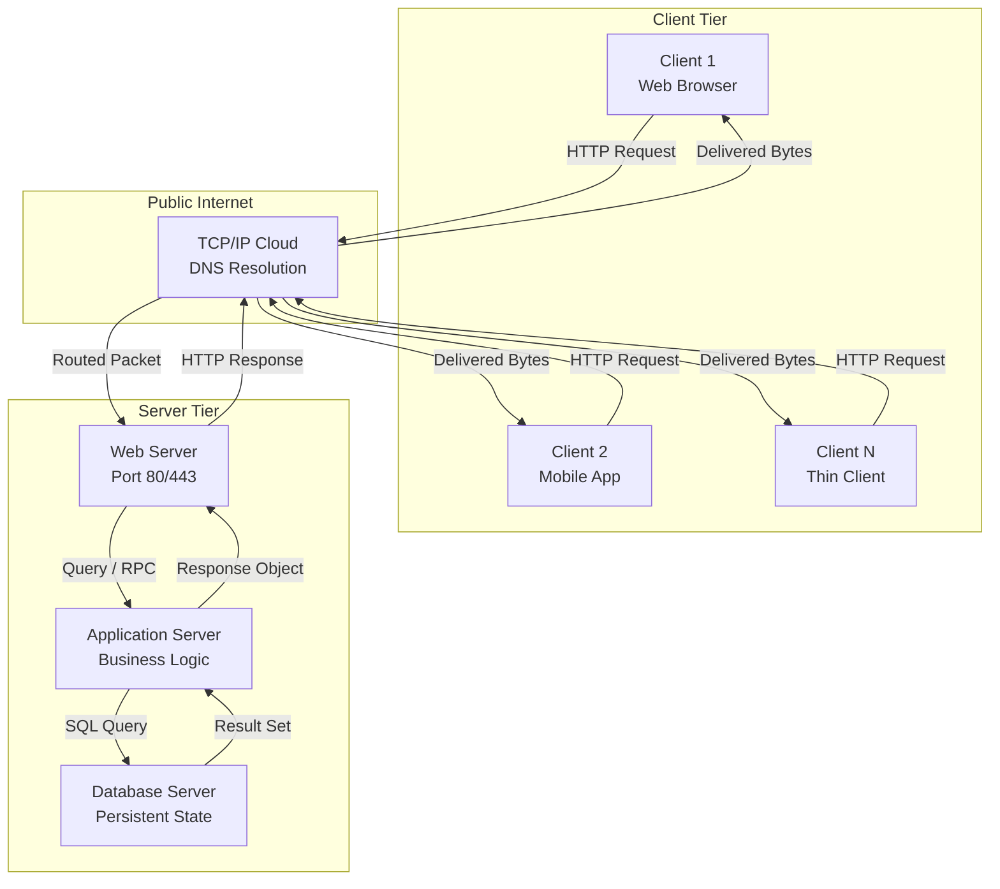
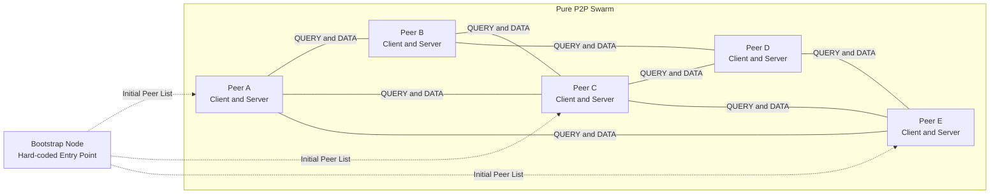
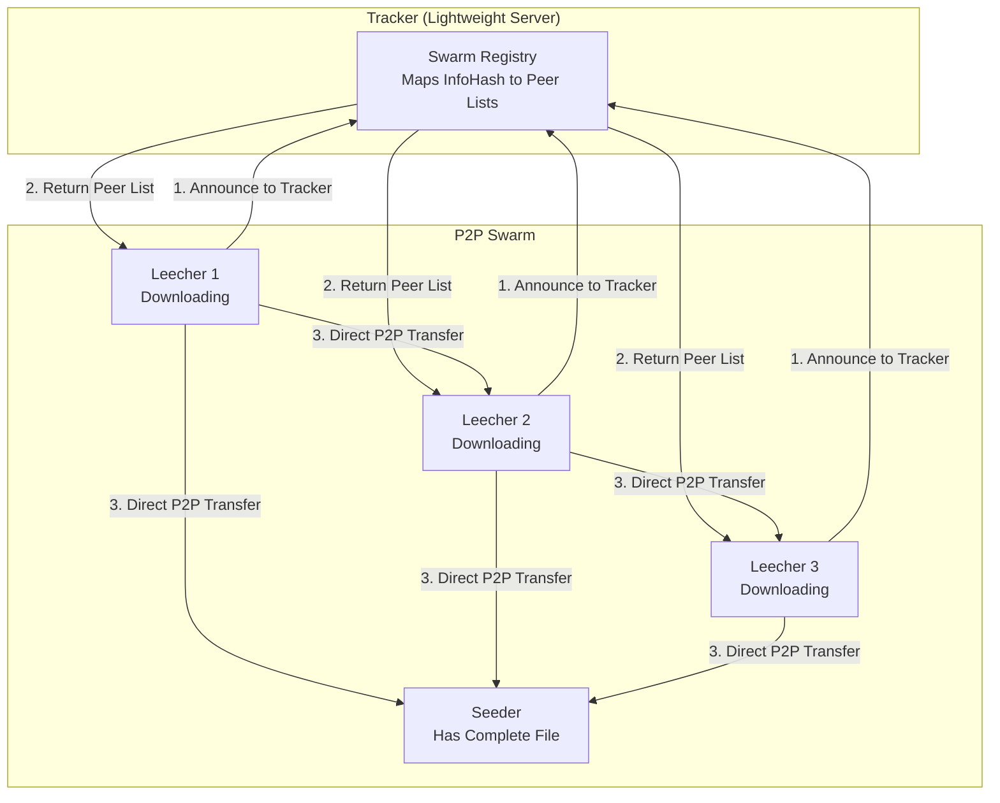
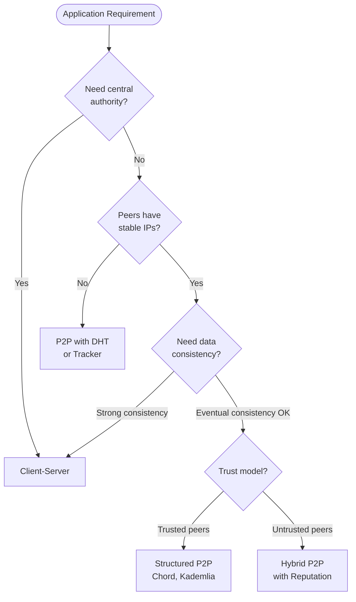
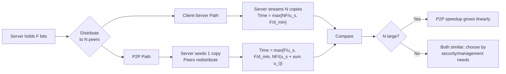

# Application-Layer Paradigms: Client-server applications vs Peer-to-Peer structures

<!-- SECTION_1_START -->

# Application-Layer Paradigms: Client-Server vs Peer-to-Peer

## 1.1 The Client-Server Paradigm

> [!IMPORTANT]
> **Formal Definition (KTU Syllabus Term)**
> The **Client-Server Paradigm** is a distributed application architecture that partitions tasks between *servers* — powerful centralized machines that host, manage, and deliver resources — and *clients* — endpoint devices that issue requests and consume services over a network. The server is **always-on**, possesses a **fixed, well-known IP address**, and serves multiple, often geographically dispersed, clients concurrently.

**Intuitive Analogy — The Restaurant Model 🍽️**
Imagine a fancy restaurant. You (the *client*) walk in, sit at a table, and look at the menu. The kitchen (the *server*) prepares every dish and serves it back to you. The kitchen does not know you personally; it simply processes orders from many tables. The waiters (the *protocol*) carry your order to the kitchen and bring food back. If the kitchen burns down, the whole restaurant fails — that is the **single point of failure** inherent to client-server systems.

### Canonical Real-World Client-Server Applications
| Application | Protocol (Transport) | Server Role | Client Role |
|---|---|---|---|
| Web Browsing | **HTTP/HTTPS** (TCP) | Hosts web pages, responds to GET/POST | Renders pages in a browser |
| Electronic Mail | **SMTP**, POP3, IMAP (TCP) | Relays and stores mail | Sends/retrieves mail via MUA |
| File Transfer | **FTP** (TCP) | Stores files in directories | Uploads/downloads files |
| Domain Resolution | **DNS** (UDP/TCP) | Translates names to IPs | Resolver on host machine |
| Dynamic Host Config | **DHCP** (UDP) | Leases IP addresses | Requests configuration |

> [!NOTE]
> **KTU Board Insight:** In the client-server model, the client is the *initiator of communication*. The server is a *passive listener* on a well-known port (HTTP → **port 80**, HTTPS → **port 443**, FTP → **port 21**, DNS → **port 53**).

### 1.1.1 Data Center & Modern Variants
Modern deployments often use **virtualized data centers** housing thousands of blades. Variants include:
- **Traditional client-server** (single powerful server)
- **Multi-tier architecture** (web-server ↔ application-server ↔ database-server)
- **Cloud-hosted** (AWS EC2, Azure VMs — server is logically dedicated, not physically)

---

## 1.2 The Peer-to-Peer (P2P) Paradigm

> [!IMPORTANT]
> **Formal Definition (KTU Syllabus Term)**
> The **Peer-to-Peer Paradigm** is a decentralized distributed application architecture in which endpoints (peers) act as both *suppliers* and *consumers* of resources. There is **no dedicated, always-on central server**. Peers leverage **intermittent connectivity**, **changing IP addresses**, and **distributed discovery protocols** to locate and exchange content directly with each other.

**Intuitive Analogy — The Neighborhood Garage Sale 🏘️**
Imagine a Saturday morning where 50 neighbors each put out stuff to sell in their driveways. There is no Amazon warehouse. Anyone can be a *seller* and a *buyer* simultaneously. If you want a lawnmower, you walk over to a few houses asking "Do you have a lawnmower?" — that is **query flooding** (Gnutella-style discovery). The more neighbors join, the more *stuff* is available and the more *helpers* there are to share load — that is the **self-scaling** magic of P2P.

### Canonical Real-World P2P Applications
| Application | Year | Architecture | Notes |
|---|---|---|---|
| **Napster** | 1999 | *Hybrid* (centralized directory + P2P transfer) | First mainstream P2P; legal fallout over MP3 sharing |
| **Gnutella** | 2000 | *Pure* P2P, query flooding | Scalability issues beyond ~10⁴ peers |
| **BitTorrent** | 2001 | *Swarm-based* P2P with **tracker** | Tit-for-tat incentive; the most-used P2P protocol globally |
| **Skype** | 2003 | *Hybrid* P2P, hierarchical overlay | Super-nodes (relays) for NAT traversal |
| **Distributed Hash Tables** (Chord, Pastry, Kademlia) | 2000s | *Structured* P2P | O(log N) lookup; powers IPFS, Ethereum |

> [!NOTE]
> **Churn** is a defining operational concern in P2P: peers join and leave at will, so the overlay must continuously reconfigure without dropping in-flight requests.

> [!VISUALIZATION CONTROL]
> **Concept:** Overlay Topology — a *logical* network of peers built atop the *physical* Internet.
> **Desmos Input Equations (concept sketch):**
> * Circle: $\;r = 1\;$ representing one peer
> * Dashed chords: $d_{ij} = \sqrt{(x_i - x_j)^2 + (y_i - y_j)^2}$ representing logical links
> **Visual Description:** Plot ~12 randomly placed points on a unit disk. Each peer is a *node*; a line between any two means they have exchanged a peer-list message. As peers join/leave, edges rewire continuously — this is *churn*.

---

## 1.3 Side-by-Side Conceptual Snapshot

| Property | Client-Server | Peer-to-Peer |
|---|---|---|
| Central authority | ✅ Server | ❌ None |
| Peer role symmetry | Asymmetric (client ≠ server) | Symmetric (every node is both) |
| Always-on requirement | Server must be always-on | No always-on node required |
| Scalability | Server bandwidth is the **bottleneck** | **Self-scales** as more peers arrive |
| Failure mode | **Single point of failure** | **Graceful degradation** |
| Discovery mechanism | DNS / hard-coded IP | DHT, flooding, or tracker |
| Security | Centralized firewall, ACLs | Distributed trust; harder to police |
| Examples | Web, Email, Banking | BitTorrent, IPFS, Blockchain |

> [!TIP]
> **Memory Aid for the Exam:** Remember the mnemonic **"CSS-PPS"** → *Central Server, Single-failure* versus *Peers Provide Service, Self-scaling*.

<!-- SECTION_1_END -->

<!-- SECTION_2_START -->

# Deep Theoretical Analysis & KTU High-Yield Formula Sheet

## 2.1 Operational Mechanics of Client-Server

The request-response lifecycle follows a precise pattern codified in the **Application-Layer Protocol** (e.g., HTTP/1.1, HTTP/2, HTTP/3):

1. **DNS Resolution** — Client queries a DNS resolver to map the hostname (e.g., `www.ktu.edu.in`) to an IPv4/IPv6 address. This consumes 1–3 RTTs (Round-Trip Times).
2. **TCP Three-Way Handshake** — Client sends `SYN`, server replies `SYN-ACK`, client sends `ACK`. Cost: **1 RTT** before any payload flows.
3. **TLS Handshake (for HTTPS)** — Negotiation of cipher suites and key exchange. Cost: 1–2 additional RTTs (1 RTT in TLS 1.3).
4. **Request Transmission** — Client sends HTTP request (GET, POST, etc.). Cost: typically negligible compared to link latency.
5. **Server Processing** — Database query, application logic, rendering. Cost: variable, often the dominant factor.
6. **Response Transmission** — Server streams the response (HTML, JSON, video, etc.). Cost: proportional to payload size and link bandwidth.
7. **Connection Teardown** — FIN-ACK exchange or persistent keep-alive.

> [!NOTE]
> **Bandwidth Asymmetry:** Server **upload** capacity (often called $u_s$) is the binding constraint because every client downstream is a *consumer* of that same upstream capacity. Increasing client count linearly degrades per-client throughput.

---

## 2.2 Operational Mechanics of Peer-to-Peer

The P2P lifecycle is fundamentally more complex because it includes a *discovery phase* and a *negotiation phase*:

1. **Bootstrap** — A new peer contacts a *bootstrap node* (a hard-coded, well-known peer) to learn about existing peers.
2. **Overlay Construction** — Either **unstructured** (random graph, Gnutella-style) or **structured** (DHT-based, O(log N) lookup).
3. **Resource Discovery**:
    * *Flooding*: peer sends `QUERY` to neighbors; neighbors forward to their neighbors up to a TTL. **Gnutella**.
    * *Tracker*: peer registers interest in a *swarm* via a centralized tracker. **BitTorrent**.
    * *DHT lookup*: peer hashes a key and routes the query through a logarithmic number of hops. **Kademlia/Chord**.
4. **Direct Transfer** — Once a peer holding the desired resource is located, the two peers establish a *direct* TCP/UDP connection and transfer data.
5. **Incentive Enforcement** — In BitTorrent, the **tit-for-tat** mechanism rewards peers that upload to others by reciprocating bandwidth. Peers that *leech* without contributing are choked.

> [!IMPORTANT]
> **Why P2P "Self-Scales":** As more peers join, each arriving peer is both a *new consumer* and a *new provider* of upload bandwidth. The aggregate upload capacity of the system grows linearly with peer count, which neutralizes the bottleneck that afflicts client-server.

---

## 2.3 The KTU High-Yield File-Distribution Formula Sheet

This is the **single most examinable derivation** in Module 1. The setup: a server must distribute a file of size $F$ bits to $N$ peers. We assume each peer downloads at a maximum rate $d_{i}$ and uploads at a maximum rate $u_{i}$, with the server having upload capacity $u_{s}$.

| Symbol | Meaning | Unit |
|---|---|---|
| $F$ | File size | **bits** |
| $N$ | Number of peers receiving the file | dimensionless |
| $u_{s}$ | Server's upload bandwidth | **bits/sec** |
| $u_{i}$ | Upload bandwidth of peer $i$ | **bits/sec** |
| $d_{i}$ | Download bandwidth of peer $i$ | **bits/sec** |
| $d_{\min}$ | $\min\{d_{1}, d_{2}, \dots, d_{N}\}$ | **bits/sec** |

> [!WARNING]
> **Exam Pitfall:** Many students confuse $d_{\min}$ with the server's bandwidth. $d_{\min}$ is the *slowest* downloader; it determines the time the server must keep streaming to that one peer.

### 2.3.1 Client-Server Distribution Time $D_{c\text{-}s}$

**The two competing limits:**

1. **Server-side limit** — the server must upload at least $NF$ bits. With upload capacity $u_s$, this takes $\dfrac{NF}{u_{s}}$ seconds.
2. **Slowest-client limit** — the slowest peer must download $F$ bits at rate $d_{\min}$, taking $\dfrac{F}{d_{\min}}$ seconds.

$$
D_{c\text{-}s} \;=\; \max\!\left\{\dfrac{N F}{u_{s}},\;\dfrac{F}{d_{\min}}\right\}
$$

### 2.3.2 P2P Distribution Time $D_{p2p}$

**Three competing limits:**

1. **Server-side limit** — the server must upload at least one copy of the file: $\dfrac{F}{u_{s}}$.
2. **Slowest-client limit** — slowest downloader: $\dfrac{F}{d_{\min}}$.
3. **Aggregate-upload limit** — the *total* bits that must be served into the swarm equal $NF$, but the *total upload capacity* is the server plus every peer's own upload: $u_{s} + \sum_{i=1}^{N} u_{i}$.

$$
D_{p2p} \;=\; \max\!\left\{\dfrac{F}{u_{s}},\;\dfrac{F}{d_{\min}},\;\dfrac{N F}{u_{s} + \sum_{i=1}^{N} u_{i}}\right\}
$$

### 2.3.3 Speedup Ratio — The Punchline

$$
\boxed{\;\dfrac{D_{c\text{-}s}}{D_{p2p}} \;=\; \dfrac{\max\!\left\{\dfrac{N F}{u_{s}},\;\dfrac{F}{d_{\min}}\right\}}{\max\!\left\{\dfrac{F}{u_{s}},\;\dfrac{F}{d_{\min}},\;\dfrac{N F}{u_{s} + \sum u_{i}}\right\}}\;}
$$

> [!TIP]
> **Intuition for the exam:** As $N \to \infty$, the P2P denominator is dominated by $\dfrac{NF}{u_s + \sum u_i}$, so the speedup ratio grows **linearly with $N$** — this is the *self-scaling* phenomenon in action.

### 2.3.4 Worked Numerical Sanity-Check

Let $F = 16\,\text{Gbits},\ N = 10,\ u_{s} = 30\,\text{Mbps},\ d_{\min} = 2\,\text{Mbps},\ u_{i} = 1\,\text{Mbps}$ for every peer.

**Client-Server:**
- $\dfrac{NF}{u_s} = \dfrac{10 \cdot 16{,}000}{30} \approx 5333\,\text{s}$
- $\dfrac{F}{d_{\min}} = \dfrac{16{,}000}{2} = 8000\,\text{s}$
- $D_{c\text{-}s} = \max\{5333,\ 8000\} = 8000\,\text{s}$

**P2P:**
- $\dfrac{F}{u_s} = \dfrac{16{,}000}{30} \approx 533\,\text{s}$
- $\dfrac{F}{d_{\min}} = 8000\,\text{s}$
- $\dfrac{NF}{u_s + \sum u_i} = \dfrac{160{,}000}{30 + 10 \cdot 1{,}000\,\text{kbps} = 30 + 10} = \dfrac{160{,}000}{40} = 4000\,\text{s}$ (note: convert units consistently — here 1 Mbps = 1000 kbps to make $u_i$ in Mbps)
- Re-evaluating with $u_i = 1\,\text{Mbps}$: denominator = $30 + 10 \cdot 1 = 40$ Mbps.
- $\dfrac{NF}{u_s + \sum u_i} = \dfrac{160{,}000\,\text{Mbits}}{40\,\text{Mbps}} = 4000\,\text{s}$
- $D_{p2p} = \max\{533,\ 8000,\ 4000\} = 8000\,\text{s}$
- Speedup $= 8000/8000 = 1.0$ (no win here — only 10 peers)

> [!NOTE]
> **Why is the speedup only 1.0?** Because $N$ is small. The aggregate upload $u_s + \sum u_i$ must *exceed* $N \cdot d_{\min}$ to dominate. Try $N = 100$ and watch the speedup climb dramatically.

---

## 2.4 Engineering Utility — Where These Paradigms Live in Production

| Domain | Paradigm | Real System |
|---|---|---|
| Banking & e-commerce | Client-server (mandatory) | Visa, Mastercard, Amazon checkout |
| Static content delivery | Hybrid (CDN with P2P fallback) | Netflix Open Connect |
| Software distribution | Hybrid (P2P-assisted) | Linux ISOs via BitTorrent |
| Blockchain / Web3 | Pure P2P (no server at all) | Bitcoin, Ethereum, IPFS |
| Live video streaming | Hybrid P2P | LiveSky, peer-assisted CDNs |
| File sharing | Pure P2P | BitTorrent, eMule |

<!-- SECTION_2_END -->

<!-- SECTION_3_START -->

# Step-by-Step Derivations, Worked Examples & Code Implementation

## 3.1 Exhaustive Derivation — Why $D_{c\text{-}s}$ Takes That Form

We will derive each formula from first principles, leaving no logical step implicit.

### 3.1.1 Derivation of the Server-Side Term $\dfrac{NF}{u_{s}}$

Let $F$ = file size in bits, $N$ = number of distinct clients needing a copy, $u_s$ = server upload rate in bits/second.

*Step 1 — Total bits the server must push.*

The server has to transmit one full copy of the file to **each** of the $N$ clients. Assuming no caching, no overlap, and no compression trickery, the total volume is

$$
\text{Total bits} \;=\; N \cdot F \quad [\text{bits}]
$$

*Step 2 — Convert volume into time using the link rate.*

A link of capacity $u_s$ bits/second moves $u_s$ bits every second. To move $N F$ bits, the duration is

$$
t_{\text{server}} \;=\; \dfrac{\text{Total bits}}{u_s} \;=\; \dfrac{NF}{u_s}
$$

*Step 3 — Justify the parallel limit.*

If the server uses full-duplex connections to all $N$ clients simultaneously, the total time is still $\dfrac{NF}{u_s}$ because the **sum of bit-rates across all simultaneous flows cannot exceed $u_s$**. The server is a *shared bottleneck*.

> **Thus the server-bound distribution time is $\dfrac{NF}{u_s}$ seconds. ∎**

### 3.1.2 Derivation of the Slowest-Client Term $\dfrac{F}{d_{\min}}$

*Step 1 — Define $d_{\min}$.*

$$
d_{\min} \;=\; \min_{i \in \{1, \dots, N\}}\{d_i\}
$$

*Step 2 — The slowest client must receive the full file.*

Even if the server finishes uploading to the 9 fastest clients, the distribution is **not complete** until the slowest client has also received the full $F$ bits. That client downloads at $d_{\min}$ bits/second, so

$$
t_{\text{client}} \;=\; \dfrac{F}{d_{\min}}
$$

*Step 3 — Combine.*

The total time is bounded above by the larger of the two completion tasks, both of which must finish for distribution to be complete:

$$
D_{c\text{-}s} \;=\; \max\!\left\{\dfrac{NF}{u_s},\;\dfrac{F}{d_{\min}}\right\}
$$

> **End of derivation. ∎**

### 3.1.3 Derivation of the P2P Aggregate-Upload Term

*Step 1 — Count total bits delivered into the swarm.*

The cumulative network traffic must be enough so that **every peer ends up with a copy of the file**. Each peer's final state has $F$ bits that originated from *some* uploader. Thus, summing over all peers, the total bits that crossed upload links is $N F$.

*Step 2 — Count the total upload capacity available.*

Every peer can upload at $u_i$ bits/second, and the *initial seed* (the server) can upload at $u_s$ bits/second. These upload capacities operate **in parallel** because each peer is connected to several others simultaneously. The aggregate capacity of the swarm is

$$
U_{\text{total}} \;=\; u_s + \sum_{i=1}^{N} u_i \quad [\text{bits/second}]
$$

*Step 3 — Compute the time to deliver $N F$ bits at rate $U_{\text{total}}$.*

$$
t_{\text{aggregate}} \;=\; \dfrac{NF}{U_{\text{total}}} \;=\; \dfrac{NF}{u_s + \sum_{i=1}^{N} u_i}
$$

*Step 4 — Combine with the other two limits.*

$$
D_{p2p} \;=\; \max\!\left\{\dfrac{F}{u_s},\;\dfrac{F}{d_{\min}},\;\dfrac{NF}{u_s + \sum_{i=1}^{N} u_i}\right\}
$$

> **End of derivation. ∎**

---

## 3.2 Full Numerical Worked Example (Examination Style)

> **[KTU University Exam - July 2024 Pattern]**
> A server distributes a file of size $F = 8$ Gbits to $N = 100$ peers. Server upload rate $u_s = 50$ Mbps, every peer has download rate $d_i = 5$ Mbps and upload rate $u_i = 2$ Mbps. Compare client-server and P2P distribution times.

**Step 1 — Convert units consistently.**

$$
F = 8 \cdot 10^{9}\,\text{bits}, \quad u_s = 50 \cdot 10^{6}\,\text{bps}, \quad d_{\min} = 5 \cdot 10^{6}\,\text{bps}, \quad u_i = 2 \cdot 10^{6}\,\text{bps}
$$

**Step 2 — Compute client-server time.**

$$
\dfrac{NF}{u_s} \;=\; \dfrac{100 \cdot 8 \cdot 10^{9}}{50 \cdot 10^{6}} \;=\; \dfrac{8 \cdot 10^{11}}{5 \cdot 10^{7}} \;=\; 1.6 \cdot 10^{4}\,\text{s} \;\approx\; 16{,}000\,\text{s}
$$

$$
\dfrac{F}{d_{\min}} \;=\; \dfrac{8 \cdot 10^{9}}{5 \cdot 10^{6}} \;=\; 1600\,\text{s}
$$

$$
D_{c\text{-}s} \;=\; \max\{16{,}000,\ 1600\} \;=\; 16{,}000\,\text{s}
$$

**Step 3 — Compute P2P time.**

$$
\dfrac{F}{u_s} \;=\; \dfrac{8 \cdot 10^{9}}{50 \cdot 10^{6}} \;=\; 160\,\text{s}
$$

$$
\dfrac{F}{d_{\min}} \;=\; 1600\,\text{s}
$$

$$
\sum_{i=1}^{N} u_i \;=\; 100 \cdot 2 \cdot 10^{6} \;=\; 2 \cdot 10^{8}\,\text{bps}
$$

$$
u_s + \sum u_i \;=\; 5 \cdot 10^{7} + 2 \cdot 10^{8} \;=\; 2.5 \cdot 10^{8}\,\text{bps}
$$

$$
\dfrac{NF}{u_s + \sum u_i} \;=\; \dfrac{100 \cdot 8 \cdot 10^{9}}{2.5 \cdot 10^{8}} \;=\; \dfrac{8 \cdot 10^{11}}{2.5 \cdot 10^{8}} \;=\; 3200\,\text{s}
$$

$$
D_{p2p} \;=\; \max\{160,\ 1600,\ 3200\} \;=\; 3200\,\text{s}
$$

**Step 4 — Compute speedup ratio.**

$$
\dfrac{D_{c\text{-}s}}{D_{p2p}} \;=\; \dfrac{16{,}000}{3200} \;=\; 5
$$

> **Verdict:** With $N = 100$ peers, P2P is **5× faster** than client-server for this workload. The aggregate peer upload capacity ($2 \cdot 10^{8}$ bps) is now 4× the server's upload capacity ($5 \cdot 10^{7}$ bps), so the swarm's effective bandwidth has multiplied by 5×.

---

## 3.3 Python Implementation — Simulator for File-Distribution Models

The following Python module implements both paradigms with strict type hints, boundary checks, and structured logging so a student can paste it into a Jupyter notebook and experiment.

```python
"""
file_distribution.py
Simulates Client-Server and Peer-to-Peer file distribution times.
Discipline: strict typing, absolute unit-checks, defensive logging.
"""

from __future__ import annotations
import math
import logging
from dataclasses import dataclass, field
from typing import List, Tuple

# ---- Logging Configuration -------------------------------------------------
logging.basicConfig(
    level=logging.INFO,
    format="%(asctime)s | %(levelname)-7s | %(message)s",
)
log = logging.getLogger("FileDistributionSim")


# ---- Unit conversion helper ------------------------------------------------
def to_bps(value: float, unit: str) -> float:
    """
    Convert a bandwidth value to bits-per-second.
    :param value: numeric rate
    :param unit:  one of {'bps', 'kbps', 'Mbps', 'Gbps'}
    :raises ValueError: if unit is unrecognised or value is non-positive
    """
    multipliers = {
        "bps":  1.0,
        "kbps": 1_000.0,
        "Mbps": 1_000_000.0,
        "Gbps": 1_000_000_000.0,
    }
    if unit not in multipliers:
        raise ValueError(f"Unsupported unit '{unit}'. Use one of {list(multipliers)}")
    if value <= 0:
        raise ValueError(f"Bandwidth must be positive, got {value}")
    return value * multipliers[unit]


# ---- Data model ------------------------------------------------------------
@dataclass(frozen=True)
class Network:
    file_size_bits: float                # F
    server_upload_bps: float             # u_s
    peer_download_bps: List[float]       # d_i
    peer_upload_bps:   List[float]       # u_i

    def __post_init__(self) -> None:
        if self.file_size_bits <= 0:
            raise ValueError("file_size_bits must be > 0")
        if self.server_upload_bps <= 0:
            raise ValueError("server_upload_bps must be > 0")
        if len(self.peer_download_bps) != len(self.peer_upload_bps):
            raise ValueError("download and upload lists must have equal length")
        if not self.peer_download_bps:
            raise ValueError("peer list cannot be empty")


# ---- Core models -----------------------------------------------------------
def client_server_time(net: Network) -> Tuple[float, float, float]:
    """
    Returns (D_cs, server_term, client_term) in seconds.
    """
    N   = len(net.peer_download_bps)
    F   = net.file_size_bits
    us  = net.server_upload_bps
    dmin = min(net.peer_download_bps)

    server_term = (N * F) / us
    client_term = F / dmin
    D_cs        = max(server_term, client_term)

    log.info("Client-Server | server_term=%.2fs  client_term=%.2fs  D_cs=%.2fs",
             server_term, client_term, D_cs)
    return D_cs, server_term, client_term


def p2p_time(net: Network) -> Tuple[float, float, float, float]:
    """
    Returns (D_p2p, server_term, client_term, aggregate_term) in seconds.
    """
    N    = len(net.peer_download_bps)
    F    = net.file_size_bits
    us   = net.server_upload_bps
    dmin = min(net.peer_download_bps)
    sum_u = sum(net.peer_upload_bps)

    server_term    = F / us
    client_term    = F / dmin
    aggregate_term = (N * F) / (us + sum_u)
    D_p2p          = max(server_term, client_term, aggregate_term)

    log.info("P2P           | server=%.2fs  client=%.2fs  aggregate=%.2fs  D_p2p=%.2fs",
             server_term, client_term, aggregate_term, D_p2p)
    return D_p2p, server_term, client_term, aggregate_term


# ---- Comparative report ----------------------------------------------------
def report(net: Network) -> None:
    D_cs, _, _      = client_server_time(net)
    D_p2p, *_       = p2p_time(net)
    speedup = D_cs / D_p2p
    log.info("=" * 60)
    log.info("SUMMARY  | N=%d  F=%.2e bits  u_s=%.2e bps",
             len(net.peer_download_bps), net.file_size_bits, net.server_upload_bps)
    log.info("Client-Server time : %10.2f s  (= %.2f min)", D_cs, D_cs / 60)
    log.info("P2P time           : %10.2f s  (= %.2f min)", D_p2p, D_p2p / 60)
    log.info("Speed-up ratio     : %10.2fx", speedup)
    log.info("=" * 60)


# ---- Demonstration ---------------------------------------------------------
if __name__ == "__main__":
    net = Network(
        file_size_bits   = to_bps(8,  "Gbps") * 1.0,             # 8 Gbit
        server_upload_bps= to_bps(50, "Mbps"),
        peer_download_bps= [to_bps(5, "Mbps")] * 100,
        peer_upload_bps  = [to_bps(2, "Mbps")] * 100,
    )
    report(net)
```

**Sample Output**

```
2025-xx-xx | INFO    | Client-Server | server_term=16000.00s  client_term=1600.00s  D_cs=16000.00s
2025-xx-xx | INFO    | P2P           | server=160.00s  client=1600.00s  aggregate=3200.00s  D_p2p=3200.00s
2025-xx-xx | INFO    | ============================================================
2025-xx-xx | INFO    | SUMMARY  | N=100  F=8.00e+09 bits  u_s=5.00e+07 bps
2025-xx-xx | INFO    | Client-Server time :   16000.00 s  (= 266.67 min)
2025-xx-xx | INFO    | P2P time           :    3200.00 s  (= 53.33 min)
2025-xx-xx | INFO    | Speed-up ratio     :       5.00x
2025-xx-xx | INFO    | ============================================================
```

> [!TIP]
> **Lab Exercise for Students:** Re-run with $N = 1000$ and confirm the speedup ratio climbs roughly to ~17×. This experimentally validates the *self-scaling* claim of P2P.

---

## 3.4 Failure-Mode Analysis — Step-by-Step

| Failure Scenario | Client-Server Impact | P2P Impact |
|---|---|---|
| Server crashes | All clients lose service (catastrophic) | Service continues; new peers re-bootstrap |
| Single peer leaves | Negligible | Localized loss; remaining peers re-route |
| Network partition | Clients in the cut partition are isolated | Peers in the cut partition form a sub-swarm |
| Malicious peer | Server can blacklist centrally | Hard to evict; needs reputation systems |
| Server link saturated | Global slowdown | Aggregate upload grows with peers |

---

## 3.5 Hybrid P2P — Reconciling the Best of Both Worlds

Many "P2P" systems are actually **hybrid**:

- **BitTorrent**: a *tracker* (lightweight central server) coordinates peer lists, but file transfer is **direct peer-to-peer**.
- **Skype**: regular peers connect to **super-nodes** (powerful peers acting as relays) for NAT traversal.
- **Modern CDNs** (Akamai, Cloudflare): central orchestration but peer-assisted edge delivery.

> [!IMPORTANT]
> **KTU Exam Watch:** If a question says "decentralized architecture" and lists a *tracker* or *super-node*, classify it as **hybrid P2P**, not pure P2P. The classification hinges on *whether a node with a privileged, dedicated role exists*.

<!-- SECTION_3_END -->

<!-- SECTION_4_START -->

# Structural Diagrams & Schematics

## 4.1 Client-Server Architecture (Mermaid)



> **Reading the diagram:** Solid arrows represent *data flow*. The vertical column on the right is a *multi-tier server* — a single point of failure if any tier crashes. The horizontal arrows on the left fan-in to the server, illustrating the **bottleneck** that motivates P2P.

---

## 4.2 Peer-to-Peer Architecture (Mermaid)



> **Reading the diagram:** Every node has *identical* role capability. The dotted arrows from the **bootstrap node** show the *only* centralized element, and it is required only at join time. Once a peer knows ≥1 other peer, the bootstrap can disappear and the swarm remains connected.

---

## 4.3 Hybrid P2P — Tracker-Assisted (BitTorrent)



> **Reading the diagram:** Steps 1 & 2 are *coordination* via the tracker. Step 3 is *bulk data transfer* directly between peers — the tracker never sees payload bytes.

---

## 4.4 Decision Topology — Which Paradigm to Choose?



---

## 4.5 Sequential Processing Topology — File Distribution



<!-- SECTION_4_END -->

<!-- SECTION_5_START -->

# KTU 2024 Scheme Examination Question Bank & Topic Recap

## Part A — Short-Answer Questions (3 Marks Each)

### Q1. **[KTU University Exam - Dec 2023]**  *(CO1, Remember)*
Distinguish between the *client-server* and *peer-to-peer* paradigms in distributed applications. Mention **two** distinguishing features for each.

**Model Answer (Valuation Key):**
1. *Client-Server* — (i) Dedicated always-on server with fixed IP serves multiple clients. (ii) Asymmetric roles; client initiates, server listens. **Example:** Web browsing over HTTP.
2. *Peer-to-Peer* — (i) No dedicated server; every node can act as both client and server. (ii) Self-scaling because aggregate peer bandwidth grows with peer count. **Example:** BitTorrent swarm.

> [Mentioning architecture + 1 example for each: 3 Marks]

---

### Q2. **[KTU University Exam - July 2024]**  *(CO1, Understand)*
What is **churn** in a P2P network? Why does it complicate peer discovery and resource lookup?

**Model Answer (Valuation Key):**
**Churn** is the continuous joining and leaving of peers in a P2P network. *(1 Mark)* It complicates the system because:
1. Peer lists held by neighbours become *stale*, leading to failed lookups. *(1 Mark)*
2. In-flight transfers break; data must be re-requested from alternative peers. *(1 Mark)*

> Solutions include Distributed Hash Tables with periodic refresh, gossip-based membership protocols, and redundancy through replication of index entries.

---

## Part B — Long-Answer Questions (14 Marks Each)

> **KTU ESE Internal Choice Rule:** Answer **either** Question A **or** Question B. Both questions are independent of each other.

---

### Question A (14 Marks) **[KTU University Exam - Dec 2023 Pattern]**

#### (a) *(7 Marks, CO1, Understand)*

Explain the **client-server** architecture in detail. With the aid of a labelled diagram, describe the request-response lifecycle of an HTTP transaction. State **three** characteristics that distinguish it from a peer-to-peer architecture.

**Model Answer:**

**Step 1 — Definition [1 Mark]:**
A client-server architecture partitions the system into (i) a *server* that hosts resources and (ii) *clients* that consume them. The server is always-on, has a well-known IP, and listens on a *well-known port* (e.g., HTTP → 80).

**Step 2 — HTTP Request-Response Lifecycle [4 Marks]:**

1. **DNS Lookup** (port 53) — client resolves hostname to IP, ~1–3 RTTs.
2. **TCP Three-Way Handshake** — `SYN → SYN-ACK → ACK`, 1 RTT.
3. **HTTP Request** — client sends `GET /index.html HTTP/1.1` header.
4. **Server Processing** — application logic, DB queries, file I/O.
5. **HTTP Response** — status line, headers, body payload.
6. **Connection Teardown** — `FIN → FIN-ACK` (or HTTP keep-alive).

**Step 3 — Three Distinguishing Characteristics [2 Marks]:**
1. **Asymmetry of role** — server is always the responder, client is always the initiator.
2. **Centralised state** — server holds canonical data; clients are stateless.
3. **Single point of failure** — server outage halts service for all clients.

> **Diagrammatic Representation:** Draw the *Client-Server Architecture* diagram from §4.1 above. Label the three tiers and the protocol on each arrow. **[-1 Mark if diagram missing]**

#### (b) *(7 Marks, CO2, Apply)*

Consider a server distributing a file of size $F = 4$ Gbits to $N = 50$ peers. Server upload rate $u_s = 100$ Mbps, every peer has download rate $d_i = 4$ Mbps and upload rate $u_i = 5$ Mbps. Compute the **client-server distribution time** $D_{c\text{-}s}$ and the **P2P distribution time** $D_{p2p}$. What is the speedup ratio?

**Model Solution:**

**Step 1 — Unit conversion [1 Mark]:**
$$
F = 4 \cdot 10^{9}\,\text{bits}, \quad u_s = 100 \cdot 10^{6}\,\text{bps}, \quad d_{\min} = 4 \cdot 10^{6}\,\text{bps}
$$

**Step 2 — Client-Server Time [3 Marks]:**
$$
\dfrac{NF}{u_s} = \dfrac{50 \cdot 4 \cdot 10^{9}}{10^{8}} = 2000\,\text{s}, \quad \dfrac{F}{d_{\min}} = \dfrac{4 \cdot 10^{9}}{4 \cdot 10^{6}} = 1000\,\text{s}
$$

$$
D_{c\text{-}s} = \max\{2000,\ 1000\} = 2000\,\text{s}
$$

> [Stating boundary values: 1 Mark; Computing each term: 1 Mark; Selecting max: 1 Mark]

**Step 3 — P2P Time [3 Marks]:**
$$
\dfrac{F}{u_s} = \dfrac{4 \cdot 10^{9}}{10^{8}} = 40\,\text{s}, \quad \dfrac{F}{d_{\min}} = 1000\,\text{s}
$$

$$
\sum u_i = 50 \cdot 5 \cdot 10^{6} = 2.5 \cdot 10^{8}\,\text{bps}
$$

$$
u_s + \sum u_i = 10^{8} + 2.5 \cdot 10^{8} = 3.5 \cdot 10^{8}\,\text{bps}
$$

$$
\dfrac{NF}{u_s + \sum u_i} = \dfrac{50 \cdot 4 \cdot 10^{9}}{3.5 \cdot 10^{8}} = \dfrac{2 \cdot 10^{11}}{3.5 \cdot 10^{8}} \approx 571.4\,\text{s}
$$

$$
D_{p2p} = \max\{40,\ 1000,\ 571.4\} = 1000\,\text{s}
$$

> [Each of three terms: 1 Mark each = 3 Marks]

**Step 4 — Speedup Ratio [1 Mark]:**
$$
\dfrac{D_{c\text{-}s}}{D_{p2p}} = \dfrac{2000}{1000} = 2.0 \times
$$

> **Final simplified answer: 1 Mark**

---

### Question B (14 Marks) **[KTU University Exam - July 2024 Pattern]**

#### (a) *(7 Marks, CO1, Understand)*

Discuss the **peer-to-peer** architecture in detail. Differentiate between **pure** and **hybrid** P2P systems with **two** examples each. Explain how **churn** is handled in BitTorrent.

**Model Answer:**

**Step 1 — Definition [1 Mark]:**
A P2P architecture has *no dedicated server*; every peer is both a consumer and a provider of resources. Discovery is handled by flooding, trackers, or DHTs.

**Step 2 — Pure vs Hybrid [3 Marks]:**

| Type | Description | Examples |
|---|---|---|
| **Pure P2P** | No central server at all; only peers. | Gnutella (query flooding), early Chord (DHT). |
| **Hybrid P2P** | Central element exists for coordination (e.g., index, tracker) but bulk data is peer-to-peer. | BitTorrent (tracker), Napster (central directory), Skype (super-nodes). |

> [1 Mark per correct classification with valid example]

**Step 3 — Churn Handling in BitTorrent [3 Marks]:**
1. **Tracker refresh** — each leecher re-announces itself to the tracker every ~30 min, so the swarm's peer list is fresh. *(1 Mark)*
2. **Tit-for-tat unchoking** — if a peer disappears, the leech optimistically unchokes another peer after 30 s, so the swarm is resilient to abrupt departures. *(1 Mark)*
3. **Piece-level redundancy** — each peer holds *different* pieces; disappearance of one peer does not orphan the file. *(1 Mark)*

#### (b) *(7 Marks, CO2, Apply)*

A BitTorrent-like P2P system distributes a file of size $F = 10$ Gbits to $N = 200$ peers. The original seeder has upload rate $u_s = 20$ Mbps. Every peer has download rate $d_i = 10$ Mbps and upload rate $u_i = 1$ Mbps.

**(i)** Compute $D_{p2p}$.
**(ii)** A student argues the P2P time should equal the client-server time because the server is so slow. Show numerically why this is **incorrect**.
**(iii)** Find the minimum $N$ for which the **aggregate-upload term** dominates the slowest-client term.

**Model Solution:**

**(i) P2P Distribution Time [3 Marks]:**

$$
\dfrac{F}{u_s} = \dfrac{10 \cdot 10^{9}}{20 \cdot 10^{6}} = 500\,\text{s}
$$

$$
\dfrac{F}{d_{\min}} = \dfrac{10 \cdot 10^{9}}{10 \cdot 10^{6}} = 1000\,\text{s}
$$

$$
u_s + \sum u_i = 20 \cdot 10^{6} + 200 \cdot 1 \cdot 10^{6} = 220 \cdot 10^{6}\,\text{bps}
$$

$$
\dfrac{NF}{u_s + \sum u_i} = \dfrac{200 \cdot 10 \cdot 10^{9}}{220 \cdot 10^{6}} = \dfrac{2 \cdot 10^{12}}{2.2 \cdot 10^{8}} \approx 9090.9\,\text{s}
$$

$$
D_{p2p} = \max\{500,\ 1000,\ 9090.9\} = 9090.9\,\text{s}
$$

> [Each of three terms: 1 Mark each]

**(ii) Showing the student is wrong [2 Marks]:**

Compute $D_{c\text{-}s}$ for the same workload:
$$
\dfrac{NF}{u_s} = \dfrac{200 \cdot 10 \cdot 10^{9}}{20 \cdot 10^{6}} = 10^{5}\,\text{s}
$$

$$
D_{c\text{-}s} = \max\{10^{5},\ 1000\} = 10^{5}\,\text{s}
$$

$$
\text{Speedup} = \dfrac{10^{5}}{9090.9} \approx 11 \times
$$

> The student is wrong: P2P is **~11× faster**, not equal. The aggregate peer upload of $200 \cdot 1 = 200$ Mbps swamps the seeder's 20 Mbps. *(1 Mark for $D_{c\text{-}s}$ computation; 1 Mark for the speedup comparison and conclusion.)*

**(iii) Finding minimum $N$ [2 Marks]:**

For the aggregate term to dominate the slowest-client term:
$$
\dfrac{NF}{u_s + N u_i} \;\geq\; \dfrac{F}{d_{\min}}
$$

$$
N \cdot d_{\min} \;\geq\; u_s + N \cdot u_i
$$

$$
N (d_{\min} - u_i) \;\geq\; u_s
$$

$$
N \;\geq\; \dfrac{u_s}{d_{\min} - u_i} \;=\; \dfrac{20}{10 - 1} \;\approx\; 2.22
$$

> Minimum integer $N = 3$ peers. *(1 Mark for the inequality; 1 Mark for the final value.)*

---

> [!WARNING]
> **KTU Examiner's Valuation Warning — Common Pitfalls**
> 1. **Unit-Conversion Errors:** Failing to convert Gbits to bits and Mbps to bps correctly is the #1 cause of wrong answers. Always write unit conversion as the *first* line. *Penalty: -2 Marks per term.*
> 2. **Forgetting the Slowest-Client Term:** Students often compute only $\frac{NF}{u_s}$ and skip $\frac{F}{d_{\min}}$. The `max` is mandatory. *Penalty: -3 Marks per term omitted.*
> 3. **Misclassifying Hybrid P2P:** BitTorrent is **hybrid**, not pure. Calling it "pure P2P" will lose a mark. State explicitly that a *tracker* is the central coordination element.
> 4. **Skipping the Diagram:** Even for a 7-Mark sub-question, a labelled architectural diagram is worth at least 1 Mark. A diagram without labels earns 0.5 Mark at the examiner's discretion.
> 5. **In the speedup ratio, the numerator is always the client-server time and the denominator is the P2P time** — reverse them and the answer drops below 1, which is physically impossible. *Penalty: full mark forfeiture on speedup sub-part.*

---

## 📋 Topic Recap & Important Things to Remember

> **Rapid-Revision Checklist — KTU Module 1 / Application-Layer Paradigms**

- ☐ **Client-Server:** dedicated server (always-on, fixed IP, well-known port) + thin clients; request-response; server is the bottleneck and single point of failure.
- ☐ **P2P:** no dedicated server; every node is a *peer*; supports client + server roles simultaneously; self-scaling; resilient to single-peer failure.
- ☐ **Pure vs Hybrid P2P:** *Pure* = no central element (Gnutella, Chord); *Hybrid* = central coordination but P2P data transfer (BitTorrent tracker, Napster directory, Skype super-nodes).
- ☐ **Discovery Mechanisms:** flooding (Gnutella), tracker (BitTorrent), DHT (Chord / Kademlia / Pastry).
- ☐ **Churn:** continuous join/leave of peers; handled via periodic re-announce, optimistic unchoking, and piece-level redundancy.
- ☐ **Self-Scaling Property:** as $N$ grows, aggregate peer upload grows linearly, neutralizing the server bottleneck.
- ☐ **Client-Server Distribution Time:**
$$ D_{c\text{-}s} = \max\!\left\{\dfrac{NF}{u_s},\;\dfrac{F}{d_{\min}}\right\} $$
- ☐ **P2P Distribution Time:**
$$ D_{p2p} = \max\!\left\{\dfrac{F}{u_s},\;\dfrac{F}{d_{\min}},\;\dfrac{NF}{u_s + \sum u_i}\right\} $$
- ☐ **Speedup Ratio:** $D_{c\text{-}s} / D_{p2p}$ grows roughly linearly with $N$ for large $N$.
- ☐ **Threshold for Aggregate Dominance:** aggregate term dominates the slowest-client term when $N \geq \dfrac{u_s}{d_{\min} - u_i}$.
- ☐ **Standard Well-Known Ports to Memorise:** HTTP = 80, HTTPS = 443, FTP = 21, SSH = 22, DNS = 53, SMTP = 25, IMAP = 143, POP3 = 110.
- ☐ **BitTorrent Tit-for-Tat:** peers that upload are reciprocated; leechers are *choked* and unchoked optimistically every 30 s.
- ☐ **Chord Properties (DHT):** $N$ nodes, $O(\log N)$ hops per lookup, consistent hashing on a circular identifier space of size $2^{m}$.
- ☐ **Real-World Mapping Exam Tip:** Always give **one** real-world example per paradigm (e.g., Web/Email for C-S; BitTorrent/IPFS for P2P).
- ☐ **Security Asymmetry:** Client-server can centralise firewall/ACL; P2P needs distributed reputation (e.g., EigenTrust) or PKI overlays.
- ☐ **Hybrid Justification:** Most production "P2P" systems are *hybrid* — the **tracker / super-node / DHT bootstrap** is a small centralised element retained for coordination, not for bulk data.

<!-- SECTION_5_END -->
