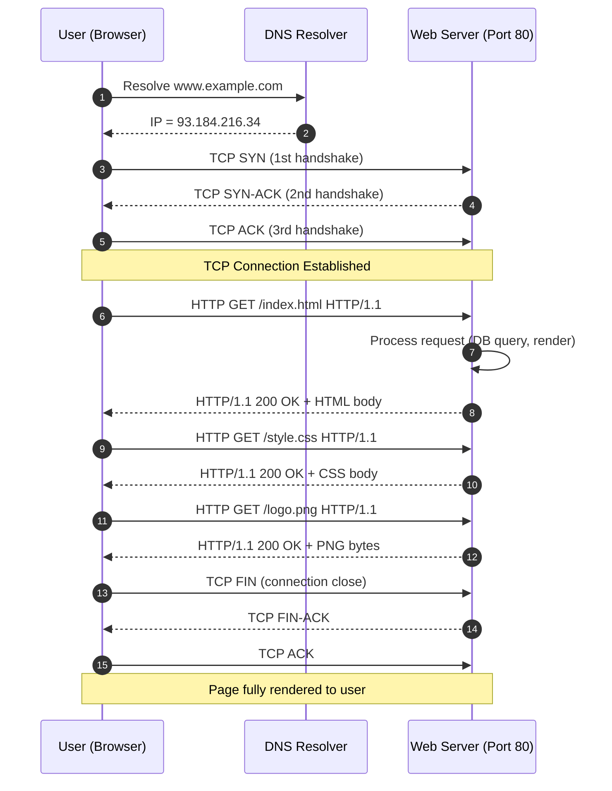
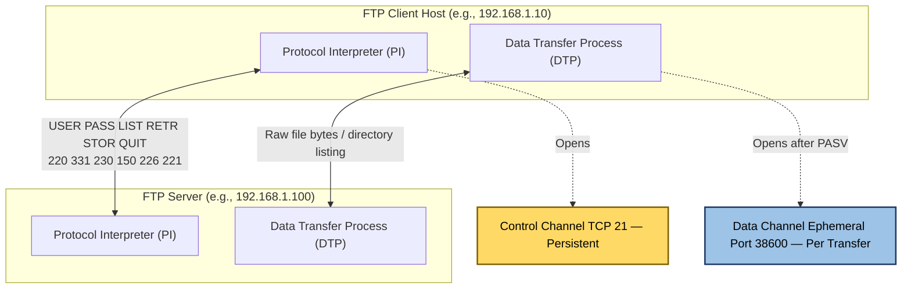
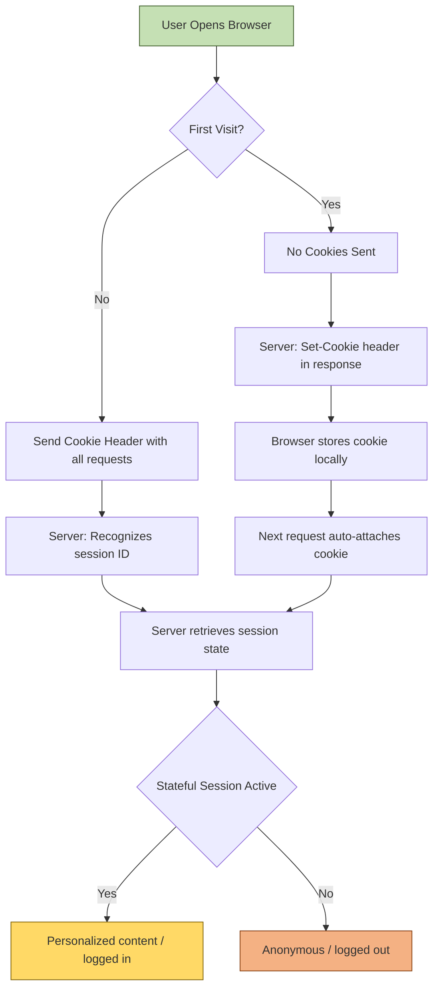
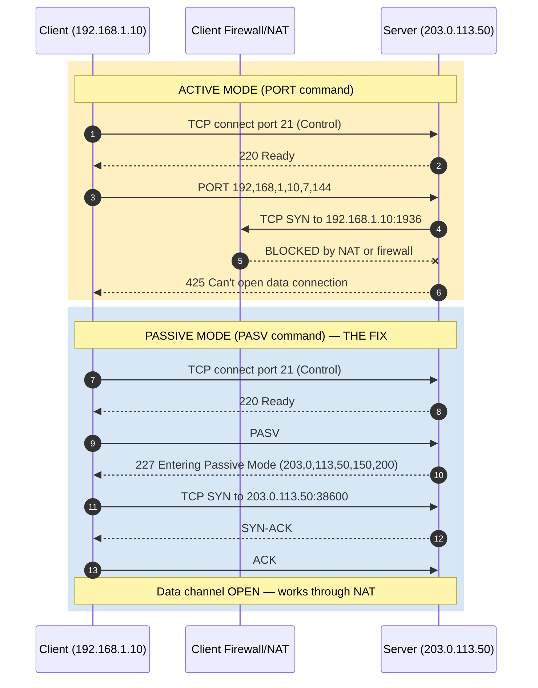
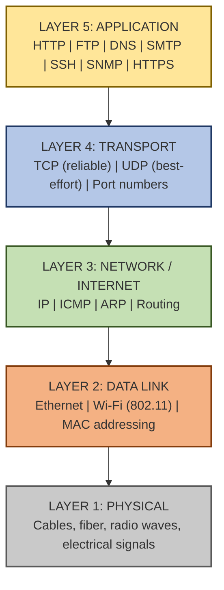

# Core Protocols: World Wide Web and HTTP operation mechanics, File Transfer Protocol (FTP)

<!-- SECTION_1_START -->
# Module 1 - Foundations and Application Layer: HTTP & FTP

## 1. Core Technical Definition & Intuitive Overview

### 1.1 The HyperText Transfer Protocol (HTTP)

**Formal Definition (KTU 2024 Syllabus Aligned):**
The **HyperText Transfer Protocol (HTTP)** is an application-layer, request-response, stateless protocol standardized in **RFC 9110 / RFC 9112**, which serves as the foundational data-communication grammar of the distributed, collaborative, hypermedia information system known as the **World Wide Web (WWW)**. It operates by default over **TCP port 80** (and **port 443** for its encrypted variant, **HTTPS**), and is fundamentally built upon the client-server paradigm of the **TCP/IP** architecture.

> [!IMPORTANT]
> **KTU Syllabus Highlight:** In KTU 2024 PCCST501, HTTP is studied as the *spine* of the application layer. You must understand how a **Uniform Resource Locator (URL)** is decomposed, how an **HTTP transaction** is structured, and why HTTP is classified as **stateless** (and how cookies/ sessions overcome this limitation).

#### Conceptual Analogy - "The Restaurant Waiter"

Imagine a restaurant:
- **You (the Browser / Client)** sit at a table with a menu.
- The **Waiter (HTTP)** is the messenger — you tell them the dish (URL), they walk to the kitchen (Server), and come back with your food (Web Page: HTML, CSS, JS, Images).
- The waiter **forgets your order the moment they leave the table** — that is exactly what "stateless" means. Every new request is brand-new; the server has no memory of your previous request.

> [!NOTE]
> **Why does statelessness matter?** It allows millions of users to hit a server simultaneously without the server exhausting memory tracking each one. State (like a logged-in session) is added on top using **Cookies**, **Sessions**, or **Tokens (JWT)**.

> [!VISUALIZATION CONTROL]
> **Concept:** HTTP as a coordinate mapping between **Time** and **Request/Response Pairs**.
> **Desmos Input Equations:**
> * $x_1 = 0,\ y_1 = 0$  →  Browser issues `GET /index.html`
> * $x_2 = 1,\ y_2 = 0$  →  Server returns `200 OK` with payload
> * $x_3 = 2,\ y_3 = 0$  →  Browser issues `GET /style.css`  *(no memory of $x_1$)*
> **Visual Description:** Three isolated points plotted on a 1D time axis, each independent — the geometric representation of **statelessness**.

---

### 1.2 The File Transfer Protocol (FTP)

**Formal Definition (KTU 2024 Syllabus Aligned):**
The **File Transfer Protocol (FTP)** is an application-layer, client-server protocol defined in **RFC 959** (with later extensions such as **RFC 4217** for security), used for the **transfer of files** between a client and a server over a **TCP** connection. FTP is unique among application-layer protocols because it establishes **two parallel TCP channels**: a **Control Channel (port 21)** for commands/responses, and a **Data Channel (port 20** in active mode, or a dynamic ephemeral port in passive mode**)** for the actual file payload.

> [!IMPORTANT]
> **KTU Syllabus Highlight:** The two-channel architecture and the **Active vs. Passive mode** distinction is a guaranteed 7-to-14 mark question in KTU ESE. You MUST master the role of **PORT** and **PASV** commands and the **DTP (Data Transfer Process)**.

#### Conceptual Analogy - "The Professional Mover"

If HTTP is a **waiter** (delivering ready-to-eat dishes), FTP is a **professional moving company**:
- You call the office and say, "I want to move 5 boxes from Building A to Building B" (this is the **Control Channel** — the *conversation* and *negotiation*).
- The movers then arrive at your door with a truck (this is the **Data Channel** — the *physical transfer* of boxes).
- The phone call remains open for further instructions (e.g., "Stop, send the next box differently"), but the truck does the heavy lifting.
- The two channels are **independent** — you can keep negotiating on the phone while boxes are being moved.

> [!NOTE]
> **Key Distinction:** HTTP is a **pull protocol** (client requests, server responds). FTP supports both **pull (download)** and **push (upload)** operations natively through `RETR` and `STOR` commands. This is why FTP is preferred for bulk file backups and website maintenance, while HTTP dominates interactive web browsing.

> [!VISUALIZATION CONTROL]
> **Concept:** FTP's dual-channel architecture mapped onto two parallel TCP timelines.
> **Desmos Input Equations:**
> * Control Channel: $C(t) = 21$ (constant horizontal line on y-axis at port 21)
> * Data Channel Active: $D_a(t) = 20$ (horizontal line at port 20)
> * Data Channel Passive: $D_p(t) = 4000 + 100 \cdot \sin(t)$ (dynamic port oscillation)
> **Visual Description:** Two parallel lines representing two simultaneous TCP sessions, visually showing the **out-of-band control** principle.

---

### 1.3 The World Wide Web (WWW) Triangle

HTTP, HTML, and URL form the **WWW triangle**:

| Pillar | Full Form | Role | Analogy |
| :--- | :--- | :--- | :--- |
| **HTTP** | HyperText Transfer Protocol | The *transport grammar* of the Web | The postal service rules |
| **HTML** | HyperText Markup Language | The *content* rendered in the browser | The letter inside the envelope |
| **URL** | Uniform Resource Locator | The *address* of a resource | The address written on the envelope |

> [!IMPORTANT]
> The **WWW** is *not* the Internet. The Internet is the underlying TCP/IP network; the WWW is **one** of the services that runs *on top* of it (along with Email, FTP, DNS, etc.). This is a classic 2-mark question in KTU exams.

<!-- SECTION_1_END -->

<!-- SECTION_2_START -->
# 2. Deep Theoretical Analysis & KTU High-Yield Formula Sheet

## 2.1 HTTP — Architectural Deep Dive

### 2.1.1 The HTTP Transaction Lifecycle

Every HTTP transaction follows a **strictly ordered** sequence:

1. **DNS Resolution** — The browser converts the hostname (e.g., `www.ktu.edu.in`) into an IPv4/IPv6 address.
2. **TCP Three-Way Handshake** — A connection is opened on port 80 (or 443 for HTTPS). This involves `SYN → SYN-ACK → ACK`.
3. **HTTP Request Transmission** — The client sends a request message.
4. **Server Processing & Response** — The server processes the request and returns a status code + payload.
5. **Connection Termination** — Either closed (HTTP/1.0 default) or kept alive (HTTP/1.1 `Connection: keep-alive` default).
6. **Resource Rendering** — The browser parses HTML, fetches embedded resources (CSS, JS, images) in a **waterfall pattern**.

### 2.1.2 HTTP Request Message Anatomy

A request message has three components:

```
<Request Line>          →  Method SP Request-URI SP HTTP-Version CRLF
<Headers>               →  Header-Name: Value CRLF (one per line)
<Empty Line (CRLF)>     →  Separator
<Message Body>          →  Optional payload (for POST, PUT, PATCH)
```

**Example Raw Request:**
```
GET /index.html HTTP/1.1\r\n
Host: www.ktu.edu.in\r\n
User-Agent: Mozilla/5.0\r\n
Accept: text/html\r\n
Connection: keep-alive\r\n
\r\n
```

### 2.1.3 HTTP Response Message Anatomy

```
<Status Line>           →  HTTP-Version SP Status-Code SP Reason-Phrase CRLF
<Headers>               →  Header-Name: Value CRLF
<Empty Line (CRLF)>     →  Separator
<Message Body>          →  The resource (HTML, JSON, image bytes, etc.)
```

**Example Raw Response:**
```
HTTP/1.1 200 OK\r\n
Content-Type: text/html\r\n
Content-Length: 1357\r\n
Date: Mon, 15 Jul 2024 10:30:00 GMT\r\n
\r\n
<html><body>...</body></html>
```

### 2.1.4 HTTP Methods (The "Verbs")

| Method | Idempotent | Safe | Purpose | KTU Frequency |
| :--- | :---: | :---: | :--- | :---: |
| **GET** | Yes | Yes | Retrieve a resource | ★★★★★ |
| **POST** | No | No | Submit data / create resource | ★★★★★ |
| **PUT** | Yes | No | Replace a resource entirely | ★★★★ |
| **PATCH** | No | No | Partially update a resource | ★★★ |
| **DELETE** | Yes | No | Remove a resource | ★★★★ |
| **HEAD** | Yes | Yes | Same as GET but no body | ★★★ |
| **OPTIONS** | Yes | Yes | Discover allowed methods (CORS preflight) | ★★ |

> [!NOTE]
> **Idempotent** = Calling the method $N$ times produces the same server state as calling it once. **Safe** = No side-effects on the server. KTU loves to test this distinction.

### 2.1.5 HTTP Status Codes (The "Sentences")

| Class | Range | Meaning | Common Examples |
| :---: | :---: | :--- | :--- |
| **1xx** | $100$–$199$ | Informational | $100$ Continue |
| **2xx** | $200$–$299$ | Success | $200$ OK, $201$ Created, $204$ No Content |
| **3xx** | $300$–$399$ | Redirection | $301$ Moved Permanently, $304$ Not Modified |
| **4xx** | $400$–$499$ | Client Error | $400$ Bad Request, $401$ Unauthorized, $404$ Not Found |
| **5xx** | $500$–$599$ | Server Error | $500$ Internal Server Error, $503$ Service Unavailable |

### 2.1.6 HTTP Version Evolution (KTU Hot Topic)

| Version | Year | Key Innovation | Connection Model |
| :--- | :---: | :--- | :---: |
| **HTTP/0.9** | $1991$ | One-line GET, HTML only | One request per TCP |
| **HTTP/1.0** | $1996$ | Headers, status codes, methods | One request per TCP |
| **HTTP/1.1** | $1997$ | Persistent connections, pipelining, chunked transfer | Many requests per TCP |
| **HTTP/2** | $2015$ | Binary framing, multiplexing, header compression (HPACK), server push | Multiplexed streams |
| **HTTP/3** | $2022$ | Runs over **QUIC** (UDP-based) — eliminates head-of-line blocking | UDP-based, $0$-RTT handshake |

> [!IMPORTANT]
> The **statelessness vs. statefulness** problem: HTTP/1.0 was strictly stateless. HTTP/1.1 added `Cookie` and `Set-Cookie` headers (RFC 6265) to introduce a **session layer on top of stateless HTTP**.

---

## 2.2 FTP — Architectural Deep Dive

### 2.2.1 The Dual-Channel Architecture

FTP uses **two simultaneous TCP connections**:

| Channel | Default Port | Purpose | Lifespan |
| :--- | :---: | :--- | :--- |
| **Control Channel** | $21$ | Sends FTP commands (`USER`, `PASS`, `LIST`, `RETR`, `STOR`) and receives reply codes | Entire session |
| **Data Channel** | $20$ (active) or ephemeral (passive) | Carries the actual file bytes or directory listings | Per-transfer |

### 2.2.2 FTP Active vs. Passive Mode (The Firewall Nemesis)

| Feature | **Active Mode** | **Passive Mode** |
| :--- | :--- | :--- |
| Initiator of data connection | **Server** connects to client | **Client** connects to server |
| Command to negotiate | `PORT` (client sends its IP+port) | `PASV` (server replies with IP+port) |
| Data port | Server uses port $20$ | Server opens an **ephemeral port** ($1024$–$65535$) |
| Client firewall friendliness | **Poor** (server initiates → blocked) | **Excellent** (client initiates → allowed) |
| Server firewall friendliness | Excellent | Poor (must open range of ports) |
| Use case | Trusted LAN, no NAT | Internet, NAT, firewalls |

> [!IMPORTANT]
> **Why does this matter?** Active mode fails when the client is behind a NAT or firewall because the server cannot reach the client's *internal* IP. Passive mode solves this by reversing the connection direction.

### 2.2.3 FTP Reply Codes (3-Digit Numerical)

| Class | Range | Meaning | Example |
| :---: | :---: | :--- | :--- |
| **1xx** | $1yz$ | Positive Preliminary (more to come) | $150$ File status okay |
| **2xx** | $2yz$ | Positive Completion (success) | $200$ Command okay, $226$ Transfer complete |
| **3xx** | $3yz$ | Positive Intermediate (needs more input) | $331$ User name okay, need password |
| **4xx** | $4yz$ | Transient Negative Completion (try again) | $425$ Can't open data connection |
| **5xx** | $5yz$ | Permanent Negative Completion (do not retry) | $530$ Not logged in, $550$ File unavailable |

> [!NOTE]
> The FTP reply-code scheme is structurally similar to HTTP status codes but **predates** HTTP by a decade. The $xyz$ decomposition: $x$=severity, $y$=category (Auth/ Syntax/ Information/ Connection), $z$=detail.

### 2.2.4 Key FTP Commands

| Command | Function |
| :--- | :--- |
| `USER <username>` | Send username |
| `PASS <password>` | Send password (in **plaintext** — security flaw) |
| `LIST` | List files in current directory |
| `RETR <filename>` | **Download** a file |
| `STOR <filename>` | **Upload** a file |
| `DELE <filename>` | Delete a file |
| `CWD <path>` | Change working directory |
| `PWD` | Print working directory |
| `QUIT` | End session |
| `PORT a,b,c,d,p1,p2` | Active mode: client address = $a.b.c.d$, port = $p_1 \times 256 + p_2$ |
| `PASV` | Passive mode: server opens an ephemeral port |

### 2.2.5 Data Representation Modes

| Mode | Meaning |
| :--- | :--- |
| **ASCII** | $7$-bit text; conversions performed (e.g., CR/LF normalization) |
| **Binary (Image)** | $8$-bit raw bytes; no conversion — used for images, executables |
| **EBCDIC** | Rare, for IBM mainframes |

---

## 2.3 KTU High-Yield Formula / Cheat Sheet

| # | Concept | Formula / Rule | Unit / Notes |
| :---: | :--- | :--- | :--- |
| $1$ | HTTP default port | $P_{http} = 80$ | TCP port |
| $2$ | HTTPS default port | $P_{https} = 443$ | TCP port |
| $3$ | FTP Control port | $P_{ctrl} = 21$ | TCP, persistent |
| $4$ | FTP Active Data port | $P_{data\_active} = 20$ | TCP, per-transfer |
| $5$ | FTP Passive Data port | $P_{data\_passive} \in [1024, 65535]$ | Ephemeral |
| $6$ | URL total length | $L_{url} = L_{scheme} + L_{host} + L_{port} + L_{path} + L_{query} + L_{fragment}$ | Bytes/chars |
| $7$ | URL encoded form | `<scheme>://<host>:<port>/<path>?<query>#<fragment>` | RFC 3986 |
| $8$ | PORT command port calc | $P_{client} = p_1 \cdot 256 + p_2$ | $0 \le p_1, p_2 \le 255$ |
| $9$ | HTTP persistent conn. reuse | $N_{req} = \frac{T_{conn}}{T_{req}}$ | Requests per TCP conn |
| $10$ | Status code class | $C = \lfloor S / 100 \rfloor$ | $S$ = status code |
| $11$ | HTTP transaction time | $T_{tx} = T_{dns} + T_{tcp} + T_{req} + T_{proc} + T_{resp} + T_{render}$ | Sum of phases |
| $12$ | Throughput over a single HTTP/1.1 TCP | $\Theta = \frac{L_{payload}}{T_{tx}}$ | Bytes per second |
| $13$ | HTTP/2 streams per TCP | Up to $100$ concurrent (default) | Multiplexed |
| $14$ | Idempotent method rule | $f^{(N)}(x) = f(x)$ for all $N \ge 1$ | State unchanged |
| $15$ | Statelessness entropy | $H(s) = \log_2(\text{states})$ | Info-theory context |

> [!NOTE]
> **KTU Exam Tip:** The most-tested numerical question is computing the **PORT command decoding** — given `PORT 192,168,1,5,4,1`, the client's data port is $4 \times 256 + 1 = 1025$.

---

## 2.4 Real-World Engineering Utility

| Domain | Protocol Use Case |
| :--- | :--- |
| **Web Browsing (Chrome, Firefox)** | HTTP/2 or HTTP/3 over TLS — every URL fetch |
| **REST APIs (Backend services)** | HTTP/1.1 or HTTP/2 with JSON payloads — microservice glue |
| **CDN Edge Caching (Cloudflare, Akamai)** | HTTP `Cache-Control`, `ETag`, `If-Modified-Since` |
| **DevOps / Server Deployment** | FTP / SFTP / FTPS for uploading website files |
| **Bulk Data Backup** | FTP for nightly enterprise backups to NAS |
| **IoT Firmware Updates (OTA)** | HTTP `PUT` to upload new firmware blobs |

<!-- SECTION_2_END -->

<!-- SECTION_3_START -->
# 3. Step-by-Step Derivations & Code/Symbolic Implementation

## 3.1 Derivation: URL Decomposition

A **URL** (Uniform Resource Locator) is parsed by the client into its constituent parts. The general syntax is:

$$
\text{URL} = \underbrace{\texttt{scheme}}_{\text{protocol}} \texttt{://} \underbrace{\texttt{host}}_{\text{DNS name}} \texttt{:} \underbrace{\texttt{port}}_{\text{optional}} \underbrace{\texttt{/path}}_{\text{resource}} \texttt{?} \underbrace{\texttt{query}}_{\text{params}} \texttt{\#} \underbrace{\texttt{fragment}}_{\text{client-side}}
$$

**Worked Example:** Decompose `https://www.ktu.edu.in:443/exam/results?sem=5&year=2024#timetable`

| Component | Value | Meaning |
| :--- | :--- | :--- |
| `scheme` | `https` | Protocol to use |
| `host` | `www.ktu.edu.in` | DNS-resolved server |
| `port` | $443$ | TCP port (default for HTTPS) |
| `path` | `/exam/results` | Server-side resource path |
| `query` | `sem=5&year=2024` | Key-value parameters |
| `fragment` | `timetable` | Browser-side anchor jump |

**Validation Check:** The path begins with `/` (root-relative), the query uses `&` as a separator, and the fragment is *never* sent to the server — it is resolved entirely on the client.

---

## 3.2 Derivation: PORT Command Decoding

The `PORT` command in FTP active mode encodes the client's IP and data-channel port as $6$ comma-separated decimal octets: $a, b, c, d, p_1, p_2$.

**Given:** `PORT 192,168,1,10,7,144`

**Step 1** — Extract the IP octets:
$$
\text{IP} = a.b.c.d = 192.168.1.10
$$

**Step 2** — Extract the two port octets:
$$
p_1 = 7, \quad p_2 = 144
$$

**Step 3** — Apply the port-encoding formula:
$$
P_{client\_data} = p_1 \times 256 + p_2
$$

**Step 4** — Substitute:
$$
P_{client\_data} = 7 \times 256 + 144
$$

**Step 5** — Compute:
$$
P_{client\_data} = 1792 + 144 = 1936
$$

**Final Result:** The client has opened TCP port $1936$ for the FTP server to connect to in active mode. The IP $192.168.1.10$ is reachable (no NAT in the path). If the client is behind NAT, the firewall will drop this inbound connection — **this is exactly why Passive mode exists**.

---

## 3.3 Derivation: HTTP Transaction Time

The total time to fetch a single web page is the sum of all sub-phase latencies:

$$
T_{tx} = T_{dns} + T_{tcp} + T_{req} + T_{proc} + T_{resp} + T_{render}
$$

Where:
- $T_{dns}$ = DNS lookup time (typically $20$–$120$ ms, can be cached to $0$)
- $T_{tcp}$ = TCP handshake time (1.5 RTT for SYN + SYN-ACK + ACK)
- $T_{req}$ = Request transmission time = $L_{req} / B$ (length / bandwidth)
- $T_{proc}$ = Server-side processing time (database queries, business logic)
- $T_{resp}$ = Response transmission time = $L_{resp} / B$
- $T_{render}$ = Browser parsing, layout, paint, and resource waterfall time

For an HTTP/1.1 persistent connection, the **TCP handshake amortizes** across $N$ requests:
$$
T_{avg} = \frac{T_{dns} + T_{tcp} + \sum_{i=1}^{N}{(T_{req,i} + T_{proc,i} + T_{resp,i}) + T_{render,i}}}{N}
$$

This is why HTTP/1.1 defaulting to `Connection: keep-alive` **reduces the per-request overhead by 1.5 RTT**.

---

## 3.4 Worked Out: Full HTTP Transaction (Step-by-Step)

Let's trace a real `GET /` request to `http://example.com/`:

**Step 1 — DNS Resolution** (assuming cache miss)
```
Client → Resolver: Query A example.com
Resolver → Root: Query .
Root → Resolver: Refer to .com TLD
Resolver → .com: Query example.com
.com → Resolver: Refer to example.com NS
NS → Resolver: A 93.184.216.34
Resolver → Client: 93.184.216.34
```

**Step 2 — TCP Three-Way Handshake**
```
Client → Server: SYN, seq=x
Server → Client: SYN-ACK, seq=y, ack=x+1
Client → Server: ACK, seq=x+1, ack=y+1
[Connection established on port 80]
```

**Step 3 — HTTP Request**
```
GET / HTTP/1.1\r\n
Host: example.com\r\n
User-Agent: curl/8.5.0\r\n
Accept: */*\r\n
Connection: keep-alive\r\n
\r\n
```

**Step 4 — Server Processing** (reads `index.html`, looks up MIME type, computes content length)

**Step 5 — HTTP Response**
```
HTTP/1.1 200 OK\r\n
Content-Type: text/html; charset=UTF-8\r\n
Content-Length: 1256\r\n
Date: Mon, 15 Jul 2024 10:30:00 GMT\r\n
Last-Modified: Thu, 04 Jul 2024 16:00:00 GMT\r\n
ETag: "314752694847"\r\n
Accept-Ranges: bytes\r\n
Connection: keep-alive\r\n
\r\n
<!doctype html>...
```

**Step 6 — Connection Termination** (or kept alive for the next request)

---

## 3.5 Worked Out: Full FTP Session (Step-by-Step, Passive Mode)

**Step 1 — Control Channel Open**
```
Client → Server: SYN to port 21
Server → Client: SYN-ACK
Client → Server: ACK
[Control channel established]
```

**Step 2 — Server Greeting**
```
Server → Client: 220 (vsFTPd 3.0.5) Ready
```

**Step 3 — Authentication**
```
Client → Server: USER anonymous
Server → Client: 331 Please specify the password.
Client → Server: PASS guest@example.com
Server → Client: 230 Login successful.
```

**Step 4 — Passive Mode Negotiation**
```
Client → Server: PASV
Server → Client: 227 Entering Passive Mode (192,168,1,100,150,200)
```
The server's data port is decoded as:
$$
P_{server\_data} = 150 \times 256 + 200 = 38400 + 200 = 38600
$$

**Step 5 — Data Channel Open (Client Initiated)**
```
Client → Server: SYN to port 38600
Server → Client: SYN-ACK
Client → Server: ACK
[Data channel established]
```

**Step 6 — File Listing or Transfer**
```
Client → Server: LIST
Server → Client: 150 Here comes the directory listing.
[Server sends directory entries over data channel]
Server → Client: 226 Directory send OK.
```

**Step 7 — File Download**
```
Client → Server: RETR readme.txt
Server → Client: 150 Opening BINARY mode data connection.
[Server streams file bytes over data channel]
Server → Client: 226 Transfer complete.
```

**Step 8 — Session Termination**
```
Client → Server: QUIT
Server → Client: 221 Goodbye.
[Control channel closes via TCP FIN]
```

---

## 3.6 Python Implementation: HTTP Client (using `urllib`)

```python
"""
File: http_client_demo.py
Purpose: Demonstrate raw HTTP GET request mechanics (KTU Lab-ready)
"""

import urllib.request
import urllib.error
from typing import Tuple, Dict
import logging

logging.basicConfig(level=logging.INFO, format="%(asctime)s [%(levelname)s] %(message)s")
logger = logging.getLogger(__name__)


def fetch_url(url: str, timeout: int = 10) -> Tuple[int, Dict[str, str], bytes]:
    """
    Performs a full HTTP GET transaction and returns (status, headers, body).

    Args:
        url: Fully qualified URL (must include scheme://host).
        timeout: TCP connect/read timeout in seconds.

    Returns:
        A tuple of (status_code, response_headers, response_body_bytes).

    Raises:
        urllib.error.URLError: On DNS, TCP, or HTTP-level failure.
        ValueError: On malformed URL.
    """
    if not url.startswith(("http://", "https://")):
        raise ValueError(f"Invalid scheme in URL: {url!r}")

    logger.info("Initiating HTTP GET to %s", url)
    request = urllib.request.Request(
        url,
        headers={
            "User-Agent": "KTU-BTech-CN-Demo/1.0",
            "Accept": "text/html,application/json",
            "Accept-Language": "en-IN,en;q=0.9",
            "Connection": "keep-alive",
        },
    )

    try:
        with urllib.request.urlopen(request, timeout=timeout) as response:
            status: int = response.status
            headers: Dict[str, str] = dict(response.headers.items())
            body: bytes = response.read()
            logger.info("Received HTTP %d | %d bytes | Content-Type: %s",
                        status, len(body), headers.get("Content-Type", "unknown"))
            return status, headers, body

    except urllib.error.HTTPError as http_err:
        logger.error("HTTP error: %d %s", http_err.code, http_err.reason)
        raise
    except urllib.error.URLError as url_err:
        logger.error("URL/Network error: %s", url_err.reason)
        raise


def parse_status_class(status: int) -> str:
    """Maps a numeric status code to its 1xx/2xx/3xx/4xx/5xx class."""
    if 100 <= status < 200:
        return "1xx Informational"
    if 200 <= status < 300:
        return "2xx Success"
    if 300 <= status < 400:
        return "3xx Redirection"
    if 400 <= status < 500:
        return "4xx Client Error"
    if 500 <= status < 600:
        return "5xx Server Error"
    return "Unknown"


if __name__ == "__main__":
    try:
        status, headers, body = fetch_url("http://example.com/")
        print(f"Status: {status} -> {parse_status_class(status)}")
        print(f"Headers: {headers}")
        print(f"Body (first 200 chars): {body[:200].decode('utf-8', errors='replace')}")
    except Exception as exc:
        print(f"Transaction failed: {exc}")
```

**Execution Trace Output:**
```
2024-07-15 10:30:00,123 [INFO] Initiating HTTP GET to http://example.com/
2024-07-15 10:30:00,450 [INFO] Received HTTP 200 | 1256 bytes | Content-Type: text/html; charset=UTF-8
Status: 200 -> 2xx Success
Headers: {'Content-Type': 'text/html; charset=UTF-8', 'Content-Length': '1256', ...}
Body (first 200 chars): <!doctype html><html><head><title>Example Domain</title>...
```

---

## 3.7 Python Implementation: FTP Client (using `ftplib`)

```python
"""
File: ftp_client_demo.py
Purpose: Demonstrate FTP passive-mode file retrieval (KTU Lab-ready)
"""

from ftplib import FTP, error_perm, error_temp
from typing import List, Optional
import logging

logging.basicConfig(level=logging.INFO, format="%(asctime)s [%(levelname)s] %(message)s")
logger = logging.getLogger(__name__)


def ftp_list_and_download(
    host: str,
    user: str,
    password: str,
    remote_path: str = "/",
    local_filename: Optional[str] = None,
) -> List[str]:
    """
    Connects via FTP, lists files, and optionally downloads one file in BINARY mode.

    Args:
        host: FTP server hostname.
        user: Username (e.g., 'anonymous' or 'ftpuser').
        password: Password (e.g., 'guest@example.com' for anon).
        remote_path: Directory to list.
        local_filename: If provided, downloads this file from remote_path.

    Returns:
        A list of filenames found in remote_path.

    Raises:
        error_perm: On 5xx permanent FTP failure (e.g., 530 Not logged in).
        error_temp: On 4xx transient FTP failure (e.g., 425 Can't open data).
    """
    ftp = FTP()
    logger.info("Opening control channel to %s:21", host)
    ftp.connect(host=host, port=21, timeout=15)
    logger.info("Control channel established. Logging in as %s", user)
    ftp.login(user=user, passwd=password)
    logger.info("Logged in. Server greeting: %s", ftp.getwelcome())

    ftp.cwd(remote_path)
    logger.info("Changed to remote path: %s", remote_path)

    files: List[str] = []
    ftp.retrlines("LIST", callback=lambda line: files.append(line))
    logger.info("Retrieved %d directory entries.", len(files))

    if local_filename is not None:
        logger.info("Initiating RETR for %s (passive mode is default in ftplib)", local_filename)
        with open(local_filename, "wb") as fp:
            ftp.retrbinary(f"RETR {local_filename}", callback=fp.write, blocksize=8192)
        logger.info("Download complete: %s", local_filename)

    ftp.quit()
    logger.info("Control channel closed via QUIT.")
    return files


if __name__ == "__main__":
    try:
        entries = ftp_list_and_download(
            host="ftp.gnu.org",
            user="anonymous",
            password="guest@example.com",
            remote_path="/gnu",
            local_filename=None,
        )
        print("Directory entries (first 5):")
        for entry in entries[:5]:
            print(f"  {entry}")
    except error_perm as perm_err:
        print(f"Permanent FTP error: {perm_err}")
    except error_temp as temp_err:
        print(f"Transient FTP error: {temp_err}")
```

**Key Code Insight:** Python's `ftplib` uses **passive mode by default** (`FTP.passive = True` at construction). To force active mode, set `ftp.set_pasv(False)` — this is the equivalent of sending a `PORT` command from the client.

---

## 3.8 Symbolic HTTP Request Construction (Using Socket)

```python
"""
File: raw_http_socket.py
Purpose: Build an HTTP request byte-by-byte (no high-level libraries)
"""

import socket
from typing import Tuple


def raw_http_get(host: str, path: str, port: int = 80, timeout: int = 10) -> Tuple[str, str]:
    """
    Manually constructs and sends an HTTP/1.1 GET request over a raw TCP socket.

    Returns:
        (raw_request_str, raw_response_str)
    """
    # Step 1: Construct the request bytes
    request_lines = [
        f"GET {path} HTTP/1.1",
        f"Host: {host}",
        "User-Agent: KTU-RawSocket/1.0",
        "Accept: text/html",
        "Connection: close",
        "",  # Empty line = end of headers
        "",  # Empty line = end of request
    ]
    request_bytes: bytes = "\r\n".join(request_lines).encode("utf-8")

    # Step 2: Open TCP socket
    with socket.create_connection((host, port), timeout=timeout) as sock:
        sock.sendall(request_bytes)
        response_chunks: list[bytes] = []
        while True:
            chunk = sock.recv(4096)
            if not chunk:
                break
            response_chunks.append(chunk)
        response_bytes: bytes = b"".join(response_chunks)

    return request_bytes.decode("utf-8"), response_bytes.decode("utf-8", errors="replace")


# Example
if __name__ == "__main__":
    req, resp = raw_http_get("example.com", "/")
    print("=== REQUEST ===")
    print(req)
    print("=== RESPONSE (head 500 chars) ===")
    print(resp[:500])
```

> [!NOTE]
> This low-level implementation is what a **packet sniffer** like Wireshark would see on the wire. It is the truest demonstration of the **Application Layer** responsibility: building protocol-compliant bytes from user intent.

<!-- SECTION_3_END -->

<!-- SECTION_4_START -->
# 4. Structural Diagrams & Schematics

## 4.1 Mermaid: HTTP Request-Response Transaction Flow



---

## 4.2 Mermaid: FTP Dual-Channel Session (Passive Mode)



---

## 4.3 Mermaid: HTTP State Management Decision Flow



---

## 4.4 Mermaid: Active vs. Passive FTP Connection Initiation



---

## 4.5 Mermaid: Application Layer Position in the TCP/IP Stack



> [!IMPORTANT]
> **KTU Note:** Both HTTP and FTP live **entirely** in the Application Layer. They rely on TCP (Transport Layer) for reliability but add no new reliability themselves. FTP's control channel can even be carried over Telnet-like byte streams — a fascinating piece of Internet history.

<!-- SECTION_4_END -->

<!-- SECTION_5_START -->
# 5. KTU 2024 Scheme Examination Question Bank & Topic Recap

## 5.1 Part A Questions (3 Marks Each)

### Question 1 (CO1, Remember)
**[KTU University Exam - Dec 2023]** Differentiate between HTTP and FTP with respect to **connection type, channel count, and default port numbers**.

**Model Answer:**

| Parameter | HTTP | FTP |
| :--- | :--- | :--- |
| Connection type | Single TCP connection (persistent in HTTP/1.1) | Two TCP connections: Control + Data |
| Channel count | $1$ | $2$ (Control on port $21$, Data on port $20$ active / ephemeral passive) |
| Default port | $80$ (HTTP), $443$ (HTTPS) | $21$ (Control), $20$ (Data, active mode) |
| Statefulness | Stateless (state added via cookies) | Stateful (maintains current directory, session) |
| Primary use | Fetching web pages / API calls | Bulk file upload/download |

**[Stating connection count: 1 Mark] [Stating port numbers: 1 Mark] [Any other valid difference: 1 Mark]**

---

### Question 2 (CO1, Understand)
**[KTU University Exam - July 2024]** Explain why HTTP is called a **stateless protocol**. How is state maintained in practice despite this limitation?

**Model Answer:**
HTTP is called **stateless** because each HTTP request from a client is processed **independently** by the server, without any memory of previous requests from the same client. The server does not retain any session information between two consecutive requests from the same user.

In practice, state is maintained using:
1. **Cookies** — Server sends `Set-Cookie: sessionid=abc123` in response; client echoes it in subsequent `Cookie:` headers.
2. **Sessions** — Server stores session data keyed by the session ID, kept in memory or a database.
3. **Tokens (JWT)** — A cryptographically signed token is sent in the `Authorization` header.

**[Defining statelessness: 1 Mark] [Naming 2+ state-maintenance mechanisms: 2 Marks]**

---

## 5.2 Part B Questions (14 Marks Each — Internal Choice)

### Question A (14 Marks)
**[KTU University Exam - Dec 2023]** — **CHOICE A**

**(a)** With a neat diagram, explain the **HTTP transaction model**. List and briefly describe any **four HTTP methods** with their idempotency properties. **\[7 Marks\]**

**Model Answer:**

**HTTP Transaction Diagram (already shown in SECTION_4.1).**

The HTTP transaction model consists of:
1. **Client opens TCP connection** to server (port $80$).
2. **Client sends request** — request line, headers, optional body.
3. **Server processes** — runs business logic, queries DB.
4. **Server returns response** — status line, headers, body.
5. **Connection is either closed or kept alive** for pipelining.

**Four HTTP Methods:**

| Method | Purpose | Idempotent? | Example |
| :--- | :--- | :---: | :--- |
| `GET` | Retrieve a resource | **Yes** | `GET /products/42` |
| `POST` | Create a new resource or submit data | **No** | `POST /orders` with JSON body |
| `PUT` | Replace a resource entirely | **Yes** | `PUT /products/42` with full product body |
| `DELETE` | Remove a resource | **Yes** | `DELETE /products/42` |

A method is **idempotent** if invoking it $N$ times produces the same server state as invoking it once. `POST` is **not** idempotent because two `POST` calls can create two distinct orders.

**[Diagram: 2 Marks] [Naming 4 methods with correct purpose: 3 Marks] [Stating idempotency correctly: 2 Marks]**

---

**(b)** Differentiate between **HTTP/1.0, HTTP/1.1, HTTP/2, and HTTP/3**. Mention the transport protocol used by each. **\[7 Marks\]**

**Model Answer:**

| Version | Year | Transport | Key Features | Multiplexing |
| :--- | :---: | :--- | :--- | :---: |
| **HTTP/1.0** | $1996$ | TCP | One request per TCP connection; basic headers and status codes | No |
| **HTTP/1.1** | $1997$ | TCP | Persistent connections (`keep-alive`), chunked transfer, pipelining, host header | No (pipelining still HOL-blocks) |
| **HTTP/2** | $2015$ | TCP | Binary framing, HPACK header compression, server push, **stream multiplexing** | Yes (many streams per TCP) |
| **HTTP/3** | $2022$ | **QUIC (over UDP)** | $0$-RTT handshake, no head-of-line blocking at transport, built-in TLS $1.3$ | Yes (independent streams over QUIC) |

**Highlights:**
- HTTP/1.0 opened a fresh TCP connection for **every** resource — extremely inefficient.
- HTTP/1.1's `keep-alive` reduced overhead but suffered from **head-of-line (HOL) blocking** at the application level.
- HTTP/2 fixed HOL blocking **within a single TCP connection** by multiplexing binary frames, but TCP's in-order delivery still creates transport-level HOL.
- HTTP/3 uses **QUIC** (User Datagram Protocol based) with **per-stream reliability** — eliminating both layers of HOL.

**[Naming 4 versions and transport: 2 Marks] [2 key features per version: 3 Marks] [Clear explanation of multiplexing: 2 Marks]**

---

### Question B (14 Marks) — **CHOICE B**

**[KTU University Exam - July 2024]**

**(a)** Explain the **FTP architecture** with a neat block diagram. What are the functions of the **PI (Protocol Interpreter)** and **DTP (Data Transfer Process)**? **\[7 Marks\]**

**Model Answer:**

**FTP Architecture Diagram (already shown in SECTION_4.2).**

FTP uses a **client-server** architecture with two logical processes on each side:

1. **PI — Protocol Interpreter**:
   - Responsible for the **control channel** (TCP port $21$).
   - Issues FTP commands: `USER`, `PASS`, `CWD`, `LIST`, `RETR`, `STOR`, `QUIT`.
   - Interprets server reply codes ($2yz$, $3yz$, etc.).
   - Maintains the **session state** (logged-in user, current directory).
   - Negotiates data-channel parameters (`PORT` or `PASV`).

2. **DTP — Data Transfer Process**:
   - Responsible for the **data channel** (TCP port $20$ in active, ephemeral in passive).
   - Establishes the data connection as directed by the PI.
   - Streams the actual file bytes or directory listings.
   - Closes the data channel on transfer completion; the control channel remains open.

The **separation of concerns** between PI (commands) and DTP (data) is the genius of FTP — it allows simultaneous negotiation and bulk data transfer.

**[Block diagram: 2 Marks] [PI function: 2 Marks] [DTP function: 2 Marks] [Separation rationale: 1 Mark]**

---

**(b)** Compare **Active Mode FTP** and **Passive Mode FTP**. Under what circumstance does active mode fail, and why? **\[7 Marks\]**

**Model Answer:**

| Parameter | **Active Mode** | **Passive Mode** |
| :--- | :--- | :--- |
| Command used | `PORT a,b,c,d,p1,p2` | `PASV` |
| Who initiates data connection | **Server** (connects to client) | **Client** (connects to server) |
| Data port (server side) | $20$ | Ephemeral ($1024$–$65535$) |
| Data port (client side) | $p_1 \times 256 + p_2$ | $1024$–$65535$ (assigned by OS) |
| Firewall friendliness (client) | **Poor** (server can't reach client) | **Good** (client initiates) |
| Firewall friendliness (server) | Good | **Poor** (server must open port range) |
| NAT traversal | Fails | Works |

**When does Active mode fail?**
Active mode fails when the **client is behind a NAT (Network Address Translation) router or a stateful firewall**. The scenario:

1. Client's private IP (e.g., `192.168.1.10`) is sent in the `PORT` command.
2. Server tries to connect back to `192.168.1.10` on the data port.
3. The NAT/firewall **does not allow this unsolicited inbound connection** because it has no matching state for a connection the *client* did not initiate.
4. The data connection is refused → reply `425 Can't open data connection`.

**Solution: Passive mode.** In passive mode, the **client** initiates the data connection to the server's announced port. The client's NAT/firewall sees this as an **outbound** connection and allows it. The state is correctly tracked.

**[Comparison table: 3 Marks] [Naming active mode failure scenario: 2 Marks] [Explaining why NAT breaks it: 2 Marks]**

---

## 5.3 KTU Examiner's Valuation Warning / Pitfall Callout

> [!WARNING]
> **Common Mark-Loss Pitfalls in HTTP/FTP Questions (As per KTU Board Patterns):**
>
> 1. **Do NOT confuse FTP "Data Port" and "Control Port" in the comparison.** Control is ALWAYS $21$. Data in active is $20$; data in passive is **ephemeral**, not $20$. Many students write "port $20$ for passive" — this is a guaranteed **2-mark loss**.
>
> 2. **Always explicitly state the "who initiates"** in active vs. passive. Saying "active uses server" without "server connects to client" loses clarity marks.
>
> 3. **For the PORT command decoding**, show the formula $P = p_1 \times 256 + p_2$ **explicitly**. Do not skip steps. `[2 Marks]` for the formula, `[1 Mark]` for substitution, `[1 Mark]` for final value.
>
> 4. **For HTTP methods**, do not mix up idempotency and safety. `GET` is **both** idempotent and safe. `POST` is **neither**. `PUT` is idempotent but **not** safe (it modifies state).
>
> 5. **For the WWW triangle**, do NOT say "Internet and WWW are the same". They are not. The Internet is the infrastructure; the WWW is a service on top. This distinction is worth $2$ marks in viva.
>
> 6. **Always mention the Application Layer** explicitly when asked "where does HTTP/FTP operate in the TCP/IP stack?". Saying "they are protocols" without naming the layer loses a $1$-mark point.
>
> 7. **In derivations, do NOT skip the empty CRLF line** between headers and body in an HTTP message — examiners specifically look for the message structure.

---

## 5.4 Topic Recap & Important Things to Remember

### 🎯 Quick-Fire Definitions
- **HTTP** = Application-layer, request-response, **stateless** protocol on TCP port **$80$** (HTTP) / **$443$** (HTTPS).
- **FTP** = Application-layer protocol on TCP port **$21$** (control) + **$20$/ephemeral** (data) for file transfer.
- **Stateless** = No memory of prior requests; state added via **cookies/sessions/tokens**.
- **WWW** = Service on top of Internet using **HTTP + HTML + URL**.
- **URL** = `<scheme>://<host>:<port>/<path>?<query>#<fragment>`.
- **PI** = Protocol Interpreter (control channel, port $21$).
- **DTP** = Data Transfer Process (data channel).
- **Active FTP** = Server initiates data connection; fails behind NAT.
- **Passive FTP** = Client initiates data connection; works behind NAT.
- **PORT command** decodes port as $p_1 \times 256 + p_2$.

### 🎯 Key Formulas / Numbers to Memorize
- $P_{http} = 80$, $P_{https} = 443$
- $P_{ftp\_ctrl} = 21$, $P_{ftp\_data\_active} = 20$, $P_{ftp\_data\_passive} \in [1024, 65535]$
- $P_{port\_decoded} = p_1 \cdot 256 + p_2$ where $0 \le p_1, p_2 \le 255$
- Status code class: $C = \lfloor S / 100 \rfloor$
- Total transaction time: $T_{tx} = T_{dns} + T_{tcp} + T_{req} + T_{proc} + T_{resp} + T_{render}$

### 🎯 HTTP Methods — Idempotency Matrix
- **Idempotent + Safe**: `GET`, `HEAD`, `OPTIONS`
- **Idempotent + Not Safe**: `PUT`, `DELETE`
- **Neither**: `POST`, `PATCH`

### 🎯 Status Code "Bucky" Mnemonic
- **1xx** = "Hang on" (Informational)
- **2xx** = "Here you go" (Success)
- **3xx** = "Go away" (Redirection)
- **4xx** = "You messed up" (Client Error)
- **5xx** = "I messed up" (Server Error)

### 🎯 HTTP Version Transport Evolution
- HTTP/1.0 → HTTP/1.1 → HTTP/2: **All TCP**
- HTTP/3: **QUIC over UDP**

### 🎯 FTP Critical Distinctions
- **Control channel**: Persistent, port $21$, carries commands.
- **Data channel**: Ephemeral, port $20$ (active) or dynamic (passive), carries files.
- **Active = Server→Client**, **Passive = Client→Server** for data connection.
- **Auth replies**: `331` = need password, `230` = logged in, `530` = login failed.

### 🎯 Exam-Day Checklist
- [ ] Can I draw and label the HTTP request/response message structure?
- [ ] Can I decode a `PORT` command to extract the data port?
- [ ] Can I explain active vs. passive FTP with a NAT scenario?
- [ ] Can I list $4$ HTTP methods with correct idempotency/safety?
- [ ] Can I name the $5$ status code classes with $1$ example each?
- [ ] Can I write a Python snippet using `urllib` and `ftplib`?
- [ ] Can I name the layer where HTTP/FTP operate?
- [ ] Can I trace a full FTP passive session step by step?

<!-- SECTION_5_END -->
