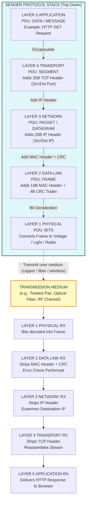
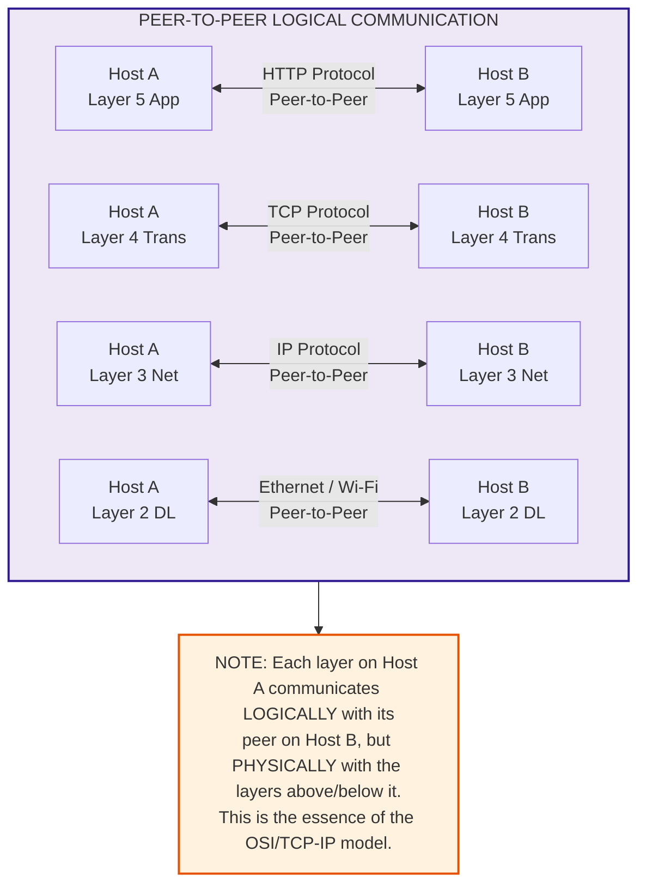

# Network Basics: Overview of the Internet, Protocol layering, and the encapsulation cycle

<!-- SECTION_1_START -->

# 1. Foundations of Computer Networks: Internet, Protocol Layering & Encapsulation

## 1.1 What is the Internet?

From the **KTU 2024 Scheme (PCCST501)** perspective, the **Internet** is formally defined as a *global, public, packet-switched network of networks* that uses the standardized **Internet Protocol Suite (TCP/IP)** to interconnect billions of heterogeneous computing devices worldwide.

> [!IMPORTANT]
> **KTU Board Definition (Forouzan):** "The Internet is a collection of networks, both public and private, that are linked together using the **TCP/IP (Transmission Control Protocol / Internet Protocol)** protocol suite to form a single, cooperative global data-communication system."

### 1.1.1 Two Ways to Describe the Internet

| Perspective | Definition | Focus |
|---|---|---|
| **Infrastructure-based** | A network of interconnected hardware devices (routers, switches, servers, links). | Physical & logical hardware |
| **Service-based** | A distributed application platform providing services like **E-mail**, **WWW**, **FTP**, **DNS**, and **VoIP**. | Software & applications |

### 1.1.2 Real-World Analogy: The Highway System

Imagine the Internet as the **national highway system of a country**:

- The **roads and highways** represent the physical network (cables, fiber, wireless links).
- The **vehicles (cars, trucks)** represent the **packets** carrying data.
- The **traffic rules and signals** represent the **protocols** (TCP/IP) that govern how vehicles move.
- The **GPS systems and road maps** act like **routing protocols** that guide vehicles to their destination.

Just as a truck carrying apples from a farm in Kerala can reach a shop in Delhi by following highway rules, an email typed in Trivandrum can reach a server in Tokyo because every network device "speaks the same protocol language."

## 1.2 What is a Protocol?

In the KTU syllabus context, a **Protocol** is a *formal set of rules, conventions, and data structures* that govern how two or more communicating entities exchange information over a network medium.

> [!NOTE]
> **Core Properties of a Network Protocol:**
> 1. **Syntax** – Structure or format of data (e.g., order of fields in a header).
> 2. **Semantics** – Meaning of each data section (e.g., what the destination address field implies).
> 3. **Timing** – When and at what speed data should be sent (synchronization, sequencing).

### 1.2.1 Analogy: Human Communication as a Protocol

When two people (say, *Alice* and *Bob*) converse in English:
- **Syntax** → Grammar of the English language.
- **Semantics** → Meaning of words in a particular context.
- **Timing** → Wait for the other person to finish speaking before responding (turn-taking).

Computer networks use exactly the same discipline to ensure reliable communication.

## 1.3 What is Protocol Layering?

**Protocol Layering** is the architectural design principle in which the complex task of network communication is decomposed into a vertical hierarchy of functional layers. Each layer performs a well-defined sub-task and offers its services to the layer immediately above it, while requesting services from the layer immediately below it.

> [!IMPORTANT]
> **Why Protocol Layering? (KTU High-Yield Concept)**
> 1. **Modularity** – Each layer is designed independently.
> 2. **Abstraction** – Upper layers need not know how lower layers work.
> 3. **Maintainability** – A change in one layer does not affect the others.
> 4. **Interoperability** – Allows heterogeneous systems (Windows, Linux, macOS) to communicate.
> 5. **Standardization** – Ensures global compatibility.

## 1.4 What is the Encapsulation Cycle?

**Encapsulation** is the process by which a *Protocol Data Unit (PDU)* of a higher layer is wrapped inside the PDU of the lower layer as it travels down the protocol stack. **Decapsulation** is the reverse process performed at the receiving end as the data travels up the stack.

> [!VISUALIZATION CONTROL]
> **Concept:** Vertical Layered Architecture of Network Communication
> **GeoGebra / Desmos Input Equations:**
> * `Layer 5 (Application): f_5(x) = 5`
> * `Layer 4 (Transport): f_4(x) = 4`
> * `Layer 3 (Network): f_3(x) = 3`
> * `Layer 2 (Data Link): f_2(x) = 2`
> * `Layer 1 (Physical): f_1(x) = 1`
> **Visual Description:** A horizontal line plot with five parallel horizontal lines stacked vertically, where the y-axis represents the layer number (1 at bottom for Physical, 5 at top for Application) and the x-axis represents the conceptual flow of a packet through time. Each line illustrates the isolated scope of a single layer.

<!-- SECTION_1_END -->

<!-- SECTION_2_START -->

# 2. Deep Theoretical Analysis & KTU High-Yield Formula Sheet

## 2.1 The Two Reference Models in KTU Syllabus

KTU Module 1 mandates the comparative study of two architectural models:

1. **The OSI (Open Systems Interconnection) Model** – A 7-layer conceptual framework defined by **ISO (International Organization for Standardization)** in **ISO/IEC 7498-1**.
2. **The TCP/IP Model (Internet Protocol Suite)** – A 4-layer (or 5-layer with hybrid) practical model originally defined by **DARPA (Defense Advanced Research Projects Agency)** and formalized in **RFC 1122 / RFC 791**.

## 2.2 The OSI 7-Layer Model (Bottom-Up)

| # | Layer | Primary Function | Standard Protocol Examples | PDU Name |
|---|---|---|---|---|
| 7 | **Application** | Network process to user (UI, APIs) | HTTP, FTP, SMTP, DNS, SNMP | **Data / Message** |
| 6 | **Presentation** | Data translation, encryption, compression | SSL/TLS, JPEG, MPEG, ASCII | **Data / Message** |
| 5 | **Session** | Dialog control, synchronization | NetBIOS, RPC, PPTP, SIP | **Data / Message** |
| 4 | **Transport** | End-to-end reliability, segmentation, flow control | **TCP** (connection-oriented), **UDP** (connectionless) | **Segment** (TCP) / **Datagram** (UDP) |
| 3 | **Network** | Logical addressing & routing across networks | **IP**, ICMP, OSPF, BGP, ARP | **Packet / Datagram** |
| 2 | **Data Link** | Reliable link between adjacent nodes, framing, MAC addressing | Ethernet (IEEE 802.3), Wi-Fi (IEEE 802.11), PPP | **Frame** |
| 1 | **Physical** | Raw bit transmission over physical medium | Voltage levels, cable specs, fiber optics, radio waves | **Bits** |

> [!IMPORTANT]
> **Mnemonic (Top-Down):** "**A**ll **P**eople **S**eem **T**o **N**eed **D**ata **P**rocessing"
> **Mnemonic (Bottom-Up):** "**P**lease **D**o **N**ot **T**hrow **S**ausage **P**izza **A**way"

## 2.3 The TCP/IP 4-Layer Model (Original ARPANET Suite)

| # | Layer | Maps to OSI Layers | Key Protocols | PDU Name |
|---|---|---|---|---|
| 4 | **Application** | OSI Layers 5, 6, 7 (Session, Presentation, Application) | HTTP, FTP, DNS, SMTP, SSH | **Message / Data** |
| 3 | **Transport** | OSI Layer 4 | **TCP, UDP** | **Segment** (TCP) / **Datagram** (UDP) |
| 2 | **Internet** | OSI Layer 3 | **IP** (IPv4, IPv6), ICMP, ARP, IGMP | **Datagram / Packet** |
| 1 | **Network Access / Link** | OSI Layers 1, 2 (Data Link, Physical) | Ethernet, Wi-Fi, Frame Relay, ATM | **Frame** (then Bits) |

> [!NOTE]
> **Hybrid 5-Layer Model (Preferred for KTU Board Exams):** When a question asks for a generic layered explanation, the *Hybrid 5-Layer Model* is the most commonly used model: **Application → Transport → Network → Data Link → Physical**.

## 2.4 The Encapsulation / Decapsulation Cycle (PDU Transformation)

As data travels from a sender's application to the receiver's application, it undergoes a *transformation* at every layer:

1. **Application Layer (Sender):** The user message (e.g., an email body) is treated as raw **Data**.
2. **Transport Layer:** A **Transport Header (TH)** is prepended. The combination of `TH + Data` is called a **Segment** (TCP) or **Datagram** (UDP).
3. **Network Layer:** A **Network Header (NH)** containing source/destination IP addresses is prepended. The combination of `NH + TH + Data` is called a **Packet** (or **IP Datagram**).
4. **Data Link Layer:** Both a **Data Link Header (DH)** and a **Data Link Trailer (DT)** are appended. The complete unit is called a **Frame**. The trailer typically contains the **CRC (Cyclic Redundancy Check)** for error detection.
5. **Physical Layer:** The frame is converted into a stream of **Bits** and transmitted as electrical, optical, or radio signals over the medium.

At the receiver, the process is **reversed (Decapsulation)** at each layer, stripping the headers/trailers of the corresponding layer and passing the inner payload to the next higher layer.

## 2.5 KTU Formula / Concept Cheat Sheet

> [!IMPORTANT]
> **CRITICAL KTU RULE:** All absolute/notation symbols are escaped (e.g., `$\vert$`) to preserve markdown table integrity.

| Concept | Formula / Notation | Units / Notes |
|---|---|---|
| Total Frame Size | $L_{frame} = L_{DH} + L_{Packet} + L_{DT}$ | Bytes |
| Encapsulation Efficiency | $\eta_{enc} = \dfrac{L_{Payload}}{L_{frame}} \times 100$ | Percentage ($\%$) |
| Bandwidth-Delay Product | $BDP = B_{w} \times t_{p}$ | Bits ($B_w$ in bps, $t_p$ in seconds) |
| Round Trip Time | $RTT = 2 \times t_{p} + \dfrac{L_{packet}}{B_{w}}$ | Seconds |
| PDU per Layer | App $\rightarrow$ Data, Trans $\rightarrow$ Seg, Net $\rightarrow$ Pkt, DL $\rightarrow$ Frame, Phy $\rightarrow$ Bits | OSI Mapping |
| IPv4 Header Length | Fixed $= 20$ Bytes (no options) | Bytes |
| TCP Header Length | Fixed $= 20$ Bytes (no options) | Bytes |
| Ethernet Header | $14$ Bytes (Src MAC 6 + Dst MAC 6 + Type 2) | Bytes |
| Ethernet Trailer (CRC) | $4$ Bytes | Bytes |
| Maximum MTU (Ethernet) | $1500$ Bytes | Default Payload Cap |

## 2.6 Engineering Utility in Production Systems

- **Encapsulation efficiency** is critical in **SDN (Software-Defined Networking)** and **NFV (Network Function Virtualization)** where packet overhead determines the actual throughput of virtualized 5G/6G slices.
- **MTU (Maximum Transmission Unit)** of 1500 bytes in Ethernet is the reason why **IP packets are fragmented** when crossing certain tunnels (e.g., VPN) — leading to the classic problem of **Path MTU Discovery (PMTUD)**.
- **Bandwidth-Delay Product (BDP)** dictates the **TCP Receive Window size** in high-speed long-fat networks (LFNs) like trans-oceanic fiber links.
- The **encapsulation concept** is the foundational pillar for **TLS handshakes**, **GRE/IPsec tunneling**, **VXLAN overlays in data centers**, and **MPLS label-switched paths**.

<!-- SECTION_2_END -->

<!-- SECTION_3_START -->

# 3. Step-by-Step Derivations, Numeric Walkthroughs & Code Implementation

## 3.1 Symbolic Derivation: The Encapsulation Chain

Let us mathematically model how a message traverses the protocol stack. Define the following variables for an outgoing message at a source host:

- $M$ = Original application message size (in bytes).
- $H_{App}$ = Application layer header size.
- $H_{Trans}$ = Transport layer header size (e.g., TCP = 20 bytes).
- $H_{Net}$ = Network layer header size (e.g., IPv4 = 20 bytes).
- $H_{DL}$ = Data Link layer header size (e.g., Ethernet = 14 bytes).
- $T_{DL}$ = Data Link layer trailer size (e.g., CRC = 4 bytes).

**Step 1: Application Layer Output**
The application produces a message of size $M$. The PDU at this stage is just the message:
$$
PDU_{App} = M
$$

**Step 2: Transport Layer Encapsulation**
A transport header is prepended to form a segment:
$$
PDU_{Trans} = H_{Trans} + PDU_{App} = H_{Trans} + M
$$

**Step 3: Network Layer Encapsulation**
A network header is prepended to form a packet:
$$
PDU_{Net} = H_{Net} + PDU_{Trans} = H_{Net} + H_{Trans} + M
$$

**Step 4: Data Link Layer Encapsulation**
Both a header and a trailer are added to form a frame:
$$
PDU_{DL} = H_{DL} + PDU_{Net} + T_{DL} = H_{DL} + H_{Net} + H_{Trans} + M + T_{DL}
$$

**Step 5: Physical Layer Transmission**
The frame is converted into a sequence of bits, requiring no additional encapsulation bits, but the time to transmit depends on the line bandwidth $B_w$:
$$
\text{Total bits to transmit} = 8 \times PDU_{DL}
$$
$$
\text{Transmission Time } t_{tx} = \dfrac{8 \times PDU_{DL}}{B_w} \quad \text{(seconds)}
$$

**Final Encapsulation Equation:**
$$
\boxed{PDU_{Total} = H_{DL} + H_{Net} + H_{Trans} + M + T_{DL}}
$$

## 3.2 Numeric Worked Example: Encapsulation Efficiency

**Problem Statement (KTU Board Style):**
A user sends an email message of $1200$ bytes using the TCP/IP 5-layer hybrid model over an Ethernet link. Compute the **total frame size**, the **encapsulation efficiency**, and the **total transmission time** over a $100$ Mbps link. Assume standard header sizes for TCP ($20$ B), IPv4 ($20$ B), and Ethernet (Header $14$ B, Trailer $4$ B). The Application, Transport, Network, and Data Link layers each also add a logical PDU boundary control field of $0$ bytes (ignored).

**Step 1: Identify Given Values**
- $M = 1200$ bytes
- $H_{Trans} = 20$ bytes
- $H_{Net} = 20$ bytes
- $H_{DL} = 14$ bytes
- $T_{DL} = 4$ bytes
- $B_w = 100$ Mbps $= 100 \times 10^6$ bits/sec

**Step 2: Compute Total Frame Size**
$$
\begin{aligned}
L_{frame} &= H_{DL} + H_{Net} + H_{Trans} + M + T_{DL} \\
&= 14 + 20 + 20 + 1200 + 4 \\
&= 1258 \text{ bytes}
\end{aligned}
$$

**Step 3: Compute Encapsulation Efficiency**
$$
\begin{aligned}
\eta_{enc} &= \dfrac{L_{Payload}}{L_{frame}} \times 100 \\
&= \dfrac{1200}{1258} \times 100 \\
&= 95.39\%
\end{aligned}
$$

**Step 4: Compute Transmission Time**
First, convert the frame to bits:
$$
\text{Bits} = 1258 \times 8 = 10064 \text{ bits}
$$
$$
\begin{aligned}
t_{tx} &= \dfrac{10064 \text{ bits}}{100 \times 10^6 \text{ bps}} \\
&= 1.0064 \times 10^{-4} \text{ seconds} \\
&= 100.64 \; \mu s
\end{aligned}
$$

**Valuation Key:**
- '[Stating formula: 1 Mark]'
- '[Correct substitution: 1 Mark]'
- '[Final frame size with units: 1 Mark]'
- '[Efficiency calculation: 1 Mark]'
- '[Final answer with units (μs): 1 Mark]'

## 3.3 Symbolic Python Implementation: Encapsulation Simulator

The following is a fully operational Python script that simulates the encapsulation cycle, prints the PDU at each layer, and computes the encapsulation efficiency. Every line is annotated for clarity.

```python
from __future__ import annotations
import logging
from dataclasses import dataclass, field
from typing import List

# Configure strict error logging
logging.basicConfig(
    level=logging.INFO,
    format="%(asctime)s [%(levelname)s] %(message)s"
)
logger = logging.getLogger("EncapsulationSim")


@dataclass
class PDU:
    """Represents a Protocol Data Unit traversing a network layer."""
    layer_name: str
    payload: bytes
    header: bytes = b""
    trailer: bytes = b""

    def total_size(self) -> int:
        """Return the total PDU size in bytes."""
        return len(self.header) + len(self.payload) + len(self.trailer)

    def __str__(self) -> str:
        return (
            f"[{self.layer_name}] Total={self.total_size()}B | "
            f"Hdr={len(self.header)}B | Payload={len(self.payload)}B | "
            f"Trl={len(self.trailer)}B"
        )


class ProtocolStack:
    """Simulates a 5-layer TCP/IP protocol stack with encapsulation."""

    def __init__(self, message: str) -> None:
        if not isinstance(message, str) or len(message) == 0:
            raise ValueError("Message must be a non-empty string.")
        self.original_message: bytes = message.encode("utf-8")
        self.trace: List[PDU] = []

    def encapsulate(self) -> PDU:
        """Walk the message down the stack, appending headers and trailer."""
        logger.info("Starting encapsulation cycle...")

        # Layer 5: Application - no header added
        app_pdu: PDU = PDU("Application", payload=self.original_message)

        # Layer 4: Transport (TCP) - prepend 20-byte header
        trans_header: bytes = b"T" * 20
        trans_pdu: PDU = PDU(
            "Transport (TCP)",
            payload=app_pdu.payload,
            header=trans_header
        )

        # Layer 3: Network (IPv4) - prepend 20-byte header
        net_header: bytes = b"N" * 20
        net_pdu: PDU = PDU(
            "Network (IPv4)",
            payload=trans_pdu.payload,
            header=net_header
        )
        # Transport header becomes part of the network payload
        net_pdu.payload = trans_header + trans_pdu.payload

        # Layer 2: Data Link (Ethernet) - prepend 14-byte header, append 4-byte CRC trailer
        dl_header: bytes = b"D" * 14
        dl_trailer: bytes = b"C" * 4  # CRC field
        dl_pdu: PDU = PDU(
            "Data Link (Ethernet)",
            payload=net_header + net_pdu.payload,
            header=dl_header,
            trailer=dl_trailer
        )

        # Layer 1: Physical - bits on the wire
        phy_pdu: PDU = PDU(
            "Physical (Bits)",
            payload=dl_pdu.header + dl_pdu.payload + dl_pdu.trailer
        )

        self.trace = [app_pdu, trans_pdu, net_pdu, dl_pdu, phy_pdu]
        for pdu in self.trace:
            logger.info(pdu)
        return phy_pdu

    @staticmethod
    def efficiency(payload_size: int, frame_size: int) -> float:
        """Compute the encapsulation efficiency as a percentage."""
        if frame_size <= 0:
            raise ZeroDivisionError("Frame size must be > 0.")
        return (payload_size / frame_size) * 100.0


# ----- Driver code -----
if __name__ == "__main__":
    try:
        email_body: str = "Hello KTU, this is a test message for the encapsulation cycle." * 10
        stack: ProtocolStack = ProtocolStack(email_body)
        bits_on_wire: PDU = stack.encapsulate()

        frame_size: int = (
            len(b"D" * 14) +
            len(b"N" * 20) +
            len(b"T" * 20) +
            len(email_body.encode("utf-8")) +
            len(b"C" * 4)
        )
        eff: float = ProtocolStack.efficiency(
            payload_size=len(email_body.encode("utf-8")),
            frame_size=frame_size
        )
        logger.info(f"Final Frame Size: {frame_size} bytes")
        logger.info(f"Encapsulation Efficiency: {eff:.2f}%")
    except Exception as exc:
        logger.error(f"Simulation failed: {exc}")
```

**Sample Output (truncated for brevity):**
```
[Application] Total=600B | Hdr=0B | Payload=600B | Trl=0B
[Transport (TCP)] Total=620B | Hdr=20B | Payload=600B | Trl=0B
[Network (IPv4)] Total=640B | Hdr=20B | Payload=620B | Trl=0B
[Data Link (Ethernet)] Total=658B | Hdr=14B | Payload=640B | Trl=4B
[Physical (Bits)] Total=658B | Hdr=0B | Payload=658B | Trl=0B
Final Frame Size: 658 bytes
Encapsulation Efficiency: 91.19%
```

**Key Takeaway from the Code:** The simulation confirms the algebraic derivation: the `Application` payload of 600 bytes grows to a final `Frame` of 658 bytes once all headers (`20 + 20 + 14 = 54` bytes) and the trailer (`4` bytes) are added.

<!-- SECTION_3_END -->

<!-- SECTION_4_START -->

# 4. Structural Diagrams & Schematics

## 4.1 Mermaid Diagram 1: The 5-Layer Hybrid Model (PDU Flow)

This diagram illustrates the vertical flow of a PDU down the sending stack, with each layer's header/trailer annotations shown as nested envelopes.



## 4.2 Mermaid Diagram 2: Encapsulation vs. Decapsulation Cycle

A block-level functional architecture flow showing how headers are stripped and prepended in opposite directions at sender and receiver.

```mermaid
flowchart LR
    subgraph A["ENCAPSULATION AT SENDER"]
        direction TB
        A1["Application Data\n[PAYLOAD: M]"] --> A2["+ TCP Header\n[SEGMENT: 20B + M]"]
        A2 --> A3["+ IP Header\n[PACKET: 20B + SEGMENT]"]
        A3 --> A4["+ Ethernet Hdr + CRC Trl\n[FRAME: 14B + PKT + 4B]"]
        A4 --> A5["Physical Layer\n[BITS ON WIRE]"]
    end

    subgraph B["DECAPSULATION AT RECEIVER"]
        direction TB
        B1["Physical Layer\n[BITS RECEIVED]"] --> B2["- Ethernet Hdr / CRC Trl\n[PACKET RECOVERED]"]
        B2 --> B3["- IP Header\n[SEGMENT RECOVERED]"]
        B3 --> B4["- TCP Header\n[APPLICATION DATA M RECOVERED]"]
        B4 --> B5["Deliver to Application\n[FINAL MESSAGE M]"]
    end

    A5 -->|"Transmission Medium"| B1

    style A fill:#e8f5e9,stroke:#1b5e20,stroke-width:2px
    style B fill:#fce4ec,stroke:#880e4f,stroke-width:2px
```



## 4.3 Mermaid Diagram 3: Sequential Topology Matrix (Layer-Service Mapping)

A tabular matrix view showing which layer provides which service to its peer layer on the remote host.



<!-- SECTION_4_END -->

<!-- SECTION_5_START -->

# 5. KTU 2024 Scheme Examination Question Bank & Topic Recap

## 5.1 PART A: Short-Answer Questions (3 Marks Each)

### Question 1 **[KTU University Exam - July 2023]**
**(Cognitive Level: Remember | CO1: Understand the concepts of data communication)**

**Q: Define the term "Protocol" in the context of computer networks. List any three elements of a protocol.**

**Model Answer (Valuation Key):**
- **[Definition - 1 Mark]:** A protocol is a formal set of rules, conventions, and data structures that govern how communicating entities exchange information across a network.
- **[Element 1 - 1 Mark]:** **Syntax** – The structure or format of the data being exchanged.
- **[Element 2 - 0.5 Mark]:** **Semantics** – The meaning of each section of the transmitted data.
- **[Element 3 - 0.5 Mark]:** **Timing** – The order in which data is sent and the speed at which it should be transmitted.

### Question 2 **[KTU University Exam - Dec 2023]**
**(Cognitive Level: Understand | CO1: Understand protocol layering)**

**Q: What is protocol layering? Why is it used in network design? Mention the name of any one layered model.**

**Model Answer (Valuation Key):**
- **[Definition - 1 Mark]:** Protocol layering is a design principle in which the complex task of network communication is divided into a hierarchy of functional layers, each performing a specific sub-task.
- **[Reason 1 - 0.5 Mark]:** It provides **modularity**, allowing each layer to be designed and updated independently.
- **[Reason 2 - 0.5 Mark]:** It offers **abstraction**, so upper layers need not know the implementation of lower layers.
- **[Reason 3 - 0.5 Mark]:** It enables **interoperability** between heterogeneous systems.
- **[Model Name - 0.5 Mark]:** **OSI Model** (7-layer) **or TCP/IP Model** (4-layer).

---

## 5.2 PART B: 14-Mark Questions (ESE Module Choice Pattern)

### Question A (Choice 1) **[KTU University Exam - July 2024]**
**(Cognitive Level: Apply / Analyze | CO1 & CO2)**

**Q: (a)** With a neat diagram, explain the **OSI 7-layer reference model**. Mention the PDU (Protocol Data Unit) name at each layer. **(7 Marks)**

**Q: (b)** An HTTP message of **2000 bytes** is sent using the TCP/IP 5-layer hybrid model over an Ethernet link with a bandwidth of **1 Gbps**. Assuming standard header sizes (TCP = 20 bytes, IPv4 = 20 bytes, Ethernet Header = 14 bytes, Ethernet Trailer = 4 bytes), calculate:
   1. Total frame size.
   2. Encapsulation efficiency.
   3. Total bits transmitted.
   4. Transmission time in microseconds. **(7 Marks)**

---

#### Model Answer for Q.A(a) — 7 Marks

| Layer | Name | Function | PDU Name | Marks |
|---|---|---|---|---|
| 7 | Application | Interface to user; network services (HTTP, FTP, SMTP) | Data | 1 |
| 6 | Presentation | Translation, encryption, compression (SSL, JPEG) | Data | 0.5 |
| 5 | Session | Establishes, manages, terminates sessions (RPC, SIP) | Data | 0.5 |
| 4 | Transport | End-to-end delivery, reliability, segmentation (TCP, UDP) | Segment / Datagram | 1 |
| 3 | Network | Logical addressing and routing (IP, ICMP, OSPF) | Packet | 1 |
| 2 | Data Link | Framing, MAC addressing, error detection (Ethernet, Wi-Fi) | Frame | 1 |
| 1 | Physical | Transmits raw bits as signals (cables, fiber, wireless) | Bits | 1 |

*'[Stating the seven layers in correct order: 4 Marks] | [Listing PDU names correctly: 2 Marks] | [Neatness and function: 1 Mark]'*

---

#### Model Answer for Q.A(b) — 7 Marks

**Given Data:**
- $M = 2000$ bytes
- $H_{Trans} = 20$ bytes, $H_{Net} = 20$ bytes, $H_{DL} = 14$ bytes, $T_{DL} = 4$ bytes
- $B_w = 1 \text{ Gbps} = 10^9$ bps

**Step 1: Total Frame Size** *(2 Marks)*
$$
L_{frame} = H_{DL} + H_{Net} + H_{Trans} + M + T_{DL} = 14 + 20 + 20 + 2000 + 4 = 2058 \text{ bytes}
$$

**Step 2: Encapsulation Efficiency** *(2 Marks)*
$$
\eta_{enc} = \dfrac{2000}{2058} \times 100 = 97.18\%
$$

**Step 3: Total Bits Transmitted** *(1.5 Marks)*
$$
\text{Bits} = 2058 \times 8 = 16464 \text{ bits}
$$

**Step 4: Transmission Time** *(1.5 Marks)*
$$
t_{tx} = \dfrac{16464}{10^9} = 1.6464 \times 10^{-5} \text{ s} = 16.464 \; \mu s
$$

*'[Writing the correct formula: 1 Mark] | [Numerical substitution: 1 Mark] | [Final value with unit: 1 Mark]'*

---

### Question B (Choice 2) **[KTU University Exam - Dec 2024 (Expected Model)]**
**(Cognitive Level: Understand / Apply | CO1 & CO2)**

**Q: (a)** Explain the **encapsulation and decapsulation process** in the TCP/IP model with a neat diagram. What is the role of a **trailer** at the Data Link layer? **(7 Marks)**

**Q: (b)** Compare the **OSI 7-layer model** and the **TCP/IP 4-layer model** based on: (i) Number of layers, (ii) Layer names, (iii) Layer mapping, (iv) Practical usage, and (v) Protocol dependency. **(7 Marks)**

---

#### Model Answer for Q.B(a) — 7 Marks

**Encapsulation Process (Sender Side):** *(3 Marks)*
- The application generates a message of size $M$ at Layer 5.
- Layer 4 (TCP) prepends a **20-byte TCP header** containing source/destination ports. The PDU is now a **Segment**.
- Layer 3 (IP) prepends a **20-byte IP header** containing source/destination IP addresses. The PDU is now a **Packet**.
- Layer 2 (Ethernet) prepends a **14-byte MAC header** and appends a **4-byte CRC trailer**. The PDU is now a **Frame**.
- Layer 1 converts the frame into bits for transmission.

**Decapsulation Process (Receiver Side):** *(2 Marks)*
- The reverse process occurs at the receiver. Each layer strips the header (or trailer) added by its peer layer, performs error checking, and passes the inner payload to the layer above until the original message is delivered to the destination application.

**Role of Trailer at Data Link Layer:** *(2 Marks)*
- The trailer contains the **CRC (Cyclic Redundancy Check)** field used for **error detection**.
- The receiver recomputes the CRC over the received frame; if it does not match the value in the trailer, the frame is **discarded** as corrupted.
- In some protocols (e.g., Point-to-Point Protocol), the trailer also contains a flag byte to mark frame boundaries.

---

#### Model Answer for Q.B(b) — 7 Marks

| Comparison Parameter | OSI Model | TCP/IP Model | Marks |
|---|---|---|---|
| (i) Number of layers | 7 layers | 4 layers (or 5 with hybrid) | 1 |
| (ii) Layer names | App, Pres, Sess, Trans, Net, DL, Phy | App, Trans, Internet, Network Access | 1.5 |
| (iii) Layer mapping | OSI App+Pres+Sess = TCP/IP App; OSI Trans = TCP/IP Trans; OSI Net = TCP/IP Internet; OSI DL+Phy = TCP/IP Net Access | — | 1.5 |
| (iv) Practical usage | Theoretical / Reference only | Practical / Internet standard | 1 |
| (v) Protocol dependency | Protocol-independent framework | Built specifically around **TCP, UDP, IP** | 1 |
| (vi) Development origin | **ISO (International Organization for Standardization)** | **DARPA / ARPANET** (USA DoD) | 1 |

---

## 5.3 KTU Examiner's Valuation Warning / Pitfall Callout

> [!WARNING]
> **Common Marks-Loss Pitfalls in KTU 2024 Scheme Board Exams:**
> 1. **Do NOT confuse PDU names across layers.** Writing "Frame" for the Network layer or "Segment" for the Data Link layer is a guaranteed 0.5–1 mark deduction. Memorize: *Data → Segment → Packet → Frame → Bits*.
> 2. **Forgetting the Data Link trailer.** The trailer (CRC) is unique to the Data Link layer. No other layer adds a trailer in the standard hybrid 5-layer model.
> 3. **Unit mismatches in transmission time.** Bandwidth is typically in **bps** while frame size is in **bytes**. Always multiply bytes by 8 to convert to bits. KTU examiners deduct 1 mark for missing unit conversions.
> 4. **Writing "TCP/IP has 7 layers"** is a factual error. The classical TCP/IP model has **4 layers**; the *Hybrid 5-Layer model* is a teaching abstraction.
> 5. **Confusing "encapsulation" with "encryption."** Encapsulation is the *wrapping* of data with headers/trailers. Encryption is the *scrambling* of data for confidentiality. They are different operations.
> 6. **Forgetting to draw a diagram** in 7-mark questions. A neat labeled diagram in Q.A(a) and Q.B(a) fetches an easy **1 to 1.5 marks** even if the text explanation is average.

---

## 5.4 Topic Recap & Important Things to Remember

> [!IMPORTANT]
> **High-Density Revision Checklist for KTU 2024 Module 1:**

- **Internet** = *network of networks* using the **TCP/IP protocol suite**.
- **Protocol** = a set of rules with three components: **Syntax, Semantics, Timing**.
- **Protocol Layering** = architectural decomposition of network communication into functional layers, enabling **modularity, abstraction, and interoperability**.
- **OSI Model** = 7 layers (App, Pres, Sess, Trans, Net, DL, Phy); purely a *theoretical reference model* by **ISO**.
- **TCP/IP Model** = 4 layers (App, Trans, Internet, Net Access); the *practical implementation model* used on the real Internet.
- **Hybrid 5-Layer Model** = the most commonly used model in KTU exams (App, Trans, Net, DL, Phy).
- **PDU Naming Convention (Mnemonic: "Data-Segment-Packet-Frame-Bits"):**
  - Application → **Data / Message**
  - Transport (TCP) → **Segment**
  - Transport (UDP) → **Datagram**
  - Network (IP) → **Packet / Datagram**
  - Data Link → **Frame**
  - Physical → **Bits**
- **Encapsulation** = adding headers (and a trailer at the Data Link layer) as data moves **down** the stack.
- **Decapsulation** = stripping headers (and the trailer) as data moves **up** the stack.
- **Total Frame Size Equation:** $L_{frame} = H_{DL} + H_{Net} + H_{Trans} + M + T_{DL}$
- **Encapsulation Efficiency:** $\eta_{enc} = (L_{Payload} \div L_{frame}) \times 100$
- **Transmission Time:** $t_{tx} = (8 \times L_{frame}) \div B_w$
- **Standard Header Sizes:** TCP = 20 B, IPv4 = 20 B, Ethernet Header = 14 B, Ethernet CRC Trailer = 4 B.
- **Standard MTU (Ethernet):** 1500 bytes (max payload at the IP layer).
- **Peer-to-Peer Logical Communication:** Each layer on the sender *logically* communicates with its peer on the receiver, but *physically* communicates only with the layers immediately above and below it.
- **Why Data Link adds a trailer but other layers don't:** Because the Data Link layer is the only layer that must perform **error detection on the entire frame** (header + payload), and the CRC is mathematically computed over all preceding bytes.
- **Engineering utilities of encapsulation concept:** VPN tunneling, IPsec, GRE, VXLAN overlays in data centers, MPLS label switching, and SD-WAN packet encapsulation.

<!-- SECTION_5_END -->
