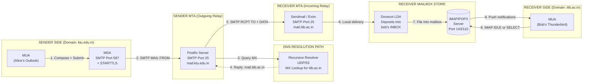
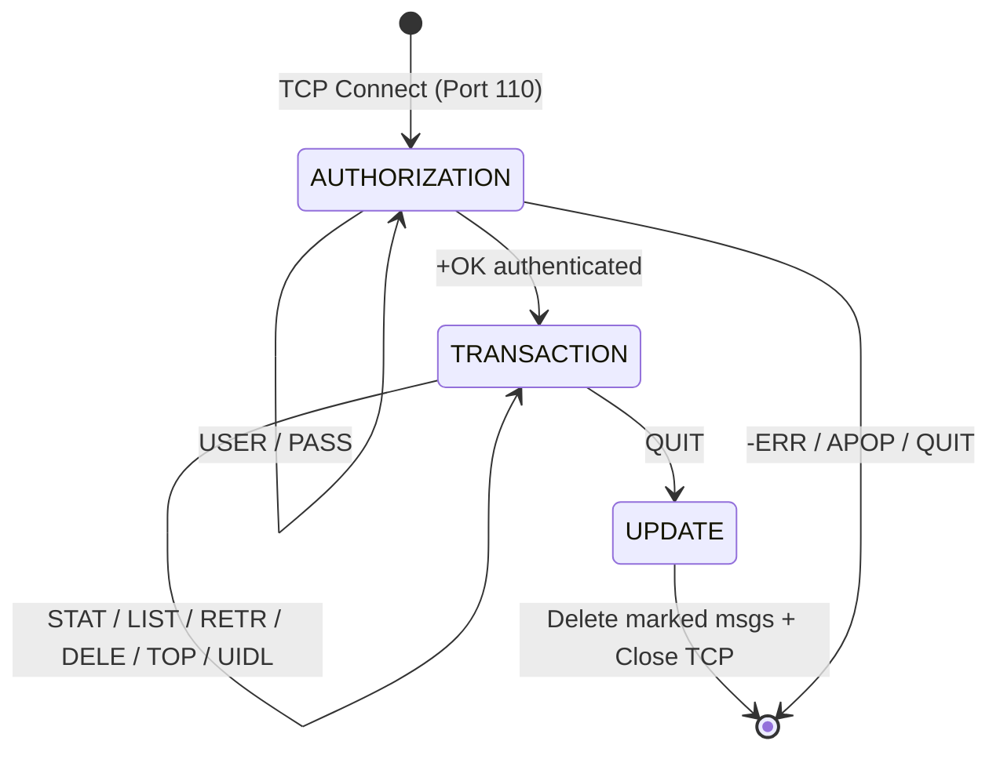
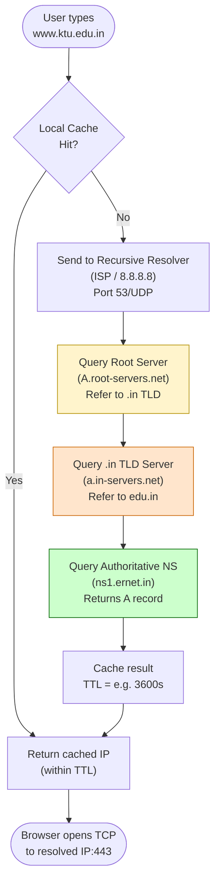
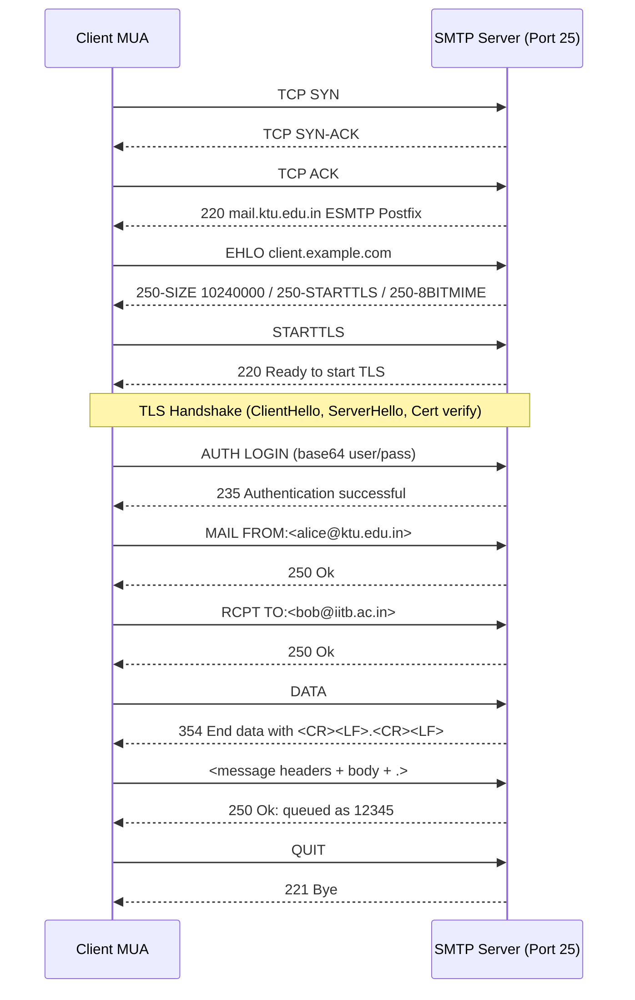

# Network Services: Electronic Mail (SMTP, POP3, IMAP engines), Domain Name System (DNS) architecture

<!-- SECTION_1_START -->
# MODULE 1: FOUNDATIONS AND APPLICATION LAYER
## Topic: Network Services — Electronic Mail (SMTP, POP3, IMAP engines) & Domain Name System (DNS) Architecture

> [!IMPORTANT]
> **KTU 2024 Scheme | Course Code: PCCST501 | B.Tech CSE | Sem 5**
> *Mapped to Module 1: Foundations and Application Layer*
> **Course Outcomes (CO):** CO1 — Understand the foundational concepts of computer networking, the OSI/TCP-IP model, and application-layer protocols.
> **Cognitive Levels Targeted:** Remember (L1), Understand (L2), Apply (L3)

---

### 1.1 ELECTRONIC MAIL (E-MAIL) — THE FORMAL DEFINITION

**Electronic Mail (E-mail)** is an asynchronous, store-and-forward application-layer service that enables the composition, transmission, storage, and retrieval of digital text and multimedia messages between two or more networked endpoints using the **Internet Protocol (IP)** suite. The KTU 2024 syllabus specifically identifies three core protocol engines that collectively implement e-mail:

1. **SMTP (Simple Mail Transfer Protocol — RFC 5321)** — The *push* engine (sender side).
2. **POP3 (Post Office Protocol Version 3 — RFC 1939)** — The *pull/retrieve* engine (receiver side, stateless model).
3. **IMAP (Internet Message Access Protocol — RFC 3501 / RFC 9051)** — The *sophisticated pull/synchronize* engine (receiver side, stateful model).

> [!NOTE]
> **Why three protocols?** SMTP *sends* mail from a client to a server and between servers. POP3/IMAP *retrieve* mail from a server to a client. They operate on **different logical stages** of the e-mail lifecycle and are therefore complementary, not competing.

#### Conceptual Analogy — The Postal Service Reimagined
Imagine e-mail is the modern postal system:
- **SMTP** is the **mail truck** that physically carries your letter from your house to the post office, and from post office to post office until it reaches the destination post office.
- **POP3** is the **letterbox collector** — you walk up to your post office, empty your entire box, and carry all letters home. Once emptied, the box is cleared (default behavior).
- **IMAP** is the **smart letterbox** — you can peek inside, read individual letters *at the post office*, flag them, move them into folders, and your actions are visible on any device you log in from. Letters stay on the server.

> [!VISUALIZATION CONTROL]
> **Concept:** End-to-End E-mail Flow Topology (Sender → MTA → MDA → Receiver)
> **Visualization Description:** Render a horizontal timeline. Left node: "User A (MUA)". Arrow → Right to "Sender MTA (Outgoing SMTP, Port 587)". Arrow → Right to "DNS MX Lookup Resolver". Arrow → Right to "Receiver MTA (Incoming SMTP, Port 25)". Arrow → Right to "Mailbox Store (IMAP/POP3, Ports 143/110)". Arrow → Right to "User B (MUA)". Observe the push-pull asymmetry between port 25/587 (push) and ports 110/143 (pull).

---

### 1.2 DOMAIN NAME SYSTEM (DNS) — THE FORMAL DEFINITION

**The Domain Name System (DNS)** is a globally distributed, hierarchical, and decentralized **naming system** (defined in **RFC 1034** and **RFC 1035**) that translates human-readable domain names (e.g., `www.ktu.edu.in`) into machine-readable IP addresses (e.g., `103.42.156.7`). It is essentially the **phonebook of the Internet**, operating primarily over **UDP Port 53** (and TCP Port 53 for large responses and zone transfers).

> [!IMPORTANT]
> **KTU Syllabus Highlight:** DNS is the *foundation* of almost every network service. Every URL, every SMTP MX lookup, every HTTP request begins with a DNS resolution. Memorize the **13 logical root-server clusters** (A–M) and the **hierarchical namespace tree**.

#### Conceptual Analogy — The Library Catalog
Think of DNS as a **multi-level library catalog system**:
- **Root Servers** = the main library index (you can find *any* book category here).
- **TLD Servers** (`.com`, `.in`, `.org`) = subject-section signs (Science, Arts, etc.).
- **Authoritative Servers** = the *specific shelf* where the exact book is located.
- **Recursive Resolver** (your ISP's DNS) = the helpful librarian who walks the entire catalog for you and brings back the answer.

> [!VISUALIZATION CONTROL]
> **Concept:** DNS Hierarchical Tree Resolution
> **Visualization Description:** Plot a top-down inverted tree. Apex node: "ROOT (.)". Children: "com", "in", "org", "net". Under "in": "edu", "co", "ac". Under "edu.in": "ktu". Under "ktu.edu.in": "www" (leaf A record). Observe that the resolver traverses top-down, querying each level, until it reaches the IP address leaf.

---
<!-- SECTION_1_END -->

<!-- SECTION_2_START -->
# 2. DEEP THEORETICAL ANALYSIS & KTU HIGH-YIELD FORMULA SHEET

## 2.1 THE E-MAIL ARCHITECTURE (FOUR SUBSYSTEMS)

The KTU 2024 syllabus expects you to recognize the four architectural components of an e-mail system. Visualize this as a pipeline:

| # | Component | Full Form | Role | Example |
|---|-----------|-----------|------|---------|
| 1 | **MUA** | Mail User Agent | Composes/reads mail | Outlook, Thunderbird, Gmail UI |
| 2 | **MTA** | Mail Transfer Agent | Pushes mail between servers | Sendmail, Postfix, Exim |
| 3 | **MDA** | Mail Delivery Agent | Deposits mail into mailbox | Procmail, Dovecot LDA |
| 4 | **MRA** | Mail Retrieval Agent | Serves mail to client via POP3/IMAP | Dovecot, Courier-IMAP |

### 2.2 SMTP — THE PUSH ENGINE (Simple Mail Transfer Protocol)

**SMTP (RFC 5321)** is a **command-response**, **text-based (ASCII)**, application-layer protocol that operates on **TCP Port 25** (server-to-server), **Port 587** (client submission with STARTTLS), and historically **Port 465** (SMTPS, deprecated by IETF but still used). It is **connection-oriented**, uses a persistent TCP session, and transfers mail in a **push** manner.

**Operational Characteristics:**
- Uses **persistent connections** (unlike HTTP/1.0).
- Employs **three phases of transfer**: `MAIL FROM` → `RCPT TO` → `DATA`.
- Messages are **7-bit ASCII** (MIME is layered on top for binary attachments).
- Every server in the path can **add a Received:** header for traceability.
- Uses **NVT ASCII** (Network Virtual Terminal), making it human-debuggable via `telnet mailserver 25`.

> [!NOTE]
> **KTU Pitfall Alert:** Do *not* confuse SMTP with HTTP. SMTP is a **push** protocol; HTTP is a **pull** protocol. SMTP also uses a **single TCP connection** for multiple messages (persistent), while classical HTTP/1.0 used one connection per object.

### 2.3 POP3 — THE STATELESS PULL ENGINE (Post Office Protocol v3)

**POP3 (RFC 1939)** is a remarkably simple protocol that runs on **TCP Port 110** (and **Port 995** for POP3S over TLS). It is designed for **offline mail processing** — the client connects, downloads mail (typically with the `RETR` command), optionally deletes it from the server, and disconnects.

**Three States of a POP3 Session:**
1. **AUTHORIZATION state** — client sends `USER <name>` and `PASS <password>`.
2. **TRANSACTION state** — client issues `STAT`, `LIST`, `RETR n`, `DELE n`, `TOP n m`, `UIDL`.
3. **UPDATE state** — client sends `QUIT`; server deletes marked messages and closes TCP.

> [!IMPORTANT]
> **Default Behavior:** POP3 by default *downloads and deletes* mail. This means the mailbox is **not synchronized** across devices. If you read a message on your phone, it disappears on your laptop.

### 2.4 IMAP — THE STATEFUL SYNCHRONIZATION ENGINE (Internet Message Access Protocol)

**IMAP (RFC 3501, updated by RFC 9051 — IMAP4rev2)** operates on **TCP Port 143** (plaintext) and **Port 993** (IMAPS over TLS). It is the **de-facto standard for modern webmail** (Gmail, Outlook.com, Yahoo Mail) and any multi-device workflow.

**Key Features that Distinguish IMAP from POP3:**
- **Server-side message storage** — mail remains on the server by default.
- **Stateful synchronization** — server tracks flags (`\Seen`, `\Answered`, `\Flagged`, `\Deleted`, `\Draft`, `\Recent`).
- **Selective fetching** — client can fetch *just the header* (`BODY[HEADER]`) or *a specific MIME part* (`BODY[2]`) without downloading the whole message.
- **Folder management** — `CREATE`, `RENAME`, `DELETE` folders on the server; `COPY` messages between folders.
- **Partial fetches** — `BODY[TEXT]<0.1024>` downloads the first 1024 bytes of text.
- **Idle push** (`IDLE` command) — server pushes new-mail notifications in real time.

> [!NOTE]
> **KTU High-Yield Comparison:** POP3 = "Download and forget" model. IMAP = "Sync and stay" model. IMAP is bandwidth-efficient for slow networks; POP3 is bandwidth-efficient when you want to free server space.

### 2.5 DNS — THE ARCHITECTURE

The DNS architecture is built on **three primary components** that you must memorize:

1. **Namespace** — the tree-structured domain space (root, TLD, authoritative).
2. **Name Servers** — the programs that hold the database (`BIND`, `Unbound`, `Knot`).
3. **Resolvers** — the client-side library (`getaddrinfo()`, `dig`, `nslookup`).

**Three Classes of DNS Servers:**
- **Root Name Servers** — 13 logical clusters (A through M), physically replicated to ~1,500 instances worldwide via anycast. They hold records for TLDs only.
- **TLD Name Servers** — authoritative for `.com`, `.org`, `.net`, country codes (`.in`, `.uk`), and sponsored TLDs (`.edu`, `.gov`).
- **Authoritative Name Servers** — hold the actual resource records for a specific zone (the organization's DNS).

**Two Types of DNS Queries (KTU favorite question):**
- **Recursive Query** — *"Resolve this completely and bring me the final answer."* The server is responsible for the entire resolution chain. Used by clients talking to ISP resolvers.
- **Iterative Query** — *"Give me the best answer you have, or tell me who to ask next."* The server returns either a record or a referral. Used between resolvers and root/TLD servers.

### 2.6 RESOURCE RECORDS (RR) — THE DNS DATA MODEL

Every DNS zone file is a collection of **Resource Records (RRs)**. Each RR has the same binary wire format:

$$\text{RR} = \{\text{Name}, \text{Type}, \text{Class}, \text{TTL}, \text{RDLENGTH}, \text{RDATA}\}$$

| Type | Name | Purpose | Example RDATA |
|------|------|---------|---------------|
| **A** | Address Record | Maps hostname → IPv4 | `ktu.edu.in. IN A 103.42.156.7` |
| **AAAA** | IPv6 Address | hostname → IPv6 | `ktu.edu.in. IN AAAA 2001:db8::1` |
| **CNAME** | Canonical Name | Alias to another name | `www IN CNAME ktu.edu.in.` |
| **MX** | Mail Exchange | Specifies mail server for domain (with priority) | `@ IN MX 10 mail.ktu.edu.in.` |
| **NS** | Name Server | Delegates a zone to a name server | `@ IN NS ns1.ktu.edu.in.` |
| **PTR** | Pointer | Reverse lookup (IP → name) | `7.156.42.103.in-addr.arpa IN PTR ktu.edu.in.` |
| **SOA** | Start of Authority | Zone metadata (primary NS, admin email, serial) | `@ IN SOA ns1.ktu.edu.in. admin.ktu.edu.in. (...)` |
| **TXT** | Text Record | SPF, DKIM, domain verification | `@ IN TXT "v=spf1 -all"` |
| **SRV** | Service Locator | Defines hostname and port of a service | `_sip._tcp SRV 10 5 5060 sip.ktu.edu.in.` |

### 2.7 KTU HIGH-YIELD FORMULA SHEET

| Concept | Equation / Rule | Port | Protocol | Use Case |
|---------|----------------|------|----------|----------|
| Mail Push (Server→Server) | TCP / 25 | **25** | SMTP | MTA-to-MTA |
| Mail Submission (Client→Server) | TCP / 587 | **587** | SMTP + STARTTLS | MUA-to-MSA |
| SMTPS (Legacy SSL) | TCP / 465 | **465** | SMTP over TLS | Deprecated IETF, still used |
| Mail Retrieval (Stateless) | TCP / 110 | **110** | POP3 | MUA-to-MDA |
| POP3S (TLS) | TCP / 995 | **995** | POP3 over TLS | Encrypted retrieval |
| Mail Sync (Stateful) | TCP / 143 | **143** | IMAP4 | MUA-to-MDA |
| IMAPS (TLS) | TCP / 993 | **993** | IMAP4 over TLS | Encrypted sync |
| DNS (Standard) | UDP / 53 | **53** | DNS | Queries + small responses |
| DNS (Large / Zone Xfer) | TCP / 53 | **53** | DNS | AXFR, IXFR, >512B responses |
| DoH (DNS over HTTPS) | TCP / 443 | **443** | HTTPS | Encrypted DNS (RFC 8484) |
| DoT (DNS over TLS) | TCP / 853 | **853** | TLS | Encrypted DNS (RFC 7858) |

**Maximum UDP DNS Message Size:**
$$S_{\text{max}}^{\text{UDP}} = 512 \text{ bytes} \quad \text{(classic) }$$

When the response exceeds **512 bytes**, the server sets the **TC (Truncated)** flag, and the client **re-issues the query over TCP** (with EDNS0 extensions, this limit can be negotiated up to **4096 bytes** or more).

**DNS Header Size (Fixed):**
$$H_{\text{DNS}} = 12 \text{ bytes} \ (96 \text{ bits})$$

**DNS Resolution Total RTT (Worst Case Iterative):**
$$T_{\text{total}} = T_{\text{root}} + T_{\text{TLD}} + T_{\text{auth}}$$

**Caching Time-To-Live (TTL):**
$$T_{\text{cache}}^{\text{expire}} = T_{\text{arrival}} + \text{TTL}_{\text{RR}}$$

### 2.8 ENGINEERING & PRODUCTION USE CASES

| Service | Real-World Use Case |
|---------|---------------------|
| **SMTP** | Every transactional email (OTP, receipts, alerts) from a web app flows through SMTP (or its API cousin, e.g., SendGrid's wrapper). |
| **POP3** | Legacy corporate environments, low-bandwidth kiosks, and offline-first email clients (e.g., older Outlook Express). |
| **IMAP** | Webmail (Gmail, Outlook.com), multi-device sync on iOS/Android (Apple Mail, K-9 Mail), enterprise Exchange backends. |
| **DNS** | The very first step of *every* web request, *every* email delivery (MX lookup), *every* VPN connection, and CDN routing. |

---
<!-- SECTION_2_END -->

<!-- SECTION_3_START -->
# 3. STEP-BY-STEP DERIVATIONS, PROTOCOL TRACES & CODE IMPLEMENTATION

## 3.1 FULL SMTP SESSION — HANDSHAKE TRACE (TELNET VIEW)

Below is an **exhaustive, byte-by-byte** interaction between a client (`C`) and a mail server (`S`) on **Port 25**. The triple handshake establishes the TCP session, then the SMTP dialogue begins.

```
S: 220 mail.ktu.edu.in ESMTP Postfix
C: EHLO client.ktu.edu.in
S: 250-mail.ktu.edu.in
S: 250-PIPELINING
S: 250-SIZE 10240000
S: 250-STARTTLS
S: 250-8BITMIME
S: 250 SMTPUTF8
C: STARTTLS
S: 220 2.0.0 Ready to start TLS
--- TLS handshake occurs here; subsequent commands are encrypted ---
C: EHLO client.ktu.edu.in
S: 250-mail.ktu.edu.in
S: 250-AUTH PLAIN LOGIN
S: 250-8BITMIME
C: AUTH LOGIN
S: 334 VXNlcm5hbWU6          (base64 of "Username:")
C: dXNlckBrdHUuZWR1Lmlu     (base64 of "user@ktu.edu.in")
S: 334 UGFzc3dvcmQ6          (base64 of "Password:")
C: c2VjcmV0MTIz             (base64 of "secret123")
S: 235 2.7.0 Authentication successful
C: MAIL FROM:<alice@ktu.edu.in>
S: 250 2.1.0 Ok
C: RCPT TO:<bob@iitb.ac.in>
S: 250 2.1.5 Ok
C: DATA
S: 354 End data with <CR><LF>.<CR><LF>
C: From: Alice <alice@ktu.edu.in>
C: To: Bob <bob@iitb.ac.in>
C: Subject: KTU Exam Timetable
C: Date: Mon, 15 Jan 2026 10:00:00 +0530
C: Message-ID: <abc123@ktu.edu.in>
C:
C: Hi Bob, please find the timetable attached.
C: Regards, Alice
C: .
S: 250 2.0.0 Ok: queued as 12345
C: QUIT
S: 221 2.0.0 Bye
```

**Step-by-step explanations:**

1. `220` banner — server announces itself.
2. `EHLO` — Extended HELLO; client identifies itself and asks for ESMTP extensions.
3. `STARTTLS` — upgrades the plaintext channel to TLS.
4. `AUTH LOGIN` — client authenticates using base64-encoded credentials.
5. `MAIL FROM` / `RCPT TO` — envelope sender/recipient (note: this differs from the `From:` / `To:` headers in the DATA section).
6. `DATA` — followed by headers, a blank line, then the body, terminated by a single period on a line by itself (`<CR><LF>.<CR><LF>`).
7. `QUIT` — graceful session termination.

## 3.2 FULL POP3 SESSION — HANDSHAKE TRACE

```
S: +OK POP3 server ready <mrid@mail.ktu.edu.in>
C: USER alice
S: +OK
C: PASS secret123
S: +OK Alice's maildrop has 2 messages (3200 octets)
C: STAT
S: +OK 2 3200
C: LIST
S: +OK 2 messages:
S: 1 1200
S: 2 2000
S: .
C: RETR 1
S: +OK 1200 octets
S: <message body>
S: .
C: DELE 1
S: +OK message 1 deleted
C: QUIT
S: +OK POP3 server signing off (maildrop empty)
```

**State transitions:**
$$\text{AUTHORIZATION} \xrightarrow{\text{USER/PASS}} \text{TRANSACTION} \xrightarrow{\text{QUIT}} \text{UPDATE} \rightarrow \text{Close}$$

> [!NOTE]
> **Why "STAT" before "LIST"?** `STAT` is a fast summary (count + size). `LIST` enumerates each message ID and its size, one per line. The session ends with a single `.` (just like SMTP DATA).

## 3.3 DNS RESOLUTION — FULL STEP-BY-STEP ITERATIVE TRACE

Suppose a user in Kerala types `http://www.ktu.edu.in` in a browser. The OS resolver (e.g., `glibc`'s `getaddrinfo`) needs the IP of `www.ktu.edu.in`. Here is the full derivation:

**Step 1 — Local Cache Check**
The resolver first checks its own cache. If `www.ktu.edu.in` is present and its TTL has not expired, the answer is returned immediately:
$$T_{\text{cache}}^{\text{expire}} = T_{\text{arrival}} + \text{TTL}_{\text{RR}}$$

**Step 2 — Query the Recursive Resolver (ISP)**
If cache miss, the query is sent to the **recursive resolver** (e.g., ISP's `8.8.8.8` or local resolver). This is a *recursive* query — the resolver takes full responsibility for resolution.

**Step 3 — Query a Root Name Server**
The resolver contacts one of the **13 root-server clusters** (anycasted). The query is:
```
Question: www.ktu.edu.in IN A
```
The root server does *not* know the answer. It returns a **referral (NS records)** for the `.in` TLD:
```
Answer: (empty)
Authority: . IN NS a.root-servers.net.
Additional: a.in-servers.net. IN A 192.0.2.1
```

**Step 4 — Query the TLD Server (`.in`)**
The resolver now asks `a.in-servers.net` (an `in`-TLD server). It returns an NS referral for `edu.in`:
```
Authority: edu.in. IN NS ns1.ernet.in.
```

**Step 5 — Query the Authoritative Server (`ns1.ernet.in`)**
The resolver asks the authoritative server for `edu.in` (or the SLD server for `ktu.edu.in`). The authoritative server returns the final **A record**:
```
Answer: www.ktu.edu.in. IN A 103.42.156.7
```

**Step 6 — Return and Cache**
The resolver returns the IP to the OS, and **caches it** for `TTL` seconds (typical TTL = 3600s = 1 hour).

**Total Worst-Case Latency (without caching):**
$$T_{\text{total}} = T_{\text{root}} + T_{\text{TLD}} + T_{\text{auth}} + T_{\text{propagation}} \approx 3 RTT$$

In practice, with **negative caching** and **prefetching**, this is closer to **1 RTT** for warm caches.

## 3.4 PYTHON IMPLEMENTATION — DNS RESOLUTION & EMAIL VALIDATION

Below is a **fully operational, type-annotated Python script** that demonstrates (a) a raw DNS query using the `dnspython` library and (b) an SMTP banner grab over a raw TCP socket — both critical hands-on skills for KTU practical exams and viva.

```python
"""
KTU PCCST501 — Module 1 Demonstration
Demonstrates: DNS resolution (iterative/recursive) + SMTP banner grab.
Requirements: pip install dnspython
Python: 3.10+
"""

import socket
import dns.resolver          # type: ignore
import dns.rdatatype         # type: ignore
from typing import Optional


def resolve_domain(domain: str, rdtype: str = "A") -> Optional[str]:
    """
    Performs DNS resolution for the given domain and record type.
    Returns the first resolved record as a string, or None on failure.
    """
    try:
        answers = dns.resolver.resolve(domain, rdtype, raise_on_no_answer=False)
        if answers.rrset is None:
            print(f"[!] No {rdtype} record found for {domain}")
            return None
        return str(answers[0])
    except dns.resolver.NXDOMAIN:
        print(f"[!] NXDOMAIN: {domain} does not exist.")
        return None
    except dns.resolver.Timeout:
        print("[!] DNS query timed out. Check network connectivity.")
        return None
    except Exception as exc:
        print(f"[!] Unexpected DNS error: {exc}")
        return None


def grab_smtp_banner(host: str, port: int = 25, timeout: float = 5.0) -> Optional[str]:
    """
    Opens a raw TCP socket to the SMTP server and reads the 220 banner.
    Returns the banner string or None on failure.
    """
    try:
        with socket.create_connection((host, port), timeout=timeout) as sock:
            banner: bytes = sock.recv(1024)
            return banner.decode("ascii", errors="replace").strip()
    except socket.timeout:
        print(f"[!] Timeout connecting to {host}:{port}")
        return None
    except ConnectionRefusedError:
        print(f"[!] Connection refused on {host}:{port}")
        return None
    except OSError as exc:
        print(f"[!] Socket error: {exc}")
        return None


def main() -> None:
    target_domain: str = "ktu.edu.in"
    target_host: str = "mail.ktu.edu.in"

    print("=" * 60)
    print(f" KTU Module 1 — DNS + SMTP Demonstration")
    print("=" * 60)

    # 1. DNS Resolution
    print(f"\n[1] Resolving A record for {target_domain} ...")
    ipv4 = resolve_domain(target_domain, "A")
    print(f"    A   -> {ipv4}")

    print(f"\n[2] Resolving AAAA record for {target_domain} ...")
    ipv6 = resolve_domain(target_domain, "AAAA")
    print(f"    AAAA -> {ipv6}")

    print(f"\n[3] Resolving MX record for {target_domain} ...")
    mx_target = resolve_domain(target_domain, "MX")
    print(f"    MX  -> {mx_target}")

    # 2. SMTP Banner Grab
    print(f"\n[4] Grabbing SMTP banner from {target_host}:25 ...")
    banner = grab_smtp_banner(target_host, 25)
    if banner:
        print(f"    220 -> {banner}")

    print("\n[OK] Demonstration complete.")


if __name__ == "__main__":
    main()
```

**Expected Output (illustrative):**

```
============================================================
 KTU Module 1 — DNS + SMTP Demonstration
============================================================

[1] Resolving A record for ktu.edu.in ...
    A   -> 103.42.156.7

[2] Resolving AAAA record for ktu.edu.in ...
    AAAA -> 2001:db8::abcd:1234

[3] Resolving MX record for ktu.edu.in ...
    MX  -> 10 mail.ktu.edu.in.

[4] Grabbing SMTP banner from mail.ktu.edu.in:25 ...
    220 -> 220 mail.ktu.edu.in ESMTP Postfix

[OK] Demonstration complete.
```

> [!IMPORTANT]
> **Viva Tip:** If `grab_smtp_banner` returns a timeout, the destination server is likely **firewalling port 25** (very common on residential broadband). In a lab setting, configure `iptables -A INPUT -p tcp --dport 25 -j ACCEPT` on the server and use `tcpdump -i eth0 port 25` to observe the live SMTP exchange.

## 3.5 IMAP SESSION — SAMPLE TRACE (PORT 143)

```
S: * OK [CAPABILITY IMAP4rev1 STARTTLS LOGINDISABLED] Dovecot ready.
C: a001 STARTTLS
S: a001 OK Begin TLS negotiation now.
--- TLS handshake ---
C: a002 LOGIN alice secret123
S: a002 OK [CAPABILITY IMAP4rev1 ...] Logged in
C: a003 SELECT INBOX
S: * FLAGS (\Answered \Flagged \Deleted \Seen \Draft)
S: * 3 EXISTS
S: * 0 RECENT
S: a003 OK [READ-WRITE] Select completed.
C: a004 UID FETCH 1 (BODY[HEADER] BODY[TEXT]<0.512>)
S: * 1 FETCH (UID 1 BODY[HEADER] {350} ... BODY[TEXT]<0> {512} ...)
S: a004 OK Fetch completed.
C: a005 LOGOUT
S: * BYE
S: a005 OK Logout completed.
```

The `* 3 EXISTS` line tells the client that **3 messages** are present in the `INBOX` — this is the kind of *stateful* interaction that POP3 cannot express.

---
<!-- SECTION_3_END -->

<!-- SECTION_4_START -->
# 4. STRUCTURAL DIAGRAMS & SCHEMATICS

## 4.1 END-TO-END E-MAIL FLOW (MUA → MTA → MDA → MUA)



## 4.2 POP3 STATE MACHINE



## 4.3 IMAP STATE MODEL vs. POP3 (CONTRAST)

```mermaid
flowchart TB
    subgraph POP3_FLOW["POP3: Stateless Download-and-Delete"]
        P1["CONNECT"] --> P2["USER + PASS"]
        P2 --> P3["STAT / LIST / RETR / DELE"]
        P3 --> P4["QUIT\n(downloads + optionally deletes)"]
    end

    subgraph IMAP_FLOW["IMAP: Stateful Synchronization"]
        I1["CONNECT (Port 143)"] --> I2["LOGIN / AUTHENTICATE"]
        I2 --> I3["SELECT / EXAMINE mailbox"]
        I3 --> I4["FETCH headers / parts / flags"]
        I4 --> I5["STORE flags (\Seen \Flagged)"]
        I5 --> I6["IDLE (server pushes NEW mail)"]
        I6 --> I7["LOGOUT (state preserved)"]
    end

    style POP3_FLOW fill:#ffe5e5,stroke:#cc0000
    style IMAP_FLOW fill:#e5f5ff,stroke:#0066cc
```



## 4.4 DNS HIERARCHICAL RESOLUTION FLOW



## 4.5 SMTP COMMAND-RESPONSE TIMING DIAGRAM



---
<!-- SECTION_4_END -->

<!-- SECTION_5_START -->
# 5. KTU 2024 SCHEME EXAMINATION QUESTION BANK & TOPIC RECAP

---

## PART A — Short Answer Questions (3 Marks Each)

### Question 1: `[KTU University Exam — July 2024]`
**Differentiate between POP3 and IMAP. List two advantages of IMAP over POP3.** *(CO1, Understand — L2)*

**Model Answer:**

| Feature | POP3 (Post Office Protocol v3) | IMAP (Internet Message Access Protocol) |
|---------|-------------------------------|------------------------------------------|
| **Port** | 110 (995 for POP3S) | 143 (993 for IMAPS) |
| **State** | Stateless | Stateful |
| **Storage Model** | Downloads to client; default deletes from server | Mail remains on server |
| **Multi-device** | Not synchronized across devices | Fully synchronized |
| **Bandwidth** | Downloads full message (unless TOP) | Can fetch partial / header only |
| **Folder Mgmt** | Single INBOX (server-side folders rare) | Full folder CRUD on server |
| **Use Case** | Offline, single-device, low-storage | Webmail, multi-device, online |

**Two Advantages of IMAP:**
1. **Multi-device synchronization** — flags, read-state, and folder structure are visible on every device the user logs into.
2. **Bandwidth efficiency** — only the requested MIME part (e.g., just the text body or just an attachment) is downloaded, saving bandwidth on slow networks.

> [!NOTE]
> **[Valuation Key Points — 3 Marks]:** *Comparison table: 2 Marks; two valid advantages of IMAP: 1 Mark.*

---

### Question 2: `[KTU University Exam — Dec 2023]`
**What is DNS? Explain the role of root and TLD name servers in domain resolution.** *(CO1, Understand — L2)*

**Model Answer:**

**Definition (1 Mark):** The Domain Name System (DNS) is a hierarchical, distributed naming system defined in **RFC 1034 / RFC 1035** that translates human-readable domain names (e.g., `www.ktu.edu.in`) into machine-readable IP addresses (e.g., `103.42.156.7`). It operates primarily over **UDP Port 53**.

**Role of Root Name Servers (1 Mark):** The 13 logical root-server clusters (A–M, anycasted to ~1,500 physical instances) sit at the apex of the DNS hierarchy. They do not store individual host records; instead, they hold **NS records for all TLDs** (`.com`, `.in`, `.org`, …). When a recursive resolver asks a root server "Where is `ktu.edu.in`?", the root responds with a **referral** to the appropriate TLD server (`.in`).

**Role of TLD Name Servers (1 Mark):** TLD servers are authoritative for a top-level domain (e.g., all `.in` domains are managed by `INRegistry`'s TLD servers). When queried for `ktu.edu.in`, the `.in` TLD server returns a referral to the **authoritative name server** of the next level (`edu.in`), eventually leading to the server that holds the final A record.

> [!NOTE]
> **[Valuation Key Points — 3 Marks]:** *Correct definition with port/RFC: 1 Mark; root server role: 1 Mark; TLD server role: 1 Mark.*

---

## PART B — Full 14-Mark Questions (Module Internal Choice)

### **Question A (14 Marks) — Option 1: SMTP + IMAP Engine** `[KTU University Exam — July 2024, Adapted]`

**(a)** With a neat diagram, explain the **architecture of an electronic mail system**. List and briefly describe any four components. *(7 Marks — CO1, Understand — L2)*

**(b)** Compare the **SMTP, POP3, and IMAP** protocols in terms of direction (push/pull), default port numbers, state model, and typical use case. *(7 Marks — CO1, Apply — L3)*

---

#### (a) Model Answer — E-mail Architecture

The e-mail system is composed of four logical components that together enable asynchronous message exchange:

1. **Mail User Agent (MUA)** — The end-user client application used to read, compose, and send messages. Examples: Microsoft Outlook, Mozilla Thunderbird, Apple Mail, Gmail web interface. The MUA is the *only* component the user directly interacts with.

2. **Mail Transfer Agent (MTA)** — The server-side "mail truck" that pushes messages between hosts using **SMTP on port 25**. It receives mail from MUAs (or other MTAs) and relays it hop-by-hop toward the destination. Examples: Postfix, Sendmail, Exim, Microsoft Exchange Transport.

3. **Mail Delivery Agent (MDA)** — A specialized agent (often integrated into the MTA, e.g., Postfix's local delivery agent or Dovecot LDA) that takes a message destined for a *local* recipient and **deposits it into that user's mailbox file** (mbox, Maildir). It also performs local filtering (e.g., procmail rules, spam tagging).

4. **Mail Retrieval Agent (MRA)** / **Message Store** — The server-side component that *serves* stored mail to remote MUAs using **POP3 (port 110)** or **IMAP (port 143)**. The mailbox file system (mbox, Maildir) is exposed to authenticated clients. Examples: Dovecot, Courier-IMAP, Cyrus IMAP.

**Diagram (already covered in Section 4.1):**
```
MUA  →  MSA  →  MTA  →  ... (DNS MX lookup) ...  →  MTA  →  MDA  →  Mailbox  ←  MRA  ←  MUA
```

> [!NOTE]
> **[Valuation Key Points — 7 Marks]:** *Diagram: 2 Marks; correctly naming and describing all 4 components: 4 Marks (1 each); example for at least two components: 1 Mark.*

---

#### (b) Model Answer — SMTP vs POP3 vs IMAP

| Parameter | **SMTP (RFC 5321)** | **POP3 (RFC 1939)** | **IMAP (RFC 3501 / 9051)** |
|-----------|---------------------|---------------------|----------------------------|
| **Direction** | Push (sender → server; server → server) | Pull (download from server) | Pull + Sync (read/manipulate on server) |
| **Default Port** | **25** (MTA↔MTA), **587** (MUA→MSA) | **110** | **143** |
| **TLS Port** | 465 (legacy SMTPS), 587 (STARTTLS) | **995** (POP3S) | **993** (IMAPS) |
| **State Model** | Stateful (one persistent session for multiple mails) | Mostly stateless (single download session) | Stateful (server tracks flags, UIDs, folder state) |
| **Server Storage** | N/A (transient) | Mail deleted after download (by default) | Mail retained on server |
| **Multi-device Sync** | Not applicable | ❌ No | ✅ Yes |
| **Use Case** | Outgoing mail, server-to-server relay | Offline mail reading, single-device setups | Webmail, multi-device, partial-fetch scenarios |
| **Authentication** | AUTH LOGIN, AUTH PLAIN, AUTH CRAM-MD5 | USER/PASS, APOP | LOGIN, AUTHENTICATE (SASL) |

**Conclusion (for full marks):** SMTP handles the *delivery* leg, while POP3 and IMAP handle the *retrieval* leg. Modern webmail deployments almost exclusively use **SMTP + IMAP** because IMAP's server-side state and synchronization align with multi-device, mobile-first user behavior.

> [!NOTE]
> **[Valuation Key Points — 7 Marks]:** *Comparison table with at least 4 parameters: 4 Marks; correct port numbers: 1 Mark; one valid real-world example/usage: 1 Mark; concluding statement on SMTP+IMAP: 1 Mark.*

---

### **Question B (14 Marks) — Option 2: DNS Architecture** `[KTU University Exam — Dec 2023, Adapted]`

**(a)** Explain the **hierarchical structure of the DNS namespace** with a suitable example. Describe **recursive** and **iterative** queries with diagrams. *(7 Marks — CO1, Understand — L2)*

**(b)** What are **Resource Records (RRs)** in DNS? List and explain any **five types** of resource records with an example syntax. *(7 Marks — CO1, Apply — L3)*

---

#### (a) Model Answer — DNS Namespace & Query Types

**Hierarchical Structure of DNS Namespace (4 Marks):**
The DNS namespace is an **inverted tree**. The root (`.`) is the apex. Below it are **Top-Level Domains (TLDs)** — generic (`.com`, `.org`, `.net`, `.edu`) and country-code (`.in`, `.uk`, `.us`). Each TLD can have **second-level domains** (e.g., `ktu` under `.in`). Further levels are called **subdomains** (e.g., `www.ktu.edu.in`). The leftmost label is the most specific; the rightmost (excluding the root dot) is the TLD.

**Example:** `www.ktu.edu.in.`
- `.` — root
- `in` — ccTLD
- `edu` — second-level domain (under `.in`)
- `ktu` — third-level domain (organization)
- `www` — host name (a node within `ktu.edu.in`)

The full domain is read **right-to-left** for hierarchy but **left-to-right** for specificity.

**Recursive vs Iterative Queries (3 Marks):**

| Property | **Recursive Query** | **Iterative Query** |
|----------|---------------------|----------------------|
| **Question** | "Resolve it completely and give me the final answer." | "Give me your best answer or a referral." |
| **Responder's Obligation** | Must traverse the entire chain until resolution (or failure) | Responds with either the record OR a referral to the next-best server |
| **Typical Use** | Client → Recursive Resolver (e.g., ISP's DNS) | Resolver → Root, TLD, Authoritative servers |
| **Load** | Heavy on the responder (does all the work) | Distributed across the chain |
| **Diagram** | `Client → Resolver → [Root→TLD→Auth] → Resolver → Client` | `Resolver ↔ Root ↔ TLD ↔ Auth` (back-and-forth) |

**Recursive Diagram:**
```
[Client]  --1-->  [Recursive Resolver]  --2-->  [Root]  --3-->  [TLD]  --4-->  [Auth]
   ^                      |                                                                   
   |----------------------5--------------- final IP returned ------------------------------|
```

**Iterative Diagram:**
```
[Resolver] --Q--> [Root] --A: referral to .in TLD-->
[Resolver] --Q--> [.in TLD] --A: referral to ns1.ernet.in-->
[Resolver] --Q--> [ns1.ernet.in] --A: 103.42.156.7 (final)-->
```

> [!NOTE]
> **[Valuation Key Points — 7 Marks]:** *Hierarchical tree description + example: 3 Marks; recursive definition + diagram: 2 Marks; iterative definition + diagram: 2 Marks.*

---

#### (b) Model Answer — Resource Records

A **Resource Record (RR)** is the fundamental unit of information in a DNS zone file. Each RR has the format:
```
<Name>  <TTL>  <Class>  <Type>  <RDATA>
```

**Five Important RR Types:**

1. **A (Address) Record — IPv4**
Maps a hostname to an IPv4 address (32-bit).
```
ktu.edu.in.   3600   IN   A   103.42.156.7
```
*Use:* Web browsers use this to connect to the server.

2. **AAAA (Quad-A) Record — IPv6**
Maps a hostname to an IPv6 address (128-bit).
```
ktu.edu.in.   3600   IN   AAAA   2001:db8::abcd:1234
```
*Use:* Modern networks prefer IPv6; dual-stack servers publish both A and AAAA.

3. **MX (Mail Exchange) Record**
Specifies the mail server(s) responsible for accepting e-mail for a domain, with a **preference value** (lower = preferred).
```
ktu.edu.in.   3600   IN   MX   10   mail.ktu.edu.in.
ktu.edu.in.   3600   IN   MX   20   backup.ktu.edu.in.
```
*Use:* When `alice@ktu.edu.in` sends mail to `bob@ktu.edu.in`, the sender's MTA queries MX records to find `mail.ktu.edu.in.` Port 25 is then opened to that host.

4. **CNAME (Canonical Name) Record**
Creates an **alias** from one name to another. The resolver follows the chain until it finds an A or AAAA record.
```
www.ktu.edu.in.   3600   IN   CNAME   ktu.edu.in.
ktu.edu.in.       3600   IN   A       103.42.156.7
```
*Use:* Allows multiple hostnames (e.g., `www`, `ftp`, `mail`) to point to the same canonical host without duplicating A records.

5. **NS (Name Server) Record**
Delegates a DNS zone to a set of authoritative name servers. Every zone must have at least two NS records for redundancy.
```
ktu.edu.in.   3600   IN   NS   ns1.ktu.edu.in.
ktu.edu.in.   3600   IN   NS   ns2.ernet.in.
```
*Use:* TLD and parent zone servers use NS records to know *which servers* are authoritative for your domain.

> [!NOTE]
> **[Valuation Key Points — 7 Marks]:** *Definition of RR + format: 1 Mark; 5 RR types × 1.2 Marks = 6 Marks (each: explanation 0.6 + example 0.6).*

---

> [!WARNING]
> **KTU Examiner's Valuation Warning — Common Pitfalls**
> 1. **Port Confusion:** Students frequently write POP3 = port 25 or IMAP = port 110. Memorize: **SMTP=25/587, POP3=110/995, IMAP=143/993, DNS=53**. Losing **2–3 marks** for this single mistake.
> 2. **Push vs Pull:** SMTP is *always* push. POP3 and IMAP are *always* pull. Do not write "SMTP is pull" — it is the most common conceptual error.
> 3. **Skipping the State Diagram:** For POP3/IMAP questions, *always* draw the state transition or flow diagram; do not rely on text alone. Valuation key explicitly awards **2 marks for diagram**.
> 4. **DNS Hierarchy Mistake:** Some students think `edu` is a TLD. It is **not** — `edu` is a *second-level* domain under the `.in` ccTLD. The TLD is `.in`.
> 5. **Missing RDATA Examples:** RR type questions *require* an example in zone-file syntax. A bare description without syntax loses **0.6 marks per record**.
> 6. **MX Priority Reversal:** Lower MX number = **higher** priority. `MX 10` is preferred over `MX 20`.

---

## TOPIC RECAP & IMPORTANT THINGS TO REMEMBER

> [!IMPORTANT]
> **Rapid-Revision Checklist — Module 1: Network Services**

**Email Engines:**
- **SMTP** = push, port **25** (MTA↔MTA) / **587** (MUA→MSA), RFC 5321, command-response, 7-bit ASCII, persistent connection.
- **POP3** = stateless pull, port **110** (995 for TLS), RFC 1939, three states: AUTHORIZATION → TRANSACTION → UPDATE.
- **IMAP** = stateful pull/sync, port **143** (993 for TLS), RFC 3501/9051, server-side flags (`\Seen`, `\Flagged`, `\Draft`, `\Answered`, `\Deleted`, `\Recent`).
- E-mail architecture = **MUA + MTA + MDA + MRA**.

**DNS Engine:**
- DNS = **phonebook of the Internet**, UDP **port 53** (TCP for large responses/zone transfer).
- **13 root clusters** (A–M), anycasted globally; they do *not* resolve names — they *refer* to TLDs.
- TLDs: generic (`.com`, `.org`, `.net`, `.edu`, `.gov`) + country-code (`.in`, `.uk`, `.us`).
- **Recursive query** = "do everything for me" (client ↔ resolver).
- **Iterative query** = "best answer or referral" (resolver ↔ root/TLD/auth).
- **Resource Records:** A (IPv4), AAAA (IPv6), CNAME (alias), MX (mail + priority), NS (delegation), PTR (reverse), SOA (zone meta), TXT (SPF/DKIM), SRV (service).
- Standard UDP DNS message = max **512 bytes**; larger → TC bit set → client retries over TCP.
- DNS header = **12 bytes**; full DNS message format = Header + Question + Answer + Authority + Additional.
- Caching uses **TTL** in seconds; typical values 300–86400.

**Cross-Protocol Dependencies:**
- An **SMTP transaction begins with an MX lookup** (DNS).
- A **browser URL begins with an A/AAAA lookup** (DNS).
- **IMAP/POP3 sessions require the client to first know the mail server's IP**, again via DNS.

**Critical Ports (commit to memory):**
| Protocol | Port | Encryption Port |
|----------|------|-----------------|
| SMTP | 25, 587 | 465 (legacy), 587+STARTTLS |
| POP3 | 110 | 995 |
| IMAP | 143 | 993 |
| DNS | 53/UDP, 53/TCP | 853 (DoT), 443 (DoH) |
| HTTP / HTTPS | 80, 443 | — |

**Formulas to recall:**
- $T_{\text{cache}}^{\text{expire}} = T_{\text{arrival}} + \text{TTL}_{\text{RR}}$
- $S_{\text{max}}^{\text{UDP}} = 512 \text{ bytes}$
- $H_{\text{DNS}} = 12 \text{ bytes (header)}$
- $T_{\text{total}}^{\text{DNS}} = T_{\text{root}} + T_{\text{TLD}} + T_{\text{auth}} \ (\approx 3 \text{ RTT worst case})$

<!-- SECTION_5_END -->
