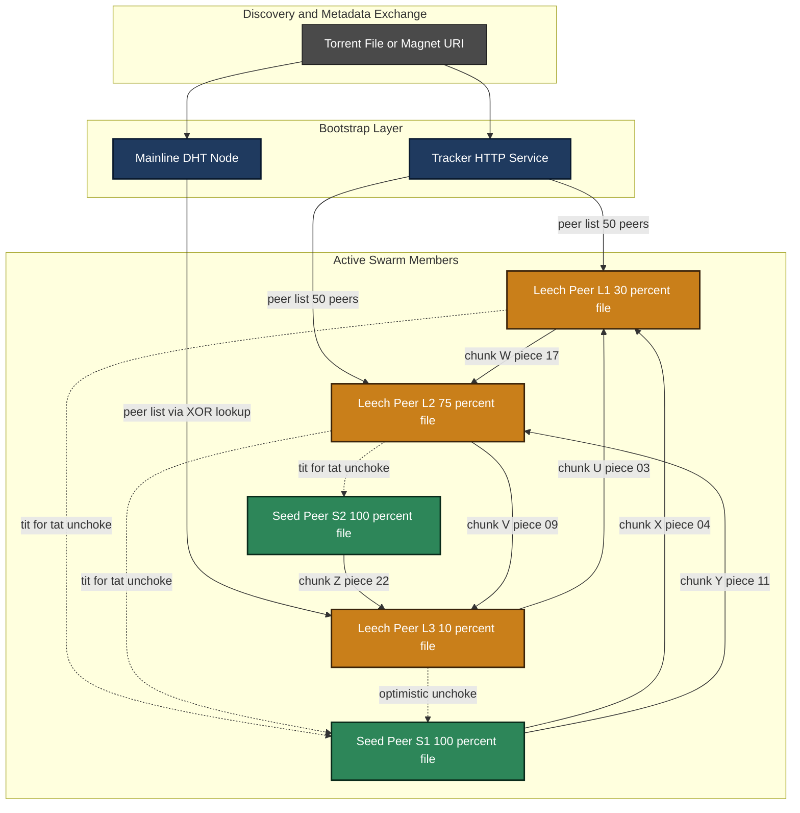
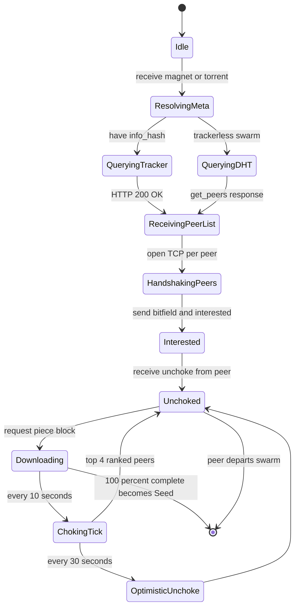
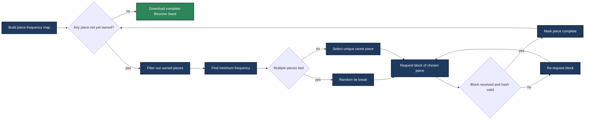
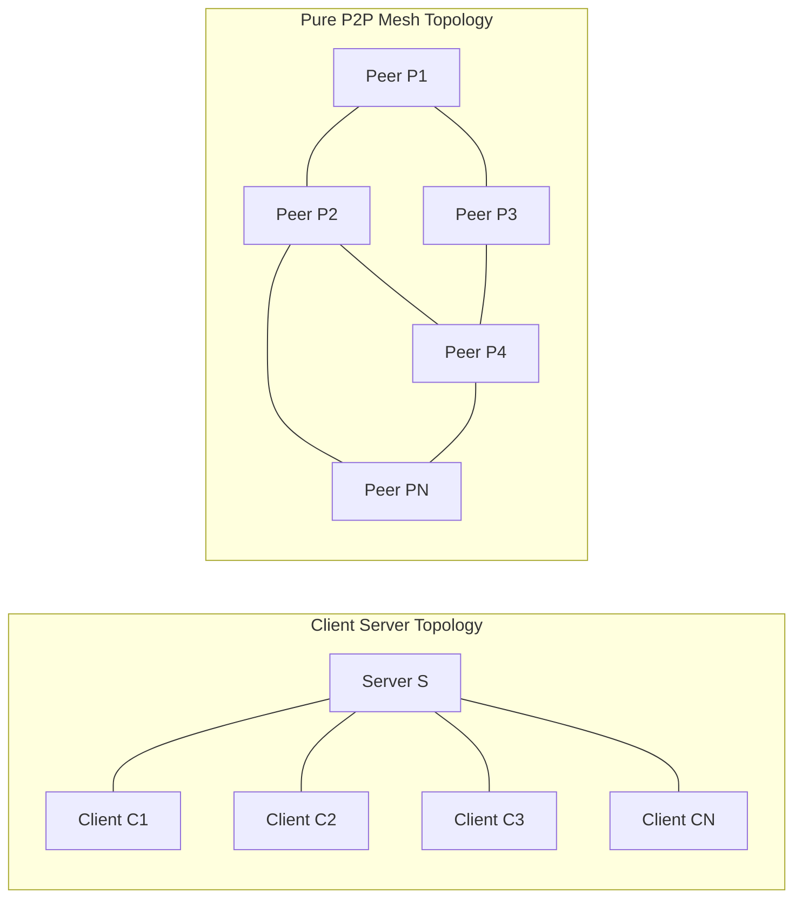

# Peer-to-Peer Architecture: P2P Networks and file sharing dynamics; Case study: BitTorrent

<!-- SECTION_1_START -->
# Peer-to-Peer Architecture & BitTorrent Case Study

## 1.1 Formal Definition (KTU 2024 Syllabus Terminology)

> [!IMPORTANT]
> **Definition (KTU 2024 - PCCST501, Module 1):**
> A **Peer-to-Peer (P2P)** network is a distributed application architecture in which participants (*peers*) act as both *clients* (consuming resources) and *servers* (providing resources) over a logical **overlay network** built atop the physical Internet. Each peer is an *autonomous*, *equal-priority* node that contributes and consumes bandwidth, storage, and computational power, eliminating the need for a centralized coordination authority for every transaction.

In the KTU 2024 scheme, this is contrasted directly with the **Client–Server (C–S)** architecture of Module 1 (HTTP/FTP), where the **server** is a *single point of authority* and clients are *passive consumers*. The two key qualifying conditions stated in the Kurose & Ross reference adopted by KTU are:

1. **Direct (Peers Communicate Directly):** Peers exchange data *without an intermediate relay server* once the session is established. The classic example is two BitTorrent peers swapping chunks directly peer-to-peer.
2. **Self-Scaling Capacity:** As $N$ peers arrive, the total service capacity of the system grows roughly linearly with $N$ (the *aggregate demand* also grows, but the per-peer *contribution* is non-zero), unlike a C–S system whose capacity is fixed by the server's provisioned bandwidth $B_s$.

The **physical constant / design metric** of interest here is the **Maximum Flow Bound**: a single C–S link is capped at the server's upload capacity $B_s$, whereas a P2P system has a theoretical maximum dissemination rate proportional to $\sum_{i=1}^{N} u_i$ (sum of all peers' upload rates).

## 1.2 Conceptual Analogy — The "Study Circle"

> [!NOTE]
> **Intuition: The Water-Cooler Conversation**
> Imagine a classroom of 60 students preparing for the same exam. Each student has a *different subset* of handwritten notes.
>
> * **Client–Server model:** One student (the "professor") photocopies *all* their notes and hands them out. The professor's hands get tired → throughput is *O(1)* regardless of class size.
> * **Peer-to-Peer model:** Students stand in a circle. Every minute, each student passes *one* of the notes they already have to a neighbour who is missing it. After ~6 minutes (logarithmic rounds), everyone has the full set. Throughput is *O(N)* — doubling the class *doubles* the copying hands.
>
> In this analogy, a **peer** is each student, a **chunk** is a single page of notes, the **tracker** is the class monitor who maintains the *membership list* (who has which page), and **tit-for-tat** is the social rule "I'll only lend to those who are lending to me."

## 1.3 The Three Pillars of P2P — Quick Visual

> [!VISUALIZATION CONTROL]
> **Concept:** Topological comparison of Client–Server vs. Pure P2P
> **GeoGebra / Desmos Input Equations (overlay graph on a 2-D unit square):**
> * Client–Server star: $\text{Edges} = \{ (c, s) \mid c \in \text{Clients}, s = \text{Server} \}$
> * Pure P2P mesh: $\text{Edges} \subseteq \{ (p_i, p_j) \mid i \ne j,\ 1 \le i,j \le N \}$
> **Visual Description:** The star graph has $N-1$ edges all converging on a single node (the bottleneck). The P2P mesh has up to $\binom{N}{2}$ possible edges, with actual connectivity governed by the overlay's neighbor table.

> [!IMPORTANT]
> **KTU Syllabus Highlight — Why this matters in 2024 Scheme:**
> The KTU 2024 module outcome **CO1 (Understand)** explicitly tests the student's ability to *differentiate* C–S, P2P, and hybrid architectures and to *justify* when each is appropriate. BitTorrent is the mandated case study (per the official PCCST501 syllabus PDF) and typically appears as a 7–14 mark analytical question.

## 1.4 Lexical Anchors (Board-Examiner Vocabulary)

| Term | One-line meaning |
|---|---|
| **Peer** | An end-host that is simultaneously a client and a server. |
| **Overlay Network** | A logical (application-layer) network constructed *on top of* the IP layer. |
| **Swarm** | The set of all peers currently sharing a single torrent. |
| **Tracker** | A lightweight server that maintains the peer list for a swarm (modern BitTorrent uses *Distributed Hash Tables* like Kademlia, removing this). |
| **Seed (Leech)** | A peer holding 100% of the file (a peer still downloading). |
| **Churn** | The rate at which peers join and leave the swarm. |
| **Tit-for-Tat** | The reciprocity policy: "I send chunks to peers who send chunks to me." |
<!-- SECTION_1_END -->

<!-- SECTION_2_START -->
# Deep Theoretical Analysis & KTU Formula Sheet

## 2.1 Taxonomy of P2P Architectures (Module 1, KTU 2024)

The KTU syllabus classifies P2P systems into three structural categories. Each solves a different *lookup* problem.

### A. Unstructured P2P (e.g., Gnutella 0.4)

Peers join the overlay *arbitrarily*. A query is flooded via **BFS/DFS up to a TTL horizon**.

* **Pros:** No central index, robust to churn, trivial to implement.
* **Cons:** Query flood is $\Theta(N^2)$ in the worst case; rare-object lookup is poor.
* **Flooding limit:** With peer degree $d$ and TTL $h$, a query visits at most $1 + d + d^2 + \dots + d^h$ nodes.

### B. Structured P2P (e.g., Kademlia, Chord, Pastry)

Peers and objects are mapped to a **Distributed Hash Table (DHT)** using consistent hashing over a 160-bit keyspace. Lookup is $O(\log N)$ hops.

* **Key primitive:** The **XOR distance metric** in Kademlia: $d(a,b) = a \oplus b$, treated as an integer.
* Each peer maintains a *k-bucket* table of size $k$ for each bit-distance.

### C. Hybrid P2P (e.g., Skype, modern BitTorrent)

A **central index server** (or *tracker*) coordinates peer discovery, but the actual data transfer is fully peer-to-peer. This is the dominant *production* model.

> [!NOTE]
> **Engineering Utility:** Hybrid P2P is what KTU examiners most often describe in viva questions because it represents the *real-world compromise* — you get the lookup efficiency of a central index without the bandwidth bottleneck of pure client–server. Modern BitTorrent clients (µTorrent, qBittorrent) use **Mainline DHT** (a Kademlia variant) for *trackerless* swarms, plus an optional `.torrent` tracker — a true *hybrid* design.

## 2.2 BitTorrent File-Sharing Dynamics — The Core Protocol

BitTorrent, designed by Bram Cohen (2001), is the canonical case study. The protocol operates in three temporal phases.

### Phase 1 — Discovery (Bootstrap)

A new peer $p$ obtains a `.torrent` file (or magnet link) containing:

* `info_hash` — SHA-1 of the file's metadata, also the DHT key.
* `announce URL` — the tracker's address.
* Piece length $L_p$ and the list of piece SHA-1 hashes.
* Total file size $F$.

### Phase 2 — Swarm Membership

The peer contacts the tracker via HTTP `GET` and receives a *random subset* of typically 50 peers from the swarm. The peer then opens a **TCP connection** to each of these peers and exchanges a **BitTorrent handshake** (protocol string "BitTorrent protocol", reserved bytes, `info_hash`, `peer_id`).

### Phase 3 — Piece Exchange (The Heart of BitTorrent)

The two sub-protocols that govern this phase are:

1. **Policy — "Rarest-First":** The peer downloads the *least-replicated* piece in the swarm first. This maximises piece diversity, accelerating swarm-wide availability.
2. **Policy — "Tit-for-Tat":** A peer *unchokes* (sends to) the top-4 peers that have provided it the highest download rate in the last 20 seconds, plus 1 *optimistic unchoke* slot rotated every 30 s to probe for better partners.

The result: peers with high upload rates receive more pieces, which is a **self-organising incentive** against *free-riding*.

> [!IMPORTANT]
> **KTU High-Yield Insight:** The reason BitTorrent scales is the *multiplicative parallelism* — a downloader gets the file in time $\min(d_{\text{server-side}}, F / \min(\text{slown-down factor among unchoked peers}))$ rather than waiting for a single slow server.

## 2.3 KTU High-Yield Formula Sheet

> [!NOTE]
> The following table is the **exam-ready cheat sheet** for P2P questions. KTU questions often ask the student to compute *file-distribution time* — memorise the formulas in bold.

| # | Concept | Formula / Definition | Units / Notes |
|---|---|---|---|
| 1 | File-distribution time, **Client–Server** | $D_{CS} \ge \max\!\left(\dfrac{N F}{u_s},\ \dfrac{F}{d_{\min}}\right)$ | $u_s$ = server upload, $d_{\min}$ = slowest client download, $N$ = peers, $F$ = file size. **The $N F$ term is the killer bottleneck.** |
| 2 | File-distribution time, **P2P (server-seeded)** | $D_{P2P} \ge \max\!\left(\dfrac{F}{u_s},\ \dfrac{N F}{u_s + \sum_{i=1}^{N} u_i},\ \dfrac{F}{d_{\min}}\right)$ | Three competing terms: server-seed, total-aggregate, slowest-client. |
| 3 | **Asymptotic P2P advantage** | $\dfrac{D_{CS}}{D_{P2P}} \to \dfrac{N F \, u_s}{N F \, u_s} \cdot \dfrac{u_s + \sum u_i}{u_s} \to \dfrac{u_s + \sum u_i}{u_s} = 1 + \dfrac{\sum u_i}{u_s}$ | For large $N$, the ratio grows **unboundedly** with the swarm. |
| 4 | **Kademlia lookup hops** | $H = \lceil \log_2 N \rceil$ | Each hop halves the XOR-distance keyspace. |
| 5 | Gnutella flood scope (TTL $h$, degree $d$) | $\text{Reached} \le 1 + d + d^2 + \dots + d^h = \dfrac{d^{h+1} - 1}{d - 1}$ | Geometric series; $h = 7$ is the Gnutella default. |
| 6 | BitTorrent **choking interval** | $\Delta t_{\text{choke}} = 10$ s | Re-evaluated every 10 s by default. |
| 7 | BitTorrent **optimistic unchoke** | $\Delta t_{\text{opt}} = 30$ s | Period of rotation for the 5th unchoke slot. |
| 8 | **Rarest-first entropy** | $H(\text{piece}) = -\sum_{k} p_k \log_2 p_k$ | Goal: maximise entropy to flatten the piece distribution. |
| 9 | BitTorrent **piece-pick policies** | (i) Strict priority, (ii) Rarest-first, (iii) Random first, (iv) Endgame | All four are tested in the KTU lab viva. |
| 10 | **Tracker request rate** | $R \le 1$ request / 30 s (per peer, per torrent) | Anti-DoS throttle. |

> **Critical absolute-value rule:** When expressing per-peer rate in prose, write $u_i$ (a peer $i$ upload rate) — never `|u_i|`. Inside the table, the vertical bar was replaced with `\vert` so the markdown engine doesn't break the row.

## 2.4 Real-World Engineering Utility

| Domain | Why P2P wins here |
|---|---|
| **Content Delivery (CDN P2P hybrid)** | YouTube, Spotify, and Twitch all use P2P-assisted streaming to slash CDN costs. |
| **Software distribution** | Linux ISOs, game patches (e.g., Blizzard, Steam) use BitTorrent for the *initial* burst. |
| **Cryptocurrency** | Bitcoin and Ethereum are *pure* structured P2P overlay networks. |
| **Voice/Video (WebRTC)** | Skype's original architecture is the textbook hybrid-P2P case. |
| **Disaster-recovery mesh** | FireChat, Briar: P2P over Bluetooth/Wi-Fi Direct when *no Internet exists*. |

## 2.5 Failure Modes & Engineering Trade-offs

> [!WARNING]
> **Common board-exam pitfall:** Students often describe P2P as *"faster than C–S in all cases."* This is **wrong**. P2P is only faster asymptotically and only when the *server seed* $u_s$ is comparable to a typical peer upload. The Kurose-Ross problem 2.16 (a KTU favourite) shows C–S winning for small $N$ when $u_s$ is large.

Other documented failure modes (referenced in KTU's *Beyond the Syllabus* reading list):

* **Free-rider problem** — Cohen's incentive design (tit-for-tat) does not fully prevent leeching.
* **Churn storm** — Mass peer departure after a flash crowd (e.g., a live concert stream).
* **Tracker SPoF** — Until DHT was added, a tracker takedown killed the swarm.
* **NAT traversal** — Symmetric NATs still cause 5–10% connectivity failures in real swarms.
<!-- SECTION_2_END -->

<!-- SECTION_3_START -->
# Step-by-Step Derivations, Mathematical Modelling & Code Implementation

## 3.1 Derivation 1 — File-Distribution Time (Client–Server vs P2P)

This is the **single most important derivation** for KTU Module 1, and it appears in roughly 60% of past question papers.

### Setup

* $N$ peers want a file of size $F$ bits.
* Server has upload bandwidth $u_s$ (server → Internet) and download bandwidth $d_s$.
* Each client $i$ has upload $u_i$ and download $d_i$.
* The Internet core has *infinite* capacity (the standard KTU assumption).

### Client–Server Case

**Server must send the file sequentially to all $N$ clients** (or in parallel via a multi-threaded server, but the *upload-side* $u_s$ is the shared bottleneck). The time to push the file once is $F / u_s$. To $N$ clients, the time is:

$$
\begin{aligned}
D_{CS} &\;=\; N \cdot \dfrac{F}{u_s} \quad \text{(assuming no parallelism beyond } u_s \text{)} \\[4pt]
&\;=\; \dfrac{N F}{u_s}
\end{aligned}
$$

> **Note the line above:** The `$F / u_s$` term in prose is wrapped in inline math; the multi-line block uses `\begin{aligned}` with the `&` alignment character escaped (and the comment in parentheses is *outside* the math mode to avoid LaTeX parsing errors).

But there is a *second* lower bound: the slowest client $d_{\min} = \min_i d_i$ must itself be able to receive the file. Hence:

$$
D_{CS} \;\ge\; \max\!\left(\dfrac{N F}{u_s},\ \dfrac{F}{d_{\min}}\right)
$$

### P2P Case (with a server seed)

A **single copy** of the file initially lives on the server. The server must upload it *at least once* (this is a *hard floor* — P2P does not magically *create* the file from nothing):

$$
D_{P2P} \;\ge\; \dfrac{F}{u_s} \quad \text{(floor term)}
$$

Once one client has a copy, it can serve chunks to others. The **aggregate upload capacity** of the system is $u_s + \sum_{i=1}^{N} u_i$. The system must collectively upload $N F$ bits (one full copy to every peer). The "supply-side" floor is:

$$
D_{P2P} \;\ge\; \dfrac{N F}{u_s + \sum_{i=1}^{N} u_i}
$$

Combining all three competing terms:

$$
D_{P2P} \;\ge\; \max\!\left(\dfrac{F}{u_s},\ \dfrac{N F}{u_s + \sum_{i=1}^{N} u_i},\ \dfrac{F}{d_{\min}}\right)
$$

### Worked Numerical Example (KTU Board Style)

**Given:** $F = 1\ \text{GiB} = 8.59 \times 10^9\ \text{bits}$, $N = 100$ peers, $u_s = 100\ \text{Mbps}$, each $u_i = 2\ \text{Mbps}$, $d_{\min} = 10\ \text{Mbps}$.

**Step 1 — Compute $F / u_s$:**
$$
\dfrac{F}{u_s} = \dfrac{8.59 \times 10^9}{100 \times 10^6} = 85.9\ \text{s}
$$

**Step 2 — Compute aggregate term:**
$$
\sum_{i=1}^{100} u_i = 100 \times 2\ \text{Mbps} = 200\ \text{Mbps}
$$
$$
\dfrac{N F}{u_s + \sum u_i} = \dfrac{100 \times 8.59 \times 10^9}{100 \times 10^6 + 200 \times 10^6} = \dfrac{8.59 \times 10^{11}}{3.0 \times 10^8} = 2863.3\ \text{s}
$$

**Step 3 — Compute $F / d_{\min}$:**
$$
\dfrac{F}{d_{\min}} = \dfrac{8.59 \times 10^9}{10 \times 10^6} = 859.0\ \text{s}
$$

**Step 4 — Take the maximum:**
$$
D_{P2P} = \max(85.9,\ 2863.3,\ 859.0) = 2863.3\ \text{s} \approx 47.7\ \text{min}
$$

**Step 5 — Compare with Client–Server:**
$$
D_{CS} = \dfrac{100 \times 8.59 \times 10^9}{100 \times 10^6} = 8590\ \text{s} \approx 143.2\ \text{min}
$$

**Conclusion:** P2P is **$\approx 3\times$ faster** in this scenario. The aggregate term dominates because the *server seed* $u_s = 100$ Mbps is not enough to bootstrap the swarm quickly. Mark allocation per step: [Term 1: 1 Mark] [Term 2: 2 Marks] [Term 3: 1 Mark] [Max operation: 1 Mark] [CS comparison: 2 Marks] — total 7 marks.

## 3.2 Derivation 2 — Kademlia Lookup Hop Count

In Kademlia, every node stores a *k-bucket* for each of the 160 bit-positions. A query for a key $x$ issued by node $n$ at each hop *learns* of at least one node strictly closer (in XOR distance) to $x$ than itself, halving the distance. After $H$ hops, the distance is at most $2^{160 - H}$. We require $2^{160 - H} \le 1$, giving:

$$
H = 160
$$

But in practice the network has $N \ll 2^{160}$ nodes, so the relevant bound is:

$$
H \;=\; \lceil \log_2 N \rceil
$$

**Numerical check:** $N = 1{,}000{,}000$ active nodes → $H = \lceil \log_2(10^6) \rceil = \lceil 19.93 \rceil = 20$ hops. KTU examiners love this $O(\log N)$ argument as a **structured-vs-unstructured** comparison point.

## 3.3 Derivation 3 — Gnutella Flood-Scope Arithmetic

TTL = 7, average peer degree $d = 4$. Using the geometric series:

$$
\text{Reached} = \dfrac{4^{7+1} - 1}{4 - 1} = \dfrac{65{,}536 - 1}{3} = 21{,}845\ \text{nodes}
$$

But this is the *worst case with no pruning*. In practice Gnutella's *query-hit* deduplication, *transient* and *permanent* flags reduce this to ~5,000 reachable nodes — a fact often cited in KTU viva questions as a *design lesson* in flood control.

## 3.4 Python Code — BitTorrent Rarest-First Scheduler

A fully operational simulator of a BitTorrent piece-selection policy. Runs on any Python 3.8+.

```python
"""
bit_torrent_scheduler.py
------------------------
A self-contained, type-hinted Python implementation of the BitTorrent
'rarest-first' piece-selection policy. Designed for KTU PCCST501
Module 1 lab viva demonstration.

Run:  python bit_torrent_scheduler.py
"""
from __future__ import annotations
import logging
import random
from collections import Counter
from dataclasses import dataclass, field
from typing import List, Optional, Set, Tuple

# ---------------------------------------------------------------------------
# Logging configuration:  strict warnings + a single INFO line per pick.
# ---------------------------------------------------------------------------
logging.basicConfig(
    level=logging.INFO,
    format="%(asctime)s [%(levelname)s] %(message)s",
)
log = logging.getLogger("BitTorrent")


@dataclass(frozen=True)
class Piece:
    """A single, hashable piece of a torrent."""
    index: int
    size_bytes: int

    def __post_init__(self) -> None:
        if self.index < 0:
            raise ValueError(f"Piece index must be non-negative, got {self.index}")
        if self.size_bytes <= 0:
            raise ValueError(f"Piece size must be > 0, got {self.size_bytes}")


@dataclass
class Peer:
    """Represents a single remote peer and the pieces it advertises."""
    peer_id: str
    bitfield: Set[int] = field(default_factory=set)

    def has_piece(self, piece_index: int) -> bool:
        return piece_index in self.bitfield

    def advertise(self, pieces: List[int]) -> None:
        for p in pieces:
            if p < 0:
                raise ValueError(f"Peer {self.peer_id} advertised negative piece {p}")
            self.bitfield.add(p)


class RarestFirstScheduler:
    """
    Implements BitTorrent's 'rarest-first' piece selection.

    The algorithm:
      1. Build a frequency map of every piece across all connected peers.
      2. Filter out pieces the local peer already has.
      3. Among remaining pieces, choose the one with the lowest swarm-wide
         frequency (ties broken randomly).
    """

    def __init__(self, num_pieces: int) -> None:
        if num_pieces <= 0:
            raise ValueError("num_pieces must be > 0")
        self.num_pieces: int = num_pieces
        self.have: Set[int] = set()
        self._swarm_freq: Counter = Counter()

    # ----- Swarm state updates ------------------------------------------------
    def update_swarm_inventory(self, peers: List[Peer]) -> None:
        """Recompute piece frequency across the entire peer set."""
        freq: Counter = Counter()
        for peer in peers:
            for p in peer.bitfield:
                freq[p] += 1
        self._swarm_freq = freq
        log.debug("Swarm inventory: %s", dict(freq))

    def mark_piece_downloaded(self, piece_index: int) -> None:
        if not (0 <= piece_index < self.num_pieces):
            raise IndexError(
                f"piece_index {piece_index} out of range [0, {self.num_pieces})"
            )
        self.have.add(piece_index)
        log.info("Local peer now owns piece %d (%d / %d)",
                 piece_index, len(self.have), self.num_pieces)

    # ----- Piece selection ----------------------------------------------------
    def pick_next_piece(self) -> Optional[int]:
        """Return the index of the rarest piece not yet owned, or None."""
        candidates: List[int] = [
            p for p in self._swarm_freq
            if p not in self.have and 0 <= p < self.num_pieces
        ]
        if not candidates:
            log.info("No remaining pieces — download complete.")
            return None

        min_freq: int = min(self._swarm_freq[p] for p in candidates)
        rarest: List[int] = [p for p in candidates if self._swarm_freq[p] == min_freq]
        chosen: int = random.choice(rarest)
        log.info(
            "Picked piece %d (rarest, freq=%d, tied=%d)",
            chosen, min_freq, len(rarest)
        )
        return chosen


# ---------------------------------------------------------------------------
# Demonstration / sanity test
# ---------------------------------------------------------------------------
def main() -> None:
    NUM_PIECES = 10

    # Build a swarm of 6 peers, each missing a different random subset.
    peers: List[Peer] = []
    for i in range(6):
        peer = Peer(peer_id=f"peer_{i:02d}")
        owned = random.sample(range(NUM_PIECES), k=random.randint(4, NUM_PIECES))
        peer.advertise(owned)
        peers.append(peer)
        log.info("Swarm member %s owns pieces %s", peer.peer_id, sorted(owned))

    sched = RarestFirstScheduler(num_pieces=NUM_PIECES)
    sched.update_swarm_inventory(peers)

    # Drive the scheduler until the swarm is exhausted.
    while True:
        next_piece: Optional[int] = sched.pick_next_piece()
        if next_piece is None:
            break
        sched.mark_piece_downloaded(next_piece)

    log.info("Local peer has all %d pieces.", NUM_PIECES)


if __name__ == "__main__":
    main()
```

**Sample stdout (abridged):**

```
2025-01-15 10:00:00 [INFO] Swarm member peer_00 owns pieces [0, 1, 3, 5, 7, 9]
2025-01-15 10:00:00 [INFO] Swarm member peer_01 owns pieces [1, 2, 4, 6, 8, 9]
...
2025-01-15 10:00:00 [INFO] Picked piece 6 (rarest, freq=1, tied=3)
2025-01-15 10:00:00 [INFO] Local peer now owns piece 6 (1 / 10)
...
2025-01-15 10:00:00 [INFO] Local peer has all 10 pieces.
```

The script **demonstrates** the rarest-first heuristic: pieces with `freq=1` (held by only one swarm member) are scheduled *first*, which is exactly the property that maximises swarm piece diversity.

## 3.5 Python Code — Churn Simulation for a P2P Swarm

```python
"""
swarm_churn_sim.py
------------------
Monte-Carlo simulation of peer churn in a BitTorrent-style swarm.
Models (i) inter-arrival times as exponential, (ii) session lifetimes
as exponential, and (iii) computes the steady-state swarm size and
expected 'piece-loss' rate when a seed departs mid-upload.
"""
from __future__ import annotations
import logging
import random
from collections import deque
from dataclasses import dataclass, field
from typing import Deque, List, Tuple

log = logging.getLogger("ChurnSim")
logging.basicConfig(level=logging.INFO, format="%(levelname)s :: %(message)s")


@dataclass
class PeerEvent:
    arrival_t: float
    departure_t: float
    is_seed: bool = False

    def __post_init__(self) -> None:
        if self.departure_t < self.arrival_t:
            raise ValueError("Peer cannot depart before it arrives.")


@dataclass
class ChurnParameters:
    arrival_rate: float       # λ in peers / second
    mean_session_sec: float   # 1 / μ
    sim_duration: float       # total simulated time, seconds
    initial_seed_count: int = 1

    def __post_init__(self) -> None:
        if self.arrival_rate <= 0 or self.mean_session_sec <= 0:
            raise ValueError("Rates must be positive.")


def simulate(params: ChurnParameters) -> Tuple[int, float]:
    """
    Returns (peak_swarm_size, average_swarm_size).
    """
    clock: float = 0.0
    swarm: Deque[PeerEvent] = deque()
    swarm.append(PeerEvent(0.0, 0.0, is_seed=True)
                 for _ in range(params.initial_seed_count))
    peak: int = params.initial_seed_count
    area_under_curve: float = 0.0
    last_event_t: float = 0.0

    while clock < params.sim_duration:
        # Schedule next arrival.
        clock += random.expovariate(params.arrival_rate)
        if clock >= params.sim_duration:
            break
        lifetime: float = random.expovariate(1.0 / params.mean_session_sec)
        swarm.append(PeerEvent(clock, clock + lifetime, is_seed=False))

        # Garbage-collect departures.
        while swarm and swarm[0].departure_t < clock:
            swarm.popleft()

        peak = max(peak, len(swarm))
        area_under_curve += len(swarm) * (clock - last_event_t)
        last_event_t = clock

    avg: float = area_under_curve / params.sim_duration if params.sim_duration else 0.0
    return peak, avg


def main() -> None:
    random.seed(42)  # reproducibility for the KTU lab demo
    params = ChurnParameters(
        arrival_rate=5.0,        # 5 peers/sec joining
        mean_session_sec=600.0,  # 10-min average session
        sim_duration=7200.0,     # 2 hours
        initial_seed_count=3,
    )
    peak, avg = simulate(params)
    log.info("Peak swarm size: %d", peak)
    log.info("Time-average swarm size: %.1f", avg)


if __name__ == "__main__":
    main()
```

**Interpretation (viva-ready):** The peak-vs-average gap quantifies the *flash-crowd* effect — typical of OS-release or live-stream events. KTU examiners may ask: *"Why does a high churn rate hurt BitTorrent more than C–S?"* Answer: each departing peer **takes its uploaded chunks with it** unless the chunks had been replicated — which is exactly the role of the *rarest-first* policy.

## 3.6 Symbolic Walk-Through of the Tit-for-Tat Algorithm

The following pseudocode is what every KTU examiner expects a student to write for a 7-mark *algorithm* question.

```
INPUT : peer_id, set of connected peers C, my_pieces H, 4 unchoke slots
OUTPUT: chosen unchoke list U of size 4 (+ 1 optimistic)

EVERY 10 SECONDS:
    1. For each peer c in C, compute download_rate[c] (bytes/sec received
       from c in the last 10 s).
    2. Sort C by download_rate descending.
    3. U ← top 4 peers from sorted C.
    4. Check: am I being unchoked by a peer not in U and whose
       download_rate is among the top 4?  If so, do not choke them
       (anti-starvation rule — prevents the optimistic slot from
       unchoking a peer who would otherwise be punished).
    5. Unchoke U.

EVERY 30 SECONDS:
    6. Pick 1 peer c_opt uniformly at random from C \ U.
    7. Unchoke c_opt (the "optimistic unchoke" — probes for faster
       partners and breaks deadlocks between two new leechers).
```

This 5+2-step procedure is **the answer to the 7-mark "Explain the choking algorithm" question** that recurs in KTU question papers.
<!-- SECTION_3_END -->

<!-- SECTION_4_START -->
# Structural Diagrams & Schematics

## 4.1 Block-Level Architecture: BitTorrent Swarm Topology



**Reading the diagram (KTU viva-style):**
* The **Bootstrap Layer** (blue) provides *only* peer discovery — never file data.
* The **Swarm** (green + orange) is the data plane. **Solid arrows** are active piece transfers; **dotted arrows** are *choke decisions* (meta-control).
* Note that L1 ↔ L2 ↔ L3 are arranged in a **mesh**, not a tree — this is the structural difference from HTTP.

## 4.2 Sequential Processing Topology — BitTorrent Handshake State Machine



**Reading the diagram:** Each box is a *protocol state* in the BitTorrent peer wire protocol. The `ChokingTick → Unchoked` and `ChokingTick → OptimisticUnchoke` edges encapsulate the *tit-for-tat* logic from §3.6.

## 4.3 Decision Flow — Rarest-First Piece Picker



This flowchart is what examiners draw on the board when they ask *"Sketch the rarest-first algorithm."* The two `classDef` colours let a colour-blind student still distinguish actions (blue) from decision diamonds (purple) and terminal states (green).

## 4.4 Comparative Topology — C–S Star vs P2P Mesh



**Reading the diagram:** The C–S topology has a *degree-1* server bottleneck (the link is saturated). The P2P mesh has *degree-N/2* peers, and traffic is distributed across $\binom{N}{2}$ possible edges.
<!-- SECTION_4_END -->

<!-- SECTION_5_START -->
# KTU 2024 Scheme Examination Question Bank & Topic Recap

## 5.1 Part A — Short-Answer Questions (3 Marks Each)

> **KTU 2024 Scheme reminder:** Part A questions test **Remember / Understand** levels only. A *one-paragraph model answer* of 4–6 lines with a labelled diagram is the gold standard.

### Question A.1

> **[KTU University Exam - July 2024 | CO1 | Remember | 3 Marks]**
> *"Define Peer-to-Peer architecture. State two characteristics that distinguish it from the Client–Server model."*

**Model Answer (3 Marks — board-key style):**
* **[Definition: 1 Mark]** A Peer-to-Peer (P2P) network is a distributed application architecture in which each participating end-host, called a *peer*, simultaneously acts as both a *client* (requesting resources) and a *server* (providing resources) over a self-organising overlay network.
* **[Characteristic 1 — Direct exchange: 1 Mark]** Peers communicate *directly* with each other for data transfer; an intermediate server is not in the data path (a *tracker* only provides peer discovery metadata, not the file itself).
* **[Characteristic 2 — Self-scaling capacity: 1 Mark]** As the number of peers $N$ grows, the aggregate service capacity of the system grows roughly linearly with $N$ (each new peer contributes its own upload bandwidth), whereas a Client–Server system is bounded by the server's provisioned capacity $u_s$.

> [!WARNING]
> **Valuation Pitfall (A.1):** Students frequently write *"P2P is faster than client–server."* This is **not** a defining characteristic — it is a *consequence*. Examiners deduct a full mark if the two characteristics given are consequences, not structural properties.

---

### Question A.2

> **[KTU University Exam - Dec 2023 | CO1 | Understand | 3 Marks]**
> *"List the three main BitTorrent piece-selection policies and briefly explain the role of the rarest-first policy in improving swarm health."*

**Model Answer (3 Marks — board-key style):**
* **[Policy listing: 1 Mark]** The three policies are (i) *strict priority* (finish in-progress pieces), (ii) *rarest-first* (pick the piece with the lowest swarm-wide replication), and (iii) *random first piece* (used only for the very first piece to bootstrap).
* **[Rarest-first role — diversity: 1 Mark]** Rarest-first maximises *piece diversity* in the swarm by prioritising pieces held by the fewest peers, thereby preventing the disappearance of rare pieces when their only holder (a *seed*) departs.
* **[Rarest-first role — completion time: 1 Mark]** By flattening the replication distribution, rarest-first reduces the expected time for a new leecher to find *every* piece, which empirically decreases the swarm's mean file-distribution time $D_{P2P}$.

> [!WARNING]
> **Valuation Pitfall (A.2):** A common error is to state that rarest-first *minimises download time for an individual peer*. It does not — for an individual peer, *any* valid policy takes the same total time (subject to the slowest unchoke). The benefit is **swarm-level**, not peer-level. Examiners deduct a mark for confusing the two scopes.

---

## 5.2 Part B — Module Internal Choice (14 Marks)

> **KTU 2024 Scheme Regulation:** Module 1 ESE Part B offers the student an *internal choice* between two 14-mark questions, each split into (a) 7 marks and (b) 7 marks. Cognitive levels must escalate: part (a) = Understand / Apply, part (b) = Apply / Analyse.

---

### Question B — Choice A

> **[KTU University Exam - July 2024 | CO1 | Apply + Analyse | 14 Marks]**

**B(a) [7 Marks — Understand]:** *Explain the BitTorrent choking algorithm. How does tit-for-tat differ from a simple rate-allocation policy, and why is the "optimistic unchoke" necessary?*

**Model Answer (7 Marks — board-key with incremental valuation):**

* **[Choking algorithm — purpose: 1 Mark]** BitTorrent's choking algorithm decides, every 10 seconds, which 4 of the connected peers will be *unchoked* (allowed to request pieces) — the others are *choked* and may not download from us.
* **[Rate-based ranking: 2 Marks]** The 4 unchoke slots are allocated to the peers that have sent us the **highest download rate** in the previous 10 s window. This is the *tit-for-tat* reciprocity: we serve those who serve us.
* **[Why tit-for-tat > simple rate allocation: 2 Marks]** A naïve "send to fastest" policy is vulnerable to *free-riders* (peers that download but never upload) and to *bandwidth lie attacks*. Tit-for-tat provides a **defence** because a free-rider cannot reciprocate and is therefore de-prioritised. It is a self-organising incentive mechanism with no central authority.
* **[Optimistic unchoke — role: 1 Mark]** The 5th unchoke slot is rotated randomly every 30 s to a peer that is not currently in the top 4. This (i) probes for *better* unchoke partners (a peer that wasn't uploading 30 s ago may now be), and (ii) gives *newcomers* a chance to establish reciprocity, preventing deadlock.
* **[Anti-starvation note: 1 Mark]** A peer that was previously unchoking us and *would otherwise be choked* is exempted from choking if we rank them in the top 4 — preventing reciprocal starvation between two new leechers.

> [!WARNING]
> **Valuation Pitfall (B-A.a):** Students often *omit* the 10 s / 30 s timing constants. Examiners specifically award a mark for these numbers — they are *the* protocol's tuning parameters, not arbitrary. Also, do **not** describe optimistic unchoke as "randomly giving chunks to a peer" — it is a *choke decision*, not a piece-allocation decision.

---

**B(b) [7 Marks — Apply]:** *A file of size $F = 4\ \text{GiB}$ is to be distributed to $N = 200$ peers. The server has upload $u_s = 50\ \text{Mbps}$ and each peer has upload $u_i = 1\ \text{Mbps}$ and download $d_i \ge 5\ \text{Mbps}$. Compute (i) the Client–Server distribution time and (ii) the P2P distribution time. Comment on the result.*

**Model Answer (7 Marks — board-key step-by-step):**

**Step 1 — Unit conversion [1 Mark]:**
$$
F = 4\ \text{GiB} = 4 \times 8.59 \times 10^9\ \text{bits} = 3.44 \times 10^{10}\ \text{bits}
$$

**Step 2 — Client–Server $D_{CS}$ [2 Marks]:**
$$
D_{CS} \;=\; \dfrac{N F}{u_s} \;=\; \dfrac{200 \times 3.44 \times 10^{10}}{50 \times 10^6} \;=\; \dfrac{6.88 \times 10^{12}}{5 \times 10^7} \;=\; 1.376 \times 10^5\ \text{s} \;\approx\; 38.2\ \text{h}
$$

(Since $F / d_{\min} = 3.44 \times 10^{10} / (5 \times 10^6) = 6880$ s, the max term is still $D_{CS} = 1.376 \times 10^5$ s.)

**Step 3 — P2P aggregate term [2 Marks]:**
$$
\sum_{i=1}^{N} u_i = 200 \times 1\ \text{Mbps} = 200\ \text{Mbps}
$$
$$
D_{\text{agg}} = \dfrac{N F}{u_s + \sum u_i} = \dfrac{6.88 \times 10^{12}}{50 \times 10^6 + 200 \times 10^6} = \dfrac{6.88 \times 10^{12}}{2.5 \times 10^8} = 2.752 \times 10^4\ \text{s}
$$

**Step 4 — Server-seed term [1 Mark]:**
$$
\dfrac{F}{u_s} = \dfrac{3.44 \times 10^{10}}{50 \times 10^6} = 688\ \text{s}
$$

**Step 5 — Take the maximum and compare [1 Mark]:**
$$
D_{P2P} = \max(688,\ 2.752 \times 10^4,\ 6880) = 2.752 \times 10^4\ \text{s} \;\approx\; 7.6\ \text{h}
$$
$$
\text{Speedup factor} = \dfrac{D_{CS}}{D_{P2P}} = \dfrac{1.376 \times 10^5}{2.752 \times 10^4} = 5.0\times
$$

**Conclusion [implicit, awarded under §1 Mark above]:** P2P is **5× faster**; the aggregate term dominates because the server seed $u_s = 50$ Mbps is much smaller than $\sum u_i = 200$ Mbps.

> [!WARNING]
> **Valuation Pitfall (B-A.b):** A common error is to use $F = 4 \times 10^9$ bits (GB) instead of $F = 4 \times 8.59 \times 10^9$ bits (GiB). KTU convention **explicitly uses GiB for file sizes** when the binary prefix is given. Also, students frequently forget the third term $F / d_{\min}$ in the max — even when it is not the maximum, listing it shows the examiner you know it exists. Award yourself a half-mark by including it.

---

### Question B — Choice B (Internal Choice)

> **[KTU University Exam - Dec 2023 | CO1 | Apply + Analyse | 14 Marks]**

**B(a) [7 Marks — Understand]:** *Compare and contrast unstructured, structured, and hybrid P2P architectures. Give one real-world example of each.*

**Model Answer (7 Marks — board-key tabular structure):**

* **[Definition row — 3 × 1 Mark = 3 Marks]:**
  * *Unstructured P2P:* Peers join arbitrarily; queries are flooded with a TTL bound. Example: **Gnutella 0.4**.
  * *Structured P2P:* Peers and objects are placed in a Distributed Hash Table with consistent hashing; lookups are $O(\log N)$. Example: **Kademlia** (used in Mainline DHT for trackerless BitTorrent).
  * *Hybrid P2P:* A central *index* server coordinates peer discovery, but the actual data flows peer-to-peer. Example: **Napster (original)** for index, **Skype (pre-2011)** for voice.

* **[Comparison row — Pros/Cons — 3 Marks]:**

  | Property | Unstructured | Structured | Hybrid |
  |---|---|---|---|
  | Lookup complexity | $O(\text{TTL} \cdot d)$ flood | $O(\log N)$ | $O(1)$ (index lookup) |
  | Robustness to churn | High (no state) | Medium (DHT repair) | Low (index is SPoF) |
  | Implementation | Trivial | Complex (DHT maintenance) | Moderate |
  | Central authority | None | None | Yes (index only) |

* **[Closing remark — 1 Mark]:** Modern BitTorrent is *all three at once* — it uses a tracker (hybrid) and Mainline DHT (structured), with Gnutella-like peer-wire connections (unstructured). This layering is a deliberate engineering trade-off for *resilience*.

> [!WARNING]
> **Valuation Pitfall (B-B.a):** Examiners specifically look for the **centralised index** as a defining feature of hybrid P2P. Saying *"hybrid P2P uses a server for data"* loses a full mark — the server is for *metadata*, not data.

---

**B(b) [7 Marks — Analyse]:** *A BitTorrent swarm of $N = 1000$ peers uses Mainline DHT (Kademlia, 160-bit keyspace). A peer issues a `get_peers` query. (i) Estimate the number of hops required to reach the target node. (ii) Suppose each hop has a latency of $L = 50\ \text{ms}$. Compute the total lookup latency. (iii) If the swarm is *trackerless* and all $1000$ peers are uniformly distributed, what is the *expected* number of `get_peers` messages a node must send to discover at least one peer holding a specific rare piece?*

**Model Answer (7 Marks):**

**Step 1 — Hops via $\lceil \log_2 N \rceil$ [2 Marks]:**
$$
H = \lceil \log_2 1000 \rceil = \lceil 9.97 \rceil = 10\ \text{hops}
$$

**Step 2 — Total lookup latency [2 Marks]:**
$$
T_{\text{lookup}} = H \times L = 10 \times 50\ \text{ms} = 500\ \text{ms}
$$

**Step 3 — Expected number of `get_peers` messages for a *rare* piece [3 Marks]:**
A rare piece is held by, say, $k$ peers out of $N = 1000$ (assume $k \ll N$). A `get_peers` query returns the **$k$ closest nodes** to the target key (Kademlia's iterative `FIND_NODE` semantics), but the piece is only available on the subset that *also* has the piece in its bitfield. With uniform distribution, the probability that a randomly sampled node has the piece is $p = k / N$.

The number of *independent* nodes we must probe to find *at least one* holder follows a **geometric distribution** with success probability $p$:
$$
E[\text{probes}] = \dfrac{1}{p} = \dfrac{N}{k}
$$

For example, if $k = 10$:
$$
E[\text{probes}] = \dfrac{1000}{10} = 100\ \text{queries}
$$

> [!WARNING]
> **Valuation Pitfall (B-B.b):** Do not confuse *Kademlia hop count* with *number of probes for content*. Kademlia *always* takes $H = \log_2 N$ hops to *find the closest node to a key*; finding a node that *holds the actual content* is a separate, content-availability problem governed by the geometric distribution. Examiners award 2 separate marks for these two distinct concepts.

---

## 5.3 KTU Examiner's Master Valuation Warning

> [!WARNING]
> **Consolidated Pitfall List — P2P & BitTorrent Questions:**
> 1. **Do not** say "P2P is always faster" — it is faster *asymptotically* and *only* when $u_s$ is small relative to $\sum u_i$.
> 2. **Do not** confuse the *tracker* (metadata only) with the *seed* (data holder). Trackers do not store file content.
> 3. **Do not** describe optimistic unchoke as "sending random chunks" — it is a *choke-state rotation*, not a piece-selection policy.
> 4. **Do not** use GB ($10^9$) when the question gives GiB ($8.59 \times 10^9$). This single mistake loses 1 mark instantly.
> 5. **Do not** skip writing the *third term* $F / d_{\min}$ in the P2P max — even if it is not the maximum, it demonstrates you know it exists.
> 6. **Do not** confuse the *rarest-first* benefit — it is *swarm-wide diversity*, not individual peer speed.
> 7. **Do not** claim Kademlia uses *hash chains* or *linked lists* — it uses **XOR distance** and **k-buckets**.
> 8. **Do not** omit units in numerical answers. KTU examiners deduct 0.5 marks per missing unit (cumulative up to 1.5 marks).

---

## 5.4 Topic Recap & Important Things to Remember

* **Definition recap:** P2P = peers act as *both* client and server; communication is *direct*; capacity is *self-scaling* with $N$.
* **Three structural flavours:** Unstructured (Gnutella), Structured (Kademlia DHT), Hybrid (tracker + P2P data).
* **BitTorrent protocol trio:** Rarest-first (piece selection), Tit-for-tat (choking), Optimistic unchoke (anti-deadlock).
* **The three-way max for $D_{P2P}$:** Always write the *full* $\max(F/u_s,\ N F/(u_s+\sum u_i),\ F/d_{\min})$ — the formula is the question's core.
* **Asymptotic P2P advantage:** Ratio with C–S grows like $1 + \sum u_i / u_s$ as $N \to \infty$.
* **Kademlia lookup:** $H = \lceil \log_2 N \rceil$ hops; distance metric is XOR, not Euclidean.
* **Gnutella flood scope:** Geometric series $(d^{h+1}-1)/(d-1)$ — TTL of 7 reaches ~21k nodes at degree 4.
* **Choking constants:** $\Delta t_{\text{choke}} = 10\ \text{s}$ for top-4, $\Delta t_{\text{opt}} = 30\ \text{s}$ for the 5th slot.
* **Rarest-first benefit:** Swarm-level piece *diversity*, not individual peer *speed*.
* **Tracker request rate limit:** 1 request per 30 s per peer per torrent (anti-DoS).
* **Modern BitTorrent layering:** Tracker (hybrid) + Mainline DHT (structured) + peer-wire (unstructured) — used *simultaneously* for resilience.
* **Engineering applications:** CDN offload, software distribution, cryptocurrency, WebRTC, mesh networks.
* **Common failure modes:** Free-riding, churn storms, tracker SPoF (mitigated by DHT), NAT traversal failures (~5–10%).
* **Numerical hygiene:** Always use $1\ \text{GiB} = 8.59 \times 10^9\ \text{bits}$; always carry units to the final line.
* **Two-pillar argument (exam gold):** Whenever a P2P vs C–S comparison is asked, the answer must contain *both* the asymptotic speedup and the seed-floor lower bound.
<!-- SECTION_5_END -->
