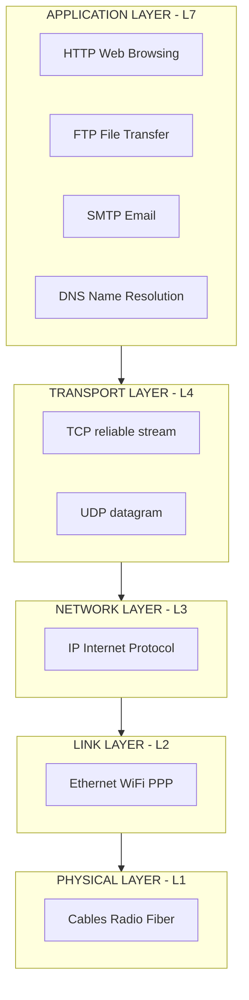
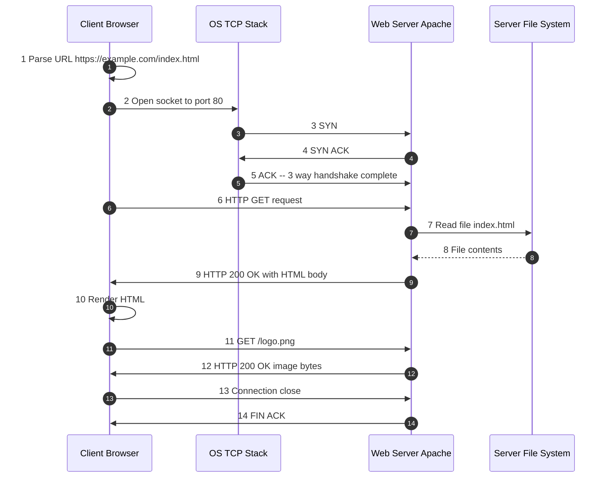
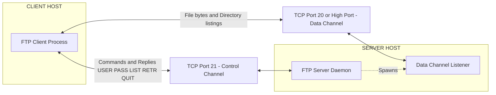
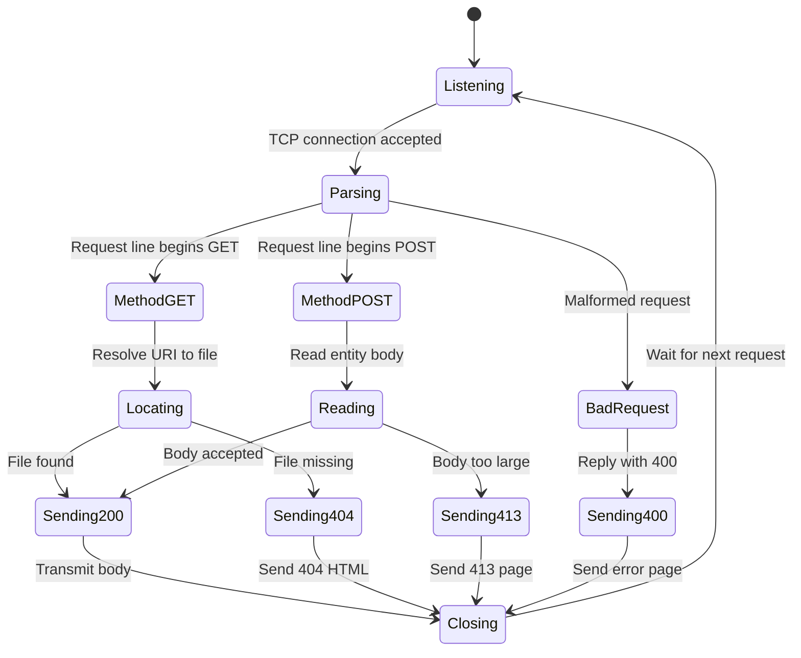
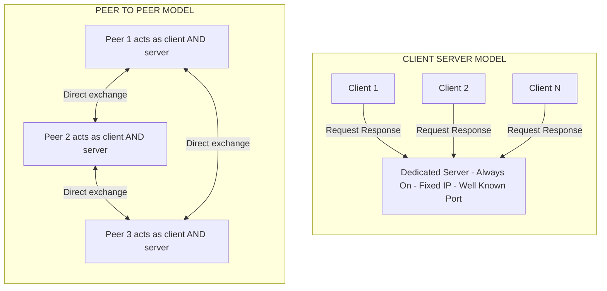

# Application Layer: Application-Layer Paradigms, Client-server applications - World Wide Web and HTTP, FTP.

<!-- SECTION_1_START -->
# Computer Networks — Module 1: The Application Layer Paradigm

## 1.1 The Application Layer — Formal KTU Definition

> [!IMPORTANT]
> **KTU 2024 Syllabus Definition:**
> The **Application Layer** is the **topmost (Layer 7)** layer of the **TCP/IP reference model** and the **OSI reference model**. It serves as the interface between the **end-user application processes** (running on hosts) and the **underlying network**. It defines the **protocols** that software uses to exchange meaningful data — e.g., **HTTP (Web)**, **FTP (File Transfer)**, **SMTP (Mail)**, **DNS (Naming)**.

The layer is **not the application itself**. Rather, it is the set of **rules, message formats, and sockets (port numbers)** that the application invokes through the Operating System's transport interface.

## 1.2 The Two Principal Application-Layer Paradigms

### A. Client–Server Paradigm
- A **always-on host** called the **server** provides a **service** and listens on a **well-known port**.
- A **client** initiates contact from an **ephemeral port**, sends a **request**, and waits for a **response**.
- **Asymmetric** — server is open to all, client is short-lived.
- Examples: **Web (HTTP)**, **File Transfer (FTP)**, **Email (SMTP)**, **DNS (mostly)**.

### B. Peer-to-Peer (P2P) Paradigm
- **Symmetric** — every host (peer) acts as both client and server.
- **Minimal (or no) dedicated infrastructure**.
- Examples: **BitTorrent**, **Skype (older versions)**.

> [!NOTE]
> **KTU High-Yield Distinction:** The exam loves asking *"Why is HTTP called a client-server protocol?"* The answer is the **always-on server with a fixed IP and well-known port (80 for HTTP, 21 for FTP)** plus **ephemeral client ports** — this asymmetry is the **defining property**.

## 1.3 Intuitive Analogy — "The Restaurant Model"

Imagine a **restaurant**:
- **You (Client)** — walk in, place an **order (request)**, and wait.
- **The Waiter (Application Layer Protocol — HTTP/FTP)** — a strict **set of phrases** ("May I take your order?", "Here is your bill").
- **The Kitchen (Server)** — fixed, always open, located at a known **address (IP)** and **table (port)**.
- **The Delivery Counter (Transport Layer — TCP/UDP)** — guarantees your food arrives **reliably and in order** (TCP) or **fast but unordered** (UDP).

> You never speak directly to the chef. The *waiter* (protocol) is the **Application Layer** — a **contract of language** between two parties who do not know each other's internals.

## 1.4 Real-World Entities Studied in KTU Module 1

| S.No | Entity | Purpose |
|:----:|:-------|:--------|
| 1 | **World Wide Web (WWW)** | Hypertext document system over HTTP/HTTPS |
| 2 | **HTTP (HyperText Transfer Protocol)** | Fetches web resources (RFC 7230 – 7235) |
| 3 | **FTP (File Transfer Protocol)** | Uploads/downloads files (RFC 959) |
| 4 | **Sockets** | Software API = IP + Port (e.g., 192.168.1.5:5050) |
| 5 | **Processes** | A program running on a host, identified by a socket |

> [!VISUALIZATION CONTROL]
> **Concept:** Client–Server Topology on a Coordinate Plane
> **Conceptual Mapping (draw mentally on paper):**
> * Server at point $S = (0, 0)$ — fixed, public IP
> * Client at point $C = (x, y)$ — variable, private IP behind NAT
> * Arrow $\vec{V} = C - S$ represents the **request vector** $R$
> * Arrow $\vec{V}' = S - C$ represents the **response vector** $L$
> **Visual Description:** The server is a stationary tower at the origin. Clients (dots) scatter around it; each client sends an inbound arrow (request) and receives an outbound arrow (response). The **length** of $\vec{V}$ symbolizes **RTT (Round Trip Time)**.
> **GeoGebra Input Equations:**
> * `S = (0, 0)` — Server
> * `C = (x, y)` — Generic client
> * `Vector((x, y))` — Request path
> * `Vector((-x, -y))` — Response path
<!-- SECTION_1_END -->

<!-- SECTION_2_START -->
# Deep Theoretical Analysis — HTTP, FTP & Application Paradigms

## 2.1 The World Wide Web (WWW) — Components

The WWW (invented by **Tim Berners-Lee, 1989**) is **not** a network. It is an **application** that runs on the Internet. Its pillars are:

1. **HTML (HyperText Markup Language)** — content format
2. **URL / URI (Uniform Resource Locator / Identifier)** — addressing
3. **HTTP (HyperText Transfer Protocol)** — transport of documents
4. **Web Browser** — client program
5. **Web Server** — server program (Apache, Nginx, IIS)

### URL Anatomy
$$
\text{URL} = \underbrace{\text{scheme}}_{\text{http}} :// \underbrace{\text{host}}_{\text{www.example.com}} : \underbrace{\text{port}}_{80} \underbrace{\text{path}}_{\text{/index.html}} \underbrace{\text{query}}_{\text{?id=5}}
$$

## 2.2 HTTP — The Web's Protocol

### Connection Model
- **HTTP/1.0** → **Non-persistent connections** — one TCP connection per object.
- **HTTP/1.1** → **Persistent connections** (default) — multiple objects over one TCP connection (with pipelining).
- **HTTP/2** → Multiplexed, binary, header-compressed (HPACK).
- **HTTP/3** → Runs over **QUIC** (UDP-based).

### HTTP Message Format — Request
$$
\underbrace{\text{Request Line}}_{\text{Method URI HTTP/}\backslash\text{ver}} \; ; \; \underbrace{\text{Header Lines}}_{\text{Key: Value}} \; ; \; \underbrace{\text{Blank Line CRLF}} \; ; \; \underbrace{\text{Entity Body}}_{\text{optional}}
$$

### HTTP Message Format — Response
$$
\underbrace{\text{Status Line}}_{\text{HTTP/}\backslash\text{ver Code Phrase}} \; ; \; \underbrace{\text{Header Lines}} \; ; \; \underbrace{\text{BLANK CRLF}} \; ; \; \underbrace{\text{Entity Body}}_{\text{typically HTML}}
$$

### HTTP Methods (High-Yield)
| Method | Purpose | Idempotent? | Body? |
|:-------|:--------|:-----------:|:------|
| **GET** | Retrieve a resource | ✅ Yes | ❌ No (in practice) |
| **POST** | Submit data / create | ❌ No | ✅ Yes |
| **HEAD** | Like GET but no body | ✅ Yes | ❌ No |
| **PUT** | Upload / replace resource | ✅ Yes | ✅ Yes |
| **DELETE** | Delete a resource | ✅ Yes | ❌ No |
| **OPTIONS** | Discover supported methods | ✅ Yes | ❌ No |

> [!NOTE]
> **KTU Favourite Question:** *"Is GET secure? Is it idempotent?"*
> GET is **idempotent** (multiple calls = same effect) but **NOT secure** — credentials in URL appear in server logs, browser history, and referrer headers.

### HTTP Status Codes — The Three-Digit Lexicon
| Range | Class | Example | Meaning |
|:------|:------|:--------|:--------|
| **1xx** | Informational | 100 Continue | "Wait, more coming" |
| **2xx** | Success | 200 OK, 201 Created | "Everything fine" |
| **3xx** | Redirection | 301 Moved Permanently, 304 Not Modified | "Go elsewhere" |
| **4xx** | Client Error | 400 Bad Request, 404 Not Found | "Your fault" |
| **5xx** | Server Error | 500 Internal Server Error, 503 Service Unavailable | "My fault" |

### Non-Persistent HTTP — Round Trip Time (RTT) Analysis
For a web page with **N** inline objects, each requiring a fresh TCP handshake:

$$
\text{Total Time} = 2 \times \text{RTT} \; + \; \sum_{i=1}^{N} \left( 2 \times \text{RTT}_i + \text{Transmission}_i \right) + \text{Base HTML}
$$

> The **2 × RTT** accounts for **TCP three-way handshake + HTTP request/response**.

> The **+1 × RTT** for non-persistent HTTP comes because after the TCP connection is established, the client still needs **one more RTT** to send the HTTP request and get the response back.

## 2.3 FTP — File Transfer Protocol (RFC 959)

### The Two-Channel Architecture (Unique!)
Unlike HTTP, FTP uses **TWO separate TCP connections**:

1. **Control Connection (Port 21)** — long-lived, carries **commands** (USER, PASS, LIST, RETR, STOR) and **reply codes** (3-digit).
2. **Data Connection (Port 20 for Active mode)** — short-lived, carries **actual file data**.

> [!IMPORTANT]
> **Active vs. Passive FTP — KTU Hot Topic:**
> - **Active Mode:** Server connects **back to client** on a client-specified port → blocked by **client-side firewalls**.
> - **Passive Mode (PASV):** Client connects **to server** on a negotiated high port → works through **client firewalls**, so it is the **modern default** in browsers.

### FTP Reply Codes (Like HTTP, but older)
| Code | Meaning |
|:-----|:--------|
| **220** | Service ready |
| **331** | User name okay, need password |
| **230** | User logged in |
| **150** | File status okay, opening data connection |
| **226** | Closing data connection, file transfer successful |
| **425** | Can't open data connection |
| **530** | Not logged in |

### FTP Commands (Client → Server)
| Command | Function |
|:--------|:--------|
| `USER <name>` | Send username |
| `PASS <pwd>` | Send password (in **plaintext** — security flaw!) |
| `LIST` | List directory |
| `RETR <file>` | Download a file |
| `STOR <file>` | Upload a file |
| `PASV` | Switch to passive mode |
| `QUIT` | End session |

## 2.4 KTU High-Yield Comparison Table — HTTP vs FTP

| Parameter | **HTTP** | **FTP** |
|:----------|:---------|:--------|
| **Default Port** | **80** (control) | **21** (control) + **20** (data) |
| **Stateful?** | Stateless (each request independent) | Stateful (session maintained) |
| **Connections** | Single (control = data over HTTP/1.1) | **Two** (control + data) |
| **Authentication** | Optional (basic/digest, sent over header) | Required (USER/PASS commands) |
| **Data Format** | Hypermedia (HTML, JSON, XML) | Binary / ASCII files |
| **Transport** | TCP | TCP |
| **Encryption** | HTTPS (TLS on port 443) | FTPS / SFTP (separate protocols) |
| **Out-of-band control?** | No (single channel) | **Yes** (commands and data separated) |
| **Used for** | Browsing the Web | Bulk file uploads/downloads |

## 2.5 Real-World Engineering Use Cases

- **HTTP/2 + TLS** powers **every modern browser** (Chrome, Firefox, Edge).
- **FTP** is still used in **legacy enterprise data exchange** (banking batch uploads, CMS migrations).
- **CDNs (Cloudflare, Akamai)** act as **reverse proxy servers** — they cache HTTP responses close to clients.
- **WebSockets** extend HTTP for **bidirectional real-time** apps (chat, trading dashboards).

<!-- SECTION_2_END -->

<!-- SECTION_3_START -->
# Step-by-Step Derivations, Message Dissection & Code Implementation

## 3.1 Dissection 1 — An HTTP GET Request (Raw Wire Format)

Suppose the user types `http://www.example.com/index.html` in a browser. The browser opens a TCP connection to port **80** of `93.184.216.34` and sends:

```
GET /index.html HTTP/1.1\r\n
Host: www.example.com\r\n
User-Agent: Mozilla/5.0 (X11; Linux x86_64)\r\n
Accept: text/html,application/xhtml+xml\r\n
Accept-Language: en-US,en;q=0.9\r\n
Connection: keep-alive\r\n
\r\n
```

### Line-by-Line Meaning (Valuation Key)
| Line | Mark Allocation | Meaning |
|:-----|:---------------:|:--------|
| `GET /index.html HTTP/1.1` | 1 mark | **Request line** → Method, URI, version |
| `Host: www.example.com` | 1 mark | **Mandatory in HTTP/1.1** — allows virtual hosting |
| `User-Agent:` | 1 mark | Identifies the browser/OS to the server |
| `Accept:` | 1 mark | MIME types the client can render |
| `Connection: keep-alive` | 1 mark | **Persistent** connection hint |

## 3.2 Dissection 2 — The Server's HTTP Response

```
HTTP/1.1 200 OK\r\n
Date: Mon, 23 May 2005 22:38:34 GMT\r\n
Server: Apache/2.2.3 (CentOS)\r\n
Content-Type: text/html; charset=UTF-8\r\n
Content-Length: 1234\r\n
Last-Modified: Wed, 08 Jan 2003 23:11:55 GMT\r\n
Connection: keep-alive\r\n
\r\n
<!DOCTYPE html>
<html>... 1234 bytes of HTML ...</html>
```

### Line-by-Line Meaning
- **Status line**: `HTTP/1.1` = version, `200` = code, `OK` = reason phrase.
- `Content-Length: 1234` tells the client **exactly how many bytes** of body to read — solves the **"where does the message end?"** problem.
- `Content-Type: text/html` triggers the **browser's HTML renderer**.

## 3.3 Derivation — Time to Fetch a Page with N Objects (Non-Persistent HTTP)

**Given:**
- One-way propagation delay = $d_{\text{prop}}$
- Transmission rate = $R$ bps
- HTML file size = $F$ bits
- Each of $N$ small objects = $f$ bits
- TCP handshake = **1 RTT**; HTTP request/response = **1 RTT**

**Step 1: TCP connection setup**
$$
t_1 = 1 \times \text{RTT} = 2 \times d_{\text{prop}}
$$

**Step 2: HTTP request + first response (HTML)**
$$
t_2 = 1 \times \text{RTT} + \frac{F}{R}
$$

**Step 3: Each of the N objects (new TCP + HTTP each time)**
$$
t_3 = N \times \left( 1 \times \text{RTT} + \frac{f}{R} \right)
$$

**Step 4: Total time for non-persistent HTTP**
$$
T_{\text{non-persistent}} = 2 \times \text{RTT} + \frac{F}{R} + N \times \left( \text{RTT} + \frac{f}{R} \right)
$$

**Step 5: Total time for persistent HTTP (HTTP/1.1)**
$$
T_{\text{persistent}} = 2 \times \text{RTT} + \frac{F}{R} + \text{RTT} + N \times \frac{f}{R}
$$

**Step 6: Speedup Ratio**
$$
\text{Speedup} = \frac{T_{\text{non-persistent}}}{T_{\text{persistent}}} = \frac{2 \text{RTT} + F/R + N(\text{RTT} + f/R)}{3 \text{RTT} + (F + Nf)/R}
$$

> For typical web pages with many small objects, the speedup can be **1.5× to 2×** — this is precisely why **HTTP/1.1 default = persistent**.

## 3.4 Dissection 3 — A Full FTP Session (Wire Trace)

A real FTP exchange between client `C` and server `S` looks like this:

```
C → S : TCP SYN                          (3-way handshake on port 21)
S → C : TCP SYN-ACK
C → S : TCP ACK
S → C : 220 (vsFTPd 3.0.3)               ← Greeting
C → S : USER alice
S → C : 331 Please specify the password.
C → S : PASS s3cret
S → C : 230 Login successful.
C → S : SYST
S → C : 215 UNIX Type: L8
C → S : PASV
S → C : 227 Entering Passive Mode (192,168,1,10,156,64).
       (→ IP 192.168.1.10, port 156×256 + 64 = 40000)
C → S : RETR report.pdf
S → C : 150 Opening BINARY mode data connection.
       ← New TCP connection to 192.168.1.10:40000 carries file
S → C : 226 Transfer complete.
C → S : QUIT
S → C : 221 Goodbye.
```

### Valuation Step Key
- The greeting **220** establishes readiness — **1 mark**.
- The **USER/PASS** exchange is the authentication handshake — **1 mark**.
- The **PASV** reply contains an **IP + 2-byte port** encoded as 6 decimal numbers — **2 marks** (students often miss the formula `port = h1 × 256 + h2`).
- The **separate TCP connection on port 40000** carries the file — **2 marks** for explaining the dual-channel design.

## 3.5 Python Implementation — A Minimal HTTP Client (Socket-Level)

```python
import socket
import sys
from typing import Tuple
from urllib.parse import urlsplit

def http_get(url: str, timeout: float = 5.0) -> Tuple[int, dict, bytes]:
    """
    Low-level HTTP/1.1 GET request via raw sockets.
    Returns: (status_code, headers_dict, body_bytes)
    Raises: socket.error, ConnectionRefusedError, TimeoutError
    """
    # Step 1: Parse URL into components
    parts = urlsplit(url)
    host: str = parts.hostname or "localhost"
    port: int = parts.port if parts.port else 80
    path: str = parts.path if parts.path else "/"

    # Step 2: Build the HTTP request message
    request: str = (
        f"GET {path} HTTP/1.1\r\n"
        f"Host: {host}\r\n"
        f"User-Agent: KTU-PremierEngine/1.0\r\n"
        f"Accept: */*\r\n"
        f"Connection: close\r\n"
        f"\r\n"
    )

    # Step 3: Open TCP socket (IPv4, TCP)
    with socket.socket(socket.AF_INET, socket.SOCK_STREAM) as sock:
        sock.settimeout(timeout)
        sock.connect((host, port))                  # TCP 3-way handshake
        sock.sendall(request.encode("ascii"))        # Send full request

        # Step 4: Receive response in chunks
        raw: bytes = b""
        while True:
            chunk: bytes = sock.recv(4096)
            if not chunk:                            # Server closed
                break
            raw += chunk

    # Step 5: Parse status line and headers
    header_blob, _, body = raw.partition(b"\r\n\r\n")
    status_line, *header_lines = header_blob.split(b"\r\n")
    version_code, *reason = status_line.split(b" ", 2)
    status_code: int = int(version_code.split(b"/")[1].split(b" ")[0])

    headers: dict = {}
    for line in header_lines:
        if b":" in line:
            k, v = line.split(b":", 1)
            headers[k.decode().strip()] = v.decode().strip()

    return status_code, headers, body

# --- Demo usage ---
if __name__ == "__main__":
    try:
        code, hdrs, body = http_get("http://example.com/index.html")
        print(f"Status    : {code}")
        print(f"Content-Tp: {hdrs.get('Content-Type', 'unknown')}")
        print(f"Body len  : {len(body)} bytes")
        print(f"First 80B : {body[:80]!r}")
    except socket.gaierror as e:
        print(f"[DNS FAIL]  {e}", file=sys.stderr)
    except socket.timeout as e:
        print(f"[TIMEOUT]   {e}", file=sys.stderr)
    except ConnectionRefusedError as e:
        print(f"[REFUSED]   {e}", file=sys.stderr)
```

### Line-by-Line Code Walkthrough
| Code Section | Purpose |
|:-------------|:--------|
| `urlsplit(url)` | Robustly splits URL → safe parsing |
| `f"GET {path} HTTP/1.1\r\n"` | Builds the **request line** — **mandatory CRLF** between lines |
| `Host:` header | **Mandatory in HTTP/1.1**; without it server returns 400 |
| `Connection: close` | Asks server to close TCP after this response — simplifies client code |
| `socket.AF_INET, SOCK_STREAM` | IPv4 + TCP — the exact transport HTTP uses |
| `sock.connect((host, port))` | Triggers the **TCP 3-way handshake** transparently |
| `partition(b"\r\n\r\n")` | Splits **headers** from **body** at the blank CRLF line |

## 3.6 Python — A Tiny FTP USER/PASS Handshake Logger

```python
import socket
from typing import List, Tuple

def ftp_login(host: str, port: int, user: str, password: str) -> List[Tuple[str, str]]:
    """
    Performs FTP USER/PASS handshake and returns [(sent, received), ...] trace.
    Strict error handling; raises on socket errors.
    """
    trace: List[Tuple[str, str]] = []

    with socket.socket(socket.AF_INET, socket.SOCK_STREAM) as s:
        s.settimeout(10)
        s.connect((host, port))                 # Connect on control port 21
        banner: bytes = s.recv(1024)
        trace.append(("[connect]", banner.decode(errors="replace").strip()))

        # Send USER
        s.sendall(f"USER {user}\r\n".encode())
        reply: bytes = s.recv(1024)
        trace.append((f"USER {user}", reply.decode(errors="replace").strip()))

        # Send PASS
        s.sendall(f"PASS {password}\r\n".encode())
        reply = s.recv(1024)
        trace.append(("PASS *****", reply.decode(errors="replace").strip()))

        # Logout
        s.sendall(b"QUIT\r\n")
        reply = s.recv(1024)
        trace.append(("QUIT", reply.decode(errors="replace").strip()))

    return trace

# Example:
# for sent, recv in ftp_login("ftp.gnu.org", 21, "anonymous", "guest@example.com"):
#     print(f"C: {sent}\nS: {recv}\n")
```

> [!IMPORTANT]
> **Security Insight:** Notice `PASS` sends the password in **plaintext** on the wire. This is why **modern variants — FTPS (FTP over TLS) and SFTP (SSH File Transfer Protocol, completely different protocol!) — are preferred in production**.

<!-- SECTION_3_END -->

<!-- SECTION_4_START -->
# Structural Diagrams & Schematics

## 4.1 Block Diagram — Application Layer Position in the TCP/IP Stack



> **Read this top-down**: Application protocols (HTTP/FTP) call down to TCP, which calls IP, which calls Ethernet, which calls copper/fiber/radio.

## 4.2 Sequential Processing Topology — HTTP Request–Response Cycle



## 4.3 Dual-Channel Architecture — FTP Control vs Data



> **Key Visual Insight:** Notice the **dashed arrow** from the Control Server to the Data Listener — when the control channel receives `RETR <file>`, it tells the data listener to **spawn a fresh data connection**.

## 4.4 State Transition Topology — HTTP Server Response Logic



## 4.5 Functional Block Topology — Client–Server vs Peer-to-Peer



<!-- SECTION_4_END -->

<!-- SECTION_5_START -->
# KTU 2024 Scheme Examination Question Bank

> **Mark Distribution & Cognitive Levels** are based on **KTU 2024 Scheme ESE pattern** (Part A: 3 marks; Part B: 14 marks with internal choice).

---

## PART A — Short Answer Questions (3 Marks Each)

### **Question 1** [KTU University Exam — July 2024]
> **CO1 | Remember**

**"List any three services provided by the Application Layer. State the well-known port number for HTTP and FTP."**

#### Model Answer (3 Marks — Board Standard)
- The Application Layer provides the following services:
  1. **Network Virtual Terminal** — software emulation of a terminal that allows a client to log into a remote host.
  2. **File Transfer, Access and Management (FTAM)** — enables a user to access, retrieve, manage and control files on a remote computer.
  3. **Mail Services** — supports the exchange of electronic mail between users.
  4. **Directory Services** — distributed databases that store information about users, systems, and services (e.g., DNS).
- **HTTP well-known port = 80**
- **FTP control port = 21** ; **FTP data port = 20** (1 mark for HTTP, 1 mark for FTP, 1 mark for services)

---

### **Question 2** [KTU University Exam — Dec 2023]
> **CO1 | Understand**

**"Differentiate between client-server and peer-to-peer application architectures. Give one example of each."**

#### Model Answer
| Feature | Client-Server | Peer-to-Peer |
|:--------|:--------------|:-------------|
| **Role symmetry** | Asymmetric — server is dedicated | Symmetric — each node is both client and server |
| **Server presence** | Always-on, fixed IP | No dedicated server |
| **Scalability** | Limited by server capacity | Scales as peers join |
| **Examples** | **HTTP (web)**, **FTP (file transfer)** | **BitTorrent (file sharing)**, **Gnutella** |

*(1 mark for any 2 differences, 1 mark for examples, 1 mark for final statement)*

---

## PART B — Long Answer Questions (14 Marks with Internal Choice)

> **NOTE:** As per KTU 2024 ESE pattern, candidates answer **EITHER** Question A **OR** Question B. Each carries **14 marks** with two sub-parts of **7 marks each**.

---

### **Question A (14 Marks)** [KTU University Exam — July 2024]
> **CO2 | Understand + Apply**

#### **(a)** Explain the HTTP request and response message formats with a suitable example. **(7 Marks)**

#### Model Answer — Step-by-Step

**Step 1 — State the two message types (1 Mark)**
HTTP defines two message types:
- **Request message** — sent by client to server.
- **Response message** — sent by server back to client.

**Step 2 — Draw and label the Request format (2 Marks)**
An HTTP request has the structure:
1. **Request Line** — `Method SP Request-URI SP HTTP-Version CRLF`
2. **Header Lines** — `Header-Name: Value CRLF` (one or more)
3. **Blank Line** — just `CRLF`
4. **Entity Body** — optional (used in POST, PUT)

**Step 3 — Show a concrete example (2 Marks)**
```
GET /hello.txt HTTP/1.1
Host: www.abc.com
User-Agent: Mozilla/5.0
Accept: text/plain
Connection: keep-alive
```

**Step 4 — Draw and label the Response format (1 Mark)**
1. **Status Line** — `HTTP-Version SP Status-Code SP Reason-Phrase CRLF`
2. **Header Lines**
3. **Blank Line**
4. **Entity Body**

**Step 5 — Show a concrete response example (1 Mark)**
```
HTTP/1.1 200 OK
Date: Mon, 23 May 2005 22:38:34 GMT
Server: Apache/2.2.3
Content-Type: text/plain
Content-Length: 12
Connection: close

Hello World!
```

---

#### **(b)** A web page consists of a base HTML file of size **20 KB** and **8** referenced objects, each of average size **5 KB**. The one-way propagation delay is **40 ms**, and the link transmission rate is **1 Mbps**. Compute the total response time using **non-persistent HTTP**. Use **RTT = 80 ms**. **(7 Marks)**

#### Model Answer — Step-by-Step

**Given:**
- Base HTML file $F = 20 \text{ KB} = 20 \times 1024 \times 8 = 163{,}840 \text{ bits}$
- Number of objects $N = 8$
- Each object $f = 5 \text{ KB} = 5 \times 1024 \times 8 = 40{,}960 \text{ bits}$
- One-way propagation delay $d_{\text{prop}} = 40 \text{ ms}$
- $\text{RTT} = 2 \times d_{\text{prop}} = 80 \text{ ms}$
- Transmission rate $R = 1 \text{ Mbps} = 10^6 \text{ bps}$

**Step 1 — Transmission time of base HTML (1 Mark)**
$$
t_{\text{HTML}} = \frac{F}{R} = \frac{163{,}840}{10^6} = 0.16384 \text{ s} = 163.84 \text{ ms}
$$

**Step 2 — Transmission time of one object (1 Mark)**
$$
t_{\text{obj}} = \frac{f}{R} = \frac{40{,}960}{10^6} = 0.04096 \text{ s} = 40.96 \text{ ms}
$$

**Step 3 — Non-persistent HTTP requires fresh TCP connection per object (1 Mark)**
Each object costs **2 RTT** (1 for TCP handshake + 1 for HTTP request/response) **+ transmission time**.

**Step 4 — Total time formula (1 Mark)**
$$
T_{\text{non-persistent}} = 2 \times \text{RTT} + t_{\text{HTML}} + N \times (2 \times \text{RTT} + t_{\text{obj}})
$$

**Step 5 — Plug in values (1 Mark)**
$$
T = 2(80) + 163.84 + 8 \times [2(80) + 40.96]
$$
$$
T = 160 + 163.84 + 8 \times [160 + 40.96]
$$
$$
T = 160 + 163.84 + 8 \times 200.96
$$
$$
T = 160 + 163.84 + 1607.68
$$
$$
T = 1931.52 \text{ ms} \approx 1.93 \text{ seconds}
$$

**Step 6 — Final answer with units (2 Marks)**
$$
\boxed{T_{\text{non-persistent}} \approx 1931.52 \text{ ms} \approx 1.93 \text{ s}}
$$

> [!WARNING]
> **KTU Examiner's Pitfall Warning:**
> - **Do NOT** forget that non-persistent HTTP opens a **new TCP connection per object** → this adds **N × 2 RTT**, not just N × 1 RTT.
> - **Always** convert KB → bits using $\times 8$ (since rate is in bits per second).
> - **Do NOT** confuse **2 RTT** (one for TCP handshake, one for HTTP) with **1 RTT**.

---

### **Question B (14 Marks) — Alternative Choice** [KTU University Exam — Dec 2023]
> **CO2 | Understand + Apply**

#### **(a)** Explain the FTP protocol in detail. Describe the control connection and data connection with neat diagrams. Compare FTP with HTTP. **(7 Marks)**

#### Model Answer — Step-by-Step

**Step 1 — Definition of FTP (1 Mark)**
**FTP (File Transfer Protocol)** is a standard TCP-based protocol defined in **RFC 959** used to **transfer files** between a client and a server. It uses **port 21** for the control channel and **port 20** (or a high port in passive mode) for the data channel.

**Step 2 — Control Connection (2 Marks)**
- Established first, on **TCP port 21**.
- **Long-lived** — remains open for the entire FTP session.
- Carries **FTP commands** (USER, PASS, LIST, RETR, STOR, QUIT) from client to server.
- Carries **FTP reply codes** (3-digit, like 220, 331, 230) from server to client.
- Commands and replies are sent as **7-bit ASCII** text.

**Step 3 — Data Connection (2 Marks)**
- Established on demand, on **TCP port 20** (active mode) or a **negotiated high port** (passive mode).
- **Short-lived** — opened for each file transfer, closed when done.
- Carries the **actual file bytes** (or directory listing).
- In **passive mode**, the client initiates the data connection — this is the **firewall-friendly** modern approach.

**Step 4 — Brief ASCII diagram (1 Mark)**
```
Client                     Server
  |--- TCP SYN ---------->|  (port 21, control)
  |<-- TCP SYN-ACK -------|
  |--- TCP ACK ---------->|
  |--- USER alice ------>|
  |<-- 331 ---------------|
  |--- PASS secret ----->|
  |<-- 230 ---------------|
  |--- PASV ------------>|  (asks for data port)
  |<-- 227 (h1,h2,h3,h4,p1,p2) - port = p1*256 + p2
  |--- TCP SYN ---------->|  (port p1*256+p2, data)
  |--- RETR file.txt --->|
  |<-- 150 ---------------|
  |<== file bytes ======>|
  |<-- 226 ---------------|
  |--- QUIT ------------->|
  |<-- 221 ---------------|
```

**Step 5 — Comparison with HTTP (1 Mark)**
- HTTP is **stateless**; FTP is **stateful** (login session).
- HTTP uses a **single connection**; FTP uses **two parallel connections**.
- HTTP is used for **web content**; FTP is for **bulk file transfer**.

---

#### **(b)** A user issues an FTP `PASV` command. The server replies with `227 Entering Passive Mode (192,168,10,5,7,136)`. **(i)** Identify the IP address and the data port the client must connect to. **(ii)** Explain what happens after the client connects to that port and issues `RETR notes.pdf`. **(7 Marks)**

#### Model Answer — Step-by-Step

**Step 1 — Decode the PASV reply (1 Mark)**
The PASV reply is: `(h1, h2, h3, h4, p1, p2) = (192, 168, 10, 5, 7, 136)`.

**Step 2 — Extract IP address (1 Mark)**
$$
\text{Server IP} = h1.h2.h3.h4 = 192.168.10.5
$$

**Step 3 — Compute the data port (2 Marks)**
The port is encoded in the last two bytes as: $\text{port} = p1 \times 256 + p2$
$$
\text{Data Port} = 7 \times 256 + 136 = 1792 + 136 = 1928
$$

**Step 4 — Client opens a NEW TCP connection to 192.168.10.5 : 1928 (1 Mark)**
The **existing control connection on port 21 remains open** for more commands; this is a **separate TCP socket** just for the data of this file.

**Step 5 — Client sends `RETR notes.pdf` on the CONTROL channel (1 Mark)**
The control connection receives the command and signals the data listener to expect a file retrieval.

**Step 6 — Server replies `150` on control channel, then sends file bytes on data channel (1 Mark)**
- Control: `150 Opening BINARY mode data connection for notes.pdf`
- Data connection carries the **binary content** of `notes.pdf`.
- Server sends `226 Transfer complete` on control channel after the data finishes.

$$
\boxed{\text{Data Port} = 1928 \text{ on IP } 192.168.10.5}
$$

> [!WARNING]
> **KTU Examiner's Pitfall Warning:**
> - **Always** apply the formula $\text{port} = p1 \times 256 + p2$. A common mistake is to write **port = p1.p2 = 7.136**, which is **wrong**.
> - **Do not** confuse FTP's **PASV** (client connects to server) with **PORT** (server connects to client) — KTU often gives this as a **trick question**.
> - Students forget that the **control connection is never closed during file transfer** — only the **data connection** is opened/closed per object.

---

## **Topic Recap & Important Things to Remember**

> [!IMPORTANT]
> **Rapid Revision Checklist — Must Memorize Before Exam**

- 🔑 **Application Layer = Layer 7** in both OSI and TCP/IP models. It is **NOT the application itself** — it is the **set of protocols** the application invokes.
- 🔑 **Client-Server paradigm** = always-on server, fixed IP, well-known port + ephemeral client ports. **Asymmetric.**
- 🔑 **Peer-to-Peer paradigm** = no dedicated server, every node is both. **Symmetric.**
- 🔑 **WWW components** = **H**TML + **U**RL + **H**TTP + **B**rowser + **S**erver.
- 🔑 **HTTP default port = 80**; **HTTPS = 443**; **FTP control = 21**; **FTP data = 20 (active) or high port (passive)**.
- 🔑 **HTTP message structure** = `[Request/Status Line] [Headers] [Blank CRLF] [Body]`. The **blank line is mandatory** — it separates headers from body.
- 🔑 **HTTP methods** — **GET** (retrieve, idempotent, no body), **POST** (submit, not idempotent, has body), **HEAD**, **PUT**, **DELETE**, **OPTIONS**.
- 🔑 **HTTP status codes** — **1xx info**, **2xx success** (200 OK), **3xx redirect** (301, 304), **4xx client error** (400, 404), **5xx server error** (500, 503).
- 🔑 **Non-persistent HTTP time** = $2\,\text{RTT} + F/R + N(2\,\text{RTT} + f/R)$.
- 🔑 **Persistent HTTP time** = $2\,\text{RTT} + F/R + \text{RTT} + Nf/R$.
- 🔑 **FTP uses TWO TCP connections**: **Control (port 21)** carries commands, **Data (port 20 or negotiated high port)** carries file bytes.
- 🔑 **PASV port decoding formula**: $\text{port} = p_1 \times 256 + p_2$ from the last two numbers in the 227 reply.
- 🔑 **Active FTP** = server connects to client (blocked by client firewalls); **Passive FTP** = client connects to server (firewall-friendly, modern default).
- 🔑 **FTP is stateful** (login session via USER/PASS); **HTTP is stateless** (each request independent).
- 🔑 **FTP passwords travel in plaintext** on the wire — hence **FTPS / SFTP** in production.
- 🔑 **Process addressing** uses **sockets** = `(IP address, port number)`.
- 🔑 **Well-known ports** are **0–1023** reserved for system/server services.
<!-- SECTION_5_END -->
