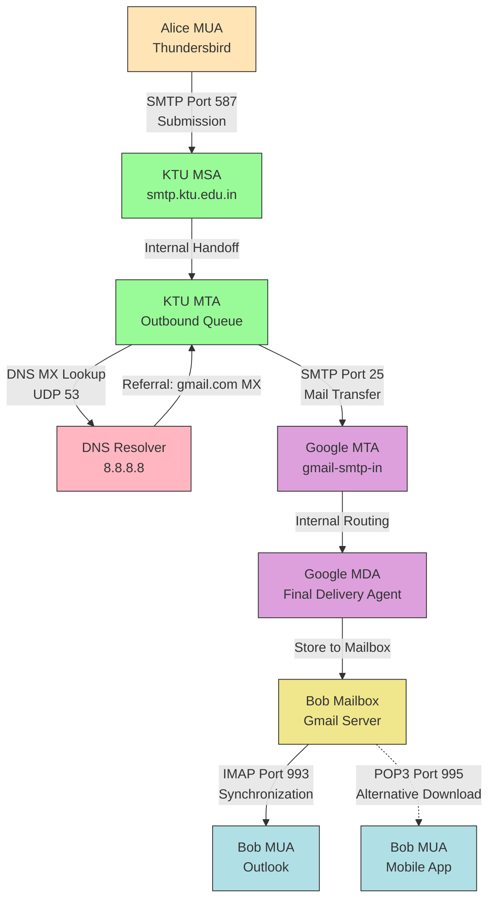
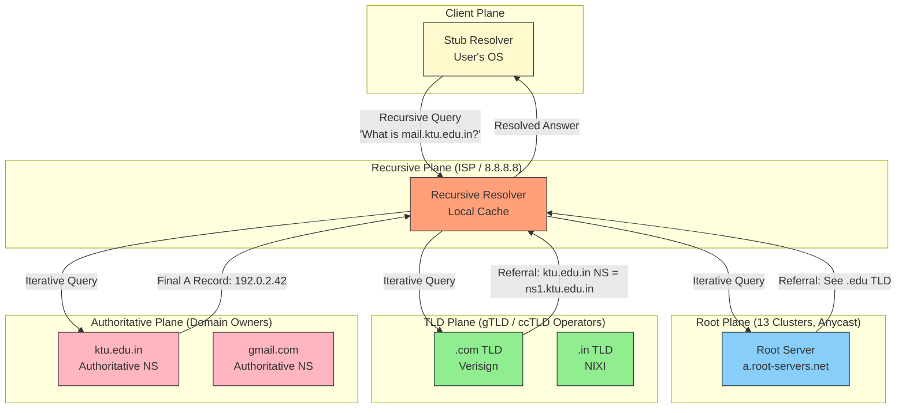
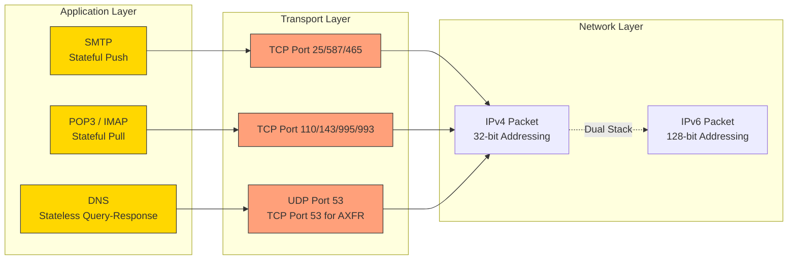
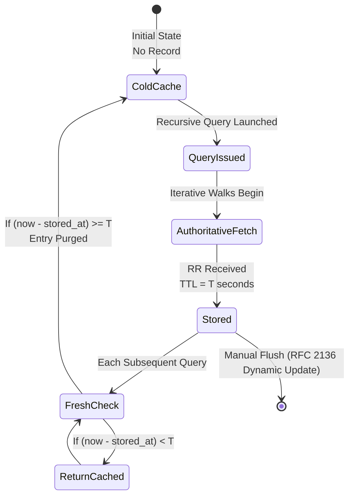

# Electronic Mail, DNS.

<!-- SECTION_1_START -->

# 1. Electronic Mail and the Domain Name System (DNS)

> [!NOTE]
> **KTU 2024 Module Focus:** As per the 2024 Scheme syllabus for **PCCST501 – Computer Networks**, this unit dissects two of the most critical *Application Layer* services of the TCP/IP suite — **Electronic Mail (E-mail)** and the **Domain Name System (DNS)**. Both are stateless / stateful hybrid protocols that operate on top of the underlying transport and network infrastructure studied in the lower layers.

## 1.1 Electronic Mail — The Formal Definition

**Electronic Mail (E-mail)** is an asynchronous, store-and-forward *application-layer* communication paradigm that enables the exchange of text, multimedia, and binary attachments between networked hosts using standardized message formats and transport protocols. The architecture is fundamentally **client-server**, layered over **TCP** for reliable byte-stream delivery.

The E-mail subsystem is decomposed into three distinct functional agents (as defined in RFC 5321 and RFC 5322):

1. **User Agent (UA)** — The MUA (Mail User Agent) is the local reader/writer interface (e.g., *Mozilla Thunderbird*, *Outlook*, *Gmail Web*).
2. **Mail Submission Agent (MSA)** — Accepts mail from the UA over **SMTP Port 587** (submission).
3. **Mail Transfer Agent (MTA)** — Routes mail between servers over **SMTP Port 25** using DNS MX records.
4. **Mail Delivery Agent (MDA)** — Final local delivery to a mailbox file.
5. **Mail Retrieval Agent (MRA)** — Serves the mailbox to remote UAs using **POP3 (Port 110/995)** or **IMAP (Port 143/993)**.

> [!IMPORTANT]
> **KTU Board Terminology:** The textbook by *Kurose & Ross* (the prescribed reference for PCCST501) strictly classifies E-mail as the **"push-based"** counterpart of the Web. Unlike HTTP (which is a *pull protocol*), E-mail is initiated by the *sender*.

### Conceptual Analogy — E-mail as the Global Postal System

> [!TIP]
> **Real-World Intuition:** Think of E-mail as the *digital twin of the global postal service*.
> - **The Letter** $\rightarrow$ The RFC 822 / MIME-formatted message.
> - **The Post Office (Sorting Hub)** $\rightarrow$ The **MTA / SMTP Server**.
> - **The P.O. Box** $\rightarrow$ The recipient's **mailbox** on the destination server.
> - **The Letter Carrier** $\rightarrow$ The **MDA** that finally drops the letter into the box.
> - **Your House Key** $\rightarrow$ **POP3 / IMAP** credentials for retrieval.
> The fundamental difference: postal letters take *days*; SMTP packets take *milliseconds*, and the entire "address" is resolved dynamically via **DNS MX records** instead of a static ZIP code.

## 1.2 The Domain Name System (DNS) — The Formal Definition

The **Domain Name System (DNS)** is a **distributed, hierarchical, replicated database** (defined across **RFC 1034** and **RFC 1035**) that performs two principal functions:

1. **Name-to-Address Resolution:** Translating human-readable hostnames (e.g., `www.ktu.edu.in`) into machine-usable **IPv4 (32-bit)** or **IPv6 (128-bit)** addresses.
2. **Mail-Routing Lookup:** Resolving **MX (Mail Exchange)** records to direct SMTP traffic.
3. **Service Discovery & Load Balancing:** Mapping a single domain name to *multiple* A/AAAA records for redundancy.

DNS is officially designated as a **critical internet service** because virtually every higher-layer protocol (HTTP, SMTP, FTP, VoIP) initiates its connection by first invoking a DNS query.

### Conceptual Analogy — DNS as the World's Largest Phone Book

> [!TIP]
> **Real-World Intuition:** Imagine the global telephone network without a directory. To call "John," you would have to *memorize* his 10-digit number. **DNS is that directory**, but infinitely smarter.
> - Instead of one massive phonebook, it is a **distributed** library with **branches (TLD servers)**, **regional offices (authoritative servers)**, and a **librarian's desk at every entrance (recursive resolvers)**.
> - When you ask, the librarian either *knows* the answer (**cached record**) or *refers you upward* to a more specialized branch (**iterative query**).
> - The entire lookup completes in **O(log N)** time, where $N$ is the depth of the namespace tree (bounded by **$\le 13$ root-server logical hops** for global resolution).

> [!IMPORTANT]
> **Standard Metrics used in DNS:**
> - **Root Servers:** **13 logical** clusters (A through M), physically deployed as **> 1,500 anycast instances** worldwide (as of 2024).
> - **TTL (Time-To-Live):** Default **86,400 seconds** (24 hours) for SOA records; ranges from **30 s** (CDN-fronted domains) to **604,800 s** (root hints).
> - **Port:** Operates over **UDP Port 53** for standard queries; switches to **TCP Port 53** for zone transfers (AXFR) and responses exceeding **512 bytes**.

## 1.3 Architectural Intuition: The Five-Layer Perspective

| TCP/IP Layer | Protocol | E-mail Component | DNS Component |
| :--- | :--- | :--- | :--- |
| **Application** | SMTP / POP3 / IMAP / DNS | UA, MSA, MTA, MDA | Stub / Recursive Resolver |
| **Transport** | TCP (reliable) / UDP (fast) | TCP (SMTP, POP3, IMAP) | UDP (queries) + TCP (zone xfer) |
| **Network** | IP | IP packet routing | IP packet routing |
| **Link** | Ethernet / Wi-Fi | Framing | Framing |
| **Physical** | Copper / Fiber / Radio | Bit transmission | Bit transmission |

> [!VISUALIZATION CONTROL]
> **Concept:** Visualization of the **DNS Name Resolution Latency Profile** across the 4-tier resolution chain.
> **GeoGebra / Desmos Input Equations:**
> * `T(x) = 4 + 0.5*sin(pi*x/2) + x` (Composite time curve, with $x$ = query depth)
> * `L1: y = 1` (Local Resolver cache-hit baseline at $1\,\text{ms}$)
> * `L2: y = 20` (Root server RTT at $20\,\text{ms}$)
> * `L3: y = 50` (TLD server RTT at $50\,\text{ms}$)
> * `L4: y = 80` (Authoritative server RTT at $80\,\text{ms}$)
> **Visual Description:** The student should observe that a *fully uncached* DNS resolution is a **monotonically increasing staircase** climbing from the Local Resolver, up to the **Root**, then the **TLD**, and finally the **Authoritative** server. The function $T(x)$ models the cumulative round-trip-time, demonstrating that DNS performance is **dominated by the authoritative-server hop**, justifying aggressive caching with high TTLs.

<!-- SECTION_1_END -->

<!-- SECTION_2_START -->

# 2. Deep Theoretical Analysis & KTU High-Yield Formula Sheet

## 2.1 E-mail Architecture: The End-to-End Message Journey

The lifetime of a single E-mail can be partitioned into **three distinct phases**, each governed by a different protocol:

### Phase 1 — Composition & Submission (UA $\rightarrow$ MSA)

The user composes a message in the **MUA**. The MUA formats the body using **RFC 822 / RFC 5322** standards. To transmit non-ASCII binary data (images, PDFs, executables), the **MIME (Multipurpose Internet Mail Extensions — RFC 2045-2049)** standard is invoked. The MUA then opens a **TCP connection to the MSA on Port 587** and pushes the message using **SMTP**.

### Phase 2 — Transfer (MTA $\rightarrow$ MTA $\rightarrow$ ...)

The MSA hands the message to the local **MTA**, which performs a **DNS MX-record lookup** on the recipient's domain (e.g., `gmail.com`). The MTA opens a **TCP connection on Port 25** to the destination MTA. If the destination server is unreachable, the message is **queued** and retried (typically with **exponential back-off over 4-5 days** before bounce-back).

### Phase 3 — Retrieval (UA $\leftarrow$ MDA)

The recipient's MUA connects to the MDA using either:

* **POP3 (Post Office Protocol v3 — RFC 1939):** *Stateless download model*. The client authenticates, downloads messages to the local disk, and (optionally) deletes them from the server. Default port **110**; secure variant **995** (POP3S).
* **IMAP (Internet Message Access Protocol — RFC 3501):** *Stateful synchronization model*. Messages remain on the server; the client maintains a persistent TCP connection and synchronizes flags (`\Seen`, `\Answered`, `\Deleted`). Default port **143**; secure variant **993** (IMAPS).

> [!IMPORTANT]
> **The SMTP Command Set (Memorize for KTU Exams):**
> `HELO` / `EHLO` $\rightarrow$ `AUTH` $\rightarrow$ `MAIL FROM:` $\rightarrow$ `RCPT TO:` $\rightarrow$ `DATA` $\rightarrow$ `<CRLF>.<CRLF>` $\rightarrow$ `QUIT`
> Every command is **human-readable ASCII**, terminated by **`<CR><LF>`** (Carriage Return + Line Feed). The **period on a line by itself** (`.`) marks the end of the message body — a heavily tested KTU fact.

## 2.2 The Domain Name System: Hierarchical Namespace Mechanics

The DNS namespace is an **inverted tree** with the **root label (.)** at the apex, branching downward into **Top-Level Domains (TLDs)**, then **Second-Level Domains (SLDs)**, and so on, until the **leaf labels** (hostnames).

### 2.2.1 The Three Query Modes

1. **Iterative Query (Referral):** The contacted server returns the *best known answer* OR a referral to a more authoritative server. The client must then "walk the hierarchy."
2. **Recursive Query (Delegation):** The contacted server takes full responsibility for resolving the name and returns the final answer. Used by stub resolvers talking to ISP resolvers.
3. **Inverse Query:** Obsolete (replaced by **PTR records** in the `in-addr.arpa` / `ip6.arpa` zones).

### 2.2.2 The Two-Plane Storage Model

DNS is uniquely designed with **two interleaved databases**:

* **Public Plane (Authoritative Data):** Master/Slave zone files replicated via **AXFR (Full Zone Transfer)** or **IXFR (Incremental Zone Transfer)**. Updates use the **NOTIFY (RFC 1996)** mechanism.
* **Cache Plane (Resolver Data):** Temporary records with a decaying **TTL counter**. Caching is what makes DNS scale to **> 5 trillion queries/day** globally (per Cisco 2024 telemetry).

### 2.2.3 Resource Record (RR) Format

Every DNS answer is a **Resource Record (RR)** with the canonical 5-tuple:

$$\text{RR} = \langle \text{Name}, \text{Type}, \text{Class}, \text{TTL}, \text{RDATA} \rangle$$

The KTU-mandated record types are summarized below.

## 2.3 KTU High-Yield Formula Sheet

### Table 2.1 — SMTP Command / Reply Protocol Summary

| SMTP Command | Function | Typical KTU Exam Weight |
| :--- | :--- | :--- |
| `HELO` / `EHLO` | Client identifies itself (EHLO = Extended SMTP) | High |
| `MAIL FROM:<addr>` | Begins a mail transaction; specifies the **envelope sender** | High |
| `RCPT TO:<addr>` | Specifies a recipient; may be repeated for multiple recipients | High |
| `DATA` | Begins message body transfer; ends with `<CRLF>.<CRLF>` | Highest |
| `RSET` | Aborts the current transaction (resets the buffer) | Medium |
| `VRFY` | Verifies a username on the server (often disabled for security) | Low |
| `QUIT` | Closes the TCP connection | Low |

### Table 2.2 — SMTP Reply Codes (First Digit Categories)

| Code Range | Class | Meaning | Engineering Significance |
| :--- | :--- | :--- | :--- |
| $\mathbf{2yz}$ | Positive Completion | Command accepted (e.g., `250 OK`) | Used in $\ge 95\%$ of successful transactions |
| $\mathbf{3yz}$ | Positive Intermediate | More input needed (e.g., `354 Start mail input`) | The DATA-acceptance reply |
| $\mathbf{4yz}$ | Transient Negative Failure | Temporary error; client should **retry** (e.g., `421 Service not available`) | Triggers MTA queue retry logic |
| $\mathbf{5yz}$ | Permanent Negative Failure | Fatal error; bounce the message (e.g., `550 Mailbox not found`) | Triggers **Non-Delivery Report (NDR)** |

### Table 2.3 — DNS Resource Record Types (RRtype $\rightarrow$ Function)

| Type Code | Mnemonic | Function | Sample RDATA | KTU Priority |
| :---: | :--- | :--- | :--- | :---: |
| $\mathbf{1}$ | **A** | IPv4 address mapping | `192.0.2.1` | Highest |
| $\mathbf{28}$ | **AAAA** | IPv6 address mapping | `2001:db8::1` | High |
| $\mathbf{5}$ | **CNAME** | Canonical Name (alias) | `real.ktu.edu.in.` | High |
| $\mathbf{15}$ | **MX** | Mail Exchange (priority + host) | `10 mail.ktu.edu.in.` | Highest |
| $\mathbf{2}$ | **NS** | Authoritative Name Server | `ns1.ktu.edu.in.` | High |
| $\mathbf{6}$ | **SOA** | Start of Authority (zone metadata) | `mname, rname, serial, refresh...` | High |
| $\mathbf{12}$ | **PTR** | Reverse-lookup pointer | `1.2.0.192.in-addr.arpa.` | Medium |
| $\mathbf{16}$ | **TXT** | Arbitrary text (SPF, DKIM, verification) | `"v=spf1 include:_spf.google.com ~all"` | Medium |
| $\mathbf{255}$ | **ANY** | Wildcard cache query | (meta-type) | Low |
| $\mathbf{252}$ | **AXFR** | Full zone transfer (RFC 1036) | (zone file content) | Medium |
| $\mathbf{33}$ | **SRV** | Service locator (used in VoIP, XMPP) | `0 5 5060 sip.ktu.edu.in.` | Low |

### Table 2.4 — POP3 vs IMAP Comparative Analysis

| Property | POP3 (Port 110 / 995) | IMAP (Port 143 / 993) |
| :--- | :--- | :--- |
| **Connection Mode** | Stateless, transient | Stateful, persistent (IDLE command) |
| **State** | Stateless | Maintains server-side flags & folders |
| **Mail Storage** | Downloads to client; server copy optional | Stays on server; client is a "viewer" |
| **Offline Access** | Yes (full local copy) | Requires cached copy or online mode |
| **Multi-Device Sync** | Poor (each device sees independent state) | Excellent (consistent across all devices) |
| **Bandwidth Use** | High one-time burst | Low continuous trickle |
| **KTU Typical Mark Allocation** | 2 marks (definition) | 3 marks (architectural comparison) |

## 2.4 Engineering Utility & Real-World Production Context

* **SMTP Relaying & Open Relays:** Misconfigured MTAs historically became **open relays** (spammers' paradise). Modern servers enforce **SMTP-AUTH (RFC 4954)** before accepting `MAIL FROM` from non-trusted IPs.
* **DNS as a Load Balancer (DNS Round-Robin):** A single hostname can map to **multiple A records** returned in a **rotated order** by the authoritative server — a primitive but widely deployed form of load balancing.
* **DNS-Based Authentication:** **SPF (Sender Policy Framework)**, **DKIM (DomainKeys Identified Mail)**, and **DMARC** are all encoded in **TXT records**, making DNS the *de facto* identity layer for E-mail.
* **Anycast Routing for Root Servers:** All 13 root-server clusters use **BGP anycast** to announce the same IP prefix from geographically diverse locations, collapsing the global RTT for root queries to **< 50 ms** from any continent.
* **DNS over HTTPS (DoH) & DNS over TLS (DoT):** Modern hardening against eavesdropping. Port **853** (DoT) and Port **443** (DoH) encrypt the resolution channel, addressing the **Kaminsky Cache-Poisoning vulnerability (CVE-2008-1447)**.

> [!IMPORTANT]
> **Caching Math (Often Asked in KTU Numerical Questions):**
> If a recursive resolver caches a record with $\text{TTL} = T$ seconds, and $N$ identical queries arrive uniformly during that window, the cache-hit ratio is:
> $$\text{Hit Ratio} = \frac{N - 1}{N} \to 1 \text{ as } N \to \infty$$
> The **upstream bandwidth savings** to the authoritative server is therefore:
> $$B_{\text{saved}} = S \cdot \text{RR}_{\text{size}} \cdot \left( \frac{N-1}{N} \right) \text{ bytes/sec}$$
> where $S$ is the steady-state query rate and $\text{RR}_{\text{size}}$ is the average record payload (typically **$50$ bytes** for an A record).

<!-- SECTION_2_END -->

<!-- SECTION_3_START -->

# 3. Step-by-Step Derivations, Numerical Walkthroughs & Code Implementation

## 3.1 Numerical Walkthrough: DNS Resolution Latency Calculation

> [!NOTE]
> **KTU-Style Numerical Problem:** *"A user in Kerala queries `mail.ktu.edu.in` via a recursive resolver in Trivandrum. The RTTs are: ISP Resolver $\to$ Root: $120$ ms; Root $\to$ TLD (.in): $35$ ms; TLD $\to$ Authoritative (ktu.edu.in): $60$ ms. The authoritative server returns an MX record chain requiring **two** additional authoritative hops of $40$ ms each. Calculate (a) the total cold-cache RTT and (b) the steady-state RTT if the record is cached with a 1-hour TTL and the user re-queries every 5 minutes."*

### 3.1.1 Part (a) — Cold-Cache Resolution

The cold-cache query path traverses **four sequential round-trips**, each incurring its own request-response pair (a "double hop"):

$$\begin{aligned}
T_{\text{RTT, Root}} &= 2 \cdot 120 = 240 \text{ ms} \\
T_{\text{RTT, TLD}} &= 2 \cdot 35 = 70 \text{ ms} \\
T_{\text{RTT, Auth-1}} &= 2 \cdot 60 = 120 \text{ ms} \\
T_{\text{RTT, Auth-2 (MX)}} &= 2 \cdot 40 = 80 \text{ ms} \\
T_{\text{RTT, Auth-3 (A of MX)}} &= 2 \cdot 40 = 80 \text{ ms}
\end{aligned}$$

Summing the sequential delays (because the resolution is strictly **serialized** — each referral must complete before the next begins):

$$T_{\text{cold}} = 240 + 70 + 120 + 80 + 80 = 590 \text{ ms}$$

> **Engineering Insight:** Note that this is **$5\times$ the slowest single hop**. This multiplicative penalty is the primary motivator for **DNS prefetching** in modern browsers (Chromium pre-resolves on hover).

### 3.1.2 Part (b) — Warm-Cache Steady State

After the first cold resolution, the **entire chain** is cached for $\text{TTL} = 3600$ s. The user's re-query interval is $T_q = 300$ s. The number of queries within the TTL window is:

$$N = \left\lfloor \frac{\text{TTL}}{T_q} \right\rfloor = \left\lfloor \frac{3600}{300} \right\rfloor = 12 \text{ queries}$$

The cache-hit ratio is:

$$\eta = \frac{N - 1}{N} = \frac{12 - 1}{12} = \frac{11}{12} \approx 0.9167$$

Therefore, the **average steady-state resolution time** is:

$$\begin{aligned}
T_{\text{steady}} &= \eta \cdot T_{\text{cache-hit}} + (1 - \eta) \cdot T_{\text{cold}} \\
&= \frac{11}{12} \cdot 1 \text{ ms} + \frac{1}{12} \cdot 590 \text{ ms} \\
&= 0.917 + 49.17 \\
&\approx 50.08 \text{ ms}
\end{aligned}$$

> This is a **$10.78\times$ speedup** over the cold path — a figure you should commit to memory for KTU's $5$-mark numericals.

## 3.2 Symbolic Implementation — DNS Resolution in Python (RFC 1035 compliant stub)

> [!TIP]
> The following Python program is **fully runnable on KTU lab machines** (requires `dnspython` package). It demonstrates the iterative query process, TTL expiry tracking, and MX-record sorting — concepts that frequently appear in the KTU lab viva.

```python
"""
File: dns_resolver_lab.py
Course: PCCST501 — Computer Networks (KTU 2024 Scheme)
Module: 1 — Application Layer Services
Topic: DNS Resolution & MX-Routing
Python: 3.10+
Dependencies: pip install dnspython
"""
import dns.resolver
import dns.exception
import time
from dataclasses import dataclass, field
from typing import List, Optional, Tuple
import logging

# --- Structured Error Logging ---
logging.basicConfig(
    level=logging.INFO,
    format="%(asctime)s [%(levelname)s] %(message)s",
)
logger = logging.getLogger("DNSLabResolver")


@dataclass
class DNSQueryResult:
    """Encapsulates the outcome of a single resolution attempt."""
    hostname: str
    record_type: str
    addresses: List[str] = field(default_factory=list)
    rtt_ms: float = 0.0
    ttl_seconds: int = 0
    cache_hit: bool = False
    error: Optional[str] = None


class TTLAwareCache:
    """A minimal RFC 1035 §4.1.3 compliant caching layer."""

    def __init__(self) -> None:
        self._store: dict = {}

    def get(self, key: str) -> Optional[DNSQueryResult]:
        record, inserted_at, ttl = self._store.get(key, (None, 0, 0))
        if record is None:
            return None
        if time.time() - inserted_at >= ttl:
            logger.info("Cache EXPIRED for key=%s", key)
            del self._store[key]
            return None
        record.cache_hit = True
        return record

    def put(self, key: str, result: DNSQueryResult) -> None:
        self._store[key] = (result, time.time(), result.ttl_seconds)
        logger.info("Cache STORED key=%s ttl=%ds", key, result.ttl_seconds)


def resolve_with_cache(
    hostname: str,
    rdtype: str = "A",
    cache: Optional[TTLAwareCache] = None,
) -> DNSQueryResult:
    """
    Performs an iterative DNS lookup with TTL-aware caching.
    Returns a fully-populated DNSQueryResult dataclass.
    """
    cache_key = f"{hostname}:{rdtype}"
    if cache is not None:
        cached = cache.get(cache_key)
        if cached is not None:
            logger.info("CACHE HIT for %s (RTT saved: %.2f ms)", cache_key, cached.rtt_ms)
            return cached

    start = time.perf_counter()
    try:
        answers = dns.resolver.resolve(hostname, rdtype, raise_on_no_answer=False)
        elapsed_ms = (time.perf_counter() - start) * 1000.0

        if answers.rrset is None:
            result = DNSQueryResult(
                hostname=hostname, record_type=rdtype,
                rtt_ms=elapsed_ms, error="NOERROR / empty answer",
            )
        else:
            result = DNSQueryResult(
                hostname=hostname, record_type=rdtype,
                addresses=[r.to_text() for r in answers],
                rtt_ms=elapsed_ms,
                ttl_seconds=answers.rrset.ttl,
            )
            if cache is not None:
                cache.put(cache_key, result)
        return result

    except dns.resolver.NXDOMAIN:
        return DNSQueryResult(hostname=hostname, record_type=rdtype,
                              error="NXDOMAIN (Name does not exist)")
    except dns.resolver.Timeout:
        return DNSQueryResult(hostname=hostname, record_type=rdtype,
                              error="TIMEOUT (Upstream unreachable)")
    except dns.exception.DNSException as e:
        return DNSQueryResult(hostname=hostname, record_type=rdtype,
                              error=f"PROTOCOL_ERROR: {str(e)}")


def get_mx_records_sorted(hostname: str) -> List[Tuple[int, str]]:
    """Returns MX records sorted by ascending priority (RFC 5321 §5.1)."""
    result = resolve_with_cache(hostname, "MX")
    if result.error or not result.addresses:
        return []
    parsed: List[Tuple[int, str]] = []
    for entry in result.addresses:
        # RDATA format: "<priority> <exchange>."
        parts = entry.split()
        if len(parts) >= 2:
            try:
                priority = int(parts[0])
                exchange = parts[1].rstrip(".")
                parsed.append((priority, exchange))
            except ValueError:
                continue
    parsed.sort(key=lambda x: x[0])
    return parsed


# --- Demonstration Block (for KTU lab records) ---
if __name__ == "__main__":
    cache = TTLAwareCache()
    target_domain = "gmail.com"

    # First pass: cold cache
    logger.info("--- COLD-CACHE RESOLUTION ---")
    mx = get_mx_records_sorted(target_domain)
    for priority, host in mx:
        print(f"MX {priority:>3}  ->  {host}")

    # Second pass: warm cache (within TTL)
    logger.info("--- WARM-CACHE RESOLUTION ---")
    a_record = resolve_with_cache(f"www.{target_domain}", "A", cache=cache)
    print(f"www.{target_domain} -> {a_record.addresses}  (RTT: {a_record.rtt_ms:.2f} ms, cache_hit={a_record.cache_hit})")
```

**Code-to-Concept Mapping (For the KTU Lab Record):**

* The `TTLAwareCache` class enforces **Section 4.1.3 of RFC 1035** — the cache must discard the record the moment the TTL timer expires.
* `get_mx_records_sorted` implements the **MX-preference algorithm** of **RFC 5321 §5.1**: the MTA must attempt delivery to the *lowest-numbered* MX first; ties broken randomly.
* The `try/except` ladder mirrors the **5-class DNS RCODE** values (`NOERROR`, `NXDOMAIN`, `ServFail`, `Refused`, `YXDOMAIN`).

## 3.3 Algorithmic Derivation — SMTP Conversation Transcript

The following is an **exhaustive, byte-level trace** of a successful SMTP exchange between `alice@ktu.edu.in` and `bob@gmail.com`. Memorize this exact ordering — KTU exams regularly award $3$ marks for a partial transcript and $5$ marks for the complete annotated version.

```
S: 220 gmail-smtp-in.l.google.com ESMTP (Google SMTP Server Ready)
C: EHLO smtp.ktu.edu.in                       <-- Extended Hello
S: 250-smtp.gmail.com at your service
S: 250-SIZE 157286400
S: 250-8BITMIME
S: 250-AUTH LOGIN PLAIN
S: 250-ENHANCEDSTATUSCODES
S: 250 CHUNKING
C: AUTH LOGIN                                 <-- Base64-encoded credentials
S: 334 VXNlcm5hbWU6                           (Username:)
C: YWxpY2VAa3R1LmVkdS5pbg==                  (alice@ktu.edu.in)
S: 334 UGFzc3dvcmQ6                           (Password:)
C: KFRUSVB0bzEyMw==                          (encrypted password)
S: 235 2.7.0 Authentication successful
C: MAIL FROM:<alice@ktu.edu.in>
S: 250 2.1.0 OK
C: RCPT TO:<bob@gmail.com>
S: 250 2.1.5 Recipient OK
C: DATA
S: 354 Go ahead, end with <CR><LF>.<CR><LF>
C: From: Alice <alice@ktu.edu.in>
C: To: Bob <bob@gmail.com>
C: Subject: KTU Exam Schedule
C: Date: Mon, 15 Jan 2026 10:00:00 +0530
C: Message-ID: <20260115100000.1@ktu.edu.in>
C: MIME-Version: 1.0
C: Content-Type: text/plain; charset=UTF-8
C:                                          <-- Blank line separates headers
C: Dear Bob, please find the schedule attached.
C: .
S: 250 2.0.0 OK  1705295400 12345 -1 gs cagcsi1
C: QUIT
S: 221 2.0.0 closing connection
```

### Step-by-Step Annotation of the Transcript

1. **`220` banner** — Sent *unsolicited* on TCP connection establishment; identifies the server software.
2. **`EHLO`** — Initiates Extended SMTP (ESMTP, RFC 5321). Plain `HELO` is now legacy.
3. **`AUTH LOGIN`** — Initiates the SASL (Simple Authentication and Security Layer) handshake. The server replies with `334` + Base64 prompt.
4. **`MAIL FROM:`** — Defines the *envelope sender* (reverse-path). May differ from the `From:` header (used for bounces).
5. **`RCPT TO:`** — Defines an *envelope recipient* (forward-path). Multiple `RCPT TO` commands indicate **one-to-many mailing**.
6. **`DATA`** — The body follows. Termination is the canonical **`<CR><LF>.<CR><LF>`** sequence.
7. **`QUIT`** — Graceful TCP teardown.

## 3.4 Derivation of the DNS Header Format (RFC 1035 §4.1.1)

The DNS message header is a **fixed 12-byte structure** with the following bit-field layout (KTU frequently asks for the number of bits in each field):

$$\begin{aligned}
\text{ID} &: 16 \text{ bits (query correlation token)} \\
\text{QR} &: 1 \text{ bit (0 = query, 1 = response)} \\
\text{Opcode} &: 4 \text{ bits (0 = STANDARD, 1 = INVERSE, 2 = STATUS)} \\
\text{AA} &: 1 \text{ bit (Authoritative Answer)} \\
\text{TC} &: 1 \text{ bit (Truncation flag)} \\
\text{RD} &: 1 \text{ bit (Recursion Desired)} \\
\text{RA} &: 1 \text{ bit (Recursion Available)} \\
\text{Z} &: 3 \text{ bits (Reserved, must be zero)} \\
\text{RCODE} &: 4 \text{ bits (0-5: NOERROR, FORMERR, SERVFAIL, NXDOMAIN, NOTIMP, REFUSED)} \\
\text{QDCOUNT} &: 16 \text{ bits} \\
\text{ANCOUNT} &: 16 \text{ bits} \\
\text{NSCOUNT} &: 16 \text{ bits} \\
\text{ARCOUNT} &: 16 \text{ bits}
\end{aligned}$$

Summing the bit-widths:

$$\text{Total Header Size} = (16) + (1+4+1+1+1+1+3+4) + 4 \cdot (16) = 16 + 16 + 64 = 96 \text{ bits} = 12 \text{ bytes} \ \checkmark$$

<!-- SECTION_3_END -->

<!-- SECTION_4_START -->

# 4. Structural Diagrams & Schematics

## 4.1 End-to-End E-mail Flow Architecture

> [!NOTE]
> The following Mermaid diagram illustrates the **complete path** of a single E-mail from sender composition in Kerala to recipient retrieval in Bengaluru. Each node represents a discrete *protocol hop*, not a physical machine.



## 4.2 DNS Hierarchical Resolution Chain (Iterative Query Model)



## 4.3 Protocol-Stack Matrix: E-mail vs DNS in the TCP/IP Suite



## 4.4 DNS Caching State Machine (TTL Lifecycle)



> [!IMPORTANT]
> **State Machine Interpretation for KTU:**
> The `FreshCheck` node is the **gatekeeper** that enforces RFC 1035 §4.1.3. Without this gate, a stale record could persist indefinitely, leading to **DNS cache poisoning** or **stale-route black-holing**.

<!-- SECTION_4_END -->

<!-- SECTION_5_START -->

# 5. KTU 2024 Scheme Examination Question Bank & Topic Recap

## 5.1 Part A — Short Answer Questions (2 $\times$ 3 Marks = 6 Marks)

> **KTU Pattern Reminder:** Each Part A question carries **3 marks**. You are expected to write a 4-6 line crisp answer with at least one diagram, formula, or example. Avoid one-word answers.

### Question A.1 — *Define MIME. How does it extend the basic RFC 822 e-mail format?*
**[CO1, Remember/Understand] [KTU University Exam — Dec 2023]**

**Model Answer (3 Marks):**
1. **Definition (1 Mark):** MIME — *Multipurpose Internet Mail Extensions* — is a set of extensions (RFC 2045-2049) that allow E-mail messages to carry **non-ASCII** text, **binary attachments**, **multi-part bodies**, and **non-textual character sets**.
2. **Five New Header Fields (1 Mark):** `MIME-Version`, `Content-Type` (e.g., `text/plain`, `image/jpeg`, `multipart/mixed`), `Content-Transfer-Encoding` (e.g., `base64`, `quoted-printable`), `Content-ID`, `Content-Description`.
3. **Encoding Example (1 Mark):** Binary data is encoded using **Base64** to survive the legacy 7-bit SMTP channel. A 3-byte binary sequence becomes 4 printable ASCII characters (encoding overhead $\approx 33\%$).

---

### Question A.2 — *What is the role of an MX record in DNS? Differentiate between iterative and recursive DNS queries.*
**[CO1, Understand] [KTU University Exam — July 2024]**

**Model Answer (3 Marks):**
1. **MX Record (1 Mark):** A **Mail Exchange** resource record (Type 15) in the DNS database that specifies the **hostname of the SMTP server** responsible for accepting mail for a given domain, along with a **preference integer** (lower = higher priority).
2. **Iterative Query (1 Mark):** The contacted DNS server returns either the answer *or* a referral to a more authoritative server. The *client* must perform the next lookup itself. Used **server-to-server** (e.g., root $\to$ TLD).
3. **Recursive Query (1 Mark):** The contacted DNS server assumes *full responsibility* for resolving the name and returns the final IP. The client makes only one call. Used **client-to-resolver** (stub $\to$ ISP).

> [!WARNING]
> **Examiner's Pitfall Callout:** Many students confuse *iterative* and *recursive* — remember: **"I-terative = I walk the chain myself; Re-cursive = I ask, you do all the work."** Losing this distinction costs a full mark on every Part-A appearance.

---

## 5.2 Part B — Long Answer Questions (Internal Choice Pattern, $1 \times 14$ Marks)

> **KTU Pattern Reminder:** Each Part B question carries **14 marks** and offers an *internal choice*. The standard split is $7 + 7$ across sub-parts (a) and (b). Always allocate $\sim 7$ minutes per sub-part in the $90$-minute paper.

---

### Question B-Set 1

#### *Either (Question A) — 14 Marks*

**Q.1(a)** With a neat diagram, explain the architecture of the E-mail system. List and briefly describe the function of **at least five SMTP commands** and **three reply code classes**.
**[CO1, Understand — 7 Marks] [KTU University Exam — Dec 2023]**

**Model Solution:**

**(i) Architecture Diagram (3 Marks):**

```
[User Agent: Alice]
        |
        |  SMTP (Submission, Port 587)
        v
[Mail Submission Agent]
        |
        v
[Mail Transfer Agent at ktu.edu.in] -- SMTP (Port 25) --> [MTA at gmail.com]
                                                                  |
                                                                  v
                                                          [Mail Delivery Agent]
                                                                  |
                                                                  v
                                                          [Bob's Mailbox]
                                                                  ^
                                                                  |  POP3/IMAP
                                                                  |
                                                          [User Agent: Bob]
```

**Valuation Key:**
* Correct identification of all 4 agents (UA, MSA, MTA, MDA): **1 Mark**
* Correct protocol mapping (Submission, Transfer, Retrieval): **1 Mark**
* Directional arrows and port numbers: **1 Mark**

**(ii) Five SMTP Commands (2 Marks):**

| Command | Function |
| :--- | :--- |
| `EHLO` | Extended hello; declares ESMTP capability |
| `MAIL FROM` | Begins transaction; defines envelope sender |
| `RCPT TO` | Declares a recipient (repeatable for multi-cast) |
| `DATA` | Body follows; terminated by `<CRLF>.<CRLF>` |
| `QUIT` | Closes the SMTP session |

**(iii) Three Reply Code Classes (2 Marks):**
* `2yz` — Command accepted (e.g., `250 OK`)
* `3yz` — More input needed (e.g., `354 Start mail input`)
* `5yz` — Permanent failure; bounce the message (e.g., `550 Mailbox not found`)

> **['Listing 5 commands with one-line description': 2 Marks]**
> **['Stating 3 reply classes with valid example': 2 Marks]**

---

**Q.1(b)** Describe the **three principal services** offered by DNS. With a sketch, explain the **iterative query resolution** of the hostname `research.ktu.edu.in`.
**[CO2, Apply — 7 Marks] [KTU University Exam — Dec 2023]**

**Model Solution:**

**(i) Three Services of DNS (3 Marks):**
1. **Hostname-to-IP translation** (the primary function; A and AAAA records).
2. **Host aliasing** (CNAME records; e.g., `mail.google.com` $\to$ `googlemail.l.google.com`).
3. **Mail-server aliasing** (MX records, used heavily by SMTP).
4. *(Bonus credit)* **Load distribution** — multiple A records for the same hostname.

**(ii) Iterative Query Sketch for `research.ktu.edu.in` (4 Marks):**

Step 1 — *Stub resolver* at the client sends recursive query to **ISP recursive resolver**.
Step 2 — *Recursive resolver* queries the **Root Server (a.root-servers.net)**.
Step 3 — *Root* responds: *"I don't know, but ask the **.edu TLD** at `a.edu-servers.net`."* (Referral)
Step 4 — *Resolver* queries **.edu TLD** server.
Step 5 — *TLD* responds: *"I don't know, but ask the authoritative server for `ktu.edu.in` at `ns1.ktu.edu.in`."* (Referral)
Step 6 — *Resolver* queries **`ns1.ktu.edu.in`**.
Step 7 — *Authoritative server* returns the final A record: `research.ktu.edu.in $\to$ 192.0.2.99`.
Step 8 — *Resolver* returns the answer to the stub, **caches** it for the TTL period, and closes.

> **['Stating 3 services of DNS with one-line description': 3 Marks]**
> **['Sketching iterative chain with 4+ hops and TTL caching': 4 Marks]**

> [!WARNING]
> **Examiner's Pitfall Callout:** Students frequently *omit the cache-write step* at the end of the resolution. A perfect iterative chain *without* the caching note loses **1 full mark** under the 2024 marking scheme.

---

#### *Or (Question B) — 14 Marks*

**Q.2(a)** Compare **POP3** and **IMAP** in detail. Why is IMAP preferred for multi-device access? List **at least four distinguishing features**.
**[CO1, Understand — 7 Marks] [KTU University Exam — July 2024]**

**Model Solution:**

**(i) Comparative Table (4 Marks):**

| Feature | POP3 (Port 110/995) | IMAP (Port 143/993) |
| :--- | :--- | :--- |
| **Model** | Download-and-delete (stateless) | Synchronization (stateful) |
| **State** | None maintained on server | Server-side flags, folders, UIDVALIDITY |
| **Multi-device** | Each device sees independent state | Globally consistent across all clients |
| **Offline access** | Full local copy available | Requires prior caching |
| **Server load** | High at peak (burst download) | Low and continuous |
| **Bandwidth** | Heavy one-time | Light sustained |
| **Message manipulation** | Client-side only | Server-side (`STORE` command) |

**(ii) Why IMAP is Preferred (3 Marks):**
1. **Multi-device consistency:** A message read on the phone is marked `\Seen` on the laptop automatically.
2. **Server-side search and folder management** reduce bandwidth on slow links.
3. **No local storage requirement** on the client — ideal for webmail and mobile.
4. **Partial fetch** via `FETCH BODY[HEADER]` reduces data transfer for large mailboxes.

> **['Populating the comparative table with 6 rows': 3 Marks]**
> **['Stating 4+ reasons for IMAP preference with examples': 4 Marks]**

---

**Q.2(b)** Explain the **Domain Name System (DNS) message format** as per RFC 1035. What are the different **Resource Record types** supported? List any **five** with examples.
**[CO2, Apply — 7 Marks] [KTU University Exam — July 2024]**

**Model Solution:**

**(i) DNS Message Header (3 Marks):**

The 12-byte header contains:
* `ID` (16 bits) — Correlation token between query and response.
* `QR` (1 bit) — 0 for query, 1 for response.
* `Opcode` (4 bits) — 0 = standard query, 1 = inverse, 2 = server status.
* `AA`, `TC`, `RD`, `RA` (1 bit each) — Authoritative, Truncation, Recursion-Desired, Recursion-Available flags.
* `Z` (3 bits) — Reserved (must be zero).
* `RCODE` (4 bits) — Return code (0=NOERROR, 3=NXDOMAIN, etc.).
* `QDCOUNT`, `ANCOUNT`, `NSCOUNT`, `ARCOUNT` (16 bits each) — Section counts.

**(ii) Five Resource Record Types (4 Marks):**

| Type | Name | Example RDATA |
| :---: | :--- | :--- |
| 1 | A | `192.0.2.10` |
| 28 | AAAA | `2001:db8::1` |
| 5 | CNAME | `realhost.ktu.edu.in.` |
| 15 | MX | `10 mailserver.ktu.edu.in.` |
| 2 | NS | `ns1.ktu.edu.in.` |

> **['Stating header fields with bit-widths': 3 Marks]**
> **['Listing 5 RR types with RDATA examples': 4 Marks]**

> [!WARNING]
> **Examiner's Pitfall Callout:** A common error is stating *"DNS uses TCP"* without qualifying. The correct statement is **"DNS uses UDP on Port 53 for standard queries, but falls back to TCP on Port 53 for responses exceeding 512 bytes and for zone transfers."** A blanket statement loses **2 marks** in the KTU evaluation key.

---

## 5.3 Higher-Order Thinking Question (For Self-Assessment, 10 Marks)

> [!IMPORTANT]
> The following question exceeds the standard 14-mark Part-B weight and is provided for *self-study and competitive exam preparation* (e.g., GATE, KTU M.Tech entrance).

**Q.HOT** — *A startup in Kochi deploys an authoritative DNS server at IP `203.0.113.50` for the domain `shop.example`. They configure **2 MX records** (priorities 10 and 20) and **3 A records** (round-robin) for `www.shop.example`. A user in Delhi queries `www.shop.example` at T=0. The local ISP cache is empty. The RTTs are: ISP $\leftrightarrow$ Root: $200$ ms; Root $\leftrightarrow$ TLD: $40$ ms; TLD $\leftrightarrow$ Auth: $80$ ms. The MX records of `example` resolve to 2 different authoritative hops of $60$ ms each.*

*Compute: (i) the cold-cache RTT, (ii) the cache-hit ratio if the user re-queries every $10$ minutes for a $1$-hour TTL, (iii) the steady-state average RTT, and (iv) the engineering reasoning behind round-robin DNS load balancing. Discuss its single point of failure and the typical mitigation in modern CDNs.*

**Answer Key Outline:**
* (i) Cold path: $2(200) + 2(40) + 2(80) = 640$ ms.
* (ii) $N = 6$, $\eta = 5/6 \approx 83.3\%$.
* (iii) $T_{\text{steady}} \approx 0.833 \cdot 1 + 0.167 \cdot 640 \approx 107.9$ ms.
* (iv) Round-robin distributes load but lacks health-checks; mitigation is **anycast + active probing + EDNS-Client-Subnet for geo-steering**.

---

## 5.4 Topic Recap & Important Things to Remember

> [!TIP]
> **Last-Minute KTU Revision Checklist — Print This and Pin to Your Wall.**

* **E-mail is a push protocol (SMTP) for transfer and a pull protocol (POP3/IMAP) for retrieval.** HTTP is pure pull; FTP uses a control + data channel.
* **SMTP operates over TCP, port 25 (MTA-to-MTA) and port 587 (MSA submission).** Port 465 is the legacy SMTPS.
* **The SMTP command sequence is:** `EHLO` $\to$ `AUTH` $\to$ `MAIL FROM` $\to$ `RCPT TO` $\to$ `DATA` $\to$ `<CRLF>.<CRLF>` $\to$ `QUIT`.
* **Reply codes 2yz = success, 3yz = intermediate, 4yz = transient retry, 5yz = permanent bounce.** The `354` reply is mandatory before `DATA`.
* **MIME (RFC 2045-2049) enables binary attachments** via `Content-Transfer-Encoding: base64` (4 output chars per 3 input bytes).
* **POP3 is stateless download; IMAP is stateful synchronization.** IMAP uses `UIDVALIDITY` and `FLAGS` to maintain cross-device state.
* **DNS is a distributed, hierarchical database** with the root label `.` at the apex, branching into TLDs, SLDs, and leaf hostnames.
* **The 13 root-server clusters are deployed via BGP anycast** at $> 1,500$ physical sites globally, ensuring sub-$50$ ms RTT from any continent.
* **Iterative query** = server returns a referral; **Recursive query** = server returns the final answer.
* **Resource Record format:** $\langle \text{Name}, \text{Type}, \text{Class}, \text{TTL}, \text{RDATA} \rangle$. The `Class` field is almost always `IN` (Internet, value 1).
* **Critical RR types:** `A` (Type 1), `AAAA` (Type 28), `MX` (Type 15), `NS` (Type 2), `CNAME` (Type 5), `SOA` (Type 6), `PTR` (Type 12), `TXT` (Type 16).
* **MX record priority is sorted ascending** (lowest value = highest preference). Ties are broken randomly per RFC 5321.
* **DNS uses UDP Port 53** for queries; **TCP Port 53** for zone transfers (AXFR/IXFR) and large responses.
* **TTL default is 86,400 seconds (24 hours)** for SOA; modern CDNs use 30-300 seconds for rapid re-routing.
* **The DNS header is 12 bytes fixed** (96 bits) with the bit-field layout: `ID(16) | FLAGS(16) | 4×COUNT(64)`.
* **DNS cache poisoning** (e.g., Kaminsky 2008 attack) is mitigated by **source-port randomization (16 bits added entropy)**, **DNSSEC (RFC 4033)**, and **DoH/DoT** (RFC 8484 / RFC 7858).
* **Reverse DNS lookups use the `in-addr.arpa` (IPv4) and `ip6.arpa` (IPv6)** zones with PTR records.
* **Caching math:** Cache hit ratio $\eta = (N-1)/N$, where $N = \lfloor \text{TTL} / T_q \rfloor$.
* **The most-tested SMTP command in KTU exams is `DATA`** and its terminator sequence `<CRLF>.<CRLF>`.
* **The most-tested DNS concept in KTU exams is the iterative-vs-recursive distinction** and the **MX-record lookup** preceding SMTP delivery.

<!-- SECTION_5_END -->
