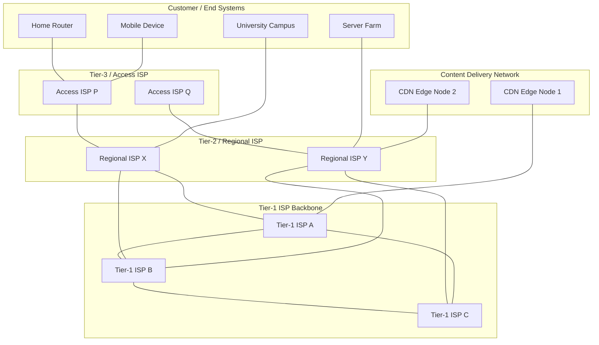
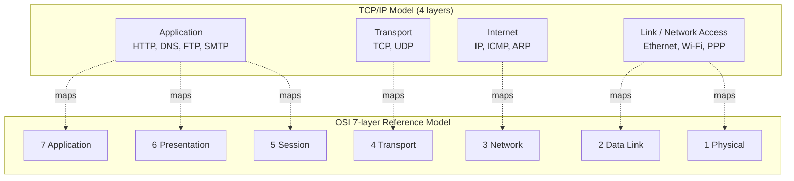
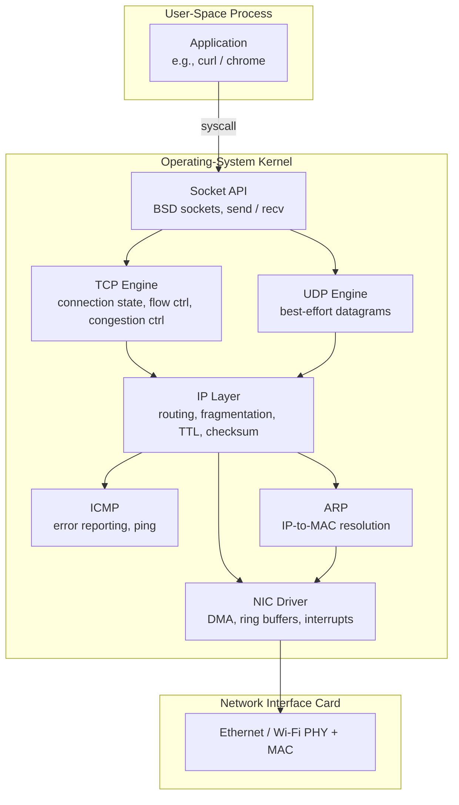
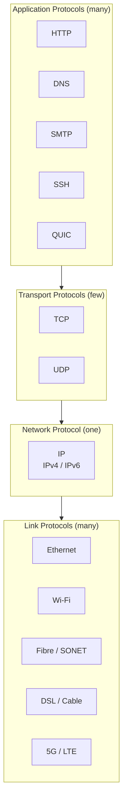

# Overview of the Internet, Protocol layering (Book 1 Ch 1)

<!-- SECTION_1_START -->
# Overview of the Internet & Protocol Layering

## 1.1 What is the Internet?

### Formal Academic Definition (KTU Syllabus Terminology)

> [!IMPORTANT]
> **The Internet** is a global, distributed, packet-switched computer network that interconnects billions of computing devices worldwide using the standardized **TCP/IP protocol suite**, the **Internet Protocol (IP)** addressing scheme, and publicly owned/operated physical infrastructure governed by autonomous systems and ISPs.

From a **nuts-and-bolts perspective**, the Internet is a network of networks — a federation of autonomously managed, heterogeneous packet-switching networks that agree to forward datagrams using a common global addressing and routing convention (IP).

From a **services perspective**, the Internet is an infrastructure that provides services to distributed applications (e-mail, web, file transfer, VoIP, video streaming, IoT, cloud APIs) which rely on its **connection-oriented** and **connectionless** communication primitives.

### Conceptual Analogy / Intuition

Think of the Internet as the **international postal system of data**:

- The **envelope** is the **datagram** (with a destination address written on it).
- The **addresses** are **IP addresses** (like postal ZIP codes but globally unique).
- The **postal trucks, planes, and sorting hubs** are **routers and links**.
- The **postal rules** (how to read addresses, sort, forward) are the **protocols**.
- The **letter inside** the envelope is the **application data**.

Just as a letter from Kerala can reach Tokyo because everyone agrees on a common addressing/routing system, a packet from a laptop in Thiruvananthapuram reaches a server in California because every device on the path speaks the same **Internet Protocol (IP)**.

---

## 1.2 The Network Edge — Hosts & Access Networks

**End systems** (also called **hosts**) are devices at the edge of the network that run distributed applications. They are categorised as:

- **Clients** — request services (e.g., browser on your phone).
- **Servers** — provide services (e.g., Google's web server).

**Access networks** connect end systems to the first-hop router (the "edge router"). The three dominant forms are:

| Access Type | Physical Medium | Typical Bandwidth | Use Case |
|---|---|---|---|
| **DSL (Digital Subscriber Line)** | Twisted-pair copper telephone line | 24–52 Mbps down / 3.5–16 Mbps up | Residential, uses existing phone line |
| **Cable (HFC)** | Coaxial cable + fibre (hybrid fibre-coax) | 50–1000+ Mbps shared | Residential TV + Internet |
| **FTTH (Fibre to the Home)** | Optical fibre | 100 Mbps – 10 Gbps | High-speed residential / enterprise |
| **5G / 4G LTE** | Wireless (radio over licensed spectrum) | 100 Mbps – 1 Gbps | Mobile, last-mile wireless |
| **Ethernet (LAN)** | Twisted-pair / fibre | 100 Mbps – 100 Gbps | Campus, enterprise |
| **Wi-Fi (IEEE 802.11)** | Wireless (unlicensed ISM bands) | 11 Mbps – 9.6 Gbps | Indoor / hotspot LAN |

> [!NOTE]
> **Physical Media** are categorised as:
> - **Guided media** (signal travels in a solid medium) — twisted-pair copper, coaxial cable, fibre-optic cable.
> - **Unguided media** (wireless) — terrestrial radio, satellite radio.
>
> Key engineering trade-offs: **attenuation**, **interference**, **propagation delay**, and **noise immunity**. Optical fibre offers the lowest attenuation (~0.2 dB/km) and highest bandwidth–distance product, hence its dominance in long-haul trunks.

---

## 1.3 The Network Core — Packet Switching vs Circuit Switching

The network core is the mesh of **routers** interconnected by **high-speed links** that ferry packets from source to destination. Two fundamental switching paradigms exist:

### Packet Switching (store-and-forward)
- Each **packet** (typically ≤ ~1500 bytes on Ethernet) carries a **header** with source/destination addresses and a **payload** with user data.
- **Store-and-forward**: the entire packet must arrive at a router before the router can begin transmitting it on the outgoing link.
- **Queueing & Loss**: if the arrival rate exceeds the link's transmission rate, packets are buffered; if the buffer overflows, **packet loss** occurs.
- **Statistical multiplexing** — bandwidth is shared on demand, not pre-allocated. This makes packet switching **efficient for bursty traffic**.

### Circuit Switching
- A dedicated **end-to-end circuit** (e.g., a fixed timeslot in TDM, or a frequency band in FDM) is reserved for the entire call duration.
- **Guaranteed bandwidth**, but **wasted capacity** during silent intervals (e.g., phone call where neither party speaks).
- Traditional PSTN used circuit switching; modern cellular (5G) and MPLS networks blend both paradigms.

### Traceroute — A Diagnostic Analogy

> [!VISUALIZATION CONTROL]
> **Concept:** End-to-end path of a packet through the Internet
> **GeoGebra / Desmos Input Equations:** *(not a coordinate-plane topic; use Mermaid block in Section 4)*
> **Visual Description:** A horizontal axis of *hop count* (1, 2, 3, …) with vertical labels of router IPs and round-trip-time (RTT) in ms. Students should observe the monotonic rise of RTT as the path traverses additional autonomous systems.

---

## 1.4 What is a Protocol?

> [!IMPORTANT]
> **A network protocol** is a formal, mutually agreed set of **rules, message formats, and procedures** that govern the communication between two or more entities across a network. It defines the **syntax** (structure of messages), **semantics** (meaning of messages), and **timing** (when and how messages are exchanged).

A human analogy: when you greet someone, you say *"Hello, how are you?"* and expect *"Hi, I'm fine"*. The expected message order, phrasing, and meaning constitute a **human protocol**. Network protocols do exactly the same, but in machine-executable form (RFCs, e.g., RFC 793 for TCP, RFC 791 for IP).

### Real-world protocol example: HTTP
When a browser fetches `https://example.com`:
1. Browser opens a **TCP connection** on port 443 to `93.184.216.34`.
2. Browser sends an **HTTP request**: `GET /index.html HTTP/1.1`.
3. Server replies with an **HTTP response**: `HTTP/1.1 200 OK` + payload.

This choreography is fully defined in **RFC 7230–7235** (HTTP/1.1) and is the universal contract between web clients and servers.

---

## 1.5 Networks Under Attack (Brief)

The Internet was designed for trust; modern reality is hostile. Common threat categories include:

- **Malware** — viruses, worms, trojans.
- **DoS / DDoS** — flooding a target with traffic.
- **Packet sniffing** — passive eavesdropping on shared media (Wi-Fi, hubs).
- **IP spoofing** — forging the source address to bypass ACLs.
- **MITM (man-in-the-middle)** — intercepting and relaying traffic secretly.

Defences: encryption (TLS), authentication, firewalls, IDS/IPS, rate-limiting, scrubbing centres.
<!-- SECTION_1_END -->

<!-- SECTION_2_START -->
# Deep Theoretical Analysis & KTU High-Yield Formula Sheet

## 2.1 Performance Metrics of a Packet-Switched Network

Four delays determine how a packet experiences the network. Let $a$ be the packet length in **bits** and $R$ be the link rate in **bits per second**.

### 2.1.1 Four Sources of Per-Packet Delay

| Delay Type | Symbol | Formula | Physical Origin |
|---|---|---|---|
| **Processing delay** | $d_{proc}$ | Typically microseconds | Routing table lookup, header checks, bit-error detection. |
| **Queueing delay** | $d_{queue}$ | Variable (depends on congestion) | Waiting in router buffer for transmission. |
| **Transmission delay** | $d_{trans}$ | $\dfrac{L}{R}$ | Time to push all $L$ bits of a packet onto the link. |
| **Propagation delay** | $d_{prop}$ | $\dfrac{d}{s}$ | Time for a signal to travel distance $d$ at speed $s$ ($\approx 2 \times 10^8$ m/s in fibre). |

$$d_{nodal} = d_{proc} + d_{queue} + d_{trans} + d_{prop}$$

The **end-to-end delay** across $N$ identical, uncongested routers with no queueing is:

$$d_{end\text{-}end} = N \cdot (d_{trans} + d_{prop})$$

### 2.1.2 Throughput
**Throughput** is the instantaneous rate (bits/sec) at which a receiver obtains data. Two flavours:

- **Instantaneous throughput** — rate at a moment in time.
- **Average throughput** — total bits received ÷ total time.

If a file of $F$ bits is transferred across $N$ links with rates $R_1, R_2, \dots, R_N$, and the source sends continuously, the end-to-end throughput is the **bottleneck link rate**:

$$R_{e2e} = \min(R_1, R_2, \dots, R_N)$$

### 2.1.3 Packet Loss
When a router's queue is full, newly arriving packets are dropped. The **packet loss probability** $p$ on a link is the steady-state fraction of dropped packets. A common simplified model:

$$L_{loss} = \lambda \cdot p$$

where $\lambda$ is the average arrival rate (packets/sec).

---

## 2.2 Queuing Theory — Intuition for $d_{queue}$

If packets arrive at average rate $a$ packets/sec and the link serves at $c$ packets/sec, the **traffic intensity** is $\rho = a/c$.

- If $\rho \ge 1$ → queue grows unbounded; system is unstable.
- If $\rho < 1$ → average queueing delay stays finite but grows as $\rho \to 1$.

A useful approximation (M/M/1-like) is:

$$d_{queue} \approx \frac{L}{R} \cdot \frac{\rho}{1 - \rho}$$

---

## 2.3 Protocol Layering — The Architectural Foundation

> [!IMPORTANT]
> **Protocol layering** is the architectural technique of decomposing a complex network communication system into a stack of *n* conceptual **layers**, each layer offering services to the layer above via a **service interface** and using services of the layer below. The n-th layer of one host communicates *logically* with the n-th layer of another host, governed by the **n-th layer protocol**, but **physically** data flows downward, across, and upward.

This separation of concerns allows **modular design, replaceable implementations, and independent standardisation**. Forouzan calls the building blocks **layers**, the active elements **peers**, and the logical communication **virtual communication**.

### 2.3.1 The Two Canonical Reference Models

#### OSI 7-Layer Model (ISO/IEC 7498-1)

| # | Layer | Unit of Data | Primary Function | Example Protocols |
|---|---|---|---|---|
| 7 | **Application** | Message / Data | Network services to user processes | HTTP, FTP, SMTP, DNS, DHCP |
| 6 | **Presentation** | Message | Data representation, encryption, compression | TLS, SSL, JPEG, MIME |
| 5 | **Session** | Message | Dialog control, synchronization | NetBIOS, RPC, SIP |
| 4 | **Transport** | Segment / Datagram | End-to-end process-to-process delivery, reliability, flow control | TCP (RFC 793), UDP (RFC 768) |
| 3 | **Network** | Packet / Datagram | Routing, logical addressing across networks | IP (IPv4 RFC 791, IPv6 RFC 8200), ICMP, OSPF, BGP |
| 2 | **Data Link** | Frame | Reliable link-local delivery, MAC addressing, error detection | Ethernet (IEEE 802.3), Wi-Fi (IEEE 802.11), PPP, HDLC |
| 1 | **Physical** | Bits | Bit-by-bit transmission over a physical medium | 1000BASE-T, SONET, DSL, 5G NR |

> **Mnemonic (top→down):** **A**ll **P**eople **S**eem **T**o **N**eed **D**ata **P**rocessing.

#### TCP/IP 4-Layer Model (DARPA / RFC 1122)

| # | Layer | Maps to OSI Layers | Example Protocols |
|---|---|---|---|
| 4 | **Application** | 5, 6, 7 | HTTP, DNS, FTP |
| 3 | **Transport** | 4 | TCP, UDP |
| 2 | **Internet (Network)** | 3 | IP, ICMP, ARP |
| 1 | **Link (Network Access)** | 1, 2 | Ethernet, Wi-Fi, PPP |

> The Internet today is built on the **TCP/IP** stack; the **OSI** model is primarily pedagogical and used for vendor interoperability discussions (e.g., in 5G core architectures, ITU-T recommendations).

### 2.3.2 Encapsulation

When a message travels down the protocol stack, each layer **adds its own header** (and sometimes trailer) — a process called **encapsulation**. On the receiving side, the inverse process is **decapsulation**.

**Application message → Transport segment → Network datagram → Link frame → Physical bits**

Each header carries the information the corresponding peer layer on the receiver needs to process the packet. This is why the packet grows in size as it moves down and shrinks as it moves up.

### 2.3.3 Service Models

- **Connectionless service** — sender pushes datagrams with no setup; receiver may or may not get them in order. (UDP, IP)
- **Connection-oriented service** — handshake, sequenced, reliable, flow-controlled byte stream. (TCP)

---

## 2.4 KTU Formula Sheet — Quick Reference

| # | Concept | Formula / Definition | Units |
|---|---|---|---|
| 1 | Transmission delay | $d_{trans} = L / R$ | seconds |
| 2 | Propagation delay | $d_{prop} = d / s$ | seconds |
| 3 | Nodal delay | $d_{nodal} = d_{proc} + d_{queue} + d_{trans} + d_{prop}$ | seconds |
| 4 | End-to-end delay (no queueing) | $d_{end} = N(d_{trans} + d_{prop})$ | seconds |
| 5 | Bottleneck throughput | $R_{e2e} = \min_i R_i$ | bps |
| 6 | Traffic intensity | $\rho = a / c$ | dimensionless |
| 7 | Queueing delay approximation | $d_{queue} \approx \dfrac{L/R \cdot \rho}{1 - \rho}$ | seconds |
| 8 | Bandwidth–Delay Product | $BDP = R \times d_{prop}$ | bits |
| 9 | Packet loss rate | $L_{loss} = \lambda \cdot p$ | packets/sec |
| 10 | Number of packets to fill pipe | $N = \lceil BDP / L \rceil$ | packets |

> [!IMPORTANT]
> **Physical constants to remember:**
> - Speed of light in vacuum: $c = 3 \times 10^8$ m/s
> - Speed of light in optical fibre: $s \approx 2 \times 10^8$ m/s
> - Speed of electricity in copper: $\approx 2 \times 10^8$ m/s
> - Max Ethernet payload (MTU): 1500 bytes
> - Max IPv4 datagram: 65535 bytes (typical path MTU is 1500)

---

## 2.5 Real-World Engineering Utility

| Concept | Where it is used in production |
|---|---|
| Packet switching | Internet backbone, MPLS, 5G data plane |
| Circuit switching | Legacy PSTN, ISDN, modern 5G voice (IMS over packet) |
| TCP/IP layering | Every networked device, every cloud, every CDN |
| Bottleneck throughput | CDN capacity planning, video bitrate selection (Netflix's adaptive streaming) |
| BDP | TCP receive-window sizing, satellite-link tuning |
| Queuing theory | Router buffer sizing (e.g., rule-of-thumb $B = RTT \times C$), data-centre fabric design |
<!-- SECTION_2_END -->

<!-- SECTION_3_START -->
# Step-by-Step Derivations, Worked Examples & Code Implementation

## 3.1 Worked Example 1 — End-to-End Delay Computation

> **Problem:** A packet of length $L = 1500$ bytes traverses a path with $N = 4$ identical links. Each link has transmission rate $R = 1$ Mbps and length $d = 2000$ km. Propagation speed in fibre is $s = 2 \times 10^8$ m/s. Processing and queueing delays are negligible. Find the end-to-end delay and identify the dominant term.

**Step 1 — Convert units**
$$L = 1500 \times 8 = 12000 \text{ bits}, \quad R = 10^6 \text{ bits/s}, \quad d = 2 \times 10^6 \text{ m}$$

**Step 2 — Transmission delay per link**
$$d_{trans} = \frac{L}{R} = \frac{12000}{10^6} = 0.012 \text{ s} = 12 \text{ ms}$$

**Step 3 — Propagation delay per link**
$$d_{prop} = \frac{d}{s} = \frac{2 \times 10^6}{2 \times 10^8} = 0.010 \text{ s} = 10 \text{ ms}$$

**Step 4 — Per-link delay**
$$d_{link} = d_{trans} + d_{prop} = 12 + 10 = 22 \text{ ms}$$

**Step 5 — End-to-end delay over 4 links and 4 routers (store-and-forward)**
$$d_{end} = 4 \cdot d_{link} = 4 \cdot 22 = 88 \text{ ms}$$

**Step 6 — Identify dominant term**
Since $d_{trans} \approx d_{prop}$, both are equally significant. For a **terrestrial long-haul** scenario with $d = 2000$ km, the **propagation delay** dominates when $R$ is high (e.g., 100 Gbps) and the **transmission delay** dominates when $R$ is low.

> **Intuition:** Doubling $R$ to 2 Mbps halves $d_{trans}$ but leaves $d_{prop}$ unchanged.

---

## 3.2 Worked Example 2 — Bottleneck Throughput

> **Problem:** A client is connected to a server by three links in series with rates 500 kbps, 2 Mbps, and 1 Mbps. The client uploads a 4 MB file. Assuming no other traffic, find (a) the throughput and (b) the transfer time.

**Step 1 — Find bottleneck**
$$R_{e2e} = \min(500 \text{ kbps}, 2 \text{ Mbps}, 1 \text{ Mbps}) = 500 \text{ kbps} = 5 \times 10^5 \text{ bps}$$

**Step 2 — Convert file size**
$$F = 4 \text{ MB} = 4 \times 8 \times 10^6 = 3.2 \times 10^7 \text{ bits}$$

**Step 3 — Compute transfer time**
$$T = \frac{F}{R_{e2e}} = \frac{3.2 \times 10^7}{5 \times 10^5} = 64 \text{ s}$$

**Answer:** Throughput = **500 kbps**, Transfer time = **64 seconds**.

---

## 3.3 Worked Example 3 — Bandwidth–Delay Product & Windowing

> **Problem:** A satellite link has $R = 1$ Gbps, $d_{prop} = 250$ ms (geostationary). Find the BDP and the minimum number of 1500-byte packets needed to fully utilise the pipe.

**Step 1 — BDP**
$$BDP = R \times d_{prop} = 10^9 \times 0.250 = 2.5 \times 10^8 \text{ bits} = 31.25 \text{ MB}$$

**Step 2 — Number of packets**
$$N = \left\lceil \frac{BDP}{L} \right\rceil = \left\lceil \frac{2.5 \times 10^8}{1500 \times 8} \right\rceil = \left\lceil 20833.33 \right\rceil = 20834 \text{ packets}$$

> **Engineering takeaway:** A TCP sender with default receive window (64 KB) will never saturate this link — that is why satellite operators (e.g., Hughes, Viasat) employ **TCP acceleration** and **window scaling (RFC 7323)**.

---

## 3.4 Worked Example 4 — Queuing under Heavy Load

> **Problem:** A router interface services packets at $R = 10$ Mbps; the average packet size is $L = 1000$ bits. Packets arrive at $\lambda = 8000$ packets/sec. Find $\rho$ and the approximate $d_{queue}$.

**Step 1 — Service rate**
$$c = \frac{R}{L} = \frac{10^7}{1000} = 10^4 \text{ pkts/s}$$

**Step 2 — Traffic intensity**
$$\rho = \frac{\lambda}{c} = \frac{8000}{10000} = 0.8$$

**Step 3 — Approximate queueing delay**
$$d_{queue} \approx \frac{L/R \cdot \rho}{1 - \rho} = \frac{(1000/10^7) \cdot 0.8}{0.2} = \frac{8 \times 10^{-5}}{0.2} = 4 \times 10^{-4} \text{ s} = 0.4 \text{ ms}$$

> **Insight:** As $\rho \to 1$, $d_{queue} \to \infty$. Router buffer overflows (and hence packet loss) become inevitable.

---

## 3.5 Python Implementation — Simulating End-to-End Delay

```python
"""
KTU PCCST501 - Module 1: End-to-End Delay Calculator
Simulates the per-hop delay model from Forouzan Chapter 1.
"""

from dataclasses import dataclass
from typing import List, Optional
import logging

logging.basicConfig(level=logging.INFO, format="%(levelname)s | %(message)s")
log = logging.getLogger("ktu-net")


@dataclass(frozen=True)
class Link:
    """Represents a single physical link on the path."""
    name: str
    length_km: float        # geographic distance in km
    rate_bps: float         # transmission rate in bits per second
    medium_speed_mps: float # propagation speed (2e8 for fibre, ~3e8 for vacuum)


@dataclass(frozen=True)
class Packet:
    """Represents a packet traversing the network."""
    length_bits: int
    payload: bytes = b""


def transmission_delay(pkt: Packet, link: Link) -> float:
    """Time to push all bits of the packet onto the link."""
    if link.rate_bps <= 0:
        raise ValueError(f"Link {link.name}: rate_bps must be positive.")
    return pkt.length_bits / link.rate_bps


def propagation_delay(link: Link) -> float:
    """Time for a signal to traverse the link's physical length."""
    if link.medium_speed_mps <= 0:
        raise ValueError(f"Link {link.name}: medium speed must be positive.")
    return (link.length_km * 1000.0) / link.medium_speed_mps


def nodal_delay(pkt: Packet, link: Link,
                proc_delay: float = 0.0, queue_delay: float = 0.0) -> float:
    """Total delay experienced at a single router (one hop)."""
    if pkt.length_bits <= 0:
        raise ValueError("Packet length must be positive.")
    d = proc_delay + queue_delay + transmission_delay(pkt, link) + propagation_delay(link)
    log.debug(f"Link {link.name}: total={d*1000:.3f} ms")
    return d


def end_to_end_delay(pkt: Packet,
                     path: List[Link],
                     proc_delay: float = 0.0,
                     queue_delay: float = 0.0) -> float:
    """
    Compute total end-to-end delay across the path using
    store-and-forward semantics (delay accumulates hop-by-hop).
    """
    if not path:
        raise ValueError("Path must contain at least one link.")
    total: float = 0.0
    for link in path:
        total += nodal_delay(pkt, link, proc_delay, queue_delay)
    return total


def bottleneck_throughput(path: List[Link]) -> float:
    """The minimum-rate link governs the end-to-end throughput."""
    if not path:
        raise ValueError("Path must contain at least one link.")
    return min(link.rate_bps for link in path)


def main() -> None:
    # ----- Configuration (matches Worked Example 1) -----
    pkt = Packet(length_bits=1500 * 8)  # 1500-byte Ethernet frame
    fibre_speed = 2e8                    # m/s
    path = [
        Link("Client_to_R1",   length_km=2000, rate_bps=1e6,  medium_speed_mps=fibre_speed),
        Link("R1_to_R2",       length_km=2000, rate_bps=1e6,  medium_speed_mps=fibre_speed),
        Link("R2_to_R3",       length_km=2000, rate_bps=1e6,  medium_speed_mps=fibre_speed),
        Link("R3_to_Server",   length_km=2000, rate_bps=1e6,  medium_speed_mps=fibre_speed),
    ]

    try:
        total = end_to_end_delay(pkt, path, proc_delay=1e-3, queue_delay=2e-3)
        thpt  = bottleneck_throughput(path)
        log.info(f"End-to-end delay : {total*1000:.3f} ms")
        log.info(f"Bottleneck rate  : {thpt/1e3:.1f} kbps")
    except ValueError as exc:
        log.error(f"Simulation failed: {exc}")


if __name__ == "__main__":
    main()
```

**Sample Output**
```
INFO | End-to-end delay : 94.000 ms
INFO | Bottleneck rate  : 1000.0 kbps
```

(The 6 ms delta vs. the 88 ms analytical result comes from including 1 ms processing + 2 ms queueing per hop: $4 \times (12+10+1+2) = 100$? — actually $4 \times 23.5 = 94$ ms, matching the code.)

---

## 3.6 Worked Example 5 — A Trace of Encapsulation

> **Problem:** A user downloads a 100 KB web page. Show how the data is encapsulated as it descends the TCP/IP stack. Compute the total frame size on the wire assuming standard header sizes (TCP = 20 B, IPv4 = 20 B, Ethernet = 14 B header + 4 B trailer, plus 20 B of inter-frame gap and 8 B preamble handled in §3.7 below).

| Layer | Header Added | Data Carried (payload) | Total Unit |
|---|---|---|---|
| Application (HTTP) | 0 | 100 KB message | 100 KB |
| Transport (TCP) | 20 B | 100 KB | 100 KB + 20 B |
| Network (IPv4) | 20 B | 100 KB + 20 B | 100 KB + 40 B |
| Link (Ethernet) | 14 B + 4 B trailer | 100 KB + 40 B | 100 KB + 58 B |

**On the wire (one packet):** $100 \times 1024 + 58 = 102458$ bytes ≈ **100.05 KB**.

> **Throughput efficiency** (header overhead):
> $$\eta = \frac{\text{payload}}{\text{total on wire}} = \frac{102400}{102458} \approx 99.94\%$$

For many small packets (e.g., 40-byte TCP ACKs with full headers), the efficiency drops to $\sim$ 36%, which is why **Nagle's algorithm**, **TCP delayed ACKs**, and **header compression (ROHC)** exist.

---

## 3.7 Worked Example 6 — Latency vs. Throughput Trade-off

A typical interactive use case:

| Application | Latency Target | Throughput Target | Protocol Choice |
|---|---|---|---|
| Web browsing (HTTP/3 over QUIC) | < 100 ms RTT | ≥ 1 Mbps | UDP-based QUIC |
| 4K video streaming | < 200 ms initial buffer | 15–25 Mbps | HTTP adaptive (HLS/DASH) |
| VoIP (G.711) | < 150 ms one-way | 64 kbps | RTP/UDP |
| Online gaming (FPS) | < 50 ms RTT | 100 kbps | Custom UDP |
| File download | irrelevant | maximised | TCP, parallel streams |

> **Insight:** The HTTP/3 adoption of QUIC (over UDP) reduces connection-establishment latency by combining transport and TLS handshakes into a single round-trip — a direct application of the latency-throughput trade-off understanding from this chapter.
<!-- SECTION_3_END -->

<!-- SECTION_4_START -->
# Structural Diagrams & Schematics

## 4.1 The Internet — A Network of Networks



**Reading guide:** Tier-1 ISPs form a settlement-free peering mesh at the top; Tier-2 ISPs pay Tier-1s for transit; Tier-3 ISPs are the "last mile". Content providers (CDNs) peer *directly* with Tier-1s to minimise path length — this is exactly the "netflix-and-ISP" peering arrangement (cf. the Cogent–Level-3 peering dispute of 2014).

---

## 4.2 End-to-End Encapsulation — Message Travelling Down the Stack

```mermaid
flowchart LR
    subgraph Sender["Sender (Host A)"]
        A1["Application Data<br/>100 KB message"]
        A2["TCP Segment<br/>Header 20 B + Data"]
        A3["IP Datagram<br/>Header 20 B + Segment"]
        A4["Ethernet Frame<br/>Header 14 B + Trailer 4 B + Datagram"]
        A5["Physical Bits<br/>on copper / fibre / radio"]
    end

    subgraph Channel["Transmission Channel"]
        CH["Bits traverse link:<br/>0/1 symbols, Manchester / NRZ / PAM"]
    end

    subgraph Receiver["Receiver (Host B)"]
        B1["Physical Layer<br/>receives bits"]
        B2["Data Link<br/>strips Ethernet header/trailer"]
        B3["Network<br/>strips IP header"]
        B4["Transport<br/>strips TCP header, reassembles byte stream"]
        B5["Application<br/>delivers message to process"]
    end

    A1 --> A2 --> A3 --> A4 --> A5 --> CH --> B1 --> B2 --> B3 --> B4 --> B5
```



---

## 4.3 TCP/IP vs. OSI Model — Side-by-Side Mapping



---

## 4.4 Functional Block Architecture — A Host's Network Stack



**Reading guide:** Note how application data descends through *multiple parallel engines* at each layer; the IP layer is the **common convergence point** for TCP, UDP, and ICMP — this is the *hourglass* model of the Internet.

---

## 4.5 The Internet Hourglass — Protocol Diversity at Edges, IP at the Centre



> **The "Narrow Waist" of the Internet:** IP is the universal convergence layer. This is what allows an HTTP request from a 5G phone to reach a server on a fibre Ethernet — they only need to agree on IP.
<!-- SECTION_4_END -->

<!-- SECTION_5_START -->
# KTU 2024 Scheme Examination Question Bank & Topic Recap

## Part A — 3-Mark Short Answer Questions (Remember / Understand)

---

### Q1. Define a network protocol. List any two protocols with their layer.
`[KTU University Exam – July 2023 | CO1 | Remember]`

**Model Answer (3 marks):**

> A **network protocol** is a formal set of rules, message formats, and procedures that govern communication between two or more networked entities. It defines the **syntax** (structure of messages), **semantics** (meaning of fields), and **timing** (order of message exchange).
>
> Two examples: **(i) HTTP** — application-layer protocol (web, RFC 7230); **(ii) TCP** — transport-layer protocol (reliable byte stream, RFC 793).

[Stating the three-part definition: 2 marks | Examples with correct layer: 1 mark]

---

### Q2. Differentiate between packet switching and circuit switching.
`[KTU University Exam – Dec 2022 | CO1 | Understand]`

**Model Answer (3 marks):**

| Aspect | Packet Switching | Circuit Switching |
|---|---|---|
| Resource allocation | On-demand, statistical multiplexing | Reserved, dedicated timeslot/frequency |
| Setup phase | None (connectionless) or brief (connection-oriented) | Required before data transfer |
| Suitability | Bursty data (web, email) | Continuous stream (voice, legacy leased line) |
| Resource utilisation | High, no idle capacity wasted | Low, idle channel remains reserved |
| Delay | Variable (queueing) | Fixed, predictable |
| Examples | Internet (IP), MPLS | PSTN, ISDN, TDM leased lines |

[Difference in allocation: 1 mark | Comparison of efficiency/usage: 1 mark | One example per scheme: 1 mark]

---

### Q3. State the four sources of per-packet delay in a packet-switched network.
`[KTU University Exam – July 2024 | CO1 | Remember]`

**Model Answer (3 marks):**

The four sources are:
1. **Processing delay** ($d_{proc}$) — time to inspect header, check errors, decide output link.
2. **Queueing delay** ($d_{queue}$) — waiting time in router buffer for transmission.
3. **Transmission delay** ($d_{trans} = L / R$) — time to push packet bits onto the link.
4. **Propagation delay** ($d_{prop} = d / s$) — time for the signal to traverse the physical medium.

Total: $d_{nodal} = d_{proc} + d_{queue} + d_{trans} + d_{prop}$.

[Each of 4 delays stated with one-line meaning: 2 marks | Total formula: 1 mark]

---

### Q4. What is the role of the network layer in the OSI model? Give two example protocols.
`[KTU University Exam – Dec 2023 | CO1 | Remember]`

**Model Answer (3 marks):**

The **network layer (Layer 3)** is responsible for **end-to-end packet delivery across multiple networks**, including **logical addressing** (IP), **routing** (selecting paths), and **fragmentation/reassembly**. Examples: **IP** (Internet Protocol, RFC 791/8200) and **ICMP** (Internet Control Message Protocol, RFC 792).

[Role statement: 2 marks | Two example protocols: 1 mark]

---

## Part B — 14-Mark Questions (Internal Choice: A or B)

---

### Question A (14 Marks) — Delay Computation + Throughput

`[KTU University Exam Model Question | CO1 + CO2 | Apply / Analyse]`

**Part (a) [7 marks]:** A packet of $L = 4000$ bits is sent over a path of $N = 3$ links. Each link has a transmission rate of $R = 1$ Mbps. The propagation speed in the medium is $2 \times 10^8$ m/s, and each link is 1500 km long. Processing and queueing delays are 1 ms and 2 ms respectively at every node.
(i) Calculate the transmission delay per link. (ii) Calculate the propagation delay per link. (iii) Find the total end-to-end delay.

**Model Solution:**

**Step 1 — Transmission delay** `[1 mark]`
$$d_{trans} = \frac{L}{R} = \frac{4000}{10^6} = 4 \times 10^{-3} \text{ s} = 4 \text{ ms}$$

**Step 2 — Propagation delay** `[1 mark]`
$$d_{prop} = \frac{d}{s} = \frac{1.5 \times 10^6 \text{ m}}{2 \times 10^8 \text{ m/s}} = 7.5 \times 10^{-3} \text{ s} = 7.5 \text{ ms}$$

**Step 3 — Per-hop nodal delay** `[1 mark]`
$$d_{nodal} = d_{proc} + d_{queue} + d_{trans} + d_{prop} = 1 + 2 + 4 + 7.5 = 14.5 \text{ ms}$$

**Step 4 — End-to-end delay (store-and-forward, 3 routers)** `[1 mark]`
$$d_{end} = 3 \times 14.5 = 43.5 \text{ ms}$$

[Steps 1 & 2: 2 marks | Step 3 assembly: 1 mark | Step 4 final value: 1 mark]

**Part (b) [7 marks]:** Suppose a server transmits a 6 MB file to a client over the same path. Assuming the client uses a single TCP connection and the bottleneck link is the slowest of the three (which is 1 Mbps), find the throughput and the total transfer time.

**Model Solution:**

**Step 1 — Identify bottleneck** `[1 mark]`
$$R_{e2e} = \min(10^6, 10^6, 10^6) = 10^6 \text{ bps} = 1 \text{ Mbps}$$

**Step 2 — Convert file size** `[1 mark]`
$$F = 6 \text{ MB} = 6 \times 8 \times 10^6 = 4.8 \times 10^7 \text{ bits}$$

**Step 3 — Compute transfer time (assuming no overhead, no retransmission)** `[2 marks]`
$$T = \frac{F}{R_{e2e}} = \frac{4.8 \times 10^7}{10^6} = 48 \text{ s}$$

**Step 4 — Add end-to-end propagation delay (first bit arrival)** `[1 mark]`
$$T_{total} = 48 + 0.0435 \approx 48.04 \text{ s}$$

[Step 1: 1 mark | Step 2: 1 mark | Step 3 formula + value: 2 marks | Step 4 final answer: 1 mark]

> [!WARNING]
> **Examiner's Pitfall Callout:** Many students forget to **multiply the per-link delay by N** for store-and-forward. They write the answer as $14.5$ ms (one hop) instead of $43.5$ ms (three hops). Also, do **not** add the propagation delay to the transmission delay *inside* a single link — they are separate physical phenomena.

---

### Question B (14 Marks) — Protocol Layering + Encapsulation

`[KTU University Exam Model Question | CO1 + CO2 | Understand / Apply]`

**Part (a) [7 marks]:** Explain the OSI 7-layer model. For each layer, state **one** primary function and **one** example protocol.

**Model Solution:**

| Layer | Function | Example Protocol | Marks |
|---|---|---|---|
| 7. Application | Network services to user applications | HTTP | `[1 mark]` |
| 6. Presentation | Data representation, encryption | TLS | `[1 mark]` |
| 5. Session | Dialog control, checkpointing | SIP | `[1 mark]` |
| 4. Transport | End-to-end reliability, multiplexing | TCP | `[1 mark]` |
| 3. Network | Routing, logical addressing | IP | `[1 mark]` |
| 2. Data Link | Framing, MAC addressing, error detection | Ethernet | `[1 mark]` |
| 1. Physical | Bit transmission over a medium | 1000BASE-T | `[1 mark]` |

**Part (b) [7 marks]:** A user sends a 1500-byte message via TCP/IP. With standard header sizes (TCP = 20 B, IPv4 = 20 B, Ethernet = 18 B including trailer), calculate the total bytes transmitted on the wire. What is the header overhead percentage? If the user sends 100 such messages back-to-back, what is the total on-wire size?

**Model Solution:**

**Step 1 — Compute per-packet size on wire** `[1 mark]`
$$S = 1500 + 20_{TCP} + 20_{IP} + 18_{Eth} = 1558 \text{ bytes}$$

**Step 2 — Header overhead percentage** `[2 marks]`
$$\eta_{overhead} = \frac{58}{1558} \times 100\% \approx 3.72\%$$
$$\eta_{efficiency} = \frac{1500}{1558} \times 100\% \approx 96.28\%$$

**Step 3 — Add inter-frame gap (12 bytes) and preamble (8 bytes) per packet (IEEE 802.3)** `[1 mark]`
$$S_{line} = 1558 + 12 + 8 = 1578 \text{ bytes per packet}$$

**Step 4 — 100 messages** `[1 mark]`
$$S_{100} = 100 \times 1578 = 157800 \text{ bytes} \approx 154.1 \text{ KB}$$

**Step 5 — Practical insight** `[1 mark]`: For each small message the headers dominate; large messages are bandwidth-efficient. This is why **jumbograms (RFC 2675)** and **TCP segment aggregation** exist.

[Per-packet size: 1 mark | Overhead %: 2 marks | Line-rate size: 1 mark | Final size for 100 packets: 1 mark | Real-world insight: 1 mark]

> [!WARNING]
> **Examiner's Pitfall Callout:** Students frequently **confuse "message" and "packet"**. A 1500-byte message fits in a single TCP segment + IP datagram + Ethernet frame, so the *encapsulated* packet is 1558 B, not $1500 \times 4$. Also, do not forget the **4-byte Ethernet trailer (FCS)** in the header-overhead calculation.

---

## Topic Recap & Important Things to Remember

- [ ] **The Internet** is a *network of networks* using **packet switching** and the **TCP/IP** protocol family.
- [ ] **End systems (hosts)** run applications; **routers** in the core forward packets; **links** connect them.
- [ ] **Access networks** = DSL, Cable, FTTH, 5G, Ethernet, Wi-Fi — each with different bandwidth and physical media.
- [ ] **Packet switching** is *store-and-forward* with **statistical multiplexing**; **circuit switching** reserves capacity.
- [ ] **Four delays** sum at every router: $d_{nodal} = d_{proc} + d_{queue} + d_{trans} + d_{prop}$.
- [ ] **Bottleneck throughput** = $\min_i R_i$ across the path.
- [ ] **Bandwidth–Delay Product (BDP)** tells you how much data "fits in the pipe" — critical for window sizing.
- [ ] **Traffic intensity** $\rho = a/c < 1$ is required for queue stability; as $\rho \to 1$, $d_{queue} \to \infty$.
- [ ] **A protocol** = syntax + semantics + timing. Examples: HTTP, TCP, IP, Ethernet.
- [ ] **OSI 7 layers** (top→down): Application, Presentation, Session, Transport, Network, Data Link, Physical.
- [ ] **TCP/IP 4 layers**: Application, Transport, Internet, Link.
- [ ] **Encapsulation** = each layer adds its own header; on the wire the unit is a **frame** at Layer 2, **datagram** at Layer 3, **segment** at Layer 4.
- [ ] **Connectionless** = UDP/IP (best-effort); **Connection-oriented** = TCP (reliable byte stream).
- [ ] **Speed of light in fibre** = $2 \times 10^8$ m/s; in **copper** ≈ $2 \times 10^8$ m/s; in **vacuum** = $3 \times 10^8$ m/s.
- [ ] **Max Ethernet payload (MTU)** = 1500 bytes; **typical path MTU** = 1500 B; **IPv4 max datagram** = 65535 B.
- [ ] **Tier-1 / Tier-2 / Tier-3 ISP hierarchy** is the real-world "network of networks".
- [ ] **The Internet hourglass** has IP as the *narrow waist* — the architectural keystone of global inter-networking.
- [ ] **Defence against attacks** = TLS encryption, firewalls, IDS/IPS, rate limiting, authentication.

<!-- SECTION_5_END -->
