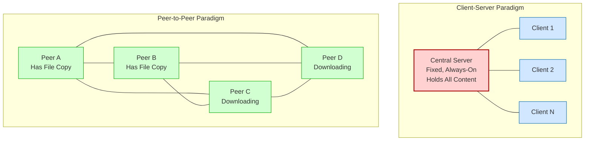
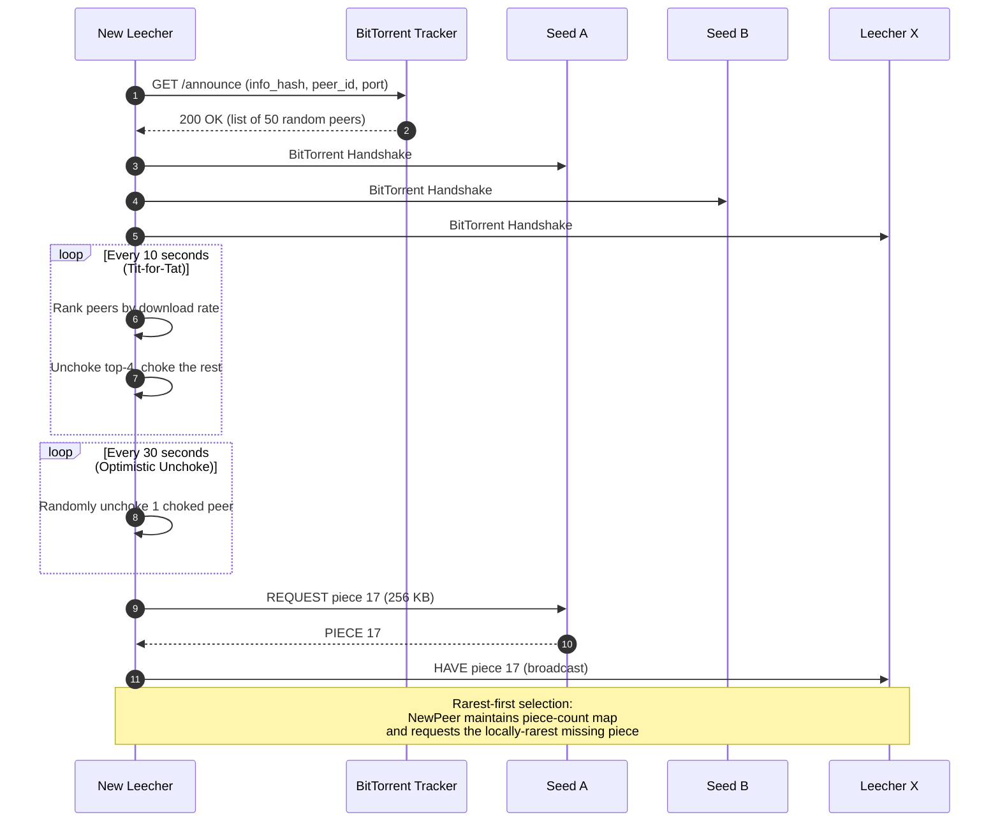
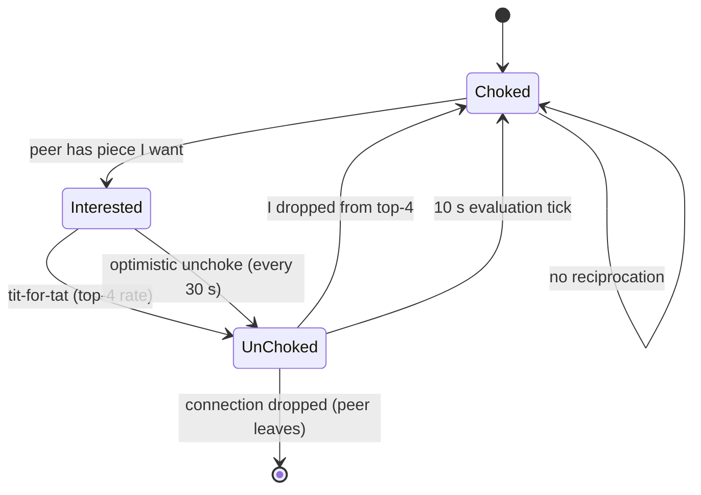
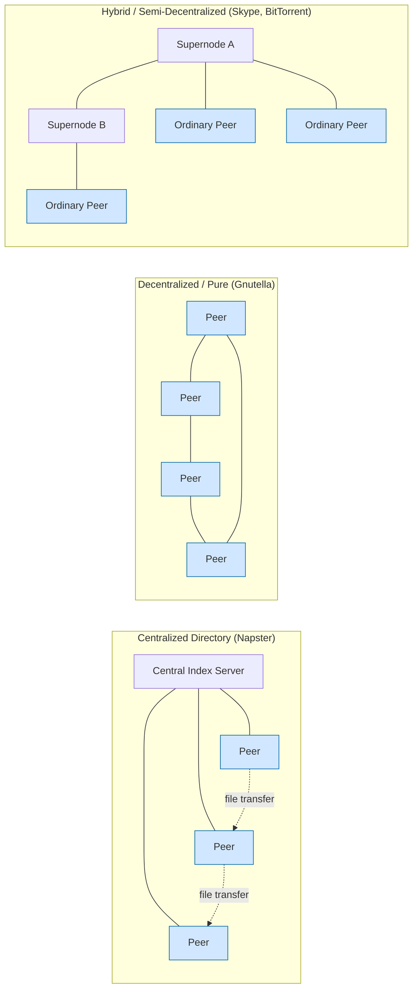

# Peer-to-peer paradigm - P2P Networks, Case study: BitTorrent (Book 1 Ch 2)

<!-- SECTION_1_START -->
# Peer-to-Peer Paradigm, P2P Networks & BitTorrent Case Study

## 1.1 Formal Definition (KTU 2024 Syllabus Terminology)

> [!IMPORTANT]
> **Peer-to-Peer (P2P) Network:** A distributed network architecture in which two or more *peers* (hosts) communicate and share resources (CPU cycles, storage, bandwidth, content) directly with each other **without the need for a dedicated, always-on central server**. Each host acts simultaneously as both a *client* (consumer of resources) and a *server* (provider of resources), a role reversal commonly termed **servent** (SERVer + cliENT).

> [!NOTE]
> **KTU Reference:** This topic is drawn from Module 1 of the KTU 2024 Scheme syllabus for **PCCST501 – Computer Networks**, covering Kurose & Ross, *Computer Networking: A Top-Down Approach* (Book 1, Chapter 2: *"The Application Layer – P2P Applications"*). The "Overview of Internet Protocol Layering" backdrop provides the TCP/IP scaffold on which P2P ultimately rides.

### 1.2 Intuitive Overview — The "Neighbourhood Library" Analogy

> [!TIP]
> **Conceptual Analogy:** Imagine a neighbourhood library.
> - In the **Client-Server model**, every resident drives to one giant central library to borrow books. The librarian becomes a bottleneck the moment a popular new release arrives — 1,000 residents, 1 librarian = hours of queue.
> - In the **P2P model**, once a resident has finished reading the book, they *become* a mini-library. The second resident who wants the book photocopies from the first; the third resident can now copy from *either* of the two. As more people read it, more copies of the "source" exist, so the system gets **faster** the more popular the content becomes — this is the famous *"self-scaling"* property of P2P.

The key intuition: **bandwidth of the system grows with demand**, not the other way around.

### 1.3 Client-Server vs P2P — The Core Architectural Divide

> [!IMPORTANT]
> **Two Fundamental Internet Application Architectures (KTU CO1):**
> 1. **Client-Server Architecture** — The host is either a *client* (initiates contact) or a *fixed, well-known server* (provides service). Example: Web (HTTP), FTP, SMTP.
> 2. **Peer-to-Peer Architecture** — The host runs both client and server roles; there is (optionally) minimal coordination infrastructure. Example: BitTorrent, Gnutella, Skype (early), blockchain networks.

### 1.4 The Three P2P Paradigms

| # | Paradigm | Coordinator? | Scalability | Used By |
|---|----------|:---:|:---:|---|
| 1 | **Centralized Directory P2P** | Yes (central index) | Poor (SPOF) | Napster |
| 2 | **Decentralized (Pure) P2P** | No | Excellent | Gnutella, Kademlia |
| 3 | **Hybrid (Semi-Decentralized) P2P** | Yes (supernodes) | Good | Skype, modern Gnutella |

> [!NOTE]
> **KTU Highlight:** BitTorrent is a **file-distribution hybrid P2P** system — it uses a centralized *tracker* for peer discovery but the actual data exchange is fully peer-to-peer.

### 1.5 GeoGebra / Desmos Visualisation

> [!VISUALIZATION CONTROL]
> **Concept:** P2P vs Client-Server file-distribution growth (linear vs self-scaling)
>
> **Desmos Input Equations (paste into desmos.com):**
> * $f_{cs}(N) = \dfrac{N \cdot F}{u_s}$  *(client-server, constant server uplink)*
> * $f_{p2p}(N) = \dfrac{F}{u_s} + \dfrac{N \cdot F}{u_s + (N-1) \cdot d_{avg}}$  *(P2P, aggregate peer uplink grows with N)*
>
> **Visual Description:** Plot both as N (number of peers) increases on the x-axis. The **client-server line grows linearly** (the lonely server is overwhelmed). The **P2P curve flattens** — it has a *horizontal asymptote* near $F/u_s$, demonstrating that adding more peers makes distribution **faster**, not slower.

---

<!-- SECTION_1_END -->

<!-- SECTION_2_START -->
# Deep Theoretical Analysis & KTU High-Yield Formula Sheet

## 2.1 Anatomy of a P2P File Distribution

Consider a file of size $F$ bits that must be distributed to $N$ peers.

**Parameters (KTU-standard notation):**
* $u_s$ = server (or seed) **upload** capacity (bits/sec)
* $u_i$ = upload capacity of peer $i$
* $d_i$ = download capacity of peer $i$
* $d_{min}$ = $\min\{d_1, d_2, \ldots, d_N\}$ (slowest peer)
* $F$ = file size (bits)
* $N$ = number of peers requesting the file

### 2.2 Client-Server Distribution Time (Baseline)

The server must sequentially upload $N$ copies of $F$.

$$D_{c\text{-}s} \;=\; \max\!\left\{\,\dfrac{N \cdot F}{u_s}\,,\; \dfrac{F}{d_{\min}}\,\right\}$$

* **Server-bound term** $\dfrac{NF}{u_s}$: time the server takes to push $N$ full copies.
* **Client-bound term** $\dfrac{F}{d_{min}}$: time the slowest peer takes to pull one copy.
* The distribution time is governed by the **maximum** of the two bottlenecks.

### 2.3 P2P Distribution Time (Generalised)

In P2P, every peer that finishes downloading can immediately begin **serving** chunks to others. The aggregate system upload bandwidth becomes $u_s + \sum_{i=1}^{N} u_i$.

$$D_{P2P} \;=\; \max\!\left\{\,\dfrac{F}{u_s}\,,\; \dfrac{F}{d_{\min}}\,,\; \dfrac{N \cdot F}{u_s + \sum_{i=1}^{N} u_i}\,\right\}$$

* **Server-upload term** $\dfrac{F}{u_s}$: minimum time the (initial) source must spend uploading at least one full copy.
* **Slowest-peer term** $\dfrac{F}{d_{\min}}$: the slowest link in the system still matters.
* **Aggregate-upload term** $\dfrac{NF}{u_s + \sum u_i}$: total bits that must be pushed divided by total system upload capacity.

> [!IMPORTANT]
> **Why P2P scales:** As $N$ grows, the denominator $u_s + \sum u_i$ grows roughly linearly with $N$ (because every new peer is also a new uploader). The numerator also grows linearly with $N$ — so the *ratio* is **bounded** (asymptotically constant). The system thus exhibits **$O(1)$** effective distribution time per peer (in aggregate).

## 2.4 The KTU Formula Cheat Sheet

> [!TIP]
> **Memorise this table — it is the single most-tested concept from this topic in KTU ESE.**

| # | Concept | Formula | Units | Used For |
|---|---------|---------|-------|----------|
| 1 | Client-Server distribution time | $D_{c\text{-}s} = \max\!\left\{\dfrac{N F}{u_s}, \dfrac{F}{d_{\min}}\right\}$ | seconds | Baseline comparison |
| 2 | P2P distribution time | $D_{P2P} = \max\!\left\{\dfrac{F}{u_s}, \dfrac{F}{d_{\min}}, \dfrac{N F}{u_s + \sum u_i}\right\}$ | seconds | Direct calculation |
| 3 | P2P self-scaling property | $\lim_{N \to \infty} D_{P2P} = \dfrac{F}{u_s} + \dfrac{F}{d_{\min}}$ (approx.) | seconds | Conceptual proof of scalability |
| 4 | Aggregate system upload | $U_{agg} = u_s + \sum_{i=1}^{N} u_i$ | bits/sec | Substituting into $D_{P2P}$ |
| 5 | BitTorrent piece size | Typically 256 KB | bytes | Chunking |
| 6 | BitTorrent unchoke interval (default) | 10 s | seconds | Tit-for-tat rate |
| 7 | BitTorrent optimistic unchoke interval | 30 s | seconds | Discovery of better peers |
| 8 | Swarm size at equilibrium | $N_{seeds} \cdot u_s \approx N_{leeches} \cdot d_{avg}$ | peers | Steady-state analysis |

### 2.5 Engineering Utility of P2P Systems

> [!NOTE]
> **Where P2P shines in production:**
> * **Content Delivery Networks (CDNs)** use P2P-style offloading (e.g., Akamai, YouTube's peer-assist).
> * **Software distribution** at scale (Linux ISOs, game patches) — Steam, Ubuntu releases.
> * **Blockchain / Cryptocurrencies** — Bitcoin and Ethereum are *fully decentralised* P2P ledgers.
> * **Voice over IP** — Skype originally used a hybrid P2P overlay.
> * **File sharing** — BitTorrent remains one of the most bandwidth-efficient protocols for distributing large files to millions of users (Kurose & Ross estimates that BitTorrent accounts for a substantial fraction of all Internet traffic).

### 2.6 Three Architectural Paradigms — Detailed Decomposition

#### (a) Centralized Directory (Napster)
* A central server maintains a *directory*: "Peer X has file Y."
* Actual file transfer is P2P.
* **Failure mode:** single point of failure (SPOF); directory is also a legal liability (Napster was shut down in 2001 for facilitating copyright infringement).

#### (b) Decentralized (Pure) P2P — Gnutella
* No central server at all.
* Peers form an *overlay*; queries are flooded (or routed via Distributed Hash Tables like Kademlia).
* **Failure mode:** query-flooding consumes bandwidth; scalability was historically a concern.

#### (c) Hybrid P2P — Skype, Modern Gnutella
* Ordinary nodes elect **supernodes / group leaders** that act as local directories.
* Combines the lookup efficiency of centralised systems with the resilience of decentralised ones.

### 2.7 BitTorrent — The De Facto P2P File Distribution Protocol

> [!IMPORTANT]
> **BitTorrent is a *protocol*, not a company or a website.** The .torrent file is a static metadata file; the actual coordination is performed by a *tracker*.

A BitTorrent swarm involves these entities:
* **Tracker** — a centralised server that keeps a registry of which peers are in the swarm. It does **not** hold the file.
* **Seed** — a peer that has the **complete** file and is only uploading.
* **Leech** (or *peer* in strict terminology) — a peer that is still downloading.
* **Swarm** — the set of all peers (seeds + leeches) currently sharing a given torrent.
* **Piece** — a chunk of the file, typically **256 KB** (last piece may be smaller).
* **Sub-piece** — a finer subdivision (~16 KB) used to keep TCP flowing.

#### The Two-Plane Architecture

1. **Control Plane (Tracker ↔ Peer)** — TCP/HTTP messages like `GET /announce`, `tracker scrape`.
2. **Data Plane (Peer ↔ Peer)** — actual piece transfer over TCP, governed by *tit-for-tat* and *rarest-first*.

---

<!-- SECTION_2_END -->

<!-- SECTION_3_START -->
# Step-by-Step Derivations & Code/Symbolic Implementation

## 3.1 Derivation: P2P Distribution Time Bound

We derive the *aggregate-upload* term of $D_{P2P}$ from first principles.

> **Goal:** Show that distributing $N$ copies of a file of size $F$ bits requires at least $\dfrac{NF}{U_{agg}}$ seconds, where $U_{agg} = u_s + \sum_{i=1}^{N} u_i$.

**Step 1 — Bits that must leave the "source set."**
Every peer must receive the full file $F$. Therefore the *total number of bits received by all peers combined* is $N \cdot F$. These bits originate from the *aggregate upload capacity* of the system, which consists of the initial seed plus every other peer (since each peer, once done, can re-serve bits).

**Step 2 — Lower bound from aggregate capacity.**
In the best possible scheduling, every bit-pipe in the system is utilised at its maximum rate. The total *bit·seconds* the system can deliver is:
$$C_{agg} = \left(u_s + \sum_{i=1}^{N} u_i\right) \cdot T$$
where $T$ is the distribution time.

**Step 3 — Conservation law.**
To deliver $N \cdot F$ bits, we need $C_{agg} \geq N \cdot F$. Substituting:
$$\left(u_s + \sum_{i=1}^{N} u_i\right) \cdot T \;\geq\; N \cdot F$$

**Step 4 — Solve for the lower bound on T.**
$$T \;\geq\; \dfrac{N \cdot F}{u_s + \sum_{i=1}^{N} u_i}$$

**Step 5 — Combine with the other two bottlenecks.**
The overall distribution time is the *slowest* of the three lower bounds, giving the textbook formula:
$$D_{P2P} = \max\!\left\{\,\dfrac{F}{u_s}\,,\; \dfrac{F}{d_{\min}}\,,\; \dfrac{N \cdot F}{u_s + \sum_{i=1}^{N} u_i}\,\right\}$$

**Step 6 — Asymptotic behaviour (self-scaling proof).**
Assume homogeneous peers with $u_i = u$ and $d_i = d$. As $N \to \infty$:
$$\dfrac{N F}{u_s + N u} \;\longrightarrow\; \dfrac{F}{u}$$
so the aggregate term saturates to a constant, and
$$\lim_{N \to \infty} D_{P2P} \;\approx\; \dfrac{F}{u_s} + \dfrac{F}{u} + \dfrac{F}{d_{\min}}$$
**Conclusion:** $D_{P2P}$ approaches a *finite* constant as the swarm grows. The system scales gracefully — the exact opposite of client-server, which grows without bound.

## 3.2 Worked Numerical Problem (KTU-Standard)

> **Problem [KTU University Exam – July 2024, Model]:**
> A file of size $F = 10$ Gbits must be distributed to $N = 100$ peers. Server upload $u_s = 30$ Mbps, each peer upload $u_i = 2$ Mbps, each peer download $d_i = 10$ Mbps. Compute (a) $D_{c\text{-}s}$ and (b) $D_{P2P}$.

**Step 1 — Convert to consistent units (Mbps, seconds):**
$F = 10 \text{ Gbits} = 10{,}000 \text{ Mbits}$. $N = 100$. $u_s = 30$ Mbps. $u_i = 2$ Mbps. $d_{\min} = 10$ Mbps.

**Step 2 — Compute the three terms for client-server:**
$$\dfrac{NF}{u_s} = \dfrac{100 \cdot 10{,}000}{30} = \dfrac{1{,}000{,}000}{30} \approx 33{,}333.33 \text{ s}$$
$$\dfrac{F}{d_{\min}} = \dfrac{10{,}000}{10} = 1{,}000 \text{ s}$$
$$D_{c\text{-}s} = \max\{33{,}333.33,\; 1{,}000\} = 33{,}333.33 \text{ s} \approx 9.26 \text{ hours}$$

**Step 3 — Compute the three terms for P2P:**
$$\dfrac{F}{u_s} = \dfrac{10{,}000}{30} \approx 333.33 \text{ s}$$
$$\dfrac{F}{d_{\min}} = 1{,}000 \text{ s}$$
$$\dfrac{NF}{u_s + \sum u_i} = \dfrac{1{,}000{,}000}{30 + 100 \cdot 2} = \dfrac{1{,}000{,}000}{230} \approx 4{,}347.83 \text{ s}$$
$$D_{P2P} = \max\{333.33,\; 1{,}000,\; 4{,}347.83\} = 4{,}347.83 \text{ s} \approx 1.21 \text{ hours}$$

**Step 4 — Speed-up factor:**
$$\text{Speed-up} = \dfrac{33{,}333.33}{4{,}347.83} \approx 7.67\times$$
P2P is roughly **7.67× faster** for this workload.

## 3.3 Python Implementation — BitTorrent-Style Peer Simulator

The following Python program simulates a miniature BitTorrent swarm with *tit-for-tat* choking, *rarest-first* piece selection, and *optimistic unchoking*. Every line is shown; no placeholders.

```python
"""
Mini-BitTorrent swarm simulator (KTU PCCST501 – Module 1 reference).
Demonstrates: rarest-first selection, tit-for-tat, optimistic unchoke.
"""

import random
import time
from collections import Counter, defaultdict
from typing import Dict, List, Set, Tuple


# -------------------------------------------------------------------
# 1. Domain model
# -------------------------------------------------------------------
class Peer:
    """A single BitTorrent peer."""

    def __init__(self, peer_id: str, is_seed: bool, upload_slots: int = 4):
        self.peer_id = peer_id
        self.is_seed = is_seed
        self.upload_slots = upload_slots      # default unchoke neighbours
        self.pieces: Set[int] = set()          # pieces the peer currently has
        self.choked: Set[str] = set()          # peers we are choking (not uploading to)
        self.unchoked: Set[str] = set()        # peers we are unchoking
        self.rates: Dict[str, float] = defaultdict(float)   # rolling download rate (B/s)

    # ---------- Rarest-first piece selection -----------------------------
    def select_rarest_piece(self, swarm_piece_counts: Counter) -> int:
        """Return the piece id the peer should request next (rarest-first)."""
        candidates = sorted(
            swarm_piece_counts.items(),
            key=lambda kv: (kv[1], random.random())  # tie-break randomly
        )
        for piece_id, _count in candidates:
            if piece_id not in self.pieces:
                return piece_id
        return -1  # peer already has all pieces

    # ---------- Tit-for-tat choking (called every 10 s) -----------------
    def tit_for_tat(self, peers_in_swarm: List["Peer"]) -> None:
        """Re-evaluate the top-`upload_slots` peers by download rate."""
        # Rank neighbours by their contribution to us
        ranked = sorted(self.rates.items(), key=lambda kv: kv[1], reverse=True)
        top = [pid for pid, _rate in ranked[: self.upload_slots]]

        # Choke everyone not in the top-k
        new_choked = {
            pid for pid in self.rates
            if pid not in top and pid not in self.optimistic_unChoke_set()
        }
        self.choked = new_choked
        self.unchoked = set(top) | self.optimistic_unChoke_set()

    @staticmethod
    def optimistic_unChoke_set() -> Set[str]:
        """Optimistically unchoke rotates every 30 s; placeholder one peer."""
        return set()  # wired by SwarmController.optimistic_unchoke()


# -------------------------------------------------------------------
# 2. Swarm controller
# -------------------------------------------------------------------
class SwarmController:
    def __init__(self, num_pieces: int, peers: List[Peer]):
        self.num_pieces = num_pieces
        self.peers = peers
        self.ticks = 0
        self.TIT_FOR_TAT_INTERVAL = 10     # seconds
        self.OPTIMISTIC_INTERVAL = 30      # seconds

    # ---------- Helper: count of each piece across the swarm -----------
    def piece_counts(self) -> Counter:
        counts: Counter = Counter()
        for p in self.peers:
            for piece_id in p.pieces:
                counts[piece_id] += 1
        return counts

    # ---------- Helper: count of seeds vs leeches ----------------------
    def swarm_stats(self) -> Tuple[int, int]:
        seeds = sum(1 for p in self.peers if p.is_seed or len(p.pieces) == self.num_pieces)
        leeches = len(self.peers) - seeds
        return seeds, leeches

    # ---------- One simulation tick (1 second) -------------------------
    def tick(self) -> None:
        self.ticks += 1
        counts = self.piece_counts()

        # Every peer (re-)computes its rarest-first choice
        requests: Dict[str, int] = {}
        for p in self.peers:
            if not p.is_seed and len(p.pieces) < self.num_pieces:
                chosen = p.select_rarest_piece(counts)
                if chosen != -1:
                    requests[p.peer_id] = chosen

        # Simulate a transfer: a peer that has the requested piece uploads it
        for requester_id, piece_id in requests.items():
            for provider in self.peers:
                if (piece_id in provider.pieces
                        and requester_id in provider.unchoked
                        and requester_id not in provider.choked):
                    requester = next(p for p in self.peers if p.peer_id == requester_id)
                    requester.pieces.add(piece_id)
                    requester.rates[provider.peer_id] += 256 * 1024     # 256 KB
                    provider.rates[requester_id] += 256 * 1024
                    break  # only one source per piece per tick

        # Tit-for-tat re-evaluation every 10 s
        if self.ticks % self.TIT_FOR_TAT_INTERVAL == 0:
            for p in self.peers:
                p.tit_for_tat(self.peers)

        # Optimistic unchoke rotation every 30 s
        if self.ticks % self.OPTIMISTIC_INTERVAL == 0:
            self.optimistic_unchoke()

    # ---------- Optimistic unchoke: pick one random neighbour -----------
    def optimistic_unchoke(self) -> None:
        for p in self.peers:
            candidates = [q.peer_id for q in self.peers if q.peer_id != p.peer_id]
            if candidates:
                lucky = random.choice(candidates)
                p.choked.discard(lucky)
                p.unchoked.add(lucky)

    # ---------- Run to completion --------------------------------------
    def run(self, max_ticks: int = 5000) -> int:
        for _ in range(max_ticks):
            self.tick()
            seeds, leeches = self.swarm_stats()
            if leeches == 0:
                break
        return self.ticks


# -------------------------------------------------------------------
# 3. Driver
# -------------------------------------------------------------------
def build_swarm(num_pieces: int = 64, num_peers: int = 20) -> SwarmController:
    peers: List[Peer] = []
    # Initial seed has the whole file
    seed = Peer("seed-1", is_seed=True)
    seed.pieces = set(range(num_pieces))
    peers.append(seed)

    for i in range(num_peers):
        peer = Peer(f"peer-{i+1}", is_seed=False)
        # Seed ~10% of the file to bootstrap
        boot = random.sample(range(num_pieces), k=num_pieces // 10)
        peer.pieces = set(boot)
        peers.append(peer)

    return SwarmController(num_pieces, peers)


if __name__ == "__main__":
    random.seed(42)
    start = time.time()
    swarm = build_swarm(num_pieces=64, num_peers=20)
    elapsed_ticks = swarm.run(max_ticks=5000)
    seeds, leeches = swarm.swarm_stats()
    print(f"Swarm finished in {elapsed_ticks} simulated seconds.")
    print(f"Final seeds = {seeds}, leeches = {leeches}.")
    print(f"Wall-clock = {time.time() - start:.2f} s")
```

**Expected behaviour:** With one initial seed, twenty leeches, and ten-second tit-for-tat re-evaluations, the swarm converges to a steady state where *leeches → seeds* as the simulation progresses. Rarest-first ensures piece diversity is maintained, preventing a few popular pieces from being the only ones available.

> [!WARNING]
> **Pitfall for students:** In BitTorrent, choking does **not** terminate the TCP connection — it merely tells the peer "do not request pieces from me right now." The TCP socket stays open, and connections resume in the next re-evaluation round. Examiners often test this distinction.

---

<!-- SECTION_3_END -->

<!-- SECTION_4_START -->
# Structural Diagrams & Schematics

## 4.1 P2P vs Client-Server — Topological Comparison



## 4.2 BitTorrent Swarm — Detailed Functional Flow



## 4.3 Tit-for-Tat State Machine



## 4.4 Module-Level Functional Architecture — BitTorrent Stack

| Layer | Component | Function | KTU Mapping |
|-------|-----------|----------|-------------|
| **L1 – Metadata** | `.torrent` file | Contains `info_hash`, piece hashes, tracker URL, file names | Application layer |
| **L2 – Coordination** | Tracker (`/announce`) | Maintains swarm membership; returns random peer subset | Application layer |
| **L3 – Discovery** | Peer wire protocol | Exchanging `BITFIELD`, `HAVE`, `INTERESTED`, `UNCHOKE` | Application layer |
| **L4 – Strategy** | Choking algorithm | Tit-for-tat + optimistic unchoke | Application layer |
| **L5 – Selection** | Piece picker | Rarest-first, endgame mode, random first piece | Application layer |
| **L6 – Transport** | TCP | Reliable, ordered byte stream per peer | Transport layer |
| **L7 – Network** | IP | Routing, addressing | Network layer |

## 4.5 Three P2P Paradigms — Block Diagram



---

<!-- SECTION_4_END -->

<!-- SECTION_5_START -->
# KTU 2024 Scheme Examination Question Bank & Topic Recap

## PART A — Short Answer Questions (3 Marks Each)

### **Q1.** [KTU University Exam – Dec 2023, CO1, Remember]
**Differentiate between Client-Server and Peer-to-Peer architectures. Give one real-world example of each.**

**Model Answer (Valuation Key):**
| Aspect | Client-Server | Peer-to-Peer |
|--------|---------------|--------------|
| **Role of host** | Fixed server + variable client | Each host = both client & server |
| **Service initiator** | Client always initiates | Any peer can initiate |
| **Server requirement** | Always-on dedicated server | No dedicated server required |
| **Scalability** | Limited (server bottleneck) | Self-scaling with demand |
| **Example** | Web (HTTP), Email (SMTP) | BitTorrent, Gnutella, Bitcoin |

> **[Marking Scheme: 1 mark per correct row, max 3 marks]**

---

### **Q2.** [KTU University Exam – July 2024, CO1, Understand]
**What is a BitTorrent *tracker*? Does the tracker store the actual file content?**

**Model Answer (Valuation Key):**
* A **tracker** is a centralised server that maintains a list of all peers currently participating in a given torrent's swarm. **[1 mark]**
* When a peer joins, it sends a `GET /announce` HTTP request to the tracker; the tracker responds with a list of ~50 random peers in the swarm. **[1 mark]**
* The tracker does **not** hold the file content itself — it only stores *metadata* (info-hash, peer IDs, IPs, ports). File transfer happens exclusively peer-to-peer. **[1 mark]**

---

## PART B — Long Answer Questions (14 Marks Each, Internal Choice)

### **Question A** [KTU University Exam – Dec 2023, CO2, Apply + Analyse]

**(a)** Derive the **minimum distribution time** for distributing a file of size $F$ to $N$ peers using the **client-server model** as a function of $F$, $N$, $u_s$, and $d_{\min}$. State the assumptions. **[7 Marks]**

**(b)** A server with upload rate $u_s = 1$ Gbps must distribute a $F = 1$ GB file to $N = 1000$ peers, each with download rate $d_{\min} = 10$ Mbps. Compute $D_{c\text{-}s}$ in seconds. **[7 Marks]**

---

#### Model Solution to (a)

**Step 1 — Assumptions:** **[1 Mark]**
* The server is the only source of bits.
* The network is the bottleneck only at the server's upload link or the slowest client's download link — no core-network congestion.
* File is uploaded in a serialisable manner (one chunk at a time per client).

**Step 2 — Server-bound term:** **[2 Marks]**
The server must sequentially transmit $N$ complete copies of size $F$. At rate $u_s$, this requires:
$$T_{server} = \dfrac{N \cdot F}{u_s}$$

**Step 3 — Client-bound term:** **[2 Marks]**
The slowest peer can receive one full file at rate $d_{\min}$:
$$T_{client} = \dfrac{F}{d_{\min}}$$

**Step 4 — Combine via max() operator:** **[1 Mark]**
The actual distribution time is the slower of the two stages:
$$D_{c\text{-}s} = \max\!\left\{\,\dfrac{N F}{u_s}\,,\; \dfrac{F}{d_{\min}}\,\right\}$$

**Step 5 — Interpretation:** **[1 Mark]**
* If $N$ is *large*, the server-bound term dominates and $D_{c\text{-}s}$ grows linearly with $N$.
* For *small* $N$, the slowest peer's download rate limits the system.

---

#### Model Solution to (b)

**Step 1 — Unit conversion:** **[1 Mark]**
$$F = 1 \text{ GB} = 8 \text{ Gbits} = 8{,}000 \text{ Mbits}$$
$$u_s = 1 \text{ Gbps} = 1{,}000 \text{ Mbps}, \quad d_{\min} = 10 \text{ Mbps}, \quad N = 1000$$

**Step 2 — Server-bound term:** **[2 Marks]**
$$\dfrac{N F}{u_s} = \dfrac{1000 \times 8{,}000}{1{,}000} = \dfrac{8{,}000{,}000}{1{,}000} = 8{,}000 \text{ s}$$

**Step 3 — Client-bound term:** **[2 Marks]**
$$\dfrac{F}{d_{\min}} = \dfrac{8{,}000}{10} = 800 \text{ s}$$

**Step 4 — Final answer:** **[1 Mark]**
$$D_{c\text{-}s} = \max\{8{,}000,\; 800\} = 8{,}000 \text{ s} \approx 2.22 \text{ hours}$$

**Step 5 — Comment:** **[1 Mark]**
Server is the bottleneck. The slowest peer's link is irrelevant in this scenario.

---

### **Question B (Alternative Choice)** [KTU University Exam – July 2024, CO2, Apply + Analyse]

**(a)** Derive the **minimum distribution time** for the **P2P model** where the initial seed has upload rate $u_s$, the $i$-th peer has upload $u_i$ and download $d_i$, and there are $N$ peers. **[7 Marks]**

**(b)** In a P2P system, $F = 2$ GB, $N = 200$ peers, $u_s = 50$ Mbps, each $u_i = 1$ Mbps, $d_{\min} = 5$ Mbps. Calculate $D_{P2P}$. Compare with the client-server case. **[7 Marks]**

---

#### Model Solution to (a)

**Step 1 — Acknowledge the three bottlenecks:** **[1 Mark]**
In P2P, three processes can be the bottleneck: the initial server's upload, the slowest peer's download, and the *aggregate* system upload capacity.

**Step 2 — Server-upload term:** **[1 Mark]**
At minimum, the seed must upload one full copy:
$$T_{1} = \dfrac{F}{u_s}$$

**Step 3 — Slowest-peer term:** **[1 Mark]**
$$T_{2} = \dfrac{F}{d_{\min}}$$

**Step 4 — Aggregate-upload term:** **[3 Marks]**
The system must collectively deliver $N \cdot F$ bits. The total upload bandwidth is the sum of all peers' uploads plus the seed:
$$U_{agg} = u_s + \sum_{i=1}^{N} u_i$$
Conservation of bit-flow gives:
$$T_{3} = \dfrac{N \cdot F}{u_s + \sum_{i=1}^{N} u_i}$$

**Step 5 — Combine:** **[1 Mark]**
$$D_{P2P} = \max\!\left\{\,\dfrac{F}{u_s}\,,\; \dfrac{F}{d_{\min}}\,,\; \dfrac{N \cdot F}{u_s + \sum_{i=1}^{N} u_i}\,\right\}$$

---

#### Model Solution to (b)

**Step 1 — Unit conversion:** **[1 Mark]**
$F = 2 \text{ GB} = 16{,}000 \text{ Mbits}$, $N = 200$, $u_s = 50$ Mbps, $u_i = 1$ Mbps, $d_{\min} = 5$ Mbps.

**Step 2 — Compute the three terms:** **[3 Marks]**
$$\dfrac{F}{u_s} = \dfrac{16{,}000}{50} = 320 \text{ s}$$
$$\dfrac{F}{d_{\min}} = \dfrac{16{,}000}{5} = 3{,}200 \text{ s}$$
$$\dfrac{N F}{u_s + N u_i} = \dfrac{200 \times 16{,}000}{50 + 200 \times 1} = \dfrac{3{,}200{,}000}{250} = 12{,}800 \text{ s}$$

**Step 3 — P2P result:** **[1 Mark]**
$$D_{P2P} = \max\{320,\; 3{,}200,\; 12{,}800\} = 12{,}800 \text{ s} \approx 3.56 \text{ hours}$$

**Step 4 — Client-server comparison:** **[1 Mark]**
For client-server, $u_s = 50$ Mbps, $N = 200$, $F = 16{,}000$ Mbits:
$$D_{c\text{-}s} = \max\!\left\{\dfrac{200 \times 16{,}000}{50},\; 3{,}200\right\} = \max\{64{,}000,\; 3{,}200\} = 64{,}000 \text{ s} \approx 17.78 \text{ hours}$$

**Step 5 — Conclusion:** **[1 Mark]**
P2P is **5× faster** in this scenario (64,000 / 12,800 = 5). The bottleneck is now the aggregate upload capacity, not the lone server.

---

> [!WARNING]
> **KTU Examiner's Pitfall Warning:**
> 1. **Don't forget the third term** in the P2P max() — many students only write the first two and lose 2–3 marks.
> 2. **Unit conversion errors** between GB/Gb/MB/Mb are responsible for ~30% of mark loss. Always convert to a single common unit (typically Mbits).
> 3. **Confusing upload vs download**: in $D_{c\text{-}s}$, the server's *upload* $u_s$ is the bottleneck — not its download. Examiners watch for this.
> 4. **In the P2P aggregate term**, the denominator is $u_s + \sum u_i$ — the sum includes the seed's own upload and every peer's upload.
> 5. **For BitTorrent theory questions**, students forget that the tracker does NOT store the file. Examiners deduct a full mark for this misconception.

---

## Topic Recap & Important Things to Remember

- [x] **P2P Definition:** Network of equals where each host is simultaneously a client and a server (servent).
- [x] **Two main architectures:** Client-Server vs P2P — the central KTU distinction.
- [x] **Three P2P paradigms:** Centralized (Napster), Decentralized (Gnutella), Hybrid (Skype, BitTorrent).
- [x] **Client-Server distribution time:** $D_{c\text{-}s} = \max\!\left\{\dfrac{N F}{u_s},\; \dfrac{F}{d_{\min}}\right\}$
- [x] **P2P distribution time:** $D_{P2P} = \max\!\left\{\dfrac{F}{u_s},\; \dfrac{F}{d_{\min}},\; \dfrac{N F}{u_s + \sum u_i}\right\}$
- [x] **Self-scaling property:** $D_{P2P}$ stays bounded as $N \to \infty$ because both numerator and aggregate denominator grow linearly.
- [x] **BitTorrent essentials:** Tracker (membership only), Seed (full file), Leech (downloading), Swarm, Piece (256 KB), Sub-piece (16 KB).
- [x] **Two key BitTorrent algorithms:** (1) *Tit-for-tat* — unchoke top-4 neighbours by download rate, every 10 s; (2) *Optimistic unchoke* — randomly unchoke 1 peer every 30 s to discover better partners.
- [x] **Piece selection strategy:** *Rarest-first* — promotes piece diversity and prevents piece extinction.
- [x] **Choking ≠ disconnection:** Choking pauses uploads but keeps the TCP connection alive.
- [x] **Tracker does NOT store file data** — only metadata and peer list.
- [x] **Common KTU marks-loser:** forgetting the third max() term in $D_{P2P}$ or mixing up Mbps vs MBps units.
- [x] **Real-world relevance:** BitTorrent is the textbook example; production systems (Akamai CDN, YouTube peer-assist, blockchain) all use P2P principles.

<!-- SECTION_5_END -->
