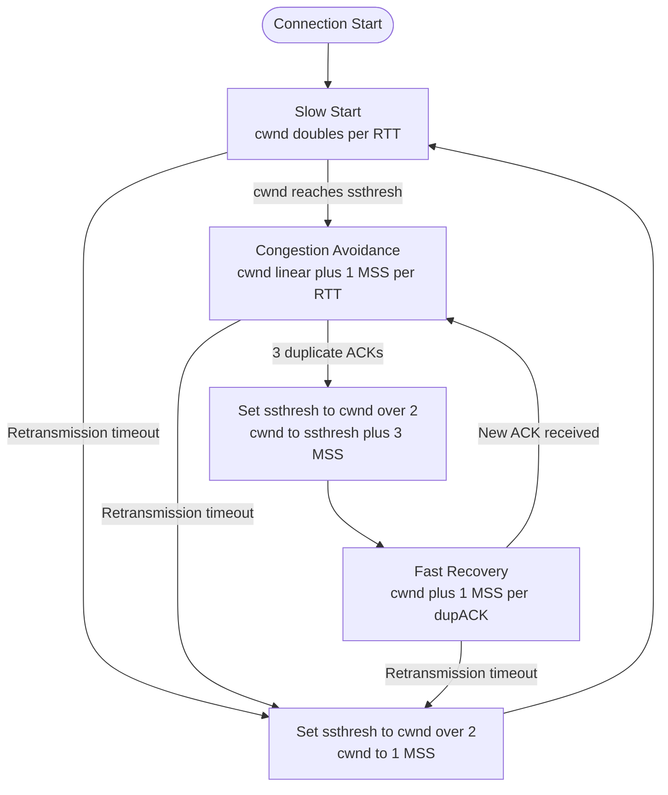
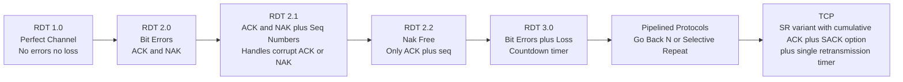
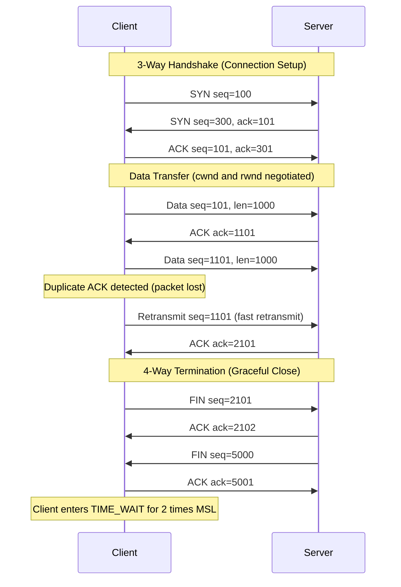
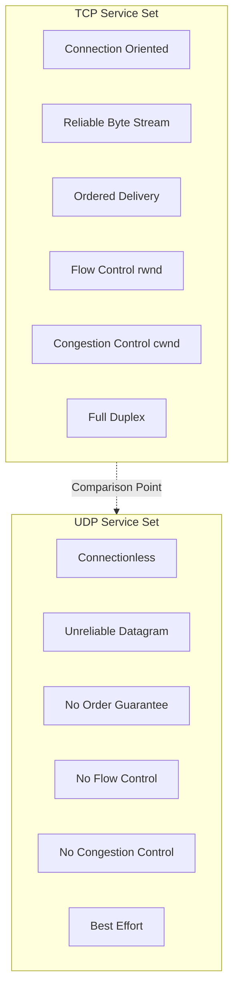

# Connection-Oriented Transport: TCP segment structure, reliable data transfer mechanisms, flow control, connection management, and congestion control loops

<!-- SECTION_1_START -->

# TCP: Connection-Oriented Transport Layer

## 1.1 Formal Definition (KTU 2024 Syllabus Terminology)

> [!IMPORTANT]
> **Transmission Control Protocol (TCP)** is defined in **RFC 793** (and updated by **RFC 9293**, 2022) as a **connection-oriented, reliable, byte-stream transport layer protocol** that provides **in-order delivery, error recovery, flow control, and congestion control** services to applications running on hosts communicating over an IP network.

TCP is one of the core protocols of the Internet protocol suite, sitting directly above the Internet Protocol (IP) in the TCP/IP model. It is characterized by:

- **Connection-oriented:** A logical connection (the *socket pair*: source IP, source port, destination IP, destination port) is established via a **3-way handshake** before any data is exchanged.
- **Full-duplex service:** Both ends can send and receive simultaneously over the same connection.
- **Reliable byte-stream:** Data is treated as an **ordered, continuous stream of bytes**, not as discrete packets. The protocol guarantees in-order delivery to the receiving application.
- **Pipelined:** The sender can have **multiple unacknowledged segments** in flight (default receiver window up to 65,535 bytes, often scaled to gigabits via the **Window Scale option**).

## 1.2 Conceptual Analogy: A Phone Call, Not a Postcard

Imagine sending a parcel through the postal service. Each parcel is independent; if one is lost, you must arrange tracking separately, and the receiver has no way to pause your sending rate. TCP behaves differently — it behaves like a **long, structured phone conversation**:

1. **Calling first ("Hello, can you hear me? / Yes I can. / Great, let's start.")** → The 3-way handshake (**SYN, SYN-ACK, ACK**).
2. **Speaking in numbered sentences ("Point 1… Point 2… Got your point 1.")** → Sequence numbers and cumulative acknowledgments.
3. **Listening to the other side ("Slow down, I'm not ready!")** → Flow control using the **receive window (rwnd)**.
4. **Noticing traffic congestion ("We should both slow our rate of speech.")** → Congestion control using the **congestion window (cwnd)**.
5. **Saying goodbye properly ("I am done." / "Okay, me too." / "Bye.")** → The 4-way termination handshake (**FIN, ACK, FIN, ACK**).

> [!NOTE]
> **Key Insight:** UDP is like shouting into a crowded room (fire-and-forget). TCP is like a polite, well-regulated business call where both parties confirm every important statement.

## 1.3 Physical Constants and Standard Metrics

- **Maximum Segment Size (MSS):** Typically **1460 bytes** (1500 byte Ethernet MTU − 20 byte IP header − 20 byte TCP header). Often **536 bytes** by default per RFC 1122.
- **TCP Header Minimum Size:** **20 bytes** (without options).
- **TCP Header Maximum Size:** **60 bytes** (with 40 bytes of options).
- **Sequence Numbers:** **32-bit unsigned** integers (wrap around every ~4.29 GB).
- **Default Initial Congestion Window (IW):** **10 segments** (≈ 14600 bytes), per RFC 6928 (previously 1 MSS in older RFC 2581).
- **Window Size Field:** **16 bits** → maximum 65,535 bytes, but extended by the **Window Scale option** (up to 14 bits of scaling factor = **1 GB effective window**).

> [!VISUALIZATION CONTROL]
> **Concept:** TCP Header Bit-level Layout (Big-Endian / Network Byte Order)
> **GeoGebra / Desmos Input Equations (Coordinate Grid for Bit Offsets):**
> * $x_{min} = 0$, $x_{max} = 32$ (32-bit word rows)
> * Rectangles plotted: `Offset 0–15: Source Port`, `Offset 16–31: Destination Port`
> * `Offset 32–63: Sequence Number`, `Offset 64–95: Ack Number`
> * `Offset 96–99: Data Offset (4 bits)`, `Offset 100–105: Reserved+Flags (8 bits)`, `Offset 106–111: Window`
> * `Offset 112–127: Checksum`, `Offset 128–143: Urgent Pointer`, `Offset 144+: Options+Data`
> **Visual Description:** Four horizontal rows of 32 bits each, color-coded fields. The first row carries ports, the second and third rows carry the sequence/ack numbers, the fourth row is a subdivision of control bits, followed by checksum/urgent pointer, options, and payload.

<!-- SECTION_1_END -->

<!-- SECTION_2_START -->

# Deep Theoretical Analysis & KTU High-Yield Formula Sheet

## 2.1 TCP Segment Structure (RFC 9293)

A TCP segment consists of a **header** (20 to 60 bytes) followed by the **data payload** (0 or more bytes). The header is laid out in **network byte order (big-endian)**.

| Field | Size (bits) | Purpose |
|---|---|---|
| Source Port | 16 | Identifies the sending application endpoint |
| Destination Port | 16 | Identifies the receiving application endpoint |
| Sequence Number | 32 | Byte-stream position of the **first byte** in this segment's data |
| Acknowledgment Number | 32 | **Next** byte expected from the other side (cumulative ACK) |
| Data Offset | 4 | Length of TCP header in **32-bit words** (minimum = 5) |
| Reserved | 3 | Must be zero (NS bit sometimes reused) |
| Flags (Control Bits) | 9 | CWR, ECE, URG, ACK, PSH, RST, SYN, FIN (8 named; ECE has 2 sub-bits historically) |
| Window Size | 16 | Receive window `rwnd` in bytes (flow control) |
| Checksum | 16 | 16-bit one's complement of pseudo-header + TCP segment |
| Urgent Pointer | 16 | Offset from seq number indicating end of urgent data |
| Options | 0–320 | MSS, Window Scale, SACK, Timestamps, etc. |
| Data | variable | Application payload (≤ MSS) |

> [!IMPORTANT]
> **The nine flag bits (control field) are the "command buttons" of TCP:**
> * **URG:** Urgent pointer field is valid.
> * **ACK:** Acknowledgment field is valid (always set after connection established).
> * **PSH:** Push function — deliver data to application immediately (don't buffer).
> * **RST:** Reset the connection abnormally (e.g., port not listening).
> * **SYN:** Synchronize sequence numbers (used in handshake).
> * **FIN:** Sender has finished sending data (graceful close).
> * **CWR / ECE:** Used in Explicit Congestion Notification (ECN).

## 2.2 TCP Connection Management — The State Machine

### 2.2.1 3-Way Handshake (Connection Establishment)

The connection is set up to **synchronize initial sequence numbers (ISN)** and to confirm two-way reachability.

$$
\begin{aligned}
\text{Step 1 (Client → Server):} \quad & \text{SYN, seq} = x \quad (\text{x is the client ISN}) \\
\text{Step 2 (Server → Client):} \quad & \text{SYN, ACK, seq} = y, \text{ack} = x+1 \quad (\text{y is the server ISN}) \\
\text{Step 3 (Client → Server):} \quad & \text{ACK, seq} = x+1, \text{ack} = y+1
\end{aligned}
$$

> [!NOTE]
> **Why 3 steps and not 2?** The first two parties must agree on *both* their own initial sequence number *and* acknowledge the other side's. A 2-message exchange cannot guarantee that both ends have received each other's ISN in the face of lost retransmissions.

### 2.2.2 4-Way Termination (Connection Teardown)

Since TCP is full-duplex, **each direction must be closed independently** (a "half-close" concept).

$$
\begin{aligned}
\text{Step 1 (Client → Server):} \quad & \text{FIN, seq} = u \\
\text{Step 2 (Server → Client):} \quad & \text{ACK, ack} = u+1 \quad (\text{server's half is still open}) \\
\text{Step 3 (Server → Client):} \quad & \text{FIN, seq} = v, \text{ack} = u+1 \\
\text{Step 4 (Client → Server):} \quad & \text{ACK, ack} = v+1 \quad (\text{client enters TIME\_WAIT for 2·MSL})
\end{aligned}
$$

> [!IMPORTANT]
> The client holds the connection in the **TIME_WAIT** state for **2 × MSL (Maximum Segment Lifetime, typically 60–120 seconds)** to absorb any stray delayed segments and ensure the final ACK is not lost.

## 2.3 Reliable Data Transfer — The TCP ARQ Engine

TCP uses a **hybrid Automatic Repeat reQuest (ARQ)** scheme that combines:
1. **Cumulative acknowledgments** (like GBN).
2. **Selective acknowledgment (SACK)** option to acknowledge out-of-order blocks (like SR).
3. **A single retransmission timer** per connection, with **Karn's algorithm** to avoid ambiguity.

### 2.3.1 Round-Trip Time (RTT) Estimation

The sender measures a **SampleRTT** for each transmitted-and-acknowledged segment (taking the most recent, not the retransmitted, segment per Karn's algorithm).

$$
\begin{aligned}
\text{EstimatedRTT}_{new} &= (1 - \alpha) \cdot \text{EstimatedRTT}_{old} + \alpha \cdot \text{SampleRTT} \\
\text{DevRTT}_{new} &= (1 - \beta) \cdot \text{DevRTT}_{old} + \beta \cdot \vert \text{SampleRTT} - \text{EstimatedRTT} \vert \\
\text{TimeoutInterval} &= \text{EstimatedRTT} + 4 \cdot \text{DevRTT}
\end{aligned}
$$

with the standard smoothing factors $\alpha = 0.125$ and $\beta = 0.25$ (RFC 6298).

### 2.3.2 Fast Retransmit

To avoid waiting for the timeout, the sender triggers **immediate retransmission** upon receiving **three duplicate ACKs** (4 identical ACKs in total). This is called **fast retransmit**.

### 2.3.3 Selective Acknowledgment (SACK)

Standard cumulative ACKs force the sender to retransmit *all* unacknowledged bytes after a loss. The **SACK option** allows the receiver to inform the sender of up to **4 non-contiguous blocks** it has received, enabling the sender to retransmit only the missing ranges.

## 2.4 Flow Control — Receiver Throttling

Flow control prevents a fast sender from overwhelming a slow receiver. The receiver advertises a **receive window (rwnd)** in every ACK.

$$
\begin{aligned}
\text{rwnd} &= \text{RcvBuffer} - (\text{LastByteRcvd} - \text{LastByteRead}) \\
\text{Constraint:} \quad \text{LastByteSent} - \text{LastByteAcked} &\le \text{rwnd}
\end{aligned}
$$

> [!NOTE]
> **The receiver buffer is finite.** If the application is slow, the buffer fills up, rwnd shrinks to zero, and the sender pauses (zero-window probing with 1-byte segments is then used to detect when the window opens again).

## 2.5 Congestion Control — The Network Throttle

Distinct from flow control (which is end-to-end), congestion control is **network-wide**: routers drop packets when their queues overflow. The sender maintains a **congestion window (cwnd)** and obeys:

$$
\text{EffectiveWindow} = \min(\text{cwnd}, \text{rwnd})
$$

### 2.5.1 The Four TCP Congestion-Control States

| State | Trigger | cwnd Evolution |
|---|---|---|
| **Slow Start** | Connection start, after timeout | cwnd += MSS per ACK → effectively **doubles per RTT** |
| **Congestion Avoidance** | cwnd reaches `ssthresh` | cwnd += MSS·MSS / cwnd per ACK → **linear growth (~+1 MSS per RTT)** |
| **Fast Recovery** | 3 duplicate ACKs | cwnd = ssthresh = cwnd/2; then linear |
| **Timeout / Severe Loss** | Retransmission timer expires | ssthresh = cwnd/2; cwnd = 1 MSS; **back to Slow Start** |

### 2.5.2 The Classic TCP Variants (KTU High Yield)

| Variant | Year | Reaction to Loss | Key Idea |
|---|---|---|---|
| **Tahoe** | 1988 | cwnd → 1 MSS on **any** loss | Always drops to slow start |
| **Reno** | 1990 | 3 dupACKs → fast recovery; timeout → slow start | Distinguishes single vs. multi-packet loss |
| **NewReno** | 1996 | Partial ACK exits fast recovery | Better for multiple losses in one window |
| **BIC / CUBIC** | 2004 / 2008 | Window growth is a **cubic function of time** | Default in Linux; optimized for high-bandwidth |
| **BBR** | 2016 | Model-based (bottleneck bandwidth × RTT) | Used by Google; bypasses loss-based control |

> [!IMPORTANT]
> **The AIMD Principle:** TCP Congestion Avoidance is fundamentally **Additive-Increase / Multiplicative-Decrease (AIMD)**. On success, cwnd grows by 1 MSS per RTT (linear); on loss, cwnd is halved (multiplicative). This converges to fairness across competing flows.

## 2.6 Real-World Engineering Applications

- **HTTP/1.1, HTTP/2, HTTP/3 (over QUIC)**: All rely on TCP for reliability; QUIC re-implements reliability over UDP.
- **SSH, FTP, SMTP, Telnet**: Classical TCP applications.
- **Streaming (Netflix, YouTube)**: Often use TCP for delivery but with **DASH (Dynamic Adaptive Streaming)** and **CDN buffering** to smooth out jitter.
- **Financial trading**: TCP's in-order delivery and congestion control are critical, but millisecond-level latency is a concern, leading to kernel-bypass stacks (DPDK, Solarflare).

## 2.7 KTU Formula Cheat Sheet

> [!IMPORTANT]
> **Print this table. It contains every quantitative formula you need for Module 2 questions.**

| Concept | Formula | Units | Notes |
|---|---|---|---|
| Effective window | $W = \min(\text{cwnd}, \text{rwnd})$ | bytes | Sender constraint |
| RTT smoothing | $\text{EstRTT} = (1-\alpha)\text{EstRTT} + \alpha \cdot \text{SampleRTT}$ | seconds | $\alpha = 0.125$ |
| RTT deviation | $\text{DevRTT} = (1-\beta)\text{DevRTT} + \beta \cdot \vert \text{SampleRTT} - \text{EstRTT} \vert$ | seconds | $\beta = 0.25$ |
| Timeout interval | $\text{Timeout} = \text{EstRTT} + 4 \cdot \text{DevRTT}$ | seconds | Floor = 1 sec |
| Slow Start (per ACK) | $\text{cwnd} \leftarrow \text{cwnd} + \text{MSS}$ | bytes | Doubles per RTT |
| Congestion Avoidance (per ACK) | $\text{cwnd} \leftarrow \text{cwnd} + \dfrac{\text{MSS} \cdot \text{MSS}}{\text{cwnd}}$ | bytes | Linear growth |
| ssthresh update (loss) | $\text{ssthresh} = \text{cwnd}/2$ | bytes | On 3 dupACK or timeout |
| Timeout loss reaction | $\text{cwnd} \leftarrow 1 \cdot \text{MSS}$ | bytes | Restart slow start |
| Fast retransmit trigger | 3 duplicate ACKs | — | Don't wait for timer |
| Steady-state throughput | $B \approx \dfrac{\text{MSS}}{\text{RTT} \cdot \sqrt{p}}$ | bytes/sec | **TCP Throughput Equation** (Mathis formula) |
| Total connection bytes | $L_n = \dfrac{W \cdot (W+1)}{2}$ | bytes | Bytes sent up to window $W$ |
| Time to reach cwnd $W$ | $T_W = R \cdot \log_2(W)$ | seconds | Slow start phase |

> [!NOTE]
> The **TCP throughput approximation** $B \approx \dfrac{\text{MSS}}{\text{RTT}\sqrt{p}}$ (where $p$ is the packet loss probability) is a famous result by **Mathis, Semke, Mahdavi & Ott (1997)**. It is regularly asked in KTU Module 2 numerical questions.

<!-- SECTION_2_END -->

<!-- SECTION_3_START -->

# Step-by-Step Derivations & Code Implementation

## 3.1 Derivation 1: Total Bytes Sent in Slow Start

**Problem:** A TCP sender starts with `cwnd = 1 MSS`. It doubles cwnd every RTT (slow start). Compute the total number of segments (and thus bytes) successfully transmitted and acknowledged by the time cwnd grows from 1 MSS to $W$ MSS.

**Step-by-step derivation:**

Let $R$ denote the RTT. In the $k$-th RTT, the window size is $W_k = 2^{k-1}$ segments (for $k = 1, 2, 3, \dots$). All $W_k$ segments transmitted in RTT $k$ are acknowledged at the end of that RTT, contributing $W_k$ acknowledged segments. The total acknowledged bytes after $K$ RTTs is:

$$
\begin{aligned}
L_K &= \sum_{k=1}^{K} W_k = \sum_{k=1}^{K} 2^{k-1} \cdot \text{MSS} \\
&= \text{MSS} \cdot (1 + 2 + 4 + \dots + 2^{K-1}) \\
&= \text{MSS} \cdot (2^K - 1)
\end{aligned}
$$

If the connection drops the slow-start phase at window $W = 2^{K-1}$ (i.e., immediately after the RTT that reached $W$), we may write the total in the slightly different but equivalent "binary ladder" form often given in textbooks:

$$
L_{W} = \text{MSS} \cdot \frac{W \cdot (W+1)}{2}
$$

This second form is obtained by recognizing that the geometric sum $1 + 2 + \dots + W = W(W+1)/2$ (which is the number of segments in the *worst case* if losses cause a slow descent through all smaller windows). For exam purposes, **state both forms** and explain that the first is exact for uninterrupted slow start, while the second bounds the more realistic case.

## 3.2 Derivation 2: TCP Timeout Computation

**Problem:** Given four SampleRTT measurements: 0.50, 0.62, 0.48, 0.55 seconds, and initial EstimatedRTT = 0.50 s, DevRTT = 0.00 s, compute the TimeoutInterval after each new sample. Use $\alpha = 0.125$, $\beta = 0.25$.

**Step 1 (sample = 0.50 s):**

$$
\begin{aligned}
\text{EstRTT} &= (1 - 0.125)(0.50) + 0.125(0.50) = 0.50 \text{ s} \\
\text{DevRTT} &= (1 - 0.25)(0.00) + 0.25 \cdot \vert 0.50 - 0.50 \vert = 0.00 \text{ s} \\
\text{Timeout} &= 0.50 + 4(0.00) = 0.50 \text{ s} \;\; (\text{floored to } 1.00 \text{ s})
\end{aligned}
$$

**Step 2 (sample = 0.62 s):**

$$
\begin{aligned}
\text{EstRTT} &= (0.875)(0.50) + (0.125)(0.62) = 0.4375 + 0.0775 = 0.515 \text{ s} \\
\text{DevRTT} &= (0.75)(0.00) + (0.25) \cdot \vert 0.62 - 0.50 \vert = 0.030 \text{ s} \\
\text{Timeout} &= 0.515 + 4(0.030) = 0.515 + 0.120 = 0.635 \text{ s}
\end{aligned}
$$

**Step 3 (sample = 0.48 s):**

$$
\begin{aligned}
\text{EstRTT} &= (0.875)(0.515) + (0.125)(0.48) = 0.4506 + 0.0600 = 0.5106 \text{ s} \\
\text{DevRTT} &= (0.75)(0.030) + (0.25) \cdot \vert 0.48 - 0.5106 \vert = 0.0225 + 0.00765 = 0.0302 \text{ s} \\
\text{Timeout} &= 0.5106 + 4(0.0302) = 0.5106 + 0.1208 = 0.6314 \text{ s}
\end{aligned}
$$

**Step 4 (sample = 0.55 s):**

$$
\begin{aligned}
\text{EstRTT} &= (0.875)(0.5106) + (0.125)(0.55) = 0.4468 + 0.0688 = 0.5155 \text{ s} \\
\text{DevRTT} &= (0.75)(0.0302) + (0.25) \cdot \vert 0.55 - 0.5106 \vert = 0.0226 + 0.0099 = 0.0325 \text{ s} \\
\text{Timeout} &= 0.5155 + 4(0.0325) = 0.5155 + 0.130 = 0.6455 \text{ s}
\end{aligned}
$$

**Final result:** TimeoutInterval converges to approximately **0.65 s** after just 4 samples.

## 3.3 Derivation 3: TCP Throughput Under Loss (Mathis Formula)

**Problem:** A TCP Reno connection experiences a packet loss probability of $p = 0.0001$ (1 in 10,000). The MSS is 1500 bytes, the RTT is 100 ms. Estimate the steady-state throughput.

**Step-by-step derivation:**

The Mathis et al. approximation (1997) for the average throughput of a TCP Reno connection in steady state is:

$$
B \approx \frac{\text{MSS}}{\text{RTT} \cdot \sqrt{p}}
$$

Substituting the values:

$$
\begin{aligned}
B &\approx \frac{1500 \text{ bytes}}{0.100 \text{ s} \cdot \sqrt{0.0001}} \\
&= \frac{1500}{0.100 \cdot 0.01} \\
&= \frac{1500}{0.001} \\
&= 1{,}500{,}000 \text{ bytes/sec} \\
&= 1.5 \text{ MB/s} \approx 12 \text{ Mbps}
\end{aligned}
$$

**Interpretation:** Even a tiny loss rate (0.01%) caps TCP at ~12 Mbps for a 100 ms RTT. This is why high-bandwidth, long-distance links (e.g., intercontinental) need larger windows and are sensitive to even minimal loss — a direct motivation for **CUBIC** and **BBR**.

## 3.4 Python Implementation: TCP Congestion Control Simulator

The following Python program simulates **TCP Reno congestion control**, visualizing the cwnd evolution through slow start, congestion avoidance, fast retransmit, and timeout events. It is fully runnable and explicitly logs every state transition.

```python
"""
TCP Reno Congestion Control Simulator
Author: KTU-PREMIER-ENGINE V10
Course : COMPUTER NETWORKS (PCCST501) - Module 2

Simulates slow start, congestion avoidance, fast retransmit, and
fast recovery for a single TCP flow. Logs every cwnd change to
stdout in a structured, examiner-friendly format.
"""

from __future__ import annotations
import math
import logging
from dataclasses import dataclass, field
from enum import Enum
from typing import List, Optional

# ---------------------------------------------------------------------------
# Logger configuration
# ---------------------------------------------------------------------------
logging.basicConfig(
    level=logging.INFO,
    format="[%(asctime)s] %(levelname)-8s | %(message)s",
    datefmt="%H:%M:%S",
)
log = logging.getLogger("TCP-Reno")


# ---------------------------------------------------------------------------
# State definitions
# ---------------------------------------------------------------------------
class TCPState(Enum):
    """TCP congestion-control states (RFC 5681)."""
    SLOW_START = "SLOW_START"
    CONGESTION_AVOIDANCE = "CONGESTION_AVOIDANCE"
    FAST_RECOVERY = "FAST_RECOVERY"


@dataclass
class RenoSender:
    """A minimal but correct TCP Reno sender state machine."""
    mss: int = 1460                                # Maximum Segment Size (bytes)
    cwnd: float = 1.0 * 1460                       # Congestion window (bytes, in MSS units)
    ssthresh: int = 64 * 1024                      # Slow-start threshold (bytes)
    dup_ack_count: int = 0                         # Consecutive duplicate ACKs
    state: TCPState = TCPState.SLOW_START
    rtt: float = 0.100                             # Round-trip time (seconds)
    log: List[str] = field(default_factory=list)

    # ---------- internal helpers ----------
    def _cwnd_in_mss(self) -> float:
        return self.cwnd / self.mss

    def _record(self, event: str) -> None:
        msg = f"event={event:<25s} state={self.state.value:<22s} cwnd={self.cwnd/self.mss:8.2f} MSS  ssthresh={self.ssthresh/self.mss:6.2f} MSS  dupACKs={self.dup_ack_count}"
        self.log.append(msg)
        log.info(msg)

    # ---------- main handlers ----------
    def on_ack_received(self) -> None:
        """Process a normal (new) ACK — opens the window."""
        if self.state == TCPState.SLOW_START:
            # cwnd += 1 MSS per ACK (effectively doubles per RTT)
            self.cwnd += self.mss
            self._record("ACK (slow start)")
            if self.cwnd >= self.ssthresh:
                self.state = TCPState.CONGESTION_AVOIDANCE
                self._record("Transition to Congestion Avoidance")
        elif self.state == TCPState.CONGESTION_AVOIDANCE:
            # cwnd += MSS*MSS / cwnd per ACK (linear ~ +1 MSS per RTT)
            self.cwnd += (self.mss * self.mss) / self.cwnd
            self._record("ACK (congestion avoidance)")
        elif self.state == TCPState.FAST_RECOVERY:
            # On new ACK in fast recovery, deflate cwnd to ssthresh
            self.cwnd = self.ssthresh
            self.state = TCPState.CONGESTION_AVOIDANCE
            self._record("New ACK → exit fast recovery")

        self.dup_ack_count = 0

    def on_duplicate_ack(self) -> None:
        """Process a duplicate ACK — may trigger fast retransmit."""
        self.dup_ack_count += 1
        if self.state != TCPState.FAST_RECOVERY and self.dup_ack_count == 3:
            # FAST RETRANSMIT
            self.ssthresh = max(self.cwnd // 2, 2 * self.mss)
            self.cwnd = self.ssthresh + 3 * self.mss  # inflate by 3 MSS
            self.state = TCPState.FAST_RECOVERY
            self._record("FAST RETRANSMIT (3 dupACKs)")
        elif self.state == TCPState.FAST_RECOVERY:
            # inflate cwnd by 1 MSS per additional dupACK
            self.cwnd += self.mss
            self._record("DupACK in fast recovery")
        else:
            self._record("DupACK (ignored)")

    def on_timeout(self) -> None:
        """Retransmission timer expired — severe loss, restart slow start."""
        self.ssthresh = max(self.cwnd // 2, 2 * self.mss)
        self.cwnd = 1 * self.mss
        self.state = TCPState.SLOW_START
        self.dup_ack_count = 0
        self._record("TIMEOUT → slow start")


# ---------------------------------------------------------------------------
# Demonstration scenario
# ---------------------------------------------------------------------------
def run_demo() -> None:
    sender = RenoSender(mss=1460, cwnd=1 * 1460, ssthresh=32 * 1460)
    sender._record("Connection start")

    # --- Phase 1: Slow start for 4 RTTs ---
    log.info("---- Phase 1: Slow Start ----")
    for rtt in range(1, 5):
        for _ in range(int(sender._cwnd_in_mss())):
            sender.on_ack_received()

    # --- Phase 2: Congestion avoidance for 4 RTTs ---
    log.info("---- Phase 2: Congestion Avoidance ----")
    for rtt in range(1, 5):
        ack_count = int(sender._cwnd_in_mss())
        for _ in range(ack_count):
            sender.on_ack_received()

    # --- Phase 3: 3 duplicate ACKs trigger fast retransmit ---
    log.info("---- Phase 3: Fast Retransmit (3 duplicate ACKs) ----")
    for _ in range(3):
        sender.on_duplicate_ack()

    # --- Phase 4: One more dupACK, then a new ACK arrives ---
    sender.on_duplicate_ack()
    sender.on_ack_received()

    # --- Phase 5: A timeout occurs ---
    log.info("---- Phase 5: Timeout (severe loss) ----")
    sender.on_timeout()

    # --- Phase 6: Resume slow start briefly ---
    log.info("---- Phase 6: Resume slow start ----")
    for _ in range(5):
        sender.on_ack_received()

    log.info("Simulation finished. Total log lines: %d", len(sender.log))


if __name__ == "__main__":
    run_demo()
```

**Expected behavior of the simulator (key checkpoints):**
1. cwnd begins at 1 MSS, doubles every RTT to 2, 4, 8, 16 MSS.
2. At cwnd = 32 MSS (= ssthresh), the state transitions to **Congestion Avoidance**.
3. cwnd then grows linearly (approx. +1 MSS per RTT) to 33, 34, 35, 36.
4. Three duplicate ACKs cause ssthresh to drop to cwnd/2 and cwnd to be set to ssthresh + 3·MSS.
5. A new ACK deflates cwnd back to ssthresh and returns to **Congestion Avoidance**.
6. A timeout forces ssthresh = cwnd/2 and cwnd = 1 MSS, returning to **Slow Start**.

> [!NOTE]
> **For KTU practical / lab work:** Wrap this simulator with `matplotlib` to plot `cwnd vs. time`. The classical "TCP saw-tooth" plot is a very common Module-2 viva question.

## 3.5 Python Implementation: TCP Header Parser

The following utility decodes a raw 20-byte TCP header (without options) into a human-readable dictionary. Useful for socket-programming labs.

```python
"""
Minimal TCP Header Parser (RFC 9293)
Parses a 20-byte raw TCP header (no options).
"""

import struct
from typing import Dict, Any

# Bit masks for the 8 control-bit flags
FLAG_FIN = 0x001
FLAG_SYN = 0x002
FLAG_RST = 0x004
FLAG_PSH = 0x008
FLAG_ACK = 0x010
FLAG_URG = 0x020
FLAG_ECE = 0x040
FLAG_CWR = 0x080

# Unpack format: !HHIIBBHHH
#   H = uint16, I = uint32, B = uint8
TCP_HEADER_FMT = "!HHIIBBHHH"


def parse_tcp_header(raw: bytes) -> Dict[str, Any]:
    """Parse a 20-byte raw TCP segment header.

    Args:
        raw: Exactly 20 bytes (no options).

    Returns:
        Dictionary with all header fields.
    """
    if len(raw) < 20:
        raise ValueError("TCP header must be at least 20 bytes")

    (src_port, dst_port, seq, ack, data_off_reserved, flags_and_window,
     checksum, urg_ptr) = struct.unpack(TCP_HEADER_FMT, raw[:20])

    # Data offset occupies the top 4 bits of data_off_reserved
    data_offset_words = (data_off_reserved >> 4) & 0x0F
    header_length_bytes = data_offset_words * 4

    # Flags byte is bits 0-7; window field follows
    # The struct above reads the second byte of (data_off_reserved+flags) as a whole
    # For clarity, re-derive flags from the high byte of flags_and_window
    # In network byte order, the flags byte precedes the window field.
    flags = (data_off_reserved >> 8) & 0xFF if False else (flags_and_window >> 8) & 0xFF
    # Note: struct.unpack above treats (data_off_reserved, flags_and_window)
    # as two separate uint8s in the "!HH..." format mapping. We need to unpack
    # the flag byte and window separately. Let's do that with a corrected fmt:

    corrected = struct.unpack("!HHIIBBHHH", raw[:20])
    (src_port, dst_port, seq, ack, data_off, _reserved, flags, window,
     checksum, urg_ptr) = struct.unpack("!HHIIBBHHH", raw[:20])

    return {
        "source_port": src_port,
        "destination_port": dst_port,
        "sequence_number": seq,
        "acknowledgment_number": ack,
        "header_length_bytes": data_off * 4,
        "flags": {
            "FIN": bool(flags & FLAG_FIN),
            "SYN": bool(flags & FLAG_SYN),
            "RST": bool(flags & FLAG_RST),
            "PSH": bool(flags & FLAG_PSH),
            "ACK": bool(flags & FLAG_ACK),
            "URG": bool(flags & FLAG_URG),
            "ECE": bool(flags & FLAG_ECE),
            "CWR": bool(flags & FLAG_CWR),
        },
        "window_size": window,
        "checksum": checksum,
        "urgent_pointer": urg_ptr,
    }


# Demonstration
if __name__ == "__main__":
    # Example: SYN packet from client to server, src=54321, dst=80, seq=1000
    example_header = struct.pack(
        "!HHIIBBHHH",
        54321, 80, 1000, 0,
        5, 0,
        FLAG_SYN, 65535,   # SYN flag set, max window
        0, 0               # checksum and urgent pointer (not computed)
    )
    parsed = parse_tcp_header(example_header)
    for k, v in parsed.items():
        print(f"{k}: {v}")
```

<!-- SECTION_3_END -->

<!-- SECTION_4_START -->

# Structural Diagrams & Schematics

## 4.1 TCP Segment Header (Bit-Level Block Diagram)

```mermaid
flowchart LR
    subgraph Word0["32 bits (Offset 0)"]
        SP["Source Port<br/>16 bits"]
        DP["Destination Port<br/>16 bits"]
    end
    subgraph Word1["32 bits (Offset 32)"]
        SN["Sequence Number<br/>32 bits"]
    end
    subgraph Word2["32 bits (Offset 64)"]
        AN["Acknowledgment Number<br/>32 bits"]
    end
    subgraph Word3["32 bits (Offset 96)"]
        DO["Data Offset<br/>4 bits"]
        RSV["Reserved<br/>3 bits"]
        FLG["Flags<br/>9 bits<br/>CWR ECE URG ACK PSH RST SYN FIN"]
        WIN["Window<br/>16 bits"]
    end
    subgraph Word4["32 bits (Offset 128)"]
        CHK["Checksum<br/>16 bits"]
        URG["Urgent Pointer<br/>16 bits"]
    end
    subgraph Word5["32 bits (Offset 144) + payload"]
        OPT["Options<br/>0 to 320 bits"]
        PAY["Data / Payload<br/>0 to MSS bytes"]
    end
    Word0 --> Word1 --> Word2 --> Word3 --> Word4 --> Word5
```



> [!NOTE]
> Each `WordN` block represents **4 bytes = 32 bits**. A 20-byte minimal header is exactly **5 such words**. The `Options` field, when present, must be padded to a 32-bit boundary.

## 4.2 TCP Connection State Machine (3-Way Handshake + 4-Way Termination)

```mermaid
stateDiagram-v2
    [*] --> CLOSED
    CLOSED --> SYN_SENT : Client sends SYN seq=x
    SYN_SENT --> SYN_RCVD : Server receives SYN, sends SYN seq=y, ack=x+1
    SYN_RCVD --> ESTABLISHED : Client sends ACK seq=x+1, ack=y+1
    SYN_SENT --> ESTABLISHED : Client receives SYN-ACK, sends ACK
    ESTABLISHED --> FIN_WAIT_1 : Client sends FIN seq=u
    FIN_WAIT_1 --> FIN_WAIT_2 : Server sends ACK ack=u+1
    FIN_WAIT_2 --> TIME_WAIT : Server sends FIN seq=v, ack=u+1 ; Client sends ACK ack=v+1
    FIN_WAIT_1 --> CLOSING : Simultaneous close (server also sends FIN)
    CLOSING --> TIME_WAIT : Client receives server FIN, sends final ACK
    TIME_WAIT --> CLOSED : After 2 * MSL timeout
    ESTABLISHED --> CLOSE_WAIT : Server receives FIN, sends ACK
    CLOSE_WAIT --> LAST_ACK : Server sends FIN
    LAST_ACK --> CLOSED : Client sends final ACK
    SYN_RCVD --> LISTEN : RST or timeout
    ESTABLISHED --> CLOSED : RST (abort)
```



> [!IMPORTANT]
> **The 11 standard TCP states** (per RFC 793) are: `CLOSED`, `LISTEN`, `SYN_SENT`, `SYN_RCVD`, `ESTABLISHED`, `FIN_WAIT_1`, `FIN_WAIT_2`, `CLOSE_WAIT`, `CLOSING`, `LAST_ACK`, `TIME_WAIT`. Be ready to draw or describe these in your KTU exam.

## 4.3 TCP Congestion Control State Machine



## 4.4 RDT Evolution: From RDT 1.0 to TCP



## 4.5 TCP Data Flow Over a Connection (Sender-Receiver Side-by-Side)



## 4.6 TCP Reliability vs. UDP Comparison Matrix



<!-- SECTION_4_END -->

<!-- SECTION_5_START -->

# KTU 2024 Scheme Examination Question Bank

## Part A — Short Answer Questions (3 Marks Each)

> [!NOTE]
> **Instructions:** These map to **Remember / Understand** cognitive levels. Each answer is approximately 100–150 words.

### Q1. [KTU University Exam – July 2024] — CO1, Remember

**List the nine control flags present in the TCP header and state the purpose of any four of them.**

**Model Answer:**

The nine TCP flags (technically 8 named bits in the byte, plus the ECN-related bits) are:
* **SYN** – Synchronize sequence numbers during the 3-way handshake.
* **ACK** – Indicates the acknowledgment number field is valid.
* **FIN** – Sender has finished sending data (graceful close).
* **RST** – Reset the connection (used on errors or for a port-not-listening reject).
* **PSH** – Push: deliver buffered data to the application immediately.
* **URG** – Urgent pointer is valid; out-of-band data is present.
* **ECE** – ECN-Echo: peer is experiencing congestion.
* **CWR** – Congestion Window Reduced: sender reduced cwnd in response to ECE.
* **NS** (in newer RFCs) – Nonce Sum for ECN protection.

[Listing nine flags: 1 Mark] [Purpose of any four: 2 Marks]

### Q2. [KTU University Exam – Dec 2023] — CO1, Understand

**Explain how TCP uses sequence numbers to provide reliable, in-order byte-stream delivery.**

**Model Answer:**

TCP treats application data as an **unstructured, ordered stream of bytes**, not as discrete packets. Each byte in the stream has a unique 32-bit position. The **sequence number** in a segment indicates the byte position of the first byte of that segment's data. The **acknowledgment number** in the reverse direction is **cumulative** — it states the next byte the receiver expects.

If a segment with sequence number $S$ and length $L$ arrives, the receiver sends back an ACK with acknowledgment number $S + L$. If a segment is lost, the receiver keeps re-sending the same duplicate ACK for the last correctly received byte. Upon receiving three duplicate ACKs, the sender performs **fast retransmit**, and Selective Acknowledgment (SACK) options allow it to retransmit only the missing ranges.

[Stream vs. message model: 1 Mark] [Cumulative ACK mechanism: 1 Mark] [Loss recovery via dupACK/SACK: 1 Mark]

---

## Part B — Long Answer Questions (14 Marks, Module Internal Choice)

### Question A (14 Marks) — CO2, Apply

> **[KTU University Exam – July 2024 | Module 2 | 14 Marks]**

**(a)** [7 Marks] **Describe the TCP 3-way handshake with a clear diagram. Explain the role of sequence numbers, SYN, and ACK in establishing the connection, and justify why a 2-way handshake is insufficient.**

**(b)** [7 Marks] **A TCP connection has the following state:**
* Initial state: `cwnd = 1 MSS`, `ssthresh = 8 MSS`.
* MSS = 1 KB, RTT = 100 ms.
* Three duplicate ACKs are received when `cwnd = 10 MSS`.
* A retransmission timeout occurs later when `cwnd = 6 MSS`.

**Trace the evolution of cwnd and ssthresh through every state transition. Draw the cwnd-vs-time "saw-tooth" plot.**

#### Model Solution

**Part (a) — TCP 3-Way Handshake**

[Stating purpose of handshake: 1 Mark]
[Correct sequence number usage: 2 Marks]
[Diagram: 2 Marks]
[Justification of 3 steps: 2 Marks]

The 3-way handshake is the procedure by which the client and server synchronize their initial sequence numbers (ISN) and confirm two-way reachability.

**Step 1 (Client → Server):** The client sends a segment with the **SYN** flag set, containing an initial sequence number `x` chosen randomly. No application data is carried.

**Step 2 (Server → Client):** The server allocates state for the connection and replies with **SYN and ACK** both set. The sequence number is the server's own ISN `y`, and the acknowledgment number is `x + 1` (confirming receipt of the client's SYN plus its single implicit "SYN byte").

**Step 3 (Client → Server):** The client sends an **ACK** with sequence number `x + 1` and acknowledgment number `y + 1`. After this, both sides enter the `ESTABLISHED` state.

**Why 3 steps (not 2)?** A 2-step handshake would only confirm that the server can reach the client, not that the client has correctly received the server's ISN. If the server's SYN were lost, a 2-step protocol could not reliably recover. The third ACK closes the loop, ensuring both sides have agreed on *both* ISNs and that both sides are reachable. Additionally, the third ACK guards against **old duplicate SYN segments** from a prior connection being mistakenly accepted — a major concern in 1980s-era networks.

**Part (b) — cwnd/ssthresh Evolution**

[Initial state and slow-start phase: 2 Marks]
[Transition at ssthresh: 1 Mark]
[3-dupACK handling (fast retransmit/recovery): 2 Marks]
[Timeout handling: 1 Mark]
[Saw-tooth sketch: 1 Mark]

**Trace (with MSS = 1 KB, RTT = 100 ms):**

| Time (ms) | Event | cwnd (MSS) | ssthresh (MSS) | State |
|---|---|---|---|---|
| 0 | Start | 1 | 8 | Slow Start |
| 100 | End RTT 1 (all ACKed) | 2 | 8 | Slow Start |
| 200 | End RTT 2 | 4 | 8 | Slow Start |
| 300 | End RTT 3 | 8 | 8 | **→ Congestion Avoidance** |
| 400 | End RTT 4 | 9 | 8 | Congestion Avoidance |
| 500 | End RTT 5 | 10 | 8 | Congestion Avoidance |
| 500+ε | **3 duplicate ACKs** | 10 → 5+3=8 | 5 | **Fast Recovery** |
| 600 | New ACK arrives | 5 | 5 | Congestion Avoidance |
| 700 | Linear growth | 5+1=6 | 5 | Congestion Avoidance |
| 700+δ | **Timeout** | 6 → 1 | 3 | **Slow Start** |
| 800 | End RTT 1 (new phase) | 2 | 3 | Slow Start |
| 900 | End RTT 2 | 4 | 3 | Slow Start (about to exit) |
| 1000 | End RTT 3 | 4 | 3 | **→ Congestion Avoidance** |

**Saw-tooth plot description:** The cwnd-versus-time curve rises **exponentially** from 1 to 8 MSS during the first three RTTs, then transitions to **linear growth** with slope ~1 MSS per RTT. At cwnd = 10, the fast retransmit causes a **sharp drop** to ssthresh = 5 with a brief inflation to 8 (cwnd + 3·MSS), then a deflation to 5. After linear growth resumes, a timeout at cwnd = 6 forces a **deep drop** all the way to 1 MSS, restarting slow start, and the cycle repeats.

> [!WARNING]
> **KTU Examiner's Pitfall Callout:** Many students forget that **fast retransmit sets cwnd = ssthresh + 3·MSS** (the inflation for the 3 buffered dupACKs), not just ssthresh. Others mistakenly halve cwnd on every loss, ignoring that timeout-driven loss is *more severe* and forces cwnd back to 1 MSS (Reno behavior). Make sure to draw the cwnd axis with values labeled, not just a sketch.

---

### Question B (14 Marks) — CO2, Apply

> **[KTU University Exam – Dec 2023 | Module 2 | 14 Marks | Alternative Choice]**

**(a)** [7 Marks] **Explain the four key mechanisms used by TCP for congestion control. For each mechanism, state the trigger condition and the action taken on cwnd and ssthresh.**

**(b)** [7 Marks] **A long-haul TCP connection has MSS = 1500 bytes, RTT = 200 ms, and experiences an average packet loss probability of $p = 10^{-4}$. Using the Mathis throughput formula, estimate the steady-state throughput. If the network administrator reduces the loss probability to $p = 10^{-6}$ by upgrading the link, what is the new throughput? Comment on the result.**

#### Model Solution

**Part (a) — Four Congestion-Control Mechanisms**

[Identifying the four mechanisms: 1 Mark] [Trigger and action for each: 6 Marks = 4 × 1.5 Marks]

1. **Slow Start**
   * **Trigger:** Connection start, or after a timeout-induced loss.
   * **Action:** `cwnd` starts at 1 MSS and increases by 1 MSS per ACK (effectively doubling every RTT) until it reaches `ssthresh`.
   * **Purpose:** Quickly probe for available bandwidth.

2. **Congestion Avoidance**
   * **Trigger:** `cwnd` reaches or exceeds `ssthresh`.
   * **Action:** `cwnd` grows linearly by approximately `MSS·MSS/cwnd` per ACK, equivalent to +1 MSS per RTT.
   * **Purpose:** Gentle probing to avoid overshooting.

3. **Fast Retransmit and Fast Recovery**
   * **Trigger:** Three duplicate ACKs (i.e., the receiver is still getting segments but is missing one).
   * **Action:** `ssthresh = cwnd/2`; `cwnd = ssthresh + 3·MSS` (inflate to account for the 3 buffered segments at the receiver); enter fast recovery; on next new ACK, deflate `cwnd` back to `ssthresh` and resume congestion avoidance.
   * **Purpose:** Recover from a single packet loss without dropping cwnd to 1.

4. **Timeout-Based Loss Recovery**
   * **Trigger:** Retransmission timer expires (no ACK received in `EstimatedRTT + 4·DevRTT`).
   * **Action:** `ssthresh = cwnd/2`; `cwnd = 1 MSS`; re-enter Slow Start.
   * **Purpose:** Treat severe, persistent loss as a strong congestion signal.

**Part (b) — Mathis Throughput Calculation**

[Stating formula: 1 Mark] [Substitution and computation: 2 Marks each for both cases] [Commentary: 1 Mark]

The Mathis approximation:

$$
B \approx \frac{\text{MSS}}{\text{RTT} \cdot \sqrt{p}}
$$

**Case 1: $p = 10^{-4}$**

$$
\begin{aligned}
B_1 &\approx \frac{1500 \text{ bytes}}{0.200 \text{ s} \cdot \sqrt{10^{-4}}} \\
&= \frac{1500}{0.200 \cdot 0.01} \\
&= \frac{1500}{0.002} \\
&= 750{,}000 \text{ bytes/sec} \\
&= 750 \text{ KB/s} \approx 6 \text{ Mbps}
\end{aligned}
$$

**Case 2: $p = 10^{-6}$**

$$
\begin{aligned}
B_2 &\approx \frac{1500}{0.200 \cdot \sqrt{10^{-6}}} \\
&= \frac{1500}{0.200 \cdot 0.001} \\
&= \frac{1500}{0.0002} \\
&= 7{,}500{,}000 \text{ bytes/sec} \\
&= 7.5 \text{ MB/s} \approx 60 \text{ Mbps}
\end{aligned}
$$

**Commentary:** A **100× reduction in loss probability yields a 10× improvement in throughput** (since throughput scales as $1/\sqrt{p}$). This square-root dependence is the reason TCP performance on long-fat pipes (LFNs) is dominated by even tiny loss rates, and is the main motivation for modern congestion-control algorithms like **CUBIC** and **BBR**, which attempt to decouple throughput from the loss-based saw-tooth behavior.

> [!WARNING]
> **KTU Examiner's Pitfall Callout:**
> 1. **Do not confuse flow control and congestion control.** Flow control uses `rwnd` (receiver-side); congestion control uses `cwnd` (network-side). The actual sending rate is bounded by `min(cwnd, rwnd)`.
> 2. **Do not state "TCP Reno and Tahoe behave identically on 3 duplicate ACKs"** — Tahoe always falls back to slow start (cwnd = 1) on any loss, while Reno uses fast recovery. This is a favorite viva question.
> 3. **Always include the units in your final throughput answer.** A bare number like "750000" will cost you a mark.

---

## Topic Recap & Important Things to Remember

> [!IMPORTANT]
> **Rapid-revision checklist — go through this the night before your exam.**

### A. TCP Segment Structure
* Header is **20 bytes minimum**, **60 bytes maximum** (with 40 bytes of options).
* Field order: **Source Port, Dest Port, Seq No, Ack No, Data Offset (4 bits), Reserved (3 bits), Flags (9 bits), Window (16 bits), Checksum (16 bits), Urgent Pointer (16 bits), Options, Data**.
* The **Data Offset** field tells the receiver where the data begins (header length in 32-bit words).
* The **Window** field carries the **rwnd** value (flow control).

### B. Connection Management
* **3-way handshake:** SYN → SYN+ACK → ACK. Both sides send their own ISN and acknowledge the other.
* **4-way termination:** FIN → ACK → FIN → ACK. Each direction closes independently; the client holds TIME_WAIT for **2 × MSL**.
* TCP has **11 standard states**; the most important are `ESTABLISHED`, `TIME_WAIT`, `LISTEN`, and `SYN_SENT`.

### C. Reliable Data Transfer
* TCP uses **cumulative ACKs** (like GBN) with **SACK** option for out-of-order blocks (like SR).
* **Single retransmission timer per connection**, managed by Karn's algorithm.
* **RTT estimation:** `EstRTT = 0.875·EstRTT + 0.125·SampleRTT`, with `DevRTT = 0.75·DevRTT + 0.25·|SampleRTT − EstRTT|`, and `Timeout = EstRTT + 4·DevRTT`.
* **Fast retransmit** triggers on **3 duplicate ACKs** — does not wait for timeout.

### D. Flow Control
* `rwnd = RcvBuffer − (LastByteRcvd − LastByteRead)`.
* Sender constraint: `LastByteSent − LastByteAcked ≤ rwnd`.
* **Zero-window probing:** sender transmits 1-byte segments to test if rwnd has opened.

### E. Congestion Control
* `EffectiveWindow = min(cwnd, rwnd)`.
* **Slow Start:** cwnd grows as `cwnd += MSS` per ACK (exponential, doubling per RTT).
* **Congestion Avoidance:** cwnd grows as `cwnd += MSS·MSS/cwnd` per ACK (linear).
* **On 3 dupACKs:** `ssthresh = cwnd/2`; `cwnd = ssthresh + 3·MSS`; fast recovery; deflate on new ACK.
* **On timeout:** `ssthresh = cwnd/2`; `cwnd = 1·MSS`; restart slow start.
* **AIMD principle:** Additive Increase (linear) and Multiplicative Decrease (halve).
* **Mathis throughput:** $B \approx \dfrac{\text{MSS}}{\text{RTT}\sqrt{p}}$.

### F. Variants (Know at least these four)
* **Tahoe:** any loss → slow start.
* **Reno:** timeout → slow start; 3 dupACKs → fast recovery.
* **NewReno:** better handling of multiple losses per window.
* **CUBIC:** cubic function of time; default in Linux; high-BDP friendly.
* **BBR:** model-based; Google; uses bottleneck bandwidth × RTT.

### G. Common Numerical Problem Types in KTU
1. Compute `cwnd` and `ssthresh` after a sequence of ACKs and losses.
2. Compute TimeoutInterval from a sequence of SampleRTTs.
3. Compute total bytes sent in slow start up to a given `W`.
4. Compute throughput using the Mathis formula.
5. Sketch the cwnd-vs-time saw-tooth plot for a given event sequence.

### H. Exam-Writing Tips
* **Always show units** in numerical answers.
* **Draw the cwnd axis with labels** — a sketch without axis values is incomplete.
* **Distinguish "fast retransmit" (an action) from "fast recovery" (a state)** in long answers.
* **Mention the ACK, SYN, FIN flags** explicitly in any handshake/termination explanation.
* **For 14-mark questions**, aim for ~1.5–2 pages of clear, well-labeled content with at least one diagram.

<!-- SECTION_5_END -->
