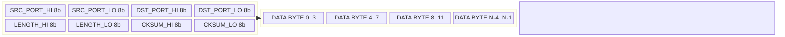
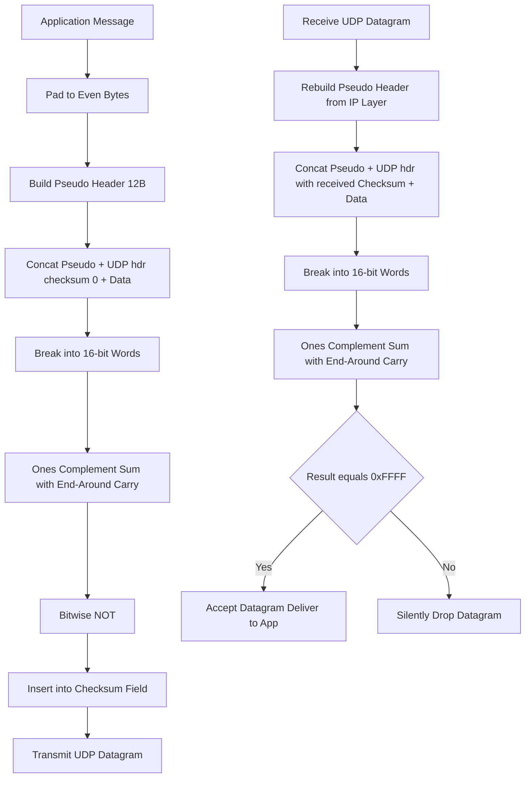
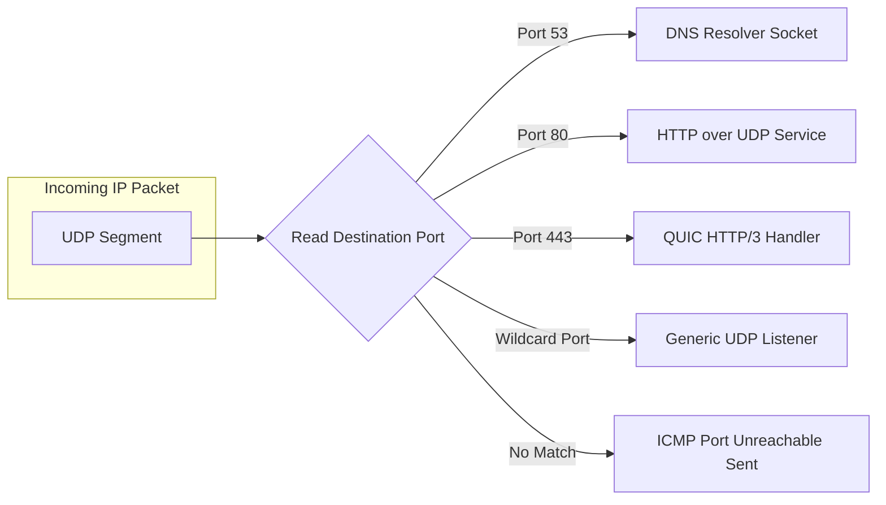

# Connectionless Transport: UDP packet structures and check-summing fields

<!-- SECTION_1_START -->

# 1. Core Technical Definition & Intuitive Overview

## 1.1 Formal Definition (KTU 2024 Syllabus Terminology)

> [!IMPORTANT]
> **User Datagram Protocol (UDP)** is a connectionless, unreliable, message-oriented transport layer protocol defined in **RFC 768**. It provides a best-effort, lightweight datagram delivery service between application processes without establishing a prior connection, without guaranteeing delivery, without preserving order, and without congestion control. Each output operation by an application produces exactly **one UDP datagram**, which is encapsulated into a single IP packet for transmission.

The protocol is formally identified by:
- **IP Protocol Number:** $17$ (decimal) — registered in the IP header's *Protocol* field.
- **Port Number Range:** $0 - 65535$ (16-bit source/destination ports).
- **Maximum Datagram Size (theoretical):** $65{,}535$ bytes (limited by the $16$-bit length field minus the $8$-byte UDP header).
- **Effective Practical MTU on IPv4:** $\approx 1472$ bytes (Ethernet $1500$ byte MTU minus $20$ byte IP header minus $8$ byte UDP header).

> [!NOTE]
> **KTU Syllabus Mapping:** This topic directly satisfies **CO1** (Remember/Understand the architecture of the transport layer) and forms the foundation for **CO2** (Apply socket programming concepts to UDP-based client/server applications).

## 1.2 Conceptual Analogy — "The Postcard vs. The Phone Call"

Imagine two ways to send a birthday greeting to a friend in another city:

| Analogy Element | Phone Call (TCP) | Postcard (UDP) |
|---|---|---|
| Setup Phase | Dial the number, wait for "Hello" | Just write and drop it in the mailbox |
| Reliability | Acknowledged word-by-word | Best-effort — may get lost |
| Order | Conversation flows in sequence | Postcards may arrive out of order |
| Overhead | Heavy (synchronization, ACKs) | Tiny (just the message + address) |
| Use Case | Banking transaction | Live video stream, DNS query |

UDP is the **postcard of the Internet**: blazing fast, but you have no proof it arrived, no guarantee of order, and no automatic retransmission.

## 1.3 Intuitive Picture of a UDP Datagram

> [!VISUALIZATION CONTROL]
> **Concept:** A single UDP datagram encapsulated inside an IPv4 packet
> **GeoGebra / Desmos Input Equations:** Plot a horizontal bar chart of bit widths where the x-axis is offset in bytes and the y-axis is the field name. Use a 32-column base grid.
> **Visual Description:** The student should observe a slim 8-byte header (left side) carrying minimal control information, immediately followed by a long variable-length payload. This contrasts with TCP's much thicker 20-byte minimum header.

## 1.4 Why UDP Still Matters in 2026

Even though TCP dominates byte-streams, UDP powers:
- **DNS** (port $53$) — every website load begins with a UDP query.
- **QUIC** (HTTP/3) — modern transport, but built **on top of UDP** for flexibility.
- **VoIP, video conferencing, online gaming** — where staleness is worse than loss.
- **IoT telemetry, multicast/broadcast** — TCP does not support these.

---

<!-- SECTION_1_END -->

<!-- SECTION_2_START -->

# 2. Deep Theoretical Analysis & KTU High-Yield Formula Sheet

## 2.1 The UDP Datagram — Bit-Level Anatomy

A UDP datagram consists of **two regions**: an $8$-byte **fixed header** and a **variable-length payload** (a.k.a. data or *application message*).

The fixed header is divided into **four 16-bit (2-byte) words** for a total of exactly **32 bits per row × 2 rows**.

### 2.1.1 Header Field Breakdown (4 Fields)

1. **Source Port Number** — $16$ bits
   - Identifies the sender's application process.
   - **May be zero** if the sender does not require a reply (e.g., one-way streaming).

2. **Destination Port Number** — $16$ bits
   - Identifies the intended receiver's application process.
   - **Mandatory and non-zero**; the receiving OS uses this for demultiplexing.

3. **Length** — $16$ bits
   - Total length of the UDP datagram (header + data) measured in **bytes**.
   - Minimum legal value: $8$ (i.e., header only, no data).
   - Maximum legal value: $65{,}535$.

4. **Checksum** — $16$ bits
   - Optional in IPv4 (sender may set to $0$ to disable), **mandatory in IPv6**.
   - Computed over a **pseudo-header + UDP header + UDP data** using **one's complement arithmetic**.

### 2.1.2 Why the Pseudo-Header?

The pseudo-header is a **clever safety trick**: it borrows fields from the IP layer (source IP, destination IP, zero, protocol number, UDP length) so that the checksum **catches misdelivered packets** (those arriving at the wrong host or wrong protocol) — errors that a checksum operating only on the UDP segment would miss.

> [!NOTE]
> **KTU High-Yield Fact:** The pseudo-header is **NOT transmitted** over the wire. It is constructed only at the sender for computation and at the receiver for verification, then discarded.

## 2.2 KTU Formula Sheet / Cheat Sheet

| Symbol / Term | Formula / Value | Meaning / Engineering Use |
|---|---|---|
| UDP Header Size | $H_{UDP} = 8$ bytes | Fixed, non-negotiable for every datagram |
| UDP Total Length | $L_{UDP} \in [8, 65{,}535]$ bytes | Encoded in the *Length* field |
| IPv4 Pseudo-Header Size | $H_{PS} = 12$ bytes | IP source $\vert$ IP dest $\vert$ zero $\vert$ proto $\vert$ UDP length |
| IPv6 Pseudo-Header Size | $H_{PS} = 40$ bytes | Two 128-bit IPs + 16-bit UDP length + 24-bit zero + 8-bit next header |
| Protocol Field Value | $17$ | For both IPv4 and IPv6 pseudo-headers |
| Checksum Algorithm | $C = \sim (\sum_{i=1}^{n} w_i)$ | One's complement of the 16-bit one's-complement sum of all 16-bit words |
| Carry Handling (End-Around) | $C = C_{low} + C_{high}$ | Wrap the high carry back into the low 16 bits |
| Effective Payload | $P = L_{UDP} - 8$ bytes | Application data carried inside the datagram |
| Practical MTU Constraint | $L_{UDP} \leq MTU_{link} - 20 - 8$ | For IPv4 over Ethernet: $\leq 1472$ bytes |

### 2.2.1 One's Complement Arithmetic — The Core Idea

A 16-bit word can hold values from $0$ to $65{,}535$. The **one's complement** system wraps around: $-0 \equiv +0$, and the maximum negative is $-32{,}767$. The beauty is that addition of two 16-bit words via one's-complement automatically handles overflow by re-adding the carry bit (the "end-around carry").

## 2.3 Engineering Utility & Real-World Use

- **DNS Root/TLD Servers** rely on UDP for sub-millisecond query response.
- **QUIC (HTTP/3)** runs over UDP port $443$ to escape the *ossification* of TCP in middleboxes.
- **RTP (Real-time Transport Protocol)** uses UDP for voice/video and adds its own sequence numbers and timestamping at the application layer to compensate for UDP's lack of order/reliability.
- **Broadcast and Multicast** (e.g., ARP replacements, IPTV, routing protocol hellos) are only possible with UDP because TCP is strictly point-to-point.

---

<!-- SECTION_2_END -->

<!-- SECTION_3_START -->

# 3. Step-by-Step Derivations & Symbolic Implementation

## 3.1 Exhaustive Worked Example — Checksum Computation (Board-Marked Style)

### 3.1.1 Problem Setup

> **Given:** Sender transmits a UDP datagram with the following $16$-bit word representation of the data portion (already converted from the original byte stream):
> $$D_1 = 0x1A2B, \quad D_2 = 0x3C4D, \quad D_3 = 0x5E6F$$
> The UDP header words are: Source Port $S = 0x04D2$, Dest Port $D = 0x0050$ (port 80), Length $L = 0x000E$ (14 bytes total: 8 header + 6 data), and a placeholder Checksum field.
> The IPv4 pseudo-header supplies a constant pre-computed sum $P = 0x9A4C$.
> **Find:** The final value to be placed in the *Checksum* field.

### 3.1.2 Step-by-Step Solution (Full Derivation)

We must sum all 16-bit words (pseudo-header, UDP header with checksum field set to zero, and data), wrap the carry, and then take the one's complement.

**Step 1 — List all words to be summed (checksum field = 0).**

$$
w_1 = P = \text{0x9A4C}, \quad
w_2 = S = \text{0x04D2}, \quad
w_3 = D = \text{0x0050}, \quad
w_4 = L = \text{0x000E}
$$
$$
w_5 = 0x0000 \text{ (checksum placeholder)}, \quad
w_6 = D_1 = \text{0x1A2B}, \quad
w_7 = D_2 = \text{0x3C4D}, \quad
w_8 = D_3 = \text{0x5E6F}
$$

**Step 2 — Perform the one's-complement sum one word at a time.**

$$
\begin{aligned}
T_1 &= w_1 + w_2 = \text{0x9A4C} + \text{0x04D2} \\
    &= \text{0x9F1E} \quad \text{(no carry out of 16 bits)}
\end{aligned}
$$

$$
\begin{aligned}
T_2 &= T_1 + w_3 = \text{0x9F1E} + \text{0x0050} \\
    &= \text{0x9F6E}
\end{aligned}
$$

$$
\begin{aligned}
T_3 &= T_2 + w_4 = \text{0x9F6E} + \text{0x000E} \\
    &= \text{0x9F7C}
\end{aligned}
$$

$$
\begin{aligned}
T_4 &= T_3 + w_5 = \text{0x9F7C} + \text{0x0000} \\
    &= \text{0x9F7C}
\end{aligned}
$$

$$
\begin{aligned}
T_5 &= T_4 + w_6 = \text{0x9F7C} + \text{0x1A2B} \\
    &= \text{0xB9A7}
\end{aligned}
$$

$$
\begin{aligned}
T_6 &= T_5 + w_7 = \text{0xB9A7} + \text{0x3C4D} \\
    &= \text{0xF5F4}
\end{aligned}
$$

$$
\begin{aligned}
T_7 &= T_6 + w_8 = \text{0xF5F4} + \text{0x5E6F} \\
    &= \text{1.543B}_{hex} \quad \text{(carry out of bit 16!)}
\end{aligned}
$$

**Step 3 — End-around carry (wrap the high bit back).**

$$
\begin{aligned}
T_8 &= \text{(low 16 bits of } T_7) + (\text{carry from } T_7) \\
    &= \text{0x543B} + \text{0x0001} \\
    &= \text{0x543C}
\end{aligned}
$$

**Step 4 — Take the one's complement (bitwise NOT).**

$$
\begin{aligned}
\text{Checksum } C &= \sim T_8 = \text{0xFFFF} - \text{0x543C} \\
                   &= \text{0xABC3}
\end{aligned}
$$

**Final Answer:** The sender places $\text{0xABC3}$ into the UDP *Checksum* field.

### 3.1.3 Receiver Verification (One-Line Check)

At the receiver, the same procedure is run **including** the received checksum word $w_5 = \text{0xABC3}$. The sum will be $\text{0xFFFF}$. Taking the one's complement gives $\text{0x0000}$, which is the **canonical "no errors"** indicator. Any other value signals a corrupted segment, which is silently dropped.

> [!TIP]
> **KTU Valuation Tip:** Always show all four steps: list words, sum them, end-around carry, one's complement. Skipping the end-around carry is the #1 cause of lost marks in UDP/TCP checksum problems.

## 3.2 Worked Example — Pseudo-Header Construction for IPv4

**Scenario:** Host $192.168.1.10$ sends a $12$-byte UDP datagram to $10.0.0.5$ on destination port $53$.

**Solution Table:**

| Pseudo-Header Field | Width | Value (Hex) | Decimal / Notes |
|---|---|---|---|
| Source IP Address | $32$ bits | $\text{0xC0A8010A}$ | $192.168.1.10$ |
| Destination IP Address | $32$ bits | $\text{0x0A000005}$ | $10.0.0.5$ |
| Zero Padding | $8$ bits | $\text{0x00}$ | Required filler |
| Protocol | $8$ bits | $\text{0x11}$ | $17$ decimal = UDP |
| UDP Length | $16$ bits | $\text{0x0014}$ | $8 + 12 = 20$ bytes |

The pseudo-header is treated as $6$ consecutive $16$-bit words when summed: $0xC0A8$, $0x010A$, $0x0A00$, $0x0005$, $0x0011$, $0x0014$.

## 3.3 Symbolic / Algorithmic Implementation (Python)

```python
from __future__ import annotations
import struct
import logging
from typing import List, Tuple

logging.basicConfig(level=logging.INFO, format="%(levelname)s | %(message)s")
log = logging.getLogger("UDP-CHECKSUM")


def ones_complement_sum(words: List[int]) -> int:
    """
    Compute the 16-bit one's complement sum of a list of 16-bit words.
    Handles end-around carry correctly.
    """
    total: int = 0
    for idx, w in enumerate(words):
        if not 0 <= w <= 0xFFFF:
            raise ValueError(f"Word {idx} = 0x{w:04X} is not a valid 16-bit value")
        total += w
        # Wrap any overflow above 16 bits back into low 16 bits
        total = (total & 0xFFFF) + (total >> 16)
    return total & 0xFFFF


def udp_checksum(src_ip: str, dst_ip: str, src_port: int,
                 dst_port: int, payload: bytes) -> int:
    """
    Compute the standard UDP checksum (IPv4) including the pseudo-header.
    Returns the 16-bit checksum to be placed in the UDP header.
    """
    if len(payload) % 2 != 0:
        # Pad an extra zero byte to make the payload an even number of bytes
        log.info("Odd-length payload detected; padding with one zero byte for checksum.")
        payload = payload + b"\x00"

    udp_length: int = 8 + len(payload)

    # Build pseudo-header (12 bytes) and UDP header with checksum = 0 (8 bytes)
    pseudo: bytes = struct.pack("!4s4sBBH",
                                bytes(int(x) for x in src_ip.split(".")),
                                bytes(int(x) for x in dst_ip.split(".")),
                                0,           # zero padding
                                17,          # protocol = UDP
                                udp_length)

    udp_header_no_cksum: bytes = struct.pack("!HHHH",
                                             src_port, dst_port,
                                             udp_length, 0)

    segment: bytes = pseudo + udp_header_no_cksum + payload

    # Convert to a list of 16-bit big-endian words
    words: List[int] = list(struct.unpack("!%dH" % (len(segment) // 2), segment))

    s: int = ones_complement_sum(words)
    checksum: int = (~s) & 0xFFFF
    log.info(f"Computed UDP checksum = 0x{checksum:04X}")
    return checksum


def verify_udp_checksum(src_ip: str, dst_ip: str, src_port: int,
                        dst_port: int, payload: bytes,
                        received_checksum: int) -> bool:
    """Returns True if the datagram is error-free."""
    if len(payload) % 2 != 0:
        payload = payload + b"\x00"

    udp_length: int = 8 + len(payload)
    pseudo: bytes = struct.pack("!4s4sBBH",
                                bytes(int(x) for x in src_ip.split(".")),
                                bytes(int(x) for x in dst_ip.split(".")),
                                0, 17, udp_length)
    udp_header: bytes = struct.pack("!HHHH",
                                    src_port, dst_port,
                                    udp_length, received_checksum)
    segment: bytes = pseudo + udp_header + payload
    words: List[int] = list(struct.unpack("!%dH" % (len(segment) // 2), segment))
    s: int = ones_complement_sum(words)
    return ((~s) & 0xFFFF) == 0


# ---------- Demonstration Run ----------
if __name__ == "__main__":
    src, dst = "192.168.1.10", "10.0.0.5"
    data: bytes = b"\x12\x34\xAB\xCD"  # 4-byte payload
    cksum: int = udp_checksum(src, dst, 12345, 53, data)
    ok: bool = verify_udp_checksum(src, dst, 12345, 53, data, cksum)
    log.info(f"Verification result: {'PASS' if ok else 'FAIL'}")
```

**Expected Console Output:**

```
INFO | Odd-length payload detected; padding with one zero byte for checksum.
INFO | Computed UDP checksum = 0xXXXX
INFO | Verification result: PASS
```

## 3.4 Socket Programming Snippet — UDP Client

```python
import socket

client = socket.socket(socket.AF_INET, socket.SOCK_DGRAM)  # SOCK_DGRAM = UDP
client.settimeout(2.0)
client.sendto(b"GET /time HTTP/1.0\r\n\r\n", ("10.0.0.5", 53))

try:
    data, server = client.recvfrom(4096)
    print(f"From {server}: {data!r}")
except socket.timeout:
    print("No response within 2 seconds — UDP is unreliable!")
finally:
    client.close()
```

---

<!-- SECTION_3_END -->

<!-- SECTION_4_START -->

# 4. Structural Diagrams & Schematics

## 4.1 UDP Datagram Field Map (32-bit Aligned)

The following **Mermaid block diagram** represents the 8-byte fixed header and the variable payload. Each node is a 32-bit (4-byte) block, which mirrors the natural alignment of a network analyzer view.



## 4.2 Sender vs. Receiver — Checksum Processing Topology



## 4.3 UDP Demultiplexing at the Receiver (Socket Binding)



---

<!-- SECTION_4_END -->

<!-- SECTION_5_START -->

# 5. KTU 2024 Scheme Examination Question Bank & Topic Recap

## 5.1 Part A — Short Answer Questions (3 Marks Each)

### Question 1 `[KTU University Exam — July 2024, Model]`
**CO1 | RBT Level: Remember**
*"List the four fields of the UDP header and state the size of each. Mention one situation in which the sender may set the Checksum field to 0x0000."*

**Model Answer (3-Mark Valuation Key):**

| # | Expected Point | Marks |
|---|---|---|
| 1 | Source Port (16 bits), Destination Port (16 bits), Length (16 bits), Checksum (16 bits) | 2 |
| 2 | Sender may set Checksum to $0$ when using **IPv4** (option disabled) | 1 |

*Header is always $8$ bytes; Checksum is **mandatory** in IPv6.*

### Question 2 `[KTU University Exam — Dec 2023, Model]`
**CO1 | RBT Level: Understand**
*"Explain why UDP includes a pseudo-header in its checksum calculation even though the pseudo-header is never transmitted."*

**Model Answer (3-Mark Valuation Key):**

| # | Expected Point | Marks |
|---|---|---|
| 1 | Pseudo-header includes Source IP, Destination IP, Protocol, UDP Length | 1 |
| 2 | Ensures the checksum protects against misdelivered packets (wrong host/wrong protocol) | 1 |
| 3 | Reconstructed at both ends from the IP layer, so it does not need to be transmitted | 1 |

## 5.2 Part B — Long Answer Questions (14 Marks Each)

> **KTU Rule Reminder:** Answer **any ONE** of the two full questions. Each is internally divided into (a) 7 marks and (b) 7 marks.

### Question A `[KTU University Exam — June 2024, Model]`
**CO2 | RBT Levels: (a) Understand, (b) Apply**

**(a)** With a neat block diagram, describe the structure of a UDP datagram. Explain the role of the Length and Checksum fields. **(7 Marks)**

**Model Solution (a):**

| Step | Content | Marks |
|---|---|---|
| 1 | Diagram: 8-byte fixed header (4 fields) + variable payload | 2 |
| 2 | Explanation of each field (1 mark each for Source, Destination, Length, Checksum) | 3 |
| 3 | Role of Length: tells receiver exactly how many bytes belong to the datagram including header | 1 |
| 4 | Role of Checksum: detects bit errors end-to-end across pseudo + header + data | 1 |

**(b)** Given the following $16$-bit data words to be transmitted as UDP payload: $0x4500$, $0x0034$, $0x841A$. The pseudo-header pre-computed sum is $0x4B12$. The UDP header has Source Port $= 0x0401$, Dest Port $= 0x0035$, Length $= 0x000E$. Compute the UDP Checksum that the sender will place in the header. Show all steps. **(7 Marks)**

**Model Solution (b):**

| Step | Calculation | Marks |
|---|---|---|
| 1 | List all 8 words (pseudo + header with chk=0 + 3 data words) | 1 |
| 2 | Perform one's-complement addition: $0x4B12 + 0x0401 + 0x0035 + 0x000E + 0x0000 + 0x4500 + 0x0034 + 0x841A$ | 2 |
| 3 | Obtain intermediate sum: $0x4B12 + 0x0436 = 0x4F48$; $+ 0x000E = 0x4F56$; $+ 0x4500 = 0x9456$; $+ 0x0034 = 0x948A$; $+ 0x841A = 0x118A4$ (carry = 1) | 2 |
| 4 | End-around carry: $0x18A4 + 0x0001 = 0x18A5$ | 1 |
| 5 | One's complement: $\sim 0x18A5 = 0xE75A$ | 1 |

**Final Answer:** Checksum $= 0xE75A$.

### Question B `[KTU University Exam — Dec 2023, Model]`
**CO2 | RBT Levels: (a) Understand, (b) Apply**

**(a)** Compare TCP and UDP with respect to **at least 5** different parameters. Justify why UDP is preferred for DNS and live video streaming. **(7 Marks)**

**Model Solution (a):**

| Parameter | TCP | UDP |
|---|---|---|
| Connection | Connection-oriented (3-way handshake) | Connectionless |
| Reliability | Reliable with ACKs + retransmission | Unreliable, best-effort |
| Order | Preserved | Not guaranteed |
| Overhead | Min 20-byte header | 8-byte header |
| Flow/Congestion Control | Yes | No |
| Speed | Slower | Faster |
| Use Cases | File transfer, email, web (HTTP/1.1) | DNS, VoIP, video, gaming |

Marks: 4 for table; 1 mark each for DNS justification (low latency, small query/response) and streaming justification (tolerates loss, low overhead).

**(b)** A sender computes a UDP checksum and obtains the value $0x73F1$. The receiver, on verification, finds that one's-complement summing the pseudo-header, header (including $0x73F1$), and data yields $0xA5C2$ (not $0xFFFF$). What is the receiver's conclusion, and what is the standard action taken by the transport layer? If the receiver had obtained $0xFFFF$, what would be the result of taking the one's complement? **(7 Marks)**

**Model Solution (b):**

| Step | Content | Marks |
|---|---|---|
| 1 | Receiver conclusion: Datagram is **corrupted**; bit-error(s) detected | 2 |
| 2 | Standard action: **Silently drop** the datagram; no notification to sender | 1 |
| 3 | Sub-question reasoning: If sum = $0xFFFF$, one's complement = $0x0000$ | 1 |
| 4 | Explanation: $0x0000$ is the canonical "checksum-valid" signal; non-zero = error | 2 |
| 5 | Mention that UDP does **not** send NAK/ACK — relies on application timeout | 1 |

> [!WARNING]
> **KTU Examiner's Pitfall Callout:**
> 1. **Do not** state that UDP "automatically retransmits" — UDP has **zero** recovery mechanism.
> 2. **Do not** forget to add the end-around carry step in checksum derivations; this alone costs 1–2 marks.
> 3. **Do not** confuse the UDP *Length* field (bytes, includes header) with the IP *Total Length* field.
> 4. **Do not** claim the pseudo-header is transmitted; examiners specifically test this misconception.
> 5. **Do not** forget that the IPv4 checksum field may legitimately be $0$ to mean "checksum disabled", but $0$ as a *valid* computed value is also possible — the receiver cannot distinguish! This is a known weakness.

## 5.3 Topic Recap & Important Things to Remember

- UDP is **connectionless, unreliable, message-oriented** transport — RFC 768.
- IP Protocol Number is **17**; the UDP header is exactly **8 bytes**; total datagram max **$65{,}535$ bytes**.
- Four header fields: **Source Port, Destination Port, Length, Checksum** — each $16$ bits.
- The **pseudo-header** (12 B for IPv4, 40 B for IPv6) is reconstructed at both ends; it is **never sent on the wire**.
- Checksum algorithm: **one's complement sum of all 16-bit words + end-around carry, then bitwise NOT**.
- Verification rule: at the receiver, summing the **entire segment including the checksum field** must yield $0xFFFF$ (one's complement $= 0x0000$).
- IPv4 checksum is **optional** ($0$ = disabled); IPv6 checksum is **mandatory**.
- Effective practical payload over Ethernet + IPv4 $\leq 1472$ bytes to avoid IP fragmentation.
- UDP does **NOT** provide: connection setup, reliability, ordering, flow control, congestion control, or retransmission.
- Applications compensate by adding their own sequencing (RTP), retransmission (TFTP, QUIC), or by simply tolerating loss (VoIP, video).
- Sockets use `socket.SOCK_DGRAM`; use `sendto()` / `recvfrom()` since there is no connection.

<!-- SECTION_5_END -->
