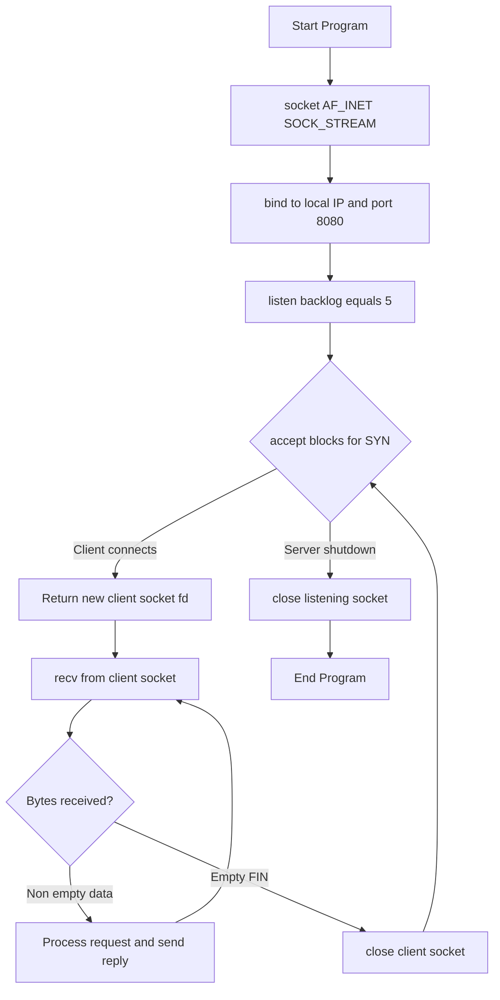
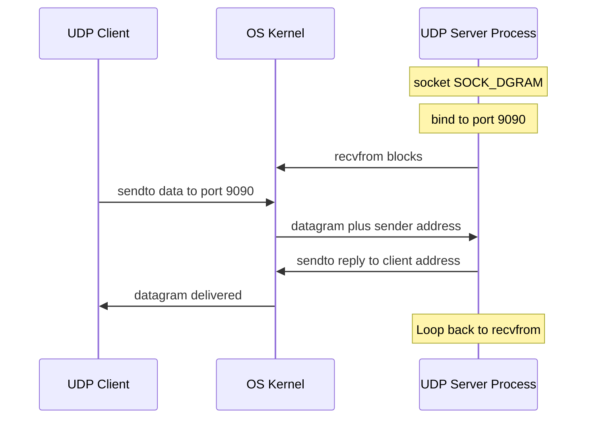
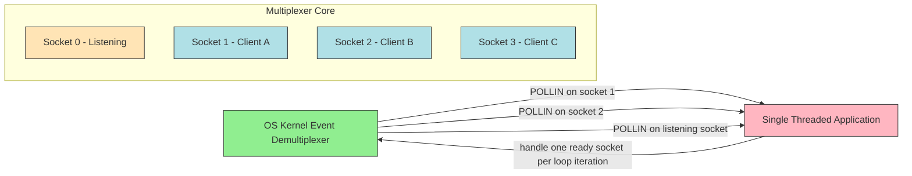
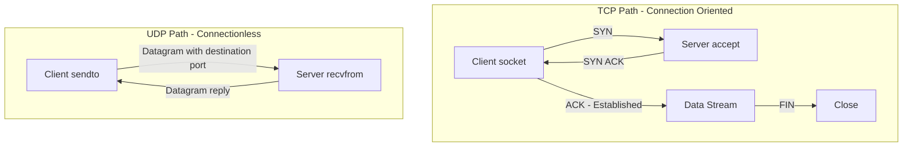

# Socket Architecture: Network Socket introductions, Elementary TCP Sockets, Client/Server implementations, I/O Multiplexing (select/poll), Elementary UDP Sockets

<!-- SECTION_1_START -->

# Module 2: Socket Architecture

## 1. Core Technical Definition & Intuitive Overview

### 1.1 What is a Network Socket?

A **Network Socket** is formally defined as the *endpoint of a bidirectional inter-process communication flow across an IP-based computer network* (e.g., the Internet). A socket is uniquely identified at any given instant by a **4-tuple** consisting of:

$$\text{SocketID} = \langle \text{SourceIP},\ \text{SourcePort},\ \text{DestinationIP},\ \text{DestinationPort} \rangle$$

In the KTU 2024 syllabus framework, the socket is treated as a **software abstraction** (an Application Programming Interface) that sits between the Transport Layer (TCP/UDP) and the Application Layer, allowing programmers to send and receive data over the network without manipulating raw packets.

> [!IMPORTANT]
> **KTU Syllabus Highlight:** A socket is *not* a physical plug. It is a data structure maintained by the Operating System kernel inside the Transport Layer. It is bound to a specific port number and IP address.

### 1.2 The "Doorway" Analogy — Conceptual Intuition

Imagine two houses (processes) located on different streets (different IP addresses) in a city (the network). To receive mail (data), each house installs a *letterbox* at a specific *door number* (port number).

- The **IP Address** is the **Street Address** of the house.
- The **Port Number** is the **Door Number** of the letterbox.
- The **Socket** is the **letterbox itself** — the interface that buffers incoming letters, holds outgoing letters, and tracks delivery state.
- The **Protocol (TCP/UDP)** is the **Postal Service** that defines *how* the letters are delivered: registered post (TCP — reliable, ordered) or standard post (UDP — best effort, fast).

When a *Client* process creates a socket, it opens a temporary letterbox. When a *Server* process creates a socket, it opens a *well-known* letterbox at a fixed door number (e.g., Port 80 for Web Servers). The OS kernel uses the **socket descriptor** (an integer handle) to manage the lifecycle of this letterbox.

> [!NOTE]
> **Core Definition for Examinations:** *"A socket is an interface between the application layer and the transport layer, identified by a port number and an IP address, used to send and receive data between two endpoints."*

### 1.3 Geometric / Architectural Intuition

Visually, picture the **OSI/TCP-IP layered model** as a vertical stack. The socket API is the *horizontal seam* that the Application Layer code stitches to in order to use the services of the Transport Layer. The socket is a *doorway* on this seam, opened to a specific transport protocol.

> [!VISUALIZATION CONTROL]
> **Concept:** Vertical Layered Stack with Horizontal Socket Doorway
> **GeoGebra / Desmos Input Equations:**
> * Layer $L_0$ : Application (HTTP, FTP, SSH)
> * Layer $L_1$ : Socket API (doorway at port $p$)
> * Layer $L_2$ : Transport (TCP / UDP)
> * Layer $L_3$ : Network (IP routing)
> * Layer $L_4$ : Data Link and Physical (Ethernet, Fiber)
> **Visual Description:** Visualize a column of 5 boxes stacked top-to-bottom. A right-pointing arrow labeled `socket(p)` exits from the right side of Box $L_1$, representing the application's logical handle to the transport layer.

### 1.4 Three Principal Socket Types (KTU Classification)

| Socket Type | Constant in C | Transport | Reliability | Use Case |
|---|---|---|---|---|
| **Stream Socket** | `SOCK_STREAM` | TCP | Reliable, Ordered, Connection-Oriented | Web (HTTP), Email (SMTP), File Transfer (FTP) |
| **Datagram Socket** | `SOCK_DGRAM` | UDP | Unreliable, Connectionless, Best-Effort | DNS, Video Streaming, VoIP, Online Gaming |
| **Raw Socket** | `SOCK_RAW` | IP / ICMP | Bypasses Transport Layer | Ping, Traceroute, Network Sniffers |

<!-- SECTION_1_END -->

<!-- SECTION_2_START -->

# 2. Deep Theoretical Analysis & KTU High-Yield Formula Sheet

## 2.1 The Socket Address Structure (Generic and Specific)

To make a socket work, the application must supply the destination. This is done via a **socket address structure**. The generic form is:

$$\text{struct sockaddr} = \{\ \text{sa\_family},\ \text{sa\_data}[14]\ \}$$

Since the generic form is awkward, two specialized structures are used in practice:

1.  `struct sockaddr_in` — used for **IPv4** addressing.
2.  `struct sockaddr_in6` — used for **IPv6** addressing.

The *generic* `sockaddr` is then *typecast* to the specialized structure using a **cast operator**. This is mandatory because C functions like `bind()`, `connect()`, `accept()` always accept pointers to `struct sockaddr` for forward compatibility.

## 2.2 Server Socket Lifecycle (TCP)

A TCP server must follow a strict 7-step sequence. The KTU 2024 module specifically requires students to memorize this lifecycle.

1.  **`socket()`** — Create a new communication endpoint (returns a *socket descriptor*, an integer $f_d \ge 0$).
2.  **`bind()`** — Bind the socket descriptor to a specific local **IP** and **Port**. After this step, the OS reserves that port for this process.
3.  **`listen()`** — Convert the active socket into a *passive listening socket*. This tells the kernel to start accepting incoming `SYN` packets and maintain a *backlog queue*.
4.  **`accept()`** — A **blocking** call. The kernel waits for a client `SYN` packet. When received, it completes the 3-way handshake and returns a *new* socket descriptor (let's call it $f_{acc}$) used purely for that client.
5.  **`recv()` / `read()`** — Receive bytes from the client over $f_{acc}$.
6.  **`send()` / `write()`** — Send bytes to the client over $f_{acc}$.
7.  **`close()`** — Terminate the connection (sends `FIN` packet).

## 2.3 Client Socket Lifecycle (TCP)

A TCP client follows a simpler 4-step sequence.

1.  **`socket()`** — Create an unbound socket. The OS auto-assigns an **ephemeral port** (a random high-numbered port).
2.  **`connect()`** — Initiate the 3-way TCP handshake (`SYN` $\to$ `SYN-ACK` $\to$ `ACK`) with the server's IP and port.
3.  **`send()` / `write()` and `recv()` / `read()`** — Exchange data bidirectionally.
4.  **`close()`** — Terminate the connection.

## 2.4 I/O Multiplexing — `select()` and `poll()`

### 2.4.1 The Problem
A single-threaded server using `accept()` in a blocking loop can only service **one client at a time**. If client A is slow, client B waits indefinitely. This is called the **"C10K"** problem (handling 10,000 concurrent connections).

### 2.4.2 The Solution
Instead of blocking on each client, the server maintains a **set of socket descriptors** and asks the kernel: *"Tell me which of these sockets is currently ready to be read or written without blocking."*

### 2.4.3 `select()` — The Bitmap Multiplexer

`select()` uses three **bit-mask file descriptor sets**:

$$\text{fd\_set}\ \text{readfds},\ \text{writefds},\ \text{exceptfds}$$

The macro `FD_ZERO(fds)` clears the set. `FD_SET(f, fds)` adds file descriptor $f$ to the set. `FD_ISSET(f, fds)` checks if $f$ is set after the call.

**Signature:** `int select(int nfds, fd_set *readfds, fd_set *writefds, fd_set *exceptfds, struct timeval *timeout);`

`nfds` is `max_fd + 1`. The kernel scans from $0$ to $nfds - 1$ on every call, which is **$O(n)$** in the number of descriptors. This is the **fundamental scalability limit** of `select()`.

### 2.4.4 `poll()` — The Array Multiplexer

`poll()` uses an **array of `struct pollfd`** elements:

$$\text{struct pollfd} = \{\ \text{int fd},\ \text{short events},\ \text{short revents}\ \}$$

`events` is the bitmask of conditions we care about (e.g., `POLLIN`). `revents` is the bitmask the kernel fills in to tell us what *actually* happened.

**Signature:** `int poll(struct pollfd *fds, nfds_t nfds, int timeout);`

`poll()` does not require passing `nfds` as the largest descriptor; it iterates the array directly. **Complexity is still $O(n)$**, but it is *slightly* more efficient than `select()` for high-valued descriptors because it avoids the bitmap re-scan.

## 2.5 KTU High-Yield Formula Cheat Sheet

| Concept | Formula / Definition | Units | Notes |
|---|---|---|---|
| **Socket 4-tuple Identity** | $\langle$ SrcIP, SrcPort, DstIP, DstPort $\rangle$ | — | Uniquely identifies one TCP connection globally |
| **Port Range** | $0 \le \text{port} \le 65535$ | dimensionless | Range is $2^{16}$ |
| **Well-Known Ports** | $0 \le \text{port} \le 1023$ | dimensionless | HTTP=80, HTTPS=443, FTP=21, SSH=22 |
| **Registered Ports** | $1024 \le \text{port} \le 49151$ | dimensionless | Assigned by IANA |
| **Ephemeral Ports** | $49152 \le \text{port} \le 65535$ | dimensionless | Auto-assigned by client OS |
| **`select()` Complexity** | $O(\text{nfds})$ per call | ops | Linear scan of bitmask |
| **`poll()` Complexity** | $O(N)$ per call | ops | Linear scan of `pollfd` array |
| **MTU Typical** | $1500$ bytes | bytes | Maximum TCP segment payload on Ethernet |
| **Listen Backlog** | $\text{SOMAXCONN}$ | connections | Kernel-dependent, often $128$ |
| **TCP MSS** | $\text{MTU} - 40$ | bytes | $1460$ bytes for standard Ethernet |

> [!NOTE]
> **Engineering Real-World Utility:** I/O Multiplexing is the foundational pattern behind **Nginx, Node.js, Redis, and Netty**. Modern extensions like `epoll()` (Linux) and `kqueue()` (BSD/macOS) improve on `select`/`poll` to $O(1)$ per event, but the conceptual model is identical.

<!-- SECTION_2_END -->

<!-- SECTION_3_START -->

# 3. Step-by-Step Derivations and Code Implementation

> [!IMPORTANT]
> The implementations below use **Python** (with the standard `socket` and `select` modules) because Python is the de-facto KTU practical examination language. The C equivalents follow the exact same logic.

## 3.1 Elementary TCP Server — Exhaustive Walkthrough

```python
import socket
import sys

# ---------- STEP 1: socket() ----------
# AF_INET  => IPv4 address family
# SOCK_STREAM => TCP (reliable, byte-stream, connection-oriented)
server_socket = socket.socket(socket.AF_INET, socket.SOCK_STREAM)
print("[SERVER] socket() created, descriptor =", server_socket.fileno())

# ---------- STEP 2: bind() ----------
# Reserve local address = ('0.0.0.0', 8080)
# 0.0.0.0 means "listen on ALL network interfaces"
server_address = ('0.0.0.0', 8080)
server_socket.bind(server_address)
print("[SERVER] bind() succeeded on", server_address)

# ---------- STEP 3: listen() ----------
# Backlog = 5 (kernel will queue up to 5 pending SYNs)
server_socket.listen(5)
print("[SERVER] listen() active. Waiting for clients...")

# ---------- STEP 4: accept() loop ----------
try:
    while True:
        # BLOCKS until a client connects
        client_socket, client_address = server_socket.accept()
        print("[SERVER] accept() returned new socket for", client_address)

        # ---------- STEP 5 & 6: recv() and send() ----------
        try:
            data = client_socket.recv(1024)   # read up to 1024 bytes
            if not data:
                print("[SERVER] Client disconnected cleanly")
            else:
                print("[SERVER] Received:", data.decode('utf-8'))
                response = "ACK: " + data.decode('utf-8').upper()
                client_socket.send(response.encode('utf-8'))
        except socket.error as e:
            print("[SERVER] Socket error during I/O:", e)
        finally:
            # ---------- STEP 7: close() ----------
            client_socket.close()
            print("[SERVER] Connection with", client_address, "closed")

except KeyboardInterrupt:
    print("\n[SERVER] Ctrl+C pressed. Shutting down...")
finally:
    server_socket.close()
    print("[SERVER] Listening socket closed. Bye.")
    sys.exit(0)
```

**Line-by-Line Logic for Examiners:**

* `socket.AF_INET` selects the **IPv4 protocol family**. The alternative `AF_INET6` would be required for IPv6.
* `socket.SOCK_STREAM` is the constant that selects the **TCP protocol**. Using `SOCK_DGRAM` here would produce a UDP socket.
* `bind()` will raise `OSError: [Errno 98] Address already in use` if port 8080 is occupied. This is a very common KTU viva question.
* `listen(5)` does **not** mean only 5 clients can ever connect. It means the *pending* (not-yet-accepted) queue can hold at most 5.
* `accept()` returns a **tuple of (new_socket, address)**. The original `server_socket` is *never* used for I/O — it is only a *doorbell*. The new socket is the *private channel* to that specific client.
* The `if not data` check detects a **graceful client-side close** (the client called `close()` which sent a `FIN`). An empty `bytes` object in Python is *falsy*.
* `finally: close()` ensures the per-client socket is freed even if an exception occurs. This prevents **file descriptor leaks**.

## 3.2 Elementary TCP Client — Exhaustive Walkthrough

```python
import socket

# ---------- STEP 1: socket() ----------
# OS automatically assigns an ephemeral port for the client
client_socket = socket.socket(socket.AF_INET, socket.SOCK_STREAM)
print("[CLIENT] Local ephemeral port =", client_socket.getsockname()[1])

# ---------- STEP 2: connect() ----------
server_address = ('127.0.0.1', 8080)   # 127.0.0.1 = localhost (loopback)
try:
    client_socket.connect(server_address)
    print("[CLIENT] connect() to", server_address, "succeeded")
except socket.error as err:
    print("[CLIENT] Connection failed:", err)
    raise

# ---------- STEP 3: send() and recv() ----------
message = "Hello KTU Server"
print("[CLIENT] Sending:", message)
client_socket.send(message.encode('utf-8'))

data = client_socket.recv(1024)
print("[CLIENT] Received echo:", data.decode('utf-8'))

# ---------- STEP 4: close() ----------
client_socket.close()
print("[CLIENT] Connection closed.")
```

**Key Points:**

* `getsockname()` returns the *local* `(ip, port)` of the socket, which lets us inspect the OS-assigned ephemeral port. Useful for debugging.
* `connect()` performs the **TCP 3-way handshake** under the hood. If the server is down, `connect()` raises `ConnectionRefusedError`.

## 3.3 Elementary UDP Server — Exhaustive Walkthrough

```python
import socket

# ---------- STEP 1: socket() ----------
# SOCK_DGRAM => UDP
udp_server = socket.socket(socket.AF_INET, socket.SOCK_DGRAM)
server_addr = ('0.0.0.0', 9090)

# ---------- STEP 2: bind() ----------
# Even UDP servers must bind to a known port to receive datagrams
udp_server.bind(server_addr)
print("[UDP-SERVER] Listening on", server_addr)

# ---------- STEP 3: recvfrom() loop ----------
try:
    while True:
        data, client_addr = udp_server.recvfrom(2048)
        print(f"[UDP-SERVER] From {client_addr}: {data.decode('utf-8')}")

        # ---------- STEP 4: sendto() ----------
        reply = "UDP-ACK: " + data.decode('utf-8')
        udp_server.sendto(reply.encode('utf-8'), client_addr)
except KeyboardInterrupt:
    print("\n[UDP-SERVER] Shutting down...")
finally:
    udp_server.close()
```

**Key Points:**

* UDP uses `recvfrom()` instead of `recv()`. It returns a tuple `(data, address)` because UDP is **connectionless** — there is no pre-established channel, so the kernel must tell us *who* sent the datagram.
* `sendto(data, address)` is the UDP equivalent of `send()`. The address must be re-supplied on *every* call.
* There is **no `accept()` and no `listen()`** in UDP. The server jumps directly from `bind()` to the `recvfrom()` loop.

## 3.4 Elementary UDP Client

```python
import socket

udp_client = socket.socket(socket.AF_INET, socket.SOCK_DGRAM)
server_addr = ('127.0.0.1', 9090)

# Note: NO connect() call for UDP!
message = "Hello KTU UDP Server"
udp_client.sendto(message.encode('utf-8'), server_addr)

data, _ = udp_client.recvfrom(2048)
print("[UDP-CLIENT] Server replied:", data.decode('utf-8'))

udp_client.close()
```

## 3.5 I/O Multiplexing with `select()`

This server handles multiple clients in a **single thread** by using `select()` to monitor the listening socket *and* every active client socket simultaneously.

```python
import socket
import select
import sys

server = socket.socket(socket.AF_INET, socket.SOCK_STREAM)
server.setblocking(False)                    # CRITICAL: non-blocking mode
server.bind(('0.0.0.0', 7777))
server.listen(5)
print("[SELECT-SERVER] Listening on port 7777")

# We maintain TWO lists:
# - read_list: sockets we want to know if READABLE
# - active_clients: sockets that have an established connection
read_list = [server]
active_clients = {}

try:
    while True:
        # ---------- select() BLOCKS until at least one fd is ready ----------
        # timeout=None => block forever
        # We pass the SAME list (read_list) for monitoring; select mutates it in place
        readable, _, _ = select.select(read_list, [], [], None)

        for sock in readable:
            if sock is server:
                # Case A: The listening socket is readable => a new client is connecting
                client, addr = server.accept()
                print(f"[SELECT-SERVER] New client: {addr}")
                client.setblocking(False)
                read_list.append(client)
                active_clients[client] = addr
            else:
                # Case B: An existing client socket is readable => data or close
                try:
                    data = sock.recv(1024)
                except ConnectionResetError:
                    data = None

                if not data:
                    # The client sent FIN or RST
                    print(f"[SELECT-SERVER] Client {active_clients[sock]} disconnected")
                    read_list.remove(sock)
                    active_clients.pop(sock, None)
                    sock.close()
                else:
                    print(f"[SELECT-SERVER] From {active_clients[sock]}: {data.decode('utf-8')}")
                    sock.send(b"SELECT-ACK: " + data)

except KeyboardInterrupt:
    print("\n[SELECT-SERVER] Shutting down...")
    for s in read_list:
        s.close()
    sys.exit(0)
```

**Logic Notes:**

* `setblocking(False)` is **mandatory**. Without it, `accept()` and `recv()` would block the entire event loop, defeating the purpose of `select()`.
* The line `readable, _, _ = select.select(read_list, [], [], None)` asks the kernel: *"Wake me when ANY socket in `read_list` becomes readable."* The `[]` placeholders are for *write-ready* and *error* sets that we don't use here.
* `select` **modifies `read_list` in place** to contain only the sockets that are currently ready. We *must not* pass a constant list. The result tuple `readable` contains a snapshot.
* When a client disconnects, `recv()` returns an empty `bytes` object. We must explicitly `read_list.remove(sock)` to stop monitoring it, otherwise `select` will keep waking us up for a dead socket forever.

## 3.6 I/O Multiplexing with `poll()`

```python
import socket
import select
import sys

server = socket.socket(socket.AF_INET, socket.SOCK_STREAM)
server.bind(('0.0.0.0', 8888))
server.listen(5)
print("[POLL-SERVER] Listening on port 8888")

# Build the initial pollfd array
fd_map = {}    # fd -> socket object
poll_obj = select.poll()

# Register the listening socket for READ events
poll_obj.register(server.fileno(), select.POLLIN)
fd_map[server.fileno()] = server

try:
    while True:
        # poll() returns a list of (fd, event) tuples
        events = poll_obj.poll(1000)   # timeout = 1000 ms
        for fd, event in events:
            sock = fd_map[fd]
            if sock is server:
                if event & select.POLLIN:
                    client, addr = server.accept()
                    print(f"[POLL-SERVER] New client: {addr}")
                    poll_obj.register(client.fileno(), select.POLLIN)
                    fd_map[client.fileno()] = client
            else:
                if event & (select.POLLIN | select.POLLHUP):
                    data = sock.recv(1024)
                    if not data:
                        print(f"[POLL-SERVER] Client {sock.getpeername()} hung up")
                        poll_obj.unregister(fd)
                        fd_map.pop(fd)
                        sock.close()
                    else:
                        print(f"[POLL-SERVER] Received: {data.decode('utf-8')}")
                        sock.send(b"POLL-ACK: " + data)
except KeyboardInterrupt:
    print("\n[POLL-SERVER] Shutting down...")
    poll_obj.unregister(server.fileno())
    server.close()
    sys.exit(0)
```

**Logic Notes:**

* `poll_obj.poll(1000)` returns a list of `(fd, event)` tuples. The integer `1000` is the timeout in milliseconds.
* The bitmask `select.POLLIN` corresponds to *"data available to read"*. `select.POLLHUP` is *"hang-up"*, indicating the peer closed the connection.
* `fd_map` is a Python dictionary mapping the integer file descriptor to the socket object, because the kernel works with integers but our code needs the Python object.
* `poll_obj.unregister(fd)` is critical to free kernel resources for closed connections.

## 3.7 Numerical Demonstration — Port Math

Suppose a server is bound to port `8080` and accepts 3 clients. What is the 4-tuple for client #2 coming from IP `10.0.0.5` whose OS assigned ephemeral port `51234$?

$$\text{Conn}_2 = \langle 10.0.0.5,\ 51234,\ 192.168.1.10,\ 8080 \rangle$$

A second client from the *same* IP using a *different* ephemeral port (e.g., $51235$) produces a *different* 4-tuple, allowing the server kernel to demultiplex packets correctly via the hash table:

$$H = \text{hash}\big(\text{Conn}_2\big) = \text{hash}\big(\text{Conn}_3\big) \iff \text{different buckets if hash is good}$$

<!-- SECTION_3_END -->

<!-- SECTION_4_START -->

# 4. Structural Diagrams and Schematics

## 4.1 TCP Server Lifecycle — Mermaid Flowchart



**Diagram Reading Notes:**

* The `B`, `C`, `D` blocks correspond to the three *preparation* syscalls.
* Node `F` is the *fork point* — one accept returns a new socket descriptor for that specific client while the original listening socket remains at `E`.
* The loop `G $\to$ H $\to$ I` represents the bidirectional I/O session over the established TCP connection.

## 4.2 UDP Server Architecture — Mermaid Sequence Diagram



**Diagram Reading Notes:**

* Notice the **absence** of `connect()`, `accept()`, and `listen()` nodes. UDP is fully connectionless.
* The kernel performs the address-to-process demultiplexing purely based on the destination port.

## 4.3 I/O Multiplexing State Machine — select/poll Architecture



**Diagram Reading Notes:**

* The **Multiplexer Core** (`MUX` subgraph) groups all monitored sockets. The `K` (kernel) node aggregates events and dispatches them to the **single-threaded application** (`APP`).
* The `APP` node processes **one ready socket per loop iteration** — this is the heart of the event-driven architecture used by `nginx`, `Redis`, and `Node.js`.

## 4.4 TCP vs UDP Comparison Topology



<!-- SECTION_4_END -->

<!-- SECTION_5_START -->

# 5. KTU 2024 Scheme Examination Question Bank and Topic Recap

## 5.1 Part A — Short Answer Questions (3 Marks Each)

### Question 1: Define a network socket. Mention the four parameters that uniquely identify a TCP socket. [KTU University Exam - Dec 2023] [CO1] [Remember]

**Model Answer (3 Marks):**

> A network socket is the endpoint of a two-way communication link between two programs running on a network. It acts as an interface between the application layer and the transport layer. A TCP socket is uniquely identified by a 4-tuple:
> $$\langle \text{SourceIP},\ \text{SourcePort},\ \text{DestinationIP},\ \text{DestinationPort} \rangle$$
> For example, $\langle 10.0.0.5,\ 51234,\ 192.168.1.10,\ 80 \rangle$ represents a unique TCP connection.

### Question 2: Differentiate between `SOCK_STREAM` and `SOCK_DGRAM` socket types. [KTU University Exam - July 2024] [CO1] [Understand]

**Model Answer (3 Marks):**

| Aspect | `SOCK_STREAM` | `SOCK_DGRAM` |
|---|---|---|
| **Protocol** | TCP (Transmission Control Protocol) | UDP (User Datagram Protocol) |
| **Connection** | Connection-oriented (3-way handshake) | Connectionless |
| **Reliability** | Reliable, ordered, error-checked | Unreliable, no ordering guarantee |
| **Use Case** | HTTP, FTP, SSH | DNS, video streaming, VoIP |

---

## 5.2 Part B — Full 14-Mark Questions (Module Internal Choice)

### **Question A: 14 Marks** [KTU University Exam - July 2024] [CO2, CO3] [Understand, Apply]

**(a)** Explain the **socket system calls** required to build a TCP server. State the role of `listen()` and `accept()` with proper justification. **[7 Marks]** [Understand]

**(b)** Write a complete **TCP client program in Python** that connects to server `192.168.1.100` on port `5000`, sends the message `"KTU EXAM"`, and prints the server's reply. Show error handling for `socket.error`. **[7 Marks]** [Apply]

#### Model Solution for (a) — 7 Marks

**[Identifying the 7 steps: 2 Marks]**
The seven essential socket system calls for a TCP server in order are: `socket()`, `bind()`, `listen()`, `accept()`, `recv()`, `send()`, and `close()`.

**[Explaining `socket()`: 1 Mark]**
`socket(domain, type, protocol)` creates a new communication endpoint. For TCP servers, we use `AF_INET` (IPv4) and `SOCK_STREAM`. It returns an integer file descriptor that refers to the socket in kernel space.

**[Explaining `bind()`: 1 Mark]**
`bind(sockfd, addr, addrlen)` assigns a local IP address and port number to the socket. Without `bind()`, the OS would not know which port to forward incoming TCP segments to.

**[Explaining `listen()`: 1 Mark]**
`listen(sockfd, backlog)` converts an active socket into a passive listening socket. The kernel starts monitoring the port for incoming `SYN` packets. The `backlog` parameter specifies the maximum number of pending connections that can be queued before the kernel starts refusing new `SYN`s.

**[Explaining `accept()`: 1 Mark]**
`accept(sockfd, addr, addrlen)` is a *blocking* call that waits for a client to complete the TCP three-way handshake. Once a connection is established, it returns a **brand new socket descriptor** dedicated to that client, while the original listening socket continues waiting for more clients.

**[Explaining `recv()`/`send()` and `close()`: 1 Mark]**
`recv()` and `send()` perform the actual data transfer. `close()` releases the per-client socket and sends a `FIN` packet to the peer.

#### Model Solution for (b) — 7 Marks

**[Stating imports and socket creation: 1 Mark]**
```python
import socket
s = socket.socket(socket.AF_INET, socket.SOCK_STREAM)
```

**[Connecting to the server: 1 Mark]**
```python
server_address = ('192.168.1.100', 5000)
try:
    s.connect(server_address)
except socket.error as e:
    print("Connection failed:", e)
    raise
```

**[Sending the message: 1 Mark]**
```python
message = "KTU EXAM"
s.sendall(message.encode('utf-8'))
```

**[Receiving and printing the reply: 1 Mark]**
```python
data = s.recv(1024)
print("Server replied:", data.decode('utf-8'))
```

**[Proper error handling and cleanup: 2 Marks]**
```python
import socket, sys

s = socket.socket(socket.AF_INET, socket.SOCK_STREAM)
try:
    s.connect(('192.168.1.100', 5000))
    s.sendall(b"KTU EXAM")
    reply = s.recv(1024)
    print("Server reply:", reply.decode('utf-8'))
except socket.error as e:
    print("Socket error:", e, file=sys.stderr)
    sys.exit(1)
finally:
    s.close()
```

> [!WARNING]
> **KTU Examiner's Pitfall Callout:** Students frequently forget to **encode the string to bytes** before calling `send()`. Python 3 sockets transmit `bytes` objects, not `str`. Passing a raw `str` raises a `TypeError`. Also, do not omit the `try...finally` block — if `recv()` fails, the socket descriptor will leak. **[Common deduction: 1 to 2 marks]**

---

### **Question B: 14 Marks** [KTU University Exam - Dec 2023] [CO3, CO4] [Apply, Analyze]

**(a)** What is **I/O Multiplexing**? Why is it preferred over blocking `accept()` in modern servers? Briefly explain the working of the `select()` system call with a suitable `fd_set` diagram. **[7 Marks]** [Understand]

**(b)** Write a **single-threaded TCP server** in Python that uses the `select` module to handle **multiple clients concurrently**. The server should accept new clients, echo their messages in uppercase, and gracefully close disconnected clients. **[7 Marks]** [Apply, Analyze]

#### Model Solution for (a) — 7 Marks

**[Definition of I/O Multiplexing: 2 Marks]**
I/O Multiplexing is a programming technique that allows a single thread to monitor multiple file descriptors (sockets) simultaneously. The thread asks the kernel: *"Tell me which of these sockets is ready for I/O right now."* The kernel returns only the ready ones, and the application services them in a loop.

**[Why preferred over blocking `accept()`: 2 Marks]**
A blocking `accept()` forces the server to process clients strictly one at a time. If client A is doing a slow database query, client B must wait. With `select()`/`poll()`, the server interleaves I/O from many clients in a single thread, eliminating the need for expensive process or thread creation and avoiding context-switch overhead.

**[Working of `select()`: 2 Marks]**
`select(nfds, readfds, writefds, exceptfds, timeout)` takes three bitmask `fd_set` arguments. The application uses `FD_SET(fd, &readfds)` to register file descriptors it wants to monitor for readability. The kernel scans the sets up to `nfds - 1` and rewrites `readfds` to contain only the descriptors that are currently ready. After the call, the application uses `FD_ISSET(fd, &readfds)` to check each one.

**[Suitability: 1 Mark]**
`select()` is portable across all POSIX systems and works well for small numbers of descriptors ($\le 1024$ on Linux by default). For higher scale, `epoll()` is preferred.

#### Model Solution for (b) — 7 Marks

**[Server setup with non-blocking listening socket: 2 Marks]**
```python
import socket, select, sys

srv = socket.socket(socket.AF_INET, socket.SOCK_STREAM)
srv.setblocking(False)
srv.bind(('0.0.0.0', 6000))
srv.listen(5)
```

**[Maintain a list of sockets and use select: 2 Marks]**
```python
sockets = [srv]
print("[SERVER] Listening on port 6000")
while True:
    readable, _, _ = select.select(sockets, [], [], 1.0)
```

**[Handle new client vs existing client data: 2 Marks]**
```python
    for s in readable:
        if s is srv:
            cli, addr = srv.accept()
            cli.setblocking(False)
            sockets.append(cli)
            print("New client:", addr)
        else:
            data = s.recv(1024)
            if not data:
                sockets.remove(s)
                s.close()
                print("Client disconnected")
            else:
                s.send(b"ECHO: " + data.upper())
```

**[Cleanup on interrupt: 1 Mark]**
```python
except KeyboardInterrupt:
    for s in sockets:
        s.close()
    sys.exit(0)
```

> [!WARNING]
> **KTU Examiner's Pitfall Callout:** A common mistake is forgetting `setblocking(False)`. Without it, `accept()` or `recv()` inside the loop will block the entire event loop, freezing the server. Another common error is **not removing the closed client from the `sockets` list**, which causes `select()` to keep returning the dead descriptor indefinitely, causing a 100% CPU spin. **[Common deduction: 2 marks]**

---

## 5.3 Topic Recap and Important Things to Remember

> [!TIP]
> **Rapid Revision Checklist for Semester Exams**

* **Socket 4-Tuple Identity:** $\langle$ SourceIP, SourcePort, DestinationIP, DestinationPort $\rangle$. Memorize this — it is worth 1 mark guaranteed.
* **Port Ranges:** Well-known $0$ to $1023$, Registered $1024$ to $49151$, Ephemeral $49152$ to $65535$.
* **Two Socket Types:** `SOCK_STREAM` (TCP, connection-oriented, reliable) and `SOCK_DGRAM` (UDP, connectionless, unreliable).
* **TCP Server Lifecycle (7 steps):** `socket` $\to$ `bind` $\to$ `listen` $\to$ `accept` $\to$ `recv` $\to$ `send` $\to$ `close`. Memorize the order.
* **TCP Client Lifecycle (4 steps):** `socket` $\to$ `connect` $\to$ `send`/`recv` $\to$ `close`.
* **UDP Server Lifecycle:** `socket` $\to$ `bind` $\to$ `recvfrom` $\to$ `sendto` (no `listen`/`accept`).
* **UDP Client Lifecycle:** `socket` $\to$ `sendto` $\to$ `recvfrom` (no `connect` required, though optional).
* **`select()` vs `poll()`:** Both are $O(n)$. `select` uses bitmask `fd_set`; `poll` uses `struct pollfd` array. Both require non-blocking sockets.
* **Empty `recv()` Means EOF:** `if not data` detects a graceful client close (FIN). Always check this.
* **Ephemeral Port:** Clients get a random high-numbered port automatically assigned by the OS.
* **`bind` to `0.0.0.0`:** Means "listen on all local network interfaces." For localhost-only testing, use `127.0.0.1`.
* **Encoding Rule:** Python 3 sockets transmit `bytes`, not `str`. Always call `.encode('utf-8')` before sending.
* **Error Handling Rule:** Always wrap socket calls in `try/except socket.error` and use `finally` to call `close()`.
* **I/O Multiplexing Use Case:** Single-threaded concurrent server; powers `nginx`, `Redis`, `Node.js` event loop.
* **Killer Viva Question:** *"Why does `accept()` return a new socket descriptor instead of using the listening one?"* — Because the listening socket is a *doorbell* that handles many connections, while the new socket is a *private channel* for one specific client.

<!-- SECTION_5_END -->
