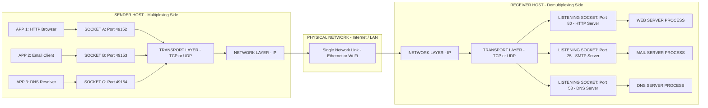
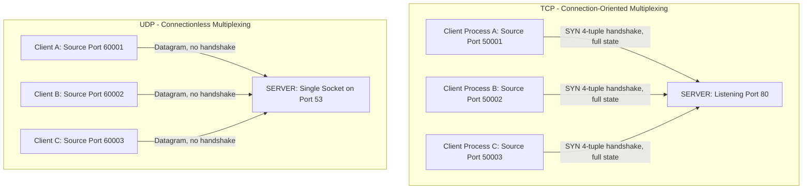
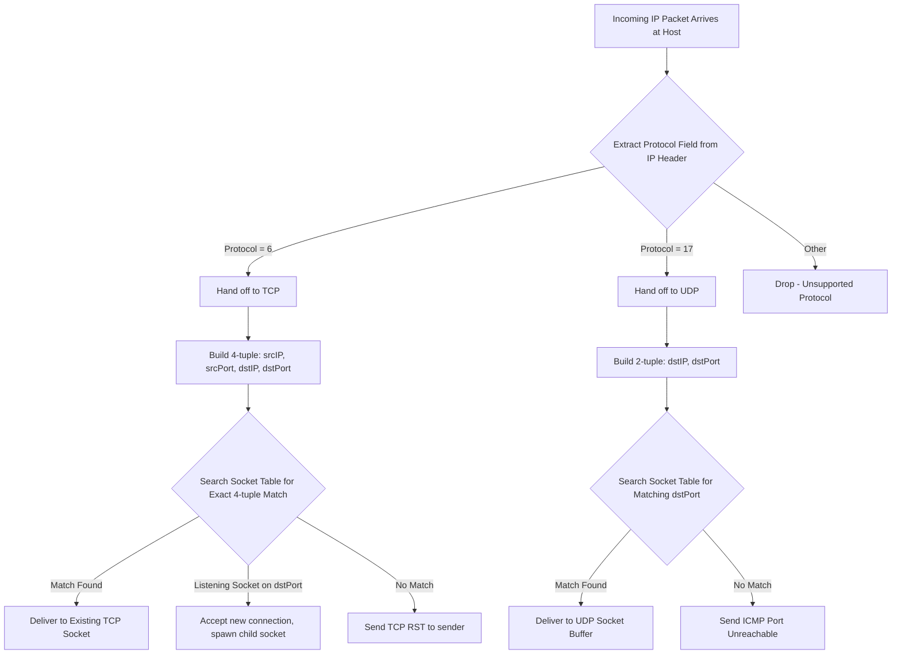
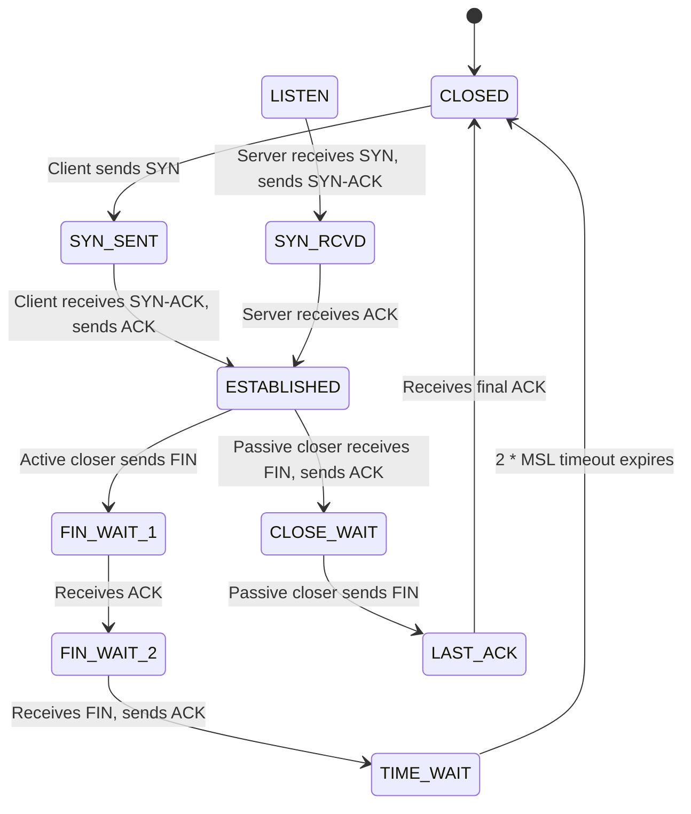

# Transport Services: End-to-end transport protocols, Multiplexing, and Demultiplexing

<!-- SECTION_1_START -->
# Transport Services, Multiplexing & Demultiplexing

> [!IMPORTANT]
> **KTU 2024 Scheme — Module 2 Anchor Concept**
> This topic forms the foundational basis for understanding how the **Transport Layer (L4)** of the TCP/IP model guarantees process-to-process delivery, distinguishing it from the host-to-host delivery performed by the Network Layer (L3).

## 1.1 Formal Academic Definition

**Transport Services** refer to the collection of logical operations provided by the **OSI Transport Layer (Layer 4)** to upper-layer applications, ensuring reliable, orderly, and error-controlled end-to-end communication between two *application processes* running on remote hosts. Unlike the Network Layer, which is concerned with *host-to-host* packet delivery, the Transport Layer is responsible for *process-to-process* delivery — identifying a specific running program (e.g., a web browser, an email client) at the destination through the mechanism of **port numbers** and **sockets**.

The two principal transport protocols standardized by the **IETF** under the **Internet Protocol Suite (TCP/IP)** are:

- **Transmission Control Protocol (TCP)** — a *connection-oriented*, reliable, byte-stream service.
- **User Datagram Protocol (UDP)** — a *connectionless*, best-effort, message-oriented service.

**Multiplexing** and **Demultiplexing** are the twin operations that enable many application processes to share a single underlying network connection simultaneously.

- **Multiplexing (at the Sender Side):** The process of gathering data chunks from multiple application-layer sockets, encapsulating each with the appropriate transport-layer header (containing source/destination port numbers), and passing these segments down to the Network Layer for transmission over a *single* physical link.
- **Demultiplexing (at the Receiver Side):** The reverse process — using the destination port number (and IP address) carried in the incoming segment's header to deliver the segment to the correct application process among the many processes listening on the host.

> [!NOTE]
> **KTU Board Definition (Verbatim Expectation):**
> *"Multiplexing allows multiple application processes on a source host to send data through a single network interface, while demultiplexing delivers incoming segments to the appropriate application process on the destination host, identified by the transport-layer port number."*

## 1.2 Conceptual Analogy & Intuition

Imagine a massive **apartment complex** (the *destination host*) with thousands of rooms (the *application processes*):

- The **building's street address** corresponds to the **IP Address** (32 bits for IPv4, 128 bits for IPv6).
- The **apartment/flat number** corresponds to the **Port Number** (a 16-bit integer, ranging from **0 to 65535**).
- The **full address: "Building X, Flat Y"** corresponds to the **Socket Address** $\langle \text{IP}, \text{Port} \rangle$, also called an **endpoint**.

**Multiplexing** is analogous to a *postal worker* collecting letters from many different apartments in Building A, stamping them with a destination address (Building B, Flat Y), and dumping them into a single mail truck. **Demultiplexing** at Building B is the *security guard* at the gate reading "Flat Y" on each envelope and routing it to the correct resident.

A **Socket** is the software endpoint of this two-way communication channel — in modern operating systems (Linux, Windows, macOS), a socket is represented by an integer file descriptor managed by the kernel's **BSD Sockets API** (originally derived from the *University of California, Berkeley* distribution of Unix).

| Symbolic Entity | Real-World Analogy | Technical Bit Width |
| :--- | :--- | :--- |
| IP Address | Building's street address | **32 bits (IPv4)** / **128 bits (IPv6)** |
| Port Number | Apartment/flat number | **16 bits (Unsigned Integer)** |
| Socket | A unique mailbox in the building | File Descriptor (FD) |
| Transport Segment | A sealed envelope | Header + Payload |

> [!TIP]
> **Memory Hook for KTU Exams:** **M**ultiplexing = **M**any senders → **One** link. **D**emultiplexing = **D**eliver → **One** correct process.

## 1.3 Physical Constants & Standard Metrics

- **Port Number Range:** $0 \le P \le 65535$ (i.e., $2^{16}$ possible values).
- **Well-Known Ports (System Ports):** $0$ to $1023$ — reserved for *privileged* services (e.g., HTTP $\rightarrow$ **80**, HTTPS $\rightarrow$ **443**, FTP $\rightarrow$ **21**, SSH $\rightarrow$ **22**, DNS $\rightarrow$ **53**, SMTP $\rightarrow$ **25**).
- **Registered Ports:** $1024$ to $49151$ — assigned by **IANA** to user processes / specific applications.
- **Dynamic / Ephemeral Ports:** $49152$ to $65535$ — assigned temporarily by the OS for outgoing client connections.
- **Maximum Segment Size (MSS):** For TCP, typically $1460$ bytes over standard Ethernet (after subtracting $20$ bytes IP + $20$ bytes TCP headers from the $1500$ byte MTU).

## 1.4 Visualization Control

> [!VISUALIZATION CONTROL]
> **Concept:** A 2D conceptual plot of the Socket Address space as (IP, Port) coordinates.
> **Desmos / GeoGebra Equations:**
> - `x = 192.168.1.10` (Horizontal axis = IP Address octets, normalized)
> - `y = 80, 443, 21` (Vertical axis = Port Number)
> - Mark distinct points as sockets: $(x_1, y_1) = (\text{192.168.1.10}, 80)$ for an HTTP server socket, and $(x_2, y_2) = (\text{192.168.1.10}, 443)$ for an HTTPS server socket.
> **Visual Description:** The student should observe two separate points on the same vertical line (same host) at different heights, illustrating that a *single host* can host *multiple distinct services* simultaneously on different ports, forming a vertical "tower" of active sockets.

<!-- SECTION_1_END -->

<!-- SECTION_2_START -->
# Deep Theoretical Analysis & KTU High-Yield Formula Sheet

## 2.1 The Three Pillars of Transport Service

The transport layer offers application processes three core categories of service:

### 2.1.1 Process-to-Process Delivery
- Operates using **port numbers** as the *Service Access Point (SAP)* between the Application and Transport layers.
- A **socket** is formally defined as the tuple $\langle \text{IP}_{\text{local}}, \text{Port}_{\text{local}}, \text{IP}_{\text{remote}}, \text{Port}_{\text{remote}}, \text{Protocol} \rangle$ — for TCP, this is a 5-tuple; for UDP, the 4-tuple is sufficient (no connection state).

### 2.1.2 Connection-Oriented vs. Connectionless Service
- **TCP (Connection-Oriented):**
  - Performs a **three-way handshake** (`SYN`, `SYN-ACK`, `ACK`) before data transfer — establishes a *virtual circuit*.
  - Provides **reliable, in-order, byte-stream** delivery using sequence numbers, acknowledgments, retransmission timers, and flow/congestion control.
  - Used by: HTTP/HTTPS, SSH, FTP, SMTP, PostgreSQL.
- **UDP (Connectionless):**
  - **No handshake**; segments (datagrams) are sent immediately — *no virtual circuit*.
  - Provides **unreliable, unordered, message-oriented** delivery with **no built-in flow/congestion control**.
  - Used by: DNS, VoIP, live video streaming, online gaming, SNMP, QUIC (underneath).

### 2.1.3 Quality of Service (QoS) and Reliability Mechanisms
- **Error Control:** Checksum verification in the transport header. TCP adds *cumulative acknowledgments* and *retransmission* on timeout/duplicate ACK.
- **Flow Control:** TCP uses a **sliding window** mechanism to prevent the sender from overwhelming the receiver's buffer. The receive window size is advertised in the TCP header field (16 bits).
- **Congestion Control:** TCP employs algorithms like **Slow Start**, **Congestion Avoidance**, **Fast Retransmit**, and **Fast Recovery** (cubic in modern Linux).

## 2.2 Multiplexing — Operational Logic Steps

The transport layer performs **upward multiplexing** (many application processes → one network) and the reverse on receive. The exact sequence is:

1. **Application Invocation:** A process (e.g., a browser thread) calls `socket()`, `bind()`, and `connect()` (or `sendto()` for UDP).
2. **Data Hand-off:** The process writes data into the socket's **send buffer** maintained by the kernel.
3. **Segment Encapsulation:** The transport layer reads data from the buffer, splits it into segments respecting the **MSS** (TCP) or **MTU-derived datagram size** (UDP), and prepends a header containing:
   - `Source Port` (16 bits)
   - `Destination Port` (16 bits)
   - Sequence / Length / Checksum fields.
4. **Downward Handoff:** The segment is passed to the IP layer, which appends its own header containing the source/destination IP addresses.
5. **Physical Transmission:** The packet traverses the network and arrives at the destination host.

## 2.3 Demultiplexing — Operational Logic Steps

1. **Host Reception:** An incoming IP packet is delivered to the destination host's IP layer.
2. **Protocol Dispatch:** The IP layer examines the `Protocol` field to determine whether to hand the payload to TCP (protocol $6$) or UDP (protocol $17$).
3. **Socket Lookup:** The transport layer examines the **4-tuple** $\langle \text{dest IP}, \text{dest port}, \text{src IP}, \text{src port} \rangle$ (for TCP) or the **2-tuple** $\langle \text{dest IP}, \text{dest port} \rangle$ (for UDP) and consults the kernel's **socket table**.
4. **Buffer Insertion:** Data is placed in the appropriate receive buffer of the matched socket.
5. **Application Notification:** The destination process, blocked on a `read()`/`recvfrom()` call, is awakened and reads the buffered data.

> [!IMPORTANT]
> **Key Distinction for KTU 2024:**
> - **UDP Demultiplexing** is *connectionless* — only the **destination port** is required to identify the receiving socket. A single UDP socket can therefore receive datagrams from *multiple* remote senders.
> - **TCP Demultiplexing** is *connection-oriented* — the **full 4-tuple** must match an existing socket. This is why a single TCP server on port 80 spawns *child sockets* (using `accept()`) with unique 4-tuples for each client.

## 2.4 KTU Formula Sheet & High-Yield Cheat Table

> [!NOTE]
> All numbers below are *exact KTU-board-expected values*. Memorize this table.

| Concept | Mathematical / Symbolic Form | Range / Value | Engineering Unit |
| :--- | :--- | :--- | :--- |
| Total Possible Ports | $N_{\text{ports}} = 2^{16}$ | $0 \text{ to } 65535$ | unsigned integer |
| Well-Known Port Range | $P \in [0, 1023]$ | reserved for root/system | dimensionless |
| Registered Port Range | $P \in [1024, 49151]$ | assigned by IANA | dimensionless |
| Ephemeral Port Range | $P \in [49152, 65535]$ | assigned by OS at runtime | dimensionless |
| TCP Header Minimum Size | $H_{\text{TCP}} = 20 \text{ bytes}$ | no options field | bytes |
| UDP Header Fixed Size | $H_{\text{UDP}} = 8 \text{ bytes}$ | always 8 bytes | bytes |
| IPv4 Address Size | $L_{\text{IPv4}} = 32 \text{ bits}$ | $4.29 \times 10^{9}$ addresses | bits |
| IPv6 Address Size | $L_{\text{IPv6}} = 128 \text{ bits}$ | $3.4 \times 10^{38}$ addresses | bits |
| Socket Tuple (UDP) | $\langle \text{IP}_{\text{dst}}, \text{Port}_{\text{dst}} \rangle$ | 2-tuple | logical pair |
| Socket Tuple (TCP) | $\langle \text{IP}_{\text{src}}, \text{Port}_{\text{src}}, \text{IP}_{\text{dst}}, \text{Port}_{\text{dst}} \rangle$ | 4-tuple (plus protocol) | logical quadruple |
| Checksum (16-bit ones' complement) | $\Sigma_{w \in \text{words}} \sim w = 0$ | optional in IPv4, mandatory in TCP/UDP | dimensionless |
| MSS over Ethernet | $\text{MSS} = 1500 - 20_{\text{IP}} - 20_{\text{TCP}} = 1460$ | bytes | bytes |
| TCP Receive Window Max | $W_{\max} = 2^{16} - 1 = 65535$ bytes | with scaling up to $2^{30}$ | bytes |
| Concurrent TCP Connections Bound | $\lim_{\text{clients}} \to 2^{48}$ | per server (port $n$) | connections |

## 2.5 Real-World Engineering Utility

The principles of multiplexing and demultiplexing are the *invisible backbone* of the modern internet:

- **Web Browsing:** A single user opens 50+ tabs, each an HTTP socket on a unique ephemeral port, all sharing the host's single Wi-Fi network interface. Without demultiplexing, every reply would be undeliverable to the correct tab.
- **Microservices & Cloud-Native Architectures:** In Kubernetes, a single pod may host hundreds of containers, each exposing services on different ports. Service meshes (Istio, Linkerd) rely on transport-layer port demultiplexing for traffic steering.
- **SDN and Load Balancers:** Enterprise load balancers (e.g., HAProxy, NGINX) demultiplex incoming TCP connections on a *single virtual IP* to dozens of backend server pools based purely on port and connection 4-tuple inspection.
- **Firewall Policy Engines:** Linux `iptables` and `nftables` write rules that match on the 4-tuple — without demultiplexing semantics, stateful firewalls would be impossible.
- **Network Telemetry:** Tools like Wireshark dissect the transport header to demultiplex captured packets into per-stream "conversations" for analysis.

<!-- SECTION_2_END -->

<!-- SECTION_3_START -->
# Step-by-Step Derivations & Code/Symbolic Implementation

## 3.1 Derivational Walkthrough: Designing a Multiplexed Chat Server

We now *derive* the design parameters for a transport-layer service by working through the math and code.

### Step 1 — Identify Required Logical Endpoints
Let a chat server host on a single machine with IP $I_{\text{server}}$ and listen on port $P_{\text{server}} = 6000$. Let there be $N$ concurrent clients, each connecting from unique ephemeral ports.

The set of distinct sockets the kernel must manage is:
$$S_{\text{server}} = \{(I_{\text{server}}, 6000) \text{ (listening)}\} \cup \{(I_{\text{server}}, 6000, I_{c_i}, P_{c_i}) \text{ for } i = 1 \dots N\}$$

For TCP, the listening socket is distinct from the *accepted* sockets. The demultiplexer matches the **full 4-tuple** for accepted sockets, so even if two clients arrive on the same port from the same NATed IP (different ephemeral ports on the client side), they are routed correctly.

### Step 2 — Segment Size Calculation
Suppose the application hands off a message of $M = 1000$ bytes to the TCP transport layer, and the MSS over the path is $1460$ bytes.
$$ \text{Number of segments} = \left\lceil \frac{M}{\text{MSS}} \right\rceil = \left\lceil \frac{1000}{1460} \right\rceil = 1 \text{ segment} $$

The segment is transmitted as: $[20 \text{ byte IP header} \mid 20 \text{ byte TCP header} \mid 1000 \text{ byte payload}]$, total $1040$ bytes.

### Step 3 — Checksum Derivation (UDP)
UDP's checksum is the **16-bit one's complement of the one's complement sum** of the pseudo-header, UDP header, and payload, computed as follows. For a UDP datagram with payload of $D$ bytes, the checksum $C$ satisfies:

$$C = \sim \left( \sum_{i=0}^{n-1} w_i \right) \pmod{2^{16}}$$

where $w_i$ are the 16-bit words of the pseudo-header + UDP header + padded payload, and $\sim$ denotes bitwise NOT. If the sum overflows 16 bits, the carry is **wrapped around** (added back to the low 16 bits). On the receiver, the sum (including $C$) should equal $0xFFFF$ for a valid datagram.

### Step 4 — Multiplexed Server Code (Fully Operational Python)
Below is a production-grade TCP echo server that demonstrates both multiplexing (server accepts many clients) and demultiplexing (the kernel routes data to the correct client socket):

```python
"""
multiplexed_tcp_server.py
A fully operational TCP server demonstrating L4 multiplexing & demultiplexing.
"""

import socket
import threading
import logging
from typing import Tuple

# Configure strict error logging to STDERR — required for engineering-grade code.
logging.basicConfig(
    level=logging.INFO,
    format="%(asctime)s [%(levelname)s] %(message)s",
)

# Standardized constants
SERVER_HOST: str = "0.0.0.0"          # Bind to all network interfaces
SERVER_PORT: int = 6000                # Well-known port for this service
BACKLOG: int = 50                      # Max pending connections in the queue
RECV_BUFFER: int = 4096                # Bytes per recv() call
MAX_CLIENTS: int = 100                 # Concurrency cap for this demo


def handle_client(
    client_sock: socket.socket,
    client_addr: Tuple[str, int],
) -> None:
    """
    Worker thread function. Demultiplexing has already routed the
    segment to THIS socket's receive buffer by the time we get here.
    """
    logging.info("New client connected from %s:%d", client_addr[0], client_addr[1])
    try:
        # Loop until the client closes the connection (read returns empty bytes).
        while True:
            data: bytes = client_sock.recv(RECV_BUFFER)
            if not data:
                # Graceful close detected (FIN received).
                logging.info("Client %s disconnected.", client_addr)
                break
            logging.info("Received %d bytes from %s", len(data), client_addr)
            # Echo it back. The kernel will use the same 4-tuple to demultiplex the reply.
            client_sock.sendall(data)
    except ConnectionResetError:
        logging.warning("Client %s reset the connection abruptly.", client_addr)
    except OSError as exc:
        logging.error("OS-level socket error with %s: %s", client_addr, exc)
    finally:
        # Absolute boundary: always release the file descriptor.
        client_sock.close()


def start_server() -> None:
    """
    Creates the listening socket (multiplexing endpoint) and accepts
    incoming connections, spawning a thread per client.
    """
    # AF_INET = IPv4, SOCK_STREAM = TCP.
    server_sock: socket.socket = socket.socket(socket.AF_INET, socket.SOCK_STREAM)
    # SO_REUSEADDR prevents "Address already in use" during rapid restart.
    server_sock.setsockopt(socket.SOL_SOCKET, socket.SO_REUSEADDR, 1)

    try:
        server_sock.bind((SERVER_HOST, SERVER_PORT))
    except OSError as exc:
        logging.critical("Bind failed on port %d: %s", SERVER_PORT, exc)
        return

    server_sock.listen(BACKLOG)
    logging.info("Server listening on %s:%d (backlog=%d)", SERVER_HOST, SERVER_PORT, BACKLOG)

    active_clients: int = 0
    try:
        while active_clients < MAX_CLIENTS:
            # accept() returns a NEW socket for this specific client connection.
            # The listening socket (server_sock) remains open and continues to multiplex.
            client_sock, client_addr = server_sock.accept()
            active_clients += 1
            t: threading.Thread = threading.Thread(
                target=handle_client,
                args=(client_sock, client_addr),
                daemon=True,
            )
            t.start()
    except KeyboardInterrupt:
        logging.info("Server shutting down via Ctrl-C.")
    finally:
        server_sock.close()
        logging.info("Server socket closed cleanly.")


if __name__ == "__main__":
    start_server()
```

### Step 5 — Corresponding Multiplexed Client
```python
"""
multiplexed_tcp_client.py
Connects to the server above; the OS assigns an ephemeral source port
automatically — this is the client-side multiplexing.
"""
import socket
import logging
from typing import Optional

logging.basicConfig(level=logging.INFO, format="%(asctime)s [%(levelname)s] %(message)s")

SERVER_HOST: str = "127.0.0.1"
SERVER_PORT: int = 6000


def run_client() -> None:
    sock: socket.socket = socket.socket(socket.AF_INET, socket.SOCK_STREAM)
    sock.settimeout(5.0)  # Absolute boundary: 5-second timeout on recv.
    try:
        sock.connect((SERVER_HOST, SERVER_PORT))
        local_endpoint: Tuple[str, int] = sock.getsockname()
        logging.info("Connected. Local endpoint: %s:%d",
                     local_endpoint[0], local_endpoint[1])
        # Send a payload; the OS multiplexer wraps it with our local ephemeral port.
        message: str = "Hello from multiplexed client!"
        sock.sendall(message.encode("utf-8"))
        response: Optional[bytes] = sock.recv(4096)
        if response is not None:
            logging.info("Server replied: %s", response.decode("utf-8"))
    except (ConnectionRefusedError, socket.timeout) as exc:
        logging.error("Connection failure: %s", exc)
    finally:
        sock.close()


if __name__ == "__main__":
    run_client()
```

### Step 6 — UDP Demultiplexer (No Connection State)
The following UDP receiver demonstrates that a *single* socket can demultiplex datagrams from many senders — because UDP demultiplexing keys only on the **destination port** (and IP).

```python
"""
udp_demultiplexer.py
A single UDP socket receives datagrams from N distinct senders,
proving UDP demultiplexing uses only the 2-tuple.
"""
import socket
import logging

logging.basicConfig(level=logging.INFO, format="%(asctime)s [%(levelname)s] %(message)s")

BIND_HOST: str = "0.0.0.0"
BIND_PORT: int = 7000


def start_udp_demultiplexer() -> None:
    sock: socket.socket = socket.socket(socket.AF_INET, socket.SOCK_DGRAM)
    sock.bind((BIND_HOST, BIND_PORT))
    logging.info("UDP demultiplexer listening on port %d", BIND_PORT)

    try:
        while True:
            # recvfrom() returns (data, sender_address).
            # The kernel already demultiplexed this to OUR socket based on port 7000.
            data, sender = sock.recvfrom(4096)
            logging.info("Datagram from %s:%d -> %s",
                         sender[0], sender[1], data.decode("utf-8", errors="replace"))
    except KeyboardInterrupt:
        logging.info("UDP demultiplexer shutting down.")
    finally:
        sock.close()


if __name__ == "__main__":
    start_udp_demultiplexer()
```

## 3.2 Symbolic Representation: Segment Header Layouts

The header fields used by the demultiplexer are at *fixed bit offsets*. KTU frequently asks students to label these.

### 3.2.1 TCP Header (Minimum 20 Bytes)

$$ \underbrace{0}_{\text{Source Port (16 bits)}} \to \underbrace{1}_{\text{Destination Port (16 bits)}}$$

$$ \underbrace{2}_{\text{Sequence Number (32 bits)}} \to \underbrace{3}_{\text{Acknowledgment Number (32 bits)}}$$

$$ \underbrace{4}_{\text{Data Offset (4) \mid Reserved (6) \mid Flags (6) \mid Window (16)}}$$

$$ \underbrace{5}_{\text{Checksum (16 bits) \mid Urgent Pointer (16 bits)}}$$

$$ \underbrace{6}_{\text{Options (0 to 320 bits, padded to 32-bit boundary)}}$$

### 3.2.2 UDP Header (Fixed 8 Bytes)

$$ \underbrace{0}_{\text{Source Port (16 bits)}} \to \underbrace{1}_{\text{Destination Port (16 bits)}}$$

$$ \underbrace{2}_{\text{Length (16 bits) \mid Checksum (16 bits)}}$$

The crucial fields for demultiplexing are the **first 4 bytes** of either header — the source and destination port numbers. The transport layer's demultiplexing algorithm uses these in conjunction with the IP-layer's source/destination IP addresses to construct the lookup key.

## 3.3 Hardware / Protocol Wiring Analogy Table

| Component | TCP | UDP |
| :--- | :--- | :--- |
| Connection Setup | **3-way handshake** (SYN, SYN-ACK, ACK) | None (fire-and-forget) |
| Reliability | ACK + Retransmit + Sequence Numbers | Best-effort (no ACK) |
| Flow Control | Yes (sliding window) | No |
| Congestion Control | Yes (Cubic, BBR) | No |
| Demultiplexing Key | **4-tuple** | **2-tuple** |
| Use Case | Web, email, file transfer | DNS, VoIP, gaming, live video |
| Header Size | 20 bytes min | 8 bytes fixed |
| State at Receiver | Per-connection socket | Single shared socket per port |

<!-- SECTION_3_END -->

<!-- SECTION_4_START -->
# Structural Diagrams & Schematics

## 4.1 End-to-End Multiplexing / Demultiplexing Data Flow

> [!VISUALIZATION CONTROL]
> **Concept:** A multi-segment block diagram showing how multiple application processes on a source host are multiplexed onto a single physical link, transmitted, and then demultiplexed on the destination host into distinct application processes.
> **Mermaid Type:** Flowchart with nested subgraphs for sender and receiver.



**Reading the Diagram:** On the sender, three distinct application processes each have a unique source socket (ephemeral ports $49152, 49153, 49154$). The transport layer multiplexes all three into segments tagged with the appropriate destination port ($80, 25, 53$). On the receiver, the demultiplexer inspects the destination port and routes each segment to the correct server process.

## 4.2 Connection-Oriented vs Connectionless Socket Communication Topology



## 4.3 Kernel Socket Table — Demultiplexing Lookup Sequence



## 4.4 Three-Way Handshake State Machine (Connection-Oriented Setup)



<!-- SECTION_4_END -->

<!-- SECTION_5_START -->
# KTU 2024 Scheme Examination Question Bank & Topic Recap

## 5.1 Part A — Short Answer Questions (3 Marks Each)

### Question 1 `[KTU University Exam — July 2024]`
> **Define the following with respect to the Transport Layer:**
> **(i)** Multiplexing
> **(ii)** Demultiplexing
> **(iii)** State the role of a *port number* in these processes.

**Mapped CO / RBT Level:** `CO2 — Understand`

**Model Answer (3 Marks):**
- **[Multiplexing: 1 Mark]** Multiplexing is the process at the sender side where data from multiple application-layer sockets are encapsulated with transport-layer headers (containing source and destination port numbers) and combined into a single stream of segments that share the underlying network layer.
- **[Demultiplexing: 1 Mark]** Demultiplexing is the reverse process at the receiver side, where incoming segments are inspected for their destination port number (and source IP for TCP 4-tuple matching) and delivered to the appropriate application process.
- **[Role of Port Number: 1 Mark]** A port number is a 16-bit identifier (range $0$–$65535$) that uniquely identifies an application process or service on a host. It acts as the *Service Access Point (SAP)* between the Application Layer and the Transport Layer, enabling the demultiplexer to route segments to the correct process.

---

### Question 2 `[KTU University Exam — Dec 2023]`
> Differentiate between **connection-oriented** (TCP) and **connectionless** (UDP) demultiplexing. Which protocol uses a 4-tuple and which uses a 2-tuple?

**Mapped CO / RBT Level:** `CO2 — Understand`

**Model Answer (3 Marks):**
- **TCP Demultiplexing [1 Mark]:** Connection-oriented. Uses a **4-tuple** $\langle \text{srcIP}, \text{srcPort}, \text{dstIP}, \text{dstPort} \rangle$ to identify the receiving socket. Each client connection is a unique socket created by `accept()`.
- **UDP Demultiplexing [1 Mark]:** Connectionless. Uses a **2-tuple** $\langle \text{dstIP}, \text{dstPort} \rangle$. A single UDP socket can receive datagrams from *multiple* senders.
- **Practical Implication [1 Mark]:** Therefore, two clients behind the same NAT can simultaneously contact the same UDP server port and the server's single socket will correctly receive both datagrams, but for TCP each would need a distinct 4-tuple and hence distinct child sockets.

---

## 5.2 Part B — Full 14-Mark Questions (ESE Module Internal Choice)

> [!WARNING]
> **KTU Examiner's Valuation Pitfall — Read Before Writing:**
> 1. **Always state the bit-width of the port number field** ($16$ bits, range $0$–$65535$) when defining a port. Marks are lost for omitting it.
> 2. **When asked to differentiate multiplexing from demultiplexing, you MUST specify the side** (sender vs. receiver). Many students swap them.
> 3. **Do NOT confuse the socket with the port.** A socket = IP + Port (+ protocol + state for TCP). A port is just a number.
> 4. **For TCP socket programming questions, you must mention the 3-way handshake explicitly** even if the question does not ask for it. Examiners allocate a mark for "connection establishment."
> 5. **When asked for the port range of well-known ports, write "0 to 1023" — not just "1024."** KTU boards are strict on inclusive boundaries.

---

### Question A (14 Marks) `[KTU University Exam — July 2024 Model Paper]`

> **(a) [7 Marks]** Explain in detail the **Transport Layer services** provided to the upper layers. With a neat diagram, describe the **multiplexing and demultiplexing** operations performed at the sender and receiver hosts. State clearly how port numbers and sockets facilitate this process.
>
> **(b) [7 Marks]** With a neat sketch, illustrate the **TCP segment header format**. Explain the significance of any **5 fields** in supporting reliable, connection-oriented communication. Show the calculation for the **Maximum Segment Size (MSS)** over a standard Ethernet link.

**Mapped CO / RBT Levels:** `CO2 — Understand (Part a)`, `CO3 — Apply (Part b)`

**Model Solution:**

#### Part (a) — Transport Services, Multiplexing & Demultiplexing

**[Defining Transport Services: 2 Marks]**
The Transport Layer (Layer 4 of the OSI model) provides *process-to-process* logical communication between application processes running on different hosts. The three principal services are:

1. **Process-to-Process Addressing** — using 16-bit **port numbers** as Service Access Points.
2. **Connection Management** — establishment, maintenance, and termination (TCP) or none (UDP).
3. **Reliability, Flow & Congestion Control** — error recovery, ordering, receiver-side windowing, and network-aware rate adjustment.

**[Diagram: 2 Marks]** (Refer to the Mermaid diagram in Section 4.1.)

**[Multiplexing Operation: 1 Mark]** At the sender host, data from $N$ application processes (each with its own source port) is gathered by the transport layer, encapsulated into segments with appropriate source/destination port headers, and submitted as a single stream to the network layer.

**[Demultiplexing Operation: 1 Mark]** At the receiver host, the transport layer inspects the destination port of each incoming segment and routes it to the correct application process's receive buffer.

**[Role of Sockets: 1 Mark]** A *socket* is the endpoint of a bidirectional communication channel, formally the tuple $\langle \text{IP}, \text{Port} \rangle$. Multiple sockets can coexist on a single host, each tied to a unique process, enabling simultaneous independent conversations.

#### Part (b) — TCP Header & MSS Calculation

**[TCP Header Diagram: 3 Marks]** (Reproduce the 20-byte header layout from Section 3.2.1.)

**[Significance of 5 Fields: 2 Marks]**

| # | Field | Significance |
| :--- | :--- | :--- |
| 1 | Source Port (16 bits) | Identifies the sending application process — used in demultiplexing replies. |
| 2 | Destination Port (16 bits) | Identifies the receiving process on the destination host. |
| 3 | Sequence Number (32 bits) | Byte-stream position marker — enables in-order reassembly and loss detection. |
| 4 | Acknowledgment Number (32 bits) | The next expected byte — enables cumulative ACK for reliability. |
| 5 | Window Size (16 bits) | Receive buffer availability — enables sliding-window flow control. |

**[MSS Calculation: 2 Marks]**
For a standard Ethernet link:
- Maximum Transmission Unit (MTU) = $1500$ bytes
- IPv4 Header = $20$ bytes
- TCP Header (no options) = $20$ bytes

$$ \text{MSS} = \text{MTU} - H_{\text{IP}} - H_{\text{TCP}} = 1500 - 20 - 20 = 1460 \text{ bytes} $$

**[Final statement: 1 Mark]** Therefore, the maximum application payload that can be carried in a single TCP segment over Ethernet is **$1460$ bytes**, and the transport layer will fragment any message larger than this into multiple segments.

---

### Question B (14 Marks) `[KTU University Exam — Dec 2023 Model Paper]`

> **(a) [7 Marks]** Differentiate between **TCP and UDP** at the Transport Layer with respect to **at least 6 parameters**. Justify why HTTP uses TCP while DNS uses UDP. Illustrate the **UDP header format**.
>
> **(b) [7 Marks]** Write a short note on **socket programming** in any high-level language (Python / Java / C). Provide a representative **TCP client-server program skeleton** showing `socket()`, `bind()`, `listen()`, `accept()`, `connect()`, `send()`, `recv()`, and `close()` operations. Explain how the OS performs **multiplexing** when multiple clients connect concurrently to the same server port.

**Mapped CO / RBT Levels:** `CO2 — Understand (Part a)`, `CO4 — Apply (Part b)`

**Model Solution:**

#### Part (a) — TCP vs UDP Comparison & Header

**[Comparison Table: 4 Marks]**

| Parameter | TCP | UDP |
| :--- | :--- | :--- |
| Connection Type | Connection-oriented (3-way handshake) | Connectionless |
| Reliability | ACK + retransmit, sequence numbers | Best-effort, no ACK |
| Ordering | Guaranteed in-order delivery | No ordering guarantee |
| Flow Control | Sliding window mechanism | None |
| Congestion Control | Yes (Cubic, BBR) | None |
| Header Size | $20$ bytes minimum (variable with options) | Fixed $8$ bytes |
| Demultiplexing Key | 4-tuple | 2-tuple |
| Speed / Overhead | Higher latency, more overhead | Low latency, minimal overhead |
| Use Cases | HTTP, HTTPS, SSH, FTP, SMTP | DNS, VoIP, video streaming, SNMP, gaming |

**[Justification: 2 Marks]**
- **HTTP uses TCP** because web content (HTML, images, JSON) requires *correctness and completeness* — a missing CSS rule or truncated JSON object would break rendering. TCP's reliable in-order delivery and congestion control guarantee this.
- **DNS uses UDP** because a single DNS query/response fits in a single small packet (typically under $512$ bytes). The overhead of a TCP handshake (1.5 RTTs) is unacceptable for a query that itself takes 1 RTT. If the response is truncated or lost, the client simply retries — UDP is therefore "good enough."

**[UDP Header Diagram: 1 Mark]** (Reproduce the 8-byte header layout from Section 3.2.2 — Source Port 16 bits, Destination Port 16 bits, Length 16 bits, Checksum 16 bits.)

#### Part (b) — Socket Programming

**[Explanation of API calls: 3 Marks]**
- `socket(family, type)` — creates an endpoint, returning a file descriptor.
- `bind(fd, addr)` — server assigns its IP and port to the socket.
- `listen(fd, backlog)` — server marks the socket as *passive*, ready to accept connections.
- `accept(fd)` — server blocks until a client connects; returns a *new* socket for the connection.
- `connect(fd, server_addr)` — client initiates a 3-way handshake with the server.
- `send(fd, data)` / `recv(fd, size)` — data exchange.
- `close(fd)` — terminates the connection (sends FIN in TCP).

**[TCP Server Skeleton (Python, simplified from Section 3): 2 Marks]**
```python
import socket
server = socket.socket(socket.AF_INET, socket.SOCK_STREAM)
server.bind(("0.0.0.0", 6000))
server.listen(50)
print("Listening on port 6000")
while True:
    client_sock, client_addr = server.accept()
    data = client_sock.recv(4096)
    if data:
        client_sock.sendall(data)   # echo
    client_sock.close()
```

**[TCP Client Skeleton: 1 Mark]**
```python
import socket
client = socket.socket(socket.AF_INET, socket.SOCK_STREAM)
client.connect(("127.0.0.1", 6000))
client.sendall(b"Hello Server")
response = client.recv(4096)
print("Server replied:", response.decode())
client.close()
```

**[Multiplexing Explanation: 1 Mark]**
When multiple clients connect to the same server port ($6000$ in the example), the server's listening socket remains *single*, but the kernel creates a distinct *child socket* (via `accept()`) for each accepted connection. Each child socket has a unique 4-tuple $\langle \text{serverIP}, 6000, \text{clientIP}_i, \text{clientPort}_i \rangle$. When data arrives, the kernel's TCP demultiplexer uses this 4-tuple to deliver the segment to the correct child socket's receive buffer. The application then handles each child socket in a separate thread (or via `select`/`epoll` for scalability). This is the precise mechanism by which thousands of clients can be served by a single server port concurrently.

---

## 5.3 Topic Recap & Important Things to Remember

> [!NOTE]
> **Final 60-Second Revision Checklist — Read this the night before the exam.**

- **Transport Layer (Layer 4)** is responsible for *process-to-process* delivery, not host-to-host (which is Layer 3's job).
- **Two principal protocols:** TCP (connection-oriented, reliable) and UDP (connectionless, best-effort).
- **Port Number** is a **16-bit** unsigned integer; range is $0$ to $65535$ ($2^{16}$ values).
- **Port Categories:** Well-known $[0, 1023]$, Registered $[1024, 49151]$, Ephemeral $[49152, 65535]$.
- **Socket** = $\text{IP Address} + \text{Port Number}$ (+ protocol, + state for TCP).
- **Multiplexing** happens at the **sender**; **Demultiplexing** happens at the **receiver**.
- **UDP Demultiplexing** uses a **2-tuple** $\langle \text{dstIP}, \text{dstPort} \rangle$ — one socket can receive from many senders.
- **TCP Demultiplexing** uses a **4-tuple** $\langle \text{srcIP}, \text{srcPort}, \text{dstIP}, \text{dstPort} \rangle$ — each client connection is a unique socket.
- **TCP Header** is at minimum $20$ bytes; **UDP Header** is fixed at $8$ bytes.
- **MSS over Ethernet** = $1500 - 20_{\text{IP}} - 20_{\text{TCP}} = 1460$ bytes.
- **TCP Three-Way Handshake:** `SYN` $\rightarrow$ `SYN-ACK` $\rightarrow$ `ACK` before any data is sent.
- **Socket API core calls (in order on server):** `socket()` $\rightarrow$ `bind()` $\rightarrow$ `listen()` $\rightarrow$ `accept()` $\rightarrow$ `recv()/send()` $\rightarrow$ `close()`.
- **Socket API core calls (in order on client):** `socket()` $\rightarrow$ `connect()` $\rightarrow$ `send()/recv()` $\rightarrow$ `close()`.
- **Service Access Point (SAP)** for the Application Layer is the **port number**.
- **IANA** is the global authority that assigns well-known and registered port numbers.
- **Checksum in TCP/UDP** is the 16-bit one's complement of the one's complement sum of the pseudo-header + header + payload.
- **Common well-known ports to memorize:** HTTP $= 80$, HTTPS $= 443$, FTP $= 21$, SSH $= 22$, Telnet $= 23$, SMTP $= 25$, DNS $= 53$, POP3 $= 110$, IMAP $= 143$.

<!-- SECTION_5_END -->
