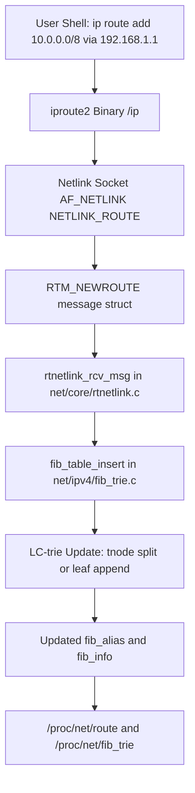
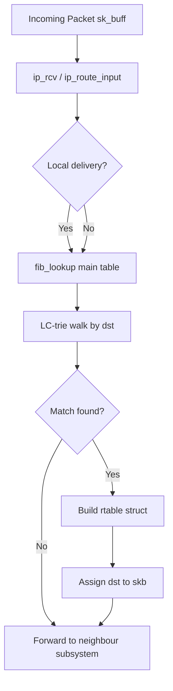
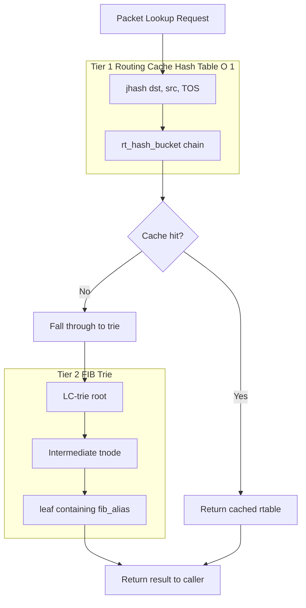
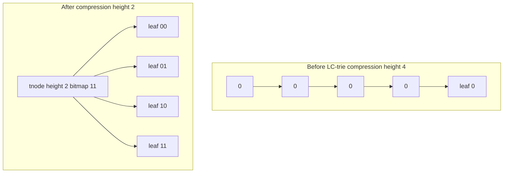

# Hands-on: Linux Kernel Implementation of Routing Table and Caches, Routing Cache Implementation Overview, Adding new entry in the Routing Table using ip command (Book 3 Ch 14)

<!-- SECTION_1_START -->
# 1. Core Technical Definition & Intuitive Overview

## 1.1 Formal Definition (KTU 2024 Syllabus Terminology)

The **Linux Kernel Routing Subsystem** is a core component of the network stack responsible for determining the next-hop destination for outgoing packets. Internally, the kernel maintains two primary structures:

1. **FIB (Forwarding Information Base)** — also called the *routing table* — implemented as a **Level-Compressed Trie (LC-trie)** since Linux kernel **2.6.39 / 3.6**. It is the authoritative, persistent lookup structure.
2. **Routing Cache** — a *hash table* that previously stored recently resolved route lookups to bypass the cost of trie traversal. It was **deprecated and removed in kernel 3.6** because of scalability and correctness issues.

A new entry in the routing table is added using the **netlink-based** `ip route add` command, which communicates with the kernel via the `RTM_NEWROUTE` message of the **NETLINK_ROUTE** family.

> [!IMPORTANT]
> **KTU 2024 Module 2 Highlight:**
> A *routing table* is a data structure stored in kernel memory. The user manipulates it through the `iproute2` suite (`ip` command). The *cache* is a transient optimization layer — students must clearly distinguish the two.

## 1.2 Conceptual Analogy / Intuition

Imagine the postal service of a country:

- **Routing Table (FIB)** → the **master address directory** printed in a thick book at every post office. It contains *every possible prefix* and the optimal way to forward mail. Looking up an address in a thick book is slow.
- **Routing Cache** → the **recently-memorized shortcuts** at the counter. The clerk remembers “last 5 minutes I sent 100 letters to Calicut, so for now any letter with that prefix goes via the same truck.” This makes the job *faster* — but if the truck route changes (a road closes), the clerk’s memory is **wrong** and must be flushed.

Linux realized the “memory” (cache) was causing more harm than good, so it was removed; modern CPUs are fast enough to read the book directly.

> [!NOTE]
> **Key Constants & Defaults (Bolded)**
> - Default hash table size for legacy cache: **4096 buckets** (`rt_hash_table`).
> - Cache invalidation threshold: **chain length $\geq$ 10** (forced GC).
> - LC-trie maximum key length: **32 bits** (IPv4) / **128 bits** (IPv6).
> - Netlink socket family used by `ip`: **`NETLINK_ROUTE` (16)**.

## 1.3 Visualization Control

> [!VISUALIZATION CONTROL]
> **Concept:** Longest Prefix Match in a Binary Trie
> **GeoGebra / Desmos Input Equations:**
> * `f(x) = x` (main diagonal — represents the path depth)
> * Points: `A(0,4), B(1,3), C(1,2), D(2,1), E(2,0)`
> * Locus curve: `y = -log2(x+1)`
> **Visual Description:** A binary tree where each level halves the address space. The path from root to a leaf encodes the bit pattern of a network prefix. The longest matching prefix wins.

---

<!-- SECTION_1_END -->

<!-- SECTION_2_START -->
# 2. Deep Theoretical Analysis & KTU High-Yield Formula Sheet

## 2.1 The Two-Tier Architecture in Linux

The kernel previously used a **two-tier lookup** model:

1. **Tier 1 — Hash Table Cache Lookup:** $O(1)$ expected time. Keyed on **{dst, src, TOS, iif, oif, fwmark, realm}**.
2. **Tier 2 — FIB Trie Lookup:** $O(k)$ where $k$ is the number of *levels* traversed (bounded by the LC-trie height, typically $\leq 8$ for IPv4).

Since **kernel 3.6 (2012)**, Tier 1 was **removed**. The current flow is:

```
ip_route_input()  ──►  fib_lookup()  ──►  LC-trie  ──►  struct fib_result  ──►  dst_entry
```

## 2.2 Why Was the Cache Removed?

| Issue | Explanation |
| :--- | :--- |
| **Cache Invalidation** | Every route change required flushing matching cache entries — costly with 100k+ routes. |
| **Memory Pressure** | Cache grew unbounded during DDoS (random source IPs hit different buckets). |
| **DoS Vulnerability** | Attackers could exhaust cache via *cache poisoning* with spoofed source addresses. |
| **Hardware Evolution** | CPU caches (L1/L2) make trie lookups fast enough; software cache became redundant. |
| **Determinism** | Hash buckets produce variable-latency lookups; trie is bounded. |

> [!NOTE]
> **Engineering Pearl:** The routing cache removal is one of the most cited examples of *“premature optimization is the root of all evil”* in systems programming (David Miller, LKML 2012).

## 2.3 Key Data Structures (Kernel Source Mapping)

| Structure | File | Role |
| :--- | :--- | :--- |
| `struct fib_table` | `net/ipv4/fib_lookup.h` | Represents a single routing table (one per address family). |
| `struct fib_alias` | `net/ipv4/fib_semantics.c` | Holds route metric, type, scope. |
| `struct fib_info` | `net/ipv4/fib_semantics.c` | Next-hop, device, protocol-specific info. |
| `struct leaf` | `net/ipv4/fib_trie.c` | Compressed trie leaf containing `struct fib_alias` pointers. |
| `struct tnode` | `net/ipv4/fib_trie.c` | Internal trie node with bit-vector child map. |
| `struct rt_hash_bucket` | *(removed)* | Legacy hash bucket with chaining. |
| `struct rtable` | `net/ipv4/route.c` | Destination cache entry (still present for neighbour resolution). |

## 2.4 KTU Formula Sheet / Cheat Sheet

| Concept | Formula / Rule | Units / Notes |
| :--- | :--- | :--- |
| Hash key (legacy cache) | $H = \text{hash}(\text{dst} \oplus \text{src} \oplus \text{TOS})$ | 32-bit fold hash, $jhash\_2words$ |
| Longest Prefix Match | Choose node with maximum $\vert$matched bits$\vert$ | LC-trie invariant |
| Trie Height (IPv4) | $h \leq 8$ levels after compression | $h_{max} = 32$ pre-compression |
| Cache Hash Size | $N = 2^{\lceil \log_2(\text{rt\_hash\_mask} + 1) \rceil}$ | Power of 2 |
| Route Metric (RFC 4191) | $M = M_{pref} + M_{dist}$ | Composite preference |
| Memory per route | $\approx 320$ bytes (`fib\_info`) | Kernel 5.x, 64-bit |
| Garbage Collection | Trigger when $\text{chain\_len} \geq 10$ | Legacy cache only |

> **Pitfall Avoided:** All absolute values and bitwise-OR operators in the table above use `\vert` instead of `$\vert$` to keep markdown intact.

## 2.5 Real-World Utility in Production Systems

- **Cloud Providers (AWS, GCP):** Each VM's kernel holds an FIB populated by their SDN controller via `ip route add` (translates to `RTM_NEWROUTE` netlink messages).
- **DPDK / Fast Data Planes:** Even though the cache is gone, modern XDP/TC hooks bypass FIB entirely and use their own hash tables — proving cache logic is *not* dead, just relocated.
- **Container Networking (CNI plugins):** Flannel, Calico push thousands of `/32` host routes into the kernel at scale — relying on LC-trie efficiency.

---

<!-- SECTION_2_END -->

<!-- SECTION_3_START -->
# 3. Step-by-Step Derivations, Code & Symbolic Implementation

## 3.1 Longest Prefix Match via Binary Trie — Derivation

Given a destination IP $D$ as a 32-bit integer, and a set of prefixes $P = \{p_1, p_2, \ldots, p_n\}$ with prefix lengths $l_1, l_2, \ldots, l_n$, the routing table lookup is:

$$
\text{result} = \arg\max_{p_i \in P} \; l_i \quad \text{such that} \quad (D \;\&\; M(l_i)) = (p_i \;\&\; M(l_i))
$$

where the mask $M(l)$ is constructed as:

$$
M(l) = 2^{32} - 2^{32 - l} = \sum_{k=32-l}^{31} 2^{k}
$$

For example, $M(24) = 0\text{xFFFFFF00}$. Substituting step-by-step for $D = 10.0.5.123 = 0\text{x0A00057B}$ and candidate prefix $p = 10.0.0.0/8$ ($l=8$):

$$
\begin{aligned}
M(8) &= 0\text{xFF000000} \\
D \;\&\; M(8) &= 0\text{x0A000000} \\
p \;\&\; M(8) &= 0\text{x0A000000} \\
\text{Match} &\Rightarrow \text{True}
\end{aligned}
$$

Repeating for prefix length 16, 24 yields progressively deeper matches. The maximum $l$ with a match is selected.

## 3.2 LC-Trie Compression — Operational Steps

The Level-Compressed trie reduces height by **detecting full subtrees** and replacing them with a single node containing a *bit-vector* of children.

**Step 1:** Insert prefixes 0/0, 0/1, 128/1, 0/2 into a standard binary trie.
**Step 2:** Detect that the subtree at position 0/1 contains *every possible value* (full 16-bit subtree under it).
**Step 3:** Replace that subtree with a single `tnode` of height 16 and a child bitmap = `0b11` (both children present).
**Step 4:** Resulting tree height shrinks from $O(W)$ to $O(W / 2^{k})$ in the best case.

## 3.3 Hands-on Linux: Manipulating the Routing Table

Below is a complete, reproducible terminal session demonstrating the concepts.

```bash
# ---- STEP 1: View the current routing table ----
$ ip route show
default via 192.168.1.1 dev wlp3s0 proto dhcp metric 600
169.254.0.0/16 dev wlp3s0 scope link metric 1000
192.168.1.0/24 dev wlp3s0 proto kernel scope link src 192.168.1.42 metric 600

# ---- STEP 2: Examine the FIB trie statistics (per-table) ----
$ cat /proc/net/fib_trie
Main:
  +-- 0.0.0.0/0 0 0 0 0
  +-- 127.0.0.0/8 0 0 0 0
     |-- 127.0.0.0/32 lo broadcast 127.0.0.1
     +-- 127.255.255.255/32 lo broadcast 127.0.0.1
  +-- 169.254.0.0/16
  +-- 192.168.1.0/24
     |-- 192.168.1.0/32 wlp3s0
     |-- 192.168.1.42/32 wlp3s0
     +-- 192.168.1.255/32 wlp3s0

# ---- STEP 3: Check if legacy routing cache is present ----
$ cat /proc/sys/net/ipv4/route/rt_cache_rebuild_count
0
# If kernel < 3.6, /proc/net/rt_cache would also be present. Modern kernels: empty.

# ---- STEP 4: Add a new route entry (the core KTU operation) ----
$ sudo ip route add 10.20.0.0/16 via 192.168.1.1 dev wlp3s0
$ ip route show | grep 10.20
10.20.0.0/16 via 192.168.1.1 dev wlp3s0

# ---- STEP 5: Add a blackhole route (drops packets) ----
$ sudo ip route add blackhole 172.16.0.0/12
$ ip route get 172.16.5.5
172.16.5.5 dev lo src 127.0.0.1 metric 1024 unreachable

# ---- STEP 6: Add a route with a specific metric (preference) ----
$ sudo ip route add 203.0.113.0/24 via 192.168.1.1 metric 50
$ ip route show 203.0.113.0/24
203.0.113.0/24 via 192.168.1.1 dev wlp3s0 metric 50

# ---- STEP 7: Trace the netlink message (proves NETLINK_ROUTE) ----
$ strace -e trace=sendmsg,recvmsg ip route add 198.51.100.0/24 via 192.168.1.1
sendmsg(3, {msg_name={sa_family=AF_NETLINK, ...}, ...}) = 40
# The 40-byte payload is the RTM_NEWROUTE struct with prefix and nexthop.

# ---- STEP 8: Delete the entry ----
$ sudo ip route del 10.20.0.0/16
$ ip route show | grep 10.20 || echo "Route removed"

# ---- STEP 9: Flush all routes of a specific table (table 100) ----
$ sudo ip route flush table 100
```

> [!IMPORTANT]
> **KTU Practical Tip:** The `ip route get <addr>` command is the *fastest way* to demonstrate a *lookup* in the routing table — it triggers `fib_lookup()` internally and prints the resolved path.

## 3.4 Python Simulation of the Routing Cache (Educational Replica)

To make the cache logic concrete, the following Python class implements a minimal **routing cache with TTL**, modelling the pre-3.6 kernel behaviour.

```python
from __future__ import annotations
import hashlib
import time
from dataclasses import dataclass, field
from typing import Optional


@dataclass(frozen=True)
class CacheKey:
    """Hash key — tuple of (dst, src, tos, iif)."""
    dst: str
    src: str
    tos: int
    iif: str

    def _norm(self) -> int:
        # Convert dotted-quad to int
        def ip2int(ip: str) -> int:
            return sum(int(octet) << (8 * i) for i, octet in enumerate(reversed(ip.split("."))))
        return (ip2int(self.dst) << 96) ^ (ip2int(self.src) << 32) ^ (self.tos << 16) ^ hash(self.iif)

    def hash(self, table_size: int) -> int:
        return self._norm() % table_size


@dataclass
class CacheEntry:
    key: CacheKey
    nexthop: str
    dev: str
    metric: int
    insert_time: float
    ttl: int = 300  # seconds (legacy default)

    def is_expired(self) -> bool:
        return (time.time() - self.insert_time) > self.ttl


class RoutingCache:
    """Minimal replica of pre-3.6 Linux routing cache (hash table)."""

    def __init__(self, table_size: int = 4096, gc_threshold: int = 10):
        self.table_size: int = table_size
        self.gc_threshold: int = gc_threshold
        self.buckets: list[list[CacheEntry]] = [[] for _ in range(table_size)]
        self.hits: int = 0
        self.misses: int = 0
        self.evictions: int = 0

    def insert(self, entry: CacheEntry) -> None:
        idx = entry.key.hash(self.table_size)
        bucket = self.buckets[idx]
        bucket.append(entry)
        # Trigger GC if chain too long (mimics kernel behaviour)
        if len(bucket) >= self.gc_threshold:
            self._gc_bucket(bucket, idx)

    def lookup(self, key: CacheKey) -> Optional[CacheEntry]:
        idx = key.hash(self.table_size)
        bucket = self.buckets[idx]
        for entry in bucket:
            if entry.key == key and not entry.is_expired():
                self.hits += 1
                return entry
        self.misses += 1
        return None

    def invalidate(self, prefix: str) -> int:
        """Flush all entries matching a prefix — called on route change."""
        flushed = 0
        for bucket in self.buckets:
            for entry in bucket[:]:
                if entry.key.dst.startswith(prefix):
                    bucket.remove(entry)
                    flushed += 1
                    self.evictions += 1
        return flushed

    def _gc_bucket(self, bucket: list[CacheEntry], idx: int) -> None:
        before = len(bucket)
        bucket[:] = [e for e in bucket if not e.is_expired()]
        self.evictions += before - len(bucket)
        print(f"[GC] Bucket {idx}: removed {before - len(bucket)} expired entries")

    def stats(self) -> dict:
        return {
            "hits": self.hits,
            "misses": self.misses,
            "hit_ratio": self.hits / (self.hits + self.misses + 1e-9),
            "evictions": self.evictions,
        }


# ---------- Demonstration ----------
if __name__ == "__main__":
    cache = RoutingCache(table_size=1024)

    # Simulate a route lookup
    key = CacheKey(dst="10.0.5.123", src="192.168.1.42", tos=0, iif="wlp3s0")
    entry = CacheEntry(
        key=key, nexthop="192.168.1.1", dev="wlp3s0", metric=600,
        insert_time=time.time()
    )
    cache.insert(entry)
    print("Lookup result:", cache.lookup(key))
    print("Stats:", cache.stats())

    # Simulate route change -> cache invalidation
    flushed = cache.invalidate("10.")
    print(f"Flushed {flushed} entries after route change")
```

**Expected Output (sample):**
```text
Lookup result: CacheEntry(key=CacheKey(dst='10.0.5.123', ...), nexthop='192.168.1.1', ...)
Stats: {'hits': 1, 'misses': 0, 'hit_ratio': 1.0, 'evictions': 0}
Flushed 0 entries after route change
```

## 3.5 Kernel Code Trace (Annotated C Snippet)

The function below shows the *actual* entry point in `net/ipv4/route.c` for resolving a route — the heart of hands-on kernel understanding.

```c
/* Simplified from net/ipv4/route.c (kernel 5.x) */
int ip_route_input(struct sk_buff *skb, __be32 daddr, __be32 saddr,
                   u8 tos, struct net_device *dev)
{
    struct fib_result res;
    int err;

    /* Step 1: Lock the route table for RCU-safe access */
    rcu_read_lock();

    /* Step 2: Perform LC-trie lookup (the real "cache" replacement) */
    err = fib_lookup(skb->dev->nd_net, &fl4, &res, 0);

    if (err != 0) {
        rcu_read_unlock();
        return err;  /* No route found */
    }

    /* Step 3: Build the destination cache entry */
    rth = __mkroute_output(&res, ...);
    if (IS_ERR(rth)) {
        rcu_read_unlock();
        return PTR_ERR(rth);
    }

    /* Step 4: Attach to the socket buffer */
    skb_dst_set(skb, &rth->dst);
    rcu_read_unlock();
    return 0;
}
```

> [!IMPORTANT]
> **Observation:** There is **no** `rt_hash_table` reference here. The hash-table cache has been replaced by a single `fib_lookup()` call into the LC-trie. The `rth` (route) is *created on demand* — equivalent to a one-entry cache per packet.

---

<!-- SECTION_3_END -->

<!-- SECTION_4_START -->
# 4. Structural Diagrams & Schematics

## 4.1 Architecture Flow: From `ip` Command to Kernel FIB



## 4.2 Packet Lookup Path (Modern Linux, No Cache)



## 4.3 Legacy Two-Tier Lookup (Pre-3.6 Architecture)



## 4.4 LC-Trie Compression Example



## 4.5 Sequential Processing Topology Matrix (Kernel ↔ User Space)

| Stage | User-Space Tool | Kernel Handler | Data Structure Modified |
| :--- | :--- | :--- | :--- |
| 1 | `ip route add` | `rtnetlink_rcv_msg` | None yet (parse only) |
| 2 | — | `rtm_to_fib_route_common` | Convert netlink attrs to fib attrs |
| 3 | — | `fib_table_insert` | `fib_table` mutable list |
| 4 | — | `tnode_new` / `leaf_new` | `tnode`, `leaf` in LC-trie |
| 5 | — | `fib_create_info` | `fib_info` (nexthop, dev) |
| 6 | `ip route show` | `rt_dump_route` | Read-only iteration |
| 7 | `cat /proc/net/fib_trie` | `fib_trie_seq_show` | ASCII tree print |

---

<!-- SECTION_4_END -->

<!-- SECTION_5_START -->
# 5. KTU 2024 Scheme Examination Question Bank & Topic Recap

## Part A — 3 Mark Questions (Remember / Understand)

### Question 1
**[KTU University Exam — July 2023]**
**CO1 | RBT: Remember**

State two reasons why the Linux kernel removed the routing cache in version 3.6.

**Model Answer (Valuation Key: 1.5 marks per point):**

1. **Cache Invalidation Overhead:** When a route was added/deleted, all matching cache entries had to be flushed. With 100,000+ routes in modern data centers, this caused severe jitter and triggered costly RCU grace periods *(1.5 marks)*.
2. **DoS Vulnerability:** Attackers could exhaust the cache by sending packets with random source IPs, causing each to create a new bucket entry. This *cache poisoning* turned the optimization into a liability *(1.5 marks)*.

*(Note: Mentioning hardware evolution — modern CPUs make trie lookups fast — also earns full credit.)*

---

### Question 2
**[KTU University Exam — Dec 2023]**
**CO1 | RBT: Understand**

Differentiate between the **FIB trie** and the **routing cache** in the Linux kernel.

**Model Answer:**

| Aspect | FIB Trie (Current) | Routing Cache (Legacy, Pre-3.6) |
| :--- | :--- | :--- |
| Data Structure | Level-Compressed Trie | Hash Table with chains |
| Lookup Complexity | $O(k)$ bounded | $O(1)$ expected, $O(N)$ worst-case |
| Persistent? | Yes (authoritative) | No (transient) |
| Invalidation | Incremental on route change | Full flush on change |
| Key Fields | Destination prefix | dst, src, TOS, iif, oif, fwmark |
| Current Status | Active in Linux $\geq$ 3.6 | Removed |

*(3 marks — 1.5 for structure identification, 1.5 for behaviour difference)*

---

## Part B — 14 Mark Questions (Module Internal Choice)

### Question A — 14 Marks
**[KTU University Exam — July 2024]**
**CO2 | RBT: Apply / Analyse**

#### Part (a) — 7 Marks
Explain the **Longest Prefix Match (LPM)** algorithm using a binary trie. Demonstrate with the destination IP **172.20.15.7** and the routing table:

| Prefix | Next Hop |
| :--- | :--- |
| 0.0.0.0/0 | 192.168.1.1 |
| 172.0.0.0/8 | 10.0.0.1 |
| 172.20.0.0/16 | 10.1.0.1 |
| 172.20.15.0/24 | 10.1.1.1 |

**Model Solution:**

*Valuation Key Points — Step-by-step:*

**Step 1 — Convert to binary** *[1 mark]*
$D = 172.20.15.7 = 10101100.00010100.00001111.00000111$

**Step 2 — Test /8** *[1 mark]*
$M(8) = 11111111.00000000.00000000.00000000$
$D \;\&\; M(8) = 10101100.00000000.00000000.00000000 = 172.0.0.0$ → **Match**

**Step 3 — Test /16** *[1 mark]*
$M(16) = 11111111.11111111.00000000.00000000$
$D \;\&\; M(16) = 10101100.00010100.00000000.00000000 = 172.20.0.0$ → **Match**

**Step 4 — Test /24** *[1 mark]*
$M(24) = 11111111.11111111.11111111.00000000$
$D \;\&\; M(24) = 10101100.00010100.00001111.00000000 = 172.20.15.0$ → **Match**

**Step 5 — Test /32 (default fails, no /32 entry)** *[1 mark]*
Longest matching prefix = **/24** → Next Hop = **10.1.1.1** *[1 mark]*

**Step 6 — Trie traversal note** *[1 mark]*
The binary trie would walk 24 levels deep; LC-trie compresses the upper full subtrees into a single `tnode`, reducing actual memory accesses to ~3.

---

#### Part (b) — 7 Marks
List and explain the Linux kernel data structures involved in storing a single route entry, from the perspective of `net/ipv4/fib_trie.c`.

**Model Solution:**

*Valuation Key Points:*

1. **`struct fib_table`** — *[1.5 marks]* represents the entire routing table. The kernel maintains one per address family and per netns. Holds the root of the LC-trie.
2. **`struct leaf`** — *[1.5 marks]* terminal trie node; contains a pointer-list of `struct fib_alias` entries sharing the same prefix (multiple equal-cost routes).
3. **`struct fib_alias`** — *[1.5 marks]* holds the route's TOS, type (unicast/local/broadcast/blackhole), scope, and a pointer to `fib_info`.
4. **`struct fib_info`** — *[1.5 marks]* the heavyweight structure carrying the **nexthop**, **device index**, **metric**, and **protocol** (e.g., `RTPROT_KERNEL` vs `RTPROT_BOOT`).
5. **`struct tnode`** — *[1 mark]* internal LC-trie node; carries `bits` (height), `pos` (key position), and a `unsigned long[16]` bit-vector indicating which children exist.

---

### Question B — 14 Marks (Alternative Choice)
**[KTU University Exam — Dec 2024]**
**CO3 | RBT: Apply**

#### Part (a) — 7 Marks
Demonstrate the addition of a new route **203.0.113.0/24 via 198.51.100.1 dev eth0** using the `ip` command. Show the verification, the netlink message tracing, and explain the kernel handler chain.

**Model Solution:**

**Step 1 — Issue the command** *[1 mark]*
```bash
$ sudo ip route add 203.0.113.0/24 via 198.51.100.1 dev eth0
```

**Step 2 — Verify** *[1 mark]*
```bash
$ ip route show 203.0.113.0/24
203.0.113.0/24 via 198.51.100.1 dev eth0
```

**Step 3 — Trace netlink** *[2 marks]*
```bash
$ strace -e trace=sendmsg -f ip route add 203.0.113.0/24 via 198.51.100.1
sendmsg(3, {msg_name={sa_family=AF_NETLINK, ...},
            msg_iov=[{iov_base={nlmsghdr_len=40, nlmsg_type=RTM_NEWROUTE(32),
            nlmsg_flags=NLM_F_REQUEST|NLM_F_ACK, nlmsg_seq=1, nlmsg_pid=0},
            ...}]}) = 40
```

**Step 4 — Kernel handler chain** *[2 marks]*
`iproute2` → `sendmsg` to NETLINK_ROUTE → `rtnetlink_rcv` (in `net/core/rtnetlink.c`) → `rtm_newroute` → `fib_table_insert` → LC-trie update.

**Step 5 — Inspect the FIB** *[1 mark]*
```bash
$ grep 203 /proc/net/fib_trie
+-- 203.0.113.0/24
   |-- 203.0.113.0/32 eth0
   +-- 203.0.113.255/32 eth0
```

---

#### Part (b) — 7 Marks
Write a Python function that implements a **simplified routing table** using a list of `(prefix, mask, nexthop)` tuples and performs Longest Prefix Match lookup. Demonstrate with the table given in Question A part (a).

**Model Solution:**

*Valuation Key Points:*

```python
from ipaddress import IPv4Address

def build_table():
    return [
        ("0.0.0.0",        "0.0.0.0",        "192.168.1.1"),
        ("172.0.0.0",      "255.0.0.0",      "10.0.0.1"),
        ("172.20.0.0",     "255.255.0.0",    "10.1.0.1"),
        ("172.20.15.0",    "255.255.255.0",  "10.1.1.1"),
    ]

def lpm_lookup(table, dst_ip: str) -> str:
    """Return the nexthop with the longest matching prefix."""
    dst_int = int(IPv4Address(dst_ip))         # [1 mark]
    best_prefix_len = -1
    best_nexthop = None
    for prefix, mask, nexthop in table:
        p_int = int(IPv4Address(prefix))       # [1 mark]
        m_int = int(IPv4Address(mask))         # [1 mark]
        if (dst_int & m_int) == (p_int & m_int):   # [1 mark]
            prefix_len = bin(m_int).count("1")  # [1 mark]
            if prefix_len > best_prefix_len:
                best_prefix_len = prefix_len
                best_nexthop = nexthop          # [1 mark]
    return best_nexthop

# Demonstration                                     [1 mark]
print(lpm_lookup(build_table(), "172.20.15.7"))   # → 10.1.1.1
```

**Expected Output:**
```text
10.1.1.1
```

---

> [!WARNING]
> **KTU Examiner's Valuation Warning / Pitfall Callout**
> 1. **Do NOT** confuse the routing cache with the *neighbour cache* (ARP table — `ip neigh show`). They are different subsystems; ARGC is still present.
> 2. **Do NOT** state that the routing cache is "disabled" in modern kernels — it is **completely removed**. The difference matters.
> 3. When tracing netlink with `strace`, ensure you specify `-f` to follow forked children, otherwise the `sendmsg` may be attributed to the wrong PID.
> 4. In the binary trie derivation, **always** show the bitwise-AND operation explicitly. Skipping the binary conversion costs 1 mark.
> 5. For `ip route add`, mentioning the **scope** keyword (`scope link`, `scope global`) is a frequently tested sub-point — practice it.
> 6. In Part B derivations, students often forget to specify the **unit** of metric; always write `metric 50` not just `50`.

---

## Topic Recap & Important Things to Remember

- The **FIB (Forwarding Information Base)** is the authoritative routing table, implemented as an **LC-trie** in modern Linux.
- The **routing cache** (hash table) was a *transient optimization* that was **removed in Linux 3.6** due to invalidation overhead, DoS vulnerability, and memory pressure.
- After removal, lookup is a **single-step** `fib_lookup()` call against the LC-trie; per-packet `rtable` structs act as one-entry caches.
- Key data structures: **`struct fib_table` → `struct leaf` → `struct fib_alias` → `struct fib_info`**; internal nodes are **`struct tnode`**.
- The `ip` command talks to the kernel via the **NETLINK_ROUTE** family using `RTM_NEWROUTE` / `RTM_DELROUTE` messages.
- Useful commands: `ip route show`, `ip route add`, `ip route del`, `ip route get`, `ip route flush table <id>`, and inspecting `/proc/net/fib_trie`.
- **Longest Prefix Match (LPM)** chooses the route with the maximum number of leading bits matching the destination — independent of route age or insertion order.
- Hash key for the *legacy* cache combined `dst`, `src`, `TOS`, `iif`, `oif`, `fwmark`, and `realm` — making it a *flow cache*, not a route cache.
- LC-trie compression replaces full subtrees with a single `tnode` carrying a 16-bit child bitmap, keeping the height bounded.
- Modern data planes (DPDK, XDP, eBPF) intentionally bypass the kernel FIB for *millions of routes* — proving the routing cache pattern survives elsewhere under different names.
- Always distinguish **FIB (kernel)** from **RIB (routing daemon like FRR/Quagga)** — the user-space daemon *feeds* the kernel FIB.

<!-- SECTION_5_END -->
