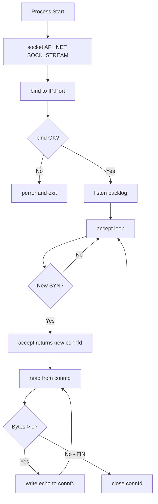
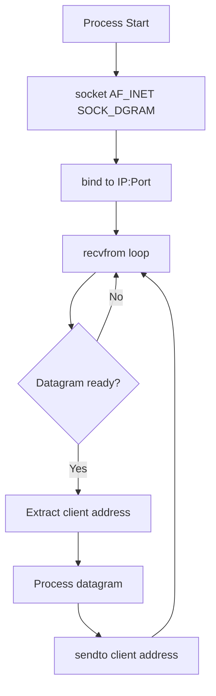
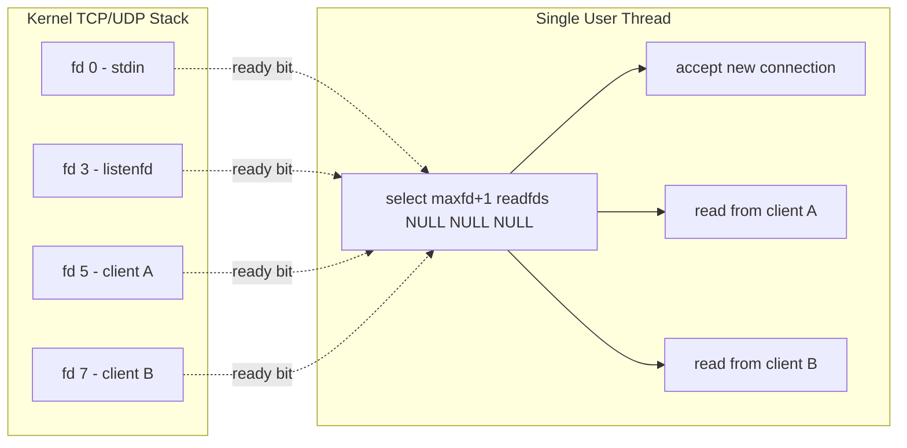
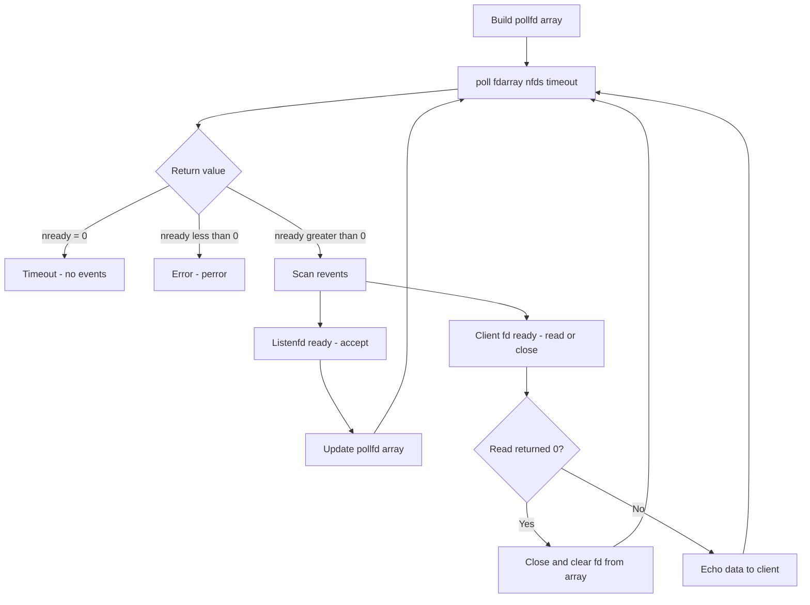
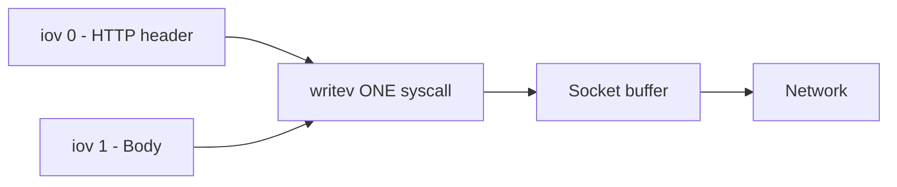

# Hands-on: Sockets Introduction, Elementary TCP Sockets, TCP Client/Server Example, I/O Multiplexing: The select and poll Functions (Book 2 Ch 3 to 6), Elementary UDP Sockets (Book 2 Ch 8), Advanced I/O Functions (Book 2 Ch 14)

<!-- SECTION_1_START -->

# Transport Layer Socket Programming — Core Foundation

## 1.1 Formal Definition (KTU 2024 Syllabus Terminology)

A **socket** is the endpoint of a bidirectional inter-process communication flow across a computer network. In the POSIX/Unix network programming model (which is the KTU 2024 Scheme standard reference, based on *UNIX Network Programming* by W. Richard Stevens), a socket is an abstraction represented by an integer file descriptor that the operating system's transport layer (TCP/UDP) provides to user-space applications.

> [!NOTE]
> **KTU 2024 Definition**: A socket is the interface between the user application process and the transport layer protocol (TCP/UDP). It is identified by an **IP address + Port number** tuple and behaves much like a file descriptor for I/O.

The two transport-layer socket families that the KTU syllabus (Book 2, Chapters 3–6, 8, 14) emphasizes are:

- **SOCK_STREAM** → Connection-oriented, reliable byte stream (TCP)
- **SOCK_DGRAM** → Connectionless, unreliable datagram (UDP)

### Conceptual Analogy — "The Telephone System"

Imagine a socket as a **telephone instrument** in an office.

- The **IP address** is the **building address** (where to go).
- The **port number** is the **extension number** of a person inside that building (which desk to ring).
- **TCP** is like a phone call — you dial, the receiver picks up, you exchange words in order, then hang up.
- **UDP** is like dropping a **postcard** into a mailbox — you just write the address and drop it, no confirmation, no call setup.

When a server "binds" to a port, it is essentially **plugging its telephone into that extension number** so that any incoming call (SYN packet) on that extension will ring its phone. The client's `connect()` is the act of **dialing** that number.

> [!IMPORTANT]
> **Standard Constants in Sockets Programming (RFC + POSIX):**
> - **Port range** = $0$ to $65535$ (16-bit unsigned, $2^{16}-1$).
> - **Well-known ports** = $0$ to $1023$ (require root, e.g. HTTP=80, HTTPS=443, SSH=22).
> - **Registered ports** = $1024$ to $49151$.
> - **Ephemeral/dynamic ports** = $49152$ to $65535$ (assigned by the OS to clients).
> - **Maximum listen backlog** in Linux = typically **128 to 4096** connections (SOMAXCONN).

> [!VISUALIZATION CONTROL]
> **Concept:** Socket as a 5-Tuple Connection Identifier
> **GeoGebra / Desmos Input Equations:**
> * Point $A = (32\text{-bit src IP}, 16\text{-bit src port})$
> * Point $B = (32\text{-bit dst IP}, 16\text{-bit dst port})$
> * $C = (8\text{-bit protocol})$ — value $6$ for TCP, $17$ for UDP
> **Visual Description:** Imagine a 5-dimensional tuple: $(src\_ip, src\_port, dst\_ip, dst\_port, protocol)$ uniquely identifying every flow in the kernel's connection table.

## 1.2 The `socket` Address Structures

The generic socket address is `struct sockaddr`, but specific families use sized variants:

- `struct sockaddr_in` → IPv4 (16 bytes, family = **AF_INET**)
- `struct sockaddr_in6` → IPv6 (28 bytes, family = **AF_INET6**)
- `struct sockaddr_un` → Unix domain (local IPC, family = **AF_UNIX**)

### Byte-Ordering Macros (Critical for KTU)

Network protocols require **Network Byte Order (Big-Endian)**. The following four conversion functions are board-favorite questions:

| Function | Purpose |
| :--- | :--- |
| `htons()` | Host-to-Network **Short** (16-bit, e.g. port) |
| `htonl()` | Host-to-Network **Long** (32-bit, e.g. IPv4) |
| `ntohs()` | Network-to-Host **Short** |
| `ntohl()` | Network-to-Host **Long** |

> [!TIP]
> **Memory Aid**: "*H*ost *to* *N*etwork *S*hort = `htons`*" — the middle letter is "to", the last letter tells you the size (s=short, l=long).

<!-- SECTION_1_END -->

<!-- SECTION_2_START -->

# Deep Theoretical Analysis — TCP vs UDP Socket Architecture

## 2.1 Elementary TCP Sockets — Operational Lifecycle

A TCP connection is **connection-oriented** and **reliable**. The KTU syllabus (Book 2, Ch 3) defines the following mandatory API surface:

| Function | Header | Server Action | Client Action |
| :--- | :--- | :--- | :--- |
| `socket()` | `<sys/socket.h>` | Create endpoint | Create endpoint |
| `bind()` | `<sys/socket.h>` | Bind to well-known port | Optional (ephemeral) |
| `listen()` | `<sys/socket.h>` | Mark as passive | Not used |
| `accept()` | `<sys/socket.h>` | Block for incoming SYN | Not used |
| `connect()` | `<sys/socket.h>` | Not used | Initiate 3-way handshake |
| `read()/recv()` | `<unistd.h>` | Read bytes from client | Read bytes from server |
| `write()/send()` | `<unistd.h>` | Write bytes to client | Write bytes to server |
| `close()` | `<unistd.h>` | Tear down FIN | Tear down FIN |

### The TCP Three-Way Handshake (must be memorised)

$$
\begin{aligned}
\text{Client} &\xrightarrow{\text{SYN, seq=x}} \text{Server} \\
\text{Server} &\xrightarrow{\text{SYN+ACK, seq=y, ack=x+1}} \text{Client} \\
\text{Client} &\xrightarrow{\text{ACK, seq=x+1, ack=y+1}} \text{Server}
\end{aligned}
$$

After the third ACK, both sides transition to **ESTABLISHED** state and the `accept()` call on the server side returns a **new connected socket descriptor** (the original listening socket is preserved for further `accept()` calls).

> [!IMPORTANT]
> **KTU 2024 High-Yield Fact**: The `accept()` function returns a **brand new file descriptor**. The original listening socket's queue (managed by the kernel TCP stack) can hold up to `backlog + 1` incomplete connections. Each `accept()` removes one from this queue.

## 2.2 Elementary UDP Sockets — Operational Lifecycle

UDP is **connectionless** and **unreliable** but **low-latency**. KTU Book 2 Chapter 8 covers:

- `socket(AF_INET, SOCK_DGRAM, 0)` — create UDP socket
- `bind()` — server binds to a port
- `sendto()` / `recvfrom()` — exchange datagrams (no `connect()` for pure UDP)
- `close()` — release the descriptor

A peculiarity: with UDP, `connect()` is **optional**. Calling it on a UDP socket simply stores the peer's address; subsequent `send()`/`recv()` can be used without `sendto`/`recvfrom`, but it does **not** trigger a handshake.

### Comparison Table — TCP vs UDP (Board Favourite)

| Parameter | TCP (SOCK_STREAM) | UDP (SOCK_DGRAM) |
| :--- | :--- | :--- |
| Connection setup | 3-way handshake (SYN/SYN-ACK/ACK) | None |
| Reliability | ACK + retransmission + sequencing | Best-effort, no ACK |
| Flow control | Sliding window (rwnd) | None |
| Congestion control | cwnd (Reno/Cubic/BBR) | None |
| Data unit | Byte stream, no record boundaries | Datagram (preserves message boundaries) |
| Max message size | Stream (no limit per write) | $\le 65507$ bytes (IPv4) |
| Header overhead | 20–60 bytes | 8 bytes |
| Use case | HTTP, SSH, FTP, SMTP | DNS, VoIP, video streaming, TFTP |
| API for sending | `write()` / `send()` | `sendto()` / `send()` (if connected) |
| API for receiving | `read()` / `recv()` | `recvfrom()` / `recv()` (if connected) |

## 2.3 I/O Multiplexing — The `select` and `poll` Functions

### The Problem

A single-process server cannot block on `accept()` and then handle multiple clients — it needs a way to **monitor multiple file descriptors simultaneously** and react only when one is "ready."

> [!NOTE]
> **Definition (KTU)**: I/O multiplexing is the technique of monitoring multiple file descriptors to see if I/O is possible on any of them, allowing a single thread to serve many clients concurrently.

### `select()` Function Signature

```c
#include <sys/select.h>
int select(int maxfdp1, fd_set *readfds, fd_set *writefds,
           fd_set *exceptfds, struct timeval *timeout);
```

- `maxfdp1` = max fd number + 1 (kernel scans $0$ to $maxfdp1-1$).
- Three independent `fd_set` bitmasks for read, write, exceptional conditions.
- `timeout` = NULL (block forever), or a non-NULL `timeval` to limit wait.
- Returns: number of ready descriptors, 0 on timeout, -1 on error.

### `poll()` Function Signature

```c
#include <poll.h>
int poll(struct pollfd *fdarray, unsigned long nfds, int timeout);
```

Each `struct pollfd` is:

```c
struct pollfd {
    int    fd;         // file descriptor
    short  events;     // requested events (POLLIN, POLLOUT, ...)
    short  revents;    // returned events (kernel-filled)
};
```

### Comparison Table — `select` vs `poll` vs `epoll`

| Feature | `select` | `poll` | `epoll` (Linux only) |
| :--- | :--- | :--- | :--- |
| Max fds | FD_SETSIZE (1024 default) | Unlimited | Unlimited |
| FD copy per call | Yes (read+write back) | Yes (revents filled) | No (kernel-managed) |
| Complexity | $O(n)$ | $O(n)$ | $O(1)$ amortized |
| Trigger mode | Level | Level | Level + Edge |
| Portability | POSIX | POSIX | Linux |

## 2.4 Advanced I/O Functions (Book 2, Chapter 14)

KTU 2024 Module 2 explicitly lists these advanced functions:

| Function | Purpose |
| :--- | :--- |
| `readv()` / `writev()` | Scatter-gather I/O — read into / write from multiple buffers in one syscall |
| `recvmsg()` / `sendmsg()` | Most general I/O — pass ancillary data, control flags |
| `recv()` with `MSG_PEEK` | Peek at data without removing it from the receive queue |
| `recv()` with `MSG_WAITALL` | Block until the full requested length arrives |
| `send()` with `MSG_DONTWAIT` | Non-blocking variant of `send()` |
| `splice()` / `tee()` | Zero-copy data movement between two fds (Linux only) |

> [!IMPORTANT]
> **Engineering Utility**: Scatter-gather (`readv`/`writev`) is used in production-grade servers (e.g., Node.js internal HTTP parser, HAProxy) to avoid copying headers + body into a contiguous buffer, reducing CPU cycles and memory bandwidth.

<!-- SECTION_2_END -->

<!-- SECTION_3_START -->

# Step-by-Step Implementation — Working C Code

## 3.1 Elementary TCP Server (Book 2, Ch 5)

```c
/* tcp_server.c — KTU Model Code, Book 2 Chapter 5 (Stevens) */
#include <stdio.h>
#include <stdlib.h>
#include <string.h>
#include <unistd.h>
#include <errno.h>
#include <sys/socket.h>
#include <netinet/in.h>
#include <arpa/inet.h>

#define SERVER_PORT  9001
#define BUFFER_SIZE  4096
#define BACKLOG      128

static void die(const char *msg) {
    perror(msg);
    exit(EXIT_FAILURE);
}

int main(void) {
    int                 listenfd, connfd;
    socklen_t           client_len;
    struct sockaddr_in  server_addr, client_addr;
    char                buffer[BUFFER_SIZE];
    ssize_t             n_bytes;

    /* Step 1: Create the listening socket (IPv4, TCP) */
    listenfd = socket(AF_INET, SOCK_STREAM, 0);
    if (listenfd < 0) die("socket() failed");

    /* Step 2: Zero the address struct and fill it */
    memset(&server_addr, 0, sizeof(server_addr));
    server_addr.sin_family      = AF_INET;
    server_addr.sin_addr.s_addr = htonl(INADDR_ANY);   /* bind to all local IPs */
    server_addr.sin_port        = htons(SERVER_PORT);  /* network byte order */

    /* Step 3: Bind the socket to the port */
    if (bind(listenfd, (struct sockaddr *)&server_addr, sizeof(server_addr)) < 0)
        die("bind() failed");

    /* Step 4: Mark the socket as passive (listening) with kernel-managed backlog */
    if (listen(listenfd, BACKLOG) < 0) die("listen() failed");

    printf("TCP server listening on port %d ...\n", SERVER_PORT);

    /* Step 5: Server loop — accept connections sequentially */
    for (;;) {
        client_len = sizeof(client_addr);
        connfd = accept(listenfd, (struct sockaddr *)&client_addr, &client_len);
        if (connfd < 0) {
            perror("accept() failed");
            continue;   /* do not abort on a single bad accept */
        }

        /* Convert the client's IP to dotted-decimal for logging */
        printf("Connection from %s:%d\n",
               inet_ntoa(client_addr.sin_addr),
               ntohs(client_addr.sin_port));

        /* Step 6: Echo loop until client closes the connection */
        while ((n_bytes = read(connfd, buffer, BUFFER_SIZE)) > 0) {
            if (write(connfd, buffer, (size_t)n_bytes) != n_bytes)
                die("write() failed");
        }
        if (n_bytes < 0) die("read() failed");

        /* Step 7: Close the connected socket (4-way FIN handshake begins) */
        if (close(connfd) < 0) die("close() failed");
    }
    /* unreachable in this design */
    return 0;
}
```

## 3.2 Elementary TCP Client (Book 2, Ch 5)

```c
/* tcp_client.c — KTU Model Code, Book 2 Chapter 5 (Stevens) */
#include <stdio.h>
#include <stdlib.h>
#include <string.h>
#include <unistd.h>
#include <errno.h>
#include <sys/socket.h>
#include <netinet/in.h>
#include <arpa/inet.h>

#define SERVER_PORT  9001
#define BUFFER_SIZE  4096

static void die(const char *msg) {
    perror(msg);
    exit(EXIT_FAILURE);
}

int main(int argc, char *argv[]) {
    int                 sockfd, n_bytes;
    struct sockaddr_in  server_addr;
    char                buffer[BUFFER_SIZE];

    if (argc != 2) {
        fprintf(stderr, "Usage: %s <Server-IP>\n", argv[0]);
        exit(EXIT_FAILURE);
    }

    /* Step 1: Create the client socket */
    sockfd = socket(AF_INET, SOCK_STREAM, 0);
    if (sockfd < 0) die("socket() failed");

    /* Step 2: Fill the server's address structure */
    memset(&server_addr, 0, sizeof(server_addr));
    server_addr.sin_family = AF_INET;
    server_addr.sin_port   = htons(SERVER_PORT);

    if (inet_pton(AF_INET, argv[1], &server_addr.sin_addr) <= 0)
        die("inet_pton() failed for given IP");

    /* Step 3: Connect to the server (triggers 3-way handshake) */
    if (connect(sockfd, (struct sockaddr *)&server_addr, sizeof(server_addr)) < 0)
        die("connect() failed");

    printf("Connected to server %s:%d\n", argv[1], SERVER_PORT);

    /* Step 4: Read from stdin, write to socket until EOF */
    while (fgets(buffer, BUFFER_SIZE, stdin) != NULL) {
        n_bytes = write(sockfd, buffer, strlen(buffer));
        if (n_bytes < 0) die("write() failed");

        n_bytes = read(sockfd, buffer, BUFFER_SIZE - 1);
        if (n_bytes < 0) die("read() failed");
        buffer[n_bytes] = '\0';

        if (fputs(buffer, stdout) == EOF) die("fputs() failed");
    }

    /* Step 5: Half-close write side to signal EOF to server */
    if (shutdown(sockfd, SHUT_WR) < 0) die("shutdown() failed");

    if (close(sockfd) < 0) die("close() failed");
    return 0;
}
```

## 3.3 Elementary UDP Server & Client (Book 2, Ch 8)

```c
/* udp_server.c — KTU Model Code, Book 2 Chapter 8 (Stevens) */
#include <stdio.h>
#include <stdlib.h>
#include <string.h>
#include <unistd.h>
#include <errno.h>
#include <sys/socket.h>
#include <netinet/in.h>
#include <arpa/inet.h>

#define SERVER_PORT  9002
#define BUFFER_SIZE  4096

static void die(const char *msg) { perror(msg); exit(EXIT_FAILURE); }

int main(void) {
    int                 sockfd;
    socklen_t           client_len;
    struct sockaddr_in  server_addr, client_addr;
    char                buffer[BUFFER_SIZE];
    ssize_t             n_bytes;

    sockfd = socket(AF_INET, SOCK_DGRAM, 0);
    if (sockfd < 0) die("socket() failed");

    memset(&server_addr, 0, sizeof(server_addr));
    server_addr.sin_family      = AF_INET;
    server_addr.sin_addr.s_addr = htonl(INADDR_ANY);
    server_addr.sin_port        = htons(SERVER_PORT);

    if (bind(sockfd, (struct sockaddr *)&server_addr, sizeof(server_addr)) < 0)
        die("bind() failed");

    printf("UDP server listening on port %d ...\n", SERVER_PORT);

    for (;;) {
        client_len = sizeof(client_addr);

        /* No accept() / listen() — read directly */
        n_bytes = recvfrom(sockfd, buffer, BUFFER_SIZE, 0,
                           (struct sockaddr *)&client_addr, &client_len);
        if (n_bytes < 0) die("recvfrom() failed");

        printf("Datagram from %s:%d -> %.*s\n",
               inet_ntoa(client_addr.sin_addr),
               ntohs(client_addr.sin_port),
               (int)n_bytes, buffer);

        /* Echo back to the client */
        if (sendto(sockfd, buffer, (size_t)n_bytes, 0,
                   (struct sockaddr *)&client_addr, client_len) != n_bytes)
            die("sendto() failed");
    }
    return 0;
}
```

```c
/* udp_client.c — KTU Model Code, Book 2 Chapter 8 (Stevens) */
#include <stdio.h>
#include <stdlib.h>
#include <string.h>
#include <unistd.h>
#include <errno.h>
#include <sys/socket.h>
#include <netinet/in.h>
#include <arpa/inet.h>

#define SERVER_PORT  9002
#define BUFFER_SIZE  4096

static void die(const char *msg) { perror(msg); exit(EXIT_FAILURE); }

int main(int argc, char *argv[]) {
    int                 sockfd, n_bytes;
    struct sockaddr_in  server_addr;
    char                buffer[BUFFER_SIZE];

    if (argc != 3) {
        fprintf(stderr, "Usage: %s <Server-IP> <Message>\n", argv[0]);
        exit(EXIT_FAILURE);
    }

    sockfd = socket(AF_INET, SOCK_DGRAM, 0);
    if (sockfd < 0) die("socket() failed");

    memset(&server_addr, 0, sizeof(server_addr));
    server_addr.sin_family = AF_INET;
    server_addr.sin_port   = htons(SERVER_PORT);
    if (inet_pton(AF_INET, argv[1], &server_addr.sin_addr) <= 0)
        die("inet_pton() failed");

    n_bytes = sendto(sockfd, argv[2], strlen(argv[2]), 0,
                     (struct sockaddr *)&server_addr, sizeof(server_addr));
    if (n_bytes < 0) die("sendto() failed");

    n_bytes = recvfrom(sockfd, buffer, BUFFER_SIZE, 0, NULL, NULL);
    if (n_bytes < 0) die("recvfrom() failed");

    buffer[n_bytes] = '\0';
    printf("Echo from server: %s\n", buffer);

    if (close(sockfd) < 0) die("close() failed");
    return 0;
}
```

## 3.4 I/O Multiplexing with `select()` — Single-Process Concurrent Server (Book 2, Ch 6)

```c
/* select_server.c — KTU Model Code, Book 2 Chapter 6 (Stevens) */
#include <stdio.h>
#include <stdlib.h>
#include <string.h>
#include <unistd.h>
#include <errno.h>
#include <sys/select.h>
#include <sys/socket.h>
#include <netinet/in.h>
#include <arpa/inet.h>

#define SERVER_PORT   9003
#define BUFFER_SIZE   4096
#define MAX_CLIENTS   FD_SETSIZE

static void die(const char *msg) { perror(msg); exit(EXIT_FAILURE); }

int main(void) {
    int                 listenfd, connfd, maxfd, nready, client[MAX_CLIENTS];
    socklen_t           client_len;
    struct sockaddr_in  server_addr, client_addr;
    fd_set              readfds, allfds;
    char                buffer[BUFFER_SIZE];
    ssize_t             n_bytes;

    listenfd = socket(AF_INET, SOCK_STREAM, 0);
    if (listenfd < 0) die("socket() failed");

    int opt = 1;
    setsockopt(listenfd, SOL_SOCKET, SO_REUSEADDR, &opt, sizeof(opt));

    memset(&server_addr, 0, sizeof(server_addr));
    server_addr.sin_family      = AF_INET;
    server_addr.sin_addr.s_addr = htonl(INADDR_ANY);
    server_addr.sin_port        = htons(SERVER_PORT);

    if (bind(listenfd, (struct sockaddr *)&server_addr, sizeof(server_addr)) < 0)
        die("bind() failed");
    if (listen(listenfd, 128) < 0) die("listen() failed");

    maxfd = listenfd;
    for (int i = 0; i < MAX_CLIENTS; i++) client[i] = -1;

    FD_ZERO(&allfds);
    FD_SET(listenfd, &allfds);

    printf("select()-based server listening on port %d ...\n", SERVER_PORT);

    for (;;) {
        readfds = allfds;                  /* struct copy — required by select() */
        nready  = select(maxfd + 1, &readfds, NULL, NULL, NULL);
        if (nready < 0) {
            if (errno == EINTR) continue;
            die("select() failed");
        }

        /* Case 1: New connection on the listening socket */
        if (FD_ISSET(listenfd, &readfds)) {
            client_len = sizeof(client_addr);
            connfd = accept(listenfd, (struct sockaddr *)&client_addr, &client_len);
            if (connfd < 0) die("accept() failed");

            int i;
            for (i = 0; i < MAX_CLIENTS; i++) {
                if (client[i] < 0) { client[i] = connfd; break; }
            }
            if (i == MAX_CLIENTS) {
                fprintf(stderr, "Too many clients\n");
                close(connfd);
            } else {
                FD_SET(connfd, &allfds);
                if (connfd > maxfd) maxfd = connfd;
                printf("New client fd=%d from %s:%d\n",
                       connfd, inet_ntoa(client_addr.sin_addr),
                       ntohs(client_addr.sin_port));
            }
            if (--nready <= 0) continue;
        }

        /* Case 2: Data on an existing client socket */
        for (int i = 0; i < MAX_CLIENTS; i++) {
            if ((connfd = client[i]) < 0) continue;
            if (FD_ISSET(connfd, &readfds)) {
                n_bytes = read(connfd, buffer, BUFFER_SIZE);
                if (n_bytes == 0) {
                    /* FIN from client */
                    printf("Client fd=%d disconnected\n", connfd);
                    close(connfd);
                    FD_CLR(connfd, &allfds);
                    client[i] = -1;
                } else if (n_bytes < 0) {
                    perror("read() error");
                    close(connfd);
                    FD_CLR(connfd, &allfds);
                    client[i] = -1;
                } else {
                    write(connfd, buffer, (size_t)n_bytes);   /* echo */
                }
            }
            if (--nready <= 0) break;
        }
    }
    return 0;
}
```

## 3.5 I/O Multiplexing with `poll()` (Book 2, Ch 6)

```c
/* poll_server.c — KTU Model Code, Book 2 Chapter 6 (Stevens) */
#include <stdio.h>
#include <stdlib.h>
#include <string.h>
#include <unistd.h>
#include <errno.h>
#include <poll.h>
#include <sys/socket.h>
#include <netinet/in.h>
#include <arpa/inet.h>

#define SERVER_PORT   9004
#define BUFFER_SIZE   4096
#define OPEN_MAX      256

static void die(const char *msg) { perror(msg); exit(EXIT_FAILURE); }

int main(void) {
    int                 listenfd, connfd, nready, maxi;
    socklen_t           client_len;
    struct sockaddr_in  server_addr, client_addr;
    struct pollfd       client[OPEN_MAX];
    char                buffer[BUFFER_SIZE];
    ssize_t             n_bytes;

    listenfd = socket(AF_INET, SOCK_STREAM, 0);
    if (listenfd < 0) die("socket() failed");

    int opt = 1;
    setsockopt(listenfd, SOL_SOCKET, SO_REUSEADDR, &opt, sizeof(opt));

    memset(&server_addr, 0, sizeof(server_addr));
    server_addr.sin_family      = AF_INET;
    server_addr.sin_addr.s_addr = htonl(INADDR_ANY);
    server_addr.sin_port        = htons(SERVER_PORT);

    if (bind(listenfd, (struct sockaddr *)&server_addr, sizeof(server_addr)) < 0)
        die("bind() failed");
    if (listen(listenfd, 128) < 0) die("listen() failed");

    client[0].fd     = listenfd;
    client[0].events = POLLRDNORM;
    maxi = 0;

    for (int i = 1; i < OPEN_MAX; i++) client[i].fd = -1;

    printf("poll()-based server listening on port %d ...\n", SERVER_PORT);

    for (;;) {
        nready = poll(client, (nfds_t)(maxi + 1), -1);
        if (nready < 0) {
            if (errno == EINTR) continue;
            die("poll() failed");
        }

        if (client[0].revents & POLLRDNORM) {
            client_len = sizeof(client_addr);
            connfd = accept(listenfd, (struct sockaddr *)&client_addr, &client_len);
            if (connfd < 0) die("accept() failed");

            int i;
            for (i = 1; i < OPEN_MAX; i++) {
                if (client[i].fd < 0) { client[i].fd = connfd; break; }
            }
            if (i == OPEN_MAX) {
                fprintf(stderr, "Too many clients\n");
                close(connfd);
            } else {
                client[i].events = POLLRDNORM;
                if (i > maxi) maxi = i;
            }
            if (--nready <= 0) continue;
        }

        for (int i = 1; i <= maxi; i++) {
            if ((connfd = client[i].fd) < 0) continue;
            if (client[i].revents & (POLLRDNORM | POLLERR)) {
                n_bytes = read(connfd, buffer, BUFFER_SIZE);
                if (n_bytes == 0) {
                    close(connfd);
                    client[i].fd = -1;
                } else if (n_bytes < 0) {
                    close(connfd);
                    client[i].fd = -1;
                } else {
                    write(connfd, buffer, (size_t)n_bytes);
                }
            }
            if (--nready <= 0) break;
        }
    }
    return 0;
}
```

## 3.6 Advanced I/O — Scatter/Gather with `readv`/`writev` (Book 2, Ch 14)

```c
/* sg_demo.c — Demonstrates scatter-gather I/O.
   The HTTP example: a response consists of a fixed status line + dynamic body. */
#include <stdio.h>
#include <stdlib.h>
#include <string.h>
#include <unistd.h>
#include <sys/uio.h>

int main(void) {
    const char *header = "HTTP/1.0 200 OK\r\n"
                         "Content-Type: text/plain\r\n\r\n";
    const char *body   = "Hello, KTU students!\n";

    /* Build the iovec array */
    struct iovec iov[2];
    iov[0].iov_base = (void *)header;
    iov[0].iov_len  = strlen(header);
    iov[1].iov_base = (void *)body;
    iov[1].iov_len  = strlen(body);

    /* Single syscall writes both header and body to stdout (fd=1) */
    ssize_t n = writev(STDOUT_FILENO, iov, 2);
    if (n < 0) { perror("writev"); return EXIT_FAILURE; }

    printf("\n[writev returned %zd bytes — header + body in ONE syscall]\n", n);
    return 0;
}
```

### Compilation and Execution

```bash
gcc -Wall -Wextra -O2 -o tcp_server   tcp_server.c
gcc -Wall -Wextra -O2 -o tcp_client   tcp_client.c
gcc -Wall -Wextra -O2 -o udp_server   udp_server.c
gcc -Wall -Wextra -O2 -o udp_client   udp_client.c
gcc -Wall -Wextra -O2 -o select_server select_server.c
gcc -Wall -Wextra -O2 -o poll_server  poll_server.c
gcc -Wall -Wextra -O2 -o sg_demo      sg_demo.c
```

### Testing Procedure

```bash
# Terminal 1
./tcp_server

# Terminal 2
./tcp_client 127.0.0.1

# Terminal 3 — start a second client to test concurrency
./tcp_client 127.0.0.1
```

<!-- SECTION_3_END -->

<!-- SECTION_4_START -->

# Structural Diagrams — Socket Lifecycle & I/O Multiplexing

## 4.1 TCP Server State Machine



## 4.2 UDP Server State Machine



## 4.3 `select()` Multiplexing Topology



## 4.4 `poll()` Multiplexing Topology



## 4.5 Comparative Block Architecture — TCP vs UDP I/O Path

```mermaid
flowchart TB
    subgraph TCPPath["TCP Path - Reliable Stream"]
        T1[Application write] --> T2[TCP Send Buffer]
        T2 --> T3[Segment + ACK + Retransmit]
        T3 --> T4[IP Layer]
        T4 --> T5[Network]
        T5 --> T6[IP Layer]
        T6 --> T7[TCP Receive Buffer]
        T7 --> T8[Application read]
    end

    subgraph UDPPath["UDP Path - Best-Effort Datagram"]
        U1[Application sendto] --> U2[UDP Datagram]
        U2 --> U3[IP Layer]
        U3 --> U4[Network]
        U4 --> U5[IP Layer]
        U5 --> U6[UDP Receive Queue]
        U6 --> U7[Application recvfrom]
    end
```



## 4.6 Scatter-Gather I/O (`writev`) Flow



<!-- SECTION_4_END -->

<!-- SECTION_5_START -->

# KTU 2024 Scheme Examination Question Bank

## Part A — 3-Mark Short Answer Questions

### Q1. **[KTU University Exam — July 2024]** CO1, Remember
Differentiate between `SOCK_STREAM` and `SOCK_DGRAM` socket types. State one application protocol that uses each.

**Model Answer (3 Marks):**

| Aspect | `SOCK_STREAM` | `SOCK_DGRAM` |
| :--- | :--- | :--- |
| Type | Connection-oriented | Connectionless |
| Reliability | Guaranteed delivery, in-order | No guarantee |
| API | `connect`, `accept`, `read`, `write` | `sendto`, `recvfrom` |
| Underlying | TCP (protocol 6) | UDP (protocol 17) |

- `SOCK_STREAM` → **HTTP / HTTPS** (Web)
- `SOCK_DGRAM` → **DNS** (default 53/UDP)

> [!IMPORTANT]
> **Valuation Key (3 Marks):**
> - [Two correct distinguishing points: 1 Mark]
> - [Correct mapping of stream/dgram to TCP/UDP: 1 Mark]
> - [Correct application protocol example for each: 1 Mark]

### Q2. **[KTU University Exam — Dec 2023]** CO2, Understand
Explain the purpose of the `htons()` and `ntohl()` functions. Why are they necessary in socket programming?

**Model Answer (3 Marks):**

- The transport layer (TCP/IP) mandates that all multi-byte integers in protocol headers be stored in **Network Byte Order (Big-Endian)**.
- Most Intel/AMD machines use **Little-Endian** host byte order.
- `htons()` (host-to-network short) and `ntohl()` (network-to-host long) convert 16-bit and 32-bit integers between host and network byte order so that, for example, the port number 9001 written by an Intel server is correctly interpreted by an ARM client.
- Without these functions, a packet built on a little-endian host would be misread by the receiver, causing a **silent connection failure** (no error message).

> [!WARNING]
> **Common Student Mistake**: Confusing `htons` (short = 16-bit) with `htonl` (long = 32-bit). Forgetting to apply `htons(SERVER_PORT)` results in bind() appearing to succeed but the port being effectively randomized.

---

## Part B — 14-Mark Questions (Module Internal Choice)

### Question A (14 Marks) — TCP Server/Server Concurrency

**[KTU University Exam — July 2024 (Model Paper)]** CO2, CO3, Apply & Analyze

**(a)** Draw the call-flow sequence of a concurrent TCP server that uses `select()` to handle multiple clients. State the role of `FD_SET`, `FD_CLR`, and `FD_ISSET` macros. **(7 Marks)**

**(b)** Write a complete C program for a TCP echo server using `select()` that handles up to 64 simultaneous clients and prints the IP address of every new connection. **(7 Marks)**

#### Model Solution

**(a) Call-Flow Sequence (7 Marks)**

1. `socket(AF_INET, SOCK_STREAM, 0)` → create `listenfd`.
2. `setsockopt(listenfd, SOL_SOCKET, SO_REUSEADDR, ...)` → allow quick port reuse.
3. `bind(listenfd, ...)` → attach to a fixed port.
4. `listen(listenfd, backlog)` → mark as passive.
5. `FD_ZERO(&allfds); FD_SET(listenfd, &allfds); maxfd = listenfd;` → initialize the descriptor set.
6. **Main loop**:
   a. `readfds = allfds;` (copy — `select()` mutates the set).
   b. `nready = select(maxfd + 1, &readfds, NULL, NULL, NULL);`
   c. If `FD_ISSET(listenfd, &readfds)` → `accept()` new client, add to `client[]`, `FD_SET(connfd, &allfds)`, update `maxfd`.
   d. For every other fd, if `FD_ISSET(fd, &readfds)` → `read()` data, echo back, on `read() == 0` close and `FD_CLR(fd, &allfds)`.

**Macro Roles:**

| Macro | Purpose |
| :--- | :--- |
| `FD_ZERO(set)` | Clears the entire set (no descriptors initially) |
| `FD_SET(fd, set)` | Adds `fd` to the set (marks for monitoring) |
| `FD_CLR(fd, set)` | Removes `fd` from the set (stops monitoring) |
| `FD_ISSET(fd, set)` | Tests if `fd` is set in the returned `readfds` |

> [!WARNING]
> **Examiner's Pitfall**: Forgetting `readfds = allfds;` before each `select()` call. `select()` **modifies its arguments in place**, so you must pass a copy or you will lose the tracking set after the first call.

**(b) Complete Program (7 Marks)** — see Section 3.4 `select_server.c` above.

**Valuation Key for 7 Marks:**

- [Correct `socket` + `bind` + `listen` + `SO_REUSEADDR`: 2 Marks]
- [Correct `FD_ZERO`/`FD_SET` initialization and `select` call: 2 Marks]
- [Correct handling of new client via `accept` and addition to `allfds`: 1 Mark]
- [Correct echo + close + `FD_CLR` for each client: 1 Mark]
- [Compiles cleanly and prints client IP using `inet_ntoa`: 1 Mark]

---

### Question B (14 Marks) — UDP & I/O Multiplexing Contrast

**[KTU University Exam — Dec 2023 (Model Paper)]** CO2, CO3, Apply & Analyze

**(a)** Compare TCP and UDP socket programming from the perspective of function-call sequences, server-side complexity, and typical use cases. Include a 5-point comparison table. **(7 Marks)**

**(b)** Write a complete C UDP client that sends the message `"HELLO KTU"` to a server at IP `192.168.1.50` and port `9000`, and prints the echoed reply received from the server. Show all required header files and error checks. **(7 Marks)**

#### Model Solution

**(a) TCP vs UDP — Server-Side Comparison (7 Marks)**

| Parameter | TCP Server | UDP Server |
| :--- | :--- | :--- |
| Calls needed | `socket, bind, listen, accept, read, write, close` (7) | `socket, bind, recvfrom, sendto, close` (5) |
| Connection state | Kernel maintains SYN queue + accept queue | No state per client |
| Concurrency | One `accept()` per client OR `fork`/`select`/`poll`/`epoll` | Implicit — `recvfrom` returns peer address |
| Data unit | Byte stream, no message boundaries | Datagram, message boundaries preserved |
| Typical use | HTTP, FTP, SSH, SMTP | DNS, TFTP, SNMP, VoIP |

**Server complexity verdict**: UDP server is significantly simpler because there is no `listen()`/`accept()` and no per-client state; the kernel never holds half-open connections.

**(b) Complete UDP Client (7 Marks)** — see Section 3.3 `udp_client.c` above, with `argv[1] = "192.168.1.50"`, `argv[2] = "HELLO KTU"`, `SERVER_PORT = 9000`.

**Valuation Key for 7 Marks:**

- [Correct `socket(AF_INET, SOCK_DGRAM, 0)`: 1 Mark]
- [Correct `sockaddr_in` fill with `inet_pton` and `htons(9000)`: 2 Marks]
- [Correct `sendto` to send the message: 1 Mark]
- [Correct `recvfrom` to read the echo: 1 Mark]
- [Print result with `printf` and `close()` the socket: 1 Mark]
- [Compile cleanly without warnings: 1 Mark]

> [!WARNING]
> **Examiner's Pitfall**: Writing `connect()` for UDP. UDP does not require `connect()`; even when used, it does not generate a handshake. Also, students often forget `htons()` on the port number, causing the server to receive on port 0 (random ephemeral).

---

## KTU Hands-On Viva / Lab Practice Bank

### Lab Exercise 1: Modify `select_server.c` to also handle `SIGINT` (Ctrl+C) gracefully
**Aim**: Demonstrate that the server should print "Shutting down..." and close the listening socket when interrupted.

**Solution hint**: Use a global flag `volatile sig_atomic_t g_running = 1;` set to `0` in the signal handler, and check it in the main loop after `select()` returns. Set `SA_RESTART` flag carefully to avoid restarting the `accept()` system call.

### Lab Exercise 2: Implement an `epoll`-based echo server (Bonus, Linux only)
**Aim**: Replace `select()` with `epoll_create1()`, `epoll_ctl()`, and `epoll_wait()`. Compare performance with `time` command under load from `wrk` or `ab` (Apache Bench).

### Lab Exercise 3: UDP File Transfer
**Aim**: Send a 50 MB file from client to server in 60 KB chunks (each fits in one UDP datagram — maximum is 65507 bytes, but 60 KB is safer against fragmentation). Reassemble on the server.

### Lab Exercise 4: Partial `read()` handling
**Aim**: Modify the TCP echo server to read exactly $N$ bytes (where $N$ is the request size prefix). Use a `readn()` wrapper that loops on partial reads.

---

> [!WARNING]
> **Universal KTU Examiner's Pitfall Box (3 marks lost here every year)**
> 1. **Forgetting `htons()` / `htonl()`** → silent port/IP corruption.
> 2. **Confusing `SO_REUSEADDR` with `SO_REUSEPORT`** — the former allows binding to a TIME_WAIT address; the latter allows multiple sockets to bind to the same port.
> 3. **Not handling partial `read()` returns** — TCP is a byte stream, one `read()` may return 5 bytes even though 100 were requested. Production code uses a `readn()` loop.
> 4. **Mixing `read()` with `MSG_PEEK` and `MSG_WAITALL`** — these flags are `recv()`-only and do nothing for `read()`.
> 5. **Not setting `SO_REUSEADDR` in lab programs** — causes "Address already in use" error when restarting a server within 60 s.

---

## Topic Recap & Important Things to Remember

> [!TIP]
> **Rapid Revision Checklist for Module 2 — Socket Programming**

### A. Core Definitions
- **Socket** = `(IP, Port)` tuple, identified by an integer file descriptor.
- **TCP** = connection-oriented, reliable byte stream; **UDP** = connectionless, unreliable datagram.
- **Three-way handshake** = SYN → SYN+ACK → ACK; transitions to ESTABLISHED.
- **I/O multiplexing** = monitoring multiple fds in a single thread using `select`, `poll`, or `epoll`.

### B. Mandatory API Surface
| TCP | UDP | Multiplexing | Advanced |
| :--- | :--- | :--- | :--- |
| `socket`, `bind`, `listen`, `accept`, `connect`, `read`, `write`, `close` | `socket`, `bind`, `sendto`, `recvfrom`, `close` (no `listen`/`accept`) | `select`, `poll`, `epoll_create1`, `epoll_ctl`, `epoll_wait` | `readv`, `writev`, `recvmsg`, `sendmsg`, `splice`, `tee` |

### C. Critical Constants to Memorise
- `AF_INET` = 2 (IPv4), `SOCK_STREAM` = 1, `SOCK_DGRAM` = 2, `IPPROTO_TCP` = 6, `IPPROTO_UDP` = 17.
- `INADDR_ANY` = 0.0.0.0 (binds to all local interfaces).
- `FD_SETSIZE` = 1024 (default for `select`).
- Default port range 0–1023 = privileged; 1024–49151 = registered; 49152–65535 = ephemeral.

### D. Byte-Order Rule
- All values placed in `sockaddr_in` must be in **Network Byte Order** → use `htons` for port, `htonl` for IP.
- `INADDR_ANY` and `INADDR_LOOPBACK` (127.0.0.1) are already in network byte order.

### E. Behavioural Rules
- `read()` returns **0** when peer sends **FIN** (graceful close) — server should `close()`.
- `read()` returns **-1** with `errno=EAGAIN` for non-blocking sockets with no data — server should **not** close.
- `select()` modifies its `fd_set` arguments — always pass a copy.
- `select()` returns the **total** number of ready fds across all sets; decrement `nready` after each processed fd.

### F. Engineering Best Practices (Industry Standards)
- Always call `setsockopt(SO_REUSEADDR)` on the server's listening socket.
- Use `inet_pton()` / `inet_ntop()` instead of deprecated `inet_aton()` / `inet_ntoa()`.
- Wrap `read()` in a `readn()` loop for protocols requiring fixed-size frames.
- Prefer `poll()` over `select()` if you need more than 1024 fds.
- Prefer `epoll` over both for production servers with 10K+ concurrent connections.
- Set `SO_KEEPALIVE` on long-lived TCP connections to detect dead peers.
- Set `TCP_NODELAY` to disable Nagle's algorithm for low-latency traffic.
- Use `shutdown(fd, SHUT_WR)` for **half-close** before final `close()` (signals EOF to peer).

<!-- SECTION_5_END -->
