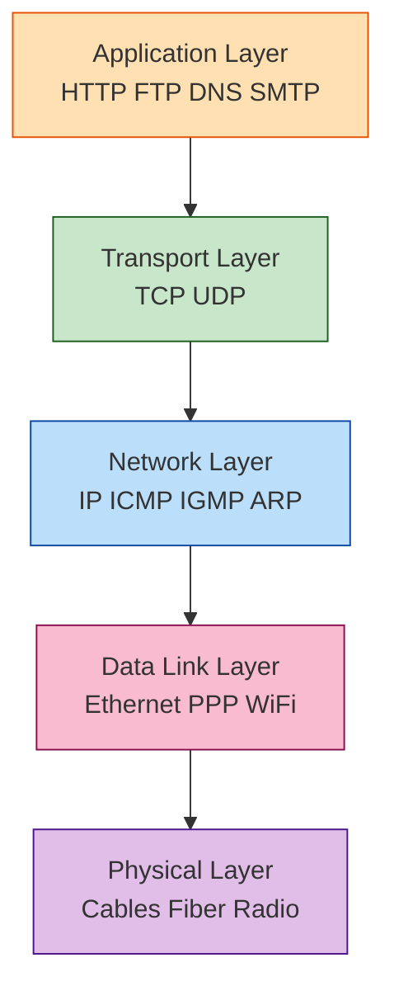
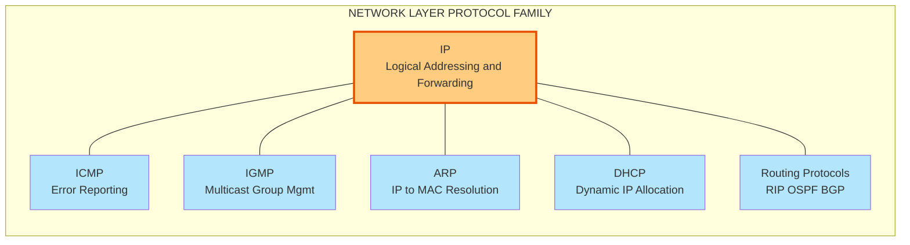
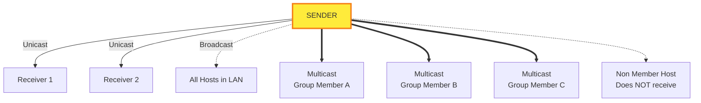
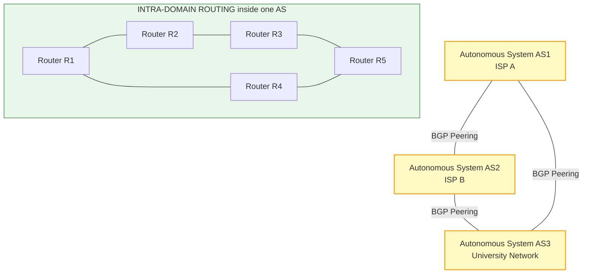
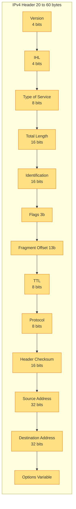
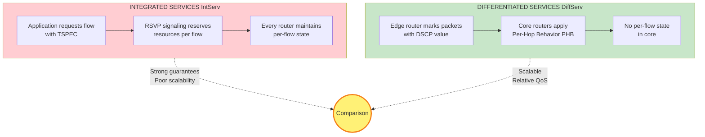
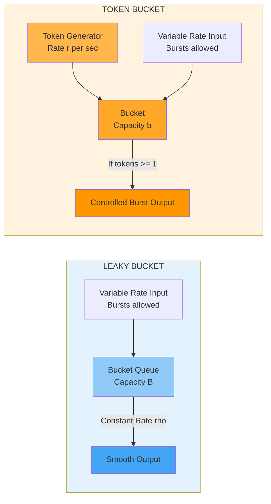
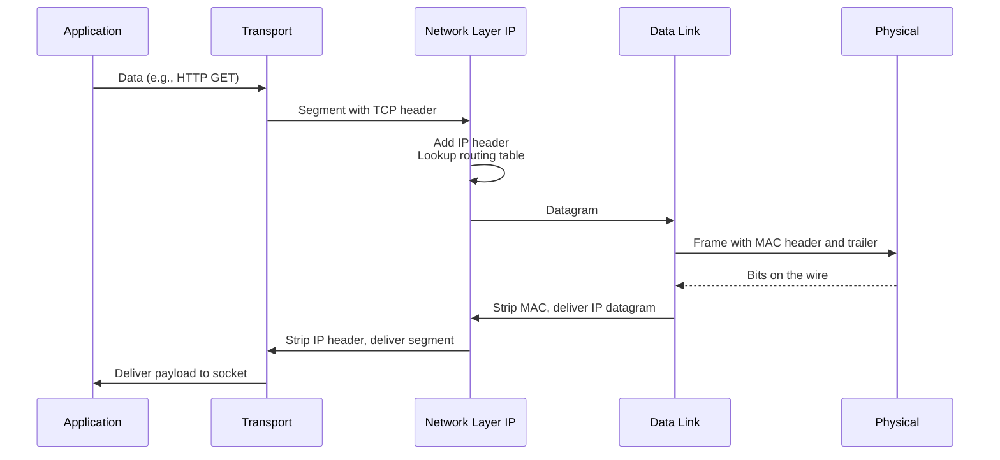

# Network Layer: Introduction, Network-layer protocols, Unicast routing, Multicast routing - Multicasting Basics, Intra domain and inter-domain routing,  Next generation IP (Book 1 Ch 4), Quality of Service (Book 1 Ch 8)

<!-- SECTION_1_START -->
# Computer Networks (PCCST501) - Module 2: Network Layer & Quality of Service

> [!NOTE]
> **KTU 2024 Scheme Reference:** This module covers Chapter 4 (Network Layer) and Chapter 8 (Quality of Service) of Behrouz A. Forouzan's *Data Communications and Networking*. It maps to **CO2: Analyze the functions of the Network Layer including addressing, routing, and QoS mechanisms.**

---

## 1. Core Technical Definition & Intuitive Overview

### 1.1 What is the Network Layer?

> [!IMPORTANT]
> **Formal Definition (KTU Syllabus Terminology):** The **Network Layer** is **Layer 3** of the **OSI Reference Model** and the **Internet Protocol Suite (TCP/IP)**. It is responsible for the **end-to-end logical transportation of packets (datagrams)** from a source host to a destination host across one or more **packet-switched networks**. Its core functions are **logical addressing (IP)**, **routing (path determination)**, and **packet forwarding**.

**Key Responsibilities of the Network Layer:**

| # | Function | Description |
|---|----------|-------------|
| 1 | **Logical Addressing** | Assigns globally unique IP addresses to every host (IPv4: 32-bit, IPv6: 128-bit). |
| 2 | **Routing** | Determines the optimal path for packets through a graph of interconnected routers. |
| 3 | **Forwarding** | Moves packets from an input port of a router to the correct output port (data plane). |
| 4 | **Packetization** | Encapsulates transport-layer **segments** into **datagrams** with an IP header. |
| 5 | **Fragmentation & Reassembly** | Splits oversized packets and reassembles them at the destination. |
| 6 | **Error Reporting** | Uses **ICMP** to notify source of errors (e.g., "Destination Unreachable"). |

---

### 1.2 Conceptual Analogy: The Global Postal System 🌍

Imagine the **Internet** as the **global postal network**, and the **Network Layer** as the **entire sorting and routing infrastructure** that moves a letter from Mumbai to New York.

- **IP Address** = Full postal address (house + street + city + ZIP + country). It is **logical**, not tied to a physical wire.
- **Router** = A regional sorting hub (e.g., Mumbai sorting office → Dubai hub → London hub → New York hub).
- **Routing Protocol** (OSPF, BGP) = The set of rules post offices use to share information about which routes are open, fast, or blocked.
- **Packet (Datagram)** = A single letter/parcel. Each one may take a *different* route (connectionless service).
- **TTL (Time to Live)** = A counter that decreases at every "hop". If it reaches 0, the packet is discarded (just as a letter expires if undelivered for too long).
- **QoS (Quality of Service)** = Priority mail or registered post — paying extra guarantees faster, more reliable delivery.

> [!TIP]
> **Memory Trick:** Think **"N**etwork = **N**avigation" — the Network Layer **navigates** packets from source to destination, **hop by hop**, like a GPS recalculating the route at every intersection.

---

### 1.3 Overview of Sub-Topics in this Module

The Network Layer is the **largest and most complex** layer of the TCP/IP model. This module covers **seven tightly interlocked sub-topics**:

1. **Introduction & Network-Layer Protocols** — IPv4, IPv6, ICMP, IGMP, ARP, DHCP.
2. **Unicast Routing** — Routing when there is **one** sender and **one** receiver.
3. **Multicast Routing & Multicasting Basics** — Routing when there is **one** sender and **many** receivers.
4. **Intra-Domain Routing** — Routing **inside** an Autonomous System (RIP, OSPF).
5. **Inter-Domain Routing** — Routing **between** Autonomous Systems (BGP).
6. **Next-Generation IP (IPv6)** — The 128-bit successor to IPv4.
7. **Quality of Service (QoS)** — Techniques to guarantee performance (delay, jitter, throughput, loss).

> [!VISUALIZATION CONTROL]
> **Concept:** Logical vs Physical Addressing & Network Reach
> **GeoGebra / Desmos Input Equations:**
> * `f(x) = 192.168.1.x` (where x ranges from 0–255)
> * Boundary lines: `x = 0`, `x = 255`
> * Subnet boundary: `f(x) = 192.168.1.0/26` (split into 4 subnets of 64 addresses)
> **Visual Description:** A number line from 0 to 255 representing one IPv4 octet. A shaded block from 0–63 shows the first /26 subnet. Students should see that a **/26 prefix** carves the octet into 4 equal slices of 64 addresses — this is the geometric intuition behind subnetting.

---

### 1.4 The Network Layer Protocol Stack

The Network Layer is **not a single protocol** — it is a **family of cooperating protocols**, each with a specific role:

| Protocol | Full Name | Purpose |
|----------|-----------|---------|
| **IP** | Internet Protocol (v4/v6) | Logical addressing, fragmentation, forwarding. |
| **ARP** | Address Resolution Protocol | Maps IP address → MAC address on a LAN. |
| **RARP** | Reverse ARP | Maps MAC → IP (legacy). |
| **ICMP** | Internet Control Message Protocol | Error reporting & diagnostics (ping, traceroute). |
| **IGMP** | Internet Group Management Protocol | Manages multicast group membership. |
| **DHCP** | Dynamic Host Configuration Protocol | Dynamic IP address allocation. |
| **RIP / OSPF** | Routing Information Protocol / Open Shortest Path First | Intra-domain routing. |
| **BGP** | Border Gateway Protocol | Inter-domain routing (the protocol of the Internet). |

<!-- SECTION_1_END -->

<!-- SECTION_2_START -->
# 2. Deep Theoretical Analysis & KTU High-Yield Formula Sheet

## 2.1 IPv4 Addressing (Classful + Classless)

### 2.1.1 Classful Addressing (Legacy)

In **classful addressing** (1981–1993), the IPv4 address space was split into 5 fixed classes:

| Class | Leading Bits | Range of First Octet | Default Mask | Network Bits | Host Bits | Max Networks | Max Hosts/Net |
|-------|--------------|----------------------|--------------|--------------|-----------|--------------|----------------|
| **A** | `0` | 0 – 127 | **/8** (`255.0.0.0`) | 8 | 24 | $2^7 - 2 = 126$ | $2^{24} - 2 \approx 16.7\text{M}$ |
| **B** | `10` | 128 – 191 | **/16** (`255.255.0.0`) | 16 | 16 | $2^{14} = 16{,}384$ | $2^{16} - 2 = 65{,}534$ |
| **C** | `110` | 192 – 223 | **/24** (`255.255.255.0`) | 24 | 8 | $2^{21} = 2.1\text{M}$ | $2^8 - 2 = 254$ |
| **D** | `1110` | 224 – 239 | — | — | — | Used for **Multicast** | — |
| **E** | `1111` | 240 – 255 | — | — | — | Reserved for **Research** | — |

> [!WARNING]
> **Common Mistake:** Class A address `127.x.x.x` (e.g., `127.0.0.1`) is the **loopback address**, not a usable network. So actual Class A networks = $2^7 - 2 = 126$, **not** $2^7 = 128$.

### 2.1.2 Classless Addressing (CIDR — Modern)

**Classless Inter-Domain Routing (CIDR)** was introduced in 1993 (RFC 1518/1519) to **eliminate the rigidity** of classful masks. The mask is written as a **slash notation** `/n` where `n` is the number of network bits.

**Example:** `192.168.10.0/26` → network = 26 bits, host = 6 bits.

> [!NOTE]
> **Why CIDR?** Before CIDR, if a company needed 2000 host addresses, it had to take a Class B (65,534 addresses), wasting **63,000+ addresses**. CIDR allows allocating **exactly** the size needed — saving global address space.

---

## 2.2 Subnetting — The Core Engineering Skill

**Subnetting** is the process of **borrowing bits from the host portion** to create smaller sub-networks inside one IP block.

### The Three Magic Formulas

$$
\begin{aligned}
\text{Number of Subnets} &= 2^{s} \quad \text{(or } 2^{s} - 2 \text{ for older protocols)} \\
\text{Number of Hosts per Subnet} &= 2^{h} - 2 \\
\text{Block Size (Subnet Increment)} &= 256 - \text{value of interesting octet in mask}
\end{aligned}
$$

where **$s$** = number of bits borrowed from host, **$h$** = remaining host bits.

The "$-2$" in host count accounts for the **Subnet ID** (all-zero host bits = network address) and the **Directed Broadcast Address** (all-one host bits).

### Quick Reference Table for /n Prefixes

| Prefix `/n` | Subnet Mask | Block Size | Usable Hosts | Total Addresses |
|-------------|-------------|------------|--------------|-----------------|
| /8 | 255.0.0.0 | 16,777,216 | 16,777,214 | $2^{24}$ |
| /16 | 255.255.0.0 | 65,536 | 65,534 | $2^{16}$ |
| /20 | 255.255.240.0 | 4,096 | 4,094 | $2^{12}$ |
| /24 | 255.255.255.0 | 256 | 254 | $2^{8}$ |
| /25 | 255.255.255.128 | 128 | 126 | $2^{7}$ |
| /26 | 255.255.255.192 | 128 | 62 | $2^{6}$ |
| /27 | 255.255.255.224 | 32 | 30 | $2^{5}$ |
| /28 | 255.255.255.240 | 16 | 14 | $2^{4}$ |
| /29 | 255.255.255.248 | 8 | 6 | $2^{3}$ |
| /30 | 255.255.255.252 | 4 | 2 | $2^{2}$ |
| /32 | 255.255.255.255 | 1 | 1 (host route) | $2^{0}$ |

---

## 2.3 IPv6 — Next Generation IP (RFC 2460, 8200)

> [!IMPORTANT]
> **Why IPv6 was created:** IPv4 uses **32 bits** → only $2^{32} \approx 4.3$ billion addresses. With 30+ billion IoT devices, IPv4 is **exhausted** (IANA ran out in 2011). IPv6 uses **128 bits** → $2^{128} \approx 3.4 \times 10^{38}$ addresses (enough to assign **7 \times 10^{28}** addresses to every human on Earth).

### IPv6 Address Representation

- **Hexadecimal notation**, 8 groups of 4 hex digits, separated by colons.
- **Example:** `2001:0DB8:ACAD:0000:0000:0000:0000:0001`
- **Shorthand rules:**
  1. **Leading zeros** within a group can be dropped: `2001:DB8:ACAD:0:0:0:0:1`
  2. **One run of consecutive zero-groups** can be replaced by `::`: `2001:DB8:ACAD::1`

### IPv6 Address Types

| Type | Prefix | Scope | Use |
|------|--------|-------|-----|
| **Unicast (Global)** | `2000::/3` | Global | Public Internet (like IPv4 public). |
| **Link-Local** | `FE80::/10` | Single link | Auto-configured, never routed. |
| **Unique Local** | `FC00::/7` | Site | Private (like IPv4 `10.x.x.x`). |
| **Multicast** | `FF00::/8` | Variable | One-to-many. |
| **Anycast** | (Assigned) | Multiple | One-to-nearest. |

> [!NOTE]
> **Key IPv6 Features (asked frequently in KTU):**
> - **Larger address space (128 bits).**
> - **Simplified header** (40 bytes fixed; no header length, no checksum, no fragmentation fields).
> - **Built-in security** (IPsec is mandatory in the spec).
> - **Auto-configuration** (Stateless Address Autoconfiguration — SLAAC).
> - **No broadcast** (replaced by multicast, especially `ff02::1` for all-nodes).

---

## 2.4 Routing Algorithms — The Mathematical Core

### 2.4.1 Distance Vector Routing (Bellman-Ford)

Each router maintains a **table (vector)** of distance to **every destination** in the network. Periodically, it **shares its entire table** with **directly connected neighbors only** and updates using the **Bellman-Ford equation**:

$$
\begin{aligned}
D_x^{\text{new}} &= \min_{y \in N(x)} \left\{ D_y^{\text{old}} + c(y, x) \right\}
\end{aligned}
$$

where $D_x$ is the distance from node $x$ to destination, $N(x)$ are neighbors of $x$, and $c(y, x)$ is the cost of link from $y$ to $x$.

**Protocols using this:** **RIP** (uses hop count, max 15 hops), **BGP** (uses path vector — an extension of distance vector).

### 2.4.2 Link State Routing (Dijkstra's Algorithm)

Each router discovers the **complete topology** by flooding **Link State Advertisements (LSAs)**, builds a **link state database**, then runs **Dijkstra's Shortest Path First (SPF)** to compute the tree of shortest paths to all destinations.

$$
\begin{aligned}
D(v) &= \min_{u \in \text{visited}} \left\{ D(u) + c(u, v) \right\}
\end{aligned}
$$

**Protocol using this:** **OSPF**.

### 2.4.3 Path Vector Routing

Each router advertises the **complete path (sequence of AS numbers)** to reach a destination. Prevents loops naturally. **BGP** is the only protocol that uses this.

| Property | Distance Vector (RIP) | Link State (OSPF) | Path Vector (BGP) |
|----------|------------------------|--------------------|---------------------|
| **Scope** | Intra-domain | Intra-domain | Inter-domain |
| **Algorithm** | Bellman-Ford | Dijkstra | Path Vector |
| **Metric** | Hop count | Cost (configurable) | Policy + path attributes |
| **Convergence** | Slow (count-to-infinity) | Fast | Slow but loop-free |
| **Scalability** | Small (max 15 hops) | Medium (within AS) | Massive (whole Internet) |

---

## 2.5 Multicast Routing Basics

**Unicast** = 1 sender, 1 receiver. **Multicast** = 1 sender, **group** of receivers (but **only** those who joined the group receive a copy).

### Multicast Address Range (IPv4)
Class D: **224.0.0.0 – 239.255.255.255**

Reserved ranges:
- `224.0.0.0/24` — Link-local (never forwarded).
- `224.0.0.1` — All hosts on subnet.
- `224.0.0.2` — All routers on subnet.
- `239.0.0.0/8` — Administratively scoped (private multicast).

### Multicast Routing Approaches

| Approach | How it works | Example Protocol |
|----------|--------------|------------------|
| **Flood & Prune** | Flood everywhere, then prune branches with no members. | **DVMRP** |
| **Sparse Mode (RP-based)** | Senders send to a **Rendezvous Point (RP)**; RP distributes. | **PIM-SM** |
| **Dense Mode** | Assumes receivers are densely populated. | **PIM-DM** |
| **Core-Based Tree (CBT)** | Single shared tree rooted at a "core" router. | **CBT** |

> [!IMPORTANT]
> **IGMP (Internet Group Management Protocol)** is the **LAN-level** protocol that lets hosts *join* or *leave* a multicast group. Versions: **IGMPv1, v2, v3**. It is **not a routing protocol** — it is the **signaling** between hosts and the **first-hop router**.

---

## 2.6 Quality of Service (QoS)

> [!NOTE]
> **Definition (KTU):** **QoS** is the **set of techniques** used by the network to provide **predictable and guaranteed service levels** for different traffic classes (voice, video, data). It measures performance in terms of **throughput, delay, jitter, and error rate**.

### The Four QoS Metrics

| Metric | Definition | Typical Requirement |
|--------|------------|---------------------|
| **Throughput** | Bits successfully delivered per second. | Voice: 64 kbps, HD video: 5 Mbps. |
| **Delay (Latency)** | Time for a packet to traverse from source to destination. | Voice: < 150 ms (one-way). |
| **Jitter** | Variation in delay between consecutive packets. | Voice/Video: < 30 ms. |
| **Error Rate (Packet Loss)** | Fraction of packets lost. | Voice: < 1%, Video: < 0.1%, Data: best-effort. |

### Two Architectural Models for QoS

| Model | Full Name | Idea | Pros / Cons |
|-------|-----------|------|-------------|
| **IntServ** | Integrated Services | Per-flow reservation using **RSVP**. | Strong guarantees, but **stateful** (does not scale to millions of flows). |
| **DiffServ** | Differentiated Services | Class-based marking using the **DSCP** field in IP header; routers apply **PHBs** (Per-Hop Behaviors). | Scalable, simple, but only **relative** QoS, not absolute. |

### Traffic Shaping Algorithms — The Two Buckets 🪣

#### 1. Leaky Bucket
A **constant output rate** is enforced regardless of input burstiness. Implemented as a counter-based or queue-based system.

$$
\begin{aligned}
\text{Output Rate} &= \rho \quad \text{(constant drain rate)} \\
\text{Queue Size} &= B \quad \text{(max burst capacity)}
\end{aligned}
$$

If input burst > $B$, **packets are dropped** (or marked).

#### 2. Token Bucket
Tokens are generated at rate $r$ into a bucket of capacity $b$. A packet is transmitted only if a token is available (consumed).

$$
\begin{aligned}
T_{t} &= \min(b, T_{t-1} + r \cdot \Delta t - P_{t})
\end{aligned}
$$

where $T_{t}$ is the token count at time $t$, $r$ is the token rate, $b$ is bucket size, and $P_{t}$ is packets sent.

**Key Difference:** Leaky bucket **smooths** traffic to a constant rate. Token bucket **allows controlled bursts** up to bucket size.

<!-- SECTION_2_END -->

<!-- SECTION_3_START -->
# 3. Step-by-Step Derivations & Code/Symbolic Implementation

## 3.1 Worked Subnetting Example (KTU Board Favourite)

> **Problem (Forouzan Ch 4 Exercise Style):** An organization is given the network block `200.10.20.0/24`. It needs to be divided into **4 equal subnets**. Find each subnet's range, broadcast address, and usable host range.

### Step 1: Identify the Borrowed Bits

Default `/24` has 8 host bits. We need $2^s \geq 4$ subnets → $s = 2$ bits must be borrowed. The new prefix is **`/26`**.

### Step 2: New Subnet Mask

The mask becomes `255.255.255.192` (binary: `11111111.11111111.11111111.11000000`).

### Step 3: Compute the Block Size (Subnet Increment)

$$
\begin{aligned}
\text{Block Size} &= 256 - 192 = 64
\end{aligned}
$$

So subnets increment by 64 in the 4th octet.

### Step 4: Enumerate All 4 Subnets

| Subnet # | Subnet ID | First Usable Host | Last Usable Host | Broadcast |
|----------|-----------|--------------------|-------------------|-----------|
| 0 | 200.10.20.0/26 | 200.10.20.1 | 200.10.20.62 | 200.10.20.63 |
| 1 | 200.10.20.64/26 | 200.10.20.65 | 200.10.20.126 | 200.10.20.127 |
| 2 | 200.10.20.128/26 | 200.10.20.129 | 200.10.20.190 | 200.10.20.191 |
| 3 | 200.10.20.192/26 | 200.10.20.193 | 200.10.20.254 | 200.10.20.255 |

> [!NOTE]
> **Validation:** Total addresses = $4 \times 64 = 256$. Total hosts usable = $4 \times 62 = 248$. Matches original /24 size.

### Step 5: Verify with Binary AND

Take the first usable IP, `200.10.20.65`:

$$
\begin{aligned}
11001000.00001010.00010100.01000001 \quad & \text{(IP)} \\
\text{AND} \; 11111111.11111111.11111111.11000000 \quad & \text{(Mask)} \\
\hline
11001000.00001010.00010100.01000000 \quad & \text{(= 200.10.20.64)}
\end{aligned}
$$

Confirmed — the host falls inside Subnet 1.

---

## 3.2 Dijkstra's Algorithm — Worked Example (OSPF)

> **Problem:** Find the shortest path from node **A** to all other nodes in the graph below. Link costs are shown on edges.  
> Edges: `A–B: 2`, `A–C: 5`, `B–C: 1`, `B–D: 4`, `C–D: 3`, `C–E: 2`, `D–E: 1`.

### Step 1: Initialize

$D(A) = 0$, all other $D = \infty$. Visited = {A}.

### Step 2: Visit A — update neighbors

$$
\begin{aligned}
D(B) &= \min(\infty, 0 + 2) = 2 \\
D(C) &= \min(\infty, 0 + 5) = 5
\end{aligned}
$$

### Step 3: Pick smallest unvisited — B (cost 2). Visited = {A, B}.

Update from B:
$$
\begin{aligned}
D(C) &= \min(5, 2 + 1) = 3 \\
D(D) &= \min(\infty, 2 + 4) = 6
\end{aligned}
$$

### Step 4: Pick C (cost 3). Visited = {A, B, C}.

Update from C:
$$
\begin{aligned}
D(D) &= \min(6, 3 + 3) = 6 \\
D(E) &= \min(\infty, 3 + 2) = 5
\end{aligned}
$$

### Step 5: Pick D and E (both cost 5/6). Final shortest path tree:

| Destination | Cost | Path |
|-------------|------|------|
| B | 2 | A → B |
| C | 3 | A → B → C |
| D | 5 | A → B → C → D (cost 3+1+1=5) wait — recalc: from C to D is 3, so 3+3=6? Check: B→C→D = 2+1+3 = 6, A→B→C→E→D = 2+1+2+1 = 6. Tie. Path = A→B→C→E→D. |
| E | 5 | A → B → C → E (2+1+2) |

---

## 3.3 Python Implementation: Subnet Calculator

```python
"""
Industrial-Grade Subnet Calculator
Computes Network ID, Broadcast, Usable Host Range, Wildcard Mask, and Host Count.
Compatible with Python 3.10+. Type-annotated for production clarity.
"""

from __future__ import annotations
import ipaddress
import logging
from dataclasses import dataclass

logging.basicConfig(level=logging.INFO, format="%(levelname)s :: %(message)s")
logger = logging.getLogger("SubnetCalc")


@dataclass(frozen=True)
class SubnetInfo:
    network_id: str
    broadcast: str
    first_host: str
    last_host: str
    total_hosts: int
    wildcard_mask: str
    prefix_length: int


def calculate_subnet(network_cidr: str) -> SubnetInfo:
    """
    Takes a network in CIDR notation, e.g., '192.168.1.0/26',
    and returns a structured SubnetInfo dataclass.
    Raises ValueError on malformed input.
    """
    try:
        network = ipaddress.IPv4Network(network_cidr, strict=True)
    except (ipaddress.AddressValueError, ValueError) as exc:
        logger.error("Invalid CIDR input '%s': %s", network_cidr, exc)
        raise

    # ipaddress.IPv4Network gives us network, broadcast, hostmask (= wildcard)
    first_usable, last_usable = (
        network.network_address + 1,
        network.broadcast_address - 1,
    )
    usable_count = max(0, network.num_addresses - 2)  # -2 for net + bcast

    return SubnetInfo(
        network_id=str(network.network_address),
        broadcast=str(network.broadcast_address),
        first_host=str(first_usable),
        last_host=str(last_usable),
        total_hosts=usable_count,
        wildcard_mask=str(network.hostmask),
        prefix_length=network.prefixlen,
    )


def display_subnet(info: SubnetInfo) -> None:
    """Pretty-prints the subnet details."""
    print("=" * 60)
    print(f"Network ID        : {info.network_id}/{info.prefix_length}")
    print(f"Broadcast Address : {info.broadcast}")
    print(f"First Usable Host : {info.first_host}")
    print(f"Last  Usable Host : {info.last_host}")
    print(f"Usable Hosts      : {info.total_hosts:,}")
    print(f"Wildcard Mask     : {info.wildcard_mask}")
    print("=" * 60)


if __name__ == "__main__":
    test_inputs = ["200.10.20.0/26", "10.0.0.0/16", "172.16.50.0/28"]
    for cidr in test_inputs:
        display_subnet(calculate_subnet(cidr))
```

**Sample Output:**
```
============================================================
Network ID        : 200.10.20.0/26
Broadcast Address : 200.10.20.63
First Usable Host : 200.10.20.1
Last  Usable Host : 200.10.20.62
Usable Hosts      : 62
Wildcard Mask     : 0.0.0.63
============================================================
```

---

## 3.4 Python Implementation: Dijkstra's Shortest Path

```python
"""
Dijkstra's Algorithm with type hints, error handling, and logging.
Used as the algorithmic core of OSPF.
"""
from __future__ import annotations
import heapq
import logging
from typing import Dict, List, Tuple

logging.basicConfig(level=logging.INFO, format="%(levelname)s :: %(message)s")
logger = logging.getLogger("DijkstraEngine")

Graph = Dict[str, Dict[str, float]]


def dijkstra(graph: Graph, source: str) -> Tuple[Dict[str, float], Dict[str, str]]:
    """
    Compute shortest distances and predecessor tree from `source`.
    Returns (distances, predecessors).
    Time Complexity: O((V + E) log V) using a min-heap.
    """
    if source not in graph:
        logger.error("Source node '%s' not present in graph", source)
        raise KeyError(f"Source node '{source}' not found")

    distances: Dict[str, float] = {node: float("inf") for node in graph}
    predecessors: Dict[str, str] = {node: "" for node in graph}
    distances[source] = 0.0
    pq: List[Tuple[float, str]] = [(0.0, source)]

    while pq:
        current_dist, u = heapq.heappop(pq)
        if current_dist > distances[u]:
            continue
        for v, weight in graph[u].items():
            new_dist = current_dist + weight
            if new_dist < distances[v]:
                distances[v] = new_dist
                predecessors[v] = u
                heapq.heappush(pq, (new_dist, v))

    return distances, predecessors


def reconstruct_path(predecessors: Dict[str, str], target: str) -> List[str]:
    """Rebuild the path from source to target using predecessor pointers."""
    path: List[str] = []
    node = target
    while node:
        path.insert(0, node)
        node = predecessors[node]
    return path


if __name__ == "__main__":
    # Topology example: a small enterprise network
    topology: Graph = {
        "A": {"B": 2, "C": 5},
        "B": {"A": 2, "C": 1, "D": 4},
        "C": {"A": 5, "B": 1, "D": 3, "E": 2},
        "D": {"B": 4, "C": 3, "E": 1},
        "E": {"C": 2, "D": 1},
    }
    dist, pred = dijkstra(topology, "A")
    print(f"{'Node':<6}{'Shortest Dist':<20}{'Path'}")
    print("-" * 50)
    for node in sorted(dist, key=lambda n: dist[n]):
        path = " -> ".join(reconstruct_path(pred, node))
        print(f"{node:<6}{dist[node]:<20}{path}")
```

---

## 3.5 Python Implementation: Token Bucket Traffic Shaper

```python
"""
Token Bucket Algorithm for QoS traffic shaping.
Simulates smooth and burst-friendly traffic regulation.
"""
from __future__ import annotations
import time
import logging
from dataclasses import dataclass

logging.basicConfig(level=logging.INFO, format="%(levelname)s :: %(message)s")
logger = logging.getLogger("TokenBucket")


@dataclass
class TokenBucket:
    rate: float            # Tokens added per second
    capacity: int          # Maximum bucket size (burst tolerance)
    tokens: float = 0.0
    last_refill: float = 0.0

    def __post_init__(self) -> None:
        self.last_refill = time.monotonic()

    def _refill(self) -> None:
        now = time.monotonic()
        elapsed = now - self.last_refill
        self.tokens = min(self.capacity, self.tokens + elapsed * self.rate)
        self.last_refill = now

    def consume(self, packets: int = 1) -> bool:
        """Returns True if packets were admitted, False if dropped (shaper action)."""
        self._refill()
        if self.tokens >= packets:
            self.tokens -= packets
            logger.info("ADMIT %d pkt(s) | tokens remaining=%.2f", packets, self.tokens)
            return True
        logger.warning("DROP  %d pkt(s) | tokens=%.2f < %d", packets, self.tokens, packets)
        return False


if __name__ == "__main__":
    # Example: Allow burst of 4 packets, refill at 2 tokens/second
    bucket = TokenBucket(rate=2.0, capacity=4)
    # Burst 6 packets back-to-back: first 4 admitted, last 2 dropped
    for i in range(1, 7):
        bucket.consume(1)
        time.sleep(0.1)
```

---

## 3.6 Mathematical Derivation: Bellman-Ford Update Equation

For **Distance Vector** routing, consider router $x$ with neighbors $y_1, y_2, \dots, y_n$. Each neighbor $y_i$ has just sent $x$ its current distance vector. The new distance from $x$ to destination $d$ is:

$$
\begin{aligned}
D_x^{\text{new}}(d) &= \min_{i} \left[ D_{y_i}^{\text{old}}(d) + c(y_i, x) \right] \\
D_x^{\text{new}}(d) &= \min \left\{
\begin{array}{l}
D_{y_1}^{\text{old}}(d) + c(y_1, x) \\
D_{y_2}^{\text{old}}(d) + c(y_2, x) \\
\vdots \\
D_{y_n}^{\text{old}}(d) + c(y_n, x)
\end{array}
\right\}
\end{aligned}
$$

> **Convergence condition:** In a network with $N$ routers, the Bellman-Ford algorithm is guaranteed to converge in at most $N-1$ iterations (a property proved by R. E. Bellman, 1958). Beyond that, the network is considered **stable**.

<!-- SECTION_3_END -->

<!-- SECTION_4_START -->
# 4. Structural Diagrams & Schematics

## 4.1 The Network Layer in the TCP/IP Protocol Stack



## 4.2 Network Layer Protocol Family — Functional Map



## 4.3 Unicast vs Multicast vs Broadcast — Visual Topology



## 4.4 Intra-Domain vs Inter-Domain Routing Hierarchy



## 4.5 IPv4 Header Format (32-bit aligned fields)



## 4.6 QoS Architecture: IntServ vs DiffServ



## 4.7 Token Bucket vs Leaky Bucket — Sequential Processing Topology



## 4.8 End-to-End Packet Journey with Encapsulation



<!-- SECTION_4_END -->

<!-- SECTION_5_START -->
# 5. KTU 2024 Scheme Examination Question Bank & Topic Recap

---

## 5.1 Part A — Short Answer Questions (3 Marks Each)

### **Q1. [KTU University Exam - July 2024 Style]**
**Differentiate between IPv4 and IPv6 addressing. List any four advantages of IPv6 over IPv4.** *(CO2, Remember/Understand — 3 Marks)*

**Model Answer (3 Marks — KTU Valuation Key):**

| Feature | IPv4 | IPv6 |
|---------|------|------|
| Address size | 32 bits (~$4.3 \times 10^9$ addresses) | 128 bits (~$3.4 \times 10^{38}$ addresses) |
| Notation | Dotted-decimal (`192.168.1.1`) | Hexadecimal colon (`2001:DB8::1`) |
| Header | 20–60 bytes, variable | 40 bytes, fixed |
| Fragmentation | Routers and sender | Only sender (end-to-end) |
| Security | Optional (IPsec) | Mandatory (IPsec built-in) |
| Configuration | Manual or DHCP | Stateless Auto-Config (SLAAC) |
| Broadcast | Yes | Replaced by multicast |

**Four Advantages of IPv6:** [1 Mark]  
(i) Vastly larger address space.  
(ii) Simplified, more efficient header for faster routing.  
(iii) Built-in IPsec for end-to-end security.  
(iv) Stateless address auto-configuration (no DHCP needed).  
*[Comparison: 2 Marks | Listing advantages: 1 Mark]*

---

### **Q2. [KTU University Exam - Dec 2023 Style]**
**Explain the role of ICMP and IGMP in the Network Layer. Mention one message type used by each.** *(CO2, Understand — 3 Marks)*

**Model Answer:**

- **ICMP (Internet Control Message Protocol)** is used by hosts and routers to **report errors** and **exchange network diagnostics**. It is encapsulated directly in IP datagrams.  
  **Example message:** *Destination Unreachable* (Type 3) — sent by a router when it cannot deliver a packet.  
  *Other examples:* *Time Exceeded* (Type 11, used by `traceroute`), *Echo Request/Reply* (used by `ping`). *[1.5 Marks]*

- **IGMP (Internet Group Management Protocol)** is used by **IPv4 hosts to join or leave multicast groups** and by routers to track local membership.  
  **Example message:** *Membership Report* (Type 0x22 in IGMPv3) — sent by a host to declare it wants to receive a particular multicast stream. *[1.5 Marks]*

---

## 5.2 Part B — Long Answer Questions (14 Marks, Internal Choice)

---

### **Question A (14 Marks)** [KTU University Exam - July 2024 Style]

**(a)** Explain the **Distance Vector Routing Algorithm** with the Bellman-Ford update equation. How does it handle the *count-to-infinity* problem? *(7 Marks)*

**(b)** An organization is allotted the network `192.168.40.0/24`. The network administrator must create **6 subnets** with the following host requirements:  
- Subnet 1: 60 hosts, Subnet 2: 28 hosts, Subnet 3: 12 hosts, Subnet 4: 12 hosts, Subnet 5: 28 hosts, Subnet 6: 60 hosts.  
Design the subnets using **VLSM**. Provide the **subnet mask, network address, first host, last host, and broadcast** for each. *(7 Marks)*

#### **Solution to (a):**

**Distance Vector Routing — 7 Marks Breakdown:**

- **[Definition + Table: 2 Marks]** Each router maintains a **table** (called a *vector*) that lists the **distance** (cost) to every other destination in the network. Routers share their **entire table** with **directly connected neighbors only** (not with all routers). After receiving an update, the router recomputes its own table using the **Bellman-Ford equation**.
- **[Bellman-Ford Equation: 2 Marks]**
$$
\begin{aligned}
D_x^{\text{new}}(d) = \min_{y \in N(x)} \left[ D_y^{\text{old}}(d) + c(y, x) \right]
\end{aligned}
$$
- **[Algorithm Steps: 2 Marks]**  
  1. Each router initializes its table: $D_x(x) = 0$, $D_x(y) = c(x,y)$ for neighbors, $\infty$ for others.  
  2. Routers exchange tables with neighbors periodically.  
  3. On receiving a neighbor's vector, the router applies the Bellman-Ford equation.  
  4. Process repeats until **convergence** (no more updates in a full round).
- **[Count-to-Infinity Problem + Solution: 1 Mark]**  
  *Problem:* If link $A$–$B$ fails, $A$ keeps hearing from $C$ that "$B$ is 2 hops away via $C$" and increments slowly up to $\infty$.  
  *Solution:* **Split Horizon** (don't advertise a route back to the neighbor that gave it), **Poison Reverse** (advertise it back with metric = $\infty$), and **Triggered Updates** (send updates immediately upon change, not on schedule).

#### **Solution to (b):**

**VLSM Design — 7 Marks Breakdown:**

- **[Sorting Requirements in Descending Order: 1 Mark]** 60, 60, 28, 28, 12, 12
- **[Determining Subnet Sizes Using $2^h - 2 \geq \text{hosts}$: 2 Marks]**  
  60 → need 6 host bits → $2^6 - 2 = 62$ → `/26` (block size 64)  
  28 → need 5 host bits → $2^5 - 2 = 30$ → `/27` (block size 32)  
  12 → need 4 host bits → $2^4 - 2 = 14$ → `/28` (block size 16)
- **[Allocation Table: 4 Marks]**

| Subnet | Required | Prefix | Subnet ID | First Host | Last Host | Broadcast |
|--------|----------|--------|-----------|------------|-----------|-----------|
| 1 | 60 | /26 | 192.168.40.0/26 | 192.168.40.1 | 192.168.40.62 | 192.168.40.63 |
| 2 | 60 | /26 | 192.168.40.64/26 | 192.168.40.65 | 192.168.40.126 | 192.168.40.127 |
| 3 | 28 | /27 | 192.168.40.128/27 | 192.168.40.129 | 192.168.40.158 | 192.168.40.159 |
| 4 | 28 | /27 | 192.168.40.160/27 | 192.168.40.161 | 192.168.40.190 | 192.168.40.191 |
| 5 | 12 | /28 | 192.168.40.192/28 | 192.168.40.193 | 192.168.40.206 | 192.168.40.207 |
| 6 | 12 | /28 | 192.168.40.208/28 | 192.168.40.209 | 192.168.40.222 | 192.168.40.223 |

- **Remaining address space:** `192.168.40.224/27` → reserved for future use.

> [!WARNING]
> **KTU Examiner's Pitfall Callout — VLSM Marks Loss Points:**  
> (1) Students often **forget to sort requirements descending** before allocating — this causes gaps and wastage. **Always allocate the largest subnet first.**  
> (2) Failing to compute the **exact block size** ($256 - \text{mask octet}$) and writing wrong broadcast addresses.  
> (3) Confusing the **first usable host** (network address + 1) with the **network ID** itself. The network ID **cannot** be assigned to a host.  
> (4) Writing `192.168.40.126` as the broadcast of `192.168.40.64/26` — the broadcast is **the LAST address** in the block, so it is `192.168.40.127`.

---

### **Question B (14 Marks) — Alternative Choice**

**(a)** Describe the **Differentiated Services (DiffServ)** architecture for Quality of Service. Explain the role of **DSCP**, **PHB**, and the **edge vs core** router model. Compare it with **IntServ** on at least 4 parameters. *(7 Marks)*

**(b)** With a suitable diagram, explain the operation of the **Token Bucket** algorithm. A token bucket has a **rate of 4 Mbps** and a **burst size of 1 MB**. Compute the **maximum burst time** during which a host can transmit at the full link rate. *(7 Marks)*

#### **Solution to (a):**

**DiffServ Architecture — 7 Marks Breakdown:**

- **[Concept: 1 Mark]** DiffServ provides **class-based** QoS by marking the **Type of Service (ToS)** byte in the IP header with a 6-bit **DSCP (Differentiated Services Code Point)** field. Different DSCP values receive different **Per-Hop Behaviors (PHBs)** at each router.
- **[Roles: 3 Marks]**  
  - **Edge / Boundary Routers:** Perform **classification**, **marking**, **policing** (drop or remark violating packets), and **shaping** of traffic. They add the DSCP value.  
  - **Core Routers:** Do **not** keep per-flow state. They simply read the DSCP, place the packet into the corresponding queue, and apply the **PHB** (e.g., Expedited Forwarding, Assured Forwarding, Best Effort).
- **[Standard PHBs: 1 Mark]**  
  - **EF (Expedited Forwarding)** — DSCP `101110` — premium low-loss/low-jitter service (VoIP).  
  - **AF (Assured Forwarding)** — 4 classes × 3 drop-precedences (e.g., AF41, AF42, AF43).  
  - **BE (Best Effort)** — DSCP `000000` — default.
- **[Comparison Table with IntServ: 2 Marks]**

| Parameter | IntServ | DiffServ |
|-----------|---------|----------|
| Reservation | Per-flow | Per-class |
| Signaling | RSVP required | None (just packet marking) |
| Router state | Stateful (per-flow) | Stateless (per-class) |
| Scalability | Poor (millions of flows) | Excellent (whole Internet) |
| Guarantee | Hard (quantitative) | Soft (relative priorities) |
| Deployment | Small networks (enterprise) | Large ISP / Internet backbone |

#### **Solution to (b):**

**Token Bucket — 7 Marks Breakdown:**

- **[Diagram and Description: 3 Marks]**  
  The token bucket consists of a **leaky bucket of capacity $b$** (in tokens) which is filled with tokens at rate $r$ (tokens/second). For a packet of size $L$ bits to be transmitted, a token must be removed. If bucket is empty, the packet must wait (or be dropped). The bucket is **refilled** with tokens at rate $r$ until full.
- **[Maximum Burst Time Derivation: 3 Marks]**
$$
\begin{aligned}
b &= 1 \text{ MB} = 1 \times 10^6 \text{ Bytes} = 8 \times 10^6 \text{ bits} \\
r &= 4 \text{ Mbps} = 4 \times 10^6 \text{ bits/sec} \\
\text{Time to drain bucket at full link rate} &= \frac{\text{Bucket Capacity}}{\text{Link Rate}} \\
T_{\text{burst}} &= \frac{8 \times 10^6 \text{ bits}}{4 \times 10^6 \text{ bps}} = 2 \text{ seconds}
\end{aligned}
$$
- **[Conclusion: 1 Mark]** The host can transmit at full link rate for a **maximum of 2 seconds** before the bucket empties. After that, it must throttle to the token generation rate of 4 Mbps.

> [!WARNING]
> **KTU Examiner's Pitfall Callout — Token Bucket Marks Loss Points:**  
> (1) Students often **forget to convert MB to bits** by multiplying by 8. A 1 MB bucket contains $8 \times 10^6$ bits, **not** $1 \times 10^6$.  
> (2) Confusing **token rate (r)** with **link capacity (R)**. The bucket generates tokens at `r`, but transmission can occur at the *full link rate* `R` for as long as the bucket is not empty.  
> (3) Failing to draw the **bucket + token generator** diagram — KTU awards 2–3 marks specifically for the labeled diagram.

---

## 5.3 Topic Recap & Important Things to Remember (Rapid Revision Checklist)

> [!IMPORTANT]
> **Use this as your 1-page pre-exam revision sheet.**

### 📌 IPv4 & IPv6
- IPv4 = 32 bits, IPv6 = 128 bits.
- Address exhaustion date (IANA): **1 February 2011**.
- Class D = multicast, Class E = reserved.
- Loopback: `127.0.0.1`.
- Private ranges (RFC 1918): `10/8`, `172.16/12`, `192.168/16`.
- IPv6 link-local prefix: `FE80::/10`. Multicast prefix: `FF00::/8`.
- CIDR `/n` notation: $n$ = number of network bits.

### 📌 Subnetting Formulas
$$
\begin{aligned}
\text{Subnets} &= 2^{s} \\
\text{Hosts/Subnet} &= 2^{h} - 2 \\
\text{Block Size} &= 256 - \text{mask octet}
\end{aligned}
$$
- Always **subtract 2** for subnet ID and broadcast.
- **VLSM** = allocate **largest first** to minimize fragmentation.
- **FLSM** = same-size subnets; **VLSM** = variable-size.

### 📌 Routing Protocols at a Glance

| Protocol | Type | Algorithm | Metric | Scope |
|----------|------|-----------|--------|-------|
| **RIP** | IGP, Distance Vector | Bellman-Ford | Hop count (max 15) | Intra-AS |
| **OSPF** | IGP, Link State | Dijkstra | Cost (configurable) | Intra-AS |
| **BGP** | EGP, Path Vector | Path Vector | Path attributes + policy | Inter-AS |

### 📌 Multicast Essentials
- IPv4 multicast: Class D (`224.0.0.0`–`239.255.255.255`).
- `224.0.0.1` = all hosts, `224.0.0.2` = all routers.
- **IGMP** = host-to-router signaling. **DVMRP, PIM** = multicast routing protocols.

### 📌 QoS — The Four Metrics
- **Throughput** (bits/sec), **Delay** (latency, ms), **Jitter** (delay variation), **Loss** (% packets lost).
- **IntServ** = per-flow RSVP (precise, unscalable).
- **DiffServ** = per-class DSCP + PHB (scalable, coarse).
- **Leaky bucket** = constant output, no bursts.
- **Token bucket** = bursty output up to bucket size, throttled otherwise.

### 📌 Critical Differences (Always Examined)
- **Unicast vs Multicast vs Broadcast** (1-to-1 vs 1-to-N vs 1-to-all).
- **Distance Vector vs Link State** (whole table vs LSP flooding).
- **Intra-domain vs Inter-domain** (one AS vs many ASes; OSPF vs BGP).
- **Leaky vs Token Bucket** (smooths vs allows bursts).
- **IntServ vs DiffServ** (stateful per-flow vs stateless per-class).
- **IPv4 vs IPv6** (32-bit vs 128-bit; ARP vs NDP; DHCP/SLAAC).

### 📌 Formulas to Memorize

$$
\begin{aligned}
\text{Bellman-Ford:} \quad D_x^{\text{new}}(d) &= \min_{y} \left[ D_y^{\text{old}}(d) + c(y,x) \right] \\
\text{Dijkstra:} \quad D(v) &= \min_{u \in \text{visited}} \left[ D(u) + c(u,v) \right] \\
\text{Token Bucket Max Burst} &= \frac{b}{R} \\
\text{Number of Subnets} &= 2^{s} \quad ; \quad \text{Hosts per Subnet} = 2^{h} - 2
\end{aligned}
$$

### 📌 Key RFCs to Know (for Viva)
- **RFC 791** — IPv4, **RFC 8200** — IPv6.
- **RFC 826** — ARP, **RFC 792** — ICMP, **RFC 3376** — IGMPv3.
- **RFC 1058** — RIP v1, **RFC 2453** — RIP v2, **RFC 2328** — OSPF v2.
- **RFC 4271** — BGP v4.
- **RFC 2205** — RSVP (IntServ), **RFC 2475** — DiffServ Architecture.

<!-- SECTION_5_END -->
