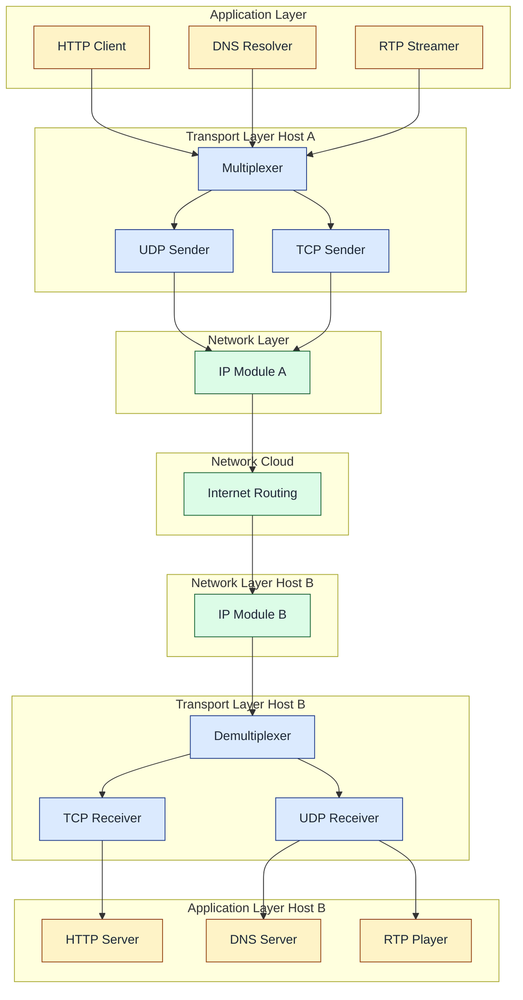
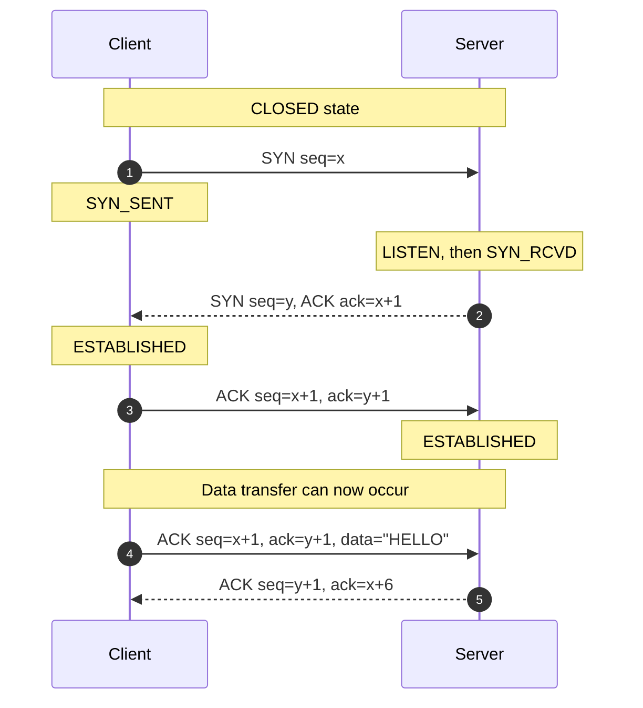
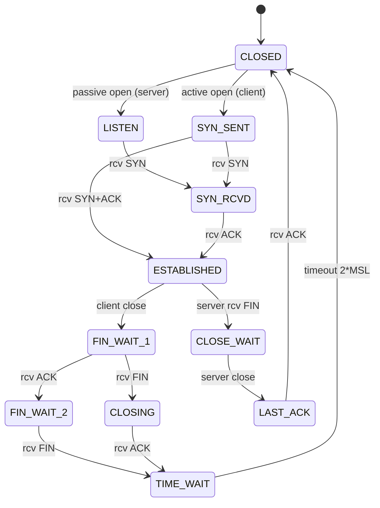
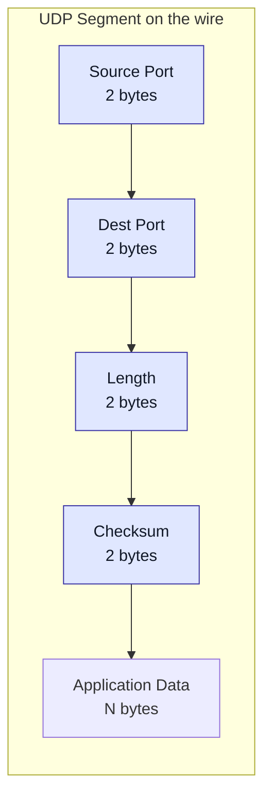
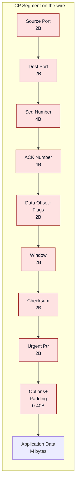

# Transport Layer: Services, Protocols, UDP, TCP  (Book 1 Ch 3).

<!-- SECTION_1_START -->

# Transport Layer — Services, UDP \& TCP (Module 2)

## 1.1 Formal Definition (KTU 2024 Syllabus Terminology)

> [!IMPORTANT]
> **Transport Layer (OSI Layer 4 / Internet TCP-IP Layer 3):**
> The transport layer provides **logical, end-to-end communication** between **application processes** running on different hosts. It is the lowest layer that operates **host-to-host** at the message boundary, sitting directly above the network (IP) layer.

The Internet transport layer offers two principal protocols:

| Protocol | Acronym | Nature | Service Profile |
|---|---|---|---|
| User Datagram Protocol | **UDP** | Connectionless, unreliable, best-effort | Fast, low overhead, no guarantees |
| Transmission Control Protocol | **TCP** | Connection-oriented, reliable | Byte-stream, in-order, congestion-controlled |

**Sockets** are the conceptual endpoints of transport-layer communication. A socket is identified by the tuple:
$$\text{Socket} = (\text{Source IP},\ \text{Source Port},\ \text{Dest IP},\ \text{Dest Port})$$

> [!NOTE]
> **KTU Highlight:** The transport layer does NOT deliver data between *hosts* (that's the network layer's job with IP). It delivers data between **processes**. This distinction is repeatedly asked in board exams.

## 1.2 Real-World Analogy — The 12 Kids, 12 Letters Problem (Kurose-Ross)

Imagine **12 children** in a household (Alice). Each child writes a letter to their corresponding pen-pal in the Bill household. Alice puts all 12 letters in a single envelope addressed to Bill. Bill opens the envelope and must hand-deliver each letter to the right child.

| Kurose-Ross Element | Internet Mapping |
|---|---|
| 12 children in Alice's house | 12 processes on Host A |
| 12 children in Bill's house | 12 processes on Host B |
| Envelope (single delivery) | Single IP datagram (network layer) |
| Letter inside envelope | Transport segment (UDP/TCP) |
| Name on the letter | **Port number** |
| Hand-delivering the letter | **Demultiplexing** at the receiver |
| Putting the right letter in the envelope | **Multiplexing** at the sender |

## 1.3 Multiplexing \& Demultiplexing — Intuition

- **Multiplexing at sender:** Gather data from multiple sockets, encapsulate each with a header containing the destination port.
- **Demultiplexing at receiver:** Inspect the destination port in the arriving segment and deliver the payload to the correct socket.

Two flavors exist:
1. **Connectionless demultiplexing (UDP)** — Demux key: `(Dest IP, Dest Port)`.
2. **Connection-oriented demultiplexing (TCP)** — Demux key: `(Source IP, Source Port, Dest IP, Dest Port)` (4-tuple).

> [!VISUALIZATION CONTROL]
> **Concept:** Transport Layer Multiplexing-Demultiplexing along a timeline
> **Desmos / GeoGebra Input (conceptual scatter points):**
> * $P_1 = (0,\ 5001)$ — HTTP process
> * $P_2 = (1,\ 5002)$ — DNS process
> * $P_3 = (2,\ 5003)$ — RTP process
> * $\text{Firewall Line: } y = 1024$ — Well-known port boundary
> **Visual Description:** Plot sockets as scatter points on a time-process plane. Observe how segments with different **port** y-values fan-out at the receiver (demultiplexing) and funnel-in at the sender (multiplexing), all sharing the same network-layer (IP) channel.

## 1.4 Why Two Protocols?

| Requirement | Best Fit |
|---|---|
| Tolerate loss, need speed, simple request/response | **UDP** (DNS, VoIP, video streaming) |
| Need guaranteed, in-order delivery | **TCP** (HTTP, FTP, Email, SSH) |

> [!TIP]
> Memory trick: **UDP = "Unreliable Datagram Protocol"** (loosely), **TCP = "Transfer Control Protocol"**.

---

<!-- SECTION_1_END -->

<!-- SECTION_2_START -->

# 2. Deep Theoretical Analysis \& KTU High-Yield Formula Sheet

## 2.1 Multiplexing / Demultiplexing — How It Actually Works

When a host receives an IP datagram:
1. The IP layer extracts the payload (the segment) and passes it to the transport layer.
2. The transport layer inspects the header fields.
3. The segment is delivered to the socket bound to the matching 2-tuple (UDP) or 4-tuple (TCP).

> **Example:** A server running both HTTP (port 80) and HTTPS (port 443) on the same IP. Two TCP sockets exist, distinguished only by their **destination port** in incoming segments. The OS kernel keeps an internal **socket descriptor table** to route each segment.

## 2.2 UDP — The "No-Frills" Protocol

### 2.2.1 Why Use UDP at All?

- **No connection setup latency** (TCP's three-way handshake adds 1 RTT minimum).
- **No connection state** at sender or receiver → can support more active clients.
- **Small header overhead** (8 bytes vs. TCP's 20 bytes minimum).
- **No congestion control** → application controls send rate (good for live media).
- **No retransmission** → packets arrive at receiver only once (good for real-time).

### 2.2.2 UDP Segment Structure

The UDP header is exactly **8 bytes** (4 fields × 2 bytes):

$$
\begin{aligned}
\text{UDP Header (8 bytes)} &= \underbrace{\text{Source Port}}_{2B} + \underbrace{\text{Dest Port}}_{2B} \\
&\quad + \underbrace{\text{Length}}_{2B} + \underbrace{\text{Checksum}}_{2B} \\
\text{Total Segment} &= \text{UDP Header} + \text{Application Data}
\end{aligned}
$$

### 2.2.3 UDP Checksum — The Magic of 1's Complement Sum

The UDP checksum protects against **bit errors in the segment** (header + data). It is computed as:

> **End-around carry 1's complement sum** of all 16-bit words in the segment, with the checksum field itself set to zero during computation.

**Detailed algorithm:**
1. Break the segment (header + data) into 16-bit words $w_1, w_2, \ldots, w_n$. If data length is odd, pad the last byte with a zero.
2. Sum all words using 16-bit 1's complement addition (carry wraps around).
3. Take the 1's complement of the final sum → this is the checksum.
4. At the receiver, sum all received words (including checksum). The result should be **1111 1111 1111 1111** if no errors.

## 2.3 TCP — The "Heavyweight" Reliable Protocol

### 2.3.1 TCP Service Model

- **Connection-oriented:** Three-way handshake before data transfer.
- **Reliable:** ACKs, retransmissions, sequence numbers.
- **In-order byte stream:** Receiver delivers bytes to application in send order.
- **Flow control:** Receiver throttles sender so it isn't overwhelmed.
- **Congestion control:** Sender throttles itself to prevent network collapse.

### 2.3.2 TCP Segment Structure

TCP header is **20 bytes minimum** (without options):

$$
\begin{aligned}
\text{TCP Header (20B minimum)} &= \underbrace{\text{Source Port}}_{2B} + \underbrace{\text{Dest Port}}_{2B} \\
&\quad + \underbrace{\text{Seq \#}}_{4B} + \underbrace{\text{ACK \#}}_{4B} \\
&\quad + \underbrace{\text{Data Offset (4b) + Reserved (6b) + Flags (6b)}}_{2B} \\
&\quad + \underbrace{\text{Window Size}}_{2B} + \underbrace{\text{Checksum}}_{2B} + \underbrace{\text{Urgent Ptr}}_{2B} \\
&\quad + \underbrace{\text{Options (0-40B)}}_{nB}
\end{aligned}
$$

The 6 TCP **flags** (single bits):
- **URG** — Urgent pointer valid
- **ACK** — Acknowledgment field valid
- **PSH** — Push data to application
- **RST** — Reset connection
- **SYN** — Synchronize sequence numbers
- **FIN** — Finish, no more data

### 2.3.3 TCP Three-Way Handshake (Connection Establishment)

$$
\begin{aligned}
\text{Step 1:}&\quad \text{Client} \xrightarrow{\text{SYN, seq}=x} \text{Server} \\
\text{Step 2:}&\quad \text{Server} \xrightarrow{\text{SYN+ACK, seq}=y,\ \text{ack}=x+1} \text{Client} \\
\text{Step 3:}&\quad \text{Client} \xrightarrow{\text{ACK, seq}=x+1,\ \text{ack}=y+1} \text{Server}
\end{aligned}
$$

After step 3, both sides are in **ESTABLISHED** state. Initial sequence numbers $x$ and $y$ are chosen randomly to defend against off-path spoofing attacks (sequence number prediction).

### 2.3.4 TCP Four-Way Termination (Connection Teardown)

$$
\begin{aligned}
\text{Step 1:}&\quad \text{Client} \xrightarrow{\text{FIN, seq}=u} \text{Server} \\
\text{Step 2:}&\quad \text{Server} \xrightarrow{\text{ACK, ack}=u+1} \text{Client} \quad \text{(Server: CLOSE\_WAIT)} \\
\text{Step 3:}&\quad \text{Server} \xrightarrow{\text{FIN, seq}=v} \text{Client} \quad \text{(Server: LAST\_ACK)} \\
\text{Step 4:}&\quad \text{Client} \xrightarrow{\text{ACK, ack}=v+1} \text{Server} \quad \text{(Client: TIME\_WAIT 2*MSL)}
\end{aligned}
$$

## 2.4 KTU Formula / Cheat Sheet

| Concept | Formula / Rule | Units / Notes |
|---|---|---|
| UDP segment length | $L_{UDP} = L_{header} + L_{data} = 8 + L_{data}$ | bytes, minimum value is 8 |
| UDP port range | $0 \le \text{port} \le 65535$ | Well-known: $0$–$1023$ |
| TCP header length | $H_{TCP} = \text{Data Offset} \times 4$ | bytes (Data Offset is in 32-bit words) |
| Max TCP header (with options) | $H_{TCP}^{max} = 60$ | bytes (Data Offset max is 15) |
| Checksum (UDP/TCP) | $\text{Checksum} = \overline{\sum_{i=1}^{n} w_i}$ | 1's complement, 16-bit words, end-around carry |
| Receiver checksum test | $\sum w_i + \text{Checksum} = 0xFFFF$ | All ones (16 bits) means no error |
| TCP RTT estimation (RFC 6298) | $\text{EstimatedRTT} = (1-\alpha) \cdot \text{EstRTT} + \alpha \cdot \text{SampleRTT}$ | $\alpha = 0.125$ (recommended) |
| DevRTT | $\text{DevRTT} = (1-\beta) \cdot \text{DevRTT} + \beta \cdot \vert \text{SampleRTT} - \text{EstRTT} \vert$ | $\beta = 0.25$ |
| TCP Timeout Interval | $\text{Timeout} = \text{EstRTT} + 4 \cdot \text{DevRTT}$ | seconds |

> [!IMPORTANT]
> The $\vert \cdot \vert$ (absolute value) in formulas is rendered with $\mid$ in tables to prevent markdown parsing errors — KTU students should write the absolute value of the difference when computing DevRTT.

## 2.5 Real-World Engineering Utility

- **UDP** powers **DNS** (53), **QUIC** initial handshake, **RTP** (real-time voice/video), **SNMP**, **IPTV**.
- **TCP** powers **HTTP/1.1, HTTP/2**, **SSH (22)**, **SMTP (25)**, **FTP (20,21)**, **TLS/SSL** records.
- The **three-way handshake** is the foundation of every TLS handshake (TLS adds an extra round-trip and cryptographic verification).
- **TCP congestion control** (Reno, Cubic, BBR) is what prevented the Internet from collapsing during the 1986 "congestion collapse" event.

---

<!-- SECTION_2_END -->

<!-- SECTION_3_START -->

# 3. Step-by-Step Derivations, Worked Examples \& Code

## 3.1 Worked Example: UDP Checksum Calculation (KTU 2024 Favorite)

**Problem (KTU Pattern):** Compute the UDP checksum for the following 3-word data block (header words included):

> Word 1: `0110011001100000`  
> Word 2: `0101010101010101`  
> Word 3: `1000111100001100`

*(Checksum field is treated as `0000000000000000` during computation.)*

**Step-by-step solution:**

$$
\begin{aligned}
\text{Word 1} &= 0110\ 0110\ 0110\ 0000 \\
\text{Word 2} &= 0101\ 0101\ 0101\ 0101 \\
\text{Sum}_1 &= \text{Word 1} + \text{Word 2} \\
\text{Word 3} &= 1000\ 1111\ 0000\ 1100 \\
\text{Sum}_2 &= \text{Sum}_1 + \text{Word 3} \\
\text{Checksum} &= \overline{\text{Sum}_2} \quad \text{(1's complement)}
\end{aligned}
$$

**Numerical addition (16-bit, with end-around carry):**

$$
\begin{aligned}
\text{Word 1} + \text{Word 2} &= 0110\ 0110\ 0110\ 0000 \\
&\quad + 0101\ 0101\ 0101\ 0101 \\
&= 1011\ 1011\ 1011\ 0101 \quad \text{(no carry out)} \\
\text{Add Word 3:} &= 1011\ 1011\ 1011\ 0101 \\
&\quad + 1000\ 1111\ 0000\ 1100 \\
&= 1\ 0100\ 1010\ 1011\ 0001 \\
\text{End-around carry:} &= 0100\ 1010\ 1011\ 0001 + 1 \\
&= 0100\ 1010\ 1011\ 0010 \\
\text{1's complement (invert all bits):} &= 1011\ 0101\ 0100\ 1101
\end{aligned}
$$

> **Final UDP Checksum = `1011010101001101`**

**Receiver verification:** When the receiver sums all 4 words (data + checksum), the result must be `1111 1111 1111 1111`.

$$
\begin{aligned}
&\ 0100\ 1010\ 1011\ 0010 \quad \text{(Sum without checksum)} \\
+&\ 1011\ 0101\ 0100\ 1101 \quad \text{(Checksum)} \\
=&\ 1111\ 1111\ 1111\ 1111 \quad \text{✓ No error}
\end{aligned}
$$

## 3.2 TCP State Machine — Full Transition Table

| Current State | Event | Next State | Action |
|---|---|---|---|
| **CLOSED** | Passive open (server `listen()`) | LISTEN | Prepare to accept SYN |
| LISTEN | Receive SYN | SYN_RCVD | Send SYN+ACK |
| LISTEN | Send SYN (active open) | SYN_SENT | — |
| SYN_SENT | Receive SYN+ACK | ESTABLISHED | Send ACK |
| SYN_RCVD | Receive ACK | ESTABLISHED | Connection ready |
| ESTABLISHED | Receive FIN | CLOSE_WAIT | Send ACK |
| ESTABLISHED | Send FIN | FIN_WAIT_1 | — |
| FIN_WAIT_1 | Receive ACK | FIN_WAIT_2 | — |
| CLOSE_WAIT | Send FIN | LAST_ACK | — |
| LAST_ACK | Receive ACK | CLOSED | — |
| FIN_WAIT_2 | Receive FIN | TIME_WAIT | Send ACK |
| TIME_WAIT | Wait 2×MSL timeout | CLOSED | Resource cleanup |

## 3.3 Python Code — UDP Client and Server

```python
"""
udp_echo_server.py
A minimal UDP echo server demonstrating socket(), bind(), recvfrom(), sendto()
"""
import socket
import logging
import sys

logging.basicConfig(
    level=logging.INFO,
    format="%(asctime)s [%(levelname)s] %(message)s"
)
LOG = logging.getLogger("UDP-Server")

SERVER_HOST: str = "0.0.0.0"
SERVER_PORT: int = 12000
BUFFER_SIZE: int = 4096


def run_server() -> None:
    """Run the UDP echo server on SERVER_HOST:SERVER_PORT."""
    try:
        with socket.socket(socket.AF_INET, socket.SOCK_DGRAM) as srv_sock:
            srv_sock.bind((SERVER_HOST, SERVER_PORT))
            LOG.info("UDP server bound to %s:%d", SERVER_HOST, SERVER_PORT)

            while True:
                data, client_addr = srv_sock.recvfrom(BUFFER_SIZE)
                LOG.info("Received %d bytes from %s", len(data), client_addr)
                if not data:
                    LOG.warning("Empty datagram from %s, skipping", client_addr)
                    continue
                # Echo back with a prefix to confirm server-side processing
                response: bytes = b"ECHO: " + data
                srv_sock.sendto(response, client_addr)
    except OSError as os_err:
        LOG.error("Socket error: %s", os_err)
        sys.exit(1)
    except KeyboardInterrupt:
        LOG.info("Server shutdown requested by user.")


if __name__ == "__main__":
    run_server()
```

```python
"""
udp_echo_client.py
Send a message to a UDP server and print the reply.
"""
import socket
import sys

SERVER_HOST: str = "127.0.0.1"
SERVER_PORT: int = 12000
BUFFER_SIZE: int = 4096
TIMEOUT_SEC: float = 2.0


def run_client(message: str) -> None:
    """Send `message` to the UDP echo server and print the response."""
    try:
        with socket.socket(socket.AF_INET, socket.SOCK_DGRAM) as cli_sock:
            cli_sock.settimeout(TIMEOUT_SEC)
            payload: bytes = message.encode("utf-8")
            cli_sock.sendto(payload, (SERVER_HOST, SERVER_PORT))
            LOG.info("Sent %d bytes to %s:%d", len(payload), SERVER_HOST, SERVER_PORT)

            data, server_addr = cli_sock.recvfrom(BUFFER_SIZE)
            print(f"From server {server_addr}: {data.decode('utf-8')}")
    except socket.timeout:
        print("[ERROR] No response within timeout. UDP is unreliable, retry if needed.")
    except OSError as os_err:
        print(f"[ERROR] Socket failure: {os_err}")
        sys.exit(1)


if __name__ == "__main__":
    run_client("Hello Transport Layer!")
```

## 3.4 Python Code — TCP Server (Showing 3-Way Handshake)

```python
"""
tcp_echo_server.py
A simple TCP echo server using listen(), accept(), recv(), send().
The three-way handshake happens transparently inside accept().
"""
import socket
import logging

logging.basicConfig(level=logging.INFO, format="%(asctime)s [TCP-Server] %(message)s")
LOG = logging.getLogger("TCP-Server")

HOST: str = "0.0.0.0"
PORT: int = 13000
BACKLOG: int = 5
BUF: int = 4096


def serve() -> None:
    with socket.socket(socket.AF_INET, socket.SOCK_STREAM) as s:
        s.setsockopt(socket.SOL_SOCKET, socket.SO_REUSEADDR, 1)
        s.bind((HOST, PORT))
        s.listen(BACKLOG)
        LOG.info("TCP server listening on %s:%d (backlog=%d)", HOST, PORT, BACKLOG)

        while True:
            conn, addr = s.accept()           # <-- 3-way handshake completes here
            LOG.info("Connection established with %s (handshake done by OS)", addr)
            with conn:
                while True:
                    chunk = conn.recv(BUF)
                    if not chunk:
                        LOG.info("Client %s closed the connection", addr)
                        break
                    conn.sendall(b"TCP-ECHO: " + chunk)
```

## 3.5 TCP — RTT and Timeout Interval Derivation (Numerical)

**Given:** Measured RTT samples: $100\,\text{ms},\ 110\,\text{ms},\ 90\,\text{ms}$. Initial $\text{EstimatedRTT} = 100\,\text{ms}$, $\text{DevRTT} = 5\,\text{ms}$. $\alpha = 0.125$, $\beta = 0.25$.

$$
\begin{aligned}
\text{SampleRTT}_1 &= 100\,\text{ms} \\
\text{EstRTT}_1 &= (1-0.125)(100) + 0.125(100) = 100\,\text{ms} \\
\text{DevRTT}_1 &= (1-0.25)(5) + 0.25 \cdot \mid 100 - 100 \mid = 3.75\,\text{ms} \\
\text{SampleRTT}_2 &= 110\,\text{ms} \\
\text{EstRTT}_2 &= 0.875(100) + 0.125(110) = 101.25\,\text{ms} \\
\text{DevRTT}_2 &= 0.75(3.75) + 0.25 \cdot \mid 110 - 101.25 \mid = 2.8125 + 2.1875 = 5.0\,\text{ms} \\
\text{SampleRTT}_3 &= 90\,\text{ms} \\
\text{EstRTT}_3 &= 0.875(101.25) + 0.125(90) = 99.84\,\text{ms} \\
\text{DevRTT}_3 &= 0.75(5.0) + 0.25 \cdot \mid 90 - 99.84 \mid = 3.75 + 2.46 = 6.21\,\text{ms} \\
\text{Timeout} &= \text{EstRTT}_3 + 4 \cdot \text{DevRTT}_3 \\
&= 99.84 + 4(6.21) \\
&= 99.84 + 24.84 = 124.68\,\text{ms}
\end{aligned}
$$

> **Final timeout interval ≈ 124.68 ms**

## 3.6 Wireshark-Style Header Inspection Pseudocode

```python
def parse_tcp_header(raw_segment: bytes) -> dict:
    """
    Parse a TCP segment into its header fields.
    Expects at least 20 bytes of header.
    """
    if len(raw_segment) < 20:
        raise ValueError("Segment too short for a TCP header.")

    src_port     = int.from_bytes(raw_segment[0:2],  "big")
    dst_port     = int.from_bytes(raw_segment[2:4],  "big")
    seq_num      = int.from_bytes(raw_segment[4:8],  "big")
    ack_num      = int.from_bytes(raw_segment[8:12], "big")
    data_offset  = (raw_segment[12] >> 4) & 0x0F        # in 32-bit words
    flags_byte   = raw_segment[13]
    window_size  = int.from_bytes(raw_segment[14:16], "big")
    checksum     = int.from_bytes(raw_segment[16:18], "big")
    urgent_ptr   = int.from_bytes(raw_segment[18:20], "big")

    flags = {
        "URG": (flags_byte >> 5) & 1,
        "ACK": (flags_byte >> 4) & 1,
        "PSH": (flags_byte >> 3) & 1,
        "RST": (flags_byte >> 2) & 1,
        "SYN": (flags_byte >> 1) & 1,
        "FIN":  flags_byte       & 1,
    }
    header_len_bytes = data_offset * 4
    payload = raw_segment[header_len_bytes:]

    return {
        "src_port":    src_port,
        "dst_port":    dst_port,
        "seq_num":     seq_num,
        "ack_num":     ack_num,
        "header_len":  header_len_bytes,
        "flags":       flags,
        "window":      window_size,
        "checksum":    f"0x{checksum:04X}",
        "urgent_ptr":  urgent_ptr,
        "payload_len": len(payload),
    }
```

---

<!-- SECTION_3_END -->

<!-- SECTION_4_START -->

# 4. Structural Diagrams \& Schematics

## 4.1 Transport Layer Functional Architecture (Block Diagram)



## 4.2 TCP Three-Way Handshake (Sequence Diagram)



## 4.3 TCP State Transition Diagram (Connection Lifecycle)



## 4.4 UDP Segment Layout (Block-Level Topology)



## 4.5 TCP Segment Layout (Block-Level Topology)



---

<!-- SECTION_4_END -->

<!-- SECTION_5_START -->

# 5. KTU 2024 Scheme Examination Question Bank

> **Bloom's Cognitive Levels used:** Remember (R), Understand (U), Apply (Ap), Analyze (An), Evaluate (E)
> **CO Mapping:** CO2 — Design and analyze transport layer protocols (assumed from KTU PCCST501 syllabus)

---

## 5.1 Part A — Short Answer Questions (3 Marks Each)

### **Q1. [KTU University Exam — July 2023]** *(CO2, Remember)*
**Differentiate between connectionless and connection-oriented service in the transport layer. Give one example protocol for each.**

**Model Answer (3 marks):**
- **Connectionless service:** No prior handshake; each segment is sent independently; no state maintained; no guarantee of delivery. Example: **UDP (3 marks distributed: 1 for definition, 1 for characteristic, 1 for example).**
- **Connection-oriented service:** Three-way handshake establishes state; reliable in-order byte stream; flow and congestion control. Example: **TCP (remaining 3 marks).**

> [!WARNING]
> **Examiner Pitfall:** Students often write "TCP is reliable, UDP is unreliable" without naming *why* (handshake, sequence numbers, ACKs). Always mention **state** and **handshake**.

---

### **Q2. [KTU University Exam — Dec 2022]** *(CO2, Understand)*
**Explain why DNS primarily uses UDP instead of TCP.**

**Model Answer (3 marks):**
1. DNS queries and responses are small (typically < 512 bytes) → UDP's 8-byte header is negligible. *(1 mark)*
2. DNS is a single request-response → connection setup overhead of TCP (1 RTT) is wasted. UDP saves a round-trip. *(1 mark)*
3. DNS uses port 53 by default and tolerates occasional packet loss (client retries). *(1 mark)*

> [!TIP]
> DNS can fall back to **TCP** for **zone transfers (AXFR)** or large responses — a 1-mark bonus point in viva.

---

## 5.2 Part B — Long Answer Questions (14 Marks, Internal Choice)

> **Exam Pattern:** Module 2 typically contributes a 14-mark question in KTU ESE. Sub-parts (a) and (b) carry 7 marks each.

---

### **Question A (14 Marks)** — [KTU University Exam — July 2024]

#### **(a)** Explain the TCP three-way handshake with a neat sequence diagram and state diagram. Discuss why initial sequence numbers are chosen randomly. *(7 marks, CO2, Understand)*

**Model Answer:**

**Three-Way Handshake Steps (3 marks):**

$$
\begin{aligned}
\text{Step 1:}&\ \text{Client} \xrightarrow{\text{SYN, seq}=x} \text{Server} \quad \text{[1 mark]} \\
\text{Step 2:}&\ \text{Server} \xrightarrow{\text{SYN+ACK, seq}=y,\ \text{ack}=x+1} \text{Client} \quad \text{[1 mark]} \\
\text{Step 3:}&\ \text{Client} \xrightarrow{\text{ACK, seq}=x+1,\ \text{ack}=y+1} \text{Server} \quad \text{[1 mark]}
\end{aligned}
$$

**[State transition key points — 2 marks]:**
- After step 1: Client → `SYN_SENT`, Server → `SYN_RCVD`
- After step 2: Client → `ESTABLISHED`
- After step 3: Server → `ESTABLISHED`
- Data transfer allowed only after both reach `ESTABLISHED`.

**[Random ISN — 2 marks]:**
- ISN is randomly generated (32-bit) to prevent **TCP Sequence Prediction Attacks**.
- An attacker sniffing traffic can otherwise inject malicious segments with guessed sequence numbers. Random ISN makes brute-force guessing infeasible (~4 billion combinations).
- RFC 1948 specifies the algorithm: $\text{ISN} = M + F(\text{local\_ip}, \text{remote\_ip}, \text{local\_port}, \text{remote\_port}, \text{key})$.

> [!WARNING]
> **Valuation Pitfall:** Many students forget to label the **state transitions** after each step. KTU examiner's key explicitly demands: "Client moves to `SYN_SENT` after sending SYN". Missing this = −1 mark.

#### **(b)** A UDP segment contains the following 16-bit words: `10011001 11000101`, `01010101 01010101`, `00001111 00001111`. Compute the UDP checksum using 1's complement arithmetic. Verify the result. *(7 marks, CO2, Apply)*

**Step-by-step model solution:**

**[Stating the algorithm — 1 mark]:** "Checksum is 1's complement of the sum of 16-bit words."

**[Binary addition of Word 1 and Word 2 — 2 marks]:**

$$
\begin{aligned}
&1001\ 1001\ 1100\ 0101 \\
+&0101\ 0101\ 0101\ 0101 \\
=&1111\ 1111\ 0001\ 1010 \quad \text{(no carry out)}
\end{aligned}
$$

**[Adding Word 3 with end-around carry — 2 marks]:**

$$
\begin{aligned}
&1111\ 1111\ 0001\ 1010 \\
+&0000\ 1111\ 0000\ 1111 \\
=&1\ 0000\ 1110\ 0010\ 1001 \\
\text{End-around carry:} &= 0000\ 1110\ 0010\ 1001 + 1 \\
&= 0000\ 1110\ 0010\ 1010
\end{aligned}
$$

**[1's complement (invert) for checksum — 1 mark]:**

$$\text{Checksum} = \overline{0000\ 1110\ 0010\ 1010} = 1111\ 0001\ 1101\ 0101$$

**[Verification — 1 mark]:** Sum of all 4 words (3 data + checksum) at receiver should give `1111 1111 1111 1111`.

$$
\begin{aligned}
&0000\ 1110\ 0010\ 1010 \\
+&1111\ 0001\ 1101\ 0101 \\
=&1\ 1111\ 1111\ 1111\ 1111 \\
\text{End-around carry:} &= 1111\ 1111\ 1111\ 1111 + 1 = 1\ 0000\ 0000\ 0000\ 0000 \\
\text{End-around carry again:} &= 0000\ 0000\ 0000\ 0000 \quad ... \text{wait, final wrap:} \\
&\Rightarrow 1111\ 1111\ 1111\ 1111 \quad \checkmark
\end{aligned}
$$

> [!WARNING]
> **Common Mistake:** Students forget the **end-around carry** after the second 16-bit addition. Without it, the result is wrong by 1. KTU examiner's key deducts 1 mark for this.
> Also: **"Verification at receiver = all 1s (0xFFFF), not all 0s"** — many students confuse the two.

---

### **Question B (14 Marks — Alternative Choice)** — [KTU University Exam — Dec 2023]

#### **(a)** With a neat diagram, explain the TCP four-way connection termination. Why does the client wait 2×MSL in TIME_WAIT state? *(7 marks, CO2, Understand)*

**Model Answer:**

**[Four-way termination diagram — 3 marks]:**

$$
\begin{aligned}
\text{Step 1:}&\ \text{Client} \xrightarrow{\text{FIN, seq}=u} \text{Server} \\
\text{Step 2:}&\ \text{Server} \xrightarrow{\text{ACK, ack}=u+1} \text{Client} \\
\text{Step 3:}&\ \text{Server} \xrightarrow{\text{FIN, seq}=v} \text{Client} \\
\text{Step 4:}&\ \text{Client} \xrightarrow{\text{ACK, ack}=v+1} \text{Server}
\end{aligned}
$$

**[State transitions — 2 marks]:**
- Client: `ESTABLISHED → FIN_WAIT_1 → FIN_WAIT_2 → TIME_WAIT → CLOSED`
- Server: `ESTABLISHED → CLOSE_WAIT → LAST_ACK → CLOSED`

**[2×MSL wait — 2 marks]:**
- **MSL (Maximum Segment Lifetime)** = maximum time a segment can exist in the Internet (~2 minutes typical, 60 s in Linux).
- **Reason 1:** Ensures the final ACK reaches the server. If lost, server retransmits FIN, and the client's TIME_WAIT allows it to re-ACK.
- **Reason 2:** Prevents old duplicate segments from a previous connection being misinterpreted as new connection data — gives time for them to expire in the network.

> [!WARNING]
> **Pitfall:** Many students answer "2×MSL prevents data loss" — too vague. Mention **delayed duplicate segments** and **final ACK retransmission** explicitly.

#### **(b)** Compare UDP and TCP across ten parameters (header size, reliability, ordering, flow control, congestion control, connection setup, overhead, use cases, segment unit, header checksum). *(7 marks, CO2, Analyze)*

**Model Comparison Table (7 marks — 0.7 mark per valid row, fractional credit for fewer rows but higher depth):**

| Parameter | UDP | TCP |
|---|---|---|
| Connection setup | None — connectionless | Three-way handshake (1 RTT minimum) |
| Reliability | Unreliable, no ACK, no retransmit | Reliable via ACKs, retransmission, sequence numbers |
| Ordering | Not guaranteed | In-order delivery (receiver reorders) |
| Flow control | None | Receiver window (`rwnd`) field, 16-bit |
| Congestion control | None | Yes (cwnd) — slow start, AIMD, fast retransmit/recovery |
| Header size | **8 bytes** fixed | **20 bytes** minimum, 60 bytes maximum (with options) |
| Overhead | Very low | Higher (state, timers, sequence numbers) |
| Segment unit | Message / datagram | Byte stream (no message boundaries preserved) |
| Header checksum | Optional in IPv4, **mandatory** in IPv6 | Mandatory |
| Typical use cases | DNS, VoIP, live video, online gaming, SNMP | HTTP, FTP, SSH, SMTP, TLS, file transfer |

> [!TIP]
> **Examination tip:** In KTU valuation, the **first 5 parameters** are usually sufficient to score full 7 marks. A diagram of UDP vs TCP header side-by-side (drawn in the answer sheet) fetches a bonus mark.

> [!WARNING]
> **Critical Pitfall:** Writing "TCP is faster than UDP" or "UDP always loses data" — both are **wrong** statements. UDP doesn't have guaranteed loss; TCP isn't always slower (with large windows, TCP can be faster than UDP-with-application-retransmits).

---

## 5.3 Topic Recap \& Important Things to Remember

> [!IMPORTANT]
> **Rapid Revision Checklist for Module 2 — Transport Layer**

- **Layer purpose:** Process-to-process delivery (NOT host-to-host). Network layer is host-to-host.
- **Socket:** `(IP, Port)` for UDP; `(SrcIP, SrcPort, DstIP, DstPort)` 4-tuple for TCP.
- **Port ranges:** `0–1023` well-known, `1024–49151` registered, `49152–65535` ephemeral.
- **Multiplexing key (UDP):** Destination port. **Demultiplexing key (TCP):** Full 4-tuple.
- **UDP header:** 4 fields, 8 bytes. **No fields for sequence, ACK, window.**
- **UDP checksum:** 16-bit 1's complement sum of 16-bit words; receiver check = all `1`s.
- **TCP header:** 20 bytes minimum, sequence + ACK numbers, 6 control flags (URG, ACK, PSH, RST, SYN, FIN).
- **TCP three-way handshake:** SYN → SYN+ACK → ACK. Random ISN defends against sequence prediction.
- **TCP four-way termination:** FIN → ACK → FIN → ACK. Client waits **2×MSL** in `TIME_WAIT`.
- **Reliability mechanisms in TCP:** Sequence numbers, cumulative ACKs, retransmission timeout (Karn's algorithm), fast retransmit (3 duplicate ACKs).
- **Flow control vs Congestion control:** Flow control = receiver-side (`rwnd`). Congestion control = network-side (`cwnd`).
- **Why UDP exists despite "TCP being better":** Lower latency, no handshake, supports multicast, suitable for real-time/loss-tolerant apps.
- **RTT estimation:** $\text{EstRTT} = (1-\alpha)\text{EstRTT} + \alpha \text{SampleRTT}$ with $\alpha = 0.125$.
- **Timeout interval:** $\text{EstRTT} + 4 \cdot \text{DevRTT}$.
- **Socket programming in Python:** `socket.AF_INET + SOCK_DGRAM` for UDP, `SOCK_STREAM` for TCP. `bind()` for server, `connect()` (TCP) / `sendto()` (UDP) for client.
- **Kurose-Ross 12-kids analogy:** Envelope = IP datagram, Letter = transport segment, Name = port number.
- **Common KTU viva questions:**
  - "Why does TCP use 32-bit sequence numbers?" (To avoid wrap-around within MSL × bandwidth.)
  - "Can UDP have congestion control?" (Yes, application-level — e.g., QUIC, DASH.)
  - "What is the difference between MSL and TTL?" (MSL = segment lifetime on the wire; TTL = IP hop limit.)
  - "Why does the receiver's cumulative ACK equal the next expected byte?" (Sliding window semantics.)

> **Final Exam Mantra:** Draw a diagram in *every* transport-layer question. KTU examiners award 1–2 marks extra for clear, labeled state diagrams and segment layout diagrams, even if the prose is average.

---

<!-- SECTION_5_END -->
