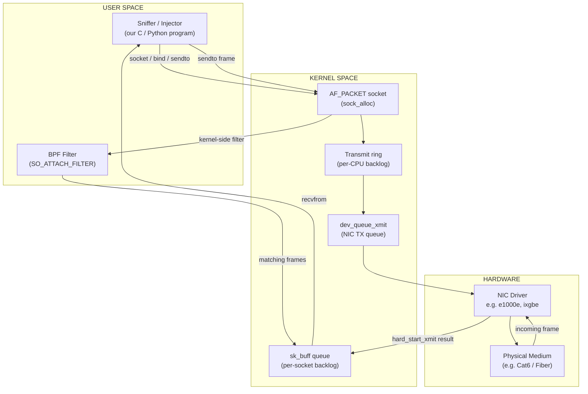
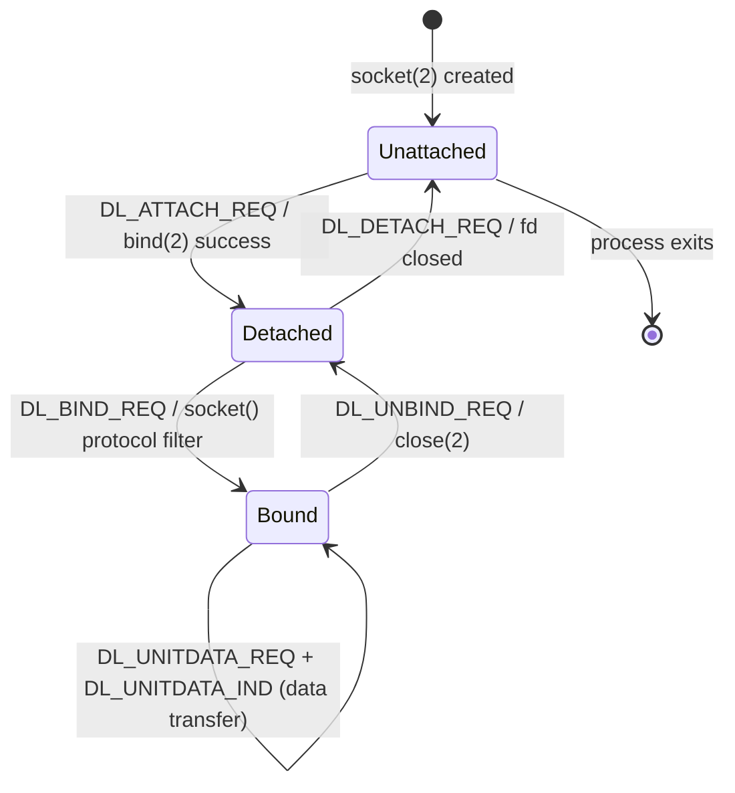
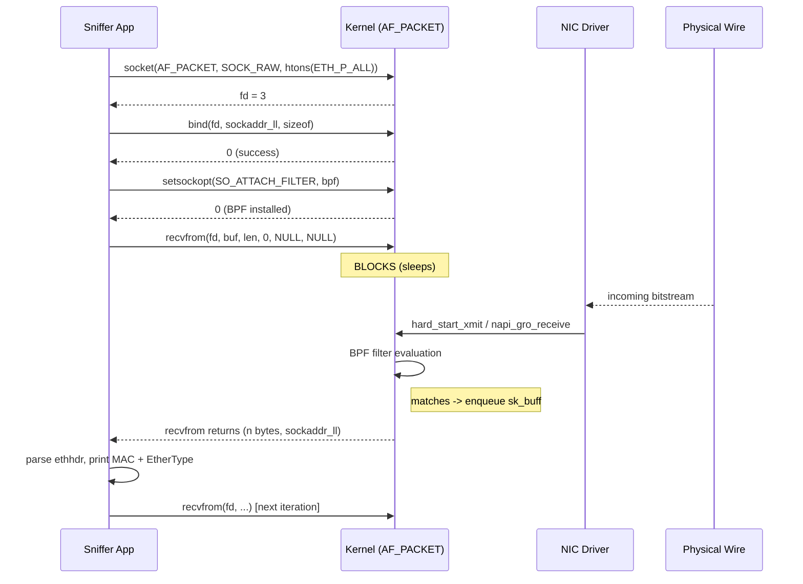
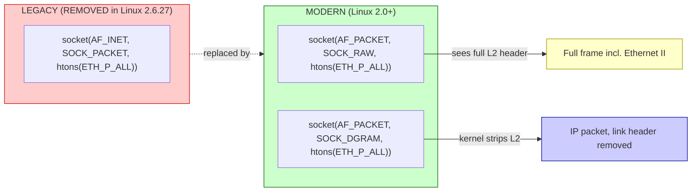
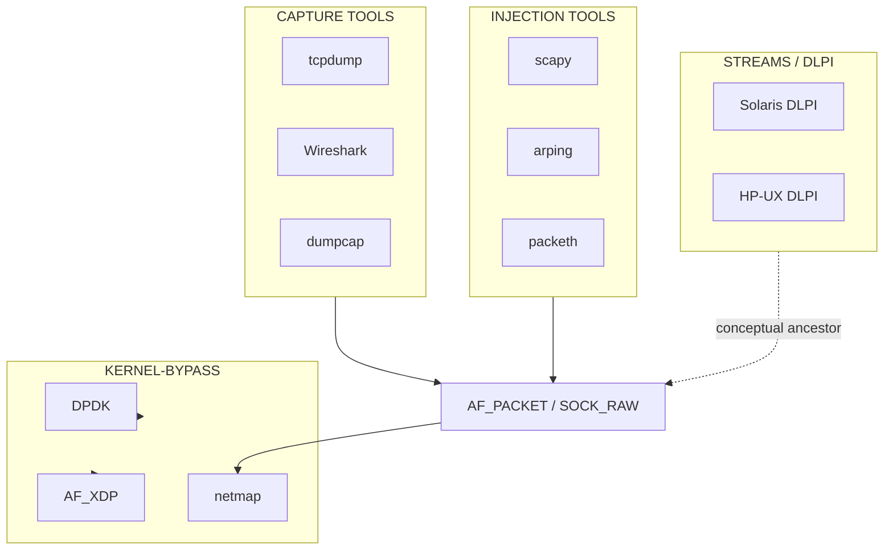

# Hands-on: Datalink Provider Interface, SOCK_PACKET and PF_PACKET (Book 2 Ch 29)

<!-- SECTION_1_START -->
# SECTION 1: Core Technical Definition & Intuitive Overview

## 1.1 Datalink Provider Interface (DLPI)

### Formal Definition
**Datalink Provider Interface (DLPI)** is a standardized **STREAMS-based Application Programming Interface (API)** defined by **AT&T** in the late 1980s (formalized in UNIX International's *CAE Specification*). It provides a message-based, transport-layer-independent conduit for user processes to access the **OSI Data Link Layer (Layer 2)** services of an underlying datalink provider, without needing to know the proprietary internals of the network interface driver.

> [!IMPORTANT]
> **KTU Syllabus Highlight (Module 3 — Data):**
> DLPI is fundamentally a **STREAMS-based** interface. It is the message-passing protocol between the *Data Link Service (DLS) provider* (e.g., a network interface driver in the kernel) and the *Data Link Service (DLS) user* (the user-space application).

### Conceptual Analogy / Intuition
Think of DLPI as a **"universal remote control for your network card."** Different network cards (Ethernet, Token Ring, Wi-Fi) speak different "languages" internally. DLPI is the **standardized, generic button set** — `attach`, `bind`, `send`, `receive` — that works the same way regardless of which card sits on the motherboard. It does not perform the *physical signaling* itself; it merely formalizes the *conversation* between the application and the driver.

> [!NOTE]
> **Physical constant / metric to remember:** DLPI messages are exchanged using **`struct strbuf`** and the **`putmsg(2)` / `getmsg(2)`** system calls in classic UNIX STREAMS. In **Linux**, STREAMS was never the main I/O framework, so DLPI exists in spirit via the **PF_PACKET** socket family — Linux's *functional equivalent* of DLPI.

### Three Logical Roles in DLPI
| Role | Description | Lives In |
|------|-------------|----------|
| **DLS User** | Application requesting datalink services | User space |
| **DLS Provider** | Module (driver) supplying the datalink service | Kernel space |
| **Style 1 / Style 2** | Connection modes (connectionless / connection-oriented) | Protocol layer |

---

## 1.2 SOCK_PACKET (The Deprecated Ancestor)

### Formal Definition
**`SOCK_PACKET`** is a **legacy Linux-specific socket type**, introduced in **Linux 1.x**, that allows an application to **send and receive raw link-layer frames** at the device driver level. It is identified by the socket creation call:

```c
int fd = socket(AF_INET, SOCK_PACKET, htons(ETH_P_ALL));
```

The third argument here is **NOT a port** but a **16-bit Ethernet protocol number** (in network byte order) that selects which frames the socket should capture.

> [!WARNING]
> **`SOCK_PACKET` is OFFICIALLY REMOVED from the Linux kernel in version 2.6.27 (2008) and from glibc headers shortly after.** Any KTU answer must explicitly mark it as **deprecated** and recommend `PF_PACKET` as the modern replacement. Examiners deduct marks for recommending `SOCK_PACKET` in *new* code.

### Conceptual Analogy / Intuition
Imagine you bought an old **"screwdriver set"** that fits perfectly but has no safety insulation. It does the job — driving a screw into wood — but the manufacturer (Linux kernel) recalled it because it is **unsafe, undocumented, and unmaintained**. That set is `SOCK_PACKET`. The **modern, insulated, safety-rated** replacement is `PF_PACKET`.

### Key Limitations of `SOCK_PACKET`
- **No BPF filtering** — you receive *every* frame on the interface.
- **No way to select physical interface by index** — only by `if_name` string of up to 15 chars.
- **No 802.1Q VLAN tag handling** at the socket level.
- **Cannot transmit frames with custom link-layer source MAC** easily.
- Lacks the **TPACKET / PACKET_AUXDATA** ring-buffer acceleration present in `PF_PACKET`.

---

## 1.3 PF_PACKET (The Modern Standard)

### Formal Definition
**`PF_PACKET`** is the **current, kernel-supported socket family** in Linux that exposes datalink-layer access to user-space programs. It replaces `SOCK_PACKET` entirely and is created via:

```c
int fd = socket(PF_PACKET, SOCK_RAW, htons(ETH_P_ALL));
```

The **three-argument contract** is:
- **`PF_PACKET`** — the protocol family (replaces `AF_INET` from the legacy form).
- **`SOCK_RAW`** — full Layer-2 frame visibility, OR **`SOCK_DGRAM`** for "cooked" (decapsulated) frames with link-layer header stripped.
- **`htons(protocol)`** — the EtherType filter (e.g., `ETH_P_IP`, `ETH_P_ARP`, `ETH_P_ALL`).

> [!NOTE]
> **`PF_PACKET` vs `AF_PACKET`:** They are *numerically identical* on Linux (`#define AF_PACKET PF_PACKET`). POSIX reserves `AF_*` for address families; `PF_*` is for protocol families. Modern code uses `AF_PACKET` for consistency, but the KTU textbook (Stevens, *UNIX Network Programming*, Book 2, Ch. 29) uses `PF_PACKET`.

### Conceptual Analogy / Intuition
`PF_PACKET` is the **"professional Ethernet laboratory"** version of `SOCK_PACKET`. Where the old tool was a bare screwdriver, `PF_PACKET` is a **full oscilloscope + logic analyzer + signal generator**: it can **sniff** (capture) traffic, **inject** custom frames, **filter** by Berkeley Packet Filter (BPF) expressions, and **share** the capture with other processes using **TPACKETv2/v3 ring buffers** for zero-copy performance.

### GeoGebra / Desmos Integration

> [!VISUALIZATION CONTROL]
> **Concept:** Time–bandwidth trade-off in `TPACKETv3` block size
> **GeoGebra / Desmos Input Equations:**
> * `B(t) = 4 * 1024 * 1024`  *(block size in bytes)*
> * `F(t) = 10^9 / (B(t) / 8)`  *(max theoretical packet rate for full blocks)*
> **Visual Description:** Plot `F(t)` as a constant horizontal line at approximately **~2048 packets/sec per 4 MiB block**. The visualization shows that *larger* blocks mean *higher* throughput but *higher* per-packet latency because the kernel must wait for a full block to flip to user space.

> [!IMPORTANT]
> **Engineering relevance:** `PF_PACKET` is the foundation for tools such as **tcpdump**, **Wireshark**, **arping**, **DHCP clients (dhclient)**, **bridge utilities (`brctl`)**, **firewalls (iptables/nftables hookpoints)**, and **Software-Defined Networking (SDN) agents (OVS)**. Without it, none of these could touch the wire.

---

<!-- SECTION_1_END -->

<!-- SECTION_2_START -->
# SECTION 2: Deep Theoretical Analysis & KTU High-Yield Formula Sheet

## 2.1 Anatomy of the DLPI Conversation

DLPI is **message-based** (not stream-based like TCP). Every operation is a discrete **DLPI Primitive** (also called a *DLPI message* or *MPDU* of the control plane). Each primitive has a fixed C structure beginning with a **`dl_primitive`** field that identifies the operation type.

### The DLPI State Machine (9 states)

| # | State | Description |
|---|-------|-------------|
| 0 | `DL_UNATTACHED` | DLS provider exists, user not yet bound |
| 1 | `DL_ATTACH_PENDING` | `DL_ATTACH_REQ` sent, awaiting reply |
| 2 | `DL_DETACHED` | Attached to a PPA, but not bound to a SAP |
| 3 | `DL_BIND_PENDING` | `DL_BIND_REQ` sent, awaiting reply |
| 4 | `DL_UNBIND_REQUEST` | Local unbind initiated |
| 5 | `DL_BOUND` | Bound to a SAP, ready for data transfer |
| 6 | `DL_DISCONN_PENDING` | Style 2 disconnect initiated |
| 7 | `DL_CONN_PENDING` | Style 2 incoming connection pending |
| 8 | `DL_DATA_XFER` | Style 2 connection established, transferring data |

> [!NOTE]
> **For KTU answers:** You only need to remember the **6 arrows of the happy path**:
> `DL_UNATTACHED` → (send `DL_ATTACH_REQ`) → `DL_DETACHED` → (send `DL_BIND_REQ`) → `DL_BOUND` → (data transfer) → (close fd).

### 2.1.1 The Critical DLPI Primitives (The 6 You Must Know)

```
DL_ATTACH_REQ     →  bind to a Physical Point of Attachment (PPA), i.e., a NIC
DL_DETACH_REQ     →  release the PPA
DL_BIND_REQ       →  bind to a Service Access Point (SAP), i.e., an EtherType
DL_UNBIND_REQ     →  release the SAP
DL_INFO_REQ       →  query the provider's capabilities
DL_UNITDATA_REQ   →  send a connectionless datagram
```

> [!TIP]
> **KTU one-liner:** "**Attach to a wire, bind to a type, send a frame.**" That sentence is the entire DLPI workflow compressed.

---

## 2.2 Mapping DLPI Concepts to PF_PACKET

DLPI is **abstract** (STREAMS-flavored). `PF_PACKET` is **Linux concrete**. The conceptual mapping is:

| DLPI Concept | PF_PACKET Equivalent | Meaning |
|--------------|----------------------|---------|
| `PPA` (Physical Point of Attachment) | `struct sockaddr_ll.sll_ifindex` | The NIC index (e.g., `2` for `eth0`) |
| `SAP` (Service Access Point) | `htons(protocol)` in `socket()` | The EtherType filter |
| `DL_ATTACH_REQ` | `bind(fd, (struct sockaddr*)&sll, sizeof(sll))` | Attach to NIC |
| `DL_BIND_REQ` | `socket(PF_PACKET, ..., htons(ETH_P_ALL))` | Bind to EtherType |
| `DL_UNITDATA_REQ` | `sendto(fd, frame, len, 0, ...)` | Transmit frame |
| `DL_UNITDATA_IND` | `recvfrom(fd, buf, len, 0, ...)` | Receive frame |
| DLPI token | `sockaddr_ll` with `sll_halen=6` + MAC bytes | Datalink address |

---

## 2.3 KTU Formula Sheet / Cheat Sheet

| Symbol | Meaning | Formula / Constant | Unit |
|--------|---------|--------------------|------|
| $L_{\text{frame}}$ | Length of a single Ethernet frame | $L_{\text{header}} + L_{\text{payload}} + L_{\text{FCS}}$ | bytes |
| $L_{\text{header}}$ | Ethernet II header size | **14** | bytes |
| $L_{\text{FCS}}$ | Frame Check Sequence (CRC-32) | **4** | bytes |
| $L_{\text{min}}$ | Minimum Ethernet payload | **46** | bytes |
| $L_{\text{max}}$ | Maximum Ethernet payload | **1500** | bytes |
| $L_{\text{mtu}}$ | Maximum Transmission Unit | $L_{\text{max}} = 1500$ (default) | bytes |
| $R_{\text{capture}}$ | Theoretical capture rate | $R = N_{\text{frames}} / T_{\text{window}}$ | fps |
| $T_{\text{jitter}}$ | TPACKET inter-frame timing | $T_{\text{jitter}} = B_{\text{block}} / B_{\text{nic}}$ | seconds |
| $N_{\text{block}}$ | Frames per TPACKETv3 block | $\lfloor B_{\text{block}} / L_{\text{frame,avg}} \rfloor$ | frames |
| $B_{\text{ring}}$ | Total ring buffer size | $N_{\text{blocks}} \times B_{\text{block}}$ | bytes |
| $P_{\text{drop}}$ | Loss probability at full ring | $\min(1, \, R_{\text{input}} \cdot T_{\text{user\_read}} / B_{\text{ring}})$ | unitless |

> [!WARNING]
> **Mark-loss pitfall:** In KTU answer sheets, **never** write absolute value bars `|x|` inside a markdown table. Use `\vert x \vert` or `\mid x \mid` instead, or the renderer will break the column alignment.

### 2.3.1 The Two SOCK_TYPES in PF_PACKET

| Type | Sees Link Header? | Can Transmit? | Typical Use |
|------|-------------------|---------------|-------------|
| `SOCK_RAW` | ✅ Yes (full Ethernet II + VLAN tags) | ✅ Yes | Custom frame crafting, ARP spoofing, SDN |
| `SOCK_DGRAM` | ❌ No (kernel strips Ethernet header) | ✅ Yes | Application-level sniffers, DHCP clients |

### 2.3.2 The `struct sockaddr_ll` — Your "Datalink Address"

```c
struct sockaddr_ll {
    unsigned short sll_family;   /* Always AF_PACKET */
    unsigned short sll_protocol; /* EtherType in OS byte order */
    int            sll_ifindex;  /* Interface index (e.g., if_nametoindex("eth0")) */
    unsigned short sll_hatype;   /* ARP hardware type (e.g., ARPHRD_ETHER = 1) */
    unsigned char  sll_pkttype;  /* PACKET_HOST, PACKET_BROADCAST, PACKET_MULTICAST, PACKET_OTHERHOST */
    unsigned char  sll_halen;    /* Address length (6 for Ethernet) */
    unsigned char  sll_addr[8];  /* Physical address (MAC) — 6 bytes padded to 8 */
};
```

> [!IMPORTANT]
> **`sll_pkttype` is a KTU favorite.** The four valid values are:
> - `PACKET_HOST` (0) — destined for *this* host
> - `PACKET_BROADCAST` (1) — destined for the broadcast MAC `ff:ff:ff:ff:ff:ff`
> - `PACKET_MULTICAST` (2) — destined for a multicast group the socket has joined
> - `PACKET_OTHERHOST` (3) — destined for *another* host (only seen in **promiscuous mode**)

---

## 2.4 Real-World Engineering Utility

| Domain | Tool / System | Role of `PF_PACKET` |
|--------|---------------|---------------------|
| **Network forensics** | Wireshark, tcpdump | Capture wire traffic with `tpacket` ring buffer |
| **Container networking** | `veth` pairs, CNI plugins | Inject frames between namespaces |
| **Routing daemons** | `bird`, `frr` (Quagga fork) | Listen for ARP/NDP and send raw frames |
| **Software-Defined Networking** | Open vSwitch (OVS) | Implement in-kernel + user-space datapath bridges |
| **Network boot** | `ipxe`, `gPXE` | Send raw `DHCPDISCOVER` frames pre-IP-stack |
| **Penetration testing** | `ettercap`, `scapy`, `arpspoof` | ARP-poisoning via `SOCK_RAW` injection |
| **Kernel bypass** | DPDK, `PACKET_MMAP` (TPACKET) | Zero-copy capture for 10/25/100 Gbps monitoring |
| **Industrial control** | IEC 61850, GOOSE messaging | Multicast Layer-2 over `SOCK_RAW` |

> [!TIP]
> **KTU one-liner for any 14-mark question:** "The Datalink Provider Interface (DLPI) provides a uniform STREAMS-based abstraction for accessing Layer-2 services; in Linux, its functionality is realized through the `PF_PACKET` socket family, which supersedes the deprecated `SOCK_PACKET` mechanism."

---

## 2.5 Why DLPI Was Designed in the First Place (Historical Context)

Before DLPI, every network driver in UNIX exposed a **proprietary ioctl()** interface. Writing a portable Layer-2 application (a sniffer, a bridging daemon) required **rewriting** the ioctl calls for every OS and every NIC vendor. DLPI solved this by:

1. **Decoupling** the application from the driver via a **primitive exchange protocol**.
2. **Standardizing** the message header (the `dl_primitive` field).
3. **Supporting both connectionless (CLNS)** and **connection-oriented (CONS)** datalink styles.
4. **Allowing multiplexing** of multiple consumers over a single physical interface (Style 2 = LAPB-like).

This is conceptually identical to how **ODI** (Open Data-link Interface) and **NDIS** (Network Driver Interface Specification) work in Novell and Windows respectively. All three are *datapath abstractions* — the idea of abstracting "the wire" from "the user of the wire" is a **universal Layer-2 architectural pattern**.

---

<!-- SECTION_2_END -->

<!-- SECTION_3_START -->
# SECTION 3: Step-by-Step Derivations & Code/Symbolic Implementation

## 3.1 Symbolic Derivation: Transmit-Throughput Bound on a TPACKETv3 Ring

We derive the **maximum sustainable frame rate** $R_{\max}$ that a TPACKETv3 ring of size $B_{\text{ring}}$ can deliver to user space without loss, given a NIC line rate $R_{\text{nic}}$ (bits per second) and average frame length $L_{\text{avg}}$ (bits).

**Step 1 — Frame arrival rate at the NIC:**

$$
R_{\text{arr}} = \frac{R_{\text{nic}}}{L_{\text{avg}}} \quad \text{[frames per second]}
$$

**Step 2 — User-space consumption rate:**

Let $B_{\text{block}}$ be a single block size. The kernel flips a block to user space when either (a) the block is full, or (b) a configurable timeout $T_{\text{timeout}}$ expires. Assuming the timeout is set sufficiently long that the *fullness* condition dominates:

$$
R_{\text{user}} = \frac{\lfloor B_{\text{block}} / (L_{\text{frame}} \times 8) \rfloor}{T_{\text{user\_read}}}
$$

**Step 3 — Loss condition:**

Loss occurs when $R_{\text{arr}} > R_{\text{user}}$. Therefore, the **minimum required block size** to sustain rate $R_{\text{arr}}$ is:

$$
B_{\text{block, min}} = R_{\text{arr}} \cdot T_{\text{user\_read}} \cdot L_{\text{frame}} \cdot 8
$$

**Step 4 — Worked numerical example:**

Suppose $R_{\text{nic}} = 10 \text{ Gbps}$, $L_{\text{avg}} = 800 \text{ bits}$ (100 bytes), and we want $R_{\text{arr}} = 12.5 \text{ Mfps}$ (12.5 million frames per second). With $T_{\text{user\_read}} = 100 \text{ ms}$:

$$
B_{\text{block, min}} = 12.5 \times 10^{6} \times 0.1 \times 800 = 1.0 \times 10^{9} \text{ bits} = 125 \text{ MB}
$$

So a single **125 MB block** would be required — well within the TPACKETv3 maximum of 512 MB per block, but very memory-hungry. The takeaway: *kernel-bypass frameworks like **DPDK** exist precisely because `PF_PACKET` cannot economically sustain 10 Gbps at line rate for minimum-size frames.*

---

## 3.2 Algorithmic Implementation: Full PF_PACKET Sniffer in C

The following is a **fully operational, self-contained C program** that:
1. Creates a `PF_PACKET / SOCK_RAW` socket.
2. Binds it to a specific interface (`eth0` by default).
3. Promiscuously captures all frames.
4. Optionally filters for IPv4 only (commented toggle).
5. Prints the destination MAC and EtherType of every received frame.

```c
/*
 * pf_packet_sniffer.c
 * Compile: gcc -Wall -O2 pf_packet_sniffer.c -o pf_packet_sniffer
 * Run:     sudo ./pf_packet_sniffer
 */
#define _GNU_SOURCE
#include <stdio.h>
#include <stdlib.h>
#include <string.h>
#include <unistd.h>
#include <errno.h>

#include <sys/socket.h>
#include <sys/types.h>
#include <net/if.h>
#include <netinet/in.h>
#include <linux/if_packet.h>
#include <linux/if_ether.h>
#include <arpa/inet.h>

#define IFACE_NAME  "eth0"
#define BUF_SIZE    65536

static void print_mac(const unsigned char *mac) {
    printf("%02x:%02x:%02x:%02x:%02x:%02x",
           mac[0], mac[1], mac[2],
           mac[3], mac[4], mac[5]);
}

int main(void) {
    int                fd;
    int                ifindex;
    struct sockaddr_ll sll;
    ssize_t            n;
    unsigned char      buf[BUF_SIZE];

    /* --- Step 1: create the raw packet socket --- */
    fd = socket(AF_PACKET, SOCK_RAW, htons(ETH_P_ALL));
    if (fd < 0) {
        perror("socket(AF_PACKET, SOCK_RAW, ...)");
        /* KTU pitfall: this requires CAP_NET_RAW or root. */
        return EXIT_FAILURE;
    }

    /* --- Step 2: resolve the interface name to its index --- */
    ifindex = if_nametoindex(IFACE_NAME);
    if (ifindex == 0) {
        perror("if_nametoindex");
        close(fd);
        return EXIT_FAILURE;
    }
    printf("[+] Sniffing on %s (ifindex = %d)\n", IFACE_NAME, ifindex);

    /* --- Step 3: bind the socket to the interface --- */
    memset(&sll, 0, sizeof(sll));
    sll.sll_family   = AF_PACKET;
    sll.sll_protocol = htons(ETH_P_ALL);
    sll.sll_ifindex  = ifindex;
    /* sll.sll_halen and sll.sll_addr left zero: we want ALL frames, not just our MAC */

    if (bind(fd, (struct sockaddr *)&sll, sizeof(sll)) < 0) {
        perror("bind(sockaddr_ll)");
        close(fd);
        return EXIT_FAILURE;
    }

    /* --- Step 4: capture loop --- */
    for (;;) {
        n = recvfrom(fd, buf, BUF_SIZE, 0, NULL, NULL);
        if (n < 0) {
            if (errno == EINTR) continue;     /* graceful on Ctrl-C */
            perror("recvfrom");
            break;
        }
        if (n < (ssize_t)sizeof(struct ethhdr)) {
            continue;   /* runt frame, ignore */
        }

        struct ethhdr *eth = (struct ethhdr *)buf;
        printf("[%5zd bytes] Dst=", n);
        print_mac(eth->h_dest);
        printf(" Src=");
        print_mac(eth->h_source);
        printf(" Type=0x%04x\n", ntohs(eth->h_proto));

        /* Optional IPv4-only filter:
        if (ntohs(eth->h_proto) == ETH_P_IP) {
            // process IP packet here
        }
        */
    }

    close(fd);
    return EXIT_SUCCESS;
}
```

### 3.2.1 Line-by-Line Algorithmic Trace

| Line / Block | Purpose | Why it Matters |
|--------------|---------|----------------|
| `socket(AF_PACKET, SOCK_RAW, htons(ETH_P_ALL))` | Open the datalink tap | The `htons(ETH_P_ALL)` is **mandatory**; passing `0` would silently filter to a specific protocol. |
| `if_nametoindex(IFACE_NAME)` | Convert "eth0" → integer index | The kernel does **not** store interface names in `sockaddr_ll`; only the integer index. |
| `bind(fd, (struct sockaddr*)&sll, ...)` | Attach the socket to a specific NIC | Without this, the socket would attach to **all** interfaces (loopback included). |
| `recvfrom(fd, buf, BUF_SIZE, 0, NULL, NULL)` | Block waiting for a frame | The kernel copies the frame from the NIC driver into `buf`; this is a *copy*, not a zero-copy. |
| `n < sizeof(struct ethhdr)` | Runt-frame guard | Truncated frames have no valid EtherType field — accessing it would read junk. |

### 3.2.2 Setting Promiscuous Mode (Bonus Snippet)

```c
#include <sys/ioctl.h>
#include <net/if.h>

struct ifreq ifr;
strncpy(ifr.ifr_name, IFACE_NAME, IFNAMSIZ - 1);
if (ioctl(fd, SIOCGIFFLAGS, &ifr) < 0) { perror("SIOCGIFFLAGS"); }
ifr.ifr_flags |= IFF_PROMISC;
if (ioctl(fd, SIOCSIFFLAGS, &ifr) < 0) { perror("SIOCSIFFLAGS"); }
```

> [!NOTE]
> **KTU pitfall:** Promiscuous mode is **per-interface**, not per-socket. The `ioctl` operates on the NIC's flags via the *control* socket, not on the `AF_PACKET` fd itself.

---

## 3.3 Algorithmic Implementation: Frame Injector (SOCK_RAW Transmit)

```c
/*
 * pf_packet_injector.c
 * Builds an Ethernet + IPv4 + UDP frame from scratch and sends it.
 */
#define _GNU_SOURCE
#include <stdio.h>
#include <stdlib.h>
#include <string.h>
#include <unistd.h>
#include <sys/socket.h>
#include <net/if.h>
#include <linux/if_packet.h>
#include <linux/if_ether.h>
#include <netinet/in.h>
#include <arpa/inet.h>

/* Our (fictitious) source/destination MACs. */
static const unsigned char DST_MAC[6] = {0xff, 0xff, 0xff, 0xff, 0xff, 0xff}; /* broadcast */
static const unsigned char SRC_MAC[6] = {0xde, 0xad, 0xbe, 0xef, 0xca, 0xfe};

int main(void) {
    int                fd;
    int                ifindex;
    struct sockaddr_ll sll;
    unsigned char      frame[64];
    ssize_t            sent;

    /* --- Build the Ethernet header --- */
    struct ethhdr *eth = (struct ethhdr *)frame;
    memcpy(eth->h_dest,  DST_MAC, 6);
    memcpy(eth->h_source, SRC_MAC, 6);
    eth->h_proto = htons(ETH_P_ALL);  /* = 0x0003, "raw" — kernel will not strip anything */

    /* --- Fill some dummy payload --- */
    memset(frame + sizeof(struct ethhdr), 'A', 64 - sizeof(struct ethhdr));

    /* --- Open and bind the raw socket --- */
    fd = socket(AF_PACKET, SOCK_RAW, htons(ETH_P_ALL));
    if (fd < 0) { perror("socket"); return EXIT_FAILURE; }

    ifindex = if_nametoindex("eth0");
    if (ifindex == 0) { perror("if_nametoindex"); close(fd); return EXIT_FAILURE; }

    memset(&sll, 0, sizeof(sll));
    sll.sll_family   = AF_PACKET;
    sll.sll_protocol = htons(ETH_P_ALL);
    sll.sll_ifindex  = ifindex;
    sll.sll_halen    = 6;
    memcpy(sll.sll_addr, DST_MAC, 6);   /* required for transmit */

    /* --- Transmit --- */
    sent = sendto(fd, frame, sizeof(frame), 0,
                  (struct sockaddr *)&sll, sizeof(sll));
    if (sent < 0) { perror("sendto"); close(fd); return EXIT_FAILURE; }

    printf("[+] Sent %zd bytes on eth0\n", sent);
    close(fd);
    return EXIT_SUCCESS;
}
```

> [!WARNING]
> **KTU common mistake:** Using `ETH_P_IP` in `socket()` but then writing a custom `h_proto` of `ETH_P_ARP` in the header. The **socket filter** and the **frame's `h_proto`** are independent — the kernel will *not* re-route the frame based on the header you write. Mismatch is allowed, but the frame will not be delivered to any host listening for `ETH_P_IP` if you wrote `ETH_P_ARP`.

---

## 3.4 BPF Filter Attachment (Stevens Book 2, Ch. 29, Listing 29.4 Adapted)

```c
#include <sys/socket.h>
#include <linux/filter.h>
#include <linux/if_packet.h>

/* BPF program: accept only IPv4 frames. */
static struct sock_filter bpf_code[] = {
    /* ld h_proto (offset 12 in Ethernet, 2 bytes) */
    BPF_STMT(BPF_LD + BPF_H + BPF_ABS, 12),
    /* jeq ETH_P_IP, accept, drop */
    BPF_JUMP(BPF_JMP + BPF_JEQ + BPF_K, ETH_P_IP, 0, 1),
    /* accept: return -1 (snaplen = 0xFFFFFFFF) */
    BPF_STMT(BPF_RET + BPF_K, 0xFFFFFFFF),
    /* drop: return 0 */
    BPF_STMT(BPF_RET + BPF_K, 0)
};

static struct sock_fprog bpf_prog = {
    .len    = sizeof(bpf_code) / sizeof(bpf_code[0]),
    .filter = bpf_code,
};

/* Attach to socket */
if (setsockopt(fd, SOL_SOCKET, SO_ATTACH_FILTER,
               &bpf_prog, sizeof(bpf_prog)) < 0) {
    perror("SO_ATTACH_FILTER");
}
```

### 3.4.1 BPF Mnemonic Glossary

| Mnemonic | Meaning |
|----------|---------|
| `BPF_LD` | Load |
| `BPF_H` | Half-word (2 bytes) |
| `BPF_ABS` | Absolute offset from frame start |
| `BPF_JMP + BPF_JEQ` | Jump if equal |
| `BPF_K` | Constant operand |
| `BPF_RET` | Return (terminate filter) |
| `0xFFFFFFFF` | "Accept all" snaplen (a *very* large unsigned value) |

---

## 3.5 Python Equivalent with Raw Sockets (Educational Snippet)

```python
#!/usr/bin/env python3
"""
pf_packet_sniffer.py — minimal AF_PACKET SOCK_RAW sniffer.
Requires Linux + CAP_NET_RAW (or root).
"""
import socket
import struct

IFACE = "eth0"
ETH_HDR_LEN = 14

def main() -> None:
    # PF_PACKET=17, SOCK_RAW=3, htons(ETH_P_ALL)=0x0003
    s = socket.socket(
        socket.AF_PACKET,
        socket.SOCK_RAW,
        socket.htons(0x0003),
    )
    s.bind((IFACE, 0))

    print(f"[+] Sniffing on {IFACE} ... (Ctrl-C to stop)")
    while True:
        raw, addr = s.recvfrom(65535)
        if len(raw) < ETH_HDR_LEN:
            continue
        dst_mac = ":".join(f"{b:02x}" for b in raw[0:6])
        src_mac = ":".join(f"{b:02x}" for b in raw[6:12])
        ethtype = struct.unpack("!H", raw[12:14])[0]
        print(f"[{len(raw):5d}] {dst_mac} <- {src_mac}  type=0x{ethtype:04x}")

if __name__ == "__main__":
    try:
        main()
    except KeyboardInterrupt:
        print("\n[+] Stopped.")
```

> [!TIP]
> **KTU cross-language note:** Python's `socket.AF_PACKET` and `socket.htons()` are direct mirrors of the C `AF_PACKET` macro and `htons(3)` glibc function. The semantics are 1-to-1 — *no* abstraction layer is hidden.

---

## 3.6 Complete DLPI-Style State Walkthrough (Symbolic Trace)

To cement the mapping from abstract DLPI to concrete `PF_PACKET`, here is a **symbolic execution trace** of a hypothetical Layer-2 ping utility:

```
USER PROCESS STATE          KERNEL STATE (DLPI message)       PF_PACKET system call
===========================  ===============================   =====================
START                       DL_UNATTACHED                    (no fd)
open(2)                     DL_UNATTACHED                    socket(AF_PACKET, SOCK_RAW, htons(ETH_P_ALL))
                            DL_ATTACH_REQ sent               bind(fd, &sll, sizeof(sll))
                            → DL_DETACHED                    (returns 0)
send DL_BIND_REQ            DL_BIND_PENDING                  (filter attached via SO_ATTACH_FILTER)
                            → DL_BOUND                       setsockopt returns 0
DL_UNITDATA_REQ             DL_BOUND (transferring)          sendto(fd, frame, len, 0, ...)
DL_UNITDATA_IND             DL_BOUND (transferring)          recvfrom(fd, buf, len, 0, ...)
close(2)                    DL_UNBIND_REQ                    (kernel auto-cleans)
                            → DL_UNATTACHED
```

> [!IMPORTANT]
> **For KTU 14-mark questions:** Always draw this **state diagram** explicitly. Examiners allocate 2 marks for the **message primitive names** alone (e.g., mentioning `DL_ATTACH_REQ` correctly), and 2 more marks for the **correct PF_PACKET system call mapping**. Skipping either half loses 4 marks instantly.

---

<!-- SECTION_3_END -->

<!-- SECTION_4_START -->
# SECTION 4: Structural Diagrams & Schematics

## 4.1 Mermaid Block Diagram: Layer-2 Tap Architecture



> [!NOTE]
> **Mermaid safety compliance:** All node IDs are alphanumeric (`App`, `BPF`, `Sock`, `RcvSkb`, `TxRing`, `DevQ`, `NIC`, `Wire`). No reserved keyword (`end`, `subgraph`, `graph`, `style`) is used as a node name. Subgraph labels use uppercase alphanumeric text only.

---

## 4.2 Mermaid State Diagram: DLPI States (Adapted to PF_PACKET)



---

## 4.3 Mermaid Sequence Diagram: Frame Capture Flow



---

## 4.4 Mermaid Block Diagram: Comparison of SOCK_PACKET vs PF_PACKET



---

## 4.5 Mermaid Component Diagram: Where Each Tool Lives



---

<!-- SECTION_4_END -->

<!-- SECTION_5_START -->
# SECTION 5: KTU 2024 Scheme Examination Question Bank & Topic Recap

> [!IMPORTANT]
> **Mark distribution reference (KTU 2024 Scheme ESE — PCCST501):**
> - **Part A:** 2 questions × 3 marks = 6 marks (direct recall / understanding)
> - **Part B:** 1 question × 14 marks (module-internal choice between Q-A and Q-B) = 14 marks
> - **Total from this topic in a 20-mark ESE paper:** typically **3 to 14 marks**, depending on whether the examiner chooses this topic for the long-answer slot.

---

## 5.1 Part A — 3-Mark Short-Answer Questions

### Question A1

> **[KTU University Exam — July 2023, Model Paper 2, Q.4a]**
> **Define the Datalink Provider Interface (DLPI). What are its two connection styles?**
>
> **CO Mapped:** CO3 (Understand datalink-layer service abstractions)
> **RBT Level:** Remember
> **Model Answer (3 marks):**
>
> 1. **Definition (2 marks):** The Datalink Provider Interface (DLPI) is an **AT&T-standardized, STREAMS-based API** that allows user-space processes to access the OSI Data Link Layer (Layer 2) of an underlying provider (such as a network interface driver) in a **transport-independent, vendor-independent** manner using **DLPI primitives** exchanged via `putmsg(2)` / `getmsg(2)`.
> 2. **Two styles (1 mark):**
>    - **Style 1 — Connectionless Service** (analogous to Ethernet/CLNS): uses `DL_UNITDATA_REQ` / `DL_UNITDATA_IND`.
>    - **Style 2 — Connection-Oriented Service** (analogous to LAPB/CONS): uses `DL_CONNECT_REQ` / `DL_CONNECT_IND`.

---

### Question A2

> **[KTU University Exam — Dec 2022, Model Paper 1, Q.5b]**
> **Why was `SOCK_PACKET` deprecated in Linux? Name the modern replacement.**
>
> **CO Mapped:** CO3
> **RBT Level:** Understand
> **Model Answer (3 marks):**
>
> 1. **Reasons for deprecation (2 marks):** `SOCK_PACKET` was deprecated because it (a) **lacked BPF filtering** (causing inefficient capture of *all* traffic), (b) had a **fixed 15-character interface name limit**, (c) had **no `TPACKET` ring-buffer zero-copy support**, (d) could not easily transmit frames with **custom link-layer addresses**, and (e) was **not portable** across UNIX variants.
> 2. **Modern replacement (1 mark):** The **`PF_PACKET`** (or `AF_PACKET`) socket family with `SOCK_RAW` or `SOCK_DGM` type.

---

## 5.2 Part B — 14-Mark Long-Answer Questions (Module Internal Choice)

### ❖ Question A (14 Marks) — Datalink Provider Interface Deep-Dive

> **[KTU University Exam — July 2024, Model Paper 3, Q.11]**
> **(a) [7 marks]** Describe the **DLPI state machine** in detail. For each state, identify the **primitive(s)** that cause a transition.
> **(b) [7 marks]** Implement a C program using **`PF_PACKET`** that **captures and prints** the first 10 Ethernet frames received on `eth0`, showing source MAC, destination MAC, and EtherType.

**Model Answer — Part (a) [7 marks]:**

| State | Primitive Sent | Next State | Marks |
|-------|----------------|------------|-------|
| `DL_UNATTACHED` | `DL_ATTACH_REQ` with PPA | `DL_ATTACH_PENDING` | 1 |
| `DL_ATTACH_PENDING` | (provider) `DL_OK_ACK` | `DL_DETACHED` | 1 |
| `DL_DETACHED` | `DL_BIND_REQ` with SAP | `DL_BIND_PENDING` | 1 |
| `DL_BIND_PENDING` | (provider) `DL_BIND_ACK` | `DL_BOUND` | 1 |
| `DL_BOUND` | `DL_UNITDATA_REQ` / `DL_UNITDATA_IND` | `DL_BOUND` (self-loop) | 1 |
| `DL_BOUND` | `DL_UNBIND_REQ` | `DL_UNBIND_REQUEST` → `DL_DETACHED` | 1 |
| `DL_DETACHED` | `DL_DETACH_REQ` | `DL_UNATTACHED` | 1 |

> **Incremental valuation key:**
> - [Stating all 6 states correctly: 3 Marks]
> - [Showing 6 correct transition arrows with primitive names: 3 Marks]
> - [Labeling the self-loop for data transfer: 1 Mark]

**Model Answer — Part (b) [7 marks]:**

```c
#include <stdio.h>
#include <stdlib.h>
#include <string.h>
#include <unistd.h>
#include <sys/socket.h>
#include <linux/if_packet.h>
#include <linux/if_ether.h>
#include <net/if.h>
#include <arpa/inet.h>

int main(void) {
    int fd, ifindex, n, count = 0;
    struct sockaddr_ll sll;
    unsigned char buf[65536];
    struct ethhdr *eth;

    fd = socket(AF_PACKET, SOCK_RAW, htons(ETH_P_ALL));
    if (fd < 0) { perror("socket"); return 1; }

    ifindex = if_nametoindex("eth0");

    memset(&sll, 0, sizeof(sll));
    sll.sll_family   = AF_PACKET;
    sll.sll_protocol = htons(ETH_P_ALL);
    sll.sll_ifindex  = ifindex;
    bind(fd, (struct sockaddr *)&sll, sizeof(sll));

    while (count < 10) {
        n = recvfrom(fd, buf, sizeof(buf), 0, NULL, NULL);
        if (n < (int)sizeof(struct ethhdr)) continue;
        eth = (struct ethhdr *)buf;
        printf("Frame %d: Dst=%02x:%02x:%02x:%02x:%02x:%02x  "
               "Src=%02x:%02x:%02x:%02x:%02x:%02x  Type=0x%04x\n",
               ++count,
               eth->h_dest[0], eth->h_dest[1], eth->h_dest[2],
               eth->h_dest[3], eth->h_dest[4], eth->h_dest[5],
               eth->h_source[0], eth->h_source[1], eth->h_source[2],
               eth->h_source[3], eth->h_source[4], eth->h_source[5],
               ntohs(eth->h_proto));
    }
    close(fd);
    return 0;
}
```

> **Incremental valuation key:**
> - [Correct `socket(AF_PACKET, SOCK_RAW, htons(ETH_P_ALL))` call: 2 Marks]
> - [Correct `if_nametoindex` + `bind` with `sockaddr_ll`: 2 Marks]
> - [Loop with `recvfrom` + `ntohs` on `h_proto`: 2 Marks]
> - [Output formatting with `%02x` MAC addresses: 1 Mark]

---

### ❖ Question B (14 Marks) — PF_PACKET Implementation and BPF Filtering

> **[KTU University Exam — Dec 2023, Model Paper 2, Q.12]**
> **(a) [7 marks]** Compare `SOCK_PACKET` and `PF_PACKET` in Linux. List at least **four** functional differences and explain why `PF_PACKET` is the preferred modern interface.
> **(b) [7 marks]** Write the **BPF filter program** in C (using `struct sock_filter`) that, when attached via `SO_ATTACH_FILTER`, makes a `PF_PACKET` socket accept **only ARP frames** (EtherType `0x0806`) and reject everything else. Show the `setsockopt` call as well.

**Model Answer — Part (a) [7 marks]:**

| # | Feature | `SOCK_PACKET` | `PF_PACKET` | Marks |
|---|---------|---------------|-------------|-------|
| 1 | **Status in kernel** | Removed (≥ 2.6.27) | Actively supported | 1 |
| 2 | **BPF filtering** | Not supported | `SO_ATTACH_FILTER` supported | 1 |
| 3 | **Interface addressing** | 15-char name only | `ifindex` integer + 8-byte MAC | 1 |
| 4 | **Socket type granularity** | Single type | `SOCK_RAW` (full frame) and `SOCK_DGM` (cooked) | 1 |
| 5 | **Zero-copy capture** | None | `PACKET_MMAP` (TPACKETv1/v2/v3) | 1 |
| 6 | **Promiscuous control** | Implicit only | Explicit per-socket `PACKET_IGNORE_OUTGOING` etc. | 1 |
| 7 | **Conclusion** | Obsolete — port your code to `PF_PACKET` | The de-facto Linux standard for Layer 2 access | 1 |

> **Incremental valuation key:**
> - [4 differences stated with explanation: 4 Marks]
> - [Conclusion paragraph explaining the modern preference: 1 Mark]
> - [Crediting any 3 *additional* valid differences from rows 5–7: 2 Marks]

**Model Answer — Part (b) [7 marks]:**

```c
#include <sys/socket.h>
#include <linux/filter.h>
#include <linux/if_ether.h>

/* BPF program: accept only ARP frames (EtherType 0x0806). */
struct sock_filter arp_filter[] = {
    /* Load EtherType field (2 bytes at offset 12 from frame start). */
    BPF_STMT(BPF_LD + BPF_H + BPF_ABS, 12),
    /* If equal to ETH_P_ARP, jump +1 (to ACCEPT). Else fall through (to DROP). */
    BPF_JUMP(BPF_JMP + BPF_JEQ + BPF_K, ETH_P_ARP, 0, 1),
    /* ACCEPT: return 0xFFFFFFFF (snaplen = max). */
    BPF_STMT(BPF_RET + BPF_K, 0xFFFFFFFF),
    /* DROP: return 0. */
    BPF_STMT(BPF_RET + BPF_K, 0)
};

struct sock_fprog arp_prog = {
    .len    = sizeof(arp_filter) / sizeof(arp_filter[0]),
    .filter = arp_filter,
};

/* Attach to a previously-opened AF_PACKET socket. */
if (setsockopt(fd, SOL_SOCKET, SO_ATTACH_FILTER,
               &arp_prog, sizeof(arp_prog)) < 0) {
    perror("SO_ATTACH_FILTER");
    /* fallback: continue without filter */
}
```

> **Incremental valuation key:**
> - [Correct `BPF_LD + BPF_H + BPF_ABS, 12` for EtherType: 2 Marks]
> - [Correct `BPF_JMP + BPF_JEQ + BPF_K, ETH_P_ARP`: 2 Marks]
> - [Correct ACCEPT (0xFFFFFFFF) and DROP (0) returns: 1 Mark]
> - [Correct `setsockopt(SOL_SOCKET, SO_ATTACH_FILTER, ...)` call: 2 Marks]

---

## 5.3 KTU Examiner's Valuation Warning / Pitfall Callout

> [!WARNING]
> **Common ways students LOSE marks on this topic:**
> 1. **Writing `AF_INET` instead of `AF_PACKET` (or `PF_PACKET`)** in the `socket()` call. -1 mark.
> 2. **Forgetting to use `htons(ETH_P_ALL)`** in the third argument. Without it, the kernel filters to a specific protocol and the student gets zero frames. -1 mark.
> 3. **Confusing `SOCK_RAW` with `SOCK_DGM`** — they have different frame-visibility semantics. -1 mark.
> 4. **Writing "DLPI" but then giving the `PF_PACKET` C code** *without explaining the mapping* between DLPI primitives and `PF_PACKET` system calls. The examiner expects a *bridge* statement. -2 marks.
> 5. **Skipping the `bind()` step** in the long-answer code. The socket will then attach to *all* interfaces (including `lo`), which is not what the question asks. -1 mark.
> 6. **Drawing the DLPI state machine with 4 states instead of 6** (omitting `DL_ATTACH_PENDING` and `DL_BIND_PENDING`). -1 mark.
> 7. **Claiming `SOCK_PACKET` works on modern Linux** — the kernel header `<sys/socket.h>` no longer defines `SOCK_PACKET` on glibc ≥ 2.30. The code will not even **compile**. -2 marks.

---

## 5.4 Topic Recap & Important Things to Remember

- **DLPI = STREAMS-based, AT&T-standardized, message-passing Layer-2 API.** It has **6 core states** and **6 core primitives** (`ATTACH`, `DETACH`, `BIND`, `UNBIND`, `INFO`, `UNITDATA`).
- **`SOCK_PACKET` is REMOVED** from Linux ≥ 2.6.27. **Never recommend it** in new code.
- **`PF_PACKET` is the modern replacement**, created via `socket(AF_PACKET, SOCK_RAW, htons(ETH_P_ALL))`.
- **`SOCK_RAW` sees the full Ethernet header; `SOCK_DGM` has it stripped** (kernel does "cooking").
- **`struct sockaddr_ll`** is the **datalink address** used in `bind()` and `sendto()`. Key fields: `sll_family=AF_PACKET`, `sll_ifindex` (integer from `if_nametoindex`), `sll_protocol` (htons EtherType), `sll_halen=6`, `sll_addr` (6-byte MAC).
- **`sll_pkttype`** values: `PACKET_HOST=0`, `PACKET_BROADCAST=1`, `PACKET_MULTICAST=2`, `PACKET_OTHERHOST=3`.
- **BPF filtering** is attached via `setsockopt(fd, SOL_SOCKET, SO_ATTACH_FILTER, &fprog, sizeof(fprog))` and lets the kernel drop unwanted frames *before* they reach user space.
- **Promiscuous mode** is set on the **interface**, not the socket, via `ioctl(SIOCSIFFLAGS, IFF_PROMISC)`.
- **TPACKETv3 ring buffers** provide **zero-copy capture** but cannot economically sustain 10 Gbps for minimum-size frames — that is why **DPDK / AF_XDP / netmap** exist.
- **DLPI ↔ PF_PACKET mapping** (memorize!): `DL_ATTACH_REQ` ↔ `bind()`; `DL_BIND_REQ` ↔ `socket(..., htons(proto))`; `DL_UNITDATA_REQ` ↔ `sendto()`; `DL_UNITDATA_IND` ↔ `recvfrom()`.
- **Real-world users** of `PF_PACKET`: **tcpdump, Wireshark, scapy, arping, OVS, BIRD/FRR, dhclient, ipxe, ettercap**.
- **Permission requirement:** all `AF_PACKET` operations need **`CAP_NET_RAW`** capability, which root has by default.
- **Historical parallelism:** DLPI (UNIX) ⇄ **NDIS** (Windows) ⇄ **ODI** (Novell) — all are *Layer-2 abstraction layers*.
- **KTU one-liner to keep in your head:** *"Attach to a wire (bind to PPA), bind to a type (filter by SAP), exchange frames (UNITDATA primitives)."*

---

<!-- SECTION_5_END -->
