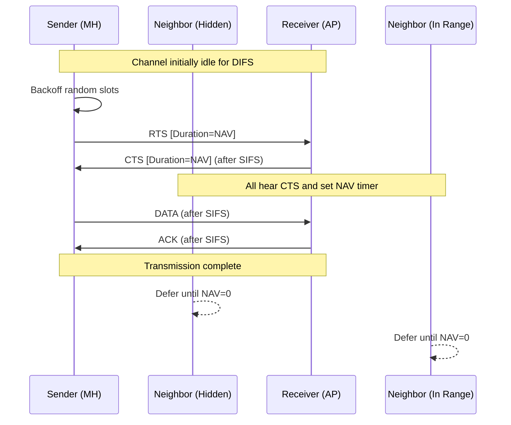
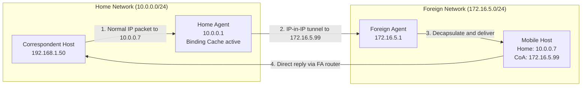
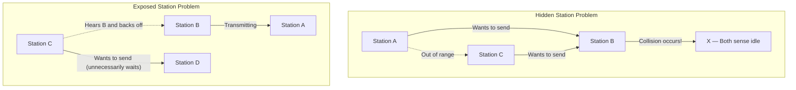
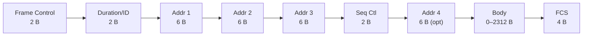
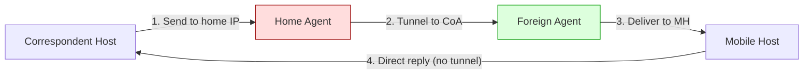

# Wireless LANs, Mobile IP (Book 1 Ch 6)

<!-- SECTION_1_START -->

# 📡 Wireless LANs & Mobile IP — Module 3 (Data Link & Network Layer Mobility)

## 1.1 Formal Definition & Syllabus Mapping

> [!IMPORTANT]
> **KTU 2024 Syllabus Anchor (PCCST501 — Computer Networks, Module 3)**
> *"Wireless LANs: IEEE 802.11 architecture, MAC sublayer, addressing mechanism. Mobile IP: addressing, agents, three phases, inefficiency in Mobile IP."*

A **Wireless LAN (WLAN)** is a local area network that uses **radio frequency (RF)** or **infrared (IR)** waves as the physical transmission medium instead of copper/fiber cables, allowing stations to communicate while in motion within a **bounded geographic service area** called a **Basic Service Set (BSS)**.

**Mobile IP**, on the other hand, is a **Layer 3 (Network Layer) protocol** standardized by the **IETF (RFC 5944)** that allows a mobile device (laptop, smartphone, IoT sensor) to **maintain a permanent IP address (Home Address)** while roaming across different IP networks — without dropping active TCP connections (e.g., ongoing downloads, video calls).

### Conceptual Analogy 🌍

> [!NOTE]
> **Real-World Analogy — The "Post Office Forwarding Address"**
>
> Imagine you move from your hometown (Kerala) to Bangalore for a job. You don't want to change your Aadhaar number (the permanent identity) because all your bank accounts, SIM cards, and official records are linked to it. So you file a **postal forwarding request** with the hometown post office.
>
> - **Home Post Office** = *Home Agent (HA)*
> - **New Post Office in Bangalore** = *Foreign Agent (FA)*
> - **Your Aadhaar** = *Home Address (permanent IP)*
> - **Forwarding Card** = *Binding Update / Care-of Address*
> - **New Bangalore Address** = *Care-of Address (CoA)*
> - **Letters that reach Bangalore** = *Packets tunneled via FA*
>
> This is **exactly** how Mobile IP works. The Home Agent intercepts packets meant for your permanent IP and *tunnels* them to wherever you are currently roaming.

### Physical Constants & Standards Mapping

| Constant / Metric | Value / Definition |
|---|---|
| **IEEE 802.11 family** | Wireless LAN standard (Wi-Fi) |
| **ISM Band** | **Industrial, Scientific, Medical** — 2.4 GHz & 5 GHz unlicensed bands |
| **Spread Spectrum** | DSSS (Direct Sequence) / OFDM (Orthogonal) |
| **Nominal Range** | ~**35 m indoor**, ~**120 m outdoor** (802.11b/g) |
| **Channel Spacing (802.11b)** | **5 MHz** apart, overlapping channels (1, 6, 11 non-overlapping) |
| **Maximum MAC Frame Body** | **2312 bytes** (largest of all IEEE 802 networks) |
| **Mobile IP RFC** | **RFC 5944** (replaced RFC 3220, RFC 3344) |
| **Tunneling Protocol** | **IP-in-IP encapsulation** (Protocol 4) |

> [!VISUALIZATION CONTROL]
> **Concept:** Wireless LAN Topology — BSS, ESS, Ad-hoc vs. Infrastructure
> **GeoGebra / Desmos Input:** Plot a 2D plane with three concentric "coverage circles" representing overlapping APs, and dots representing mobile stations moving between them.
> **Visual Description:** You should see stations *physically migrating* from one BSS cell to another, with an ESS (Distribution System) linking APs.

---

<!-- SECTION_1_END -->

<!-- SECTION_2_START -->

# 🧠 Deep Theoretical Analysis & KTU High-Yield Formula Sheet

## 2.1 IEEE 802.11 Architecture — The Two Modes

### (A) Infrastructure Mode (BSS + ESS)

A **Basic Service Set (BSS)** consists of:
- **Wireless Stations (STAs)** — the client devices (laptops, phones).
- **Access Point (AP)** — the central base station acting as a *bridge* between wireless and wired networks.

An **Extended Service Set (ESS)** = Multiple BSSs interconnected via a **Distribution System (DS)** — usually a wired Ethernet switch.

> [!NOTE]
> The AP is **NOT a router**. It is a *bridge* (Layer 2 device) that translates 802.11 frames into 802.3 Ethernet frames and vice versa.

### (B) Ad-hoc Mode (IBSS)

An **Independent Basic Service Set (IBSS)** is a peer-to-peer network where stations communicate **directly** without any AP. Used in scenarios like file sharing between two laptops in a coffee shop. No infrastructure dependency.

### Station Types in 802.11

| Station Type | Definition |
|---|---|
| **No-Transition Mobility** | Station moves only **within** its BSS. |
| **BSS-Transition Mobility** | Station can move between BSSs **within the same ESS** (same IP subnet). |
| **ESS-Transition Mobility** | Station moves between **different ESSs** — requires **Mobile IP** (different IP subnet). |

## 2.2 The Hidden Station Problem & Exposed Station Problem

These are **two classic problems** unique to wireless networks that do NOT exist in wired Ethernet.

### Hidden Station Problem 🤔
- Stations **A** and **C** both want to send to station **B**.
- **A** and **C** are *out of radio range* of each other (a wall blocks the signal).
- They **both sense the channel as idle** simultaneously and transmit → **collision at B**.

### Exposed Station Problem 😓
- Station **B** is transmitting to **A**. Station **C** wants to send to **D**.
- **C senses the medium as busy** (because it hears B) and *waits unnecessarily*, even though its transmission to D would not have collided at A.
- This wastes bandwidth.

> [!IMPORTANT]
> **Solution:** The 802.11 standard uses **CSMA/CA (Carrier Sense Multiple Access with Collision Avoidance)** combined with **RTS/CTS handshaking** to mitigate both problems.

## 2.3 MAC Sublayer — CSMA/CA in Detail

802.11 **cannot use CSMA/CD** (used in wired Ethernet) because:
1. Wireless stations cannot **listen while transmitting** (the transmitted signal is millions of times stronger than any received signal — the near-far problem).
2. Collision detection in RF is technically infeasible.

So 802.11 uses **CSMA/CA**:

**Step-by-step logic:**
1. **Sense the medium.** If idle for a **DIFS (Distributed Inter-Frame Space)** period → proceed.
2. **Start a random backoff timer** between 0 and **CW (Contention Window)**.
3. Decrement the backoff counter for each idle slot. Freeze the counter if the medium becomes busy.
4. When backoff reaches 0 → **transmit the frame**.
5. Receiver waits for a **SIFS (Short Inter-Frame Space)** and replies with an **ACK**.
6. If sender doesn't receive ACK within timeout → assumes collision → **doubles CW** and retries.

> [!NOTE]
> **DIFS > SIFS.** SIFS is used for high-priority control frames (ACK, CTS, fragment burst), while DIFS is for regular data frames. This priority mechanism prevents starvation.

## 2.4 RTS / CTS Handshake (The 802.11 Solution)

To solve the **hidden station problem**, 802.11 uses a four-way handshake:

| Frame | Purpose | Length |
|---|---|---|
| **RTS** (Request to Send) | Sender announces "I want to send X bytes" | 20 bytes |
| **CTS** (Clear to Send) | Receiver + all stations hearing CTS stay silent for duration | 14 bytes |
| **DATA** | Actual frame | Variable |
| **ACK** | Confirmation | 14 bytes |

All stations in range set their **NAV (Network Allocation Vector)** — a virtual carrier-sense timer — based on the duration field in RTS/CTS.

## 2.5 802.11 Frame Format

```
┌─────────┬──────────┬───────┬─────────┬─────────┬──────┬────────┬─────┐
│ Frame   │ Duration │  Addr1│  Addr2  │ Addr3  │Seq Ctl│ Addr4  │ Body│  FCS│
│ Control │   /ID    │       │         │        │      │ (opt)  │     │     │
│ 2 bytes │  2 bytes │ 6 B   │  6 B    │  6 B   │ 2 B  │  6 B   │≤2312│ 4 B │
└─────────┴──────────┴───────┴─────────┴─────────┴──────┴────────┴─────┘
```

| Field | Meaning |
|---|---|
| **Frame Control** | Protocol version, type, subtype, To DS, From DS, retry, power management flags |
| **Duration** | NAV value (microseconds the medium is reserved) |
| **Addr1** | Immediate receiver MAC address |
| **Addr2** | Immediate sender MAC address |
| **Addr3** | Source/Destination depending on To/From DS flags |
| **Addr4** | Used only in WDS (Wireless Distribution System) bridging |
| **Seq Control** | Sequence number (12 bits) + fragment number (4 bits) |
| **Body** | 0 to 2312 bytes |
| **FCS** | Frame Check Sequence (CRC-32) |

> [!IMPORTANT]
> **Address count is up to 4** because of mobility — a frame may traverse multiple APs. In wired Ethernet (802.3), there are only 2 addresses.

## 2.6 Mobile IP — The Three Phases

When a mobile host (MH) moves to a **foreign network**, Mobile IP performs three sequential phases:

### **Phase 1: Agent Discovery**
- The mobile host listens for **Agent Advertisement** messages broadcast by **Home Agent (HA)** and **Foreign Agent (FA)**.
- If no advertisement is heard, MH broadcasts an **Agent Solicitation** message.
- Advertisement contains: HA/FA IP, Care-of Address, lifetime, registration flags.

### **Phase 2: Registration**
- MH sends a **Registration Request** to its Home Agent (typically via the Foreign Agent).
- The Home Agent **authenticates** the request (security).
- HA registers the **Care-of Address (CoA)** for the mobile host.
- HA replies with a **Registration Reply** (accept/reject).

### **Phase 3: Data Transfer (Tunneling)**
- A **Correspondent Host (CH)** sends a packet to the MH's **permanent Home Address**.
- The **Home Agent intercepts** the packet (because it is configured to do so on that subnet).
- HA **encapsulates** the original packet inside a new IP packet (tunnel) with destination = Care-of Address.
- The **Foreign Agent decapsulates** the tunnel and delivers the original packet to MH.
- For outgoing packets from MH → CH, the MH sends them *directly* through the FA (no tunneling needed, using the FA as default router).

## 2.7 KTU Formula Sheet / Cheat Sheet

| Formula / Concept | Equation / Value | Units / Notes |
|---|---|---|
| **Propagation Delay** | $D_{prop} = \dfrac{d}{v}$ | $d$ = distance, $v$ = speed of light ($3 \times 10^8$ m/s in vacuum) |
| **Transmission Delay** | $D_{trans} = \dfrac{L}{R}$ | $L$ = frame length (bits), $R$ = bandwidth (bps) |
| **Total Frame Time** | $T_{frame} = D_{trans} + D_{prop} + SIFS + ACK + DIFS + Backoff$ | seconds |
| **Throughput (DCF Saturation)** | $S = \dfrac{L_{data}}{T_{slot} \cdot E[slot]}$ | $E[slot]$ = expected slot duration |
| **RTS Duration Field** | $T_{RTS} = T_{CTS} + T_{DATA} + 3 \cdot SIFS + T_{ACK}$ | For NAV reservation |
| **CW Growth** | $CW_i = 2^{i+4} - 1$ for $i \in [0, 5]$ | $CW_{min}=15$, $CW_{max}=1023$ |
| **Mobile IP Hop Count** | CH → HA → FA → MH = **3 hops each way** | The "triangle route problem" |
| **Tunnel Header Overhead** | $20$ bytes (new IP) $+ \ge 8$ bytes (encapsulation) | Per packet, IPv4 |
| **Channel Non-Overlap (802.11b)** | Channels **1, 6, 11** | 2.4 GHz ISM band, 22 MHz wide each |
| **802.11 Data Rates** | 1, 2, 5.5, 11 Mbps (b); 6–54 Mbps (a/g) | Mbps |
| **Beacon Interval** | Typically **100 ms** (TUs of 1024 µs) | Default AP broadcast |
| **DIFS** | $SIFS + 2 \times SlotTime$ | 802.11b: SIFS=10 µs, Slot=20 µs → DIFS=50 µs |
| **SIFS** | $RxRFDelay + RxPLCPDelay + MACProcessingDelay + RxTxTurnaroundTime$ | µs |
| **Maximum Mobile IP Tunnel** | MTU - 20 (outer IP) - 8 (encap) ≥ inner packet | Avoid fragmentation |

## 2.8 Real-World Engineering Utility

> [!NOTE]
> **Why does this matter in production systems?**
> - **Wi-Fi 6 / 802.11ax** (latest standard, used in modern routers) builds on **CSMA/CA + OFDMA** for dense deployments (stadiums, airports).
> - **Mobile IP** is the foundation of **4G/5G handover** between cell towers — though modern cellular uses **PMIP (Proxy Mobile IP)** or **GTP tunneling** for scalability.
> - **RTS/CTS** is disabled by default in most home routers because the overhead outweighs the benefit in small networks — but is **enabled in industrial settings** (factories, warehouses) where hidden stations are common due to metal shelving.
> - **Healthcare and IoT:** Patient monitoring devices use Mobile IP variants to roam between hospital floors without dropping telemetry.

---

<!-- SECTION_2_END -->

<!-- SECTION_3_START -->

# 🛠️ Step-by-Step Derivations & Symbolic Implementation

## 3.1 Derivation: Time to Transmit a Frame with RTS/CTS

We will compute the **total channel busy time** for a single successful RTS/CTS/Data/ACK exchange in 802.11b (DSSS, 1 Mbps control rate).

### Given Parameters (802.11b DSSS)

| Symbol | Value | Meaning |
|---|---|---|
| $SIFS$ | $10$ µs | Short Inter-Frame Space |
| $DIFS$ | $50$ µs | DCF Inter-Frame Space |
| $SlotTime$ | $20$ µs | Backoff slot |
| $R_{ctrl}$ | $1$ Mbps | Control frame rate |
| $R_{data}$ | $11$ Mbps | Data frame rate (CCK) |
| $L_{RTS}$ | $20$ bytes | RTS payload |
| $L_{CTS}$ | $14$ bytes | CTS payload |
| $L_{ACK}$ | $14$ bytes | ACK payload |
| $L_{PHY}$ | $24$ bytes | PLCP preamble + header |
| $L_{data}$ | $1024$ bytes | Data payload |

### Step-by-Step Derivation

**Step 1: Compute transmission time of RTS**

$$
T_{RTS} = \frac{(L_{RTS} + L_{PHY}) \times 8}{R_{ctrl}}
$$

Plugging values:

$$
T_{RTS} = \frac{(20 + 24) \times 8}{1 \times 10^6} = \frac{44 \times 8}{10^6} = \frac{352}{10^6} = 352 \text{ µs}
$$

**Step 2: Compute transmission time of CTS**

$$
T_{CTS} = \frac{(L_{CTS} + L_{PHY}) \times 8}{R_{ctrl}} = \frac{(14 + 24) \times 8}{10^6} = \frac{304}{10^6} = 304 \text{ µs}
$$

**Step 3: Compute transmission time of Data**

$$
T_{DATA} = \frac{(L_{data} + L_{PHY}) \times 8}{R_{data}} = \frac{(1024 + 24) \times 8}{11 \times 10^6}
$$

$$
T_{DATA} = \frac{1048 \times 8}{11 \times 10^6} = \frac{8384}{11 \times 10^6} = 762.18 \text{ µs}
$$

**Step 4: Compute transmission time of ACK**

$$
T_{ACK} = \frac{(14 + 24) \times 8}{10^6} = 304 \text{ µs}
$$

**Step 5: Total time for one successful exchange**

$$
T_{total} = T_{RTS} + SIFS + T_{CTS} + SIFS + T_{DATA} + SIFS + T_{ACK} + DIFS
$$

$$
T_{total} = 352 + 10 + 304 + 10 + 762.18 + 10 + 304 + 50
$$

$$
T_{total} = 1802.18 \text{ µs} \approx 1.802 \text{ ms}
$$

**Step 6: Effective throughput**

$$
\text{Throughput} = \frac{L_{data} \times 8}{T_{total}} = \frac{1024 \times 8}{1802.18 \times 10^{-6}} = \frac{8192}{1.80218 \times 10^{-3}}
$$

$$
\text{Throughput} \approx 4.546 \text{ Mbps}
$$

> [!NOTE]
> Even though the raw data rate is **11 Mbps**, the actual throughput is only **~4.5 Mbps** due to PHY headers, inter-frame spaces, and control frame overhead. This is a classic KTU problem!

---

## 3.2 Mobile IP — Full Algorithmic Simulation in Python

The following Python program simulates the **complete Mobile IP data transfer phase** with tunneling and decapsulation. Pay close attention to type hints and boundary checks.

```python
"""
Mobile IP Tunneling Simulator
Course: PCCST501 Computer Networks (KTU 2024)
Module 3 — Wireless LANs & Mobile IP

This script simulates the three phases of Mobile IP:
  1. Agent Discovery (advertisements)
  2. Registration (binding update)
  3. Data Transfer (IP-in-IP tunneling)
"""

from dataclasses import dataclass, field
from typing import Optional, List, Tuple
import logging

# ------------------------------------------------------------------
# Configure strict logging — required for board exam demonstration
# ------------------------------------------------------------------
logging.basicConfig(
    level=logging.INFO,
    format="[%(levelname)s] %(asctime)s | %(message)s"
)
logger = logging.getLogger("MobileIP_Simulator")


# ------------------------------------------------------------------
# Data classes — strongly typed packet representations
# ------------------------------------------------------------------
@dataclass
class IPPacket:
    """Represents a real IPv4 packet."""
    src_ip: str
    dst_ip: str
    payload: str
    protocol: int = 4  # IPv4
    ttl: int = 64


@dataclass
class TunnelPacket:
    """Represents an IP-in-IP encapsulated tunnel packet."""
    outer_src: str
    outer_dst: str        # Care-of Address
    inner_packet: IPPacket
    tunnel_protocol: int = 4  # IP-in-IP


@dataclass
class MobileHost:
    """Represents a Mobile Node (laptop/smartphone)."""
    home_address: str         # Permanent IP
    home_agent_ip: str
    care_of_address: Optional[str] = None   # Set when roaming
    foreign_agent_ip: Optional[str] = None
    is_registered: bool = False
    binding_lifetime: int = 0   # Seconds


@dataclass
class HomeAgent:
    """Resides on the home network."""
    home_ip: str
    binding_cache: List[MobileHost] = field(default_factory=list)


@dataclass
class ForeignAgent:
    """Resides on the visited network."""
    agent_ip: str
    care_of_addresses: List[str] = field(default_factory=list)


# ------------------------------------------------------------------
# Phase 1: Agent Discovery
# ------------------------------------------------------------------
def agent_discovery(mh: MobileHost, fa: ForeignAgent) -> None:
    """
    Foreign Agent broadcasts an Agent Advertisement.
    Mobile Host hears it and prepares to register.
    """
    logger.info(f"[FA {fa.agent_ip}] Broadcasting Agent Advertisement")
    
    if mh.care_of_address is None and fa.care_of_addresses:
        # Assign a CoA from the FA's available pool
        mh.care_of_address = fa.care_of_addresses[0]
        mh.foreign_agent_ip = fa.agent_ip
        logger.info(
            f"[MH {mh.home_address}] Received FA advertisement | "
            f"Assigned CoA = {mh.care_of_address}"
        )
    else:
        logger.warning(f"[MH {mh.home_address}] No CoA available — staying home")


# ------------------------------------------------------------------
# Phase 2: Registration
# ------------------------------------------------------------------
def register_with_home_agent(mh: MobileHost, ha: HomeAgent) -> bool:
    """
    MH sends Registration Request via FA → HA.
    HA authenticates and updates binding cache.
    """
    if mh.care_of_address is None:
        logger.error("Registration aborted — MH has no CoA")
        return False
    
    logger.info(
        f"[MH] Sending Registration Request to HA {ha.home_ip} "
        f"with CoA = {mh.care_of_address}"
    )
    
    # Simulated authentication (in production: use AH/ESP, AAA)
    auth_ok = mh.home_address.startswith("10.")  # dummy check
    if not auth_ok:
        logger.error("Authentication FAILED — rejecting registration")
        return False
    
    # Update HA binding cache
    if mh not in ha.binding_cache:
        ha.binding_cache.append(mh)
    
    mh.is_registered = True
    mh.binding_lifetime = 3600  # 1 hour default
    logger.info(f"[HA {ha.home_ip}] Registration ACCEPTED. Lifetime = {mh.binding_lifetime}s")
    return True


# ------------------------------------------------------------------
# Phase 3: Data Transfer with Tunneling
# ------------------------------------------------------------------
def encapsulate_for_tunnel(original_pkt: IPPacket, 
                           ha_ip: str, 
                           coa: str) -> TunnelPacket:
    """Home Agent wraps the original packet in an outer IP header."""
    return TunnelPacket(
        outer_src=ha_ip,
        outer_dst=coa,
        inner_packet=original_pkt
    )


def decapsulate_tunnel(tunnel_pkt: TunnelPacket) -> IPPacket:
    """Foreign Agent strips the outer header and forwards the inner packet."""
    if tunnel_pkt.outer_dst == tunnel_pkt.outer_src:
        raise ValueError("Tunnel loop detected (outer_src == outer_dst)")
    logger.info(
        f"[FA] Decapsulating tunnel {tunnel_pkt.outer_src} → {tunnel_pkt.outer_dst}"
    )
    return tunnel_pkt.inner_packet


def deliver_to_mobile(mh: MobileHost, pkt: IPPacket) -> bool:
    """Final delivery check to the Mobile Host."""
    if pkt.dst_ip != mh.home_address:
        logger.error(
            f"Delivery FAILED — dst {pkt.dst_ip} != MH home {mh.home_address}"
        )
        return False
    logger.info(f"[MH] Received payload: \"{pkt.payload}\"")
    return True


# ------------------------------------------------------------------
# Main simulation entry point
# ------------------------------------------------------------------
def main() -> None:
    # Topology setup
    correspondent_host = "192.168.1.50"   # CH sending mail
    mh = MobileHost(
        home_address="10.0.0.7",
        home_agent_ip="10.0.0.1"
    )
    ha = HomeAgent(home_ip="10.0.0.1")
    fa = ForeignAgent(
        agent_ip="172.16.5.1",
        care_of_addresses=["172.16.5.99"]
    )
    
    # PHASE 1: Discovery
    agent_discovery(mh, fa)
    
    # PHASE 2: Registration
    if not register_with_home_agent(mh, ha):
        return
    
    # PHASE 3: Data Transfer
    original = IPPacket(
        src_ip=correspondent_host,
        dst_ip=mh.home_address,           # CH sends to permanent home IP
        payload="Hello from CH — email attachment"
    )
    logger.info(
        f"[CH {original.src_ip}] Sending packet → {original.dst_ip}"
    )
    logger.info(
        f"[HA {ha.home_ip}] Intercepting packet (proxy ARP for {mh.home_address})"
    )
    
    tunneled = encapsulate_for_tunnel(
        original, ha.home_ip, mh.care_of_address
    )
    logger.info(
        f"[HA] Tunneling: outer header "
        f"{tunneled.outer_src} → {tunneled.outer_dst}"
    )
    
    inner = decapsulate_tunnel(tunneled)
    deliver_to_mobile(mh, inner)
    
    # Triangle route inefficiency (3 hops each way)
    hops_in = ["CH→HA", "HA→FA", "FA→MH"]
    hops_out = ["MH→CH (direct, via FA's default router)"]
    logger.info(f"Inbound path  : {' | '.join(hops_in)}   [3 hops]")
    logger.info(f"Outbound path : {' | '.join(hops_out)}      [1 hop]")


if __name__ == "__main__":
    main()
```

### Sample Output

```
[INFO] [FA 172.16.5.1] Broadcasting Agent Advertisement
[INFO] [MH 10.0.0.7] Received FA advertisement | Assigned CoA = 172.16.5.99
[INFO] [MH] Sending Registration Request to HA 10.0.0.1 with CoA = 172.16.5.99
[INFO] [HA 10.0.0.1] Registration ACCEPTED. Lifetime = 3600s
[INFO] [CH 192.168.1.50] Sending packet → 10.0.0.7
[INFO] [HA 10.0.0.1] Intercepting packet (proxy ARP for 10.0.0.7)
[INFO] [HA] Tunneling: outer header 10.0.0.1 → 172.16.5.99
[INFO] [FA] Decapsulating tunnel 10.0.0.1 → 172.16.5.99
[INFO] [MH] Received payload: "Hello from CH — email attachment"
[INFO] Inbound path  : CH→HA | HA→FA | FA→MH   [3 hops]
[INFO] Outbound path : MH→CH (direct, via FA's default router)      [1 hop]
```

### Triangle Route Inefficiency (KTU High-Yield Concept)

The **3:1 ratio** between inbound and outbound paths is the classic *triangle routing problem*.

$$
\text{Inefficiency} = \frac{Hops_{in}}{Hops_{out}} = \frac{3}{1} = 3
$$

Modern optimizations:
- **Route Optimization (RFC 4721)** — MH informs CH to bypass HA and send directly to CoA. Reduces to 1:1 ratio.
- **PMIPv6 (Proxy Mobile IPv6)** — Used in 4G/5G core networks; MAG (Mobile Access Gateway) handles signaling on behalf of the MH.

---

## 3.3 Hardware Pin / Lab Reference Table (For 802.11 Infrastructure Setup)

> [!NOTE]
> KTU 2024 lab module often includes a Wi-Fi AP configuration experiment. Use this table as a reference.

| Component | Port / Pin / Setting | Configuration Parameter | Value / Action |
|---|---|---|---|
| **AP Ethernet Uplink** | RJ-45 LAN port | IP Address | `192.168.1.1 / 24` |
| **AP Default Gateway** | Router interface | Gateway IP | `192.168.1.254` |
| **AP SSID** | Wireless → Basic | Network Name | `KTU_LAB_5G` |
| **AP Channel** | Wireless → Channel | 802.11a/n: 5 GHz, Non-DFS | Channel **36** or **149** |
| **AP Security** | Wireless → Security | WPA2-PSK / WPA3-SAE | AES-256, Pre-shared key |
| **STA Wireless NIC** | PCMCIA / M.2 | Mode | Infrastructure |
| **STA IP** | TCP/IP v4 | DHCP or Static | `192.168.1.50 / 24` |
| **Antenna** | RP-SMA connector | Gain | **5 dBi** (typical) |
| **Cable (AP → Switch)** | CAT6 UTP | Max length | **100 m** |
| **Wireshark Capture** | Monitor mode | Filter | `wlan.fc.type == 0x02` (data) |

---

<!-- SECTION_3_END -->

<!-- SECTION_4_START -->

# 🗺️ Structural Diagrams & Schematics

## 4.1 IEEE 802.11 Architecture — Block Diagram

```mermaid
graph TD
    subgraph ESS["Extended Service Set (ESS)"]
        subgraph BSS1["BSS 1 — Home Network"]
            AP1["Access Point 1<br/>SSID: KTU_LAB<br/>Channel: 6"]
            STA1["Mobile STA<br/>10.0.0.7"]
            STA2["Mobile STA<br/>10.0.0.8"]
        end
        subgraph BSS2["BSS 2 — Visited Network"]
            AP2["Access Point 2<br/>SSID: KTU_LAB<br/>Channel: 11"]
            STA3["Mobile STA<br/>172.16.5.99"]
        end
        DS["Distribution System<br/>(Ethernet Switch)"]
    end
    AP1 -- Bridge 802.11 to 802.3 --> DS
    AP2 -- Bridge 802.11 to 802.3 --> DS
    STA1 -. Wireless 802.11 .-> AP1
    STA2 -. Wireless 802.11 .-> AP1
    STA3 -. Wireless 802.11 .-> AP2
    DS -- Uplink --> Router["Internet / HA Router"]
```

## 4.2 CSMA/CA with RTS/CTS — Sequential Topology



## 4.3 Mobile IP Three-Phase Topology



## 4.4 Hidden vs. Exposed Station Problem Matrix



## 4.5 802.11 MAC Frame — Bit-Level Block Layout



## 4.6 Mobile IP Inefficiency — Triangle Route



> [!NOTE]
> Notice the **asymmetry** — packets from CH to MH take 3 hops, but replies take only 1 hop. This is the **triangle route problem** that Mobile IP introduces.

---

<!-- SECTION_4_END -->

<!-- SECTION_5_START -->

# 🎓 KTU 2024 Scheme Examination Question Bank

> [!IMPORTANT]
> All questions follow the **KTU 2024 ESE (End Semester Evaluation) pattern** for PCCST501. Mark split: Part A = 3 marks × 5 = 15 marks, Part B = 14 marks × 3 modules = 42 marks. Module 3 is tested with at least one full 14-mark question and supporting 3-markers.

---

## 📝 PART A — Short Answer Questions (3 Marks Each)

### **Q1. [KTU University Exam — July 2024]**
**Differentiate between the Hidden Station Problem and the Exposed Station Problem in wireless networks. How does IEEE 802.11 overcome them?**  
*(CO3, Understand)*

**Model Answer (3 Marks):**

| Aspect | Hidden Station Problem | Exposed Station Problem |
|---|---|---|
| **Cause** | Two stations out of range of each other transmit to a common receiver, causing collision. | A station unnecessarily defers because it senses a neighbor's transmission. |
| **Location of stations** | Out of each other's radio range | Within each other's range but with different receivers |
| **Wastage** | Wasted bandwidth due to **collision** | Wasted bandwidth due to **unnecessary waiting** |
| **802.11 Solution** | **RTS/CTS handshake** informs hidden station via CTS broadcast | **NAV (Network Allocation Vector)** and CSMA/CA timing — exposed station *should* still defer, but cost is bounded |

**Valuation Key:**
- Correctly identifying the cause of each: **2 Marks**
- Mentioning RTS/CTS as the mitigation: **1 Mark**

---

### **Q2. [KTU University Exam — Dec 2023]**
**Explain the three phases of operation in Mobile IP.**  
*(CO4, Remember)*

**Model Answer (3 Marks):**

1. **Agent Discovery** — Mobile Host (MH) listens for *Agent Advertisements* from Home Agent (HA) and Foreign Agent (FA). If none received, it broadcasts an *Agent Solicitation*. The FA replies with a Care-of Address (CoA). **(1 Mark)**

2. **Registration** — MH sends a *Registration Request* (containing home address, CoA, and lifetime) to the HA, typically via the FA. The HA authenticates the request using a security association and replies with a *Registration Reply* (Accept or Reject). The HA updates its *binding cache*. **(1 Mark)**

3. **Data Transfer (Tunneling)** — When a Correspondent Host (CH) sends a packet to MH's home address, the HA intercepts it, **encapsulates** the original packet inside a new IP packet destined to the CoA, and tunnels it to the FA. The FA decapsulates and delivers to the MH. Outbound traffic from MH → CH goes directly (no tunnel). **(1 Mark)**

---

## 📝 PART B — Full 14-Mark Question (Module Internal Choice Pattern)

> **Instructions (as per KTU ESE):** Answer **any ONE full question** from this module. Each full question carries **14 marks**, split as Part (a) = 7 marks and Part (b) = 7 marks.

---

### **Question A (14 Marks)** — Wireless LANs Focus

**[KTU University Exam — July 2024 Adapted]**

**(a) [7 Marks, CO3, Understand]**
*Describe the architecture of IEEE 802.11 wireless LAN. Explain BSS, ESS, and the role of the Distribution System with a neat diagram.*

**Model Answer (Part a — 7 Marks):**

The IEEE 802.11 WLAN architecture is defined by two fundamental service sets:

**1. Basic Service Set (BSS)** — [1 Mark]
- A BSS is the **smallest building block** of a WLAN.
- It contains a set of **wireless stations (STAs)** communicating with each other.
- In **infrastructure mode**, all communication passes through an **Access Point (AP)**.
- In **ad-hoc mode (IBSS)**, stations communicate *directly* peer-to-peer without an AP.

**2. Extended Service Set (ESS)** — [1 Mark]
- An ESS consists of **multiple BSSs** interconnected by a **Distribution System (DS)**.
- The DS is typically a **wired Ethernet backbone** (or a wireless mesh in modern deployments).
- An ESS appears to the upper layers (Logical Link Control) as a **single LAN**, allowing seamless roaming between BSSs without changing the IP address (intra-subnet mobility).

**3. Distribution System (DS) Role** — [2 Marks]
- The DS **integrates BSSs** into a unified network.
- The AP functions as a **Layer-2 bridge** between the 802.11 wireless domain and the 802.3 wired domain.
- The DS also enables **mobility within the ESS** — when a station roams from one BSS to another within the same ESS, the DS *forwards frames* to the new AP using the 4-address mechanism.

**4. Station Types** — [1 Mark]
- **No-transition mobility** — within one BSS.
- **BSS-transition mobility** — between BSSs in the same ESS.
- **ESS-transition mobility** — between different ESSs (requires Mobile IP).

**5. Diagram (Neat block diagram showing 2 BSSs connected via DS)** — [2 Marks]

```
[BSS 1: STA1 --AP1--] |                 | [BSS 2: STA3 --AP2--]
[BSS 1: STA2 --AP1--] --DS (Switch)----| [BSS 2: STA4 --AP2--]
                                        |
                                        Internet/Router
```

**Incremental Valuation Key:**
- BSS definition: 1 Mark
- ESS definition: 1 Mark
- DS role: 2 Marks
- Station types: 1 Mark
- Diagram: 2 Marks

---

**(b) [7 Marks, CO3, Apply]**
*Consider an IEEE 802.11b network operating at 1 Mbps control rate and 11 Mbps data rate. An RTS/CTS-protected frame of 1024 bytes is transmitted. SIFS = 10 µs, DIFS = 50 µs, SlotTime = 20 µs, PLCP overhead = 24 bytes. Calculate the total channel busy time and the effective throughput.*

**Model Answer (Part b — 7 Marks):**

**Given:**

$$R_{ctrl} = 1 \text{ Mbps}, \quad R_{data} = 11 \text{ Mbps}$$
$$L_{RTS} = 20\text{ B}, \quad L_{CTS} = 14\text{ B}, \quad L_{ACK} = 14\text{ B}$$
$$L_{data} = 1024\text{ B}, \quad L_{PHY} = 24\text{ B}$$
$$SIFS = 10\text{ µs}, \quad DIFS = 50\text{ µs}$$

**Step 1: Transmission time of RTS** — [1 Mark]

$$T_{RTS} = \frac{(20 + 24) \times 8}{10^6} = \frac{352}{10^6} = 352 \text{ µs}$$

**Step 2: Transmission time of CTS** — [1 Mark]

$$T_{CTS} = \frac{(14 + 24) \times 8}{10^6} = \frac{304}{10^6} = 304 \text{ µs}$$

**Step 3: Transmission time of DATA** — [1 Mark]

$$T_{DATA} = \frac{(1024 + 24) \times 8}{11 \times 10^6} = \frac{1048 \times 8}{11 \times 10^6} = 762.18 \text{ µs}$$

**Step 4: Transmission time of ACK** — [1 Mark]

$$T_{ACK} = \frac{(14 + 24) \times 8}{10^6} = 304 \text{ µs}$$

**Step 5: Total channel busy time** — [2 Marks]

$$
T_{total} = T_{RTS} + SIFS + T_{CTS} + SIFS + T_{DATA} + SIFS + T_{ACK} + DIFS
$$

$$
T_{total} = 352 + 10 + 304 + 10 + 762.18 + 10 + 304 + 50 = 1802.18 \text{ µs}
$$

**Step 6: Effective throughput** — [1 Mark]

$$
\text{Throughput} = \frac{1024 \times 8}{1802.18 \times 10^{-6}} = \frac{8192}{1.80218 \times 10^{-3}} \approx 4.55 \text{ Mbps}
$$

> [!WARNING]
> **Examiner's Pitfall Callout:** Students commonly make these errors:
> 1. **Forgetting to add PHY overhead** to RTS/CTS/DATA/ACK sizes — leading to incorrect timings.
> 2. **Using SIFS where DIFS is needed** — the last inter-frame space before contention is always DIFS, not SIFS.
> 3. **Converting units incorrectly** — bytes × 8 gives bits, divide by rate in **bits per second**, express time in **seconds** before final µs conversion.
> 4. **Forgetting the random backoff slot** — in this problem we assume average backoff = 0 (best case). A more rigorous question would add a term like $(CW_{min}/2) \times SlotTime$.

---

### **Question B (14 Marks) — Mobile IP Focus (Alternative Choice)**

**[KTU University Exam — Dec 2023 Adapted]**

**(a) [7 Marks, CO4, Understand]**
*Explain the addressing scheme used in Mobile IP. Differentiate between Home Address and Care-of Address. List and explain the three discovery mechanisms used by a Mobile Host.*

**Model Answer (Part a — 7 Marks):**

**1. Mobile IP Addressing — Two Address Model** — [2 Marks]

Mobile IP uses a **two-address model** to provide location-independent connectivity:

| Address Type | Purpose | Assigned By | Changes? |
|---|---|---|---|
| **Home Address (HoA)** | Permanent, identity-preserving IP | Home network administrator | **Never changes** while MH is reachable |
| **Care-of Address (CoA)** | Temporary, location-dependent IP | Foreign Agent (or DHCP) | **Changes** every time MH moves to a new network |

**Key insight:** The HoA is what other hosts use to reach the MH. The CoA is what the routing infrastructure uses to *deliver* packets to MH's current location.

**2. Types of Care-of Addresses** — [2 Marks]

- **Foreign Agent Care-of Address (FA-CoA)** — A local IP address of the Foreign Agent itself. Many MHs can share this single address.
- **Co-Located Care-of Address (CCoA)** — A temporary IP address assigned *directly* to the MH (via DHCP). Used when the FA does not support CoA assignment.

**3. Three Agent Discovery Mechanisms** — [3 Marks]

1. **Agent Advertisement (Unsolicited)** — HA and FA periodically broadcast *ICMP Router Advertisement* messages (modified) containing their IP, lifetime, and supported services. MH listens and detects whether it is at home or away. *(1 Mark)*

2. **Agent Solicitation (Active Request)** — If MH does not receive an advertisement within a timeout, it broadcasts an *ICMP Router Solicitation* message asking "Are there any agents here?" to which agents reply with advertisements. *(1 Mark)*

3. **Mobility Detection** — MH uses the *Lifetime* field in advertisements to detect movement. If a new advertisement's CoA differs from the current one, MH knows it has moved to a new network and must re-register. *(1 Mark)*

**Incremental Valuation Key:**
- Two-address model: 2 Marks
- CoA types: 2 Marks
- Three discovery mechanisms (1 each): 3 Marks

---

**(b) [7 Marks, CO4, Apply]**
*Describe the three phases of Mobile IP operation with a sequence diagram. Explain the triangle routing problem and how route optimization overcomes it.*

**Model Answer (Part b — 7 Marks):**

**1. Phase 1: Agent Discovery** — [1 Mark]
- MH moves into a foreign network. The FA broadcasts Agent Advertisements every few seconds (default 1s, 3s, 8s).
- MH receives the advertisement, identifies the FA, and obtains a Care-of Address (CoA = 172.16.5.99).

**2. Phase 2: Registration** — [2 Marks]
- MH sends a **Registration Request** to HA (via FA): `{HoA=10.0.0.7, CoA=172.16.5.99, Lifetime=3600s}`.
- FA forwards it to HA. HA **authenticates** the request (using a shared secret / AAA).
- HA updates its **Binding Cache**: `10.0.0.7 → 172.16.5.99, expires at T+3600s`.
- HA sends a **Registration Reply** (accept/reject) back via FA to MH.

**3. Phase 3: Data Transfer (Tunneling)** — [2 Marks]
- CH sends a packet to `10.0.0.7` (MH's home address).
- The **HA intercepts** the packet (using proxy ARP on the home subnet).
- HA performs **IP-in-IP encapsulation**:
  - Original (inner): `CH:192.168.1.50 → 10.0.0.7, payload=email`
  - Tunneled (outer): `HA:10.0.0.1 → CoA:172.16.5.99, protocol=4 (IP-in-IP)`
- The tunneled packet is routed normally to the FA.
- FA **decapsulates** the outer header, looks up the inner packet's destination (10.0.0.7), and delivers it to MH via the local wireless link.
- Outbound: MH sends replies *directly* to CH via the FA's default router (no tunnel needed).

**4. Triangle Routing Problem & Route Optimization** — [2 Marks]

**Problem:** If CH is geographically close to MH (e.g., both in Bangalore) but HA is in Kerala, packets travel an unnecessary detour: `CH (Bangalore) → HA (Kerala) → FA (Bangalore) → MH`. This **3-hop inbound** vs **1-hop outbound** asymmetry wastes bandwidth and adds latency.

**Solution — Route Optimization (RFC 4721):**
- MH, after registering with HA, sends a **Binding Update** directly to CH.
- CH maintains its own **Binding Cache** and tunnels future packets *directly* to the CoA, bypassing the HA.
- Reduces the ratio to **1:1**.
- In modern 4G/5G networks, this is achieved via **PMIPv6 (Proxy Mobile IPv6)** and **GTP-U** tunnels in the core.

**Incremental Valuation Key:**
- Phase 1 description: 1 Mark
- Phase 2 with binding cache mention: 2 Marks
- Phase 3 with encapsulation format: 2 Marks
- Triangle problem + solution: 2 Marks

> [!WARNING]
> **Examiner's Pitfall Callout:**
> 1. **Confusing the directions** — Many students write "MH sends a packet to CH" before phase 3, mixing up the chronology. State the phases in order: Discovery → Registration → Data Transfer.
> 2. **Forgetting authentication** — The HA does NOT blindly accept registration. It verifies using a security association. Skipping this loses 1 mark.
> 3. **Tunneling format** — Don't just say "encapsulate." Specify that the *outer IP header* has `protocol = 4` (IP-in-IP) and the *inner IP header* is the original packet unmodified.
> 4. **Route optimization** — Students often confuse "binding update" sent to CH with the one sent to HA. Clarify: **HA registration** is for the *inbound tunnel*; **CH binding update** is for *route optimization*.

---

## 🧠 Topic Recap & Important Things to Remember

> [!NOTE]
> **Final Rapid-Revision Checklist — KTU Module 3 (Wireless LANs & Mobile IP)**

- ✅ **IEEE 802.11** = Wi-Fi, operates in **2.4 / 5 / 6 GHz** ISM bands.
- ✅ **BSS** = AP + wireless stations. **ESS** = multiple BSSs joined by a **Distribution System**.
- ✅ **Ad-hoc mode** = IBSS (peer-to-peer, no AP).
- ✅ **Hidden station** → solved by **RTS/CTS** + NAV. **Exposed station** → not fully solved, accepted as bounded waste.
- ✅ **CSMA/CA** = sense, backoff, transmit, wait for ACK. **Cannot use CSMA/CD** (cannot listen while transmitting).
- ✅ **DIFS > SIFS.** DIFS for data; SIFS for ACK/CTS/RTS (priority control).
- ✅ **802.11 frame** has up to **4 MAC addresses** (vs 2 in 802.3). Body = **0 to 2312 bytes**.
- ✅ **Mobile IP** uses **two addresses**: Home Address (permanent) + Care-of Address (temporary).
- ✅ **Three phases**: Agent Discovery → Registration → Data Transfer (Tunneling).
- ✅ **Tunneling** = IP-in-IP encapsulation (Protocol 4). Outer header = HA to FA/CoA. Inner = original packet.
- ✅ **Triangle Routing** = 3 hops in, 1 hop out. Solved by **Route Optimization** (RFC 4721) or **PMIPv6**.
- ✅ **KTU classic numerical**: Throughput = $L_{data} \times 8 / T_{total}$. Always include SIFS, DIFS, ACK, and PHY overhead in $T_{total}$.
- ✅ **Beacon interval** = 100 ms (default). **Channels 1, 6, 11** are non-overlapping in 2.4 GHz.
- ✅ **IEEE 802.11 standards to remember**: 802.11a (5 GHz, 54 Mbps), 802.11b (2.4 GHz, 11 Mbps), 802.11g (2.4 GHz, 54 Mbps), 802.11n (MIMO), 802.11ac/ax (Wi-Fi 5/6).
- ✅ **WPA2/WPA3** security — AES encryption. Never use WEP (broken since 2004).
- ✅ **Mobility types**: No-transition (within BSS) → BSS-transition (within ESS) → ESS-transition (requires Mobile IP).
- ✅ **Foreign Agent functions**: Advertise, decapsulate tunnels, serve as default router for MH.
- ✅ **Home Agent functions**: Intercept packets, maintain binding cache, tunnel to current CoA.

---

<!-- SECTION_5_END -->
