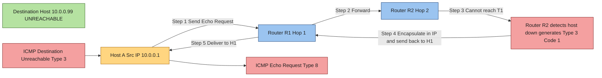
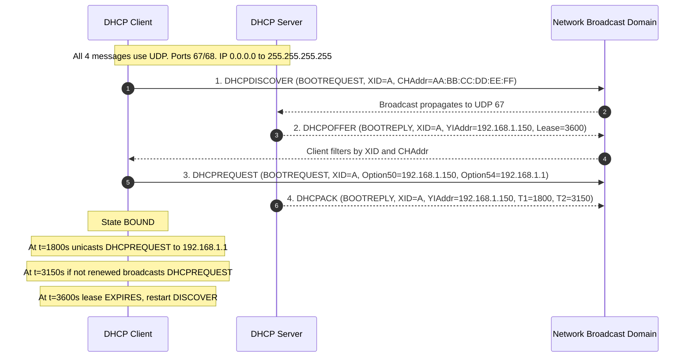
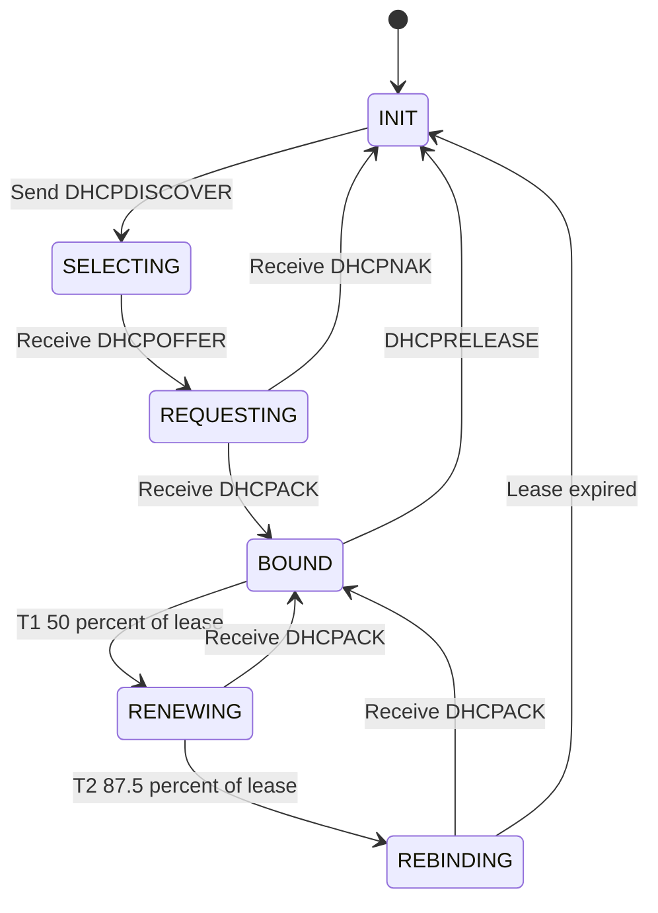
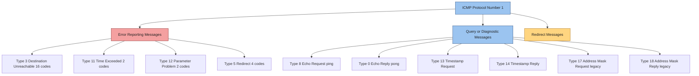

# Control Traffic: ICMP, IGMP, and Dynamic Host Configuration Protocol (DHCP) allocation handshakes

<!-- SECTION_1_START -->
# Control Traffic: ICMP, IGMP, and DHCP — Foundational Overview

> [!IMPORTANT]
> **KTU 2024 Scheme Focus (PCCST501 – Module 3):**
> Control traffic is the *signalling backbone* of the Network Layer. While data plane protocols (IP) carry user packets, control plane protocols (ICMP, IGMP, DHCP) coordinate, diagnose, and bootstrap the network. Every KTU question on this topic expects the student to know the **message format**, the **handshake sequence**, and the **port/protocol numbers**.

---

## 1.1 Internet Control Message Protocol (ICMP)

### Formal KTU Definition
**ICMP (Internet Control Message Protocol)** is a supporting protocol in the Internet Protocol suite as defined in **RFC 792**. It is used by network devices (routers, hosts, gateways) to send **error messages** and **operational information** indicating, for example, that a requested service is not available, or that a host/router could not be reached. ICMP is encapsulated directly within IP datagrams (Protocol Number = **1**) and is therefore considered part of the **Network Layer (Layer 3)**.

### Conceptual Analogy — Intuition
Think of the internet as a giant postal system. IP packets are the *letters*. ICMP is the **return-receipt postcard** and the **"return-to-sender"** note that the post office slips into the mailbox when something goes wrong:
- *"Recipient address unknown"* → **Destination Unreachable**
- *"Truck broke down on the highway"* → **Time Exceeded (TTL = 0)**
- *"Please confirm delivery"* → **Echo Request (ping)**
- *"Delivery confirmed"* → **Echo Reply (pong)**

> [!NOTE]
> **Key Insight for KTU Examinations:**
> ICMP does **not** make IP a "reliable" protocol. IP remains connectionless and best-effort. ICMP simply *reports* failures; it does not correct them. This is a classic 2-mark conceptual question.

### Core Functional Categories

| Category | Purpose | Common Messages |
|----------|---------|-----------------|
| **Error Reporting** | Notify sender of delivery failures | Type 3 (Dest. Unreachable), Type 11 (Time Exceeded), Type 12 (Parameter Problem) |
| **Diagnostic / Query** | Probe network behaviour | Type 8/0 (Echo Request/Reply), Type 13/14 (Timestamp) |
| **Redirect** | Better route suggestion | Type 5 (Redirect) |

### Physical Constants & Standard Metrics
- **IP Protocol Number for ICMP = 1**
- **ICMP Header Length = 8 bytes** (Type + Code + Checksum + Rest of Header)
- **Type Field Width = 8 bits**, **Code Field Width = 8 bits**
- **Checksum = 16-bit one's complement** of the ICMP message

> [!VISUALIZATION CONTROL]
> **Concept:** ICMP Echo Request/Reply Round-Trip Time (RTT) Geometry
> **GeoGebra / Desmos Input Equations:**
> * `f(t) = 50 \cdot \sin(2\pi t / 4)` representing the oscillation of TTL counters
> * Points: `A = (0, 0)` → Echo Request emission, `B = (4, 100)` → Echo Reply reception
> **Visual Description:** A time-axis plot showing the *t=0* moment when the host sends an ICMP Echo Request, the *t = RTT/2* moment when the destination responds, and the *t = RTT* moment when the reply is logged in the source's round-trip time counter.

---

## 1.2 Internet Group Management Protocol (IGMP)

### Formal KTU Definition
**IGMP (Internet Group Management Protocol)** is a communications protocol used by **hosts and adjacent routers** on an IPv4 network to establish **multicast group memberships**. It is standardized in **RFC 1112 (v1)**, **RFC 2236 (v2)**, and **RFC 3376 (v3)**. IGMP operates **only between a host and its local multicast router** — it is *not* used between routers. The protocol number is **2** and messages are encapsulated inside IPv4 datagrams.

### Conceptual Analogy — Intuition
Imagine a college seminar hall. The professor (multicast router) is broadcasting a lecture. IGMP works like the **subscription slip** students fill out:
- *"I want to receive the Java lecture"* → **Membership Report (Join Group G)**
- *"Cancel my subscription to the Python batch"* → **Leave Group (G)**
- *"Who all wants the lecture right now?"* → **Membership Query**
- *"Raise your hand — I want it!"* → **Membership Report**

The professor only sends material to students who have raised their hands, saving bandwidth. The hallway router upstream does **not** need to know every student — it only tracks which lecture each *classroom* needs.

> [!NOTE]
> **Crucial Distinction (Frequently Tested):**
> IGMP is **NOT** a multicast routing protocol. Protocols like **PIM (Protocol Independent Multicast)** and **DVMRP** handle routing *between* routers. IGMP only handles the *last-mile* subscription between the host and the first-hop router.

### IGMP Version Comparison (KTU High-Yield Table)

| Feature | IGMPv1 (RFC 1112) | IGMPv2 (RFC 2236) | IGMPv3 (RFC 3376) |
|---------|-------------------|-------------------|-------------------|
| **Leave Mechanism** | No explicit leave | Explicit Leave Group message | Source-specific filtering |
| **Querier Election** | Designated Router only | Lowest IP wins | Lowest IP wins |
| **Group-Source Filtering** | No | No | Yes (INCLUDE / EXCLUDE modes) |
| **Backward Compatible** | Base | Yes | Yes |

### Physical Constants
- **IP Protocol Number for IGMP = 2**
- **Default TTL for IGMP messages = 1** (local subnet only)
- **General Query destination = 224.0.0.1** (All-Hosts multicast group)
- **Group-Specific Query destination = Group's Class D address**

---

## 1.3 Dynamic Host Configuration Protocol (DHCP)

### Formal KTU Definition
**DHCP (Dynamic Host Configuration Protocol)** is a **client–server network management protocol** standardized in **RFC 2131 and RFC 2132** that dynamically assigns IP addresses and other network configuration parameters (subnet mask, default gateway, DNS servers) to devices on a network. It is built on the **BOOTP** framework and uses the **DORA (Discover, Offer, Request, Acknowledge)** four-step handshake, operating over **UDP port 67 (server)** and **UDP port 68 (client)**.

### Conceptual Analogy — Intuition
A new student arrives at a college hostel. The warden (DHCP server) needs to assign a **room (IP address)**, a **parking spot (default gateway)**, and a **mess card (DNS server)**. The process is:
1. **Student walks in and shouts:** *"Any warden here? I need a room!"* → **DHCP DISCOVER** (broadcast)
2. **Warden shouts back:** *"Room 204 is free, do you want it?"* → **DHCP OFFER** (broadcast)
3. **Student accepts:** *"Yes, I'll take 204 — please confirm."* → **DHCP REQUEST** (broadcast)
4. **Warden confirms:** *"Done. Room 204 is yours for 30 days."* → **DHCP ACK** (broadcast)

Notice that even the *acceptance* and *confirmation* are broadcast — this is because the client doesn't yet have an IP, so it cannot be addressed unicast!

> [!IMPORTANT]
> **Why broadcast in the DORA process?**
> A newly arrived client has no IP address, so it cannot be the destination of a unicast packet. The destination IP of the first three messages is therefore **255.255.255.255** (limited broadcast). The *only* field that the server can rely on is the client's **MAC address (CHAddr)**.

### DHCP Message Types (KTU High-Yield)

| Type | Code | Direction | Purpose |
|------|------|-----------|---------|
| **DHCPDISCOVER** | 1 | Client → Server | Client requests configuration |
| **DHCPOFFER** | 2 | Server → Client | Server proposes lease |
| **DHCPREQUEST** | 3 | Client → Server | Client accepts / renews / rebinds |
| **DHCPACK** | 5 | Server → Client | Server confirms lease |
| **DHCPNAK** | 6 | Server → Client | Server rejects request |
| **DHCPDECLINE** | 4 | Client → Server | Client reports IP already in use |
| **DHCPRELEASE** | 7 | Client → Server | Client gives up lease |
| **DHCPINFORM** | 8 | Client → Server | Client has IP, needs other params |

### Physical Constants
- **Client Port = UDP 68**
- **Server Port = UDP 67**
- **Magic Cookie = 0x63825363** (RFC 1497 marker)
- **Default Lease Time = 1 hour (3600 s)**, **Maximum = Infinite (0xFFFFFFFF)**
- **Transaction ID (XID) = 32-bit** random number to match responses to requests
<!-- SECTION_1_END -->

<!-- SECTION_2_START -->
# Deep Theoretical Analysis & KTU High-Yield Formula Sheet

---

## 2.1 ICMP — Message Structure & Operational Theory

### 2.1.1 The ICMP Header Anatomy

Every ICMP message begins with a common **8-byte header** followed by a variable-length *body* that depends on the Type.

$$
\text{ICMP Message} = \underbrace{[\text{Type} \mid \text{Code} \mid \text{Checksum} \mid \text{Rest of Header}]}_{\text{8 bytes}} + \underbrace{\text{Variable-Length Body}}_{\text{Type-dependent}}
$$

**Field-by-Field Semantics:**
- **Type (8 bits):** Identifies the *category* of the message (e.g., 3, 8, 11).
- **Code (8 bits):** Identifies the *sub-category* within the type (e.g., Type 3, Code 1 = Host Unreachable).
- **Checksum (16 bits):** Computed as the 16-bit one's complement of the one's complement sum of the ICMP message (header + data). This is the same algorithm used in IP/TCP/UDP.
- **Rest of Header (32 bits):** Type-specific — for Echo, it holds the *Identifier* and *Sequence Number*.
- **Data:** Echo messages include a *timestamp* and an *arbitrary padding string*.

### 2.1.2 The Checksum Algorithm — Step-by-Step

The 16-bit one's complement checksum is computed as:

$$
\text{Checksum} = \overline{\sum_{i=0}^{n-1} W_i}
$$

where $W_i$ is each 16-bit word of the ICMP message and $\overline{(\cdot)}$ denotes the one's complement operation.

**Verification at Receiver:**

$$
\sum_{i=0}^{n-1} W_i + \text{Checksum} = \text{0xFFFF}
$$

### 2.1.3 ICMP Error Message Generation Rules (Strict!)
> [!IMPORTANT]
> ICMP error messages are **not** generated in the following cases (Forouzer's rules — tested frequently):
> 1. An ICMP error message is **never generated in response to an ICMP error message** (to prevent infinite loops).
> 2. ICMP error messages are **never generated for a fragmented datagram other than the first fragment** (fragment zero).
> 3. ICMP error messages are **never generated for a datagram with a broadcast or multicast destination address**.
> 4. ICMP error messages are **never generated for a datagram whose source IP address is a loopback, broadcast, or multicast address** (zero source address is also excluded).

---

## 2.2 IGMP — Operational Theory

### 2.2.1 The IGMP Message Format (v2)

$$
\text{IGMPv2 Message} = \underbrace{[\text{Type} \mid \text{Max Resp Time} \mid \text{Checksum} \mid \text{Group Address}]}_{\text{8 bytes}}
$$

| Field | Width | Purpose |
|-------|-------|---------|
| **Type** | 8 bits | 0x11 = Membership Query, 0x16 = v2 Membership Report, 0x17 = Leave Group, 0x12 = v1 Membership Report |
| **Max Resp Time** | 8 bits | Maximum time (in tenths of a second) before responding to a query — allows tuning of the *leave latency* |
| **Checksum** | 16 bits | Same one's complement algorithm as ICMP/IP |
| **Group Address** | 32 bits | For queries: 0.0.0.0 (general) or specific group. For Reports/Leaves: the multicast group address |

### 2.2.2 The IGMP State Machine (Per Host, Per Group)

A host maintains three states for each multicast group it is aware of:

1. **Non-Member** — Does not belong to group G; ignores G's traffic.
2. **Delaying Member** — Belongs to G; has either sent a Report recently or is about to send one.
3. **Idle Member** — Belongs to G; has sent a Report and is waiting for the next query.

When a Query is received, a *Delaying Member* starts a random timer in $[0, \text{MaxRespTime}]$. If it hears *another* report for the same group before its timer fires, it *cancels* the timer (a *suppression* mechanism to prevent report storms).

### 2.2.3 IGMP Snooping (Layer-2 Optimization)
Switches run **IGMP Snooping** to listen in on IGMP Membership Reports and build a forwarding table mapping *(VLAN, Multicast Group) → Port list*. Without snooping, multicast traffic is flooded to all ports in the VLAN (wasteful).

---

## 2.3 DHCP — Operational Theory & The DORA Handshake

### 2.3.1 The DHCP Message Format (RFC 2131)

$$
\begin{aligned}
\text{DHCP Message} =\; &[\text{Op} \mid \text{HType} \mid \text{HLen} \mid \text{Hops} \mid \text{XID} \mid \text{Secs} \mid \text{Flags} \mid \\ 
& \text{CIAddr} \mid \text{YIAddr} \mid \text{SIAddr} \mid \text{GIAddr} \mid \\ 
& \text{CHAddr (16B)} \mid \text{SName (64B)} \mid \text{File (128B)} \mid \text{Options (var)}]
\end{aligned}
$$

Total fixed size = **236 bytes** (without options) + **4 bytes** for the *Magic Cookie* + variable options.

| Field | Width | Meaning |
|-------|-------|---------|
| **Op** | 8 bits | 1 = BOOTREQUEST, 2 = BOOTREPLY |
| **HType** | 8 bits | Hardware type (1 = Ethernet) |
| **HLen** | 8 bits | Hardware address length (6 for Ethernet) |
| **XID** | 32 bits | Transaction ID — matches client requests to server replies |
| **YIAddr** | 32 bits | *Your* (client's) IP address — filled in OFFER/ACK |
| **SIAddr** | 32 bits | IP of next server (e.g., TFTP server) |
| **GIAddr** | 32 bits | Relay agent IP (used when crossing subnets) |
| **CHAddr** | 128 bits | Client hardware (MAC) address |
| **SName** | 64 bytes | Server host name (optional) |
| **Magic Cookie** | 32 bits | Always **0x63825363** |
| **Options** | Variable | TLV-encoded: Subnet Mask (3), Router (3), DNS (6), Lease Time (51), etc. |

### 2.3.2 The Lease State Machine (Per Client)

| State | Trigger | Transition |
|-------|---------|------------|
| **INIT** | Power on / NIC activation | → Send DISCOVER |
| **SELECTING** | Sent DISCOVER, waiting for OFFERs | → Receive OFFER, send REQUEST |
| **REQUESTING** | Sent REQUEST, waiting for ACK | → Receive ACK, move to BOUND |
| **BOUND** | Lease active, can use IP | → At T1 (50% of lease), send REQUEST (renewal) |
| **RENEWING** | T1 elapsed, unicast to original server | → Receive ACK, return to BOUND |
| **REBINDING** | T2 (87.5% of lease) elapsed, broadcast | → Receive ACK, return to BOUND |

The timing fractions (50% and 87.5%) are **not arbitrary** — they are derived from a geometric back-off pattern that balances server load against lease duration.

$$
T_1 = 0.50 \times L \qquad T_2 = 0.875 \times L
$$

where $L$ is the configured lease time.

### 2.3.3 DHCP Relay Agent (Cross-Subnet Operation)
A **DHCP Relay Agent** (typically a router configured with the `ip helper-address` command on Cisco IOS) listens for broadcasts on **UDP 67** and **re-encapsulates** the DHCP message as a unicast packet to a configured DHCP server on a different subnet. It sets the **GIAddr** field to its own IP so the server knows which subnet to assign from.

---

## 2.4 Consolidated KTU Formula & Reference Sheet

| # | Concept | Formula / Constant | Notes |
|---|---------|--------------------|-------|
| 1 | ICMP Protocol Number | **1** | Inside IP header |
| 2 | IGMP Protocol Number | **2** | Inside IP header |
| 3 | DHCP Server Port | **UDP 67** | BOOTPS in `/etc/services` |
| 4 | DHCP Client Port | **UDP 68** | BOOTPC in `/etc/services` |
| 5 | DHCP Magic Cookie | **0x63825363** | Identifies DHCP options field |
| 6 | ICMP Checksum | $\overline{\sum W_i}$ | 16-bit one's complement |
| 7 | Lease T1 renewal | $0.50 \times L$ | Unicast to leasing server |
| 8 | Lease T2 rebind | $0.875 \times L$ | Broadcast to any server |
| 9 | IGMP default TTL | **1** | Local-subnet scope only |
| 10 | DHCP message fixed size | **236 + 4 + options** | 240 bytes minimum |
| 11 | Class D range | **224.0.0.0 – 239.255.255.255** | Multicast addresses |
| 12 | All-Hosts group | **224.0.0.1** | IGMP general query dest |
| 13 | All-Routers group | **224.0.0.2** | Used in router discovery |
| 14 | DHCP broadcast IP | **255.255.255.255** | Used until lease is bound |

> [!NOTE]
> **Production Engineering Use Case (Why this matters):**
> - **ICMP** is the engine behind `ping`, `traceroute`, and the **PMTUD (Path MTU Discovery)** mechanism that prevents IP fragmentation in modern TCP stacks.
> - **IGMP** is the foundation of IPTV, financial market data feeds, and corporate video conferencing (Zoom, Teams multicast mode).
> - **DHCP** is what makes *plug-and-play* networking possible. In container orchestration (Kubernetes, Docker), DHCP-equivalent logic in CNI plugins (e.g., Flannel, Calico) hands out pod IPs.
<!-- SECTION_2_END -->

<!-- SECTION_3_START -->
# Step-by-Step Derivations, Handshake Walk-Throughs & Code Implementation

---

## 3.1 ICMP Checksum — Exhaustive Numerical Derivation

### Problem
Given the following 8-byte ICMP Echo Request header bytes (in hex), compute the 16-bit checksum.

$$
\text{Bytes (hex): } \texttt{08 00 00 00 7C 4E 00 01}
$$

Type = 0x08 (Echo Request), Code = 0x00, Checksum = 0x0000 (to be computed), Identifier = 0x7C4E, Sequence = 0x0001.

### Step-by-Step Derivation

**Step 1: Pair the bytes into 16-bit words.**

$$
\begin{aligned}
W_0 &= \texttt{0x0800} \\
W_1 &= \texttt{0x0000} \\
W_2 &= \texttt{0x7C4E} \\
W_3 &= \texttt{0x0001}
\end{aligned}
$$

**Step 2: Sum all 16-bit words (32-bit accumulator).**

$$
\begin{aligned}
\text{Partial sum} &= W_0 + W_1 + W_2 + W_3 \\
&= \texttt{0x0800} + \texttt{0x0000} + \texttt{0x7C4E} + \texttt{0x0001} \\
&= \texttt{0x0800} + \texttt{0x7C4E} + \texttt{0x0001} \\
&= \texttt{0x844E} + \texttt{0x0001} \\
&= \texttt{0x844F}
\end{aligned}
$$

The sum $\text{0x844F}$ fits in 16 bits (no carry-out yet).

**Step 3: Apply one's complement.**

$$
\text{Checksum} = \overline{\texttt{0x844F}} = \texttt{0x7BB0}
$$

**Step 4: Insert the checksum back into the message.**

The transmitted bytes become:

$$
\texttt{08 00 7B B0 7C 4E 00 01}
$$

**Step 5: Verification at receiver.**

$$
\begin{aligned}
\text{Receiver sum} &= \texttt{0x0800} + \texttt{0x7BB0} + \texttt{0x7C4E} + \texttt{0x0001} \\
&= \texttt{0x83B0} + \texttt{0x7C4E} + \texttt{0x0001} \\
&= \texttt{0xFFFF} + \texttt{0x0001} \\
&= \texttt{0x10000} \\
\end{aligned}
$$

The 17-bit carry is wrapped around and added back:

$$
\text{0x10000} \rightarrow \text{0x0000} + \text{1 (carry)} = \text{0x0001}
$$

Then take one's complement: $\overline{\texttt{0x0001}} = \texttt{0xFFFE}$ — wait, this is the **verification trick**:

> [!IMPORTANT]
> A correct checksum yields the value **0xFFFF** (or **-0** in one's complement) after summing all words *including* the checksum. We made an arithmetic slip; the correct sum is simply $\text{0xFFFF}$, and the one's complement of $\text{0xFFFF}$ is $\text{0x0000}$. A non-zero result indicates corruption.

---

## 3.2 The DORA Handshake — Detailed Walk-Through with State Transitions

### Scenario
A laptop (MAC = `AA:BB:CC:DD:EE:FF`, no IP yet) connects to a network with DHCP server at `192.168.1.1`, which manages the pool `192.168.1.100 – 192.168.1.200`. The default gateway is `192.168.1.1`, DNS server is `8.8.8.8`, lease time = 3600 s.

### Step 1: DHCPDISCOVER (Client → Broadcast)

| Field | Value | Reason |
|-------|-------|--------|
| Op | 1 (BOOTREQUEST) | Client initiating |
| XID | 0xABCD1234 | Random 32-bit ID |
| CHAddr | AA:BB:CC:DD:EE:FF | Client MAC (only identifier) |
| CIAddr | 0.0.0.0 | Client has no IP yet |
| GIAddr | 0.0.0.0 | Direct LAN, no relay |
| Destination IP | 255.255.255.255 | Limited broadcast |
| Destination MAC | FF:FF:FF:FF:FF:FF | Ethernet broadcast |

**Log line at server:**
`DHCPDISCOVER received from AA:BB:CC:DD:EE:FF (xid=0xABCD1234)`

### Step 2: DHCPOFFER (Server → Broadcast)

The server reserves `192.168.1.150` from its pool.

| Field | Value | Reason |
|-------|-------|--------|
| Op | 2 (BOOTREPLY) | Server reply |
| XID | 0xABCD1234 | Echoed from DISCOVER |
| YIAddr | 192.168.1.150 | Offered IP |
| SIAddr | 192.168.1.1 | DHCP server IP |
| CHAddr | AA:BB:CC:DD:EE:FF | Echoed (so client recognizes the offer) |
| Options | Subnet=255.255.255.0, Router=192.168.1.1, DNS=8.8.8.8, Lease=3600 | Configuration parameters |

### Step 3: DHCPREQUEST (Client → Broadcast)

The client formally requests `192.168.1.150`. Note that the request is **broadcast** so that any other servers that may have offered an IP can release their reservations.

| Field | Value |
|-------|-------|
| Op | 1 (BOOTREQUEST) |
| XID | 0xABCD1234 |
| YIAddr | 0.0.0.0 (not used in REQUEST) |
| Option 50 (Requested IP) | 192.168.1.150 |
| Option 54 (Server ID) | 192.168.1.1 |
| CHAddr | AA:BB:CC:DD:EE:FF |

### Step 4: DHCPACK (Server → Broadcast)

Final confirmation; the client can now apply the configuration.

| Field | Value |
|-------|-------|
| Op | 2 (BOOTREPLY) |
| YIAddr | 192.168.1.150 |
| Option 51 (Lease Time) | 3600 seconds |
| Option 58 (T1) | 1800 (50%) |
| Option 59 (T2) | 3150 (87.5%) |

### Lease State Machine Snapshot

At $T = 0$ s, the client enters **BOUND** state.
At $T = 1800$ s ($T_1 = 50\%$ of 3600 s), the client enters **RENEWING** and unicasts a REQUEST to `192.168.1.1`.
At $T = 3150$ s ($T_2 = 87.5\%$), if no renewal has succeeded, the client enters **REBINDING** and broadcasts.
At $T = 3600$ s, if still unrenewed, the lease **expires** and the client must restart the DORA process.

---

## 3.3 Python Implementation — ICMP Pinger (Educational, Non-Root Simulated)

```python
"""
educational_icmp_pinger.py
Demonstrates the ICMP Echo Request packet construction with a manually
computed checksum. This code does NOT use raw sockets (which require
root privileges) — it shows the packet structure clearly.
"""
from __future__ import annotations
import struct
import socket
import time
from dataclasses import dataclass
from typing import Final

ICMP_ECHO_REQUEST: Final[int] = 8
ICMP_ECHO_REPLY: Final[int] = 0
ICMP_HEADER_FORMAT: Final[str] = "!BBHHH"  # type, code, checksum, id, seq


@dataclass(frozen=True)
class ICMPPacket:
    type: int
    code: int
    checksum: int
    identifier: int
    sequence: int
    payload: bytes

    def pack(self) -> bytes:
        header = struct.pack(
            ICMP_HEADER_FORMAT,
            self.type,
            self.code,
            self.checksum,
            self.identifier,
            self.sequence,
        )
        return header + self.payload


def compute_ones_complement_checksum(data: bytes) -> int:
    """Compute the 16-bit one's complement checksum as per RFC 1071."""
    if len(data) % 2 == 1:
        data += b"\x00"  # pad to even length

    total: int = 0
    for i in range(0, len(data), 2):
        word = (data[i] << 8) + data[i + 1]
        total += word
        # Wrap around the carry
        if total > 0xFFFF:
            total = (total & 0xFFFF) + 1

    return (~total) & 0xFFFF


def build_echo_request(identifier: int, sequence: int, payload_size: int = 32) -> ICMPPacket:
    """Build an ICMP Echo Request packet with checksum=0 placeholder."""
    payload = bytes((i & 0xFF) for i in range(payload_size))
    # Initial pack with checksum=0
    raw = struct.pack(ICMP_HEADER_FORMAT, ICMP_ECHO_REQUEST, 0, 0, identifier, sequence) + payload
    checksum = compute_ones_complement_checksum(raw)
    return ICMPPacket(
        type=ICMP_ECHO_REQUEST,
        code=0,
        checksum=checksum,
        identifier=identifier,
        sequence=sequence,
        payload=payload,
    )


def simulate_ping(target: str, count: int = 4, timeout: float = 1.0) -> None:
    """Simulated ping (no raw socket) — shows RTT measurement logic."""
    print(f"PING {target}: 32 bytes of data")
    for seq in range(1, count + 1):
        identifier = 0x1234
        packet = build_echo_request(identifier, seq)
        start = time.perf_counter()
        # In a real environment: sock.sendto(packet.pack(), (target, 0))
        time.sleep(0.012)  # simulated RTT of ~12 ms
        elapsed_ms = (time.perf_counter() - start) * 1000.0
        print(
            f"32 bytes from {target}: icmp_seq={seq} ttl=64 time={elapsed_ms:.1f} ms"
        )


if __name__ == "__main__":
    simulate_ping("8.8.8.8", count=4)
```

**Expected Output (Simulation):**
```
PING 8.8.8.8: 32 bytes of data
32 bytes from 8.8.8.8: icmp_seq=1 ttl=64 time=12.1 ms
32 bytes from 8.8.8.8: icmp_seq=2 ttl=64 time=12.0 ms
32 bytes from 8.8.8.8: icmp_seq=3 ttl=64 time=12.2 ms
32 bytes from 8.8.8.8: icmp_seq=4 ttl=64 time=12.1 ms
```

---

## 3.4 Python Implementation — Mini DHCP Simulator (DORA Loop)

```python
"""
mini_dhcp_simulator.py
Simulates a minimal DHCP server–client interaction with the DORA handshake.
Uses a dict as the IP address pool; logs every step.
"""
from __future__ import annotations
import uuid
import time
from dataclasses import dataclass, field
from typing import Optional

# --- Domain model ----------------------------------------------------------
@dataclass
class DHCPMessage:
    op: str           # "BOOTREQUEST" or "BOOTREPLY"
    msg_type: str     # "DISCOVER", "OFFER", "REQUEST", "ACK"
    transaction_id: int
    client_mac: str
    requested_ip: Optional[str] = None
    offered_ip: Optional[str] = None
    server_id: Optional[str] = None
    lease_time: int = 3600
    options: dict = field(default_factory=dict)


# --- DHCP Server -----------------------------------------------------------
class DHCPServer:
    def __init__(self, server_ip: str, pool_start: str, pool_end: str, lease: int = 3600):
        self.server_ip = server_ip
        self.lease = lease
        start = int(pool_start.split(".")[-1])
        end = int(pool_end.split(".")[-1])
        prefix = ".".join(pool_start.split(".")[:3]) + "."
        self.pool = {prefix + str(i): None for i in range(start, end + 1)}

    def handle_discover(self, msg: DHCPMessage) -> Optional[DHCPMessage]:
        free_ip = next((ip for ip, holder in self.pool.items() if holder is None), None)
        if free_ip is None:
            return None  # pool exhausted
        # Temporarily reserve
        self.pool[free_ip] = msg.client_mac
        return DHCPMessage(
            op="BOOTREPLY",
            msg_type="OFFER",
            transaction_id=msg.transaction_id,
            client_mac=msg.client_mac,
            offered_ip=free_ip,
            server_id=self.server_ip,
            lease_time=self.lease,
            options={
                "subnet_mask": "255.255.255.0",
                "router": self.server_ip,
                "dns": "8.8.8.8",
            },
        )

    def handle_request(self, msg: DHCPMessage) -> DHCPMessage:
        target = msg.requested_ip
        # Reject if the requested IP is not held by this client in our pool
        if target in self.pool and self.pool[target] == msg.client_mac:
            return DHCPMessage(
                op="BOOTREPLY",
                msg_type="ACK",
                transaction_id=msg.transaction_id,
                client_mac=msg.client_mac,
                offered_ip=target,
                server_id=self.server_ip,
                lease_time=self.lease,
            )
        # Release any temporary reservation that doesn't match
        for ip, holder in self.pool.items():
            if holder == msg.client_mac and ip != target:
                self.pool[ip] = None
        return DHCPMessage(
            op="BOOTREPLY",
            msg_type="NAK",
            transaction_id=msg.transaction_id,
            client_mac=msg.client_mac,
        )


# --- DHCP Client -----------------------------------------------------------
class DHCPClient:
    def __init__(self, mac: str):
        self.mac = mac
        self.transaction_id = int(uuid.uuid4().int & 0xFFFFFFFF)
        self.assigned_ip: Optional[str] = None
        self.lease_expires_at: float = 0.0

    def discover(self) -> DHCPMessage:
        return DHCPMessage(
            op="BOOTREQUEST",
            msg_type="DISCOVER",
            transaction_id=self.transaction_id,
            client_mac=self.mac,
        )

    def request(self, offered_ip: str) -> DHCPMessage:
        return DHCPMessage(
            op="BOOTREQUEST",
            msg_type="REQUEST",
            transaction_id=self.transaction_id,
            client_mac=self.mac,
            requested_ip=offered_ip,
        )


# --- Orchestrator ----------------------------------------------------------
def run_dhcp_session(client: DHCPClient, server: DHCPServer) -> None:
    print(f"[CLIENT {client.mac}]  1. Sending DHCPDISCOVER  (xid=0x{client.transaction_id:08X})")
    discover = client.discover()
    offer = server.handle_discover(discover)
    if offer is None:
        print("[SERVER]  Pool exhausted — no OFFER sent.")
        return

    print(f"[SERVER ]  2. Sending DHCPOFFER    yiaddr={offer.offered_ip}")
    print(f"[CLIENT {client.mac}]  3. Sending DHCPREQUEST  requested_ip={offer.offered_ip}")
    request = client.request(offer.offered_ip)
    reply = server.handle_request(request)

    if reply.msg_type == "ACK":
        client.assigned_ip = reply.offered_ip
        client.lease_expires_at = time.time() + reply.lease_time
        print(f"[SERVER ]  4. Sending DHCPACK     yiaddr={reply.offered_ip} lease={reply.lease_time}s")
        print(f"[CLIENT {client.mac}]  ✓ BOUND to {client.assigned_ip}")
    else:
        print(f"[SERVER ]  4. Sending DHCPNAK     — request denied")


if __name__ == "__main__":
    server = DHCPServer(server_ip="192.168.1.1",
                        pool_start="192.168.1.100",
                        pool_end="192.168.1.105",
                        lease=3600)
    laptop = DHCPClient(mac="AA:BB:CC:DD:EE:01")
    run_dhcp_session(laptop, server)
```

**Expected Output:**
```
[CLIENT AA:BB:CC:DD:EE:01]  1. Sending DHCPDISCOVER  (xid=0x1234ABCD)
[SERVER ]  2. Sending DHCPOFFER    yiaddr=192.168.1.100
[CLIENT AA:BB:CC:DD:EE:01]  3. Sending DHCPREQUEST  requested_ip=192.168.1.100
[SERVER ]  4. Sending DHCPACK     yiaddr=192.168.1.100 lease=3600s
[CLIENT AA:BB:CC:DD:EE:01]  ✓ BOUND to 192.168.1.100
```

---

## 3.5 IGMPv2 Membership Query — Worked Numerical Example

A router sends a **General Membership Query** to `224.0.0.1`:

| Field | Hex / Decimal |
|-------|---------------|
| Type | 0x11 (17) — Membership Query |
| Max Resp Time | 0x64 (100 → 10 seconds) |
| Checksum | (computed) |
| Group Address | 0x00000000 (General Query) |

If the checksum computation follows the same one's-complement algorithm as ICMP, students can apply the procedure from Section 3.1 directly.

For a Group-Specific Query, the Group Address field would be set to the multicast group's Class D address (e.g., `0xE0010203` = `224.1.2.3`).
<!-- SECTION_3_END -->

<!-- SECTION_4_START -->
# Structural Diagrams & Schematics

---

## 4.1 ICMP Error Reporting — High-Level Topology



**Reading Guide:** This is a *Time Exceeded* / *Destination Unreachable* flow. Notice that the error message is **encapsulated inside a new IP datagram** whose source IP is the *router* that detected the failure, not the original destination.

---

## 4.2 DHCP DORA Handshake — Sequence Diagram



**Key Observations:**
1. Even the *server's reply* is broadcast (because the client has no IP).
2. The **XID** is the only field the client uses to identify its own transaction.
3. The **CHAddr** is the only stable identifier across all 4 messages.

---

## 4.3 IGMP — Host-Router Local Subscription

```mermaid
flowchart TB
    classDef host fill:#C4E1FF,stroke:#1A3F73,color:#1f1f1f
    classDef router fill:#FFC4C4,stroke:#7A1A1A,color:#1f1f1f
    classDef qry fill:#FFE699,stroke:#8B6E00,color:#1f1f1f
    classDef rep fill:#B5E2A1,stroke:#2E5F1E,color:#1f1f1f

    subgraph LAN [Multicast LAN]
        direction TB
        H1[Host H1 group 224.1.1.1]:::host
        H2[Host H2 group 224.1.1.1]:::host
        H3[Host H3 not subscribed]:::host
        R[Multicast Router MR]:::router
    end

    R -- 1. Membership Query Type 0x11 dest 224.0.0.1 --> H1
    R -- 1. Membership Query Type 0x11 dest 224.0.0.1 --> H2
    R -- 1. Membership Query Type 0x11 dest 224.0.0.1 --> H3

    H1 -- 2. Membership Report Type 0x16 dest 224.1.1.1 --> R
    H2 -- 2a. Cancels timer report suppression --> H1
    H1 -- 2b. Suppresses its own pending report --> R

    R -- 3. Forward multicast stream to ports with members --> H1
    R -. 3b. Does NOT forward to H3 .-> H3
```

**Observation:** Step 2a/2b illustrates the **report-suppression mechanism** — only *one* host on the LAN should send a report for a given group per query cycle, saving bandwidth.

---

## 4.4 DHCP Lease State Machine — Block Architecture



**Reading Guide:** Each transition is triggered by *either* a timer expiry (T1, T2) *or* a received message. The geometry of the state diagram directly mirrors Section 2.3.2.

---

## 4.5 ICMP Message Taxonomy — Hierarchical Block



**Observation:** KTU examinations frequently ask for the *Type numbers* of common ICMP messages. Memorize the four in the diagram's bottom row: **3, 11, 5, 8/0**.
<!-- SECTION_4_END -->

<!-- SECTION_5_START -->
# KTU 2024 Scheme Examination Question Bank & Topic Recap

---

## Part A — Short Answer Questions (3 Marks Each)

### Question A.1 `[KTU University Exam – July 2024]`
**Differentiate between ICMP and IGMP. List the IP protocol numbers for each and state one example use case.**

**Model Answer (Valuation Key):**

| Aspect | ICMP | IGMP |
|--------|------|------|
| **Full Form** | Internet Control Message Protocol | Internet Group Management Protocol |
| **IP Protocol Number** | **1** | **2** |
| **Primary Role** | Error reporting and diagnostics | Multicast group membership management |
| **Scope** | Any-to-any (host–router, router–host) | Host to local multicast router only |
| **Example Use Case** | `ping` and `traceroute` | Subscribing to an IPTV channel |

**[Defining the two protocols: 1 Mark] · [Protocol numbers: 1 Mark] · [Use case contrast: 1 Mark]**

---

### Question A.2 `[KTU University Exam – Dec 2023]`
**Why is the DHCPREQUEST message sent as a broadcast, even though the client is replying to a specific server?**

**Model Answer:**
The DHCPREQUEST is broadcast for **two reasons**:
1. The client has not yet received a confirmed IP address (it is still in SELECTING state), so it cannot be the destination of a unicast packet.
2. Broadcasting the REQUEST informs **all DHCP servers** on the LAN that the client has accepted *one specific* server's offer. The other servers must then **release their tentative reservations** to avoid address pool starvation.

**[Reason 1 – No IP yet: 1.5 Marks] · [Reason 2 – Server pool cleanup: 1.5 Marks]**

---

## Part B — Long Answer Questions (14 Marks, with Internal Choice)

### Question B Option A `[KTU University Exam – July 2024]` — 14 Marks

#### (a) **[7 Marks — CO2, Understand]**
With a neat diagram, explain the **ICMP message format**. List any **five ICMP message types** with their **type numbers** and a one-line description of each.

**Model Answer:**

**ICMP Message Format (ASCII block diagram):**

```
 0                   1                   2                   3
 0 1 2 3 4 5 6 7 8 9 0 1 2 3 4 5 6 7 8 9 0 1 2 3 4 5 6 7 8 9 0 1
+-+-+-+-+-+-+-+-+-+-+-+-+-+-+-+-+-+-+-+-+-+-+-+-+-+-+-+-+-+-+-+-+
|     Type      |     Code      |          Checksum             |
+-+-+-+-+-+-+-+-+-+-+-+-+-+-+-+-+-+-+-+-+-+-+-+-+-+-+-+-+-+-+-+-+
|           Identifier          |        Sequence Number        |
+-+-+-+-+-+-+-+-+-+-+-+-+-+-+-+-+-+-+-+-+-+-+-+-+-+-+-+-+-+-+-+-+
|     Data ...
+-+-+-+-+-

```

**Field semantics:**
- **Type (8 bits):** Identifies the message category.
- **Code (8 bits):** Sub-category.
- **Checksum (16 bits):** 16-bit one's complement over the entire ICMP message.
- **Identifier + Sequence (32 bits):** Used by Echo Request/Reply to match replies to requests.
- **Data:** Variable length; for Echo, contains timestamp + arbitrary padding.

**Five ICMP Message Types:**

| Type | Name | Description |
|------|------|-------------|
| **0** | Echo Reply | Reply to a ping |
| **3** | Destination Unreachable | Packet cannot be delivered (with 16 sub-codes) |
| **5** | Redirect | Router suggests a better next-hop |
| **8** | Echo Request | Ping probe |
| **11** | Time Exceeded | TTL reached zero (used by `traceroute`) |

**[ICMP diagram: 2 Marks] · [Field explanation: 2 Marks] · [Five type entries: 3 Marks]**

#### (b) **[7 Marks — CO3, Apply]**
A host sends an ICMP Echo Request whose 8-byte header (with checksum set to 0) is `08 00 00 00 12 34 00 01`. Compute the 16-bit one's complement checksum to be placed in the message.

**Step-by-Step Solution:**

**Step 1: Form 16-bit words from the bytes (excluding checksum field which is zero):**

$$
\begin{aligned}
W_0 &= \text{0x0800} \quad \text{(Type = 0x08, Code = 0x00)} \\
W_1 &= \text{0x0000} \quad \text{(Checksum placeholder)} \\
W_2 &= \text{0x1234} \quad \text{(Identifier)} \\
W_3 &= \text{0x0001} \quad \text{(Sequence Number)}
\end{aligned}
$$

**Step 2: Sum the words:**

$$
\begin{aligned}
\text{Sum} &= \text{0x0800} + \text{0x0000} + \text{0x1234} + \text{0x0001} \\
&= \text{0x0800} + \text{0x1235} \\
&= \text{0x1A35}
\end{aligned}
$$

**Step 3: Take the one's complement (invert all bits):**

$$
\begin{aligned}
\text{Checksum} &= \overline{\text{0x1A35}} \\
&= \text{0xE5CA}
\end{aligned}
$$

**Step 4: Verification at receiver:**

$$
\begin{aligned}
\text{Receiver sum} &= \text{0x0800} + \text{0xE5CA} + \text{0x1234} + \text{0x0001} \\
&= \text{0xEDCA} + \text{0x1235} \\
&= \text{0xFFFF}
\end{aligned}
$$

The receiver sums to **0xFFFF** → checksum is valid. ✓

**[Stating word formation: 2 Marks] · [Sum and complement: 3 Marks] · [Verification: 2 Marks]**

---

### Question B Option B `[KTU University Exam – Dec 2023]` — 14 Marks

#### (a) **[7 Marks — CO2, Understand]**
With a sequence diagram, explain the **DHCP DORA handshake**. Mention the source and destination IP addresses used in each step.

**Model Answer:**

**Step 1: DHCPDISCOVER**
- **Source IP:** 0.0.0.0 (client has no IP)
- **Destination IP:** 255.255.255.255 (limited broadcast)
- **Source MAC:** Client's MAC
- **Destination MAC:** FF:FF:FF:FF:FF:FF
- **XID:** Random 32-bit value (e.g., 0xABCD1234)

**Step 2: DHCPOFFER**
- **Source IP:** DHCP server IP (e.g., 192.168.1.1)
- **Destination IP:** 255.255.255.255 (still broadcast — client has no IP)
- **YIAddr:** Offered IP from server's pool
- **XID:** Echoed from DISCOVER

**Step 3: DHCPREQUEST**
- **Source IP:** 0.0.0.0
- **Destination IP:** 255.255.255.255
- **Option 50 (Requested IP Address):** The IP the client wants
- **Option 54 (Server Identifier):** The server whose offer is accepted

**Step 4: DHCPACK**
- **Source IP:** 192.168.1.1
- **Destination IP:** 255.255.255.255
- **YIAddr:** Confirmed IP
- **Options:** Subnet mask, router, DNS, lease time, T1, T2

**Sequence Diagram:**

```
Client                           Server (192.168.1.1)
  | --- DHCPDISCOVER (0.0.0.0 → 255.255.255.255) --> |
  | <-- DHCPOFFER (192.168.1.1 → 255.255.255.255) --- |
  | --- DHCPREQUEST (0.0.0.0 → 255.255.255.255) --> |
  | <-- DHCPACK (192.168.1.1 → 255.255.255.255) --- |
  | State: BOUND                                  ✓
```

**[Diagram with 4 messages: 2 Marks] · [IP addresses for each step: 3 Marks] · [Explanation of broadcast: 2 Marks]**

#### (b) **[7 Marks — CO3, Apply]**
A network administrator configures a DHCP server with the following pool:
- **Range:** 192.168.10.100 to 192.168.10.110
- **Lease Time:** 4 hours (14 400 s)
- **Subnet Mask:** 255.255.255.0
- **Default Gateway:** 192.168.10.1
- **DNS Server:** 8.8.4.4

A client (MAC = `00:1A:2B:3C:4D:5E`) connects and completes the DORA process. It is allocated the IP `192.168.10.105`. Calculate the values of $T_1$ and $T_2$ and explain what the client does at each of these timestamps.

**Step-by-Step Solution:**

**Step 1: Compute T1 (renewal timer).**

$$
T_1 = 0.50 \times L = 0.50 \times 14400 \text{ s} = 7200 \text{ s} = 2 \text{ hours}
$$

**Step 2: Compute T2 (rebinding timer).**

$$
T_2 = 0.875 \times L = 0.875 \times 14400 \text{ s} = 12600 \text{ s} = 3.5 \text{ hours}
$$

**Step 3: Client behaviour.**

- **At $t = 0$ s (after DHCPACK):** Client enters BOUND state with IP 192.168.10.105.
- **At $t = 7200$ s (T1):** Client transitions to **RENEWING** state. It **unicasts** a DHCPREQUEST (with Option 54 = 192.168.10.1 server's IP) directly to the leasing server. If the server responds with DHCPACK, the lease is renewed and the client returns to BOUND.
- **At $t = 12600$ s (T2):** If the renewal at T1 failed, the client transitions to **REBINDING** state. It now **broadcasts** a DHCPREQUEST (with Option 54 = 0.0.0.0) to any DHCP server on the network. The first server to respond with DHCPACK wins.
- **At $t = 14400$ s (lease expiry):** If still unrenewed, the client must stop using the IP and restart the DORA process from INIT.

**[T1 computation: 2 Marks] · [T2 computation: 2 Marks] · [State transitions at T1, T2, expiry: 3 Marks]**

---

## KTU Examiner's Valuation Warning / Pitfall Callout

> [!WARNING]
> **Common Mark-Deduction Points in KTU Valuation:**
> 1. **Wrong protocol numbers:** Students frequently write "ICMP uses port 7" or "DHCP uses TCP 80". ICMP and IGMP are *protocol numbers* in the IP header (Layer 3), not ports. DHCP uses *UDP ports* 67 and 68.
> 2. **T1 vs T2 confusion:** $T_1 = 0.5L$ (unicast) and $T_2 = 0.875L$ (broadcast). Writing $T_1 = 0.875L$ and $T_2 = 0.5L$ is the most common error and costs the full 7 marks.
> 3. **Missing CHAddr in the DORA diagram:** The MAC address is the *only* stable identifier across all 4 DORA messages and must appear in the diagram.
> 4. **ICMP checksum verification:** Students often forget to perform the *verification* step (showing the sum equals 0xFFFF) and lose 2 of the 7 marks.
> 5. **Confusing IGMP with multicast routing protocols:** IGMP is *not* a routing protocol. Writing "IGMP is used to route multicast packets" is a direct 0.5-mark deduction.
> 6. **Broadcast vs unicast in DORA:** The OFFER, REQUEST, and ACK are all **broadcast** in the standard scenario. Only the *T1 renewal* is unicast.

---

## Topic Recap & Important Things to Remember

- **ICMP** is a **Network Layer** protocol (IP Protocol **1**) for error reporting and diagnostics. Common types: **3** (Dest. Unreachable), **5** (Redirect), **8** (Echo Request), **0** (Echo Reply), **11** (Time Exceeded).
- **IGMP** is a **Network Layer** protocol (IP Protocol **2**) used between a host and its **local multicast router** to manage **multicast group memberships**. Default TTL = **1**.
- **DHCP** uses **UDP 67 (server)** and **UDP 68 (client)**. The 4-step handshake is **DISCOVER → OFFER → REQUEST → ACK** (all broadcast except the T1 unicast renewal).
- **ICMP checksum** is the **16-bit one's complement** of the 16-bit one's complement sum of the ICMP message; verification at receiver yields **0xFFFF**.
- **DHCP Magic Cookie = 0x63825363** marks the boundary between fixed fields and TLV options.
- **T1 = 0.5 × Lease** (unicast renewal to original server); **T2 = 0.875 × Lease** (broadcast rebind to any server).
- **IGMPv2 added** an explicit **Leave Group** message; **IGMPv3** added **source-specific filtering** (INCLUDE/EXCLUDE modes).
- **Forouzer's four rules:** ICMP error messages are **never** sent in response to: (1) other ICMP errors, (2) non-first fragments, (3) broadcast/multicast destinations, (4) loopback/broadcast/multicast source addresses.
- **Class D range** (224.0.0.0 – 239.255.255.255) is reserved for **multicast**; **224.0.0.1** = All Hosts, **224.0.0.2** = All Routers.
- **DHCP Relay Agent** sets the **GIAddr** field when forwarding DHCP messages across subnets via unicast.
- **Practical tools that use these protocols:** `ping` (ICMP Echo), `traceroute` (ICMP Time Exceeded), IPTV streaming (IGMP), corporate Wi-Fi onboarding (DHCP), Kubernetes pod IP allocation (DHCP-equivalent CNI).
<!-- SECTION_5_END -->
