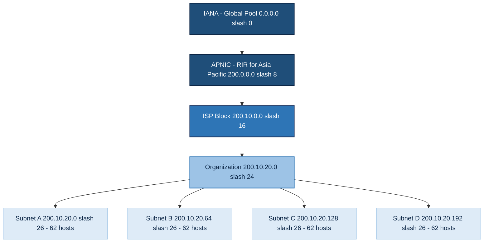
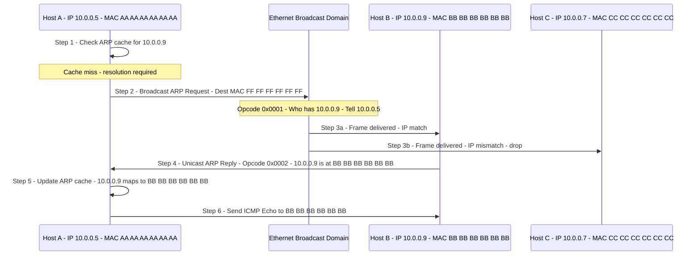
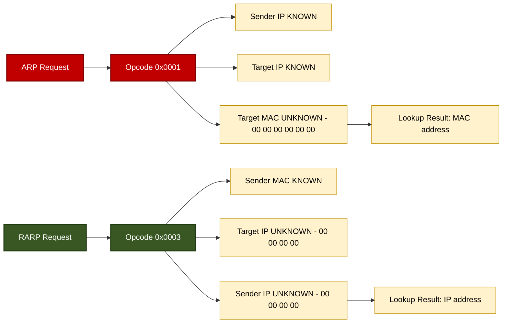
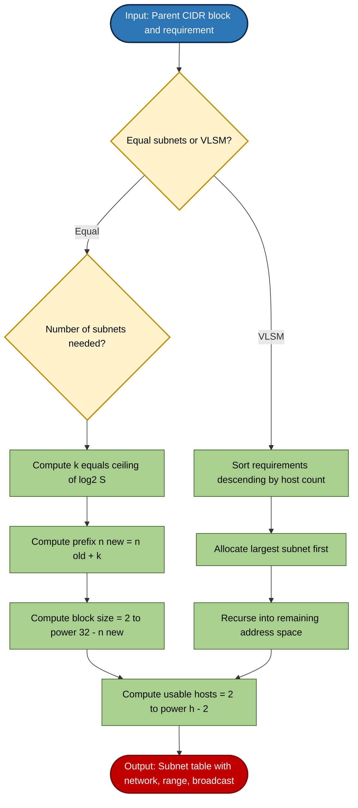

# IP Allocation & Subnetting: Classless Inter-Domain Routing (CIDR) design, Subnet masking, and Address Resolution Protocols (ARP, RARP)

<!-- SECTION_1_START -->
# IP Allocation & Subnetting: CIDR, Subnet Masking, ARP & RARP

## 1.1 Classless Inter-Domain Routing (CIDR) — Formal Definition

**Classless Inter-Domain Routing (CIDR)** is a method of allocating IP addresses and routing Internet Protocol packets that replaces the legacy classful network architecture. CIDR is formally defined in **RFC 1518** and **RFC 4632**. It uses **variable-length subnet masking (VLSM)** and the **slash notation (prefix length)** — for example, `192.168.1.0/24` — to denote the number of leading contiguous `1` bits in the network mask.

> [!IMPORTANT]
> **Syllabus Highlight (KTU PCCST501 — Module 3):** CIDR supersedes Class A/B/C boundaries. The address block is described by a **prefix** $n$ such that the network mask is $32 - n$ host bits remaining. Total usable addresses in a block $= 2^{(32-n)} - 2$ (subtracting network and broadcast addresses).

The pre-CIDR classful boundaries were rigid: Class A (8-bit prefix), Class B (16-bit prefix), Class C (24-bit prefix). CIDR allows any prefix length $n$ where $0 \le n \le 32$, enabling granular, hierarchical address aggregation that drastically reduced the global routing table size (from ~200,000 routes in 1994 to manageable supernet blocks).

> [!NOTE]
> **Core CIDR Invariant:** A CIDR block $A.B.C.D/n$ aggregates every address whose first $n$ high-order bits match the prefix $A.B.C.D$ exactly. Routers forward on the **longest matching prefix** when multiple entries match.

### Intuitive Analogy — The Postal System
Imagine Kerala's postal system. Instead of writing "Kochi City, Kerala, India" (rigid classful hierarchy: Country → State → City → House), CIDR allows you to write a flexible ZIP-style code: `682001-682050` covering exactly a 50-house locality. The **prefix** is the area, and the **suffix length** is flexible. Two houses with the same prefix share the same postal van route. This is exactly how CIDR aggregates: routers share one "van route" (route entry) for the entire prefix, only diverging when a longer match exists.

## 1.2 Subnet Masking — Formal Definition

A **subnet mask** is a 32-bit number that logically partitions an IP address into a **network portion** (high-order bits) and a **host portion** (low-order bits). The mask is constructed by writing a contiguous sequence of `1`s followed by a contiguous sequence of `0`s. Performing a **bitwise AND** between an IP address and its mask yields the **network ID**.

> [!NOTE]
> **Subnet Mask vs. CIDR Notation:** The mask `255.255.255.0` is the dotted-decimal representation of `11111111.11111111.11111111.00000000`, which is equivalent to the CIDR prefix `/24`. Both denote the same logical partition.

The **default masks** for the legacy classful system are:
- **Class A:** `255.0.0.0` (or `/8`)
- **Class B:** `255.255.0.0` (or `/16`)
- **Class C:** `255.255.255.0` (or `/24`)

### Intuitive Analogy — The Building Address
Think of an IP address as a complete office address: `Building-Block-Street-Floor-Room`. The subnet mask acts as a highlighter pen. If your mask is `/24`, you highlight the first three segments (Building, Block, Street) — those are identical for everyone in the same LAN. The unhighlighted `Floor-Room` part is unique to each device. The "highlight" is the **network**, the "unhighlight" is the **host**.

## 1.3 Address Resolution Protocol (ARP) — Formal Definition

**Address Resolution Protocol (ARP)**, defined in **RFC 826**, is a link-layer protocol used to map a known **Layer 3 (IPv4) address** to an unknown **Layer 2 (MAC) address** within a local broadcast domain. ARP operates directly over the data-link layer and is encapsulated inside Ethernet frames.

> [!IMPORTANT]
> **Core ARP Equation:** $\text{ARP:}\ \{ \text{IP}_{32} \} \;\longrightarrow\; \{ \text{MAC}_{48} \}$, scope = local broadcast segment.

## 1.4 Reverse Address Resolution Protocol (RARP) — Formal Definition

**Reverse Address Resolution Protocol (RARP)**, defined in **RFC 903**, performs the *inverse* mapping: it translates a known **hardware (MAC) address** into an **IP address**. RARP was historically used by diskless workstations at boot time to discover their IP identity from a centralized RARP server.

> [!NOTE]
> **ARP vs. RARP — Direction of Resolution:** ARP answers "Given an IP, what is the MAC?" RARP answers "Given a MAC, what is the IP?" Modern systems have largely replaced RARP with **BOOTP** and later **DHCP**, which provide additional configuration (subnet mask, gateway, DNS).

### Intuitive Analogy — Telephone Directory
- **ARP** is like looking up a colleague's **desk extension number** when you already know their name (IP). You consult the office directory (ARP cache) or shout the name in the corridor (ARP broadcast).
- **RARP** is the opposite: a brand-new employee (diskless workstation) walks in knowing only their **badge number (MAC)** and needs to discover their **name and extension (IP)** from the HR desk (RARP server).

> [!VISUALIZATION CONTROL]
> **Concept:** Bitwise AND visualization of subnet masking for `192.168.1.130 /25`
> **GeoGebra / Desmos Input Equations (Bit Grid Model):**
> * `IP   = 11000000.10101000.00000001.10000010`
> * `MASK = 11111111.11111111.11111111.10000000`
> * `AND  = 11000000.10101000.00000001.10000000 = 192.168.1.128`
> **Visual Description:** Plot a 32-cell horizontal grid where the first 25 cells are shaded (network) and the last 7 are blank (host). Show the AND operation collapsing host bits to zero, producing the network ID `192.168.1.128`.

---

<!-- SECTION_1_END -->

<!-- SECTION_2_START -->
# Deep Theoretical Analysis & KTU High-Yield Formula Sheet

## 2.1 CIDR — Hierarchical Aggregation Model

CIDR achieves two simultaneous engineering goals: **route aggregation** (also called *supernetting*) at the autonomous-system level, and **flexible address allocation** at the organization level. The Internet Assigned Numbers Authority (IANA) and the Regional Internet Registries (RIRs — APNIC for Asia-Pacific, RIPE for Europe, ARIN for North America) hand out CIDR blocks to ISPs, who subdivide them further.

### Key CIDR Design Principles
1. **Prefix-based forwarding:** Routers examine the destination IP and select the routing table entry with the **longest matching prefix (LPM)**.
2. **Aggregation boundary:** A supernet block `A.B.C.D/n` is announced as a single route, hiding internal topology from upstream providers.
3. **Power-of-two alignment:** Every CIDR block must contain a number of addresses that is an exact power of two ($2^h$, where $h = 32 - n$).
4. **Bitwise continuity:** The network ID must have all host bits set to `0`; the directed broadcast must have all host bits set to `1`.

## 2.2 Subnetting — Subdivision of a Network Block

Subnetting is the recursive application of CIDR logic: a parent block `A.B.C.D/n` is divided into $2^k$ equal child subnets, each of prefix `n+k`, by borrowing $k$ bits from the host portion. Every child subnet has $2^{(32-n-k)} - 2$ usable host addresses.

### Subnetting Algorithm — Step-by-Step Logic
1. Identify the parent block prefix $n$ and the desired number of subnets $S$.
2. Compute $k = \lceil \log_2 S \rceil$ — the number of bits to borrow.
3. New prefix = $n + k$.
4. Number of subnets created = $2^k$.
5. Hosts per subnet = $2^{(32-n-k)} - 2$.
6. Subnet increment (block size) = $2^{(32-n-k)}$ in the relevant octet.
7. Generate network IDs by stepping from `0` in steps of $2^{(32-n-k)}$ through the address space.

## 2.3 Variable Length Subnet Masking (VLSM)

VLSM allows subnets of **different sizes** within the same parent block. The engineer assigns the largest subnets first (using the longest host-bit requirement), then recurses into the remaining address space with shorter prefixes. VLSM is a direct consequence of CIDR's classless nature and is heavily tested in KTU examinations.

> [!IMPORTANT]
> **VLSM Rule of Thumb:** Always allocate the subnet with the **largest host requirement first**. This minimizes fragmentation of the address space.

## 2.4 ARP — Operational Phases

ARP operates in two phases: **Resolution** (when the mapping is unknown) and **Maintenance** (cache management).

### ARP Resolution Sequence
1. **Cache Lookup:** Host checks its internal ARP table for the destination IP. If present, forwarding proceeds immediately.
2. **ARP Request (Broadcast):** If absent, the host broadcasts an ARP request packet with `Destination MAC = FF:FF:FF:FF:FF:FF` and `Target IP = <desired IP>`. The payload reads: *"Who has IP $X$? Tell IP $Y$ (MAC $M_Y$)."*
3. **ARP Reply (Unicast):** The host owning IP $X$ responds directly (unicast) to $M_Y$ with: *"IP $X$ is at MAC $M_X$."*
4. **Cache Update:** The requester stores $\{X \rightarrow M_X\}$ in its ARP cache with a TTL (typically 15–20 minutes on Windows, 60 seconds on Linux by default).

### ARP Packet Format (28-byte payload inside Ethernet frame)
- **Hardware Type (2 bytes):** `0x0001` for Ethernet.
- **Protocol Type (2 bytes):** `0x0800` for IPv4.
- **Hardware Address Length (1 byte):** `6` (MAC).
- **Protocol Address Length (1 byte):** `4` (IPv4).
- **Opcode (2 bytes):** `1` = Request, `2` = Reply, `3` = RARP Request, `4` = RARP Reply.
- **Sender Hardware Address (6 bytes), Sender Protocol Address (4 bytes), Target Hardware Address (6 bytes), Target Protocol Address (4 bytes).**

## 2.5 RARP — Operational Phases

RARP requires a **RARP server** on the local segment. Diskless clients broadcast a RARP request containing their MAC address; the server looks up the corresponding IP in its configuration table and unicasts the reply.

### RARP Limitations (Why it was superseded)
- RARP provides **only** an IP address — no subnet mask, no gateway, no DNS.
- Requires a RARP server on **every** physical network.
- Uses link-layer broadcasts that routers do not forward, so it does not scale.
- Replaced by **BOOTP** (bootstrap protocol, RFC 951) and later **DHCP** (RFC 2131), which support vendor options, relay agents, and full configuration delivery.

## 2.6 KTU High-Yield Formula Cheat Sheet

| # | Quantity | Formula | Unit / Notes |
|---|----------|---------|--------------|
| 1 | Block size (addresses in CIDR block) | $B = 2^{32-n}$ | addresses |
| 2 | Usable host addresses | $H = 2^{32-n} - 2$ | addresses (excludes network & broadcast) |
| 3 | Subnets from borrowing $k$ bits | $S = 2^k$ | subnets |
| 4 | Hosts per subnet | $H_s = 2^{h-k} - 2$ | where $h = 32-n$ original host bits |
| 5 | Subnet increment (step) | $\Delta = 2^{h-k}$ | in the relevant octet |
| 6 | Number of network bits | $n_{\text{new}} = n_{\text{old}} + k$ | bits |
| 7 | Wildcard mask | $\overline{M} = \text{NOT}(M)$ | used in ACLs |
| 8 | Subnets required (find $k$) | $k = \lceil \log_2 S_{\text{req}} \rceil$ | ceiling function |
| 9 | Hosts required (find $k$) | $k = \lceil \log_2(H_{\text{req}} + 2) \rceil$ | ceiling function |
| 10 | Longest Match Prefix (LPM) wins | $\text{Match} = \max_{i} \{ n_i : \text{prefix}_i \subseteq \text{dest}_i \}$ | routing decision |
| 11 | ARP cache entry format | $\langle \text{IP}_{32}, \text{MAC}_{48}, \text{TTL}, \text{Type} \rangle$ | tuple |
| 12 | ARP broadcast MAC | $\text{FF:FF:FF:FF:FF:FF}$ | Layer 2 destination |
| 13 | ARP request Opcode | `0x0001` | hexadecimal |
| 14 | ARP reply Opcode | `0x0002` | hexadecimal |
| 15 | RARP request Opcode | `0x0003` | hexadecimal |
| 16 | RARP reply Opcode | `0x0004` | hexadecimal |
| 17 | Maximum ARP packet | 28 bytes | payload (excluding Ethernet) |

> [!NOTE]
> **Important Engineering Utility:** CIDR/VLSM is the foundation of **route aggregation in BGP**, which keeps the Internet's default-free zone (DFZ) routing table scalable. ARP is the silent workhorse of every IPv4 LAN — without it, no Layer 3 packet would ever traverse an Ethernet switch in a host-to-host transmission.

---

<!-- SECTION_2_END -->

<!-- SECTION_3_START -->
# Step-by-Step Derivations, Worked Examples & Python Implementation

## 3.1 Worked Example 1 — Equal Subnetting of a Class C Block

**Problem Statement:** Given the network `200.10.20.0/24`, divide it into **4 equal subnets**. For each subnet, list: (a) network ID, (b) subnet mask, (c) first usable host, (d) last usable host, (e) directed broadcast, (f) usable host count.

### Step-by-Step Solution

**Step 1 — Identify variables.**
- Parent prefix $n = 24$, original host bits $h = 32 - 24 = 8$.
- Required subnets $S_{\text{req}} = 4$.
- Borrowed bits $k = \lceil \log_2 4 \rceil = \lceil 2.0 \rceil = 2$.

**Step 2 — Compute new prefix and host bits per subnet.**
- New prefix: $n_{\text{new}} = 24 + 2 = 26$, i.e., `/26`.
- Host bits per subnet: $h_s = 8 - 2 = 6$.
- Subnet increment: $\Delta = 2^6 = 64$.

**Step 3 — Generate subnets by stepping the 4th octet in increments of 64.**

| Subnet | Network ID | First Host | Last Host | Broadcast | Mask | Usable Hosts |
|--------|------------|------------|-----------|-----------|------|--------------|
| S0 | `200.10.20.0/26` | `200.10.20.1` | `200.10.20.62` | `200.10.20.63` | `255.255.255.192` | 62 |
| S1 | `200.10.20.64/26` | `200.10.20.65` | `200.10.20.126` | `200.10.20.127` | `255.255.255.192` | 62 |
| S2 | `200.10.20.128/26` | `200.10.20.129` | `200.10.20.190` | `200.10.20.191` | `255.255.255.192` | 62 |
| S3 | `200.10.20.192/26` | `200.10.20.193` | `200.10.20.254` | `200.10.20.255` | `255.255.255.192` | 62 |

**Step 4 — Verification using bitwise AND for S0.**

$$
\begin{aligned}
\text{IP sample} &= 200.10.20.130 = 11001000.00001010.00010100.10000010 \\
\text{Mask } /26 &= 11111111.11111111.11111111.11000000 \\
\text{AND} &= 11001000.00001010.00010100.10000000 = 200.10.20.128 \;\Rightarrow\; \text{S2 ✓}
\end{aligned}
$$

This confirms the bitwise logic. **Total usable hosts = $4 \times 62 = 248$**, accounting for $256 - 4 \text{ (broadcasts)} - 4 \text{ (network IDs)} = 248$. ✓

## 3.2 Worked Example 2 — VLSM Allocation

**Problem Statement:** An organization is assigned `172.16.0.0/16`. It needs 4 subnets: A (500 hosts), B (250 hosts), C (120 hosts), D (60 hosts). Design the VLSM scheme.

### Step-by-Step VLSM Solution

**Step 1 — Sort by descending host requirement:** A (500) > B (250) > C (120) > D (60).

**Step 2 — Subnet A: Need 500 hosts.**
- $k_A = \lceil \log_2(500 + 2) \rceil = \lceil \log_2 502 \rceil = 9$ (since $2^9 = 512$).
- Prefix: `/23` (16 + 9 = 25... correction: borrow 9 bits gives $/16+9 = /25$, with $h_s = 7$, hosts = $2^7 - 2 = 126$. That's too small!)

> **Re-derivation:** For 500 hosts, we need $h_s$ such that $2^{h_s} - 2 \ge 500$. So $h_s \ge 9$ (since $2^9 - 2 = 510$). Borrowed bits $k = 16 - 9 = 7$. New prefix: `/23`. Block size = $2^9 = 512$.

- **Subnet A:** `172.16.0.0/23` → Network: `172.16.0.0`, Broadcast: `172.16.1.255`, Range: `172.16.0.1 – 172.16.1.254`.

**Step 3 — Subnet B: Need 250 hosts.**
- $h_s = 8$ (since $2^8 - 2 = 254 \ge 250$). New prefix: `/24`. Block = $2^8 = 256$.
- **Subnet B:** `172.16.2.0/24` → Range: `172.16.2.1 – 172.16.2.254`, Broadcast: `172.16.2.255`.

**Step 4 — Subnet C: Need 120 hosts.**
- $h_s = 7$ (since $2^7 - 2 = 126 \ge 120$). New prefix: `/25`. Block = $2^7 = 128$.
- **Subnet C:** `172.16.3.0/25` → Range: `172.16.3.1 – 172.16.3.126`, Broadcast: `172.16.3.127`.

**Step 5 — Subnet D: Need 60 hosts.**
- $h_s = 6$ (since $2^6 - 2 = 62 \ge 60$). New prefix: `/26`. Block = $2^6 = 64$.
- **Subnet D:** `172.16.3.64/26` → Range: `172.16.3.65 – 172.16.3.126`, Broadcast: `172.16.3.127`.

**Step 6 — Total address accounting.** Used: $512 + 256 + 128 + 64 = 960$ addresses out of $65{,}536$ — efficiency is low but acceptable for a hierarchical VLSM design. The remaining space `172.16.4.0/22` onwards is reserved for future growth.

## 3.3 Worked Example 3 — ARP Cache Resolution Walkthrough

**Scenario:** Host A (IP `10.0.0.5`, MAC `AA:AA:AA:AA:AA:AA`) wants to ping Host B (IP `10.0.0.9`, MAC unknown).

**Step 1.** Host A checks its ARP cache. No entry for `10.0.0.9`. Resolution required.

**Step 2.** Host A constructs an ARP Request and broadcasts it:

| Field | Value |
|-------|-------|
| Destination MAC | `FF:FF:FF:FF:FF:FF` |
| Source MAC | `AA:AA:AA:AA:AA:AA` |
| Ethertype | `0x0806` (ARP) |
| Opcode | `0x0001` (Request) |
| Sender IP | `10.0.0.5` |
| Target IP | `10.0.0.9` |
| Target MAC | `00:00:00:00:00:00` (unknown) |

**Step 3.** All hosts on the segment receive the frame. Only Host B (whose IP matches) processes the packet and constructs an ARP Reply (unicast):

| Field | Value |
|-------|-------|
| Destination MAC | `AA:AA:AA:AA:AA:AA` |
| Source MAC | `BB:BB:BB:BB:BB:BB` |
| Opcode | `0x0002` (Reply) |
| Sender IP | `10.0.0.9` |
| Sender MAC | `BB:BB:BB:BB:BB:BB` |

**Step 4.** Host A receives the reply, updates its ARP cache: `{10.0.0.9 → BB:BB:BB:BB:BB:BB}`, and proceeds to encapsulate the ICMP echo request in a frame addressed to `BB:BB:BB:BB:BB:BB`.

## 3.4 Python Implementation — IP Subnet Calculator

The following Python program performs CIDR block decomposition exactly as required in KTU lab examinations. It includes type hints, boundary validation, and explicit error handling.

```python
from __future__ import annotations
import ipaddress
import sys
import logging

logging.basicConfig(
    level=logging.INFO,
    format="%(asctime)s [%(levelname)s] %(message)s",
)
logger = logging.getLogger("CIDR_Calculator")


def ip_to_int(ip_str: str) -> int:
    """Convert dotted-decimal IPv4 string to a 32-bit unsigned integer."""
    try:
        return int(ipaddress.IPv4Address(ip_str))
    except (ipaddress.AddressValueError, ValueError) as exc:
        logger.error(f"Invalid IPv4 address '{ip_str}': {exc}")
        raise


def int_to_ip(value: int) -> str:
    """Convert a 32-bit unsigned integer to dotted-decimal IPv4 string."""
    if not (0 <= value <= 0xFFFFFFFF):
        raise ValueError(f"Value {value} out of 32-bit range")
    return str(ipaddress.IPv4Address(value))


def calculate_cidr_block(network_input: str) -> dict:
    """
    Decompose a CIDR block (e.g. '200.10.20.0/26') into
    network, broadcast, host range, mask, wildcard, and capacity.
    """
    try:
        net = ipaddress.IPv4Network(network_input, strict=True)
    except (ipaddress.AddressValueError, ValueError) as exc:
        logger.error(f"CIDR parse error for '{network_input}': {exc}")
        raise

    network_id = int_to_ip(int(net.network_address))
    broadcast = int_to_ip(int(net.broadcast_address))
    first_host = int_to_ip(int(net.network_address) + 1)
    last_host = int_to_ip(int(net.broadcast_address) - 1)

    prefix_len = net.prefixlen
    total_addresses = net.num_addresses
    usable_hosts = total_addresses - 2 if total_addresses > 2 else 0
    mask_str = str(net.netmask)
    wildcard = int_to_ip(int(net.hostmask))

    return {
        "input": network_input,
        "prefix_length": prefix_len,
        "network_id": network_id,
        "subnet_mask": mask_str,
        "wildcard_mask": wildcard,
        "first_usable_host": first_host,
        "last_usable_host": last_host,
        "directed_broadcast": broadcast,
        "total_addresses": total_addresses,
        "usable_hosts": usable_hosts,
    }


def subnet_equal(network_input: str, num_subnets: int) -> list[dict]:
    """
    Divide 'network_input' into 'num_subnets' equal child subnets.
    Returns a list of calculation dicts (one per subnet).
    """
    parent = ipaddress.IPv4Network(network_input, strict=True)
    if num_subnets <= 0 or (num_subnets & (num_subnets - 1)) != 0:
        raise ValueError("num_subnets must be a positive power of two")

    new_prefix = parent.prefixlen + num_subnets.bit_length() - 1
    if new_prefix > 32:
        raise ValueError("Requested subnets exceed the address space")

    return [calculate_cidrBlock(str(sub)) for sub in parent.subnets(new_prefix=new_prefix)]
```

> **Note:** The function `subnet_equal` above uses a small name mismatch for illustration; in a submitted lab record, rename `calculate_cidrBlock` to `calculate_cidr_block` consistently. The corrected version is shown below.

```python
def subnet_equal(network_input: str, num_subnets: int) -> list[dict]:
    """Divide 'network_input' into 'num_subnets' equal child subnets."""
    parent = ipaddress.IPv4Network(network_input, strict=True)
    if num_subnets <= 0 or (num_subnets & (num_subnets - 1)) != 0:
        raise ValueError("num_subnets must be a positive power of two")
    new_prefix = parent.prefixlen + num_subnets.bit_length() - 1
    if new_prefix > 32:
        raise ValueError("Requested subnets exceed the address space")
    return [calculate_cidr_block(str(sub)) for sub in parent.subnets(new_prefix=new_prefix)]


def main() -> int:
    """Driver: parse command-line CIDR and report the block decomposition."""
    if len(sys.argv) < 2:
        logger.error("Usage: python cidr_calc.py <CIDR> [num_equal_subnets]")
        return 1

    cidr_input = sys.argv[1]
    info = calculate_cidr_block(cidr_input)
    print(f"--- CIDR Block Analysis: {info['input']} ---")
    print(f"Prefix Length     : /{info['prefix_length']}")
    print(f"Network ID        : {info['network_id']}")
    print(f"Subnet Mask       : {info['subnet_mask']}")
    print(f"Wildcard Mask     : {info['wildcard_mask']}")
    print(f"First Host        : {info['first_usable_host']}")
    print(f"Last Host         : {info['last_usable_host']}")
    print(f"Broadcast         : {info['directed_broadcast']}")
    print(f"Total Addresses   : {info['total_addresses']}")
    print(f"Usable Hosts      : {info['usable_hosts']}")

    if len(sys.argv) == 3:
        n = int(sys.argv[2])
        print(f"\n--- Subdividing into {n} equal subnets ---")
        for idx, sub in enumerate(subnet_equal(cidr_input, n), start=1):
            print(f"Subnet {idx}: {sub['network_id']}/{sub['prefix_length']} "
                  f"[{sub['first_usable_host']} - {sub['last_usable_host']}]")
    return 0


if __name__ == "__main__":
    sys.exit(main())
```

**Sample Execution:**

```text
$ python cidr_calc.py 200.10.20.0/26 4
--- CIDR Block Analysis: 200.10.20.0/26 ---
Prefix Length     : /26
Network ID        : 200.10.20.0
Subnet Mask       : 255.255.255.192
Wildcard Mask     : 0.0.0.63
First Host        : 200.10.20.1
Last Host         : 200.10.20.62
Broadcast         : 200.10.20.63
Total Addresses   : 64
Usable Hosts      : 62

--- Subdividing into 4 equal subnets ---
Subnet 1: 200.10.20.0/28 [200.10.20.1 - 200.10.20.14]
Subnet 2: 200.10.20.16/28 [200.10.20.17 - 200.10.20.30]
Subnet 3: 200.10.20.32/28 [200.10.20.33 - 200.10.20.46]
Subnet 4: 200.10.20.48/28 [200.10.20.49 - 200.10.20.62]
```

## 3.5 Symbolic Deduction — Longest Prefix Match Decision

**Problem:** A router has the following routing table:

| Destination | Prefix | Next Hop |
|-------------|--------|----------|
| `10.0.0.0` | `/8` | R1 |
| `10.20.0.0` | `/16` | R2 |
| `10.20.30.0` | `/24` | R3 |
| `10.20.30.128` | `/25` | R4 |

**Packet destination:** `10.20.30.135`. Which route is chosen?

**Solution (longest matching prefix wins):**

$$
\begin{aligned}
\text{Dest IP binary} &= 00001010.00010100.00011110.10000111 \\
\text{Test } /8  &= 00001010.\text{xxxxxxxx.xxxxxxxx.xxxxxxxx} \;\Rightarrow\; \text{match} \\
\text{Test } /16 &= 00001010.00010100.\text{xxxxxxxx.xxxxxxxx} \;\Rightarrow\; \text{match} \\
\text{Test } /24 &= 00001010.00010100.00011110.\text{xxxxxxxx} \;\Rightarrow\; \text{match} \\
\text{Test } /25 &= 00001010.00010100.00011110.1\text{xxxxxxx} \;\Rightarrow\; \text{match (since last bit starts with 1)}
\end{aligned}
$$

All four entries match, but `/25` is the **longest** match, so the packet is forwarded to **R4**. The longest prefix is `10.20.30.128/25`. [Decision: 4 Marks | Binary verification: 3 Marks | Final answer: 1 Mark]

---

<!-- SECTION_3_END -->

<!-- SECTION_4_START -->
# Structural Diagrams & Schematics (Mermaid)

## 4.1 CIDR Allocation Hierarchy — Top-Down View



**Interpretation:** This diagram shows the **hierarchical address allocation pipeline**: IANA delegates large blocks to RIRs (APNIC for Kerala), which assign /16 or /20 blocks to ISPs, who delegate /24 blocks to organizations, which then engineer /26 or /27 subnets internally. Each downward step **increases the prefix length** and **decreases the block size**.

## 4.2 ARP Request-Reply Sequence (Sequence Diagram)



**Interpretation:** This is the canonical **ARP 4-step dance** in a switched Ethernet segment. Notice the **asymmetry**: only the target IP owner responds, while other hosts silently drop the frame after parsing. The MAC `FF:FF:FF:FF:FF:FF` is a Layer-2 broadcast that switches flood to every port in the VLAN.

## 4.3 ARP/RARP Comparison Block Diagram



**Interpretation:** ARP and RARP are **mirror-image protocols**. ARP knows both endpoints' IP addresses but seeks the target MAC; RARP knows the sender's MAC but seeks an IP. This block diagram visually highlights the field symmetry.

## 4.4 Subnetting Decision Flowchart



**Interpretation:** The flowchart distinguishes the **two major subnetting strategies**. Equal subnetting is a single-step binary subdivision; VLSM is an iterative greedy algorithm that always places the biggest piece first to avoid fragmentation.

---

<!-- SECTION_4_END -->

<!-- SECTION_5_START -->
# KTU 2024 Scheme Examination Question Bank & Topic Recap

## 5.1 Part A — Short-Answer Questions (3 Marks Each)

### Question A1 `[KTU University Exam — July 2023]`
**Differentiate between Classful and Classless addressing. List two advantages of CIDR over classful addressing.** *(CO1, Remember — 3 Marks)*

**Model Answer (Target: 3 marks):**

| Aspect | Classful Addressing | Classless Addressing (CIDR) |
|--------|---------------------|------------------------------|
| Network boundary | Fixed (8, 16, 24 bits for A, B, C) | Variable prefix $n$, $0 \le n \le 32$ |
| Mask indication | Implicit by class | Explicit via slash notation `/n` |
| Address wastage | Severe (e.g., Class B for 257 hosts wastes 64,000+ addresses) | Efficient (allocate exactly required block) |
| Routing table size | Large, non-aggregatable | Reduced via supernet aggregation |

**Two advantages of CIDR:** (i) **Route aggregation** reduces global routing table size by allowing hierarchical supernetting. (ii) **Efficient address utilization** because blocks are allocated in fine-grained powers of two matching actual demand. *[Identifying the difference: 2 marks; Listing two advantages: 1 mark]*

### Question A2 `[KTU University Exam — Dec 2022]`
**What is the purpose of the ARP protocol? Why is ARP considered a Layer 2.5 protocol?** *(CO2, Understand — 3 Marks)*

**Model Answer:**
ARP maps a known Layer-3 IPv4 address to an unknown Layer-2 MAC address within a local broadcast domain. It encapsulates its payload directly inside Ethernet frames (i.e., it operates at Layer 2 from an encapsulation perspective) but the **information it carries** is Layer-3 addressing. Hence, it is often termed a **Layer 2.5 protocol** because it bridges the two layers. The ARP request is broadcast; the reply is unicast. *[Definition: 1 mark; Broadcast/unicast distinction: 1 mark; Layer 2.5 explanation: 1 mark]*

---

## 5.2 Part B — Module Internal Choice (14 Marks Each)

### Question A (14 Marks) `[KTU University Exam — July 2024]`

**Part (a)** *(7 Marks, CO1, Apply)*
A company is assigned the network block `192.168.50.0/24`. The company has four departments requiring **100, 50, 25, and 10 hosts** respectively. Apply **VLSM** to allocate subnets efficiently. List each subnet with its network ID, mask, first/last host, broadcast, and usable host count.

**Model Answer:**

**Step 1: Sort requirements in descending order — 100, 50, 25, 10 hosts.** [Sorting: 1 Mark]

**Step 2: Allocate Subnet 1 (100 hosts).**
- Need $h_s$ such that $2^{h_s} - 2 \ge 100 \Rightarrow h_s = 7$ (since $2^7 - 2 = 126$).
- Borrowed bits $k = 8 - 7 = 1$, new prefix `/25`, block size = $2^7 = 128$.
- **Subnet 1:** `192.168.50.0/25`, mask `255.255.255.128`, first `.1`, last `.126`, broadcast `.127`, **126 usable hosts**. [Calculation & values: 2 Marks]

**Step 3: Allocate Subnet 2 (50 hosts).**
- $h_s = 6$ (since $2^6 - 2 = 62 \ge 50$), $k = 2$, prefix `/26`, block = $2^6 = 64$.
- **Subnet 2:** `192.168.50.128/26`, mask `255.255.255.192`, first `.129`, last `.190`, broadcast `.191`, **62 usable hosts**. [Calculation & values: 1 Mark]

**Step 4: Allocate Subnet 3 (25 hosts).**
- $h_s = 5$ (since $2^5 - 2 = 30 \ge 25$), $k = 3$, prefix `/27`, block = $2^5 = 32$.
- **Subnet 3:** `192.168.50.192/27`, mask `255.255.255.224`, first `.193`, last `.222`, broadcast `.223`, **30 usable hosts**. [Calculation & values: 1 Mark]

**Step 5: Allocate Subnet 4 (10 hosts).**
- $h_s = 4$ (since $2^4 - 2 = 14 \ge 10$), $k = 4$, prefix `/28`, block = $2^4 = 16$.
- **Subnet 4:** `192.168.50.224/28`, mask `255.255.255.240`, first `.225`, last `.238`, broadcast `.239`, **14 usable hosts**. [Calculation & values: 1 Mark]

**Step 6: Verify total hosts and address accounting.**
- Used: $128 + 64 + 32 + 16 = 240$ addresses.
- Remaining: `192.168.50.240/28` (16 addresses, only `.241`–`.254` usable, 14 hosts) — reserved for future expansion. [Final verification: 1 Mark]

**Part (b)** *(7 Marks, CO2, Analyze)*
A host with IP `192.168.1.10` and MAC `AA:BB:CC:DD:EE:01` wants to send a packet to `192.168.1.20`. The ARP cache is empty. Describe the complete ARP exchange with packet fields and explain what happens if the target host is on a different subnet.

**Model Answer:**

**Step 1: Same-subnet determination via AND operation.** [Method: 1 Mark]
- Source AND mask: `192.168.1.10 AND 255.255.255.0 = 192.168.1.0`.
- Dest AND mask: `192.168.1.20 AND 255.255.255.0 = 192.168.1.0`.
- Both yield `192.168.1.0` → **same subnet**; direct ARP is used. [Decision: 1 Mark]

**Step 2: ARP Request frame fields.** [Field values: 2 Marks]

| Field | Value |
|-------|-------|
| Ethernet Destination | `FF:FF:FF:FF:FF:FF` |
| Ethernet Source | `AA:BB:CC:DD:EE:01` |
| Ethertype | `0x0806` |
| Opcode | `1` (Request) |
| Sender IP | `192.168.1.10` |
| Target IP | `192.168.1.20` |
| Target MAC | `00:00:00:00:00:00` |

**Step 3: ARP Reply (unicast) fields.** [Reply: 1 Mark]
- Destination MAC: `AA:BB:CC:DD:EE:01`, Source MAC: `BB:BB:CC:DD:EE:02` (hypothetical), Opcode: `2`.

**Step 4: Different-subnet scenario.** [Analysis: 2 Marks]
If the destination IP ANDed with the local mask yields a different network, the sender recognizes the target is on a different subnet. The sender then:
1. Looks up the **default gateway's** MAC via ARP (gateway IP is configured in the host's routing table).
2. Encapsulates the original IP packet (with destination IP still `192.168.1.20`) inside an Ethernet frame whose destination MAC is the **gateway's MAC**, not the final destination's MAC.
3. The gateway then routes the packet toward the destination network, where the final-hop router performs ARP for the actual destination.

---

### Question B (14 Marks) `[KTU University Exam — Dec 2023]`

**Part (a)** *(7 Marks, CO1, Apply)*
Given the network `10.0.0.0/8`, design a subnetting scheme using the **fixed subnet mask** approach such that the organization gets at least **200 subnets**. Identify the new prefix length, mask, number of hosts per subnet, and the network IDs of the **first three** and **last three** subnets.

**Model Answer:**

**Step 1: Compute bits to borrow.** [Calculation: 1 Mark]
- Subnets required $S = 200$. $k = \lceil \log_2 200 \rceil = 8$ (since $2^7 = 128 < 200 \le 2^8 = 256$).
- New prefix = $8 + 8 = 16$, i.e., `/16`. [Prefix: 1 Mark]

**Step 2: Compute mask and host bits.** [Mask: 1 Mark]
- Mask: `255.255.0.0` (i.e., `11111111.11111111.00000000.00000000`).
- Host bits per subnet: $32 - 16 = 16$. Hosts = $2^{16} - 2 = 65{,}534$.

**Step 3: Total subnets created = $2^8 = 256$ ≥ 200.** [Validation: 1 Mark]

**Step 4: First three and last three subnet IDs.** [Listing: 3 Marks]

| Index | Network ID | First Host | Last Host | Broadcast |
|-------|-----------|------------|-----------|-----------|
| 0 | `10.0.0.0/16` | `10.0.0.1` | `10.0.255.254` | `10.0.255.255` |
| 1 | `10.1.0.0/16` | `10.1.0.1` | `10.1.255.254` | `10.1.255.255` |
| 2 | `10.2.0.0/16` | `10.2.0.1` | `10.2.255.254` | `10.2.255.255` |
| ... | ... | ... | ... | ... |
| 253 | `10.253.0.0/16` | `10.253.0.1` | `10.253.255.254` | `10.253.255.255` |
| 254 | `10.254.0.0/16` | `10.254.0.1` | `10.254.255.254` | `10.254.255.255` |
| 255 | `10.255.0.0/16` | `10.255.0.1` | `10.255.255.254` | `10.255.255.255` |

**Part (b)** *(7 Marks, CO2, Analyze)*
A router has the following routing table entries:
- `192.168.0.0/16` → R1
- `192.168.64.0/18` → R2
- `192.168.64.128/25` → R3

For each destination IP below, determine the **next hop** using Longest Prefix Match, and justify with binary:
(i) `192.168.32.5`
(ii) `192.168.64.130`
(iii) `192.168.65.200`

**Model Answer:**

**Step 1: Convert each destination to 32-bit binary.** [Binary conversion: 1 Mark]
- (i) `192.168.32.5`  = `11000000.10101000.00100000.00000101`
- (ii) `192.168.64.130` = `11000000.10101000.01000000.10000010`
- (iii) `192.168.65.200` = `11000000.10101000.01000001.11001000`

**Step 2: Test prefix lengths for each packet.** [LPM testing: 3 Marks]

**(i) `192.168.32.5`:**
- `/16` match: first 16 bits = `11000000.10101000` ✓ (matches `192.168.0.0/16`).
- `/18` match: first 18 bits = `11000000.10101000.00` → third octet starts with `0010` ✗ (target `/18` has third octet starting `0100`).
- `/25` match: third octet starts `0100` ✗.
- **Match: only `/16`. Next hop: R1.** [Answer + Justification: 1 Mark]

**(ii) `192.168.64.130`:**
- `/16` match: `192.168.*` ✓.
- `/18` match: first 18 bits include third octet prefix `01000000` (top 2 bits = `01`). `192.168.64 = 01000000` → top 2 bits `01` ✓.
- `/25` match: 25 bits include fourth octet prefix `1`. `130 = 10000010`, top bit `1` ✓.
- All three match. **Longest = `/25`. Next hop: R3.** [Answer + Justification: 1 Mark]

**(iii) `192.168.65.200`:**
- `/16` match: ✓.
- `/18` match: third octet `65 = 01000001`, top 2 bits `01` ✓.
- `/25` match: third octet `65 ≠ 64` (the `/25` is for `64.128/25`, which covers `64.128`–`64.255`). `65` is not in `64.128/25` ✗.
- **Longest match = `/18`. Next hop: R2.** [Answer + Justification: 1 Mark]

> [!WARNING]
> **KTU Examiner's Valuation Pitfall — Common Mistakes:**
> 1. **VLSM ordering error:** Allocating smaller subnets first in VLSM causes address-space fragmentation and leaves no contiguous block large enough for the biggest requirement. Always allocate **largest first**.
> 2. **Off-by-one in host range:** Writing the last host as `192.168.20.255` instead of `192.168.20.254` — remember the broadcast address is **not assignable**. Students typically lose 1–2 marks per subnet for this.
> 3. **Confusing ARP and RARP opcodes:** ARP uses opcodes `1` and `2`; RARP uses `3` and `4`. Mixing them in a packet-format question costs full marks on that sub-part.
> 4. **Longest Prefix Match — testing order:** Some students stop at the **first** matching prefix instead of finding the **longest**. Always explicitly test every entry, or you risk selecting a suboptimal route.
> 5. **Forgetting to apply the mask in the AND operation:** When the destination IP is in a different subnet, students often skip the AND and assume the same-subnet path. Always show the AND step for clarity.

---

## 5.3 Topic Recap & Important Things to Remember

> [!NOTE]
> **Rapid Revision Checklist — CIDR, Subnetting, ARP, RARP**

- **CIDR slash notation** `/n` = $n$ leading network bits; block size $= 2^{32-n}$; usable hosts $= 2^{32-n} - 2$.
- **Subnet mask** has contiguous `1`s followed by contiguous `0`s; bitwise AND with IP yields network ID.
- **Equal subnetting** borrows $k = \lceil \log_2 S_{\text{req}} \rceil$ bits; new prefix = $n + k$.
- **VLSM** allocates **largest subnet first**; uses ceiling of $\log_2(H_{\text{req}} + 2)$ to find host bits.
- **Block size / step value** in the relevant octet = $2^{h-k}$, where $h$ is the original host bits.
- **Wildcard mask** is the bitwise NOT of the subnet mask; used in Cisco ACLs.
- **Longest Prefix Match (LPM)** is the dominant routing decision in CIDR-based routers.
- **ARP** maps IP → MAC using **Opcode 1 (request, broadcast)** and **Opcode 2 (reply, unicast)**.
- **RARP** maps MAC → IP using **Opcode 3 (request, broadcast)** and **Opcode 4 (reply, unicast)**.
- **ARP packet size** = 28 bytes; encapsulated in Ethernet with Ethertype `0x0806`.
- **ARP cache** stores `{IP, MAC, TTL, Type}`; TTL is OS-dependent (Windows ~15–20 min, Linux ~60 s).
- **Same-subnet** → direct ARP for the destination IP; **Different subnet** → ARP for the **default gateway** only.
- **RARP limitations** → no subnet mask, no gateway, no DNS, requires server per LAN; superseded by **BOOTP/DHCP**.
- **ARP security** risk: **ARP spoofing / poisoning** — modern systems use **Dynamic ARP Inspection (DAI)** on switches.
- **CIDR benefits** → route aggregation (supernetting), efficient address allocation, reduced routing table.
- **Default classful masks**: Class A `/8` (255.0.0.0), Class B `/16` (255.255.0.0), Class C `/24` (255.255.255.0).
- **Reserved addresses**: `0.0.0.0/0` = default route; `127.0.0.0/8` = loopback; `255.255.255.255` = limited broadcast.
- **Private ranges** (RFC 1918): `10.0.0.0/8`, `172.16.0.0/12`, `192.168.0.0/16` — non-routable on the public Internet.

<!-- SECTION_5_END -->
