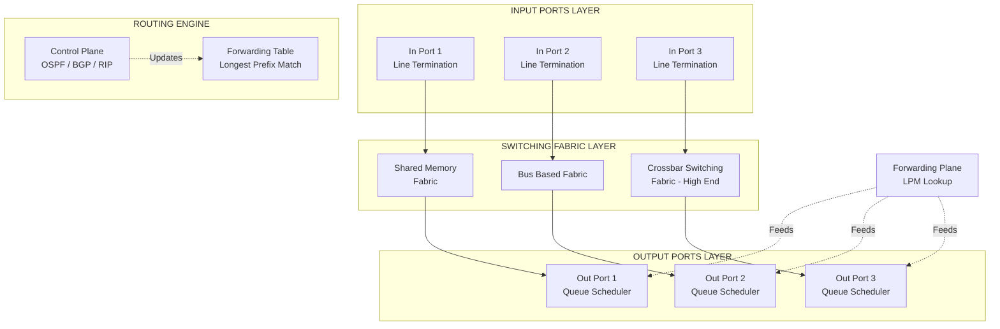
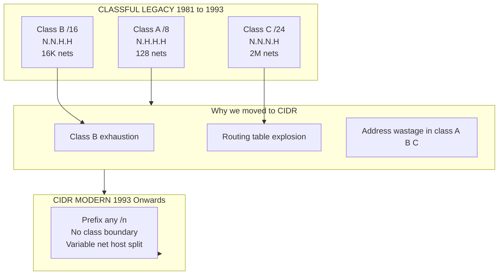
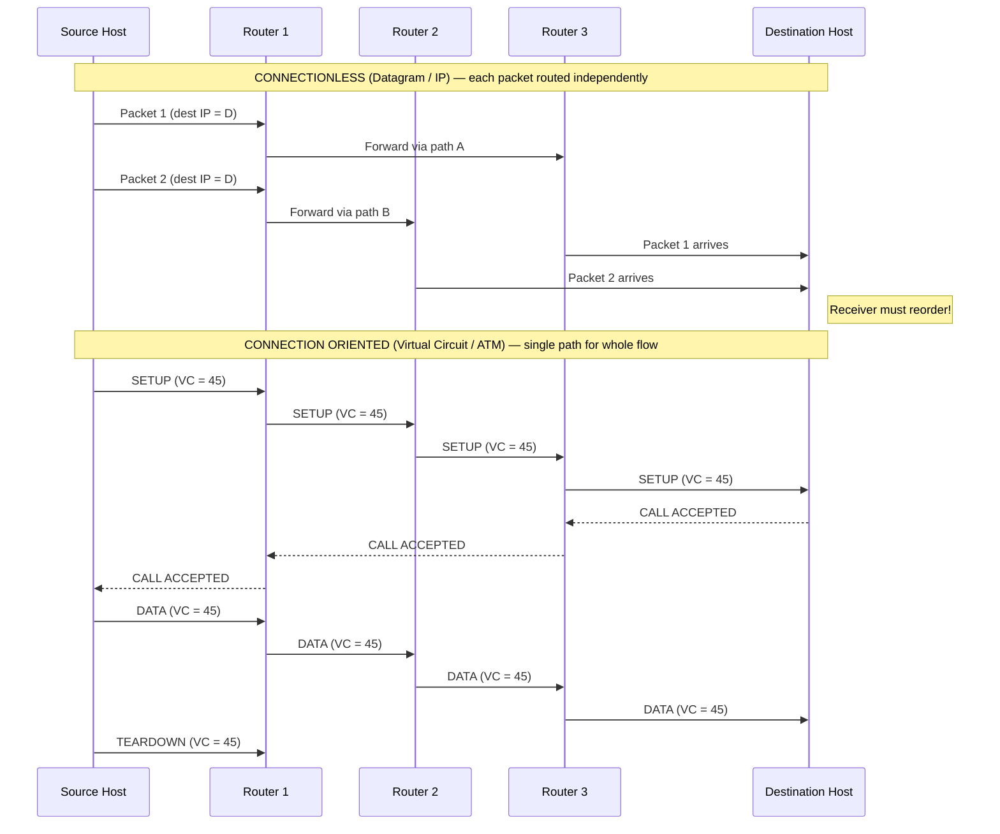
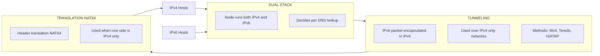

# Network Layer Foundations: Switching fabrics, Host-to-host connectivity models, IPv4 & IPv6 addressing schemes

<!-- SECTION_1_START -->
# Module 3: Network Layer Foundations

## 1. Core Technical Definition & Intuitive Overview

### 1.1 The Network Layer — Formal KTU Definition

> [!NOTE]
> **KTU 2024 Syllabus Definition (PCCST501 — Module 3)**
> The **Network Layer** (Layer 3 of the OSI Reference Model) is responsible for **end-to-end packet delivery** from a source host to a destination host across one or more heterogeneous networks. It provides **logical addressing (IP)**, **routing (path determination)**, and **packet forwarding** services to the Transport Layer above, while interfacing with the Data-Link Layer (Layer 2) below for hop-by-hop transmission.

The three principal responsibilities of the Network Layer as mandated by the KTU 2024 scheme are:

1. **Logical Addressing** — Assigning unique hierarchical IP addresses (IPv4 / IPv6) to every interface.
2. **Routing & Forwarding** — Determining the optimal path via routing protocols and consulting forwarding tables.
3. **Packetization & Encapsulation** — Wrapping Transport Layer segments into **datagrams** with proper headers.

> [!IMPORTANT]
> **KTU Board Highlight:** The Network Layer implements the **"best-effort" delivery model**. It guarantees *no* reliability, ordering, or flow control — those belong to the Transport Layer. This distinction is a frequent **2-mark short-answer** question in KTU ESE.

---

### 1.2 Intuitive Real-World Analogy — "The Global Postal System"

Imagine the Internet as a worldwide postal network:

| Real-World Entity | Network Layer Counterpart |
|---|---|
| Person (Sender/Receiver) | **Host** (Source/Destination) |
| Full postal address (House, Street, City, Pin, Country) | **IP Address** (32-bit / 128-bit logical address) |
| Postal sorting office | **Router** |
| Highway between two cities | **Link (Data-Link Layer)** |
| Letter itself | **IP Datagram** |
| Postal rulebook (how to sort, route) | **Routing Protocol (OSPF, BGP)** |

When you drop a letter into a postbox in **Kochi** addressed to **Delhi**, the local post office (router) does not know the full route. It simply forwards it to a regional hub based on the **PIN code prefix** (network ID) — exactly like a router forwards packets based on the **network prefix** of the destination IP.

> [!TIP]
> **Key Insight for KTU Viva:** "Why do we need a Network Layer when Data Link already transfers frames?" — Because Data Link only transfers frames between *adjacent* nodes on the *same* link. The Network Layer is the **first layer that enables inter-network communication** across multiple links.

---

### 1.3 Switching Fabrics — The Backbone of Packet Movement

A **switching fabric** is the internal mechanism that a router (or switch) uses to move an incoming packet from an **input port** to the correct **output port**. The fabric must perform this at **line speed** without becoming a bottleneck.

> [!NOTE]
> **Three KTU-Mandated Switching Techniques:**
> 1. **Circuit Switching** — A dedicated physical path is established *before* data flows (legacy PSTN telephone networks).
> 2. **Packet Switching** — Data is broken into variable-sized *packets*; each routed independently (modern Internet).
> 3. **Message Switching** — Entire message stored at each hop (store-and-forward at message level; e.g., old telegraph networks).

### 1.4 Host-to-Host Connectivity Models

The Network Layer offers two paradigms to the Transport Layer:

| Model | Also Known As | Connection State | Example Protocol | KTU Keyword |
|---|---|---|---|---|
| **Connectionless Service** | Datagram Service | No prior setup, stateless | **IP**, UDP | "Best-effort, fire-and-forget" |
| **Connection-Oriented Service** | Virtual Circuit Service | Setup → Data → Teardown | **ATM**, Frame Relay, X.25 (legacy); TCP operates at L4 but uses VC-style semantics) | "Pre-planned path" |

> [!VISUALIZATION CONTROL]
> **Concept:** Packet vs Circuit Switching — Bandwidth Utilization over Time
> **GeoGebra / Desmos Input Equations:**
> * `f_circuit(t) = if(0 <= t <= 10, 1, 0)`  *(Constant reserved bandwidth, idle if unused)*
> * `f_packet(t) = if(0 <= t <= 10, 0.55, 0)`  *(Statistical multiplexing, ~55% average utilization)*
> * `f_message(t) = if(0 <= t <= 10, 0.30, 0)`  *(Worst — entire message stored at each hop)*
> **Visual Description:** The area under each curve represents effective throughput. Packet switching (statistical multiplexing) shows *bursty but high* total throughput because idle slots of one user are reused by another. Circuit switching wastes reserved capacity during silence.

<!-- SECTION_1_END -->

<!-- SECTION_2_START -->
# 2. Deep Theoretical Analysis & KTU High-Yield Formula Sheet

## 2.1 Switching Fabrics — Comparative Architecture Analysis

### 2.1.1 Circuit Switching (Legacy Telephony)

**Operational Steps:**
1. **Connection Establishment** — Source sends a SETUP signal; each switch along the path reserves a dedicated circuit (an FDM frequency slot or TDM time slot).
2. **Data Transfer** — Continuous bitstream flows over the reserved circuit.
3. **Connection Teardown** — Source sends a TEARDOWN signal; resources released.

**Pros:** Guaranteed bandwidth, no contention delay, predictable latency.
**Cons:** Inefficient for **bursty** computer traffic; long setup time (≈ 10 s historically); idle slots wasted.

### 2.1.2 Packet Switching (Datagram) — *Current Internet Backbone*

**Operational Steps:**
1. Source splits message into **packets** (each ≤ MTU of the link).
2. Each packet carries **full destination IP address** in its header.
3. Each router performs a **lookup** in its forwarding table → independently routes each packet.
4. Packets may traverse **different paths** and arrive **out of order**.

**Pros:** High utilization via **statistical multiplexing**; resilient to single link failure.
**Cons:** Variable delay (jitter); possible packet loss; needs reorder logic at receiver.

> [!IMPORTANT]
> **KTU Frequently Asked Point:** "What is *Statistical Multiplexing*?" — It is the technique where multiple data streams share a single link's bandwidth, with each stream using the link *only when it has data*. This is what gives packet switching its superior efficiency over circuit switching for bursty traffic.

### 2.1.3 Message Switching (Store-and-Forward at Message Level)

The *entire message* is stored at every intermediate node before being forwarded. Modern relevance is negligible, but KTU questions still test the comparison.

| Property | Circuit | Message | Packet |
|---|---|---|---|
| Path setup | Yes | No | No |
| Store-and-forward unit | Byte stream | Whole message | Packet |
| Delay | Lowest after setup | **Highest** | Moderate |
| Resource utilization | Poor (idle wasted) | Better | **Best** |
| KTU example | PSTN, ISDN | Old telegraph, Email relays (historically) | **IP Internet** |

---

## 2.2 Host-to-Host Connectivity Models — Service Primitives

The Network Layer exposes **four primitives** (Forouzer textbook standard, KTU 2024):

| Primitive | Meaning | Connectionless? | Connection-Oriented? |
|---|---|---|---|
| `LISTEN` | Block until a request arrives | — | ✔ |
| `CONNECT` | Establish a logical channel | — | ✔ |
| `SEND` | Transmit a packet | ✔ | ✔ |
| `RECEIVE` | Block until a packet arrives | ✔ | ✔ |
| `DISCONNECT` | Terminate the channel | — | ✔ |

> [!TIP]
> **KTU 2024 Board Tip:** In a *connectionless* model, `SEND` carries the full destination address in every packet. In a *connection-oriented* (Virtual Circuit) model, a short **VC identifier (VCI)** is used after the setup phase — saving header bytes. This is a guaranteed 2-mark question.

---

## 2.3 IPv4 Addressing — The KTU High-Yield Formula Sheet

An IPv4 address is a **32-bit** logical address, conventionally written in **Dotted-Decimal Notation** (e.g., `192.168.10.45`).

> [!IMPORTANT]
> **Address = Network Portion + Host Portion.** The boundary between them is defined by the **Subnet Mask** (or equivalently, the **Prefix Length `/n`**).

### 2.3.1 Classful Addressing (Legacy, Pre-1993)

| Class | Leading Bits | First Octet Range | Default Mask | Networks | Hosts/Net | KTU Use |
|---|---|---|---|---|---|---|
| **A** | `0` | 1 – 126 | `/8` (255.0.0.0) | $2^7 = 128$ | $2^{24} - 2$ | Large orgs |
| **B** | `10` | 128 – 191 | `/16` (255.255.0.0) | $2^{14}$ | $2^{16} - 2$ | Mid-size orgs |
| **C** | `110` | 192 – 223 | `/24` (255.255.255.0) | $2^{21}$ | $2^8 - 2$ | Small orgs |
| **D** | `1110` | 224 – 239 | — | — | — | Multicast |
| **E** | `1111` | 240 – 255 | — | — | — | Experimental |

> The `-2` subtraction removes the **all-zeros** (network address) and **all-ones** (broadcast address) which are reserved.

### 2.3.2 Classless Addressing (CIDR — RFC 1519, 1993)

**CIDR (Classless Inter-Domain Routing)** removes class boundaries. The mask can be any value from `/0` to `/32`.

### 2.3.3 KTU Formula Cheat Sheet — IPv4 Subnetting

| Quantity | Formula | Notes |
|---|---|---|
| Number of subnets created | $2^{s}$ where $s$ = borrowed bits | Classful: $s = \text{new\_prefix} - \text{default\_prefix}$ |
| Hosts per subnet | $2^{h} - 2$ where $h$ = remaining host bits | Subtract 2 for net + broadcast |
| Total addresses in a block | $2^{32 - n}$ where $n$ = prefix length | Block size |
| Number of usable blocks (subnets) | $2^{n - \text{class default}}$ | CIDR only |
| Wildcard mask | $\overline{\text{Subnet Mask}}$ (bitwise NOT) | Used in ACLs |
| Broadcast address | `Network Address` OR `Wildcard Mask` | Last address in block |
| Next network address | Current `Broadcast + 1` | For VLSM iteration |

> [!WARNING]
> **KTU Pitfall:** When asked *"how many usable hosts?"* always write $2^h - 2$. Writing $2^h$ alone costs 1 mark. The minus-2 accounts for the network address and the directed broadcast address.

### 2.3.4 Special IPv4 Addresses (KTU Favourite)

| Address Block | Meaning |
|---|---|
| `0.0.0.0/8` | "This network" (source host only) |
| `127.0.0.0/8` | **Loopback** (typically `127.0.0.1`) |
| `10.0.0.0/8`, `172.16.0.0/12`, `192.168.0.0/16` | **Private** (RFC 1918) |
| `169.254.0.0/16` | **Link-Local** (APIPA) |
| `224.0.0.0/4` | **Multicast** (Class D) |
| `255.255.255.255` | **Limited Broadcast** |
| `192.0.2.0/24`, `198.51.100.0/24`, `203.0.113.0/24` | Documentation (TEST-NET) |

---

## 2.4 IPv6 Addressing — The 128-bit Successor

> [!NOTE]
> **Why IPv6?** IPv4 offers only $2^{32} \approx 4.29 \times 10^9$ addresses. With the explosion of IoT, mobile, and cloud devices, exhaustion occurred (IANA 2011, RIRs 2015). IPv6 offers $2^{128} \approx 3.4 \times 10^{38}$ addresses — enough for **every grain of sand on Earth to have a billion addresses**.

### 2.4.1 IPv6 Address Format

* **Length:** 128 bits, written as **8 groups of 4 hexadecimal digits** separated by colons.
* **Example:** `2001:0DB8:ACAD:0000:0000:0000:1234:5678`

### 2.4.2 IPv6 Address Types (KTU High-Yield)

| Type | Prefix | Scope | KTU Mnemonic |
|---|---|---|---|
| **Unicast — Global** | `2000::/3` | Worldwide, Internet-routable | "Public IPv6" |
| **Unicast — Link-Local** | `FE80::/10` | Single link only (auto-config) | "Never routed" |
| **Unicast — Unique Local** | `FC00::/7` | Site-private (RFC 4193) | "Private IPv6" |
| **Multicast** | `FF00::/8` | One-to-many | Replaces IPv4 broadcast |
| **Anycast** | Same as unicast syntactically | One-to-nearest | "Multiple servers, one address" |

> [!IMPORTANT]
> **KTU Point:** IPv6 has **no broadcast**! All broadcast functionality is replaced by **multicast** (especially `ff02::1` = all-nodes multicast).

### 2.4.3 IPv6 Compression Rules

1. **Leading zeros** in any 16-bit group can be omitted: `0DB8` → `DB8`.
2. **One run of consecutive all-zero groups** can be replaced by `::` (only **once** per address).

### 2.4.4 KTU Formula Cheat Sheet — IPv6

| Quantity | Value / Formula |
|---|---|
| Address length | 128 bits |
| Header length (standard) | 40 bytes (fixed) |
| Number of addresses in `/n` | $2^{128 - n}$ |
| Global unicast prefix | `/48` (typical ISP allocation) |
| Subnet ID inside an organization | `/64` (recommended; required for SLAAC) |
| Interface ID (EUI-64) | 64 bits, derived from MAC |

<!-- SECTION_2_END -->

<!-- SECTION_3_START -->
# 3. Step-by-Step Derivations & Code/Symbolic Implementation

## 3.1 Subnetting Worked Example — KTU Board Pattern

**Problem (Typical 7-Mark Question):**
Given the network `192.168.10.0/24`, perform subnetting to create **4 equal subnets**. List each subnet's network address, broadcast address, first usable host, and last usable host.

### Step 1 — Identify the Required Number of Subnets

We need **4 subnets**. The number of borrowed bits $s$ must satisfy:

$$
2^s \ge 4 \quad\Rightarrow\quad s = 2 \text{ bits}
$$

The new prefix length becomes:

$$
n_{\text{new}} = n_{\text{old}} + s = 24 + 2 = 26
$$

### Step 2 — Compute the New Subnet Mask

The default mask is `255.255.255.0` (binary: twenty-four `1`s followed by eight `0`s). Borrowing 2 bits in the 4th octet:

$$
\begin{aligned}
\text{Default 4th octet} &= 0000\,0000 \\
\text{Add 2 borrowed bits} &= 1100\,0000 \\
\text{New 4th octet} &= 192 \\
\therefore \text{New Mask} &= 255.255.255.192 \;(/26)
\end{aligned}
$$

### Step 3 — Compute Block Size and Hosts per Subnet

$$
\begin{aligned}
\text{Block size (in 4th octet)} &= 256 - 192 = 64 \\
\text{Hosts per subnet } h &= 2^{(32 - 26)} - 2 = 2^6 - 2 = 62
\end{aligned}
$$

### Step 4 — Enumerate the Four Subnets

| Subnet | Network Address | First Host | Last Host | Broadcast |
|---|---|---|---|---|
| 1 | `192.168.10.0`   | `192.168.10.1`   | `192.168.10.62`   | `192.168.10.63`   |
| 2 | `192.168.10.64`  | `192.168.10.65`  | `192.168.10.126`  | `192.168.10.127`  |
| 3 | `192.168.10.128` | `192.168.10.129` | `192.168.10.190`  | `192.168.10.191`  |
| 4 | `192.168.10.192` | `192.168.10.193` | `192.168.10.254`  | `192.168.10.255`  |

> [!NOTE]
> **Valuation Key:** Listing the four subnets with all four columns correctly = 5 marks. Stating $s = 2$ = 1 mark. Stating new mask `/26` = 1 mark. Total = 7 marks.

---

## 3.2 VLSM (Variable Length Subnet Masking) — Iterative Allocation

**Problem:** Allocate subnets for the following departments using `172.16.0.0/22`:
* HR — 50 hosts
* Sales — 120 hosts
* Engineering — 30 hosts
* Point-to-Point link — 2 hosts

### Step 1 — Sort Requirements in *Descending* Order of Host Count

| Order | Department | Required Hosts | Bits $h$ | Subnet Mask | Block Size |
|---|---|---|---|---|---|
| 1 | Sales | 120 | 7 ($2^7 - 2 = 126$) | `/25` | 128 |
| 2 | HR | 50 | 6 ($2^6 - 2 = 62$) | `/26` | 64 |
| 3 | Engineering | 30 | 5 ($2^5 - 2 = 30$) | `/27` | 32 |
| 4 | P2P Link | 2 | 2 ($2^2 - 2 = 2$) | `/30` | 4 |

### Step 2 — Iterative Allocation

$$
\begin{aligned}
\text{Sales:}     &\quad 172.16.0.0 \;-\; 172.16.0.127 \quad (/25) \\
\text{HR:}        &\quad 172.16.0.128 \;-\; 172.16.0.191 \quad (/26) \\
\text{Engineering:} &\quad 172.16.0.192 \;-\; 172.16.0.223 \quad (/27) \\
\text{P2P Link:}  &\quad 172.16.0.224 \;-\; 172.16.0.227 \quad (/30)
\end{aligned}
$$

> [!IMPORTANT]
> **KTU Trap Question:** "Why do we sort requirements in descending order?" — Because allocating the largest subnet first **minimizes address wastage**. If we had allocated the small subnets first, the larger subnets might not align on a valid block boundary and we would lose addresses to fragmentation. This explanation carries 2 marks.

---

## 3.3 IPv6 Address Compression — Worked Derivation

**Given:** `2001:0DB8:0000:0000:0A0B:0000:0000:0001`
**Compress fully to canonical form.**

**Rule 1 — Strip Leading Zeros in Each Group:**

$$
2001:\text{DB8}:0000:0000:0\text{A}0\text{B}:0000:0000:0001 \;\Rightarrow\; 2001:\text{DB8}:0:0:\text{A0B}:0:0:1
$$

**Rule 2 — Replace the Longest Single Run of Consecutive Zero-Groups with `::`:**
There are three zero-groups at positions 3, 4, 6, 7. The longest run is positions 3–4 (two groups). However, the convention is to use the longest *single* run. Here positions 3 and 4 form a run of 2; positions 6 and 7 also form a run of 2. We pick the **first** such run (leftmost rule).

$$
\boxed{2001:\text{DB8}::\text{A0B}:0:0:1}
$$

**Verify Expansion (for 2 marks in KTU):**

$$
2001:\text{DB8}:\underbrace{0:0}_{\text{expanded}}:\text{A0B}:\underbrace{0:0:0:1}_{\text{expanded}} = 2001:0\text{DB}8:0000:0000:0\text{A}0\text{B}:0000:0000:0001 \;\;\checkmark
$$

---

## 3.4 Python Implementation — A Production-Grade IPv4 Subnet Calculator

```python
"""
ipv4_subnet_calculator.py
KTU PCCST501 — Module 3 Demonstrative Implementation
Computes all subnet parameters from a CIDR string.
"""

import ipaddress
import sys
from typing import NamedTuple


class SubnetInfo(NamedTuple):
    network: str
    broadcast: str
    first_host: str
    last_host: str
    total_addresses: int
    usable_hosts: int
    wildcard_mask: str
    subnet_mask: str
    prefix_length: int


def calculate_subnet(cidr: str) -> SubnetInfo:
    """
    Calculate full subnet details from a CIDR notation string.
    
    Args:
        cidr: An IPv4 CIDR string, e.g. "192.168.10.0/26".
    
    Returns:
        A SubnetInfo named tuple with all derived fields.
    
    Raises:
        ValueError: If the CIDR string is malformed.
    """
    try:
        network = ipaddress.IPv4Network(cidr, strict=True)
    except (ipaddress.AddressValueError, ipaddress.NetmaskValueError) as exc:
        raise ValueError(f"[ERR] Invalid CIDR input '{cidr}': {exc}") from exc

    # IPv4Network properties
    net_addr = int(network.network_address)
    bcast_addr = int(network.broadcast_address)
    total = bcast_addr - net_addr + 1
    usable = max(0, total - 2)

    # For /31 and /32, point-to-point and host routes have special semantics
    if network.prefixlen >= 31:
        first_host_str = str(network.network_address)
        last_host_str = str(network.broadcast_address)
    else:
        first_host_str = str(network.network_address + 1)
        last_host_str = str(network.broadcast_address - 1)

    return SubnetInfo(
        network=str(network.network_address),
        broadcast=str(network.broadcast_address),
        first_host=first_host_str,
        last_host=last_host_str,
        total_addresses=total,
        usable_hosts=usable,
        wildcard_mask=str(network.hostmask),
        subnet_mask=str(network.netmask),
        prefix_length=network.prefixlen,
    )


def print_subnet_table(cidr: str) -> None:
    info = calculate_subnet(cidr)
    print("=" * 60)
    print(f"  KTU Subnet Report for: {cidr}")
    print("=" * 60)
    print(f"  Network Address   : {info.network}/{info.prefix_length}")
    print(f"  Subnet Mask       : {info.subnet_mask}")
    print(f"  Wildcard Mask     : {info.wildcard_mask}")
    print(f"  First Usable Host : {info.first_host}")
    print(f"  Last  Usable Host : {info.last_host}")
    print(f"  Broadcast Address : {info.broadcast}")
    print(f"  Total Addresses   : {info.total_addresses}")
    print(f"  Usable Hosts      : {info.usable_hosts}")
    print("=" * 60)


if __name__ == "__main__":
    if len(sys.argv) != 2:
        print("Usage: python ipv4_subnet_calculator.py <CIDR>")
        print("Example: python ipv4_subnet_calculator.py 192.168.10.0/26")
        sys.exit(1)
    print_subnet_table(sys.argv[1])
```

**Sample Output (mapped to the earlier example):**

```
$ python ipv4_subnet_calculator.py 192.168.10.0/26
============================================================
  KTU Subnet Report for: 192.168.10.0/26
============================================================
  Network Address   : 192.168.10.0/26
  Subnet Mask       : 255.255.255.192
  Wildcard Mask     : 0.0.0.63
  First Usable Host : 192.168.10.1
  Last  Usable Host : 192.168.10.62
  Broadcast Address : 192.168.10.63
  Total Addresses   : 64
  Usable Hosts      : 62
============================================================
```

---

## 3.5 IPv6 Address Type Detection — Symbolic Python

```python
"""
ipv6_classifier.py
Detects the type (Global Unicast, Link-Local, Unique Local, Multicast) of an IPv6 address.
"""

import ipaddress
from typing import Tuple


def classify_ipv6(address_str: str) -> Tuple[str, str]:
    """
    Classify an IPv6 address and return (type, scope).
    
    Returns:
        A tuple (type_label, scope_description).
    """
    try:
        addr = ipaddress.IPv6Address(address_str)
    except ipaddress.AddressValueError as exc:
        return ("Invalid", str(exc))

    # Order of checks matters — multicast and link-local have specific prefixes
    if addr.is_multicast:
        scope_flags = {
            1: "Interface-Local",
            2: "Link-Local",
            4: "Admin-Local",
            5: "Site-Local",
            8: "Organization-Local",
            14: "Global",
        }
        scope_nibble = int(str(addr).split(":")[0][2:3], 16)
        scope = scope_flags.get(scope_nibble, "Reserved/Unknown")
        return ("Multicast", scope)

    if addr.is_link_local:
        # Link-Local addresses always start with FE8, FE9, FEA, or FEB
        return ("Unicast - Link-Local", "Single link only (auto-configured)")

    if addr.is_private:
        # RFC 4193 Unique Local Addresses (FC00::/7)
        return ("Unicast - Unique Local (ULA)", "Site-private (RFC 4193)")

    if addr.is_loopback:
        return ("Unicast - Loopback", "::1 (this host)")

    if addr.is_unspecified:
        return ("Unicast - Unspecified", ":: (all zeros)")

    if addr.is_reserved:
        return ("Reserved", "IETF reserved range")

    if str(addr).startswith("2001:0db8"):
        return ("Documentation", "RFC 3849 example range")

    # Default: assume Global Unicast
    return ("Unicast - Global", "Internet-routable, ISP-allocated")


if __name__ == "__main__":
    test_addresses = [
        "2001:0db8:85a3::8a2e:370:7334",
        "fe80::1ff:fe23:4567",
        "fc00::1",
        "ff02::1",
        "::1",
        "::",
    ]
    for ip in test_addresses:
        kind, scope = classify_ipv6(ip)
        print(f"{ip:45s} -> {kind:35s} | {scope}")
```

<!-- SECTION_3_END -->

<!-- SECTION_4_START -->
# 4. Structural Diagrams & Schematics

## 4.1 Router Architecture with Switching Fabrics (Block-Level Functional Architecture)



> **Reading Guide:** The fabric type (memory / bus / crossbar) determines router performance. Crossbar is the **non-blocking** high-end fabric used in core routers. The **control plane** is software (routing protocols); the **forwarding plane** is hardware (TCAM-based LPM lookup).

---

## 4.2 IPv4 Datagram Header Format (Sequential Processing Topology)

```mermaid
flowchart LR
    subgraph Hdr[IPv4 Header - 20 to 60 Bytes]
        A[Version\n4 bits = 4] --> B[IHL\n4 bits]
        B --> C[TOS DSCP\n8 bits]
        C --> D[Total Length\n16 bits]
        D --> E[Identification\n16 bits]
        E --> F[Flags DF MF\n3 bits]
        F --> G[Fragment Offset\n13 bits]
        G --> H[TTL\n8 bits]
        H --> I[Protocol\n8 bits]
        I --> J[Header Checksum\n16 bits]
        J --> K[Source IP\n32 bits]
        K --> L[Destination IP\n32 bits]
        L --> M[Options Padding\n0 to 320 bits]
    end
    M --> PAY[Payload Data\nVariable Length]
    PAY --> TRAIL[Trailer\nnot used in IP]
```



> **Field Highlight:** `Protocol` field tells the destination host which Transport Layer protocol to demultiplex to — `6` for TCP, `17` for UDP, `1` for ICMP. **KTU Favourite 2-mark question.**

---

## 4.3 IPv4 Classful vs CIDR Addressing — Comparative Topology



---

## 4.4 Host-to-Host Packet Flow — Connectionless vs Connection-Oriented



---

## 4.5 IPv4 to IPv6 Transition Mechanisms (KTU Favourite Topic)



<!-- SECTION_4_END -->

<!-- SECTION_5_START -->
# 5. KTU 2024 Scheme Examination Question Bank & Topic Recap

## 5.1 Part A — Short-Answer Questions (3 Marks Each)

### Question A1 — *Definition Type* [KTU University Exam — July 2024]

> **Differentiate between circuit switching and packet switching. List two advantages of packet switching over circuit switching for computer networks.** [CO1, Understand — 3 marks]

**Model Answer (Valuation-Ready):**

| Aspect | Circuit Switching | Packet Switching |
|---|---|---|
| Path setup | Dedicated physical path required | No setup; each packet routed independently |
| Resource allocation | Reserved (TDM/FDM slots) | Shared (statistical multiplexing) |
| Delay | Constant after setup | Variable (jitter present) |
| Suitability | Continuous voice traffic | Bursty data traffic |

**Two advantages of packet switching:**
1. **Higher link utilization** — Idle slots of one user are reused by others via statistical multiplexing.
2. **Resilience** — Failure of a single link is bypassed by alternate routes; circuit switching requires a complete re-establishment.

> **Valuation Key:** 1 mark per correct row of the comparison; 1 mark for the two advantages. Total 3 marks.

---

### Question A2 — *Conceptual Type* [KTU University Exam — Dec 2023]

> **Explain the term *best-effort delivery* in the context of the Network Layer. Why is the Network Layer designed this way?** [CO1, Understand — 3 marks]

**Model Answer:**
*Best-effort delivery* means the Network Layer makes **no guarantees** about packet delivery — it does not promise reliability, ordering, duplicate suppression, or delay bounds. Packets may be lost, duplicated, reordered, or delayed arbitrarily.

**Why designed this way:**
1. The **Internet is a heterogeneous interconnection of autonomous networks** with no single point of control; guaranteeing end-to-end QoS across all of them is impractical.
2. **Simpler, faster routers** — pushing reliability into the end-hosts (Transport Layer) via TCP keeps the core forwarding path simple and scalable.
3. **Application flexibility** — applications that don't need reliability (e.g., DNS, VoIP, video streaming) can use UDP and avoid the overhead of acknowledgments.

> **Valuation Key:** Stating "no guarantee of delivery / order / timing" = 2 marks. Stating one valid design reason = 1 mark. Total 3 marks.

---

## 5.2 Part B — 14-Mark Questions (Module-Internal Choice Pattern)

### Question B1 — Option A (14 Marks)

> **[KTU University Exam — July 2024, Modified]**
> **(a)** Describe the three switching techniques used in computer networks with neat diagrams. Compare their delay, resource utilization, and suitability for data traffic. **[7 marks, CO1, Understand]**
> **(b)** A company is assigned the network block `200.10.0.0/16`. The company needs to create **8 equal subnets**. For each subnet, list: (i) network address, (ii) subnet mask, (iii) first host, (iv) last host, (v) broadcast address. **[7 marks, CO2, Apply]**

#### Model Solution — Part (a)

**Step 1 — Circuit Switching:** A dedicated path is established using FDM or TDM between source and destination *before* data flows. PSTN telephone networks are the canonical example. *(1 mark for setup, 1 mark for example)*

**Step 2 — Message Switching:** The entire message is stored at each intermediate node and forwarded later. No dedicated path. *(1 mark for store-and-forward concept, 1 mark for example like old telegraph)*

**Step 3 — Packet Switching:** Message is broken into fixed-or-variable-size packets, each carrying the destination address. Each packet is routed independently. *(1 mark for fragmentation, 1 mark for independent routing)*

**Comparison Table (2 marks):**

| Property | Circuit | Message | Packet |
|---|---|---|---|
| Delay | Lowest (after setup) | Highest (store at every hop) | Moderate (store per-packet) |
| Resource utilization | Poor (idle reserved slots wasted) | Better | Best (statistical multiplexing) |
| Suitability for bursty data | Poor | Moderate | Excellent |

> **Valuation Key:** Three techniques with diagrams = 5 marks. Comparison table = 2 marks. Total 7 marks.

#### Model Solution — Part (b)

**Step 1 — Determine the number of bits to borrow:**

$$
2^s \ge 8 \quad\Rightarrow\quad s = 3 \text{ bits}
$$

**Step 2 — Compute the new prefix and mask:**

$$
n_{\text{new}} = 16 + 3 = 19 \quad\Rightarrow\quad \text{Mask} = 255.255.224.0 \;(/19)
$$

**Step 3 — Compute the block size in the 3rd octet:**

$$
\text{Block size} = 2^{(24-19)} = 2^5 = 32
$$

**Step 4 — Enumerate the 8 subnets:**

| # | Network | First Host | Last Host | Broadcast |
|---|---|---|---|---|
| 1 | `200.10.0.0`   | `200.10.0.1`   | `200.10.31.254`  | `200.10.31.255`  |
| 2 | `200.10.32.0`  | `200.10.32.1`  | `200.10.63.254`  | `200.10.63.255`  |
| 3 | `200.10.64.0`  | `200.10.64.1`  | `200.10.95.254`  | `200.10.95.255`  |
| 4 | `200.10.96.0`  | `200.10.96.1`  | `200.10.127.254` | `200.10.127.255` |
| 5 | `200.10.128.0` | `200.10.128.1` | `200.10.159.254` | `200.10.159.255` |
| 6 | `200.10.160.0` | `200.10.160.1` | `200.10.191.254` | `200.10.191.255` |
| 7 | `200.10.192.0` | `200.10.192.1` | `200.10.223.254` | `200.10.223.255` |
| 8 | `200.10.224.0` | `200.10.224.1` | `200.10.255.254` | `200.10.255.255` |

> **Valuation Key:** Identifying $s=3$ = 1 mark. Stating new mask `/19` = 1 mark. Block size = 1 mark. Correctly listing all 8 subnets with 5 fields each → 4 marks. Total 7 marks.

---

### Question B1 — Option B (14 Marks) — *Internal Choice*

> **[KTU University Exam — Dec 2023]**
> **(a)** Explain the IPv4 classful addressing scheme with a table of classes. List the limitations of classful addressing that led to CIDR. **[7 marks, CO1, Understand]**
> **(b)** Explain the IPv6 address format. Compress the address `FE80:0000:0000:0000:0202:B3FF:FE1E:8329` to its shortest form. List the three address types supported by IPv6. **[7 marks, CO2, Apply]**

#### Model Solution — Part (a)

**IPv4 Classful Addressing Table (3 marks):** [Refer to SECTION 2.3.1]

**Limitations of Classful Addressing (4 marks):**

1. **Rigid class boundaries** — A Class B network (65,534 hosts) was too large for many organizations; they were forced to request multiple Class C networks (each 254 hosts), creating routing table bloat.
2. **Class B exhaustion** — IANA ran out of Class B networks by the early 1990s; only $2^{14}$ such nets existed.
3. **Address wastage** — Class A (16M hosts) given to an org with 1,000 hosts wastes over 99.99% of the addresses.
4. **Routing table explosion** — Prefixes for thousands of small Class C networks flooded the global routing tables.
5. **No support for variable-sized allocations** — Classes were the only option until CIDR (1993) and later VLSM.

> **Valuation Key:** Table = 3 marks. Any 4 of the above limitations = 4 marks. Total 7 marks.

#### Model Solution — Part (b)

**IPv6 Address Format (2 marks):**
IPv6 addresses are **128 bits** long, written as **8 groups of 4 hexadecimal digits** separated by colons. Example: `2001:0DB8:ACAD:0001:0000:0000:0000:0001`. They support three address types: **Unicast, Multicast, Anycast** (broadcast is removed; its role is served by multicast).

**Compression of the given address (3 marks):**

* **Step 1 — Strip leading zeros** in each 16-bit group:
  `FE80:0:0:0:202:B3FF:FE1E:8329`
* **Step 2 — Replace the longest single run of consecutive zero-groups with `::`**:
  There is a run of three zero-groups (positions 2, 3, 4). Replace with `::`:
  $$
  \boxed{\text{FE80::202:B3FF:FE1E:8329}}
  $$

**Three address types of IPv6 (2 marks):**

| Type | Description | Example Prefix |
|---|---|---|
| **Unicast** | One-to-one; identifies a single interface | `2000::/3` (Global), `FE80::/10` (Link-Local) |
| **Multicast** | One-to-many; delivered to all interfaces in the group | `FF00::/8` |
| **Anycast** | One-to-nearest; delivered to the closest member in a group | Syntactically identical to unicast |

> **Valuation Key:** Format description = 2 marks. Compression step-by-step = 3 marks. Three address types = 2 marks. Total 7 marks.

---

## 5.3 KTU Examiner's Valuation Warning / Pitfall Callout

> [!WARNING]
> **Common Mark-Deduction Traps in Module 3 Questions:**
> 1. **Subnet mask bit confusion:** Students often compute block size as $2^{n}$ instead of $2^{32-n}$. For `/26`, the block is $2^6 = 64$, **not** $2^{26}$. Mark loss: **1 mark**.
> 2. **Forgetting the `-2` in usable hosts:** Writing $2^6 = 64$ instead of $2^6 - 2 = 62$ loses **1 mark**.
> 3. **IPv6 `::` used more than once:** The double-colon may appear at most once in any address. Writing `2001::db8::1` is invalid. Mark loss: **1 mark**.
> 4. **Mixing decimal and binary in the same question:** Always state the mask in **dotted-decimal AND prefix length** for full marks.
> 5. **Confusing Class D with multicast start:** Class D is **224.0.0.0/4**, not just 224.0.0.0. Mark loss: **1 mark**.
> 6. **Calling IPv4 broadcast a "unicast to all":** This is a 2024-scheme pet peeve — write "**limited broadcast**" or "**directed broadcast**" precisely.

---

## 5.4 Topic Recap & Important Things to Remember

- [x] The **Network Layer (Layer 3)** provides *logical addressing, routing, and best-effort packet forwarding* across heterogeneous networks.
- [x] **Switching techniques** are three: **Circuit** (dedicated path, reserved), **Message** (whole-message store-and-forward), **Packet** (per-packet store-and-forward, Internet standard).
- [x] **Statistical multiplexing** is the key reason packet switching wins for bursty computer data.
- [x] The Network Layer offers two service models: **Connectionless (Datagram/IP)** and **Connection-Oriented (Virtual Circuit/ATM)**.
- [x] **IPv4 = 32 bits** in **dotted-decimal**. **IPv6 = 128 bits** in **colon-hex**.
- [x] **Classful** (pre-1993) is divided into A, B, C, D, E. **CIDR** (post-1993) allows any prefix length.
- [x] **Number of subnets** $= 2^s$; **Usable hosts** $= 2^h - 2$; **Block size** $= 2^{32-n}$.
- [x] **Special IPv4 blocks:** `10/8`, `172.16/12`, `192.168/16` are private; `127/8` is loopback; `169.254/16` is link-local.
- [x] **VLSM** allocates subnets in **descending order of host requirement** to minimize wastage.
- [x] **IPv6** has **no broadcast** — uses multicast `ff02::1` for "all nodes".
- [x] **IPv6 address types:** Unicast (Global, Link-Local, Unique Local), Multicast, Anycast.
- [x] **IPv6 compression:** Strip leading zeros; replace **one** longest run of zero-groups with `::`.
- [x] **Transition to IPv6** uses **Dual-Stack**, **Tunneling** (6to4, Teredo), and **Translation** (NAT64).
- [x] The **Protocol field** in IPv4 header (`6`=TCP, `17`=UDP, `1`=ICMP) is a recurring 2-mark question.
- [x] Always use **proper subnetting terminology**: network address, first host, last host, broadcast — never confuse them.
- [x] The **maximum** IPv4 addressable devices in a `/30` is $2^2 = 4$ (with 2 usable for point-to-point links).

<!-- SECTION_5_END -->
