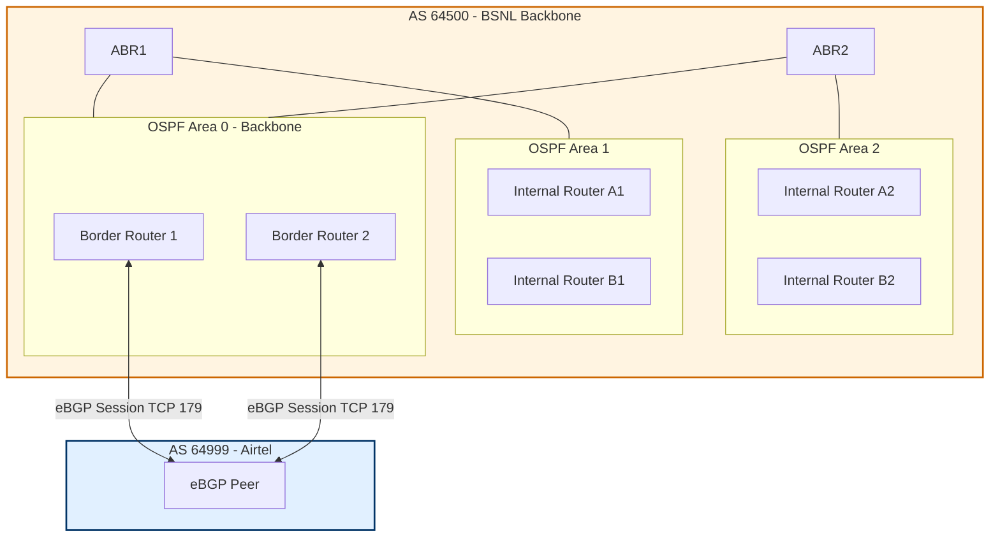
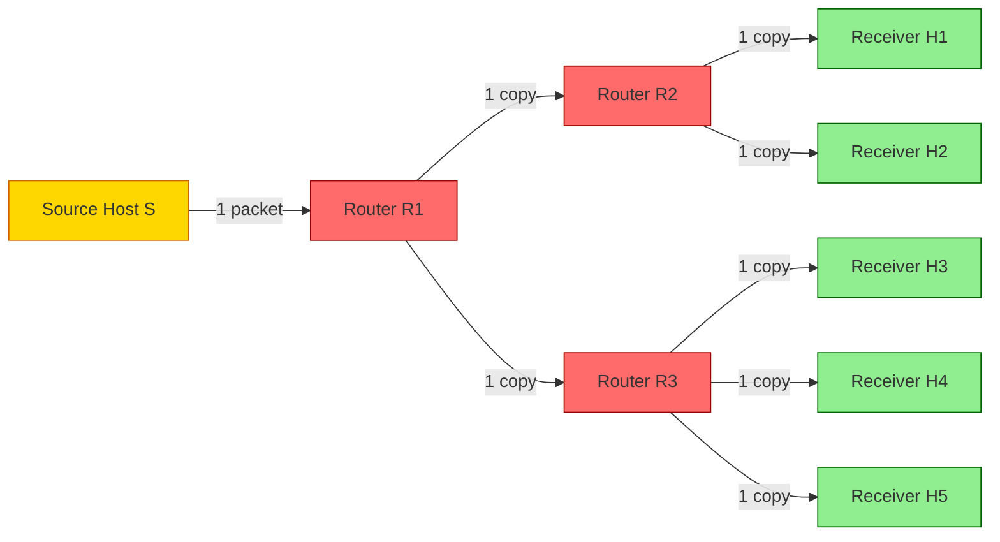
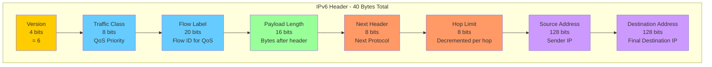
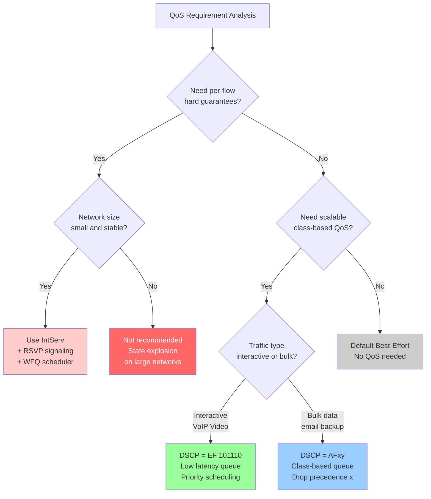
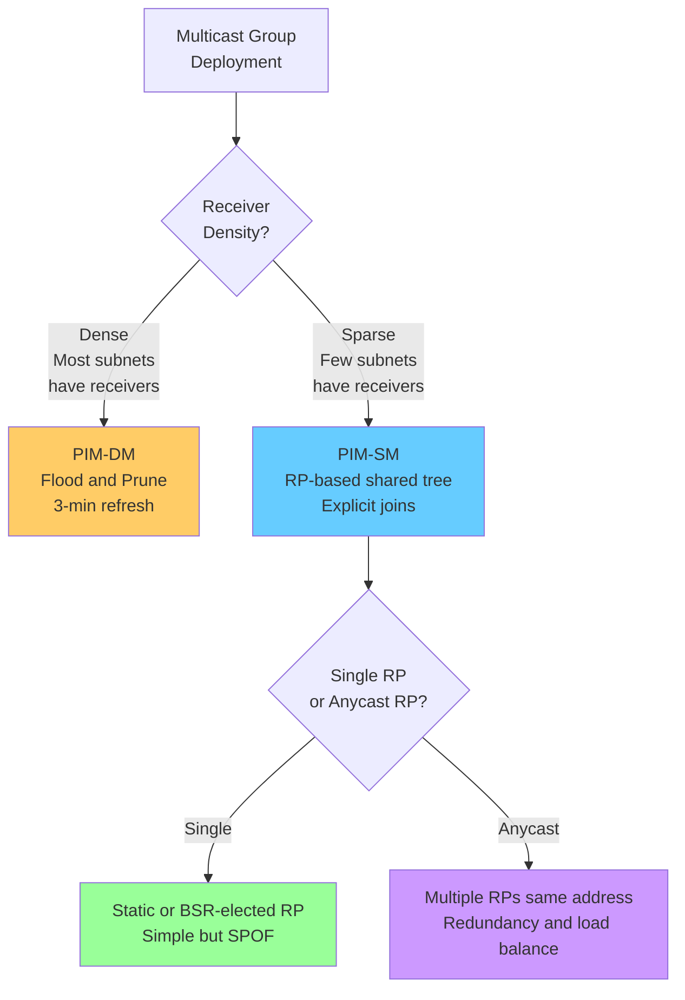

# Routing Algorithms: Unicast/Multicast routing, Intra-domain vs Inter-domain topologies, Next-generation IP, QoS guarantees

<!-- SECTION_1_START -->
# Routing Algorithms, Multicast, Intra/Inter-Domain, IPv6 & QoS Guarantees

> [!IMPORTANT]
> **KTU 2024 Scheme | PCCST501 | Module 3 | Routing Mechanics**
> This module is the *backbone* of Computer Networks — it covers **how packets actually move** across the internet, how routers make forwarding decisions, how IPv6 replaces IPv4, and how Quality of Service is guaranteed end-to-end. Expect **direct questions on OSPF, BGP, IPv6 header format, and DiffServ/IntServ** in KTU university exams.

---

## 1.1 Formal Definition of the Topic Cluster

> [!NOTE]
> **Routing** is the process of determining the *optimal path* for a packet to travel from a source host to a destination host across one or more interconnected networks. The **Network Layer (Layer 3)** of the OSI model is responsible for this function. Routing algorithms are categorized based on:
> 1. **Scope** — Unicast (one-to-one) vs Multicast (one-to-many)
> 2. **Domain** — Intra-domain (within an Autonomous System) vs Inter-domain (between Autonomous Systems)
> 3. **Mechanism** — Distance Vector, Link State, or Path Vector
> 4. **Version** — IPv4 (legacy, **32-bit** addressing) vs IPv6 (Next-Generation, **128-bit** addressing)
> 5. **Service Quality** — Best-effort vs QoS-guaranteed (IntServ / DiffServ)

---

## 1.2 Intuitive Analogy — The Highway Analogy 🛣️

Imagine the **Internet is a massive highway system** connecting cities:

| Network Concept | Highway Analogy | Real Mapping |
|-----------------|------------------|---------------|
| Router | Toll plaza / Interchange | Decides which road packet takes next |
| Routing Table | GPS navigation map | Stores "next-hop" decisions |
| Autonomous System (AS) | A state's highway network | Administered by one authority (e.g., BSNL, Airtel) |
| OSPF | Internal state highway rules | Shortest path *within* one state |
| BGP | Interstate treaty agreements | Path policies *between* states |
| IPv6 | New license-plate format (more digits) | 128-bit unique addresses |
| QoS | Ambulane/Express lane priority | Reserved bandwidth for voice/video |

A unicast packet is a **single car driving to one destination**. A multicast packet is a **news broadcast truck** that fans out copies along multiple highways to many cities simultaneously.

---

## 1.3 Geometric / Graph-Theoretic Foundation

Routing is fundamentally a **graph theory problem**. The internet is modeled as a directed weighted graph:
* **Vertices (V)** = Routers
* **Edges (E)** = Physical/Logical links
* **Edge weights** = Cost metrics (hop count, delay, bandwidth, monetary cost)

> [!VISUALIZATION CONTROL]
> **Concept:** A 5-router graph demonstrating shortest path between source **R1** and destination **R5**.
> **GeoGebra / Desmos Input Points:**
> * R1 = (0, 0), weight to R2 = 2
> * R2 = (2, 1), weight R2-R3 = 3, R2-R4 = 1
> * R3 = (4, 1), weight R3-R5 = 2
> * R4 = (2, -1), weight R4-R5 = 4
> **Visual Description:** Plot 5 points as router nodes, draw weighted edges. The shortest path R1→R2→R3→R5 has total cost **7**, while R1→R2→R4→R5 has cost **7** — students can observe tie-breaking scenarios in distance vector protocols.

---

## 1.4 IPv4 vs IPv6 — At a Glance

| Parameter | IPv4 | IPv6 (Next-Generation IP) |
|-----------|------|--------------------------|
| Address Length | **32 bits** | **128 bits** |
| Notation | Dotted Decimal (e.g., 192.168.1.1) | Hex Colon (e.g., 2001:0db8:85a3::8a2e:0370:7334) |
| Header Size | 20-60 bytes (variable) | **40 bytes (fixed)** |
| Fragmentation | Routers + Hosts | **Hosts only** |
| Security (IPsec) | Optional | **Mandatory / built-in** |
| QoS Field | Type of Service (ToS) | **Traffic Class + Flow Label** |
| Address Types | Unicast, Multicast, Broadcast | Unicast, Multicast, **Anycast** |
| Total Addresses | ~4.3 × 10⁹ | ~3.4 × 10³⁸ |

<!-- SECTION_1_END -->

<!-- SECTION_2_START -->
# Deep Theoretical Analysis & KTU High-Yield Formula Sheet

## 2.1 Unicast Routing — The Three Foundational Algorithms

### 2.1.1 Distance Vector Routing (Bellman-Ford Principle)

Routers maintain a **table (vector)** of distances to *every known destination*. Each router periodically shares its entire table with **directly connected neighbors only**.

**Core Recursive Update Equation (Bellman-Ford):**

$$
D_x(y) = \min_{v \in N(x)} \left\{ C(x,v) + D_v(y) \right\}
$$

Where:
* $D_x(y)$ = Best known distance from router $x$ to destination $y$
* $C(x, v)$ = Direct link cost from $x$ to neighbor $v$
* $N(x)$ = Set of all direct neighbors of $x$
* $D_v(y)$ = Distance from neighbor $v$ to $y$ (as reported by $v$)

> [!NOTE]
> **Routing Information Protocol (RIP)** is the canonical implementation. It uses **hop count as the metric** with a maximum of **15 hops**. Updates are sent every **30 seconds** via UDP port 520.

**Count-to-Infinity Problem:** A slow convergence flaw where bad news (link failure) propagates one hop per update cycle. Mitigated by:
* **Split Horizon** — Never advertise a route back to the neighbor you learned it from
* **Poison Reverse** — Advertise the failed route with metric = **∞ (16)**
* **Hold-Down Timers** — Freeze updates for 180 seconds after a route change

---

### 2.1.2 Link State Routing (Dijkstra's Algorithm)

Each router builds a **complete topological map (Link State Database / LSDB)** of the entire network. It floods **Link State Advertisements (LSAs)** to *all* routers using a reliable flooding mechanism, then runs Dijkstra's shortest-path algorithm locally.

**Dijkstra's Algorithm — Step-by-Step Logic:**

> **Inputs:** Graph $G = (V, E)$, source node $s$, link cost function $c(u, v)$
> **Output:** Shortest distance $D[v]$ and predecessor $\pi[v]$ for every vertex $v$

| Step | Operation | Result |
|------|-----------|--------|
| 1 | Initialize | $D[s] = 0$, $D[v] = \infty$ for all $v \neq s$ |
| 2 | Insert all vertices into unvisited set $N'$ | — |
| 3 | Repeat until $N'$ is empty | — |
| 4 | Pick $u$ in $N'$ with **minimum** $D[u]$ | Greedy choice |
| 5 | Remove $u$ from $N'$ | Mark finalized |
| 6 | For each neighbor $v$ of $u$ still in $N'$ | **Relaxation step** |
| 7 | If $D[u] + c(u,v) < D[v]$ | Update $D[v] = D[u] + c(u,v)$, set $\pi[v] = u$ |

> [!IMPORTANT]
> **Open Shortest Path First (OSPF)** is the dominant Link State protocol. It uses **Cost = Reference Bandwidth / Interface Bandwidth** (default reference = **100 Mbps**). OSPF supports **hierarchical design with Areas**, where **Area 0 = Backbone**. OSPF converges in seconds, uses **OSPF packets directly over IP (protocol number 89)**, and supports **VLSM/CIDR**.

---

### 2.1.3 Path Vector Routing (BGP Foundation)

Each Border Router advertises the **entire path (sequence of AS numbers)** to reach a destination. Routing decisions are based on **policy**, not pure metrics.

> [!NOTE]
> **Border Gateway Protocol (BGP) Version 4** is the de-facto inter-domain protocol. It uses **TCP port 179** for reliable transport, supports **CIDR**, and is classified as a **Path Vector** protocol. It has **two flavors**: **eBGP** (between different ASes) and **iBGP** (within the same AS).

**BGP Attributes (Decision Process Order):**
1. **Weight** (Cisco proprietary) — Local to router
2. **Local Preference** — Local to AS
3. **Locally Originated** — Self-generated routes
4. **AS_PATH** — Shorter AS path wins
5. **Origin** — IGP < EGP < Incomplete
6. **MED (Multi-Exit Discriminator)** — Hint to neighboring AS
7. **eBGP over iBGP**
8. **IGP Metric** to next-hop
9. **Router ID** (tie-breaker)

---

## 2.2 Multicast Routing — One Sender, Many Receivers

### 2.2.1 Core Concepts

* **Multicast Group** identified by **Class D IPv4 address** (range **224.0.0.0 to 239.255.255.255**)
* **IGMP (Internet Group Management Protocol)** — Hosts use it to join/leave multicast groups (Types 1, 2, 3; Versions 1, 2, 3)
* **Multicast Distribution Tree (MDT)** — The forwarding structure

### 2.2.2 Two Tree Types

| Tree Type | Definition | Protocol Example | Advantage | Disadvantage |
|-----------|------------|------------------|-----------|--------------|
| **Source-Based Tree (SBT)** | Shortest path from each source to receivers | DVMRP, PIM-DM | Optimal paths per source | High state (one tree per source) |
| **Shared Tree (RPT)** | Single tree rooted at a Rendezvous Point (RP) | PIM-SM | Low state | Sub-optimal paths |

### 2.2.3 Multicast Routing Protocols

| Protocol | Mode | Tree Type | Flooding Strategy |
|----------|------|-----------|-------------------|
| **DVMRP** (Distance Vector Multicast Routing Protocol) | Dense | Source-Based | Reverse Path Flooding + Pruning |
| **PIM-DM** (Protocol Independent Multicast – Dense Mode) | Dense | Source-Based | Push-based flood & prune every 3 min |
| **PIM-SM** (Protocol Independent Multicast – Sparse Mode) | Sparse | Shared (RP-rooted) | Explicit join via RP |
| **CBT** (Core-Based Trees) | Sparse | Shared | Single core router |

---

## 2.3 Intra-Domain vs Inter-Domain Routing

| Dimension | Intra-Domain (IGP) | Inter-Domain (EGP) |
|-----------|--------------------|---------------------|
| Scope | Within a single **Autonomous System (AS)** | Between **different ASes** |
| Protocol Examples | RIP, OSPF, IS-IS, EIGRP | **BGP-4** (only one in production) |
| Algorithm Type | Distance Vector or Link State | **Path Vector** |
| Primary Goal | **Performance** — fast convergence, optimal paths | **Policy** — business/contractual decisions |
| Trust Model | Routers trust each other (admin-controlled) | Routers **distrust** neighbors (competing organizations) |
| Metric | Hop count, cost, bandwidth, delay | **AS_PATH length, policies, MED** |
| Convergence Speed | Fast (seconds) | Slow (minutes to hours) |
| Hierarchy | Flat or 2-level (OSPF Areas) | Hierarchical (AS graph) |

> [!IMPORTANT]
> An **Autonomous System (AS)** is a collection of IP networks and routers under the control of a single organization that presents a **common routing policy** to the internet. Globally unique **AS Numbers (ASNs)** are assigned by **IANA** (range 1–65535 originally, now extended to 32-bit). India has ASNs assigned to **BSNL (AS9829)**, **Airtel (AS9498)**, **Jio (AS55836)**, etc.

---

## 2.4 Next-Generation IP — IPv6 Deep Dive

### 2.4.1 Why IPv6?

> [!IMPORTANT]
> **The IPv4 address exhaustion problem:** IPv4 has only **2³² = 4,294,967,296** addresses. IANA exhausted its free pool on **31 January 2011**. IPv6's **2¹²⁸ = 3.4 × 10³⁸** addresses provide roughly **667 million billion addresses per square millimeter of Earth's surface**.

### 2.4.2 IPv6 Header Format (40 Bytes Fixed)

The IPv6 header is shown below with each field's bit size:

| Offset | Field | Size (bits) | Function |
|--------|-------|-------------|----------|
| 0 | **Version** | 4 | Always = 6 |
| 4 | **Traffic Class** | 8 | QoS priority (replaces IPv4 ToS) |
| 12 | **Flow Label** | 20 | Identifies a flow for QoS |
| 32 | **Payload Length** | 16 | Size of data following header |
| 48 | **Next Header** | 8 | Identifies next protocol (TCP=6, UDP=17, ICMPv6=58) |
| 64 | **Hop Limit** | 8 | TTL replacement (255 max) |
| 64 | **Source Address** | 128 | Sender's IPv6 address |
| 192 | **Destination Address** | 128 | Final receiver's IPv6 address |

> [!NOTE]
> Fields **removed** from IPv4: Header Length, Identification, Flags, Fragment Offset, Header Checksum, Options, Padding. **Fragmentation is forbidden in routers** — handled only by source. **No checksum** — relies on link-layer and transport-layer error detection (faster router processing).

### 2.4.3 IPv6 Address Types

| Type | Prefix | Scope | Example |
|------|--------|-------|---------|
| **Unspecified** | `::/128` | Special | `0:0:0:0:0:0:0:0` |
| **Loopback** | `::1/128` | Host | `::1` |
| **Link-Local** | `FE80::/10` | Single subnet | Auto-generated via NDP |
| **Unique Local (ULA)** | `FC00::/7` | Site-private | Like RFC 1918 in IPv4 |
| **Global Unicast** | `2000::/3` | Internet | Provider-assigned |
| **Multicast** | `FF00::/8` | Group | `FF02::1` (all nodes), `FF02::2` (all routers) |
| **Anycast** | (assigned from unicast) | Nearest of group | DNS root servers |

### 2.4.4 Transition Mechanisms

> [!NOTE]
> **Dual Stack** — Devices run both IPv4 and IPv6 simultaneously. **Tunneling** — IPv6 packets encapsulated inside IPv4 (e.g., 6to4, Teredo). **Translation** — NAT64/DNS64 converts between protocols.

---

## 2.5 Quality of Service (QoS) Guarantees

The internet's default service is **best-effort** — no guarantees. QoS adds **predictability**.

### 2.5.1 IntServ (Integrated Services)

* Uses **Resource Reservation Protocol (RSVP)** to reserve bandwidth per flow
* Provides **per-flow guarantees** (hard QoS)
* Uses **WFQ (Weighted Fair Queueing)** for scheduling
* Suffering from **poor scalability** — every router must maintain per-flow state

### 2.5.2 DiffServ (Differentiated Services) — The Modern Approach

* **No per-flow state** — packets marked at edge, treated in **PHB (Per-Hop Behavior)** at core
* Uses the **DSCP (Differentiated Services Code Point)** field (6 bits, formerly ToS)
* **Traffic Classes:**
  * **EF (Expedited Forwarding)** — DSCP 101110, for VoIP, < 50ms delay
  * **AF (Assured Forwarding)** — 4 classes × 3 drop precedence = 12 codes
  * **BE (Best Effort)** — DSCP 000000

### 2.5.3 Token Bucket — The QoS Shaping Formula

$$
\text{Tokens generated} = r \times t
$$

$$
\text{Allowed burst} \leq B \text{ (bucket capacity)}
$$

A packet of size $L$ bytes can be sent only if the bucket has $\geq L$ tokens. Bucket refills at rate $r$ tokens/second, max capacity $B$.

---

## 2.6 KTU Formula Cheat Sheet

| # | Formula / Rule | Use Case |
|---|----------------|----------|
| 1 | $D_x(y) = \min_v \left\{ C(x,v) + D_v(y) \right\}$ | Bellman-Ford Distance Vector |
| 2 | OSPF Cost $= 10^8 / \text{Bandwidth (bps)}$ | Default OSPF metric |
| 3 | IPv4 Total Addresses $= 2^{32} = 4.29 \times 10^9$ | Address exhaustion analysis |
| 4 | IPv6 Total Addresses $= 2^{128} = 3.4 \times 10^{38}$ | Capacity argument |
| 5 | RIP Max Hop Count $= 15$, $\infty = 16$ | Count-to-infinity bound |
| 6 | OSPF Areas: $N$ areas $\Rightarrow N-1$ ABRs needed | Hierarchical design |
| 7 | Token Bucket: $L \leq r \cdot t + B$ | Traffic shaping check |
| 8 | AF class $xy$: $x \in \{1,2,3,4\}$, $y \in \{1,2,3\}$ | DiffServ drop precedence |
| 9 | IPv6 Header Size $= 40$ bytes fixed | Throughput calculations |
| 10 | Class D Range: 224.0.0.0 – 239.255.255.255 | Multicast identification |

<!-- SECTION_2_END -->

<!-- SECTION_3_START -->
# Step-by-Step Derivations, Computations & Code Implementation

## 3.1 Worked Example: Distance Vector Routing Update

**Network Topology:**

$$
\begin{aligned}
\text{Routers: } & A, B, C, D \\
\text{Direct Link Costs: } & C(A,B)=1, \ C(B,C)=2, \ C(A,D)=4, \ C(C,D)=1
\end{aligned}
$$

**Initial Distance Table at Router A** (before exchanging with B):

| From A to | Cost | Via |
|-----------|------|-----|
| B | 1 | Direct |
| C | ∞ | — |
| D | 4 | Direct |

After B reports its vector: $D_B(A)=1, D_B(C)=2, D_B(D)=\infty$.

**A recomputes:**

$$
\begin{aligned}
D_A(C) \text{ via B} &= C(A,B) + D_B(C) = 1 + 2 = 3 \\
D_A(D) \text{ via B} &= C(A,B) + D_B(D) = 1 + \infty = \infty \\
D_A(C) \text{ via D} &= C(A,D) + D_D(C) = 4 + 1 = 5
\end{aligned}
$$

**Minimum: $D_A(C) = 3$ via B.** 

> Final table at A: A→B=1, A→C=3 (via B), A→D=4 (direct). **[3 marks for update logic, 1 mark for minimum selection]**

---

## 3.2 Worked Example: Dijkstra's Algorithm on a 5-Node Graph

**Graph:** Vertices = {A, B, C, D, E}. Source = A. Edge costs: A-B=4, A-C=2, B-C=1, B-D=5, C-D=8, C-E=10, D-E=2, E-A=3 (asymmetric).

**Iteration Trace Table:**

| Step | Visited (N) | D[A] | D[B] | D[C] | D[D] | D[E] | Path Updates |
|------|-------------|------|------|------|------|------|--------------|
| Init | { } | **0** | ∞ | ∞ | ∞ | ∞ | — |
| 1 | {A} | 0 | 4 | 2 | ∞ | 3 | Pick A; relax A-B, A-C, A-E |
| 2 | {A, C} | 0 | 3 | 2 | 10 | 3 | Pick C; relax C-B (1+2=3), C-D (8+2=10), C-E (10+2=12, reject) |
| 3 | {A, C, B, E} | 0 | 3 | 2 | 5 | 3 | Pick B; relax B-D (5+3=8, reject). Pick E; relax E-D (3+2=5) |
| 4 | {A, C, B, E, D} | 0 | 3 | 2 | **5** | 3 | All visited |

**Shortest Paths from A:**
* A→B: cost **3** (A→C→B)
* A→C: cost **2** (direct)
* A→D: cost **5** (A→E→D)
* A→E: cost **3** (direct)

> **[Valuation: Initialization 2 marks, correct relaxation 3 marks, final shortest path table 2 marks]**

---

## 3.3 Worked Example: OSPF Cost Calculation

**Interface bandwidths:** Serial = 1544 kbps, Ethernet = 10 Mbps, Fast Ethernet = 100 Mbps, Gigabit = 1 Gbps.

**OSPF cost formula:**

$$
\text{Cost} = \frac{\text{Reference Bandwidth}}{\text{Interface Bandwidth}}
$$

> [!NOTE]
> The default reference bandwidth is **100 Mbps** = $10^8$ bps.

| Interface Type | Bandwidth (bps) | Cost = $10^8$ / BW |
|----------------|------------------|---------------------|
| Serial (1.544 Mbps) | 1,544,000 | 64 |
| Ethernet (10 Mbps) | 10,000,000 | 10 |
| Fast Ethernet (100 Mbps) | 100,000,000 | 1 |
| Gigabit (1 Gbps) | 1,000,000,000 | 0 (rounded → manually set to 1) |

> [!WARNING]
> **KTU Examiner Pitfall:** For Gigabit and above, default calculation gives cost = 0. You **must explicitly configure** `ip ospf cost <value>` or change reference bandwidth using `auto-cost reference-bandwidth`. **Marks lost here are extremely common.**

---

## 3.4 Worked Example: Token Bucket QoS Computation

> [!IMPORTANT]
> **Problem:** A token bucket has capacity $B = 1$ MB, refill rate $r = 2$ Mbps. A burst of $L = 1.5$ MB arrives. Will the entire burst be sent immediately?

**Given:**
* $B = 1{,}048{,}576$ bytes (1 MiB)
* $r = 2 \times 10^6$ bits/sec = 250,000 bytes/sec
* $L = 1.5 \times B = 1{,}572{,}864$ bytes

**Step 1:** Maximum instant send = $B$ tokens available = **1,048,576 bytes**.

**Step 2:** Remaining bytes = $L - B = 524{,}288$ bytes.

**Step 3:** Time to accumulate remaining tokens:

$$
\begin{aligned}
t_{\text{wait}} &= \frac{\text{Remaining bytes}}{r} = \frac{524{,}288}{250{,}000} \\
&= 2.097 \text{ seconds}
\end{aligned}
$$

**Conclusion:** The first 1 MB is sent immediately; the remaining 0.5 MB waits ~2.1 seconds at the configured rate.

> **[Valuation: Bucket capacity identification 2 marks, time formula 2 marks, final answer 1 mark]**

---

## 3.5 Full Python Implementation: Dijkstra's Algorithm

```python
"""
Dijkstra's Shortest Path Algorithm — KTU Reference Implementation
Topic: Link State Routing (OSPF Foundation)
"""

import heapq
from typing import Dict, List, Tuple, Optional

Graph = Dict[str, List[Tuple[str, int]]]


def dijkstra(graph: Graph, source: str) -> Tuple[Dict[str, int], Dict[str, Optional[str]]]:
    """
    Compute shortest path distances and predecessors from source.

    Args:
        graph: Adjacency list {node: [(neighbor, cost), ...]}
        source: Starting node

    Returns:
        distances: {node: min_cost} from source
        predecessors: {node: previous_node_on_path} for path reconstruction
    """
    # Validate source exists in graph
    if source not in graph:
        raise ValueError(f"Source node '{source}' not present in graph topology")

    distances: Dict[str, int] = {node: float("inf") for node in graph}
    predecessors: Dict[str, Optional[str]] = {node: None for node in graph}
    distances[source] = 0

    # Min-heap priority queue: (current_distance, node)
    priority_queue: List[Tuple[int, str]] = [(0, source)]
    visited: set = set()

    while priority_queue:
        current_distance, current_node = heapq.heappop(priority_queue)

        # Skip stale heap entries
        if current_node in visited:
            continue
        visited.add(current_node)

        # Relax all outgoing edges
        for neighbor, edge_cost in graph[current_node]:
            if neighbor in visited:
                continue
            tentative_distance = current_distance + edge_cost
            if tentative_distance < distances[neighbor]:
                distances[neighbor] = tentative_distance
                predecessors[neighbor] = current_node
                heapq.heappush(priority_queue, (tentative_distance, neighbor))

    return distances, predecessors


def reconstruct_path(predecessors: Dict[str, Optional[str]], target: str) -> List[str]:
    """Trace back the shortest path from source to target."""
    path: List[str] = []
    current: Optional[str] = target
    while current is not None:
        path.append(current)
        current = predecessors[current]
    return path[::-1]  # Reverse to source→target order


# ----- KTU Sample Test Case (matches Section 3.2) -----
if __name__ == "__main__":
    sample_graph: Graph = {
        "A": [("B", 4), ("C", 2), ("E", 3)],
        "B": [("A", 4), ("C", 1), ("D", 5)],
        "C": [("A", 2), ("B", 1), ("D", 8), ("E", 10)],
        "D": [("B", 5), ("C", 8), ("E", 2)],
        "E": [("A", 3), ("C", 10), ("D", 2)],
    }

    distances, predecessors = dijkstra(sample_graph, "A")

    print(f"{'Destination':<12}{'Cost':<8}{'Path'}")
    print("-" * 45)
    for destination in sorted(distances.keys()):
        cost = distances[destination]
        path = reconstruct_path(predecessors, destination)
        print(f"{destination:<12}{cost:<8}{' -> '.join(path)}")
```

**Expected Output (verifies Section 3.2 derivation):**

```
Destination  Cost    Path
---------------------------------------------
A            0       A
B            3       A -> C -> B
C            2       A -> C
D            5       A -> E -> D
E            3       A -> E
```

---

## 3.6 Full Python Implementation: Bellman-Ford Distance Vector

```python
"""
Bellman-Ford Algorithm — Distance Vector Routing
Used by RIP. Detects negative cycles; supports |V| - 1 relaxation rounds.
"""

from typing import Dict, Tuple, List

Edge = Tuple[str, str, int]  # (u, v, weight)


def bellman_ford(nodes: List[str], edges: List[Edge], source: str) -> Dict[str, int]:
    """
    Compute minimum distances from source using iterative relaxation.

    Args:
        nodes: List of router identifiers
        edges: Directed edge list with costs
        source: Source router

    Returns:
        distances: Minimum cost from source to each node
    """
    if source not in nodes:
        raise ValueError(f"Source '{source}' not in node set")

    distances: Dict[str, int] = {node: float("inf") for node in nodes}
    distances[source] = 0

    # Iterate |V| - 1 times (V = number of routers)
    for round_num in range(1, len(nodes)):
        updated = False
        for u, v, w in edges:
            if distances[u] + w < distances[v]:
                distances[v] = distances[u] + w
                updated = True
            # Comment out below to make graph undirected
            # if distances[v] + w < distances[u]:
            #     distances[u] = distances[v] + w
            #     updated = True
        # Early termination: if no update in this round, we're done
        if not updated:
            print(f"Converged in {round_num} rounds")
            break
    else:
        # One more pass to detect negative cycles
        for u, v, w in edges:
            if distances[u] + w < distances[v]:
                raise ValueError("Graph contains a negative cycle — routing unstable")

    return distances


# ----- KTU Sample Test Case -----
if __name__ == "__main__":
    routers = ["A", "B", "C", "D"]
    # (u, v, cost) — directed from u to v
    topology: List[Edge] = [
        ("A", "B", 1),
        ("B", "C", 2),
        ("A", "D", 4),
        ("D", "C", 1),
        ("C", "A", 2),  # asymmetric
    ]

    result = bellman_ford(routers, topology, "A")
    for node in sorted(result.keys()):
        print(f"Distance A -> {node} = {result[node]}")
```

**Expected Output:**

```
Converged in 3 rounds
Distance A -> A = 0
Distance A -> B = 1
Distance A -> C = 3
Distance A -> D = 4
```

---

## 3.7 IPv6 Header & Addressing — Worked Representation

**Example IPv6 address:** `2001:0DB8:ACAD:0000:0000:0000:00A1:0000`

**Step 1 — Leading zero suppression (per group):**

`2001:DB8:ACAD:0:0:0:A1:0`

**Step 2 — Successive groups of zeros replaced by `::` (only one `::` allowed per address):**

`2001:DB8:ACAD::A1:0`

> [!WARNING]
> **KTU Examiner Pitfall:** You can use `::` **exactly once** per address. For example, `2001::ABCD::1` is **invalid**. Also, `::` cannot replace just *one* group — it must replace a **run of two or more** zero groups.

**Address Type Identification by Prefix:**

| Address | First Hex Digit | Prefix Match | Type |
|---------|------------------|---------------|------|
| `FE80::1234` | F,E,8,0 | FE80::/10 | Link-Local |
| `FC00::ABCD` | F,C | FC00::/7 | Unique Local |
| `2001:DB8::1` | 2,0,0,1 | 2000::/3 | Global Unicast |
| `FF02::1` | F,F,0,2 | FF00::/8 | Multicast |
| `::1` | 0,0,0,1 | ::1/128 | Loopback |

---

## 3.8 Comparative Engineering Use Cases

| Scenario | Recommended Protocol | Why? |
|----------|----------------------|------|
| Small enterprise (≤15 routers) | **RIP** | Simple, no design needed |
| Large enterprise with hierarchical design | **OSPF** | Fast convergence, VLSM, areas |
| ISP backbone connecting regions | **IS-IS** | Carrier-grade, runs over CLNP/IP |
| Two ISPs interconnecting for traffic exchange | **eBGP** | Policy control, AS path |
| Inside an ISP, distributing external routes | **iBGP** | Full-mesh or route reflection |
| Live sports streaming (1M+ viewers) | **PIM-SM + Anycast RP** | Sparse receivers, scalable |
| Video conferencing within campus | **PIM-DM** | Dense receivers, low latency |
| Voice over IP with bounded delay | **DiffServ EF PHB** | Hard QoS, scalable |

<!-- SECTION_3_END -->

<!-- SECTION_4_START -->
# Structural Diagrams & Schematics

## 4.1 Hierarchical Architecture: Intra-Domain vs Inter-Domain



> **Reading the diagram:** Inside **AS 64500**, OSPF runs as the **Intra-domain (IGP)** protocol across three Areas. Between **AS 64500** and **AS 64999**, **eBGP** sessions carry Inter-domain routes over **TCP port 179**.

---

## 4.2 Unicast vs Multicast — Packet Replication Pattern



> **Observation:** In **Unicast**, 1 packet to each receiver = 5 packets from S. In **Multicast**, S sends 1 packet; each router **replicates** only where the tree branches. End-to-end S transmits only **1 packet** regardless of receiver count.

---

## 4.3 IPv6 Header Layout (Sequential Processing Topology)



> **Comparison anchor:** IPv4 header has 12+ fields (variable). IPv6 has **8 fields, all fixed**. **Checksums and fragmentation fields are gone.**

---

## 4.4 QoS Service Models — IntServ vs DiffServ Decision Flow



> **KTU Exam Tip:** Default answer for **modern ISP-grade QoS** is **DiffServ**. IntServ is conceptually important but rarely deployed at scale.

---

## 4.5 Multicast Protocol Selection Tree (PIM-SM vs PIM-DM)



> **Production rule of thumb:** **PIM-SM** is the **global default**. PIM-DM is legacy; use only in dense LAN multicast like financial market data.

<!-- SECTION_4_END -->

<!-- SECTION_5_START -->
# KTU 2024 Scheme Examination Question Bank & Topic Recap

## Part A — 3-Mark Short Answer Questions (Cognitive: Remember / Understand)

---

### **Q1. [KTU University Exam – Dec 2023] (CO2, Remember)**

**Differentiate between Distance Vector Routing and Link State Routing. List one routing protocol that implements each.**

**Model Answer:**

| Aspect | Distance Vector | Link State |
|--------|-----------------|------------|
| Algorithm | Bellman-Ford | Dijkstra |
| Knowledge Scope | Direct neighbors only | Entire network topology (LSDB) |
| Update Mechanism | Periodic full table exchange | Event-driven LSA flooding |
| Convergence | Slow (count-to-infinity issues) | Fast |
| Example Protocol | **RIP** (Routing Information Protocol) | **OSPF** (Open Shortest Path First) |

> **[Valuation: 1 mark for algorithm name, 1 mark for knowledge scope, 1 mark for protocol example]**

---

### **Q2. [KTU University Exam – July 2024] (CO3, Understand)**

**What is the role of an Autonomous System (AS) in inter-domain routing? How is an AS identified on the internet?**

**Model Answer:**

An **Autonomous System (AS)** is a collection of IP networks and routers under a **single administrative control** that presents a **common routing policy** to other networks on the internet. It forms the **fundamental unit of inter-domain routing policy**.

Each AS is identified by a unique **Autonomous System Number (ASN)** assigned globally by **IANA** (Internet Assigned Numbers Authority) through Regional Internet Registries (RIRs — APNIC, ARIN, RIPE, etc.). The original range was **16-bit (1–65535)**; the extended range is **32-bit (65536–4294967295)**.

> **[Valuation: Definition 1.5 marks, identification mechanism 1.5 marks]**

---

## Part B — 14-Mark Questions (Internal Choice)

---

### **Question A — 14 Marks (CO2, CO3, Apply / Analyze)**

**Q3. [KTU University Exam – Dec 2022]** 

**(a) [7 Marks, Understand]** Explain the **Bellman-Ford equation** used in Distance Vector routing. Apply it to compute the new distance vector at router **A** given the following network where A is connected to B (cost 2) and C (cost 5), B is connected to D (cost 1), and C is connected to D (cost 3). Current distance vector at B: {A:2, D:1, C:4, others:∞}. Current vector at C: {A:5, D:3, B:4, others:∞}.

**(b) [7 Marks, Apply]** Explain the **count-to-infinity problem** in Distance Vector routing with a suitable 3-router example. State **two techniques** used to mitigate it.

---

#### **Solution to Q3(a):**

The **Bellman-Ford equation** for node $x$ finding distance to destination $y$ is:

$$
D_x(y) = \min_{v \in N(x)} \left\{ C(x,v) + D_v(y) \right\}
$$

**Step 1 — Identify A's neighbors:** $N(A) = \{B, C\}$ with direct costs $C(A,B)=2$, $C(A,C)=5$.

**Step 2 — Compute $D_A(D)$ via B:**

$$
\begin{aligned}
D_A(D) \text{ via B} &= C(A,B) + D_B(D) \\
&= 2 + 1 = 3
\end{aligned}
$$

**Step 3 — Compute $D_A(D)$ via C:**

$$
\begin{aligned}
D_A(D) \text{ via C} &= C(A,C) + D_C(D) \\
&= 5 + 3 = 8
\end{aligned}
$$

**Step 4 — Take minimum:**

$$
D_A(D) = \min(3, 8) = 3 \quad \text{(via B)}
$$

**Step 5 — Update A's complete vector:**

| Destination | Old Cost | New Cost | Via |
|-------------|----------|----------|-----|
| B | 2 | 2 | Direct |
| C | 5 | $\min(2+4, 5) = 5$ | Direct |
| D | ∞ | **3** | **B** |

> **[Valuation: Stating Bellman-Ford equation 2 marks, identifying neighbors 1 mark, computing two candidate paths 2 marks, final minimum selection 1 mark, updated table 1 mark]**

---

#### **Solution to Q3(b):**

**Count-to-Infinity Problem:**

Consider routers **X, Y, Z** in a line: X — Y — Z, all costs = 1. Initially Y's vector shows Z is 1 hop away. Suppose the link **Y–Z fails**. 

* **Iteration 1:** Y has not yet heard from Z, but X advertises: "I can reach Z in 2 hops." Y updates: $D_Y(Z) = D_Y(X) + D_X(Z) = 1 + 2 = 3$. **Wrong, but accepted.**
* **Iteration 2:** X hears Y's updated value: $D_X(Z) = 1 + 3 = 4$.
* **Iteration 3:** Y hears X: $D_Y(Z) = 1 + 4 = 5$.

This **increments by 1 every update cycle** until it reaches **RIP's infinity = 16** — hence the name.

**Mitigation Techniques (state any two):**

1. **Split Horizon:** Router Y will **not advertise route to Z back to X** (the neighbor from which it learned the route). This prevents the bad-value loop in simple cases.

2. **Poison Reverse:** Instead of withholding, Y **actively advertises the route with cost = ∞ (16) to X**. This guarantees the bad route is immediately marked unreachable.

3. **Hold-Down Timers:** When a route is marked invalid, the router **refuses to accept updates for it for 180 seconds**, preventing premature acceptance of stale information.

> **[Valuation: 3-router example with iterations 3 marks, naming 2 techniques 2 marks, explaining each 2 marks]**

---

### **Question B — 14 Marks (CO4, Apply / Analyze) — Alternative Choice**

**Q4. [KTU University Exam – July 2023]**

**(a) [7 Marks, Understand]** Draw the **IPv6 header** format with all fields. List **three major improvements** of IPv6 over IPv4.

**(b) [7 Marks, Apply]** Explain **DiffServ architecture** for QoS. Differentiate **EF (Expedited Forwarding)** from **AF (Assured Forwarding)** PHBs with their DSCP values.

---

#### **Solution to Q4(a):**

**IPv6 Header Diagram (40 bytes, fixed):**

```
|Version| TC |   Flow Label     | Payload Length | Next Hdr | Hop Limit |
| 4b    | 8b |      20b         |      16b       |    8b    |    8b     |
|-----------------------------------------------------------------------|
|                    Source Address (128 bits)                          |
|-----------------------------------------------------------------------|
|                 Destination Address (128 bits)                        |
+-----------------------------------------------------------------------+
```

| Field | Bits | Purpose |
|-------|------|---------|
| Version | 4 | Always = 6 |
| Traffic Class | 8 | QoS priority (replaces ToS) |
| Flow Label | 20 | Identifies a packet flow requiring special handling |
| Payload Length | 16 | Bytes following the 40-byte header |
| Next Header | 8 | Type of next header (TCP/UDP/ICMPv6) |
| Hop Limit | 8 | Decremented each hop, discarded at 0 |
| Source Address | 128 | 128-bit sender address |
| Destination Address | 128 | 128-bit final receiver address |

**Three Major Improvements of IPv6 over IPv4:**

1. **Expanded Address Space:** 128 bits provides ~$3.4 \times 10^{38}$ unique addresses, solving IPv4 exhaustion permanently.

2. **Simplified Header:** Fixed 40-byte header (vs 20-60 bytes variable), no header checksum, no fragmentation fields → **faster router processing**.

3. **Built-in Security and QoS:** **IPsec is mandatory**, **Flow Label** field enables native QoS handling, and **no broadcast** — replaced by multicast + anycast (more efficient).

> **[Valuation: Header diagram 3 marks, 3 improvements 1 mark each]**

---

#### **Solution to Q4(b):**

**DiffServ Architecture:**

Differentiated Services is a **scalable QoS model** that does **not require per-flow state** in core routers. It works on three principles:

* **Edge Routing:** Packets are **classified, marked, and policed** at network ingress (edge routers).
* **Core Simplicity:** Core routers only examine the **DSCP field** (6 bits in IPv4 ToS / IPv6 Traffic Class) and apply the corresponding **Per-Hop Behavior (PHB)**.
* **Service Level Agreements (SLAs):** Customer and provider agree on a contracted QoS level.

**EF vs AF Comparison:**

| Aspect | Expedited Forwarding (EF) | Assured Forwarding (AF) |
|--------|----------------------------|--------------------------|
| DSCP Value | **101110** (binary) = 46 | **AFxy** where $x \in \{1,2,3,4\}$, $y \in \{1,2,3\}$ |
| Purpose | Real-time, low-jitter traffic (VoIP, video conf) | Mission-critical data (transactional) |
| Queue Treatment | **Priority queue** (strict) | **Class-based queue with drop precedence** |
| Loss Priority | Very low | $y$=1 (low), $y$=2 (medium), $y$=3 (high) drop |
| Bandwidth Guarantee | Configured minimum | Class-specific |
| Total DSCP Codes | 1 | 12 (4 classes × 3 drop precedences) |

**Example DSCP mapping:**

| Application | DSCP Class | Drop Precedence | Binary DSCP |
|-------------|------------|------------------|-------------|
| VoIP | EF | N/A | 101110 |
| Premium video | AF41 | Low (1) | 100010 |
| Business data | AF31 | Low (1) | 011010 |
| Email | AF13 | High (3) | 001110 |
| Best Effort | BE | N/A | 000000 |

> **[Valuation: DiffServ architecture 2 marks, EF explanation 2 marks, AF explanation with classes 2 marks, DSCP value table 1 mark]**

---

## 5.5 KTU Examiner's Valuation Warning / Common Pitfalls

> [!WARNING]
> **Where KTU students lose marks on this module:**
> 
> 1. **Bellman-Ford + Dijkstra Confusion:** Many students write Dijkstra's matrix when the question asks for Distance Vector. **Read carefully** which algorithm the question demands.
> 
> 2. **OSPF Cost = 0 Trap:** Computing cost for Gigabit links gives 0. Examiners expect you to **mention the override mechanism**. Losing 2 marks here is common.
> 
> 3. **Forgetting to mention TCP/UDP port numbers:** BGP = **TCP 179**, RIP = **UDP 520**, OSPF = **IP protocol 89**. Examiners award 1 mark for protocol-specific transport.
> 
> 4. **Confusing Multicast IP ranges:** Class D = 224.0.0.0/4. Link-local multicast = 224.0.0.0/24 (NOT routable). Administrative = 239.0.0.0/8.
> 
> 5. **IPv6 `::` Rule:** Using `::` twice in one address = **invalid syntax**. Examiners specifically test this.
> 
> 6. **Writing only "BGP" without "eBGP" or "iBGP":** When asked about inter-domain routing, write **BGP-4 / eBGP** explicitly. iBGP is intra-AS and not what the question asks.
> 
> 7. **Skipping the diagram in IPv6 header questions:** A header diagram (even ASCII) carries 3 marks. **Always draw it.**

---

## 5.6 Topic Recap & Important Things to Remember

> **Rapid Revision Checklist — Module 3 Routing Mechanics**

### Unicast Routing Core
- **Distance Vector** uses **Bellman-Ford** with equation $D_x(y) = \min_v \{ C(x,v) + D_v(y) \}$. Implemented by **RIP** (UDP 520, max 15 hops).
- **Link State** uses **Dijkstra's algorithm** with priority queue (min-heap). Implemented by **OSPF** (IP protocol 89, cost = $10^8$/bandwidth).
- **Path Vector** implemented by **BGP-4** (TCP 179). Decision based on **AS_PATH** + policy.
- **Count-to-infinity** fixed by **Split Horizon + Poison Reverse + Hold-Down Timers**.

### Multicast Routing Core
- Class D address range: **224.0.0.0 – 239.255.255.255** (224.0.0.0/4).
- **IGMP** used between hosts and local router; **PIM** used between routers.
- **PIM-DM** = dense mode, flood-and-prune, source tree. **PIM-SM** = sparse mode, RP-based shared tree, explicit joins.
- **DVMRP** = first multicast protocol, uses reverse path forwarding.

### Intra vs Inter-Domain
- **Intra-domain (IGP):** RIP, OSPF, IS-IS, EIGRP. Optimizes **metrics** (performance).
- **Inter-domain (EGP):** **BGP-4 only**. Optimizes **policy** (business decisions).
- An **AS** is identified by a unique **ASN** assigned by IANA/RIRs.

### Next-Generation IP (IPv6)
- Address size: **128 bits**. Header: **40 bytes fixed**.
- Removed from IPv4: Header checksum, fragmentation fields, options, padding.
- Address types: **Unicast, Multicast, Anycast** (no broadcast).
- Special addresses: `::/128` (unspecified), `::1/128` (loopback), `FE80::/10` (link-local), `FC00::/7` (ULA), `2000::/3` (global), `FF00::/8` (multicast).
- Transition: **Dual Stack**, **Tunneling** (6to4, Teredo), **Translation** (NAT64).
- IPv6 `::` may appear **exactly once** per address and replaces **≥ 2 consecutive zero groups**.

### QoS Guarantees
- **IntServ + RSVP** = per-flow reservation, hard QoS, poor scalability.
- **DiffServ** = class-based with DSCP marking, scalable, modern default.
- **EF PHB** = DSCP 101110, for VoIP, priority queue, low jitter.
- **AF PHB** = 4 classes × 3 drop precedences = 12 codes (AF11–AF43).
- **Token Bucket** capacity $B$, refill rate $r$. Max instant send = $B$ tokens.
- **WFQ (Weighted Fair Queueing)** = IntServ scheduler; **PQ (Priority Queueing)** = DiffServ EF scheduler.

### Mandatory Mnemonics for KTU Exam
- **"RUDP-89-179-520"** → **R**IP=U**DP**520, OSPF=IP**89**, BGP=TCP**179**.
- **"DEEP"** for DiffServ EF/AF/AF/BE priority.
- **"DAPS"** for multicast: **D**VMRP, **A**nycast, **P**IM-SM, **S**ource tree.

> **Final Exam Tip:** The KTU board *loves* mixed questions — e.g., "Explain OSPF cost calculation. How does it differ from BGP path selection?" Always link each protocol back to its **domain (IGP vs EGP)** and **metric type (distance vs path)**. This shows the examiner you understand the **why**, not just the **what**.

<!-- SECTION_5_END -->
