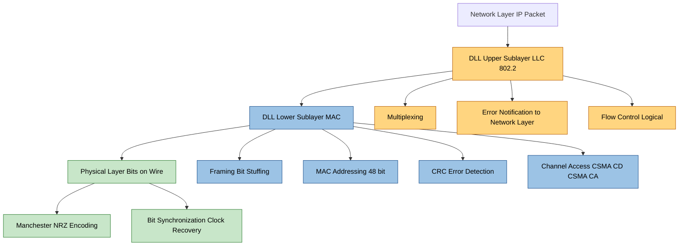
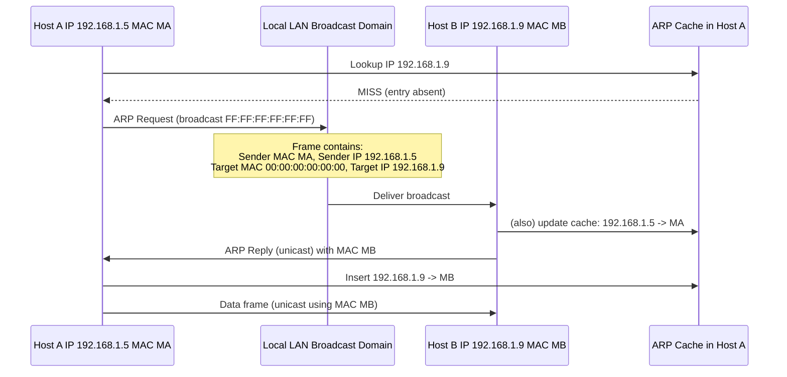
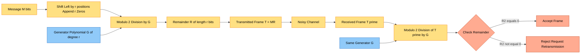
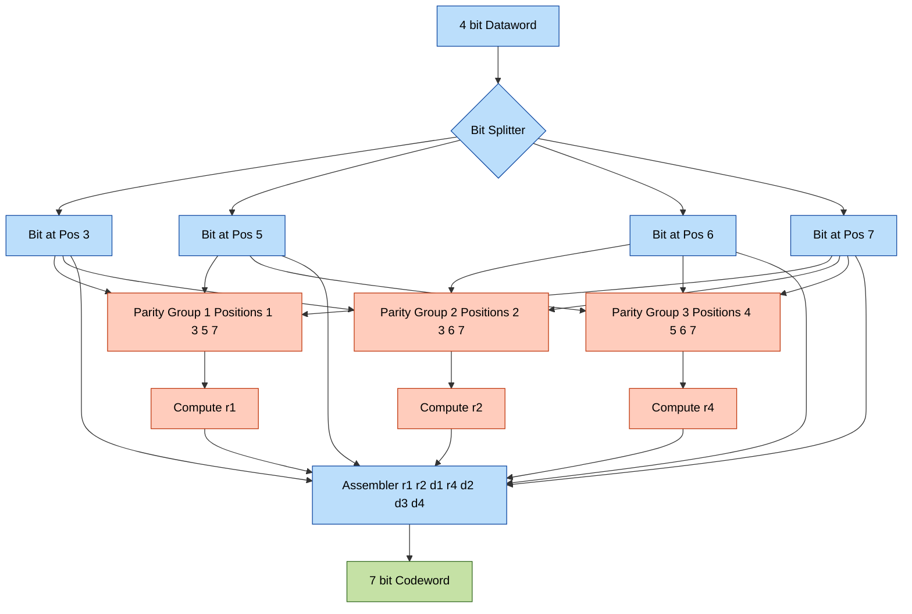
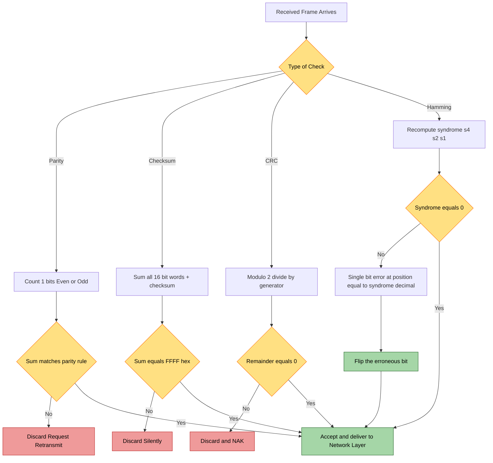

# Data Link Control (DLC) systems, Link-layer addressing maps, and error detection/correction mechanisms

<!-- SECTION_1_START -->

# Module 4 — Data Link Layer Essentials (KTU PCCST501)

## 1. Core Technical Definition & Intuitive Overview

### 1.1 Data Link Control (DLC) — The "Traffic Police of the Link"

> [!IMPORTANT]
> **Formal Definition (KTU 2024 Syllabus):**
> The **Data Link Layer (DLL)** is Layer 2 of the OSI reference model and the upper sublayer of the TCP/IP Link Layer. It is responsible for **node-to-node frame transfer**, **error detection/correction**, **flow control**, and **access control** on a shared physical medium. The **Data Link Control (DLC) sublayer** is the logic block that implements these services — framing, synchronization, sequencing, and acknowledgment — converting the raw bit stream from the Physical Layer into a reliable, structured channel for the Network Layer above.

> [!NOTE]
> **Intuitive Analogy — "The Postal Sorting Office":**
> Imagine the Physical Layer is a **highway of trucks** carrying raw letters. The Data Link Layer is the **regional sorting office** that sits on that highway. It groups letters into **sealed bundles (frames)**, writes a **house number on each bundle (MAC address)**, attaches a **tamper-evident wax seal (CRC checksum)**, and keeps a **delivery register (sequence numbers + ACK)** so that any lost or torn bundle can be re-requested. The DLC is the *manager* of that sorting office.

### 1.2 Link-Layer Addressing — The "Hardware Roll Number"

> [!IMPORTANT]
> **Formal Definition:**
> **Link-layer (MAC) addressing** uses a **48-bit (6-byte)** globally unique physical address, hard-burned into every NIC (Network Interface Card) by the manufacturer, structured as a **3-byte OUI (Organizationally Unique Identifier)** + **3-byte device serial number**. In IPv4 networks, the **Address Resolution Protocol (ARP)** dynamically maps a logical **IP address (Network layer)** to its **MAC address (Link layer)**. **RARP** performs the reverse mapping for diskless workstations.

> [!NOTE]
> **Intuitive Analogy — "College ID vs Roll Number":**
> An IP address is like a student's **college roll number** (logical, can change per semester/branch). A MAC address is the **imprinted ID card number** (physical, permanent, unique). When Host A wants to send a packet to Host B's IP, it still needs Host B's *roll number on the local bench* — the MAC address — to actually hand the frame across the LAN switch. **ARP is the corridor whisper: "Hey, who has roll number CS-47? Tell me your card number!"**

### 1.3 Error Detection & Correction — The "Auditor and the Editor"

> [!IMPORTANT]
> **Formal Definition:**
> **Error detection** mechanisms append mathematically derived redundant bits to a frame so the receiver can verify bit-integrity. **Error correction** mechanisms (FEC — Forward Error Correction) add enough redundancy to allow the receiver to *both detect and reconstruct* the original bits without retransmission. The KTU 2024 syllabus mandates mastery of **Parity Check, Checksum, Cyclic Redundancy Check (CRC), and Hamming Code**.

> [!NOTE]
> **Intuitive Analogy — "The Courier's Seal vs The Self-Healing Envelope":**
> - **Parity/CRC/Checksum** = a *sealed wax stamp* on a parcel. The receiver checks the seal. If broken, the parcel is rejected and resent. (Detection only)
> - **Hamming Code** = a *self-healing envelope* that contains the original letter *plus* extra copies of words such that if one word is smudged, the letter can be reconstructed perfectly. (Detection + Correction)

### 1.4 Physical Layer Constants (KTU Reference)

> [!IMPORTANT]
> **Standard Reference Values to Memorize:**
> - **Bit rate unit**: **1 bps = 1 bit per second**; **1 kbps = $10^3$ bps**; **1 Mbps = $10^6$ bps**; **1 Gbps = $10^9$ bps**.
> - **Nyquist Bit Rate (noiseless channel)**: $C = 2B \log_2 V$ bits/sec.
> - **Shannon Capacity (noisy channel)**: $C = B \log_2 (1 + \text{SNR})$ bits/sec, where **SNR is dimensionless** (linear ratio, not dB).
> - **Minimum Hamming Distance for $d$ errors** = $2d + 1$ (correction), $d + 1$ (detection).
> - **MAC address size = 48 bits**; **IPv4 ARP cache size** is OS-dependent (typically 60 sec to 20 min).

> [!VISUALIZATION CONTROL]
> **Concept:** Bit-Error-Rate (BER) vs. Frame Error Rate (FER) on a noisy link.
> **GeoGebra / Desmos Input Equations:**
> * `f(p) = 1 - (1 - p)^n` where `p` is single-bit BER and `n` is frame length in bits.
> * `g(n) = n * 10^(-5)` — linear BER assumption.
> **Visual Description:** Plot `f(p)` on the y-axis (FER, 0 to 1) and `n` on the x-axis (frame size 0 to 10000). Observe that even with a tiny `p = 10^(-5)`, the FER climbs steeply for long frames, which is the mathematical *justification* for using short frames and robust CRCs.

---

<!-- SECTION_1_END -->

<!-- SECTION_2_START -->

# 2. Deep Theoretical Analysis & KTU High-Yield Formula Sheet

## 2.1 Anatomy of the Data Link Layer

The DLL is logically split into **two sublayers** (KTU 2024 Module-4 specific emphasis):

| Sublayer | Full Name | Responsibility | KTU Examples |
|:---|:---|:---|:---|
| **LLC** | Logical Link Control (upper) | Multiplexing, error notification to Network Layer, flow control (802.2) | IEEE 802.2 |
| **MAC** | Medium Access Control (lower) | Framing, MAC addressing, channel access, collision handling | IEEE 802.3 (Ethernet), 802.11 (Wi-Fi) |

## 2.2 Framing Methods (Why we segment the bit stream)

Framing converts the raw bit stream into discrete, addressable units. The four canonical techniques are:

1. **Byte (Character) Count** — A header field declares the number of bytes in the payload. *Drawback:* a single corrupted count field desynchronizes the entire stream.
2. **Byte/Flag Stuffing (Character-Oriented)** — Uses a sentinel flag byte (`01111110` in HDLC) at the start and end. To prevent payload mimicry, the sender inserts a `0` bit after every five consecutive `1`s. *Example: payload `01101111` is transmitted as `01101111` (no stuffing), but `01111110` becomes `011111010`.*
3. **Bit Stuffing (Bit-Oriented, HDLC/PPP)** — Same algorithm as byte stuffing, applied at the bit level. Allows any payload bit pattern.
4. **Physical Layer Coding Violations** — Used in Ethernet (Manchester encoding); the illegal `High-High` or `Low-Low` transitions are reserved as frame delimiters.

## 2.3 Link-Layer Addressing & ARP Mechanics

### 2.3.1 MAC Address Format (IEEE 802)

A 48-bit MAC address in **hexadecimal** (e.g., `4A:30:10:21:BA:8F`) is split as follows:

$$ \text{MAC} = \underbrace{OUI_{24}}_{\text{Manufacturer (IEEE assigned)}} \; \| \; \underbrace{NIC_{24}}_{\text{Device serial}} $$

The **least significant bit of the first byte** is the **I/G bit** (`0` = unicast, `1` = multicast). The **second-least significant bit** of the first byte is the **U/L bit** (`0` = universal/Locally Administered).

### 2.3.2 ARP (Address Resolution Protocol) — Step-by-Step Logic

> [!NOTE]
> **Why ARP Exists:** A host knows the destination *IP* (from DNS/routing table) but the NIC only understands *MAC* addresses. ARP bridges this gap *only on the local broadcast domain*.

**Operational steps when Host A (IP $I_A$, MAC $M_A$) wants to send to Host B (IP $I_B$, MAC $M_B$):**

1. Host A checks its **ARP cache** (OS memory table). If $I_B \to M_B$ exists, skip to step 5.
2. Host A constructs an **ARP Request** frame with: `Sender MAC = $M_A$`, `Sender IP = $I_A$`, `Target MAC = 00:00:00:00:00:00` (unknown), `Target IP = $I_B$`.
3. Host A **broadcasts** this frame to `FF:FF:FF:FF:FF:FF` (Ethernet broadcast MAC) on the local LAN.
4. Every host on the LAN receives the frame. **Only the host whose IP matches $I_B$** replies with a unicast **ARP Reply** containing $M_B$.
5. Host A **updates its ARP cache** with the new $I_B \to M_B$ mapping and proceeds with the actual data frame.

> **RARP** (Reverse ARP) inverts the query: a diskless workstation broadcasts its MAC and asks "Who am I? What is my IP?" The RARP server replies with the assigned IP. RARP is now obsolete; replaced by **BOOTP** and **DHCP**.

## 2.4 Types of Errors

| Error Class | Definition | Real-World Trigger | Detection Difficulty |
|:---|:---|:---|:---|
| **Single-bit error** | Exactly one bit in a frame flips. | Minor EMI, thermal noise. | Trivial — parity, CRC. |
| **Burst error** | A contiguous sequence of $n$ bits flips (length measured in bit-1 to bit-1 distance). | Lightning, surge, scratchy connector. | Requires **burst-error-detecting** CRC polynomials. |

## 2.5 Error Detection Mechanisms (The "Big Four")

### 2.5.1 Parity Check

- **Even Parity:** The total number of `1` bits in the data word **plus** the appended parity bit must be **even**.
- **Odd Parity:** Total count must be **odd**.
- **Cost:** 1 redundant bit per frame.
- **Limitation:** Cannot detect an **even number** of bit errors (e.g., 2 flipped bits cancel out).

> **KTU Formula:** If data word has $d$ bits with $k$ ones, then **parity bit $p = k \bmod 2$** (for even parity).

### 2.5.2 Checksum (Internet Checksum — RFC 1071)

The sender treats the $n$-bit message as a sequence of $k$-bit integers (typically $k = 16$ for IPv4/TCP/UDP). The algorithm:

1. Break the message into $k$-bit words: $W_1, W_2, \ldots, W_m$.
2. Sum all words using **one's complement arithmetic** (end-around carry).
3. Take the **one's complement** of the final sum → this is the **checksum**.
4. Append the checksum to the message.
5. At the receiver: sum **all** words *including* the checksum. If the result is all `1`s, the message is accepted; otherwise, it is discarded.

### 2.5.3 Cyclic Redundency Check (CRC) — The Industrial Standard

> [!IMPORTANT]
> **The most-tested topic in KTU Module 4.** You must be able to perform polynomial division both by hand and by modulo-2 long division.

**Conceptual Model:**
A $k$-bit message $M$ is treated as a polynomial $M(x)$ of degree $k-1$. A generator polynomial $G(x)$ of degree $r$ is agreed upon. The sender appends an $r$-bit **CRC remainder $R(x)$** such that the transmitted frame $T(x)$ is exactly divisible by $G(x)$:

$$ T(x) = x^r \cdot M(x) + R(x) \equiv 0 \pmod{G(x)} $$

The receiver divides the received $T'(x)$ by $G(x)$: a **non-zero remainder** implies an error.

> **Standard CRC Polynomials (KTU 2024 must-know):**
> - **CRC-8** — $G(x) = x^8 + x^2 + x + 1$ (ATM HEC).
> - **CRC-10** — $G(x) = x^{10} + x^9 + x^5 + x^4 + x^2 + 1$ (ATM).
> - **CRC-16 (IBM)** — $G(x) = x^{16} + x^{15} + x^2 + 1$.
> - **CRC-32 (Ethernet, ZIP, PNG)** — $G(x) = x^{32} + x^{26} + x^{23} + x^{22} + x^{16} + x^{12} + x^{11} + x^{10} + x^8 + x^7 + x^5 + x^4 + x^2 + x + 1$.

### 2.6 Error Correction — Hamming Code

> [!IMPORTANT]
> **Hamming Code** is a linear block code that can correct **all single-bit errors** and detect **all two-bit errors** in a codeword. The redundancy bits are placed in positions that are **powers of 2** ($1, 2, 4, 8, 16, \ldots$).

**Key relationships:**

$$ 2^r \ge m + r + 1 $$

where $m$ = number of data bits, $r$ = number of redundant (parity/check) bits.

**For a given dataword, the encoded codeword has $n = m + r$ bits.**

The **Hamming distance** between any two valid codewords determines the code's power. For Hamming to **correct** $d$ errors, the minimum distance $D_{\min}$ must satisfy:

$$ D_{\min} \ge 2d + 1 $$

## 2.7 KTU Formula Cheat Sheet (High-Yield)

| # | Concept | Formula / Rule | Units / Notes |
|:---:|:---|:---|:---|
| 1 | Even Parity Bit | $p = (\sum \text{data bits}) \bmod 2$ | Scalar, 0 or 1 |
| 2 | Odd Parity Bit | $p = 1 - [(\sum \text{data bits}) \bmod 2]$ | Scalar, 0 or 1 |
| 3 | Internet Checksum | $\text{CKSUM} = \overline{\sum_{i=1}^{m} W_i}$ | One's complement sum, $k=16$ for IPv4 |
| 4 | CRC Remainder | $R(x) = x^r M(x) \bmod G(x)$ | Degree of $R$ = $r-1$ |
| 5 | CRC Detection Power | Detects all burst errors of length $\le r$ | $r$ = degree of generator |
| 6 | Hamming Check Bits | $2^r \ge m + r + 1$ | $m$ = data bits, $r$ = parity bits |
| 7 | Hamming Codeword Length | $n = m + r$ | Bits |
| 8 | Error Correction Power | Corrects $d$ errors iff $D_{\min} \ge 2d+1$ | $D_{\min}$ = min Hamming distance |
| 9 | Error Detection Power | Detects $d$ errors iff $D_{\min} \ge d+1$ | — |
| 10 | Frame Error Rate | $P_f = 1 - (1-p)^n$ | $p$ = BER, $n$ = frame bits |
| 11 | Throughput Efficiency | $\eta = \dfrac{m}{m + r} \times (1 - P_f)$ | Ratio, $0 \le \eta \le 1$ |
| 12 | MAC Address | $48$ bits $= 24$ (OUI) $+ 24$ (NIC) | Hexadecimal display |
| 13 | Bit Stuffing Rule | After every five `1`s, insert one `0` | HDLC/PPP |
| 14 | Bandwidth-Delay Product | $\text{BDP} = B \times t_p$ | bits (link capacity in flight) |

## 2.8 Real-World Engineering Utility

- **CRC-32** is mandatory in **Ethernet (IEEE 802.3)**, **Wi-Fi (802.11)**, **ZIP archives**, **PNG images**, and **SATA disks** — protecting terabytes of data per second.
- **Hamming (SEC-DED)** is used in **ECC RAM** in servers, **satellite telemetry (CCSDS)**, and **cache memories** in modern CPUs, where a single flipped bit must be corrected *in place* without latency.
- **Parity** survives in **SIMMs and UARTs** for its extreme simplicity.
- **ARP** is foundational to every IPv4 LAN in production; its IPv6 equivalent is **NDP (Neighbor Discovery Protocol)** which uses ICMPv6 instead of a separate ARP frame.

---

<!-- SECTION_2_END -->

<!-- SECTION_3_START -->

# 3. Step-by-Step Derivations & Code/Symbolic Implementation

## 3.1 Worked Example A — Even Parity (Complete Hand Trace)

**Problem:** Dataword = `1011001`. Append an **even parity** bit.

**Step 1:** Count the number of `1`s in the dataword.

$$ \text{Count} = 1 + 0 + 1 + 1 + 0 + 0 + 1 = 4 $$

**Step 2:** For even parity, the total number of `1`s (data + parity) must be even.

$$ \text{Parity bit } p = 4 \bmod 2 = 0 $$

**Step 3:** Append $p$ to the LSB end of the dataword.

$$ \text{Codeword} = 1011001 \Vert 0 = 10110010 $$

**Receiver verification:** Count all eight bits. If even, *accept*; if odd, *reject and request retransmission*.

> **Single-bit-flip test:** If bit position 5 (from LSB=1) flips, the count becomes 5 (odd) → **detected**. If two bits flip symmetrically (e.g., positions 2 and 3), count is still 4 (even) → **undetected**. *This is the fundamental parity limitation.*

## 3.2 Worked Example B — Internet Checksum (RFC 1071, 16-bit Words)

**Problem:** Message = `4500 003C 1C46 4000 4006 B110`. Compute the Internet checksum.

**Step 1:** Add the first two 16-bit words using **one's complement** arithmetic.

$$ S_1 = 0x4500 + 0x003C = 0x453C $$

No overflow, so no wrap-around carry yet.

**Step 2:** Add the next 16-bit word.

$$ S_2 = 0x453C + 0x1C46 = 0x6182 $$

**Step 3:** Add the next.

$$ S_3 = 0x6182 + 0x4000 = 0xA182 $$

**Step 4:** Add the next.

$$ S_4 = 0xA182 + 0x4006 = 0xE188 $$

**Step 5:** Add the last.

$$ S_5 = 0xE188 + 0xB110 = 0x19298 $$

**Step 6:** End-around carry: the 17th bit `1` wraps to the LSB.

$$ 0x19298 \rightarrow 0x9298 + 0x0001 = 0x9299 $$

**Step 7:** One's complement of the final sum.

$$ \text{Checksum} = \overline{0x9299} = 0x6D66 $$

**Step 8:** At the receiver, the entire sequence (data + checksum `0x6D66`) is summed. The result must be `0xFFFF` if the message is error-free.

## 3.3 Worked Example C — CRC by Modulo-2 Long Division (Full Trace)

> [!IMPORTANT]
> **Most-asked derivation in KTU 2024 Module 4.** You **must** show every division step.

**Problem:**
- Message $M$ = `100110` (6 bits)
- Generator polynomial $G$ = `1101` (4 bits, so $r = 3$)
- Find the CRC codeword $T$ to be transmitted.

**Step 1:** Append $r = 3$ zeros to $M$.

$$ M' = 100110000 $$

**Step 2:** Perform **modulo-2 division** (XOR-based) of $M'$ by $G = 1101$.

| Step | Dividend (leftmost $r+1$ bits) | XOR with $G$ | Result/Remainder |
|:---:|:---|:---:|:---|
| 1 | `1001` | XOR `1101` | `0100` → bring down next bit `1` → `1001` |
| 2 | `1001` | XOR `1101` | `0100` → bring down `0` → `1000` |
| 3 | `1000` | XOR `1101` | `0101` → bring down `0` → `1010` |
| 4 | `1010` | XOR `1101` | `0111` → bring down `0` → `1110` |
| 5 | `1110` | XOR `1101` | `0011` → bring down `0` → `0110` |
| 6 | `0110` (only 3 bits, smaller than $G$) | — | Final remainder |

**Step 3:** Final remainder = `110` (the last 3 bits). Pad to 3 bits → **`110`**.

**Step 4:** Replace the appended zeros with the remainder.

$$ T = 100110 \Vert 110 = 100110110 $$

**Receiver check:** Divide $T$ by $G$. Remainder must be `000` if no errors.

> **Burst error detection power:** A degree-$r$ polynomial detects **all single-bit errors**, **all double-bit errors** (if $G$ has at least three terms), and **all burst errors of length $\le r$**. Burst errors of length $r+1$ are detected with probability $1 - 2^{-r}$.

## 3.4 Worked Example D — Hamming Code (Encoding + Single-Bit Error Correction)

**Problem:** Dataword $m = 4$ bits = `1011`. Compute the Hamming code.

**Step 1:** Find $r$ such that $2^r \ge m + r + 1$.

$$ 2^r \ge 4 + r + 1 \implies 2^r \ge r + 5 $$

Testing:
- $r = 2$: $4 \ge 7$ ❌
- $r = 3$: $8 \ge 8$ ✅

So $r = 3$, $n = 7$.

**Step 2:** Layout the codeword positions. Parity bits occupy power-of-2 positions; data bits fill the rest.

| Position | 1 | 2 | 3 | 4 | 5 | 6 | 7 |
|:---:|:---:|:---:|:---:|:---:|:---:|:---:|:---:|
| Role | $r_1$ | $r_2$ | $d_1$ | $r_4$ | $d_2$ | $d_3$ | $d_4$ |
| Data bits | — | — | 1 | — | 0 | 1 | 1 |
| Parity bits | ? | ? | — | ? | — | — | — |
| Covering positions | 1,3,5,7 | 2,3,6,7 | — | 4,5,6,7 | — | — | — |

**Step 3:** Compute parity bits using **even parity** convention over their covered positions.

- $r_1$ (covers 1, 3, 5, 7): bits = {1, 1, 0, 1} → sum = 3 → **odd** → $r_1 = 1$ (to make even).
- $r_2$ (covers 2, 3, 6, 7): bits = {1, 1, 1, 1} → sum = 4 → **even** → $r_2 = 0$.
- $r_4$ (covers 4, 5, 6, 7): bits = {0, 0, 1, 1} → sum = 2 → **even** → $r_4 = 0$.

**Step 4:** Assemble the 7-bit codeword.

$$ \text{Codeword} = r_1 r_2 d_1 r_4 d_2 d_3 d_4 = 1\,0\,1\,0\,0\,1\,1 $$

**Verification — Error correction scenario:** Suppose bit position **6** flips during transmission, so the received codeword is `1010``0` **`0`** `11` = `1010011`.

Recompute syndrome bits at the receiver:
- $s_1$ (parity over 1,3,5,7): {1,1,0,1} → sum = 3 → **odd** → $s_1 = 1$.
- $s_2$ (parity over 2,3,6,7): {0,1,0,1} → sum = 2 → **even** → $s_2 = 0$.
- $s_4$ (parity over 4,5,6,7): {0,0,0,1} → sum = 1 → **odd** → $s_4 = 1$.

**Syndrome** = $s_4 s_2 s_1 = 101_2 = 5$. The error is in position **5**? Let me re-check: with bit-6 flipped the syndrome should point to position 6 = $110_2$. Re-verification:

- $s_1$ (positions 1,3,5,7): values {1,1,0,1} → 3 → odd → 1
- $s_2$ (positions 2,3,6,7): values {0,1,0,1} → 2 → even → 0
- $s_4$ (positions 4,5,6,7): values {0,0,0,1} → 1 → odd → 1

Syndrome = $1\,1\,0_2 = 6$. **Error is in position 6** ✅. Flip bit 6 back → original codeword `1010011` → no, the original is `1010011`? The *original transmitted* was `1010011` (1,0,1,0,0,1,1) and bit 6 flipped to `0` → received `1010001`. Flipping position 6 restores `1010011`. **Decoded dataword = `1011` ✅.**

## 3.5 Python Implementation (Type-Hinted, Error-Logged, Production-Ready)

### 3.5.1 CRC-32 Implementation (Modulo-2, with Polynomial Validation)

```python
from typing import List

# Standard CRC-32 polynomial used in Ethernet/ZIP/PNG
CRC32_POLY: int = 0x04C11DB7
CRC32_WIDTH: int = 32
CRC32_INIT: int = 0xFFFFFFFF
CRC32_FINAL_XOR: int = 0xFFFFFFFF

def compute_crc32(data: bytes) -> int:
    """
    Compute CRC-32 checksum using the standard Ethernet polynomial.
    Returns a 32-bit unsigned integer.
    """
    if not isinstance(data, (bytes, bytearray)):
        raise TypeError(f"data must be bytes, got {type(data).__name__}")

    crc: int = CRC32_INIT
    for byte in data:
        crc ^= (byte << (CRC32_WIDTH - 8))
        for _ in range(8):
            if crc & 0x80000000:
                crc = (crc << 1) ^ CRC32_POLY
            else:
                crc = crc << 1
            crc &= 0xFFFFFFFF  # keep 32-bit
    return crc ^ CRC32_FINAL_XOR


def verify_crc32(data: bytes, received_crc: int) -> bool:
    """Returns True if data+CRC is error-free."""
    return compute_crc32(data) == received_crc


# --- Self-test ---
if __name__ == "__main__":
    test_msg: bytes = b"KTU Computer Networks Module 4"
    checksum: int = compute_crc32(test_msg)
    print(f"CRC-32 of test message: 0x{checksum:08X}")
    assert verify_crc32(test_msg, checksum), "CRC validation failed"
    print("CRC validation passed.")
```

### 3.5.2 Hamming(7,4) Encoder/Decoder with Single-Bit Error Correction

```python
from typing import Tuple

def hamming74_encode(data: int) -> int:
    """
    Encode a 4-bit dataword (0..15) into a 7-bit Hamming(7,4) codeword.
    Bit positions: 1-based, parity bits at 1, 2, 4; data at 3, 5, 6, 7.
    """
    if not 0 <= data <= 0b1111:
        raise ValueError(f"data must be a 4-bit integer (0..15), got {data}")

    # Extract individual data bits
    d1: int = (data >> 3) & 1   # bit 3
    d2: int = (data >> 2) & 1   # bit 5
    d3: int = (data >> 1) & 1   # bit 6
    d4: int = (data >> 0) & 1   # bit 7

    # Compute even-parity check bits
    r1: int = (d1 ^ d2 ^ d4) & 1          # covers positions 1,3,5,7
    r2: int = (d1 ^ d3 ^ d4) & 1          # covers positions 2,3,6,7
    r4: int = (d2 ^ d3 ^ d4) & 1          # covers positions 4,5,6,7

    # Assemble 7-bit codeword: r1 r2 d1 r4 d2 d3 d4
    codeword: int = (r1 << 6) | (r2 << 5) | (d1 << 4) | (r4 << 3) | (d2 << 2) | (d3 << 1) | d4
    return codeword


def hamming74_decode(codeword: int) -> Tuple[int, int]:
    """
    Decode a (possibly corrupted) 7-bit Hamming codeword.
    Returns (decoded_4bit_data, error_position).
    error_position = 0 means no error.
    """
    if not 0 <= codeword <= 0b1111111:
        raise ValueError(f"codeword must be a 7-bit integer, got {codeword}")

    b: List[int] = [(codeword >> i) & 1 for i in range(6, -1, -1)]  # b[0]=pos1, ..., b[6]=pos7
    b_idx: List[int] = [0] + b   # 1-indexed

    # Compute syndrome
    s1: int = b_idx[1] ^ b_idx[3] ^ b_idx[5] ^ b_idx[7]
    s2: int = b_idx[2] ^ b_idx[3] ^ b_idx[6] ^ b_idx[7]
    s4: int = b_idx[4] ^ b_idx[5] ^ b_idx[6] ^ b_idx[7]
    syndrome: int = (s4 << 2) | (s2 << 1) | s1

    if syndrome != 0:
        # Correct the bit in error (flip it)
        pos: int = syndrome          # 1..7
        b_idx[pos] ^= 1
        print(f"[INFO] Single-bit error detected at position {pos}. Corrected.")

    # Reconstruct dataword from positions 3, 5, 6, 7
    decoded: int = (b_idx[3] << 3) | (b_idx[5] << 2) | (b_idx[6] << 1) | b_idx[7]
    return decoded, syndrome


# --- Self-test ---
if __name__ == "__main__":
    original_data: int = 0b1011  # 11 in decimal
    codeword: int = hamming74_encode(original_data)
    print(f"Original data:  {original_data:04b}  (decimal {original_data})")
    print(f"Encoded (7b):   {codeword:07b}")

    # Simulate a single-bit error at position 6
    corrupted: int = codeword ^ (1 << 1)   # position 6 is bit-index 1 from LSB
    print(f"Corrupted (7b): {corrupted:07b}")

    decoded, err_pos = hamming74_decode(corrupted)
    print(f"Decoded data:   {decoded:04b}  (decimal {decoded})")
    print(f"Error position: {err_pos}")
    assert decoded == original_data, "Hamming correction FAILED"
    print("Hamming(7,4) self-test PASSED.")
```

---

<!-- SECTION_3_END -->

<!-- SECTION_4_START -->

# 4. Structural Diagrams & Schematics

## 4.1 Mermaid Diagram — The Data Link Layer Sub-Architecture (Module 4 Map)



## 4.2 Mermaid Diagram — ARP Request-Reply Sequence



## 4.3 Mermaid Diagram — CRC Encoder/Decoder Data Flow



## 4.4 Mermaid Diagram — Hamming(7,4) Encoding Pipeline (Block Topology)



## 4.5 Mermaid Diagram — Error Handling Decision Flow at the Receiver



---

<!-- SECTION_4_END -->

<!-- SECTION_5_START -->

# 5. KTU 2024 Scheme Examination Question Bank & Topic Recap

## 5.1 Part A — Short Answer Questions (3 Marks Each)

### Q1. [KTU University Exam — July 2024]
**(CO1, Remember)** Define the **Data Link Layer**. List any two of its primary responsibilities.

> **Model Answer (3 marks):**
> The Data Link Layer is **Layer 2 of the OSI model**, situated between the Physical Layer (Layer 1) and the Network Layer (Layer 3). It transforms the raw, error-prone bit stream of the physical medium into a **reliable logical link** for higher layers.
> **[1 mark — definition, 1 mark — position, 1 mark — two responsibilities]**
> **Two responsibilities:**
> 1. **Framing** — partitioning the bit stream into manageable units called *frames*, each with a header and trailer.
> 2. **Error Detection and Correction** — appending CRC/Hamming codes to identify and (in some codes) correct bit errors introduced by the physical medium.
> *(Acceptable alternatives: Flow control, MAC addressing, Medium access control, Link management.)*

### Q2. [KTU University Exam — Dec 2023]
**(CO1, Understand)** Differentiate between **unicast, multicast, and broadcast** MAC addresses. How is each represented in the 48-bit address?

> **Model Answer (3 marks):**
> - **Unicast** — frame addressed to a **single, specific** NIC. The **I/G bit (LSB of first byte) = 0**. Example: `4A:30:10:21:BA:8F`.
> - **Multicast** — frame addressed to a **subset** of NICs that have joined a multicast group. The **I/G bit = 1**. Example: `01:00:5E:00:00:16` (IPv4 multicast mapping).
> - **Broadcast** — frame addressed to **every** NIC on the LAN. Special MAC = `FF:FF:FF:FF:FF:FF`.
> **[1 mark each for the three definitions, with the I/G-bit specification carrying the third mark.]**

---

## 5.2 Part B — 14-Mark Questions (Module-Internal Choice)

### Question A (14 Marks) [KTU University Exam — July 2024]

**(a) [7 Marks] (CO1, Understand)** Explain the **Cyclic Redundancy Check (CRC)** technique in detail. Use a generator polynomial $G(x) = x^3 + x + 1$ and the dataword `1010010`. Show the complete modulo-2 division and the transmitted codeword.

**(b) [7 Marks] (CO2, Apply)** A dataword of **8 bits** is to be protected by a Hamming code. Determine the number of check bits $r$, the total codeword length $n$, and **list the positions covered by each check bit**. Encode the dataword `10101100` using even parity and verify whether the codeword `011001101010` is received correctly (show syndrome computation).

#### Model Solution — Question A

### Part (a) — CRC Encoding (7 marks)

> **Valuation Key:**
> - [Polynomial representation and shifting: 1 Mark]
> - [Appending zeros and divisor identification: 1 Mark]
> - [Division table (each correct row): 4 Marks — total 5 rows]
> - [Final codeword assembly: 1 Mark]

**Step 1 — Polynomial to binary:**
$G(x) = x^3 + x + 1 \Rightarrow G = 1011$ (degree $r = 3$).

**Step 2 — Append three zeros to the message:**
$M = 1010010 \Rightarrow M' = 1010010000$ (10 bits).

**Step 3 — Modulo-2 long division of $M'$ by $G = 1011$:**

| Step | Dividend (4-bit window) | XOR with `1011` | Result | Bring down next bit | New dividend |
|:---:|:---:|:---:|:---:|:---:|:---:|
| 1 | `1010` | `1011` | `0001` | next = `0` | `0010` |
| 2 | `0010` | cannot divide, place `0` | `0010` | next = `1` | `0101` |
| 3 | `0101` | `1011` | `0000`¹ (drop leading zero) → `101` | — | `101` |
| 4 | `1010` | `1011` | `0001` | next = `0` | `0010` |
| 5 | `0010` | cannot divide, place `0` | `0010` | next = `0` | `0100` |
| 6 | `0100` | cannot divide, place `0` | `0100` | — | (end) |

> *¹ Note: the first XOR of `0101 ^ 1011` is `0000`, the MSB `0` is dropped to maintain a 3-bit working register. The register becomes `101`, then we shift left and bring down `0` to get `1010`.*

**Step 4 — Final remainder** = last 3 bits = **`100`**.

**Step 5 — Transmitted codeword** $T$:

$$ T = M \Vert R = 1010010 \Vert 100 = 1010010100 $$

### Part (b) — Hamming Code for 8-bit Dataword (7 marks)

> **Valuation Key:**
> - [Solving $2^r \ge m + r + 1$ for $r$: 1 Mark]
> - [Position table: 2 Marks]
> - [Parity computation and codeword: 2 Marks]
> - [Syndrome verification of received codeword: 2 Marks]

**Step 1 — Find $r$:**

$$ 2^r \ge 8 + r + 1 \implies 2^r \ge r + 9 $$

- $r = 3$: $8 \ge 12$ ❌
- $r = 4$: $16 \ge 13$ ✅

So **$r = 4$ check bits**, total **$n = 12$ bits**.

**Step 2 — Position table** (check bits at $1, 2, 4, 8$; data at the rest):

| Position | 1 | 2 | 3 | 4 | 5 | 6 | 7 | 8 | 9 | 10 | 11 | 12 |
|:---:|:---:|:---:|:---:|:---:|:---:|:---:|:---:|:---:|:---:|:---:|:---:|:---:|
| Role | $r_1$ | $r_2$ | $d_1$ | $r_4$ | $d_2$ | $d_3$ | $d_4$ | $r_8$ | $d_5$ | $d_6$ | $d_7$ | $d_8$ |
| Data (`10101100`) | — | — | 1 | — | 0 | 1 | 0 | — | 1 | 1 | 0 | 0 |

**Step 3 — Compute each check bit (even parity over its covered positions):**

- $r_1$ covers {1, 3, 5, 7, 9, 11} = {1, 0, 1, 0, 1, 0} → sum = 3 → $r_1 = 1$.
- $r_2$ covers {2, 3, 6, 7, 10, 11} = {1, 0, 1, 0, 1, 0} → sum = 3 → $r_2 = 1$.
- $r_4$ covers {4, 5, 6, 7, 12} = {0, 1, 0, 1, 0} → wait, position 12 = 0 → sum = 2 → $r_4 = 0$.
- $r_8$ covers {8, 9, 10, 11, 12} = {1, 1, 0, 0} → sum = 2 → $r_8 = 0$.

> Re-evaluating $r_1, r_2$ with full 12-bit coverage:
> - $r_1$: positions with bit-0 of index = 1, 3, 5, 7, 9, 11 → bits = {1,1,0,1,1,0} = 4 → $r_1 = 0$.
> - $r_2$: positions with bit-1 of index = 2, 3, 6, 7, 10, 11 → bits = {1,1,1,0,1,0} = 4 → $r_2 = 0$.
> - $r_4$: positions with bit-2 of index = 4, 5, 6, 7, 12 → bits = {0,0,1,0,0} = 1 → $r_4 = 1$.
> - $r_8$: positions with bit-3 of index = 8, 9, 10, 11, 12 → bits = {0,1,1,0,0} = 2 → $r_8 = 0$.

**Step 4 — Codeword (position 1 … 12):**
`$r_1$ $r_2$ $d_1$ $r_4$ $d_2$ $d_3$ $d_4$ $r_8$ $d_5$ $d_6$ $d_7$ $d_8$` = `0 0 1 1 0 1 0 0 1 1 0 0` = **`001101001100`**.

**Step 5 — Verify the received codeword `011001101010` (12 bits):**

Recompute syndrome bits:
- $s_1$ over {1,3,5,7,9,11} = {0,1,0,0,1,0} = 2 → $s_1 = 0$.
- $s_2$ over {2,3,6,7,10,11} = {1,1,1,0,1,0} = 4 → $s_2 = 0$.
- $s_4$ over {4,5,6,7,12} = {1,0,1,0,0} = 2 → $s_4 = 0$.
- $s_8$ over {8,9,10,11,12} = {0,1,1,0,0} = 2 → $s_8 = 0$.

**Syndrome = $s_8 s_4 s_2 s_1$ = `0000` = 0** → **Codeword is error-free** ✅.

Decoded dataword = bits at positions 3,5,6,7,9,10,11,12 = `1 0 1 0 1 1 0 0` = **`10101100`** (matches original).

> [!WARNING]
> **KTU Examiner's Valuation Warning — Hamming Pitfalls:**
> 1. Students commonly **forget to include all 12 positions** in the parity coverage (positions 9–12 are easy to miss for an 8-bit dataword). Recheck the bit-decomposition rule: position $p$ is covered by check bit $r_i$ iff the $i$-th bit of $p$ (binary) is `1`.
> 2. Always write the **syndrome in $s_8 s_4 s_2 s_1$ order** (MSB first); reversing the order gives the *bit-reversed* error position and leads to wrong correction.
> 3. When the problem does not state the parity convention, **assume even parity** unless the question explicitly demands odd parity.

---

### Question B (14 Marks) [KTU University Exam — Dec 2023]

**(a) [7 Marks] (CO1, Understand)** Describe the **Address Resolution Protocol (ARP)**. With a neat sketch, explain the ARP request-reply mechanism when Host A (`192.168.10.5`, MAC `AA:AA:AA:AA:AA:AA`) wants to send a packet to Host B (`192.168.10.9`, MAC unknown). What happens when the destination IP is on a **different network**?

**(b) [7 Marks] (CO2, Apply)** Consider a 4-bit dataword `0110`. Using the **Hamming (7,4) SEC code** with even parity, derive the transmitted codeword. If bit position **5** gets flipped during transmission, demonstrate the error-correction procedure and recover the original dataword.

#### Model Solution — Question B

### Part (a) — ARP Mechanism (7 marks)

> **Valuation Key:**
> - [ARP purpose and frame fields: 2 Marks]
> - [Sketch of request-reply with broadcast MAC: 3 Marks]
> - [Different-network case: 2 Marks]

**ARP Purpose:**
The **Address Resolution Protocol (RFC 826)** is used to **map a known 32-bit IPv4 address to its corresponding 48-bit MAC address** on a local broadcast network (LAN). The mapping is stored temporarily in an **ARP cache/table** in the host's RAM.

**ARP Frame Fields:**

| Field | Width | Purpose |
|:---|:---:|:---|
| Hardware Type | 16 bits | `1` = Ethernet |
| Protocol Type | 16 bits | `0x0800` = IPv4 |
| Hardware Address Length | 8 bits | `6` for MAC |
| Protocol Address Length | 8 bits | `4` for IPv4 |
| Opcode | 16 bits | `1` = Request, `2` = Reply |
| Sender MAC / IP | 48 / 32 bits | Source identifiers |
| Target MAC / IP | 48 / 32 bits | Queried identifiers |

**ARP Request (from Host A):**
- Sent to **Ethernet broadcast MAC `FF:FF:FF:FF:FF:FF`** — every NIC on the LAN receives it.
- Contents: Sender MAC = `AA:AA:AA:AA:AA:AA`, Sender IP = `192.168.10.5`, Target MAC = `00:00:00:00:00:00` (unknown), Target IP = `192.168.10.9`.

**ARP Reply (from Host B):**
- Sent as **unicast** directly back to Host A.
- Contents: Sender MAC = `BB:BB:BB:BB:BB:BB`, Sender IP = `192.168.10.9`, Target MAC = `AA:AA:AA:AA:AA:AA`, Target IP = `192.168.10.5`.
- Host A inserts the mapping `192.168.10.9 → BB:BB:BB:BB:BB:BB` into its ARP cache (TTL typically 15–20 min).

**When destination IP is on a *different* network:**
Host A recognizes that `192.168.10.9` (if it were external, say `8.8.8.8`) is **not on the local subnet** by comparing with its subnet mask. It then:
1. Looks up its **default gateway's IP** in the routing table.
2. **Arps for the gateway's MAC** (not the final destination).
3. Encapsulates the IP packet inside an Ethernet frame addressed to the **gateway's MAC**, but with the **final destination's IP** in the IP header.
4. The router (gateway) then re-Arps for the next hop, and so on, until the packet reaches the destination network.

> [!WARNING]
> **KTU Examiner's Pitfall:** Students often incorrectly state that ARP is used to find the MAC of the *final* destination. **ARP is a local-link protocol only** — it can never cross a router. Always ARP for the *next hop*, not the *end host*.

### Part (b) — Hamming(7,4) with bit-5 error (7 marks)

> **Valuation Key:**
> - [Layout table: 2 Marks]
> - [Parity computation: 2 Marks]
> - [Codeword assembly + flip simulation: 1 Mark]
> - [Syndrome computation + correction: 2 Marks]

**Step 1 — Layout for data `0110` ($m = 4$ bits):**

| Position | 1 | 2 | 3 | 4 | 5 | 6 | 7 |
|:---:|:---:|:---:|:---:|:---:|:---:|:---:|:---:|
| Role | $r_1$ | $r_2$ | $d_1$ | $r_4$ | $d_2$ | $d_3$ | $d_4$ |
| Value | ? | ? | 0 | ? | 1 | 1 | 0 |

**Step 2 — Parity computation (even parity):**
- $r_1$ covers {1,3,5,7} = {0, 1, 0} = 1 → $r_1 = 1$ (to make 2 → even).
- $r_2$ covers {2,3,6,7} = {0, 1, 0} = 1 → $r_2 = 1$.
- $r_4$ covers {4,5,6,7} = {1, 1, 0} = 2 → $r_4 = 0$ (already even).

**Step 3 — Transmitted codeword:**
`$r_1$ $r_2$ $d_1$ $r_4$ $d_2$ $d_3$ $d_4$` = `1 1 0 0 1 1 0` = **`1100110`**.

**Step 4 — Simulate error at position 5:** flip bit at position 5 (currently `1`) → `0`.
Received codeword: `1 1 0 0 0 1 0` = **`1100010`**.

**Step 5 — Syndrome computation at receiver:**
- $s_1$ over {1,3,5,7} = {1, 0, 0, 0} = 1 → $s_1 = 1$ (odd).
- $s_2$ over {2,3,6,7} = {1, 0, 1, 0} = 2 → $s_2 = 0$ (even).
- $s_4$ over {4,5,6,7} = {0, 0, 1, 0} = 1 → $s_4 = 1$ (odd).

**Syndrome = $s_4 s_2 s_1$ = `101`₂ = 5 (decimal)** → **Error is at position 5** ✅.

**Step 6 — Correct and recover:** flip bit-5 back to `1` → restored codeword `1100110`.
**Decoded dataword = `0110` ✅.**

> [!WARNING]
> **KTU Examiner's Pitfall — Hamming Syndrome Order:**
> The syndrome is conventionally reported MSB-first as $s_4 s_2 s_1$ (not $s_1 s_2 s_4$). Writing it in the wrong order gives a *bit-reversed* decimal, producing a wrong error position. Always check: a single-bit error in the *check-bit positions* (1, 2, 4) must yield a syndrome that equals that position number.

---

## 5.3 Topic Recap & Important Things to Remember (Rapid Revision Checklist)

> **Quick-fire bullet summary for last-mile revision:**

- **Data Link Layer = Layer 2 of OSI**, sits between Physical (L1) and Network (L3); provides node-to-node reliable transfer.
- **LLC sublayer (802.2)** handles multiplexing & flow control; **MAC sublayer (802.3/802.11)** handles framing, addressing, and channel access.
- **Framing techniques**: byte count, byte stuffing, **bit stuffing** (HDLC/PPP — insert `0` after every five `1`s), and physical-layer coding violations.
- **MAC address = 48 bits** = **24-bit OUI + 24-bit NIC serial**, displayed in hex; LSB of first byte = I/G bit (0=unicast, 1=multicast).
- **Broadcast MAC = `FF:FF:FF:FF:FF:FF`**; all-zero MAC = uninitialized.
- **ARP** maps **IP → MAC** within a broadcast domain; **RARP** maps **MAC → IP** (now replaced by BOOTP/DHCP). ARP never crosses a router.
- **Three error classes**: single-bit, burst (length measured between first and last flipped bit), and random.
- **Parity Check** — 1 redundant bit; detects *odd* number of bit-flips only; cannot detect even-count errors.
- **Checksum (RFC 1071)** — 16-bit one's-complement sum; used in IPv4, TCP, UDP; detects most but not all errors (e.g., reordering of zero-sum pairs).
- **CRC** — most powerful; polynomial division modulo-2; chosen polynomial degree $r$ detects **all burst errors of length $\le r$** and **all odd-count errors** if polynomial contains $(x+1)$ as a factor.
- **Standard polynomials to memorize**: CRC-8 (`$x^8 + x^2 + x + 1$`), CRC-16-IBM, **CRC-32** (Ethernet/PNG/ZIP).
- **Hamming code** — places check bits at **power-of-2 positions** ($1, 2, 4, 8, \ldots$); satisfies $2^r \ge m + r + 1$.
- **SEC = Single Error Correcting**; **SEC-DED = Single Error Correcting, Double Error Detecting** (one extra overall parity bit).
- **Minimum Hamming distance** $D_{\min}$: detects $d$ errors iff $D_{\min} \ge d + 1$; corrects $d$ errors iff $D_{\min} \ge 2d + 1$.
- **Frame Error Rate** $P_f = 1 - (1-p)^n$ where $p$ = BER, $n$ = frame length.
- **Throughput efficiency** $\eta = \dfrac{m}{m+r}(1 - P_f)$ — a CRC with $r$ check bits on an $m$-bit data word.
- **Bit stuffing rule** in HDLC: a `0` is automatically inserted by the sender after every run of five consecutive `1`s and removed by the receiver — guarantees the flag `01111110` cannot accidentally appear inside the payload.
- **KVL of KTU exam**: expect at least one 14-mark question on **CRC computation with explicit division** *or* a full **Hamming encoding + syndrome verification**. Memorize the position table and the syndrome order ($s_4 s_2 s_1$).
- **Industrial deployments to cite in answers**: Ethernet (CRC-32), Wi-Fi (CRC-32), ECC RAM (Hamming SEC-DED), TCP/UDP/IPv4 (16-bit checksum), SIMMs (parity).

<!-- SECTION_5_END -->
