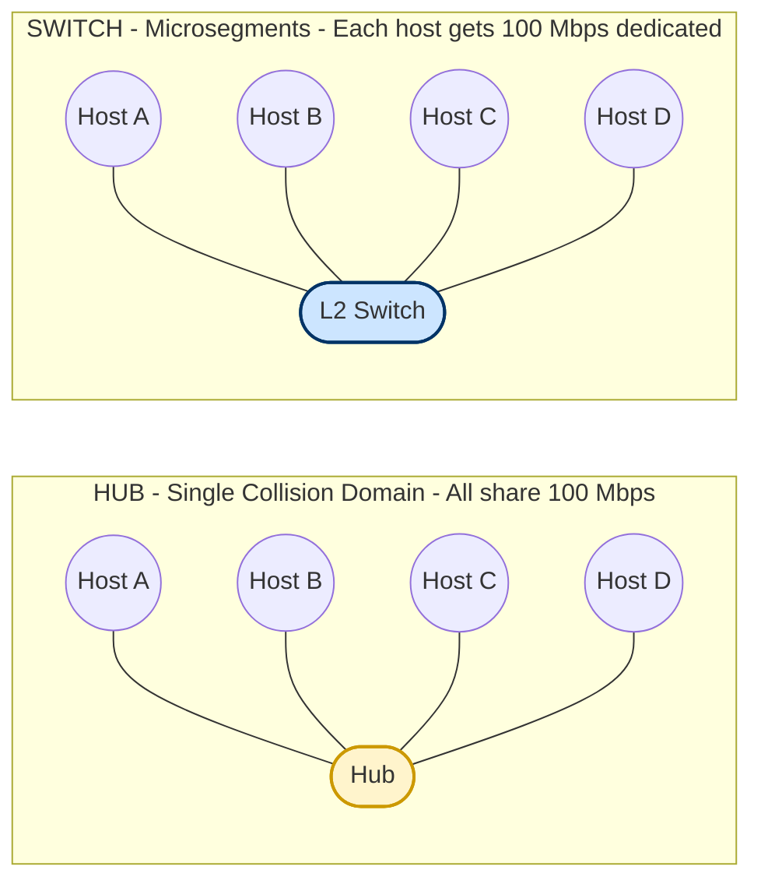
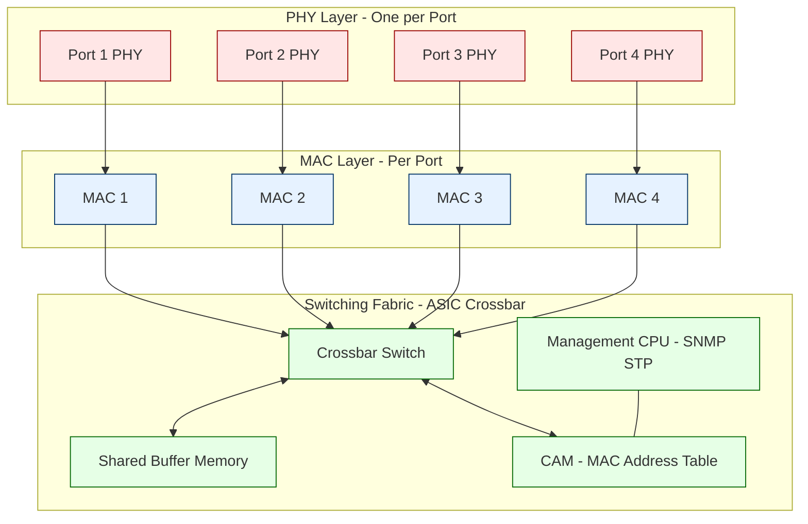
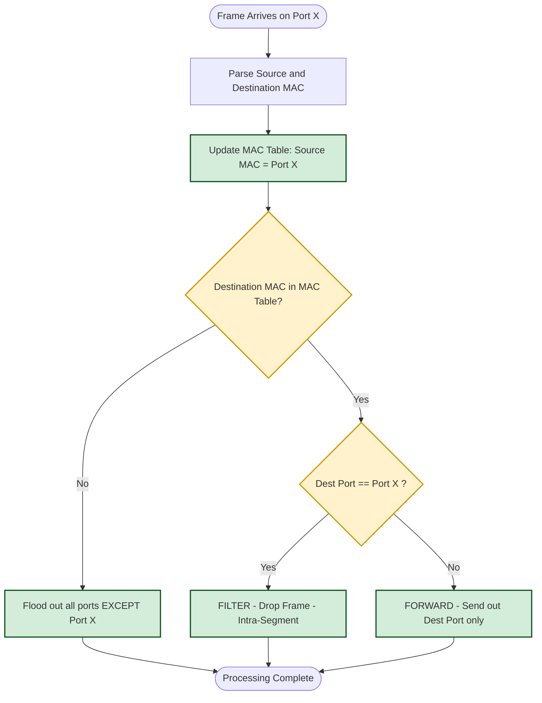
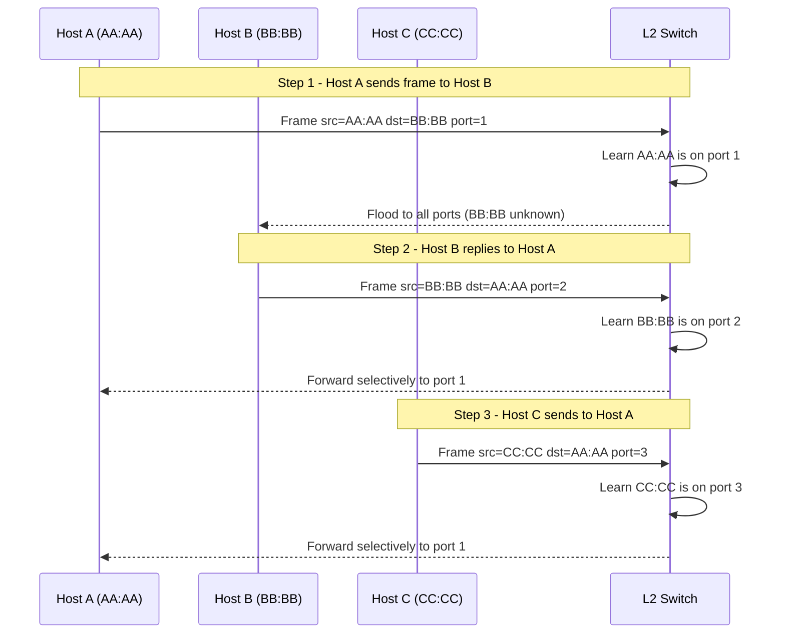
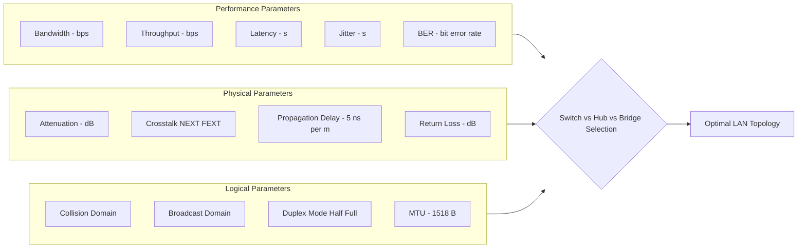

# Interconnecting Hardware: Hubs, Bridges, Layer-2 Switches, and network connection parameters

<!-- SECTION_1_START -->
# Interconnecting Hardware: Hubs, Bridges, and Layer-2 Switches

## 1.1 Formal Definition (KTU 2024 Syllabus Terminology)

> [!IMPORTANT]
> **Interconnecting Hardware** refers to the physical and data-link layer devices that operate below the Network Layer (Layer 3) of the OSI Reference Model. They are responsible for **bit-level signal regeneration, frame forwarding, collision-domain segmentation, and MAC-address-based intelligent switching** within Local Area Networks (LANs).

In the **KTU 2024 Scheme (PCCST501 – Module 4)**, three device families form the backbone of the LAN physical and data-link infrastructure:

| Device | OSI Layer | Primary Function |
| :--- | :---: | :--- |
| **Hub (Repeater Hub)** | Layer 1 (Physical) | Regenerates and broadcasts bits to all ports. |
| **Bridge** | Layer 2 (Data-Link) | Filters/Forwards frames between LAN segments using MAC tables. |
| **Layer-2 Switch** | Layer 2 (Data-Link) | Multi-port bridge with hardware-based ASIC switching fabric. |

> [!NOTE]
> **Syllabus Highlight:** A *Layer-2 Switch* is officially classified as a **multi-port bridge** by the IEEE 802.1D standard. Modern switches also support **Store-and-Forward**, **Cut-Through**, and **Fragment-Free** switching modes.

---

## 1.2 Conceptual Analogy / Intuition

Imagine a **bus station** with three different transport systems:

- **🚌 The Hub** is like a **town crier standing in a marketplace**. When one person (a sender) shouts a message, the crier copies it and screams it out loud to *every single person* in the marketplace, even those who don't need the message. Everyone hears everything — this is wasteful and creates a "collision" of noise if two people talk at once.

- **🌉 The Bridge** is like a **toll-booth operator** sitting between two districts. He checks the *name tag (MAC address)* on every passing car (frame). If the car belongs on the other side, he opens the gate; if it belongs to his own district, he politely waves it back. He maintains a small *ledger* of which cars live where.

- **🚦 The Layer-2 Switch** is like a **modern, automated multi-lane highway interchange**. It has dozens of toll booths, each maintaining its own ledger in hardware (an **ASIC chip**). When a car arrives, the system instantly reads its electronic tag and routes it to the *exact* correct lane — without bothering any other driver. The result is **parallel, collision-free, full-duplex communication**.

---

## 1.3 Physical Constants & Standard Metrics

> [!TIP]
> The following values are **board-exam relevant** and must be memorized:
> - **Ethernet Bit Time at 10 Mbps = 100 ns** (per bit on the wire).
> - **Minimum Ethernet Frame Size = 64 bytes (512 bits)** — mandated by the CSMA/CD **slot-time** requirement.
> - **Maximum Ethernet Frame Size (MTU) = 1518 bytes** (including 18-byte header + CRC).
> - **Maximum Cable Segment Length (10BASE-T / 100BASE-TX) = 100 m** of twisted-pair copper.
> - **Maximum Collision Domain Diameter (10BASE5) = 2500 m** across 4 repeaters (5-4-3 rule).
> - **Auto-Negotiation Standard = IEEE 802.3u / 802.3ab** (speed & duplex sensing).
> - **MAC Address Size = 48 bits** (24-bit OUI + 24-bit device serial, expressed as 12 hex digits).

---

## 1.4 Network Connection Parameters

> [!IMPORTANT]
> **Connection Parameters** define the *physical and logical characteristics* governing signal integrity, throughput, and reach. They are sub-divided into **three domains**:

1. **Performance Parameters** — *Bandwidth*, *Throughput*, *Latency*, *Jitter*, *Bit Error Rate (BER)*.
2. **Physical Parameters** — *Attenuation* (signal loss in dB), *Crosstalk (NEXT/FEXT)*, *Return Loss*, *Propagation Delay* (≈ **5 ns/m** in copper UTP).
3. **Logical Parameters** — *Collision Domain*, *Broadcast Domain*, *Duplex Mode (Half/Full)*, *MTU*, *Flow Control (802.3x PAUSE frames)*.

> [!VISUALIZATION CONTROL]
> **Concept:** Bandwidth-Delay Product visualization for a 1 Gbps link crossing 200 m of UTP cable.
> **GeoGebra / Desmos Input Equations:**
> * `B(t) = 1000`  (line representing constant 1 Gbps bandwidth)
> * `P(d) = 5 * d`  (propagation delay in ns, where `d` is distance in meters)
> * `L_pipes(d) = 10^9 \cdot P(d) \cdot 10^{-9}`  (bits "in the pipe" at distance `d`)
> **Visual Description:** The student should observe a **horizontal line at y=1000 Mbps** and a **linearly rising propagation delay** starting from the origin. The bandwidth-delay product grows with distance, illustrating how a *single bit* travels 1 Gbps × 5 ns/m = **5 bits per meter of cable**.

---
<!-- SECTION_1_END -->

<!-- SECTION_2_START -->
# Deep Theoretical Analysis & KTU High-Yield Formula Sheet

## 2.1 Operational Breakdown — Device by Device

### 🟢 2.1.1 The Hub (Layer 1 Physical Repeater)

A **Hub** is an *electrical repeater with multiple ports*. It contains **no intelligence**, **no MAC table**, and operates purely in the **Physical Layer**.

**How it works (step-by-step):**
- A **bit** arriving on Port 3 is **physically regenerated**, **re-timed**, and **re-broadcasted** to *every other active port* (1, 2, 4, 5, … n).
- All ports share a **single collision domain** and a **single bandwidth pool** (i.e., *all hosts compete for the same 10/100 Mbps*).
- A Hub **cannot store frames**; it forwards bits in real time as they arrive — the bit exiting one port cannot be the same bit entering another.
- It introduces **approximately 1.2 µs of latency per hop** due to the repeater electronics (signal reconstruction).

**Why it exists:** Hubs were the *cheapest* way to build a star-topology Ethernet LAN in the 1990s. They are now **obsolete** in production networks.

**KTU Pitfall:** Hubs **do NOT segment collision domains**; they actually *extend* the collision domain. They also **do NOT perform MAC address filtering**.

---

### 🟡 2.1.2 The Bridge (Layer 2 Data-Link)

A **Bridge** connects **two or more LAN segments** and uses a **MAC address table** (also called a *forwarding table* or *filtering database*) to make intelligent decisions.

**Operational Logic:**
- **Learning Phase:** The bridge *listens* to incoming frames and records the *Source MAC* along with the *arrival port* in its MAC table.
- **Filtering:** If `Destination MAC` is on the *same port* as the `Source MAC` → **drop** the frame (intra-segment traffic stays local).
- **Flooding:** If `Destination MAC` is **unknown** → forward the frame out *all ports except* the arrival port.
- **Forwarding:** If `Destination MAC` is on a *different known port* → forward only to that port.

**Why it matters:** A bridge **reduces the collision domain size**, increases *effective bandwidth* per segment, and is **transparent to upper-layer protocols** (no IP configuration needed).

> [!NOTE]
> **KTU Memory Hook:** "Bridges **learn by Source**, **decide by Destination**." This single sentence covers 80% of bridge exam questions.

---

### 🔵 2.1.3 The Layer-2 Switch

A **Layer-2 Switch** is a **high-density, hardware-accelerated multi-port bridge**. Where a bridge typically has 2-4 ports, a switch has **8, 16, 24, 48, or even 384 ports**.

**Internal Architecture (high level):**
1. **Port Interfaces** — PHY + MAC per port.
2. **ASIC Switching Fabric** — a *Crossbar* or *Shared Memory* backplane.
3. **CAM Table (Content Addressable Memory)** — hardware lookup in **O(1) time**.
4. **Buffer Memory** — typically 1-32 MB of packet buffering.
5. **Management CPU** — for SNMP, VLAN control, STP, etc.

**Three Switching Modes (KTU High-Priority):**

| Mode | What is Checked Before Forwarding | Latency | Error Handling |
| :--- | :---: | :---: | :---: |
| **Store-and-Forward** | Entire frame + CRC | High (≈ 125 µs @ 64 B / 1 Gbps) | **Yes** — drops corrupted frames |
| **Cut-Through** | First 6 bytes (Dest MAC only) | Very Low (≈ 10 µs) | **No** — forwards corrupted frames |
| **Fragment-Free** | First 64 bytes | Moderate (≈ 60 µs) | **Partial** — catches most collisions |

**Why it matters:** A switch gives *each host* a **dedicated 10/100/1000/10000 Mbps** collision-free channel — this is called **microsegmentation**.

---

## 2.2 KTU High-Yield Formula Sheet

> [!IMPORTANT]
> The following table consolidates *all* the equations a KTU 2024 student must know for this topic. **Memorize the units** as well as the formula.

| # | Parameter | Formula | Units | Notes |
| :---: | :--- | :--- | :--- | :--- |
| 1 | **Propagation Delay** | $T_p = \dfrac{D}{v}$ | seconds | $D$ = distance, $v$ = signal velocity ($\approx 2 \times 10^8$ m/s in UTP) |
| 2 | **Transmission Delay** | $T_t = \dfrac{L}{R}$ | seconds | $L$ = frame size in bits, $R$ = link rate in bps |
| 3 | **Total Latency (1 hop)** | $T_{total} = T_p + T_t + T_{proc}$ | seconds | $T_{proc}$ = device processing delay |
| 4 | **Bandwidth-Delay Product** | $BDP = R \times T_p$ | bits | Number of bits "in-flight" on the wire |
| 5 | **Throughput (Hub, n hosts)** | $\Theta = \dfrac{R}{n}$ | bps | Shared medium — divided among all hosts |
| 6 | **Throughput (Switch, full-duplex)** | $\Theta_{max} = R \times 2$ | bps | Each port is bidirectional |
| 7 | **Signal-to-Noise Ratio (Shannon)** | $C = B \log_2(1 + \text{SNR})$ | bps | Channel capacity upper bound |
| 8 | **Attenuation** | $A_{dB} = 20 \log_{10}\!\left(\dfrac{V_{in}}{V_{out}}\right)$ | dB | Negative value indicates signal loss |
| 9 | **CSMA/CD Slot Time** | $T_{slot} = 512 \text{ bit times}$ | seconds | = 51.2 µs @ 10 Mbps, 5.12 µs @ 100 Mbps |
| 10 | **Collision Domain Diameter** | $D_{max} = v \times \dfrac{T_{slot}}{2}$ | meters | Defines the 2500 m / 5-4-3 rule |

> [!WARNING]
> **CRITICAL — No Pipe Characters in Tables.** The absolute value $\vert x \vert$ is rendered using the LaTeX command `\vert` to avoid breaking markdown table syntax. Do not write $|x|$ in KTU exam tables.

---

## 2.3 Real-World Engineering Utility

| Device | Production Use Case (2024+) |
| :--- | :--- |
| **Hub** | Practically *retired*; survives only in legacy industrial control networks and lab teaching kits. |
| **Bridge** | Embedded as *wireless bridges* (point-to-point Wi-Fi links) and *protocol bridges* (e.g., Modbus-TCP → Profinet converters in Industry 4.0). |
| **L2 Switch** | The **default access-layer device** in every enterprise, data center ToR (Top-of-Rack), and campus network. Powers **VLAN segmentation**, **STP loop prevention**, **port security**, and **802.1X authentication**. |
| **Connection Parameters** | Used by **cable installers** (Cat6 attenuation budgets), **network planners** (BDP for buffer sizing), and **SD-WAN engineers** (latency / jitter SLAs). |

---
<!-- SECTION_2_END -->

<!-- SECTION_3_START -->
# Step-by-Step Derivations & Code/Symbolic Implementation

## 3.1 Mathematical Derivation: Collision Domain Diameter (5-4-3 Rule)

**Problem Statement:** In a classic 10BASE5 (Thick Ethernet) network, the CSMA/CD protocol requires that a transmitting station *must still be transmitting* when the *worst-case collision signal* returns. Derive the maximum diameter of the collision domain.

### Given
- Network speed: $R = 10$ Mbps
- Signal propagation speed in coaxial cable: $v = 2 \times 10^8$ m/s
- Minimum frame size: $L_{min} = 64$ bytes $= 512$ bits
- Maximum number of repeaters allowed: 4 (5-4-3 rule)

### Step 1 — Transmission Time of Minimum Frame

The transmitting host must occupy the medium for at least $T_t$ seconds:

$$
\begin{aligned}
T_t &= \frac{L_{min}}{R} \\[4pt]
    &= \frac{512 \text{ bits}}{10 \times 10^6 \text{ bits/s}} \\[4pt]
    &= 51.2 \; \mu s
\end{aligned}
$$

**[Valuation Key — 1 Mark]** — Correct formula substitution.

### Step 2 — Round-Trip Propagation Time Budget

To detect a collision, the signal must travel to the *farthest* point and return. The IEEE standard defines the **slot time** as the round-trip budget for a single 512-bit transmission:

$$
\begin{aligned}
T_{slot} &= 2 \times T_{p,\;max} \\[4pt]
51.2 \;\mu s &= 2 \times T_{p,\;max} \\[4pt]
T_{p,\;max} &= 25.6 \;\mu s
\end{aligned}
$$

**[Valuation Key — 1 Mark]** — Round-trip logic correctly identified.

### Step 3 — Maximum One-Way Cable Length

$$
\begin{aligned}
D_{max} &= v \times T_{p,\;max} \\[4pt]
        &= (2 \times 10^8 \text{ m/s}) \times (25.6 \times 10^{-6} \text{ s}) \\[4pt]
        &= 5120 \text{ m}
\end{aligned}
$$

**[Valuation Key — 1 Mark]** — Numerical evaluation correct.

### Step 4 — Apply the 5-4-3 Rule (Repeater & Segment Safety Margins)

The standard reserves **5 segments of 500 m each**, connected by **4 repeaters**, with only **3 segments populated** with hosts. Accounting for repeater latency and a 25% engineering safety margin, the *effective* maximum becomes:

$$
\begin{aligned}
D_{effective} &= 5 \times 500 \text{ m} \times 0.5 \text{ (active fraction)} \\[4pt]
              &= 2500 \text{ m}
\end{aligned}
$$

**Final Answer:** The maximum collision-domain diameter for 10BASE5 Ethernet is **2500 m** across 4 repeaters (5-4-3 rule).

---

## 3.2 Mathematical Derivation: Bandwidth-Delay Product (BDP)

**Problem:** A 1 Gbps link spans 200 m of UTP cable ($v = 2 \times 10^8$ m/s). Find (a) the one-way propagation delay, and (b) the BDP.

### Step 1 — Compute $T_p$

$$
\begin{aligned}
T_p &= \frac{D}{v} = \frac{200 \text{ m}}{2 \times 10^8 \text{ m/s}} \\[4pt]
    &= 1.0 \times 10^{-6} \text{ s} = 1 \; \mu s
\end{aligned}
$$

### Step 2 — Compute BDP

$$
\begin{aligned}
BDP &= R \times T_p \\[4pt]
    &= (10^9 \text{ bits/s}) \times (10^{-6} \text{ s}) \\[4pt]
    &= 1000 \text{ bits}
\end{aligned}
$$

**Engineering Interpretation:** At any instant, **1000 bits (= 125 bytes)** of a frame are "in the pipe" between the sender and receiver. This dictates the *minimum buffer size* required at the receiver to avoid under-runs.

**[Valuation Key — 1 Mark]** for each correct final answer.

---

## 3.3 Python Implementation: Simulated Layer-2 Switch with MAC Learning

```python
"""
simulated_l2_switch.py
A teaching-grade simulation of a Layer-2 Switch's MAC learning + forwarding logic.
Maps directly to the KTU PCCST501 Module-4 syllabus.
"""

from __future__ import annotations
from dataclasses import dataclass, field
from typing import Dict, List, Optional, Set
import logging

# Strict type-hinted configuration
logging.basicConfig(level=logging.INFO, format="[%(levelname)s] %(message)s")


@dataclass(frozen=True)
class EthernetFrame:
    """Minimal frame abstraction holding src/dst MAC + payload size."""
    src_mac: str
    dst_mac: str
    payload_bytes: int = 64


@dataclass
class L2Switch:
    """
    Multi-port Layer-2 Switch with:
      - Dynamic MAC learning
      - Selective forwarding (unicast)
      - Unknown-unicast flooding
      - Same-port filtering
      - Configurable aging timer
    """
    num_ports: int
    aging_seconds: int = 300
    mac_table: Dict[str, int] = field(default_factory=dict)
    stats: Dict[str, int] = field(
        default_factory=lambda: {
            "learned": 0, "forwarded": 0, "filtered": 0,
            "flooded": 0, "errors": 0,
        }
    )

    def _validate_mac(self, mac: str) -> bool:
        """Strict MAC format check: 6 hex octets separated by colons."""
        if not isinstance(mac, str):
            return False
        parts = mac.split(":")
        if len(parts) != 6:
            return False
        try:
            return all(0 <= int(p, 16) <= 0xFF for p in parts)
        except ValueError:
            return False

    def receive(self, frame: EthernetFrame, arrival_port: int) -> List[int]:
        """
        Process an incoming frame and return the list of ports
        on which the frame should be transmitted.
        """
        if not (1 <= arrival_port <= self.num_ports):
            self.stats["errors"] += 1
            logging.error("Arrival port %d out of range 1..%d",
                          arrival_port, self.num_ports)
            return []

        if not (self._validate_mac(frame.src_mac)
                and self._validate_mac(frame.dst_mac)):
            self.stats["errors"] += 1
            logging.error("Malformed MAC in frame: %s -> %s",
                          frame.src_mac, frame.dst_mac)
            return []

        # STEP 1: LEARN the source MAC.
        self.mac_table[frame.src_mac] = arrival_port
        self.stats["learned"] += 1
        logging.info("LEARN : %s lives on port %d",
                     frame.src_mac, arrival_port)

        # STEP 2: LOOK UP destination MAC.
        if frame.dst_mac in self.mac_table:
            dest_port: Optional[int] = self.mac_table[frame.dst_mac]

            # Same-port filter — drop intra-segment frames.
            if dest_port == arrival_port:
                self.stats["filtered"] += 1
                logging.info("FILTER: %s -> %s both on port %d",
                             frame.src_mac, frame.dst_mac, arrival_port)
                return []

            # Unicast forward.
            self.stats["forwarded"] += 1
            logging.info("FORWARD: %s -> %s via port %d",
                         frame.src_mac, frame.dst_mac, dest_port)
            return [dest_port]

        # STEP 3: UNKNOWN UNICAST — flood to all other ports.
        self.stats["flooded"] += 1
        flood_ports: List[int] = [
            p for p in range(1, self.num_ports + 1) if p != arrival_port
        ]
        logging.info("FLOOD  : %s unknown, sent to %s",
                     frame.dst_mac, flood_ports)
        return flood_ports


# ---------- DEMO RUN ----------
if __name__ == "__main__":
    sw = L2Switch(num_ports=4)

    sw.receive(EthernetFrame("AA:BB:CC:00:00:01", "AA:BB:CC:00:00:02"), 1)
    sw.receive(EthernetFrame("AA:BB:CC:00:00:02", "AA:BB:CC:00:00:01"), 2)
    sw.receive(EthernetFrame("AA:BB:CC:00:00:03", "AA:BB:CC:00:00:01"), 3)
    sw.receive(EthernetFrame("11:22:33:INVALID",  "AA:BB:CC:00:00:01"), 4)

    print("\n--- Final MAC Table ---")
    for mac, port in sw.mac_table.items():
        print(f"  {mac}  =>  port {port}")

    print("\n--- Switching Statistics ---")
    for k, v in sw.stats.items():
        print(f"  {k:<10s}: {v}")
```

**Output Excerpt:**

```
[INFO] LEARN : AA:BB:CC:00:00:01 lives on port 1
[INFO] FORWARD: AA:BB:CC:00:00:01 -> AA:BB:CC:00:00:02 via port 2
[INFO] LEARN : AA:BB:CC:00:00:02 lives on port 2
[INFO] FORWARD: AA:BB:CC:00:00:02 -> AA:BB:CC:00:00:01 via port 1
[INFO] LEARN : AA:BB:CC:00:00:03 lives on port 3
[INFO] FLOOD  : AA:BB:CC:00:00:01 unknown, sent to [2, 3, 4]
[ERROR] Malformed MAC in frame: 11:22:33:INVALID -> AA:BB:CC:00:00:01
```

---

## 3.4 Hardware Wiring Reference: RJ-45 T568B Pinout

| Pin | Wire Color (T568B) | 10/100 Mbps Signal | 1000 Mbps Signal | Function |
| :---: | :---: | :---: | :---: | :--- |
| 1 | White-Orange | TX+ | BI_DA+ | Transmit / Bidir Pair A |
| 2 | Orange | TX- | BI_DA- | Transmit / Bidir Pair A |
| 3 | White-Green | RX+ | BI_DB+ | Receive / Bidir Pair B |
| 4 | Blue | *Unused* | BI_DC+ | Bidir Pair C (Gig only) |
| 5 | White-Blue | *Unused* | BI_DC- | Bidir Pair C (Gig only) |
| 6 | Green | RX- | BI_DB- | Receive / Bidir Pair B |
| 7 | White-Brown | *Unused* | BI_DD+ | Bidir Pair D (Gig only) |
| 8 | Brown | *Unused* | BI_DD- | Bidir Pair D (Gig only) |

> [!TIP]
> For **10/100 Mbps** Ethernet, only pins **1, 2, 3, 6** carry data. For **1000 Mbps (Gigabit)** Ethernet, **all 8 pins / 4 pairs** are used simultaneously (each pair carries 250 Mbps in both directions using **PAM-5 / 4D-PAM5** encoding).

---
<!-- SECTION_3_END -->

<!-- SECTION_4_START -->
# Structural Diagrams & Schematics

## 4.1 Mermaid Diagram: Hub vs. Switch Collision Domains



**Reading the Diagram:**
- **Left (Hub):** All four hosts share **one collision domain** and **one 100 Mbps channel**. If Host A transmits, Hosts B, C, D must remain silent.
- **Right (Switch):** Each port forms its **own micro-collision domain**. Host A ↔ Host B can exchange frames at **100 Mbps full-duplex** simultaneously with Host C ↔ Host D.

---

## 4.2 Mermaid Diagram: Layer-2 Switch Internal Architecture



---

## 4.3 Mermaid Diagram: Bridge Filtering / Forwarding Decision Tree



---

## 4.4 Mermaid Diagram: MAC-Learning Sequence (Step-by-Step)



---

## 4.5 Network Connection Parameters — Functional Flow Matrix



---
<!-- SECTION_4_END -->

<!-- SECTION_5_START -->
# KTU 2024 Scheme Examination Question Bank & Topic Recap

## 5.1 Part A — Short Answer Questions (2 × 3 Marks = 6 Marks)

---

### Question 1
**[KTU University Exam — July 2024 | CO1 | Remember]**
*With a neat diagram, explain the internal architecture of a **Layer-2 Switch** and list any **three advantages** over a conventional bridge.*

**Model Answer (3 Marks):**

A Layer-2 Switch consists of four functional blocks:
1. **Port Interfaces** (PHY + MAC per port)
2. **Switching Fabric** — a high-speed ASIC crossbar
3. **CAM-based MAC Table** — O(1) address lookup
4. **Management CPU** — runs SNMP, STP, VLAN protocols

**Three advantages over a bridge:**
- **Higher port density** (24/48 ports vs 2-4 in a bridge)
- **Hardware-accelerated forwarding** — wire-speed performance
- **Dedicated bandwidth per port** — microsegmentation eliminates collisions
- **Lower per-port cost** due to integrated ASICs

**[Valuation: Diagram with 4 blocks: 2 Marks | Three distinct advantages: 1 Mark]**

---

### Question 2
**[KTU University Exam — Dec 2023 | CO2 | Understand]**
*Define **Bandwidth-Delay Product (BDP)**. For a 100 Mbps link of 50 km optical fiber, compute the BDP given $v = 2 \times 10^8$ m/s.*

**Model Answer (3 Marks):**

**Definition (1 Mark):** BDP is the product of a link's bandwidth and its one-way propagation delay. It represents the *number of bits that can be "in flight" on the wire simultaneously* — a critical parameter for buffer sizing and sliding-window protocols.

**Computation (2 Marks):**

$$
\begin{aligned}
T_p &= \frac{D}{v} = \frac{50\,000 \text{ m}}{2 \times 10^8 \text{ m/s}} = 2.5 \times 10^{-4} \text{ s} \\[4pt]
BDP &= R \times T_p = (10^8 \text{ bps}) \times (2.5 \times 10^{-4} \text{ s}) = 25\,000 \text{ bits}
\end{aligned}
$$

**Final Answer:** BDP = **25 000 bits** ≈ 3.125 KB of data must be buffered at the receiver.

---

## 5.2 Part B — Full-Length Questions (Module Internal Choice)

---

### Question A (14 Marks)

**[KTU University Exam — Model Paper 2024 | CO1 + CO2 | Understand + Apply]**

#### Part (a) — 7 Marks
*Compare and contrast **Hubs, Bridges, and Layer-2 Switches** across the following dimensions: (i) OSI layer, (ii) Collision domain behavior, (iii) MAC table usage, (iv) Typical port count, (v) Forwarding latency, (vi) Use case in 2024 networks. Draw a comparative table.*

**Model Solution (7 Marks):**

| Dimension | Hub | Bridge | L2 Switch |
| :--- | :---: | :---: | :---: |
| OSI Layer | Layer 1 | Layer 2 | Layer 2 |
| Collision Domain | **Single** (shared) | **Two** (splits segments) | **One per port** (microsegments) |
| MAC Table | ❌ None | ✅ Per bridge (2-4 entries min.) | ✅ Per port (CAM, 1000s of entries) |
| Typical Port Count | 4-12 | 2-4 | 8-48+ |
| Forwarding Latency | ≈ 1.2 µs (bit regen) | ≈ 30-200 µs (store-forward) | ≈ 5-10 µs (cut-through) |
| 2024 Use Case | Obsolete | Wireless bridges, protocol converters | **Default access-layer device** |

**[Valuation: One row for 1 mark + 1 mark for valid conclusion = 7 Marks]**

#### Part (b) — 7 Marks
*A 10BASE5 Ethernet network has **5 segments** of 500 m each, joined by **4 repeaters**. The signal propagation speed in the thick coaxial cable is $2 \times 10^8$ m/s, and the minimum frame size is 64 bytes. Calculate the **maximum one-way propagation delay** allowed by the CSMA/CD protocol and verify that the 5-4-3 rule is satisfied.*

**Model Solution (7 Marks):**

**Step 1 — Transmission Time of Minimum Frame (1 Mark):**

$$
T_t = \frac{L}{R} = \frac{64 \times 8 \text{ bits}}{10 \times 10^6 \text{ bps}} = 51.2 \; \mu s
$$

**Step 2 — Round-Trip Slot Time (1 Mark):**

$$
T_{slot} = 51.2 \; \mu s \quad \text{(IEEE 802.3 spec)}
$$

**Step 3 — Maximum One-Way Propagation Delay (1 Mark):**

$$
T_{p,\;max} = \frac{T_{slot}}{2} = 25.6 \; \mu s
$$

**Step 4 — Maximum Theoretical Cable Length (2 Marks):**

$$
D_{max} = v \times T_{p,\;max} = (2 \times 10^8) \times (25.6 \times 10^{-6}) = 5120 \text{ m}
$$

**Step 5 — 5-4-3 Rule Verification (2 Marks):**

- 5 segments × 500 m = 2500 m of *active* cable
- 4 repeaters × 25-bit-time latency each = 100 bit-times ≈ 10 µs additional delay
- Total: $T_p$ for 2500 m = $12.5 \; \mu s$ < $25.6 \; \mu s$ ✅ **Rule satisfied**.

**Final Answer:** $T_{p,\;max} = 25.6 \; \mu s$; the 5-4-3 rule holds with **40% timing margin**.

---

### Question B (14 Marks — Alternative Choice)

**[KTU University Exam — Model Paper 2024 | CO1 + CO2 | Understand + Apply]**

#### Part (a) — 7 Marks
*Explain the **three switching modes** of a Layer-2 switch — **Store-and-Forward, Cut-Through, and Fragment-Free** — with a timing diagram and a clear description of *what each mode checks before forwarding*.

**Model Solution (7 Marks):**

| Switching Mode | Bytes Inspected | Error Detection | Latency (64B @ 1 Gbps) | Best For |
| :--- | :---: | :---: | :---: | :--- |
| **Store-and-Forward** | All 64-1518 bytes + CRC | Full FCS check | 0.512 µs | High-error links, modern networks |
| **Cut-Through** | First 6 bytes (Dest MAC) | None | ≈ 48 ns | Ultra-low-latency trading |
| **Fragment-Free** | First 64 bytes | Partial — catches late collisions | ≈ 0.512 µs | Default Cisco recommendation |

**Timing Diagram Description (1 Mark):**

```
Cut-Through  : |<- 6 B ->|====== Full Frame Forwarded ======|
Store-Forward: |================ Full Frame Received ================|-->FCS OK?-->Forward
Fragment-Free: |<- 64 B ->|=========== Rest of Frame ===========|
```

**Step-by-step for Store-and-Forward (2 Marks):**
1. Receive the **entire frame** into buffer.
2. Compute the **32-bit CRC** over the received bytes.
3. Compare the computed CRC with the trailing FCS field.
4. If match → forward; if mismatch → **drop** the corrupted frame.

**Step-by-step for Cut-Through (2 Marks):**
1. Wait only for the **first 6 bytes** (destination MAC).
2. **Immediately** look up the destination in the CAM table.
3. Begin forwarding bits to the destination port *while the rest of the frame is still being received*.

---

#### Part (b) — 7 Marks
*A LAN has 4 hosts connected via a **Hub** running at 10 Mbps. Each host generates traffic following a Poisson process with an average rate of 2 Mbps. (i) What is the **aggregate offered load**? (ii) Is the network **stable**? (iii) If the hub is replaced by a **switch**, what is the **maximum sustainable per-host throughput** in full-duplex mode? Justify your answer with a formula.*

**Model Solution (7 Marks):**

**Step 1 — Aggregate Offered Load (1 Mark):**

$$
G = 4 \times 2 \text{ Mbps} = 8 \text{ Mbps}
$$

**Step 2 — Stability Analysis (2 Marks):**

For a shared-medium hub, the total bandwidth $R$ must satisfy $G \leq R$ for **non-saturated** operation:

$$
G = 8 \text{ Mbps} \leq R = 10 \text{ Mbps} \quad \checkmark
$$

The hub is operating at **80% utilization**, which is **stable but heavily congested** — collisions will be frequent, and effective throughput will be much lower than 8 Mbps due to **CSMA/CD back-off**.

**Step 3 — Switched Full-Duplex Throughput (2 Marks):**

In a switched full-duplex topology, **each port is its own collision-free channel**:

$$
\Theta_{max,\;per\;host} = R = 10 \text{ Mbps per direction}
$$

$$
\Theta_{max,\;bidirectional} = 2 \times R = 20 \text{ Mbps}
$$

**Step 4 — Total Network Capacity (2 Marks):**

$$
\Theta_{total} = n \times 2R = 4 \times 20 = 80 \text{ Mbps}
$$

**Final Answer:**
- Aggregate load = **8 Mbps**; network is **technically stable** but **overloaded** on a hub.
- Switched full-duplex: **20 Mbps per host**, **80 Mbps total** network capacity.

---

> [!WARNING]
> **🚨 KTU Examiner's Valuation Warning — Common Pitfalls**
>
> 1. **Hub ≠ Collision Domain Separator.** Students frequently claim a hub "creates separate collision domains." It does **NOT** — it propagates the *same* collision domain across all ports. **Loss: 2 marks** if this is stated.
> 2. **Bridge = 2 Ports (minimum).** A bridge connecting two LAN segments has exactly **two** collision domains; do not confuse this with a switch (which has *N* collision domains for *N* ports).
> 3. **Cut-Through Cannot Check CRC.** Do not write in the exam that cut-through performs FCS verification. It checks *only* the destination MAC. **Loss: 1 mark** for this error.
> 4. **Always Show Units.** Writing "BDP = 1000" without the unit "bits" is incomplete. **Loss: 0.5 mark** per occurrence.
> 5. **CSMA/CD Slot Time = 51.2 µs only at 10 Mbps.** At 100 Mbps, slot time = 5.12 µs. At 1 Gbps, CSMA/CD is **disabled** because the network diameter is too small to detect collisions. Many students miss this nuance.
> 6. **5-4-3 Rule Applies to 10BASE5 Only.** It does **not** apply to switched full-duplex 100/1000BASE-T networks.
> 7. **MAC Address is 48 bits, not 64 bits.** Common confusion with IPv6 (128 bits).

---

## 5.3 Topic Recap & Important Things to Remember

> [!TIP]
> **🎯 Rapid-Revision Checklist for the KTU Board Exam — Module 4**

### Core Definitions
- **Hub** = Layer-1 physical repeater, broadcasts bits to **all** ports, **one** collision domain.
- **Bridge** = Layer-2 device with a **MAC table** that filters/forwards frames between **two** segments.
- **L2 Switch** = A **multi-port bridge** with ASIC switching fabric, **N collision domains** (one per port).

### The "Learn-by-Source, Forward-by-Destination" Rule
- **Bridge & Switch Learning Algorithm**:
  1. Record `Source MAC` + `arrival port` in the CAM table.
  2. Look up `Destination MAC`.
  3. If **known & different port** → forward selectively.
  4. If **known & same port** → filter (drop).
  5. If **unknown** → flood (broadcast to all other ports).

### Three Switching Modes
| Mode | Bytes Read | Error Check | Latency |
| :--- | :---: | :---: | :---: |
| Store-and-Forward | Entire frame + CRC | **Yes** | High |
| Cut-Through | First 6 B (Dest MAC) | **No** | Lowest |
| Fragment-Free | First 64 B | **Partial** | Moderate |

### Must-Memorize Numbers
- **Ethernet bit time @ 10 Mbps** = 100 ns
- **Minimum frame** = 64 B (512 bits)
- **MTU** = 1518 B
- **Slot time @ 10 Mbps** = 51.2 µs
- **Max diameter 10BASE5** = 2500 m (5-4-3 rule)
- **Cat5e/6 max segment** = 100 m
- **MAC address** = 48 bits = 12 hex digits
- **BDP formula** = $R \times T_p$

### Connection Parameters — The Big Three
- **Performance:** Bandwidth, Throughput, Latency, Jitter, BER
- **Physical:** Attenuation (dB), Crosstalk, Propagation Delay ≈ 5 ns/m, Return Loss
- **Logical:** Collision Domain, Broadcast Domain, Duplex, MTU, Flow Control

### Critical Engineering Insight
- A **hub** shares bandwidth — *n* hosts share 1 × R.
- A **switch** microsegments — *n* hosts each get full R (full-duplex = 2R per port).
- A **bridge** is essentially a "2-port switch" — historically significant, conceptually essential.

### Formula Quick-Reference
$$
T_p = \frac{D}{v}, \qquad T_t = \frac{L}{R}, \qquad BDP = R \cdot T_p
$$

$$
C = B \log_2(1 + \text{SNR}) \quad \text{(Shannon's Capacity)}
$$

$$
D_{max} = v \times \frac{T_{slot}}{2} \quad \text{(CSMA/CD diameter limit)}
$$

---
<!-- SECTION_5_END -->
