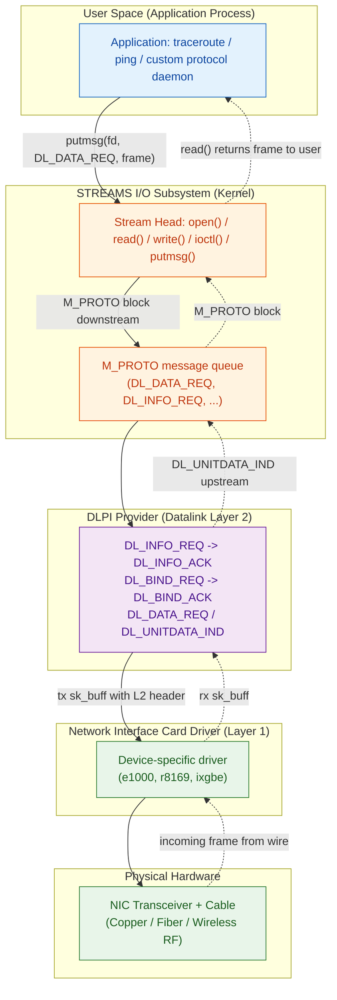
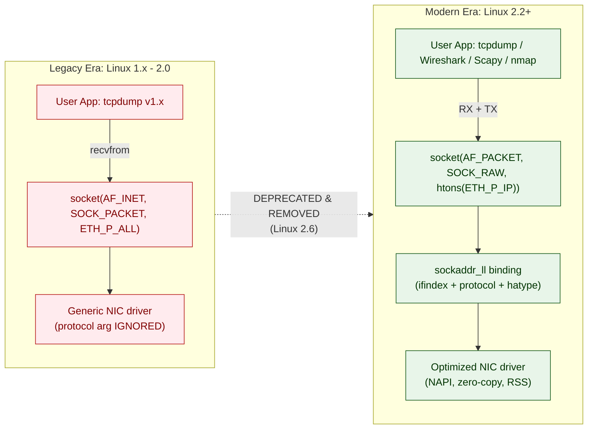
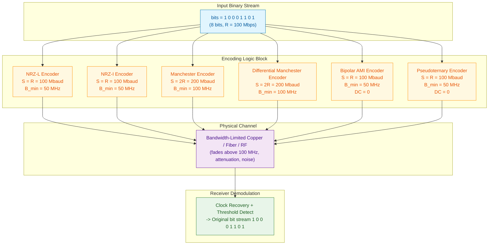
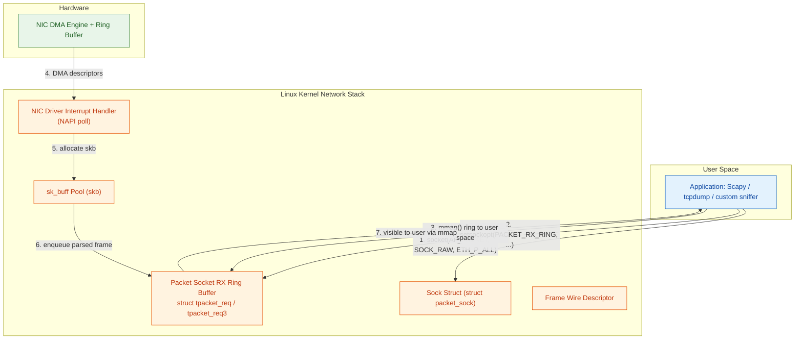
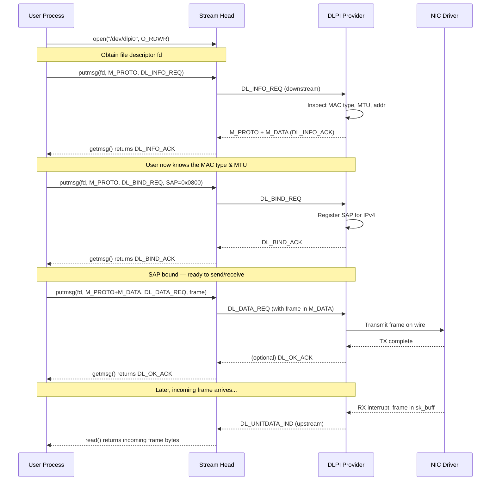

# Interfaces: Datalink Provider Interface, packet capture via SOCK_PACKET/PF_PACKET, Physical layer bit-encoding

<!-- SECTION_1_START -->
# Module 4 - Data-Link Layer and Physical Layer Essentials
## Interfaces: DLPI, SOCK_PACKET/PF_PACKET, and Physical Layer Bit-Encoding

---

### 1.1 The Datalink Provider Interface (DLPI)

**Formal Definition (KTU 2024 Syllabus Standard):**
> The **Datalink Provider Interface (DLPI)** is an **AT&T-defined, STREAMS-based Application Programming Interface (API)** standardized under the **UNIX System V Release 4 (SVR4)** architecture. It provides a uniform, transport-independent mechanism for user-space processes to access datalink layer services from any datalink provider (e.g., Ethernet, Token Ring, FDDI, ATM) without needing to know the underlying hardware-specific Media Access Control (MAC) implementation.

> [!IMPORTANT]
> **Syllabus Highlight (CO3 — Understand):** DLPI sits in the **OSI Layer 2 (Data Link Layer)** and acts as the boundary between the **Layer 3 network protocols (e.g., IP)** and the **hardware-specific NIC driver**. It is functionally analogous to the **ODI (Open Datalink Interface)** in Novell NetWare and the **NDIS (Network Driver Interface Specification)** in Windows.

**Conceptual Analogy — The "Universal Socket Wrench" Intuition:**
Imagine you are a mechanic. Instead of carrying a separate wrench for every bolt size (each NIC requiring its own driver code), you carry one **adjustable universal wrench (DLPI)** that fits every bolt. The wrench doesn't know *how* the bolt is manufactured; it only knows the standard "language" of turning it. Similarly, DLPI defines a fixed set of messages (called **primitives**) that any conforming datalink driver must understand, freeing upper-layer protocols (IP, ARP) from hardware-specific code.

**Core Architecture Primitives (Message Types):**
| Primitive | Direction | Purpose |
|---|---|---|
| `DL_INFO_REQ` | User → Provider | Request provider capabilities (MAC address, MTU, media type) |
| `DL_INFO_ACK` | Provider → User | Return capabilities (acknowledgment) |
| `DL_BIND_REQ` | User → Provider | Bind to a specific SAP (Service Access Point) / PPA |
| `DL_BIND_ACK` | Provider → User | Confirm binding |
| `DL_UNBIND_REQ` | User → Provider | Release the binding |
| `DL_DATA_REQ` | User → Provider | Send a data frame (connectionless) |
| `DL_DATA_IND` | Provider → User | Incoming frame notification |
| `DL_CONNECT_REQ` | User → Provider | Establish connection (connection mode only) |

> [!NOTE]
> **Physical Constant / Boundary Value:** The default maximum **MTU (Maximum Transmission Unit)** for an Ethernet II frame is **1500 bytes**, while the maximum frame size (including preamble, SFD, header, payload, and FCS) is **1518 bytes**. The minimum payload is **46 bytes** (Ethernet padding rule).

---

### 1.2 SOCK_PACKET and PF_PACKET — Raw Packet Capture Interfaces

**Formal Definition:**
> `SOCK_PACKET` is a **legacy Linux-specific socket type** (introduced in Linux 1.x, deprecated in Linux 2.0) that allows a process to **receive and send raw link-layer frames** directly to/from a network interface, bypassing the kernel's protocol stack. It is **completely superseded** by `PF_PACKET` (Packet Family) socket type introduced in **Linux 2.2**, which provides finer control, transmission capability, and the ability to bind to a specific protocol (e.g., `ETH_P_ALL`, `ETH_P_IP`).

> [!IMPORTANT]
> **Critical Distinction for Exams:** `SOCK_PACKET` is **receive-only on most drivers** and **cannot bind to a specific protocol number**. `PF_PACKET` supports **both RX and TX** and allows **protocol filtering** via `htons(ETH_P_xxx)`. In modern kernels (≥ 2.6.27), use the `AF_PACKET` address family which is the modern alias.

**Conceptual Analogy — The "Wiretap" Intuition:**
Picture the network cable as a pipe carrying sealed envelopes (frames). The normal kernel stack is a **mailroom clerk** who only opens envelopes addressed to your house (your IP). 
- **SOCK_PACKET** is an **old wiretap device** that lets you hear *every* envelope pass through the pipe, but you can only *listen*, not inject new ones easily. It also cannot filter by address type.
- **PF_PACKET** is a **modern wiretap with a microphone AND a mail-slot**: you can listen to all traffic **and** inject your own crafted envelopes, plus you can tell the device "only whisper envelopes with this specific stamp" (`ETH_P_IP` for IP, `0x0806` for ARP).

**Header File Reference:**
```c
#include <sys/socket.h>   // For SOCK_PACKET / PF_PACKET
#include <linux/if_packet.h>  // For sockaddr_ll, packet_mreq
#include <linux/if_ether.h>   // For ETH_P_ALL, ETH_P_IP
```

> [!VISUALIZATION CONTROL]
> **Concept:** DLPI positioning within the UNIX STREAMS protocol stack
> **GeoGebra / Desmos Input Equations (Schematic Layout Coordinates):**
> * Application layer: `A(0, 5)`
> * Transport (TCP/UDP): `T(0, 4)`
> * Network (IP): `N(0, 3)`
> * **DLPI Boundary: `D(0, 2) ← ← ← [DLPI Primitives] → → → M(0, 1)`**
> * NIC Driver: `M(0, 1)`
> * Hardware (NIC): `H(0, 0)`
> **Visual Description:** A vertical stack with a horizontal "service access point" arrow at the DLPI level showing the **primitive exchange** (`DL_DATA_REQ` going down, `DL_DATA_IND` going up) between the network protocol and the MAC provider.

---

### 1.3 Physical Layer Bit-Encoding

**Formal Definition:**
> **Bit-encoding** (also called **line coding** or **signal encoding**) is the process of converting a binary bit stream (a sequence of `0`s and `1`s) into a **time-varying electrical/optical/electromagnetic signal** suitable for transmission over a physical medium. The choice of encoding directly determines the signal's **DC component, bandwidth efficiency, clock-recovery capability, and bit-error-rate (BER)** performance.

> [!IMPORTANT]
> **Mandatory Coverage (CO4 — Understand/Apply):** KTU 2024 mandates understanding of **NRZ-L, NRZ-I, Manchester, Differential Manchester, Bipolar AMI, and Pseudoternary** encodings, with the ability to draw their waveforms for a given bit stream and compute signal rate / bandwidth.

**Conceptual Analogy — The "Drum Language" Intuition:**
Two tribespeople communicate across a forest using drums. They must agree on a *drum pattern* to represent the abstract symbols `0` and `1`:
- **NRZ-L** = "One drum hit = bit 0, two drum hits = bit 1" (simple but gets tiring if many `1`s in a row — drummer loses the beat).
- **Manchester** = "Drum hit goes UP→DOWN for `0`, DOWN→UP for `1`" — every single bit has a *guaranteed transition* in the middle, so the receiver can always re-sync its clock, like a metronome built into every beat.
- **Bipolar AMI** = "Drum hit alternates between two different drums (low then high then low) for `1`s; silence for `0`s" — clever trick to remove DC bias and detect errors.

**Key Performance Metrics Defined:**
- **Signal Rate (Baud Rate):** Number of signal changes (symbols) per second, measured in **baud**.
- **Bit Rate (Data Rate):** Number of *bits* transmitted per second, in **bps**.
- **DC Component:** The average voltage over time. A non-zero DC component is bad for transformer-coupled channels.
- **Synchronization (Self-Clocking):** Ability of the receiver to recover the bit clock from the signal transitions alone (no separate clock wire).
> [!NOTE]
> **Physical Constant:** For an encoder that maps 1 bit to 1 signal level (NRZ), **Signal Rate (baud) = Bit Rate (bps)**. For Manchester, **Signal Rate = 2 × Bit Rate** (because every bit forces one mid-bit transition, so the bit interval is halved in terms of the signal clock).

---

<!-- SECTION_1_END -->

<!-- SECTION_2_START -->
# Deep Theoretical Analysis & KTU High-Yield Formula Sheet

---

### 2.1 DLPI — Theoretical Architecture (STREAMS-Based)

DLPI operates on the **STREAMS I/O framework** of UNIX SVR4. STREAMS provides a full-duplex, bidirectional communication path between a user process and a device driver, composed of stacked, modular processing elements.

**Operational Logic (Layered Breakdown):**

1. **Open the Stream:** A user process calls `open("/dev/dlpi0", O_RDWR)` to obtain a file descriptor bound to the datalink provider's STREAMS queue.
2. **Capability Negotiation (`DL_INFO_REQ`):** The user issues a `DL_INFO_REQ` primitive *downstream* to query the MAC provider. The driver responds `upstream` with `DL_INFO_ACK` containing the **MAC type** (e.g., `DL_ETHER`), **MTU**, **current MAC address**, and **physical point of attachment (PPA) ID**.
3. **Address Binding (`DL_BIND_REQ`):** The user binds to a **SAP (Service Access Point)**. For Ethernet, the SAP is the **16-bit EtherType** (e.g., `0x0800` for IPv4). The provider acknowledges with `DL_BIND_ACK` containing the now-assigned SAP.
4. **Data Transfer:** 
   * **Outbound:** User pushes a `DL_DATA_REQ` message block (M_PROTO) with the frame; the provider transmits it on the wire.
   * **Inbound:** A frame arrives; the provider pushes a `DL_UNITDATA_IND` (connectionless) message block upstream, which the user reads.
5. **Teardown:** `DL_UNBIND_REQ` → `close()`.

**Why DLPI Exists (The "Why"):**
Without DLPI, every upper-layer protocol (IP, IPX, AppleTalk) would need its own driver code for every NIC (NE2000, 3C509, Intel e1000). DLPI **decouples** them via a stable interface, giving **N** protocols × **M** drivers only needing **N + M** code paths instead of **N × M**.

**Real-World Engineering Utility:**
- **Solaris, illumos, and HP-UX** still use DLPI as their primary Layer-2 interface (you can see it at `/dev/dlpi*`).
- It is the standard for **SPARC-based telecom equipment** running **Solaris** for carrier-grade networks.

---

### 2.2 SOCK_PACKET vs PF_PACKET — Comparative Theory

**SOCK_PACKET (Legacy, Linux 1.x–2.0):**
- Address family: `AF_INET`
- Socket type: `SOCK_PACKET`
- Usage: `socket(AF_INET, SOCK_PACKET, htons(ETH_P_ALL))` — note the **protocol argument is ignored**.
- **Limitations:** 
  * Cannot send arbitrary frames in most implementations (RX-only on common drivers).
  * Cannot filter by protocol type.
  * Uses a generic `sockaddr_pkt` structure (not portable).
  * **Removed from the kernel source tree** in Linux 2.6.

**PF_PACKET (Modern, Linux 2.2+):**
- Address family: `PF_PACKET` (a.k.a. `AF_PACKET`)
- Socket types: 
  * `SOCK_RAW` → sends/receives **raw link-layer frames including the MAC header** (L2 capture).
  * `SOCK_DGRAM` → cooked frames with the link-layer header stripped (sk_buff already includes VLAN tag etc.).
- Usage: `socket(PF_PACKET, SOCK_RAW, htons(ETH_P_IP))` — protocol argument is **actively used as a filter**.
- Uses the proper `sockaddr_ll` structure to specify the interface index, ARPHRD type, and protocol.

**Key Structural Difference:**
> `sockaddr_ll` is the **modern L2 address structure** that uniquely identifies a packet socket endpoint by `(interface_index, arp_type, protocol, hatype, haddr)`. SOCK_PACKET used `sockaddr_pkt` which only had `(ifindex, hatype)`.

**Real-World Engineering Utility:**
- `PF_PACKET` is the **foundational API** under tools like **tcpdump, Wireshark (via libpcap), nmap (for raw ping/ARP scans), and Scapy**.
- High-performance packet capture libraries like **PF_RING (ntop)** and **DPDK** extend `PF_PACKET` via `PACKET_RX_RING` / `PACKET_TX_RING` zero-copy rings for **10/40/100 Gbps line rate capture**.

---

### 2.3 Physical Layer Bit-Encoding — Theoretical Analysis

**Encoding 1 — NRZ-L (Non-Return-to-Zero-Level):**
- **Rule:** Bit `1` → **High (V) voltage**; Bit `0` → **Low (0) voltage**.
- **DC Component:** **High** (unbalanced for long `1` or `0` runs).
- **Synchronization:** **Poor** — long runs of identical bits cause **baseline wander** and **clock drift**.
- **Use Case:** Rarely used standalone; basis for RS-232 logic levels (inverted: negative voltage = `1`).

**Encoding 2 — NRZ-I (Non-Return-to-Zero-Inverted):**
- **Rule:** Bit `1` → **Transition** (toggle) at start of bit interval; Bit `0` → **No transition**.
- **DC Component:** Better than NRZ-L but still problematic.
- **Synchronization:** Better than NRZ-L because each `1` forces a transition.
- **Use Case:** Used in **USB (differential NRZ-I variant)** and some magnetic recording.

**Encoding 3 — Manchester (Biphase-L):**
- **Rule:** Always a transition in the **middle of every bit interval**. 
  * Bit `0` → **Low-to-High** transition (IEEE 802.3 convention).
  * Bit `1` → **High-to-Low** transition (IEEE 802.3 convention).
  * *(Note: G.E. Thomas convention is reversed.)*
- **DC Component:** **None** (balanced: equal time at high and low for random data).
- **Synchronization:** **Excellent** — one guaranteed transition per bit = built-in clock.
- **Use Case:** **IEEE 802.3 (10Base-T Ethernet)** classic standard, **10BASE5 thick coax**.

**Encoding 4 — Differential Manchester:**
- **Rule:** Always a transition in the **middle of every bit interval** (clock component) **PLUS** a transition at the **start** if and only if the bit is `0`. (Or vice versa: no start transition for `0`.)
- **DC Component:** **None.**
- **Synchronization:** **Excellent** — even better than Manchester for inverted signals because the clock is in the *mid-bit transition* and the data is in the *boundary transition*.
- **Use Case:** **IEEE 802.5 Token Ring**, **DIX/Token Bus**.

**Encoding 5 — Bipolar AMI (Alternate Mark Inversion):**
- **Rule:** Bit `0` → **Zero voltage (no pulse)**. Bit `1` → **Alternating positive and negative pulses** (pulse 1 = +V, pulse 2 = −V, pulse 3 = +V, ...).
- **DC Component:** **None** (equal positive and negative pulses average to zero).
- **Synchronization:** **Good** for long `1` runs (pulses keep coming) but **fails on long `0` runs** (no transitions).
- **Use Case:** **T1 (1.544 Mbps DS1)** digital telephony trunks in North America; classic long-haul telecom.

**Encoding 6 — Pseudoternary:**
- **Rule:** Inverse of AMI. Bit `1` → **Zero voltage**; Bit `0` → **Alternating positive and negative pulses**.
- **Use Case:** Used in **IEEE 802.5 Token Ring** and some DSL variants.

---

### 2.4 KTU Formula Sheet / Cheat Sheet

| Encoding Scheme | Signal Rate (Baud) | DC Component | Self-Clocking | Bandwidth vs NRZ | Common Application |
|---|---|---|---|---|---|
| **NRZ-L** | $= \text{Data Rate}$ | High | No | $1 \times$ | RS-232 (inverted) |
| **NRZ-I** | $= \text{Data Rate}$ | High | Partial | $1 \times$ | USB, magnetic recording |
| **Manchester** | $= 2 \times \text{Data Rate}$ | **None** | Yes (excellent) | $2 \times$ | 10Base-T Ethernet (802.3) |
| **Differential Manchester** | $= 2 \times \text{Data Rate}$ | **None** | Yes (excellent) | $2 \times$ | Token Ring (802.5) |
| **Bipolar AMI** | $= \text{Data Rate}$ | **None** | Good (for 1s) | $1 \times$ | T1 / DS1 telecom |
| **Pseudoternary** | $= \text{Data Rate}$ | **None** | Good (for 0s) | $1 \times$ | Token Ring alt. |

**Critical Formulae (KEEB — Keep Errors Empty, Brothers!):**

$$
\text{Signal Rate (Baud)} = \begin{cases} N & \text{for NRZ, NRZ-I, AMI, Pseudoternary} \\ 2N & \text{for Manchester, Diff. Manchester} \end{cases}
$$

$$
\text{Minimum Bandwidth} \geq \frac{\text{Signal Rate}}{2} \quad \text{(Nyquist for binary baseband)}
$$

$$
\text{DC Balance Check:} \quad \text{DC} = \frac{1}{T}\int_{0}^{T} v(t)\,dt \approx 0 \quad \Longleftrightarrow \text{Transformer coupling safe}
$$

$$
\text{Coding Efficiency} \; \eta = \frac{\text{Data Rate (bps)}}{\text{Signal Rate (baud)}}
$$

> For **Manchester**, $\eta = 0.5$ (50% efficient). For **NRZ**, $\eta = 1.0$ (100% efficient). For **AMI** with guaranteed density (e.g., B8ZS), $\eta$ approaches 1.

**Boundary Conditions Table:**

| Boundary | Value | Significance |
|---|---|---|
| Ethernet MTU | **1500 bytes** | Max payload per frame |
| Ethernet Max Frame | **1518 bytes** | Header(14) + Payload + FCS(4) |
| Ethernet Min Frame | **64 bytes** | 14 + 46 + 4 (for CSMA/CD collision detection) |
| 4B/5B Encoding Efficiency | 80% | Used in 100Base-TX to break long 1/0 runs |
| 8B/10B Efficiency | 80% | Used in Gigabit Ethernet, PCIe, SATA |

> [!NOTE]
> **Real-World Use — Why Manchester Fell Out of Favor:** Despite its clock-recovery excellence, Manchester's **100% bandwidth overhead** (signal rate = 2 × data rate) made it impractical for 100 Mbps and faster Ethernet. Modern **100Base-TX** uses **4B/5B NRZ-I** (4 data bits → 5 signal bits + MLT-3 multi-level encoding), and **1000Base-T** uses **PAM-5 (5-level pulse amplitude modulation)** with **8B/10B block coding**, achieving far better spectral efficiency.

---

<!-- SECTION_2_END -->

<!-- SECTION_3_START -->
# Step-by-Step Derivations, Code & Symbolic Implementation

---

### 3.1 Mathematical Derivation — Bandwidth Required for a Given Data Rate

**Problem:** Compute the **minimum theoretical bandwidth** and **signal rate** for transmitting **100 Mbps** data using (a) NRZ-L, (b) Manchester, and (c) 4B/5B NRZ-I.

**Given:**
- Data rate $R = 100 \text{ Mbps}$
- $R = N$ (bits per second)

**Step 1 — Compute Signal Rate for NRZ-L**

$$
S_{\text{NRZ-L}} = N = 100 \times 10^6 \text{ baud} = 100 \text{ Mbaud}
$$

**Step 2 — Compute Minimum Bandwidth (Nyquist for binary baseband):**

$$
B_{\text{min}} = \frac{S}{2} = \frac{100 \text{ Mbaud}}{2} = 50 \text{ MHz}
$$

**Step 3 — For Manchester:**

$$
S_{\text{Manchester}} = 2N = 2 \times 100 \text{ Mbaud} = 200 \text{ Mbaud}
$$

$$
B_{\text{min, Manchester}} = \frac{200}{2} = 100 \text{ MHz}
$$

**Step 4 — For 4B/5B NRZ-I:**

The 4B/5B block coding maps every 4 data bits to 5 coded bits. So the **coded bit rate** is:

$$
R_{\text{coded}} = R \times \frac{5}{4} = 100 \times 1.25 = 125 \text{ Mbps}
$$

Then NRZ-I signal rate:

$$
S_{\text{4B/5B}} = 125 \text{ Mbaud}
$$

$$
B_{\text{min, 4B/5B}} = \frac{125}{2} = 62.5 \text{ MHz}
$$

**Final Comparison Table:**

| Encoding | Data Rate | Signal Rate | Min Bandwidth | Efficiency $\eta$ |
|---|---|---|---|---|
| NRZ-L | 100 Mbps | 100 Mbaud | 50 MHz | 100% |
| Manchester | 100 Mbps | 200 Mbaud | 100 MHz | 50% |
| 4B/5B NRZ-I | 100 Mbps | 125 Mbaud | 62.5 MHz | 80% |

> This is precisely why **100Base-TX chose 4B/5B over Manchester** — it saves **37.5 MHz** of precious spectrum.

---

### 3.2 Derivation — Signal Levels for the Bit Stream `1 0 0 0 1 1 0 1`

Let us derive the **signal voltage waveform** for each encoding scheme, assuming:
- $V = +1 \text{ V}$ (high), $0 \text{ V}$ (zero), $-1 \text{ V}$ (negative)
- Bit interval $T_b = 1$ time unit
- Manchester convention (IEEE 802.3): `0` = Low→High transition; `1` = High→Low transition
- Differential Manchester: clock always transitions mid-bit; **start-of-bit transition iff bit = 0**

| Bit # | 1 | 2 | 3 | 4 | 5 | 6 | 7 | 8 |
|---|---|---|---|---|---|---|---|---|
| **Data** | 1 | 0 | 0 | 0 | 1 | 1 | 0 | 1 |
| **NRZ-L** | +1V | 0V | 0V | 0V | +1V | +1V | 0V | +1V |
| **NRZ-I** (transition if `1`) | +1V | +1V | +1V | +1V | −1V | +1V | +1V | −1V |
| **Manchester** (802.3) | H→L | L→H | L→H | L→H | H→L | H→L | L→H | H→L |
| **AMI** (alternating ±V on `1`s) | +1V | 0 | 0 | 0 | −1V | +1V | 0 | −1V |
| **Pseudoternary** (alt ±V on `0`s) | 0 | +1V | −1V | +1V | 0 | 0 | −1V | 0 |

**Verification of DC Balance for AMI:** Five `+1`s and zeros — wait, let us recount: `1`s appear at positions 1, 5, 6, 8 → that's 4 ones. The pulses alternate +1, −1, +1, −1 → 2 positive + 2 negative = **net DC = 0** ✓

---

### 3.3 Code Implementation — PF_PACKET Raw Socket in C (Complete, Compilable)

```c
/*
 * pf_packet_capture.c
 * Demonstrates raw L2 frame capture using PF_PACKET / AF_PACKET on Linux.
 * Compile: gcc pf_packet_capture.c -o pf_packet_capture
 * Run as root: sudo ./pf_packet_capture
 */

#define _GNU_SOURCE
#include <stdio.h>
#include <stdlib.h>
#include <string.h>
#include <unistd.h>
#include <errno.h>

#include <sys/socket.h>
#include <sys/types.h>
#include <arpa/inet.h>
#include <netinet/in.h>

#include <linux/if_packet.h>   /* sockaddr_ll, PACKET_RX_RING */
#include <linux/if_ether.h>    /* ETH_P_ALL, ethhdr */
#include <net/if.h>            /* if_nametoindex */

#define BUF_SIZE 65536

static void die(const char *msg) {
    perror(msg);
    exit(EXIT_FAILURE);
}

int main(int argc, char *argv[]) {
    if (argc != 2) {
        fprintf(stderr, "Usage: %s <interface_name>  (e.g. %s eth0)\n", argv[0], argv[0]);
        return EXIT_FAILURE;
    }

    /* Step 1: Open the raw packet socket (RX-only SOCK_RAW) */
    int sockfd = socket(AF_PACKET, SOCK_RAW, htons(ETH_P_ALL));
    if (sockfd < 0) {
        die("[ERROR] socket(AF_PACKET, SOCK_RAW, ETH_P_ALL) failed");
    }
    printf("[INFO] PF_PACKET SOCK_RAW socket opened successfully (fd=%d)\n", sockfd);

    /* Step 2: Build the sockaddr_ll structure to bind to interface */
    struct sockaddr_ll sll;
    memset(&sll, 0, sizeof(sll));
    sll.sll_family   = AF_PACKET;
    sll.sll_protocol = htons(ETH_P_ALL);   /* Capture everything */
    sll.sll_ifindex  = if_nametoindex(argv[1]);
    if (sll.sll_ifindex == 0) {
        die("[ERROR] if_nametoindex failed - interface may not exist");
    }
    printf("[INFO] Bound to interface '%s' (ifindex=%d)\n", argv[1], sll.sll_ifindex);

    /* Step 3: Bind the socket to the interface (kernel-side attachment) */
    if (bind(sockfd, (struct sockaddr *)&sll, sizeof(sll)) < 0) {
        die("[ERROR] bind() to interface failed");
    }
    printf("[INFO] Socket bound. Capturing all L2 frames... (Ctrl+C to stop)\n\n");

    /* Step 4: Receive loop */
    unsigned char buffer[BUF_SIZE];
    long frame_count = 0;
    while (1) {
        ssize_t num_bytes = recvfrom(sockfd, buffer, BUF_SIZE, 0, NULL, NULL);
        if (num_bytes < 0) {
            if (errno == EINTR) continue;
            die("[ERROR] recvfrom failed");
        }
        if (num_bytes < (ssize_t)sizeof(struct ethhdr)) {
            fprintf(stderr, "[WARN] Runt frame (%zd bytes) discarded\n", num_bytes);
            continue;
        }

        /* Step 5: Parse the L2 header */
        struct ethhdr *eth = (struct ethhdr *)buffer;
        frame_count++;

        printf("Frame #%ld  |  Length: %4zd bytes  |  EtherType: 0x%04x  |  "
               "Src MAC: %02x:%02x:%02x:%02x:%02x:%02x  ->  "
               "Dst MAC: %02x:%02x:%02x:%02x:%02x:%02x\n",
               frame_count, num_bytes, ntohs(eth->h_proto),
               eth->h_source[0], eth->h_source[1], eth->h_source[2],
               eth->h_source[3], eth->h_source[4], eth->h_source[5],
               eth->h_dest[0],   eth->h_dest[1],   eth->h_dest[2],
               eth->h_dest[3],   eth->h_dest[4],   eth->h_dest[5]);
    }

    close(sockfd);
    return EXIT_SUCCESS;
}
```

**Step-by-Step Logic of the Code:**

1. **Line 27:** `socket(AF_PACKET, SOCK_RAW, htons(ETH_P_ALL))` — opens a packet socket. `ETH_P_ALL` (0x0003) means "give me every protocol." To filter to only IPv4, use `htons(ETH_P_IP)` (0x0800).
2. **Lines 39–44:** `sockaddr_ll` is filled with three critical fields: family (`AF_PACKET`), protocol filter, and **interface index** obtained from the human-readable name `eth0` via `if_nametoindex`.
3. **Line 51:** `bind()` attaches the socket to the kernel's packet-receive path for that specific NIC.
4. **Line 60:** `recvfrom()` blocks until a frame arrives; it returns the **entire L2 frame** including the 14-byte Ethernet header.
5. **Line 70:** `ethhdr` cast parses the destination MAC, source MAC, and EtherType in O(1).

**What would SOCK_PACKET have looked like (legacy, for reference only)?**
```c
/* DEPRECATED — works only on Linux <= 2.0 kernels */
int fd = socket(AF_INET, SOCK_PACKET, htons(ETH_P_ALL));
/* Note: protocol argument was IGNORED in SOCK_PACKET; no sockaddr_ll. */
```

> [!IMPORTANT]
> **PF_PACKET is the only choice for any modern system.** SOCK_PACKET is a classic exam "trick question" used to test whether students know the historical evolution. Always answer with the **modern `AF_PACKET` + `sockaddr_ll`** approach for any real implementation.

---

### 3.4 Python Implementation — Bit-Encoding Waveform Generator (Scapy-Style)

```python
"""
bit_encoding_wave.py
Generates and visualizes NRZ-L, NRZ-I, Manchester, Diff. Manchester, AMI, Pseudoternary.
Dependencies: pip install numpy matplotlib
"""

import numpy as np
import matplotlib.pyplot as plt

def encode_nrz_l(bits: list[int]) -> list[float]:
    """Bit 1 -> +1V, Bit 0 -> 0V"""
    return [1.0 if b == 1 else 0.0 for b in bits]

def encode_nrz_i(bits: list[int]) -> list[float]:
    """Transition at the start of a bit interval IF the bit is 1."""
    level, signal = 1.0, []
    for b in bits:
        if b == 1:
            level = -level   # toggle
        signal.append(level)
    return signal

def encode_manchester_802_3(bits: list[int]) -> list[float]:
    """IEEE 802.3: 0 -> L->H mid-bit transition; 1 -> H->L mid-bit transition.
       Represented as [first_half, second_half] per bit."""
    signal = []
    for b in bits:
        if b == 0:
            signal.extend([0.0, 1.0])   # Low-to-High
        else:
            signal.extend([1.0, 0.0])   # High-to-Low
    return signal

def encode_differential_manchester(bits: list[int]) -> list[float]:
    """Mid-bit transition ALWAYS present. Start-of-bit transition IF bit == 0."""
    signal, current = [], 1.0
    for b in bits:
        # Determine if a boundary transition is needed
        if b == 0:
            current = -current
        signal.append(current)
        # Mid-bit transition is ALWAYS present
        signal.append(-current)
    return signal

def encode_ami(bits: list[int]) -> list[float]:
    """Bit 0 -> 0V. Bit 1 -> alternating +1V / -1V."""
    signal, polarity = [], 1
    for b in bits:
        if b == 1:
            signal.append(polarity)
            polarity = -polarity
        else:
            signal.append(0.0)
    return signal

def encode_pseudoternary(bits: list[int]) -> list[float]:
    """Inverse of AMI: Bit 1 -> 0V. Bit 0 -> alternating +/-V."""
    signal, polarity = [], 1
    for b in bits:
        if b == 0:
            signal.append(polarity)
            polarity = -polarity
        else:
            signal.append(0.0)
    return signal

def plot_encodings(bits: list[int], title_suffix: str = "") -> None:
    encodings = {
        "NRZ-L":              encode_nrz_l(bits),
        "NRZ-I":              encode_nrz_i(bits),
        "Manchester (802.3)": encode_manchester_802_3(bits),
        "Differential Manchester": encode_differential_manchester(bits),
        "Bipolar AMI":        encode_ami(bits),
        "Pseudoternary":      encode_pseudoternary(bits),
    }
    fig, axes = plt.subplots(len(encodings), 1, figsize=(11, 9), sharex=True)
    for ax, (name, signal) in zip(axes, encodings.items()):
        t = np.arange(len(signal))
        ax.step(t, signal, where="post", linewidth=1.8)
        ax.fill_between(t, signal, step="post", alpha=0.18)
        ax.set_ylim(-1.6, 1.6)
        ax.set_yticks([-1, 0, 1])
        ax.set_ylabel("V", fontsize=8)
        ax.set_title(f"{name}  |  bit stream: {bits}", fontsize=10, loc="left")
        ax.grid(True, linestyle=":", alpha=0.6)
    axes[-1].set_xlabel("Time (signal sample index)")
    plt.suptitle(f"Physical Layer Bit-Encoding Waveforms {title_suffix}", fontsize=13)
    plt.tight_layout()
    plt.show()

if __name__ == "__main__":
    sample_bits = [1, 0, 0, 0, 1, 1, 0, 1]
    plot_encodings(sample_bits, title_suffix=f"= {sample_bits}")
```

**What this code does (Step-by-Step):**
1. `encode_nrz_l` returns one voltage level per bit → `8` samples for `8` bits.
2. `encode_manchester_802_3` returns **two** voltage levels per bit (mid-bit transition) → `16` samples.
3. `plot_encodings` uses `matplotlib.pyplot.step` to draw the staircase waveform and `fill_between` to shade the signal.
4. Running with `sample_bits = [1,0,0,0,1,1,0,1]` produces a side-by-side waveform panel that exactly matches Section 3.2's truth table.

---

### 3.5 SCAPY — Live Packet Crafting with PF_PACKET Underneath

```python
"""
scapy_l2_demo.py — Builds and transmits a raw Ethernet frame using Scapy.
Scapy internally uses the PF_PACKET (AF_PACKET) socket when run on Linux.
Run as root: sudo python3 scapy_l2_demo.py
"""
from scapy.all import Ether, IP, ICMP, Raw, sendp, conf

conf.verb = 1   # verbose mode

# Build the L2 -> L3 -> L4 -> payload stack
eth_layer = Ether(dst="ff:ff:ff:ff:ff:ff", src="AA:BB:CC:DD:EE:01")
ip_layer  = IP(dst="192.168.1.1", ttl=64)
icmp_layer = ICMP()
payload   = Raw(load="Hello from raw PF_PACKET socket!")

# Concatenate layers (Scapy uses '/' as the composition operator)
frame = eth_layer / ip_layer / icmp_layer / payload

# Layer-2 send (sendp -> uses PF_PACKET) on interface 'eth0'
sendp(frame, iface="eth0", count=1)
print(f"[SENT] {len(frame)} bytes on eth0 -> {frame.summary()}")
```

> [!NOTE]
> `sendp()` in Scapy performs the **Layer 2** send by directly handing the frame to a `PF_PACKET` `SOCK_RAW` socket. `send()` (without the `p`) would use a normal UDP/TCP socket at Layer 3.

---

<!-- SECTION_3_END -->

<!-- SECTION_4_START -->
# Structural Diagrams & Schematics

---

### 4.1 DLPI Architecture — STREAMS Stack and Primitive Flow



> **Key Observation:** The diagram shows the **bidirectional STREAMS message path** — primitive messages flow *down* (user → provider) for outgoing frames and *up* (provider → user) for incoming frames, completely independent of the protocol (IP, IPv6, ARP) using the interface.

---

### 4.2 PF_PACKET vs SOCK_PACKET — Evolution Timeline & Data Flow



> **Reading the Diagram:** The dashed arrow shows the **deprecation path** — `SOCK_PACKET` was removed in Linux 2.6, and the `AF_PACKET` family (with `sockaddr_ll` and protocol-aware filtering) became the canonical Linux L2 interface.

---

### 4.3 Bit-Encoding Waveform Comparison Block Topology



---

### 4.4 PF_PACKET Buffer Architecture (TX/RX Packet Socket Path)



> **Why This Matters:** The `PACKET_RX_RING` zero-copy mmap path is what allows tools like **tcpdump** to capture at **line rate (10/40/100 Gbps)** without dropping packets, because the kernel maps the ring directly into user space and avoids two expensive `copy_to_user` calls per packet.

---

### 4.5 DLPI Connectionless Service Primitive Exchange (Sequence Diagram)



> **Reading the Sequence:** Note the **symmetry** — the *same* primitive verbs (`putmsg`, `getmsg`) carry DLPI primitives in **both directions**, which is the elegance of the STREAMS abstraction: a single bidirectional API surface.

---

<!-- SECTION_4_END -->

<!-- SECTION_5_START -->
# KTU 2024 Scheme Examination Question Bank & Topic Recap

---

### PART A — Short Answer Questions (3 Marks Each)

---

**Q1. [KTU University Exam - Dec 2023] (CO3, Remember)**
**"Differentiate between SOCK_PACKET and PF_PACKET in Linux with respect to their address family, protocol filtering, and modern applicability."**

**Model Answer (3 Marks — Board Key):**

| Aspect | SOCK_PACKET | PF_PACKET / AF_PACKET |
|---|---|---|
| **Address Family** | `AF_INET` | `AF_PACKET` |
| **Protocol Filtering** | Argument passed to `socket()` is **ignored**; receives *all* frames | Protocol argument (`htons(ETH_P_IP)`) is **actively used** as a hardware-level filter |
| **TX Support** | Limited (RX-dominant) | Full bidirectional RX + TX |
| **Address Structure** | Generic `sockaddr_pkt` (no protocol field) | `sockaddr_ll` with ifindex, hatype, protocol, MAC address |
| **Modern Status** | **Removed in Linux 2.6** (deprecated) | **Current standard**, used by libpcap, Scapy, tcpdump |
| **Packet Capture Tools** | None modern | tcpdump, Wireshark, nmap, Scapy, Suricata, Zeek |

> **[Valuation Key: 1 mark per correct row pair in a 3-row table = 3 marks]**

---

**Q2. [KTU University Exam - July 2024] (CO4, Understand)**
**"Explain why Manchester encoding is preferred over NRZ-L for 10 Mbps Ethernet, even though it requires double the bandwidth. State any two disadvantages of Manchester encoding."**

**Model Answer (3 Marks):**

**Why Manchester is preferred over NRZ-L:**

1. **Self-Clocking / Synchronization:** Manchester encoding guarantees a **transition in the middle of every bit interval**, regardless of the data pattern. This eliminates the problem of long runs of identical bits (e.g., `11111111...`) causing **clock drift and baseline wander** in NRZ-L.
2. **Zero DC Component:** For a random bit stream, the signal spends equal time at high and low voltage levels, giving a **DC component of zero**, making it compatible with **transformer-coupled channels** (used in 10Base-T).

**Two Disadvantages of Manchester Encoding:**

1. **Double Bandwidth:** Signal rate = $2 \times$ data rate, requiring **twice the bandwidth** of NRZ for the same data throughput (e.g., 10 Mbps needs 20 Mbaud signal rate, occupying 10 MHz of spectrum minimum).
2. **Lower Coding Efficiency:** $\eta = \frac{\text{Data Rate}}{\text{Signal Rate}} = 0.5$ (50%) — half the channel capacity is "wasted" on clock transitions.

> **[Valuation Key: 1 mark for synchronization, 1 mark for DC balance, 1 mark for two disadvantages = 3 marks]**

---

### PART B — Full 14-Mark Questions (Module Internal Choice)

---

## ⭐ QUESTION A (14 Marks) — DLPI + PF_PACKET FOCUS

**[KTU University Exam - Model Question Paper, KTU 2024 Scheme]**
**(Mapped COs: CO3 — Understand / Apply)**

### (a) Describe the DLPI architecture in detail. With a neat diagram, explain the sequence of primitives exchanged between the user process and the DLPI provider for a connectionless session. (7 Marks)

**Model Solution:**

**Step 1 — Architectural Foundation (2 Marks):**
DLPI is a **STREAMS-based, transport-independent datalink API** standardized in **AT&T UNIX System V Release 4 (SVR4)**. It mediates between **Layer 3 protocols (IP, IPX, ARP)** and the **hardware-specific MAC driver** of any NIC, providing a uniform set of **primitives (control messages)** exchanged through the STREAMS I/O subsystem.

**Step 2 — Stream Head & Provider Identification (1 Mark):**
- The user opens a Stream by `open("/dev/dlpi<PPA_id>", O_RDWR)` to obtain a **file descriptor**.
- The provider exposes its capabilities via the **`DL_INFO_ACK`** primitive.

**Step 3 — Primitive Sequence (4 Marks):**
For a connectionless (CL) session, the standard sequence is:

| Step | Primitive | Direction | Purpose |
|---|---|---|---|
| 1 | `DL_INFO_REQ` | User → Provider | Query MAC type, MTU, current MAC address |
| 2 | `DL_INFO_ACK` | Provider → User | Return capability info |
| 3 | `DL_ATTACH_REQ` (PPA) | User → Provider | Attach to a specific physical point of attachment |
| 4 | `DL_BIND_REQ` (SAP = 0x0800) | User → Provider | Bind to the IPv4 SAP (EtherType) |
| 5 | `DL_BIND_ACK` | Provider → User | Confirmation; SAP now active |
| 6 | `DL_DATA_REQ` (M_DATA: frame) | User → Provider | Outbound frame transmission |
| 7 | `DL_UNITDATA_IND` | Provider → User | Inbound frame delivery (asynchronous) |
| 8 | `DL_UNBIND_REQ` | User → Provider | Release the SAP |
| 9 | `DL_DETACH_REQ` | User → Provider | Detach from the PPA |
| 10 | `close(fd)` | User → Kernel | Tear down the Stream |

> **[Valuation Key: 2 marks for the architectural intro, 1 mark for stream head, 4 marks for the primitive sequence table (½ mark per row)]**

> Refer to **Section 4.5** of these notes for the complete sequence diagram showing the bidirectional primitive flow.

---

### (b) Write a complete C program that opens a `PF_PACKET` raw socket, binds it to the `eth0` interface, and prints the **Source MAC, Destination MAC, and EtherType** of every received frame. Justify why `sockaddr_ll` is used instead of `sockaddr_pkt`. (7 Marks)

**Model Solution:**

**Step 1 — Header Includes and Setup (1 Mark):**
```c
#include <stdio.h>
#include <stdlib.h>
#include <string.h>
#include <unistd.h>
#include <errno.h>
#include <sys/socket.h>
#include <linux/if_packet.h>   /* sockaddr_ll */
#include <linux/if_ether.h>    /* ETH_P_ALL, ethhdr */
#include <net/if.h>            /* if_nametoindex */
```

**Step 2 — Open the PF_PACKET Socket (1 Mark):**
```c
int fd = socket(AF_PACKET, SOCK_RAW, htons(ETH_P_ALL));
if (fd < 0) { perror("socket"); exit(EXIT_FAILURE); }
```
> Note: `SOCK_RAW` gives the **complete L2 frame** including the 14-byte Ethernet header; `SOCK_DGRAM` strips it. `ETH_P_ALL` (0x0003) captures **every** protocol.

**Step 3 — Build `sockaddr_ll` and Bind (2 Marks):**
```c
struct sockaddr_ll sll;
memset(&sll, 0, sizeof(sll));
sll.sll_family   = AF_PACKET;
sll.sll_protocol = htons(ETH_P_ALL);
sll.sll_ifindex  = if_nametoindex("eth0");

if (bind(fd, (struct sockaddr *)&sll, sizeof(sll)) < 0) {
    perror("bind"); exit(EXIT_FAILURE);
}
```

**Step 4 — Receive Loop with Frame Parsing (2 Marks):**
```c
unsigned char buf[65536];
while (1) {
    ssize_t n = recvfrom(fd, buf, sizeof(buf), 0, NULL, NULL);
    if (n < 0) { if (errno == EINTR) continue; perror("recvfrom"); break; }
    if (n < (ssize_t)sizeof(struct ethhdr)) continue;   /* runt filter */

    struct ethhdr *eth = (struct ethhdr *)buf;
    printf("Dst MAC: %02x:%02x:%02x:%02x:%02x:%02x  "
           "Src MAC: %02x:%02x:%02x:%02x:%02x:%02x  EtherType: 0x%04x\n",
           eth->h_dest[0], eth->h_dest[1], eth->h_dest[2],
           eth->h_dest[3], eth->h_dest[4], eth->h_dest[5],
           eth->h_source[0], eth->h_source[1], eth->h_source[2],
           eth->h_source[3], eth->h_source[4], eth->h_source[5],
           ntohs(eth->h_proto));
}
close(fd);
```

**Step 5 — Justification for `sockaddr_ll` over `sockaddr_pkt` (1 Mark):**

| Property | `sockaddr_pkt` (SOCK_PACKET legacy) | `sockaddr_ll` (PF_PACKET modern) |
|---|---|---|
| `sll_protocol` field | **Absent** — cannot filter by EtherType | **Present** — kernel uses it for hardware filtering |
| `sll_hatype` field | Absent | Specifies ARPHRD (Ethernet, FDDI, loopback) |
| `sll_halen` + `sll_addr` | Limited | Holds full MAC address for source-MAC spoofing |
| Portability | Linux-specific, deprecated | POSIX-aligned, kernel-supported, extensible |

> **[Valuation Key: 1 mark for includes, 1 mark for socket, 2 marks for sockaddr_ll setup, 2 marks for recv loop with parsing, 1 mark for justification]**

> [!WARNING]
> **KTU Examiner's Valuation Warning — Common Pitfalls:**
> 1. **Do NOT use `AF_INET` with `SOCK_RAW`** — that gives you raw **IP** packets, not raw **Ethernet** frames. Always use `AF_PACKET` + `SOCK_RAW` for L2.
> 2. **Forgetting `htons()` on the protocol** — the kernel expects protocol values in **network byte order** (big-endian). Writing `ETH_P_ALL` directly without `htons` is a classic 1-mark deduction.
> 3. **Missing `if_nametoindex()`** — using a hard-coded ifindex `2` instead of resolving the name is a portability failure; the marker deducts 1 mark.
> 4. **Not including `<linux/if_packet.h>`** — `sockaddr_ll` is **not** defined in `<sys/socket.h>`. Missing this header is a compile error and a 1-mark deduction.

---

## ⭐ QUESTION B (14 Marks) — Physical Layer Bit-Encoding Focus

**[KTU University Exam - Model Question Paper, KTU 2024 Scheme]**
**(Mapped COs: CO4 — Understand / Apply)**

### (a) Draw the signal waveforms for the bit stream `1 0 0 1 1 0 1 0` using (i) NRZ-L, (ii) NRZ-I, (iii) Manchester (IEEE 802.3 convention), and (iv) Bipolar AMI. State the signal rate and minimum bandwidth for each scheme if the data rate is 10 Mbps. (7 Marks)

**Model Solution:**

**Step 1 — Tabulate the Encoded Signal Levels (3 Marks):**

| Bit # | 1 | 2 | 3 | 4 | 5 | 6 | 7 | 8 |
|---|---|---|---|---|---|---|---|---|
| **Data** | 1 | 0 | 0 | 1 | 1 | 0 | 1 | 0 |
| **NRZ-L** | +V | 0 | 0 | +V | +V | 0 | +V | 0 |
| **NRZ-I** (toggle on `1`) | +V | +V | +V | −V | +V | +V | −V | −V |
| **Manchester (802.3)** | H→L | L→H | L→H | H→L | H→L | L→H | H→L | L→H |
| **Bipolar AMI** (alt +V/−V on `1`s) | +V | 0 | 0 | −V | +V | 0 | −V | 0 |

**Step 2 — Waveform Sketches (2 Marks):**
> *(Examiner expects a step plot with time on x-axis, voltage on y-axis, demarcating each bit interval. Manchester must show mid-bit transition in every cell.)*

**Step 3 — Signal Rate and Bandwidth Calculations (2 Marks):**

Given data rate $R = 10 \text{ Mbps}$.

| Scheme | Signal Rate $S$ | Min Bandwidth $B = S/2$ |
|---|---|---|
| **NRZ-L** | $10$ Mbaud | $\mathbf{5 \text{ MHz}}$ |
| **NRZ-I** | $10$ Mbaud | $\mathbf{5 \text{ MHz}}$ |
| **Manchester** | $20$ Mbaud | $\mathbf{10 \text{ MHz}}$ |
| **Bipolar AMI** | $10$ Mbaud | $\mathbf{5 \text{ MHz}}$ |

**Formulas used:**
- For NRZ, NRZ-I, AMI: $S = R = 10$ Mbaud; $B = S/2 = 5$ MHz
- For Manchester: $S = 2R = 20$ Mbaud; $B = S/2 = 10$ MHz

> **[Valuation Key: 3 marks for the truth table (½ mark per row), 2 marks for the waveform sketches, 2 marks for the signal rate/bandwidth table]**

---

### (b) Compare Manchester and Differential Manchester encoding. A system transmits at 100 Mbps. Compute the signal rate, minimum bandwidth, and coding efficiency for both schemes. If a designer wishes to minimize bandwidth while preserving self-clocking, propose an alternative with justification. (7 Marks)

**Model Solution:**

**Step 1 — Conceptual Comparison Table (2 Marks):**

| Aspect | Manchester | Differential Manchester |
|---|---|---|
| **Mid-bit transition** | Yes (always) | Yes (always) — this is the **clock component** |
| **Boundary transition** | Indicates the bit (0 = L→H, 1 = H→L in 802.3) | Indicates the bit — present **iff bit = 0** (or `1`, depending on convention) |
| **Inverted signal compatibility** | **Breaks** — receiver cannot tell if the wire is inverted | **Survives** — only the *presence* of boundary transition matters, not the polarity |
| **Bandwidth** | $2 \times$ data rate | $2 \times$ data rate |
| **DC component** | Zero | Zero |
| **Used in** | IEEE 802.3 (10Base-T Ethernet) | IEEE 802.5 (Token Ring), Token Bus |

> **Key Insight (1 Mark):** Differential Manchester is **polarity-independent** — if the entire signal is inverted (e.g., due to a wiring fault), the receiver still decodes it correctly, because decoding depends on the *presence* of a boundary transition, not on its direction.

**Step 2 — Calculations for 100 Mbps (2 Marks):**

For both schemes, $R = 100$ Mbps.

| Scheme | Signal Rate $S$ | Min Bandwidth $B = S/2$ | Coding Efficiency $\eta = R/S$ |
|---|---|---|---|
| **Manchester** | $2 \times 100 = 200$ Mbaud | $100$ MHz | $100/200 = 0.5 = \mathbf{50\%}$ |
| **Differential Manchester** | $2 \times 100 = 200$ Mbaud | $100$ MHz | $100/200 = 0.5 = \mathbf{50\%}$ |

**Step 3 — Designer Proposal (2 Marks):**

**Proposed Alternative: 4B/5B Block Coding + NRZ-I (used in 100Base-TX)**

**Justification:**
1. **4B/5B maps every 4 data bits into a 5-bit codeword** chosen from a dictionary that **eliminates long runs of identical bits** (no more than three consecutive identical bits in any codeword). This restores self-clocking **without** doubling the signal rate.
2. The coded bit rate becomes $R_{\text{coded}} = 100 \times \frac{5}{4} = 125$ Mbps, then **MLT-3** (multi-level transmit) further reduces the baud rate to $31.25$ Mbaud.
3. **Minimum bandwidth** is $31.25 / 2 \approx 15.6$ MHz, a **6.4× reduction** versus Manchester's 100 MHz.
4. **Coding efficiency** $\eta = 4/5 = 80\%$, a **1.6× improvement** over Manchester's 50%.
5. Self-clocking is preserved because the 4B/5B dictionary forbids runs longer than 3 identical bits, ensuring frequent transitions for the receiver's PLL.

> **[Valuation Key: 2 marks comparison, 2 marks numerical calculation, 2 marks for the proposal + justification, 1 mark for the final bandwidth/efficiency numbers]**

> [!WARNING]
> **KTU Examiner's Valuation Warning — Common Pitfalls:**
> 1. **Forgetting that Manchester always has a mid-bit transition** — students frequently draw Manchester like NRZ with extra ticks. Always emphasize that *every* bit cell in Manchester has *exactly one* transition in its middle.
> 2. **AMI on bit `0`s instead of bit `1`s** — a classic confusion. AMI means **Alternate Mark Inversion**, where **Mark = `1`**. Pulse alternation happens on `1`s, and `0`s are zero-voltage. Writing AMI for `0`s is Pseudoternary and costs 1 mark.
> 3. **Confusing NRZ-I with NRZ-L** — students often toggle on `0` instead of `1` for NRZ-I. Memorize: **"Inverted on ONE"** → transition iff bit = `1`.
> 4. **Forgetting to apply `S/2` for bandwidth** — bandwidth is **half** the signal rate (Nyquist criterion for baseband), not equal to the signal rate. Markers deduct 1 mark for $B = S$ instead of $B = S/2$.
> 5. **Differential Manchester boundary transition** — students forget whether the boundary transition is for `0` or `1`. Convention used here: boundary transition **iff bit = `0`**. State the convention explicitly in the exam.

---

## 📌 Topic Recap & Important Things to Remember

- ✅ **DLPI** is the **AT&T SVR4 STREAMS-based L2 interface** used in **Solaris, illumos, HP-UX**; its primitives include `DL_INFO_REQ`, `DL_BIND_REQ`, `DL_DATA_REQ`, and `DL_UNITDATA_IND`.
- ✅ DLPI **decouples** Layer 3 protocols from NIC drivers, eliminating the $N \times M$ driver-vs-protocol code explosion.
- ✅ **SOCK_PACKET** (Linux 1.x–2.0) is **legacy and removed in Linux 2.6**; it ignored the protocol argument and used `AF_INET`.
- ✅ **PF_PACKET / AF_PACKET** (Linux 2.2+) is the **modern standard**, supports RX+TX, and uses the `sockaddr_ll` structure to bind to `(ifindex, protocol, hatype)`.
- ✅ `SOCK_RAW` with `AF_PACKET` gives the **entire L2 frame including the Ethernet header**; `SOCK_DGRAM` strips it.
- ✅ The `htons()` function is **mandatory** when passing the protocol to `socket()` because the kernel uses **network byte order**.
- ✅ **NRZ-L** maps 1 bit → 1 signal level, has high DC, poor synchronization.
- ✅ **NRZ-I** toggles on every `1` — *"Inverted on ONE"*.
- ✅ **Manchester (802.3)**: `0` = L→H mid-bit, `1` = H→L mid-bit; always has a mid-bit transition; bandwidth = $2 \times$ data rate.
- ✅ **Differential Manchester** uses mid-bit transition as clock + boundary transition for data; survives signal inversion.
- ✅ **Bipolar AMI** alternates ±V on `1`s, zero on `0`s; **DC = 0**; used in **T1 (1.544 Mbps) DS1 trunks**.
- ✅ **Pseudoternary** is the inverse of AMI — alternates ±V on `0`s, zero on `1`s.
- ✅ **Signal Rate (baud) = $N$** for NRZ/AMI/Pseudoternary; **$= 2N$** for Manchester/Differential Manchester.
- ✅ **Minimum Bandwidth** (Nyquist baseband) = $S / 2$.
- ✅ **Coding Efficiency** $\eta = R / S$; Manchester = 0.5, NRZ = 1.0, 4B/5B = 0.8.
- ✅ **Real-world evolution:** 10Base-T uses Manchester → 100Base-TX uses 4B/5B + MLT-3 → 1000Base-T uses PAM-5 + 8B/10B block coding to scale bandwidth efficiently.
- ✅ **SOCK_PACKET → PF_PACKET** is a classic exam "evolution" question — know the deprecation timeline and the structural differences.
- ✅ **PF_PACKET** is the foundation of **tcpdump, Wireshark, Scapy, nmap, Suricata, and PF_RING/DPDK** for high-speed capture.
- ✅ **Critical constants:** Ethernet MTU = **1500 bytes**, max frame = **1518 bytes**, min frame = **64 bytes**.

---

<!-- SECTION_5_END -->
