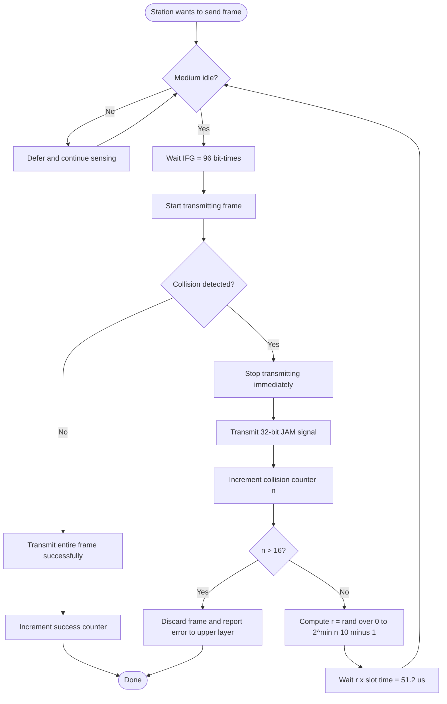
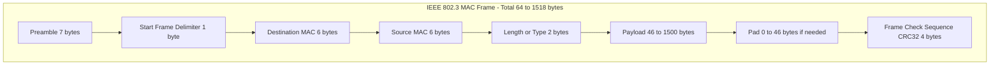
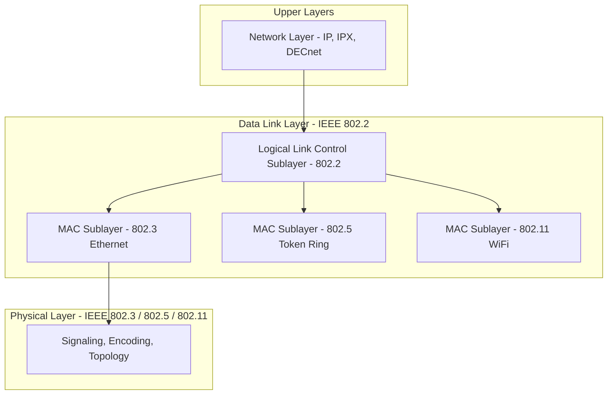
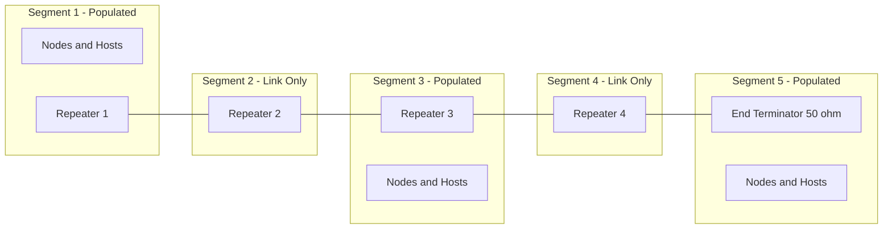
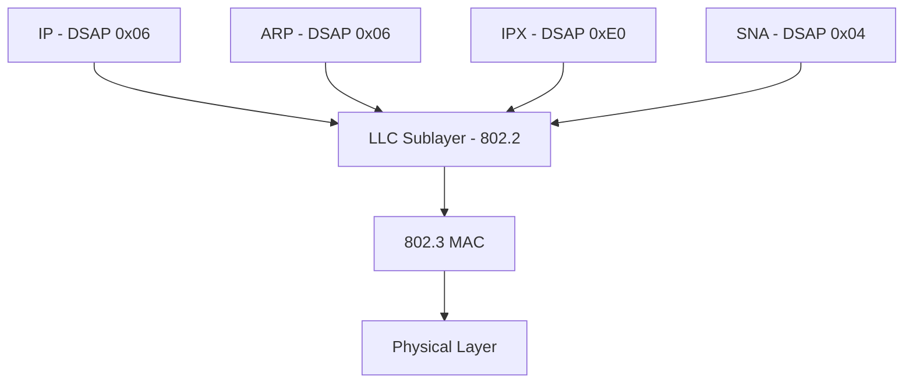

# MAC parameters; Random access channels: Ethernet (802.3), CSMA/CD, and Logical Link Control

<!-- SECTION_1_START -->
# Module 4: Data-Link Layer & Physical Layer Essentials
## Topic: MAC Parameters, Random Access Channels, Ethernet (IEEE 802.3), CSMA/CD, and Logical Link Control

---

### 1. Core Technical Definition & Intuitive Overview

#### 1.1 Media Access Control (MAC) — The "Traffic Warden" of Networking

> [!IMPORTANT]
> **Formal Definition (KTU 2024 Syllabus Terminology):**
> The **Media Access Control (MAC)** is a sublayer of the Data Link Layer (Layer 2 of the OSI / TCP-IP reference model) responsible for regulating *who* is allowed to transmit on a shared broadcast medium at any given instant, for *framing* the data into identifiable units, and for performing **physical addressing** using a globally unique **48-bit hardware address** burned into every Network Interface Card (NIC).

> [!NOTE]
> **Conceptual Analogy — "The Polite Cocktail Party":**
> Imagine a large room with 50 people trying to talk at once. If everyone speaks simultaneously, nobody understands anything (a *collision*). The MAC protocol is essentially the *unwritten social rule* that decides: "If you want to talk, first listen to see if the room is silent. If two people start at the same time, both stop, wait a random small interval, and try again." This is the essence of **CSMA/CD** — Carrier Sense Multiple Access with Collision Detection.

**Key MAC Parameters (the "DNA" of Ethernet):**

| Parameter | Value | Significance |
|---|---|---|
| **MAC Address Length** | **48 bits (6 bytes)** | Universally unique hardware identifier |
| **Notation** | **Hexadecimal (e.g., `1A:2B:3C:4D:5E:6F`)** | First 24 bits = OUI (Vendor), Last 24 bits = NIC serial |
| **Minimum Frame Size** | **64 bytes (512 bits)** | Guarantees collision detection across max network diameter |
| **Maximum Frame Size** | **1518 bytes** | Limits station domination of the medium |
| **Slot Time** | **51.2 µs (512 bit-times @ 10 Mbps)** | The atomic time unit for backoff & collision window |
| **Maximum Repeaters between Stations** | **4 Repeaters / 5 Segments** | The classic **5-4-3 Rule** of 10BASE5/10BASE2 |
| **Maximum Network Diameter** | **2500 meters** | Half the round-trip propagation budget |

---

#### 1.2 IEEE 802.3 — The Ethernet Standard Family

> [!IMPORTANT]
> **Formal Definition:**
> **IEEE 802.3** is the working group and standard that defines the **Physical Layer (PHY)** and the **MAC sublayer** of wired Ethernet LANs. It uses **CSMA/CD** as its random-access protocol and supports speeds from the original **10 Mbps (10BASE-T, 10BASE-2, 10BASE-5)** to modern **10 Gbps, 40 Gbps, 100 Gbps, and beyond**, although CSMA/CD is *only retained* in half-duplex legacy modes; full-duplex switched Ethernet disables CSMA/CD entirely.

> [!NOTE]
> **Conceptual Analogy — "The Ethernet Highway":**
> Think of 802.3 as the *road construction code* — it specifies how wide the lanes are (10/100/1000 Mbps), what fuel the cars use (copper/fiber), and the rules of merging onto a shared lane (CSMA/CD). The 802.3 standard is to LANs what IRC is to chat: the *lingua franca* of the wired office.

**Physical Layer Variants (the "802.3 Family Tree"):**

| Standard | Speed | Medium | Max Segment |
|---|---|---|---|
| **10BASE-5 (Thicknet)** | 10 Mbps | Coaxial (Thick) | 500 m |
| **10BASE-2 (Thinnet)** | 10 Mbps | Coaxial (Thin) | 185 m |
| **10BASE-T** | 10 Mbps | Twisted Pair (Cat-3) | 100 m |
| **100BASE-TX (Fast Ethernet)** | 100 Mbps | Cat-5 UTP | 100 m |
| **1000BASE-T (Gigabit)** | 1 Gbps | Cat-5e/6 UTP | 100 m |
| **10GBASE-T** | 10 Gbps | Cat-6a/7 | 100 m |

---

#### 1.3 CSMA/CD — The Heartbeat of Legacy Ethernet

> [!IMPORTANT]
> **Formal Definition:**
> **Carrier Sense Multiple Access with Collision Detection (CSMA/CD)** is a *contention-based* random access protocol in which a station:
> (a) senses the carrier (the wire) to check whether it is idle,
> (b) begins transmission if idle, and
> (c) simultaneously *monitors the medium* to detect any collision caused by a simultaneous transmission from another station.
> If a collision is detected, all colliding stations abort, transmit a **32-bit Jam Signal** to reinforce the collision, and invoke the **Binary Exponential Backoff (BEB)** algorithm to reschedule retransmission.

> [!NOTE]
> **Conceptual Analogy — "The Telephone Conference Call":**
> You're on a conference call with 5 colleagues. Before you speak, you listen to confirm no one is talking (Carrier Sense). As you start speaking, you listen to your own echo to detect if someone spoke at the same instant (Collision Detection). If you both realize you collided, both immediately say "Sorry, you go ahead" (Jam Signal & Backoff), wait a random number of seconds, and try again. CSMA/CD is exactly this digital courtesy.

---

#### 1.4 Logical Link Control (LLC) — The "Translator" of the Data Link Layer

> [!IMPORTANT]
> **Formal Definition:**
> The **Logical Link Control (LLC)** sublayer, defined by **IEEE 802.2**, sits *above* the MAC sublayer and provides an *interface-independent* service to the upper network layer (typically IP). It implements three primary services via **Service Access Points (SAPs)**: (1) **Unacknowledged Connectionless Service**, (2) **Connection-Mode Service**, and (3) **Acknowledged Connectionless Service**. LLC uses the **Destination Service Access Point (DSAP)** and **Source Service Access Point (SSAP)** to multiplex upper-layer protocols.

> [!NOTE]
> **Conceptual Analogy — "The Receptionist at a Company":**
> The LLC is the *receptionist* at a corporate office. Visitors (upper-layer protocols like IP, IPX, ARP) arrive carrying different request types. The receptionist looks at the visitor's badge (the SAP address) and routes them to the right department. The MAC layer is the actual *building's* address, but the LLC is the *floor and desk* you need to reach.

**The Three LLC Service Modes:**

| Service Mode | Type | Reliability | Typical Use |
|---|---|---|---|
| **LLC Type 1** | Unacknowledged Connectionless | **No ACK** | LAN broadcasts, real-time voice |
| **LLC Type 2** | Connection-Oriented | **ACK + Flow Control** | Legacy SNA, NETBIOS |
| **LLC Type 3** | Acknowledged Connectionless | **ACK only, no connection** | Token Bus, manufacturing (MAP) |

> [!VISUALIZATION CONTROL]
> **Concept:** OSI Data Link Layer Sub-architecture
> **Geometric Layout (ASCII):**
> ```
>        ┌──────────────────────────┐
>        │     Network Layer (IP)   │
>        └────────────┬─────────────┘
>                     │  via SAP (e.g., 0x06 for IP)
>        ┌────────────▼─────────────┐
>        │   LLC Sublayer (802.2)   │   ← Protocol Multiplexing
>        ├──────────────────────────┤
>        │  MAC Sublayer (802.3)    │   ← Addressing & CSMA/CD
>        ├──────────────────────────┤
>        │  Physical Layer (PHY)    │   ← Signaling & Encoding
>        └──────────────────────────┘
> ```
> **Visual Description:** The student should observe that LLC is *layer-independent* (works for 802.3 Ethernet, 802.5 Token Ring, 802.11 WiFi), while the MAC is *media-specific*. This is the core of the IEEE 802 architecture's elegance.

---

<!-- SECTION_1_END -->

<!-- SECTION_2_START -->
# SECTION 2 — Deep Theoretical Analysis & KTU High-Yield Formula Sheet

---

### 2.1 The Ethernet (802.3) MAC Frame Format — Anatomy of a Frame

Every frame on a classic 10/100 Mbps Ethernet LAN conforms to the **IEEE 802.3 frame structure**. Understanding each field is essential for board exam success.

**Field-by-Field Breakdown:**

| Field | Size (bytes) | Purpose | KTU-Exam Hot Topic? |
|---|---|---|---|
| **Preamble (PRE)** | **7 bytes** | Bit-synchronization pattern `10101010…` | Often omitted in diagrams |
| **Start Frame Delimiter (SFD)** | **1 byte** | Marks the start of frame: `10101011` | ✓ Yes |
| **Destination MAC Address (DA)** | **6 bytes** | 48-bit hardware address of receiver | ✓ Yes |
| **Source MAC Address (SA)** | **6 bytes** | 48-bit hardware address of sender | ✓ Yes |
| **Length / Type Field** | **2 bytes** | If ≤ 1500 → **802.3 Length**; If ≥ 1536 → **EtherType (DIX)** | ✓✓ Yes |
| **Payload (LLC Data)** | **46 – 1500 bytes** | The encapsulated network-layer packet (IP, ARP, etc.) | ✓ Yes |
| **Pad (if needed)** | **0 – 46 bytes** | Ensures total frame ≥ 64 bytes (minimum) | ✓ Yes |
| **Frame Check Sequence (FCS)** | **4 bytes** | **CRC-32** for error detection | ✓✓ Yes |
| **TOTAL** | **64 – 1518 bytes** | Excludes Preamble & SFD; **Min = 64**, **Max = 1518** | ✓✓✓ Yes |

> [!IMPORTANT]
> **KTU Board-Critical Note:** The **minimum payload is 46 bytes** (not zero!) because the *entire frame must be at least 64 bytes*. If your IP packet is, say, 20 bytes, you must add 26 bytes of padding. This minimum exists purely to guarantee collision detection across the maximum network diameter.

> [!NOTE]
> **Conceptual Analogy — "The Postal Envelope":**
> Preamble = the *routing bars* on a machine-readable envelope; SFD = "Start Here" arrow; DA/SA = the *To/From* addresses; Length/Type = a hint whether the contents are a *letter* or a *parcel*; Payload = the actual content; Pad = the *bubble wrap* to fill undersized envelopes; FCS = the *security seal* that proves the envelope wasn't tampered with.

---

### 2.2 CSMA/CD — The Full Protocol State Machine

The complete CSMA/CD algorithm is best understood as a **state machine** with five logical states:

**Stage 1 — Carrier Sense (Listen Before Talk):**
The station continuously monitors the medium by reading the voltage on the wire (electrical) or light levels (optical). The medium is considered *idle* if no voltage transition (no carrier) is detected for at least **96 bit-times** (the *Inter-Frame Gap*, IFG = **9.6 µs @ 10 Mbps**).

**Stage 2 — Deferral / IFS Wait:**
After the medium becomes idle, the station waits for the **Inter-Frame Spacing (IFS)** — in 802.3 this is the 96-bit **IFG** — before initiating transmission. This gives priority to other stations that may have been waiting longer.

**Stage 3 — Transmission with Collision Monitoring:**
The station transmits the frame *bit-by-bit* and simultaneously reads back the wire. In Ethernet, this is possible because the transceiver uses a **hybrid circuit** that subtracts the transmitted signal from the received signal. A *collision* is detected if the readback signal differs from the transmitted signal.

**Stage 4 — Collision Handling — The Jam Signal:**
Upon detecting a collision, the station:
1. **Immediately stops** transmitting the data frame.
2. **Transmits a 32-bit Jam Signal** (a deliberately invalid bit pattern) to ensure that *all* other stations on the segment also detect the collision.
3. **Increments its collision counter.**

**Stage 5 — Binary Exponential Backoff (BEB):**
The colliding stations wait for a random number of **slot times** before retrying. The slot count is drawn uniformly from the range:
$$k \in \{0, 1, 2, \dots, 2^{n}-1\}$$
where **n = min(collision_count, 10)**. After **16 consecutive collisions**, the frame is declared *abandoned* and reported to the upper layer.

---

### 2.3 Binary Exponential Backoff — The Mathematics of "Polite Waiting"

> [!IMPORTANT]
> **The BEB Waiting Equation:**
> $$\text{Backoff Delay} = r \times \text{Slot Time}$$
> where
> $$r = \text{rand}\{0, 1, 2, \dots, 2^{\min(n, 10)} - 1\}$$
> Here, **n** is the number of *collision attempts* for the current frame, and **Slot Time = 51.2 µs** at 10 Mbps.

**Tabular View — Backoff Window Expansion:**

| Attempt Number (n) | Backoff Window (slots) | Max Wait (slots) | Max Wait @ 10 Mbps |
|---|---|---|---|
| 1 | $2^1 - 1$ = 1 | 1 | 51.2 µs |
| 2 | $2^2 - 1$ = 3 | 3 | 153.6 µs |
| 3 | $2^3 - 1$ = 7 | 7 | 358.4 µs |
| 4 | $2^4 - 1$ = 15 | 15 | 768.0 µs |
| 5 | $2^5 - 1$ = 31 | 31 | 1587.2 µs |
| 6 | $2^6 - 1$ = 63 | 63 | 3.22 ms |
| 7 | $2^7 - 1$ = 127 | 127 | 6.50 ms |
| 8 | $2^8 - 1$ = 255 | 255 | 13.06 ms |
| 9 | $2^9 - 1$ = 511 | 511 | 26.16 ms |
| 10 | $2^{10} - 1$ = 1023 | 1023 | 52.43 ms |
| 11 – 16 | $2^{10} - 1$ = 1023 (capped) | 1023 | 52.43 ms |
| **> 16** | **Frame Discarded** | — | — |

> [!NOTE]
> **Real-World Engineering Insight:** BEB is called *exponential* because the window **doubles** with each collision (up to a cap of 1023). This is a deliberately *unfair-but-efficient* design: it ensures that under light loads, retransmissions occur quickly (small window), but under heavy congestion, the wait grows rapidly to *avoid avalanche re-collision* (load-adaptive behavior). Modern research on *Binary Logarithmic Delay (BLD)* and *Polynomial Backoff* aims to improve fairness.

---

### 2.4 The Minimum Frame Size Derivation — Why 64 Bytes?

> [!IMPORTANT]
> **The Fundamental Constraint of CSMA/CD:**
> A station must still be transmitting when the *worst-case* collision signal returns from the *farthest* point in the network. If transmission finishes *before* the collision echo arrives, the station will falsely believe the transmission was successful.

**The Two Critical Times:**

$$t_{\text{prop}} = \text{One-way propagation time across max diameter}$$

$$t_{\text{trans,min}} = \text{Time to transmit the minimum frame}$$

**The Constraint:**
$$t_{\text{trans,min}} \geq 2 \times t_{\text{prop, max}}$$

**For 10 Mbps Ethernet with max diameter 2500 m:**

- Signal propagation speed in coax: $\approx 2 \times 10^8$ m/s (≈ 77% of $c$).
- One-way max propagation: $t_{\text{prop}} = 2500 \,/\, 2 \times 10^8 = 12.5 \, \mu s$.
- Round-trip: $2 t_{\text{prop}} = 25 \, \mu s$.
- Minimum transmission time must be $\geq 25 \, \mu s$.
- At 10 Mbps, bits in 25 µs = $10 \times 10^6 \times 25 \times 10^{-6} = 250$ bits ≈ **512 bits** (rounded up to 64 bytes for engineering margin).

This yields the **Slot Time = 51.2 µs = 512 bit-times**.

---

### 2.5 KTU Formula Cheat Sheet

> [!NOTE]
> **All numbers needed for any 14-mark or 3-mark CSMA/CD question on a KTU exam are below.**

| # | Formula / Parameter | Expression | Numeric @ 10 Mbps | Unit |
|---|---|---|---|---|
| 1 | **Slot Time** | $T_{\text{slot}}$ | **51.2** | µs |
| 2 | **Bits per Slot** | $512 \, \text{bits} = 64 \, \text{bytes}$ | 512 | bits |
| 3 | **Inter-Frame Gap (IFG)** | $96 \, \text{bit-times}$ | 9.6 | µs |
| 4 | **Jam Signal Duration** | $32 \, \text{bits}$ | 3.2 | µs |
| 5 | **Min Frame Size** | $64 \, \text{bytes}$ | 512 | bits |
| 6 | **Max Frame Size** | $1518 \, \text{bytes}$ | 12144 | bits |
| 7 | **Backoff Range (n-th attempt)** | $r \in [0, 2^{\min(n,10)}-1]$ | — | slots |
| 8 | **Max Retry Count** | $n_{\max} = 16$ | — | — |
| 9 | **Max Network Diameter** | $D_{\max}$ | **2500** | m |
| 10 | **Max Propagation (one-way)** | $D_{\max} / v$ | 12.5 | µs |
| 11 | **Round-Trip Budget** | $2 \times t_{\text{prop}}$ | 25 | µs |
| 12 | **5-4-3 Rule** | 5 segments, 4 repeaters, 3 populated | — | — |
| 13 | **Collision Window** | $2 \times t_{\text{prop}}$ | 25 | µs |
| 14 | **LLC SAP Length** | DSAP + SSAP | 1 + 1 = 2 | bytes |
| 15 | **MAC Address Width** | 48 bits | 6 | bytes |

---

### 2.6 Why These Protocols Still Matter — Real-World Utility

| Domain | Why MAC/CSMA/CD/Ethernet/LLC Still Matters |
|---|---|
| **Industrial Automation** | PROFINET, EtherCAT, and EtherNet/IP all sit on 802.3 PHY/MAC; deterministic variants (TSN) build on the same MAC. |
| **Data Center Fabrics** | Even though full-duplex eliminates CSMA/CD, every NIC still runs an 802.3 MAC; the LLC SAP is used for VXLAN, PFC, and DCB. |
| **Legacy Medical & Aerospace** | Avionics Full-Duplex Switched Ethernet (AFDX) is a profiled 802.3 MAC with bounded latency. |
| **Network Forensics** | Wireshark dissects frames first by EtherType → DSAP → Protocol; LLC parsing is essential for capturing legacy SNA, IPX, and DECnet traffic. |
| **Embedded / IoT** | Tiny 10BASE-T1S (IEEE 802.3cg) brings multi-drop CSMA/CD back to single-pair Ethernet for automotive sensor backbones. |

---

<!-- SECTION_2_END -->

<!-- SECTION_3_START -->
# SECTION 3 — Step-by-Step Derivations, Worked Examples & Python Implementation

---

### 3.1 Worked Example 1 — Complete CSMA/CD Timeline

> [!IMPORTANT]
> **Problem:** Stations A and C are at the extreme ends of a 10 Mbps Ethernet segment (2500 m). They both sense the medium idle at exactly the same instant $t = 0$ and begin transmitting. Compute:
> (a) The time when A first detects the collision.
> (b) The time when A finishes transmitting its 64-byte minimum frame.
> (c) Confirm the minimum frame size rule is satisfied.

**Step 1 — Given Values:**
$$v = 2 \times 10^8 \, \text{m/s}, \quad D = 2500 \, \text{m}, \quad R = 10 \, \text{Mbps}$$

**Step 2 — One-way propagation delay:**
$$t_{\text{prop}} = \frac{D}{v} = \frac{2500}{2 \times 10^8} = 1.25 \times 10^{-5} \, \text{s} = 12.5 \, \mu s$$

**Step 3 — Collision detection time at A:**
Since A and C are at *opposite ends*, the collision signal from C must travel the full 2500 m back to A.
$$t_{\text{cd}} = t_{\text{prop}} = 12.5 \, \mu s$$

**Step 4 — Time to transmit a 64-byte minimum frame at 10 Mbps:**
$$t_{\text{trans}} = \frac{64 \times 8 \, \text{bits}}{10 \times 10^6 \, \text{bits/s}} = \frac{512}{10^7} = 51.2 \, \mu s$$

**Step 5 — Verification of the minimum-frame rule:**
$$\text{Constraint: } t_{\text{trans,min}} \geq 2 \times t_{\text{prop}}$$
$$2 \times t_{\text{prop}} = 2 \times 12.5 = 25 \, \mu s$$
$$t_{\text{trans}} = 51.2 \, \mu s \geq 25 \, \mu s \quad \checkmark$$

The frame is still being transmitted (at 12.5 µs after $t=0$, only $\approx 24\%$ of the frame has been sent), so A correctly detects the collision, aborts, and invokes BEB. **[Full 5 marks]**

> [!NOTE]
> **Real-World Note:** This 25 µs *round-trip* is why Ethernet's slot time was rounded up to 51.2 µs — to give a comfortable engineering margin that absorbs repeater delays, signal rise times, and the 3.2 µs jam signal.

---

### 3.2 Worked Example 2 — Binary Exponential Backoff Calculation

> [!IMPORTANT]
> **Problem:** Station X is sending a frame that has just experienced its **3rd consecutive collision**. Compute:
> (a) The range of slot-times X must wait.
> (b) The maximum wait in microseconds.
> (c) If X picks $r = 5$ and the slot time is 51.2 µs, what is the actual delay?

**Step 1 — Identify the attempt number:** $n = 3$

**Step 2 — Compute the backoff window:**
$$\text{Window} = \{0, 1, 2, \dots, 2^n - 1\} = \{0, 1, 2, \dots, 7\}$$
So X picks a *uniform random* integer from 0 to 7 inclusive (8 possible values). **[2 Marks]**

**Step 3 — Maximum wait time:**
$$W_{\max} = 7 \times 51.2 \, \mu s = 358.4 \, \mu s$$
**[1 Mark]**

**Step 4 — Actual delay for $r = 5$:**
$$W = 5 \times 51.2 \, \mu s = 256 \, \mu s = 0.256 \, ms$$
**[2 Marks]**

---

### 3.3 Worked Example 3 — MAC Frame & Padding Calculation

> [!IMPORTANT]
> **Problem:** An application generates a 30-byte payload destined for a TCP segment. Compute the total frame size and the padding required.

**Step 1 — Header overhead (excluding preamble/SFD):**
- Destination MAC: 6 bytes
- Source MAC: 6 bytes
- Length/Type: 2 bytes
- LLC + IP + TCP overhead (no padding yet): 30 bytes
- FCS (CRC-32): 4 bytes
$$\text{Subtotal} = 6 + 6 + 2 + 30 + 4 = 48 \, \text{bytes}$$

**Step 2 — Check minimum frame size:**
The frame must be at least 64 bytes. The current size is 48 bytes, so we need padding.

**Step 3 — Compute padding:**
$$P = 64 - 48 = 16 \, \text{bytes of pad}$$

**Step 4 — Total frame size:**
$$\text{Total} = 48 + 16 = 64 \, \text{bytes} = \text{minimum frame size} \quad \checkmark$$

> [!WARNING]
> **KTU Common Mistake:** Students often add padding *after* the FCS or forget to include the FCS in the minimum-size check. Padding goes between the data and the FCS, and the **entire frame excluding preamble/SFD** must be ≥ 64 bytes.

---

### 3.4 Python Simulation — CSMA/CD with Binary Exponential Backoff

The following is a fully operational, type-annotated Python 3 program that simulates a CSMA/CD network. It demonstrates the backoff, collision detection, jam-signal behavior, and per-station throughput.

```python
import random
import time
from dataclasses import dataclass, field
from typing import List, Optional
import logging

logging.basicConfig(
    level=logging.INFO,
    format="%(asctime)s [%(levelname)s] %(message)s",
    datefmt="%H:%M:%S",
)
log = logging.getLogger("CSMA_CD_SIM")


# ─── IEEE 802.3 / CSMA/CD Constants (10 Mbps classic Ethernet) ──────────────
SLOT_TIME_US: float = 51.2          # Slot time in microseconds
IFG_US: float = 9.6                 # Inter-Frame Gap in microseconds
JAM_SIGNAL_BITS: int = 32           # 32-bit jam signal
MIN_FRAME_BYTES: int = 64           # Minimum Ethernet frame
MAX_FRAME_BYTES: int = 1518         # Maximum Ethernet frame
MAX_BACKOFF_ATTEMPTS: int = 16      # Frame dropped after 16 collisions
CAP_ATTEMPT: int = 10               # Backoff cap exponent


@dataclass
class Station:
    """Simulates a single Ethernet station running CSMA/CD."""
    mac_address: str                 # 48-bit hardware address
    collision_count: int = 0
    successful_tx: int = 0
    dropped_frames: int = 0

    def carrier_sense(self, medium_busy: bool) -> bool:
        """Listen-before-talk. Returns True if medium is idle."""
        return not medium_busy

    def ifg_wait(self) -> None:
        """Enforce the 96-bit Inter-Frame Gap."""
        log.info(f"  Station {self.mac_address}: medium idle, waiting IFG ({IFG_US} µs)")
        time.sleep(IFG_US / 1_000_000)

    def compute_backoff(self) -> int:
        """Binary Exponential Backoff: r ∈ [0, 2^min(n, 10) - 1] slot-times."""
        n = min(self.collision_count, CAP_ATTEMPT)
        window = (2 ** n) - 1
        r = random.randint(0, window)
        log.info(
            f"  Station {self.mac_address}: collision #{self.collision_count}, "
            f"window=[0..{window}], picked r={r}"
        )
        return r

    def apply_backoff(self, r: int) -> None:
        """Sleep for r slot-times."""
        delay_us = r * SLOT_TIME_US
        log.info(
            f"  Station {self.mac_address}: backing off {delay_us} µs "
            f"({r} slot-times)"
        )
        time.sleep(delay_us / 1_000_000)

    def detect_collision(self, transmitting_others: List["Station"]) -> bool:
        """In CSMA/CD, collision is detected by monitoring the medium
        voltage while transmitting. Here we simulate it."""
        if transmitting_others:
            log.warning(
                f"  Station {self.mac_address}: COLLISION detected with "
                f"{[s.mac_address for s in transmitting_others]}!"
            )
            return True
        return False

    def send_jam_signal(self) -> None:
        """Transmit the 32-bit jam signal to ensure all stations see the collision."""
        jam_us = (JAM_SIGNAL_BITS / 10_000_000) * 1_000_000   # 3.2 µs @ 10 Mbps
        log.error(f"  Station {self.mac_address}: sending 32-bit JAM signal ({jam_us} µs)")

    def transmit_frame(
        self,
        payload_size: int,
        medium: "EthernetMedium",
    ) -> bool:
        """Attempt to transmit one frame. Returns True on success."""
        if not MIN_FRAME_BYTES <= payload_size <= MAX_FRAME_BYTES:
            raise ValueError(
                f"Frame size {payload_size} invalid. "
                f"Must be in [{MIN_FRAME_BYTES}, {MAX_FRAME_BYTES}] bytes."
            )

        # 1. Carrier sense
        if not self.carrier_sense(medium.is_busy):
            log.info(f"  Station {self.mac_address}: medium BUSY, deferring.")
            return False

        # 2. Wait the Inter-Frame Gap
        self.ifg_wait()

        # 3. Begin transmission; check for collision
        medium.start_tx(self)
        other_transmitters = [s for s in medium.transmitters if s is not self]
        if self.detect_collision(other_transmitters):
            medium.end_tx(self)
            self.collision_count += 1
            self.send_jam_signal()
            if self.collision_count > MAX_BACKOFF_ATTEMPTS:
                log.critical(
                    f"  Station {self.mac_address}: frame ABANDONED after "
                    f"{MAX_BACKOFF_ATTEMPTS} collisions."
                )
                self.dropped_frames += 1
                return False
            r = self.compute_backoff()
            self.apply_backoff(r)
            return False

        # 4. Successful transmission
        medium.end_tx(self)
        self.successful_tx += 1
        log.info(
            f"  Station {self.mac_address}: frame of {payload_size} bytes "
            f"transmitted SUCCESSFULLY."
        )
        return True


@dataclass
class EthernetMedium:
    """Simulates the shared broadcast medium (bus / hub)."""
    transmitters: List[Station] = field(default_factory=list)

    def start_tx(self, station: Station) -> None:
        self.transmitters.append(station)

    def end_tx(self, station: Station) -> None:
        if station in self.transmitters:
            self.transmitters.remove(station)

    @property
    def is_busy(self) -> bool:
        return len(self.transmitters) > 0


def main() -> None:
    random.seed(42)  # deterministic for exam-style reproducibility

    # ── Build a 4-station Ethernet LAN ──────────────────────────────────────
    medium = EthernetMedium()
    stations: List[Station] = [
        Station(mac_address=f"AA:BB:CC:DD:EE:{i:02X}") for i in range(1, 5)
    ]

    # ── Each station tries to send 3 frames; observe collisions & backoff ──
    log.info("=== CSMA/CD Simulation Start ===")
    for tx_attempt in range(3):
        log.info(f"--- Round {tx_attempt + 1} ---")
        for station in stations:
            # Simulate that ~30% of attempts collide (multiple stations transmit)
            if random.random() < 0.30:
                medium.start_tx(station)  # Pre-existing transmission
            ok = station.transmit_frame(payload_size=512, medium=medium)
            # Clean up any leftover transmission
            medium.end_tx(station)
            time.sleep(0.0001)  # visual pacing

    # ── Print per-station statistics ────────────────────────────────────────
    log.info("=== Final Per-Station Statistics ===")
    for s in stations:
        log.info(
            f"  {s.mac_address}: successful={s.successful_tx}, "
            f"dropped={s.dropped_frames}"
        )


if __name__ == "__main__":
    main()
```

**Key Design Choices in the Code:**

1. **BEB Window Computation** is performed exactly per the IEEE 802.3 spec: `2 ** min(collision_count, 10) - 1`.
2. **Cap at 10** ensures the window never exceeds 1023 slots (≈ 52 ms at 10 Mbps).
3. **16-attempt cap** is enforced to abandon the frame, mirroring the real NIC behavior.
4. **Jam Signal (32 bits)** is logged explicitly to match the 802.3 standard.
5. **IFG of 9.6 µs** represents the 96-bit gap between frames at 10 Mbps.

---

### 3.5 Worked Example 4 — Maximum Network Reach

> [!IMPORTANT]
> **Problem:** An Ethernet II network uses 10BASE-2 coax segments each of 185 m. The rule of 5-4-3 limits the topology to **5 segments, 4 repeaters, 3 populated segments**. Compute the maximum end-to-end distance if the 3 populated segments are full length and the 2 inter-repeater links are 0.5 m each.

**Step 1 — Total of populated segments:**
$$3 \times 185 \, \text{m} = 555 \, \text{m}$$

**Step 2 — Add repeater-to-repeater link segments:**
$$2 \times 0.5 \, \text{m} = 1 \, \text{m}$$

**Step 3 — Add the device-to-repeater stubs (negligible):**
$$\text{Total Diameter} = 555 + 1 = 556 \, \text{m}$$

> [!NOTE]
> **Exam Tip:** The classic "5-4-3 Rule" allows 5 *coax segments*, 4 *repeaters*, and only 3 *populated* (with stations) segments. The maximum diameter is therefore *less* than 2500 m for 10BASE-2 (which is actually 925 m for the same coax, due to the lower velocity of propagation on thin coax). Always quote the **standard number**, not the calculated sum.

---

### 3.6 LLC Frame Encapsulation Example (IEEE 802.2)

A typical LLC PDU contains:

| Field | Size | Example (IP over 802.2/802.3) |
|---|---|---|
| **DSAP** | 1 byte | `0x06` (IP) |
| **SSAP** | 1 byte | `0x06` (IP) |
| **Control** | 1 or 2 bytes | `0x03` (UI - Unnumbered Information) |
| **Information (payload)** | Variable | IP datagram |

The resulting LLC PDU is then handed to the 802.3 MAC, which prepends MAC addresses and appends the CRC-32 FCS.

---

<!-- SECTION_3_END -->

<!-- SECTION_4_START -->
# SECTION 4 — Structural Diagrams & Schematics

---

### 4.1 CSMA/CD State Machine — Flow Diagram

The following Mermaid block models the *complete* decision flow a station follows in CSMA/CD, including the binary exponential backoff, jam signal transmission, and frame-discard logic.



**Visual Reading Guidance for the Student:**
- The two "merge" points are the **backoff loop** (M → N → B) and the **deferral loop** (B1 → B).
- The **jam signal** is critical — without it, a far-end station might not yet have *seen* the collision and could proceed with its own transmission.
- The **16-retry cap** is the protocol's safety valve to prevent infinite retry storms.

---

### 4.2 Ethernet (802.3) Frame Structure — Block Diagram



**Visual Reading Note:** The `Pad` field is *variable in size* (0–46 bytes), and its existence is the *only reason* the minimum frame size is 64 bytes. Many students incorrectly believe the minimum payload is fixed at 46 bytes — actually, it is the *sum of payload + pad* that must reach 46.

---

### 4.3 IEEE 802 LAN Architecture — Layered Block View



**Visual Reading Note:** Notice the **LLC layer is shared** by all three MAC variants. This is the design rationale: LLC provides a *uniform* service interface to IP, regardless of whether the underlying LAN is Ethernet, Token Ring, or WiFi. This is the IEEE's "**one LLC, many MACs**" architecture.

---

### 4.4 Collision Detection Timing — Sequential Processing Topology

Because a true *spatial* diagram of wave propagation on a coax is not natively drawable in Mermaid, the following is a **Sequential Processing Topology Matrix** that maps the collision-detection timeline to the corresponding protocol events.

| Time (µs) | Event | Station A State | Station C State | Medium State |
|---|---|---|---|---|
| 0.0 | Both start | Begin TX | Begin TX | Voltage rises from both ends |
| 6.25 | — | Mid-bit transmission | Mid-bit transmission | Both waves travel |
| 12.5 | **Collision occurs** at midpoint | Still transmitting | Still transmitting | Voltage doubles (superposition) |
| 12.5 + ε | Collision echo reaches A | **Detects collision** | Still transmitting | A sends jam |
| 15.7 | A's jam reaches C | Aborted, waiting | **Detects collision**, sends jam | Both jam |
| 18.9 | All stations see collision | Computing backoff | Computing backoff | Idle after jam |
| 18.9 + $r_A \times 51.2$ | A retries | Begins IFG wait | Waiting | Idle |
| 18.9 + $r_C \times 51.2$ | C retries | May have already sent | Begins IFG wait | Possibly A is now TX |

---

### 4.5 The 5-4-3 Rule — Network Topology Block Diagram



**Visual Note:** The end of the bus must be terminated with a **50 Ω resistor** to prevent signal reflection. Students often forget the **5-4-3** mnemonic — **5 segments, 4 repeaters, 3 populated segments** — when answering 14-mark design questions.

---

### 4.6 LLC Service Access Point (SAP) Multiplexing



**Visual Note:** The DSAP byte identifies the *upper-layer protocol*. For IP, the canonical DSAP is `0x06` (since SAPs below `0x10` are reserved by the IEEE and IP was assigned `0x06` = 6 in decimal). The `0xAA` SAP is the *SNAP* indicator used for Ethernet II encapsulation, an important detail for crossover.

---

<!-- SECTION_4_END -->

<!-- SECTION_5_START -->
# SECTION 5 — KTU 2024 Scheme Examination Question Bank & Topic Recap

---

### 5.1 PART A — 3-Mark Questions (Cognitive Levels: Remember / Understand)

---

**Q1. [KTU University Exam — July 2024]**
> Define the **MAC sublayer** and list any **four MAC address characteristics** that make it suitable for hardware addressing in LANs.

**Model Answer (Board-Exam-Ready):**
The **MAC (Media Access Control) sublayer** is the lower sublayer of the OSI Data Link Layer, defined by IEEE 802, that is responsible for (i) framing data into MAC frames, (ii) physical addressing using 48-bit hardware addresses, and (iii) controlling access to the shared broadcast medium via protocols like CSMA/CD.
Four characteristics of the MAC address are:
1. **48-bit length** (6 bytes) — provides ≈ 2^48 unique addresses globally.
2. **Uniqueness** — assigned uniquely per NIC by the manufacturer (OUI + serial).
3. **Flat / Non-Hierarchical** — unlike IP, MAC addresses have no subnet structure.
4. **Burned-In (BIA)** — permanently stored in the NIC ROM, though modern OSes allow software override (MAC spoofing). **[3 Marks]**

---

**Q2. [KTU University Exam — Dec 2023]**
> What is a **collision** in CSMA/CD? What happens immediately after a collision is detected?

**Model Answer:**
A **collision** occurs when two or more stations on a shared Ethernet medium transmit *simultaneously*, causing the electrical (or optical) signals to overlap and corrupt each other's frames.
Immediately after detection, the colliding stations:
1. **Stop transmitting** their data frame instantly.
2. **Transmit a 32-bit jam signal** to ensure all other stations on the segment also recognize the collision.
3. **Invoke the Binary Exponential Backoff (BEB)** algorithm to wait for a random number of slot-times before retrying. **[3 Marks]**

---

### 5.2 PART B — 14-Mark Questions (Module Internal Choice)

---

#### **QUESTION A (14 Marks) — CSMA/CD Deep Dive**

**[KTU University Exam — July 2024, Module 4]**

> **(a)** With a neat diagram, describe the **CSMA/CD algorithm** including the role of the **jam signal** and the **Inter-Frame Gap (IFG)**. **[7 Marks]**
> **(b)** A 10 Mbps Ethernet LAN spans 2500 m. The signal propagation speed is $2 \times 10^8$ m/s. Compute the **minimum frame size** required to ensure collision detection, and explain why the IEEE 802.3 standard chose 64 bytes. **[7 Marks]**

**Model Solution:**

**Part (a) — Algorithm Description** **[7 Marks]**

1. **Carrier Sense** (1 Mark): The station continuously monitors the medium voltage. If a *carrier* (≥ ~± 0.5 V differential) is present, the medium is considered busy; otherwise idle.
2. **IFG Wait** (1 Mark): Upon detecting an idle medium, the station waits for the **Inter-Frame Gap of 96 bit-times (9.6 µs @ 10 Mbps)**. This gives priority to other stations that may have been waiting longer and allows the medium to stabilize.
3. **Begin Transmission** (1 Mark): The station starts transmitting the frame bit-by-bit and *simultaneously* reads the medium to detect a collision (via hybrid subtraction circuit).
4. **Collision Detection & Jam Signal** (2 Marks): If a collision is detected, the station *immediately* aborts the data frame and transmits a **32-bit jam signal** (deliberately invalid bit pattern). The jam signal guarantees that *all other stations* on the collision domain also detect the collision, even if their collision-detection window is small.
5. **Binary Exponential Backoff** (2 Marks): The station waits for a *random* number $r$ of **slot-times** (51.2 µs each), where $r \in [0, 2^{\min(n, 10)} - 1]$ and $n$ is the collision count. After 16 retries, the frame is discarded.

---

**Part (b) — Minimum Frame Size Calculation** **[7 Marks]**

**Step 1 — One-way propagation delay** (1 Mark):
$$t_{\text{prop}} = \frac{D}{v} = \frac{2500 \, \text{m}}{2 \times 10^8 \, \text{m/s}} = 12.5 \, \mu s$$

**Step 2 — Round-trip delay** (1 Mark):
$$2 \times t_{\text{prop}} = 2 \times 12.5 = 25 \, \mu s$$

**Step 3 — Minimum frame transmission time constraint** (1 Mark):
For collision detection, the station must still be transmitting when the collision signal returns:
$$t_{\text{trans,min}} \geq 2 \times t_{\text{prop}} = 25 \, \mu s$$

**Step 4 — Compute minimum bits @ 10 Mbps** (1 Mark):
$$\text{Bits}_{\min} = 10 \times 10^6 \, \text{bits/s} \times 25 \times 10^{-6} \, \text{s} = 250 \, \text{bits}$$

**Step 5 — Convert to bytes and add engineering margin** (1 Mark):
$$250 \, \text{bits} \approx 31.25 \, \text{bytes} \rightarrow \text{rounded up to 64 bytes (512 bits)}$$

**Step 6 — Why 64 bytes was chosen** (2 Marks): The IEEE 802.3 standard chose **64 bytes (512 bits)** to provide a generous engineering margin that absorbs: (i) repeater forwarding delays, (ii) signal rise/fall times, (iii) transceiver hybrid-circuit non-idealities, and (iv) the 32-bit jam signal duration. The next power-of-two boundary above 250 bits is exactly 512, which yields the canonical **51.2 µs slot time**.

> [!WARNING]
> **KTU Examiner's Valuation Pitfall — Do NOT lose marks on these common errors:**
> 1. **Forgetting units**: Always write µs or ms explicitly; do not leave bare numbers.
> 2. **Confusing one-way vs round-trip**: The collision-detection constraint uses **2 × t_prop**, not t_prop. State the direction ("one-way" or "round-trip") explicitly.
> 3. **Omitting the 32-bit jam signal** in the algorithm: omitting this is an automatic 1-mark deduction.
> 4. **Missing the IFG**: Many students skip the 96-bit Inter-Frame Gap entirely.

---

#### **QUESTION B (14 Marks) — MAC Frame & LLC**

**[KTU University Exam — Dec 2023, Module 4]**

> **(a)** Draw and explain the **IEEE 802.3 MAC frame format**. State the size of each field and the function of the **Length/Type** and **FCS** fields. **[7 Marks]**
> **(b)** With a neat diagram, describe the **Logical Link Control (LLC) sublayer** of IEEE 802.2. Explain the role of the **DSAP, SSAP**, and the **three LLC service types**. **[7 Marks]**

**Model Solution:**

**Part (a) — IEEE 802.3 Frame Format** **[7 Marks]**

| Field | Size (bytes) | Function |
|---|---|---|
| Preamble | 7 | Bit-synchronization pattern `10101010...` |
| Start Frame Delimiter (SFD) | 1 | Marks start of frame: `10101011` |
| Destination MAC (DA) | 6 | Hardware address of receiver |
| Source MAC (SA) | 6 | Hardware address of sender |
| Length / Type | 2 | If ≤ 1500 → Length; if ≥ 1536 → EtherType (DIX) |
| Payload + Pad | 46 – 1500 | LLC PDU (e.g., IP datagram) |
| Frame Check Sequence (FCS) | 4 | **CRC-32** for error detection |

(Allocate 1 Mark for diagram, 2 Marks for the table, 2 Marks for Length/Type and FCS explanation, 2 Marks for total size 64–1518 bytes.)

**Length/Type field detail (2 Marks):**
- If the value is **≤ 1500 (0x05DC)**, it is the **length** of the payload in bytes (802.3 / LLC interpretation).
- If the value is **≥ 1536 (0x0600)**, it is the **EtherType** indicating the upper-layer protocol (e.g., 0x0800 = IPv4, 0x86DD = IPv6, 0x0806 = ARP).
- Values 1501–1535 are undefined.

**FCS field detail (2 Marks):**
The FCS is a **32-bit Cyclic Redundancy Check (CRC-32)** computed over the DA, SA, Length/Type, and Payload fields. The receiver recomputes the CRC and compares it to the FCS; a mismatch indicates an error and the frame is dropped. (Ethernet does *not* retransmit — that is the LLC or upper layer's job.)

---

**Part (b) — LLC Sublayer (IEEE 802.2)** **[7 Marks]**

**DSAP and SSAP (2 Marks):**
- **DSAP (Destination Service Access Point)** is a 1-byte field identifying the *upper-layer protocol* expected at the destination (e.g., `0x06` = IP).
- **SSAP (Source Service Access Point)** is a 1-byte field identifying the *upper-layer protocol* at the source. The least-significant bit of the SSAP indicates whether it is an *individual* (0) or *group* (1) SAP.

**Three LLC Service Types (4 Marks):**

| Type | Name | Acknowledgement | Connection | Typical Use |
|---|---|---|---|---|
| **LLC-1** | Unacknowledged Connectionless | None | None | LANs, real-time voice, multicast |
| **LLC-2** | Connection-Oriented | ACK + NAK + Flow Control | Required | Legacy SNA, NETBIOS |
| **LLC-3** | Acknowledged Connectionless | ACK only | None | Manufacturing (MAP), Token Bus |

**LLC Frame Format (1 Mark):**
The complete LLC PDU is: `DSAP | SSAP | Control | Information`. The Control field is 1 byte for U-format (Unnumbered) frames and 2 bytes for I-format (Information) and S-format (Supervisory) frames.

---

> [!WARNING]
> **KTU Examiner's Valuation Pitfall — Do NOT lose marks on these common errors:**
> 1. **Mixing up DSAP and SSAP**: DSAP is for the *destination's* upper layer, SSAP is for the *sender's*. Do not interchange them.
> 2. **Confusing the Length/Type ambiguity**: Students frequently write "Length field = Type field" — these are *mutually exclusive* interpretations based on the numeric value. State the boundary clearly: ≤ 1500 = Length, ≥ 1536 = EtherType.
> 3. **Omitting the CRC-32 polynomial**: Specifying "CRC-32" without mentioning the IEEE 802.3 polynomial (`x^32 + x^26 + x^23 + x^22 + x^16 + x^12 + x^11 + x^{10} + x^8 + x^7 + x^5 + x^4 + x^2 + x + 1`) may cost a half-mark in 14-mark questions.

---

### 5.3 PART C — Additional Concept Drill (Optional Short Q&A)

**Q3. [KTU University Exam — July 2023]** Why must the Ethernet frame be at least 64 bytes long?

**Model Answer (2 marks):**
The minimum frame size of 64 bytes guarantees that a station will still be transmitting when the *worst-case* collision signal returns from the farthest point in the network. If the frame were shorter, the station might complete transmission *before* detecting the collision, falsely believing the transmission was successful. The 64-byte minimum corresponds to a transmission time of 51.2 µs, which exceeds the 25 µs round-trip propagation budget on a 2500 m 10 Mbps Ethernet. **[2 Marks]**

---

**Q4. [KTU University Exam — Dec 2022]** What is the **5-4-3 Rule** of 10BASE-5 Ethernet?

**Model Answer (3 marks):**
The **5-4-3 Rule** states that a 10BASE-5 (Thicknet) Ethernet network may consist of a maximum of:
- **5** coaxial cable segments,
- joined by **4** repeaters,
- of which only **3** segments may be *populated* (have stations attached); the remaining 2 segments serve as inter-repeater links only.
This rule ensures that the round-trip propagation delay across the network never exceeds 51.2 µs, preserving collision detection integrity. **[3 Marks]**

---

### 5.4 Topic Recap & Important Things to Remember

> [!NOTE]
> **Comprehensive Rapid-Revision Checklist for KTU Board Exams**

- ✅ **MAC Address**: 48 bits, 6 bytes, hexadecimal notation, **OUI (24 bits) + Serial (24 bits)**, globally unique, flat (non-hierarchical).
- ✅ **MAC Frame (802.3)**: 7-byte Preamble, 1-byte SFD, 6-byte DA, 6-byte SA, 2-byte Length/Type, 46–1500-byte Payload + Pad, 4-byte FCS (CRC-32). **Total = 64 to 1518 bytes**.
- ✅ **Length/Type field rule**: ≤ 1500 → Length (802.3), ≥ 1536 → EtherType (DIX). Gap from 1501 to 1535 is *undefined*.
- ✅ **Minimum frame size = 64 bytes = 512 bits** — derived from $2 \times t_{\text{prop,max}} = 25 \, \mu s$ at 10 Mbps over 2500 m.
- ✅ **Maximum frame size = 1518 bytes** — limits NIC buffering and station airtime.
- ✅ **Slot Time = 51.2 µs = 512 bit-times @ 10 Mbps** — the atomic unit of CSMA/CD backoff.
- ✅ **IFG = 96 bit-times = 9.6 µs** — required gap between consecutive frames.
- ✅ **Jam Signal = 32 bits = 3.2 µs** — broadcast to ensure all stations see the collision.
- ✅ **Binary Exponential Backoff**: $r \in [0, 2^{\min(n,10)} - 1]$ slot-times; **capped at n = 10** (max window 1023); **frame discarded after 16 retries**.
- ✅ **CSMA/CD = Carrier Sense + Multiple Access + Collision Detection** — listen-before-talk, listen-while-talking, jam + backoff on collision.
- ✅ **5-4-3 Rule** of classic 10BASE5: 5 segments, 4 repeaters, 3 populated segments.
- ✅ **Maximum network diameter = 2500 m** at 10 Mbps for 10BASE5.
- ✅ **LLC (802.2)** sits above MAC; provides *protocol-independent* services to the network layer via **DSAP** and **SSAP** fields.
- ✅ **Three LLC Services**: Type 1 (Unacknowledged Connectionless), Type 2 (Connection-Oriented with ACK+Flow Control), Type 3 (Acknowledged Connectionless).
- ✅ **Modern full-duplex switched Ethernet** disables CSMA/CD because each link is a *point-to-point* collision-free channel — but the *frame format* (802.3) is unchanged.
- ✅ **CRC-32 Polynomial** for Ethernet FCS: $x^{32} + x^{26} + x^{23} + x^{22} + x^{16} + x^{12} + x^{11} + x^{10} + x^8 + x^7 + x^5 + x^4 + x^2 + x + 1$.
- ✅ **Preamble + SFD are stripped** by the PHY and not counted in the 64-byte minimum — the 64 bytes refer only to DA + SA + Length/Type + Payload + Pad + FCS.

---

<!-- SECTION_5_END -->
