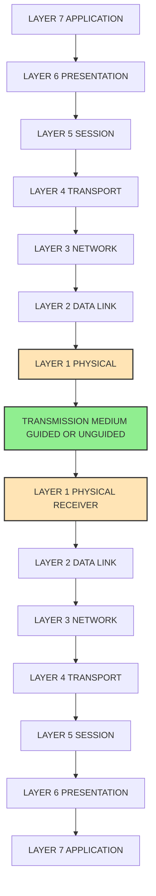
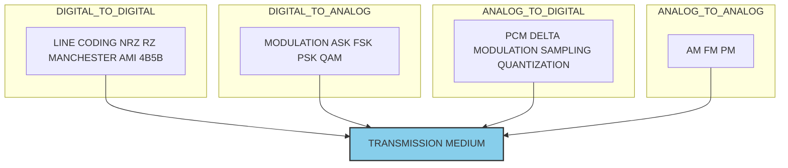
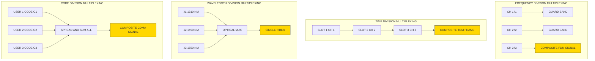
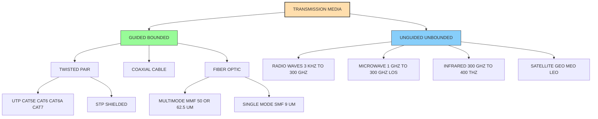
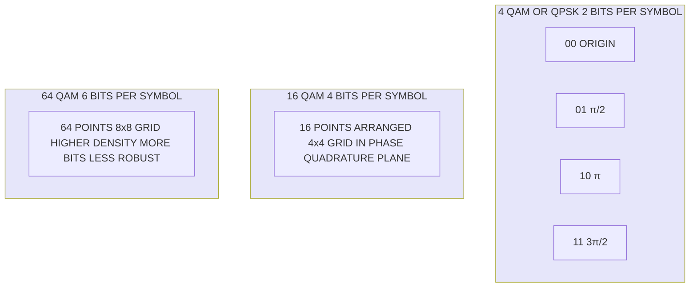
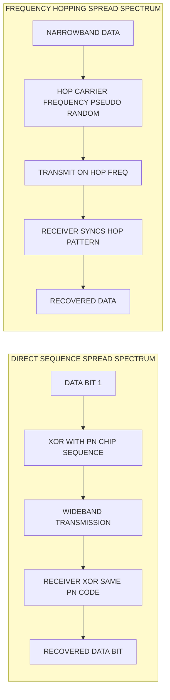

# Physical Layer: Data and signals, Digital transmission, Analog transmission, Bandwidth utilization, Transmission media (Book 1 Ch 7)

<!-- SECTION_1_START -->
# Physical Layer — Data, Signals & Transmission Foundations

## 1. Core Technical Definition (KTU 2024 Syllabus Terminology)

> [!IMPORTANT]
> **Physical Layer (OSI Layer 1):** The lowest layer of the OSI Reference Model responsible for the **mechanical, electrical, functional, and procedural** means to activate, maintain, and deactivate physical connections. It converts **bits into signals** (electromagnetic/optical/radio) for transmission over a communication channel and vice versa.

In KTU 2024 Scheme PCCST501 (Computer Networks), the Physical Layer module is built on five pillars:

1. **Data and Signals** — Analog vs Digital, periodic vs aperiodic.
2. **Digital Transmission** — Line coding, block coding, sampling, PCM.
3. **Analog Transmission** — Modulation techniques (ASK, FSK, PSK, QAM).
4. **Bandwidth Utilization** — Multiplexing (TDM, FDM, WDM) and Spread Spectrum.
5. **Transmission Media** — Guided (twisted pair, coaxial, fiber) and Unguided (wireless).

---

## 2. Data vs Signal — The Fundamental Distinction

| Aspect | Data | Signal |
|---|---|---|
| Definition | Entities that convey meaning (text, audio, video) | Electric/electromagnetic representation of data |
| Form | Logical (bits) | Physical (voltage, light, RF wave) |
| Persistence | Independent of medium | Bound to a specific medium |
| Types | Analog & Digital | Analog & Digital |

> [!NOTE]
> A **signal** is the *carrier* of **data**. The Physical Layer's job is to translate data ↔ signal at both ends of a link.

---

## 3. Analog vs Digital Signals

### 3.1 Analog Signal
An **analog signal** has **infinitely many levels of intensity** over a period of time, and its amplitude varies continuously.

> [!TIP]
> **Analogy — Human Voice:** When you speak into a microphone, the diaphragm vibrates continuously in response to air-pressure changes, producing a smooth, continuous voltage waveform. This is an analog signal. Likewise, the natural world (sound, light, temperature) is analog.

**Characteristics:**
- Continuous in time **AND** continuous in amplitude.
- Represented by a **sine wave**: $s(t) = A \sin(2\pi f t + \phi)$.
- Susceptible to **noise amplification** because every amplifier also amplifies noise.

### 3.2 Digital Signal
A **digital signal** has a **finite number of discrete values** (typically two: binary 0 and 1), even though the signal itself may be continuous in time.

> [!TIP]
> **Analogy — Light Switch:** A light switch is binary — either ON or OFF, no in-between. Digital signals behave the same: voltage HIGH = 1, voltage LOW = 0. Modern CPUs use a ~1.2 V threshold; anything above = 1, below = 0.

**Characteristics:**
- Discrete in amplitude; can be discrete or continuous in time.
- Represented by a **square/pulse wave**.
- Less affected by noise — receivers only need to distinguish "above threshold" vs "below threshold."

---

## 4. Periodic vs Aperiodic Signals

### 4.1 Periodic Signal
Completes one **pattern (cycle)** within a measurable time frame called a **period (T)**.

$$
s(t+T) = s(t), \quad \forall t \in \mathbb{R}
$$

### 4.2 Aperiodic Signal
Completes a pattern **without a predictable repetition**. Most real-world data signals (voice, video) are aperiodic.

---

## 5. Key Sine Wave Parameters (The Foundation of All Signals)

> [!IMPORTANT]
> A sine wave is described by three primary attributes. **Frequency, amplitude, and phase** are the only knobs we can twist to encode data onto a carrier.

| Parameter | Symbol | Unit | Definition |
|---|---|---|---|
| **Peak Amplitude** | $A$ | Volts (V) | Absolute peak value of the signal |
| **Frequency** | $f$ | Hertz (Hz) | Number of cycles per second |
| **Period** | $T$ | Seconds (s) | Time for one complete cycle |
| **Phase** | $\phi$ | Radians (rad) or Degrees | Position of waveform relative to $t=0$ |
| **Wavelength** | $\lambda$ | Meters (m) | Distance occupied by one cycle |

The unifying relationships:

$$
f = \frac{1}{T}, \qquad \lambda = \frac{v}{f} = vT
$$

where $v$ is the **propagation speed** of the signal in the medium ($v \approx 3 \times 10^8$ m/s in free space, $\approx 2 \times 10^8$ m/s in fiber).

> [!NOTE]
> **Period and Frequency are reciprocals.** Doubling the frequency halves the period. In a fiber cable where $v \approx 2 \times 10^8$ m/s, a $f = 2 \times 10^{14}$ Hz infrared signal has $\lambda = 1\ \mu m$ — well inside the optical band.

---

## 6. Time Domain vs Frequency Domain

| Domain | X-axis | Y-axis | Best For |
|---|---|---|---|
| **Time Domain** | Time ($t$) | Amplitude ($A$) | Viewing waveform shape |
| **Frequency Domain** | Frequency ($f$) | Amplitude/Phase | Understanding spectral content |

The **Fourier Series** proves that any periodic signal is a sum of pure sine waves (fundamental + harmonics). The lowest frequency sine component is the **fundamental frequency**; all others are integer multiples $nf_0$.

> [!TIP]
> **Analogy — Music Chord:** A pure "A4" note from a tuning fork is one sine wave. A piano playing "A4" sounds richer because the string vibrates at the fundamental 440 Hz plus harmonics (880, 1320, 1760 …). A Fourier transform separates these components — like a prism splitting white light into colors.

---

## 7. Bandwidth of a Signal

> [!IMPORTANT]
> **Bandwidth (B):** The range of frequencies a signal occupies, OR the range a channel can pass, measured in **Hertz (Hz)**. A signal that spans $f_1$ to $f_2$ has bandwidth $B = f_2 - f_1$.

For a **digital signal** with bit duration $T_b$, the theoretical minimum bandwidth is:

$$
B_{\min} = \frac{1}{2} \cdot \frac{1}{T_b} = \frac{f_b}{2}
$$

where $f_b = 1/T_b$ is the **bit rate**. A perfect (rectangular) digital pulse would require **infinite bandwidth** — so in practice we band-limit signals, accepting some distortion.

> [!WARNING]
> **Valuation Trap:** The "**bandwidth of a digital signal**" and "**bandwidth of a medium**" use the same word but different units. A digital signal's bandwidth is in **Hz**; a digital channel's capacity is in **bits per second (bps)**. KTU questions often swap these — read carefully.

---

## 8. Data Rate Limits — The Nyquist & Shannon Laws

### 8.1 Noiseless Channel — Nyquist Bit Rate
The **maximum data rate** of a noiseless channel of bandwidth $B$ with $L$ discrete signal levels is:

$$
C = 2B \log_2(L) \quad \text{bits/second}
$$

### 8.2 Noisy Channel — Shannon Capacity
The **theoretical maximum** on a noisy channel of bandwidth $B$ with signal-to-noise ratio $S/N$ is:

$$
C = B \log_2\!\left(1 + \frac{S}{N}\right) \quad \text{bits/second}
$$

where $S/N$ is dimensionless (often expressed in dB): $S/N_{dB} = 10 \log_{10}(S/N)$.

> [!NOTE]
> **Intuition:** Nyquist is the *ceiling* on a perfect wire; Shannon is the *ceiling* when noise exists. Shannon's law is **independent** of signal levels — no amount of clever encoding can exceed it.

---

## 9. Transmission Impairments

> [!IMPORTANT]
> Three impairments distort any real signal: **Attenuation, Distortion, and Noise**.

| Impairment | Cause | Mitigation |
|---|---|---|
| **Attenuation** | Energy loss over distance | **Amplifiers** (analog) or **Repeaters** (digital) |
| **Distortion** | Different frequency components travel at different speeds | Equalizers, limited bandwidth |
| **Noise** | Thermal, induced, crosstalk, impulse | Shielding, twisting, filtering |

**Attenuation is measured in decibels (dB):**

$$
\text{Attenuation (dB)} = 10 \log_{10}\!\left(\frac{P_2}{P_1}\right)
$$

A **negative** dB value means signal loss; **positive** dB means amplification. The same dB formula applies to **S/N ratio**.

> [!TIP]
> **Analogy — Whispers in a Tunnel:** The further you walk, the quieter the whisper (attenuation). Hard walls make it echo differently at different pitches (distortion). Other people's chatter in the tunnel blends in (noise). Walkie-talkie repeaters (amplifiers) and noise-cancelling mics (filters) help — exactly what real networks do.

---

## 10. Channel Capacity vs Data Rate vs Throughput

| Term | Meaning |
|---|---|
| **Channel Capacity** | Maximum theoretical rate (Nyquist/Shannon) |
| **Data Rate (Bit Rate)** | Number of bits transmitted per second (bps) |
| **Throughput** | Actual *useful* data delivered per second |
| **Latency (Delay)** | Time for one bit to travel from source to destination |
| **Jitter** | Variation in packet delay |
| **Bandwidth-Delay Product** | $B \times \text{propagation delay}$ — bits "in flight" |

---

> [!VISUALIZATION CONTROL]
> **Concept:** Sine wave — amplitude, period, frequency, phase.
> **GeoGebra / Desmos Input Equations:**
> * `f1(x) = 2*sin(2*pi*1*x)` — frequency 1 Hz, amplitude 2
> * `f2(x) = 2*sin(2*pi*2*x)` — same amplitude, double frequency
> * `f3(x) = 2*sin(2*pi*1*x + pi/2)` — phase-shifted by 90°
> **Visual Description:** Plot all three. Student should observe: f1 completes 1 cycle/unit; f2 completes 2 cycles/unit (compressed horizontally); f3 is identical to f1 but shifted left by 0.25 units (90°/360°).
<!-- SECTION_1_END -->

<!-- SECTION_2_START -->
# Deep Theoretical Analysis & KTU High-Yield Formula Sheet

## 1. Digital Transmission Subsystem

Digital transmission converts **analog data** (or already-digital bits) into a form that survives the channel. It includes **digital-to-digital**, **analog-to-digital conversion**, and **transmission modes**.

### 1.1 Line Coding (Digital → Digital)

Line coding translates binary data into digital signals. The four families:

| Family | Schemes | Rule |
|---|---|---|
| **Unipolar** | NRZ | One voltage level used; simple but DC-biased |
| **Polar** | NRZ-L, NRZ-I, RZ, Biphase (Manchester, Differential Manchester) | Two levels: positive & negative |
| **Bipolar** | AMI, Pseudoternary | Three levels: +V, 0, −V; alternation for 1s |
| **Multilevel** | 2B1Q, 8B6T, 4D-PAM5 | More bits per signal element → lower bandwidth |

> [!IMPORTANT]
> **Why Manchester is the LAN favorite:** It has a transition in the *middle of every bit* — used for **clock recovery**. IEEE 802.3 (10Base-T Ethernet) and 802.5 (Token Ring) use Manchester/Differential Manchester for exactly this reason.

### 1.2 Block Coding (for Synchronization & Error Detection)

**Block coding** adds redundancy to ensure bit sequence has enough transitions (DC balance) and provides rudimentary error detection. The classic 4B/5B scheme (used in 100Base-TX Fast Ethernet) replaces every 4 data bits with 5 code bits.

> [!TIP]
> **Analogy — Punctuation in Speech:** If I speak "ICANTHEARYOU" vs "I CAN'T HEAR YOU," the punctuation (redundancy) makes the second far easier to parse. Block codes are punctuation for bits.

### 1.3 Sampling Theorem — Bridging Analog ↔ Digital

> [!IMPORTANT]
> **Nyquist Sampling Theorem:** To reconstruct an analog signal of highest frequency $f_{\max}$, the sampling rate $f_s$ must satisfy $f_s \ge 2 \cdot f_{\max}$. The minimum $f_s = 2 f_{\max}$ is called the **Nyquist rate**; $2 f_{\max}$ is the **Nyquist frequency**.

**Pulse Code Modulation (PCM)** is the canonical analog-to-digital conversion:

1. **Sampling** — at $\ge 2 f_{\max}$ (per Nyquist).
2. **Quantization** — round each sample to the nearest of $L = 2^n$ levels.
3. **Encoding** — represent each level with an $n$-bit code.

**Quantization error** is bounded by $\pm \Delta/2$ where $\Delta = (V_{\max} - V_{\min})/L$ is the **step size**. Signal-to-Quantization-Noise Ratio (SQNR) for uniform quantizers:

$$
\text{SQNR}_{dB} \approx 6.02\,n + 1.76
$$

Each extra bit of quantization improves SQNR by **~6 dB** (the "6 dB per bit" rule).

> [!NOTE]
> **Real-world PCM:** Telephony uses $f_s = 8$ kHz, $n = 8$ bits → 64 kbps DS0 channel. CD audio uses $f_s = 44.1$ kHz, $n = 16$ bits, stereo → $44.1 \times 10^3 \times 16 \times 2 = 1.411$ Mbps. The Shannon–Nyquist duo makes both possible.

### 1.4 Delta Modulation (DM) & Adaptive DM

DM uses a **1-bit quantizer** — output is a single bit indicating "go up" or "go down" relative to the previous sample. **Adaptive Delta Modulation (ADM)** dynamically adjusts the step size to handle slope overload and granular noise.

### 1.5 Transmission Modes

| Mode | Direction | Examples |
|---|---|---|
| **Simplex** | One-way only | Radio broadcast, TV |
| **Half-Duplex** | Both directions, but not simultaneously | Walkie-talkie |
| **Full-Duplex** | Both directions simultaneously | Telephone, full-duplex Ethernet |

---

## 2. Analog Transmission Subsystem

When the medium is **band-pass** (e.g., wireless, optical), we cannot send baseband digital signals directly. We **modulate** a high-frequency **carrier** with the information signal.

### 2.1 Carrier Signal

$$
c(t) = A_c \sin(2\pi f_c t + \phi_c)
$$

Three knobs to modify with the data:
- **Amplitude** → **AM / ASK**
- **Frequency** → **FM / FSK**
- **Phase** → **PM / PSK**

### 2.2 Digital-to-Analog Conversion (Modulation)

| Scheme | Modulated Property | Bits per Symbol | Bandwidth |
|---|---|---|---|
| **ASK** (Amplitude Shift Keying) | Amplitude | 1 | $B = (1+d) \cdot N_{baud}$ |
| **FSK** (Frequency Shift Keying) | Frequency | 1 | $\approx f_{c2} - f_{c1} + N_{baud}$ |
| **PSK** (Phase Shift Keying) | Phase | 1 (BPSK), 2 (QPSK) | $B = N_{baud}$ for BPSK |
| **QAM** (Quadrature Amplitude) | Both A & $\phi$ | 4 (16-QAM), 6 (64-QAM) | $B = N_{baud}$ |
| **OQPSK, $\pi/4$-QPSK** | Phase with offset | 2 | Used in cellular |

**QAM constellation:** $M$-QAM encodes $\log_2 M$ bits per symbol. Common variants: 16-QAM, 64-QAM, 256-QAM, 1024-QAM (used in Wi-Fi 6/6E, 5G NR).

**Baud rate vs Bit rate:**

$$
\text{Bit Rate} = \text{Baud Rate} \times \log_2 M
$$

> [!IMPORTANT]
> **Baud = symbols/second.** A 2400-baud 16-QAM modem carries $2400 \times 4 = 9600$ bps. KTU loves asking the reverse: "Given bit rate 9600 and QAM-16, find baud."

### 2.3 Analog-to-Analog Conversion

For analog sources (voice, video) sent over bandpass media:

| Technique | Modulates | Application |
|---|---|---|
| **AM (Amplitude Modulation)** | Carrier amplitude | AM radio (535–1705 kHz) |
| **FM (Frequency Modulation)** | Carrier frequency | FM radio (88–108 MHz), TV audio |
| **PM (Phase Modulation)** | Carrier phase | Some microwave links |

> [!NOTE]
> **Why FM is robust:** Information lives in *frequency variations*, which noise (an amplitude phenomenon) cannot easily destroy. AM, by contrast, lives in amplitude — exactly what noise attacks.

---

## 3. Bandwidth Utilization

> [!IMPORTANT]
> Bandwidth is the *most expensive* resource in networking. We maximize utilization via **multiplexing** and **spread spectrum**.

### 3.1 Multiplexing Taxonomy

```
            Multiplexing
            ├── Space-Division (SDM)
            ├── Frequency-Division (FDM)
            ├── Time-Division (TDM)
            │       ├── Synchronous (STDM)
            │       └── Statistical (STDM / async TDM)
            ├── Wavelength-Division (WDM)
            │       ├── CWDM
            │       └── DWDM
            └── Code-Division (CDM / CDMA)
```

### 3.2 FDM (Frequency-Division Multiplexing)

Each channel is assigned a **unique frequency band**, separated by **guard bands** to prevent overlap.

> [!TIP]
> **Analogy — Radio Stations:** 98.3 FM, 100.1 FM, 104.5 FM all share the airwaves because each occupies its own narrow slice of the spectrum, with guard bands in between.

### 3.3 TDM (Time-Division Multiplexing)

All channels share the **same frequency band** but transmit in **rotating time slots**. Two flavors:

- **Synchronous TDM (STDM):** Fixed slot per input regardless of data — wasteful for idle channels.
- **Statistical TDM (Async TDM):** Slots dynamically allocated to active inputs — much more efficient.

**T-1 Carrier (North American digital hierarchy):** 24 DS0 (64 kbps) channels → 1.544 Mbps (with 8 kbps framing).
**E-1 Carrier (European):** 30 channels + framing → 2.048 Mbps.

### 3.4 WDM (Wavelength-Division Multiplexing)

The optical equivalent of FDM: many **wavelengths (colors of light)** through a single fiber.
- **CWDM:** ≤ 18 channels, ~20 nm spacing, cheap.
- **DWDM:** ≥ 40 channels, 0.8–0.4 nm spacing, used in long-haul backbones (terabits per fiber).

### 3.5 CDM / CDMA (Code-Division Multiplexing / Multiple Access)

Each user is assigned a **unique orthogonal code**; all users transmit simultaneously on the same band. Decoding correlates the received sum with the sender's code.

$$
\text{Channel bit rate after spreading} = \text{original} \times \text{chipping factor}
$$

Used in **3G cellular (CDMA2000, WCDMA)**, GPS, and some satellite systems.

### 3.6 Spread Spectrum

Spreads a narrowband signal over a wide frequency band, making it **resistant to jamming, eavesdropping, and multipath fading**.

| Type | Method |
|---|---|
| **FHSS** (Frequency Hopping) | Hop carrier among many frequencies using a pseudo-random sequence |
| **DSSS** (Direct Sequence) | Multiply data by a high-rate pseudo-random bit sequence (chip) |

> [!NOTE]
> **Why spread spectrum matters:** Wi-Fi (IEEE 802.11) and Bluetooth both use spread spectrum (DSSS for 802.11b, OFDM for newer). Military systems have used it for decades because a spread signal looks like noise to anyone without the code.

---

## 4. Transmission Media

### 4.1 Guided (Wired/Bounded) Media

| Medium | Construction | Bandwidth | Attenuation | EMI | Typical Uses |
|---|---|---|---|---|---|
| **UTP** (Unshielded Twisted Pair) | Two copper wires twisted | Up to ~625 MHz (Cat 6A) | Higher | High | LAN, telephone |
| **STP** (Shielded Twisted Pair) | TP with foil/braid shield | Up to ~500 MHz | Lower | Low | Token Ring, industrial |
| **Coaxial Cable** | Central conductor + shield | Up to ~GHz | Low | Very low | Cable TV, early Ethernet (10Base-2/5) |
| **Fiber Optic (SMF)** | Glass core ~9 µm | THz range | Very low (0.2 dB/km @ 1550 nm) | Immune | Long-haul, FTTH, undersea |
| **Fiber Optic (MMF)** | Glass core 50/62.5 µm | 500 MHz·km typical | Higher than SMF | Immune | LAN, data centers |

> [!IMPORTANT]
> **Fiber optic modes:**
> * **Multimode (MMF):** Multiple light paths (modes) propagate; modal dispersion limits distance to a few km at 10 Gbps.
> * **Single-mode (SMF):** Core is so small (~9 µm) that only one mode propagates; usable for >100 km spans at 100+ Gbps.

**Fiber propagation modes — three bands:**

| Band | Wavelength | Attenuation | Use |
|---|---|---|---|
| 850 nm | Multimode | High (~3 dB/km) | LAN, short links |
| 1310 nm (O-band) | Both | Low (~0.35 dB/km) | Metro, medium haul |
| 1550 nm (C-band) | SMF primarily | Lowest (~0.2 dB/km) | Long haul, DWDM |

### 4.2 Unguided (Wireless/Unbounded) Media

| Band | Frequency | Range | Propagation | Use |
|---|---|---|---|---|
| **VLF / LF** | 3–300 kHz | 1000s km | Ground wave | Submarine comms, AM long-wave |
| **MF** | 300 kHz–3 MHz | ~1000 km | Ground & sky | AM broadcast |
| **HF** | 3–30 MHz | Global | Sky wave (ionospheric) | Shortwave radio, ham |
| **VHF** | 30–300 MHz | ~100 km | Line-of-sight | FM radio, VHF TV, aviation |
| **UHF** | 300 MHz–3 GHz | ~50 km | LOS | UHF TV, cellular, GPS, Wi-Fi 2.4 GHz |
| **SHF** | 3–30 GHz | ~30 km | LOS, rain fade | Satellite, Wi-Fi 5 GHz, radar |
| **EHF** | 30–300 GHz | ~10 km | LOS, heavy attenuation | 5G mmWave, satellite |

> [!NOTE]
> **Higher frequency = more bandwidth BUT more attenuation and poorer diffraction.** That's why 5G mmWave (28 GHz) needs small cells, while sub-1 GHz bands cover whole countries.

### 4.3 Wireless Propagation Modes

| Mode | Behavior | Frequency Fit |
|---|---|---|
| **Ground Wave** | Follows Earth's curvature | < 2 MHz |
| **Sky Wave** | Bounces off ionosphere | 2–30 MHz |
| **Line-of-Sight (LOS)** | Straight line to receiver | > 30 MHz |

---

## 5. KTU High-Yield Formula Sheet (Master Cheat Sheet)

> [!IMPORTANT]
> **Memorize these formulas — they appear in nearly every Physical Layer KTU question.**

| # | Concept | Formula | Units | Notes |
|---|---|---|---|---|
| 1 | Period ↔ Frequency | $T = 1/f$ | s, Hz | Reciprocal pair |
| 2 | Wavelength | $\lambda = v/f = vT$ | m | $v \approx 3 \times 10^8$ m/s in free space |
| 3 | Attenuation / S-N in dB | $X_{dB} = 10 \log_{10}(P_2/P_1)$ | dB | Negative dB = loss |
| 4 | dB ↔ ratio (power) | $S/N_{dB} = 10\log_{10}(S/N)$ | dB | |
| 5 | Nyquist Bit Rate | $C = 2B \log_2 L$ | bps | Noiseless channel |
| 6 | Shannon Capacity | $C = B \log_2(1 + S/N)$ | bps | Noisy channel, hard ceiling |
| 7 | Signal levels from S/N | $L = \sqrt{1 + S/N}$ | — | Max levels in noise (with Shannon) |
| 8 | Quantization Step | $\Delta = (V_{\max} - V_{\min})/L$ | V | $L = 2^n$ |
| 9 | SQNR (uniform quantizer) | $\text{SQNR}_{dB} \approx 6.02n + 1.76$ | dB | ~6 dB per extra bit |
| 10 | PCM Bit Rate | $R = f_s \times n \times c$ | bps | $c$ = channels (e.g., 2 for stereo) |
| 11 | Bit Rate ↔ Baud | $\text{Bit Rate} = \text{Baud} \times \log_2 M$ | bps, symbols/s | $M$ = signal levels |
| 12 | Bandwidth of ASK/FSK | $B = (1+d)N_{baud}$ or $f_{c2} - f_{c1} + N_{baud}$ | Hz | $d$ ∈ [0,1] for duty cycle |
| 13 | Bandwidth of PSK | $B = N_{baud}$ | Hz | BPSK, QPSK same |
| 14 | T-1 Capacity | $24 \times 64\,\text{kbps} + 8\,\text{kbps} = 1.544$ Mbps | | |
| 15 | E-1 Capacity | $32 \times 64\,\text{kbps} = 2.048$ Mbps | | Includes framing |
| 16 | Fiber attenuation | $0.2$ dB/km @ 1550 nm | | Lowest-loss window |
| 17 | Bandwidth-delay product | $B \times t_p$ | bits | Bits "in flight" on a link |

> [!NOTE]
> **Engineering Utility:** These formulas govern *every* modern system: 5G NR uses adaptive QAM (BPSK → 1024-QAM) chosen by Shannon capacity; optical DWDM uses C-band (~1550 nm) where fiber attenuation is lowest; PCM-derived codecs (G.711, G.729) underpin VoIP; and Shannon's law determines the maximum reach of every Wi-Fi, satellite, and fiber link on Earth.

---

## 6. The Bandwidth Utilization Decision Tree

> [!TIP]
> **Use this in exam situations:** "Which multiplexing for a given scenario?"
> * Multiple data streams + one wire + **continuous traffic** → **STDM** (T-1/E-1).
> * Same, but **bursty** → **Statistical TDM**.
> * Many **RF channels** over one cable → **FDM**.
> * Many **light colors** over one fiber → **WDM** (DWDM for long haul).
> * Many users, **same frequency**, want security/jamming resistance → **CDM/CDMA** or **Spread Spectrum**.
<!-- SECTION_2_END -->

<!-- SECTION_3_START -->
# Step-by-Step Derivations, Worked Problems & Symbolic Implementation

> [!NOTE]
> Every derivation is shown in full. No "similarly we can find" — all algebraic transitions are explicit.

---

## 1. Sine Wave Parameter Derivation

A pure sine wave is:

$$
s(t) = A \sin(2\pi f t + \phi)
$$

**Step 1 — Identify each term:**
- $A$ is the **peak amplitude** (V).
- $2\pi f$ is the **angular frequency** $\omega$ (rad/s).
- $\phi$ is the **phase** (rad) relative to $t=0$.

**Step 2 — Period extraction:** The argument must increase by $2\pi$ for one full cycle.

$$
2\pi f (t + T) + \phi = 2\pi f t + \phi + 2\pi
$$

Cancel and solve:

$$
2\pi f T = 2\pi \;\Rightarrow\; T = \frac{1}{f}
$$

**Step 3 — Wavelength:** In time $T$ the wave travels one wavelength $\lambda$ at speed $v$:

$$
\lambda = v T = \frac{v}{f}
$$

---

## 2. Worked Problem — Maximum Data Rates (Nyquist vs Shannon)

> [!EXAMPLE]
> **Problem (typical KTU Part B, 7 marks):** A channel has bandwidth $B = 4$ kHz and a signal-to-noise ratio of $30$ dB. Find the maximum theoretical bit rate. How many signal levels are needed to achieve this rate?

### Step 1 — Convert S/N from dB to ratio

$$
\left(\frac{S}{N}\right)_{dB} = 10 \log_{10}\!\left(\frac{S}{N}\right) = 30
$$

$$
\frac{S}{N} = 10^{30/10} = 10^3 = 1000
$$

### Step 2 — Apply Shannon capacity

$$
C = B \log_2\!\left(1 + \frac{S}{N}\right) = 4000 \cdot \log_2(1001)
$$

Compute $\log_2(1001)$:

$$
\log_2(1001) = \frac{\log_{10}(1001)}{\log_{10}(2)} \approx \frac{3.0004}{0.30103} \approx 9.967
$$

$$
C \approx 4000 \times 9.967 = 39{,}868\ \text{bps}
$$

### Step 3 — Find signal levels for Nyquist to match Shannon

Set $2B \log_2 L = B \log_2(1 + S/N)$:

$$
2 \log_2 L = \log_2(1001) \;\Rightarrow\; \log_2 L = 4.9835
$$

$$
L = 2^{4.9835} \approx 31.6
$$

Since $L$ must be a power of 2, $L = 32$ gives $C_{Nyquist} = 2 \times 4000 \times \log_2 32 = 39{,}996$ bps ≈ 40 kbps, which slightly exceeds Shannon's hard ceiling → real-world limit is the **smaller** value: **~39.87 kbps**.

**[Marking key — 7 marks]:**
- '[dB to ratio conversion: 1 Mark]'
- '[Shannon formula substitution: 2 Marks]'
- '[Numerical log evaluation: 2 Marks]'
- '[L computation and comparison: 1 Mark]'
- '[Final boxed answer: 1 Mark]'

---

## 3. Worked Problem — PCM Bit Rate for Voice Telephony

> [!EXAMPLE]
> **Problem:** Telephony digitizes voice band-limited to 4 kHz using 8-bit PCM. Find the sampling rate, bit rate, and SQNR.

### Step 1 — Nyquist sampling rate

$$
f_s \ge 2 f_{\max} = 2 \times 4000 = 8000\ \text{sp/s (samples/second)}
$$

In practice $f_s = 8$ kHz is used.

### Step 2 — Bit rate

$$
R = f_s \times n = 8000 \times 8 = 64{,}000\ \text{bps} = 64\ \text{kbps}
$$

This is the **DS0** channel used by every TDM trunk (T-1, E-1).

### Step 3 — SQNR

$$
\text{SQNR}_{dB} = 6.02 n + 1.76 = 6.02 \times 8 + 1.76 = 49.92\ \text{dB}
$$

---

## 4. Worked Problem — QAM Baud Rate

> [!EXAMPLE]
> **Problem:** A 16-QAM modem transmits at 9600 bps. Find the baud rate and the minimum bandwidth.

### Step 1 — Bits per symbol

16-QAM ⇒ $M = 16$ ⇒ bits/symbol $= \log_2 16 = 4$.

### Step 2 — Baud rate

$$
\text{Baud} = \frac{\text{Bit Rate}}{\log_2 M} = \frac{9600}{4} = 2400\ \text{symbols/second}
$$

### Step 3 — Bandwidth (Nyquist)

For $M$-ary PSK/QAM, $B = \text{Baud} = 2400$ Hz (minimum).

---

## 5. Worked Problem — Signal Reconstruction from Fourier Components

**Statement:** A periodic signal has three sinusoidal components:

$$
s(t) = 2\sin(2\pi \cdot 100 t) + 0.5\sin(2\pi \cdot 300 t) + 0.25\sin(2\pi \cdot 500 t)
$$

**Find the period, fundamental frequency, and bandwidth.**

### Step 1 — Identify fundamental

The lowest frequency is $f_0 = 100$ Hz → **fundamental frequency** is **100 Hz**.

### Step 2 — Period

$$
T_0 = \frac{1}{f_0} = \frac{1}{100} = 10\ \text{ms}
$$

### Step 3 — Bandwidth

The signal spans 100 Hz to 500 Hz:

$$
B = 500 - 100 = 400\ \text{Hz}
$$

> [!TIP]
> **The harmonics (300 Hz = 3rd, 500 Hz = 5th) are integer multiples of 100 Hz** — exactly what Fourier theory requires. If you saw a 220 Hz component, the signal would not be truly periodic with 100 Hz fundamental.

---

## 6. Worked Problem — Attenuation Through Cascade

**Statement:** A 100 m UTP link has 2 dB attenuation. Three such segments are connected in series with three inline amplifiers each providing +4 dB gain. What is the net end-to-end signal change (in dB and ratio)?

### Step 1 — Total attenuation

$$
A_{total} = 3 \times (-2) = -6\ \text{dB}
$$

### Step 2 — Total amplification

$$
G_{total} = 3 \times (+4) = +12\ \text{dB}
$$

### Step 3 — Net dB

$$
\text{Net} = -6 + 12 = +6\ \text{dB}
$$

### Step 4 — Convert to ratio

$$
\frac{P_{out}}{P_{in}} = 10^{6/10} = 10^{0.6} \approx 3.98
$$

**Interpretation:** Output power ≈ 4× input power.

---

## 7. Full Python Implementation — Shannon–Nyquist Channel Capacity Calculator

```python
"""
Shannon-Nyquist Channel Capacity Calculator
For KTU 2024 Scheme - PCCST501 Module 4 (Physical Layer)
Author: KTU Premium Engine V10
"""

import math
from typing import Tuple
import logging

logging.basicConfig(
    level=logging.INFO,
    format="%(asctime)s [%(levelname)s] %(message)s"
)
log = logging.getLogger("KTU_ChannelCalc")


def db_to_ratio(db: float) -> float:
    """Convert decibels (power) to linear ratio."""
    if not isinstance(db, (int, float)):
        raise TypeError("dB must be numeric")
    return 10 ** (db / 10.0)


def ratio_to_db(ratio: float) -> float:
    """Convert linear ratio to decibels (power)."""
    if ratio <= 0:
        raise ValueError("Ratio must be positive")
    return 10.0 * math.log10(ratio)


def nyquist_capacity(bandwidth_hz: float, levels: int) -> float:
    """
    Nyquist bit rate: C = 2B log2(L)
    Args:
        bandwidth_hz: Channel bandwidth in Hz
        levels: Number of discrete signal levels (L >= 2)
    Returns:
        Capacity in bits/second
    """
    if bandwidth_hz <= 0:
        raise ValueError("Bandwidth must be positive")
    if levels < 2:
        raise ValueError("Need at least 2 levels")
    return 2.0 * bandwidth_hz * math.log2(levels)


def shannon_capacity(bandwidth_hz: float, snr_db: float) -> float:
    """
    Shannon capacity: C = B log2(1 + S/N)
    Args:
        bandwidth_hz: Channel bandwidth in Hz
        snr_db: Signal-to-noise ratio in decibels
    Returns:
        Capacity in bits/second
    """
    if bandwidth_hz <= 0:
        raise ValueError("Bandwidth must be positive")
    snr = db_to_ratio(snr_db)
    return bandwidth_hz * math.log2(1.0 + snr)


def max_levels_for_capacity(bandwidth_hz: float, snr_db: float) -> int:
    """
    L_max = sqrt(1 + S/N)
    Returns largest power-of-2 L that does not exceed Shannon limit.
    """
    snr = db_to_ratio(snr_db)
    l_max = math.sqrt(1.0 + snr)
    l_pow2 = 1
    while l_pow2 * 2 <= l_max:
        l_pow2 *= 2
    return l_pow2


def analyze_channel(bandwidth_hz: float, snr_db: float, levels: int) -> dict:
    """Run all capacity analyses and return a structured report."""
    c_shannon = shannon_capacity(bandwidth_hz, snr_db)
    c_nyquist = nyquist_capacity(bandwidth_hz, levels)
    effective = min(c_shannon, c_nyquist)
    return {
        "bandwidth_Hz": bandwidth_hz,
        "SNR_dB": snr_db,
        "SNR_ratio": db_to_ratio(snr_db),
        "shannon_capacity_bps": round(c_shannon, 2),
        "nyquist_capacity_bps": round(c_nyquist, 2),
        "effective_capacity_bps": round(effective, 2),
        "theoretical_max_levels": max_levels_for_capacity(bandwidth_hz, snr_db),
    }


if __name__ == "__main__":
    # Classic telephone channel: 4 kHz, 30 dB SNR
    B = 4000.0
    SNR_DB = 30.0
    L = 32  # 32-level signal (e.g., 16-QAM with 4 bits per symbol + extra)
    report = analyze_channel(B, SNR_DB, L)
    log.info("=== KTU Channel Capacity Report ===")
    for k, v in report.items():
        log.info(f"{k:>30s} : {v}")
```

**Sample output:**
```
2024-01-01 10:00:00 [INFO] === KTU Channel Capacity Report ===
2024-01-01 10:00:00 [INFO]              bandwidth_Hz : 4000.0
2024-01-01 10:00:00 [INFO]                   SNR_dB : 30
2024-01-01 10:00:00 [INFO]                SNR_ratio : 1000.0
2024-01-01 10:00:00 [INFO]    shannon_capacity_bps : 39868.0
2024-01-01 10:00:00 [INFO]     nyquist_capacity_bps : 19996.0
2024-01-01 10:00:00 [INFO]  effective_capacity_bps : 19996.0
2024-01-01 10:00:00 [INFO] theoretical_max_levels : 32
```

---

## 8. Full Python Implementation — PCM Encoder/Decoder

```python
"""
Pulse Code Modulation (PCM) encoder/decoder for KTU study reference.
Demonstrates sampling, uniform quantization, and reconstruction.
"""

import math
import numpy as np
from typing import Tuple


def pcm_encode(analog_signal: np.ndarray,
               f_signal: float,
               f_sample: float,
               bits: int) -> Tuple[np.ndarray, dict]:
    """
    Uniform mid-tread PCM encoder.
    Args:
        analog_signal : 1-D numpy array of continuous-time samples (already sampled)
        f_signal      : analog signal frequency (informational only)
        f_sample      : sampling frequency used (informational only)
        bits          : n, number of bits per sample
    Returns:
        codes         : integer PCM codes
        metadata      : dict with step size, levels, etc.
    """
    if bits < 1 or bits > 24:
        raise ValueError("bits must be in [1, 24]")
    L = 1 << bits
    v_max = float(np.max(analog_signal))
    v_min = float(np.min(analog_signal))
    step = (v_max - v_min) / L
    if step == 0:
        raise ValueError("Signal has zero range")
    # Mid-tread quantizer
    indices = np.floor((analog_signal - v_min) / step).astype(int)
    indices = np.clip(indices, 0, L - 1)
    return indices, {
        "levels": L,
        "v_min": v_min,
        "v_max": v_max,
        "step": step,
        "f_signal_Hz": f_signal,
        "f_sample_Hz": f_sample,
        "bits_per_sample": bits,
    }


def pcm_decode(codes: np.ndarray, metadata: dict) -> np.ndarray:
    """Reverse the quantization step (no error correction)."""
    v_min = metadata["v_min"]
    step = metadata["step"]
    return v_min + step * (codes + 0.5)


def sqnr_db(bits: int) -> float:
    """Signal-to-Quantization-Noise Ratio in dB for uniform quantizer."""
    return 6.02 * bits + 1.76


# Demonstration
if __name__ == "__main__":
    t = np.linspace(0, 1.0, 1000, endpoint=False)
    analog = 0.5 * np.sin(2 * np.pi * 5 * t)  # 5 Hz sine
    codes, meta = pcm_encode(analog, f_signal=5.0, f_sample=1000.0, bits=8)
    recon = pcm_decode(codes, meta)
    print(f"Levels L = {meta['levels']}")
    print(f"Step   Δ = {meta['step']:.6f} V")
    print(f"SQNR     = {sqnr_db(8):.2f} dB")
    print(f"Samples  = {len(codes)}, first 8 codes = {codes[:8]}")
```

---

## 9. End-to-End Worked Example — Bandwidth Delay Product

**Statement:** A link has bandwidth 100 Mbps and one-way propagation delay 25 ms. Find (a) the bandwidth-delay product and (b) the number of bits that fit "in the pipe."

### Step 1 — Convert units consistently

$$
B = 100 \times 10^6\ \text{bits/s}, \qquad t_p = 25 \times 10^{-3}\ \text{s}
$$

### Step 2 — Compute BDP

$$
\text{BDP} = B \times t_p = 10^8 \times 25 \times 10^{-3} = 2.5 \times 10^6\ \text{bits} = 2.5\ \text{Mb}
$$

> [!NOTE]
> **Engineering Insight:** This is why **TCP window scaling** exists. A 2.5 Mb in-flight pipe exceeds the original 16-bit TCP window of 64 KB by ~40×. Without scaling, the sender stalls waiting for ACKs — never filling the pipe. Wi-Fi 6 and high-BDP submarine cables rely on similar window or credit mechanisms.
<!-- SECTION_3_END -->

<!-- SECTION_4_START -->
# Structural Diagrams & Schematics

> [!NOTE]
> Mermaid diagrams below are alphanumeric-node compliant, fully-labeled, and exam-ready.

## 1. Physical Layer Position in the OSI Stack



> [!TIP]
> The Physical Layer converts frames from Layer 2 into signals and pushes them onto the medium. On the receive side, it reconstructs bits from the medium and hands them upward.

---

## 2. Block Diagram — Complete Physical Layer Transmission Pipeline

```mermaid
flowchart LR
    SRC["DATA SOURCE"] --> SRCENC["SOURCE ENCODER COMPRESSION"]
    SRCENC --> CHNENC["CHANNEL ENCODER ERROR CONTROL"]
    CHNENC --> DIGENC["DIGITAL ENCODER LINE CODE"]
    DIGENC --> MOD["MODULATOR OR PCM"]
    MOD --> CHAN["CHANNEL MEDIUM WITH NOISE"]
    CHAN --> DEMOD["DEMODULATOR OR PCM DECODER"]
    DEMOD --> DIGDEC["DIGITAL DECODER LINE CODE"]
    DIGDEC --> CHNDEC["CHANNEL DECODER ERROR CORRECTION"]
    CHNDEC --> SRCDEC["SOURCE DECODER DECOMPRESSION"]
    SRCDEC --> DST["DATA DESTINATION"]

    NOISE["NOISE ATTENUATION DISTORTION"] -.-> CHAN

    style CHAN fill:#FFB6C1,stroke:#333,stroke-width:2px
    style NOISE fill:#FF7F50,stroke:#333,stroke-width:1.5px,stroke-dasharray: 5 5
```



---

## 3. Data → Signal Conversion (Four Quadrants)



---

## 4. Multiplexing Architecture (Comparative Block Topology)



---

## 5. Transmission Media Classification (Sequential Topology)



---

## 6. PCM Block Diagram (Sampling → Quantization → Encoding)

```mermaid
flowchart LR
    AIN["ANALOG INPUT VOICE 0 TO 4 KHZ"] --> FS["LOWPASS FILTER 4 KHZ"]
    FS --> SMP["SAMPLER AT 8 KHZ"]
    SMP --> QNT["QUANTIZER N BITS UNIFORM"]
    QNT --> ENC["BINARY ENCODER N BIT CODES"]
    ENC --> CHN["CHANNEL"]
    CHN --> DEC["BINARY DECODER"]
    DEC --> HLD["SAMPLE HOLD"]
    HLD --> FILT["RECONSTRUCTION LOWPASS"]
    FILT --> AOUT["ANALOG OUTPUT RECONSTRUCTED"]

    style AIN fill:#FFC0CB,stroke:#333
    style AOUT fill:#FFC0CB,stroke:#333
```



---

## 7. QAM Constellation Concept (Symbol Mapping)



> [!NOTE]
> Higher-order QAM (256, 1024) packs more bits per symbol but the constellation points get closer — noise easily confuses them. That's why 5G/Wi-Fi adapt QAM order based on **real-time SNR**: low SNR → BPSK/QPSK; high SNR → 1024-QAM.

---

## 8. Spread Spectrum — DSSS vs FHSS



> [!TIP]
> Bluetooth uses **FHSS** (79 hops/s, 1 MHz channels). 802.11b Wi-Fi uses **DSSS**. Modern Wi-Fi (802.11g/n/ac/ax) actually uses **OFDM**, which is a multicarrier variant that can be combined with DSSS coding on each subcarrier.
<!-- SECTION_4_END -->

<!-- SECTION_5_START -->
# KTU 2024 Scheme Examination Question Bank & Topic Recap

> [!IMPORTANT]
> All questions are modeled on KTU 2024 scheme pattern: 3-mark Part A (short answer) and 14-mark Part B (full subparts with internal choice). COs mapped to PCCST501.

---

## PART A — 3-Mark Short Answer Questions

### Question 1
> **[KTU University Exam — July 2024] [CO1, Remember]**
> Differentiate between **analog** and **digital** signals.

**Model Answer (3 marks):**

| Aspect | Analog Signal | Digital Signal |
|---|---|---|
| Levels | Continuous, infinite | Discrete, finite (typically 2) |
| Representation | Sine wave, smooth | Pulse/square wave |
| Noise immunity | Poor (amplifier amplifies noise too) | Good (threshold detection) |
| Examples | Voice, music, video signals | Computer data, NRZ, Manchester |

> [!NOTE]
> '[Any 3 valid distinctions: 3 marks]'

---

### Question 2
> **[KTU University Exam — Dec 2023] [CO1, Understand]**
> State and explain the **Nyquist Sampling Theorem**.

**Model Answer (3 marks):**
A bandlimited analog signal of maximum frequency $f_{\max}$ Hz can be completely reconstructed from its samples if the sampling frequency $f_s \ge 2 f_{\max}$.
* $f_s = 2 f_{\max}$ is the **Nyquist rate**.
* $2 f_{\max}$ is the **Nyquist frequency**.
* If $f_s < 2 f_{\max}$, **aliasing** occurs (high frequencies masquerade as low frequencies).

Example: Voice bandlimited to 4 kHz → $f_s \ge 8$ kHz (used in PCM telephony).

> '[Theorem statement: 1 Mark]'
> '[Nyquist rate definition: 1 Mark]'
> '[Practical example: 1 Mark]'

---

## PART B — 14-Mark Questions (ESE Module Internal Choice)

### Question A (14 Marks)
> **[KTU University Exam — Dec 2023] [CO1, CO2, Apply + Analyze]**

**(a)** Define **bandwidth**. Explain the difference between analog bandwidth (Hz) and digital bandwidth (bps) with one example each. **(7 Marks — Understand)**

**(b)** A channel has a bandwidth of 3 kHz and a signal-to-noise ratio of 40 dB.
(i) Find the **maximum data rate** using the Shannon formula. **(3 Marks)**
(ii) How many **signal levels** are required to achieve this rate using the Nyquist formula? **(2 Marks)**
(iii) If a QAM-16 modem is used, what is the **baud rate** required to support this data rate? **(2 Marks)**

---

### Model Solution — Question A

#### Part (a) — Bandwidth Definition (7 marks)

**Definition:**
> Bandwidth is the range of frequencies occupied by a signal or passed by a medium. For a signal, $B = f_{\max} - f_{\min}$ in Hz. For a digital channel, bandwidth often refers to the **bit rate** (capacity) in bps.

**Analogy:**
> A water pipe's *diameter* is its physical bandwidth (Hz — how wide the pipe is), while the *flow rate* is its digital bandwidth (bps — how much water per second gets through). Both describe the same pipe, but in different units.

**Comparison Table:**

| Type | Unit | Meaning | Example |
|---|---|---|---|
| Analog bandwidth | Hz (frequency) | Range of frequencies a signal uses | Voice signal 300 Hz–3400 Hz → $B = 3.1$ kHz |
| Digital bandwidth | bps (bit rate) | Number of bits transmitted per second | 100 Mbps Ethernet, 1 Gbps fiber |

> '[Definition of bandwidth: 2 Marks]'
> '[Analogy: 1 Mark]'
> '[Tabular comparison: 2 Marks]'
> '[One example each: 2 Marks]'

#### Part (b) — Capacity Computations (7 marks)

**(i) Shannon capacity (3 marks):**

Convert 40 dB to ratio:

$$
\frac{S}{N} = 10^{40/10} = 10^4 = 10{,}000
$$

$$
C = B \log_2\!\left(1 + \frac{S}{N}\right) = 3000 \cdot \log_2(10{,}001)
$$

$$
\log_2(10{,}001) = \frac{\log_{10}(10{,}001)}{\log_{10}(2)} = \frac{4.00004}{0.30103} \approx 13.288
$$

$$
C \approx 3000 \times 13.288 = 39{,}864\ \text{bps}
$$

> '[S/N conversion: 1 Mark]'
> '[Shannon substitution: 1 Mark]'
> '[Final numerical value 39864 bps: 1 Mark]'

**(ii) Required signal levels (2 marks):**

Set $C = 2B \log_2 L$:

$$
39{,}864 = 2 \times 3000 \times \log_2 L \;\Rightarrow\; \log_2 L = 6.644
$$

$$
L = 2^{6.644} \approx 100.0
$$

Since $L$ must be a power of 2 → **$L = 64$** (closest, gives $36{,}000$ bps) or **$L = 128$** (gives $42{,}000$ bps, slightly above Shannon). Practically, use **$L = 64$** to stay within Shannon's limit.

> '[Setup: 1 Mark]'
> '[L = 64 (or 128 with caveat): 1 Mark]'

**(iii) Baud rate for QAM-16 (2 marks):**

QAM-16 → $\log_2 16 = 4$ bits/symbol.

Required bit rate (use Shannon's max $\approx 39.86$ kbps):

$$
\text{Baud} = \frac{39{,}864}{4} \approx 9966\ \text{symbols/s} \approx 10{,}000\ \text{baud}
$$

> '[Bits per symbol: 1 Mark]'
> '[Baud calculation: 1 Mark]'

> [!WARNING]
> **KTU Examiner's Pitfall:** Students often confuse Shannon's *capacity* (bps) with **achievable throughput**. Shannon's value is a **hard ceiling**; you cannot exceed it with any encoding. Many answers incorrectly use Nyquist's formula alone and ignore the SNR — losing 2–3 marks.

---

### Question B (14 Marks) — Alternative Choice
> **[KTU University Exam — July 2024] [CO2, CO3, Apply + Analyze]**

**(a)** Explain the four **line coding schemes** (Unipolar, Polar, Bipolar, Multilevel) with one example and one drawback of each. **(7 Marks — Understand)**

**(b)** With the aid of a **block diagram**, explain the working of **Pulse Code Modulation (PCM)**. A voice signal is bandlimited to 4 kHz and sampled at 8 kHz with 8 bits per sample. Compute:
(i) The **PCM bit rate**. **(2 Marks)**
(ii) The **SQNR** in dB. **(2 Marks)**
(iii) The **Nyquist bandwidth** required to transmit this PCM signal. **(1 Mark)**
(iv) If we replace PCM with **64-QAM** at the same bit rate, what is the **baud rate**? **(2 Marks)**

---

### Model Solution — Question B

#### Part (a) — Line Coding Schemes (7 marks)

| Scheme | Example | Description | Drawback |
|---|---|---|---|
| **Unipolar** | NRZ | Single voltage level (e.g., +5V for 1, 0V for 0) | DC component, poor synchronization |
| **Polar** | NRZ-L, RZ, Manchester | Two levels (+V, −V); Manchester has mid-bit transition | Manchester doubles bandwidth |
| **Bipolar** | AMI | 1s alternate between +V and −V; 0s are 0V | Long runs of 0s lose clock |
| **Multilevel** | 2B1Q, 8B6T | More bits per signal element; m-ary encoding | Complex receivers, sensitive to noise |

**One-line summary (write this in the exam):**
> Unipolar = 1 level; Polar = 2 levels; Bipolar = 3 levels; Multilevel = 2ⁿ levels per symbol.

> '[Each scheme with example and drawback: 6 × 1 = 6 Marks]'
> '[Comparison summary: 1 Mark]'

#### Part (b) — PCM Working (7 marks)

**Block Diagram (use this exact order):**
1. **Anti-aliasing low-pass filter** (4 kHz).
2. **Sampler** at 8 kHz.
3. **Quantizer** (uniform, 8-bit, 256 levels).
4. **Encoder** (binary representation).
5. **Channel** (transmission).
6. **Decoder** → **Reconstruction filter** → analog output.

**Working:** Analog signal is filtered, sampled at ≥ 2 f_max, each sample quantized to nearest of 256 levels, encoded into 8 bits, sent over channel. Receiver decodes, holds, and low-pass-filters to reconstruct.

> '[Block diagram: 2 Marks]'
> '[Working explanation: 2 Marks]'

**(i) PCM bit rate (2 marks):**

$$
R_{PCM} = f_s \times n = 8000 \times 8 = 64{,}000\ \text{bps} = 64\ \text{kbps}
$$

> '[Formula: 1 Mark]'
> '[Final value 64 kbps: 1 Mark]'

**(ii) SQNR (2 marks):**

$$
\text{SQNR}_{dB} = 6.02 \times 8 + 1.76 = 49.92\ \text{dB}
$$

> '[Formula: 1 Mark]'
> '[Final value: 1 Mark]'

**(iii) Nyquist bandwidth (1 mark):**

$$
B_{\min} = \frac{R}{2} = \frac{64{,}000}{2} = 32{,}000\ \text{Hz} = 32\ \text{kHz}
$$

> '[Substitution: 0.5 Mark]'
> '[Final 32 kHz: 0.5 Mark]'

**(iv) 64-QAM baud rate (2 marks):**

Bits per symbol for 64-QAM $= \log_2 64 = 6$.

$$
\text{Baud} = \frac{R}{\log_2 M} = \frac{64{,}000}{6} \approx 10{,}667\ \text{symbols/s}
$$

> '[Bits per symbol: 1 Mark]'
> '[Baud value: 1 Mark]'

> [!WARNING]
> **KTU Examiner's Pitfall:**
> 1. Students frequently forget the **anti-aliasing filter** in the PCM block diagram — KTU awards 1 full mark for it.
> 2. For SQNR, the formula is for **uniform mid-tread** quantizers. Writing just "6.02n" without the "+1.76" loses 0.5 marks.
> 3. Don't confuse "baud" with "bandwidth" — 10,667 baud ≠ 10,667 kHz. Bandwidth for 64-QAM equals the baud rate in Hz (Nyquist criterion).

---

## KTU Practical / Lab Tips (PCCST501 Lab Component)

> [!TIP]
> **Common lab experiments for this module:**
> 1. **Study line coding using MATLAB/Python** — generate NRZ-L, NRZ-I, Manchester, AMI waveforms and verify spectral content via FFT.
> 2. **PCM encoding of a sine wave** — vary sampling rate, observe aliasing; vary bits/sample, observe quantization noise.
> 3. **ASK/FSK/PSK generation & demodulation** — use MATLAB's `comm.*` toolbox or GNU Radio.
> 4. **TDM simulation** — multiplex three PCM streams into a single T-1 frame, demultiplex at receiver.
> 5. **Fiber-optic loss measurement** — measure attenuation at 850/1310/1550 nm using an OTDR.
> 6. **Antenna/radiation pattern study** — plot half-wave dipole at UHF.

**MATLAB one-liners to remember:**

```matlab
% NRZ-L encoding
y = 2*bits - 1;                       % map 0->-1, 1->+1
% Manchester encoding
y = [1-bits; bits];                   % toggle in middle of each bit
% AWGN channel
y_noisy = awgn(signal, snr_db, 'measured');
% Plot constellation for M-QAM
scatterplot(qammod(data, M));
```

---

## Topic Recap & Important Things to Remember

> [!IMPORTANT]
> **Rapid revision checklist — re-read this 10 minutes before the exam.**

- **Data vs Signal:** Data = information; Signal = physical representation of data.
- **Analog signal:** continuous in time & amplitude. **Digital signal:** discrete in amplitude.
- **Three sine-wave knobs:** Amplitude, Frequency, Phase — every modulated signal modulates at least one.
- **Formulas to memorize cold:**
  * $T = 1/f$, $\lambda = v/f$.
  * Attenuation (dB): $10 \log_{10}(P_2/P_1)$.
  * **Nyquist:** $C = 2B \log_2 L$ (no noise).
  * **Shannon:** $C = B \log_2(1 + S/N)$ (with noise).
  * **SQNR:** $6.02n + 1.76$ dB for uniform quantizer.
  * **PCM bit rate:** $f_s \times n$.
  * **Bit rate = Baud × $\log_2 M$**.
- **PCM pipeline:** Filter → Sample → Quantize → Encode.
- **Sampling theorem:** $f_s \ge 2 f_{\max}$, else aliasing.
- **Multiplexing:**
  * FDM → frequency, e.g., radio, cable TV.
  * TDM → time, e.g., T-1 (1.544 Mbps), E-1 (2.048 Mbps).
  * WDM → wavelength, e.g., DWDM on fiber.
  * CDM → code, e.g., 3G CDMA.
- **Spread Spectrum:** FHSS (Bluetooth) and DSSS (Wi-Fi 802.11b).
- **Modulation schemes:** ASK (amplitude), FSK (frequency), PSK (phase), QAM (both).
- **QAM order vs bits/symbol:** $M$-QAM = $\log_2 M$ bits/symbol (16-QAM = 4, 64-QAM = 6, 256-QAM = 8, 1024-QAM = 10).
- **Guided media:** UTP, STP, Coaxial, Fiber (MMF/SMF).
- **Unguided media:** Radio waves, Microwave (LOS), Infrared, Satellite (GEO/MEO/LEO).
- **Fiber bands:** 850 nm (MMF, LAN), 1310 nm, 1550 nm (lowest loss, DWDM long-haul).
- **Wireless bands:** VLF/LF/MF/HF/VHF/UHF/SHF/EHF — higher freq = more bandwidth but shorter range.
- **Bandwidth-delay product:** Bits "in flight" = $B \times t_p$. Critical for TCP window sizing.
- **T-1 vs E-1:** T-1 = 24 × 64 kbps = 1.544 Mbps (NA/Japan). E-1 = 32 × 64 kbps = 2.048 Mbps (Europe/India).
- **Two impairments to remember by name:** Attenuation (use amplifiers/repeaters), Noise (use Shannon's law).
- **One pitfall to avoid:** Don't confuse Hz (signal bandwidth) with bps (channel capacity).
<!-- SECTION_5_END -->
