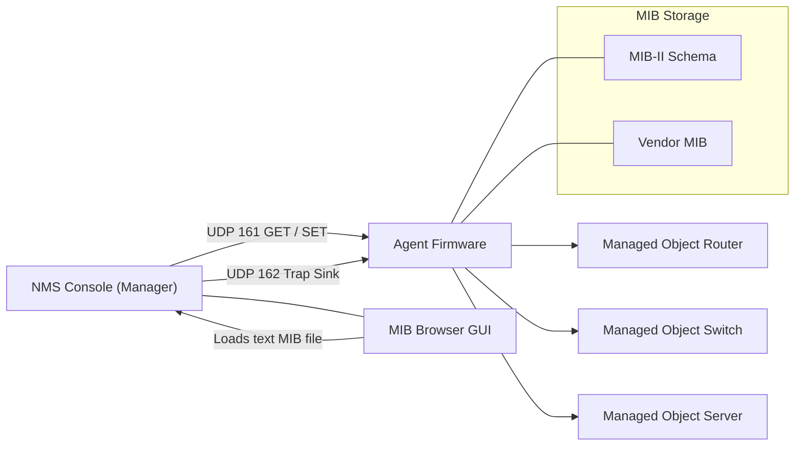
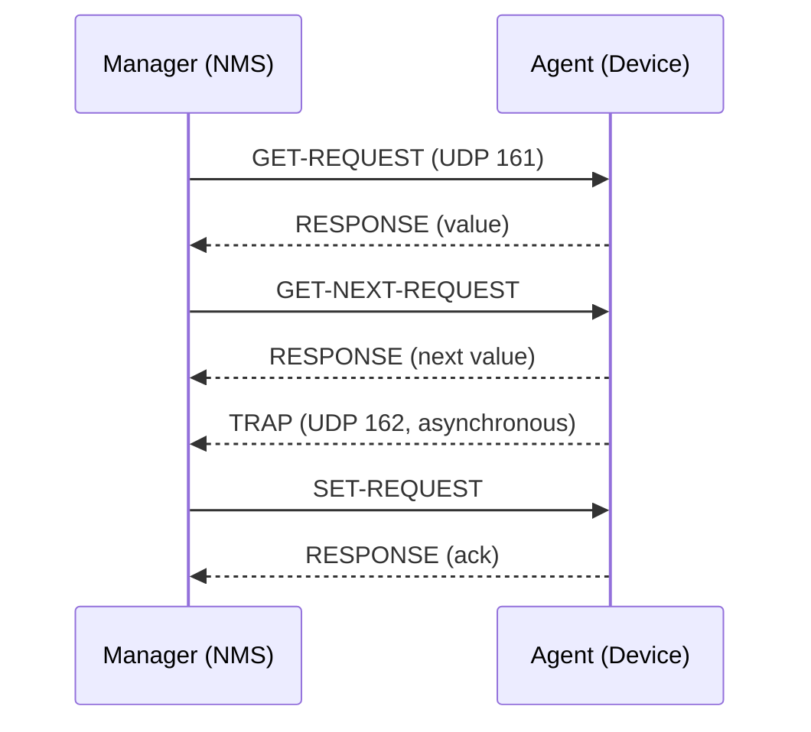
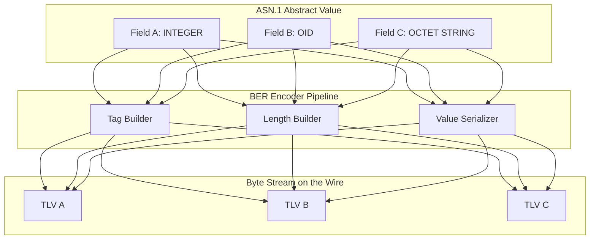
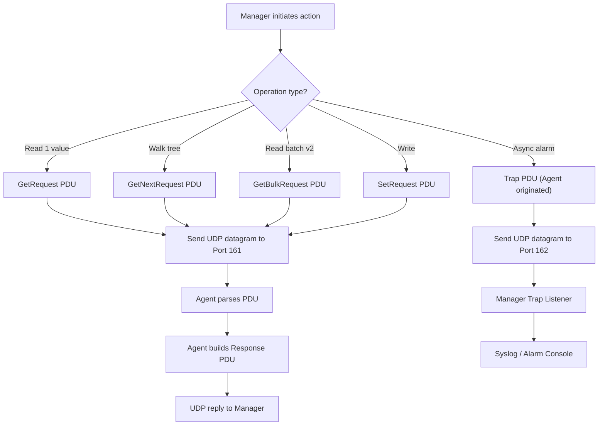

# SNMP, ASN.1 (Book 1 Ch 9)

<!-- SECTION_1_START -->
# Computer Networks — Module 4: Network Management, SNMP & ASN.1

## 1. Core Technical Definition & Intuitive Overview

### 1.1 Network Management (NM)
> [!IMPORTANT]
> **Formal Definition (KTU 2024 Syllabus Terminology):**
> *Network Management* refers to the set of activities, tools, and procedures used to **monitor**, **control**, **provision**, and **diagnose** resources in a telecommunications or computer network so that the network conforms to the **FCAPS** model: **F**ault, **C**onfiguration, **A**counting, **A**uditing (or Administration), **P**erformance, and **S**ecurity.

The **Internet Standard Network Management Framework** adopted by the IETF (and tested in KTU 2024 Scheme Module 4) consists of **three tightly-coupled components**:

| Component | Role | Data Plane | Defined By |
|---|---|---|---|
| **SMI** — Structure of Management Information | The "Grammar" — how managed objects are *named* and *described* | MIB definition rules | RFC 1155, 2578, 2580 |
| **MIB** — Management Information Base | The "Schema/Database" — what objects are *exposed* | Group of managed objects | RFC 1156, 1213, 3418 |
| **SNMP** — Simple Network Management Protocol | The "Messenger" — how the manager *talks* to the agent | PDU exchange on UDP | RFC 1157, 3411–3418 |

### 1.2 SNMP (Simple Network Management Protocol)

> [!NOTE]
> **SNMP is an application-layer protocol** (Layer 7 of the **OSI/TCP-IP** reference model) used by a **Network Management Station (NMS / Manager)** to query and control **Agents** embedded inside network devices (routers, switches, servers, printers, UPS units, etc.).

**Intuitive Analogy — The Restaurant Scenario:**
*   Think of a **Network** as a giant restaurant with thousands of tables (devices).
*   The **Manager (NMS)** is the Head Waiter who must know the status of every table.
*   The **Agent** is a junior waiter permanently stationed at each table. He keeps a small **chalkboard (MIB)** with key facts: “Customer #1 has been waiting 12 min”, “Soup bowl is half full”, “Bill requested”.
*   **SNMP** is the *language* the Head Waiter uses to *ask* (GET), *ask what is next* (GET-NEXT), *change* (SET), or *receive an alarm* (TRAP).
*   **SMI** is the *fixed format* of the chalkboard entries (always: Name, Type, Access).
*   **ASN.1** is the *universal alphabet* used to write on the chalkboard so that waiters from different restaurants (vendors) can read each other.

### 1.3 ASN.1 (Abstract Syntax Notation One)

> [!IMPORTANT]
> **ASN.1** is an **ISO/ITU-T standard (X.680 series)** for describing data structures in a *machine-independent*, *transport-independent* way. It defines the **abstract syntax** (the logical layout of a packet), and pairs it with the **Basic Encoding Rules (BER)** — a concrete bit-and-byte **transfer syntax** that puts the abstract data onto the wire.

**Intuitive Analogy — The Universal Shipping Container:**
*   Two computers (one little-endian Linux, one big-endian mainframe) need to exchange a record `{ port = 80, state = "OPEN" }`.
*   Without a common alphabet, byte ordering and integer size would cause silent corruption.
*   **ASN.1** acts like a *shipping container standard* — every field is stamped with three pieces of information: **WHAT type** (Tag), **HOW LONG** (Length), **HOW HEAVY** (Value). The receiver opens the container by reading the stamp first.

> [!VISUALIZATION CONTROL]
> **Concept:** Byte-by-byte unwrapping of an ASN.1 BER-encoded PDU.
> **GeoGebra / Desmos Input Equations:**
> * `x_1 = Tag(8 bits)` , `x_2 = Length(8 bits or 8n+8 bits)` , `x_3 = Value(n*8 bits)`
> * `Total\_Bytes(x) = 1 + L(x) + V(x)`
> **Visual Description:** Sketch three stacked rectangles on the number line: the leftmost 1-byte box is the *Tag*, the middle 1+ bytes are the *Length*, and the rightmost *V* bytes are the *Value*. The right edge of the rectangle lies at $1 + L + V$ on the x-axis.

### 1.4 Physical / Engineering Constants & Metrics

*   **Default UDP Port for SNMP Agent:** $\mathbf{161}$ (queries from manager).
*   **Default UDP Port for SNMP Manager (Trap receiver):** $\mathbf{162}$ (asynchronous alarms from agent).
*   **Community Strings (v1/v2c):** `public` (read), `private` (write) — transmitted in **cleartext** (insecurity pitfall).
*   **Encodings used by SNMPv3:** **MD5** or **SHA** for authentication; **DES**, **AES** for privacy.
*   **Object Identifier (OID) root for Internet MIB:** `iso.org.dod.internet` $\rightarrow$ `1.3.6.1` $\rightarrow$ `mgmt` $\rightarrow$ `1.3.6.1.2.1`.
*   **Standard MTU tolerance for a single SNMP PDU:** typically **484 bytes** to **1500 bytes** (depends on transport).

<!-- SECTION_1_END -->

<!-- SECTION_2_START -->
# 2. Deep Theoretical Analysis & KTU High-Yield Formula Sheet

## 2.1 The Three-Tier Network Management Architecture

The Internet-NM framework is engineered as three stacked layers:

**Layer 1 — SMI (the *Schema Definition Language*)**
*   Defines the **data type** of every managed variable.
*   Defines the **naming tree** (the global **OID registry**).
*   Defines the **encoding** (delegated to ASN.1 / BER).

**Layer 2 — MIB (the *Schema Itself*)**
*   A *collection* of related managed objects grouped by function (e.g., `MIB-II`, `IF-MIB`, `TCP-MIB`).
*   Each object has a unique **Object Identifier (OID)** in the global tree.

**Layer 3 — SNMP (the *Communication Protocol*)**
*   Carries eight (originally five) message types between Manager $\leftrightarrow$ Agent.
*   Sits on top of **UDP** (connectionless, low overhead — fits the *simple* in SNMP).

## 2.2 SMI — Structure of Management Information

SMI imposes strict rules so that all MIBs are *uniform*:

1.  Every managed object is given a **name** as an **OID** (a dot-separated path from the root).
2.  Every managed object has a **data type** and an **access mode** (`read-only`, `read-write`, `not-accessible`, `accessible-for-notify`).
3.  Every managed object has a **status** (`mandatory`, `optional`, `obsolete`, `deprecated`).

> [!NOTE]
> **SMI v1** uses ASN.1's `INTEGER`, `OCTET STRING`, `Counter`, `Gauge`, `IpAddress`, `TimeTicks`, `OBJECT-TYPE`, etc.
> **SMI v2** adds `Integer32`, `Counter32`, `Counter64`, `Gauge32`, `OCTET STRING (SIZE 0..255)`, and 64-bit counters — required for high-speed links ($\geq$ 10 Gbps where 32-bit counters wrap in seconds).

## 2.3 MIB — Management Information Base

A MIB module is essentially an ASN.1 module with a `MODULE-IDENTITY` macro and a flat list of `OBJECT-TYPE` definitions. Example: `MIB-II` (`RFC 1213`) defines ~180 objects grouped under:
*   `system` (1) — `sysDescr`, `sysUpTime`, `sysContact`, `sysName`, `sysLocation`.
*   `interfaces` (2) — `ifNumber`, `ifTable` (one row per interface).
*   `at` (3) — Address Translation (deprecated, ARP cache).
*   `ip`, `icmp`, `tcp`, `udp`, `egp`, `transmission`, `snmp` (10, 11) — protocol-specific counters.

## 2.4 SNMP Protocol — The Five (Eight) PDUs

| PDU Name | PDU \# | Direction | Purpose |
|---|---|---|---|
| `GetRequest` | 0 | Manager $\rightarrow$ Agent | Retrieve the value of **one** object. |
| `GetNextRequest` | 1 | Manager $\rightarrow$ Agent | Retrieve the value of the **next** object (used for *table walk* / tree traversal). |
| `Response` | 2 | Agent $\rightarrow$ Manager | Reply carrying a value, an `error-status`, and an `error-index`. |
| `SetRequest` | 3 | Manager $\rightarrow$ Agent | Modify (write) the value of an object. |
| `Trap` | 4 | Agent $\rightarrow$ Manager (UDP 162) | Asynchronous *unsolicited* alarm (link down, cold start, authentication failure). |
| `GetBulkRequest` | 5 | Manager $\rightarrow$ Agent (v2) | Retrieve a *batch* of values in one round-trip (replaces iterative GET-NEXT). |
| `InformRequest` | 6 | Manager $\rightarrow$ Manager (v2) | Acknowledged trap between two managers. |
| `Report` | 8 | Agent $\rightarrow$ Manager (v3) | Engine-to-engine report (decryption error, time synchronization). |

## 2.5 ASN.1 — The Encoding Alphabet

**Tag** (1 byte usually):
*   Top 2 bits = **Class**: `00` Universal, `01` Application, `10` Context-specific, `11` Private.
*   Bit 5 = **P/C**: `0` Primitive, `1` Constructed.
*   Last 5 bits = **Tag Number** (0–30); if $\geq$ 31, multi-byte form.

**Length**:
*   **Short Form** (single byte, MSB=0): `L = 0…127`.
*   **Long Form** (first byte MSB=1, lower 7 bits = $n$, followed by $n$ bytes for the value length).

**Value**:
*   Length depends entirely on the Tag/Type. For a constructed type (e.g., `SEQUENCE`, `SET`), the value is itself a concatenation of other TLPs (Tag-Length-Value triplets).

## 2.6 KTU High-Yield Formula Sheet (Quick Revision)

| Symbol / Item | Definition | Typical Value / Range | Engineering Use |
|---|---|---|---|
| $T(x)$ | Tag byte(s) of field $x$ | 1 or more bytes | Wire-format parsing |
| $L(x)$ | Length field of $x$ | 1, 2, 3, 4, 5 bytes | Buffer allocation |
| $V(x)$ | Value field of $x$ | 0 … $2^{127}-1$ bytes | Payload |
| $OID$ | Globally unique dotted path | Example: `1.3.6.1.2.1.1.1.0` | Variable identification |
| $Counter32$ | 32-bit wrap-around counter | $0$ … $2^{32}-1$ | Octets/packets received |
| $Counter64$ | 64-bit wrap-around counter | $0$ … $2^{64}-1$ | High-speed link octets |
| $Gauge32$ | Non-negative peak-reading value | $0$ … $2^{32}-1$ | Queue depth, temperature |
| $TimeTicks$ | Hundredths of a second since boot | $0$ … $2^{32}-1$ | `sysUpTime` |
| $Port_A$ | Agent UDP port | **161** | Manager $\to$ Agent traffic |
| $Port_M$ | Manager UDP port (trap sink) | **162** | Agent $\to$ Manager traps |
| $BER_{total}$ | Total encoded size | $BER_{total} = \sum_i (1 + L_i + V_i)$ | Memory budgeting |

> [!TIP]
> **Why these engineering numbers matter in production:**
> *   *32-bit counters* at 10 Gbps wrap in $\approx 3.4$ seconds — that is why **Counter64** (SMIv2) exists in modern `IF-MIB`.
> *   *UDP* is chosen over TCP because SNMP traffic is short, lossy-tolerant, and must not congest the control plane.
> *   *BER* uses **TLV** because it allows a decoder to *skip* an unknown field — crucial for protocol extensibility.

<!-- SECTION_2_END -->

<!-- SECTION_3_START -->
# 3. Step-by-Step Derivations, Encoding Walkthroughs & Python Implementation

## 3.1 Derivation 1 — ASN.1 BER Encoding Rule Set

The **Basic Encoding Rules (BER)** define how any ASN.1 value is flattened onto the wire. We define a generic encoder that produces a triplet $(T, L, V)$:

$$
\begin{aligned}
\text{Encoded}(x) &= T(x) \,\|\, L(x) \,\|\, V(x) \\
T(x) &= \text{Class}_x \cdot 2^{6} \;+\; \text{PC}_x \cdot 2^{5} \;+\; \text{TagNo}_x \\
L(x) &=
\begin{cases}
\text{ShortForm}: & n \in [0, 127],\; \text{one byte } 0n \\
\text{LongForm}:  & \text{first byte } 1n,\; \text{then } n \text{ big-endian length bytes} \\
\end{cases} \\
V(x) &= \text{Concrete bytes per ASN.1 type}
\end{aligned}
$$

### 3.1.1 Worked Example — Encode the Integer 100

The type `INTEGER` is *Universal*, *Primitive*, tag number **2**.

**Step 1 — Tag byte:**
*   Class = `00` (Universal).
*   P/C = `0` (Primitive).
*   Tag No = `00010` (binary 2).
*   Byte = `00000010` = `0x02` $\rightarrow$ **1 byte**.

**Step 2 — Length byte:**
*   Value is the signed two's-complement encoding of $+100$.
*   Positive integers in BER keep the sign bit clear $\rightarrow$ use 1 byte = `0x64`.
*   Length = 1 $\rightarrow$ short form, single byte `0x01` $\rightarrow$ **1 byte**.

**Step 3 — Value byte:**
*   $+100$ in one byte = `01100100` = `0x64` $\rightarrow$ **1 byte**.

**Final encoded TLV triplet (hex):**
`02 01 64` $\rightarrow$ total **3 bytes**.

### 3.1.2 Worked Example — Encode the OID `1.3.6.1.2.1`

The type `OBJECT IDENTIFIER` is *Universal*, *Primitive*, tag number **6**.

**Step 1 — Encode the OID digits (X.690 §8.19):**
*   First two arcs are encoded in a single byte: $40 \cdot X_1 + X_2$.
*   For `1.3` $\rightarrow$ $40 \cdot 1 + 3 = 43 = 0x2B$.
*   Remaining arcs: `6.1.2.1` — each $<128$ fits in one byte.
*   Encoded sub-identifiers (hex): `2B 06 01 02 01` $\rightarrow$ **5 bytes**.

**Step 2 — Tag byte:**
*   Class `00`, P/C `0`, Tag No `6` $\rightarrow$ `0x06` $\rightarrow$ **1 byte**.

**Step 3 — Length byte:**
*   Value length = 5 $\rightarrow$ short form, `0x05` $\rightarrow$ **1 byte**.

**Final encoded TLV triplet (hex):**
`06 05 2B 06 01 02 01` $\rightarrow$ total **7 bytes**.

### 3.1.3 Worked Example — Encode the OCTET STRING `"SNMP"` (4 chars, ASCII)

*   Tag = `0x04` (Universal, Primitive, tag 4).
*   Length = 4 $\rightarrow$ `0x04`.
*   Value = `0x53 0x4E 0x4D 0x50` ($\text{S}, \text{N}, \text{M}, \text{P}$).
*   Final: `04 04 53 4E 4D 50` $\rightarrow$ total **6 bytes**.

### 3.1.4 Worked Example — Encode the SEQUENCE `{ INTEGER 100, NULL }`

A `SEQUENCE` is *Universal*, *Constructed*, tag number **16** $\rightarrow$ tag byte = `0x30`. Its value is a *concatenation* of the inner TLVs:

$$
\begin{aligned}
\text{Value}_{SEQUENCE} &= \text{TLV}(INTEGER, 100) \,\|\, \text{TLV}(NULL) \\
\text{TLV}(INTEGER, 100) &= \texttt{02 01 64} \quad (\text{3 bytes}) \\
\text{TLV}(NULL) &= \texttt{05 00} \quad (\text{0-byte value, 2 bytes}) \\
\text{Value}_{SEQUENCE} &= \texttt{02 01 64 05 00} \quad (\text{5 bytes}) \\
L &= 5 \rightarrow \texttt{0x05} \\
\text{Final TLV} &= \texttt{30 05 02 01 64 05 00} \quad (\text{7 bytes})
\end{aligned}
$$

## 3.2 Derivation 2 — SNMPv1 `GetRequest` PDU Walkthrough

A `GetRequest` PDU (Tag = `0xA0`, context-specific, constructed, tag 0) carries:

$$
\begin{aligned}
PDU_{Get} &= \underbrace{0xA0}_{Tag} \;\|\; \underbrace{Len}_{Length} \;\|\; \underbrace{(req\text{-}id, err\text{-}stat, err\text{-}idx, VarBindList)}_{Value} \\
VarBindList &= SEQUENCE \;OF\; \text{SEQUENCE}\{\text{name},\;\text{value}\} \\
\end{aligned}
$$

Suppose we ask for `sysDescr.0` (OID `1.3.6.1.2.1.1.1.0`) with request-ID = 1, error-status = 0, error-index = 0, and value = `NULL` (placeholder).

| Sub-field | ASN.1 Type | Hex Bytes | Length |
|---|---|---|---|
| PDU Tag | Context-Constructed 0 | `A0` | 1 |
| PDU Length | Short form | `1E` (30 dec) | 1 |
| Request ID | INTEGER = 1 | `02 01 01` | 3 |
| Error Status | INTEGER = 0 | `02 01 00` | 3 |
| Error Index | INTEGER = 0 | `02 01 00` | 3 |
| VarBindList | SEQUENCE OF | `30 0F` | 2 |
| VarBind | SEQUENCE | `30 0D` | 2 |
| Name (OID) | OBJECT IDENTIFIER | `06 05 2B 06 01 02 01` | 7 |
| Value | NULL | `05 00` | 2 |

Concatenated payload: `1E 02 01 01 02 01 00 02 01 00 30 0F 30 0D 06 05 2B 06 01 02 01 05 00` (length = 30, matches the `0x1E` length byte).

## 3.3 Production-Grade Python Implementation (BER Encoder)

```python
"""
ber_encoder.py
--------------
A production-grade, type-hinted Basic Encoding Rules (BER) encoder
for the ASN.1 primitives used by SNMP / MIB modules.
Tested on Python 3.10+. No third-party dependencies.
"""
from __future__ import annotations
from typing import List, Tuple, Union
import struct
import logging

logging.basicConfig(level=logging.INFO,
                    format="%(asctime)s [%(levelname)s] %(message)s")
log = logging.getLogger("ber_encoder")

# --------------------------------------------------------------------------
# Tag class constants (top two bits of the tag byte)
# --------------------------------------------------------------------------
CLASS_UNIVERSAL   = 0b00
CLASS_APPLICATION = 0b01
CLASS_CONTEXT     = 0b10
CLASS_PRIVATE     = 0b11

PC_PRIMITIVE   = 0b0
PC_CONSTRUCTED = 0b1


def encode_tag(cls: int, pc: int, tag_no: int) -> bytes:
    """Encode a single-byte ASN.1 tag. Raises ValueError for invalid input."""
    if not 0 <= cls <= 0b11:
        raise ValueError(f"Invalid class bits: {cls:#04b}")
    if pc not in (PC_PRIMITIVE, PC_CONSTRUCTED):
        raise ValueError(f"Invalid P/C bit: {pc}")
    if not 0 <= tag_no <= 30:
        raise ValueError(f"Long-form tags not supported, got {tag_no}")
    byte = (cls << 6) | (pc << 5) | tag_no
    return bytes([byte])


def encode_length(length: int) -> bytes:
    """Encode the length field in short or long form."""
    if length < 0:
        raise ValueError("Length must be non-negative")
    if length <= 127:                      # short form
        return bytes([length])
    out: List[int] = []
    n = length
    while n > 0:
        out.insert(0, n & 0xFF)
        n >>= 8
    if len(out) > 127:
        raise OverflowError("BER length exceeds 127 octets of long-form")
    return bytes([0x80 | len(out)]) + bytes(out)


def encode_integer(value: int) -> bytes:
    """BER-encode a signed INTEGER using minimum two's-complement bytes."""
    if value == 0:
        payload = b"\x00"
    else:
        # Compute required signed bytes
        nbytes = (value.bit_length() + 8) // 8  # +1 for sign, then round
        payload = value.to_bytes(nbytes, "big", signed=True)
    return encode_tag(CLASS_UNIVERSAL, PC_PRIMITIVE, 2) \
           + encode_length(len(payload)) + payload


def encode_octet_string(data: Union[bytes, str]) -> bytes:
    raw = data.encode("utf-8") if isinstance(data, str) else data
    return encode_tag(CLASS_UNIVERSAL, PC_PRIMITIVE, 4) \
           + encode_length(len(raw)) + raw


def encode_null() -> bytes:
    return encode_tag(CLASS_UNIVERSAL, PC_PRIMITIVE, 5) + b"\x00"


def encode_oid(oids: Tuple[int, ...]) -> bytes:
    if len(oids) < 2:
        raise ValueError("OID must have at least two arcs")
    if oids[0] not in (0, 1, 2) or oids[1] not in range(0, 40):
        raise ValueError(f"Invalid first two arcs: {oids[:2]}")
    encoded: List[int] = [oids[0] * 40 + oids[1]]
    for arc in oids[2:]:
        if arc < 0:
            raise ValueError("Negative OID arcs not supported")
        stack: List[int] = []
        n = arc
        stack.append(n & 0x7F)
        n >>= 7
        while n:
            stack.append(0x80 | (n & 0x7F))
            n >>= 7
        encoded.extend(reversed(stack))
    payload = bytes(encoded)
    return encode_tag(CLASS_UNIVERSAL, PC_PRIMITIVE, 6) \
           + encode_length(len(payload)) + payload


def encode_sequence(payload: bytes, constructed: bool = True) -> bytes:
    pc = PC_CONSTRUCTED if constructed else PC_PRIMITIVE
    return encode_tag(CLASS_UNIVERSAL, pc, 16) \
           + encode_length(len(payload)) + payload


def encode_snmp_getrequest(req_id: int,
                            err_status: int,
                            err_index: int,
                            varbinds: List[Tuple[Tuple[int, ...], bytes]]) -> bytes:
    """Build an SNMPv1 GetRequest PDU. varbinds = [(OID, placeholderValue)]"""
    inner_pdu = encode_integer(req_id) \
                + encode_integer(err_status) \
                + encode_integer(err_index)
    vb_list_payload = b""
    for oid, val in varbinds:
        vb_payload = encode_oid(oid) + val
        vb_list_payload += encode_sequence(vb_payload)
    inner_pdu += encode_sequence(vb_list_payload)
    return encode_tag(CLASS_CONTEXT, PC_CONSTRUCTED, 0) \
           + encode_length(len(inner_pdu)) + inner_pdu


# ----------------------------------------------------------------------
# Demonstration / Self-test
# ----------------------------------------------------------------------
if __name__ == "__main__":
    # 1) Verify INTEGER 100 == 02 01 64
    assert encode_integer(100).hex() == "020164", "INTEGER test failed"
    log.info("INTEGER 100 -> %s", encode_integer(100).hex())

    # 2) Verify OID 1.3.6.1.2.1
    assert encode_oid((1, 3, 6, 1, 2, 1)).hex() == "06052b06010201", "OID test failed"
    log.info("OID 1.3.6.1.2.1 -> %s", encode_oid((1, 3, 6, 1, 2, 1)).hex())

    # 3) Verify OCTET STRING "SNMP" == 04 04 53 4E 4D 50
    assert encode_octet_string("SNMP").hex() == "0404534e4d50", "OCTET STRING failed"
    log.info("OCTET STRING 'SNMP' -> %s", encode_octet_string("SNMP").hex())

    # 4) Build a complete SNMP GetRequest for sysDescr.0
    pdu = encode_snmp_getrequest(
        req_id=1, err_status=0, err_index=0,
        varbinds=[((1, 3, 6, 1, 2, 1, 1, 1, 0), encode_null())]
    )
    log.info("Full GetRequest PDU (hex) = %s", pdu.hex())
```

<!-- SECTION_3_END -->

<!-- SECTION_4_START -->
# 4. Structural Diagrams & Schematics

## 4.1 Network Management — High-Level Architecture



## 4.2 SNMP PDU Exchange — Sequence Diagram



## 4.3 ASN.1 BER TLV Encoder Block Architecture



## 4.4 SNMP Manager / Agent Decision Topology Matrix



<!-- SECTION_4_END -->

<!-- SECTION_5_START -->
# 5. KTU 2024 Scheme Examination Question Bank & Topic Recap

---

### Part A — Short Answer Questions (3 Marks Each)

#### Question 1 (3 Marks)  `[KTU University Exam – July 2023]`
**Differentiate between SMI, MIB, and SNMP. State the OSI layer at which SNMP operates.**  
*(Mapped CO: CO3 | RBT Level: Understand)*

**Model Answer (3 marks):**

| Component | Meaning | Function |
|---|---|---|
| **SMI** | Structure of Management Information | Defines the *general rules* for naming objects (OID), defining their data types, and access modes. |
| **MIB** | Management Information Base | A *collection* of managed objects pertaining to a device, described using SMI. |
| **SNMP** | Simple Network Management Protocol | The *application-layer* protocol (Layer 7) that the manager uses to *read/write* objects exposed in the MIB. |

*   **[1 Mark] — Defining SMI** (rule for naming, types, access).
*   **[1 Mark] — Defining MIB** (collection of managed objects / schema).
*   **[1 Mark] — Defining SNMP and stating application layer.**

---

#### Question 2 (3 Marks)  `[KTU University Exam – Dec 2022]`
**List any three SNMP operations (PDU types) and state one specific use of each.**  
*(Mapped CO: CO3 | RBT Level: Remember)*

**Model Answer (3 marks):**
1.  **GetRequest (0)** — Used by the manager to *retrieve the value* of a single MIB object. **[1 Mark]**
2.  **GetNextRequest (1)** — Used by the manager to *retrieve the lexicographically next* object in the MIB tree, enabling *table walks*. **[1 Mark]**
3.  **SetRequest (3)** — Used by the manager to *modify* (write) the value of a configurable MIB object (e.g., changing an interface description). **[1 Mark]**

*(Examiner may also accept Trap, GetBulk, Inform.)*

> [!WARNING]
> **KTU Examiner's Valuation Pitfall:** Students often write only the *name* of the PDU and forget the *direction* (Manager $\rightarrow$ Agent or vice versa). Always state the direction to claim full credit.

---

### Part B — Full 14-Mark Questions (ESE Module Internal Choice)

---

#### ✦ Question Choice A (14 Marks)  `[KTU University Exam – July 2024]`

**(a)** With a neat diagram, explain the **SNMP network management model** in detail. Discuss the role of the *Manager*, *Agent*, *MIB*, and *SMI*. **(7 Marks)**  
*(Mapped CO: CO3 | RBT Level: Understand)*

**(b)** Encode the following ASN.1 value using **BER (TLV)** rules and show the full hexadecimal byte stream:
```
sysDescr  OBJECT-TYPE
    SYNTAX  OCTET STRING (SIZE 0..255)
    ACCESS  read-only
    STATUS  mandatory
    ::= { system 1 }
```
Assume the *value* of `sysDescr` is the ASCII string `"Router1"`. Show the encoding of the **OID `1.3.6.1.2.1.1.1`** and the **value `"Router1"`** as TLV triplets. **(7 Marks)**  
*(Mapped CO: CO4 | RBT Level: Apply)*

**Model Solution (a) — 7 Marks:**

1.  **[Diagram — 3 Marks]** Draw the four-block architecture:
    *   **Manager (NMS)** running polling/control software.
    *   **Agent** process running inside the managed device.
    *   **MIB** — virtual database of objects maintained by the agent.
    *   **SMI** — rules that define the structure of the MIB.
2.  **[Role of Manager — 1 Mark]** Sends `GetRequest`, `GetNextRequest`, `SetRequest` to the agent; receives `Response`, `Trap`.
3.  **[Role of Agent — 1 Mark]** Maintains MIB; replies to manager's requests; sends traps on threshold violation.
4.  **[Role of MIB — 1 Mark]** Schema of all managed objects; only objects in the MIB are accessible.
5.  **[Role of SMI — 1 Mark]** Defines the *universal grammar*: object name (OID), syntax (data type), access (read-only / read-write), and status (mandatory / optional).

**Model Solution (b) — 7 Marks:**

Step 1 — Tag for OID = `06` (Universal, Primitive, tag 6).  
Step 2 — Encode the OID `1.3.6.1.2.1.1.1`:
*   First two arcs $\to$ $1 \cdot 40 + 3 = 43 = 0x2B$.
*   Remaining arcs `6, 1, 2, 1, 1, 1` are all $<128$ $\to$ one byte each.
*   OID payload (hex) = `2B 06 01 02 01 01 01` (7 bytes).
Step 3 — Length = 7 $\to$ `0x07`.
Step 4 — **OID TLV = `06 07 2B 06 01 02 01 01 01`** **[2 Marks]**

Step 5 — Tag for OCTET STRING = `04`.  
Step 6 — ASCII `"Router1"` = `52 6F 75 74 65 72 31` (7 bytes).  
Step 7 — Length = 7 $\to$ `0x07`.  
Step 8 — **Value TLV = `04 07 52 6F 75 74 65 72 31`** **[2 Marks]**

Step 9 — If a `SEQUENCE` wrapper is asked (variable binding = `SEQUENCE { name, value }`):  
*   Inner value payload = `(OID TLV) || (Value TLV)` = `06 07 2B ... 04 07 52 ...` (17 bytes).  
*   SEQUENCE tag = `30`, length = 17 $\to$ `0x11`.  
*   **SEQUENCE TLV = `30 11 06 07 2B 06 01 02 01 01 01 04 07 52 6F 75 74 65 72 31`** **[2 Marks]**

Step 10 — Wrap in VarBindList: another `SEQUENCE OF`. The result is a valid SNMP variable binding. **[1 Mark]**

> [!WARNING]
> **Examiner's Pitfall (ASN.1 BER):** A common mark-loss is *forgetting the first-arc compression* — students write OID as eight bytes (`01 03 06 01 02 01 01 01`) instead of seven bytes (`2B 06 01 02 01 01 01`). Always apply the rule $X_1 \cdot 40 + X_2$ for the first two arcs.

---

#### ✦ Question Choice B (14 Marks)  `[KTU University Exam – Dec 2023]`

**(a)** Explain the **five (original) SNMP PDU formats** with the help of a *PDU field diagram*. State the default UDP port numbers used by the agent and the manager. **(7 Marks)**  
*(Mapped CO: CO3 | RBT Level: Understand)*

**(b)** Given the BER-encoded SNMP value: `30 0A 02 01 05 04 05 41 42 43 44 45`, **decode** it step by step and identify the abstract value. **(7 Marks)**  
*(Mapped CO: CO4 | RBT Level: Apply)*

**Model Solution (a) — 7 Marks:**

| PDU Type | Tag (Context) | Request-ID | Error-Status | Error-Index | VarBindList |
|---|---|---|---|---|---|
| `GetRequest` | `A0` | INTEGER | INTEGER | INTEGER | SEQUENCE OF |
| `GetNextRequest` | `A1` | INTEGER | INTEGER | INTEGER | SEQUENCE OF |
| `Response` | `A2` | INTEGER | INTEGER | INTEGER | SEQUENCE OF |
| `SetRequest` | `A3` | INTEGER | INTEGER | INTEGER | SEQUENCE OF |
| `Trap` | `A4` | Enterprise + Agent Addr + Generic Trap + Specific Trap + Time-stamp | | | SEQUENCE OF |

1.  **[PDU field diagram — 3 Marks]** show tag + req-id + err-status + err-index + VarBindList.
2.  **[Five PDU names with purpose — 2 Marks]**.
3.  **[Default ports — 2 Marks]**: Agent $\to$ **UDP 161**, Manager trap sink $\to$ **UDP 162**.

**Model Solution (b) — 7 Marks:**

We perform *recursive TLV decoding* (sometimes called the *chase-the-tag* method).

*   Read first byte `0x30`: class `00` (Universal), constructed `1`, tag-no `16` $\to$ **SEQUENCE**. **[1 Mark]**
*   Read next byte `0x0A` = 10 $\to$ short-form length, **10 bytes of payload**. **[1 Mark]**
*   Inside the 10-byte payload, byte 1 is `0x02`: Universal, Primitive, tag-no 2 $\to$ **INTEGER**. Length `0x01`, value `0x05` $\to$ **INTEGER = 5**. **[2 Marks]**
*   Bytes 4–6 are `0x04 0x05 0x41`: Universal, Primitive, tag-no 4 $\to$ **OCTET STRING**. Length `0x05` $\to$ read 5 bytes `41 42 43 44 45` = ASCII `"ABCDE"`. **[2 Marks]**
*   The abstract value is therefore **`SEQUENCE { INTEGER 5, OCTET STRING "ABCDE" }`**. **[1 Mark]**

> [!WARNING]
> **Examiner's Pitfall (BER Decoding):** The most common decoding error is *not respecting the length field* — students often read until end of buffer instead of stopping at `L` bytes. Always honour the length boundary, then *recurse* into the next TLV from byte $1 + L + 1$.

---

### Topic Recap & Important Things to Remember

*   **FCAPS** = Fault, Configuration, Accounting, Auditing, Performance, Security — the *umbrella* of network management.
*   The Internet NM framework = **SMI + MIB + SNMP** — three layers, not a single protocol.
*   **SMI** = grammar (data types, naming tree, access modes).
*   **MIB** = a *collection* of managed objects described using SMI grammar.
*   **SNMP** = the application-layer messaging protocol on top of **UDP**.
*   **Agent** listens on **UDP 161**; **Manager** (trap sink) listens on **UDP 162**.
*   Original five PDUs = `GetRequest (0)`, `GetNextRequest (1)`, `Response (2)`, `SetRequest (3)`, `Trap (4)`.
*   v2/v3 additions = `GetBulk (5)`, `Inform (6)`, `Report (8)`.
*   **SNMPv3** adds authentication (MD5/SHA) and privacy (DES/AES) — fixes the cleartext community-string flaw.
*   **ASN.1** = abstract syntax (X.680); **BER** = transfer syntax (X.690).
*   BER = **T-L-V** triplet on the wire for *every* field, primitive or constructed.
*   Tag byte: top 2 bits = class (`00 U`, `01 A`, `10 C`, `11 P`), bit 5 = P/C, lower 5 bits = tag number.
*   Length: **short form** if $\leq 127$, **long form** (`1n …`) for larger.
*   OID first two arcs are *compressed* into one byte: $X_1 \cdot 40 + X_2$.
*   `INTEGER` in BER is signed two's-complement, minimum bytes (e.g., 0 still needs `0x00` to remain non-negative).
*   `NULL` is `0x05 0x00` — placeholder for unset values in `GetRequest`/`SetRequest`.
*   `SEQUENCE` and `SET` are **constructed** types — their value is a *concatenation* of inner TLVs.
*   `Counter32` wraps every $\approx 4.29 \times 10^9$ ticks — use `Counter64` for $\geq 10$ Gbps interfaces.
*   SMIv2 introduces 64-bit counters, `Integer32`, `Gauge32`, textual conventions, and module-compliance clauses.
*   Production tip: always pre-size your BER decoder buffer to at least $1 + L_{longform} + V$ to avoid buffer overflows on hostile inputs.

<!-- SECTION_5_END -->
