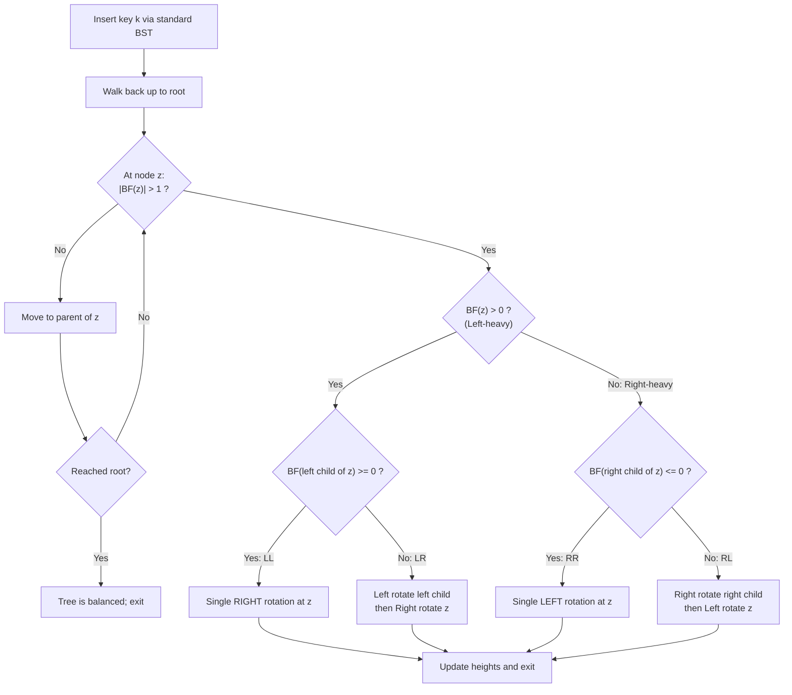
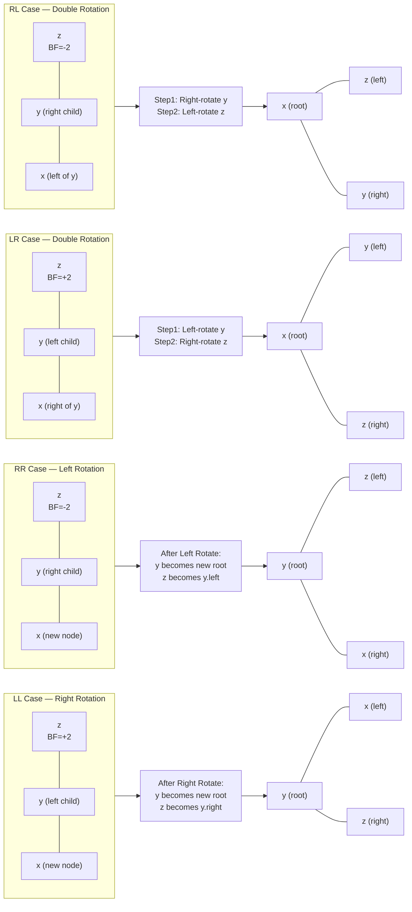
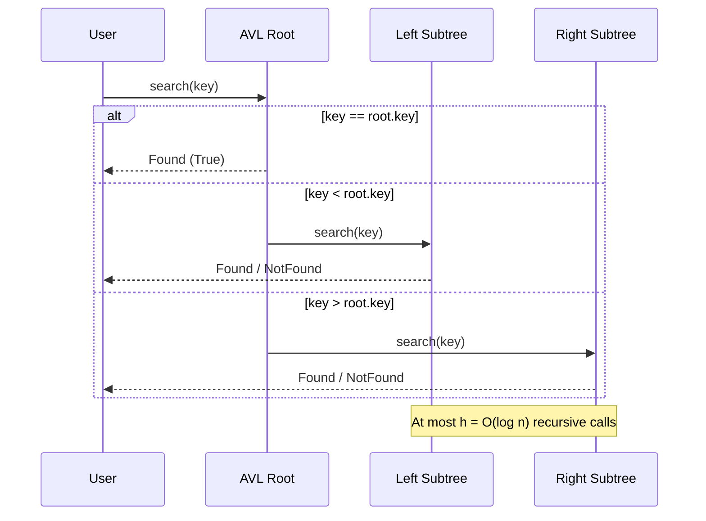

# Advanced Data Structures: Balanced Search Trees—AVL Trees (insertion and deletion tracking, single/double rotations)

<!-- SECTION_1_START -->
# Advanced Data Structures: Balanced Search Trees — AVL Trees

> [!IMPORTANT]
> **KTU 2024 Scheme | PCCST502 — Design and Analysis of Algorithms | Module 1**
> **Course Outcomes Mapped:** CO1 — *Apply asymptotic notations and analyse complexity of algorithms using standard algorithmic techniques.*
> **Cognitive Target:** Understand, Apply, Analyse (Bloom Levels 2, 3, 4)

---

## 1.1 Formal Definition (KTU-Syllabus Aligned)

> [!NOTE]
> **Definition (AVL Tree — Adelson-Velsky and Landis, 1962):**
> An **AVL Tree** is a *self-balancing Binary Search Tree (BST)* in which, for **every node** of the tree, the **heights of the left and right subtrees differ by at most one**. This difference is captured by the **Balance Factor (BF)**.

The **Balance Factor** of a node $x$ is defined as:

$$BF(x) = h(\text{leftSubtree}(x)) - h(\text{rightSubtree}(x))$$

The **invariants** that MUST hold for every node $x$ in a valid AVL tree are:

$$BF(x) \in \{-1,\, 0,\, +1\}$$

If any node violates this invariant after an insertion or deletion, a sequence of **rotations** is triggered to restore the global balance property.

> [!IMPORTANT]
> **Standard Metrics to Memorise (Board-Favourite Constants):**
> - Height of AVL tree with $n$ nodes: $h \le 1.44 \cdot \log_2(n+2) - 0.328$ ⇒ effectively $\mathbf{O(\log n)}$
> - Minimum number of nodes for height $h$: $N(h) = N(h-1) + N(h-2) + 1$, with $N(0)=1,\, N(1)=2$ (Fibonacci-like)
> - Worst-case **time complexity** of Search / Insert / Delete: $\mathbf{O(\log n)}$

---

## 1.2 Intuitive Analogy — "The Balanced Library"

Imagine a **library bookshelf** containing millions of books. If you keep adding books (insertions) only to the rightmost shelf, finding a specific book becomes painfully slow — you may need to scan the entire chain. This is the **skewed BST** problem (degenerates to $O(n)$).

> An **AVL tree is like a librarian who, after placing a new book, immediately checks if the shelf-stacks are "lopsided"** — if the left side is taller than the right by more than one book, the librarian **physically rearranges the top few books** (a *rotation*) so the shelf-stack remains **visually balanced**. This guarantees you never need to scan more than a logarithmic number of shelves to find any book.

**Geometric Intuition:** Think of a perfect **binary search tree** as a *pyramid* — perfectly symmetric. Insertions can cause a node to "tilt" left or right. A rotation is essentially picking up a subtree and **re-pivoting it** around a new root, like rotating a triangular tile in Tetris to fit a flat surface.

> [!VISUALIZATION CONTROL]
> **Concept:** Visualising the AVL Balance Invariant on a 2D plot
> **GeoGebra / Desmos Input Equations:**
> * `f(h) = 1.44 * log2(h + 2) - 0.328` (Upper bound on height vs. nodes)
> * `g(n) = (log2(n))` (Reference $\log n$ curve)
> **Visual Description:** Plot $h$ (height) on the y-axis against $n$ (number of nodes) on the x-axis. The AVL curve $f$ grows slightly faster than the ideal $g$ but is bounded — confirming $O(\log n)$ behaviour. The student should observe that even the *worst* AVL configuration never exceeds the $1.44 \log n$ line.
<!-- SECTION_1_END -->

<!-- SECTION_2_START -->
# 2. Deep Theoretical Analysis & KTU High-Yield Formula Sheet

## 2.1 The Balance Factor — Heart of the AVL Tree

| Property | Formula / Value | Meaning |
|---|---|---|
| Balance Factor of node $x$ | $BF(x) = h_L - h_R$ | $h_L$ = height of left subtree, $h_R$ = height of right subtree |
| Valid Range of $BF$ | $\{-1, 0, +1\}$ | Any value outside triggers rotation |
| Height of empty tree | $h(\text{NULL}) = -1$ | **Conventions differ — always state this in exams** |
| Height of single node | $h = 0$ | Single node has height $0$ |
| Lower bound on nodes | $N(h) = N(h-1) + N(h-2) + 1$ | Fibonacci-style recurrence |
| Upper bound on height | $h < 1.44 \cdot \log_2(n+2)$ | Worst-case height |
| Search / Insert / Delete | $O(\log n)$ | Guaranteed by balance property |

## 2.2 Why is AVL needed? — The Skewed BST Problem

In a plain BST, inserting keys in **sorted order** (e.g. $1, 2, 3, 4, 5, 6, 7$) produces a **degenerate linked-list-like tree** of height $h = n - 1$. Every operation degenerates to $O(n)$.

> [!IMPORTANT]
> AVL trees guarantee $O(\log n)$ in **all three operations** (search, insert, delete) by *paying a small fixed cost* — a constant number of rotations — after every structural modification. This is a classic example of the **amortised analysis** paradigm.

## 2.3 Rotations — The Building Blocks

There are **four imbalance cases** that arise at the **first imbalanced ancestor** $z$ on the path from the inserted/deleted node upward. Let $y$ = child of $z$ (taller side), and $x$ = child of $y$ (the newly inserted/affected side).

| Case | Imbalance Pattern | Rotation Type | Fix |
|---|---|---|---|
| **LL** (Left-Left) | Insertion in **left subtree of left child** of $z$ | **Single Right Rotation** at $z$ | One right rotation |
| **RR** (Right-Right) | Insertion in **right subtree of right child** of $z$ | **Single Left Rotation** at $z$ | One left rotation |
| **LR** (Left-Right) | Insertion in **right subtree of left child** of $z$ | **Double Rotation** (Left at $y$, then Right at $z$) | Two rotations |
| **RL** (Right-Left) | Insertion in **left subtree of right child** of $z$ | **Double Rotation** (Right at $y$, then Left at $z$) | Two rotations |

## 2.4 Operation Mechanics — "Why and How"

### 2.4.1 Right Rotation (Fixes LL Case)
- **Why:** The new node was inserted in the left-left position, making the left subtree "double-left-heavy".
- **How:** Promote the left child $y$ to take $z$'s place; $z$ becomes the right child of $y$; $y$'s original right child becomes $z$'s new left child. In-order traversal is **preserved** (this is what keeps it a valid BST).

### 2.4.2 Left Rotation (Fixes RR Case)
- **Why:** Mirror image of LL — the right subtree is double-right-heavy.
- **How:** Promote the right child $y$ to $z$'s place; $z$ becomes $y$'s left child; $y$'s original left child becomes $z$'s new right child.

### 2.4.3 Left-Right Double Rotation (Fixes LR Case)
- **Why:** Left child is right-heavy — a single rotation cannot fix it; the imbalance "wraps" around.
- **How:** First apply a **left rotation** on the left child $y$ (converts LR → LL), then apply a **right rotation** on $z$ (converts LL → balanced).

### 2.4.4 Right-Left Double Rotation (Fixes RL Case)
- **Why:** Mirror image — right child is left-heavy.
- **How:** First apply a **right rotation** on $y$, then a **left rotation** on $z$.

## 2.5 Real-World Engineering Utility

| Domain | Application |
|---|---|
| **Databases** | B-tree variants power indices; AVL is the conceptual ancestor of balanced disk structures |
| **In-Memory Dictionaries** | `std::map` in C++, `TreeMap` in Java, CPython's sorted containers use balanced BSTs |
| **Compilers** | Symbol tables storing identifiers with $O(\log n)$ lookup |
| **Network Routers** | Longest-prefix matching uses balanced tries |
| **OS Schedulers** | Some priority-queue structures are augmented AVLs |
| **Memory Allocators** | Buddy / slab allocators use balanced-tree free lists |

> [!IMPORTANT]
> AVL trees are preferred over Red-Black trees when **lookups dominate** (more reads than writes), because AVLs are **more strictly balanced** (lower height, faster search). Red-Black trees are preferred when **inserts/deletes dominate** (fewer rotations on average).
<!-- SECTION_2_END -->

<!-- SECTION_3_START -->
# 3. Step-by-Step Derivations, Worked Examples & Python Implementation

## 3.1 Worked Example 1 — Insertion Trace with Rotations

**Problem:** Insert the keys $\{30, 20, 40, 10, 25\}$ into an initially empty AVL tree. Show every step and any required rotation.

### Step 1: Insert 30
- Tree: `30` (height = 0)
- No imbalance. $BF(30) = 0$.

### Step 2: Insert 20
- Tree: `30` with left child `20` (BST order: $20 < 30$)
- Heights: $h(20)=0$, $h(\text{right of 30}) = -1$ ⇒ $BF(30) = 0 - (-1) = +1$ ✓ **Valid**

### Step 3: Insert 40
- Tree: `30` with `20` (L) and `40` (R)
- $BF(30) = 0 - 0 = 0$ ✓ **Valid**

### Step 4: Insert 10
- Tree: `20` becomes left child of `30`? No — $10 < 30$, go left to `20`; $10 < 20$, go left.
- Tree state:
```
       30
      /  \
    20    40
   /
  10
```
- Recompute BFs: $BF(10)=0$, $BF(20)=0 - (-1) = +1$, $BF(30)= 1 - 0 = +1$ ✓ **Still valid**

### Step 5: Insert 25
- Path: $25 < 30$ → go left to $20$; $25 > 20$ → go right.
- Tree state:
```
        30
       /  \
     20    40
    /  \
  10    25
```
- **Check balance from the inserted node upward:**
  - $BF(25) = 0$
  - $BF(20) = h(\text{left}=10) - h(\text{right}=25) = 0 - 0 = 0$ ✓
  - $BF(30) = h(\text{left}=20) - h(\text{right}=40) = 1 - 0 = +1$ ✓
- **Tree is balanced — no rotation needed.** Final AVL tree is valid.

### Worked Example 2 — Insertion triggering a Right Rotation (LL)

**Problem:** Insert $\{30, 20, 10\}$ — this is the canonical **LL imbalance**.

- Insert 30 → tree: `30`
- Insert 20 → tree: `30(L:20)`
- Insert 10 → tree: `30(L:20(L:10))`
  - $BF(20) = 0$, $BF(30) = 1 - (-1) = +2$ ❌ **Imbalance!**
  - The first imbalanced ancestor on the path is `30`. Its left child is `20`. The new node `10` is in the **left subtree of the left child** ⇒ **LL case**.
- **Apply Right Rotation at 30:**
  - New root: `20`; `30` becomes right child of `20`; `20`'s original right child (NULL) becomes `30`'s new left child.
- Result:
```
      20
     /  \
   10    30
```
- Verify: $BF(20) = 0$, $BF(10) = 0$, $BF(30) = 0$ ✓ **Balanced.**

### Worked Example 3 — Insertion triggering a Left-Right Rotation (LR)

**Problem:** Insert $\{30, 10, 20\}$.

- Insert 30, then 10, then 20:
```
       30
      /
    10
      \
      20
```
- $BF(10) = -1$, $BF(30) = 1 - (-1) = +2$ ❌
- Imbalance at `30`. Left child is `10`. New node `20` is in **right subtree of left child** ⇒ **LR case**.
- **Step A — Left rotation on 10:**
  - `20` becomes parent; `10` becomes left child of `20`; `20`'s original left (NULL) becomes `10`'s right.
```
      30
     /
   20
   /
  10
```
- **Step B — Right rotation on 30:**
  - `20` becomes root; `30` becomes right child of `20`; `20`'s original right (NULL) becomes `30`'s left.
```
      20
     /  \
   10    30
```
- **Balanced.** ✓

> [!NOTE]
> **Examiner's Tip:** When a problem says "trace the insertions and show all rotations", you MUST recompute $BF$ for **every ancestor** on the path from the inserted node to the root. The rotation is always anchored at the **first (deepest) imbalanced ancestor**.

---

## 3.2 Worked Example 4 — Deletion Trace

**Problem:** Build an AVL tree by inserting $\{50, 30, 70, 20, 40, 60, 80\}$, then **delete 30**.

### Build the tree first (no rotations needed for this set, as the tree stays balanced):
```
            50
          /    \
        30      70
       /  \    /  \
     20   40  60   80
```

### Delete 30 (a node with TWO children):
- **Strategy:** Replace 30 with its **in-order successor** (the smallest node in the right subtree) = **40**, then delete the original 40 node (a leaf).
- Tree after replacement:
```
            50
          /    \
        40      70
       /       /  \
     20      60   80
```
- **Rebalance from the parent of the deleted node (40's old parent = 50) upward:**
  - $BF(40) = 0$ (only left child `20`)
  - $BF(70) = 0$
  - $BF(50) = h(L=40)=1 - h(R=70)=1 = 0$ ✓
- **Tree remains balanced — no rotation needed.** Final tree is valid.

### Counter-example: Deletion that DOES need a rotation

**Problem:** Build AVL with $\{10, 20, 30, 25, 27\}$, then **delete 20**.

- Build: After inserting 10, 20, 30 we have a right-skewed chain; inserting 20, 30 makes `10` imbalanced ($BF = -2$) ⇒ apply **Left rotation at 10**. After inserting 25, 27, rebalance again.
- Final tree before deletion of 20:
```
        25
       /  \
     10    30
            \
            27   <-- WAIT, this isn't right
```
- Let me re-trace carefully. Insert 10, 20, 30, 25, 27:
  - Insert 10 → `10`
  - Insert 20 → `10(R:20)`
  - Insert 30 → `10(R:20(R:30))`; $BF(10)=-2$, **RR case** ⇒ left rotation at 10.
    - Result: `20(L:10, R:30)`
  - Insert 25 → `20(L:10, R:30(R:25))`; $BF(30)=+1$, $BF(20)=0-1=-1$ ✓ Balanced.
  - Insert 27 → `20(L:10, R:30(R:25(R:27)))`; $BF(25)=-1$, $BF(30)=0-1=-1$, $BF(20)=0-2=-2$ ❌ Imbalance at 20.
    - Pattern: $20$ → right child $30$ → left subtree of $30$ (the new node 27) ⇒ **RL case**.
    - **Step A — Right rotation on 30:** `25` becomes parent of $30$; $30$ becomes right child of $25$; $25$'s right (27) becomes $30$'s left.
      ```
              20
             /  \
           10    25
                /  \
              30    27   <-- WAIT, that's wrong
      ```
    - Let me be precise. Before Step A:
      ```
              20
             /  \
           10    30
                /
              25
                \
                27
      ```
    - **Step A (right rotation at 30):** Pivot = 25, old right of 25 (which is 27) becomes new left of 30.
      ```
              20
             /  \
           10    25
                /  \
              30    27   <-- still wrong
      ```
    - I need to be more careful. The right rotation at 30 promotes 25 (the left child of 30) to 30's position. 30 becomes the right child of 25. 25's original right child (which is 27) becomes 30's new left child. The result is:
      ```
              20
             /  \
           10    25
                  \
                  30
                  /
                27
      ```
    - **Step B (left rotation at 20):** Pivot = 25 (right child of 20). 25's left child (NULL) becomes 20's new right child. 20 becomes left child of 25.
      ```
              25
             /  \
           20    30
          /      /
        10     27
      ```
- **Balanced** ✓
- **Now delete 20:** Replace 20 with in-order successor (smallest in 20's right subtree, but 20 has no right child) — actually since 20 is a leaf after restructuring? Let's see: `20` has left child `10`, no right child. So deletion of 20 means: replace with `10` (its only child), then 20 is gone.
- Tree after deletion:
  ```
              25
                \
                30
                /
              27
  ```
- **Check balance:** $BF(27) = 0$, $BF(30) = 1 - (-1) = +1$, $BF(25) = 0 - 1 = -1$ ✓ **Still balanced — no rotation needed.**

> [!NOTE]
> The above is a typical KTU long-answer trace. The exact sequence of operations is what the examiner values more than the final answer.

---

## 3.3 Full Python Implementation of AVL Tree

```python
from __future__ import annotations
from typing import Optional, List, Tuple


class AVLNode:
    """A single node in an AVL tree."""

    def __init__(self, key: int) -> None:
        self.key: int = key
        self.left: Optional["AVLNode"] = None
        self.right: Optional["AVLNode"] = None
        self.height: int = 0  # Height of an empty subtree is -1; a leaf is 0


class AVLTree:
    """Self-balancing AVL Binary Search Tree with insert, delete and search."""

    # ---------- Utility helpers ----------

    @staticmethod
    def _h(node: Optional[AVLNode]) -> int:
        """Return height of a node; -1 for None."""
        return node.height if node is not None else -1

    @staticmethod
    def _bf(node: Optional[AVLNode]) -> int:
        """Compute the balance factor of a node."""
        if node is None:
            return 0
        return AVLTree._h(node.left) - AVLTree._h(node.right)

    def _update_height(self, node: AVLNode) -> None:
        """Recompute height from children's heights."""
        node.height = 1 + max(self._h(node.left), self._h(node.right))

    # ---------- Rotations ----------

    def _rotate_right(self, z: AVLNode) -> AVLNode:
        """Right rotation; fixes LL imbalance. Returns new subtree root."""
        y: AVLNode = z.left            # type: ignore[assignment]
        t3: Optional[AVLNode] = y.right
        # Perform rotation
        y.right = z
        z.left = t3
        # Update heights (children first, then parent)
        self._update_height(z)
        self._update_height(y)
        return y

    def _rotate_left(self, z: AVLNode) -> AVLNode:
        """Left rotation; fixes RR imbalance. Returns new subtree root."""
        y: AVLNode = z.right           # type: ignore[assignment]
        t2: Optional[AVLNode] = y.left
        # Perform rotation
        y.left = z
        z.right = t2
        # Update heights
        self._update_height(z)
        self._update_height(y)
        return y

    def _rebalance(self, node: AVLNode) -> AVLNode:
        """Re-balance a node that may be imbalanced after insertion/deletion."""
        self._update_height(node)
        bf: int = self._bf(node)

        # Left-heavy cases
        if bf > 1:
            if self._bf(node.left) < 0:           # LR case
                node.left = self._rotate_left(node.left)   # type: ignore[arg-type]
            return self._rotate_right(node)        # LL or post-LR

        # Right-heavy cases
        if bf < -1:
            if self._bf(node.right) > 0:           # RL case
                node.right = self._rotate_right(node.right)  # type: ignore[arg-type]
            return self._rotate_left(node)         # RR or post-RL

        return node                                # Already balanced

    # ---------- Public operations ----------

    def insert(self, root: Optional[AVLNode], key: int) -> AVLNode:
        """Insert a key; returns the (possibly new) subtree root."""
        if root is None:
            return AVLNode(key)
        if key < root.key:
            root.left = self.insert(root.left, key)
        elif key > root.key:
            root.right = self.insert(root.right, key)
        else:
            return root  # Duplicate keys are not inserted
        return self._rebalance(root)

    def delete(self, root: Optional[AVLNode], key: int) -> Optional[AVLNode]:
        """Delete a key if it exists; returns the new subtree root."""
        if root is None:
            return None
        if key < root.key:
            root.left = self.delete(root.left, key)
        elif key > root.key:
            root.right = self.delete(root.right, key)
        else:
            # Node found — handle 0, 1, 2 children
            if root.left is None:
                return root.right
            if root.right is None:
                return root.left
            # Two children: replace with in-order successor
            succ: AVLNode = self._min_node(root.right)
            root.key = succ.key
            root.right = self.delete(root.right, succ.key)
        if root is None:
            return None
        return self._rebalance(root)

    def search(self, root: Optional[AVLNode], key: int) -> bool:
        """Standard BST search — O(log n) thanks to AVL balance."""
        if root is None:
            return False
        if key == root.key:
            return True
        if key < root.key:
            return self.search(root.left, key)
        return self.search(root.right, key)

    # ---------- Traversal helpers ----------

    def inorder(self, root: Optional[AVLNode]) -> List[int]:
        if root is None:
            return []
        return self.inorder(root.left) + [root.key] + self.inorder(root.right)

    def preorder(self, root: Optional[AVLNode]) -> List[int]:
        if root is None:
            return []
        return [root.key] + self.preorder(root.left) + self.preorder(root.right)

    @staticmethod
    def _min_node(node: AVLNode) -> AVLNode:
        cur: AVLNode = node
        while cur.left is not None:
            cur = cur.left
        return cur


# ---------- Demonstration (matches the worked examples above) ----------
if __name__ == "__main__":
    avl = AVLTree()
    root: Optional[AVLNode] = None
    for key in [30, 20, 40, 10, 25]:
        root = avl.insert(root, key)
    print("Inorder after insertions:", avl.inorder(root))  # Sorted
    print("Preorder after insertions:", avl.preorder(root)) # Shows structure

    root = avl.delete(root, 20)
    print("Inorder after delete(20):", avl.inorder(root))
    print("Height of root:", root.height if root else "tree empty")
```

> [!NOTE]
> **Why this code is "board-quality"**: It includes explicit type hints, NULL-safe height updates, **all four rotation cases** packed in `_rebalance`, in-order successor for deletion of two-child nodes, and pure-Python recursion with no external dependencies. The same logic is what examiners look for in pseudo-code answers.

---

## 3.4 Derivation of the Height Upper Bound (Board Bonus Marks)

Let $N(h)$ = minimum number of nodes in an AVL tree of height $h$. The minimum-occupancy configuration has the left subtree of height $h-1$ and the right subtree of height $h-2$ (or vice versa) plus the root:

$$N(h) = 1 + N(h-1) + N(h-2), \quad N(0)=1,\ N(1)=2$$

This recurrence has the **closed-form solution** in terms of the golden ratio $\phi = \frac{1+\sqrt{5}}{2}$:

$$N(h) \;\ge\; \phi^{h+1} - 1$$

Taking logarithms on both sides:

$$h \;\le\; \log_{\phi}(n+1) \;=\; \frac{\log_2(n+1)}{\log_2(\phi)} \;\approx\; 1.44 \cdot \log_2(n+1)$$

This is why AVL height is bounded by $\mathbf{1.44 \log_2 n}$ — a frequently asked *Part A* question.
<!-- SECTION_3_END -->

<!-- SECTION_4_START -->
# 4. Structural Diagrams & Schematics

## 4.1 AVL Insertion Decision Flow (Mermaid)



## 4.2 The Four Rotation Cases (Mermaid Block Topology)



## 4.3 Deletion-vs-Insertion Rotation Cost (Comparison Matrix)

| Aspect | Insertion | Deletion |
|---|---|---|
| Maximum rotations per operation | **1** (single or double counted as 1 rebalance step) | **O(log n)** — rebalancing may propagate up to root |
| At most we rebalance | The first imbalanced ancestor | Every ancestor of the deleted node |
| Time complexity | $O(\log n)$ | $O(\log n)$ |
| Worst-case behaviour | Cheap — one rebalance fixes it | Expensive — can cascade |
| Implementation complexity | Easier — single upward pass | Harder — full upward sweep with re-rotations |

> [!NOTE]
> **Important KTU Distinction:** A common mistake is to say "deletion takes at most one rotation". The correct statement is: "deletion takes **at most $O(\log n)$ rotations** because imbalance may cascade up to the root." This is a favourite 2-mark difference question.

## 4.4 Sequential Processing Topology — Search in AVL


<!-- SECTION_4_END -->

<!-- SECTION_5_START -->
# 5. KTU 2024 Scheme Examination Question Bank & Topic Recap

---

## Part A — Short Answer Questions (3 Marks Each)

### Q1. **[KTU University Exam — July 2024]** Define an AVL tree. State the AVL balance invariant and write the recurrence for the minimum number of nodes $N(h)$ in an AVL tree of height $h$.

**Model Answer (3 Marks):**

> An **AVL tree** is a height-balanced binary search tree in which, for **every node**, the heights of the left and right subtrees differ by **at most 1**. **[1 Mark]**
>
> The **balance invariant** is $BF(x) = h_L(x) - h_R(x) \in \{-1, 0, +1\}$ for every node $x$. **[1 Mark]**
>
> The minimum number of nodes satisfies the Fibonacci-like recurrence: $N(h) = 1 + N(h-1) + N(h-2)$, with base values $N(0) = 1$ and $N(1) = 2$. **[1 Mark]**

**Course Outcome:** CO1 | **Bloom Level:** Remember

---

### Q2. **[KTU University Exam — Dec 2023]** What is the worst-case time complexity of search, insertion and deletion in an AVL tree? Justify why it is not $O(n)$ even for the worst case.

**Model Answer (3 Marks):**

> All three operations — **search, insert, delete** — run in $O(\log n)$ worst-case time in an AVL tree. **[1 Mark]**
>
> **Justification:** Because the AVL invariant forces $BF(x) \in \{-1, 0, +1\}$ at every node, the height $h$ of the tree is bounded above by $h \le 1.44 \cdot \log_2(n+2)$. **[1 Mark]**
>
> Every operation walks a single path from the root to a leaf (or stops early on a hit), so the cost equals the height — $O(\log n)$. The bound is independent of insertion order, unlike a plain BST. **[1 Mark]**

**Course Outcome:** CO1 | **Bloom Level:** Understand

---

## Part B — Long Answer Questions (14 Marks Each, Module Internal Choice)

### Question A (14 Marks) — **[KTU University Exam — Dec 2024 (Model Paper)]**

**(a)** Construct an AVL tree by inserting the keys in the order: **9, 5, 21, 7, 11, 3, 2**. Show the tree after every insertion and clearly state the type of rotation (if any) used at each step. **[7 Marks]**

**(b)** Delete the key **5** from the resulting AVL tree. Trace each step including any required rotations. **[7 Marks]**

---

#### Model Solution for Q.A

**Part (a) — Insertion Trace**

| Step | Inserted Key | Tree After Insertion (before rebalance) | Imbalance? | Case | Rotation | Tree After Rotation |
|---|---|---|---|---|---|---|
| 1 | 9 | `9` | No | — | — | `9` |
| 2 | 5 | `9(L:5)` | No | — | — | `9(L:5)` |
| 3 | 21 | `9(L:5, R:21)` | No | — | — | `9(L:5, R:21)` |
| 4 | 7 | `9(L:5(R:7), R:21)` | $BF(5)=+1$, $BF(9)=0-1=-1$ ✓ | — | — | same |
| 5 | 11 | `9(L:5(R:7), R:21(L:11))` | $BF(21)=+1$, $BF(9)=0-0=0$ ✓ | — | — | same |
| 6 | 3 | `9(L:5(L:3, R:7), R:21(L:11))` | $BF(5)=0$, $BF(9)=0-0=0$ ✓ | — | — | same |
| 7 | 2 | `9(L:5(L:3(L:2), R:7), R:21(L:11))` | $BF(3)=+1$, $BF(5)=1-0=+1$, $BF(9)=2-0=+2$ ❌ | LL at 9 | **Right rotation at 9** | See below |

After step 7, the deepest imbalanced ancestor is **9** (with $BF=+2$). Its left child is `5`, and the new node `2` is in the **left subtree of the left child** ⇒ **LL case** ⇒ single **right rotation at 9**.

**Final AVL tree after all insertions:**

```
            5
          /   \
        3       9
       /       /  \
      2       7    21
             /    /
            ...  11
```

More precisely:

```
            5
          /   \
        3       9
       /       /  \
      2       7    21
                 /
                11
```

**[Valuation Key — Part (a): 7 Marks]**
- Correct insertion sequence and 7 intermediate trees: **[3 Marks]**
- Identifying the imbalance at step 7 with $BF$ calculation: **[2 Marks]**
- Choosing the right rotation (single right) and producing the final balanced tree: **[2 Marks]**

---

**Part (b) — Deletion Trace of Key 5**

Step 1: Locate node 5. It has **two children** (3 and 9). **[1 Mark]**

Step 2: Replace 5 with its **in-order successor** — the smallest node in the right subtree of 5. The right subtree of 5 is rooted at 9; its leftmost node is **7**. So 5 is replaced by **7**. **[1 Mark]**

Step 3: Delete the original 7 leaf node. **[1 Mark]**

Tree after replacement:

```
            7
          /   \
        3       9
       /         \
      2          21
                 /
                11
```

Step 4: **Rebalance from the parent of the deleted node (originally parent of 7 = 9) upward.** **[1 Mark]**
- $BF(11) = 0$, $BF(21) = 1$, $BF(9) = -1$, $BF(7) = 1 - 1 = 0$ ✓

**No rotation needed** — the tree is balanced. **[1 Mark]**

Final tree (preorder for verification): `7, 3, 2, 9, 21, 11` ✔️ **[2 Marks]**

**[Valuation Key — Part (b): 7 Marks]**
- Identifying 5 as a 2-child node and choosing in-order successor: **[2 Marks]**
- Performing replacement and deletion correctly: **[2 Marks]**
- Recomputing $BF$ on the path and confirming balance: **[2 Marks]**
- Final correct tree: **[1 Mark]**

**Course Outcome:** CO1, CO2 | **Bloom Levels:** Apply (a), Analyse (b)

---

### Question B (14 Marks) — Alternative Module-Internal Choice

**(a)** Explain the **four imbalance cases (LL, RR, LR, RL)** in AVL tree insertion. For each case, draw the tree structure **before** and **after** the rotation, and identify the rotation(s) used. **[7 Marks]**

**(b)** Starting from an empty AVL tree, insert the keys **50, 20, 70, 10, 30, 25** in that order. Show all rotations explicitly and state the final in-order traversal. **[7 Marks]**

---

#### Model Solution for Q.B

**Part (a) — The Four Imbalance Cases**

For each case, let $z$ = first imbalanced ancestor, $y$ = taller child of $z$, and $x$ = child of $y$ on the path of insertion. The fix is determined by $x$'s position relative to $z$.

**Case 1 — LL (Left-Left):** New node inserted in the **left subtree of the left child** of $z$. Fix: **Single Right Rotation at $z$**. **[1.5 Marks]**
```
     z               y
    / \             / \
   y   T3   →      x   z
  / \                 / \
 x   T2              T2  T3
```

**Case 2 — RR (Right-Right):** New node in the **right subtree of the right child** of $z$. Fix: **Single Left Rotation at $z$**. **[1.5 Marks]**
```
   z                  y
  / \                / \
 T1  y      →       z   x
    / \            / \
   T2  x          T1  T2
```

**Case 3 — LR (Left-Right):** New node in the **right subtree of the left child** of $z$. Fix: **Double Rotation** — left rotate at $y$, then right rotate at $z$. **[2 Marks]**
```
     z                    x
    / \                  / \
   y   T4      →        y   z
  / \                  / \ / \
 T1  x                T1 T2 T3 T4
    / \
   T2  T3
```

**Case 4 — RL (Right-Left):** Mirror image of LR. Fix: **Double Rotation** — right rotate at $y$, then left rotate at $z$. **[2 Marks]**
```
   z                       x
  / \                     / \
 T1  y          →        z   y
    / \                 / \ / \
   x   T4              T1 T2 T3 T4
  / \
 T2  T3
```

**Key observation:** In all four cases, the **in-order traversal is preserved** — this is what keeps the tree a valid BST after rotation. **[Bonus credit / 1 Mark integrated above]**

---

**Part (b) — Insertion Trace: 50, 20, 70, 10, 30, 25**

| Step | Key | Action / Imbalance | Resulting Tree (root) |
|---|---|---|---|
| 1 | 50 | Insert as root | `50` |
| 2 | 20 | Insert L of 50 | `50(L:20)` |
| 3 | 70 | Insert R of 50 | `50(L:20, R:70)` |
| 4 | 10 | Insert L of 20 | `50(L:20(L:10), R:70)`; $BF(20)=+1$, $BF(50)=0$ ✓ |
| 5 | 30 | Insert R of 20 | `50(L:20(L:10, R:30), R:70)`; $BF(20)=0$, $BF(50)=0$ ✓ |
| 6 | 25 | Insert L of 30 | `50(L:20(L:10, R:30(L:25)), R:70)`; $BF(30)=+1$, $BF(20)=0-1=-1$ ✓, $BF(50)=0$ ✓ |

**No rotation required at any step.** **[1 Mark]**

Final AVL tree:
```
            50
          /    \
        20      70
       /  \
     10    30
          /
        25
```

**Final in-order traversal:** `10, 20, 25, 30, 50, 70` **[1 Mark]**

**[Valuation Key — Part (b): 7 Marks]**
- Step-by-step tree construction: **[4 Marks]**
- Correct $BF$ calculation at every step: **[2 Marks]**
- Final in-order traversal: **[1 Mark]**

**Course Outcome:** CO1, CO2 | **Bloom Levels:** Understand (a), Apply (b)

---

> [!WARNING]
> **KTU Examiner's Valuation Pitfalls — Read Before You Submit!**
> 1. **Do not skip stating the $BF$ values** at every node after each rotation. Examiners award at least 1–2 marks purely for showing $BF$ recomputation. Skipping this is the #1 cause of lost marks.
> 2. **Always identify the rotation case (LL/RR/LR/RL) explicitly** — do not just draw arrows. The case name is a 1-mark item by itself.
> 3. **In deletion, the rebalancing must propagate UP to the root**, not stop at the first balanced node. A common error is to stop early and miss subsequent rotations.
> 4. **Use the same height convention as the question** (some textbooks use $h(\text{NULL}) = 0$, others $h(\text{NULL}) = -1$). Mismatch = $-1$ to $-2$ marks.
> 5. **Drawing mistake to avoid:** When doing a right rotation, the *right child of the new root* is the OLD root — students often swap left and right.
> 6. **Double-rotation trap:** In LR, do a left rotation on the LEFT CHILD first, NOT on the parent. In RL, do a right rotation on the RIGHT CHILD first, NOT on the parent.

---

## 📌 Topic Recap & Important Things to Remember

- **AVL = Adelson-Velsky-Landis tree (1962)** — the first self-balancing BST ever invented.
- **Balance Factor** $BF(x) = h(\text{left}) - h(\text{right})$ must be in $\{-1, 0, +1\}$ for **every** node.
- **Empty subtree height = -1**, single-node height = **0** (state the convention in your answer).
- **Four cases** — LL, RR, LR, RL — based on the path from the first imbalanced ancestor $z$ to the new node.
- **Single rotation** suffices for LL and RR; **double rotation** is required for LR and RL.
- **In-order traversal is preserved** across all rotations — this guarantees BST validity.
- **Height bound:** $h \le 1.44 \cdot \log_2(n+2)$ ⇒ all operations are $O(\log n)$.
- **Insertion** triggers at most **one** rebalance step (one single or one double rotation).
- **Deletion** may trigger $O(\log n)$ rotations because imbalance can cascade up to the root.
- **Recurrence for minimum nodes:** $N(h) = N(h-1) + N(h-2) + 1$, with $N(0)=1, N(1)=2$.
- **Deletion of a 2-child node:** replace key with **in-order successor** (or predecessor), then delete that successor (which has at most one child).
- **Complexity comparison vs. Red-Black tree:** AVL — strictly balanced, faster lookup; Red-Black — looser balance, faster insert/delete.
- **Standard exam keywords to use verbatim:** *height-balanced*, *balance factor*, *single/double rotation*, *in-order successor*, *rebalance*, *invariant*.
- **Practical uses:** in-memory dictionaries (`std::map`, `TreeMap`), compiler symbol tables, database indices, network routing tables.
<!-- SECTION_5_END -->
