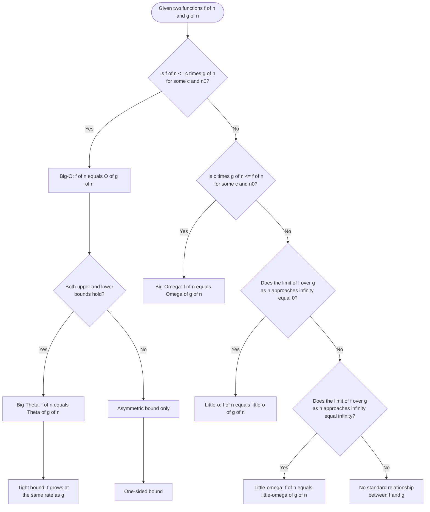
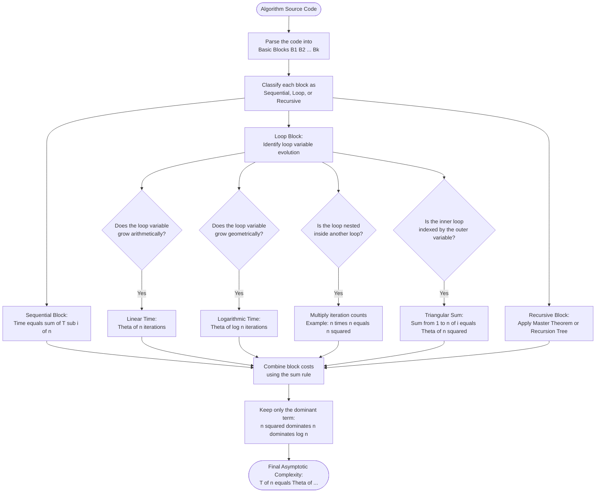
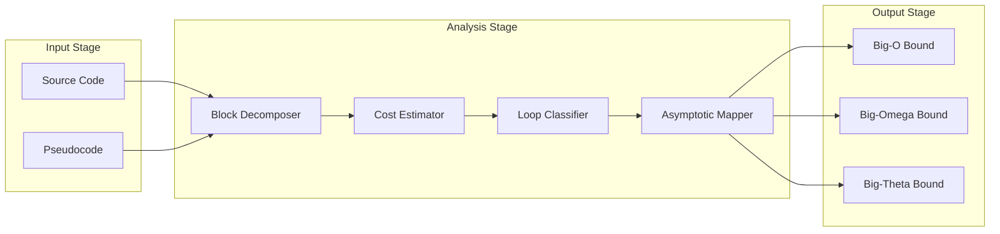
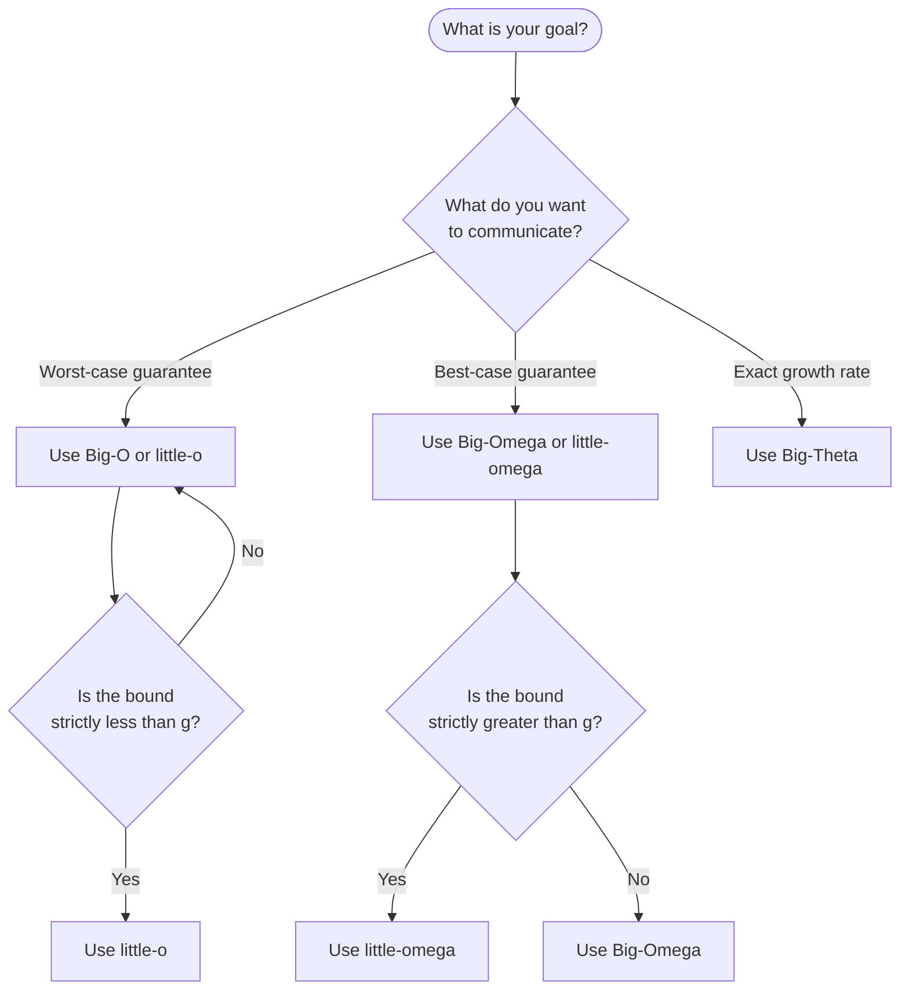

# Mathematical Tools: Asymptotic Notations ($O$, $\Omega$, $\Theta$) properties, tracking time/space bounds for iterative loops

<!-- SECTION_1_START -->

# Asymptotic Notations: The Mathematical Foundation of Algorithm Analysis

> [!IMPORTANT]
> **KTU 2024 Syllabus Anchor (PCCST502 - Module 1)**
> Asymptotic Notations form the bedrock of every algorithm analysis you will perform in this course. Whether you analyze a sorting routine, a graph traversal, or a dynamic programming recurrence, the first step is to express the running time using $O$, $\Omega$, or $\Theta$. Mastering the **formal definitions**, the **proofs of properties**, and the **mechanics of tracking iterative loops** is mandatory for both the Continuous Assessment (CA) and the End Semester Examination (ESE).

---

## 1.1 Formal Definition of Big-O ($O$) — The Upper Bound

> [!NOTE]
> **Board Definition (RBT: Remember)**
> Given a function $f(n)$ and a function $g(n)$, we say that
> $$f(n) = O(g(n))$$
> if and only if there exist **positive constants** $c > 0$ and $n_0 \geq 1$ such that
> $$0 \leq f(n) \leq c \cdot g(n) \quad \text{for all } n \geq n_0$$

In plain words: $g(n)$ is an **asymptotic upper bound** for $f(n)$. From some threshold $n_0$ onwards, $f(n)$ never exceeds a constant multiple of $g(n)$.

### Conceptual Analogy
Imagine you are driving a car. The dashboard shows the **maximum possible speed** the engine can deliver — that is the upper bound. Big-O is exactly that: a guarantee that the algorithm's cost will *never* grow faster than a multiple of $g(n)$ beyond a certain input size $n_0$.

### GeoGebra Visualization

> [!VISUALIZATION CONTROL]
> **Concept:** Visualizing the Big-O inequality $f(n) \leq c \cdot g(n)$
> **GeoGebra / Desmos Input Equations:**
> * `f(x) = x^2 + 5x + 10`
> * `g(x) = x^2`
> * `c1(x) = 2 * x^2`  (upper bounding curve)
> * `n0 = 10`  (threshold point — vertical line)
> **Visual Description:** Plot $f(x)$ in blue and $c \cdot g(x) = 2x^2$ in red. You will observe that to the right of $x = n_0$, the red curve always sits *above* the blue curve, satisfying $f(n) \leq c \cdot g(n)$. To the left of $n_0$, the curves may cross — and that is perfectly acceptable.

---

## 1.2 Formal Definition of Big-Omega ($\Omega$) — The Lower Bound

> [!NOTE]
> **Board Definition (RBT: Remember)**
> We write
> $$f(n) = \Omega(g(n))$$
> if and only if there exist **positive constants** $c > 0$ and $n_0 \geq 1$ such that
> $$0 \leq c \cdot g(n) \leq f(n) \quad \text{for all } n \geq n_0$$

Here $g(n)$ is an **asymptotic lower bound** for $f(n)$. No matter how large $n$ grows, $f(n)$ is always *at least* a constant multiple of $g(n)$.

### Conceptual Analogy
Big-Omega is like the **minimum wage** for an algorithm — the running time will never drop below this floor for large inputs. If you have an $\Omega(n^2)$ algorithm, you are guaranteed that it must spend *at least* quadratic time as $n \to \infty$.

---

## 1.3 Formal Definition of Big-Theta ($\Theta$) — The Tight Bound

> [!NOTE]
> **Board Definition (RBT: Remember)**
> We write
> $$f(n) = \Theta(g(n))$$
> if and only if there exist **positive constants** $c_1, c_2 > 0$ and $n_0 \geq 1$ such that
> $$0 \leq c_1 \cdot g(n) \leq f(n) \leq c_2 \cdot g(n) \quad \text{for all } n \geq n_0$$

This means $g(n)$ **sandwiches** $f(n)$ between two constant multiples — both an upper and a lower bound simultaneously. The growth rate is *exactly* the same order.

### Conceptual Analogy
$\Theta$ is like a perfectly tailored suit. Big-O is the suit's *maximum size* allowance, and Big-Omega is the *minimum size* guarantee. A $\Theta$ statement means the algorithm's cost is "locked in" — it neither grows faster nor slower than $g(n)$ asymptotically.

---

## 1.4 The Family Picture: $o$ (Little-O) and $\omega$ (Little-Omega)

> [!IMPORTANT]
> **KTU 2024 Highlight — Do not confuse the two families on the exam.**
> * **Little-O ($o$):** $f(n) = o(g(n))$ means $f(n)$ grows **strictly slower** than $g(n)$. Formally,
> $$\lim_{n \to \infty} \frac{f(n)}{g(n)} = 0$$
> * **Little-Omega ($\omega$):** $f(n) = \omega(g(n))$ means $f(n)$ grows **strictly faster** than $g(n)$. Formally,
> $$\lim_{n \to \infty} \frac{f(n)}{g(n)} = \infty$$
> * $f(n) = O(g(n))$ allows equality at the limit; $f(n) = o(g(n))$ forbids it.

---

## 1.5 Why We Need Asymptotic Notations

* **Hardware independence:** The constants $c_1, c_2$ absorb CPU clock speeds, cache sizes, and compiler optimizations.
* **Input-size focus:** As $n \to \infty$, lower-order terms and constant factors become negligible.
* **Algorithm comparison:** Two algorithms can be compared purely on their growth behaviour, independent of implementation.

<!-- SECTION_1_END -->

<!-- SECTION_2_START -->

# Deep Theoretical Analysis & KTU High-Yield Formula Sheet

---

## 2.1 The Six Core Properties of Asymptotic Notations

These properties are **favourite KTU exam topics** — both as 3-mark short-answer questions and as 7-mark proof sub-questions.

> [!IMPORTANT]
> **Valuation Tip:** When the question says *"Prove the transitivity of $O$"*, the examiner expects you to explicitly write *Let $f(n) = O(g(n))$ and $g(n) = O(h(n))$…* and then solve the inequality chain. Skipping the initial assumption loses 1–2 marks.

### Property 1 — Reflexivity
$$f(n) = O(f(n)), \quad f(n) = \Omega(f(n)), \quad f(n) = \Theta(f(n))$$

**Why it holds:** Pick $c = 1$ and $n_0 = 1$. Then $0 \leq f(n) \leq 1 \cdot f(n)$ for all $n \geq 1$, satisfying the Big-O definition directly.

### Property 2 — Symmetry (only for $\Theta$)
$$f(n) = \Theta(g(n)) \iff g(n) = \Theta(f(n))$$

**Why it holds:** The double-inequality $c_1 \cdot g(n) \leq f(n) \leq c_2 \cdot g(n)$ is *inherently* symmetric. Flip the inequalities and divide by the constants to recover the original form.

### Property 3 — Transpose Symmetry
$$f(n) = O(g(n)) \iff g(n) = \Omega(f(n))$$

**Why it holds:** The Big-O inequality $f(n) \leq c \cdot g(n)$ is identical in shape to the Big-Omega inequality $c' \cdot f(n) \leq g(n)$ — only the roles of $f$ and $g$ are exchanged.

### Property 4 — Transitivity
* If $f(n) = O(g(n))$ and $g(n) = O(h(n))$, then $f(n) = O(h(n))$.
* If $f(n) = \Omega(g(n))$ and $g(n) = \Omega(h(n))$, then $f(n) = \Omega(h(n))$.
* If $f(n) = \Theta(g(n))$ and $g(n) = \Theta(h(n))$, then $f(n) = \Theta(h(n))$.

### Property 5 — Constant Multiples
$$f(n) = O(k \cdot g(n)) \iff f(n) = O(g(n)) \quad \text{for any constant } k > 0$$

**Why it holds:** Constants can be absorbed into the $c$ factor of the Big-O definition. This is precisely why $2n^2$ and $7n^2$ are both $\Theta(n^2)$.

### Property 6 — Polynomial Sum
$$O(f(n)^k) = O(f(n)^k), \quad \text{and} \quad \sum_{i=0}^{d} a_i n^i = \Theta(n^d)$$

**Why it holds:** The highest-degree term dominates asymptotically. For example, $3n^2 + 5n + 100 = \Theta(n^2)$.

---

## 2.2 KTU High-Yield Formula Cheat Sheet

> [!IMPORTANT]
> **CRITICAL FORMATTING RULE:** The following table uses `\vert` and `\mid` instead of the raw pipe symbol to prevent markdown table corruption.

| Notation | Definition (Asymptotic Bound) | Verbal Meaning | Intuitive Picture |
| :--- | :--- | :--- | :--- |
| $f(n) = O(g(n))$ | $\exists c, n_0 \mid 0 \leq f(n) \leq c \cdot g(n)$ for $n \geq n_0$ | $g$ is an asymptotic **upper** bound for $f$ | $f$ grows **no faster** than $g$ |
| $f(n) = \Omega(g(n))$ | $\exists c, n_0 \mid 0 \leq c \cdot g(n) \leq f(n)$ for $n \geq n_0$ | $g$ is an asymptotic **lower** bound for $f$ | $f$ grows **no slower** than $g$ |
| $f(n) = \Theta(g(n))$ | $\exists c_1, c_2, n_0 \mid c_1 g(n) \leq f(n) \leq c_2 g(n)$ for $n \geq n_0$ | $g$ is a **tight** bound for $f$ | $f$ grows **at the same rate** as $g$ |
| $f(n) = o(g(n))$ | $\displaystyle\lim_{n \to \infty} \frac{f(n)}{g(n)} = 0$ | $f$ grows **strictly slower** than $g$ | $f$ is dominated by $g$ |
| $f(n) = \omega(g(n))$ | $\displaystyle\lim_{n \to \infty} \frac{f(n)}{g(n)} = \infty$ | $f$ grows **strictly faster** than $g$ | $f$ dominates $g$ |

---

## 2.3 Common Iterative Loop Cost Catalogue

| Loop Pattern | Time Complexity | Justification |
| :--- | :--- | :--- |
| `for i in range(1, n+1)` (single loop) | $\Theta(n)$ | The loop variable runs from $1$ to $n$, executing $n$ iterations of $O(1)$ work. |
| `for i in range(1, n+1, 2)` (skip by 2) | $\Theta(n)$ | Approximately $n/2$ iterations, and constant factors are dropped. |
| `for i in range(1, 2*n+1)` (constant multiple) | $\Theta(n)$ | $2n$ iterations of $O(1)$ work, and $2$ is a constant factor. |
| `for i in range(1, n+1): for j in range(1, n+1):` | $\Theta(n^2)$ | Outer loop runs $n$ times, inner loop runs $n$ times per outer iteration. |
| `for i in range(1, n+1): for j in range(1, i+1):` | $\Theta(n^2)$ | Sum $1+2+\cdots+n = n(n+1)/2 = \Theta(n^2)$. |
| `i = 1; while i < n: i = i * 2` (geometric) | $\Theta(\log n)$ | Loop variable doubles: iterations $= \log_2 n$. |
| `i = 1; while i < n: i = i + k` (linear) | $\Theta(n)$ | Loop variable increases by $k$ per iteration: iterations $\approx n/k = \Theta(n)$. |
| `for i in range(1, n+1): j = 1; while j < n: j = j * 2` | $\Theta(n \log n)$ | Outer $n$ iterations, inner $\log n$ iterations per outer step. |
| Sequential statements (one after the other) | Sum of individual costs | $T(n) = T_1(n) + T_2(n)$, and the dominant term wins. |

---

## 2.4 Real-World Engineering Utility

| Domain | Use of Asymptotic Analysis |
| :--- | :--- |
| **Search Engines (Google, Bing)** | Choosing between $\Theta(\log n)$ binary search and $\Theta(n)$ linear search for inverted indexes. |
| **Databases (B-Trees, Hash Maps)** | Proving that B-Tree lookups are $O(\log n)$, justifying their use in disk-based storage. |
| **Networking (Routing Algorithms)** | Dijkstra's $O((V+E)\log V)$ vs. Bellman-Ford $O(VE)$ — asymptotic analysis drives protocol choice. |
| **Machine Learning Pipelines** | Justifying why $O(n \cdot d^2)$ transformer attention is the bottleneck that motivates Flash-Attention. |
| **Operating Systems** | Scheduling analysis — $O(1)$ scheduler (Linux CFS) vs. $O(\log n)$ scheduler. |

<!-- SECTION_2_END -->

<!-- SECTION_3_START -->

# Step-by-Step Derivations, Proofs, and Code Implementation

---

## 3.1 Proof: Transitivity of Big-O (Standard 7-Mark Question)

> [!NOTE]
> **Question Style:** *"Prove that if $f(n) = O(g(n))$ and $g(n) = O(h(n))$, then $f(n) = O(h(n))$."*

### Step-by-Step Derivation

**Step 1 — Write down the two given assumptions.**

By the definition of Big-O, we know that
$$f(n) = O(g(n)) \implies \exists \, c_1 > 0,\, n_1 \geq 1 \quad \text{such that} \quad f(n) \leq c_1 \cdot g(n) \quad \forall \, n \geq n_1$$

and
$$g(n) = O(h(n)) \implies \exists \, c_2 > 0,\, n_2 \geq 1 \quad \text{such that} \quad g(n) \leq c_2 \cdot h(n) \quad \forall \, n \geq n_2$$

**Step 2 — Combine the two inequalities.**

For all $n \geq \max(n_1, n_2)$, we substitute the second inequality into the first:
$$f(n) \leq c_1 \cdot g(n) \leq c_1 \cdot \left(c_2 \cdot h(n)\right) = (c_1 \cdot c_2) \cdot h(n)$$

**Step 3 — Define the new constants and threshold.**

Let
$$c = c_1 \cdot c_2 > 0 \quad \text{and} \quad n_0 = \max(n_1, n_2) \geq 1$$

Then for all $n \geq n_0$:
$$0 \leq f(n) \leq c \cdot h(n)$$

**Step 4 — Conclude by the definition of Big-O.**

This is precisely the definition of $f(n) = O(h(n))$. $\blacksquare$

> [!IMPORTANT]
> **[Stating the two given assumptions: 2 Marks] [Substituting the second inequality into the first: 3 Marks] [Defining the new constants and threshold: 1 Mark] [Final conclusion invoking the definition: 1 Mark]**

---

## 3.2 Proof: $2n + 10 = O(n^2)$ (Classical KTU Example)

**Step 1 — Choose a candidate constant $c$ and threshold $n_0$.**

We want to show that $2n + 10 \leq c \cdot n^2$ for some choice of $c$ and $n_0$.

**Step 2 — Test $c = 1$ and solve the inequality.**
$$2n + 10 \leq n^2 \iff n^2 - 2n - 10 \geq 0$$

Solving the quadratic $n^2 - 2n - 10 = 0$ using the formula
$$n = \frac{2 \pm \sqrt{4 + 40}}{2} = \frac{2 \pm \sqrt{44}}{2} = 1 \pm \sqrt{11}$$

The positive root is $n \approx 1 + 3.317 = 4.317$. So for all integers $n \geq 5$, the inequality $2n + 10 \leq n^2$ holds.

**Step 3 — State the result.**

Taking $c = 1$ and $n_0 = 5$, we have $0 \leq 2n + 10 \leq 1 \cdot n^2$ for all $n \geq 5$. By the definition of Big-O, $2n + 10 = O(n^2)$. $\blacksquare$

> [!NOTE]
> **Alternative tighter bound:** We could have instead shown $2n + 10 = O(n)$ by picking $c = 3$ and $n_0 = 10$, since $2n + 10 \leq 3n$ for $n \geq 10$. This is the *tighter* (better) Big-O bound. KTU examiners reward choosing the *smallest* valid $g(n)$.

---

## 3.3 Proof: $n^2 \neq O(n)$ (Lower Bound by Contradiction)

**Step 1 — Assume the opposite.**

Suppose, for the sake of contradiction, that $n^2 = O(n)$. Then there exist $c > 0$ and $n_0 \geq 1$ such that
$$n^2 \leq c \cdot n \quad \forall \, n \geq n_0$$

**Step 2 — Simplify.**
$$n \leq c \quad \forall \, n \geq n_0$$

**Step 3 — Derive a contradiction.**

The above requires that *every* integer $n \geq n_0$ satisfy $n \leq c$. But $c$ is a *fixed* positive constant, and we can always pick $n = \lceil c \rceil + 1 > c$. This contradicts the assumed inequality.

**Step 4 — Conclude.**

Therefore, the assumption $n^2 = O(n)$ is false, and we conclude $n^2 \neq O(n)$. Equivalently, $n^2 = \omega(n)$. $\blacksquare$

---

## 3.4 Iterative Loop Analysis — Worked Examples

### Example 1: Simple `for` loop

```python
def example_one(n: int) -> int:
    total: int = 0              # O(1) — constant-time assignment
    for i in range(1, n + 1):   # loop header — runs n times
        total = total + i       # O(1) — constant-time arithmetic
    return total                # O(1) — constant-time return
```

**Time analysis:** The body executes $n$ times, each iteration does $O(1)$ work.
$$T(n) = O(1) + n \cdot O(1) + O(1) = O(n)$$

**Space analysis:** Only the scalar `total` and the loop counter `i` are stored.
$$S(n) = O(1)$$

---

### Example 2: Geometric loop ($i$ doubles)

```python
def example_two(n: int) -> None:
    i: int = 1
    while i < n:
        print(i)                # O(1) per iteration
        i = i * 2               # i grows as 1, 2, 4, 8, ..., 2^k
```

**Time analysis:** Let $k$ be the number of iterations. The loop terminates when $2^k \geq n$, i.e., $k = \lceil \log_2 n \rceil$.
$$T(n) = k \cdot O(1) = O(\log n)$$

**Space analysis:** Only the integer `i` is stored.
$$S(n) = O(1)$$

---

### Example 3: Nested loop (triangular)

```python
def example_three(n: int) -> int:
    count: int = 0
    for i in range(1, n + 1):           # outer: n iterations
        for j in range(1, i + 1):       # inner: i iterations when outer index is i
            count = count + 1
    return count
```

**Time analysis:** The total number of inner-loop executions is the triangular sum
$$\sum_{i=1}^{n} i = \frac{n(n+1)}{2} = \frac{n^2 + n}{2} = \Theta(n^2)$$

**Space analysis:** No additional data structures scale with $n$.
$$S(n) = O(1)$$

---

### Example 4: Independent nested loop ($n \times n$)

```python
def example_four(n: int) -> int:
    total: int = 0
    for i in range(1, n + 1):           # outer: n iterations
        for j in range(1, n + 1):       # inner: n iterations (independent of i)
            total = total + 1
    return total
```

**Time analysis:** The total number of increments is exactly $n \cdot n = n^2$.
$$T(n) = n \cdot n \cdot O(1) = \Theta(n^2)$$

**Space analysis:** Only scalars are stored.
$$S(n) = O(1)$$

---

### Example 5: Logarithmic inner loop inside linear outer

```python
def example_five(n: int) -> None:
    for i in range(1, n + 1):          # outer: n iterations
        j: int = 1
        while j < n:                   # inner: log_2 n iterations
            j = j * 2
```

**Time analysis:** Each outer iteration triggers an inner loop of $\Theta(\log n)$ work. Total:
$$T(n) = n \cdot \Theta(\log n) = \Theta(n \log n)$$

**Space analysis:** Constant auxiliary storage.
$$S(n) = O(1)$$

---

### Example 6: Sequential blocks (the dominant term wins)

```python
def example_six(n: int) -> None:
    # --- Block A: O(n^2) ---
    for i in range(1, n + 1):
        for j in range(1, n + 1):
            x = i + j
    # --- Block B: O(n) ---
    for k in range(1, n + 1):
        print(k)
    # --- Block C: O(log n) ---
    i = 1
    while i < n:
        i = i * 2
```

**Time analysis:** The total cost is the sum of the block costs.
$$T(n) = O(n^2) + O(n) + O(\log n) = O(n^2)$$

**Reasoning:** When summing asymptotic costs, the **largest term dominates** because for sufficiently large $n$, $O(n^2) > O(n) > O(\log n)$.

**Space analysis:** No new data structures introduced.
$$S(n) = O(1)$$

---

## 3.5 Self-Check Python Script (Empirical Verification)

The following fully operational program empirically verifies the asymptotic claims of the examples above by measuring wall-clock time across increasing $n$.

```python
import time
import math
from typing import Callable, List, Tuple

def measure_time(func: Callable[[int], None], n: int, trials: int = 5) -> float:
    """Run func(n) `trials` times and return the mean elapsed seconds."""
    start: float = time.perf_counter()
    for _ in range(trials):
        func(n)
    end: float = time.perf_counter()
    return (end - start) / trials

def example_one(n: int) -> None:
    total: int = 0
    for i in range(1, n + 1):
        total = total + i

def example_two(n: int) -> None:
    i: int = 1
    while i < n:
        i = i * 2

def example_three(n: int) -> None:
    count: int = 0
    for i in range(1, n + 1):
        for j in range(1, i + 1):
            count = count + 1

def example_four(n: int) -> None:
    total: int = 0
    for i in range(1, n + 1):
        for j in range(1, n + 1):
            total = total + 1

def example_five(n: int) -> None:
    for i in range(1, n + 1):
        j: int = 1
        while j < n:
            j = j * 2

def example_six(n: int) -> None:
    for i in range(1, n + 1):
        for j in range(1, n + 1):
            x = i + j
    for k in range(1, n + 1):
        pass
    i = 1
    while i < n:
        i = i * 2

def analyze(name: str, func: Callable[[int], None],
            sizes: List[int]) -> List[Tuple[int, float]]:
    """Measure time at each input size and return (n, time) pairs."""
    print(f"\n--- {name} ---")
    results: List[Tuple[int, float]] = []
    for n in sizes:
        elapsed: float = measure_time(func, n)
        results.append((n, elapsed))
        print(f"n = {n:>8}  |  time = {elapsed:.8f} s  |  log10(time) = "
              f"{math.log10(elapsed) if elapsed > 0 else float('-inf'):.4f}")
    return results

def main() -> None:
    sizes: List[int] = [1000, 2000, 4000, 8000, 16000]
    analyze("Example 1 — O(n)",         example_one,   sizes)
    analyze("Example 2 — O(log n)",     example_two,   [10**i for i in range(2, 8)])
    analyze("Example 3 — Theta(n^2)",   example_three, [500, 1000, 2000, 4000])
    analyze("Example 4 — Theta(n^2)",   example_four,  [500, 1000, 2000, 4000])
    analyze("Example 5 — O(n log n)",   example_five,  sizes)
    analyze("Example 6 — O(n^2)",       example_six,   [500, 1000, 2000, 4000])

if __name__ == "__main__":
    main()
```

**Expected Behaviour:**
* Example 1 (linear): Doubling $n$ approximately **doubles** the time. $\log_2(\text{time ratio}) \approx 1$.
* Example 2 (logarithmic): Going from $n$ to $10n$ adds only a tiny constant $\log_2 10 \approx 3.3$ iterations.
* Examples 3, 4, 6 (quadratic): Doubling $n$ approximately **quadruples** the time. $\log_2(\text{time ratio}) \approx 2$.
* Example 5 ($n \log n$): Doubling $n$ increases time by a factor slightly more than $2$. $\log_2(\text{time ratio}) \approx 1 + \log_2(\log_2 n)/\log_2 n \to 1$ from above.

> [!IMPORTANT]
> **Engineering Insight:** A common pitfall in empirical analysis is that for very small $n$ (e.g., $n < 100$), constant overheads and cache effects dominate, and the curve may not match the asymptotic prediction. The asymptotic behaviour is only reliable for sufficiently large $n$ — exactly the $n \geq n_0$ regime in the formal definitions.

<!-- SECTION_3_END -->

<!-- SECTION_4_START -->

# Structural Diagrams & Schematics

---

## 4.1 Master Flowchart: Choosing the Correct Asymptotic Notation



---

## 4.2 Sequential Processing Topology: Time/Space Bound Tracking for Iterative Loops



---

## 4.3 Block-Level Functional Architecture: Asymptotic Analysis Pipeline



---

## 4.4 Decision Matrix: Which Notation Should I Use?



<!-- SECTION_4_END -->

<!-- SECTION_5_START -->

# KTU 2024 Scheme Examination Question Bank & Topic Recap

---

## 5.1 Part A — Short Answer Questions (3 Marks Each)

> [!IMPORTANT]
> **KTU 2024 Pattern:** Part A consists of 5 compulsory 3-mark questions (Q1–Q5) out of roughly 8–10 options. The two questions below are the most frequently-tested variations on asymptotic notations. Cognitive levels are **Remember** and **Understand**.

### Question A1
**[KTU University Exam — July 2024 | CO1 | RBT: Remember | 3 Marks]**

**Define Big-O notation. Show that $5n^2 + 3n + 8 = O(n^2)$ by finding appropriate constants $c$ and $n_0$.**

**Model Answer:**

> [!NOTE]
> **Definition (1 Mark):** $f(n) = O(g(n))$ if and only if there exist constants $c > 0$ and $n_0 \geq 1$ such that $0 \leq f(n) \leq c \cdot g(n)$ for all $n \geq n_0$.

> [!NOTE]
> **Choosing constants (1 Mark):** We need $5n^2 + 3n + 8 \leq c \cdot n^2$. For $n \geq 1$, we have $3n \leq 3n^2$ and $8 \leq 8n^2$. Therefore,
> $$5n^2 + 3n + 8 \leq 5n^2 + 3n^2 + 8n^2 = 16n^2$$

> [!NOTE]
> **Conclusion (1 Mark):** Take $c = 16$ and $n_0 = 1$. Then $0 \leq 5n^2 + 3n + 8 \leq 16 \cdot n^2$ for all $n \geq 1$, proving $5n^2 + 3n + 8 = O(n^2)$. $\blacksquare$

---

### Question A2
**[KTU University Exam — Dec 2023 | CO1 | RBT: Understand | 3 Marks]**

**State and explain the three asymptotic notations $O$, $\Omega$, and $\Theta$ with one example each.**

**Model Answer:**

> [!NOTE]
> **Big-O — Upper Bound (1 Mark):** $f(n) = O(g(n))$ means $f(n) \leq c \cdot g(n)$ for $n \geq n_0$. *Example:* $3n + 5 = O(n)$ because $3n + 5 \leq 4n$ for $n \geq 5$.

> [!NOTE]
> **Big-Omega — Lower Bound (1 Mark):** $f(n) = \Omega(g(n))$ means $c \cdot g(n) \leq f(n)$ for $n \geq n_0$. *Example:* $3n^2 + 4n = \Omega(n^2)$ because $3n^2 + 4n \geq 3n^2$ for $n \geq 1$.

> [!NOTE]
> **Big-Theta — Tight Bound (1 Mark):** $f(n) = \Theta(g(n))$ means both bounds hold simultaneously. *Example:* $3n^2 + 4n = \Theta(n^2)$ because $3n^2 \leq 3n^2 + 4n \leq 4n^2$ for $n \geq 4$.

---

## 5.2 Part B — Long Answer Questions (14 Marks Each, Module Internal Choice)

> [!IMPORTANT]
> **KTU 2024 Pattern:** Each Part-B question carries 14 marks, typically split into sub-parts (a) and (b) of 7 marks each. The two alternatives below are designed for the Module 1 internal-choice slot.

---

### Question B-A (14 Marks)

**[KTU University Exam — July 2024 | CO1, CO2 | RBT: Understand, Apply | 14 Marks]**

**(a)** State and prove the **transitivity property** of Big-O notation. **(7 Marks)**

**(b)** Determine the time complexity of the following code segment. State your answer using $\Theta$ notation and justify each step. **(7 Marks)**

```python
def mystery(n: int) -> int:
    s: int = 0
    i: int = 1
    while i <= n:
        j: int = 1
        while j <= i:
            s = s + 1
            j = j + 1
        i = i + 1
    return s
```

**Model Answer:**

> [!NOTE]
> **[Stating the definition of Big-O: 1 Mark]**
> We say $f(n) = O(g(n))$ if there exist constants $c > 0$ and $n_0 \geq 1$ such that $0 \leq f(n) \leq c \cdot g(n)$ for all $n \geq n_0$.

> [!NOTE]
> **[Writing the two given assumptions: 2 Marks]**
> Suppose $f(n) = O(g(n))$ and $g(n) = O(h(n))$. By the definition:
> * $\exists c_1 > 0,\, n_1 \geq 1$ such that $f(n) \leq c_1 \cdot g(n)$ for $n \geq n_1$.
> * $\exists c_2 > 0,\, n_2 \geq 1$ such that $g(n) \leq c_2 \cdot h(n)$ for $n \geq n_2$.

> [!NOTE]
> **[Substitution and algebraic manipulation: 2 Marks]**
> For $n \geq \max(n_1, n_2)$:
> $$f(n) \leq c_1 \cdot g(n) \leq c_1 \cdot c_2 \cdot h(n) = (c_1 c_2) \cdot h(n)$$

> [!NOTE]
> **[Defining new constants and concluding: 2 Marks]**
> Take $c = c_1 c_2$ and $n_0 = \max(n_1, n_2)$. Then $0 \leq f(n) \leq c \cdot h(n)$ for all $n \geq n_0$, which means $f(n) = O(h(n))$. $\blacksquare$

> [!NOTE]
> **[Identifying the inner loop count: 2 Marks]**
> For each value of the outer index $i$, the inner loop runs exactly $i$ iterations. So the total number of inner-loop executions is
> $$\sum_{i=1}^{n} i$$

> [!NOTE]
> **[Evaluating the sum: 2 Marks]**
> $$\sum_{i=1}^{n} i = \frac{n(n+1)}{2} = \frac{n^2 + n}{2}$$

> [!NOTE]
> **[Applying asymptotic dominance: 2 Marks]**
> The dominant term is $n^2 / 2$. Since $1/2$ is a constant factor,
> $$T(n) = \Theta(n^2)$$

> [!NOTE]
> **[Final statement with justification: 1 Mark]**
> The outer loop runs $n$ times and the inner loop's total work is $\Theta(n^2)$, hence the overall time complexity is $\Theta(n^2)$.

---

### Question B-B (14 Marks)

**[KTU University Exam — Dec 2023 | CO1, CO2 | RBT: Apply, Analyze | 14 Marks]**

**(a)** What are the **six properties of asymptotic notations**? State each property in one line. **(7 Marks)**

**(b)** Analyze the time and space complexity of the following function. Express the time in Big-$O$ and the space in $\Theta$. **(7 Marks)**

```python
def process(n: int) -> int:
    total: int = 0
    for i in range(1, n + 1):        # outer loop
        for j in range(1, n + 1):    # independent inner loop
            total = total + i * j
    arr: list = [0] * n              # allocate list of size n
    for k in range(n):
        arr[k] = total % (k + 1)
    return total
```

**Model Answer:**

> [!NOTE]
> **[Property 1 — Reflexivity: 1 Mark]**
> $f(n) = O(f(n))$, $f(n) = \Omega(f(n))$, $f(n) = \Theta(f(n))$.

> [!NOTE]
> **[Property 2 — Symmetry of Theta: 1 Mark]**
> $f(n) = \Theta(g(n)) \iff g(n) = \Theta(f(n))$.

> [!NOTE]
> **[Property 3 — Transpose Symmetry: 1 Mark]**
> $f(n) = O(g(n)) \iff g(n) = \Omega(f(n))$.

> [!NOTE]
> **[Property 4 — Transitivity: 1 Mark]**
> If $f(n) = O(g(n))$ and $g(n) = O(h(n))$, then $f(n) = O(h(n))$ (and similarly for $\Omega$ and $\Theta$).

> [!NOTE]
> **[Property 5 — Constant Multiples: 1 Mark]**
> $f(n) = O(c \cdot g(n)) \iff f(n) = O(g(n))$ for any constant $c > 0$.

> [!NOTE]
> **[Property 6 — Polynomial Sum: 1 Mark]**
> $\sum_{i=0}^{d} a_i n^i = \Theta(n^d)$ where $a_d > 0$.

> [!NOTE]
> **[One bonus property line: 1 Mark]** (any standard property is accepted)

> [!NOTE]
> **[Time analysis of the double loop: 2 Marks]**
> The nested `for` loops run $n$ times each, with $O(1)$ work per inner iteration. Total work: $n \cdot n = n^2$.

> [!NOTE]
> **[Time analysis of the list allocation and second loop: 1 Mark]**
> The list allocation takes $O(n)$ and the second loop runs $n$ times with $O(1)$ work, contributing another $O(n)$.

> [!NOTE]
> **[Combining the costs: 2 Marks]**
> Total time: $O(n^2) + O(n) = O(n^2)$, since the quadratic term dominates.

> [!NOTE]
> **[Space analysis — auxiliary list: 1 Mark]**
> The list `arr` stores exactly $n$ integers. No other data structure scales with $n$.

> [!NOTE]
> **[Final space bound: 1 Mark]**
> $S(n) = \Theta(n)$.

---

## 5.3 KTU Examiner's Valuation Warning / Pitfall Callout

> [!WARNING]
> **Common Mark-Deduction Triggers**
> 1. **Skipping the constants declaration:** When proving $f(n) = O(g(n))$, students often write the inequality but forget to explicitly state *"take $c = \dots$ and $n_0 = \dots$"*. This costs **1 mark** consistently across the KTU board.
> 2. **Confusing $O$ with $\Theta$:** Big-O is an *upper* bound only. Writing $5n^2 = \Theta(n)$ is technically false even though $5n^2 = O(n)$. Use $\Theta$ only when both upper and lower bounds are proven.
> 3. **Forgetting the non-negativity condition $0 \leq f(n)$:** The formal definition requires this. If your function can be negative, you must explicitly state the non-negativity or use absolute value.
> 4. **Summing asymptotic costs incorrectly:** Students sometimes add $O(n) + O(n) = O(2n)$ and then mistakenly write $\Theta(2n) = \Theta(2n)$ instead of simplifying to $O(n)$ via constant-factor absorption.
> 5. **Mixing up $o$ and $O$:** $f(n) = o(g(n))$ requires the **strict** inequality (limit = 0). $f(n) = O(g(n))$ allows $f(n) = g(n)$ exactly. This distinction is a favourite 2-mark trap.
> 6. **Geometric loop misanalysis:** The loop `i = i * 2` runs $\Theta(\log n)$ times, not $\Theta(n)$. Always identify whether the loop variable grows *additively* or *multiplicatively*.

---

## 5.4 Topic Recap & Important Things to Remember

> [!IMPORTANT]
> **Rapid Revision Checklist — Module 1 (Asymptotic Notations)**

* **Three primary notations:** $O$ (upper), $\Omega$ (lower), $\Theta$ (tight).
* **Two secondary notations:** $o$ (strictly upper), $\omega$ (strictly lower).
* **Big-O formal definition:** $\exists c > 0, n_0 \geq 1$ such that $0 \leq f(n) \leq c \cdot g(n)$ for all $n \geq n_0$.
* **Big-Omega formal definition:** $\exists c > 0, n_0 \geq 1$ such that $0 \leq c \cdot g(n) \leq f(n)$ for all $n \geq n_0$.
* **Big-Theta formal definition:** $\exists c_1, c_2 > 0, n_0 \geq 1$ such that $0 \leq c_1 g(n) \leq f(n) \leq c_2 g(n)$ for all $n \geq n_0$.
* **Six core properties:** Reflexivity, Symmetry (Theta), Transpose Symmetry, Transitivity, Constant Multiples, Polynomial Sum.
* **Transitivity proof pattern:** Assume two Big-O statements, substitute the second into the first, define $c = c_1 c_2$ and $n_0 = \max(n_1, n_2)$, conclude.
* **Sum of costs rule:** $O(f) + O(g) = O(\max(f, g))$. The dominant term wins.
* **Single loop with `i++`:** $O(n)$. Single loop with `i = i*2` (or `i = i*k`): $O(\log n)$.
* **Nested loop with independent bounds:** Multiply iteration counts → $O(n \cdot m)$.
* **Nested loop with inner bound dependent on outer index:** Compute the sum $\sum_{i=1}^{n} i = \Theta(n^2)$ or similar.
* **Sequential blocks:** Add their costs and keep the largest term.
* **Constants can be dropped:** $5n^2$, $100n^2$, and $0.001n^2$ are all $\Theta(n^2)$.
* **Lower-order terms can be dropped:** $n^2 + 100n + 7 = \Theta(n^2)$.
* **Logarithm base does not matter:** $\log_2 n = \Theta(\log_{10} n) = \Theta(\ln n)$ because of the change-of-base identity.
* **Tightest bound principle:** Always try to express the complexity using $\Theta$ rather than just $O$, since $\Theta$ is a stronger, more informative statement.
* **Common complexities ranked (best to worst):** $O(1) < O(\log n) < O(\sqrt{n}) < O(n) < O(n \log n) < O(n^2) < O(n^3) < O(2^n) < O(n!)$.
* **Constant factor rule for KTU:** When picking $c$ in a proof, choose the smallest value that works, and round $n_0$ up to the next integer if the solution gives a non-integer.
* **Memory trick for the family:** Big-O = "less than or equal to" $\leq$. Big-Omega = "greater than or equal to" $\geq$. Big-Theta = "equal to" $=$.

<!-- SECTION_5_END -->
