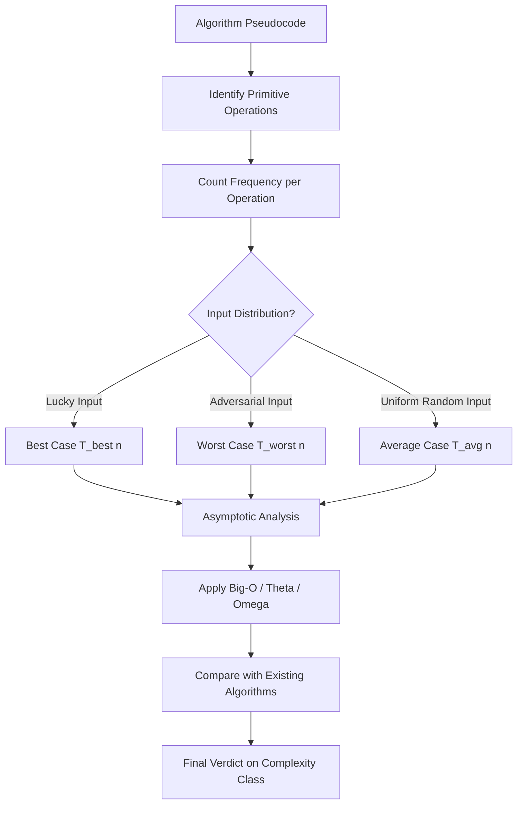
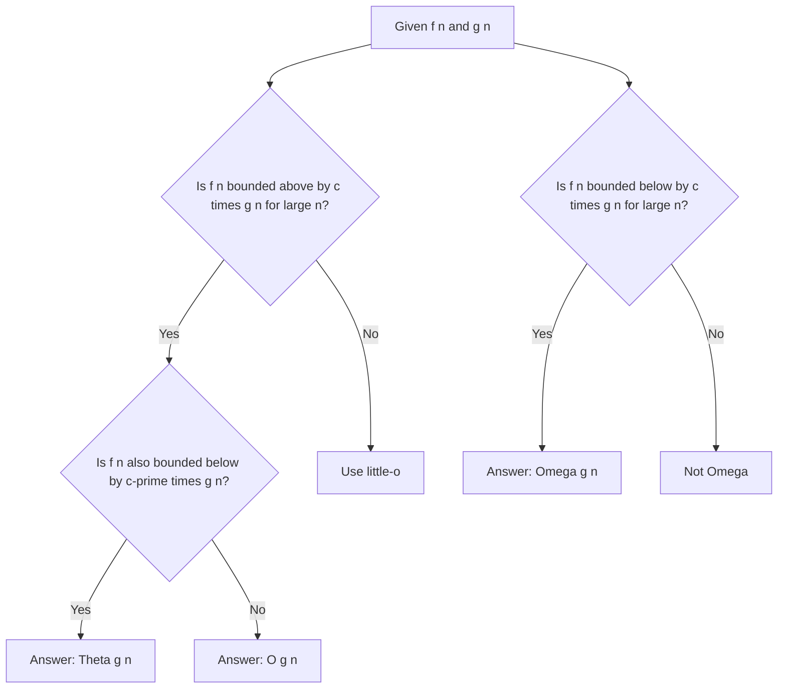
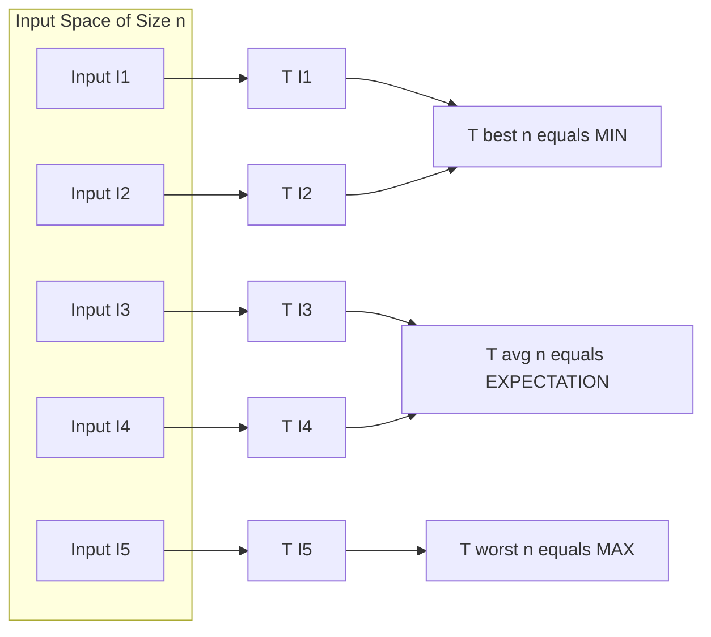
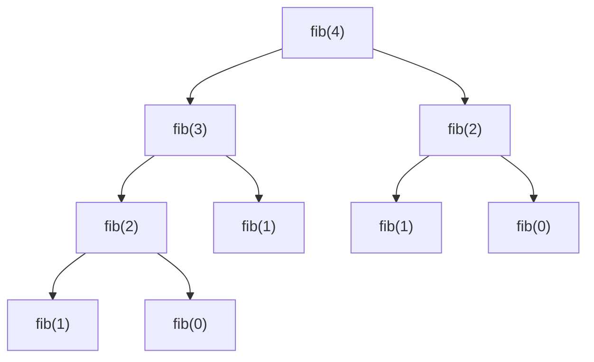
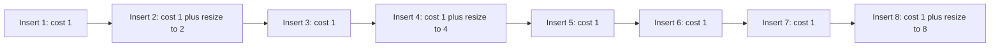

# Performance Analysis: Space complexity, and Time complexity diagnostics (Best, Worst, Average Cases)

<!-- SECTION_1_START -->
# 1. Core Technical Definition & Intuitive Overview

## Performance Analysis — The Heart of Algorithm Design

> [!IMPORTANT]
> **KTU 2024 Syllabus Definition (PCCST502 / Module 1):**
> *Performance Analysis* is the systematic process of measuring and evaluating the **resource consumption** of an algorithm — primarily **time** (CPU cycles) and **space** (memory) — as a function of the **input size** $n$. The goal is to predict, compare, and optimize algorithmic behaviour *independent of the underlying hardware or compiler*.

In the KTU 2024 scheme, the phrase "diagnostics" specifically refers to the **three-case analysis** — *Best*, *Worst*, and *Average* — that an algorithm designer must perform to fully characterize how an algorithm behaves across **all possible input instances** of size $n$.

---

## Conceptual Analogy / Intuition 🍕

Imagine you run a pizza delivery service:

| Real World | Algorithm World |
|------------|-----------------|
| Number of houses to deliver | Input size $n$ |
| Time taken to cook + deliver | **Time Complexity** $T(n)$ |
| Storage space in the oven + delivery van | **Space Complexity** $S(n)$ |
| Customer ordering 1 pizza (lucky day) | **Best Case** |
| Customer ordering 100 pizzas on a rainy day | **Worst Case** |
| Typical Tuesday evening | **Average Case** |

> [!NOTE]
> **The "Big Idea":** We don't measure algorithm speed in *seconds* (because that depends on the machine). Instead, we count the **number of elementary operations** the algorithm performs as $n$ grows. This is called the **operation count** or **step count method**.

---

## Key Performance Metrics (Strict KTU Vocabulary)

1. **Time Complexity $T(n)$** → Total number of primitive operations executed.
2. **Space Complexity $S(n)$** → Total memory (auxiliary + input) consumed.
3. **Asymptotic Complexity** → Behaviour of $T(n)$ as $n \to \infty$.
4. **Best Case** $\Omega(n)$ → Minimum operations over all inputs of size $n$.
5. **Worst Case** $O(n)$ → Maximum operations over all inputs of size $n$.
6. **Average Case** $\Theta(n)$ → Expected operations over the *probability distribution* of inputs.

> [!VISUALIZATION CONTROL]
> **Concept:** Growth of common complexity functions
> **Desmos / GeoGebra Input Equations:**
> * `f1(x) = 1` (Constant)
> * `f2(x) = log(x) / log(2)` (Logarithmic)
> * `f3(x) = x` (Linear)
> * `f4(x) = x * log(x) / log(2)` (Linearithmic)
> * `f5(x) = x^2` (Quadratic)
> * `f6(x) = 2^x` (Exponential)
> **Visual Description:** Plot these for $x$ from 1 to 50. Observe that $f_6$ explodes off the chart while $f_1$ remains flat. The *ordering* of these curves is what asymptotic notation captures.

<!-- SECTION_1_END -->

<!-- SECTION_2_START -->
# 2. Deep Theoretical Analysis & KTU High-Yield Formula Sheet

## 2.1 The Three Pillars of Performance Diagnostics

### A) Time Complexity $T(n)$ — The Step Count Method

The time complexity of an algorithm is the **sum of execution times of every primitive operation**. Since each primitive op (assignment, comparison, arithmetic, return) takes *constant* time $c_i$, the total time is:

$$
T(n) = c_1 \cdot (\text{lines}) + c_2 \cdot (\text{comparisons}) + \ldots
$$

Since hardware-specific constants $c_i$ are irrelevant for large $n$, we group operations into a **frequency count polynomial** $f(n)$ and use asymptotic notation to compare algorithms.

> [!IMPORTANT]
> **KTU Board Rule:** Always state $T(n)$ in terms of the *frequency of the dominant operation* (e.g., "number of comparisons" or "number of array accesses"), not wall-clock seconds.

### B) Space Complexity $S(n)$ — Memory Footprint

$$
S(n) = S_{\text{input}}(n) + S_{\text{auxiliary}}(n) + S_{\text{stack}}(n)
$$

| Component | Meaning | Example |
|-----------|---------|---------|
| $S_{\text{input}}$ | Memory to store the input | Array of $n$ integers |
| $S_{\text{auxiliary}}$ | Extra memory declared by algorithm | A temporary `temp` variable, hash table |
| $S_{\text{stack}}$ | Memory used by recursion call stack | Recursive factorial uses $O(n)$ stack frames |

> [!NOTE]
> KTU examiners **always** award marks for the auxiliary vs. input distinction. Saying "$O(n)$ space" is incomplete — specify whether you mean *total* or *auxiliary*.

### C) Asymptotic Notations — The Comparison Toolkit

$$
\begin{aligned}
O(g(n)) &= \{ f(n) : \exists\, c > 0,\, n_0 > 0 \text{ s.t. } 0 \le f(n) \le c \cdot g(n) \; \forall n \ge n_0 \} \quad \text{(Upper Bound)} \\
\Omega(g(n)) &= \{ f(n) : \exists\, c > 0,\, n_0 > 0 \text{ s.t. } 0 \le c \cdot g(n) \le f(n) \; \forall n \ge n_0 \} \quad \text{(Lower Bound)} \\
\Theta(g(n)) &= O(g(n)) \cap \Omega(g(n)) \quad \text{(Tight Bound)} \\
o(g(n)) &= \text{Strict upper bound (ratio } f(n)/g(n) \to 0) \\
\omega(g(n)) &= \text{Strict lower bound (ratio } f(n)/g(n) \to \infty)
\end{aligned}
$$

---

## 2.2 The Three-Case Analysis Framework

For an algorithm $\mathcal{A}$ and input size $n$, let $T(I)$ be the running time on a specific input $I$ of size $n$.

$$
\begin{aligned}
T_{\text{best}}(n) &= \min_{I : |I| = n} T(I) \\
T_{\text{worst}}(n) &= \max_{I : |I| = n} T(I) \\
T_{\text{avg}}(n) &= \mathbb{E}[T(I)] = \sum_{I : |I| = n} p(I) \cdot T(I)
\end{aligned}
$$

where $p(I)$ is the probability that input $I$ occurs, with $\sum_{I} p(I) = 1$.

> [!IMPORTANT]
> **KTU Convention for Average Case:** If no distribution is specified, KTU examiners assume the **uniform distribution** $p(I) = 1/k$ for $k$ equally likely inputs. This is called the *uniform-average assumption*.

---

## 2.3 Worked Example — Linear Search

Given an unsorted array $A[0 \ldots n-1]$ and a key $x$, find the index of $x$ (or return $-1$).

| Case | Condition | Comparisons |
|------|-----------|-------------|
| **Best** | $x = A[0]$ | **1** |
| **Worst** | $x \notin A$ or $x = A[n-1]$ | **$n$** |
| **Average** | $x$ equally likely in any of $n$ positions or absent | **$(n+1)/2$** |

For the average case, the **expected number of comparisons** is derived as follows. Assume probability of $x$ being in position $i$ is $1/n$ for $i = 0, \ldots, n-1$, and probability of absence is $1/(n+1)$ is one common KTU assumption. Using $1/n$ each and an "absent" case with prob $1/n$:

$$
T_{\text{avg}}(n) = \frac{1}{n}\sum_{i=1}^{n} i \;+\; \frac{1}{n}\cdot n \;=\; \frac{n+1}{2} + 1 \;\approx\; \frac{n}{2}
$$

Hence $T_{\text{avg}}(n) = \Theta(n)$.

---

## 2.4 Worked Example — Binary Search

Given a **sorted** array $A[0 \ldots n-1]$, find $x$.

At each step, we compare $x$ with the middle element. The search space is halved.

$$
T(n) = T(n/2) + 1, \quad T(1) = 1
$$

Solving this recurrence (Master's Theorem or unfolding):

$$
T_{\text{worst}}(n) = \lfloor \log_2 n \rfloor + 1 = \Theta(\log n)
$$

| Case | Comparisons |
|------|-------------|
| Best | $1$ |
| Worst | $\lfloor \log_2 n \rfloor + 1$ |
| Average | $\log_2 n - 1 + \frac{1}{n}$ (KTU standard result) |

---

## 2.5 The KTU High-Yield Formula Sheet

| \# | Concept | Formula / Result | Use Case |
|---|---------|------------------|----------|
| 1 | Time Complexity (sum rule) | $T(n) = T_1(n) + T_2(n)$ | Sequential statements |
| 2 | Time Complexity (product rule) | $T(n) = T_{\text{outer}}(n) \cdot T_{\text{inner}}(n)$ | Nested loops |
| 3 | Geometric series | $\sum_{i=0}^{k} 2^{i} = 2^{k+1} - 1$ | Recurrences |
| 4 | Arithmetic series | $\sum_{i=1}^{n} i = \frac{n(n+1)}{2}$ | Bubble/Selection sort |
| 5 | Logarithmic series | $\sum_{i=1}^{n} \log i = \Theta(n \log n)$ | Merge sort recurrences |
| 6 | Master's Theorem | $T(n) = aT(n/b) + f(n)$ | Divide & conquer |
| 7 | Linear Search Best | $T_{\text{best}} = 1$ | $O(1)$ |
| 8 | Linear Search Worst | $T_{\text{worst}} = n$ | $O(n)$ |
| 9 | Linear Search Avg | $T_{\text{avg}} = (n+1)/2$ | $\Theta(n)$ |
| 10 | Binary Search Worst | $T_{\text{worst}} = \lfloor \log_2 n \rfloor + 1$ | $O(\log n)$ |
| 11 | Bubble Sort Worst | $T_{\text{worst}} = n(n-1)/2$ | $O(n^{2})$ |
| 12 | Space of Recursion | $S(n) = c \cdot \text{depth}$ | Fibonacci $O(n)$ |
| 13 | Best/Worst relation | $T_{\text{best}} \le T_{\text{avg}} \le T_{\text{worst}}$ | Always true |
| 14 | Little-$o$ definition | $\lim_{n \to \infty} f(n)/g(n) = 0$ | Strict upper bound |
| 15 | $f(n) = \Theta(g(n))$ | $c_1 g(n) \le f(n) \le c_2 g(n)$ | Tight bound |

---

## 2.6 Why Does This Matter in Real Engineering?

- **Database Query Optimizers** use worst-case cost models to choose between indexes.
- **Embedded Systems** (IoT, pacemakers) have hard real-time constraints — average case is irrelevant; *worst case* dominates.
- **Cloud Computing** bills by CPU-time and memory — $S(n)$ directly translates to cost.
- **Cryptographic Algorithms** (RSA, AES) require $T_{\text{worst}}(n)$ to be *computationally infeasible* to break.
- **Competitive Programming** requires tight $\Theta$ bounds for AC (Accepted) verdicts.

<!-- SECTION_2_END -->

<!-- SECTION_3_START -->
# 3. Step-by-Step Derivations & Code/Symbolic Implementation

## 3.1 Detailed Derivation — Average Case of Linear Search

**Problem Setup:** Array $A$ of $n$ elements. Key $x$ is equally likely to be in any of the $n$ positions, **or not in the array**. The probability of $x$ being absent is also $1/n$ (uniform over $n+1$ possible outcomes). This is the **KTU-standard uniform assumption** when no distribution is given.

The number of comparisons $C(n)$ on a successful search at position $i$ is $i$. The number of comparisons on a failed search is $n$.

Let us compute $\mathbb{E}[C(n)]$:

$$
\begin{aligned}
\mathbb{E}[C(n)] &= \sum_{i=1}^{n} i \cdot P(\text{position} = i) \;+\; n \cdot P(\text{absent}) \\
&= \sum_{i=1}^{n} i \cdot \frac{1}{n+1} \;+\; n \cdot \frac{1}{n+1} \\
&= \frac{1}{n+1} \left( \sum_{i=1}^{n} i + n \right) \\
&= \frac{1}{n+1} \left( \frac{n(n+1)}{2} + n \right) \\
&= \frac{1}{n+1} \cdot \frac{n^2 + n + 2n}{2} \\
&= \frac{1}{n+1} \cdot \frac{n^2 + 3n}{2} \\
&= \frac{n(n+3)}{2(n+1)} \\
&= \frac{n^2 + 3n}{2n+2}
\end{aligned}
$$

Dividing numerator and denominator by $n$:

$$
\mathbb{E}[C(n)] = \frac{n + 3}{2 + 2/n} \;\xrightarrow{n \to \infty}\; \frac{n}{2}
$$

**Conclusion:** $T_{\text{avg}}(n) = \frac{n+1}{2} = \Theta(n)$.

> [!IMPORTANT]
> **KTU Valuation Tip:** Show the sum explicitly. Marks are awarded for setting up the expectation sum, simplifying the arithmetic series, and taking the asymptotic limit.

---

## 3.2 Detailed Derivation — Worst Case of Binary Search via Recurrence

**Recurrence:**

$$
T(n) = T(\lfloor n/2 \rfloor) + 1, \quad T(1) = 1
$$

**Unfolding (Repeated Substitution):**

$$
\begin{aligned}
T(n) &= T(n/2) + 1 \\
&= T(n/4) + 1 + 1 \\
&= T(n/8) + 3 \\
&\;\;\vdots \\
&= T(n/2^{k}) + k
\end{aligned}
$$

The recursion stops when $n/2^{k} = 1$, i.e., $2^{k} = n$, so $k = \log_2 n$.

$$
T(n) = T(1) + \log_2 n = 1 + \log_2 n = \Theta(\log n)
$$

**Verification with Master's Theorem:**
$a = 1, b = 2, f(n) = 1$. $\log_b a = \log_2 1 = 0$. $f(n) = \Theta(n^{0}) = \Theta(1)$ → **Case 2** of Master's Theorem applies. Therefore $T(n) = \Theta(\log n)$. ✓

---

## 3.3 Detailed Derivation — Space Complexity of Recursive vs Iterative Fibonacci

**Recursive Fibonacci (Naïve):**

```python
from typing import Dict

def fib_recursive(n: int) -> int:
    """Returns the n-th Fibonacci number using naive recursion.
    Time: O(2^n)  |  Space (call stack): O(n)
    """
    if n < 0:
        raise ValueError("Input must be non-negative.")
    if n <= 1:                       # Base case [O(1)]
        return n
    return fib_recursive(n - 1) + fib_recursive(n - 2)
```

Each call spawns 2 sub-calls, but the **maximum depth of the call stack** is $n$. Hence:
- **Time:** $T(n) = T(n-1) + T(n-2) + \Theta(1) \Rightarrow T(n) = \Theta(\phi^{n})$ where $\phi \approx 1.618$ (the golden ratio).
- **Space (auxiliary):** $S(n) = O(n)$ — the recursion stack holds $n$ pending frames.

**Iterative Fibonacci (Optimized):**

```python
def fib_iterative(n: int) -> int:
    """Returns the n-th Fibonacci number iteratively.
    Time: O(n)  |  Space (auxiliary): O(1)
    """
    if n < 0:
        raise ValueError("Input must be non-negative.")
    a, b = 0, 1                     # Two constant-size variables
    for _ in range(n):              # Loop runs n times
        a, b = b, a + b
    return a
```

- **Time:** $\Theta(n)$ — single loop with constant work.
- **Space (auxiliary):** $O(1)$ — only two integer variables.

> [!NOTE]
> **Engineering Insight:** This is a textbook example of trading **space for time** (or vice versa). KTU loves this comparison — write the recurrence, solve it, and quote both bounds explicitly.

---

## 3.4 Detailed Derivation — Amortized Analysis (Aggregate Method)

**Problem:** Dynamic Array (e.g., Python `list.append`).

When the array is full, we **double** its capacity. Copying takes $O(n)$ but happens rarely.

**Cost of $n$ appends:**

$$
\begin{aligned}
T(n) &= n + 2 + 4 + 8 + \ldots + n \\
&= n + \sum_{k=0}^{\log_2 n} 2^{k} \\
&= n + (2^{\log_2 n + 1} - 1) \\
&= n + 2n - 1 \\
&= 3n - 1
\end{aligned}
$$

**Amortized cost per operation:**

$$
\frac{T(n)}{n} = \frac{3n - 1}{n} \approx 3 = O(1)
$$

So although individual appends can cost $O(n)$, the **amortized cost is $O(1)$**. This is the foundation of why Python lists and C++ `std::vector` are fast in practice.

```python
class DynamicArray:
    """Demonstrates O(1) amortized append via doubling."""
    def __init__(self) -> None:
        self._data: list[int] = []
        self._size: int = 0
        self._capacity: int = 1

    def append(self, value: int) -> None:
        if self._size == self._capacity:
            self._resize()                          # O(n) but rare
        self._data.append(value)
        self._size += 1

    def _resize(self) -> None:
        new_capacity = self._capacity * 2
        print(f"Resizing {self._capacity} -> {new_capacity}")
        self._data.extend([0] * (new_capacity - self._capacity))
        self._capacity = new_capacity
```

---

## 3.5 Symbolic Implementation — Master Theorem Quick Reference

For a recurrence $T(n) = aT(n/b) + f(n)$ with $a \ge 1, b > 1$:

| Case | Condition | Result |
|------|-----------|--------|
| 1 | $f(n) = O(n^{\log_b a - \varepsilon})$ | $T(n) = \Theta(n^{\log_b a})$ |
| 2 | $f(n) = \Theta(n^{\log_b a} \log^{k} n)$ | $T(n) = \Theta(n^{\log_b a} \log^{k+1} n)$ |
| 3 | $f(n) = \Omega(n^{\log_b a + \varepsilon})$ and regularity | $T(n) = \Theta(f(n))$ |

**Quick memory aid:**
- **Case 1:** $f(n)$ is polynomially smaller than $n^{\log_b a}$ → leaves dominate.
- **Case 2:** $f(n)$ matches $n^{\log_b a}$ → multiply by $\log n$.
- **Case 3:** $f(n)$ is polynomially larger → root work dominates.

---

## 3.6 Summary Table — Complexity of Standard Algorithms

| Algorithm | Best | Average | Worst | Space |
|-----------|------|---------|-------|-------|
| Linear Search | $O(1)$ | $O(n)$ | $O(n)$ | $O(1)$ |
| Binary Search | $O(1)$ | $O(\log n)$ | $O(\log n)$ | $O(1)$ iter / $O(\log n)$ rec |
| Bubble Sort | $O(n)$ | $O(n^{2})$ | $O(n^{2})$ | $O(1)$ |
| Insertion Sort | $O(n)$ | $O(n^{2})$ | $O(n^{2})$ | $O(1)$ |
| Merge Sort | $O(n \log n)$ | $O(n \log n)$ | $O(n \log n)$ | $O(n)$ |
| Quick Sort | $O(n \log n)$ | $O(n \log n)$ | $O(n^{2})$ | $O(\log n)$ |
| Heap Sort | $O(n \log n)$ | $O(n \log n)$ | $O(n \log n)$ | $O(1)$ |
| Fibonacci (rec) | $\Theta(\phi^{n})$ | $\Theta(\phi^{n})$ | $\Theta(\phi^{n})$ | $O(n)$ |
| Fibonacci (iter) | $O(n)$ | $O(n)$ | $O(n)$ | $O(1)$ |

<!-- SECTION_3_END -->

<!-- SECTION_4_START -->
# 4. Structural Diagrams & Schematics

## 4.1 The Performance Analysis Pipeline



## 4.2 Decision Flow for Asymptotic Notation



## 4.3 Three-Case Analysis Topology



## 4.4 Recursive Call Tree for Fibonacci (Visual Intuition)



> [!NOTE]
> The diagram shows the **overlapping subproblem** structure of naïve Fibonacci — each node spawns two children, leading to exponential nodes. This is the visual proof of $T(n) = \Theta(\phi^{n})$ and motivates **memoization** (which brings it down to $\Theta(n)$).

## 4.5 Amortized Cost Visualization (Dynamic Array Doubling)



Each resize cost is **amortized** over the inserts it enabled, yielding a flat $O(1)$ per insert.

<!-- SECTION_4_END -->

<!-- SECTION_5_START -->
# 5. KTU 2024 Scheme Examination Question Bank & Topic Recap

---

## PART A — Short Answer Questions (3 Marks Each)

### Q1. `[KTU University Exam – Dec 2023]` | **CO1, Understand (L2)**
**Define time complexity and space complexity. State the asymptotic notations used to express them.**

**Model Answer:**

> **Time Complexity** $T(n)$ is the quantitative measure of the amount of time an algorithm takes to run, expressed as a function of the input size $n$. It is measured in terms of the number of elementary operations performed.
>
> **Space Complexity** $S(n)$ is the quantitative measure of the memory an algorithm requires, equal to $S_{\text{input}}(n) + S_{\text{auxiliary}}(n) + S_{\text{stack}}(n)$.
>
> **Asymptotic Notations:** $O$ (Big-O, upper bound), $\Omega$ (Big-Omega, lower bound), $\Theta$ (Theta, tight bound), $o$ (little-o, strict upper), $\omega$ (little-omega, strict lower). **[3 Marks]**

---

### Q2. `[KTU University Exam – July 2024]` | **CO1, Remember (L1)**
**Differentiate between worst-case, average-case, and best-case time complexity with one example each.**

**Model Answer:**

| Case | Definition | Example: Linear Search |
|------|------------|------------------------|
| **Best Case** $T_{\text{best}}(n)$ | Minimum running time over all inputs of size $n$ | Element found at first position → $O(1)$ |
| **Average Case** $T_{\text{avg}}(n)$ | Expected running time assuming uniform distribution | $(n+1)/2 \to \Theta(n)$ |
| **Worst Case** $T_{\text{worst}}(n)$ | Maximum running time over all inputs of size $n$ | Element absent or at last position → $O(n)$ |

> The relation $T_{\text{best}}(n) \le T_{\text{avg}}(n) \le T_{\text{worst}}(n)$ always holds. **[3 Marks]**

---

## PART B — Long Answer Questions (14 Marks Each, ESE Module Choice)

### Question A (14 Marks) `[KTU University Exam – Dec 2023]` | **CO1, CO2 — Apply / Analyze**

**(a)** For the algorithm below, derive the **best, worst, and average case time complexity** of the search operation. State all assumptions clearly. **[7 Marks]**

```python
def search(arr: list[int], x: int) -> int:
    for i in range(len(arr)):
        if arr[i] == x:
            return i
    return -1
```

**(b)** A recursive algorithm has recurrence $T(n) = 2T(n/2) + n$. Solve it using the **Master's Theorem** and state the time and space complexity. **[7 Marks]**

---

#### Model Solution — Part (a)

**Assumption:** Array $A$ has $n$ elements, $x$ is equally likely to be in any of the $n$ positions or absent. Probability of each scenario = $1/(n+1)$.

**Best Case Analysis:**
Element $x$ is at index 0. Loop executes once. **One comparison** is made.

$$
T_{\text{best}}(n) = 1 = O(1) \quad \text{[1 Mark]}
$$

**Worst Case Analysis:**
Element $x$ is at the last index or absent. Loop executes $n$ times. **$n$ comparisons**.

$$
T_{\text{worst}}(n) = n = O(n) \quad \text{[1 Mark]}
$$

**Average Case Analysis:**
Expected number of comparisons:

$$
\begin{aligned}
T_{\text{avg}}(n) &= \sum_{i=1}^{n} i \cdot \frac{1}{n+1} \;+\; n \cdot \frac{1}{n+1} \\
&= \frac{1}{n+1}\left[\frac{n(n+1)}{2} + n\right] \\
&= \frac{n(n+3)}{2(n+1)} \\
&\approx \frac{n}{2} \quad \text{[2 Marks for sum setup and simplification]} \\
&= \Theta(n) \quad \text{[1 Mark for asymptotic notation]}
\end{aligned}
$$

**Space Complexity:** Only one loop variable and constant temporaries.

$$
S(n) = O(1) \text{ auxiliary} \quad \text{[1 Mark]}
$$

**Space Complexity:** $S(n) = O(1)$ auxiliary. **[1 Mark]**

---

#### Model Solution — Part (b)

**Recurrence:** $T(n) = 2T(n/2) + n$, with $T(1) = 1$.

**Apply Master's Theorem:** $a = 2, b = 2, f(n) = n$.

**Compute critical exponent:**

$$
n^{\log_b a} = n^{\log_2 2} = n^{1} = n
$$

**Compare $f(n)$ with $n^{\log_b a}$:**

$$
f(n) = n = \Theta(n^{1}) = \Theta(n^{\log_b a})
$$

This matches **Case 2** of the Master's Theorem (with $k = 0$). **[1 Mark for identifying case]**

**Apply Case 2 formula:**

$$
T(n) = \Theta(n^{\log_b a} \log^{k+1} n) = \Theta(n^{1} \log^{0+1} n) = \Theta(n \log n) \quad \text{[2 Marks]}
$$

**Verification by Recursion Tree (optional extra credit):**
At each level $i$, there are $2^{i}$ subproblems, each of size $n/2^{i}$. Work per level:

$$
W_i = 2^{i} \cdot \frac{n}{2^{i}} = n
$$

Number of levels = $\log_2 n$. Total work = $n \cdot \log_2 n = \Theta(n \log n)$. ✓ **[1 Mark]**

**Space Complexity:** Recursion depth is $\log_2 n$, so stack uses $O(\log n)$ space. **[2 Marks]**

**Final Answer:** $T(n) = \Theta(n \log n)$, $S(n) = O(\log n)$ auxiliary.

---

### Question B (14 Marks — Alternative Choice) `[KTU University Exam – July 2024]` | **CO1, CO2 — Apply / Analyze**

**(a)** Explain the **three asymptotic notations** $O, \Omega, \Theta$ with formal definitions and **graphical representations** of the bounding constants. **[7 Marks]**

**(b)** Consider a matrix multiplication algorithm with recurrence $T(n) = 8T(n/2) + n^{2}$. Compute the time complexity using the **Master's Theorem** and the recursion tree method. Also determine the auxiliary space used. **[7 Marks]**

---

#### Model Solution — Part (a)

**Big-O (Upper Bound):**

$$
O(g(n)) = \{ f(n) : \exists c > 0, n_0 > 0 \text{ s.t. } 0 \le f(n) \le c \cdot g(n) \; \forall n \ge n_0 \} \quad \text{[1 Mark]}
$$

> *Intuition:* $f(n)$ grows **no faster than** $g(n)$. **[0.5 Mark]*

**Big-Omega (Lower Bound):**

$$
\Omega(g(n)) = \{ f(n) : \exists c > 0, n_0 > 0 \text{ s.t. } 0 \le c \cdot g(n) \le f(n) \; \forall n \ge n_0 \} \quad \text{[1 Mark]}
$$

> *Intuition:* $f(n)$ grows **at least as fast as** $g(n)$. **[0.5 Mark]*

**Theta (Tight Bound):**

$$
\Theta(g(n)) = \{ f(n) : \exists c_1, c_2 > 0, n_0 > 0 \text{ s.t. } c_1 g(n) \le f(n) \le c_2 g(n) \; \forall n \ge n_0 \} \quad \text{[1 Mark]}
$$

> *Intuition:* $f(n)$ grows at **the same rate** as $g(n)$, sandwiched between two scaled copies. **[0.5 Mark]*

**Graphical representation (textual):**

```
f(n)
^                                              c2 * g(n)
|            __________________________________
|           /                                 /
|          /                                 /
|         /            f(n)                /
|        /          ___________          /
|       /          /                      /
|      /          /                      /
|     /          /                      /
|    /          /                      /
|   /          /                      /
|__/__________/______________________/_______---> n
   n0        /  c1 * g(n)
            /
```

After $n_0$, the curve $f(n)$ is trapped between the two scaled copies of $g(n)$. **[2 Marks]**

---

#### Model Solution — Part (b)

**Recurrence:** $T(n) = 8T(n/2) + n^{2}$, $T(1) = 1$.

**Step 1: Identify parameters.**
$a = 8, b = 2, f(n) = n^{2}$. **[0.5 Mark]**

**Step 2: Compute critical exponent.**

$$
n^{\log_b a} = n^{\log_2 8} = n^{3} \quad \text{[1 Mark]}
$$

**Step 3: Compare $f(n)$ with $n^{\log_b a}$.**
$n^{2} = O(n^{3 - \varepsilon})$ for $\varepsilon = 1$. This is **Case 1** of the Master's Theorem. **[1 Mark]**

**Step 4: Apply Case 1.**

$$
T(n) = \Theta(n^{\log_b a}) = \Theta(n^{3}) \quad \text{[1 Mark]}
$$

**Step 5: Verify with Recursion Tree.**

At level $i$: $8^{i}$ subproblems, each of size $n/2^{i}$, each with $f$ cost $(n/2^{i})^{2} = n^{2}/4^{i}$.

$$
W_i = 8^{i} \cdot \frac{n^{2}}{4^{i}} = \left(\frac{8}{4}\right)^{i} \cdot n^{2} = 2^{i} \cdot n^{2}
$$

Total levels: $\log_2 n$. Total work:

$$
\begin{aligned}
T(n) &= \sum_{i=0}^{\log_2 n - 1} 2^{i} \cdot n^{2} + \Theta(n^{3}) \\
&= n^{2} (2^{\log_2 n} - 1) + \Theta(n^{3}) \\
&= n^{2}(n - 1) + \Theta(n^{3}) \\
&= n^{3} - n^{2} + \Theta(n^{3}) \\
&= \Theta(n^{3}) \quad \text{[2 Marks]}
\end{aligned}
$$

**Step 6: Space Complexity.**

Recursion depth = $\log_2 n$, so auxiliary stack space = $O(\log n)$. **[0.5 Mark]**

**Final Answer:** $T(n) = \Theta(n^{3})$, $S(n) = O(\log n)$ auxiliary.

---

> [!WARNING]
> **KTU Examiner's Pitfall Callout — Where Students Lose Marks:**
> 1. **Forgetting the uniform-distribution assumption** in average-case derivations → loss of 1–2 marks.
> 2. **Confusing auxiliary vs total space** — KTU expects $O(\log n)$ auxiliary, not $O(n)$.
> 3. **Skipping the sum** in the average case — even if the final answer is correct, showing $\sum i/n$ is mandatory.
> 4. **Misidentifying Master's Theorem case** — always compute $n^{\log_b a}$ explicitly first.
> 5. **Writing "time complexity is $n$"** instead of "$O(n)$" or "$\Theta(n)$" — asymptotic notation is *mandatory*.
> 6. **In recursion trees**, forgetting to add the leaf-level cost (which is $a^{\log_b n} \cdot T(1)$).

---

## Topic Recap & Important Things to Remember 🎯

- **Time Complexity** $T(n)$ counts *operations*; **Space Complexity** $S(n)$ counts *memory units*, both as functions of $n$.
- **Three cases:** Best ($\min$) $\le$ Average ($\mathbb{E}$) $\le$ Worst ($\max$).
- **Asymptotic notations:** $O$ (upper), $\Omega$ (lower), $\Theta$ (tight), $o$ (strict upper), $\omega$ (strict lower).
- **Linear Search** has $T_{\text{best}} = O(1)$, $T_{\text{avg}} = \Theta(n)$, $T_{\text{worst}} = O(n)$, $S = O(1)$.
- **Binary Search** has $T_{\text{worst}} = \Theta(\log n)$ via recurrence $T(n) = T(n/2) + 1$.
- **Space complexity has three components:** input, auxiliary, and stack. Always specify which.
- **Master's Theorem** solves $T(n) = aT(n/b) + f(n)$ in three cases; always compute $n^{\log_b a}$ first.
- **Recursion Tree** is the visual verification tool: $\text{work per level} \times \text{number of levels}$.
- **Amortized Analysis** yields $O(1)$ per dynamic-array append despite occasional $O(n)$ resizes.
- **Naïve recursive Fibonacci:** $T(n) = \Theta(\phi^{n})$, $S(n) = O(n)$ — avoided in production by **memoization** or **iteration**.
- **Sorting lower bound** for comparison-based sorts is $\Omega(n \log n)$.
- **Engineering priorities:** worst case for safety-critical systems, average case for typical workloads, amortized for cumulative cost.
- **Standard reference for KTU 2024:** CLRS Chapter 1–4 (Cormen, Leiserson, Rivest, Stein).
- **Always end a complexity analysis** with both $T(n)$ and $S(n)$ — partial answers are penalized.

<!-- SECTION_5_END -->
