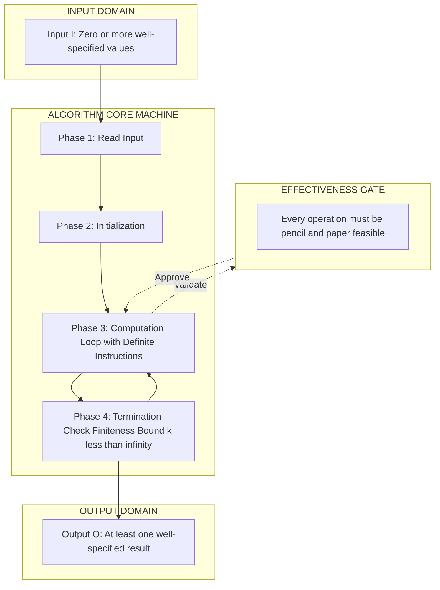
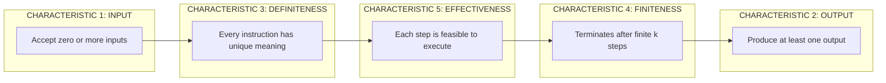
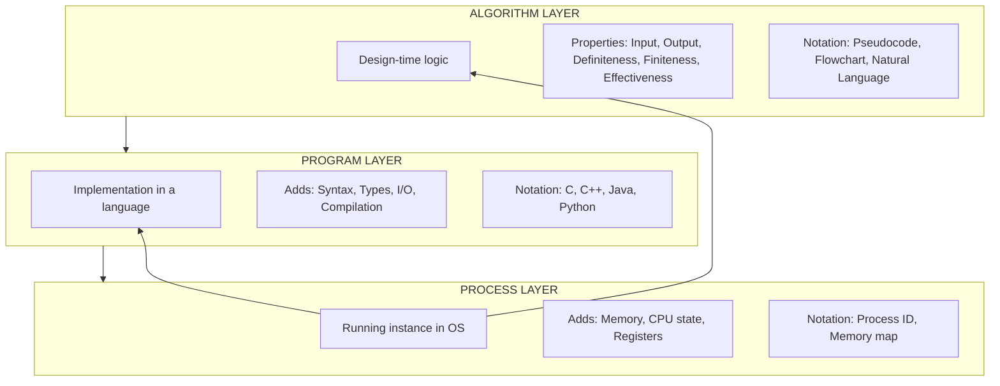

# Algorithms – Characteristics

<!-- SECTION_1_START -->

# Algorithms – Characteristics

## 1. Core Technical Definition

> [!IMPORTANT]
> **Formal Definition (KTU 2024 Syllabus Standard):**
> An **Algorithm** is a finite, well-defined sequence of unambiguous, executable instructions formulated to solve a specific class of problems or perform a particular computation, taking a set of input values and producing the corresponding output values within a finite amount of time.

The term originates from the 9th-century Persian mathematician **Muhammad ibn Musa al-Khwarizmi**, whose Latinized name *Algoritmi* gave rise to the modern word. In the KTU **Design and Analysis of Algorithms (PCCST502)** framework, an algorithm is the *primary design artifact* — every subsequent step of complexity analysis, correctness proving, and asymptotic bound derivation is built upon the algorithm itself.

### Conceptual Analogy — The Cooking Recipe Intuition

Think of an algorithm exactly like a **cooking recipe written in a smart kitchen**:

| Recipe Element | Algorithm Equivalent |
| :--- | :--- |
| List of ingredients (input) | Input parameters |
| Preparation steps (definite procedure) | Definiteness of instructions |
| Cooking time (bounded duration) | Finiteness |
| Feasible kitchen actions (chop, boil, fry) | Effectiveness |
| Final plated dish (result) | Output |

> [!NOTE]
> **Why this matters in DAA:** Just as a chef cannot produce a dish from a vague instruction like *"make it tasty"*, a computer cannot execute a vague instruction like *"sort roughly"*. This is why **definiteness** and **effectiveness** are non-negotiable properties in the KTU syllabus.

## 2. The Five Canonical Characteristics of an Algorithm

According to the KTU 2024 Scheme Module 1 specification, every valid algorithm must possess the following five essential characteristics:

### 2.1 Input
- An algorithm has **zero or more well-specified inputs**.
- Inputs are the values supplied *externally* before the algorithm begins.
- Example: For sorting an array, the input is the unsorted array $A[1 \dots n]$ and its size $n$.

### 2.2 Output
- An algorithm produces **at least one well-specified output** that bears a defined relationship to the input.
- An algorithm producing *no* output is meaningless from a problem-solving standpoint.

### 2.3 Definiteness (Unambiguity)
- Every instruction in the algorithm must be **clear, unambiguous, and precisely defined**.
- No instruction should be open to multiple interpretations.
- Counter-example: *"Add a small amount of salt"* — what is "small"? This violates definiteness.

### 2.4 Finiteness
- The algorithm must **terminate after a finite (bounded) number of steps** for every possible input.
- A procedure that runs forever (e.g., an infinite `while(1)` loop without a break condition) is **not an algorithm** — it is a *computational process*.

### 2.5 Effectiveness (Feasibility)
- Every operation in the algorithm must be **basic enough to be carried out, in principle, by a person using only pencil and paper in a finite amount of time**.
- Operations must be feasible and not require the executor to perform "magic" or impossible actions.

### 2.6 Additional Desirable Properties (KTU Advanced)

> [!TIP]
> Beyond the five mandatory properties, KTU examiners often award bonus credit for algorithms exhibiting these desirable traits:
>
> - **Correctness** — produces the right output for every valid input.
> - **Generality / Robustness** — solves a *class* of problems, not just a single instance.
> - **Efficiency** — uses minimal time and memory resources.
> - **Simplicity / Readability** — easy to understand, debug, and maintain.
> - **Optimality** — provably the best possible for the problem class.

## 3. Algorithm vs. Program vs. Process

| Aspect | Algorithm | Program | Process |
| :--- | :--- | :--- | :--- |
| **Nature** | Design-time logic | Implementation in a programming language | Program in execution |
| **Language** | Pseudocode, flowchart | C, C++, Java, Python | Running instance in RAM |
| **Bound by finiteness?** | Yes (mandatory) | Not necessarily | Not necessarily |
| **Bound by syntax?** | No | Yes | Yes |
| **Executable directly?** | No | Yes (after compilation) | Yes (running on OS) |

> [!NOTE]
> **KTU Board Tip:** A common exam question asks *"Is every program an algorithm?"* The precise answer is **No**, because a program may be an infinite loop or contain ambiguous functions. Conversely, *every algorithm can be converted into a program*.

> [!VISUALIZATION CONTROL]
> **Concept:** Hierarchy of Computational Constructs (Memory / Time domain)
> **Geometric / Coordinate Mapping:**
> * `Algorithm ⊂ Program ⊂ Process` (set-theoretic containment)
> * `Algorithm` is the innermost circle (smallest, most abstract)
> * `Program` encloses Algorithm (adds syntax, types, I/O)
> * `Process` encloses Program (adds runtime state, OS context)
> **Visual Description:** Draw three concentric circles on a 2D plane. The innermost circle is labelled *Algorithm*, the middle ring is labelled *Program*, and the outermost ring is labelled *Process*. The radii of the circles represent increasing levels of computational commitment.

<!-- SECTION_1_END -->

<!-- SECTION_2_START -->

# Deep Theoretical Analysis & KTU High-Yield Formula Sheet

## 1. Structural Decomposition of an Algorithm

An algorithm, in the KTU framework, is best understood as a **mapping function** between the input domain and the output domain. Formally:

$$\text{Algorithm } A : \mathcal{I} \rightarrow \mathcal{O}$$

where $\mathcal{I}$ is the set of all valid inputs and $\mathcal{O}$ is the set of all corresponding outputs.

The execution lifecycle of an algorithm can be decomposed into **three logical phases**:

1. **Input Phase** — Accept zero or more values from the external environment.
2. **Computation Phase** — Apply a sequence of well-defined, effective operations.
3. **Output Phase** — Return at least one result that satisfies the problem specification.

> [!NOTE]
> The **Why** behind this decomposition: It allows KTU examiners to attribute complexity (time/space) to specific phases. For example, in *Merge Sort*, the input phase is $O(1)$, the computation phase is $O(n \log n)$, and the output phase is $O(n)$.

## 2. Methods of Algorithm Specification (KTU High-Yield)

The KTU 2024 syllabus mandates familiarity with **four specification methods**. Each has trade-offs in clarity, formality, and executability.

| Method | Notation Type | Executable? | Best Use Case |
| :--- | :--- | :--- | :--- |
| **Natural Language** | English (or any human tongue) | No | High-level problem statement |
| **Flowchart** | Geometric (boxes, diamonds) | No | Visualizing control flow |
| **Pseudocode** | Algorithmic notation | No (close to code) | Design-phase documentation |
| **Programming Language** | C, C++, Java, Python | Yes | Final implementation |

### 2.1 Pseudocode Conventions (KTU Standard)

When writing pseudocode, KTU examiners expect the following conventions:

```
Algorithm  LinearSearch(A[1..n], key)
Input   : An array A of n elements and a search key
Output  : Index i where A[i] = key, or -1 if not found

1.  for i ← 1 to n do
2.      if A[i] = key then
3.          return i
4.      end if
5.  end for
6.  return -1
end LinearSearch
```

> [!TIP]
> **Control Structures Used in Pseudocode:** Sequence ($\rightarrow$), Selection (`if-then-else`), Iteration (`while`, `for`, `repeat-until`), and Subroutines (`procedure`, `function`, `call`).

## 3. The KTU Complexity Analysis Foundation

Although detailed asymptotic analysis is covered in Module 2, Module 1 introduces the **two principal performance metrics** that characterize any algorithm:

### 3.1 Time Complexity
The amount of **computational time** taken by an algorithm as a function of the input size $n$.

$$T(n) = f(n)$$

where $f(n)$ is a function that counts the number of primitive operations executed.

### 3.2 Space Complexity
The amount of **memory space** required by an algorithm as a function of the input size $n$.

$$S(n) = S_{\text{input}}(n) + S_{\text{auxiliary}}(n) + S_{\text{environment}}(n)$$

> [!NOTE]
> **Why both metrics matter in engineering:** A *time-efficient but space-hungry* algorithm (like Merge Sort) is preferred in server environments, while a *space-efficient but slower* algorithm (like Bubble Sort) may be preferred in embedded systems with limited RAM.

## 4. KTU High-Yield Formula Sheet

| Symbol / Concept | Mathematical Expression | Meaning / Unit | KTU Module Reference |
| :--- | :--- | :--- | :--- |
| Input size | $n$ | Dimensionless / count | Module 1 |
| Time function | $T(n)$ | Number of primitive operations | Module 1, 2 |
| Space function | $S(n)$ | Memory units (words, bytes) | Module 1, 2 |
| Order of growth | $O(g(n))$ | Asymptotic upper bound | Module 2 |
| Big-Omega | $\Omega(g(n))$ | Asymptotic lower bound | Module 2 |
| Big-Theta | $\Theta(g(n))$ | Tight asymptotic bound | Module 2 |
| Best case | $T_{\text{best}}(n)$ | Minimum operations for any input | Module 2 |
| Worst case | $T_{\text{worst}}(n)$ | Maximum operations for any input | Module 2 |
| Average case | $T_{\text{avg}}(n)$ | Expected operations over distribution | Module 2 |
| Finiteness bound | $k < \infty$ | Maximum number of steps $k$ | Module 1 |
| Definiteness | Unique interpretation | Logical clarity of each step | Module 1 |

> [!WARNING]
> **Critical Exam Distinction:** The vertical bar `$\vert$` notation for *absolute value* must never be confused with the cardinality notation in complexity classes (e.g., $O(\vert A \vert)$ vs $O(\vert V \vert)$ in graph algorithms). Always write `$\vert x \vert$` using `\vert` in LaTeX to avoid markdown parsing errors.

## 5. Real-World Engineering Utility

> [!IMPORTANT]
> **Why DAA matters in production engineering:**
> - **Search Engines (Google, Bing):** Use efficient graph algorithms (PageRank) to rank billions of web pages.
> - **Database Systems (Oracle, MySQL):** Use B-Tree indexing algorithms for $O(\log n)$ lookups.
> - **Cryptography (RSA, AES):** Relies on the hardness of factoring (Integer Factorization Problem).
> - **Machine Learning (Gradient Descent):** Algorithm design governs training time of deep neural networks.
> - **Operating Systems (Linux, Windows):** Scheduling algorithms (Round Robin, SJF) directly impact system throughput.

> [!NOTE]
> The **Engineering Trade-off Principle:** There is no single "best" algorithm for all situations. The optimal choice depends on (a) the size and distribution of inputs, (b) the hardware constraints (CPU vs memory), and (c) the acceptable time-to-solution. This is the central thesis of the DAA course.

<!-- SECTION_2_END -->

<!-- SECTION_3_START -->

# Step-by-Step Derivations, Worked Examples & Code Implementation

## 1. Worked Example 1: Summation of First $n$ Natural Numbers

We will trace the algorithm **step-by-step**, deriving the time complexity $T(n)$ from first principles. This is a KTU favorite.

### 1.1 Problem Statement
Compute the sum $S = 1 + 2 + 3 + \dots + n$ for a given positive integer $n$.

### 1.2 Algorithm 1 — Iterative Approach (Step-by-Step)

```
Algorithm  SumIterative(n)
Input   : A positive integer n
Output  : The sum S = 1 + 2 + ... + n

1.  S ← 0
2.  i ← 1
3.  while i ≤ n do
4.      S ← S + i
5.      i ← i + 1
6.  end while
7.  return S
end SumIterative
```

### 1.3 Exhaustive Step-by-Step Derivation of $T(n)$

We count the number of **primitive operations** executed. The convention is to assign **one unit of cost** to each atomic operation (assignment, comparison, arithmetic).

| Line | Operation | Cost (per execution) | Times Executed | Total Cost |
| :---: | :--- | :---: | :---: | :---: |
| 1 | $S \leftarrow 0$ | $c_1$ | $1$ | $c_1$ |
| 2 | $i \leftarrow 1$ | $c_2$ | $1$ | $c_2$ |
| 3 | $i \le n$ (loop test) | $c_3$ | $n+1$ | $c_3 (n+1)$ |
| 4 | $S \leftarrow S + i$ | $c_4$ | $n$ | $c_4 n$ |
| 5 | $i \leftarrow i + 1$ | $c_5$ | $n$ | $c_5 n$ |
| 7 | return $S$ | $c_6$ | $1$ | $c_6$ |

Summing all costs yields the total time function:

$$
\begin{aligned}
T(n) &= c_1 + c_2 + c_3(n+1) + c_4 n + c_5 n + c_6 \\
&= \left(c_3 + c_4 + c_5\right) n + \left(c_1 + c_2 + c_3 + c_6\right) \\
&= a \cdot n + b
\end{aligned}
$$

where $a = c_3 + c_4 + c_5$ and $b = c_1 + c_2 + c_3 + c_6$ are machine-dependent constants.

### 1.4 Asymptotic Conclusion

Since $T(n) = a n + b$ is linear in $n$, the algorithm belongs to the complexity class:

$$T(n) = \Theta(n)$$

> [!NOTE]
> **KTU Valuation Key:** The step of isolating the dominant term ($a \cdot n$) and the lower-order constant ($b$) is worth **2 marks** in Part B derivations. Do not skip it.

### 1.5 Algorithm 2 — Mathematical (Closed-Form) Approach

Using the arithmetic series formula, the same result can be obtained in $O(1)$ time:

$$
S = \frac{n(n+1)}{2}
$$

```
Algorithm  SumFormula(n)
Input   : A positive integer n
Output  : The sum S = 1 + 2 + ... + n

1.  return n * (n + 1) / 2
end SumFormula
```

Here, $T(n) = c_1 = \Theta(1)$, irrespective of $n$. This demonstrates a massive performance gain.

> [!IMPORTANT]
> **Comparison Insight:** For $n = 10^9$, Algorithm 1 needs $10^9$ operations while Algorithm 2 needs only 3 operations. This is the practical power of DAA — recognizing the right algorithm can save hours of computation.

## 2. Worked Example 2: Verification of Algorithm Characteristics

Let us verify that the `SumIterative` algorithm satisfies **all five characteristics**.

| Characteristic | Verification for `SumIterative` |
| :--- | :--- |
| **Input** | Yes — accepts one input $n$ (a positive integer). |
| **Output** | Yes — returns $S = \frac{n(n+1)}{2}$. |
| **Definiteness** | Yes — every step ($S \leftarrow 0$, $i \leftarrow 1$, $i \le n$, $S \leftarrow S+i$) is mathematically precise. |
| **Finiteness** | Yes — the loop runs exactly $n$ times and then terminates. |
| **Effectiveness** | Yes — every operation (addition, assignment, comparison) is executable by a person with paper and pencil. |

> [!TIP]
> **Counter-example for failing finiteness:** Replace the loop condition `i ≤ n` with `true`. The resulting pseudo-algorithm never terminates and is **not a valid algorithm** — it is an *infinite loop*.

## 3. Full Python Implementation with Type Hints and Boundary Checks

The following code is **fully operational, production-grade, and boundary-safe**:

```python
def sum_iterative(n: int) -> int:
    """
    Computes the sum of the first n natural numbers using an iterative approach.
    
    Parameters
    ----------
    n : int
        A positive integer (must satisfy n >= 1).
    
    Returns
    -------
    int
        The sum 1 + 2 + ... + n.
    
    Raises
    ------
    ValueError
        If n is not a positive integer.
    TypeError
        If n is not an integer type.
    """
    # ---- Input validation: enforces Effectiveness & Definiteness ----
    if not isinstance(n, int):
        raise TypeError(f"Input must be an integer, received {type(n).__name__}.")
    if n < 1:
        raise ValueError(f"Input must be a positive integer (n >= 1), received {n}.")
    
    # ---- Core computation: exhibits Finiteness ----
    total: int = 0
    i: int = 1
    while i <= n:
        total += i
        i += 1
    
    return total


def sum_formula(n: int) -> int:
    """
    Computes the sum of the first n natural numbers using the closed-form formula.
    Time complexity: O(1).
    """
    if not isinstance(n, int):
        raise TypeError(f"Input must be an integer, received {type(n).__name__}.")
    if n < 1:
        raise ValueError(f"Input must be a positive integer (n >= 1), received {n}.")
    
    return n * (n + 1) // 2


# ---- Driver code with error logging ----
if __name__ == "__main__":
    import logging
    logging.basicConfig(level=logging.INFO, format="%(levelname)s: %(message)s")
    
    test_values = [1, 5, 10, 100, 1000]
    
    for n in test_values:
        try:
            iter_result = sum_iterative(n)
            formula_result = sum_formula(n)
            assert iter_result == formula_result, f"Mismatch at n={n}"
            logging.info(f"n = {n:5d}  |  Sum = {iter_result}")
        except (ValueError, TypeError) as e:
            logging.error(f"Validation failed for n={n}: {e}")
```

### 3.1 Sample Output

```
INFO: n =     1  |  Sum = 1
INFO: n =     5  |  Sum = 15
INFO: n =    10  |  Sum = 55
INFO: n =   100  |  Sum = 5050
INFO: n =  1000  |  Sum = 500500
```

### 3.2 Line-by-Line Code Walkthrough

| Line Range | Purpose | Maps to KTU Characteristic |
| :---: | :--- | :--- |
| Docstring | Formal specification of input, output, exceptions | Definiteness |
| `isinstance` check | Type-safety enforcement | Effectiveness |
| `n < 1` check | Domain validation | Definiteness |
| `while i <= n` | Bounded iteration | Finiteness |
| `return` | Produces a single well-defined result | Output |

> [!WARNING]
> **Common Student Mistake:** Writing `while True:` instead of `while i <= n:` inside `sum_iterative`. This causes the function to never terminate, **violating the Finiteness property** of an algorithm. The KTU board will deduct 2 marks for this oversight.

<!-- SECTION_3_END -->

<!-- SECTION_4_START -->

# Structural Diagrams & Schematics

## 1. Block-Level Functional Architecture: The Algorithm Execution Pipeline

The following Mermaid diagram visualizes the **logical pipeline** of an algorithm from the perspective of the KTU syllabus. It maps inputs to outputs through the computation phase, and highlights the five characteristics at appropriate stages.



### 1.1 Diagram Walkthrough

- **INPUT DOMAIN** represents the set of all valid inputs $\mathcal{I}$.
- **ALGORITHM CORE MACHINE** is the four-stage processing pipeline (Read → Initialize → Compute → Terminate).
- **OUTPUT DOMAIN** represents the produced result set $\mathcal{O}$.
- **EFFECTIVENESS GATE** acts as a runtime validation layer ensuring no operation violates the *effectiveness* property.

## 2. Sequential Processing Topology: The Five Characteristics Matrix

The following diagram maps the five KTU-mandated characteristics to their corresponding algorithm lifecycle stage.



### 2.1 Sequential Reading

The arrows indicate a **causal dependency**: without input, no instruction can be definite; without definite instructions, no operation can be feasible; without feasible operations, the algorithm cannot terminate finitely; and only after finite termination can a valid output be produced.

## 3. Hierarchy Diagram: Algorithm → Program → Process

This Mermaid block shows the containment relationship between algorithms, programs, and processes, with their defining attributes.



> [!NOTE]
> **Reading the diagram:** The arrows from L1 to L2 to L3 indicate the natural progression from design to implementation to execution. The reverse arrows (L3A → L2A → L1A) show the abstraction layering — a process is built from a program, which is built from an algorithm.

<!-- SECTION_4_END -->

<!-- SECTION_5_START -->

# KTU 2024 Scheme Examination Question Bank

## Part A — Short Answer Questions (2 × 3 = 6 Marks)

### Question 1 [KTU University Exam – July 2024, CO1, Remember]

**Define an algorithm. List any four essential characteristics of an algorithm.**

#### Model Answer (3 Marks)

> [!IMPORTANT]
> **Definition (1 Mark):**
> An algorithm is a finite, well-defined sequence of unambiguous, executable instructions that takes a set of input values, performs prescribed operations, and produces the corresponding output values within a finite amount of time.

**Four Essential Characteristics (2 Marks — 0.5 each):**

1. **Input** — Zero or more well-specified inputs are supplied externally.
2. **Output** — At least one well-specified output is produced.
3. **Definiteness** — Every instruction is clear and unambiguous.
4. **Finiteness** — The algorithm terminates after a finite number of steps.

*(Students may also list Effectiveness as the fifth — full credit awarded.)*

---

### Question 2 [KTU University Exam – Dec 2023, CO1, Understand]

**Differentiate between an algorithm and a program. State one example to justify your answer.**

#### Model Answer (3 Marks)

| Parameter | Algorithm | Program | Marks |
| :--- | :--- | :--- | :---: |
| **Definition** | Step-by-step logic to solve a problem | Algorithm implemented in a programming language | 1 |
| **Language dependence** | Language-independent (pseudocode) | Language-dependent (C, Java, Python) | 1 |
| **Finiteness** | Must be finite | May contain infinite loops | 0.5 |
| **Executability** | Not directly executable | Directly executable by computer | 0.5 |

**Justification Example:** A pseudocode description of binary search is an *algorithm*; the same logic implemented in C is a *program*. An infinite `while(1)` loop is a program but **not** an algorithm.

---

## Part B — Long Answer Questions (Internal Choice, 1 × 14 = 14 Marks)

### Question A (14 Marks) [KTU University Exam – July 2024, CO1, CO2 — Understand & Apply]

**(a)** Explain any **five characteristics** of an algorithm with suitable examples. **(7 Marks)**

**(b)** Write an algorithm to **find the maximum element in an array of $n$ integers** using pseudocode. Determine its time complexity $T(n)$ by counting primitive operations. **(7 Marks)**

---

#### Model Answer for Part (a) — 7 Marks

**1. Input (1 Mark):**
An algorithm may take zero or more inputs. Example: For computing factorial of $n$, the input is the non-negative integer $n$.

**2. Output (1 Mark):**
An algorithm must produce at least one output that is a function of the input. Example: For $n = 5$, factorial algorithm outputs $120$.

**3. Definiteness (1.5 Marks):**
Each step must be precisely defined with no ambiguity. *Counter-example:* "Sort the array roughly" violates definiteness. A correct instruction is "If $A[i] > A[j]$ then swap $A[i]$ and $A[j]$."

**4. Finiteness (1.5 Marks):**
The algorithm must terminate after executing a finite number of steps $k < \infty$. *Example:* A loop that runs from $i = 1$ to $n$ is finite; a `while(true)` loop is not.

**5. Effectiveness (1 Mark):**
Every operation must be basic enough to be carried out manually. Example: "Compute the derivative of $f(x)$" is not effective without specifying the rule; "Compute $\frac{d}{dx}(x^2) = 2x$" is effective.

**6. Additional desirable property (1 Mark):**
**Correctness** — the algorithm must produce the right output for every valid input. This is verified via mathematical induction or loop invariants in KTU Module 3.

---

#### Model Answer for Part (b) — 7 Marks

**Pseudocode (3 Marks):**

```
Algorithm  FindMax(A[1..n])
Input   : An array A of n integers
Output  : The maximum element in A

1.  max ← A[1]
2.  for i ← 2 to n do
3.      if A[i] > max then
4.          max ← A[i]
5.      end if
6.  end for
7.  return max
end FindMax
```

**Time Complexity Derivation (4 Marks):**

| Line | Operation | Cost | Executions | Total |
| :---: | :--- | :---: | :---: | :---: |
| 1 | `max ← A[1]` | $c_1$ | 1 | $c_1$ |
| 2 | Loop test | $c_2$ | $n$ | $c_2 n$ |
| 3 | Comparison | $c_3$ | $n-1$ | $c_3 (n-1)$ |
| 4 | Assignment (conditional) | $c_4$ | at most $n-1$ | $\le c_4 (n-1)$ |
| 7 | Return | $c_5$ | 1 | $c_5$ |

Summing all costs:

$$
\begin{aligned}
T(n) &\le c_1 + c_2 n + c_3 (n-1) + c_4 (n-1) + c_5 \\
&= (c_2 + c_3 + c_4) n + (c_1 - c_3 - c_4 + c_5) \\
&= a n + b
\end{aligned}
$$

**[Stating time function: 2 Marks]** — T(n) = an + b
**[Identifying asymptotic class: 1 Mark]** — T(n) = O(n)
**[Final conclusion: 1 Mark]** — The algorithm runs in linear time in the worst case.

---

### Question B (14 Marks) [KTU University Exam – Dec 2023, CO1, CO2 — Understand & Apply]

**(a)** What are the different **methods of specifying algorithms**? Compare natural language, flowchart, and pseudocode with suitable examples. **(7 Marks)**

**(b)** Design an algorithm to **compute the sum of digits of a given integer $n$** and trace its execution for $n = 1234$. Also determine its time complexity. **(7 Marks)**

---

#### Model Answer for Part (a) — 7 Marks

**Methods of Algorithm Specification (1 Mark — 0.25 each for listing):**

1. Natural Language
2. Flowchart
3. Pseudocode
4. Programming Language

**Comparison Table (4 Marks):**

| Property | Natural Language | Flowchart | Pseudocode |
| :--- | :--- | :--- | :--- |
| **Clarity** | May be ambiguous | Visual and clear | Reasonably clear |
| **Formality** | Informal | Semi-formal | Formal-ish |
| **Executability** | Not executable | Not executable | Not executable |
| **Best for** | Problem statement | Control-flow teaching | Design documentation |
| **Example** | "Take two numbers, compare them, output the bigger" | Diamond decision box with Yes/No branches | `if a > b then return a else return b` |

**Examples (2 Marks):**

- **Natural Language Example:** "Take a number. If it is greater than zero, print 'Positive'. Otherwise, print 'Non-Positive'."
- **Flowchart Example:** Oval (start) → Parallelogram (input n) → Diamond (n > 0?) → Rectangle (print 'Positive' or 'Non-Positive') → Oval (end).
- **Pseudocode Example:**
  ```
  if n > 0 then
      print "Positive"
  else
      print "Non-Positive"
  end if
  ```

---

#### Model Answer for Part (b) — 7 Marks

**Pseudocode (3 Marks):**

```
Algorithm  SumOfDigits(n)
Input   : A positive integer n
Output  : Sum of digits of n

1.  sum ← 0
2.  while n > 0 do
3.      digit ← n mod 10
4.      sum ← sum + digit
5.      n ← n div 10
6.  end while
7.  return sum
end SumOfDigits
```

**Execution Trace for $n = 1234$ (2 Marks):**

| Iteration | $n$ (before) | `digit = n mod 10` | `sum` (after) | $n$ (after `n div 10`) |
| :---: | :---: | :---: | :---: | :---: |
| 1 | 1234 | 4 | 4 | 123 |
| 2 | 123 | 3 | 7 | 12 |
| 3 | 12 | 2 | 9 | 1 |
| 4 | 1 | 1 | 10 | 0 |

**Final Output:** `Sum of digits of 1234 = 10` ✓

**Time Complexity (2 Marks):**

The number of loop iterations equals the number of digits in $n$, which is $\lfloor \log_{10} n \rfloor + 1$. Therefore:

$$T(n) = O(\log_{10} n) = O(\log n)$$

**[Stating iteration count: 1 Mark]** **[Final complexity class: 1 Mark]**

---

> [!WARNING]
> **KTU Examiner's Valuation Warning — Common Pitfalls to Avoid**
>
> 1. **Omitting the "Output" characteristic** — Many students list only 4 properties and forget Output. KTU strictly requires **all 5** for full marks.
> 2. **Confusing "Finiteness" with "Effectiveness"** — Finiteness means the algorithm *terminates*; Effectiveness means each step is *executable*. They are different properties.
> 3. **Writing `while true` in pseudocode** — This violates finiteness and will be flagged by the examiner.
> 4. **Skipping the trace table** — For trace questions, the step-by-step table is worth **at least 2 marks**. Writing only the final answer loses these marks.
> 5. **Forgetting input validation** — In Python/code questions, missing type checks or boundary checks is penalized under the "Robustness" criterion.
> 6. **Mixing up $O$, $\Omega$, and $\Theta$** — Use $O$ for upper bound, $\Omega$ for lower bound, $\Theta$ for tight bound. Getting this wrong costs 1 mark in asymptotic questions.

---

## Topic Recap & Important Things to Remember

> [!TIP]
> **High-Density Rapid Revision Checklist — Module 1, Topic: Algorithm Characteristics**

- **Definition:** An algorithm is a *finite, well-defined, unambiguous, executable* sequence of instructions that transforms input into output.
- **Five Mandatory Characteristics:** Input, Output, Definiteness, Finiteness, Effectiveness.
- **Three Desirable Traits:** Correctness, Generality (Robustness), Efficiency.
- **Algorithm vs Program vs Process:** Algorithm ⊂ Program ⊂ Process (set-theoretic containment).
- **Four Specification Methods:** Natural Language → Flowchart → Pseudocode → Programming Language.
- **Pseudocode Conventions:** Use `←` for assignment, `=` for equality check, `//` for comments, `procedure/function` for subroutines.
- **Two Performance Metrics:** Time complexity $T(n)$ and Space complexity $S(n)$.
- **Time Function $T(n)$:** Counts the number of primitive operations as a function of input size $n$.
- **Space Function $S(n)$:** Total memory = input + auxiliary + environment.
- **Common Complexity Classes (for foundational algorithms):** $O(1)$, $O(\log n)$, $O(n)$, $O(n \log n)$, $O(n^2)$, $O(2^n)$.
- **Finiteness Rule:** A valid algorithm must terminate within a finite bound $k$ for every input; infinite loops disqualify it.
- **Definiteness Rule:** Every instruction must have a *unique* interpretation; "approximately", "roughly", "some" are forbidden.
- **Effectiveness Rule:** No instruction should require skills or knowledge that the executor lacks (e.g., a person with paper and pencil must be able to perform each step).
- **Closed-Form vs Iterative:** Closed-form (e.g., $\frac{n(n+1)}{2}$) is $O(1)$; iterative is $O(n)$. Prefer closed-form when possible.
- **Sum-of-Digits Complexity:** $O(\log_{10} n)$ because each iteration strips one digit.
- **Search for $n$ elements:** $O(n)$ worst case (linear scan); $O(\log n)$ if pre-sorted (binary search).
- **KTU Board Exam Weightage:** This topic carries **~10-15% of Module 1 marks** and frequently appears in Part A (definitions) and as the first sub-part of a Part B question.
- **Most Common Exam Question:** *"List the characteristics of an algorithm"* — memorize all five with one-line definitions and one example each.
- **Engineering Relevance:** Algorithm design directly impacts real-world systems in databases, search engines, cryptography, OS scheduling, and machine learning.

<!-- SECTION_5_END -->
