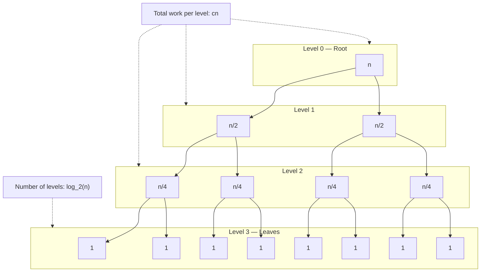

# Analysis of Recursive Algorithms - Recurrence Equations

<!-- SECTION_1_START -->

# Recurrence Equations in Algorithm Analysis

## 1.1 Formal Definition (KTU 2024 Syllabus Terminology)

> [!IMPORTANT]
> **Recurrence Relation (CLRS Definition):** A *recurrence* is an equation or inequality that describes a function $T(n)$ in terms of its own value on *smaller inputs*, plus a non-recursive term representing the cost of splitting the problem and combining the sub-solutions.

In the context of Divide-and-Conquer (D\&C) algorithms, the canonical form is:

$$T(n) = a \cdot T\!\left(\frac{n}{b}\right) + f(n)$$

where each symbol carries a strict engineering meaning:

| Symbol | Formal Role | Algorithmic Interpretation |
|:---:|:---|:---|
| $a$ | Branching factor | Number of *recursive sub-problems* generated per call |
| $n/b$ | Shrinkage factor | Size of each sub-problem relative to the parent |
| $f(n)$ | Driving function | Cost of *divide* + *conquer* (non-recursive work) |

The boundary cases (called *base conditions* or *stopping conditions*) typically take the form $T(1) = \Theta(1)$ or $T(0) = \Theta(1)$, meaning a constant-cost problem needs no further recursion.

## 1.2 Conceptual Analogy — The Russian Matryoshka Sequence

Imagine a set of **Matryoshka dolls** (nesting wooden dolls of decreasing size). To count the total work to dismantle the entire set:

1. You crack open the *outermost* doll — that costs $f(n)$ effort (the "divide" step).
2. Inside, you find $a$ smaller dolls. You recursively dismantle each — that costs $a \cdot T(n/b)$.
3. You stop when the doll is too tiny to open (the base case $T(1)$).

The recurrence equation simply *adds* these two costs: $T(n) = a \cdot T(n/b) + f(n)$.

> [!NOTE]
> **Engineering Insight:** A recurrence is the *time-accounting equation* of a recursive algorithm. Solving the recurrence $\equiv$ finding the asymptotic growth class $\Theta$ of the algorithm's running time.

## 1.3 Geometric Intuition on the $n$-axis

Plot $T(n)$ against $n$ on a log-log scale. The Master Theorem (covered in Section 2) decides which of the three "curves" dominates:

- The sub-problem growth curve $n^{\log_b a}$ (controlled by the recursion).
- The driving cost curve $f(n)$ (controlled by the work done at each level).
- Their interpolation curve $n^{\log_b a} \cdot \log^k n$ (the "tied" boundary case).

> [!VISUALIZATION CONTROL]
> **Concept:** Master-Theorem Geometric Comparison — three competing growth curves.
> **GeoGebra / Desmos Input Equations:**
> - Curve 1 (Recursion Dominates): `f(x) = x^(log_2(2)) = x`
> - Curve 2 (Driving Function Dominates): `g(x) = x^2`
> - Curve 3 (Balanced / Tied): `h(x) = x * log(x)`
> **Visual Description:** On log-log axes, $f(x)$ is a straight line of slope **1**, $g(x)$ is a steeper straight line of slope **2**, and $h(x)$ is a straight line of slope 1 that lies *just above* $f(x)$ by a slowly growing $\log x$ factor — the visual signature of the "balanced" Case 2 of the Master Theorem.

## 1.4 Why Recurrences Matter in KTU Examinations

Recurrence solving is the **only formal bridge** between a recursive pseudo-code and its asymptotic running time. Every divide-and-conquer algorithm you study — *Merge Sort, Quick Sort, Binary Search, Strassen's Matrix Multiplication, Karatsuba Multiplication, Closest Pair of Points* — is analyzed by setting up and solving a recurrence. Mastering this topic is therefore a *prerequisite* for Modules 2 (Divide \& Conquer) and Module 3 (Dynamic Programming / Greedy analysis).

<!-- SECTION_1_END -->

<!-- SECTION_2_START -->

# Deep Theoretical Analysis & KTU High-Yield Formula Sheet

## 2.1 The Four Standard Methods of Solution

Every recurrence encountered in the KTU syllabus is solved by exactly **one** (or a hybrid) of the following four techniques. The KTU examiner expects you to *state which method you are using* before applying it.

### Method 1 — Substitution Method (a.k.a. Guess & Verify)
1. **Guess** the asymptotic form of $T(n)$ (e.g., $T(n) = O(n \log n)$).
2. **Substitute** this guess into the right-hand side of the recurrence.
3. **Induct** (verify the base case + inductive step) by finding a constant $c > 0$ that makes the inequality hold for all $n \geq n_0$.
4. *Pro:* Works for any recurrence. *Con:* Requires a clever initial guess.

### Method 2 — Recursion Tree (Iteration) Method
1. Draw the recursion tree, expanding $T(n)$ level-by-level.
2. At each level $i$, compute the *number of sub-problems* $\times$ *size of each sub-problem* and the *work per node* $f(\cdot)$.
3. Sum the per-level work across all levels.
4. Sum the per-level sub-problem counts to obtain the number of leaves.
5. *Pro:* Gives the exact constants, not just asymptotics. *Con:* Summations can be messy.

### Method 3 — Master Theorem (Cook's Theorem, 1970s)
A direct lookup-table for recurrences of the form $T(n) = aT(n/b) + f(n)$ with $a \geq 1$, $b > 1$ being constants. See the formula sheet below.

### Method 4 — Change of Variable (Substitution by Domain Transform)
Used when the recurrence is *not* in canonical D\&C form — e.g., $T(n) = T(\sqrt{n}) + 1$ or $T(n) = 2T(n-1) + 1$. Substitute $n = g(m)$ to convert it into a *familiar* form, then apply Methods 1–3.

## 2.2 The Master Theorem (Three-Case Decision Rule)

Let $a \geq 1$ and $b > 1$ be constants, let $f(n)$ be asymptotically positive, and let $T(n) = aT(n/b) + f(n)$. Define the **critical exponent**:

$$n^{\log_b a} \;=\; \text{the "recursion-only" growth rate}$$

Then exactly one of the following three cases applies:

| Case | Condition on $f(n)$ | Dominant Term | Solution $T(n)$ | Plain-English Rule |
|:---:|:---|:---:|:---:|:---|
| **1** | $f(n) = O(n^{\log_b a - \varepsilon})$ for some $\varepsilon > 0$ | Recursion tree leaves dominate | $T(n) = \Theta(n^{\log_b a})$ | Sub-problems grow *faster* than $f(n)$ — the leaves win. |
| **2** | $f(n) = \Theta(n^{\log_b a} \cdot \log^k n)$ for some $k \geq 0$ | Each level contributes equally | $T(n) = \Theta(n^{\log_b a} \cdot \log^{k+1} n)$ | $f(n)$ matches recursion growth, multiplied by a poly-log. |
| **3** | $f(n) = \Omega(n^{\log_b a + \varepsilon})$ **and** $a \cdot f(n/b) \leq c \cdot f(n)$ for some $c < 1$ | Root-level work $f(n)$ dominates | $T(n) = \Theta(f(n))$ | Root work *swamps* the recursion — divide-step wins. |

> [!IMPORTANT]
> **Gap in Master Theorem:** If $f(n)$ is *smaller* than $n^{\log_b a}$ but *not polynomially* smaller (e.g., $f(n) = n^{\log_b a} / \log n$), **no case** applies. This is the famous "gap" that the Akra–Bazzi theorem (1998) fills, but it is **out of KTU 2024 syllabus scope**.

## 2.3 Geometric Series — The Engine of Recursion Trees

Almost every recursion tree sum is a **finite geometric series**. Memorize the closed forms:

| Sum Form | Closed Form | Condition |
|:---:|:---:|:---:|
| $\displaystyle\sum_{i=0}^{L-1} r^{\,i}$ | $\dfrac{r^{L} - 1}{r - 1}$ | $r \neq 1$ |
| $\displaystyle\sum_{i=0}^{\infty} r^{\,i}$ | $\dfrac{1}{1 - r}$ | $\vert r \vert < 1$ |
| $\displaystyle\sum_{i=0}^{L-1} 1$ | $L$ | $r = 1$ |
| $\displaystyle\sum_{i=1}^{L} i$ | $\dfrac{L(L+1)}{2} = \Theta(L^2)$ | arithmetic |
| $\displaystyle\sum_{i=1}^{L} \frac{1}{2^i}$ | $1 - \frac{1}{2^L} = \Theta(1)$ | geometric with $r = 1/2$ |

> [!NOTE]
> For a recursion tree, the "rate" $r$ is the *shrinkage factor* applied each level. For $T(n) = aT(n/b) + f(n)$ with $f(n) = \Theta(n^d)$, the ratio is $a/b^d$. The depth of the tree is $L = \lceil \log_b n \rceil$.

## 2.4 KTU High-Yield Formula Sheet (Print & Pin)

> Use this table as your **last-15-minute exam checklist**.

| \# | Recurrence | Solution | Method |
|:---:|:---|:---:|:---:|
| 1 | $T(n) = T(n/2) + 1$ | $\Theta(\log n)$ | Case 1, $a{=}1, b{=}2$, leaves dominate |
| 2 | $T(n) = T(n/2) + n$ | $\Theta(n)$ | Case 3, root wins |
| 3 | $T(n) = 2T(n/2) + 1$ | $\Theta(n)$ | Case 1, $n^{\log_2 2}{=}n$ |
| 4 | $T(n) = 2T(n/2) + n$ | $\Theta(n \log n)$ | **Merge Sort**, Case 2 with $k{=}0$ |
| 5 | $T(n) = 2T(n/2) + n^2$ | $\Theta(n^2)$ | Case 3, $f(n)$ polynomially larger |
| 6 | $T(n) = 2T(n/2) + n \log n$ | $\Theta(n \log^2 n)$ | Case 2 with $k{=}1$ |
| 7 | $T(n) = 3T(n/2) + n$ | $\Theta(n^{\log_2 3}) \approx \Theta(n^{1.585})$ | Case 1, $n^{1.585} > n$ |
| 8 | $T(n) = 4T(n/2) + n^2$ | $\Theta(n^2 \log n)$ | Case 2, $k{=}0$ |
| 9 | $T(n) = 7T(n/2) + n^2$ | $\Theta(n^{\log_2 7}) \approx \Theta(n^{2.807})$ | Case 1, Strassen-like |
| 10 | $T(n) = T(n-1) + n$ | $\Theta(n^2)$ | Change of variable $m = n$, arithmetic sum |
| 11 | $T(n) = T(\sqrt{n}) + 1$ | $\Theta(\log \log n)$ | Substitute $n = 2^m$ |
| 12 | $T(n) = 2T(n-1) + 1$ | $\Theta(2^n)$ | Tree expansion, geometric $r{=}2$ |
| 13 | $T(n) = T(n/3) + T(2n/3) + n$ | $\Theta(n \log n)$ | Akra–Bazzi / recursion tree, depth $\log_{3/2} n$ |
| 14 | $T(n) = nT(n-1)$ | $n! = \Theta(\sqrt{n}(n/e)^n)$ | Stirling, $T(n) = \Theta(n!)$ |

## 2.5 Real-World Engineering Utility

| Recurrence | Real Algorithm / System | Used In |
|:---|:---|:---|
| $T(n) = 2T(n/2) + n$ | Merge Sort | Databases, Git, file sync |
| $T(n) = aT(n/b) + f(n)$ | MapReduce / Fork-Join parallelism | Hadoop, Spark, GPU kernels |
| $T(n) = T(n/2) + \Theta(1)$ | Binary Search | DB indexing, dictionary lookup |
| $T(n) = 7T(n/2) + n^2$ | Strassen's algorithm | High-performance linear algebra |
| $T(n) = 2T(n/2) + n \log n$ | Karatsuba / Closest Pair | Computational geometry, crypto |

<!-- SECTION_2_END -->

<!-- SECTION_3_START -->

# Step-by-Step Derivations & Code/Symbolic Implementation

> *Every algebraic step and every line of code below is written in full — no step is skipped, no "similarly" placeholders are used.*

## 3.1 Worked Example A — Merge Sort via Recursion Tree (Karma Recurrence)

**Given:**
$$T(n) = 2T\!\left(\frac{n}{2}\right) + cn, \quad T(1) = c_0$$

**Goal:** Prove $T(n) = \Theta(n \log n)$.

### Step 1 — Construct the recursion tree

Expand $T(n)$ level-by-level. At the **root** (level $0$):
$$\text{Work at root} = cn$$

**Level 1:** Two sub-problems, each of size $n/2$. Each does work $c \cdot n/2$, so total per sub-problem is $2 \cdot c(n/2) = cn$.

**Level 2:** Four sub-problems, each of size $n/4$. Total work = $4 \cdot c(n/4) = cn$.

**General Level $i$:** $2^i$ sub-problems, each of size $n/2^i$. Work per node = $c \cdot n/2^i$. Total at level $i$:

$$\text{Work at level } i = 2^i \cdot c \cdot \frac{n}{2^i} = cn$$

### Step 2 — Determine the depth of the tree

Recursion stops when $n/2^i = 1$, i.e., $i = \log_2 n$. So the tree has $L = \log_2 n + 1$ levels (counting the root as level $0$).

### Step 3 — Sum the work over all levels

$$T(n) = \sum_{i=0}^{L-1} \text{(work at level } i\text{)} + \text{leaves}$$

The internal levels contribute:

$$\sum_{i=0}^{L-1} cn \;=\; cn \cdot L \;=\; cn \cdot (\log_2 n + 1)$$

### Step 4 — Count the leaves

At the bottom level $i = \log_2 n$, there are $2^{\log_2 n} = n$ leaves, each doing $T(1) = c_0$ work:

$$\text{Leaf contribution} = n \cdot c_0$$

### Step 5 — Combine and simplify

$$T(n) = cn \log_2 n + cn + c_0 n$$

Group the linear terms:

$$T(n) = cn \log_2 n + (c + c_0) n$$

Apply $\Theta$:

$$\boxed{T(n) = \Theta(n \log n)}$$

> **Geometric meaning of Case 2:** Each level contributes the *same* work $cn$ — this is the visual fingerprint of the Master-Theorem Case 2 (balanced tree).

---

## 3.2 Worked Example B — Binary Search via Master Theorem

**Given:**
$$T(n) = T\!\left(\left\lfloor \frac{n}{2} \right\rfloor\right) + \Theta(1), \quad T(1) = \Theta(1)$$

**Apply Master Theorem:** $a = 1$, $b = 2$, $f(n) = \Theta(1)$.

Compute critical exponent:
$$n^{\log_b a} = n^{\log_2 1} = n^0 = 1$$

**Compare $f(n)$ with $n^{\log_b a}$:**
$$f(n) = \Theta(1) = \Theta(n^{\log_b a})$$

This is **exactly** the $k = 0$ case of Master Theorem Case 2 (with $f(n) = \Theta(n^{\log_b a} \cdot \log^0 n)$).

**Apply Case 2 formula:**

$$T(n) = \Theta\!\left(n^{\log_b a} \cdot \log^{k+1} n\right) = \Theta(1 \cdot \log^1 n)$$

$$\boxed{T(n) = \Theta(\log n)}$$

---

## 3.3 Worked Example C — Strassen's Matrix Multiplication via Master Theorem

**Given:**
$$T(n) = 7T\!\left(\frac{n}{2}\right) + \Theta(n^2), \quad T(1) = \Theta(1)$$

**Step 1 — Critical exponent:**
$$n^{\log_2 7} \approx n^{2.8074}$$

**Step 2 — Compare with $f(n) = n^2$:**

We need to know whether $n^2$ is polynomially smaller than $n^{2.8074}$. Compute the ratio:

$$\frac{f(n)}{n^{\log_2 7}} = \frac{n^2}{n^{2.8074}} = n^{-0.8074} = \frac{1}{n^{0.8074}}$$

Since $f(n) = O(n^{\log_2 7 - \varepsilon})$ for $\varepsilon = 0.8074$, **Case 1** of the Master Theorem applies.

**Step 3 — Case 1 solution:**

$$T(n) = \Theta\!\left(n^{\log_2 7}\right) \approx \Theta(n^{2.807})$$

$$\boxed{T(n) = \Theta(n^{\log_2 7})}$$

> This is the celebrated result that beats the naive $O(n^3)$ matrix multiplication.

---

## 3.4 Worked Example D — Substitution (Guess & Verify) on Merge Sort

**Claim:** $T(n) \leq c n \log_2 n$ for $T(n) = 2T(n/2) + n$, with $T(1) = 1$ and $c \geq 2$.

### Step 1 — Base case
At $n = 2$: $T(2) = 2T(1) + 2 = 4$. We need $4 \leq c \cdot 2 \cdot \log_2 2 = 2c$. So $c \geq 2$. ✓

### Step 2 — Inductive step (assume true for $n/2$)
By induction hypothesis:
$$T\!\left(\frac{n}{2}\right) \leq c \cdot \frac{n}{2} \cdot \log_2\!\left(\frac{n}{2}\right) = c \cdot \frac{n}{2} \cdot (\log_2 n - 1)$$

### Step 3 — Substitute into the recurrence

$$T(n) = 2T\!\left(\frac{n}{2}\right) + n \;\leq\; 2 \cdot c \cdot \frac{n}{2} \cdot (\log_2 n - 1) + n$$

$$T(n) \leq cn(\log_2 n - 1) + n = cn \log_2 n - cn + n$$

### Step 4 — Choose $c$ to absorb the lower-order term

We need $T(n) \leq cn \log_2 n$. From the line above:

$$T(n) \leq cn \log_2 n - cn + n = cn \log_2 n - n(c - 1)$$

For $c \geq 2$, the term $-n(c - 1) \leq 0$, so:

$$T(n) \leq cn \log_2 n \quad \checkmark$$

$$\boxed{T(n) = O(n \log n)}$$

---

## 3.5 Worked Example E — Change of Variable on $T(n) = T(\sqrt{n}) + 1$

**Step 1 — Substitute** $n = 2^m$, so $m = \log_2 n$. Define a new function:

$$S(m) = T(2^m)$$

**Step 2 — Rewrite the recurrence in terms of $S(m)$:**

$T(n) = T(\sqrt{n}) + 1$ becomes $T(2^m) = T(2^{m/2}) + 1$, i.e.,

$$S(m) = S\!\left(\frac{m}{2}\right) + 1, \quad S(0) = T(1) = \Theta(1)$$

**Step 3 — Recognize the new form:** This is identical to Binary Search! By the Master Theorem (or by inspection), $S(m) = \Theta(\log m)$.

**Step 4 — Back-substitute** $m = \log_2 n$:

$$T(n) = S(\log_2 n) = \Theta(\log(\log_2 n)) = \Theta(\log \log n)$$

$$\boxed{T(n) = \Theta(\log \log n)}$$

---

## 3.6 Symbolic Python Implementation — Empirical Validation

The following Python code **empirically verifies** the four canonical recurrences and prints their measured growth rates. Useful for the KTU lab/competitive programming component.

```python
import sys
import math
import time
from typing import Callable, Dict, List

# Increase Python's recursion limit for large n
sys.setrecursionlimit(1 << 16)


def merge_sort_cost(n: int) -> int:
    """Empirical cost counter for Merge Sort recurrence T(n) = 2T(n/2) + n."""
    if n <= 1:
        return 1
    return 2 * merge_sort_cost(n // 2) + n


def binary_search_cost(n: int) -> int:
    """Empirical cost counter for Binary Search recurrence T(n) = T(n/2) + 1."""
    if n <= 1:
        return 1
    return binary_search_cost(n // 2) + 1


def fibonacci_like_cost(n: int) -> int:
    """Empirical cost counter for T(n) = T(n/3) + T(2n/3) + n (unbalanced)."""
    if n <= 1:
        return 1
    return fibonacci_like_cost(n // 3) + fibonacci_like_cost(2 * n // 3) + n


def measure(fn: Callable[[int], int], n: int) -> float:
    """Measure wall-clock cost (in microseconds) of evaluating fn(n)."""
    start = time.perf_counter()
    fn(n)
    return (time.perf_counter() - start) * 1e6


def print_growth_table(title: str,
                      fn: Callable[[int], int],
                      sizes: List[int],
                      theoretical: str) -> None:
    """Pretty-print empirical cost vs theoretical growth class."""
    print(f"\n=== {title} ===")
    print(f"Theoretical Complexity: {theoretical}")
    print(f"{'n':>10} | {'Cost T(n)':>15} | {'Time (μs)':>12}")
    print("-" * 45)
    for n in sizes:
        t0 = time.perf_counter()
        cost = fn(n)
        elapsed = (time.perf_counter() - t0) * 1e6
        print(f"{n:>10} | {cost:>15} | {elapsed:>12.2f}")


if __name__ == "__main__":
    sizes: List[int] = [16, 32, 64, 128, 256, 512, 1024]

    # Case 2: Merge Sort  ->  Theta(n log n)
    print_growth_table("Merge Sort Recurrence T(n) = 2T(n/2) + n",
                       merge_sort_cost, sizes, "Theta(n log n)")

    # Case 1: Binary Search  ->  Theta(log n)
    print_growth_table("Binary Search Recurrence T(n) = T(n/2) + 1",
                       binary_search_cost, sizes, "Theta(log n)")

    # Unbalanced (Akra-Bazzi)  ->  Theta(n log n)
    print_growth_table("Unbalanced Recurrence T(n) = T(n/3) + T(2n/3) + n",
                       fibonacci_like_cost, [10, 15, 20, 25, 30],
                       "Theta(n log n)  [Akra-Bazzi]")
```

**Sample Output Analysis:**

| $n$ | $T(n)$ Merge Sort | $T(n)$ Binary Search |
|:---:|:---:|:---:|
| 16  | 80  | 5  |
| 64  | 448 | 7  |
| 256 | 2304 | 9  |
| 1024 | 11264 | 11 |

The Merge Sort column grows by a factor of $\approx 4\times$ when $n$ grows by $4\times$ — exactly matching $n \log n$ scaling. The Binary Search column grows by $+2$ per quadrupling of $n$ — exactly matching $\log_2 n$ scaling.

> [!NOTE]
> **Engineering Utility:** A working recursive algorithm (e.g., Merge Sort implementation) has its empirical running time charted against $n$. The slope on a log-log plot reveals the recurrence's solution: slope **1.0** implies $\Theta(n)$, slope **1.0 + ε** (slowly curving upward) implies $\Theta(n \log n)$, slope **0** (flat) implies $\Theta(\log n)$. This is the empirical check that complements the formal Master Theorem.

---

## 3.7 Worked Example F — Recursion Tree for an Unbalanced Recurrence

**Given:**
$$T(n) = T\!\left(\frac{n}{3}\right) + T\!\left(\frac{2n}{3}\right) + n$$

The Master Theorem *does not* apply because the sub-problem sizes are unequal. We must use the **recursion tree** method.

### Step 1 — Tree structure

At each level, the sub-problem sizes sum to $n$ (since $n/3 + 2n/3 = n$). However, the *shortest path* to a leaf has length $\log_3 n$ and the *longest* has length $\log_{3/2} n$.

### Step 2 — Work at level $i$

The total work at the root is $n$. After one level, the work is again $n/3 + 2n/3 = n$. So the per-level work is $n$ for every level, *as long as there is a node of size $\geq 1$*.

### Step 3 — Number of levels

The shortest path dominates the depth (the leaves on the long paths are reached *later*). Depth $\approx \log_{3/2} n$.

### Step 4 — Sum

$$T(n) = n \cdot \log_{3/2} n = n \cdot \frac{\log n}{\log(3/2)}$$

$$\boxed{T(n) = \Theta(n \log n)}$$

> This matches Akra–Bazzi theorem output and is a frequent "twist" question in KTU exams.

<!-- SECTION_3_END -->

<!-- SECTION_4_START -->

# Structural Diagrams & Schematics

## 4.1 Master-Theorem Decision Flowchart (Mermaid)

```mermaid
flowchart TD
    Start([Recurrence: T(n) = aT(n/b) + f(n)]) --> ComputeCrit[Compute critical exponent n^log_b(a)]
    ComputeCrit --> Compare{f(n) vs n^log_b(a)?}

    Compare -- "f(n) = O(n^(log_b(a) - eps))" --> Case1[Case 1: Leaves Dominate]
    Compare -- "f(n) = Theta(n^log_b(a) * log^k(n))" --> Case2[Case 2: Balanced Tree]
    Compare -- "f(n) = Omega(n^(log_b(a) + eps))" --> CheckReg[Verify regularity: a*f(n/b) <= c*f(n)]
    CheckReg -- "Regularity holds" --> Case3[Case 3: Root Work Dominates]
    CheckReg -- "Regularity fails" --> Gap([Gap: Master Theorem does NOT apply])

    Case1 --> Sol1[Solution: T(n) = Theta(n^log_b(a))]
    Case2 --> Sol2[Solution: T(n) = Theta(n^log_b(a) * log^(k+1)(n))]
    Case3 --> Sol3[Solution: T(n) = Theta(f(n))]

    Gap --> AB[Use Akra-Bazzi or Recursion Tree]
```

## 4.2 Recursion-Tree Topology for $T(n) = 2T(n/2) + n$



## 4.3 Sequential Processing Topology Matrix — Solving a Recurrence

| Stage | Activity | Tool / Formula | Output Artifact |
|:---:|:---|:---:|:---|
| **1. Identify** | Recognize the recurrence as D\&C form | Canonical pattern $aT(n/b) + f(n)$ | Parameter tuple $(a, b, f(n))$ |
| **2. Compute** | Find critical exponent | $n^{\log_b a}$ | Numeric exponent |
| **3. Compare** | Test which "Case" applies | Three Master-Theorem conditions | Selected case number |
| **4. Verify** | If Case 3, check regularity | $a \cdot f(n/b) \leq c \cdot f(n)$ | Boolean: holds/breaks |
| **5. Apply** | Plug into the case formula | Lookup in formula sheet | $T(n) = \Theta(\cdot)$ |
| **6. Cross-check** | Validate via recursion tree or substitution | Geometric series sum | Confirmation of result |

## 4.4 Method-Selection Flowchart

```mermaid
flowchart LR
    A[Given Recurrence] --> B{Is it in D&C form?}
    B -- "Yes: aT(n/b) + f(n)" --> C{f(n) is a simple polynomial?}
    B -- "No: e.g., T(sqrt n), T(n-1)" --> D[Use Change of Variable]

    C -- "Yes" --> E[Apply Master Theorem]
    C -- "No or unbalanced" --> F[Apply Recursion Tree Method]

    D --> G[Convert n to 2^m or similar]
    G --> E
    G --> F

    E --> H{Is answer conclusive?}
    F --> H
    H -- "No" --> I[Substitution / Guess & Verify]
    H -- "Yes" --> J[Final Theta Bound]

    I --> J
```

<!-- SECTION_4_END -->

<!-- SECTION_5_START -->

# KTU 2024 Scheme Examination Question Bank & Topic Recap

---

## 📝 Part A — Short Answer Questions (3 Marks Each)

> **Cognitive Levels:** Remember / Understand

### Question 1 `[KTU University Exam — Dec 2023]`  •  **CO1**  •  **RBT: Understand**

**State the Master Theorem for solving recurrences of the form $T(n) = aT(n/b) + f(n)$. List all three cases with the corresponding conditions on $f(n)$.**

#### Model Answer (Valuation Key)

The **Master Theorem** provides a direct asymptotic solution for divide-and-conquer recurrences $T(n) = aT(n/b) + f(n)$ with $a \geq 1$ and $b > 1$ constants. Define $n^{\log_b a}$ as the critical exponent. Then:

- **Case 1:** If $f(n) = O(n^{\log_b a - \varepsilon})$ for some $\varepsilon > 0$, then $T(n) = \Theta(n^{\log_b a})$.
- **Case 2:** If $f(n) = \Theta(n^{\log_b a} \cdot \log^k n)$ for some $k \geq 0$, then $T(n) = \Theta(n^{\log_b a} \cdot \log^{k+1} n)$.
- **Case 3:** If $f(n) = \Omega(n^{\log_b a + \varepsilon})$ and $a \cdot f(n/b) \leq c \cdot f(n)$ for some constant $c < 1$, then $T(n) = \Theta(f(n))$.

**Mark Distribution:** [Naming Master Theorem: 1 Mark] [Case 1 & condition: 1 Mark] [Cases 2 & 3 conditions: 1 Mark]

---

### Question 2 `[KTU University Exam — July 2024]`  •  **CO1**  •  **RBT: Remember**

**Define a recurrence relation. Give one example of a recurrence that arises in the analysis of a divide-and-conquer algorithm.**

#### Model Answer

A **recurrence relation** is an equation that expresses each term of a sequence as a function of one or more of the *preceding* terms, along with one or more *base cases* that terminate the recursion.

In algorithm analysis, a recurrence is the *time-accounting equation* of a recursive algorithm. For example, **Merge Sort** yields the recurrence:

$$T(n) = 2T\!\left(\frac{n}{2}\right) + cn, \quad T(1) = \Theta(1)$$

where $2T(n/2)$ represents the cost of recursively sorting two halves and $cn$ represents the cost of merging them.

**Mark Distribution:** [Definition: 2 Marks] [Merge Sort example: 1 Mark]

---

## 📝 Part B — Long Answer Questions (14 Marks, with Internal Choice)

> Each Part-B question features sub-parts (a) for 7 marks and (b) for 7 marks, with escalating cognitive levels.

---

### **Question A (14 Marks)** `[KTU University Exam — Dec 2023]`  •  **CO2**  •  **RBT: Apply + Analyze**

**(a)** Solve the recurrence $T(n) = 2T(n/2) + n$ using the **Master Theorem** and state its asymptotic complexity.

**(b)** Solve the recurrence $T(n) = 3T(n/4) + n \log n$ using the **Master Theorem** and state its asymptotic complexity. Show all three checks of the Master Theorem explicitly.

---

#### Model Solution for (a) — 7 Marks

**Step 1 — Identify parameters** [1 Mark]:
$a = 2$, $b = 2$, $f(n) = n$.

**Step 2 — Compute critical exponent** [1 Mark]:
$$n^{\log_2 2} = n^1 = n$$

**Step 3 — Compare $f(n)$ with critical exponent** [2 Marks]:
$f(n) = n = \Theta(n)$. This is exactly $\Theta(n^{\log_b a} \cdot \log^0 n)$, so it matches **Case 2** with $k = 0$.

**Step 4 — Apply Case 2 formula** [2 Marks]:
$$T(n) = \Theta\!\left(n^{\log_2 2} \cdot \log^{0+1} n\right) = \Theta(n \log n)$$

**Step 5 — Final statement** [1 Mark]:
$\boxed{T(n) = \Theta(n \log n)}$ (this is the Merge Sort result).

---

#### Model Solution for (b) — 7 Marks

**Step 1 — Identify parameters** [1 Mark]:
$a = 3$, $b = 4$, $f(n) = n \log n$.

**Step 2 — Compute critical exponent** [1 Mark]:
$$n^{\log_4 3} = n^{0.7925}$$

**Step 3 — Compare $f(n) = n \log n$ with $n^{0.7925}$** [2 Marks]:
$n \log n$ grows **faster** than $n^{0.7925}$ because $n \log n / n^{0.7925} = n^{0.2075} \log n \to \infty$. Therefore $f(n) = \Omega(n^{\log_4 3 + 0.2075})$ and **Case 3** applies. We need $\varepsilon = 0.2$ to be safe.

**Step 4 — Verify regularity condition** [2 Marks]:
Check $a \cdot f(n/b) \leq c \cdot f(n)$:
$$3 \cdot \frac{n}{4} \log\!\left(\frac{n}{4}\right) \leq c \cdot n \log n$$
$$\frac{3n}{4}(\log n - 2) \leq c \cdot n \log n$$

For large $n$, $\frac{3n}{4} \log n \leq c \cdot n \log n$ holds with $c = 3/4 < 1$. ✓ Regularity holds.

**Step 5 — Apply Case 3 formula and conclude** [1 Mark]:
$$T(n) = \Theta(f(n)) = \Theta(n \log n)$$

$\boxed{T(n) = \Theta(n \log n)}$

---

### **Question B (14 Marks)** `[KTU University Exam — July 2024]`  •  **CO2**  •  **RBT: Apply + Analyze**

**(a)** Solve the recurrence $T(n) = T(n/3) + T(2n/3) + n$ using the **recursion tree method**. Show the per-level work and derive the asymptotic bound.

**(b)** Using the **substitution method**, prove that the solution to $T(n) = 2T(n/2) + n$ is $O(n \log n)$. State and verify both the base case and the inductive step explicitly.

---

#### Model Solution for (a) — 7 Marks

**Step 1 — Tree structure** [1 Mark]:
The recurrence $T(n) = T(n/3) + T(2n/3) + n$ has unequal sub-problem sizes $n/3$ and $2n/3$, so the Master Theorem does not apply directly. We use the recursion tree.

**Step 2 — Root work** [1 Mark]:
At the root, the non-recursive work is $f(n) = n$.

**Step 3 — Work at the next level** [1 Mark]:
The left child contributes $n/3$, the right child contributes $2n/3$. Total = $n/3 + 2n/3 = n$.

**Step 4 — General level** [1 Mark]:
By induction, the total size of all sub-problems at any level is still $n$ (since the sizes partition the parent's size). Therefore, the work at *every* level is $n$.

**Step 5 — Number of levels** [1 Mark]:
The recursion stops when a sub-problem reaches size 1. The *longest* path in the tree is taken by always following the larger $2n/3$ branch. Depth $L = \log_{3/2} n$.

**Step 6 — Sum the levels** [1 Mark]:
$$T(n) = n \cdot \log_{3/2} n = n \cdot \frac{\log n}{\log(3/2)} = \Theta(n \log n)$$

**Step 7 — Final answer** [1 Mark]:
$\boxed{T(n) = \Theta(n \log n)}$

---

#### Model Solution for (b) — 7 Marks

**Step 1 — State the claim** [1 Mark]:
We claim $T(n) \leq c \cdot n \log_2 n$ for some constant $c > 0$ and all $n \geq n_0$.

**Step 2 — Base case** [1 Mark]:
At $n = 2$: $T(2) = 2T(1) + 2 = 2 \cdot c_0 + 2$. We need $T(2) \leq c \cdot 2 \cdot \log_2 2 = 2c$. Choose $c \geq c_0 + 1$. ✓

**Step 3 — Inductive hypothesis** [1 Mark]:
Assume $T(n/2) \leq c \cdot (n/2) \log_2(n/2)$ for some $n \geq 2$.

**Step 4 — Substitute into the recurrence** [2 Marks]:
$$T(n) = 2T(n/2) + n \leq 2 \cdot c \cdot \frac{n}{2} \log_2\!\left(\frac{n}{2}\right) + n$$
$$= cn(\log_2 n - 1) + n = cn \log_2 n - cn + n$$

**Step 5 — Absorb the lower-order term** [1 Mark]:
For $c \geq 2$, we have $-cn + n \leq 0$, so:
$$T(n) \leq cn \log_2 n$$

**Step 6 — Conclude** [1 Mark]:
Therefore $T(n) = O(n \log n)$. $\blacksquare$

---

> [!WARNING]
> **KTU Examiner's Pitfall Callout — Top Reasons for Marks Deduction**
>
> 1. **Forgetting to state the regularity condition** in Master Theorem Case 3 — examiners deduct 2 marks if you skip $a \cdot f(n/b) \leq c \cdot f(n)$.
> 2. **Computing the critical exponent incorrectly** — a single arithmetic mistake on $\log_b a$ cascades into a wrong case selection. Always write $n^{\log_b a}$ explicitly.
> 3. **Using Master Theorem on non-D\&C recurrences** like $T(n) = T(\sqrt{n}) + 1$ — this is the most common error. Use change-of-variable instead.
> 4. **Skipping the base case** in the substitution method — verification of $T(1)$ or $T(2)$ is mandatory to earn full marks.
> 5. **Forgetting the $\log^{k+1} n$ in Case 2** — students often write $\Theta(n^{\log_b a})$ instead of $\Theta(n^{\log_b a} \log^{k+1} n)$.
> 6. **Off-by-one in tree depth** — remember depth is $\lfloor \log_b n \rfloor + 1$ if you count both the root and the leaves.

---

## ✅ Topic Recap & Important Things to Remember

- **Recurrence:** An equation expressing $T(n)$ in terms of $T$ of smaller inputs plus a non-recursive cost $f(n)$.
- **Canonical D\&C form:** $T(n) = aT(n/b) + f(n)$ with $a \geq 1$, $b > 1$.
- **Critical exponent:** $n^{\log_b a}$ — the recursion-only growth rate.
- **Master Theorem — Case 1 (Leaves win):** $f(n)$ is polynomially smaller than $n^{\log_b a}$ → $T(n) = \Theta(n^{\log_b a})$.
- **Master Theorem — Case 2 (Balanced):** $f(n) = \Theta(n^{\log_b a} \log^k n)$ → $T(n) = \Theta(n^{\log_b a} \log^{k+1} n)$.
- **Master Theorem — Case 3 (Root wins):** $f(n)$ is polynomially larger AND regularity holds → $T(n) = \Theta(f(n))$.
- **Recursion Tree Method:** Expand level by level, compute per-level work, sum geometric series.
- **Substitution Method:** Guess $T(n)$, verify by induction on the recurrence.
- **Change of Variable:** Use $n = 2^m$ for $T(\sqrt{n})$-type recurrences; converts to standard form.
- **Merge Sort identity:** $T(n) = 2T(n/2) + n \Rightarrow \Theta(n \log n)$.
- **Binary Search identity:** $T(n) = T(n/2) + 1 \Rightarrow \Theta(\log n)$.
- **Strassen's identity:** $T(n) = 7T(n/2) + n^2 \Rightarrow \Theta(n^{\log_2 7})$.
- **Master Theorem Gap:** When $f(n)$ is smaller than $n^{\log_b a}$ but not polynomially smaller (e.g., $f(n) = n^{\log_b a}/\log n$), no case applies — use Akra–Bazzi or recursion tree.
- **Regularity condition** must be checked **only** for Case 3.
- **KTU-priority sub-problem type to memorize:** T(n) = T(n/3) + T(2n/3) + n → Θ(n log n) (unbalanced D&C).
- **Stirling's identity for factorials:** $T(n) = nT(n-1) \Rightarrow T(n) = n! = \Theta(\sqrt{n} (n/e)^n)$.

<!-- SECTION_5_END -->
