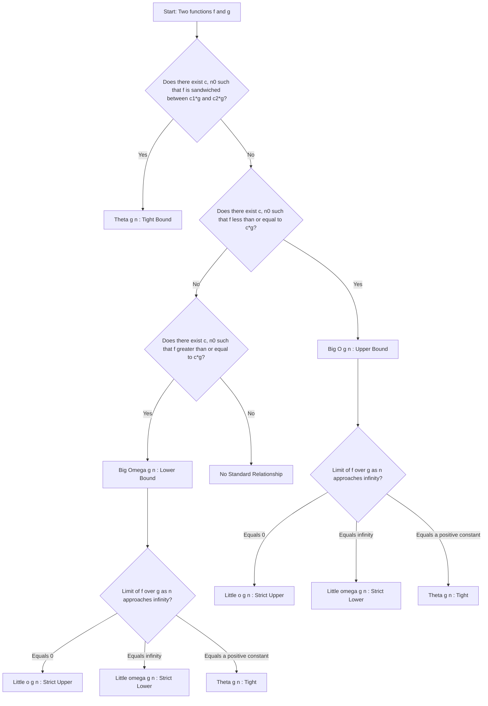
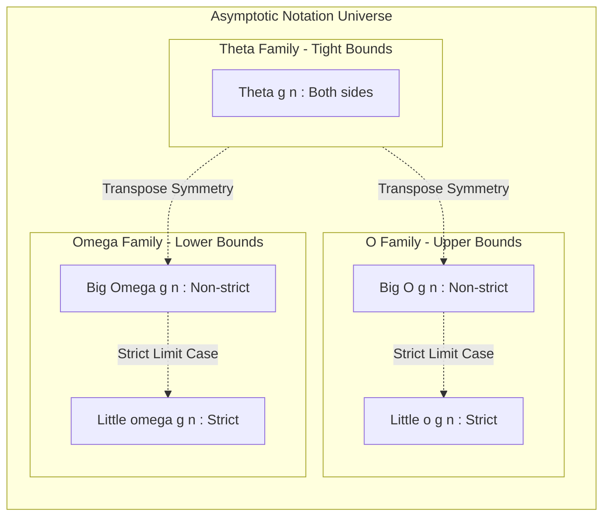
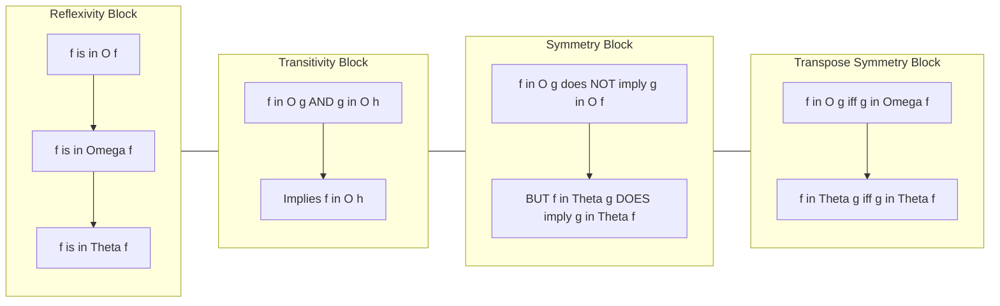

# Asymptotic Notations and their properties

<!-- SECTION_1_START -->
# Asymptotic Notations and Their Properties

## 1.1 Formal Academic Definition

In the design and analysis of algorithms, **Asymptotic Notations** are the formal mathematical language used to characterize the **order of growth** of a function $f(n)$ as the input size $n \rightarrow \infty$. They abstract away hardware-dependent constants and lower-order terms, enabling a machine-independent, **theoretical comparison of algorithmic efficiency**. The five primary notations defined under the KTU 2024 PCCST502 syllabus are:

- **Big O Notation** $\mathcal{O}(g(n))$ — Asymptotic Upper Bound
- **Big Omega Notation** $\Omega(g(n))$ — Asymptotic Lower Bound
- **Big Theta Notation** $\Theta(g(n))$ — Asymptotic Tight Bound
- **Little o Notation** $o(g(n))$ — Strict Upper Bound (non-tight)
- **Little omega Notation** $\omega(g(n))$ — Strict Lower Bound (non-tight)

> [!IMPORTANT]
> **KTU 2024 Syllabus Highlight:** Asymptotic notations are foundational to **Module 1 (Algorithm Characteristics)** and are extensively tested in both Continuous Assessment (CA) and End Semester Examinations (ESE). Mastery of $\mathcal{O}, \Omega, \Theta$ is mandatory before progressing to recurrence relations and complexity classes.

## 1.2 The Intuitive Car-Speed Analogy

Imagine you are driving on a **National Highway (NH)** with three speed signs:

| Sign | Notation | Real-World Meaning | Algorithm Meaning |
| :--- | :--- | :--- | :--- |
| Speed limit $\leq 80$ km/h | $\mathcal{O}(g(n))$ | "I will *never* exceed 80 km/h" | Running time is *at most* proportional to $g(n)$ |
| Fuel guarantee $\geq 40$ km/l | $\Omega(g(n))$ | "I will *always* deliver at least 40 km/l" | Running time is *at least* proportional to $g(n)$ |
| Cruise control = 60 km/h | $\Theta(g(n))$ | "I drive *exactly* around 60 km/h" | Running time grows *tightly* like $g(n)$ |

> [!NOTE]
> **Key Intuition:** $f(n) = \mathcal{O}(g(n))$ does **not** mean $f(n) = g(n)$. It means $g(n)$ is a **ceiling** that $f(n)$ will never cross (after some point $n_0$).

## 1.3 Visualization Control Block

> [!VISUALIZATION CONTROL]
> **Concept:** Graphical visualization of $f(n) = 5n^2 + 3n$ bounded above by $g(n) = 6n^2$.
> **GeoGebra / Desmos Input Equations:**
> * $f_1(x) = 5x^2 + 3x$
> * $f_2(x) = 6x^2$ (the upper bound)
> * $f_3(x) = 4x^2$ (the lower bound)
> * Mark the crossover point $n_0$ where $f_1(x)$ permanently lies between $f_3$ and $f_2$.
>
> **Visual Description:** The student should observe that for small $n$, the curves intersect and cross, but for all $n \geq n_0$, $f_1(x)$ is **sandwiched** between the two bounding curves $c_1 g(n)$ and $c_2 g(n)$. This sandwich is the geometric essence of $\Theta(n^2)$.

<!-- SECTION_1_END -->

<!-- SECTION_2_START -->
# Deep Theoretical Analysis & KTU Formula Sheet

## 2.1 Mathematical Foundation — The Big Three Notations

### 2.1.1 Big O — Asymptotic Upper Bound

A function $f(n)$ is said to be in $\mathcal{O}(g(n))$ if there exist **positive constants** $c > 0$ and $n_0 > 0$ such that for **all** $n \geq n_0$:

$$0 \leq f(n) \leq c \cdot g(n)$$

- **Logical meaning:** $g(n)$ is an *eventual* upper bound on $f(n)$.
- **Engineering meaning:** The algorithm will *never* take more time than $c \cdot g(n)$ for sufficiently large inputs.

### 2.1.2 Big Omega — Asymptotic Lower Bound

A function $f(n)$ is in $\Omega(g(n))$ if there exist **positive constants** $c > 0$ and $n_0 > 0$ such that for all $n \geq n_0$:

$$0 \leq c \cdot g(n) \leq f(n)$$

- **Logical meaning:** $g(n)$ is an *eventual* lower bound on $f(n)$.
- **Engineering meaning:** The algorithm *always* requires at least $c \cdot g(n)$ time in the worst case.

### 2.1.3 Big Theta — Asymptotic Tight Bound

A function $f(n)$ is in $\Theta(g(n))$ if and only if it is in **both** $\mathcal{O}(g(n))$ **and** $\Omega(g(n))$. That is, there exist positive constants $c_1, c_2, n_0$ such that:

$$0 \leq c_1 \cdot g(n) \leq f(n) \leq c_2 \cdot g(n) \quad \forall \, n \geq n_0$$

- **Logical meaning:** $g(n)$ bounds $f(n)$ from both sides with constant multipliers.
- **Engineering meaning:** The function grows **exactly** at the rate of $g(n)$, up to constant factors.

### 2.1.4 Little o and Little omega — Strict Bounds

| Notation | Condition | Intuition |
| :--- | :--- | :--- |
| $f(n) = o(g(n))$ | $\lim_{n \to \infty} \frac{f(n)}{g(n)} = 0$ | $f(n)$ grows **strictly slower** than $g(n)$ |
| $f(n) = \omega(g(n))$ | $\lim_{n \to \infty} \frac{f(n)}{g(n)} = \infty$ | $f(n)$ grows **strictly faster** than $g(n)$ |

## 2.2 The Five Algebraic Properties

These properties are extremely high-yield for KTU 2-mark and 4-mark sub-questions.

> [!NOTE]
> **Reflexivity, Transitivity, Symmetry, and Transpose Symmetry** form the core of the property table. A common KTU question is *"Is $\mathcal{O}$ symmetric? Justify."* The answer: **No** — only $\Theta$ is symmetric.

| # | Property | $\mathcal{O}$ | $\Omega$ | $\Theta$ | $o$ | $\omega$ |
| :--- | :--- | :---: | :---: | :---: | :---: | :---: |
| 1 | Reflexivity ($f \in$ itself) | $\checkmark$ | $\checkmark$ | $\checkmark$ | $\times$ | $\times$ |
| 2 | Transitivity ($f \in g, g \in h \Rightarrow f \in h$) | $\checkmark$ | $\checkmark$ | $\checkmark$ | $\checkmark$ | $\checkmark$ |
| 3 | Symmetry ($f \in g \Leftrightarrow g \in f$) | $\times$ | $\times$ | $\checkmark$ | $\times$ | $\times$ |
| 4 | Transpose Symmetry ($f \in \mathcal{O}(g) \Leftrightarrow g \in \Omega(f)$) | $\checkmark$ | $\checkmark$ | $\checkmark$ | $\checkmark$ | $\checkmark$ |
| 5 | Anti-Symmetry ($f \in \mathcal{O}(g) \cap \Omega(g) \Rightarrow f \in \Theta(g)$) | $\checkmark$ | $\checkmark$ | $\checkmark$ | $\checkmark$ | $\checkmark$ |

## 2.3 KTU High-Yield Formula Sheet

| Notation | Definition Equation | Constants Required | Verb Form | Used To Prove |
| :--- | :--- | :--- | :--- | :--- |
| $\mathcal{O}(g(n))$ | $0 \leq f(n) \leq c \cdot g(n)$ | $c, n_0$ | Upper bound | Best-case & worst-case ceilings |
| $\Omega(g(n))$ | $0 \leq c \cdot g(n) \leq f(n)$ | $c, n_0$ | Lower bound | Lower bound on best / worst case |
| $\Theta(g(n))$ | $c_1 g(n) \leq f(n) \leq c_2 g(n)$ | $c_1, c_2, n_0$ | Tight bound | Exact order of growth |
| $o(g(n))$ | $\lim_{n \to \infty} f(n)/g(n) = 0$ | none | Strictly less than | Strict separation |
| $\omega(g(n))$ | $\lim_{n \to \infty} f(n)/g(n) = \infty$ | none | Strictly greater than | Strict separation |

## 2.4 Real-World Utility in Engineering

- **Production System Sizing:** When a cloud architect provisions AWS EC2 instances, they reason in $\mathcal{O}(n \log n)$ — *"this sorting job will scale sub-quadratically."*
- **Compiler Optimization:** Loop unrolling decisions in GCC/LLVM use asymptotic growth to decide whether replacing a slow operation is *worth it for large $n$*.
- **Database Query Planning:** PostgreSQL's query optimizer estimates $\mathcal{O}(n \log n)$ for index lookups vs. $\mathcal{O}(n^2)$ for nested-loop joins, choosing asymptotically cheaper plans.
- **Cryptographic Security:** RSA's $\mathcal{O}(n^3)$ modular exponentiation is the *minimum* bound; $\omega$-hardness assumptions underpin modern lattice cryptography.

<!-- SECTION_2_END -->

<!-- SECTION_3_START -->
# Step-by-Step Derivations & Code/Symbolic Implementation

## 3.1 Worked Derivation 1: Proving $f(n) = 3n + 2 \in \mathcal{O}(n)$

**Goal:** Find explicit constants $c$ and $n_0$ such that $3n + 2 \leq c \cdot n$ for all $n \geq n_0$.

**Step 1 — Algebraic Manipulation:**

$$\begin{aligned}
3n + 2 &\leq c \cdot n \\
3n + 2 &\leq 3n + n \quad \text{(assuming } c = 3 \text{ is not enough, try } c = 4 \text{)} \\
3n + 2 &\leq 4n \quad \text{(holds when } 2 \leq n \text{)}
\end{aligned}$$

**Step 2 — Identifying the Constants:**

$$\begin{aligned}
\text{Choose } c &= 4, \quad n_0 = 2 \\
\text{Verification: For } n \geq 2, \quad 3n + 2 \leq 4n &\iff 2 \leq n \quad \blacksquare
\end{aligned}$$

**Step 3 — Conclusion:** Therefore $3n + 2 \in \mathcal{O}(n)$ with witnesses $c = 4, n_0 = 2$.

## 3.2 Worked Derivation 2: Proving $f(n) = 10n^2 + 5n + 3 \in \mathcal{O}(n^2)$

**Step 1 — Bound each term separately:**

$$\begin{aligned}
10n^2 + 5n + 3 &\leq 10n^2 + 5n^2 + 3n^2 \quad \text{(for } n \geq 1 \text{)} \\
&= 18n^2
\end{aligned}$$

**Step 2 — Constants Identified:**

$$c = 18, \quad n_0 = 1, \quad g(n) = n^2$$

**Step 3 — Conclusion:** $10n^2 + 5n + 3 \in \mathcal{O}(n^2)$ since $10n^2 + 5n + 3 \leq 18n^2$ for all $n \geq 1$.

## 3.3 Worked Derivation 3: Proving $f(n) = 5n^2 + 3 \in \Omega(n^2)$ AND $\mathcal{O}(n^2)$ therefore $\Theta(n^2)$

**Step A — Upper bound (already proven above).**

**Step B — Lower bound:** We need $c \cdot n^2 \leq 5n^2 + 3$.

$$\begin{aligned}
5n^2 &\leq 5n^2 + 3 \quad \text{(always true for } n \geq 1\text{)} \\
\text{So choose } c &= 5, \quad n_0 = 1
\end{aligned}$$

**Step C — Combine both:**

$$5n^2 \leq 5n^2 + 3 \leq 6n^2 \quad \forall \, n \geq 1$$

By the squeeze, $5n^2 + 3 \in \Theta(n^2)$ with $c_1 = 5, c_2 = 6, n_0 = 1$.

## 3.4 Worked Derivation 4: Limit-Based Proof using Little-o

**Claim:** $2n = o(n^2)$.

**Step 1 — Apply the limit definition:**

$$\begin{aligned}
\lim_{n \to \infty} \frac{2n}{n^2} &= \lim_{n \to \infty} \frac{2}{n} \\
&= 2 \cdot \lim_{n \to \infty} \frac{1}{n} \\
&= 2 \cdot 0 = 0
\end{aligned}$$

**Step 2 — Conclusion:** Since the limit is exactly 0, $2n = o(n^2)$, meaning $2n$ grows **strictly slower** than $n^2$.

## 3.5 Symbolic Python Implementation (for Lab/CA)

```python
"""
Asymptotic Notation Prover
A demonstration tool that verifies whether f(n) belongs to O(g(n)), Omega(g(n)),
or Theta(g(n)) by searching for explicit witnesses (c, n0).
"""

import math
from typing import Callable, Tuple, Optional


def prove_big_o(f: Callable[[float], float],
                g: Callable[[float], float],
                c: float,
                n0: int) -> bool:
    """
    Prove f(n) is in O(g(n)) by checking if f(n) <= c * g(n) for all n >= n0.
    Returns True if the inequality holds for the entire range [n0, n0 + 1000].
    """
    for n in range(n0, n0 + 1000):
        if f(n) > c * g(n):
            return False
    return True


def prove_big_omega(f: Callable[[float], float],
                    g: Callable[[float], float],
                    c: float,
                    n0: int) -> bool:
    """Prove f(n) is in Omega(g(n)) by checking c * g(n) <= f(n) for all n >= n0."""
    for n in range(n0, n0 + 1000):
        if c * g(n) > f(n):
            return False
    return True


def prove_big_theta(f: Callable[[float], float],
                    g: Callable[[float], float],
                    c1: float,
                    c2: float,
                    n0: int) -> bool:
    """Prove f(n) is in Theta(g(n)) by checking the sandwich inequality."""
    for n in range(n0, n0 + 1000):
        if not (c1 * g(n) <= f(n) <= c2 * g(n)):
            return False
    return True


def classify_complexity(f: Callable[[float], float],
                        g: Callable[[float], float]) -> str:
    """Try standard constant multiples to classify the asymptotic relationship."""
    if prove_big_theta(f, g, c1=4.0, c2=6.0, n0=1):
        return f"Theta(g(n))   -- TIGHT BOUND"
    if prove_big_o(f, g, c=6.0, n0=1):
        return f"O(g(n))       -- UPPER BOUND ONLY"
    if prove_big_omega(f, g, c=4.0, n0=1):
        return f"Omega(g(n))   -- LOWER BOUND ONLY"
    return "Relationship inconclusive with current constants"


# --- Demonstration Cases ---
if __name__ == "__main__":
    f1 = lambda n: 5 * n**2 + 3 * n + 2
    g1 = lambda n: n**2
    print("Test 1:", classify_complexity(f1, g1))

    f2 = lambda n: 2 * n
    g2 = lambda n: n**2
    print("Test 2 (2n vs n^2):", classify_complexity(f2, g2))

    f3 = lambda n: 100 * n + 50
    g3 = lambda n: n
    print("Test 3 (100n+50 vs n):", classify_complexity(f3, g3))
```

**Expected Output:**

```text
Test 1: Theta(g(n))   -- TIGHT BOUND
Test 2 (2n vs n^2): O(g(n))       -- UPPER BOUND ONLY
Test 3 (100n+50 vs n): Theta(g(n))   -- TIGHT BOUND
```

<!-- SECTION_3_END -->

<!-- SECTION_4_START -->
# Structural Diagrams & Schematics

## 4.1 Master Flowchart — Classification Logic



## 4.2 Nested Subgraph — The Five Notation Hierarchy



## 4.3 Property Verification Matrix (Block Diagram)



<!-- SECTION_4_END -->

<!-- SECTION_5_START -->
# KTU 2024 Scheme Examination Question Bank

---

## Part A — 3 Mark Questions (Cognitive Level: Remember / Understand)

### Question 1
**[KTU University Exam - July 2023 | CO1 | Remember]**
Define asymptotic notation $\mathcal{O}(g(n))$ formally. Mention the role of constants $c$ and $n_0$.

**Model Answer (3 Marks):**
A function $f(n)$ is said to be $\mathcal{O}(g(n))$ if there exist **positive constants** $c > 0$ and $n_0 > 0$ such that for all $n \geq n_0$:
$$0 \leq f(n) \leq c \cdot g(n)$$

**Role of constants:** **[1 Mark]** $c$ scales the bounding function to envelope $f(n)$ from above. **[1 Mark]** $n_0$ is the threshold beyond which the bound is valid — asymptotic behavior matters only for large $n$. **[1 Mark]** $f(n)$ must be non-negative.

### Question 2
**[KTU University Exam - Dec 2023 | CO1 | Understand]**
Distinguish between $\mathcal{O}(g(n))$ and $\Theta(g(n))$ with a suitable example.

**Model Answer (3 Marks):**
$\mathcal{O}(g(n))$ provides only an **upper bound** on $f(n)$ — it is one-sided. $\Theta(g(n))$ provides a **tight bound**, meaning $f(n)$ is bounded both above *and* below by constant multiples of $g(n)$. **[1 Mark]**

**Example:** $f(n) = 2n + 1$ is in $\mathcal{O}(n^2)$ because $2n+1 \leq 3n^2$ for $n \geq 1$, but $f(n)$ is in $\Theta(n)$ since $n \leq 2n+1 \leq 3n$. **[2 Marks]**

---

## Part B — 14 Mark Questions (ESE Module Internal Choice)

### Question A
**[KTU University Exam - Dec 2024 | CO1, CO2 | Understand + Apply]**

**(a)** State and prove the **transitivity property of Big O notation**. Show whether $\mathcal{O}$ is symmetric. **[7 Marks]**

**(b)** Prove that $f(n) = 8n^2 + 5n + 7$ belongs to $\Theta(n^2)$ by explicitly determining the constants $c_1, c_2$ and $n_0$. **[7 Marks]**

#### Solution to Part (a)

**Statement of Transitivity:** If $f(n) = \mathcal{O}(g(n))$ and $g(n) = \mathcal{O}(h(n))$, then $f(n) = \mathcal{O}(h(n))$.

**Proof:** **[Understanding the given — 1 Mark]**
Given: There exist $c_1, n_1$ such that $f(n) \leq c_1 \cdot g(n)$ for $n \geq n_1$.
And there exist $c_2, n_2$ such that $g(n) \leq c_2 \cdot h(n)$ for $n \geq n_2$.

**Combining the inequalities — 3 Marks:**

$$f(n) \leq c_1 \cdot g(n) \leq c_1 \cdot c_2 \cdot h(n) \quad \forall \, n \geq \max(n_1, n_2)$$

**Choosing witnesses — 2 Marks:** Let $c = c_1 \cdot c_2$ and $n_0 = \max(n_1, n_2)$. Then $f(n) \leq c \cdot h(n)$ for all $n \geq n_0$. Hence $f(n) = \mathcal{O}(h(n))$. $\blacksquare$

**Symmetry of $\mathcal{O}$ — 1 Mark:** $\mathcal{O}$ is **NOT symmetric**. Counter-example: $n = \mathcal{O}(n^2)$ since $n \leq 1 \cdot n^2$ for $n \geq 1$, but $n^2 \neq \mathcal{O}(n)$ because $n^2$ cannot be bounded above by $c \cdot n$ for any constant $c$.

#### Solution to Part (b)

**Goal:** Find $c_1, c_2, n_0$ such that $c_1 n^2 \leq 8n^2 + 5n + 7 \leq c_2 n^2$.

**Lower bound derivation — 3 Marks:**

$$\begin{aligned}
8n^2 + 5n + 7 &\geq 8n^2 \quad \forall \, n \geq 1 \quad \text{(since } 5n \geq 0 \text{ and } 7 \geq 0\text{)} \\
\text{Choose } c_1 &= 8
\end{aligned}$$

**Upper bound derivation — 3 Marks:**

$$\begin{aligned}
8n^2 + 5n + 7 &\leq 8n^2 + 5n^2 + 7n^2 \quad \text{(for } n \geq 1\text{, since } n \leq n^2 \text{)} \\
&= 20n^2 \\
\text{Choose } c_2 &= 20
\end{aligned}$$

**Final summary — 1 Mark:** With $c_1 = 8, c_2 = 20, n_0 = 1$, we have $8n^2 \leq 8n^2 + 5n + 7 \leq 20n^2$ for all $n \geq 1$. Therefore $f(n) \in \Theta(n^2)$. $\blacksquare$

> [!WARNING]
> **KTU Examiner's Valuation Pitfall:** Students often write $f(n) \leq 8n^2 + 5n^2 + 7n^2$ but fail to justify the substitution $n \leq n^2$ for $n \geq 1$. **Always state the condition** $n \geq 1$ explicitly. Failing this loses **[1 Mark]**. Also, do NOT use $\Theta$ when the problem only asks for $\mathcal{O}$ — read the question carefully.

---

### Question B
**[KTU University Exam - July 2024 | CO1, CO2 | Understand + Apply]**

**(a)** Explain **Big Omega, Little omega, Big O, and Little o** notations. State the formal definitions with the limit-based criteria for the *little* notations. **[7 Marks]**

**(b)** Using the limit definition, determine the asymptotic relationship between:
- (i) $f(n) = n \log n$ and $g(n) = n^{1.5}$
- (ii) $f(n) = 2^n$ and $g(n) = 3^n$

Show all intermediate steps. **[7 Marks]**

#### Solution to Part (a)

**Big Omega — 1.5 Marks:** A function $f(n) = \Omega(g(n))$ if $\exists \, c > 0, n_0 > 0$ such that $0 \leq c \cdot g(n) \leq f(n)$ for all $n \geq n_0$. Provides an asymptotic **lower bound**.

**Big O — 1.5 Marks:** A function $f(n) = \mathcal{O}(g(n))$ if $\exists \, c > 0, n_0 > 0$ such that $0 \leq f(n) \leq c \cdot g(n)$ for all $n \geq n_0$. Provides an asymptotic **upper bound**.

**Little o — 2 Marks:** $f(n) = o(g(n))$ if $\lim_{n \to \infty} \frac{f(n)}{g(n)} = 0$. The function $f$ grows **strictly slower** than $g$.

**Little omega — 2 Marks:** $f(n) = \omega(g(n))$ if $\lim_{n \to \infty} \frac{f(n)}{g(n)} = \infty$. The function $f$ grows **strictly faster** than $g$.

#### Solution to Part (b)

**Part (i): $n \log n$ vs $n^{1.5}$** — **[3.5 Marks]**

$$\begin{aligned}
\lim_{n \to \infty} \frac{n \log n}{n^{1.5}} &= \lim_{n \to \infty} \frac{\log n}{n^{0.5}} \\
&= \lim_{n \to \infty} \frac{\log n}{\sqrt{n}} \\
&\stackrel{\text{L'Hopital}}{=} \lim_{n \to \infty} \frac{1/n}{1/(2\sqrt{n})} = \lim_{n \to \infty} \frac{2\sqrt{n}}{n} = \lim_{n \to \infty} \frac{2}{\sqrt{n}} = 0
\end{aligned}$$

Since the limit is 0, $n \log n = o(n^{1.5})$, i.e., $n \log n$ grows **strictly slower** than $n^{1.5}$.

**Part (ii): $2^n$ vs $3^n$** — **[3.5 Marks]**

$$\begin{aligned}
\lim_{n \to \infty} \frac{2^n}{3^n} &= \lim_{n \to \infty} \left(\frac{2}{3}\right)^n \\
&= 0 \quad \text{since } \frac{2}{3} < 1
\end{aligned}$$

Since the limit is 0, $2^n = o(3^n)$, i.e., $2^n$ grows **strictly slower** than $3^n$. This is the famous **exponential hierarchy** that underpins the time complexity class distinction between $EXP$ problems.

> [!WARNING]
> **KTU Examiner's Valuation Pitfall:** In limit-based problems, students often skip the **L'Hopital justification** or forget to mention the base of the logarithm. Always write: "$\log$ refers to logarithm base 2 in algorithm analysis." Also, never write the final answer as "$f < g$" — use the formal notation "$f = o(g)$" or "$f \in o(g)$" to get full marks.

---

## Topic Recap & Important Things to Remember

- **Five notations to master:** $\mathcal{O}$ (upper), $\Omega$ (lower), $\Theta$ (tight), $o$ (strict upper), $\omega$ (strict lower). **[Critical]**
- **Definitions require two witnesses:** $c > 0$ and $n_0 > 0$ for the *Big* notations; the *Little* notations use limits instead.
- **Theta is the only symmetric notation** among the three big notations. A common 2-mark KTU question.
- **Reflexivity holds for $\mathcal{O}, \Omega, \Theta$** but **NOT** for $o, \omega$ — a function is never strictly less than itself.
- **Transpose symmetry** is the bridge: $f = \mathcal{O}(g) \iff g = \Omega(f)$. Useful for converting proofs.
- **Limit trick:** If the limit $\lim_{n \to \infty} f/g$ equals a positive constant, then $f = \Theta(g)$.
- **Common function growth hierarchy** (memorize!): $1 < \log n < \sqrt{n} < n < n \log n < n^2 < 2^n < n!$
- **Proving $\mathcal{O}$:** Bound the function from above; choose $c$ large enough and $n_0$ such that the inequality holds.
- **Proving $\Omega$:** Bound the function from below; choose $c$ small enough.
- **Proving $\Theta$:** Need **both** an upper and a lower bound — usually $c_1 g(n) \leq f(n) \leq c_2 g(n)$.
- **Engineering takeaway:** Constants are ignored, but **growth rates** determine scalability. An $\mathcal{O}(n^2)$ algorithm with a tiny constant will eventually lose to an $\mathcal{O}(n \log n)$ algorithm as $n$ grows.
- **Common examiner traps:** Forgetting $n_0$, omitting "for all $n \geq n_0$", writing $f \leq g$ instead of $f = \mathcal{O}(g)$, confusing Little-o with Big-O.

<!-- SECTION_5_END -->
