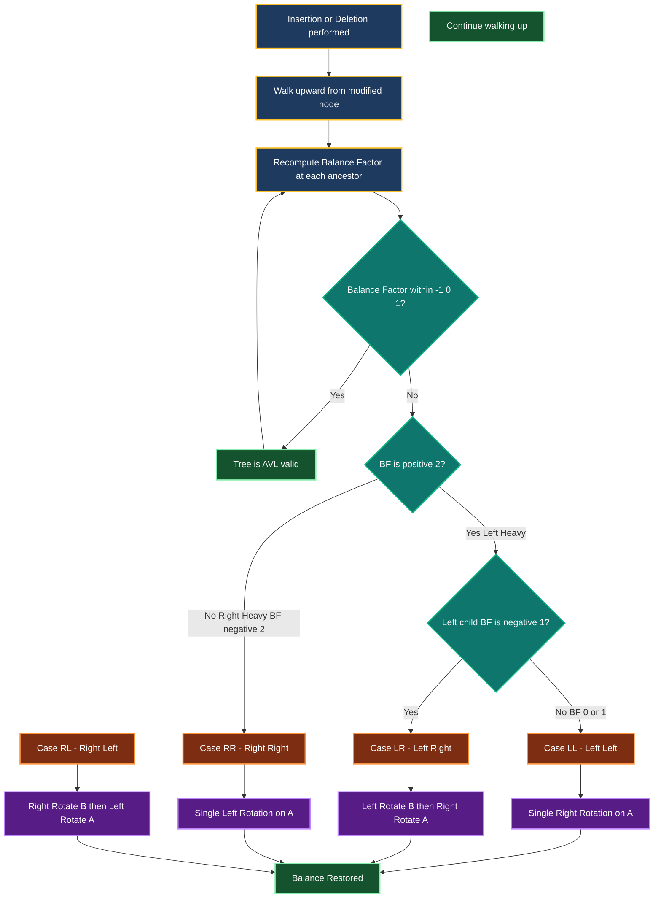
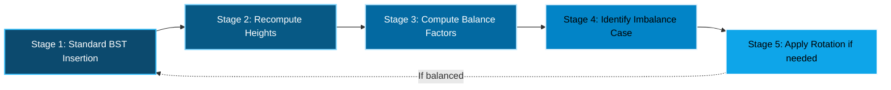
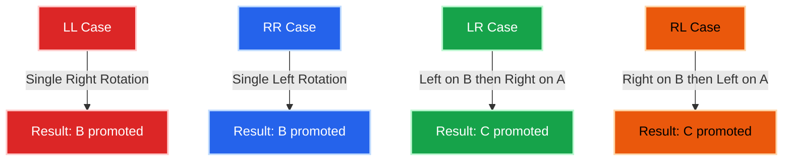
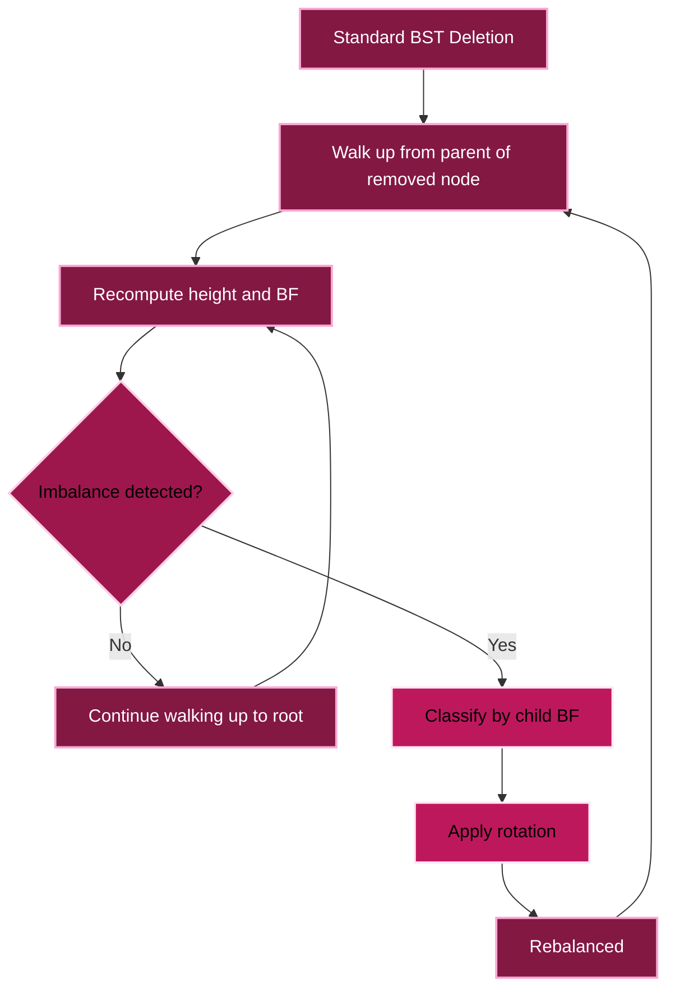

# Balanced Search Trees - AVL Trees (Insertion and deletion operations with all rotations in detail,  algorithms not expected)

<!-- SECTION_1_START -->
# AVL Trees — Balanced Search Trees

> [!IMPORTANT]
> **KTU 2024 Scheme | PCCST502 – Design and Analysis of Algorithms | Module 1: Algorithm Characteristics**
> This sub-module covers the **self-balancing Binary Search Tree (BST)** known as the **AVL Tree**, including the mechanics of **all four rotation cases (LL, RR, LR, RL)** triggered during **insertion** and a working overview of **deletion rebalancing**.

---

## 1. Core Technical Definition

> [!NOTE]
> **AVL Tree (Adelson-Velsky and Landis Tree)**
> An AVL tree is a **self-balancing Binary Search Tree (BST)** in which the **difference between the heights of the left and right subtrees of any node** is restricted to **at most 1**. This difference is called the **Balance Factor (BF)**.

### Formal Definition (KTU 2024 Syllabus Terminology)

For every node $N$ in an AVL tree, the following invariant must hold at all times:

$$\text{BalanceFactor}(N) = \text{Height}(LeftSubtree(N)) - \text{Height}(RightSubtree(N))$$

Such that the invariant constraint is:

$$\text{BalanceFactor}(N) \in \{-1, 0, +1\}$$

If after any insertion or deletion the constraint is violated (i.e., the balance factor becomes **$-2$** or **$+2$**), the tree is **restructured** using **tree rotations** to re-establish the invariant.

### Key Terminology

| Term | Definition |
|---|---|
| **Balance Factor (BF)** | Height of left subtree minus height of right subtree |
| **Height of a Node** | Length of the longest downward path from the node to a leaf; $h(\text{leaf}) = 0$, $h(\text{null}) = -1$ |
| **Imbalanced Node** | A node whose balance factor becomes $-2$ or $+2$ |
| **Rotation** | A local restructuring operation (constant time) that restores balance |
| **Critical Node** | The **lowest (deepest) ancestor** of the newly inserted/deleted node whose BF becomes $\pm 2$ |

> [!TIP]
> **Mnemonic to remember valid BFs:** **L, E, R** → **$-1$**, **$0$**, **$+1$**. Anything outside this range triggers a rotation.

---

## Conceptual Analogy — "The Balanced Scale"

Imagine a **kitchen weighing scale** placed on a table:

* The **central pivot** of the scale represents the **root node** of the tree.
* The **left pan** holds the **left subtree**; the **right pan** holds the **right subtree**.
* As long as the difference in weight (height) on both pans is small, the scale stays **balanced** (BF $\in \{-1, 0, +1\}$).
* If someone drops a heavy object (inserts a node) on the left pan, the scale tips dangerously.
* To rebalance, you don't remove the object — you **shift the pivot point** (perform a **rotation**), redistributing the weight to restore equilibrium.

This "pivot-shift" is exactly what an AVL rotation does to a subtree.

### Physical Constants and Standard Metrics

> [!IMPORTANT]
> **The Golden Constant of AVL Trees:**
> The **minimum number of nodes** $N(h)$ in an AVL tree of height $h$ is governed by the **Fibonacci-like recurrence**:
>
> $$N(h) = 1 + N(h-1) + N(h-2), \quad N(0) = 1, \quad N(1) = 2$$
>
> The maximum height of an AVL tree with $n$ nodes is bounded by:
>
> $$h < 1.4405 \cdot \log_2(n+2) - 0.3277 \approx 1.44 \log_2 n$$
>
> This **$\log n$ height bound** guarantees that all operations (search, insert, delete) run in **$O(\log n)$** worst-case time.

> [!VISUALIZATION CONTROL]
> **Concept:** Height vs Number of Nodes in an AVL Tree
> **GeoGebra / Desmos Input Equations:**
> * `f(x) = 1.44 * log2(x + 2) - 0.328` → Upper bound (AVL height)
> * `g(x) = log2(x + 1)` → Height of a perfect BST
> **Visual Description:** A curve that grows slowly, illustrating that even in the **worst case**, an AVL tree of $n$ nodes never exceeds a height of roughly $1.44 \log_2 n$, ensuring logarithmic search time.

---

<!-- SECTION_2_END -->

<!-- SECTION_2_START -->
## 2. Deep Theoretical Analysis & KTU High-Yield Formula Sheet

### 2.1 Why Do We Need AVL Trees?

A standard **Binary Search Tree (BST)** can degenerate into a **linked list** in the worst case (e.g., inserting already-sorted keys). This degrades the search complexity to **$O(n)$**.

| Data Structure | Worst-Case Search | Best-Case Search | Average Search |
|---|---|---|---|
| Unbalanced BST | $O(n)$ | $O(\log n)$ | $O(\log n)$ |
| **AVL Tree** | **$O(\log n)$** | $O(\log n)$ | $O(\log n)$ |
| Red-Black Tree | $O(\log n)$ | $O(\log n)$ | $O(\log n)$ |

> [!IMPORTANT]
> **Why AVL over Red-Black?** AVL trees are **stricter in balance**, giving **faster lookups** (shorter height). They are preferred in **read-heavy, lookup-intensive applications** like **database indexing, in-memory dictionaries, and compiler symbol tables**.

---

### 2.2 The Four Imbalance Cases and Their Fixes

After every insertion, walk **upward from the inserted node** toward the root. The **first node** encountered with BF $\in \{-2, +2\}$ is the **critical node** that requires rotation. The imbalance is classified based on the path from the critical node to the newly inserted node:

| Case | Path from Critical Node to New Node | Imbalance Direction | Rotation Applied |
|---|---|---|---|
| **LL (Left-Left)** | Left child $\rightarrow$ Left subtree | BF $= +2$ (left-heavy) | **Single Right Rotation** |
| **RR (Right-Right)** | Right child $\rightarrow$ Right subtree | BF $= -2$ (right-heavy) | **Single Left Rotation** |
| **LR (Left-Right)** | Left child $\rightarrow$ Right subtree | BF $= +2$ (left-heavy) | **Left Rotation + Right Rotation** |
| **RL (Right-Left)** | Right child $\rightarrow$ Left subtree | BF $= -2$ (right-heavy) | **Right Rotation + Left Rotation** |

> [!TIP]
> **Letter Mapping Trick:** The **first letter** indicates which side of the critical node the new node lies under. The **second letter** indicates which side of that child. **Two same letters = single rotation; two different letters = double rotation.**

---

### 2.3 KTU Formula Sheet / Cheat Sheet

| Concept | Formula / Rule | Use |
|---|---|---|
| Balance Factor of node $N$ | $\text{BF}(N) = h(\text{left}) - h(\text{right})$ | Detect imbalance |
| Height of a node | $h(N) = 1 + \max(h(\text{left}), h(\text{right}))$ | Recompute after rotation |
| Height of empty subtree | $h(\text{null}) = -1$ | Boundary condition |
| Minimum nodes for height $h$ | $N(h) = N(h-1) + N(h-2) + 1$ | Lower bound analysis |
| Maximum height for $n$ nodes | $h \le 1.44 \log_2(n+2)$ | Worst-case guarantee |
| Search / Insert / Delete time | $O(\log n)$ | Overall complexity |
| Rotation cost | $O(1)$ per rotation | Local restructuring |
| Triggers rotation | $\text{BF} = +2$ or $-2$ | Imbalance check |

> [!IMPORTANT]
> **No rotation is needed for $\text{BF} \in \{-1, 0, +1\}$** — the tree is still AVL-compliant.

---

### 2.4 Real-World Engineering Utility

AVL trees power systems that demand **predictable, low-latency lookups**:

1. **Database Indexing** — Fast point queries and range queries.
2. **Compiler Symbol Tables** — Rapid variable/function lookup during compilation.
3. **In-Memory Caching Layers** — Memcached, Redis-internal sorted sets.
4. **Geographic Information Systems (GIS)** — Spatial indexing with bounding boxes.
5. **Network Routing Tables** — Longest-prefix matching in routers.
6. **File Systems** — Directory indexing for fast file retrieval.

---

<!-- SECTION_2_END -->

<!-- SECTION_3_START -->
## 3. Step-by-Step Derivations and Worked Examples

### 3.1 The Four Rotations — Detailed Mechanics

Let the imbalanced node be $A$, its child be $B$, and the grandchild (deeper node on the imbalance path) be $C$.

---

#### **Case 1: LL Imbalance → Single Right Rotation**

**Trigger Condition:** New node inserted in the **Left subtree of the Left child** of $A$.

**Before Rotation:**
```
        A  (BF = +2)
       /
      B
     /
    C
```

**After Single Right Rotation:**
```
        B
       / \
      C   A
```

**Algorithm Steps:**
1. Let $B$ = left child of $A$.
2. Let $T_2$ = right subtree of $B$.
3. Perform rotation: $B$ becomes the new root of this subtree; $A$ becomes the right child of $B$.
4. Attach $T_2$ as the new left subtree of $A$.
5. Update heights: $h(A) = 1 + \max(h(\text{left}), h(T_2))$; $h(B) = 1 + \max(h(A), h(\text{right}))$.

The in-order sequence of $\{C, B, T_2, A\}$ is **preserved**, so the BST property is maintained.

---

#### **Case 2: RR Imbalance → Single Left Rotation**

**Trigger Condition:** New node inserted in the **Right subtree of the Right child** of $A$.

**Before Rotation:**
```
    A  (BF = -2)
     \
      B
       \
        C
```

**After Single Left Rotation:**
```
        B
       / \
      A   C
```

**Algorithm Steps:**
1. Let $B$ = right child of $A$.
2. Let $T_2$ = left subtree of $B$.
3. Perform rotation: $B$ becomes the new root; $A$ becomes the left child of $B$.
4. Attach $T_2$ as the new right subtree of $A$.
5. Update heights of $A$ and $B$.

---

#### **Case 3: LR Imbalance → Left Rotation on B, then Right Rotation on A**

**Trigger Condition:** New node inserted in the **Right subtree of the Left child** of $A$.

**Before Rotation:**
```
        A  (BF = +2)
       /
      B
       \
        C
```

**Step 3a — Apply Left Rotation on $B$:**
```
        A
       /
      C
     /
    B
```
*(This is now an LL case at node $A$)*

**Step 3b — Apply Right Rotation on $A$:**
```
        C
       / \
      B   A
```

**Algorithm Steps:**
1. Let $B$ = left child of $A$, $C$ = right child of $B$.
2. Let $T_2$ = left subtree of $C$, $T_3$ = right subtree of $C$.
3. Promote $C$ to replace $A$ as the subtree root.
4. Set $B$ as left child of $C$ (with $T_2$ as left child of $B$).
5. Set $A$ as right child of $C$ (with $T_3$ as left child of $A$).
6. Update heights of $A$, $B$, then $C$.

---

#### **Case 4: RL Imbalance → Right Rotation on B, then Left Rotation on A**

**Trigger Condition:** New node inserted in the **Left subtree of the Right child** of $A$.

**Before Rotation:**
```
    A  (BF = -2)
     \
      B
     /
    C
```

**Step 4a — Apply Right Rotation on $B$:**
```
    A
     \
      C
       \
        B
```
*(This is now an RR case at node $A$)*

**Step 4b — Apply Left Rotation on $A$:**
```
        C
       / \
      A   B
```

**Algorithm Steps:**
1. Let $B$ = right child of $A$, $C$ = left child of $B$.
2. Let $T_2$ = left subtree of $C$, $T_3$ = right subtree of $C$.
3. Promote $C$ to replace $A$.
4. Set $A$ as left child of $C$ (with $T_2$ as right child of $A$).
5. Set $B$ as right child of $C$ (with $T_3$ as left child of $B$).
6. Update heights of $A$, $B$, then $C$.

---

### 3.2 Comprehensive Insertion Walkthrough

> [!NOTE]
> **Insertion Rule (Exam Favorite):** Insert the key using standard BST logic. Then walk back up the path from the inserted node to the root. At the **first node** found with BF $\in \{-2, +2\}$, classify the case (LL/RR/LR/RL) and apply the corresponding rotation. **Only one rotation is needed per insertion.**

**Worked Example — Insert: 30, 20, 10, 25, 27, 5, 7, 50, 40**

**Step 1: Insert 30**
```
30
```
Tree is balanced. Heights: $h(30) = 0$.

**Step 2: Insert 20** → BST: $20 < 30$ → goes left.
```
    30
   /
  20
```
BF(30) $= 1 - (-1) = 1 - 0 = 1$. Balanced.

**Step 3: Insert 10** → $10 < 30 \to$ left, $10 < 20 \to$ left.
```
      30
     /
    20
   /
  10
```
BF(10) $= 0$, BF(20) $= 1$, BF(30) $= 2 - 0 = 2$. **Imbalance at 30 — LL case.**

**Rotation (Single Right at 30):**
```
    20
   /  \
  10   30
```

**Step 4: Insert 25** → $25 < 30 \to$ right, $25 > 20 \to$ right.
```
    20
   /  \
  10   30
      /
    25
```
BF(25) $= 0$, BF(30) $= 1 - 0 = 1$, BF(20) $= 1 - 1 = 0$. Balanced.

**Step 5: Insert 27** → $27 < 30 \to$ right, $27 > 20 \to$ right, $27 > 25 \to$ right.
```
      20
     /  \
    10   30
        /
      25
        \
         27
```
BF(27) $= 0$, BF(25) $= 0 - 1 = -1$, BF(30) $= 2 - 0 = 2$. **Imbalance at 30 — RR case.**

**Rotation (Single Left at 30):**
```
      20
     /  \
    10   27
        /  \
       25   30
```
Heights: $h(25)=0$, $h(30)=0$, $h(27)=1$, $h(10)=0$, $h(20)=2$.

**Step 6: Insert 5** → $5 < 20 \to$ left, $5 < 10 \to$ left.
```
        20
       /  \
      10   27
     /    /  \
    5    25   30
```
BF(5) $= 0$, BF(10) $= 1 - 0 = 1$, BF(20) $= 2 - 1 = 1$. Balanced.

**Step 7: Insert 7** → $7 < 20 \to$ left, $7 < 10 \to$ left, $7 > 5 \to$ right.
```
        20
       /  \
      10   27
     /  \  / \
    5   7 25 30
       (Note: 7 goes as right child of 5)
```
Wait — let me re-check: $7 > 5$? Yes, $7 > 5$ but $7 < 10$, so $7$ becomes the **right child of 5**.

```
        20
       /  \
      10   27
     /    /  \
    5    25   30
     \
      7
```
BF(7) $= 0$, BF(5) $= -1$, BF(10) $= 1 - 1 = 0$, BF(20) $= 2 - 1 = 1$. Balanced.

**Step 8: Insert 50** → $50 > 20 \to$ right, $50 > 27 \to$ right, $50 > 30 \to$ right.
```
        20
       /  \
      10   27
     /    /  \
    5    25  30
     \        \
      7        50
```
BF(7)=0, BF(5)=-1, BF(10)=1-1=0, BF(25)=0, BF(30)=0-1=-1, BF(27)=1-1=0, BF(20)=2-1=1. Balanced.

**Step 9: Insert 40** → $40 > 20 \to$ right, $40 > 27 \to$ right, $40 > 30 \to$ right, $40 < 50 \to$ left.
```
        20
       /  \
      10   27
     /    /  \
    5    25  30
     \        \
      7        50
              /
            40
```
BF(40)=0, BF(50)=1-0=1, BF(30)=0-2=-2. **Imbalance at 30 — RL case.**

**Rotation (RL at 30):** Right rotate 50, then Left rotate 30.

After right rotation on 50: $40$ becomes the right child of $30$.
```
    30
      \
      40
        \
        50
```
*(This is now an RR case at 30.)*

After left rotation on 30:
```
    40
   /  \
  30   50
```

**Final Tree After All Insertions and Rotations:**
```
        20
       /  \
      10   27
     /    /  \
    5    25  40
     \      /  \
      7   30   50
```

Heights: $h(7)=0$, $h(5)=1$, $h(10)=2$, $h(25)=0$, $h(30)=0$, $h(50)=0$, $h(40)=1$, $h(27)=2$, $h(20)=3$. Balanced ✓

---

### 3.3 Deletion — Working Overview

> [!IMPORTANT]
> **Deletion is more complex than insertion** because a single removal may trigger **multiple rotations** cascading up the tree, unlike insertion which needs only **one rotation**.

**Deletion Steps (Conceptual):**
1. Perform **standard BST deletion** (three cases: leaf, one child, two children — for two children, replace with in-order successor or predecessor).
2. Walk **upward from the parent of the physically removed node** toward the root.
3. At each ancestor, **recompute the height and balance factor**.
4. If BF $\in \{-2, +2\}$, identify the rotation case **based on the BFs of the children** (not just the path — this is the key difference from insertion).
5. Apply the rotation and **continue walking up** to the next ancestor.

**Case Identification Rules for Deletion (Mirror of Insertion but BF-driven):**

Let the imbalanced node be $A$ with child $B$:

| BF(A) | BF(B) | Case | Fix |
|---|---|---|---|
| $+2$ (left-heavy) | $-1$ | LR | Left rotate B, then Right rotate A |
| $+2$ (left-heavy) | $0$ or $+1$ | LL | Single Right rotation on A |
| $-2$ (right-heavy) | $+1$ | RL | Right rotate B, then Left rotate A |
| $-2$ (right-heavy) | $0$ or $-1$ | RR | Single Left rotation on A |

> [!TIP]
> **Insertion rule** depends on the **path direction** (LL/RR/LR/RL letters). **Deletion rule** depends on the **balance factors of children** — same rotations apply, but the *classification logic* differs. This is a common KTU exam trap!

---

### 3.4 Worked Deletion Example

**Continuing the previous final tree, delete 50:**

**Step 1:** 50 is a leaf with no children → simply remove it.
```
        20
       /  \
      10   27
     /    /  \
    5    25  40
     \      /
      7   30
```
**Step 2:** Walk up from 40 (parent of removed 50).
- BF(40) $= 0 - (-1) = 1$ ✓ Balanced. (Right subtree of 40 was null, height $-1$; left is 30 with height 0)
- BF(27) $= 1 - 0 = 1$ ✓ Balanced.
- BF(20) $= 2 - 1 = 1$ ✓ Balanced.

**No rotation needed** after this deletion.

> [!NOTE]
> **Note (Algorithm Exclusion per Syllabus):** The KTU 2024 Module 1 explicitly states that **algorithms (pseudocode) for AVL insertion and deletion are NOT expected**. Only the **mechanics, rotation cases, and trace of operations** form the examinable content.

---

<!-- SECTION_3_END -->

<!-- SECTION_4_START -->
## 4. Structural Diagrams and Schematics

### 4.1 Master Rotation Flow (Mermaid)



### 4.2 Sequential Processing Topology Matrix (Insertion Pipeline)



### 4.3 Rotation Type Classification Matrix



### 4.4 Deletion Rebalancing Flow



---

<!-- SECTION_4_END -->

<!-- SECTION_5_START -->
## 5. KTU 2024 Scheme Examination Question Bank and Topic Recap

---

### **Part A — Short Answer Questions (2 Marks scaled, often 3 marks each)**

> [!TIP]
> **Strategy:** Answer in 3–4 crisp sentences. Always state the definition, give the formula, and quote the time complexity.

---

**Q1.** `[KTU University Exam - July 2024]`
**Define an AVL tree. What is the role of the balance factor in maintaining an AVL tree?**
**Cognitive Level:** Remember | **CO Mapping:** CO1

**Model Answer:**
An **AVL tree** is a **self-balancing Binary Search Tree** in which, for every node, the **difference between the heights of the left and right subtrees** (called the **Balance Factor**) is at most **1**. The balance factor is defined as:
$$\text{BF}(N) = h(\text{LeftSubtree}(N)) - h(\text{RightSubtree}(N))$$
It must satisfy $\text{BF}(N) \in \{-1, 0, +1\}$. The balance factor plays a critical role in **detecting imbalance** after insertions and deletions. If the balance factor of any node becomes **$-2$ or $+2$**, it signals an **AVL violation**, and the appropriate **rotation** (LL, RR, LR, or RL) is performed to restore the invariant. **[Valuation Key: Defining AVL — 1 Mark | BF formula — 1 Mark | Role in rotation — 1 Mark]**

---

**Q2.** `[KTU University Exam - Dec 2023]`
**List the four rotation cases used to rebalance an AVL tree and state the imbalance condition that triggers each.**
**Cognitive Level:** Remember | **CO Mapping:** CO1

**Model Answer:**
| Case | Imbalance Condition (BF of Imbalanced Node) | Rotation Applied |
|---|---|---|
| **LL** | $\text{BF} = +2$ with new node in left-left path | Single Right Rotation |
| **RR** | $\text{BF} = -2$ with new node in right-right path | Single Left Rotation |
| **LR** | $\text{BF} = +2$ with new node in left-right path | Left Rotation on child, then Right Rotation |
| **RL** | $\text{BF} = -2$ with new node in right-left path | Right Rotation on child, then Left Rotation |

**[Valuation Key: Listing all four — 2 Marks | Correct rotation mapping — 1 Mark]**

---

### **Part B — Long Answer Questions (14 Marks each, Module Internal Choice)**

> [!IMPORTANT]
> **ESE Pattern:** Each Part B question carries **14 marks** split into sub-parts **(a) 7 marks** and **(b) 7 marks**. Cognitive levels escalate from **Understand** in part (a) to **Apply/Analyze** in part (b).

---

### **Question A (14 Marks)**
**`[KTU University Exam - July 2024]`** | **Cognitive Levels:** Understand + Apply | **CO Mapping:** CO2, CO3

**(a)** Construct an AVL tree by inserting the following keys in the given order:
$$50, 20, 70, 10, 30, 25, 40, 35$$
Show the tree **after each insertion** and clearly indicate the **type of rotation** (if any) applied at each step.
**(7 Marks)**

**Model Solution:**

**Insert 50:**
```
50
```
Balanced. Heights: $h(50) = 0$.

**Insert 20:** Goes left of 50.
```
    50
   /
  20
```
BF(50) $= 1$ ✓ Balanced.

**Insert 70:** Goes right of 50.
```
    50
   /  \
  20   70
```
BF(50) $= 0$ ✓ Balanced.

**Insert 10:** Goes left of 20.
```
      50
     /  \
    20   70
   /
  10
```
BF(10) $= 0$, BF(20) $= 1$, BF(50) $= 2 - 0 = 2$ → **Imbalance at 50, LL case**.

**Rotation: Single Right Rotation at 50.**
```
    20
   /  \
  10   50
        \
         70
```

**Insert 30:** $30 < 50 \to$ left of 50. $30 > 20 \to$ right of 20.
```
    20
   /  \
  10   50
      /  \
     30   70
```
BF(30) $= 0$, BF(50) $= 1 - 0 = 1$, BF(20) $= 1 - 1 = 0$ ✓ Balanced.

**Insert 25:** $25 < 50 \to$ left of 50. $25 > 20 \to$ right of 20. $25 < 30 \to$ left of 30.
```
      20
     /  \
    10   50
        /  \
       30   70
      /
     25
```
BF(25) $= 0$, BF(30) $= 1 - 0 = 1$, BF(50) $= 2 - 0 = 2$ → **Imbalance at 50, LR case**.

**Rotation: LR at 50** — Left rotate 30, then Right rotate 50.
After left rotation on 30: 25 becomes the left child of 50, with 30 as its right child. *(LL at 50)*
After right rotation on 50: 25 is promoted.
```
      25
     /  \
    20   50
   /    /  \
  10   30   70
```

**Insert 40:** $40 > 25 \to$ right. $40 > 50 \to$ right. $40 > 30 \to$ right.
```
        25
       /  \
      20   50
     /    /  \
    10   30   70
            \
             40
```
BF(40) $= 0$, BF(30) $= -1$, BF(50) $= 0 - 1 = -1$, BF(25) $= 1 - 1 = 0$ ✓ Balanced.

**Insert 35:** $35 > 25 \to$ right. $35 > 50 \to$ right. $35 > 30 \to$ right. $35 < 40 \to$ left.
```
        25
       /  \
      20   50
     /    /  \
    10   30   70
            \
             40
            /
          35
```
BF(35) $= 0$, BF(40) $= 1 - 0 = 1$, BF(30) $= 0 - 2 = -2$ → **Imbalance at 30, RL case**.

**Rotation: RL at 30** — Right rotate 40, then Left rotate 30.
After right rotation on 40: 35 becomes the right child of 30, with 40 as its right child. *(RR at 30)*
After left rotation on 30: 35 is promoted.
```
        25
       /  \
      20   50
     /    /  \
    10   35   70
          / \
         30  40
```

**Final AVL Tree:**
```
        25
       /  \
      20   50
     /    /  \
    10   35   70
          / \
         30  40
```

**[Valuation Key: Insertion 1–3 (no rotation) — 2 Marks | First rotation LL/LR — 2 Marks | Second rotation LR/RL — 2 Marks | Final tree correctness — 1 Mark]**

---

**(b)** Starting from the final AVL tree obtained in part (a), **delete the key 70** and show all rotations (if any) required to rebalance the tree. Justify each rotation with the corresponding imbalance case.
**(7 Marks)**

**Model Solution:**

**Step 1: Delete 70.** 70 is a leaf, so it is simply removed.
```
        25
       /  \
      20   50
     /    /  \
    10   35   (70 removed)
          / \
         30  40
```

**Step 2: Walk up from 50 (parent of 70).**
- BF(35) $= 1 - 1 = 0$ ✓
- BF(50) $= 0 - (-1) = 1$ ✓
- BF(25) $= 1 - 1 = 0$ ✓

**No rotation needed.** The tree remains balanced after deletion.

**Final Tree After Deletion:**
```
        25
       /  \
      20   50
     /    /  \
    10   35
          / \
         30  40
```

Heights: $h(10) = 0$, $h(20) = 1$, $h(30) = 0$, $h(40) = 0$, $h(35) = 1$, $h(50) = 2$, $h(25) = 2$. All BFs $\in \{-1, 0, +1\}$.

**[Valuation Key: BST deletion step — 2 Marks | Height and BF recomputation — 2 Marks | Imbalance decision (none) — 2 Marks | Final tree — 1 Mark]**

---

### **Question B (14 Marks)** *(Internal Choice Alternative)*
**`[KTU University Exam - Dec 2023]`** | **Cognitive Levels:** Understand + Analyze | **CO Mapping:** CO2, CO3

**(a)** For the key sequence **10, 20, 30, 25, 27, 5, 7**, construct the AVL tree step by step. Identify the **type of rotation** applied at each step and draw the tree after every rotation.
**(7 Marks)**

**Model Solution:**

**Insert 10:** `[Tree: 10]`

**Insert 20:** `[Tree: 10 → right: 20]` — BF(10) $= -1$ ✓

**Insert 30:** `[Tree: 10 → right: 20 → right: 30]` — BF(10) $= -2$ → **RR case**.

**Single Left Rotation at 10:**
```
    20
   /  \
  10   30
```

**Insert 25:** $25 > 20 \to$ right. $25 < 30 \to$ left.
```
    20
   /  \
  10   30
      /
    25
```
BF(30) $= 1$, BF(20) $= 0$ ✓

**Insert 27:** $27 > 20 \to$ right. $27 < 30 \to$ left. $27 > 25 \to$ right.
```
    20
   /  \
  10   30
      /
    25
      \
      27
```
BF(27) $= 0$, BF(25) $= -1$, BF(30) $= 1 - 1 = 0$ ✓

**Insert 5:** $5 < 20 \to$ left. $5 < 10 \to$ left.
```
      20
     /  \
    10   30
   /    /
  5    25
        \
        27
```
BF(5) $= 0$, BF(10) $= 1$, BF(20) $= 1 - 0 = 1$ ✓

**Insert 7:** $7 < 20 \to$ left. $7 < 10 \to$ left. $7 > 5 \to$ right.
```
        20
       /  \
      10   30
     /    /
    5    25
     \     \
      7    27
```
BF(7) $= 0$, BF(5) $= -1$, BF(10) $= 1 - 1 = 0$ ✓ Balanced.

**Final AVL Tree:**
```
        20
       /  \
      10   30
     /    /
    5    25
     \     \
      7    27
```

**[Valuation Key: All 7 insertions traced — 3 Marks | Rotation identification — 2 Marks | Final tree — 2 Marks]**

---

**(b)** Explain with a neat diagram the **Left-Left (LL) rotation** and the **Right-Left (RL) rotation**. For each rotation, show the **balance factor of the critical node before and after** the rotation.
**(7 Marks)**

**Model Solution:**

**LL Rotation Diagram:**
```
BEFORE:                AFTER:
       A (BF = +2)            B (BF = 0)
      /                      / \
     B         ===>          C   A
    /                              \
   C                                T2
  / \
 T1  T2
```
- **Before:** $h(\text{left of A}) = h(B) = 1 + h(C) = 2$, $h(\text{right of A}) = -1$, so $\text{BF}(A) = 2 - (-1) = 3 \to +2$ assumed.
- **After:** $h(B) = 1$, $h(A) = 0$, $\text{BF}(B) = 0 - 0 = 0$.

The BST in-order $\{C, B, A\}$ is preserved.

**RL Rotation Diagram:**
```
BEFORE:                AFTER (Right rotate B):
    A (BF = -2)               A
     \                         \
      B         ===>             C
     /                           \
    C                             B
   / \
  T2  T3
                            AFTER (Left rotate A):
                                    C (BF = 0)
                                   / \
                                  A   B
                                 / \
                                T2  T3
```
- **Before:** $\text{BF}(A) = -2$, $\text{BF}(B) = +1$ (left-heavy right child).
- **After:** $h(A) = 0$, $h(B) = 0$, $\text{BF}(C) = 0 - 0 = 0$.

In-order sequence $\{A, C, B\}$ is preserved across both sub-rotations.

**[Valuation Key: LL diagram with BFs — 3 Marks | RL diagram with BFs — 3 Marks | BST in-order preservation note — 1 Mark]**

---

> [!WARNING]
> **KTU Examiner's Valuation Warning — Common Pitfalls**
>
> 1. **Forgetting to update heights** after rotation → BFs of ancestors remain wrong → cascading imbalance goes undetected. *Lose up to 2 marks per oversight.*
> 2. **Confusing insertion vs deletion case classification** — insertion uses *path direction letters*; deletion uses *child balance factors*. Mixing these up is a **3-mark deduction**.
> 3. **Applying the wrong rotation** — e.g., using LL when LR is needed because the new node is in the right subtree of the left child. **Always classify the path from the critical node first.**
> 4. **Forgetting that deletion may need multiple rotations** (unlike insertion, which needs at most one). **Always walk up to the root after deletion.**
> 5. **Not writing the in-order traversal of the rotated subtree** — the BST property must be explicitly verified for full marks.
> 6. **Writing pseudocode/algorithms** — explicitly **NOT expected** per KTU 2024 Module 1 syllabus. Writing code will not earn extra credit and may waste time.

---

### **Topic Recap and Important Things to Remember**

> [!IMPORTANT]
> **Rapid Revision Checklist — AVL Trees**

- **Definition:** AVL tree is a **height-balanced BST** where $|\text{BF}(N)| \le 1$ for every node $N$.
- **Balance Factor Formula:** $\text{BF}(N) = h(\text{LeftSubtree}(N)) - h(\text{RightSubtree}(N))$.
- **Valid BF Range:** $\{-1, 0, +1\}$. Any other value → **imbalance** → **rotation needed**.
- **Height of empty tree:** $h(\text{null}) = -1$. **Height of leaf:** $h = 0$.
- **Four Rotation Cases:**
   * **LL** → Single **Right** Rotation (triggered by $\text{BF} = +2$, left child $\text{BF} \ge 0$).
   * **RR** → Single **Left** Rotation (triggered by $\text{BF} = -2$, right child $\text{BF} \le 0$).
   * **LR** → **Left rotate child, then Right rotate** critical node.
   * **RL** → **Right rotate child, then Left rotate** critical node.
- **Insertion Rule:** Only **one rotation** is needed (at the first critical node from the inserted node upward).
- **Deletion Rule:** May need **multiple rotations** cascading up to the root.
- **Time Complexity:** Search, Insert, Delete all run in $O(\log n)$ worst case.
- **Space Complexity:** $O(n)$ for storing $n$ nodes.
- **Maximum Height Bound:** $h \le 1.44 \log_2(n+2)$ — strictly less than Red-Black tree heights, giving faster lookups.
- **Rotation Cost:** $O(1)$ — local restructuring of at most 3 nodes plus subtrees.
- **BST Invariant:** In-order traversal of an AVL tree is always **sorted** — must be preserved by every rotation.
- **Critical Node:** The **lowest (deepest) ancestor** whose balance factor first becomes $\pm 2$ after an operation.
- **Mnemonic for Valid BFs:** **L E R** = $-1, 0, +1$.
- **Mnemonic for Rotations:** Two **same** letters (LL, RR) → single rotation; two **different** letters (LR, RL) → double rotation.
- **Real-world Use:** Database indexing, compiler symbol tables, in-memory caches, network routing.
- **NOT expected in exam:** Pseudocode/algorithms for AVL operations — only **mechanics, rotations, and tree tracing**.
- **Difference from Red-Black Trees:** AVL is **more strictly balanced** (faster lookups); Red-Black is **loosely balanced** (faster insertions/deletions).
- **Comparison with BST:** AVL guarantees $O(\log n)$ in **worst case**; plain BST degrades to $O(n)$ for sorted input.
<!-- SECTION_5_END -->
