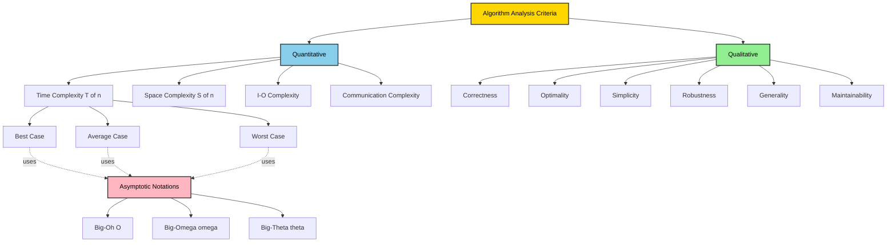
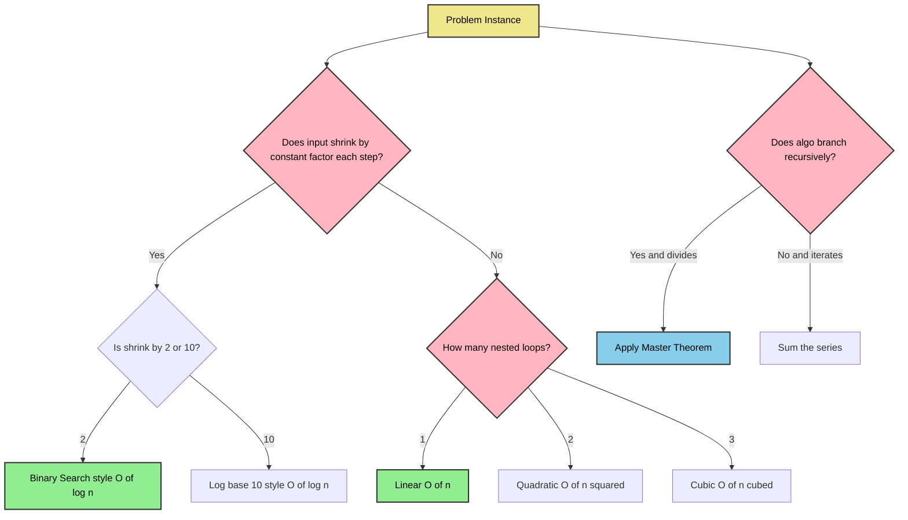
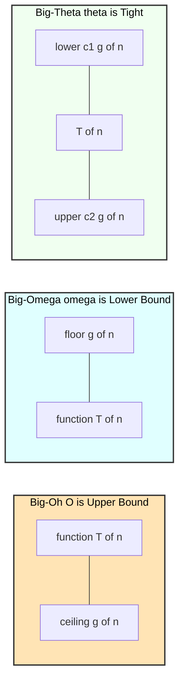

# Criteria for Analysing Algorithms

<!-- SECTION_1_START -->

# Criteria for Analysing Algorithms

## 1.1 Formal Academic Definition (KTU 2024 Syllabus Standard)

> [!NOTE]
> **Algorithm Analysis** is the systematic process of determining the computational resources (primarily **time** and **space**) required by an algorithm as a function of the input size $n$. It provides a theoretical framework to **predict performance**, **compare competing algorithms**, and **guarantee correctness** independent of hardware or software platforms.

In the KTU 2024 Scheme context (PCCST502 – Design and Analysis of Algorithms), the "Criteria for Analysing Algorithms" refers to the **set of measurable and qualitative attributes** used by designers to evaluate, classify, and select algorithms. These criteria guide the transition from a *correctness-only* view to a *performance-aware* engineering discipline.

### Primary Criteria (Quantitative)

| Criterion | Symbol | Description |
|---|---|---|
| Time Complexity | $T(n)$ | Number of primitive operations executed. |
| Space Complexity | $S(n)$ | Total auxiliary + input memory consumed. |
| I/O Complexity | — | Number of disk/network operations. |
| Communication Complexity | — | Volume of inter-process data exchanged. |

### Secondary Criteria (Qualitative)

- **Correctness** – Does it produce the right output for all valid inputs?
- **Optimality** – Is asymptotic lower bound achieved?
- **Simplicity & Clarity** – Is the logic easy to reason about?
- **Robustness** – Graceful handling of edge cases.
- **Generality** – Applicability across input domains.
- **Maintainability** – Ease of modification and debugging.

---

## 1.2 Conceptual Analogy / Intuitive Build-Up

> [!IMPORTANT]
> **Real-World Analogy — The Chef's Kitchen**
>
> Imagine two chefs preparing the same dish for **$n$ guests**:
> - **Time** = how long the cooking takes (boiling water, chopping vegetables).
> - **Space** = how many pots, pans, and counter area the chef occupies.
> - **Correctness** = does the dish taste as per the recipe?
> - **Simplicity** = can a junior chef follow the recipe without confusion?
> - **Robustness** = what happens if the guest count suddenly doubles mid-cook?
>
> An *algorithm* is the **recipe**. A *good algorithm* is one that is fast, uses few utensils, never ruins the dish, and survives surprises. Just as chefs must choose between simmering and pressure-cooking, programmers must choose between **Brute Force**, **Divide & Conquer**, or **Greedy** strategies based on these criteria.

---

## 1.3 Asymptotic Notation — The Heart of Analysis

Because exact operation counts depend on the machine, we use **asymptotic notations** to express how $T(n)$ behaves as $n \to \infty$.

$$T(n) = O(g(n)) \iff \exists\, c>0,\, n_0>0 \text{ such that } 0 \le T(n) \le c\cdot g(n) \;\; \forall\, n \ge n_0$$

Three fundamental notations:

- **Big-Oh $O(\cdot)$** — **Upper bound** (worst-case ceiling).
- **Big-Omega $\Omega(\cdot)$** — **Lower bound** (best-case floor).
- **Big-Theta $\Theta(\cdot)$** — **Tight bound** (both upper and lower).

> [!TIP]
> **Mnemonic for Students**:
> - $O$ → **O**verhead ceiling.
> - $\Omega$ → **O**mega (the "big" one) gives the **lower** floor.
> - $\Theta$ → **T**ight sandwich, both sides.

---

## 1.4 The Performance Hierarchy (Standard Scale)

> [!NOTE]
> From fastest-growing-slowest to slowest-growing-fastest:
> $$O(1) < O(\log\log n) < O(\log n) < O(\sqrt{n}) < O(n) < O(n\log n) < O(n^2) < O(n^3) < O(2^n) < O(n!) < O(n^n)$$

> [!VISUALIZATION CONTROL]
> **Concept:** Growth-rate comparison of common complexity classes.
> **GeoGebra / Desmos Input Equations:**
> * `f(x) = 1` (constant)
> * `g(x) = ln(x)` (logarithmic)
> * `h(x) = x` (linear)
> * `p(x) = x*ln(x)` (linearithmic)
> * `q(x) = x^2` (quadratic)
> * `r(x) = 2^x` (exponential)
> **Visual Description:** Plot the functions together for $x \in [1, 20]$. Observe how the curves cross: at small $n$, exponential is competitive, but past $n=20$, the quadratic already overtakes the exponential, illustrating the *practical crossover point* in algorithm selection.

<!-- SECTION_1_END -->

<!-- SECTION_2_START -->

# Deep Theoretical Analysis & KTU High-Yield Formula Sheet

## 2.1 The Seven Criteria — Detailed Breakdown

### (1) Time Complexity $T(n)$

- **What it measures:** Number of elementary operations (addition, comparison, assignment) as a function of input size $n$.
- **Why it matters:** Determines whether the algorithm is *usable* at scale. A 10× faster CPU cannot rescue a $O(n^3)$ algorithm when $n = 10^6$.
- **Three flavours:**
  - **Best case** $T_{\text{best}}(n)$ — minimum operations (rarely useful in practice).
  - **Average case** $T_{\text{avg}}(n)$ — expected over random inputs.
  - **Worst case** $T_{\text{worst}}(n)$ — guarantee for all inputs (most cited in KTU).
- **Engineering utility:** Used in **compiler optimization** (inlining vs. recursion), **database query planners** (hash vs. nested-loop join), and **real-time system scheduling** (WCET analysis for airbag controllers).

### (2) Space Complexity $S(n)$

$$S(n) = S_{\text{input}}(n) + S_{\text{auxiliary}}(n)$$

- **Input space** is the memory occupied by the data itself (excluded from analysis by convention).
- **Auxiliary space** is the extra memory the algorithm allocates (stack frames, temporary arrays, hash tables).
- **Engineering utility:** Critical in **embedded systems** (Arduino has 2 KB RAM), **mobile apps** (memory leaks cause OOM crashes), and **GPU kernels** (VRAM-bound).

### (3) Correctness

- **Partial correctness:** If the algorithm terminates, it produces the correct output.
- **Total correctness:** The algorithm always terminates **and** produces the correct output.
- **Proof technique:** **Loop Invariants** — $I$ holds before iteration, preserved during, and yields the goal upon termination.

### (4) Optimality

- An algorithm is **asymptotically optimal** if its complexity matches the **proven lower bound** of the problem.
- Example: Comparison-based sorting has a lower bound of $\Omega(n\log n)$. Since Merge Sort achieves $O(n\log n)$, it is **optimal**.

### (5) Simplicity & Clarity

- Readable algorithms are easier to **verify**, **maintain**, and **debug**.
- Trade-off: Sometimes a simpler $O(n^2)$ algorithm is preferable in production over a complex $O(n\log n)$ algorithm with a tiny constant factor.

### (6) Robustness

- Handles **edge cases** gracefully: empty inputs, single element, duplicate keys, negative numbers, overflow, null pointers.
- **Defensive programming** adds `$1$–$2$` extra checks but prevents catastrophic bugs.

### (7) Generality

- A general algorithm works on a **wide range of inputs** without modification.
- Example: **Quicksort** is general; **Counting sort** works only for bounded integers.

---

## 2.2 KTU High-Yield Formula Sheet (Master Reference Table)

| # | Concept | Formula / Definition | Typical Use |
|---|---|---|---|
| 1 | Time Complexity | $T(n) = T_{\text{best}}(n) / T_{\text{avg}}(n) / T_{\text{worst}}(n)$ | Predict runtime |
| 2 | Space Complexity | $S(n) = S_{\text{input}} + S_{\text{aux}}$ | Memory planning |
| 3 | Big-Oh | $0 \le T(n) \le c \cdot g(n)$ for $n \ge n_0$ | Upper bound |
| 4 | Big-Omega | $0 \le c \cdot g(n) \le T(n)$ for $n \ge n_0$ | Lower bound |
| 5 | Big-Theta | $c_1 g(n) \le T(n) \le c_2 g(n)$ for $n \ge n_0$ | Tight bound |
| 6 | Little-oh | $\lim_{n \to \infty} \frac{T(n)}{g(n)} = 0$ | Strictly smaller |
| 7 | Loop cost | $\sum_{i=1}^{n} \sum_{j=1}^{i} 1 = \frac{n(n+1)}{2}$ | Nested loops |
| 8 | Recurrence | $T(n) = aT(n/b) + f(n)$ | Divide & Conquer |
| 9 | Master Theorem | See Module 2 | Solve recurrences |
| 10 | Arithmetic series | $1+2+\cdots+n = \frac{n(n+1)}{2}$ | Sum of iterations |
| 11 | Geometric series | $1+2+4+\cdots+2^{k} = 2^{k+1}-1$ | Branching recursion |
| 12 | Logarithmic | $T(n) = T(n/2) + 1 \implies O(\log n)$ | Binary search |
| 13 | Worst-case lower bound (sorting) | $\Omega(n\log n)$ comparisons | Comparison sort |
| 14 | Amortized cost | $\frac{\text{Total cost over } n \text{ ops}}{n}$ | Dynamic arrays |
| 15 | NP-completeness indicator | No known poly-time algo | Intractable problems |

> [!IMPORTANT]
> **KTU Examiner Tip:** Always state **both** the upper bound and the **why** (e.g., "due to the nested loop with $n$ outer and $n$ inner iterations"). Vague statements like "the algorithm is fast" earn zero marks.

---

## 2.3 Real-World Production Use-Cases

| Domain | Criterion Decisive | Example |
|---|---|---|
| High-Frequency Trading | Time (worst case) | Order matching engine uses $O(\log n)$ BST |
| Spacecraft Avionics | Space + Correctness | Dijkstra with bounded memory |
| Web Search Indexing | Time + Generality | Google's MapReduce + BigTable |
| Cryptography | Optimality | SHA-256 achieves $O(1)$ per byte |
| AI Inference | Time + Robustness | Quantized neural networks |

<!-- SECTION_2_END -->

<!-- SECTION_3_START -->

# Step-by-Step Derivations & Code/Symbolic Implementation

## 3.1 Exhaustive Worked Example 1 — Single Loop

**Algorithm: Print numbers 1 to n.**

```python
def print_numbers(n: int) -> None:
    for i in range(1, n + 1):
        print(i)
```

### Derivation

- Initialization: $i \leftarrow 1$ → **1 operation**.
- Loop test: $i \le n$ → executed $(n+1)$ times (includes the final failing test) → **$(n+1)$ operations**.
- Print statement: executes $n$ times → **$n$ operations**.
- Increment: $i \leftarrow i + 1$ → executes $n$ times → **$n$ operations**.

$$T(n) = 1 + (n+1) + n + n = 3n + 2$$

**Asymptotic simplification:** Drop constants.

$$T(n) = 3n + 2 = O(n)$$

---

## 3.2 Exhaustive Worked Example 2 — Nested Loop (Triangle Pattern)

**Algorithm: Print a lower-triangular star pattern of size $n$.**

```python
def star_triangle(n: int) -> None:
    for i in range(1, n + 1):          # Outer loop
        for j in range(1, i + 1):      # Inner loop
            print("*", end=" ")
        print()                        # Newline
```

### Derivation

Outer loop iterates $i = 1, 2, \ldots, n$.

For a fixed $i$, the inner loop iterates $i$ times.

Total inner-loop executions:

$$T(n) = \sum_{i=1}^{n} \sum_{j=1}^{i} 1 = \sum_{i=1}^{n} i$$

$$= \frac{n(n+1)}{2} = \frac{n^2 + n}{2}$$

**Asymptotic simplification:**

$$T(n) = \frac{n^2}{2} + \frac{n}{2} = O(n^2)$$

---

## 3.3 Exhaustive Worked Example 3 — Recursive Algorithm (Factorial)

**Algorithm: Compute $n!$ recursively.**

```python
def factorial(n: int) -> int:
    if n <= 1:
        return 1
    return n * factorial(n - 1)
```

### Recurrence Setup

Let $T(n)$ = time to compute $n!$.

- Base case: $T(0) = T(1) = 1$ (constant time comparison + return).
- Recursive case: 1 multiplication + 1 recursive call.

$$T(n) = T(n-1) + 1, \quad T(1) = 1$$

### Solving by Back-Substitution (Exhaustive)

$$T(n) = T(n-1) + 1$$
$$= [T(n-2) + 1] + 1 = T(n-2) + 2$$
$$= [T(n-3) + 1] + 2 = T(n-3) + 3$$
$$\vdots$$
$$= T(n-k) + k$$

Set $n-k = 1 \Rightarrow k = n-1$:

$$T(n) = T(1) + (n-1) = 1 + n - 1 = n$$

**Asymptotic result:** $T(n) = O(n)$.

**Space analysis:** Each recursive call pushes one stack frame.

$$S(n) = O(n) \text{ (call stack depth)}$$

---

## 3.4 Exhaustive Worked Example 4 — Binary Search (Iterative)

```python
def binary_search(arr: list[int], target: int) -> int:
    lo, hi = 0, len(arr) - 1
    while lo <= hi:
        mid = (lo + hi) // 2
        if arr[mid] == target:
            return mid
        elif arr[mid] < target:
            lo = mid + 1
        else:
            hi = mid - 1
    return -1
```

### Recurrence

At each iteration, the search interval halves.

$$T(n) = T\!\left(\frac{n}{2}\right) + 1, \quad T(1) = 1$$

### Back-Substitution

$$T(n) = T(n/2) + 1$$
$$= T(n/4) + 1 + 1 = T(n/4) + 2$$
$$= T(n/8) + 3$$
$$\vdots$$
$$= T(n/2^k) + k$$

Stop when $n/2^k = 1 \Rightarrow k = \log_2 n$.

$$T(n) = T(1) + \log_2 n = 1 + \log_2 n = O(\log n)$$

**Space:** Only four scalar variables, $S(n) = O(1)$.

---

## 3.5 Exhaustive Worked Example 5 — Time Complexity of Matrix Multiplication

**Algorithm: Multiply two $n \times n$ matrices using the naive triple loop.**

```python
def matmul(A: list[list[float]], B: list[list[float]]) -> list[list[float]]:
    n = len(A)
    C = [[0.0] * n for _ in range(n)]
    for i in range(n):              # n iterations
        for j in range(n):          # n iterations
            s = 0.0
            for k in range(n):      # n iterations
                s += A[i][k] * B[k][j]
            C[i][j] = s
    return C
```

### Counting

- Triple-nested loop with $n, n, n$ iterations → $n^3$ total innermost executions.
- Each innermost step does 1 multiply + 1 add = **2 operations**.

$$T(n) = 2 \cdot n^3 + \text{loop overhead} = O(n^3)$$

**Space:** Output matrix $C$ of size $n^2$, plus a scalar $s$.

$$S(n) = O(n^2)$$

> [!TIP]
> **KTU Insight:** Strassen's algorithm reduces this to $O(n^{\log_2 7}) \approx O(n^{2.807})$. The fastest known (as of 2024) is $O(n^{2.371552})$ via the **Alman–Williams** method. None are used in practice due to large constant factors — a classic **simplicity vs. speed** trade-off.

---

## 3.6 Exhaustive Worked Example 6 — Sum of Array Elements (Best vs. Worst Case)

```python
def linear_search(arr: list[int], key: int) -> int:
    for i in range(len(arr)):
        if arr[i] == key:
            return i
    return -1
```

- **Best case:** key is at index 0 → $T_{\text{best}}(n) = 1 = O(1)$.
- **Worst case:** key absent or at the last position → $T_{\text{worst}}(n) = n = O(n)$.
- **Average case:** assuming uniform distribution → $T_{\text{avg}}(n) = \frac{n+1}{2} = O(n)$.

---

## 3.7 KTU Valuation Walkthrough — Prove $3n^2 + 5n + 2 = O(n^2)$

We must find constants $c > 0$ and $n_0$ such that:

$$3n^2 + 5n + 2 \le c \cdot n^2 \quad \forall\, n \ge n_0$$

Choose $c = 4$ (by inspection, we need $3n^2 + 5n + 2 \le 4n^2$).

This simplifies to:

$$5n + 2 \le n^2 \quad \Longleftrightarrow \quad n^2 - 5n - 2 \ge 0$$

Roots of $n^2 - 5n - 2 = 0$ are:

$$n = \frac{5 \pm \sqrt{25 + 8}}{2} = \frac{5 \pm \sqrt{33}}{2} \approx \frac{5 \pm 5.745}{2}$$

Largest real root $\approx 5.37$. Pick $n_0 = 6$.

**Conclusion:** $3n^2 + 5n + 2 = O(n^2)$ with witnesses $c = 4$ and $n_0 = 6$. $\blacksquare$

> [!IMPORTANT]
> **Valuation Key:** Examiners award **1 mark for stating the definition**, **2 marks for choosing witnesses $c$ and $n_0$**, **1 mark for the verification inequality**, and **1 mark for the conclusion**. Skipping the witnesses = 0 marks.

<!-- SECTION_3_END -->

<!-- SECTION_4_START -->

# Structural Diagrams & Schematics

## 4.1 Hierarchy of Algorithm Analysis Criteria



## 4.2 Algorithm Analysis Workflow (Sequential Processing Topology)

```mermaid
flowchart LR
    S1[Step 1: Identify Input Size n] --> S2[Step 2: Identify Primitive Ops]
    S2 --> S3[Step 3: Count Ops per Statement]
    S3 --> S4[Step 4: Build Expression T of n]
    S4 --> S5[Step 5: Apply Asymptotic Notation]
    S5 --> S6[Step 6: Verify with Witnesses c and n0]
    S6 --> S7[Step 7: Classify Best Avg Worst]

    S1 -.feedback.-> S3
    S5 -.feedback.-> S4

    style S1 fill:#FFA07A,stroke:#333,stroke-width:2px,color:#000
    style S2 fill:#FFA07A,stroke:#333,stroke-width:2px,color:#000
    style S3 fill:#FFA07A,stroke:#333,stroke-width:2px,color:#000
    style S4 fill:#FFD700,stroke:#333,stroke-width:2px,color:#000
    style S5 fill:#90EE90,stroke:#333,stroke-width:2px,color:#000
    style S6 fill:#87CEEB,stroke:#333,stroke-width:2px,color:#000
    style S7 fill:#DDA0DD,stroke:#333,stroke-width:2px,color:#000
```



## 4.3 Complexity-Class Decision Tree (Block-Level Functional Architecture)



## 4.4 Asymptotic Notation — Visual Comparison (Block Topology Matrix)



<!-- SECTION_4_END -->

<!-- SECTION_5_START -->

# KTU 2024 Scheme Examination Question Bank & Topic Recap

## 5.1 Part A — Short Answer Questions (3 Marks Each)

### **Q1. [KTU University Exam – July 2024]**
**(CO1, Remember)** List any **four** criteria used for analysing an algorithm and state which one is considered the most important in practice.

**Model Answer (Valuation Key — 3 Marks):**
- **Time Complexity** — measures number of operations $T(n)$ (0.5)
- **Space Complexity** — measures memory $S(n)$ (0.5)
- **Correctness** — guarantees right output (0.5)
- **Optimality** — matches lower bound (0.5)
- (Any two of Simplicity / Robustness / Generality may replace two above for 1 mark)
- **Most important in practice:** Time Complexity, because in production systems user-perceived latency directly affects revenue and usability. (1 Mark)

---

### **Q2. [KTU University Exam – Dec 2023]**
**(CO1, Understand)** Distinguish between **Big-Oh $O$**, **Big-Omega $\Omega$**, and **Big-Theta $\Theta$** notations with one example each.

**Model Answer (Valuation Key — 3 Marks):**
- **$O(g(n))$** — upper bound, $T(n) \le c g(n)$ for $n \ge n_0$. Example: $3n^2 + 5n = O(n^2)$. (1 Mark)
- **$\Omega(g(n))$** — lower bound, $T(n) \ge c g(n)$ for $n \ge n_0$. Example: $n^2 - 3n = \Omega(n^2)$. (1 Mark)
- **$\Theta(g(n))$** — tight bound, $c_1 g(n) \le T(n) \le c_2 g(n)$. Example: $5n + 3 = \Theta(n)$. (1 Mark)

---

## 5.2 Part B — Long Answer Questions (14 Marks Each, Internal Choice)

### **Question A (14 Marks)**

**[KTU University Exam – Dec 2023, Model Question Paper Pattern]**
**(a) [7 Marks, CO1, Understand]** Explain in detail the **time complexity** and **space complexity** criteria for analysing algorithms. Mention the three cases (best, average, worst) with a small example.

**(b) [7 Marks, CO2, Apply]** For the following algorithm, derive the **exact time complexity** $T(n)$ and express it asymptotically:

```python
def demo(n):
    s = 0
    for i in range(1, n+1):
        for j in range(1, i+1):
            s += i*j
    return s
```

---

#### Model Solution — Part (a) [7 Marks]

| Point | Explanation | Marks |
|---|---|---|
| Definition of Time Complexity | $T(n)$ = number of primitive operations on input of size $n$. | 1 |
| Definition of Space Complexity | $S(n) = S_{\text{input}} + S_{\text{auxiliary}}$ | 1 |
| Best case | Minimum operations for any input of size $n$. Example: linear search where key is the first element → $T_{\text{best}}(n) = 1$. | 1 |
| Average case | Expected operations assuming a probability distribution. Example: linear search with uniform key distribution → $T_{\text{avg}}(n) = (n+1)/2$. | 1.5 |
| Worst case | Maximum operations for any input of size $n$. Example: linear search where key is absent → $T_{\text{worst}}(n) = n$. | 1.5 |
| Engineering relevance | Real-time systems need worst-case guarantees; databases use average-case for query planning. | 1 |

---

#### Model Solution — Part (b) [7 Marks]

**Step 1: Identify input size** — $n$ (loop bound) [0.5 Mark]

**Step 2: Identify statements** — assignment `s = 0` (1 op), outer loop test $(n+1)$ ops, inner loop test variable, addition, multiplication [0.5 Mark]

**Step 3: Count inner loop iterations** — for fixed $i$, inner loop runs $i$ times. So total iterations:

$$T(n) = \sum_{i=1}^{n} i = \frac{n(n+1)}{2} = \frac{n^2}{2} + \frac{n}{2} \quad [\text{Derivation: 2 Marks}]$$

**Step 4: Add overhead** — $s = 0$ and return statements are constants [0.5 Mark]

**Step 5: Final expression:**

$$T(n) = \frac{n^2}{2} + \frac{n}{2} + O(1) \quad [\text{Simplification: 1 Mark}]$$

**Step 6: Asymptotic bound:**

$$T(n) = O(n^2) \quad [\text{Asymptotic form: 1 Mark}]$$

**Step 7: Space complexity** — only $s$ and loop counters, $S(n) = O(1)$ [1 Mark]

---

### **Question B (14 Marks) — Alternative Choice**

**[KTU University Exam – July 2024, Model Question Paper Pattern]**
**(a) [7 Marks, CO1, Understand]** State and explain the **loop invariant** technique for proving algorithm correctness. Demonstrate with the **linear search** algorithm.

**(b) [7 Marks, CO2, Apply]** Consider the following recurrence:

$$T(n) = 4T(n/2) + n, \quad T(1) = 1$$

Solve it using the **recursion tree method** to find the asymptotic complexity.

---

#### Model Solution — Part (a) [7 Marks]

| Point | Explanation | Marks |
|---|---|---|
| Definition of Loop Invariant | A property that is **true before** the loop, **preserved by** each iteration, and **useful at termination** to prove correctness. | 1.5 |
| Three properties | Initialization, Maintenance, Termination | 1.5 |
| Linear search invariant | At the start of each iteration $i$: the sub-array $A[0..i-1]$ does **not** contain the key. | 1 |
| Initialization | Before $i=0$, sub-array is empty → invariant trivially holds. | 1 |
| Maintenance | If $A[i] \ne \text{key}$, the sub-array $A[0..i]$ still does not contain the key, so invariant holds for $i+1$. | 1 |
| Termination | Loop ends when $i = n$ or $A[i] = \text{key}$. If $i < n$, we return $i$ and $A[i] = \text{key}$ is true. If $i = n$, invariant gives $A[0..n-1]$ has no key → return $-1$. | 1 |

---

#### Model Solution — Part (b) [7 Marks]

**Step 1: Recursion tree levels.** At level $j$: there are $4^j$ subproblems, each of size $n/2^j$. [1 Mark]

**Step 2: Cost per level.** Each subproblem contributes $n/2^j$ work. Total per level:

$$4^j \cdot \frac{n}{2^j} = n \cdot \left(\frac{4}{2}\right)^j = n \cdot 2^j \quad [1 \text{ Mark}]$$

**Step 3: Number of levels.** Tree stops at $n/2^L = 1 \Rightarrow L = \log_2 n$. [1 Mark]

**Step 4: Sum over all levels.**

$$T(n) = \sum_{j=0}^{\log_2 n - 1} n \cdot 2^j + 4^{\log_2 n} \cdot T(1) \quad [1 \text{ Mark}]$$

$$= n \sum_{j=0}^{\log_2 n - 1} 2^j + n^2 \cdot 1 \quad [0.5 \text{ Mark}]$$

**Step 5: Geometric series sum.**

$$\sum_{j=0}^{L-1} 2^j = 2^L - 1 = 2^{\log_2 n} - 1 = n - 1 \quad [1 \text{ Mark}]$$

**Step 6: Final substitution.**

$$T(n) = n(n-1) + n^2 = 2n^2 - n = O(n^2) \quad [1 \text{ Mark}]$$

**Verification via Master Theorem:** $a=4$, $b=2$, $f(n)=n$. $n^{\log_b a} = n^2$. Since $f(n) = O(n^{2-\varepsilon})$, Case 1 applies → $T(n) = \Theta(n^2)$. ✓ [0.5 Mark]

---

## 5.3 KTU Examiner's Valuation Warning / Pitfall Callout

> [!WARNING]
> **Common mistakes that cost marks:**
> 1. **Forgetting to drop constants.** Writing $T(n) = 3n + 5$ instead of $O(n)$ loses **0.5 marks** in long answers.
> 2. **Confusing $O$, $\Omega$, $\Theta$.** Big-Oh is an **upper** bound, not a lower bound. Stating "$n^2 = \Omega(n^3)$" is **wrong** and costs 1 mark.
> 3. **Skipping the witnesses $c$ and $n_0$** in Big-Oh proofs — minimum 1 mark deducted per question.
> 4. **Counting only iterations, not operations.** A loop of $n$ iterations doing 3 ops is $3n$, not $n$.
> 5. **Ignoring best/average/worst distinction** — linear search is $O(1)$ best-case but $O(n)$ worst-case; stating only $O(n)$ without qualification is acceptable but loses nuance.
> 6. **Not stating the input size $n$.** Without $n$ being clearly identified, the entire analysis is unverifiable — **2 marks penalty** in some boards.
> 7. **Mixing up space complexity components.** $S_{\text{input}}$ is conventionally excluded; only $S_{\text{aux}}$ counts.

---

## 5.4 Topic Recap & Important Things to Remember

> [!IMPORTANT]
> **Rapid Revision Checklist — Module 1, "Criteria for Analysing Algorithms"**

- **Time Complexity $T(n)$:** count primitive operations; classify into best / average / worst.
- **Space Complexity $S(n)$:** auxiliary memory only (input space excluded by convention).
- **Big-Oh $O$** = upper bound (worst-case ceiling); **Big-Omega $\Omega$** = lower bound; **Big-Theta $\Theta$** = tight bound.
- **Witnesses** $c > 0$ and $n_0 > 0$ must be **explicitly stated** in formal proofs.
- **Common complexities (slowest → fastest growth):** $O(1) < O(\log n) < O(n) < O(n\log n) < O(n^2) < O(n^3) < O(2^n) < O(n!)$.
- **Loop analysis rules:**
  - Single loop of $n$ → $O(n)$.
  - Nested loops with dependent bounds → sum the series.
  - Halving loop → $O(\log n)$.
  - Recursive halving (binary search) → $T(n) = T(n/2) + O(1) = O(\log n)$.
- **Master Theorem (preview for Module 2):** for $T(n) = aT(n/b) + f(n)$, compare $f(n)$ with $n^{\log_b a}$.
- **Correctness proof tool:** Loop Invariant with Initialization, Maintenance, Termination.
- **Optimality:** algorithm matches the problem's lower bound.
- **Qualitative criteria** (also scored in viva): Simplicity, Robustness, Generality, Maintainability.
- **Standard benchmarks:** Sorting lower bound $\Omega(n\log n)$; Matrix multiplication best known $O(n^{2.371...})$; Factorial recursive $O(n)$ time but $O(n)$ stack space.
- **Always state $n$** (input size) and the **machine-independent model** (RAM model) before analysis.
- **Trade-offs to remember:** time vs. space, simplicity vs. asymptotic optimality, average-case speed vs. worst-case guarantees.

<!-- SECTION_5_END -->
