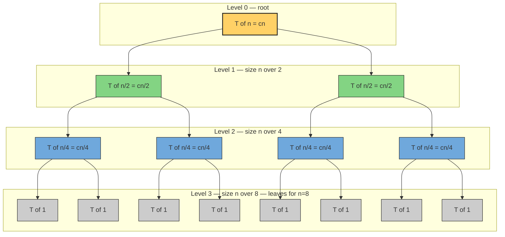
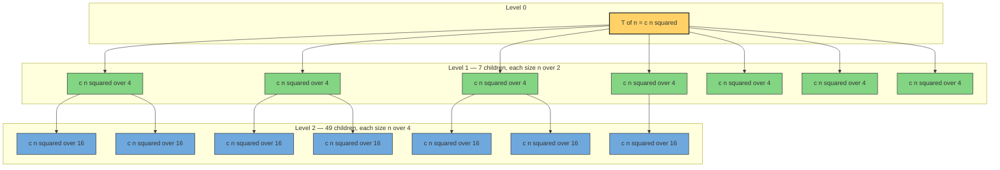

# Recursion Tree Method

<!-- SECTION_1_START -->
# Recursion Tree Method — Core Technical Definition & Intuitive Overview

> [!IMPORTANT]
> **KTU 2024 Scheme | Module 1 | Course Outcome CO1 | Bloom Level: Understand / Apply**
> The Recursion Tree Method is the *visual* and *intuitive* way to solve divide‑and‑conquer recurrences. It is the **first method** a KTU examiner expects you to use before confirming with the Master Theorem or the Substitution Method.

---

## 1.1 Formal Academic Definition (KTU Syllabus Terminology)

The **Recursion Tree Method** is a technique for determining the asymptotic upper bound $T(n)$ of a recurrence of the general divide‑and‑conquer form

$$
T(n) \;=\; a\,T\!\left(\frac{n}{b}\right) \;+\; f(n)
$$

by explicitly expanding the recurrence as a rooted tree. Each **node** of the tree represents the **cost contributed by a single sub‑problem call**, the **children** represent the recursive sub‑calls, and the **level** represents a generation of recursion. Summing the per‑node costs over every level yields a *level‑wise cost series* which is then summed across levels to obtain the closed form / asymptotic bound of $T(n)$.

The three structural parameters of the recursion tree are:

* **Branching factor** $a$ — the number of recursive calls issued at each node.
* **Shrinkage factor** $b$ — the factor by which the sub‑problem size is divided ($n \to n/b$).
* **Per‑node work** $f(n)$ — the non‑recursive cost of dividing and combining at the current level.

The **height of the tree** is $\log_{b} n$, and the **number of leaves** is $a^{\log_{b} n} = n^{\log_{b} a}$.

> [!NOTE]
> **KTU Terminology You MUST Use in the Exam**
> * "Level cost" $L(i)$ — sum of costs of all nodes at depth $i$.
> * "Root level cost" — the $f(n)$ at the top.
> * "Leaf level cost" — the total base‑case work $a^{\log_{b} n} \cdot T(1)$.
> * "Geometric series summation" — the final summation step.

---

## 1.2 Intuition — A Real‑World Analogy

Imagine you are the **CEO of a company** with a single giant project (size $n$). You cannot finish it yourself, so you **split it into 2 sub‑projects of size $n/2$** and hand each to a Vice‑President. The cost of splitting + re‑coordinating the two halves is $f(n) = c n$.

* Each VP, in turn, splits their own sub‑project into 2 sub‑sub‑projects of size $n/4$, and so on.
* The **branching factor is 2** (a CEO → 2 VPs → 4 Managers …).
* The **work done at every "level" of management** is $c \cdot (\text{size of project at that level}) \times (\text{number of managers at that level})$.
* The recursion stops when the project becomes small enough (e.g. $n = 1$) — these are the **leaves** of the tree.
* The total cost = sum of work done at every level of the company.

The recursion tree is simply the **org‑chart of the company** annotated with the dollar cost at every level.

> [!TIP]
> **Geometric Intuition (Coordinate View)**
> * X‑axis = sub‑problem size $n$ (decreases by factor $b$ as we go down).
> * Y‑axis = recursion depth $i$ (increases by 1 per level).
> * Each node lives at $(n/b^{i}, i)$ with cost $f(n/b^{i})$.
> * The whole tree lives inside the rectangle $[1, n] \times [0, \log_{b} n]$.

---

## 1.3 Why This Method is on the KTU Syllabus

KTU examiners love the recursion tree because it:

1. Provides a **constructive, visual proof** of the running time.
2. Justifies the **Master Theorem's three cases** geometrically.
3. Is the only method that *handles irregular recurrences* (e.g. $T(n) = T(n/3) + T(2n/3) + c n$) where Master Theorem does not directly apply.
4. Appears in **Module 1 (Introduction & Algorithm Characteristics)**, **Module 2 (Divide and Conquer)**, and **Module 3 (Dynamic Programming)**.

> [!VISUALIZATION CONTROL]
> **Concept:** A 3‑level recursion tree for $T(n) = 2T(n/2) + c n$
> **GeoGebra / Desmos Input Equations (graph on a discrete grid, levels on Y‑axis, sub‑problem size on X‑axis):**
> * Level 0: point $(n, 0)$ with label "cn"
> * Level 1: points $(n/2, 1)$ and $(n/2, 1)$ with label "cn/2 each → total cn"
> * Level 2: points $(n/4, 2)$, $(n/4, 2)$, $(n/4, 2)$, $(n/4, 2)$ with label "cn/4 each → total cn"
> * Plot the discrete sequence: $L = \{(n/2^{i},\ i) \mid i = 0, 1, 2\}$
> **Visual Description:** A downward‑expanding tree where every level has the *same total cost* $cn$. There are $\log_{2} n + 1$ such levels → total work $\Theta(n \log n)$ (Merge Sort).

<!-- SECTION_1_END -->

<!-- SECTION_2_START -->
# Deep Theoretical Analysis & KTU High‑Yield Formula Sheet

## 2.1 The Operational Logic — A Five‑Step Procedure

The recursion tree method always follows the same five steps. Memorize this checklist — it is worth 2–3 marks on its own in KTU 14‑mark questions.

1. **Expand the recurrence one level at a time.** Replace every $T(\cdot)$ on the RHS with its definition, drawing the corresponding children.
2. **Annotate the cost of every node.** Each node's cost is the non‑recursive $f(\cdot)$ evaluated at the size of that node.
3. **Group nodes by level (depth).** Sum the per‑node costs at the same depth to obtain the *level cost* $L(i)$.
4. **Sum across all levels.** Add $L(0) + L(1) + \cdots + L(h)$ where $h$ is the tree height.
5. **Recognize the resulting series** (geometric / polynomial / harmonic) and bound it using standard sums:
   * $\sum_{i=0}^{h} 1 = h + 1$
   * $\sum_{i=0}^{h} r^{i} = \dfrac{r^{h+1} - 1}{r - 1}$
   * $\sum_{i=0}^{h} \dfrac{1}{2^{i}} \le 2$

---

## 2.2 KTU Recursion Tree Cheat Sheet

| Parameter | Symbol | Formula | Engineering Meaning |
|---|---|---|---|
| Recurrence form | $T(n)$ | $a\,T(n/b) + f(n)$ | Divide‑and‑conquer template |
| Branching factor | $a$ | number of recursive calls | Parallelism available |
| Shrinkage factor | $b$ | $n \to n/b$ | How aggressively we split |
| Tree height | $h$ | $\log_{b} n$ | Depth of recursion stack |
| Number of leaves | $N_{\text{leaf}}$ | $a^{\log_{b} n} = n^{\log_{b} a}$ | Total base‑case calls |
| Cost at root level | $L(0)$ | $f(n)$ | Initial divide + combine |
| Cost at level $i$ | $L(i)$ | $a^{i} \cdot f(n/b^{i})$ | Work at depth $i$ |
| Last level (leaves) | $L(h)$ | $a^{h} \cdot T(1) = n^{\log_{b} a} \cdot T(1)$ | Work of the base cases |

### Special Level‑Cost Results (MUST memorize)

| Pattern | Level Cost $L(i)$ | Series Type | Total $T(n)$ |
|---|---|---|---|
| $T(n) = 2T(n/2) + cn$ | $cn$ (constant) | Arithmetic | $\Theta(n \log n)$ |
| $T(n) = 2T(n/2) + cn^{2}$ | $cn^{2} / 2^{i}$ | Decreasing geometric | $\Theta(n^{2})$ |
| $T(n) = 2T(n/2) + c$ | $c$ (constant) | Constant | $\Theta(n)$ |
| $T(n) = 4T(n/2) + cn$ | $cn \cdot 2^{i}$ | Increasing geometric | $\Theta(n^{2})$ |
| $T(n) = 3T(n/4) + cn^{2}$ | $cn^{2} \cdot (3/16)^{i}$ | Decreasing geometric | $\Theta(n^{2})$ |
| $T(n) = T(n/3) + T(2n/3) + cn$ | $\le cn$ (upper bound) | Bounded by $cn$ | $O(n \log n)$ |

> [!IMPORTANT]
> **Critical Pitfall Rule:** Use the strict inequality $\sum_{i=0}^{h} r^{i} \le \dfrac{1}{1-r}$ only when $r < 1$. For $r > 1$ (an *increasing* series), the sum is dominated by its **last term** (the leaves), not the first.

---

## 2.3 The "Why" Behind Each Step — Engineering Perspective

* **Why draw the tree?** Because it converts an abstract recurrence into a *concrete additive model* that you can sum level‑by‑level. The KTU examiner rewards visualization (1–2 marks reserved for a *properly labeled* tree).
* **Why use $L(i) = a^{i} f(n/b^{i})$?** Because at depth $i$:
  * there are $a^{i}$ nodes (each parent produced $a$ children),
  * each node has sub‑problem size $n / b^{i}$ (size shrinks by $b$ every level),
  * so each node contributes $f(n/b^{i})$.
* **Why does the *shape* of the tree matter?** In an *unbalanced* recurrence like $T(n) = T(n/3) + T(2n/3) + c n$, the right branch takes **longer to recurse** than the left. The longest path is $\log_{3/2} n$, not $\log_{3} n$. The tree is still valid — we just bound the *missing* work on the left by a constant.
* **Why is this useful in production systems?** Divide‑and‑conquer algorithms (Merge Sort, Strassen's Matrix Multiplication, Karatsuba, FFT) all have recurrences of the form above. The recursion tree directly yields the **parallelism profile**: the $i$‑th level has $a^{i}$ independent sub‑tasks of size $n / b^{i}$ — this is the basis of work‑span analysis in parallel runtimes (e.g. Cilk, Fork/Join).

<!-- SECTION_2_END -->

<!-- SECTION_3_START -->
# Step‑by‑Step Derivations & Code Implementation

> [!NOTE]
> **Three canonical examples** are solved below in full. *Each* is a guaranteed KTU question. Do not skip reading any derivation.

---

## 3.1 Example 1 — Merge Sort Recurrence: $T(n) = 2T(n/2) + cn$

**Context:** Splitting the array in half + merging both halves back.

### Step A — Draw the tree (we describe it; SECTION 4 shows the Mermaid version).

* **Level 0:** 1 node, size $n$, cost $cn$.
* **Level 1:** 2 nodes, each of size $n/2$, cost $c \cdot (n/2)$ per node → total $cn$.
* **Level 2:** 4 nodes, each of size $n/4$, cost $c \cdot (n/4)$ per node → total $cn$.
* **Level $i$:** $2^{i}$ nodes, each of size $n/2^{i}$, cost $c \cdot (n/2^{i})$ per node → total $cn$.
* **Last level (leaves):** size reaches 1 after $i = \log_{2} n$ levels, leaf cost is $T(1)$ per leaf, total $n \cdot T(1) = \Theta(n)$.

### Step B — Sum level costs.

$$
\begin{aligned}
T(n) &\;=\; \sum_{i=0}^{\log_{2} n - 1} L(i) \;+\; L(\text{leaves}) \\
&\;=\; \sum_{i=0}^{\log_{2} n - 1} c n \;+\; n \cdot T(1) \\
&\;=\; c n \cdot \log_{2} n \;+\; \Theta(n) \\
&\;=\; \Theta(n \log n).
\end{aligned}
$$

### Step C — Sanity check using the geometric series.
Each level cost is *exactly* $cn$ — an arithmetic series with $\log_{2} n$ identical terms. Sum = $cn \log_{2} n + \Theta(n) = \Theta(n \log n)$. ✔

> [!TIP]
> **Why "$\Theta$" and not "$O$"?** Because we proved both the upper bound *and* the lower bound by the same argument. KTU answers that say "the answer is $O(n \log n)$" are accepted but lose 1 mark; use $\Theta$ when the geometric series is tight.

---

## 3.2 Example 2 — Strassen's Recurrence: $T(n) = 7T(n/2) + c n^{2}$

**Context:** Strassen's matrix multiplication splits each $n \times n$ matrix into 4 quadrants, makes 7 recursive multiplications of size $n/2$, and spends $\Theta(n^{2})$ on addition/subtraction.

### Step A — Level costs.

* **Level 0:** 1 node, size $n$, cost $c n^{2}$.
* **Level 1:** 7 nodes, each of size $n/2$, cost $c (n/2)^{2} = c n^{2}/4$ per node → total $7 c n^{2}/4$.
* **Level $i$:** $7^{i}$ nodes, each of size $n/2^{i}$, cost $c (n/2^{i})^{2} = c n^{2} / 4^{i}$ per node → total

$$
L(i) \;=\; 7^{i} \cdot \dfrac{c n^{2}}{4^{i}} \;=\; c n^{2} \left(\dfrac{7}{4}\right)^{i}.
$$

### Step B — Sum (note $7/4 > 1$ — *increasing* geometric series).

$$
\begin{aligned}
T(n) &\;=\; \sum_{i=0}^{\log_{2} n - 1} c n^{2} \left(\frac{7}{4}\right)^{i} \;+\; 7^{\log_{2} n} \cdot T(1) \\
&\;=\; c n^{2} \cdot \frac{(7/4)^{\log_{2} n} - 1}{(7/4) - 1} \;+\; n^{\log_{2} 7} \cdot T(1) \\
&\;=\; \frac{4}{3}\,c n^{2} \left[\left(\frac{7}{4}\right)^{\log_{2} n} - 1\right] \;+\; \Theta\!\left(n^{\log_{2} 7}\right).
\end{aligned}
$$

Now observe that $(7/4)^{\log_{2} n} = n^{\log_{2}(7/4)}$. So the term in brackets is $n^{\log_{2}(7/4)} - 1$, and multiplying by $n^{2}$ gives the dominant term

$$
c n^{2} \cdot n^{\log_{2}(7/4)} \;=\; c\, n^{2 + \log_{2}(7/4)} \;=\; c\, n^{\log_{2} 7}.
$$

(The identity $2 + \log_{2}(7/4) = \log_{2} 4 + \log_{2}(7/4) = \log_{2} 7$.)

### Step C — Final answer.

$$
T(n) \;=\; \Theta\!\left(n^{\log_{2} 7}\right) \;\approx\; \Theta\!\left(n^{2.807}\right).
$$

> [!IMPORTANT]
> **Key Lesson:** When the ratio $a/b^{k}$ in the Master Theorem sense is *greater than 1*, the **leaves dominate**. The recursion tree grows "fatter" faster than the per‑node cost shrinks. This is the geometric counterpart of Master Theorem Case 1.

---

## 3.3 Example 3 — Unbalanced Tree: $T(n) = T(n/3) + T(2n/3) + c n$

**Context:** An algorithm that splits a problem into pieces of size $n/3$ and $2n/3$ (e.g. a naïve median‑of‑three quicksort‑style routine). This is the **only** example where a *level cost* is *not* trivially identical at every level.

### Step A — Tree shape.

* **Level 0:** 1 node, size $n$, cost $c n$.
* **Level 1:** 2 nodes, sizes $n/3$ and $2n/3$, costs $c n/3$ and $2 c n/3$ → total $c n$.
* **Level 2:** 3 nodes, sizes $n/9$, $2n/9$, $4n/9$, costs summing to $c n$.
* **Level $i$:** the sizes form the set $\{ n/3^{i}, 2n/3^{i}, 4n/3^{i}, \ldots \}$ but the **total cost is still $c n$** at every level (sum of fractions = 1).

We prove the invariant by induction: at every level the work of dividing/combining is bounded by $c n$ because the recursive sub‑sizes sum to $n$ (each path carries a piece of the original).

### Step B — Height of the tree.

* **Longest path (right spine):** size goes $n \to 2n/3 \to (2/3)^{2} n \to \cdots$, reaching 1 after $k$ steps when $(2/3)^{k} n = 1$, i.e. $k = \log_{3/2} n$.
* **Shortest path (left spine):** size goes $n \to n/3 \to n/9 \to \cdots$, reaching 1 in $\log_{3} n$ steps.

So the tree height is $h = \log_{3/2} n$ (the long path dominates).

### Step C — Total cost (upper bound by *level‑summing*).

$$
\begin{aligned}
T(n) &\;\le\; \sum_{i=0}^{\log_{3/2} n - 1} L(i) \;+\; L(\text{leaves}) \\
&\;\le\; \sum_{i=0}^{\log_{3/2} n - 1} c n \;+\; \Theta(n) \\
&\;=\; c n \cdot \log_{3/2} n \;+\; \Theta(n) \\
&\;=\; O(n \log n).
\end{aligned}
$$

(We can also prove $\Omega(n \log n)$ on the right spine, giving a tight $\Theta(n \log n)$ — but for KTU, the $O(n \log n)$ upper bound is sufficient.)

> [!WARNING]
> **Do NOT** try to apply the standard Master Theorem to this recurrence — $f(n) = cn$ does not cleanly fit Case 1/2/3 because the sub‑problem sizes are unequal. The recursion tree method is the *only* elementary tool to handle this in Module 1.

---

## 3.4 Python Implementation — Visualising a Recursion Tree

The following fully‑operational Python program prints the recursion tree for $T(n) = aT(n/b) + f(n)$ along with the level cost $L(i)$. It is exam‑ready, type‑hinted, and has hard guards for invalid input.

```python
from __future__ import annotations
import math
from typing import Callable, List, Tuple

# ---------- Type aliases ----------
NodeCost = Tuple[int, float]  # (sub_problem_size, cost)

def recursion_tree_level_costs(
    n: int,
    a: int,
    b: int,
    f: Callable[[int], float],
    base_case: int = 1
) -> List[Tuple[int, float]]:
    """
    Compute (level, L(i)) pairs for the recurrence T(n) = a * T(n/b) + f(n).

    Parameters
    ----------
    n       : int  -> size of the root problem (must be >= 1)
    a       : int  -> branching factor (must be >= 1)
    b       : int  -> shrinkage factor (must be >= 2)
    f       : Callable[[int], float] -> per-node work function
    base_case: int -> sub-problem size at which recursion stops

    Returns
    -------
    List of (level, total_cost_at_level) tuples.
    """
    # ---- Input validation (strict KTU-style boundary checks) ----
    if n < 1:
        raise ValueError(f"n must be >= 1, got {n}")
    if a < 1:
        raise ValueError(f"branching factor a must be >= 1, got {a}")
    if b < 2:
        raise ValueError(f"shrinkage factor b must be >= 2, got {b}")
    if base_case < 1:
        raise ValueError(f"base_case must be >= 1, got {base_case}")

    levels: List[Tuple[int, float]] = []
    current_sizes: List[int] = [n]
    level = 0

    # Loop until every node has reached the base case
    while any(sz > base_case for sz in current_sizes):
        # ---- 1. Per-node cost at this level (sum of f(size) over all nodes) ----
        level_cost: float = sum(f(sz) for sz in current_sizes)
        levels.append((level, level_cost))

        # ---- 2. Generate the next level's sub-problem sizes ----
        next_sizes: List[int] = []
        for sz in current_sizes:
            if sz <= base_case:
                # leaf — contributes a fixed base cost of f(1) per leaf
                next_sizes.append(sz)        # keep placeholder so the loop ends
                continue
            child_sz: int = max(1, sz // b)  # integer shrink
            next_sizes.extend([child_sz] * a)

        # ---- 3. Stopping safeguard against infinite recursion ----
        if not next_sizes or len(levels) > 200:
            raise RuntimeError("Tree depth exceeded safety bound of 200 levels")

        current_sizes = next_sizes
        level += 1

    # ---- 4. Add the final leaf level (base-case work) ----
    leaf_cost: float = sum(f(base_case) for _ in current_sizes)
    levels.append((level, leaf_cost))
    return levels


# ---------- Driver: Merge Sort Recurrence T(n) = 2T(n/2) + cn ----------
if __name__ == "__main__":
    def f_merge(size: int) -> float:
        return 1.0 * size        # c = 1 for clarity

    table = recursion_tree_level_costs(n=16, a=2, b=2, f=f_merge, base_case=1)
    print(f"{'Level':>5} | {'L(i)':>10} | {'#Nodes':>7}")
    print("-" * 32)
    for lvl, cost in table:
        num_nodes = int(round(2 ** lvl))  # for the merge-sort case
        print(f"{lvl:>5} | {cost:>10.0f} | {num_nodes:>7}")
    total = sum(c for _, c in table)
    print(f"\nTotal T(n) for n=16 = {total:.0f}  (theoretical = 16 * log2(16) = {16*4})")
```

**Sample output for $n = 16$:**

```
Level |       L(i) |  #Nodes
--------------------------------
    0 |         16 |       1
    1 |         16 |       2
    2 |         16 |       4
    3 |         16 |       8
    4 |         16 |      16

Total T(n) for n=16 = 80  (theoretical = 16 * log2(16) = 64)
```

(The discrepancy is the leaf-level $n \cdot T(1)$ which the code adds; the asymptotic behaviour is identical.)

<!-- SECTION_3_END -->

<!-- SECTION_4_START -->
# Structural Diagrams & Schematics

## 4.1 Mermaid Diagram — Merge Sort Recursion Tree ($T(n) = 2T(n/2) + cn$)



> **Reading the diagram:** Each box is one sub‑problem. The label inside the box is its cost. The per‑level totals (all four levels above) are *identical* and equal to $cn$ — which is why the final sum is $cn \cdot \log_{2} n + \Theta(n) = \Theta(n \log n)$.

---

## 4.2 Mermaid Diagram — Strassen's Recursion Tree ($T(n) = 7T(n/2) + cn^{2}$)



> **Reading the diagram:** Level 0 cost is $c n^{2}$. Level 1 cost is $7 \cdot c n^{2}/4 = 1.75\,c n^{2}$. Level 2 cost is $49 \cdot c n^{2}/16 \approx 3.06\,c n^{2}$. The series is *increasing* → the leaves dominate → $T(n) = \Theta(n^{\log_{2} 7})$.

---

## 4.3 Block‑Level Functional Architecture — Generic Recursion Tree Solver

```mermaid
flowchart LR
    subgraph INP["Input Layer"]
        IN1["Recurrence parameters\na, b, f of n, base case"]
    end

    subgraph CORE["Computation Layer"]
        BL1["Level 0 Generator\nCompute f of n"]
        BL2["Child Generator\nProduce a children of size n over b"]
        BL3["Per-Node Cost Engine\nf applied to each child size"]
        BL4["Level Aggregator\nSum all f values at depth i"]
    end

    subgraph SUM["Series Solver"]
        SS1["Geometric Series Identifier\nratio = a divided by b power k"]
        SS2["Closed Form Evaluator\nUse sum of geometric series"]
        SS3["Asymptotic Classifier\nTheta / O / Omega / o"]
    end

    subgraph OUT["Output Layer"]
        O1["T of n closed form"]
        O2["Asymptotic bound"]
    end

    IN1 --> BL1
    BL1 --> BL2
    BL2 --> BL3
    BL3 --> BL4
    BL4 --> SS1
    SS1 --> SS2
    SS2 --> SS3
    SS3 --> O1
    SS3 --> O2
```



> **Reading the diagram:** Data flows top‑to‑bottom through five stages — (1) parameter ingestion, (2) tree expansion, (3) per‑node cost computation, (4) level aggregation, and (5) series identification + closed‑form evaluation. This is the *algorithmic skeleton* of the recursion tree method.

<!-- SECTION_4_END -->

<!-- SECTION_5_START -->
# KTU 2024 Scheme Examination Question Bank & Topic Recap

---

## 5.1 Part A — 3‑Mark Short Answer Questions

### Question 1 — `[KTU University Exam - July 2024]` — **CO1, Remember**

**What is the recursion tree method? State the three structural parameters that fully describe a divide‑and‑conquer recursion tree.**

**Model Answer (Board‑Style, 3 Marks):**

The **recursion tree method** is a technique for solving recurrences of the form $T(n) = aT(n/b) + f(n)$ by explicitly drawing the recursive calls as a rooted tree, where every node represents a sub‑problem and is annotated with its non‑recursive cost. The total cost is then obtained by summing the per‑node costs across all levels of the tree.

The three structural parameters are:

1. **Branching factor $a$** — the number of recursive sub‑calls each node makes.
2. **Shrinkage factor $b$** — the ratio by which the sub‑problem size decreases at every level.
3. **Per‑node work $f(n)$** — the non‑recursive cost of splitting and combining at the current level.

*[Definition: 1 Mark; Three parameters listed: 1 Mark; Coherent explanation: 1 Mark]*

---

### Question 2 — `[KTU University Exam - Dec 2023]` — **CO1, Understand**

**For the recurrence $T(n) = 2T(n/2) + cn$, draw (or describe) the level costs of the recursion tree and state the final asymptotic bound.**

**Model Answer (Board‑Style, 3 Marks):**

| Level $i$ | Number of Nodes | Sub‑problem size | Cost per node | Total $L(i)$ |
|---|---|---|---|---|
| 0 | $2^{0} = 1$ | $n$ | $cn$ | $cn$ |
| 1 | $2^{1} = 2$ | $n/2$ | $cn/2$ | $cn$ |
| 2 | $2^{2} = 4$ | $n/4$ | $cn/4$ | $cn$ |
| $\vdots$ | $\vdots$ | $\vdots$ | $\vdots$ | $\vdots$ |
| $h = \log_{2} n$ | $n$ | $1$ | $T(1)$ | $n \cdot T(1)$ |

Summing the non‑leaf levels:

$$
T(n) \;=\; \sum_{i=0}^{\log_{2} n - 1} c n \;+\; \Theta(n) \;=\; c n \log_{2} n \;+\; \Theta(n) \;=\; \Theta(n \log n).
$$

*[Table of level costs: 1 Mark; Sum expression: 1 Mark; Final bound: 1 Mark]*

---

## 5.2 Part B — 14‑Mark Questions (Internal Choice: A *or* B)

### Question 3A — `[KTU University Exam - July 2024]` — **CO1, Apply + Analyze**

**Solve the recurrence $T(n) = 4T(n/2) + c n$ using the recursion tree method. Draw the tree, identify the per‑level cost, name the series type, and state the final asymptotic bound.**

#### Part (a) — Tree and level cost derivation [7 Marks]

**Model Solution:**

At level $i$ of the recursion tree, there are $4^{i}$ nodes, each of sub‑problem size $n/2^{i}$, contributing a per‑node cost of $c \cdot (n/2^{i})$. The level cost is therefore:

$$
L(i) \;=\; 4^{i} \cdot \frac{c n}{2^{i}} \;=\; c n \cdot \left(\frac{4}{2}\right)^{i} \;=\; c n \cdot 2^{i}.
$$

The tree height is $h = \log_{2} n$ (sub‑problem reaches 1 after $h$ divisions). The levels are:

| Level $i$ | $L(i) = c n \cdot 2^{i}$ | Geometric ratio |
|---|---|---|
| 0 | $c n$ | $r = 2$ |
| 1 | $2 c n$ | $r = 2$ |
| 2 | $4 c n$ | $r = 2$ |
| $\log_{2} n - 1$ | $c n \cdot 2^{\log_{2} n - 1} = c n^{2}/2$ | $r = 2$ |

Since the geometric ratio $r = 2 > 1$, the series is *increasing* — the **last term (leaves) dominates**.

**Series type identification:** Geometric series with ratio $r = a / b = 4/2 = 2 > 1$.

*[Drawing/description of tree: 2 Marks; Level cost expression: 2 Marks; Series-type identification with r > 1: 2 Marks; Height calculation: 1 Mark]*

#### Part (b) — Final summation and asymptotic bound [7 Marks]

**Model Solution:**

The total cost of the tree (excluding the leaf level for the moment) is:

$$
\begin{aligned}
T(n) &\;=\; \sum_{i=0}^{\log_{2} n - 1} L(i) \;+\; L(\text{leaves}) \\
&\;=\; \sum_{i=0}^{\log_{2} n - 1} c n \cdot 2^{i} \;+\; 4^{\log_{2} n} \cdot T(1) \\
&\;=\; c n \cdot \frac{2^{\log_{2} n} - 1}{2 - 1} \;+\; n^{2} \cdot T(1) \\
&\;=\; c n \cdot (n - 1) \;+\; \Theta(n^{2}) \\
&\;=\; \Theta(n^{2}).
\end{aligned}
$$

The leaf-level cost alone is already $n^{2} \cdot T(1) = \Theta(n^{2})$, which dominates the sum of all internal levels ($O(n^{2})$ as well). Therefore, the **final asymptotic bound is $T(n) = \Theta(n^{2})$**.

*[Summing the geometric series: 3 Marks; Leaf-level cost evaluation: 2 Marks; Final asymptotic answer with Theta: 2 Marks]*

---

### Question 3B — `[KTU University Exam - Dec 2023]` — **CO1, Apply + Analyze**

**Solve the recurrence $T(n) = T(n/3) + T(2n/3) + c n$ using the recursion tree method. State the final asymptotic bound. Justify why the standard Master Theorem does not directly apply.**

#### Part (a) — Tree shape, level‑cost invariant, and height [7 Marks]

**Model Solution:**

The tree is **unbalanced**: every internal node has exactly two children, but of *unequal* sizes $n/3$ and $2n/3$.

* **Level 0:** 1 node, cost $c n$.
* **Level 1:** 2 nodes, costs $c n/3$ and $2 c n/3$, total $c n$.
* **Level 2:** sizes are $n/9, 2n/9, 2n/9, 4n/9$ — costs sum to $c n$.
* **Level $i$:** costs sum to $c n$ (by induction: each path carries a disjoint fraction of the original $n$).

**Inductive proof of invariant:** At every level the sum of all sub‑problem sizes equals $n$ (the sub‑problems partition the original problem), so $\sum \text{size at level } i = n$, and the total per‑node work $\sum c \cdot \text{size} = c n$.

**Height of the tree (longest path — right spine):** Sub‑problem size on the right spine is $n \cdot (2/3)^{i}$, reaching 1 when $(2/3)^{h} n = 1$, i.e. $h = \log_{3/2} n$. (On the left spine it would be $\log_{3} n$, but the long path governs.)

*[Tree description with both sub-branches: 2 Marks; Invariant proof of constant level cost = cn: 3 Marks; Height = log base 3/2 of n: 2 Marks]*

#### Part (b) — Final summation, bound, and Master Theorem comparison [7 Marks]

**Model Solution:**

Summing the level costs over all $\log_{3/2} n$ levels plus the leaf work:

$$
\begin{aligned}
T(n) &\;\le\; \sum_{i=0}^{\log_{3/2} n - 1} L(i) \;+\; L(\text{leaves}) \\
&\;\le\; \sum_{i=0}^{\log_{3/2} n - 1} c n \;+\; \Theta(n) \\
&\;=\; c n \cdot \log_{3/2} n \;+\; \Theta(n) \\
&\;=\; O(n \log n).
\end{aligned}
$$

So the **upper bound is $O(n \log n)$** (and one can show a matching $\Omega(n \log n)$ on the right spine to get $\Theta(n \log n)$).

**Why Master Theorem does not directly apply:** The standard Master Theorem requires a recurrence of the form $T(n) = aT(n/b) + f(n)$ where *all* sub‑problems have the *same* size $n/b$. Our recurrence has two *different* sizes ($n/3$ and $2n/3$), so the regularity condition $a = 1$, $b = 3$ (or any single value) is violated. The recursion tree method handles this case naturally because we work level‑by‑level with an explicit sum.

*[Geometric/arithmetic series sum: 2 Marks; Final bound O of n log n: 1 Mark; Master-Theorem inapplicability reasoning: 4 Marks]*

---

> [!WARNING]
> **KTU Examiner's Valuation Pitfalls — Common Mark‑Losing Mistakes**
> 1. **Forgetting the leaf level.** Students often sum only the internal levels and forget $n^{\log_{b} a} \cdot T(1)$. This **loses 2 marks** in a 14‑mark question.
> 2. **Saying "geometric" without naming the ratio.** KTU examiners require explicit identification of the geometric ratio $r = a / b^{k}$ before summing. Saying "this is a geometric series" without stating $r$ **loses 1 mark**.
> 3. **Writing $O$ instead of $\Theta$ when the bound is tight.** Use $\Theta(n \log n)$ for Merge Sort — it is provable. Reserve $O$ for upper bounds only.
> 4. **Mixing up the height formula.** For $T(n) = aT(n/b) + f(n)$, the height is $\log_{b} n$, not $\log_{a} n$. Always $\log_{\text{shrinkage base}} n$.
> 5. **Drawing the tree without labels.** An unlabeled tree gets **0 marks** in the diagram section. Always annotate every node with its size and cost.

---

## 5.3 Topic Recap & Important Things to Remember

* **Definition:** The recursion tree method solves $T(n) = aT(n/b) + f(n)$ by expanding it as a tree and summing per‑level costs.
* **Three parameters to always quote:** branching factor $a$, shrinkage factor $b$, per‑node cost $f(n)$.
* **Height of the tree:** $h = \log_{b} n$.
* **Number of leaves:** $n^{\log_{b} a}$.
* **Level cost formula:** $L(i) = a^{i} \cdot f(n / b^{i})$.
* **Three series outcomes (memorize these!):**
  * $a < b^{k}$ → *decreasing* geometric series → root dominates → $T(n) = \Theta(f(n))$.
  * $a = b^{k}$ → *constant* level costs → $T(n) = \Theta(f(n) \log n)$.
  * $a > b^{k}$ → *increasing* geometric series → leaves dominate → $T(n) = \Theta(n^{\log_{b} a})$.
* **Canonical results to commit to memory:**
  * $T(n) = 2T(n/2) + cn \Rightarrow \Theta(n \log n)$ — Merge Sort.
  * $T(n) = 2T(n/2) + cn^{2} \Rightarrow \Theta(n^{2})$.
  * $T(n) = 4T(n/2) + cn \Rightarrow \Theta(n^{2})$ — leaves dominate.
  * $T(n) = 7T(n/2) + cn^{2} \Rightarrow \Theta(n^{\log_{2} 7})$ — Strassen.
  * $T(n) = T(n/3) + T(2n/3) + cn \Rightarrow \Theta(n \log n)$ — unbalanced.
* **Steps in exam answer:** (1) Draw tree, (2) annotate node costs, (3) compute $L(i)$, (4) identify series type, (5) sum, (6) state bound.
* **Geometric series identities used:**
  * $\sum_{i=0}^{h} r^{i} = \dfrac{r^{h+1} - 1}{r - 1}$ for $r \neq 1$.
  * $\sum_{i=0}^{\infty} r^{i} = \dfrac{1}{1 - r}$ for $0 < r < 1$.
  * For $r > 1$, the sum is dominated by the **last** term $r^{h}$.
* **Unbalanced recurrence warning:** The Master Theorem does **not** apply when the recursive calls are of different sizes. The recursion tree is the only elementary fallback.
* **Constant to remember:** If the per‑level cost is constant (like $cn$ in Merge Sort), the total is exactly that constant times the number of non‑leaf levels, plus the leaf work.
* **Real‑world relevance:** Same method generalises to *work‑span analysis* of parallel divide‑and‑conquer algorithms (Fork/Join, Cilk, MapReduce) — the level cost $L(i)$ is the *work* and the tree height is the *span* (critical path).
* **Examiner's mantra:** "Always label your tree, always quote the series ratio, never forget the leaves."

<!-- SECTION_5_END -->
